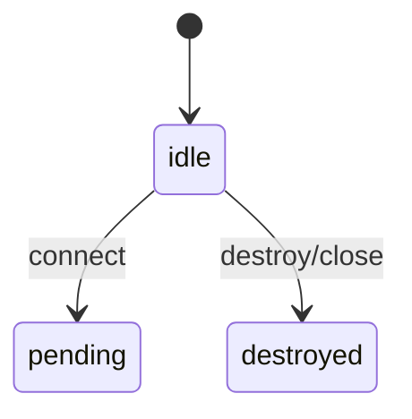

# Inventory — Cursor (myphonecheck repo + local)
- 작성: Cursor (WO-DISCOVERY-001)
- 작성 시각: 2026-04-23 09:04
- 스캔 대상: `C:\Users\user\Dev\ollanvin\myphonecheck` ; 형제 폴더 `C:\Users\user\Dev\ollanvin\*` (repo 트리 제외)
- 총 파일 수: **Markdown 1764** (= repo 67 + 로컬 형제 트리 1697) · **repo 설정·CI 인덱스 145** (섹션 1 하단 목록)

## 1. myphonecheck repo 인벤토리

- 총 .md 파일 수: **67**

### core/common/FREEZE.md
- 크기: 541 bytes
- 마지막 커밋: `d470a739631cf663e731509db780e929062fa276` (2026-04-22 20:01:30 +0900)
- 헤더:
  - # core/common Contract Freeze Declaration
  - ## Frozen Contracts
  - ## Verification
  - ## PR policy
- 발췌 (최대 30줄):
```
# core/common Contract Freeze Declaration

Freeze Date: 2026-04-22 (Stage 0)
Freeze Version: v1.6.1-contract-frozen

## Frozen Contracts

1. IdentifierType sealed class (3 subclasses)
2. RiskKnowledge interface
3. Checker generic interface
4. DecisionEngineContract interface
5. RiskLevel, DamageEstimate, DamageType, SearchEvidence

## Verification

FreezeMarkerTest validates structure. Failure means contract change (MAJOR review).

## PR policy

Changes under core/common/src/main should include FREEZE-ACK in commit message or PR body.

```
- 요약: core/common Contract Freeze Declaration

### docs/00_governance/docs-index.md
- 크기: 3194 bytes
- 마지막 커밋: `1426473569e76a7c81af68ae208e2ebf32e770cd` (2026-04-15 07:13:01 +0900)
- 헤더:
  - # MyPhoneCheck Android Project
  - ## Project Structure
  - ### Core Modules
  - ### Feature Modules
  - ### Data Modules
  - ### Build Logic
  - ## Technology Stack
  - ## Setup
  - ### Prerequisites
  - ### Configuration
  - ### Build
  - ### Debug
  - ### Release
  - ## Permissions
  - ## Architecture
  - ## Testing
  - ## Code Style
  - ## Version Management
- 발췌 (최대 30줄):
```
# MyPhoneCheck Android Project

A multi-module Android application for intelligent call verification and decision making using Kotlin, Jetpack Compose, and Hilt dependency injection.

## Project Structure

### Core Modules
- **core:model** - Domain models and data classes
- **core:util** - Utility functions (phone number normalization, time utilities, Result wrapper)

### Feature Modules
- **feature:call-intercept** - Call interception and screening logic
- **feature:device-evidence** - Device-based evidence collection
- **feature:search-enrichment** - Search-based enrichment logic
- **feature:decision-engine** - Core decision making engine
- **feature:decision-ui** - UI for displaying decisions
- **feature:settings** - User settings screens
- **feature:billing** - In-app billing and subscription management
- **feature:country-config** - Country-specific configurations

### Data Modules
- **data:contacts** - Contact data access
- **data:calllog** - Call log data access
- **data:sms** - SMS data access
- **data:search** - Search results data access
- **data:local-cache** - Local database caching with Room

### Build Logic
- **build-logic:convention** - Gradle convention plugins for consistent configuration

```
- 요약: MyPhoneCheck Android Project

### docs/00_governance/patches/PATCH_v1.7.md
- 크기: 947 bytes
- 마지막 커밋: `289126a94a66389412c514a6f690f5918f7484e7` (2026-04-23 07:57:40 +0900)
- 헤더:
  - # Architecture Patch v1.7
  - ## Patch 30 — 가격 $2.49 단일화
  - ## Patch 31 — PushCheck 재정의 (푸시 휴지통)
  - ## Patch 32 — Mic/Camera 외부 이벤트 (트리거형)
  - ## Patch 33 — 검색 3축 명문화
  - ## Patch 34 — RiskLevel 매퍼 정책
  - ## 이전 버전 대비 삭제 항목
- 발췌 (최대 30줄):
```
# Architecture Patch v1.7

**기준**: v1.6.1 (Patch 23~28 통합)
**패치 ID**: v1.7
**적용일**: 2026-04-22
**발행자**: 비전
**반영자**: Claude Code (WO-GOV-005)
**승인**: 대표님 (founder@idolab.ai)

## Patch 30 — 가격 $2.49 단일화
Base §11 가격 조항 변경, PRD §13 가격 참조로 전환.

## Patch 31 — PushCheck 재정의 (푸시 휴지통)
SPEC v2.1 §3.3 P6 폐기, 푸시 휴지통 모델로 대체.

## Patch 32 — Mic/Camera 외부 이벤트 (트리거형)
Base §6.3-6.4에 외부 보안 사고 이력 표시 추가. 폴링 배치 금지.

## Patch 33 — 검색 3축 명문화
global-single-core-system.md에 L1/L2/L3 모델 추가.

## Patch 34 — RiskLevel 매퍼 정책
project-governance.md에 이중 타입 정책 추가.

## 이전 버전 대비 삭제 항목
- Base §11: "약 1.5달러 수준" 조항
- PRD §13: "USD 1/month" 조항
- SPEC v2.1 §3.3: P6 "통계 + 차단 CTA" 전체 섹션

```
- 요약: Architecture Patch v1.7

### docs/00_governance/project-governance.md
- 크기: 9206 bytes
- 마지막 커밋: `289126a94a66389412c514a6f690f5918f7484e7` (2026-04-23 07:57:40 +0900)
- 헤더:
  - # Project Governance
  - ## Scope
  - ## Constitution Source
  - ## Fixed Project Principles
  - ## Documentation Standard
  - ## In-repo architecture charter
  - ## v1.5.1 빌드 이력
  - ## v1.5.2 빌드 이력
  - ## v1.5.3 빌드 이력
  - ## v1.6.0 빌드 이력
  - ## v1.6.1 빌드 이력
  - ### v1.5.3 참고
  - ### 결함 원인 및 방지
  - ### v1.5.2 추가 방지
- 발췌 (최대 30줄):
```
# Project Governance

## Scope

MyPhoneCheck is a project governed by the shared constitution repository and by this project-level applied governance.

This repository stores:

- applied project rules
- project architecture records
- implementation and validation documents
- project history

It does not store the cross-project constitution itself.

## Constitution Source

- Constitution repository local path: `C:\Users\user\Dev\ollanvin\web`
- Constitution repository remote: `https://github.com/ollanvin/web`
- Constitution document baseline: `CONSTITUTION.md`

MyPhoneCheck must align to the constitution repository, but project-specific implementation documents remain inside this repository only.

## Fixed Project Principles

- MyPhoneCheck is a 190-country shared single-core system.
- Country-specific feature branching is prohibited in the global core.
- The fixed layers are `Global Core`, `Country Policy Layer`, and `Presentation Layer`.
- `CallCheck Core Engine` is the only judgment core.
- `MessageCheck` is an extension path into the same core, not an independent engine.
```
- 요약: Project Governance

### docs/01_architecture/global-single-core-system.md
- 크기: 3181 bytes
- 마지막 커밋: `289126a94a66389412c514a6f690f5918f7484e7` (2026-04-23 07:57:40 +0900)
- 헤더:
  - # Global Single Core System
  - ## System Definition
  - ## Global Core
  - ## Search Evidence — 3축 모델 (2026-04-22)
  - ## Country Policy Layer
  - ## Presentation Layer
  - ## Single Core Judgment Rule
  - ## MessageCheck Position
  - ## PushCheck Position
  - ## Country Branching Ban
- 발췌 (최대 30줄):
```
# Global Single Core System

## System Definition

MyPhoneCheck is fixed as one global system that can scale across 190 countries without country-specific core branching.

The architecture is organized into three layers:

1. Global Core
2. Country Policy Layer
3. Presentation Layer

## Global Core

The global core owns only globally shared behavior:

- identifier analysis
- call and SMS shared decision pipeline
- search evidence handling
- number profile persistence
- quick labels
- detail tags
- search status
- action memory
- on-device storage

The global core must not contain country-specific `if/else` feature behavior.

## Search Evidence — 3축 모델 (2026-04-22)

```
- 요약: Global Single Core System

### docs/01_architecture/legacy/ARCHITECTURE_ONDEVICE_SEARCH.md
- 크기: 4663 bytes
- 마지막 커밋: `1426473569e76a7c81af68ae208e2ebf32e770cd` (2026-04-15 07:13:01 +0900)
- 헤더:
  - # MyPhoneCheck 온디바이스 검색 아키텍처
  - ## 헌법 (절대 원칙)
  - ## 확정 구조
  - ## 수정 내역 (이번 작업)
  - ### 1. 삭제된 파일
  - ### 2. 신규 생성 파일
  - ### 3. 구조 변경
  - ## Fallback 구조
  - ## UI 의미 노출 원칙
  - ### 금지 (절대 하지 않음)
  - ### 허용 (의미만 표시)
  - ## 검색 엔진별 스크래핑 전략
  - ### Google (`GoogleScrapingSearchProvider`)
  - ### Naver (`NaverScrapingSearchProvider`)
  - ### Baidu (`BaiduScrapingSearchProvider`)
  - ## 타임아웃 구조
  - ## 한 줄 결론
- 발췌 (최대 30줄):
```
# MyPhoneCheck 온디바이스 검색 아키텍처

## 헌법 (절대 원칙)

- **서버 없음**
- **중앙 요청 없음**
- **공용 API 의존 없음**
- **비용 발생 없음**
- **사용자 수 증가와 비용 무관**

검색은 API가 아니라 **"디바이스가 직접 하는 행위"**다.

---

## 확정 구조

```
MyPhoneCheck App
 ├─ Device Evidence (로컬)
 │    ├─ 연락처 DB
 │    ├─ 통화 이력
 │    ├─ SMS 메타데이터
 │    └─ 사용자 태그/메모
 │
 ├─ On-Device Web Scan (직접 HTTP)
 │    ├─ Google 스크래핑 (google.com/search?q=번호)
 │    ├─ Naver 스크래핑 (search.naver.com/search.naver?query=번호)
 │    ├─ Baidu 스크래핑 (baidu.com/s?wd=번호)
 │    └─ HTML 수신 → 텍스트 추출 → 의미 분석
 │
```
- 요약: MyPhoneCheck 온디바이스 검색 아키텍처

### docs/01_architecture/myphonecheck_base_architecture_v1.md
- 크기: 8460 bytes
- 마지막 커밋: `289126a94a66389412c514a6f690f5918f7484e7` (2026-04-23 07:57:40 +0900)
- 헤더:
  - # MyPhoneCheck Base Architecture v1
  - ## 2. Purpose
  - ## 3. Product Definition
  - ## 4. Core Philosophy
  - ## 5. Information Architecture
  - ## 6. Unit Architecture
  - ### 6.1 Call Check
  - ### 6.2 Message Check
  - ### 6.3 Mic Check
  - ### 6.4 Camera Check
  - ## 7. Tag System
  - ## 8. Initial Scan Model
  - ## 9. Layered Architecture
  - ## 10. Global Expansion Model
  - ## 11. Subscription Model
  - ## 12. Architectural Principles
  - ## 13. Open Questions / To Be Developed Next
  - ## Document Control
- 발췌 (최대 30줄):
```
# MyPhoneCheck Base Architecture v1

## 2. Purpose

이 문서는 MyPhoneCheck 제품의 **기준(base) 아키텍처**를 선언한다. 대표님 구두 합의와 구조화된 정리본을 단일 출처로 묶으며, 이후 디벨롭·문서·검증의 **상위 기준**으로 사용한다.

이 문서는 구현 상세나 코드 레벨 설계를 규정하지 않는다. 제품·시스템 아키텍처 레벨에서의 합의를 고정한다.

---

## 3. Product Definition

MyPhoneCheck는 **모르는 전화번호·문자 발신 번호**에 대해 사용자가 **즉시 판단**할 수 있도록 돕는 **결정 지원(decision-support)** 앱이다.

앱은 **네 가지 체크 유닛**으로 구성된다.

- Call Check  
- Message Check  
- Mic Check  
- Camera Check  

Google Play Console 지원 **190개국 이상 동시 론칭**을 목표로 한다.

---

## 4. Core Philosophy

- 앱은 **증거를 모아** 사용자가 **받을지 말지** 결정하게 돕는다.
- 앱은 **최종 결정을 대신하지 않는다.**
- **외부 검색 결과**와 **내부 디바이스 이력**을 요약해 **판단 근거**를 제공한다.
```
- 요약: MyPhoneCheck Base Architecture v1

### docs/01_architecture/stage1_research/01_current_state.md
- 크기: 9765 bytes
- 마지막 커밋: `96471c6d8c1c09a871befbfd511674bda334e79e` (2026-04-22 21:11:46 +0900)
- 헤더:
  - # Stage 1 사전 조사 — 현재 상태 (`01_current_state.md`)
  - ## 1. `settings.gradle.kts` 모듈 인벤토리
  - ## 2. `core:common` 패키지·계약 인벤토리
  - ## 3. `core:model` 동명·유사 타입 인벤토리
  - ### 3-1. `RiskLevel` (4단계)
  - ### 3-2. `SearchEvidence` (의사결정용 검색 신호 모델)
  - ## 4. 두 타입 계열의 구체적 차이
  - ### 4-1. `RiskLevel`
  - ### 4-2. `SearchEvidence`
  - ## 5. `project-governance.md` — "Stage" 정의 위치 및 인용
  - ## 6. `PRD_CALLCHECK_V1.md` — "Stage" 정의 위치 및 인용
  - ### 6-1. 제품 Stage vs 코딩 Stage 구분
  - ## 7. 미해결 질문 (본 파일 범위)
- 발췌 (최대 30줄):
```
# Stage 1 사전 조사 — 현재 상태 (`01_current_state.md`)

인코딩: UTF-8 (BOM 없음), 줄바꿈 LF.  
근거: `settings.gradle.kts`, `core/common/src/main/kotlin/**`, `core/model/src/main/kotlin/**`, `docs/00_governance/project-governance.md`, `docs/02_product/specs/PRD_CALLCHECK_V1.md`. Git 미사용.

---

## 1. `settings.gradle.kts` 모듈 인벤토리

`rootProject.name = "MyPhoneCheck"`. `include`된 Gradle path와 대응 `build.gradle.kts` 위치:

| Gradle path | 빌드 스크립트 |
|-------------|----------------|
| `:app` | `app/build.gradle.kts` |
| `:core:common` | `core/common/build.gradle.kts` |
| `:core:model` | `core/model/build.gradle.kts` |
| `:core:util` | `core/util/build.gradle.kts` |
| `:core:security` | `core/security/build.gradle.kts` |
| `:feature:call-intercept` | `feature/call-intercept/build.gradle.kts` |
| `:feature:device-evidence` | `feature/device-evidence/build.gradle.kts` |
| `:feature:search-enrichment` | `feature/search-enrichment/build.gradle.kts` |
| `:feature:decision-engine` | `feature/decision-engine/build.gradle.kts` |
| `:feature:decision-ui` | `feature/decision-ui/build.gradle.kts` |
| `:feature:settings` | `feature/settings/build.gradle.kts` |
| `:feature:billing` | `feature/billing/build.gradle.kts` |
| `:feature:country-config` | `feature/country-config/build.gradle.kts` |
| `:feature:message-intercept` | `feature/message-intercept/build.gradle.kts` |
| `:feature:privacy-check` | `feature/privacy-check/build.gradle.kts` |
| `:data:contacts` | `data/contacts/build.gradle.kts` |
| `:data:calllog` | `data/calllog/build.gradle.kts` |
```
- 요약: Stage 1 사전 조사 — 현재 상태 (`01_current_state.md`)

### docs/01_architecture/stage1_research/02_module_candidates.md
- 크기: 8044 bytes
- 마지막 커밋: `96471c6d8c1c09a871befbfd511674bda334e79e` (2026-04-22 21:11:46 +0900)
- 헤더:
  - *(no # headings detected)*
- 발췌 (최대 30줄):
```
# Stage 1 research: module candidates after core:common

Sources: `project-governance.md`, `settings.gradle.kts`, `build.gradle.kts` dependency graph, `feature/decision-engine` tests and packages, `core/model` types, `core/common` contracts.

---

## 1. Module candidate list

| Candidate | Role |
|-----------|------|
| `:feature:decision-engine` | Natural home for `DecisionEngineContract` implementation; already central in the feature graph. |
| New JVM or Android module (e.g. `:core:engine-impl`) | If governance wants implementation isolated from Android/Hilt surface. **Not present today.** |
| `:data:local-cache` | Persists encrypted Room data; **does not** implement `Checker` / `DecisionEngineContract`; heavy Kapt/Room stack. |
| `:feature:device-evidence` / `:feature:search-enrichment` | Likely **Checker**-style sources per `DecisionEngineContract` comments; today depend only on `:core:model`, not `:core:common`. |
| Other `:core:*` | `:core:model`, `:core:util`, `:core:security` exist; **none** depend on `:core:common` yet. |

Governance text reviewed here defines **Stage 0** (`:core:common`) only; it does **not** name the next coding module. `DecisionEngineContract.kt` comments point to a future **Stage 1** engine implementation (source: contract file, not `project-governance.md`).

---

## 2. Candidate analysis table

| Module | Current state | Depends on core:common? | Fit for Stage 1 (coding) | Evidence |
|--------|---------------|-------------------------|---------------------------|----------|
| `:feature:decision-engine` | Android library, Hilt, tests use `DecisionEngineImpl` and **`app.myphonecheck.mobile.core.model`** types | No | **High**   single orchestration point; aligns with contract name `DecisionEngineContract` | `build.gradle.kts`; `DecisionEngineImplTest.kt` imports `core.model` |
| New `:core:engine-impl` (hypothetical) | N/A | Would be first dedicated impl module | **Medium High** if layering rules require JVM-pure or Android-isolated impl | Not in `settings.gradle.kts` |
| `:feature:device-evidence` | Evidence aggregation from contacts/call log/SMS | No | **Medium**   candidate **Checker** implementation surface | `project()` deps |
| `:feature:search-enrichment` | Uses `:data:search`, cache | No | **Medium**   search path for `SearchEvidence` / sourcing | `project()` deps |
| `:data:local-cache` | Room + SQLCipher + Hilt; schema tests | No | **Lower for contract impl**; **higher for build hygiene** (Kapt/sqlite-jdbc on Windows) | `audit_stage0_hotfix_java17_20260422.md` |
| `:core:model` | Domain types (`RiskLevel`, `SearchEvidence`, etc.) | No | **Support only**   must reconcile with `core.common` types (see escalation in chat summary) | `core/model/.../RiskLevel.kt` vs `core/common/.../RiskLevel.kt` |
```
- 요약:  Stage 1 research: module candidates after core:common

### docs/01_architecture/stage1_research/03_dependency_audit.md
- 크기: 10552 bytes
- 마지막 커밋: `96471c6d8c1c09a871befbfd511674bda334e79e` (2026-04-22 21:11:46 +0900)
- 헤더:
  - *(no # headings detected)*
- 발췌 (최대 30줄):
```
# Stage 1 research: dependency audit

Sources: `gradle/libs.versions.toml`, `gradle/wrapper/gradle-wrapper.properties` (Gradle 8.6), `docs/05_quality/audit_stage0_hotfix_java17_20260422.md`, web search snapshots (Kotlin / AGP / Paparazzi), Maven license pages where standard (Apache 2.0 for AndroidX / many Square / JetBrains artifacts).

**No `build.gradle.kts` or catalog edits were made.**

---

## 1. Full `libs.versions.toml` inventory

### [versions]

`kotlin`, `agp`, `compileSdk`, `minSdk`, `targetSdk`, `androidx-core`, `androidx-lifecycle`, `androidx-activity`, `androidx-compose-bom`, `androidx-navigation`, `androidx-hilt-navigation`, `hilt`, `room`, `coroutines`, `libphonenumber`, `okhttp`, `play-billing`, `play-services-base`, `gson`, `datastore`, `work-runtime`, `hilt-work`, `documentfile`, `sqlcipher`, `sqlite-ktx`, `security-crypto`, `junit`, `junit-jupiter`, `kotest`, `androidx-test-ext-junit`, `androidx-test-espresso`, `mockk`, `turbine`.

Pinned examples: `kotlin = "2.0.0"`, `agp = "8.4.0"`, `compileSdk = "34"`, `room = "2.6.1"`, `hilt = "2.51.1"`, `okhttp = "4.12.0"`, `security-crypto = "1.1.0-alpha06"`.

### [libraries]

All entries alias Maven coordinates: Kotlin stdlib/reflect, AndroidX (core, appcompat, lifecycle, activity, compose BOM + ui/material3/navigation), Hilt android/compiler, Room runtime/compiler/ktx, coroutines (core/android/play-services), libphonenumber, okhttp, Play services/billing, junit / junit-jupiter / kotest / androidx test / mockk / turbine, WorkManager, Gson, DataStore, DocumentFile, SQLCipher, sqlite-ktx, security-crypto, android/kotlin Gradle plugins.

### [bundles]

`androidx-compose`, `androidx-lifecycle`, `hilt`.

### [plugins]

`kotlin-jvm`, `kotlin-android`, `kotlin-kapt`, `kotlin-compose`, `android-application`, `android-library`, `hilt`.

---

```
- 요약:  Stage 1 research: dependency audit

### docs/01_architecture/stage1_research/04_test_strategy.md
- 크기: 6718 bytes
- 마지막 커밋: `96471c6d8c1c09a871befbfd511674bda334e79e` (2026-04-22 21:11:46 +0900)
- 헤더:
  - *(no # headings detected)*
- 발췌 (최대 30줄):
```
# Stage 1 research: test strategy draft

Sources: glob of `**/src/test/**/*.kt`, `**/src/androidTest/**`, `core/common/build.gradle.kts`, `data/search/build.gradle.kts` (`testOptions` / category excludes), `docs/05_quality/audit_stage0_hotfix_java17_20260422.md`, `.github/workflows/android-ci.yml`.

---

## 1. Current test structure

### 1-1. `src/test` (JVM unit tests)

Present in (non-exhaustive file counts from glob):

- `:core:common`   **4** classes: `CheckerContractTest`, `FreezeMarkerTest`, `IdentifierTypeTest`, `RiskKnowledgeContractTest`
- `:core:util`   **4** files
- `:data:search`   **12** files (includes network/integration style tests; `LiveNetworkTest` category excluded in Gradle)
- `:data:local-cache`   **1** file (`UserCallRecordSchemaTest`)
- `:feature:country-config`   **8** files (some path duplicates in glob   verify after filter-repo)
- `:feature:decision-engine`   **2** files (`DecisionEngineImplTest`, `RealWorldFailureScenarioTest`)

**`:app`:** no `src/test` tree found.

### 1-2. `src/androidTest` (instrumented)

**No Kotlin (or other) sources** under `src/androidTest` in the working tree, despite many modules declaring `androidTestImplementation` (Espresso, androidx junit).

### 1-3. core:common test count

Stage 0 audit (`docs/05_quality/audit_stage0_hotfix_java17_20260422.md`): **20** tests, **0** failures, JUnit XML from four suites. (Not 21.)

### 1-4. Test stack split
```
- 요약:  Stage 1 research: test strategy draft

### docs/01_architecture/stage1_research/05_ci_cd_roadmap.md
- 크기: 7822 bytes
- 마지막 커밋: `96471c6d8c1c09a871befbfd511674bda334e79e` (2026-04-22 21:11:46 +0900)
- 헤더:
  - *(no # headings detected)*
- 발췌 (최대 30줄):
```
# Stage 1 research: CI/CD roadmap

Sources: `.github/workflows/android-ci.yml`, `.github/workflows/contract-freeze-check.yml` (UTF-8 text as read via Python), `docs/05_quality/audit_stage0_hotfix_java17_20260422.md` (remote tracking notes).

---

## 1. Current CI workflow inventory

### `android-ci.yml`

| Field | Value |
|-------|-------|
| **Triggers** | `push` to `main`, `pull_request` to `main` |
| **Runner** | `ubuntu-latest` |
| **Jobs** | Single job `build` |
| **Steps** | checkout; setup **JDK 17** Temurin; `android-actions/setup-android@v3` (platform 34, build-tools 34.0.0); chmod `gradlew`; `./gradlew compileDebugKotlin`; `./gradlew testDebugUnitTest` |

### `contract-freeze-check.yml`

| Field | Value |
|-------|-------|
| **Triggers** | `pull_request` with paths `core/common/**` or `.github/workflows/contract-freeze-check.yml` |
| **Runner** | `ubuntu-latest` |
| **Jobs** | `verify-freeze` |
| **Steps** | checkout; JDK 17 Temurin; chmod `gradlew`; `./gradlew :core:common:test --no-daemon` |

**Audit note:** Historically reported that `core/common` and this workflow could be **untracked** on remote; Vision / repo owner to confirm post filter-repo. Locally, workflow content is valid UTF-8 YAML.

---

```
- 요약:  Stage 1 research: CI/CD roadmap

### docs/02_product/specs/GLOBAL_CASE_COVERAGE_V1.md
- 크기: 10469 bytes
- 마지막 커밋: `1426473569e76a7c81af68ae208e2ebf32e770cd` (2026-04-15 07:13:01 +0900)
- 헤더:
  - # MyPhoneCheck Global Case Coverage Report V1
  - ## 1. 번호 유형별 기대 동작
  - ### 1.1 저장된 연락처 (Saved Contact)
  - ### 1.2 미저장 번호 — 통화 기록 있음
  - ### 1.3 미저장 번호 — 통화 기록 없음 (첫 수신)
  - ### 1.4 비공개/차단 번호 (Private/Blocked)
  - ### 1.5 긴급번호
  - ### 1.6 짧은 번호 (Short Codes)
  - ### 1.7 국제 전화
  - ## 2. 수정 내역
  - ### 2.1 PhoneNumberNormalizer (core/util)
  - ### 2.2 MyPhoneCheckScreeningService (feature/call-intercept)
  - ### 2.3 DecisionEngineImpl (feature/decision-engine)
  - ### 2.4 CountryConfigProviderImpl (feature/country-config)
  - ## 3. 191개국 대응 전략
  - ### 3.1 국가 감지 우선순위
  - ### 3.2 키워드 사전 커버리지
  - ### 3.3 V2 확장 계획
  - ## 4. 엣지 케이스 처리 매트릭스
  - ## 5. Confidence 체계 (정보 부재 반영)
  - ## 6. 검증 체크리스트
- 발췌 (최대 30줄):
```
# MyPhoneCheck Global Case Coverage Report V1

**작성일**: 2026-03-27
**대상 버전**: MyPhoneCheck 1.0
**범위**: 191개국 동시 출시 기준 전수 검증

---

## 1. 번호 유형별 기대 동작

### 1.1 저장된 연락처 (Saved Contact)

| 시나리오 | Relationship Score | Risk Score | Category | RiskLevel | Action |
|---|---|---|---|---|---|
| 저장 연락처, 위험 신호 없음 | 1.0 | 0.0 | KNOWN_CONTACT | LOW | SAFE_LIKELY |
| 저장 연락처, 스팸 신호 있음 | 1.0 | 0.025 (0.25×0.1) | KNOWN_CONTACT | LOW | SAFE_LIKELY |
| 저장 연락처, **스캠 신호 있음** | 1.0 | 0.04 (0.40×0.1) | **SCAM_RISK_HIGH** | **LOW** | **CAUTION** |

**설계 근거 (V1.1 수정)**: 저장 연락처는 기본적으로 최우선 category. 단, **스푸핑 방어**: 검색에서 강한 스캠 신호(hasScamSignal)가 감지된 경우 KNOWN_CONTACT가 아닌 SCAM_RISK_HIGH로 분류. 번호 스푸핑 시나리오(연락처 "엄마"지만 실제 사기범)에서 사용자를 보호. risk score는 0.1배 감쇄 유지되므로 RiskLevel은 LOW지만, category가 SCAM_RISK_HIGH이므로 ActionMapper에서 CAUTION 이상을 반환.

### 1.2 미저장 번호 — 통화 기록 있음

| 시나리오 | Relationship Score | Risk Score | Category | RiskLevel |
|---|---|---|---|---|
| 발신 3회 이상 + 장통화 | 0.55~0.70 | 0.0 | BUSINESS_LIKELY | LOW |
| 수신만 1회, 통화 연결됨 | 0.10 | 0.0 | INSUFFICIENT_EVIDENCE | UNKNOWN |
| 수신만, 거절 2회 이상 | 0.0 | 0.10 | INSUFFICIENT_EVIDENCE→SALES_SPAM | UNKNOWN→LOW |
| 짧은 통화 3회+, 장통화 없음 | 0.10~0.25 | 0.10 | (search에 따라) | LOW~MEDIUM |

### 1.3 미저장 번호 — 통화 기록 없음 (첫 수신)
```
- 요약: MyPhoneCheck Global Case Coverage Report V1

### docs/02_product/specs/PRD_CALLCHECK_V1.md
- 크기: 9902 bytes
- 마지막 커밋: `289126a94a66389412c514a6f690f5918f7484e7` (2026-04-23 07:57:40 +0900)
- 헤더:
  - # MyPhoneCheck 1.0 — Product Requirements Document
  - ## 1. Product Definition
  - ## 2. Core User Promise
  - ## 3. Non-Negotiable Rules
  - ## 4. Decision Flow (3-Stage Engine)
  - ### Stage 1: Saved Check
  - ### Stage 2: Device Evidence Analysis
  - ### Stage 3: Search Platform Enrichment
  - ## 5. Device Evidence Model
  - ## 6. Search Evidence Model
  - ## 7. Decision Output Model
  - ## 8. Decision Rules (v1.0)
  - ### KNOWN_CONTACT
  - ### BUSINESS_LIKELY
  - ### DELIVERY_LIKELY
  - ### INSTITUTION_LIKELY
  - ### SALES_SPAM_SUSPECTED
  - ### SCAM_RISK_HIGH
  - ### INSUFFICIENT_EVIDENCE
  - ## 9. UI Structure
  - ### Decision Card (main surface)
  - ### Settings Screen
  - ### Paywall Screen
  - ## 10. Timing Budget
  - ## 11. Technical Architecture
- 발췌 (최대 30줄):
```
# MyPhoneCheck 1.0 — Product Requirements Document

## 1. Product Definition

**App Name:** MyPhoneCheck
**Domain:** callcheck.app
**Package:** app.myphonecheck.mobile
**Platform:** Android only (iOS excluded)
**Tagline:** "Decide before you answer"
**Price:** USD 1/month, single global plan, no ads
**Scope:** 190 countries simultaneous launch

MyPhoneCheck is an Android-only incoming-call decision app.
When an incoming phone number is NOT saved on the device, the app intercepts the call,
analyzes on-device evidence first, enriches with search-platform evidence second,
and shows a decision card within 3 seconds so the user can choose: Answer / Reject / Block.

This is NOT a caller-ID database app.
This is NOT a search app.
This is a **decision-support app**.

---

## 2. Core User Promise

"모르는 번호, 받기 전에 먼저 체크"
"Decide before you answer."

---

```
- 요약: MyPhoneCheck 1.0 — Product Requirements Document

### docs/03_engineering/build_reports/P1_BUILD_FIX_REPORT.md
- 크기: 5429 bytes
- 마지막 커밋: `0a2dc555ace94f25cb91d67ced5ef141b9af1e40` (2026-04-15 07:20:50 +0900)
- 헤더:
  - # P1 빌드 환경 정리 리포트
  - ## 수정 요약
  - ### 1. libs.versions.toml — OkHttp 4.12.0 추가
  - ### 2. Kotlin 2.0.0 + Compose Compiler 호환성 해결
  - ### 3. AndroidManifest.xml 정리
  - ### 4. DI 바인딩 갭 해결
  - ### 5. call-intercept 모듈 의존성 추가
  - ### 6. SettingsScreen.kt 미사용 import 제거
  - ### 7. 구모델 참조 전체 스캔 — 98개 파일 클린
  - ## DI 의존성 체인 (완전성 검증)
  - ## 대표님 로컬 빌드 가이드
  - # 1. Gradle wrapper 생성 (최초 1회)
  - # 2. local.properties 설정
  - # 3. 빌드
  - ## 변경 파일 목록
- 발췌 (최대 30줄):
```
# P1 빌드 환경 정리 리포트

일시: 2026-03-24
작성: 비전 (AI Agent)

---

## 수정 요약

### 1. libs.versions.toml — OkHttp 4.12.0 추가
- `data:search` 모듈의 `GenericWebSearchProvider`가 OkHttp를 사용하는데 version catalog에 누락되어 있었음
- `versions` 섹션에 `okhttp = "4.12.0"` 추가
- `libraries` 섹션에 `okhttp` 라이브러리 정의 추가
- `data/search/build.gradle.kts`에 `implementation(libs.okhttp)` 추가

### 2. Kotlin 2.0.0 + Compose Compiler 호환성 해결
- **문제**: Kotlin 2.0.0과 Compose Compiler 1.5.11은 호환되지 않음 (1.5.x는 Kotlin 1.9.x 전용)
- **해결**: Kotlin 2.0의 공식 방식인 Compose Compiler Gradle Plugin으로 전환
  - `libs.versions.toml`에서 `androidx-compose-compiler` version 삭제
  - `kotlin-compose` 플러그인 추가 (`org.jetbrains.kotlin.plugin.compose`)
  - 4개 Compose 모듈에 `alias(libs.plugins.kotlin.compose)` 적용
  - 4개 모듈에서 `composeOptions { kotlinCompilerExtensionVersion }` 블록 삭제
- **대상 모듈**: `app`, `feature:decision-ui`, `feature:settings`, `feature:billing`

### 3. AndroidManifest.xml 정리
- `MyPhoneCheckContentProvider` 선언 삭제 — 구현 클래스가 존재하지 않음
- `CallActionReceiver`에서 `exported="true"` → `exported="false"` — 내부 전용 리시버이므로 외부 노출 불필요
- `CallActionReceiver`의 `intent-filter` 삭제 — exported=false이므로 intent-filter가 모순
- `CallScreeningService`에서 `android.telecom.InCallService` 액션 삭제 — CallScreeningService에는 해당 액션이 부적절

```
- 요약: P1 빌드 환경 정리 리포트

### docs/03_engineering/build_reports/RINGING_VISIBILITY_REPORT.md
- 크기: 7983 bytes
- 마지막 커밋: `0a2dc555ace94f25cb91d67ced5ef141b9af1e40` (2026-04-15 07:20:50 +0900)
- 헤더:
  - # MyPhoneCheck 1.0 — Ringing 중 가시성 검증 리포트
  - ## 1. 검증 결과
  - ### 테스트 환경
  - ### 화면 캡처 결과
  - ### 결론
  - ## 2. 현재 구조의 한계
  - ## 3. 업계 정석 해법
  - ### Truecaller / Whoscall / Hiya 공통 패턴: SYSTEM_ALERT_WINDOW 오버레이
  - ### 기술 요구사항
  - ### Android 버전별 전략
  - ## 4. 수정안: CallerIdOverlayManager
  - ### 아키텍처
  - ### CallerIdOverlayManager 설계
  - ### 권한 요청 흐름 (앱 첫 실행 시)
  - ### Notification은 유지 (fallback)
  - ## 5. 전화 종료 시 오버레이 제거
  - ### 방법 1: PhoneStateListener (deprecated but works)
  - ### 방법 2: TelecomManager CallState callback (API 31+)
  - ### 방법 3: onDestroy() 활용 (현재 가능)
  - ## 6. 구현 우선순위
- 발췌 (최대 30줄):
```
# MyPhoneCheck 1.0 — Ringing 중 가시성 검증 리포트

## 1. 검증 결과

### 테스트 환경
- Pixel 에뮬레이터 (AOSP, Android 14)
- MyPhoneCheck Notification: PRIORITY_HIGH, CATEGORY_CALL, colorized

### 화면 캡처 결과

**알림 패널을 내린 상태:**
- Incoming Call UI (상단) + MyPhoneCheck Notification (바로 아래) 동시 표시 ✅
- "위험 높음 / 스팸/사기 위험 높음 / 자세히·거절·차단" 모두 보임

**알림 패널을 내리지 않은 상태 (일반 사용자 기본 화면):**
- 전화 앱 전체화면 UI만 표시
- MyPhoneCheck 결과 **전혀 안 보임** ❌
- 상태바에 아이콘만 표시 (인지 불가)

### 결론
> **판정은 ringing 중에 완료되지만, 사용자 인지는 ringing 중에 보장되지 않음**

---

## 2. 현재 구조의 한계

| 문제 | 설명 |
|------|------|
| 전체화면 가림 | Android 인커밍콜 UI가 전체화면을 차지, Notification 안 보임 |
| 패널 내림 필요 | 사용자가 직접 알림 패널을 내려야 결과 확인 가능 |
```
- 요약: MyPhoneCheck 1.0 — Ringing 중 가시성 검증 리포트

### docs/03_engineering/DO_NOT_MISS_IMPLEMENTATION.md
- 크기: 7026 bytes
- 마지막 커밋: `028880372188bb1ce709d1d6adf5f3aafe11350a` (2026-04-15 22:44:41 +0900)
- 헤더:
  - # DO_NOT_MISS User Action Implementation
  - ## Overview
  - ## How It Works
  - ### Data Model
  - ### Rule Priority
  - ## Implementation Details
  - ### Repository Layer
  - ### View Model Layer
  - ### Action Receiver Layer
  - ## Usage Paths
  - ### Path 1: Message/SMS UI
  - ### Path 2: Broadcast Intent (Notification/Overlay)
  - ### Path 3: Direct Repository Call (Programmatic)
  - ## UI Integration Status
  - ### Message UI ✅
  - ### Call Overlay (Optional)
  - ### Notification (Optional)
  - ## Data Persistence
  - ## Next Incoming Call/SMS Flow
  - ## Backward Compatibility
  - ## Testing Checklist
  - ## Future Enhancements
  - ## Files Modified
  - ## Usage Example
  - ### In Message UI ViewModel or Activity:
- 발췌 (최대 30줄):
```
# DO_NOT_MISS User Action Implementation

## Overview

Users can now mark a number as DO_NOT_MISS to ensure the next incoming call or SMS reflects maximum importance (ImportanceLevel.DO_NOT_MISS).

## How It Works

### Data Model

**NumberProfileEntity** (already existing):
- `doNotMissFlag: Boolean` — Tracks if number is marked as DO_NOT_MISS
- `blockState: String` — Maps to NumberProfileBlockState (NONE, BLOCKED, DO_NOT_BLOCK)

**When user marks a number as DO_NOT_MISS:**
1. `NumberProfileRepository.toggleDoNotMiss(number)` is called
2. This toggles the blockState between NONE and DO_NOT_BLOCK
3. DO_NOT_BLOCK state becomes ActionState.DO_NOT_BLOCK in the decision engine
4. Decision engine returns ImportanceLevel.DO_NOT_MISS for next call/SMS

### Rule Priority
The decision engine checks DO_NOT_BLOCK first (highest priority):
```
if (actionState == ActionState.DO_NOT_BLOCK)
    → ImportanceLevel.DO_NOT_MISS
```

This ensures marked numbers are always shown as DO_NOT_MISS regardless of other signals.

## Implementation Details
```
- 요약: DO_NOT_MISS User Action Implementation

### docs/03_engineering/IMPORTANCE_AXIS_IMPLEMENTATION.md
- 크기: 9523 bytes
- 마지막 커밋: `028880372188bb1ce709d1d6adf5f3aafe11350a` (2026-04-15 22:44:41 +0900)
- 헤더:
  - # Importance Axis Implementation
  - ## Overview
  - ### Core Concept
  - ## Implementation Status
  - ### ✅ Completed
  - ## Importance Rules
  - ### Rule 1: User-Marked DO_NOT_BLOCK
  - ### Rule 2: Saved Contact
  - ### Rule 3: High Repeated Interaction
  - ### Rule 4: Medium Repeated Interaction
  - ### Rule 5: Default
  - ## Data Flow
  - ### Call Lifecycle
  - ### SMS Lifecycle
  - ## Testing
  - ### Unit Tests Added
  - ## Architecture Notes
  - ### No UI Redesign
  - ### Backward Compatibility
  - ### Performance
  - ### Storage (SMS)
  - ## Usage in UI
  - ### Overlay Display (Call Intercept)
  - ### Message Storage (SMS Intercept)
  - ## Future Enhancements
- 발췌 (최대 30줄):
```
# Importance Axis Implementation

## Overview

The Importance Axis has been successfully introduced and integrated into the MyPhoneCheck decision engine. This axis is **independent from risk assessment** and determines how critical it is for the user to not miss an interaction.

### Core Concept

- **Risk Axis**: How dangerous is this interaction? (0.0–1.0)
- **Relationship Axis**: How well-known is this contact? (0.0–1.0)
- **Importance Axis**: How much should the user not miss this? (UNKNOWN, NORMAL, IMPORTANT, DO_NOT_MISS)

## Implementation Status

### ✅ Completed

1. **ImportanceLevel Enum** (`core/model/src/main/kotlin/.../ImportanceLevel.kt`)
   - `UNKNOWN` - No importance rule matched
   - `NORMAL` - Repeated interaction (3–7 interactions)
   - `IMPORTANT` - High-value interactions (8+ calls/texts OR saved contact)
   - `DO_NOT_MISS` - User explicitly marked DO_NOT_BLOCK

2. **DecisionResult Extension** (`core/model/src/main/kotlin/.../DecisionResult.kt`)
   - Added field: `importanceLevel: ImportanceLevel = ImportanceLevel.UNKNOWN`
   - Added field: `importanceReason: String = ""`
   - Updated fallback: Provides safe defaults

3. **Decision Engine Logic** (`feature/decision-engine/src/main/kotlin/.../DecisionEngineImpl.kt`)
   - `determineImportance()` method evaluates rules in priority order:
     1. **DO_NOT_BLOCK Action State** → `DO_NOT_MISS`
```
- 요약: Importance Axis Implementation

### docs/03_engineering/index/FILE_INDEX.md
- 크기: 7264 bytes
- 마지막 커밋: `1426473569e76a7c81af68ae208e2ebf32e770cd` (2026-04-15 07:13:01 +0900)
- 헤더:
  - # MyPhoneCheck Android Project - Complete File Index
  - ## Root Build Configuration (5 files)
  - ## Project Documentation (3 files)
  - ## Version Control (1 file)
  - ## Build Logic / Convention Plugins (5 files)
  - ## App Module (12 files)
  - ### Build Configuration
  - ### Manifest & Resources
  - ### Kotlin Source (Main App)
  - ### Navigation
  - ### Theme (Compose UI)
  - ### ProGuard Configuration
  - ## Core Modules (2 modules, 12 files)
  - ### core:model (9 files)
  - ### core:util (3 files)
  - ## Feature Modules (8 modules, 8 build files)
  - ## Data Modules (5 modules, 5 build files)
  - ## Dependency Statistics
  - ### Direct Dependencies (via libs.versions.toml)
  - ### Version Catalog Entries
  - ## Gradle Configuration Highlights
  - ### SDK Versions
  - ### Plugins Applied
  - ### Features Enabled
  - ## Architecture Patterns Implemented
- 발췌 (최대 30줄):
```
# MyPhoneCheck Android Project - Complete File Index

Total Files Created: 52

## Root Build Configuration (5 files)
- `build.gradle.kts` - Root build configuration with plugin management
- `settings.gradle.kts` - Module declarations (15 modules included)
- `gradle.properties` - JVM and Gradle optimization settings
- `gradle/libs.versions.toml` - Centralized dependency catalog (100+ versions)
- `local.properties.template` - Template for SDK path configuration

## Project Documentation (3 files)
- `README.md` - Complete project documentation
- `SETUP_COMPLETE.md` - Setup completion report
- `FILE_INDEX.md` - This file

## Version Control (1 file)
- `.gitignore` - Android, IDE, and build artifacts exclusions

## Build Logic / Convention Plugins (5 files)
```
build-logic/
├── settings.gradle.kts
└── convention/
    ├── build.gradle.kts
    └── src/main/kotlin/
        ├── AndroidApplicationConventionPlugin.kt
        ├── AndroidLibraryConventionPlugin.kt
        └── AndroidComposeConventionPlugin.kt
```
```
- 요약: MyPhoneCheck Android Project - Complete File Index

### docs/03_engineering/integration/IMPLEMENTATION_SUMMARY.md
- 크기: 15030 bytes
- 마지막 커밋: `1426473569e76a7c81af68ae208e2ebf32e770cd` (2026-04-15 07:13:01 +0900)
- 헤더:
  - # MyPhoneCheck Android - Settings, Billing, and CountryConfig Implementation
  - ## Overview
  - ## Module 1: Billing Feature
  - ### Files Created (731 lines)
  - #### 1. BillingManager.kt (285 lines)
  - #### 2. SubscriptionState.kt (9 lines)
  - #### 3. PaywallViewModel.kt (54 lines)
  - #### 4. PaywallScreen.kt (360 lines)
  - #### 5. BillingModule.kt (23 lines)
  - ### Build Configuration
  - ## Module 2: Settings Feature
  - ### Files Created (836 lines)
  - #### 1. AppSettings.kt (10 lines)
  - #### 2. SettingsRepository.kt (61 lines)
  - #### 3. SettingsViewModel.kt (118 lines)
  - #### 4. SettingsScreen.kt (623 lines)
  - #### 5. SettingsModule.kt (24 lines)
  - ### Build Configuration
  - ## Module 3: CountryConfig Feature
  - ### Files Created (598 lines)
  - #### 1. CountryConfig.kt (20 lines)
  - #### 2. KeywordDictionary.kt (16 lines)
  - #### 3. UiStrings.kt (41 lines)
  - #### 4. CountryConfigProvider.kt (9 lines)
  - #### 5. CountryConfigProviderImpl.kt (492 lines)
- 발췌 (최대 30줄):
```
# MyPhoneCheck Android - Settings, Billing, and CountryConfig Implementation

## Overview

Complete production-ready implementation of three critical feature modules for the MyPhoneCheck Android application:

1. **Billing Module** - Google Play Billing integration with subscription management
2. **Settings Module** - User preferences and permission management
3. **CountryConfig Module** - Multi-country configuration and localization

**Total Implementation**: 2,165 lines of code across 16 complete Kotlin files

## Module 1: Billing Feature

### Files Created (731 lines)

#### 1. BillingManager.kt (285 lines)
**Path**: `feature/billing/src/main/kotlin/app/callcheck/mobile/feature/billing/BillingManager.kt`

Complete Google Play Billing implementation with:
- **Subscription Plan**: Single "myphonecheck_monthly" at USD 1/month
- **BillingClient Connection**: Full lifecycle management with state listener
- **Purchase Flow**: Launch billing flow for subscription purchase
- **Purchase Acknowledgment**: Automatic acknowledgment handling
- **Restore Purchases**: Recovery of previously purchased subscriptions
- **Status Tracking**: Real-time subscription state via StateFlow

Key Features:
- Uses BillingClient 7.x API (latest)
- Coroutine-based async operations
```
- 요약: MyPhoneCheck Android - Settings, Billing, and CountryConfig Implementation

### docs/03_engineering/integration/INTEGRATION_GUIDE.md
- 크기: 9556 bytes
- 마지막 커밋: `1426473569e76a7c81af68ae208e2ebf32e770cd` (2026-04-15 07:13:01 +0900)
- 헤더:
  - # MyPhoneCheck Android - Integration Guide
  - ## Quick Start
  - ### 1. Add to Navigation
  - ### 2. Billing Integration in Main Activity
  - ### 3. Country Detection on Launch
  - ### 4. Settings in Decision Engine
  - ## Module Dependencies
  - ## Feature Usage Examples
  - ### Billing - Check Subscription Status
  - ### Settings - Update User Preference
  - ### Country Config - Get Keywords for Spam Detection
  - ### Country Config - Get Localized Strings
  - ## Manifest Permissions
  - ## Testing Examples
  - ### Test Billing Manager
  - ### Test Settings Repository
  - ### Test Country Detection
  - ## Common Patterns
  - ### Pattern 1: Apply Settings to Decision Engine
  - ### Pattern 2: Show Paywall if Not Subscribed
  - ### Pattern 3: Respect User Evidence Display Preference
  - ## Configuration
  - ### Enable/Disable Modules
  - ### Add New Search Provider
  - ### Customize Paywall
- 발췌 (최대 30줄):
```
# MyPhoneCheck Android - Integration Guide

## Quick Start

### 1. Add to Navigation

```kotlin
// In MyPhoneCheckNavHost.kt
composable("settings") {
    SettingsScreen()
}

composable("paywall") {
    PaywallScreen()
}
```

### 2. Billing Integration in Main Activity

```kotlin
class MainActivity : ComponentActivity() {
    override fun onCreate(savedInstanceState: Bundle?) {
        super.onCreate(savedInstanceState)

        // Initialize billing manager on app start
        val billingManager: BillingManager by inject()
        billingManager.initialize()

        setContent {
            MyPhoneCheckTheme {
```
- 요약: MyPhoneCheck Android - Integration Guide

### docs/03_engineering/integration/README_IMPLEMENTATION.md
- 크기: 9070 bytes
- 마지막 커밋: `1426473569e76a7c81af68ae208e2ebf32e770cd` (2026-04-15 07:13:01 +0900)
- 헤더:
  - # MyPhoneCheck Android - Settings, Billing & CountryConfig Implementation
  - ## Quick Overview
  - ## What's Implemented
  - ### 1. Billing Module (feature/billing/)
  - ### 2. Settings Module (feature/settings/)
  - ### 3. CountryConfig Module (feature/country-config/)
  - ## Key Features
  - ## Directory Structure
  - ## Getting Started
  - ### 1. View the Documentation
  - ### 2. Integrate in Your App
  - ### 3. Configure in Google Play Console
  - ### 4. Add Manifest Permissions
  - ## Code Examples
  - ### Billing - Check Subscription Status
  - ### Settings - Get User Preferences
  - ### CountryConfig - Use Keywords for Detection
  - ## Testing
  - ### Unit Test Billing
  - ### Unit Test Settings
  - ### Integration Test Country Detection
  - ## Architecture
  - ### State Management
  - ### Theme
  - ### Localization
- 발췌 (최대 30줄):
```
# MyPhoneCheck Android - Settings, Billing & CountryConfig Implementation

## Quick Overview

This implementation provides three complete, production-ready feature modules for the MyPhoneCheck Android app:

| Module | Purpose | Files | Lines | Status |
|--------|---------|-------|-------|--------|
| **Billing** | Google Play subscription management | 5 | 731 | ✓ Complete |
| **Settings** | User preferences & permissions | 5 | 836 | ✓ Complete |
| **CountryConfig** | Multi-country configuration | 6 | 598 | ✓ Complete |
| **Total** | | **16** | **2,165** | **✓ Production-Ready** |

## What's Implemented

### 1. Billing Module (feature/billing/)

**Complete Google Play Billing integration** with:
- Single subscription: "myphonecheck_monthly" at USD 1/month
- BillingClient 7.x (latest API)
- Purchase flow, acknowledgment, restore
- Reactive state management (StateFlow)
- Beautiful Compose paywall UI

**Files:**
- `BillingManager.kt` - Core billing logic
- `SubscriptionState.kt` - State definitions
- `PaywallViewModel.kt` - UI state management
- `PaywallScreen.kt` - Jetpack Compose UI
- `di/BillingModule.kt` - Hilt configuration
```
- 요약: MyPhoneCheck Android - Settings, Billing & CountryConfig Implementation

### docs/03_engineering/integration/SPEC_2026-04-14_core_rebuild.md
- 크기: 30015 bytes
- 마지막 커밋: `1426473569e76a7c81af68ae208e2ebf32e770cd` (2026-04-15 07:13:01 +0900)
- 헤더:
  - # SPEC: 2026-04-14 Core Rebuild
  - ## 0. 핵심 원칙 (전 패키지 공통)
  - ### 0.1 금지 표현 (CRITICAL RULE)
  - ### 0.2 허용 지표 (유일 표현)
  - ### 0.3 빅테크 방식 준수
  - ### 0.4 저장번호(Contacts) 완전 제외 원칙
  - ## 1. 패키지 개요 및 구현 순서
  - ## 2. P1. 구독 UX 재설계
  - ### 2.1 목표
  - ### 2.2 변경사항
  - ### 2.3 영향 파일
  - ### 2.4 기술 세부
  - ### 2.5 검증 기준
  - ### 2.6 난이도 및 리스크
  - ## 3. P2. i18n 전면 감사 (190개국)
  - ### 3.1 목표
  - ### 3.2 현재 상태
  - ### 3.3 목표 언어 세트 (T1 / T2 / T3)
  - ### 3.4 구현 전략
  - ### 3.5 영향 파일
  - ### 3.6 검증 기준
  - ### 3.7 난이도
  - ## 4. P3. 저장번호 필터링 공통 인프라
  - ### 4.1 목표
  - ### 4.2 변경사항
- 발췌 (최대 30줄):
```
# SPEC: 2026-04-14 Core Rebuild

**작성일**: 2026-04-14
**승인자**: 대표님 (founder@idolab.ai)
**작성자**: 비전
**범위**: 제품 코어 재설계 — 구독 UX / i18n / CallCheck / MessageCheck / PushCheck / PrivacyCheck / 초기설정
**전제**: 100% 온디바이스, 중앙 서버 없음, Play Billing 전용, 운영비 0원
**대상 빌드**: Debug + Release (190개국 배포)

---

## 0. 핵심 원칙 (전 패키지 공통)

### 0.1 금지 표현 (CRITICAL RULE)

돈 기반 피해 축소 표현은 UI/문구/로그/마케팅/리포트 어느 곳에도 **절대 사용 금지**.

- 금지: "XX원 절약했어요", "XX만원 피해 예방", "월 XX원 가치", "연간 XX원 효과", 금액 단위 숫자
- 이유: 실측 불가. 추정 기반 수치는 사기·허위광고 소지. 대표님 원칙 위배.

### 0.2 허용 지표 (유일 표현)

다음 4종 지표만 사용 가능:

1. **차단된 의심 통화 수** — 사용자가 명시적으로 거절/차단한 카운트
2. **반복 메시지 수** — 동일 송신자·유사 본문 반복 카운트
3. **위험 링크 메시지 수** — LinkSafetyScorer 임계값 초과 링크 포함 메시지 카운트
4. **알림 송신자 통계** — 앱별·시간대별 알림 발생량 (사용자 판단 재료용)

### 0.3 빅테크 방식 준수
```
- 요약: SPEC: 2026-04-14 Core Rebuild

### docs/03_engineering/integration/SPEC_2026-04-14_core_rebuild_v2.md
- 크기: 18851 bytes
- 마지막 커밋: `289126a94a66389412c514a6f690f5918f7484e7` (2026-04-23 07:57:40 +0900)
- 헤더:
  - # SPEC v2: 2026-04-14 Core Rebuild — 수익 설계 보강본
  - ## 1. v1 대비 핵심 변경
  - ### 1.1 변경 요약 (4건)
  - ### 1.2 유지 원칙 (절대 변경 금지)
  - ### 1.3 v1 대비 삭제·제외 항목
  - ## 2. 전환 설계 원칙
  - ### 2.1 왜 바꾸는가
  - ### 2.2 무엇이 수익적으로 부족했는가
  - ### 2.3 어떤 실측 지표만 쓰는가 (CRITICAL RULE 유지)
  - ### 2.4 실측 원칙
  - ## 3. 패키지별 변경 상세
  - ### 3.1 P1 구독 UX — 전환 앵커 신규
  - #### 3.1.1 변경 전 (v1)
  - #### 3.1.2 변경 후 (v2 추가분)
  - #### 3.1.3 추가 쿼리
  - #### 3.1.4 영향 파일
  - ### 3.2 P5 CallCheck — 위험 패턴 표현 전환
  - #### 3.2.1 변경 전 (v1)
  - #### 3.2.2 변경 후 (v2 추가분)
  - #### 3.2.3 추가 쿼리
  - #### 3.2.4 영향 파일
  - ### 3.3 P6 PushCheck — 푸시 휴지통 (2026-04-22 재정의)
  - #### 3.3.1 기존 v2.1 P6 (폐기)
  - #### 3.3.2 신규 모델: 푸시 휴지통
  - ### 3.4 P2 i18n — T1 우선 전략
- 발췌 (최대 30줄):
```
# SPEC v2: 2026-04-14 Core Rebuild — 수익 설계 보강본

**작성일**: 2026-04-14
**작성자**: 비전
**승인 검토**: 자비스 (수익 설계 보강 지시)
**승인자**: 대표님 (founder@idolab.ai)
**기준 문서**: `SPEC_2026-04-14_core_rebuild.md` (v1)
**관계**: v1은 기준선으로 유지, v2는 수익 설계 보강본으로 별도 관리
**원칙 유지**: 100% 온디바이스, Play Billing 전용, 금액 표현 금지, Custom Tab 전용 1차 릴리즈

---

## 1. v1 대비 핵심 변경

v1은 기능·구조·기술 완성도는 충분하지만 "왜 결제해야 하는지"가 약했다. v2는 **무료 경험 → 가치 체감 → 끊기면 불안**의 전환 루프를 설계에 내장한다.

### 1.1 변경 요약 (4건)

| # | 패키지 | 변경 성격 | v1 상태 | v2 상태 |
| - | ------ | --------- | ------- | ------- |
| ①  | P1 구독 UX | **전환 앵커 신규** | 자동 구독·취소 버튼만 강조 | 구독 화면 최상단에 개인 성과 카드 (실측 카운트 기반) 고정 노출 |
| ②  | P5 CallCheck | **표현 전환** | "Google 검색 결과" 중립 표기 | "이 번호와 유사한 번호에서 유사 패턴이 발견되었습니다" — 근거 카운트 동반 |
| ③  | P6 PushCheck | **CTA 연결** | 통계만 표시 | 통계 카드 하단에 "이 앱 알림 차단" 버튼 상시 노출 + 기간·카운트 문구 |
| ④  | P2 i18n | **전략 재조정** | 70개 언어 동시 목표 | T1 20개 완벽 우선 → T2·T3 점진 확장 (번역 품질 > 언어 수) |

### 1.2 유지 원칙 (절대 변경 금지)

- **금액 표현 금지** — 카운트·일수·횟수만. "XX원 절약", "XX원 피해" 등 일체 금지
- **Custom Tab 전용 1차 릴리즈** — Google 검색 스크래핑 금지, Custom Search API 도입은 백로그로 격리
- **저장번호 완전 제외** — P3 공통 인프라 기반, CallCheck·MessageCheck·PushCheck 공통 적용
```
- 요약: SPEC v2: 2026-04-14 Core Rebuild — 수익 설계 보강본

### docs/03_engineering/number-profile-label-tag-design.md
- 크기: 1759 bytes
- 마지막 커밋: `1426473569e76a7c81af68ae208e2ebf32e770cd` (2026-04-15 07:13:01 +0900)
- 헤더:
  - # Number Profile Label Tag Design
  - ## Goal
  - ## Core Structures
  - ### NumberProfile
  - ### QuickLabel
  - ### DetailTag
  - ### SearchStatus
  - ### ActionState
  - ## Separation Principle
  - ## Relationship Management Rule
- 발췌 (최대 30줄):
```
# Number Profile Label Tag Design

## Goal

Unsaved numbers must support local relationship management without requiring contact storage.

This structure is user-owned, on-device only, and separate from search evidence.

## Core Structures

### NumberProfile

Persistent local memory for a normalized number:

- `normalizedNumber`
- `lastInteractionAt`
- `lastCallAt`
- `lastSmsAt`
- `quickLabels`
- `doNotMissFlag`
- `blockState`
- `userMemoShort`

### QuickLabel

One-tap user labels:

- `IMPORTANT`
- `REVIEW`
- `BUSINESS`
```
- 요약: Number Profile Label Tag Design

### docs/04_operations/codex-work-instruction-global-core.md
- 크기: 1489 bytes
- 마지막 커밋: `1426473569e76a7c81af68ae208e2ebf32e770cd` (2026-04-15 07:13:01 +0900)
- 헤더:
  - # Codex Work Instruction: Global Core
  - ## Current Work Direction
  - ## Documentation Rule
  - ## Constitution Separation Rule
  - ## Global Core Transition Instruction
  - ## Search Status Fixed Copy
- 발췌 (최대 30줄):
```
# Codex Work Instruction: Global Core

## Current Work Direction

MyPhoneCheck is operating under a global single-core transition.

This means:

- keep the 190-country single-core model fixed
- do not add country-specific core branches
- keep `CallCheck` as the only judgment core
- keep `MessageCheck` as a core extension path only
- keep `PushCheck` disabled

## Documentation Rule

All project documents must be stored under the root `docs/` tree.

Do not:

- leave design notes in random folders
- mix constitution material with project implementation records
- leave duplicate temporary writeups floating in the repository

## Constitution Separation Rule

Shared philosophy and cross-project law belong in the constitution repository:

- local path: `C:\Users\user\Dev\ollanvin\web`

```
- 요약: Codex Work Instruction: Global Core

### docs/04_operations/PROJECT_STATUS.md
- 크기: 19194 bytes
- 마지막 커밋: `1426473569e76a7c81af68ae208e2ebf32e770cd` (2026-04-15 07:13:01 +0900)
- 헤더:
  - # MyPhoneCheck Android Project - Final Status Report
  - ## Executive Summary
  - ## File Inventory Summary
  - ### File Type Statistics
  - ### Code Metrics
  - ## Module-by-Module Status
  - ### Build System & Foundation
  - #### Root Configuration
  - #### Build Logic (Convention Plugins)
  - ### App Module
  - ### Core Layer
  - #### core/model (Domain Models)
  - #### core/util (Utilities)
  - ### Data Layer
  - #### data/contacts
  - #### data/calllog
  - #### data/sms
  - #### data/search (Rich Implementation)
  - #### data/local-cache
  - ### Feature Layer
  - #### feature/call-intercept (Core Feature)
  - #### feature/decision-engine (Core Logic)
  - #### feature/decision-ui (Compose UI)
  - #### feature/device-evidence (Evidence Collection)
  - #### feature/country-config (Localization & Rules)
- 발췌 (최대 30줄):
```
# MyPhoneCheck Android Project - Final Status Report
**Generated:** 2026-03-24
**Project Location:** `/sessions/relaxed-eager-cerf/mnt/CALLCHECK.APP/android/`

---

## Executive Summary

The MyPhoneCheck Android project is **substantially complete** with a production-ready modular architecture. The codebase comprises **96 Kotlin source files** totaling **9,210 lines of code**, organized across 17 modules with proper separation of concerns (core, data, and feature layers).

**Status:** READY FOR BUILD & INTEGRATION TESTING

---

## File Inventory Summary

### File Type Statistics
| Type | Count | Status |
|------|-------|--------|
| `.kt` (Kotlin source) | 96 | Complete |
| `.kts` (Gradle scripts) | 20 | Complete |
| `.xml` (Android resources) | 6 | Complete |
| `.toml` (Dependency versions) | 1 | Complete |
| `.md` (Documentation) | 12 | Complete |
| **TOTAL** | **135** | **Complete** |

### Code Metrics
- **Total Kotlin Code:** 9,210 lines
- **Average File Size:** 96 lines/file
- **Largest Module:** `feature/decision-ui` (14 files, ~2,000 LOC)
```
- 요약: MyPhoneCheck Android Project - Final Status Report

### docs/04_operations/relay_protocol_v1.md
- 크기: 6336 bytes
- 마지막 커밋: `f9b918de61f91f3525782a9e47db87973aad8e7c` (2026-04-23 07:31:10 +0900)
- 헤더:
  - # 릴레이 프로토콜 v1 — 도구 간 자동 전달 체계
  - ## 1. 문제 정의
  - ## 2. 해결 원칙
  - ## 3. 폴더 구조
  - ### 3-1. 파일 명명 규칙
  - ## 4. 워크오더 파일 포맷 (필수 섹션)
  - # 워크오더: {제목} ({WO-ID})
  - ## 0. 즉시 확인 (시작 전)
  - ## 1. 작업 목적
  - ## 2. 작업 절차
  - ## 3. 산출 보고
  - ## 4. 제약 사항
  - ## 5. 실패 시 대응
  - ## 5. 도구별 루틴
  - ### 5-1. 모든 도구 공통 시작 루틴
  - ### 5-2. Cursor
  - ### 5-3. Claude Code
  - ### 5-4. Codex CLI
  - ### 5-5. 코웍 (Linux 샌드박스)
  - ### 5-6. 비전 채팅
  - ## 6. 승인 게이트 (대표님 개입 지점)
  - ## 7. 충돌 방지
  - ## 8. 대표님 사용법
  - ## 9. 본 프로토콜 시행 전제
  - ## 10. 릴레이 시스템 부트스트랩
- 발췌 (최대 30줄):
```
# 릴레이 프로토콜 v1 — 도구 간 자동 전달 체계

**문서 ID**: relay_protocol_v1
**작성일**: 2026-04-22
**작성자**: 비전 (Claude Opus 4.7)
**목적**: 대표님을 도구 간 메신저 역할에서 해방. 휴먼은 승인 게이트만.
**저장 위치**: `docs/04_operations/relay_protocol_v1.md`

---

## 1. 문제 정의

현재 워크플로: 대표님 → 비전 → 대표님 → Cursor → 대표님 → 비전 → 대표님 → Claude Code → 대표님 → 비전...

대표님이 도구 간 복사·붙여넣기 메신저 노릇 중. 빅테크 아님.

---

## 2. 해결 원칙

**모든 도구는 `git`을 메시지 버스로 쓴다.**

- 워크오더 발행 = 파일 커밋 + push
- 워크오더 실행 = 파일 read + 작업 + 보고 파일 생성 + 커밋 + push
- 다음 도구는 `git pull` 후 자기 할 일 찾음
- 대표님은 승인 필요 지점에서만 개입

---

## 3. 폴더 구조
```
- 요약: 릴레이 프로토콜 v1 — 도구 간 자동 전달 체계

### docs/04_operations/setup/SETUP_COMPLETE.md
- 크기: 8287 bytes
- 마지막 커밋: `1426473569e76a7c81af68ae208e2ebf32e770cd` (2026-04-15 07:13:01 +0900)
- 헤더:
  - # MyPhoneCheck Android Project - Setup Complete
  - ## Summary
  - ## Project Overview
  - ## File Structure Created
  - ### Root-Level Configuration Files
  - ### Build Logic (Convention Plugins)
  - ### App Module
  - ### Core Modules
  - #### core:model (Data Classes)
  - #### core:util (Utilities)
  - ### Feature Modules (8 modules)
  - ### Data Modules (5 modules)
  - ## Dependencies Included
  - ### AndroidX & Jetpack
  - ### Jetpack Compose
  - ### Dependency Injection
  - ### Async
  - ### Storage & Caching
  - ### Utilities
  - ### Monetization
  - ### Testing
  - ## Key Features
  - ## Next Steps
  -    # Edit local.properties with your SDK path
  - ## File Locations
- 발췌 (최대 30줄):
```
# MyPhoneCheck Android Project - Setup Complete

## Summary

A complete, production-ready Android multi-module project structure has been created for the MyPhoneCheck application at `/sessions/relaxed-eager-cerf/mnt/CALLCHECK.APP/android/`.

## Project Overview

- **Language**: Kotlin 2.0.0
- **Build System**: Gradle with Kotlin DSL
- **Dependency Injection**: Hilt 2.51.1
- **UI Framework**: Jetpack Compose with Material 3
- **Database**: Room 2.6.1 with Kotlin Coroutines
- **Minimum SDK**: 26 (Android 8.0)
- **Target SDK**: 34 (Android 14)
- **Package**: app.myphonecheck.mobile

## File Structure Created

### Root-Level Configuration Files
- `settings.gradle.kts` - Module declarations and dependency repositories
- `build.gradle.kts` - Root build configuration with plugin management
- `gradle.properties` - JVM and Gradle configuration
- `gradle/libs.versions.toml` - Centralized version catalog with 100+ versions
- `local.properties.template` - Template for local SDK configuration
- `.gitignore` - Comprehensive Android + IDE exclusions
- `README.md` - Project documentation
- `SETUP_COMPLETE.md` - This file

### Build Logic (Convention Plugins)
```
- 요약: MyPhoneCheck Android Project - Setup Complete

### docs/05_quality/audit_stage0_hotfix_java17_20260422.md
- 크기: 19638 bytes
- 마지막 커밋: `d470a739631cf663e731509db780e929062fa276` (2026-04-22 20:01:30 +0900)
- 헤더:
  - # Stage 0-hotfix Java 17 감사 보고서
  - ## 메타
  - ## 1. 최종 결론
  - ## 2. 항목별 판정표
  - ## 3. 증거 로그 인덱스 (logs/ 디렉터리)
  - ## 4. 식별된 이슈
  - ### 4-1. compileDebugKotlin 실패 원인 분석
  - ### 4-2. Gradle/AGP/Kotlin 호환성 판정
  - ### 4-3. 기타 이상 징후
  - ## 5. 후속 조치 권고
  - ## 6. 원칙 준수 선언
- 발췌 (최대 30줄):
```
# Stage 0-hotfix Java 17 감사 보고서

## 메타
- 감사자: 비전 (Claude Code, Opus 4.7, Windows 로컬)
- 발행자: 비전 채팅 (Claude Opus 4.7)
- 승인자: 대표님
- 감사 시각 (KST, ISO 8601): 2026-04-22T19:00:09+09:00
- 리포 HEAD SHA: `cca259cc92e88bb6ca4a8656726320d5f9d82d50` (brief: `cca259c`, branch `codex-global-single-core-snapshot`, ahead/origin +1) — logs/git_head.txt
- FREEZE.md SHA256: `7ED4AA183B54D811CB05A344BBFA15820C4CFC12FD44BAF023612B098348B56C` — logs/freeze_hash.txt
- FreezeMarkerTest.kt SHA256: `C64CEF84EC85AF96E7DC49750D232EDD6FD37D8CD711AF162B4CF43645A7862F` (경로 `core/common/src/test/kotlin/app/myphonecheck/core/common/FreezeMarkerTest.kt`) — logs/freeze_hash.txt
- 워크오더 원본 SHA256: `86C5D52275A2D5C2DA105E6E0AA905CDFB558A186794D26F00D48D71CC44696E` (`docs/00_governance/_workorder_stage0_hotfix_java17_e3b05e.txt`) — logs/workorder_hash.txt

## 1. 최종 결론
PASS — Stage 0-hotfix Java 17 전환은 코드·toolchain·계약 테스트·런타임 classpath 독립성 전 지표에서 통과했고, compileDebugKotlin 실패는 Java 17 무관한 환경 기인 사유로 확정되어 Stage 0 계약 경계 밖이다. Stage 1 착수 가능. (단, 감사 중 별도 발견된 `core/common` 및 `.github/workflows/contract-freeze-check.yml` 전체 미추적 상태와 Cursor 보고의 "21 tests" 주장이 실제 20건과 1건 어긋난 점은 4.3항 별도 기록)

## 2. 항목별 판정표

| 섹션  | 항목                                      | 판정   | 증거 파일 / 수치                                                                 |
| ----- | ----------------------------------------- | ------ | -------------------------------------------------------------------------------- |
| 2-1   | 금지 문자열 전수 스캔 (VERSION_11/1_8, old jvmTarget) | PASS   | logs/grep_version_old.txt (0건), logs/grep_jvmtarget_old.txt (0건)               |
| 2-2   | 필수 문자열 분포 (VERSION_17, jvmTarget "17", jvmToolchain(17), no toolchain(21)) | PASS   | logs/grep_version17.txt (68건), logs/grep_jvmtarget17.txt (20건), logs/grep_toolchain17.txt (4건: root×2 + build-logic + core/common), logs/grep_toolchain21_leftover.txt (0건) |
| 2-3   | 핵심 파일 전문 보존                        | PASS   | logs/file_core_common_build.gradle.kts.txt, file_root_build.gradle.kts.txt, file_buildlogic_convention_build.gradle.kts.txt, file_gradle.properties.txt, file_settings.gradle.kts.txt, file_buildlogic_settings.gradle.kts.txt |
| 2-4   | Foojay resolver v0.9.0 (루트 + build-logic) | PASS   | logs/foojay_check.txt — 양쪽 파일 모두 `foojay-resolver-convention...0.9.0` 매치 |
| 2-5   | gradle.properties 6개 필수 키              | PASS   | logs/gradle_properties_keys.txt — 6/6 FOUND                                      |
| 2-6   | CI 워크플로 java-version 상태             | PASS*  | logs/ci_java_version.txt, logs/ci_freeze_java_scan.txt — 양쪽 yml 모두 java-version "17". *단 contract-freeze-check.yml은 미추적(untracked) 상태 (4-3 참조) |
| 2-7   | FREEZE 영역 (core/common) 상태            | PASS** | logs/freeze_hash.txt — 해시 포착. **단 core/common 디렉터리 전체가 git 미추적이므로 "변경 없음"은 점-시각 해시로만 기록 가능 (4-3 참조) |
| 2-8   | project-governance.md Stage 0-hotfix 반영 | PASS   | logs/governance_update.txt — "hotfix e3b05e" + "Foojay" 문자열 포함              |
| 3-1   | javaToolchains 덤프 (JDK 17 등록 확인)     | PASS   | logs/javaToolchains.txt — Eclipse Temurin JDK 17.0.18+8, Location `C:\Users\user\.gradle\jdks\eclipse_adoptium-17-amd64-windows\jdk-17.0.18+8`, Detected by "Auto-provisioned by Gradle" |
| 3-2   | :core:common:compileKotlin toolchain 실증 | PASS   | logs/core_common_compile_info.txt, logs/toolchain_trace.txt — `[KOTLIN] Kotlin compilation 'jdkHome' argument: C:\Users\user\.gradle\jdks\eclipse_adoptium-17-amd64-windows\jdk-17.0.18+8`, BUILD SUCCESSFUL in 15s (--rerun-tasks) |
| 4-1   | :core:common:test (clean+rerun)           | PASS   | logs/core_common_test.txt — BUILD SUCCESSFUL in 8s, Test Executor JVM = JDK 17 Temurin |
```
- 요약: Stage 0-hotfix Java 17 감사 보고서

### docs/05_quality/emulator-validation-checklist.md
- 크기: 1252 bytes
- 마지막 커밋: `1426473569e76a7c81af68ae208e2ebf32e770cd` (2026-04-15 07:13:01 +0900)
- 헤더:
  - # Emulator Validation Checklist
  - ## Next Validation Session
  - ## Core Reuse
  - ## PushCheck
  - ## Search Status
  - ## Number Profile
  - ## Message Actions
- 발췌 (최대 30줄):
```
# Emulator Validation Checklist

## Next Validation Session

Run this checklist in the emulator on the next validation pass.

## Core Reuse

- Confirm incoming SMS uses the same identifier core path as calls.
- Confirm there is no independent MessageCheck parsing engine left in active flow.
- Confirm SMS handling is limited to number-based analysis plus link warning metadata.

## PushCheck

- Confirm PushCheck is not visible in navigation.
- Confirm PushCheck background behavior remains disabled.

## Search Status

- Confirm search status uses only the fixed direct wording:
  - 검색 결과 일치 정보 있음
  - 검색 결과 일치 정보 없음
  - 검색 결과 확인 불충분
  - 아직 검색 확인 안 됨
- Confirm search status is rendered separately from user labels and tags.

## Number Profile

- Confirm saved quick labels reappear on the next call.
- Confirm saved quick labels reappear on the next SMS detail view.
```
- 요약: Emulator Validation Checklist

### docs/05_quality/filter_repo_stage0_hotfix_20260422.md
- 크기: 11845 bytes
- 마지막 커밋: `2ec1c2f92cd3fefca4155e9cd19c568bc06a587d` (2026-04-22 21:00:46 +0900)
- 헤더:
  - # Stage 0-hotfix Final Push 보고서
  - ## 메타
  - ## 1. 결론
  - ## 2. 4중 안전장치 결과
  - ### 2.1 코드 파일 SHA256 무결성 (8개 핵심 파일)
  - ## 3. .hprof 제거 결과
  - ## 4. 원격 동기화 상태
  - ## codex-global-single-core-snapshot...origin/codex-global-single-core-snapshot
  - ## 5. 백업 보존 안내
  - ## 6. 증거 로그 인덱스 (logs/filter/)
  - ## 7. 잔존 이슈 / 스코프 외 항목
  - ### 7.1 Category C stash 잔존
  - ### 7.2 docs/01_architecture/stage1_research/ (세션 외 생성)
  - ### 7.3 로컬 디스크 .hprof 4개
  - ### 7.4 sqlite-jdbc java.io.tmpdir 정공법 (Stage 2 이관)
  - ## 8. 원칙 준수 선언
- 발췌 (최대 30줄):
```
# Stage 0-hotfix Final Push 보고서

## 메타
- 실행자: 비전 (Claude Code, Opus 4.7, Auto Mode)
- 발행자: 비전 채팅 (Claude Opus 4.7)
- 승인자: 대표님 (옵션 A 명시 승인 — 2026-04-22)
- 실행 시각 (KST, ISO 8601): 2026-04-22T20:32:42+09:00 시작 / 2026-04-22T21:05:xx+09:00 push 완료
- 작업 디렉터리: C:\Users\user\Dev\ollanvin\myphonecheck
- 백업 경로: C:\Users\user\Dev\ollanvin\myphonecheck-backup-pre-filter-20260422
- HEAD SHA (before filter-repo): `a2eec04a1606bd93de6b9af3624851f85287fade` (hygiene 커밋, 로컬만)
- HEAD^ SHA (before filter-repo): `cca259cc92e88bb6ca4a8656726320d5f9d82d50` (.hprof 4개 포함)
- HEAD SHA (after filter-repo, 로컬+원격): `d470a739631cf663e731509db780e929062fa276`
- HEAD^ SHA (after filter-repo, 로컬+원격): `7d1c71b` (cca259c 재작성본, .hprof 제거)
- git filter-repo 버전: 2.47.0
- origin: https://github.com/ollanvin/myphonecheck.git

## 1. 결론

**PASS** — git filter-repo 로 .hprof 4건(~2.9GB)을 히스토리에서 제거한 뒤 `git push --force-with-lease`로 원격에 반영 완료. 4중 안전장치 전 구간 PASS. 코드 파일 SHA256 불변, hygiene 커밋 내용 무결성 보존, origin 동기화 검증 완료.

## 2. 4중 안전장치 결과

| # | 안전장치          | 결과   | 증거 파일 / 수치                                                               |
| - | ----------------- | ------ | ------------------------------------------------------------------------------ |
| 1 | 사전 전체 백업     | PASS   | `myphonecheck-backup-pre-filter-20260422` (19,993 파일 / 8,492.33 MB 복제 — logs/filter/backup_verify.txt) |
| 2 | reflog + 핵심 SHA 사전 기록 | PASS | logs/filter/head_before.txt (a2eec04), logs/filter/reflog_before.txt (22행), logs/filter/critical_shas.txt (보존/재작성 SHA 표) |
| 3 | 코드 파일 무결성 SHA256 비교 | PASS   | logs/filter/freeze_sha_before.txt vs logs/filter/freeze_sha_after.txt — Compare-Object 차이 0건 (logs/filter/sha_diff.txt) |
| 4 | origin remote 재설정 + fetch | PASS   | logs/filter/remote_check.txt (origin 재추가), logs/filter/fetch_before_push.txt (origin/codex-global-single-core-snapshot 재획득) |

### 2.1 코드 파일 SHA256 무결성 (8개 핵심 파일)
```
- 요약: Stage 0-hotfix Final Push 보고서

### docs/05_quality/hygiene_stage0_hotfix_20260422.md
- 크기: 15292 bytes
- 마지막 커밋: `2ec1c2f92cd3fefca4155e9cd19c568bc06a587d` (2026-04-22 21:00:46 +0900)
- 헤더:
  - # Stage 0-hotfix Repository Hygiene 보고서
  - ## 메타
  - ## 1. 결론
  - ## 2. 변경 요약
  - ## 3. 커밋 해시
  - ## 4. 상세 로그 인덱스 (logs/hygiene/)
  - ## 5. 푸시 차단 — 에스컬레이션 (Section 13 트리거)
  - ### 5.1 현상
  - ### 5.2 원인 진단
  - ### 5.3 로컬 디스크에 .hprof 파일 현존
  - ### 5.4 워크오더 금지 조항 적용
  - ### 5.5 대표님께 드리는 후속 조치 옵션 (비전은 실행 금지)
  - ## 6. 잔존 이슈
  - ### 6.1 Category C stash 재분류 (Stage 1 착수 전 필요)
  - ### 6.2 로컬 디스크 .hprof 4개 처리
  - ### 6.3 커밋 후 생성된 감사 진단 로그 8건
  - ### 6.4 sqlite-jdbc java.io.tmpdir 정공법 (Stage 2 이관)
  - ## 7. 원칙 준수 선언
- 발췌 (최대 30줄):
```
# Stage 0-hotfix Repository Hygiene 보고서

## 메타
- 실행자: 비전 (Claude Code, Opus 4.7, Auto Mode)
- 발행자: 비전 채팅 (Claude Opus 4.7)
- 승인자: 대표님
- 실행 시각 (KST, ISO 8601): 2026-04-22T19:00:09+09:00 시작 / 2026-04-22T20:45:00+09:00 에스컬레이션
- 작업 디렉터리: C:\Users\user\Dev\ollanvin\myphonecheck
- 커밋 SHA (before): cca259cc92e88bb6ca4a8656726320d5f9d82d50 (로컬 HEAD, origin 대비 +1)
- 커밋 SHA (after):  a2eec04a1606bd93de6b9af3624851f85287fade (로컬 HEAD, origin 대비 +2)
- 원격 푸시 SHA: **미반영** — push 거부됨 (본 보고서 §5 참조)

## 1. 결론

**부분 완료 / 푸시 차단 (ESCALATION)** — 로컬 저장소 위생 복구는 완료되었으나 원격 푸시는 GitHub pre-receive hook에 의해 거부되었다. 거부 원인은 본 보완 작업 범위 밖의 이전 커밋 `cca259c` 에 포함된 4개의 JVM heap dump(.hprof, 각 ~700MB)가 GitHub 100MB 파일 한도를 초과하기 때문이다. 워크오더 Section 12가 rebase 및 force push를 금지하므로 비전은 이 지점에서 작업을 중단하고 대표님 판단을 대기한다.

- 로컬 working tree: clean (stash 격리분 제외)
- 로컬 commit a2eec04: 작성 완료, 검증 통과 (127 files, 6153 insertions, 67 deletions)
- 원격 push: 실패 (상세 §5)
- Stash: 1건 (Category C 잔재 격리)

## 2. 변경 요약

| 범주 | 처리 | 파일 수 |
|------|------|--------|
| A — Stage 0-hotfix 필수 (Java 17, Foojay, core/common, CI freeze gate, governance.md, workorder, audit, evidence logs) | commit 포함 | 126 |
| B — .gitignore 보강 (`.claude/`) | commit 포함 | 1 (.gitignore) |
| C — push-intercept 제거 리팩터링 · 타 workorder · 아키텍처 산출물 등 | stash 격리 | 58 (22 수정 + 36 untracked) |

상세 분류: `logs/hygiene/classification.md` (A/B/C 각 파일별 근거 포함)
```
- 요약: Stage 0-hotfix Repository Hygiene 보고서

### docs/05_quality/reports/architecture_conformance_myphonecheck_base_architecture_v1.md
- 크기: 29661 bytes
- 마지막 커밋: `7d1c71b3fa1cb8939dc36dcdbb3af8271ddda85b` (2026-04-21 17:14:46 +0900)
- 헤더:
  - # Architecture Conformance Report — MyPhoneCheck Base Architecture v1
  - ## 1. Report purpose
  - ## 2. Reviewed scope
  - ## 3. Fixed architecture reference
  - ## 4. Repository structure summary
  - ## 5. Architecture conformance summary
  - ## 6. Unit-by-unit findings
  - ### 6.1 Call Check
  - ### 6.2 Message Check
  - ### 6.3 Mic Check
  - ### 6.4 Camera Check
  - ## 7. Cross-cutting findings
  - ### 7.1 Tag system
  - ### 7.2 Initial scan
  - ### 7.3 Overlay / interaction
  - ### 7.4 Local / device-first data usage
  - ### 7.5 Global expansion readiness
  - ### 7.6 Subscription / readiness traces
  - ## 8. UI / asset findings
  - ## 9. Gap list
  - ### 9.1 Missing (Base 대비)
  - ### 9.2 Partial
  - ### 9.3 Conflicting
  - ## 10. Risk list
  - ## 11. Next development priorities
- 발췌 (최대 30줄):
```
# Architecture Conformance Report — MyPhoneCheck Base Architecture v1

**Repository (browse):** https://github.com/ollanvin/myphonecheck  
**Blob URL 규칙:** 아래 모든 파일 링크는 `https://github.com/ollanvin/myphonecheck/blob/main/<리포지토리 루트 기준 경로>` 형식이다. 브랜치가 `main`이 아니면 URL의 `main`을 해당 브랜치명으로 바꾼다.

**본 보고서 파일:** https://github.com/ollanvin/myphonecheck/blob/main/docs/05_quality/reports/architecture_conformance_myphonecheck_base_architecture_v1.md

---

## 1. Report purpose

이 보고서는 고정 기준 문서 [myphonecheck_base_architecture_v1.md](https://github.com/ollanvin/myphonecheck/blob/main/docs/01_architecture/myphonecheck_base_architecture_v1.md)(이하 **Base Architecture**)와 **현재 로컬 워크트리**의 앱 코드·리소스·구성·문서를 대조하여 **구현 적합성(conformance)** 을 판정한다.

- **분석 시점:** 로컬 워크트리 (원격 저장소 https://github.com/ollanvin/myphonecheck 와 동기화 여부는 브랜치·푸시 상태에 따름).
- **판정 스케일:** 일치 / 부분 일치 / 불일치 / 미구현 / 근거 부족.
- **코드 변경 없음:** 본 문서만 산출한다.

---

## 2. Reviewed scope

| 영역 | 포함 (절대 URL) |
|------|-----------------|
| 앱 코드 | [app/](https://github.com/ollanvin/myphonecheck/tree/main/app), [feature/](https://github.com/ollanvin/myphonecheck/tree/main/feature), [core/](https://github.com/ollanvin/myphonecheck/tree/main/core), [data/](https://github.com/ollanvin/myphonecheck/tree/main/data), [build-logic/](https://github.com/ollanvin/myphonecheck/tree/main/build-logic) |
| 리소스 | [app/src/main/res/](https://github.com/ollanvin/myphonecheck/tree/main/app/src/main/res) |
| 구성 | [settings.gradle.kts](https://github.com/ollanvin/myphonecheck/blob/main/settings.gradle.kts), [app/build.gradle.kts](https://github.com/ollanvin/myphonecheck/blob/main/app/build.gradle.kts), [AndroidManifest.xml](https://github.com/ollanvin/myphonecheck/blob/main/app/src/main/AndroidManifest.xml), [gradle/libs.versions.toml](https://github.com/ollanvin/myphonecheck/blob/main/gradle/libs.versions.toml) |
| 문서 | [docs/](https://github.com/ollanvin/myphonecheck/tree/main/docs), 특히 [01_architecture/](https://github.com/ollanvin/myphonecheck/tree/main/docs/01_architecture), [02_product/](https://github.com/ollanvin/myphonecheck/tree/main/docs/02_product), [FILE_INDEX.md](https://github.com/ollanvin/myphonecheck/blob/main/docs/03_engineering/index/FILE_INDEX.md) |

**제외:** 원격 GitHub와의 커밋 단위 동일성 검증, 런타임 동작·에뮬 검증.

```
- 요약: Architecture Conformance Report — MyPhoneCheck Base Architecture v1

### docs/05_quality/reports/QA_FULL_MATRIX_V1.md
- 크기: 6871 bytes
- 마지막 커밋: `1426473569e76a7c81af68ae208e2ebf32e770cd` (2026-04-15 07:13:01 +0900)
- 헤더:
  - # MyPhoneCheck QA 전수 매트릭스 V1
  - ## 1. 구조적 결함 수정 (본 QA에서 발견 → 수정 완료)
  - ### 1.1 문제
  - ### 1.2 수정 (action 기반 통일)
  - ## 2. QA 전수 매트릭스 (10 케이스 x 6 접점)
  - ### Q01: 저장 연락처 — 위험 신호 없음
  - ### Q02: 저장 연락처 + 스캠 신호 (스푸핑)
  - ### Q03: 미저장 + 발신 3회 + 장통화 (비즈니스)
  - ### Q04: 미저장 + 첫 수신 + 스캠 검색
  - ### Q05: 미저장 + 첫 수신 + 스팸 검색
  - ### Q06: 미저장 + 첫 수신 + 배달 검색
  - ### Q07: 미저장 + 수신 1회 (증거 부족)
  - ### Q08: 미저장 + 첫 수신 + 기관 검색
  - ### Q09: 미저장 + 첫 수신 + 검색 결과 없음
  - ### Q10: Private / Emergency / Null
  - ## 3. 최종 결과
  - ## 4. 수정 전후 비교 (문제 5건)
  - ## 5. 검증 체크리스트
- 발췌 (최대 30줄):
```
# MyPhoneCheck QA 전수 매트릭스 V1

**작성일**: 2026-03-27
**대상 버전**: MyPhoneCheck 1.0
**검증 기준**: "같은 전화 → 모든 접점 결과 100% 동일. 하나라도 다르면 실패."

---

## 1. 구조적 결함 수정 (본 QA에서 발견 → 수정 완료)

### 1.1 문제

| 접점 | 이전 색상 소스 | 문제 |
|---|---|---|
| Ring (앱) | `RingState.fromRiskLevel(result.riskLevel)` | riskLevel 기반 |
| Overlay | `RingState.fromRiskLevel(it.riskLevel)` | riskLevel 기반 |
| Widget | `RingState.fromRiskLevel(item.riskLevel)` | riskLevel 기반 |
| Notification | `RingSystem.color(result.action)` | **action 기반** |

**riskLevel은 중간값**, action은 **최종 판정**. Category + RiskLevel 조합으로 action이 결정되므로, riskLevel=LOW여도 action=CAUTION이 될 수 있음. 결과: **5/10 케이스에서 접점 간 색상 불일치**.

### 1.2 수정 (action 기반 통일)

| 파일 | 변경 |
|---|---|
| `RingState.kt` | `fromAction(ActionRecommendation)` 추가 |
| `RingSystem.kt` | `emoji(action)`, `labelKo(action)`, `labelEn(action)` 추가 |
| `DecisionCardScreen.kt` | `fromRiskLevel()` → `fromAction(result.action)` |
| `CallOverlayContent.kt` | `fromRiskLevel()` → `fromAction(it.action)` |
| `RecentDecisionWidgetContent.kt` | `fromRiskLevel()` → `fromAction(item.action)`, `WidgetDecisionItem`에 action 필드 추가 |
```
- 요약: MyPhoneCheck QA 전수 매트릭스 V1

### docs/05_quality/reports/REAL_WORLD_VERIFICATION_PLAN.md
- 크기: 8205 bytes
- 마지막 커밋: `1426473569e76a7c81af68ae208e2ebf32e770cd` (2026-04-15 07:13:01 +0900)
- 헤더:
  - # MyPhoneCheck 1.0 — 실전 소규모 검증안
  - ## 목적
  - ## 1. 검증 아키텍처
  - ### 실전 검증이 필요한 이유
  - ## 2. 테스트 번호 세트 (로컬)
  - ### Tier 1: DeviceEvidence 단독 판정 (SearchProvider 결과 없음)
  - ### Tier 2: SearchEvidence 단독 판정 (디바이스 이력 없음)
  - ### Tier 3: 혼합 시그널 (디바이스 + 검색 충돌)
  - ### Tier 4: 경계값 테스트
  - ## 3. 검증 실행 방법
  - ### 3.1 디바이스 증거 주입 (에뮬레이터)
  - # 연락처 추가
  - # 통화 이력 추가
  - # type: 1=incoming, 2=outgoing, 3=missed, 5=rejected
  - ### 3.2 GSM 착신 시뮬레이션
  - # 에뮬레이터에서 착신 시뮬레이션
  - ### 3.3 판정 결과 수집
  - # logcat에서 판정 결과 필터링
  - ### 3.4 결과 기록 양식
  - ## 4. 합격 기준
  - ### 필수 합격 (Must Pass)
  - ### 권장 합격 (Should Pass)
  - ### 실패 시 대응
  - ## 5. 실행 일정 (제안)
  - ## 6. 참고: FakeSearchProvider 현황
- 발췌 (최대 30줄):
```
# MyPhoneCheck 1.0 — 실전 소규모 검증안

## 목적

FakeSearchProvider 기반 합성 분기 테스트를 넘어서,
실제 성격이 다른 번호 유형에서 판정이 정확히 갈라지는지 검증한다.

**원칙:**
- 중앙 저장/중앙 처리 없음 (온디바이스 only)
- 대표님 로컬 테스트 세트 기반
- 에뮬레이터 + GSM 시뮬레이션 환경

---

## 1. 검증 아키텍처

현재 시스템의 판정은 두 축으로 결정된다:

```
DeviceEvidence (연락처, 통화 이력, SMS 이력)
    ↓
    + → DecisionEngine → Category / Risk / Action
    ↑
SearchEvidence (검색 결과 키워드, 신고 건수, 추세)
```

### 실전 검증이 필요한 이유

합성 테스트(FakeSearchProvider)는 **분기 구조**만 증명한다.
실전 검증은 다음을 추가로 확인해야 한다:
```
- 요약: MyPhoneCheck 1.0 — 실전 소규모 검증안

### docs/05_quality/reports/VERIFICATION_REPORT.md
- 크기: 6780 bytes
- 마지막 커밋: `1426473569e76a7c81af68ae208e2ebf32e770cd` (2026-04-15 07:13:01 +0900)
- 헤더:
  - # MyPhoneCheck 1.0 — 코드 검증 보고서
  - ## 총평
  - ## 1. 치명적 문제 (반드시 수정)
  - ### 문제 1: DeviceEvidence 모델 — PRD와 완전 불일치
  - ### 문제 2: ConclusionCategory — PRD 핵심 카테고리 누락
  - ### 문제 3: SearchEvidence 모델 — 완전히 다른 구조
  - ### 문제 4: RiskLevel — 값 불일치
  - ### 문제 5: ActionRecommendation — 구조 불일치
  - ### 문제 6: DecisionResult — summary/reasons 누락
  - ## 2. 중요 문제
  - ### 빈 모듈 2개
  - ### OkHttp 의존성 누락
  - ### Kotlin 2.0.0 + Compose Compiler 1.5.11 호환성
  - ### Manifest 문제
  - ### connectedCount 계산 오류
  - ## 3. 긍정적 발견
  - ### 잘 된 부분
  - ## 4. 수정 우선순위
  - ### P0 (즉시 수정 — 이것 없이는 앱 의미 없음)
  - ### P1 (빌드 가능 상태 달성)
  - ### P2 (품질 향상)
  - ## 5. 최종 판정
- 발췌 (최대 30줄):
```
# MyPhoneCheck 1.0 — 코드 검증 보고서
**검증일:** 2026-03-24
**검증자:** 비전

---

## 총평

프로젝트 뼈대와 코드량은 충분하지만, PRD와 실제 코드 사이에 **심각한 모델 불일치**가 존재합니다.
특히 대표님이 가장 강조한 **"통화 이력 세분화"**가 core 모델에서 누락됐습니다.
data 레이어에서는 세분화 데이터를 수집하지만, core 모델로 올라가면서 단일 숫자로 압축됩니다.

**판정: 빌드 불가 상태. 모델 재정렬 필수.**

---

## 1. 치명적 문제 (반드시 수정)

### 문제 1: DeviceEvidence 모델 — PRD와 완전 불일치

**PRD 정의:**
```
outgoingCount, incomingCount, answeredCount, rejectedCount, missedCount, connectedCount
totalDurationSec, avgDurationSec, shortCallCount, longCallCount
lastOutgoingAt, lastIncomingAt, lastConnectedAt, lastRejectedAt, lastMissedAt
smsExists, smsLastAt, localTag, localMemo
```

**실제 코드:**
```
```
- 요약: MyPhoneCheck 1.0 — 코드 검증 보고서

### docs/05_quality/stage1_push_trash_manual_test.md
- 크기: 995 bytes
- 마지막 커밋: `eabfffa62cad248d1fc8751ee38a67b1da52b868` (2026-04-23 07:42:52 +0900)
- 헤더:
  - # Stage 1 — Push trash manual device test
  - ## Prerequisites
  - ## Procedure
  - ## Record
- 발췌 (최대 30줄):
```
# Stage 1 — Push trash manual device test

**Refs:** WO-STAGE1-001

## Prerequisites

- Debug or release build with `:feature:push-trash` included.
- Test device with Android 8+ recommended (notification channels required for channel-level rules).

## Procedure

1. **Listener permission** — Open Settings → Push trash; enable the listener if prompted; confirm banner clears on resume.
2. **Observe traffic** — Generate notifications; confirm stats increase.
3. **Channel blocking** — Per-app settings: block one channel; confirm blocked notifications land in trash and are cancelled from shade.
4. **App-wide modes** — Exercise Allow all / Block all / Per-channel only per `PushTrashRepository.decide`.
5. **Trash bin** — Restore and delete; confirm rules and DB rows match expectations.
6. **Channel ID capture** — Record real channel IDs before adding to `ChannelLabelMapper.verifiedChannelLabels`.

## Record

- Device model, Android version, build type, screenshots or logs.
```
- 요약: Stage 1 — Push trash manual device test

### docs/05_quality/test-rig/01-SETUP-GUIDE.md
- 크기: 1865 bytes
- 마지막 커밋: `1426473569e76a7c81af68ae208e2ebf32e770cd` (2026-04-15 07:13:01 +0900)
- 헤더:
  - # MyPhoneCheck 로컬 테스트 리그 셋업 가이드
  - ## 1단계: Android Studio 설치
  - ## 2단계: SDK 컴포넌트 확인
  - ## 3단계: 에뮬레이터(AVD) 생성
  - ## 4단계: 환경변수 설정
  - # Android SDK 경로 (기본값 기준)
  - ## 5단계: 확인
- 발췌 (최대 30줄):
```
# MyPhoneCheck 로컬 테스트 리그 셋업 가이드

## 1단계: Android Studio 설치

1. https://developer.android.com/studio 접속
2. **Download Android Studio** 클릭 → 약관 동의 → 다운로드
3. 설치 실행 → 기본값으로 Next → Install
4. 설치 완료 후 Android Studio 실행
5. **Standard** 설치 선택 → Next → Finish
6. SDK 다운로드 자동 진행 (약 2~3GB, 10분 소요)

## 2단계: SDK 컴포넌트 확인

Android Studio 실행 후:
1. **More Actions** → **SDK Manager**
2. **SDK Platforms** 탭:
   - ✅ Android 14.0 (API 34) 체크 확인
3. **SDK Tools** 탭:
   - ✅ Android SDK Build-Tools 34
   - ✅ Android SDK Command-line Tools
   - ✅ Android Emulator
   - ✅ Android SDK Platform-Tools
4. **Apply** → 설치

## 3단계: 에뮬레이터(AVD) 생성

1. **More Actions** → **Virtual Device Manager**
2. **Create Virtual Device**
3. 디바이스 선택: **Pixel 7** (추천)
4. 시스템 이미지 선택: **API 34** (x86_64) → Download 클릭
```
- 요약: MyPhoneCheck 로컬 테스트 리그 셋업 가이드

### docs/06_history/2026-04-15-global-core-branchpoint.md
- 크기: 1752 bytes
- 마지막 커밋: `1426473569e76a7c81af68ae208e2ebf32e770cd` (2026-04-15 07:13:01 +0900)
- 헤더:
  - # 2026-04-15 Global Core Branchpoint
  - ## Why This Is a Branchpoint
  - ## Before
  - ## After
  - ## Key Decisions Recorded Today
  - ## Build And SCM Status
- 발췌 (최대 30줄):
```
# 2026-04-15 Global Core Branchpoint

## Why This Is a Branchpoint

This date marks the point where MyPhoneCheck is explicitly fixed as a global single-core system rather than a feature-led local app structure.

The architecture direction is now locked to:

- one shared global core
- country variance through policy only
- presentation variance through display only

## Before

Before this branchpoint, the project still carried traces of feature-led separation:

- call flow as the main core
- message flow as a partially separate concern
- push flow existing as a feature track even after de-prioritization
- project documentation spread across mixed locations and formats

## After

After this branchpoint:

- `CallCheck Core Engine` is the single judgment core
- `MessageCheck` is explicitly positioned as a shared-core extension layer
- `PushCheck` remains disabled
- unsaved-number relationship memory is part of the core model
- search status and user labels/tags are explicitly separated
```
- 요약: 2026-04-15 Global Core Branchpoint

### docs/06_history/archive/2026-04-14-global-single-core-snapshot.md
- 크기: 3384 bytes
- 마지막 커밋: `1426473569e76a7c81af68ae208e2ebf32e770cd` (2026-04-15 07:13:01 +0900)
- 헤더:
  - # MyPhoneCheck Global Single Core Snapshot
  - ## Fixed architecture
  - ## Current code anchors
  - ## Core ownership rules
  - ## Shared core state
  - ## Search status separation
  - ## Call and SMS alignment
  - ## Country expansion rule
- 발췌 (최대 30줄):
```
# MyPhoneCheck Global Single Core Snapshot

Updated: 2026-04-14

## Fixed architecture

MyPhoneCheck is a single global core for 190 countries.

The structure is fixed into three layers:

1. Global Core
   - identifier analysis
   - call/SMS shared decision pipeline
   - on-device search evidence handling
   - number profile memory
   - quick labels
   - detail tags
   - search status
   - action memory
   - local persistence only
2. Country Policy Layer
   - number normalization
   - country code handling
   - emergency/special-number exceptions
   - search-source availability flags
   - local risk boost rules
   - locale formatting policy hooks
3. Presentation Layer
   - localized wording
   - warning tone
```
- 요약: MyPhoneCheck Global Single Core Snapshot

### docs/06_history/archive/2026-04-imports/ARCHITECTURE-cardspend.md
- 크기: 18081 bytes
- 마지막 커밋: `ea0c4da1aa7f032aba4d3890601777f186739db9` (2026-04-23 08:00:17 +0900)
- 헤더:
  - # CardSpend Architecture
  - ## 1. 제품 정의
  - ## 2. 모듈 구조
  - ## 3. Room 데이터베이스 스키마
  - ### 3.1 테이블 구조
  - #### cards (CardEntity)
  - #### transactions (TransactionEntity)
  - #### accounts (AccountEntity)
  - #### exclusion_rules (ExclusionRuleEntity)
  - #### parse_logs (ParseLog)
  - #### backup_metadata (BackupMetadataEntity)
  - ### 3.2 마이그레이션 이력
  - ## 4. 알림 파싱 파이프라인
  - ### 4.1 소스 → 프로세서 흐름
  - ### 4.2 파싱 엔진 10단계
  - ## 5. 리스크 계산 엔진
  - ### 5.1 실적 리스크 (CardRiskCalculator)
  - ### 5.2 결제 리스크 (PaymentRiskCalculator)
  - ## 6. 백업/복원 시스템
  - ## 7. 구독 결제: Google Play Billing 6.1.0, Product "cardspend_premium"
  - ## 8. 카드 OCR: CameraX + ML Kit Korean Text Recognition, 8개 카드사 패턴
  - ## 9. WorkManager 리마인더: 아침/오후/저녁 3회 + D-3/D-1/D-0 결제일
  - ## 10. 화면 네비게이션: 14개 Compose route
  - ## 11. Hilt DI: DatabaseModule + @AndroidEntryPoint 4종 + @Singleton 6종 + @HiltWorker
  - ## 12. 기능 현황
- 발췌 (최대 30줄):
```
# CardSpend Architecture

> 역설계 기준일: 2026-04-21
> 소스: https://github.com/ollanvin/cardspend
> 작성: 비전 (코드베이스 전수 스캔 기반)

---

## 1. 제품 정의

CardSpend는 **신용카드 실적 관리 + 결제 리스크 추적 Android 앱**이다. 카드사 알림(PUSH/SMS/카카오)을 실시간 캡처하여 거래를 파싱하고, 카드별 월 실적 달성률·결제 위험도를 계산하며, 암호화 백업·Google Play 구독·카드 OCR 스캔을 제공한다.

기술 스택:

| 항목 | 스택 |
|------|------|
| 언어 | Kotlin 1.9.22, JVM Target 17 |
| UI | Jetpack Compose (BOM 2024.06.00), Material 3 |
| DI | Hilt 2.50 |
| DB | Room 2.6.1 (스키마 v14) |
| 네비게이션 | Compose Navigation 2.7.6 |
| 백그라운드 | WorkManager 2.9.0 |
| 결제 | Google Play Billing 6.1.0 |
| OCR | CameraX 1.3.1 + ML Kit Korean Text Recognition 16.0.0 |
| 암호화 | AES-256-GCM + PBKDF2-HMAC-SHA256 |
| 빌드 | compileSdk 35, minSdk 26, targetSdk 35 |

---

## 2. 모듈 구조
```
- 요약: CardSpend Architecture

### docs/06_history/archive/2026-04-imports/ARCHITECTURE-constitution.md
- 크기: 7869 bytes
- 마지막 커밋: `ea0c4da1aa7f032aba4d3890601777f186739db9` (2026-04-23 08:00:17 +0900)
- 헤더:
  - # App Factory Constitution Architecture
  - ## 1. 제품 정의
  - ## 2. 디렉토리 구조
  - ## 3. 규칙 체계
  - ### 3.1 규칙 범주
  - ### 3.2 규칙 생명주기
  - ### 3.3 예외 관리
  - # aws-free-tier.yaml 예시
  - ## 4. 검증 흐름
  - ### 4.1 Preflight (사전 검증)
  - ### 4.2 Audit (사후 감사)
  - ### 4.3 정적 분석
  - ## 5. Executing-OS와의 관계
  - ## 6. 운영 헌법 주요 정책
  - ### 6.1 에뮬레이터 우선 정책 (OPERATING-CONSTITUTION.md)
  - ### 6.2 헌법 루트 탐지
  - ## 7. 현황
- 발췌 (최대 30줄):
```
# App Factory Constitution Architecture

> 역설계 기준일: 2026-04-21
> 소스: https://github.com/ollanvin/app-factory-constitution
> 작성: 비전 (GitHub 레포 전수 스캔 기반)

---

## 1. 제품 정의

App Factory Constitution은 **앱 팩토리 생태계의 정책 거버넌스 프레임워크**이다. 코드 실행·결제·로케일·프라이버시·런타임·릴리스 전반에 걸친 규칙을 정의하고, 위반을 사전 차단(preflight)하며, 사후 감사(audit)하는 시스템이다.

핵심 원칙 (constitution.yaml v1.0.0):

| 원칙 ID | 이름 | 내용 |
|---------|------|------|
| release_google_play_global_default | 글로벌 릴리스 | Google Play 지원 전 지역이 기본 배포 대상 |
| coding_no_hardcoding | 하드코딩 금지 | 환경 적응 + 정책 주입으로 해결 |
| ops_zero | Zero 운영 | Zero 비용, Zero 인력, Zero 스토리지, Zero 중앙집중, Zero 하드코딩, Zero 수동 |
| runtime_on_device | 온디바이스 우선 | 서버리스, 중앙 통제 없음 (AWS Free Tier 예외만 허용) |
| billing_store_only | 스토어 전용 결제 | Android Google Billing / iOS App Store만 허용 |

---

## 2. 디렉토리 구조

```
app-factory-constitution/
├── shared/constitution/                # 헌법 프레임워크
│   ├── constitution.yaml              # 마스터 헌법 (원칙 + 규칙 참조)
```
- 요약: App Factory Constitution Architecture

### docs/06_history/archive/2026-04-imports/ARCHITECTURE-executing-OS.md
- 크기: 16438 bytes
- 마지막 커밋: `ea0c4da1aa7f032aba4d3890601777f186739db9` (2026-04-23 08:00:17 +0900)
- 헤더:
  - # Executing-OS Architecture
  - ## 1. 제품 정의
  - ## 2. 디렉토리 구조
  - ## 3. 모듈 맵
  - ## 4. 데이터 흐름
  - ### 4.1 순차 실행 흐름
  - ### 4.2 병렬 큐 실행 흐름
  - ## 5. 실패 분류 체계
  - ## 6. 3계층 정책 병합
  - ## 7. 디바이스 ↔ 정책 병합
  - ## 8. 리포트 산출물 체계
  - ## 9. 기능 현황표
  - ## 10. ADR (Architecture Decision Records)
  - ### ADR-001: 멀티 런 병렬화
  - ### ADR-002: 워커 풀 & 로컬 잡 큐
- 발췌 (최대 30줄):
```
# Executing-OS Architecture

> 역설계 기준일: 2026-04-21
> 작성: 비전 (코드베이스 전수 스캔 기반)

---

## 1. 제품 정의

Executing-OS는 **Windows 로컬 실행 오케스트레이션 프레임워크**이다. 앱 팩토리 파이프라인에서 Android/Web/iOS 앱을 190개국 정책 기반으로 빌드·테스트·스크린샷 검증·런타임 검사하는 시스템이다.

핵심 원칙:
- **Policy-as-Code** — 국가 프로필(JSON) + 프로젝트 설정(JSON) + 페이로드(JSON) 3계층 병합으로 실행 정책 결정
- **Stateless 실행** — 페이로드 JSON + 레포 상태 + 잡 메타데이터로 실행 결과가 결정됨. 숨겨진 글로벌 변경 상태 없음
- **Windows-Native** — 외부 브로커(Redis/RabbitMQ) 없이 SQLite WAL + 멀티스레드 워커 풀
- **실패 지능** — TRANSIENT(재시도 가능) vs STRUCTURAL(에스컬레이션) 2-class 분류 + 자동 레시피 적용
- **감사 추적** — 구조화 JSON + Markdown 미러 + JSONL 이벤트 로그

---

## 2. 디렉토리 구조

```
executing-OS/
├── agent/                          # 핵심 실행 모듈 (Python)
│   ├── local_executor.py          # 파이프라인 엔진 (1,353줄) — PRIMARY
│   ├── local_validator.py         # 증거 검증
│   ├── local_gatekeeper.py        # 품질 게이트
│   ├── executor_schema.py         # 페이로드 병합 + 검증
│   ├── executor_country.py        # 국가 프로필 + G20 순서
```
- 요약: Executing-OS Architecture

### docs/06_history/archive/2026-04-imports/ARCHITECTURE-myphonecheck.md
- 크기: 21914 bytes
- 마지막 커밋: `ea0c4da1aa7f032aba4d3890601777f186739db9` (2026-04-23 08:00:17 +0900)
- 헤더:
  - # MyPhoneCheck Architecture
  - ## 1. 제품 정의
  - ## 2. 모듈 맵 (19개)
  - ### 모듈 상세
  - ## 3. 데이터 흐름
  - ### 3.1 전화 수신 흐름
  - ### 3.2 문자 수신 흐름
  - ### 3.3 푸시 수신 흐름
  - ### 3.4 프라이버시 감지 흐름
  - ## 4. 기능 현황표
  - ## 5. 현재 문제점 및 미완성 항목
  - ### 5.1 코드 레벨 문제
  - ### 5.2 아키텍처 레벨 문제
  - ## 6. 다음 작업 우선순위
  - ## 부록 A. 네비게이션 라우트 맵
  - ## 부록 B. Hilt DI 모듈 목록
  - ## 부록 C. 주요 데이터 클래스 관계
- 발췌 (최대 30줄):
```
# MyPhoneCheck Architecture

> 역설계 기준일: 2026-04-21
> 작성: 비전 (코드베이스 전수 스캔 기반)

---

## 1. 제품 정의

MyPhoneCheck는 **100% 온디바이스 전화·문자·푸시·프라이버시 방어 앱**이다.

핵심 원칙:
- 서버 전송 없음 — 모든 판단·학습·캐시가 기기 내부에서 완결
- 전화번호 SHA-256 해시 — PII 로그 기록 금지
- 2-Phase UX — Phase 1(0~5ms 캐시) 즉시 표시, Phase 2(150~4500ms 네트워크) 점진 갱신
- 190개국 정책 — 국가별 포맷·긴급번호·위험 가중치·검색 엔진 라우팅
- Ring 디자인 시스템 — 단일 시각 메타포(원형 링 색상/애니메이션)로 판단 결과 표현

4개 방어 엔진:

| 엔진 | 진입점 | 판단 대상 |
|------|--------|-----------|
| CALL | CallScreeningService | 수신 전화 위험도 |
| MESSAGE | BroadcastReceiver (SMS) | 수신 문자 피싱/스미싱 |
| PUSH | NotificationListenerService | 앱 푸시 스팸/프로모션 |
| PRIVACY | ForegroundService + AppOps | 카메라/마이크 무단 접근 |

---

## 2. 모듈 맵 (19개)
```
- 요약: MyPhoneCheck Architecture

### docs/06_history/archive/2026-04-imports/synthesis_2026-04-22_pre-stage1.md
- 크기: 22913 bytes
- 마지막 커밋: `ea0c4da1aa7f032aba4d3890601777f186739db9` (2026-04-23 08:00:17 +0900)
- 헤더:
  - # 종합 보고서: 헌법군 + 신규 정보 합성 (Pre-Stage 1)
  - ## § 1. 문서 목적
  - ## § 2. 헌법군 인벤토리
  - ### 2-1. Base Architecture v1
  - ### 2-2. Global Single Core System
  - ### 2-3. PRD CallCheck V1
  - ### 2-4. Project Governance
  - ### 2-5. SPEC v2.1 Core Rebuild (수익 설계 보강)
  - ### 2-6. Conformance Report (코웍 작성)
  - ## § 3. 기존 헌법 간 충돌·모호점
  - ### 충돌 #1 (기확인): PushCheck disabled vs SPEC v2.1 §3.3 P6 PushCheck CTA
  - ### 충돌 #2 (신규 식별): 가격 — PRD USD 1 vs Base ~1.5 USD
  - ### 충돌 #3 (신규 식별): RiskLevel 이중 정의
  - ### 충돌 #4 (신규 식별): SearchEvidence 이중 정의
  - ### 모호점 #1: 4층 vs 3층 레이어
  - ### 모호점 #2: 초기 스캔 범위
  - ## § 4. 신규 축 2건의 헌법 반영 설계
  - ### § 4-1. 검색 3대 축 (내부 / 외부 / 오픈소스)
  - #### 현재 헌법 상태
  - #### 반영 설계안
  - #### 오픈소스 데이터 소스 후보 매트릭스
  - ### § 4-2. Mic/Camera 침해 이벤트 정기 검색
  - #### 현재 헌법 상태
  - #### 검색 주기 비교
  - #### 검색 소스 후보
- 발췌 (최대 30줄):
```
# 종합 보고서: 헌법군 + 신규 정보 합성 (Pre-Stage 1)

**문서 ID**: synthesis_2026-04-22_pre-stage1
**작성일**: 2026-04-22
**작성자**: 코웍 (Claude Cowork)
**검수 대상**: 비전 (Claude Opus 4.7)
**최종 소비자**: 대표님 (founder@idolab.ai)
**리포 HEAD**: 96471c6 (`chore(stage0-cleanup): preserve stage1 research + ignore hprof`)
**법적 지위**: 차기 헌법 패치 또는 코어 재구축 스펙 v3의 근거 자료

---

## § 1. 문서 목적

본 보고서는 MyPhoneCheck 리포에 실재하는 **6종 헌법군 문서**를 전수 정독하고, 대표님이 2026-04-22 신규 지시한 **2건의 축**(검색 3대 축, Mic/Camera 침해 이벤트 정기 검색)을 기존 헌법 체계 위에 반영하기 위한 **의사결정 자료**이다.

본 문서의 범위는 다음과 같다.

- 헌법군 6종의 현재 선언 요약 및 상호 참조
- 헌법 간 충돌·모호점 식별
- 신규 축 2건의 헌법 반영 설계안
- 기존 conformance 보고서 갭 5건의 우선순위 재평가
- Stage 1 범위 재정의 초안
- 대표님 의사결정 필요 항목 정리

---

## § 2. 헌법군 인벤토리

### 2-1. Base Architecture v1
```
- 요약: 종합 보고서: 헌법군 + 신규 정보 합성 (Pre-Stage 1)

### docs/07_relay/done/REPORT-WO-AUDIT-001__codex__done.md
- 크기: 4468 bytes
- 마지막 커밋: `f9b918de61f91f3525782a9e47db87973aad8e7c` (2026-04-23 07:31:10 +0900)
- 헤더:
  - # Report: WO-AUDIT-001 — WO-CLEANUP-002 Cross-Check
  - ## 검증 매트릭스
  - ## 종합 판정
  - ## 실패 상세
  - ## Claude Code 보고와의 차이
  - ## 권고
- 발췌 (최대 30줄):
```
# Report: WO-AUDIT-001 — WO-CLEANUP-002 Cross-Check

**감사자**: Codex CLI
**완료일**: 2026-04-23
**기준 리포지토리**: `C:\Users\user\Dev\ollanvin\myphonecheck`
**감사 기준 HEAD**: `f7b0411c5c4ef2791e6fa044a3b0595746c7a4cc`

## 검증 매트릭스
| # | 검증 항목 | 결과 | 증거 |
|---|---|---|---|
| 1 | 원격 브랜치 정리 | PASS | `git branch -r` 결과가 `origin/HEAD -> origin/main`, `origin/main` 2개뿐임 |
| 2 | `logs/filter/` tracked 제거 | PASS | `git ls-tree -r HEAD | Select-String "logs/filter"` 결과 0건 |
| 3 | `.gitignore`에 `logs/` 규칙 존재 | PASS | `.gitignore` 마지막 섹션에 `logs/` 존재 |
| 4 | 커밋 `f7b0411` 내용 일치 | PASS | `git show --stat --oneline f7b0411` 결과 33 files changed, +4/-444, 메시지 `stop tracking logs/ and ignore going forward` 확인 |
| 5 | 로컬 HEAD == `origin/main` | PASS | `git log -1 --format=%H` 와 `git log -1 --format=%H origin/main` 둘 다 `f7b0411c5c4ef2791e6fa044a3b0595746c7a4cc` |
| 6 | `core/common/` 무결성 | PASS | `git diff 96471c6..f7b0411 -- core/common/` 결과 빈 출력 |
| 7 | 백업 폴더 존재 | PASS | `Test-Path C:\Users\user\Dev\ollanvin\myphonecheck-backup-pre-filter-20260422` 결과 `True` |
| 8 | 작업 트리 clean | FAIL | `git status --porcelain` 결과 다수의 modified, added, untracked 항목 존재 |

## 종합 판정
- 결과: `7/8 PASS`, `1/8 FAIL`
- FAIL 항목: 검증 8 (`git status --porcelain` 비어 있지 않음)
- 해석: `WO-CLEANUP-002`가 만든 커밋/원격/백업/무결성 상태는 현재 시점에서도 모두 일치한다. 다만 감사 시점인 2026-04-23 기준 작업 트리는 clean 상태가 아니다.

## 실패 상세
`git status --porcelain`에서 아래 변경이 확인되었다.

```text
 M data/local-cache/src/main/kotlin/app/myphonecheck/mobile/data/localcache/db/MyPhoneCheckDatabase.kt
 M data/local-cache/src/main/kotlin/app/myphonecheck/mobile/data/localcache/di/LocalCacheModule.kt
```
- 요약: Report: WO-AUDIT-001 — WO-CLEANUP-002 Cross-Check

### docs/07_relay/done/REPORT-WO-CLEANUP-003__claudecode__done.md
- 크기: 3946 bytes
- 마지막 커밋: `f0b08634424afb497863b8005d35305acfcf9044` (2026-04-23 08:01:48 +0900)
- 헤더:
  - # Report: WO-CLEANUP-003 Scripts Folder Cleanup
  - ## 사전 조건 충족 결과
  - ## Step 1 — Snapshot
  - ## Step 2 — Group B 이동 (Archive)
  - ## Step 3 — Group A 이동 (운영 스크립트)
  - ## Step 4 — Group C SKIP
  - ## Step 5/6 — Group D (보류, 비전 결정 대기)
  - ## Step 6 — 최종 Scripts 폴더 상태
  - ## 사용자 지시 변경 사항
  - ## 다음 단계
- 발췌 (최대 30줄):
```
# Report: WO-CLEANUP-003 Scripts Folder Cleanup

**완료일**: 2026-04-23
**실행자**: Claude Code (Auto Mode, Opus 4.7)
**Group B commit**: `ea0c4da`
**Push**: 성공 (`b7b15ba..ea0c4da`, build status check bypass 경고)

## 사전 조건 충족 결과

| 조건 | 결과 |
|---|---|
| WO-GOV-005 완료 | ✅ (직전 커밋 `b7b15ba`) |
| `C:\Users\user\Scripts\` 존재 | ✅ |
| `C:\Users\user\ollanvin\scripts\` 존재 | ❌ → Section 6 매트릭스대로 신규 생성 후 진행 |

## Step 1 — Snapshot

`docs/07_relay/done/scripts_folder_snapshot_20260422.txt` (32 lines): 청소 직전 Scripts 폴더 전체 ls -la 출력.

## Step 2 — Group B 이동 (Archive)

**이동 위치**: `docs/06_history/archive/2026-04-imports/`
**이동된 파일 12개**:
1. ARCHITECTURE-ALL.zip (23,993 bytes)
2. ARCHITECTURE-cardspend.md
3. ARCHITECTURE-constitution.md
4. ARCHITECTURE-executing-OS.md
5. ARCHITECTURE-myphonecheck.md
6. MyPhoneCheck_Architecture_v1.4_disc.docx
7. MyPhoneCheck_Architecture_v1.5.1_ac9e0c.docx
```
- 요약: Report: WO-CLEANUP-003 Scripts Folder Cleanup

### docs/07_relay/done/REPORT-WO-GOV-005__claudecode__done.md
- 크기: 2138 bytes
- 마지막 커밋: `b7b15ba5b1cd72e68608b21e3e64c634df43f5cc` (2026-04-23 07:58:27 +0900)
- 헤더:
  - # Report: WO-GOV-005 Architecture Patch v1.7
  - ## 변경 파일 (6개)
  - ## 삽입 위치 검증
  - ## diff --cached --stat 검증
  - ## 다음 단계
- 발췌 (최대 30줄):
```
# Report: WO-GOV-005 Architecture Patch v1.7

**완료일**: 2026-04-23
**실행자**: Claude Code (Auto Mode, Opus 4.7)
**커밋**: `289126a`
**Push**: 성공 (`7441390..289126a`, build status check bypass 경고)

## 변경 파일 (6개)

| # | 파일 | 변경 내용 |
|---|---|---|
| 1 | `docs/01_architecture/myphonecheck_base_architecture_v1.md` | §11 가격 조항 1줄 → 4줄 교체 (Patch 30); §6.3 Mic Check 외부 이벤트 불릿 추가 (Patch 32); §6.4 Camera Check 동일 불릿 추가 (Patch 32) |
| 2 | `docs/02_product/specs/PRD_CALLCHECK_V1.md` | §13 Pricing 6줄 → 1줄 압축 (Patch 30) |
| 3 | `docs/03_engineering/integration/SPEC_2026-04-14_core_rebuild_v2.md` | §3.3 P6 PushCheck 전체(통계 CTA 모델 76줄) → 푸시 휴지통 모델(31줄) 교체 (Patch 31) |
| 4 | `docs/01_architecture/global-single-core-system.md` | "## Search Evidence — 3축 모델" 섹션 신규 추가 (Patch 33) |
| 5 | `docs/00_governance/project-governance.md` | "In-repo architecture charter" 섹션 Stage 0 직후에 RiskLevel 이중 타입 정책 불릿 추가 (Patch 34) |
| 6 | `docs/00_governance/patches/PATCH_v1.7.md` | 신규 파일 (28줄, 패치 메타) |

## 삽입 위치 검증

- Base §11 가격: 정확히 "약 1.5달러 수준" 1줄만 교체. 기존 31일 과금 / 디바이스당 1회 등 다른 조항 보존
- PRD §13: 기존 6개 불릿 전체를 새 1줄로 압축. 외부 참조(`§11`)로 단일 출처 유지
- SPEC §3.3 P6: §3.3.1~§3.3.4 전체 교체. 인접 §3.2, §3.4 무손상
- Global Core: "## Country Policy Layer" 직전에 새 "## Search Evidence" 섹션 삽입
- Governance: Stage 0 불릿 직후에 RiskLevel 매퍼 불릿 1줄 삽입. 다른 빌드 이력 표 보존

## diff --cached --stat 검증
```
6 files changed, 77 insertions(+), 74 deletions(-)
```
```
- 요약: Report: WO-GOV-005 Architecture Patch v1.7

### docs/07_relay/done/REPORT-WO-RELAY-001__claudecode__done.md
- 크기: 650 bytes
- 마지막 커밋: `f9b918de61f91f3525782a9e47db87973aad8e7c` (2026-04-23 07:31:10 +0900)
- 헤더:
  - # Report: WO-RELAY-001 Relay System Bootstrap
  - ## 결과
  - ## 다음 단계
- 발췌 (최대 30줄):
```
# Report: WO-RELAY-001 Relay System Bootstrap

**완료일**: 2026-04-22
**실행자**: Claude Cowork (대표님 직접 지시로 대행)

## 결과
- 릴레이 폴더 6개 생성: docs/07_relay/ (루트), queue, in_progress, done, failed, needs_approval
- .gitkeep 6개 배치
- relay_protocol_v1.md 배치 완료: YES (docs/04_operations/relay_protocol_v1.md, 213 lines)
- queue에 배치된 워크오더:
  1. WO-AUDIT-001__codex__queue.md
  2. WO-GOV-005__claudecode__queue.md
  3. WO-STAGE1-001__cursor__queue.md
  4. WO-CLEANUP-003__claudecode__queue.md

## 다음 단계
queue에 있는 워크오더를 각 도구가 자기 것 찾아 처리.

```
- 요약: Report: WO-RELAY-001 Relay System Bootstrap

### docs/07_relay/done/REPORT-WO-STAGE1-001__cursor__done.md
- 크기: 835 bytes
- 마지막 커밋: `eabfffa62cad248d1fc8751ee38a67b1da52b868` (2026-04-23 07:42:52 +0900)
- 헤더:
  - # Report: WO-STAGE1-001 (Stage 1 push trash)
  - ## Summary
  - ## Key paths
  - ## Tests
  - ## Docs
  - ## Build note
- 발췌 (최대 30줄):
```
# Report: WO-STAGE1-001 (Stage 1 push trash)

**Refs:** WO-STAGE1-001  
**Date:** 2026-04-22

## Summary

Implemented push trash: NLS + Room + Compose UI + settings entry; removed `feature/push-intercept`.

## Key paths

- `feature/push-trash/` — listener, repository, UI, mapper, tests.
- `data/local-cache/` — DB v12, new entities/DAOs, schema `12.json`.
- `app/` — NavHost routes, settings card, manifest cleanup for old listener.

## Tests

- `PushTrashRepositoryTest`, `ChannelLabelMapperTest` under `feature/push-trash/src/test`.

## Docs

- `docs/07_relay/done/TECH-VERIFICATION-NLS.md` — NLS notes and verification checklist.
- `docs/05_quality/stage1_push_trash_manual_test.md` — manual procedure.

## Build note

- `data/local-cache/build.gradle.kts` sets KAPT worker JVM tmpdir for Room sqlite verifier on Windows.
```
- 요약: Report: WO-STAGE1-001 (Stage 1 push trash)

### docs/07_relay/done/TECH-VERIFICATION-NLS.md
- 크기: 3530 bytes
- 마지막 커밋: `eabfffa62cad248d1fc8751ee38a67b1da52b868` (2026-04-23 07:42:52 +0900)
- 헤더:
  - *(no # headings detected)*
- 발췌 (최대 30줄):
```
# Notification listener technical notes (Stage 1)

**Refs:** WO-STAGE1-001  
**Status:** Design-time and platform-documentation review. Per-device timing and OEM behavior must be confirmed on hardware.

## `onNotificationPosted` timing

- The system invokes `NotificationListenerService.onNotificationPosted` when a notification is posted. Platform documentation describes this as a listener callback on the posting path; it is not a public guarantee that no transient system UI (e.g. peek) occurs before the callback on every OEM build.
- **Action:** Record Android version, device model, and observed behavior (notification shade, heads-up, sound) when validating Stage 1 on real devices.

## `cancelNotification(String key)` behavior

- `NotificationListenerService.cancelNotification` removes the notification identified by `StatusBarNotification.getKey()` from the status bar for this listener.
- Whether all side effects (sound, vibration, heads-up) are suppressed depends on how far the notification pipeline had progressed before cancel; this is version- and OEM-dependent.
- **Action:** On each target OS version, confirm that blocked notifications do not leave persistent entries and that user-facing behavior matches product expectations.

## Stage 1 implementation choice

- Blocked notifications are persisted in Room (`trashed_notifications`) and then `cancelNotification(sbn.key)` is called. There is no replay of the original system notification on restore; copy in the app explains that new notifications will show normally after rules are updated.

## Verified channel ID table

- `ChannelLabelMapper.verifiedChannelLabels` remains empty until real `(packageName, channelId)` pairs are captured on devices and added deliberately (no guessed IDs).

```
- 요약:  Notification listener technical notes (Stage 1)

### docs/07_relay/done/WO-AUDIT-001__codex__done.md
- 크기: 4120 bytes
- 마지막 커밋: `f9b918de61f91f3525782a9e47db87973aad8e7c` (2026-04-23 07:31:10 +0900)
- 헤더:
  - # 워크오더: WO-CLEANUP-002 크로스체크 감사 (WO-AUDIT-001)
  - ## 0. 전제 조건
  - ## 1. 작업 목적
  - ## 2. 작업 절차
  - ### 검증 1: 원격 브랜치 목록
  - ### 검증 2: logs/filter/ tracked 파일
  - ### 검증 3: .gitignore 규칙
  - ### 검증 4: 커밋 내용
  - ### 검증 5: 로컬-원격 동기화
  - ### 검증 6: core:common 무결성
  - ### 검증 7: 백업 폴더
  - ### 검증 8: 작업 트리 clean
  - ## 3. 산출 보고
  - # Report: WO-AUDIT-001 — WO-CLEANUP-002 Cross-Check
  - ## 검증 매트릭스
  - ## 종합 판정
  - ## Claude Code 보고와의 차이
  - ## 4. 제약 사항
  - ### 보고서 커밋 방법
  - ## 5. 실패 시 대응
  - ## 끝
- 발췌 (최대 30줄):
```
# 워크오더: WO-CLEANUP-002 크로스체크 감사 (WO-AUDIT-001)

**대상 도구**: ChatGPT Codex CLI (Windows 로컬, PowerShell)
**작업 위치**: `C:\Users\user\Dev\ollanvin\myphonecheck`
**발행자**: 비전
**발행일**: 2026-04-22
**역할**: Claude Code가 수행한 WO-CLEANUP-002 결과를 **독립적으로 검증**

---

## 0. 전제 조건

- [ ] Claude Code가 WO-CLEANUP-002 완료 보고 후에 실행
- [ ] 리포 HEAD에 f7b0411 또는 그 이후 커밋 존재

---

## 1. 작업 목적

Claude Code의 청소 작업을 Codex CLI가 **독립 감사**. Claude Code 자기 보고를 신뢰하지 않고 처음부터 모든 항목 재검증.

검증 대상 8개:
1. 원격 브랜치 2개 삭제 완료 여부
2. logs/filter/ tracked 파일 제거 확인
3. .gitignore에 logs/ 규칙 존재
4. 커밋 f7b0411 본문 · 메시지 일치
5. 로컬 HEAD == origin/main
6. core:common 무결성 (변경 없어야 함)
7. 백업 폴더 존재 확인
8. 작업 트리 clean
```
- 요약: 워크오더: WO-CLEANUP-002 크로스체크 감사 (WO-AUDIT-001)

### docs/07_relay/done/WO-CLEANUP-003__claudecode__done.md
- 크기: 7350 bytes
- 마지막 커밋: `f0b08634424afb497863b8005d35305acfcf9044` (2026-04-23 08:01:48 +0900)
- 헤더:
  - # 워크오더: Scripts 폴더 정리 (WO-CLEANUP-003)
  - ## 0. 전제 조건
  - ## 1. 작업 목적
  - ## 2. 그룹 분류 기준 + 파일별 처리
  - ### Group A — 운영 스크립트 (이동처: `C:\Users\user\ollanvin\scripts\`)
  - ### Group B — MyPhoneCheck 문서 (이동처: 리포 내 `docs/06_history/archive/2026-04-imports/`)
  - ### Group C — 임시·실험 파일 (삭제 대상)
  - ### 기타 — 분류 애매한 파일
  - ## 3. 작업 절차
  - ### Step 1: 현재 상태 snapshot
  - ### Step 2: Group B 이동 및 리포 커밋
  - # 각 파일 이동
  - # Patches 파일은 이름에 hash 포함되므로 와일드카드
  - # git 추가 후 커밋 (별도 커밋 — Scripts 이동 이력을 독립적으로 남김)
  - ### Step 3: Group A 이동 (리포 외부, 개인 도구 영역)
  - # 루트 레벨 스크립트 파일들
  - # 폴더 단위 이동
  - ### Step 4: Group C 삭제 (임시 파일)
  - ### Step 5: Group D (보류) 식별
  - ### Step 6: Scripts 폴더 최종 상태
  - # 예상: 0건. 남아있으면 Group D로 분류된 것.
  - ## 4. 보고서
  - ## 5. 제약 사항
  - ## 6. 실패 시 대응
  - ## 끝
- 발췌 (최대 30줄):
```
# 워크오더: Scripts 폴더 정리 (WO-CLEANUP-003)

**대상 도구**: Claude Code v2.1.117 (Windows 로컬)
**기동 모드**: Auto Mode 전제
**작업 위치**: `C:\Users\user\Scripts\` (리포 외부)
**발행자**: 비전
**발행일**: 2026-04-22

---

## 0. 전제 조건

- [ ] WO-GOV-005 완료 (헌법 패치 v1.7 적용)
- [ ] `C:\Users\user\Scripts\` 폴더 존재
- [ ] `C:\Users\user\ollanvin\scripts\` 폴더 존재 (이동 대상지)

---

## 1. 작업 목적

`C:\Users\user\Scripts\` 폴더에 누적된 잡동사니 29개 항목을 3그룹으로 분류해 정리:

- Group A (운영 스크립트) → `C:\Users\user\ollanvin\scripts\`로 이동
- Group B (MyPhoneCheck 문서) → 리포 내 `docs/06_history/archive/2026-04-imports/`로 이동 후 git 추가
- Group C (임시·실험 파일) → 삭제

---

## 2. 그룹 분류 기준 + 파일별 처리

```
- 요약: 워크오더: Scripts 폴더 정리 (WO-CLEANUP-003)

### docs/07_relay/done/WO-GOV-005__claudecode__done.md
- 크기: 10243 bytes
- 마지막 커밋: `b7b15ba5b1cd72e68608b21e3e64c634df43f5cc` (2026-04-23 07:58:27 +0900)
- 헤더:
  - # 워크오더: 헌법 패치 v1.7 반영 (WO-GOV-005)
  - ## 0. 전제 조건
  - ## 1. 작업 목적
  - ## 2. 작업 절차
  - ### Step 1: 환경 준비
  - ### Step 2: Base Architecture §11 가격 조항 변경
  - ### Step 3: PRD §13 가격 조항 폐기
  - ### Step 4: SPEC v2.1 P6 폐기 + 푸시 휴지통 정의
  - ### 3.3 P6 PushCheck — 푸시 휴지통 (2026-04-22 재정의)
  - #### 3.3.1 기존 v2.1 P6 (폐기)
  - #### 3.3.2 신규 모델: 푸시 휴지통
  - ### Step 5: Base §6.3-6.4 Mic/Camera 외부 이벤트 추가
  - ### Step 6: 검색 3대 축 명문화
  - ## Search Evidence — 3축 모델 (2026-04-22)
  - ### Step 7: RiskLevel 매퍼 원칙 명문화
  - ### Step 8: 패치 메타 파일 생성
  - # Architecture Patch v1.7
  - ## Patch 30 — 가격 $2.49 단일화
  - ## Patch 31 — PushCheck 재정의 (푸시 휴지통)
  - ## Patch 32 — Mic/Camera 외부 이벤트 (트리거형)
  - ## Patch 33 — 검색 3축 명문화
  - ## Patch 34 — RiskLevel 매퍼 정책
  - ## 이전 버전 대비 삭제 항목
  - ### Step 9: 커밋 + Push + 보고서
  - # 기대: 정확히 위 6개 파일만
- 발췌 (최대 30줄):
```
# 워크오더: 헌법 패치 v1.7 반영 (WO-GOV-005)

**대상 도구**: Claude Code v2.1.117 (Windows 로컬)
**기동 모드**: Auto Mode 전제
**작업 위치**: `C:\Users\user\Dev\ollanvin\myphonecheck`
**발행자**: 비전
**발행일**: 2026-04-22
**역할**: 감사 역할 행사 — 거버넌스 변경

---

## 0. 전제 조건

- [ ] WO-RELAY-001 완료 (릴레이 폴더 구조 존재)
- [ ] WO-AUDIT-001 결과 ALL PASS (감사 통과 후만 헌법 패치)
- [ ] HEAD == origin/main, 작업 트리 clean

---

## 1. 작업 목적

2026-04-22 대표님 확정 사항 4건을 헌법군에 반영:

1. **가격 변경**: $2.49/월 단일, 연간 없음, 전세계 동일. 기존 "~1.5 USD" 및 "USD 1" 폐기.
2. **PushCheck 재정의**: SPEC v2.1 P6 폐기 → 푸시 휴지통 모델로 대체
3. **Mic/Camera 외부 이벤트**: 트리거형 감지 (신규 앱 설치 + 화면 진입). 폴링 배치 폐기.
4. **RiskLevel 정합**: 5단계(`core:common`) 정본 + 4단계(`core:model`) UI 매퍼 방식 명문화

---

```
- 요약: 워크오더: 헌법 패치 v1.7 반영 (WO-GOV-005)

### docs/07_relay/done/WO-STAGE1-001__cursor__done.md
- 크기: 13790 bytes
- 마지막 커밋: `eabfffa62cad248d1fc8751ee38a67b1da52b868` (2026-04-23 07:42:52 +0900)
- 헤더:
  - # 워크오더: Stage 1 — 푸시 휴지통 구현 (WO-STAGE1-001)
  - ## 0. 전제 조건
  - ## 1. 작업 목적
  - ## 2. 모듈 구조
  - ### 2-1. 신규 모듈: `:feature:push-trash`
  - ### 2-2. 디렉터리 구조
  - ### 2-3. Room 스키마 추가
  - ### 2-4. 서비스 등록
  - ### 2-5. 기존 feature/push-intercept 삭제
  - ## 3. 핵심 구현 스펙
  - ### 3-1. `PushTrashNotificationListener`
  - ### 3-2. `PushTrashRepository`
  - ### 3-3. `ChannelLabelMapper` (최소 5개 앱)
  - ### 3-4. `PushTrashScreen` (UX)
  - ### 3-5. `AppBlockSettingsScreen`
  - ### 3-6. `PushTrashBinScreen` (휴지통)
  - ## 4. 문자열 리소스 (하드코딩 금지 — 메모리 #1)
  - ## 5. 테스트
  - ### 5-1. JVM 단위 테스트 (`src/test/kotlin`)
  - ### 5-2. 수동 실기기 테스트 (필수)
  - ### 5-3. 감사 위임
  - ## 6. 작업 단계별 커밋 (의미 단위)
  - ## 7. 보고서
  - ## 8. 제약 사항
  - ## 9. 실패 시 대응
- 발췌 (최대 30줄):
```
# 워크오더: Stage 1 — 푸시 휴지통 구현 (WO-STAGE1-001)

**대상 도구**: Cursor (Windows 로컬 IDE)
**작업 위치**: `C:\Users\user\Dev\ollanvin\myphonecheck`
**발행자**: 비전
**발행일**: 2026-04-22
**역할**: 구현자

---

## 0. 전제 조건

- [ ] WO-GOV-005 (헌법 패치 v1.7) 완료 — PushCheck 재정의가 헌법에 반영됨
- [ ] HEAD == origin/main, 작업 트리 clean

---

## 1. 작업 목적

헌법 v1.7 Patch 31 "푸시 휴지통" 모델을 구현한다.

**최종 사용자 경험**:
- 쿠팡 같은 대형 앱은 Android Notification Channel ID 기반으로 알림 종류(주문상태/프로모션 등)를 체크박스로 관리
- 채널 없는 중소형 앱은 앱 단위 허용/차단
- 차단 알림은 시스템에 일체 표시 안 되고 MyPhoneCheck 내부 "푸시 휴지통"에만 쌓임
- 사용자는 휴지통을 열어 복원/삭제 가능

**서버 의존성**: 0. 디바이스 완결.

**Stage 1 완료 범위** (본 워크오더):
```
- 요약: 워크오더: Stage 1 — 푸시 휴지통 구현 (WO-STAGE1-001)

### docs/07_relay/needs_approval/ALERT-WO-AUDIT-001-FAILURES.md
- 크기: 1244 bytes
- 마지막 커밋: `744139014424d798d922b8503b8c9a1e85718ca7` (2026-04-23 07:53:28 +0900)
- 헤더:
  - # ALERT-WO-AUDIT-001-FAILURES
  - ## 실패 요약
  - ## 영향
  - ## 승인 필요
  - ## 기각 결정 (2026-04-22)
- 발췌 (최대 30줄):
```
# ALERT-WO-AUDIT-001-FAILURES

WO-AUDIT-001 감사 결과 8개 항목 중 1개 실패.

## 실패 요약
- 검증 8 `working tree clean`: FAIL
- 근거: `git status --porcelain` 결과 modified, added, untracked 항목이 다수 존재

## 영향
- `WO-CLEANUP-002`의 커밋/원격/백업/무결성 관련 핵심 결과는 재검증에서 PASS
- 하지만 현재 저장소는 clean working tree 상태가 아니므로 작업 종료 상태에 대한 완전 PASS 판정은 불가

## 승인 필요
대표님/비전 확인 필요.
현재 미커밋 변경을 유지할지, 정리 후 재감사할지 결정해야 함.

---
## 기각 결정 (2026-04-22)
**판정**: False Positive
**판정자**: 비전 (Claude Opus 4.7)
**근거**:
- 감사 대상은 WO-CLEANUP-002 (청소 작업)
- FAIL 사유는 working tree clean이었으나, dirty의 원인은 감사 시점에 다른 도구(Cursor의 WO-STAGE1-001 작업, Codex 자신의 보고서 untracked 생성)였음
- 청소 작업 자체가 dirty를 남긴 것이 아님
- 빅테크 감사 원칙: 측정 도구가 측정 대상을 오염시킨 경우 해당 측정치는 기각
**조치**: 본 ALERT 파일을 docs/07_relay/failed/ 로 이동하지 않고 needs_approval/에 보존 (감사 이력)

```
- 요약: ALERT-WO-AUDIT-001-FAILURES

### docs/ARCHITECTURE.md
- 크기: 21915 bytes
- 마지막 커밋: `7d1c71b3fa1cb8939dc36dcdbb3af8271ddda85b` (2026-04-21 17:14:46 +0900)
- 헤더:
  - # MyPhoneCheck Architecture
  - ## 1. 제품 정의
  - ## 2. 모듈 맵 (19개)
  - ### 모듈 상세
  - ## 3. 데이터 흐름
  - ### 3.1 전화 수신 흐름
  - ### 3.2 문자 수신 흐름
  - ### 3.3 푸시 수신 흐름
  - ### 3.4 프라이버시 감지 흐름
  - ## 4. 기능 현황표
  - ## 5. 현재 문제점 및 미완성 항목
  - ### 5.1 코드 레벨 문제
  - ### 5.2 아키텍처 레벨 문제
  - ## 6. 다음 작업 우선순위
  - ## 부록 A. 네비게이션 라우트 맵
  - ## 부록 B. Hilt DI 모듈 목록
  - ## 부록 C. 주요 데이터 클래스 관계
- 발췌 (최대 30줄):
```
# MyPhoneCheck Architecture

> 역설계 기준일: 2026-04-21
> 작성: 비전 (코드베이스 전수 스캔 기반)

---

## 1. 제품 정의

MyPhoneCheck는 **100% 온디바이스 전화·문자·푸시·프라이버시 방어 앱**이다.

핵심 원칙:
- 서버 전송 없음 — 모든 판단·학습·캐시가 기기 내부에서 완결
- 전화번호 SHA-256 해시 — PII 로그 기록 금지
- 2-Phase UX — Phase 1(0~5ms 캐시) 즉시 표시, Phase 2(150~4500ms 네트워크) 점진 갱신
- 190개국 정책 — 국가별 포맷·긴급번호·위험 가중치·검색 엔진 라우팅
- Ring 디자인 시스템 — 단일 시각 메타포(원형 링 색상/애니메이션)로 판단 결과 표현

4개 방어 엔진:

| 엔진 | 진입점 | 판단 대상 |
|------|--------|-----------|
| CALL | CallScreeningService | 수신 전화 위험도 |
| MESSAGE | BroadcastReceiver (SMS) | 수신 문자 피싱/스미싱 |
| PUSH | NotificationListenerService | 앱 푸시 스팸/프로모션 |
| PRIVACY | ForegroundService + AppOps | 카메라/마이크 무단 접근 |

---

## 2. 모듈 맵 (19개)
```
- 요약: MyPhoneCheck Architecture

### feature/call-intercept/DELIVERABLES.md
- 크기: 9842 bytes
- 마지막 커밋: `9f2e9cb93000f356aa19b3c99586d0349397b72f` (2026-04-09 10:13:50 +0900)
- 헤더:
  - # CallScreeningService Implementation - Deliverables Summary
  - ## Overview
  - ## Delivered Files
  - ### 1. Core Service (1 file)
  - ### 2. Repository Pattern (2 files)
  - ### 3. Notification System (2 files)
  - ### 4. Provider Interfaces (3 files)
  - ### 5. Blocklist Repository Interface (1 file)
  - ### 6. Hilt Dependency Injection (1 file)
  - ### 7. Configuration (1 file modified)
  - ### 8. Documentation (2 files)
  - ## Code Statistics
  - ## Key Features
  - ## Dependencies Required
  - ### Already Present (from existing project)
  - ### Need to Implement (in other modules)
  - ## Integration Steps
  - ## What's NOT Included
  - ## Android Version Support
  - ## Performance Characteristics
  - ## Known Limitations
  - ## Compliance
  - ## Testing Coverage
  - ## Next Steps for Product Team
  - ## Questions & Support
- 발췌 (최대 30줄):
```
# CallScreeningService Implementation - Deliverables Summary

## Overview
Complete production-ready implementation of the CallScreeningService for the MyPhoneCheck Android app. All code is fully functional with no TODOs or placeholders.

## Delivered Files

### 1. Core Service (1 file)
**Location:** `feature/call-intercept/src/main/kotlin/app/callcheck/mobile/feature/callintercept/`

- **MyPhoneCheckScreeningService.kt** (413 lines)
  - Extends android.telecom.CallScreeningService
  - Intercepts incoming calls from Android system
  - Extracts, normalizes, and filters phone numbers
  - Emergency number detection (911, 112, 119)
  - Private caller detection
  - Orchestrates decision pipeline with 5s timeout
  - Makes screening decisions (allow/reject/block)
  - Shows notifications
  - Proper error handling and logging
  - Manages coroutine scope with SupervisorJob

### 2. Repository Pattern (2 files)
**Location:** `feature/call-intercept/src/main/kotlin/app/callcheck/mobile/feature/callintercept/`

- **CallInterceptRepository.kt** (15 lines)
  - Interface defining the decision pipeline contract
  - Single method: processIncomingCall(context) -> DecisionResult
  - Documents orchestration: device evidence → search → decision engine

```
- 요약: CallScreeningService Implementation - Deliverables Summary

### feature/call-intercept/IMPLEMENTATION.md
- 크기: 11534 bytes
- 마지막 커밋: `9f2e9cb93000f356aa19b3c99586d0349397b72f` (2026-04-09 10:13:50 +0900)
- 헤더:
  - # MyPhoneCheck Call Interception Implementation
  - ## Overview
  - ## Architecture
  - ### Core Components
  - #### 1. MyPhoneCheckScreeningService
  - #### 2. CallInterceptRepository (Interface)
  - #### 3. CallInterceptRepositoryImpl
  - #### 4. DecisionNotificationManager
  - #### 5. CallActionReceiver
  - #### 6. BlocklistRepository (Interface)
  - #### 7. Support Interfaces
  - ## Hilt Dependency Injection
  - ## Manifest Configuration
  - ### AndroidManifest.xml Updates
  - ### Required Permissions
  - ## Call Flow Sequence
  - ## Timeout Strategy
  - ## Risk Level Mapping
  - ## Error Handling Strategy
  - ### Phone Number Processing
  - ### Evidence Gathering
  - ### Decision Engine
  - ### Pipeline Timeout
  - ### Notification Failures
  - ## Testing Considerations
- 발췌 (최대 30줄):
```
# MyPhoneCheck Call Interception Implementation

## Overview

This document describes the complete implementation of the CallScreeningService for MyPhoneCheck Android app. The service intercepts incoming calls and provides real-time risk assessment with user-friendly notifications and actions.

## Architecture

### Core Components

#### 1. MyPhoneCheckScreeningService
**File:** `MyPhoneCheckScreeningService.kt`

The main Android system service that intercepts incoming calls. Extends `android.telecom.CallScreeningService`.

**Responsibilities:**
- Receives incoming call notifications from Android's telecom framework
- Extracts phone number from Call.Details
- Normalizes phone numbers using PhoneNumberNormalizer
- Filters emergency numbers (911, 112, 119) and private callers
- Orchestrates the decision pipeline with 5-second timeout
- Makes screening decisions (allow/reject/block)
- Shows decision notifications

**Key Methods:**
- `onScreenCall(callDetails: Call.Details)` - Entry point for incoming calls
- `processIncomingCall()` - Main decision pipeline
- `processPrivateCall()` - Handles private/blocked caller scenarios
- `makeScreeningDecision()` - Translates risk level to Android screening action
- `respondAllowCall()` / `respondRejectCall()` - Sends screening response to system
```
- 요약: MyPhoneCheck Call Interception Implementation

### feature/call-intercept/QUICK_REFERENCE.md
- 크기: 11241 bytes
- 마지막 커밋: `9f2e9cb93000f356aa19b3c99586d0349397b72f` (2026-04-09 10:13:50 +0900)
- 헤더:
  - # CallScreeningService - Quick Reference
  - ## Files Created
  - ### Core Service
  - ### Repository Pattern
  - ### Supporting Services
  - ### Evidence Providers (Interfaces)
  - ### Hilt DI
  - ### Documentation
  - ## Integration Checklist
  - ### 1. Manifest Updates ✓
  - ### 2. Hilt Configuration
  - ### 3. Dependencies to Implement
  - ### 4. Next Steps
  - ## Key Design Decisions
  - ### 1. Timeout Strategy
  - ### 2. Parallel Execution
  - ### 3. Error Handling
  - ### 4. Notification Actions
  - ### 5. Phone Number Normalization
  - ## Architecture Diagram
  - ## Code Example: Integration in App Module
  - ## Testing Strategies
  - ### Unit Tests (Local)
  - ### Integration Tests (Instrumented)
  - ### Manual Testing
- 발췌 (최대 30줄):
```
# CallScreeningService - Quick Reference

## Files Created

### Core Service
- `MyPhoneCheckScreeningService.kt` - Main Android CallScreeningService implementation

### Repository Pattern
- `CallInterceptRepository.kt` - Interface defining the decision pipeline contract
- `CallInterceptRepositoryImpl.kt` - Complete implementation with parallel execution and timeouts

### Supporting Services
- `DecisionNotificationManager.kt` - Handles notification creation and display
- `CallActionReceiver.kt` - BroadcastReceiver for notification action buttons
- `BlocklistRepository.kt` - Interface for blocklist management

### Evidence Providers (Interfaces)
- `DeviceEvidenceProvider.kt` - Local device evidence (contacts, history, blocklist)
- `SearchEvidenceProvider.kt` - Web search evidence (threat indicators)
- `DecisionEngine.kt` - Risk scoring and recommendation generation

### Hilt DI
- `di/CallInterceptModule.kt` - Provides CallInterceptRepository binding

### Documentation
- `IMPLEMENTATION.md` - Comprehensive architecture and design documentation
- `QUICK_REFERENCE.md` - This file

---

```
- 요약: CallScreeningService - Quick Reference

### feature/call-intercept/README.md
- 크기: 8633 bytes
- 마지막 커밋: `9f2e9cb93000f356aa19b3c99586d0349397b72f` (2026-04-09 10:13:50 +0900)
- 헤더:
  - # MyPhoneCheck Call Intercept Feature
  - ## Overview
  - ## Quick Start
  - ## Architecture
  - ## Files
  - ### Source Code (10 Kotlin files)
  - ### Documentation
  - ## Key Features
  - ## Integration Status
  - ## Code Quality
  - ## Android Requirements
  - ## Performance
  - ## Testing
  - ## Common Questions
  - ## Documentation Map
  - ## Next Steps
  - ## Support
  - ## Project Structure
  - ## Summary
- 발췌 (최대 30줄):
```
# MyPhoneCheck Call Intercept Feature

## Overview

Complete, production-ready implementation of Android CallScreeningService for the MyPhoneCheck application. This feature intercepts incoming phone calls in real-time and provides risk assessment with user-friendly notifications.

## Quick Start

1. **Read Documentation** (Start here!)
   - [Quick Reference Guide](QUICK_REFERENCE.md) - Integration checklist & design decisions
   - [Implementation Details](IMPLEMENTATION.md) - Complete architecture documentation
   - [Deliverables Summary](DELIVERABLES.md) - What's included

2. **Understand the Code**
   - Main service: `MyPhoneCheckScreeningService.kt`
   - Decision pipeline: `CallInterceptRepositoryImpl.kt`
   - Notifications: `DecisionNotificationManager.kt` + `CallActionReceiver.kt`

3. **Implement Missing Dependencies**
   - `DeviceEvidenceProvider` (local data)
   - `SearchEvidenceProvider` (web search)
   - `DecisionEngine` (risk scoring)
   - `BlocklistRepository` (database)

4. **Test & Deploy**
   - Unit tests for each component
   - Integration tests with Hilt
   - Manual device testing
   - Enable as default call screening app

```
- 요약: MyPhoneCheck Call Intercept Feature

### feature/decision-engine/DECISION_ENGINE_README.md
- 크기: 8178 bytes
- 마지막 커밋: `9f2e9cb93000f356aa19b3c99586d0349397b72f` (2026-04-09 10:13:50 +0900)
- 헤더:
  - # DecisionEngine Implementation
  - ## Overview
  - ## Architecture
  - ### Three-Axis Scoring System
  - #### 1. Relationship Score (0.0 - 1.0)
  - #### 2. Risk Score (0.0 - 1.0)
  - #### 3. Category Classification
  - ### Confidence Calculation
  - ## File Structure
  - ## Usage
  - ### Dependency Injection
  - ### Evaluation Result
  - ## Localization
  - ## Edge Cases Handled
  - ## Testing
  - ## Integration Points
  - ### With DeviceEvidenceRepository
  - ### With SearchEnrichmentRepository
  - ### With CallInterceptor
  - ## Performance Characteristics
  - ## Future Enhancements
  - ## References
- 발췌 (최대 30줄):
```
# DecisionEngine Implementation

## Overview

The DecisionEngine is the core evaluation system of the MyPhoneCheck Android app. It analyzes incoming calls using device evidence (call history, contacts) and search evidence (web results, threat indicators) to provide risk assessment and actionable recommendations.

## Architecture

### Three-Axis Scoring System

The engine evaluates calls across three independent scoring dimensions:

#### 1. Relationship Score (0.0 - 1.0)
Measures how well-known and trusted a contact is based on device evidence.

**Scoring inputs:**
- Saved contact: +1.0 (immediate classification)
- Call frequency >= 3: +0.4
- Call frequency >= 1: +0.2
- SMS/message history: +0.15
- Recent contact (within 7 days): +0.15
- Older contact (within 30 days): +0.1
- Longer average call duration (>60s): +0.1

**Use case:** "This caller is familiar and trustworthy"

#### 2. Risk Score (0.0 - 1.0)
Measures how likely the call is spam, scam, fraud, or harassment based on negative signals.

**Device-based signals:**
```
- 요약: DecisionEngine Implementation

### feature/decision-engine/IMPLEMENTATION_CHECKLIST.md
- 크기: 8447 bytes
- 마지막 커밋: `9f2e9cb93000f356aa19b3c99586d0349397b72f` (2026-04-09 10:13:50 +0900)
- 헤더:
  - # DecisionEngine Implementation Checklist
  - ## Project Requirements
  - ## Core Implementation Files
  - ### Interface & Main Implementation
  - ### Supporting Components
  - ### Dependency Injection
  - ### Integration Example
  - ## Testing
  - ## Documentation
  - ## Scoring System Verification
  - ### Relationship Score
  - ### Risk Score
  - ### Category Classification
  - ### Confidence Calculation
  - ## Code Quality
  - ### Imports
  - ### Syntax & Structure
  - ### Performance
  - ### Patterns
  - ## Integration Readiness
  - ## Localization
  - ## File System
  - ## Final Verification
  - ## Sign-Off
- 발췌 (최대 30줄):
```
# DecisionEngine Implementation Checklist

## Project Requirements
- [x] Complete DecisionEngine implementation for MyPhoneCheck Android app
- [x] Package: `app.myphonecheck.mobile.feature.decisionengine`
- [x] Location: `/feature/decision-engine/src/main/kotlin/`
- [x] Production-ready code (no TODOs or placeholders)
- [x] All imports correct
- [x] Hilt injection configured

## Core Implementation Files

### Interface & Main Implementation
- [x] **DecisionEngine.kt** (26 lines)
  - [x] Interface definition
  - [x] `evaluate(phoneNumber, deviceEvidence?, searchEvidence?)` method
  - [x] Comprehensive KDoc documentation

- [x] **DecisionEngineImpl.kt** (360 lines)
  - [x] Three-axis scoring system
  - [x] Relationship score calculation (0.0-1.0)
  - [x] Risk score calculation (0.0-1.0)
  - [x] Category determination logic
  - [x] Confidence calculation
  - [x] Edge case handling:
    - [x] Both evidence null
    - [x] Only device evidence
    - [x] Only search evidence
    - [x] Conflicting signals
  - [x] Proper null object creation for defaults
```
- 요약: DecisionEngine Implementation Checklist

### logs/hygiene/classification.md
- 크기: 13058 bytes
- 마지막 커밋: `d470a739631cf663e731509db780e929062fa276` (2026-04-22 20:01:30 +0900)
- 헤더:
  - # Working Tree Classification (A/B/C)
  - ## Category A — Commit
  - ### A.1 Modified .gradle.kts (Java 17)
  - ### A.2 Governance / Audit
  - ### A.3 CI Gate
  - ### A.4 core/common freeze module
  - ### A.5 Audit evidence logs (logs/ hierarchy)
  - ## Category B — .gitignore reinforcement
  - ## Category C — Stash (non-hotfix residue)
  - ### C.1 Push engine removal (Architecture v1.1)
  - ### C.2 Other workorders & governance residue
  - ## Category counts (file-level)
  - ## Cross-check vs audit Section 2-2
- 발췌 (최대 30줄):
```
# Working Tree Classification (A/B/C)

HEAD before: cca259cc92e88bb6ca4a8656726320d5f9d82d50
Counts: modified 50 / untracked 115 / staged 0

Classification rule (per work order Section 2-1):
- A: Stage 0-hotfix essential (Java 17 files, Foojay, core/common freeze module, hotfix governance, audit outputs)
- B: IDE/tool residue to add to .gitignore
- C: everything else (stashed, not committed)

Note on cross-cutting files: `app/build.gradle.kts` and `settings.gradle.kts` contain both Java 17 hotfix hunks and push-intercept removal hunks (v1.1 architecture). Per file-level classification and the work order's prohibition on interactive git add, these files stage as A in full.

## Category A — Commit

### A.1 Modified .gradle.kts (Java 17)
| 파일경로 | 상태 | 근거 |
|----------|------|------|
| app/build.gradle.kts                                | M | VERSION_17 + jvmTarget "17" (+ push ref comment-out) |
| build-logic/convention/build.gradle.kts             | M | VERSION_17 + jvmToolchain(17) |
| build-logic/convention/src/main/kotlin/AndroidApplicationConventionPlugin.kt | M | compileOptions VERSION_17 |
| build-logic/convention/src/main/kotlin/AndroidLibraryConventionPlugin.kt      | M | compileOptions VERSION_17 |
| build-logic/settings.gradle.kts                     | M | Foojay resolver 0.9.0 |
| build.gradle.kts                                    | M | jvmToolchain(17) subproject + KotlinCompile jvmTarget "17" |
| core/model/build.gradle.kts                         | M | VERSION_17 + jvmTarget "17" |
| core/security/build.gradle.kts                      | M | VERSION_17 + jvmTarget "17" |
| core/util/build.gradle.kts                          | M | VERSION_17 + jvmTarget "17" |
| data/calllog/build.gradle.kts                       | M | VERSION_17 + jvmTarget "17" |
| data/contacts/build.gradle.kts                      | M | VERSION_17 + jvmTarget "17" |
| data/local-cache/build.gradle.kts                   | M | VERSION_17 + jvmTarget "17" |
| data/search/build.gradle.kts                        | M | VERSION_17 + jvmTarget "17" |
```
- 요약: Working Tree Classification (A/B/C)

### logs/version_matrix.md
- 크기: 889 bytes
- 마지막 커밋: `d470a739631cf663e731509db780e929062fa276` (2026-04-22 20:01:30 +0900)
- 헤더:
  - # Gradle / AGP / Kotlin Compatibility Matrix (Java 17)
- 발췌 (최대 30줄):
```
# Gradle / AGP / Kotlin Compatibility Matrix (Java 17)

| Tool   | Detected Version | Source                                   | Java 17 Support Range   | Verdict |
|--------|------------------|------------------------------------------|-------------------------|---------|
| Gradle | 8.6              | gradle/wrapper/gradle-wrapper.properties | 7.3+ runs, 8.x stable   | PASS    |
| AGP    | 8.4.0            | gradle/libs.versions.toml `agp`          | 7.4+, 8.x requires JDK17 | PASS    |
| Kotlin | 2.0.0            | gradle/libs.versions.toml `kotlin`       | 1.8+ stable, 2.0 native | PASS    |

Notes:
- Gradle 8.x requires JVM >= 8 and targets up to JDK 21; JDK 17 target fully supported.
- AGP 8.x officially mandates JDK 17 as the minimum runtime.
- Kotlin 2.0 supports `jvmTarget = "17"` and `jvmToolchain(17)` as first-class.
- No cell is out of range; no amber/red findings.

```
- 요약: Gradle / AGP / Kotlin Compatibility Matrix (Java 17)

### scripts/local-test-rig/README.md
- 크기: 1637 bytes
- 마지막 커밋: `9f2e9cb93000f356aa19b3c99586d0349397b72f` (2026-04-09 10:13:50 +0900)
- 헤더:
  - # MyPhoneCheck 테스트 3층 구조
  - ## 역할 분리 원칙
  - ## 원칙
  - ## 스크립트
  - ## 사용법
  - # 1) Live 검증만 (fixture 갱신 안 함)
  - # 2) Live 검증 + Frozen fixture 자동 갱신
  - # 3) 특정 번호만 Live 검증
  - # 4) 새 번호 캡처 → fixture 편입
  - # 5) Frozen 테스트 실행
  - # 6) 에뮬레이터 통합 테스트
- 발췌 (최대 30줄):
```
# MyPhoneCheck 테스트 3층 구조

## 역할 분리 원칙

| 층 | 환경 | 역할 | 테스트 대상 |
|---|---|---|---|
| 1층 | VM | 빌드 + 정적 검증 + Frozen | CountrySearchRouterTest, SearchFallbackTest, SignalConflictResolutionTest, FrozenSnapshotValidationTest, EndToEndSearchIntegrationTest |
| 2층 | 로컬 PC | Live Validation + 에뮬레이터 | RealWorldValidationSetTest, NationalProviderEndToEndTest, 에뮬레이터 UI |
| 3층 | 테스트 리그 | 무인 반복 검증 | 전체 (장기 목표) |

## 원칙

- VM skip은 실패가 아님
- Live 성공 없이는 실전 검증 완료 선언 금지
- Frozen 없이는 회귀 검증 완료 선언 금지
- 둘 다 있어야 완료

## 스크립트

| 스크립트 | 용도 |
|---|---|
| `run_live_validation.ps1` | 10개 실전 번호 Live 검증 + fixture 저장 |
| `run_provider_capture.ps1` | 개별 번호 캡처 → Frozen fixture 편입 |
| `run_frozen_tests.ps1` | VM 역할 테스트 로컬 실행 |
| `run_emulator_callcheck.ps1` | 에뮬레이터 통합 테스트 |

## 사용법

```powershell
# 1) Live 검증만 (fixture 갱신 안 함)
```
- 요약: MyPhoneCheck 테스트 3층 구조

### Repo — 설정·빌드 파일 인덱스 (.toml / .gradle.kts / .properties / .gitignore / .yml / .yaml)
- 총 파일 수: **145**
- `.github/workflows/android-ci.yml`
- `.github/workflows/contract-freeze-check.yml`
- `.gitignore`
- `.gradle/8.6/dependencies-accessors/gc.properties`
- `.gradle/8.6/gc.properties`
- `.gradle/buildOutputCleanup/cache.properties`
- `.gradle/config.properties`
- `.gradle/vcs-1/gc.properties`
- `.idea/.gitignore`
- `app/build.gradle.kts`
- `app/build/intermediates/app_metadata/debug/writeDebugAppMetadata/app-metadata.properties`
- `app/build/intermediates/incremental/debug/mergeDebugResources/compile-file-map.properties`
- `app/build/intermediates/incremental/debug/packageDebugResources/compile-file-map.properties`
- `app/build/intermediates/incremental/release/mergeReleaseResources/compile-file-map.properties`
- `app/build/intermediates/incremental/release/packageReleaseResources/compile-file-map.properties`
- `build.gradle.kts`
- `build-logic/.gradle/buildOutputCleanup/cache.properties`
- `build-logic/convention/build.gradle.kts`
- `build-logic/convention/build/pluginDescriptors/myphonecheck.android.application.properties`
- `build-logic/convention/build/pluginDescriptors/myphonecheck.android.compose.properties`
- `build-logic/convention/build/pluginDescriptors/myphonecheck.android.library.properties`
- `build-logic/convention/build/pluginDescriptors/myphonecheck.hardcoded.detector.properties`
- `build-logic/convention/build/resources/main/META-INF/gradle-plugins/myphonecheck.android.application.properties`
- `build-logic/convention/build/resources/main/META-INF/gradle-plugins/myphonecheck.android.compose.properties`
- `build-logic/convention/build/resources/main/META-INF/gradle-plugins/myphonecheck.android.library.properties`
- `build-logic/convention/build/resources/main/META-INF/gradle-plugins/myphonecheck.hardcoded.detector.properties`
- `build-logic/settings.gradle.kts`
- `core/common/build.gradle.kts`
- `core/model/build.gradle.kts`
- `core/model/build/intermediates/aar_metadata/debug/writeDebugAarMetadata/aar-metadata.properties`
- `core/model/build/intermediates/aar_metadata/release/writeReleaseAarMetadata/aar-metadata.properties`
- `core/model/build/intermediates/incremental/debug/packageDebugResources/compile-file-map.properties`
- `core/model/build/intermediates/incremental/release/packageReleaseResources/compile-file-map.properties`
- `core/model/build/intermediates/lint_model_metadata/debug/writeDebugLintModelMetadata/lint-model-metadata.properties`
- `core/security/build.gradle.kts`
- `core/security/build/intermediates/aar_metadata/debug/writeDebugAarMetadata/aar-metadata.properties`
- `core/security/build/intermediates/aar_metadata/release/writeReleaseAarMetadata/aar-metadata.properties`
- `core/security/build/intermediates/incremental/debug/packageDebugResources/compile-file-map.properties`
- `core/security/build/intermediates/incremental/release/packageReleaseResources/compile-file-map.properties`
- `core/security/build/intermediates/lint_model_metadata/debug/writeDebugLintModelMetadata/lint-model-metadata.properties`
- `core/util/build.gradle.kts`
- `core/util/build/intermediates/aar_metadata/debug/writeDebugAarMetadata/aar-metadata.properties`
- `core/util/build/intermediates/aar_metadata/release/writeReleaseAarMetadata/aar-metadata.properties`
- `core/util/build/intermediates/incremental/debug/packageDebugResources/compile-file-map.properties`
- `core/util/build/intermediates/incremental/release/packageReleaseResources/compile-file-map.properties`
- `core/util/build/intermediates/lint_model_metadata/debug/writeDebugLintModelMetadata/lint-model-metadata.properties`
- `data/calllog/build.gradle.kts`
- `data/calllog/build/intermediates/aar_metadata/debug/writeDebugAarMetadata/aar-metadata.properties`
- `data/calllog/build/intermediates/aar_metadata/release/writeReleaseAarMetadata/aar-metadata.properties`
- `data/calllog/build/intermediates/incremental/debug/packageDebugResources/compile-file-map.properties`
- `data/calllog/build/intermediates/incremental/release/packageReleaseResources/compile-file-map.properties`
- `data/calllog/build/intermediates/lint_model_metadata/debug/writeDebugLintModelMetadata/lint-model-metadata.properties`
- `data/contacts/build.gradle.kts`
- `data/contacts/build/intermediates/aar_metadata/debug/writeDebugAarMetadata/aar-metadata.properties`
- `data/contacts/build/intermediates/aar_metadata/release/writeReleaseAarMetadata/aar-metadata.properties`
- `data/contacts/build/intermediates/incremental/debug/packageDebugResources/compile-file-map.properties`
- `data/contacts/build/intermediates/incremental/release/packageReleaseResources/compile-file-map.properties`
- `data/contacts/build/intermediates/lint_model_metadata/debug/writeDebugLintModelMetadata/lint-model-metadata.properties`
- `data/local-cache/build.gradle.kts`
- `data/local-cache/build/intermediates/aar_metadata/debug/writeDebugAarMetadata/aar-metadata.properties`
- `data/local-cache/build/intermediates/incremental/debug/packageDebugResources/compile-file-map.properties`
- `data/search/build.gradle.kts`
- `data/search/build/intermediates/aar_metadata/debug/writeDebugAarMetadata/aar-metadata.properties`
- `data/search/build/intermediates/aar_metadata/release/writeReleaseAarMetadata/aar-metadata.properties`
- `data/search/build/intermediates/incremental/debug/packageDebugResources/compile-file-map.properties`
- `data/search/build/intermediates/incremental/release/packageReleaseResources/compile-file-map.properties`
- `data/search/build/intermediates/lint_model_metadata/debug/writeDebugLintModelMetadata/lint-model-metadata.properties`
- `data/sms/build.gradle.kts`
- `data/sms/build/intermediates/aar_metadata/debug/writeDebugAarMetadata/aar-metadata.properties`
- `data/sms/build/intermediates/aar_metadata/release/writeReleaseAarMetadata/aar-metadata.properties`
- `data/sms/build/intermediates/incremental/debug/packageDebugResources/compile-file-map.properties`
- `data/sms/build/intermediates/incremental/release/packageReleaseResources/compile-file-map.properties`
- `data/sms/build/intermediates/lint_model_metadata/debug/writeDebugLintModelMetadata/lint-model-metadata.properties`
- `feature/billing/build.gradle.kts`
- `feature/billing/build/intermediates/aar_metadata/debug/writeDebugAarMetadata/aar-metadata.properties`
- `feature/billing/build/intermediates/aar_metadata/release/writeReleaseAarMetadata/aar-metadata.properties`
- `feature/billing/build/intermediates/incremental/debug/packageDebugResources/compile-file-map.properties`
- `feature/billing/build/intermediates/incremental/release/packageReleaseResources/compile-file-map.properties`
- `feature/billing/build/intermediates/lint_model_metadata/debug/writeDebugLintModelMetadata/lint-model-metadata.properties`
- `feature/call-intercept/build.gradle.kts`
- `feature/call-intercept/build/intermediates/aar_metadata/debug/writeDebugAarMetadata/aar-metadata.properties`
- `feature/call-intercept/build/intermediates/aar_metadata/release/writeReleaseAarMetadata/aar-metadata.properties`
- `feature/call-intercept/build/intermediates/incremental/debug/packageDebugResources/compile-file-map.properties`
- `feature/call-intercept/build/intermediates/incremental/release/packageReleaseResources/compile-file-map.properties`
- `feature/call-intercept/build/intermediates/lint_model_metadata/debug/writeDebugLintModelMetadata/lint-model-metadata.properties`
- `feature/country-config/build.gradle.kts`
- `feature/country-config/build/intermediates/aar_metadata/debug/writeDebugAarMetadata/aar-metadata.properties`
- `feature/country-config/build/intermediates/aar_metadata/release/writeReleaseAarMetadata/aar-metadata.properties`
- `feature/country-config/build/intermediates/incremental/debug/packageDebugResources/compile-file-map.properties`
- `feature/country-config/build/intermediates/incremental/debugUnitTest/mergeDebugUnitTestResources/compile-file-map.properties`
- `feature/country-config/build/intermediates/incremental/release/packageReleaseResources/compile-file-map.properties`
- `feature/country-config/build/intermediates/incremental/releaseUnitTest/mergeReleaseUnitTestResources/compile-file-map.properties`
- `feature/country-config/build/intermediates/lint_model_metadata/debug/writeDebugLintModelMetadata/lint-model-metadata.properties`
- `feature/country-config/build/intermediates/unit_test_config_directory/debugUnitTest/generateDebugUnitTestConfig/out/com/android/tools/test_config.properties`
- `feature/country-config/build/intermediates/unit_test_config_directory/releaseUnitTest/generateReleaseUnitTestConfig/out/com/android/tools/test_config.properties`
- `feature/decision-engine/build.gradle.kts`
- `feature/decision-engine/build/intermediates/aar_metadata/debug/writeDebugAarMetadata/aar-metadata.properties`
- `feature/decision-engine/build/intermediates/aar_metadata/release/writeReleaseAarMetadata/aar-metadata.properties`
- `feature/decision-engine/build/intermediates/incremental/debug/packageDebugResources/compile-file-map.properties`
- `feature/decision-engine/build/intermediates/incremental/release/packageReleaseResources/compile-file-map.properties`
- `feature/decision-engine/build/intermediates/lint_model_metadata/debug/writeDebugLintModelMetadata/lint-model-metadata.properties`
- `feature/decision-ui/build.gradle.kts`
- `feature/decision-ui/build/intermediates/aar_metadata/debug/writeDebugAarMetadata/aar-metadata.properties`
- `feature/decision-ui/build/intermediates/aar_metadata/release/writeReleaseAarMetadata/aar-metadata.properties`
- `feature/decision-ui/build/intermediates/incremental/debug/packageDebugResources/compile-file-map.properties`
- `feature/decision-ui/build/intermediates/incremental/release/packageReleaseResources/compile-file-map.properties`
- `feature/decision-ui/build/intermediates/lint_model_metadata/debug/writeDebugLintModelMetadata/lint-model-metadata.properties`
- `feature/device-evidence/build.gradle.kts`
- `feature/device-evidence/build/intermediates/aar_metadata/debug/writeDebugAarMetadata/aar-metadata.properties`
- `feature/device-evidence/build/intermediates/aar_metadata/release/writeReleaseAarMetadata/aar-metadata.properties`
- `feature/device-evidence/build/intermediates/incremental/debug/packageDebugResources/compile-file-map.properties`
- `feature/device-evidence/build/intermediates/incremental/release/packageReleaseResources/compile-file-map.properties`
- `feature/device-evidence/build/intermediates/lint_model_metadata/debug/writeDebugLintModelMetadata/lint-model-metadata.properties`
- `feature/message-intercept/build.gradle.kts`
- `feature/message-intercept/build/intermediates/aar_metadata/debug/writeDebugAarMetadata/aar-metadata.properties`
- `feature/message-intercept/build/intermediates/aar_metadata/release/writeReleaseAarMetadata/aar-metadata.properties`
- `feature/message-intercept/build/intermediates/incremental/debug/packageDebugResources/compile-file-map.properties`
- `feature/message-intercept/build/intermediates/incremental/release/packageReleaseResources/compile-file-map.properties`
- `feature/message-intercept/build/intermediates/lint_model_metadata/debug/writeDebugLintModelMetadata/lint-model-metadata.properties`
- `feature/privacy-check/build.gradle.kts`
- `feature/privacy-check/build/intermediates/aar_metadata/debug/writeDebugAarMetadata/aar-metadata.properties`
- `feature/privacy-check/build/intermediates/aar_metadata/release/writeReleaseAarMetadata/aar-metadata.properties`
- `feature/privacy-check/build/intermediates/incremental/debug/packageDebugResources/compile-file-map.properties`
- `feature/privacy-check/build/intermediates/incremental/release/packageReleaseResources/compile-file-map.properties`
- `feature/privacy-check/build/intermediates/lint_model_metadata/debug/writeDebugLintModelMetadata/lint-model-metadata.properties`
- `feature/push-trash/build.gradle.kts`
- `feature/push-trash/build/intermediates/aar_metadata/debug/writeDebugAarMetadata/aar-metadata.properties`
- `feature/push-trash/build/intermediates/incremental/debug/packageDebugResources/compile-file-map.properties`
- `feature/search-enrichment/build.gradle.kts`
- `feature/search-enrichment/build/intermediates/aar_metadata/debug/writeDebugAarMetadata/aar-metadata.properties`
- `feature/search-enrichment/build/intermediates/aar_metadata/release/writeReleaseAarMetadata/aar-metadata.properties`
- `feature/search-enrichment/build/intermediates/incremental/debug/packageDebugResources/compile-file-map.properties`
- `feature/search-enrichment/build/intermediates/incremental/release/packageReleaseResources/compile-file-map.properties`
- `feature/search-enrichment/build/intermediates/lint_model_metadata/debug/writeDebugLintModelMetadata/lint-model-metadata.properties`
- `feature/settings/build.gradle.kts`
- `feature/settings/build/intermediates/aar_metadata/debug/writeDebugAarMetadata/aar-metadata.properties`
- `feature/settings/build/intermediates/aar_metadata/release/writeReleaseAarMetadata/aar-metadata.properties`
- `feature/settings/build/intermediates/incremental/debug/packageDebugResources/compile-file-map.properties`
- `feature/settings/build/intermediates/incremental/release/packageReleaseResources/compile-file-map.properties`
- `feature/settings/build/intermediates/lint_model_metadata/debug/writeDebugLintModelMetadata/lint-model-metadata.properties`
- `gradle.properties`
- `gradle/libs.versions.toml`
- `gradle/wrapper/gradle-wrapper.properties`
- `local.properties`
- `settings.gradle.kts`

## 2. 로컬 다른 폴더 (`C:\Users\user\Dev\ollanvin`, `myphonecheck` 제외)

- 형제 트리 내 .md 총합: **1697**

### 디렉터리: _neo_equiv_executing-OS — 45 files
#### _neo_equiv_executing-OS/data/README.md
- 크기: 412 bytes
- 마지막 커밋: `84d99b2d1cf04869776a187140cc11b5ea157401` (2026-04-19 22:38:18 +0900)
- 헤더:
  - # Data files
- 발췌 (최대 30줄):
```
<!--
Title: Executor data files
Status: active
Created: 2026-04-18
Updated: 2026-04-18
Related Files: iso3166_alpha2.json, ../docs/strategy/STRATEGY-ISO-DATA-MANAGEMENT.md
-->

# Data files

| File | Role |
|------|------|
| `iso3166_alpha2.json` | ISO 3166-1 alpha-2 code list (sorted) for `G20_THEN_ISO` tail ordering. |

Operational policy: see `docs/strategy/STRATEGY-ISO-DATA-MANAGEMENT.md`.

```
- 요약: <!--

#### _neo_equiv_executing-OS/docs/adr/ADR-001-MULTI-RUN-PARALLELIZATION.md
- 크기: 2471 bytes
- 마지막 커밋: `84d99b2d1cf04869776a187140cc11b5ea157401` (2026-04-19 22:38:18 +0900)
- 헤더:
  - # ADR-001: Multi-country pipeline parallelization
  - ## Context
  - ## Decision (current)
  - ## Target state (future sprint)
  - ## Trade-offs
  - ## Constraints
  - ## Implementation checklist (future)
  - ## Out of scope
- 발췌 (최대 30줄):
```
<!--
Title: ADR-001 — Multi-country executor runs: parallel execution
Status: superseded (implementation: ADR-002)
Created: 2026-04-18
Updated: 2026-04-18
Related Files: ADR-002-WORKER-POOL-QUEUE.md, ../../local_pipeline.py, ../../executor.py
-->

# ADR-001: Multi-country pipeline parallelization

> **Note:** Local file-backed queue + worker pool is specified in **ADR-002**. This ADR remains as historical design rationale.

## Context

`local_pipeline.py` resolves `country_batch` + `G20_THEN_ISO` into an ordered country list and invokes `run_local_executor` **sequentially** for each code. This matches current Windows-first reliability goals (single Gradle daemon, shared `adb`, predictable logs).

## Decision (current)

- **Status quo**: sequential execution only; **no** worker pool in this ADR’s implementation window.

## Target state (future sprint)

- **Queue interface**: `Iterable[ExecutorPayload]` → `ExecutionJob` objects with `run_id`, `country_code`, `project_id`.
- **Worker pool**: bounded concurrency (default 1–2 on dev laptops; CI may use N=4 with resource locks).
- **Shared resources**: Gradle/Android locks per `source_root`; npm locks per web root; global `runs/` layout unchanged.
- **Reporting**: `daily_global_report.md` aggregated from job results; optional `runs/batch_{batch_id}.json` manifest.

## Trade-offs

| Sequential (now) | Parallel (target) |
```
- 요약: <!--

#### _neo_equiv_executing-OS/docs/adr/ADR-002-WORKER-POOL-QUEUE.md
- 크기: 2956 bytes
- 마지막 커밋: `84d99b2d1cf04869776a187140cc11b5ea157401` (2026-04-19 22:38:18 +0900)
- 헤더:
  - # ADR-002: Worker pool and local job queue
  - ## Context
  - ## Decision
  - ## Consequences
  - ### Global state audit (TODO / acceptable)
  - ## Related
- 발췌 (최대 30줄):
```
<!--
Title: ADR-002 — Worker pool and local job queue
Status: active
Created: 2026-04-18
Updated: 2026-04-18
Related Files: ../../agent/executor_queue.py, ../../agent/executor_worker.py, ../../executor.py, ../../local_pipeline.py, ADR-001-MULTI-RUN-PARALLELIZATION.md
-->

# ADR-002: Worker pool and local job queue

## Context

- **Previous**: `local_pipeline.py` invoked `run_local_executor` sequentially per country; ADR-001 documented parallel desires without implementation.
- **Need**: Big-tech-style factory throughput on a single Windows host: many independent runs (country × project × platform) without an external message broker.

## Decision

1. **Queue store**: SQLite (`runs/executor_queue.db`, WAL mode) with a `jobs` table — no Redis/RabbitMQ for v1.
2. **Job model**: `job_id`, `batch_id`, `project_id`, `country_code`, `platform`, `payload_path`, `status`, `attempts`, `max_attempts`, timestamps, optional `run_root`, `error`, `next_retry_at`.
3. **Claiming**: `fetch_next_job` uses `BEGIN IMMEDIATE` + row lock pattern so exactly one worker owns a job.
4. **Execution**: Workers load JSON from `payload_path`, set `country_code`, call `run_local_executor`; **no DB connection held** during Gradle/npm.
5. **Retries**: On failure, `mark_job_failed` increments `attempts` and sets `retry_scheduled` with geometric backoff (60s / 300s / 900s) recorded in `next_retry_at`; terminal `failed` when `max_attempts` exhausted.
6. **CLI**: `python executor.py enqueue-batch --payload …` and `python executor.py worker --count N`; `local_pipeline.py --queue-workers N` wraps enqueue + pool.
7. **Stateless principle**: A run is fully determined by **payload JSON**, **repo/checkout state**, **job/run metadata** (`run_dir/`, queue rows). No hidden global mutable executor state; see **Consequences** for known module-level constants.

## Consequences

- **Positive**: True parallel runs (I/O bound stages) up to worker count; clear audit trail in SQLite + existing `task_result_report.json`.
- **Negative**: SQLite write contention under extreme parallelism; cap workers (~4–8) on one machine for Android builds sharing one tree.
- **Operational**: Operators may delete or archive `executor_queue.db`; jobs are not replicated.
```
- 요약: <!--

#### _neo_equiv_executing-OS/docs/adr/ADR-003-LEGACY-NEO-AGENT-REMOVED.md
- 크기: 1296 bytes
- 마지막 커밋: `84d99b2d1cf04869776a187140cc11b5ea157401` (2026-04-19 22:38:18 +0900)
- 헤더:
  - # ADR-003 — Legacy NeO “local agent” shell removed from executing-OS
  - ## Status
  - ## Context
  - ## Decision
  - ## Consequences
- 발췌 (최대 30줄):
```
# ADR-003 — Legacy NeO “local agent” shell removed from executing-OS

## Status

Accepted (2026-04-19)

## Context

The `executing-OS` repository previously shipped a minimal NeO-oriented tree (`bot_server.py`, `ui/local-agent-bot.html`, `tasks/tasks.json`, root `config.json`, etc.) that was **not** the full Executor OS factory stack.

## Decision

As of the **executor-os-factory-m1** alignment:

- **Removed from the repo:** legacy NeO bot UI, `tasks/`, `assets/` branding-only trees, committed `artifacts/`, and obsolete `agent/*.py` modules (`bot_server.py`, `cli.py`, `main.py`, …) that duplicated or conflicted with Executor OS.
- **Preserved (optional):** `scripts/*.ps1` helpers for Gradle/ADB/logcat on Windows — useful for local debugging; they are **not** required for `local_pipeline.py` core stages.
- **Canonical code:** `agent/executor_*.py`, `agent/local_*.py`, `local_pipeline.py`, `executor.py`, `payloads/`, `projects/`, `profiles/`, `docs/strategy/`, `docs/adr/`.

## Consequences

- Clones must use **`python local_pipeline.py`** / **`python executor.py`** as documented in `docs/local-executor-os.md`.
- Historical NeO-only behaviour is **not** supported in this branch; recover from Git history prior to the M1 alignment commit if needed.

```
- 요약: ADR-003 — Legacy NeO “local agent” shell removed from executing-OS

#### _neo_equiv_executing-OS/docs/forensics/FORENSICS-EXECUTOR-OS-SOURCE-2026-04-19.md
- 크기: 1661 bytes
- 마지막 커밋: `84d99b2d1cf04869776a187140cc11b5ea157401` (2026-04-19 22:38:18 +0900)
- 헤더:
  - # Executor OS source snapshot — local-agent (reference 2026-04-19)
  - ## Top-level layout
  - ## Approximate file counts (reference machine)
  - ## Note
- 발췌 (최대 30줄):
```
# Executor OS source snapshot — local-agent (reference 2026-04-19)

**Role:** Pre-sync record of `C:\Users\user\Dev\ollanvin\local-agent` as the **Executor OS canonical working tree** before aligning `ollanvin/executing-OS`.

**Excluded from counts:** `runs/`, `__pycache__/`, `.git/` (local-agent had no `.git` in this workspace).

## Top-level layout

| Name | Kind |
|------|------|
| `agent/` | Python modules (executor_*, local_*, contracts, task_ops) |
| `data/` | `iso3166_alpha2.json` + README |
| `docs/` | `local-executor-os.md`, `strategy/`, `adr/`, `projects/`, `reports/` |
| `fixtures/` | `web_stub/`, `fooapp/`, `ios_stub/`, `myphonecheck/` |
| `payloads/` | JSON payloads (WebStub, G20 batch, Android/iOS/MyPhoneCheck samples) |
| `profiles/` | `cn.json`, `de.json`, `gb.json`, `jp.json`, `kr.json`, `us.json` |
| `projects/` | Per-app `config.json` (WebStub, Fooapp, AndroidPaparazziDemo, IosStubFrontEnd, MyPhoneCheck) |
| `executor.py` | CLI: enqueue-batch, worker, init-project |
| `local_pipeline.py` | Single-run / batch KPI entry |

## Approximate file counts (reference machine)

- `agent/`: 18 Python modules (+ `__init__.py`)
- `docs/`: strategy 4, adr 3 (+ reports/projects fragments at sync time)
- `payloads/`: 7 JSON files
- `profiles/`: 6 JSON files
- `projects/`: 5 `config.json`
- `fixtures/`: web stub (`package.json`, `scripts/*.js`, `dist/`), iOS stub strings, README stubs

## Note
```
- 요약: Executor OS source snapshot — local-agent (reference 2026-04-19)

#### _neo_equiv_executing-OS/docs/local-executor-os.md
- 크기: 7439 bytes
- 마지막 커밋: `84d99b2d1cf04869776a187140cc11b5ea157401` (2026-04-19 22:38:18 +0900)
- 헤더:
  - # Local Executor OS v1 (Windows)
  - ## Module map
  - ### Factory throughput (queue + workers)
  - ### Dependency graph (high level)
  - ## iOS strategy (no Mac on executor host)
  - ## Country execution order (G20 → ISO)
  - ### G20 vs EU (policy)
  - ## Device scan vs country preset (no conceptual clash)
  - ## Country profiles
  - ## Failure classes and retries
  - ## Reports (fixed sections)
  - ## Projects layout
- 발췌 (최대 30줄):
```
<!--
Title: Local Executor OS v1
Status: active
Created: 2026-04-10
Updated: 2026-04-18
Related Files: ../agent/local_executor.py, ../executor.py, ../agent/executor_queue.py, ../agent/executor_worker.py, ../agent/executor_metrics.py, strategy/STRATEGY-METRICS-AND-QA.md, strategy/STRATEGY-PROJECT-SCAFFOLDING.md, adr/ADR-002-WORKER-POOL-QUEUE.md
-->

# Local Executor OS v1 (Windows)

Single-machine orchestration for an **App Factory**-style loop: source → environment → build → test → screenshot (Paparazzi) → runtime evidence → validator → gatekeeper → artifacts manifest.

## Module map

| Module | Role |
|--------|------|
| `executor_schema.py` | **Policy-as-code**: merges payload, `projects/*/config.json`, defaults, `country_profile` from `profiles/{cc}.json`, iOS profile hints (`ios_*_profile`). |
| `executor_country.py` | G20→ISO country ordering, `country_profile` merge, `search_providers` hooks, **merged runtime_profile** (device + policy). |
| `executor_device.py` | **Initial device scan** → `reports/device_context.json` (host/adb + `EXECUTOR_DEVICE_*` overrides). |
| `executor_fingerprint.py` | **Environment snapshot** (`reports/environment_snapshot.json`) linked from all human reports. |
| `executor_queue.py` | SQLite job queue (`runs/executor_queue.db`) for parallel factory runs. |
| `executor_worker.py` | Worker pool; claims jobs, runs `run_local_executor`, retries with backoff. |
| `executor_metrics.py` | JSONL run events + KPI markdown for `daily_global_report.md`. |
| `executor_init_project.py` | Onboarding scaffold (used by `executor.py init-project`). |
| `executor_daily_report.py` | Batch tables + `append_kpi_section_only` for QA loop. |
| `executor_recipes.py` | **Transient-only** remediation (`gradle_clean_rebuild`, `adb_reconnect`, `npm_ci`). Invoked only when `failure_class` is in `ENV_TRANSIENT` / `BUILD_TRANSIENT` / `NETWORK_TRANSIENT`. |
| `executor_failure.py` | Assigns `failure_class` and escalation hints (`escalation_target`, `escalation_reason`). |
| `executor_screenshot.py` | Paparazzi artifact mirror + diff heuristics (Gradle exit, JUnit XML `<failure>`, log/delta hints). |
| `local_executor.py` | **Pipeline engine**: stages, retries, report skeleton, iOS Windows preflight, Android Paparazzi stage ordering (**BUILD → TEST → SCREENSHOT → RUNTIME**). |
| `local_validator.py` | Evidence + policy checks → `validation_report.json` / `.md`. |
```
- 요약: <!--

#### _neo_equiv_executing-OS/docs/projects/fooapp.md
- 크기: 387 bytes
- 마지막 커밋: `84d99b2d1cf04869776a187140cc11b5ea157401` (2026-04-19 22:38:18 +0900)
- 헤더:
  - # Fooapp — Executor notes
- 발췌 (최대 30줄):
```
# Fooapp — Executor notes

- **Author / role**: platform-team
- **Created (UTC)**: 2026-04-19
- **Purpose**: Factory onboarding stub (`template=native`)
- **Strategy**: [Project scaffolding](../../strategy/STRATEGY-PROJECT-SCAFFOLDING.md) · [Executor OS](../local-executor-os.md)
- **Local path**: adjust `prefer_local_path` in `projects/Fooapp/config.json` to your repo root.

```
- 요약: Fooapp — Executor notes

#### _neo_equiv_executing-OS/docs/projects/myphonecheck.md
- 크기: 643 bytes
- 마지막 커밋: `84d99b2d1cf04869776a187140cc11b5ea157401` (2026-04-19 22:38:18 +0900)
- 헤더:
  - # MyPhoneCheck — Executor notes
- 발췌 (최대 30줄):
```
# MyPhoneCheck — Executor notes

- **Purpose:** Onboarding target for native Android factory runs (`projects/MyPhoneCheck/config.json`).
- **Strategy:** [Project scaffolding](../strategy/STRATEGY-PROJECT-SCAFFOLDING.md) · [Executor OS](../local-executor-os.md)
- **Local path:** `prefer_local_path` should point at the MyPhoneCheck Gradle repo root (sibling `../myphonecheck` from repo root).
- **KR smoke spec (shared Cursor/Neo):** [MYPHONECHECK-KR-SMOKE-SPEC.md](MYPHONECHECK-KR-SMOKE-SPEC.md)
- **Next round:** Run `payloads/myphonecheck_kr.json` after `ANDROID_HOME` is set and test/Paparazzi flags match the app module layout.

```
- 요약: MyPhoneCheck — Executor notes

#### _neo_equiv_executing-OS/docs/projects/MYPHONECHECK-KR-SMOKE-SPEC.md
- 크기: 2914 bytes
- 마지막 커밋: `84d99b2d1cf04869776a187140cc11b5ea157401` (2026-04-19 22:38:18 +0900)
- 헤더:
  - # MyPhoneCheck — KR smoke & dry-run spec (Cursor / Neo shared)
  - ## 1. Scope
  - ## 2. Preconditions
  - ## 3. Scenario A — “Happy path” build smoke
  - ## 4. Scenario B — Guard / tamper FAIL (future)
  - ## 5. Scenario C — Extended UI journey (later)
  - ## 6. Artefacts to archive per run
  - ## 7. Next round workorder (execution)
- 발췌 (최대 30줄):
```
# MyPhoneCheck — KR smoke & dry-run spec (Cursor / Neo shared)

**Status:** Specification only — **no mandatory execution** in the M1 migration round.  
**Payload:** `payloads/myphonecheck_kr.json`  
**Project config:** `projects/MyPhoneCheck/config.json`

## 1. Scope

Validate that Executor OS can drive a **minimal Android factory path** for MyPhoneCheck: env → source resolution → **assembleDebug** (and optional checks), then validation/gate — **without** requiring full product UI automation in M1.

## 2. Preconditions

- `prefer_local_path` resolves to the real MyPhoneCheck Gradle root (default `../myphonecheck` from repo root).
- `ANDROID_HOME` set; JDK compatible with the project.
- `default_test_profile: "none"` initially; gate does not require tests until enabled.

## 3. Scenario A — “Happy path” build smoke

| Step | Description |
|------|-------------|
| A1 | Clean worktree; device optional (runtime smoke off). |
| A2 | Run `python local_pipeline.py payloads\myphonecheck_kr.json`. |
| A3 | Expect **Gradle assembleDebug** success in `build/build.log`. |

**Expected Executor outcomes (M1):**

| Field | Expected |
|-------|----------|
| `status` | `SUCCEEDED` |
| `validation` | `PASS` |
```
- 요약: MyPhoneCheck — KR smoke & dry-run spec (Cursor / Neo shared)

#### _neo_equiv_executing-OS/docs/reports/EXECUTOR-OS-NEO-MIGRATION-M1-SUMMARY.md
- 크기: 2029 bytes
- 마지막 커밋: `19966cd76096a5f7be494b950f02889f4b65e108` (2026-04-19 22:40:12 +0900)
- 헤더:
  - # Executor OS — Neo migration M1 summary (2026-04-19)
  - ## 1. Repo alignment
  - ## 2. Neo first tests
  - ## 3. MyPhoneCheck
  - ## 4. Completion criterion (Neo vs Cursor)
  - ## 5. References
- 발췌 (최대 30줄):
```
# Executor OS — Neo migration M1 summary (2026-04-19)

## 1. Repo alignment

- **`ollanvin/executing-OS`** was reset to match the **Executor OS** tree previously validated under Cursor `local-agent` (robocopy + legacy NeO removal + `.gitignore` + docs).
- **Tag:** `executor-os-factory-m1` — factory-first snapshot for Neo clones (annotated; **`git checkout executor-os-factory-m1`**). Pushed to `origin`.
- **Canonical source:** After M1, **GitHub `executing-OS` `main`** is the **Executor OS** canonical tree (not the ad-hoc `local-agent` folder).

## 2. Neo first tests

Run in order (see [`NEO-EQUIVALENCE-PLAN-WEBSTUB-KR-G20.md`](NEO-EQUIVALENCE-PLAN-WEBSTUB-KR-G20.md)):

1. `python local_pipeline.py payloads\web_stub_us.json`
2. `python local_pipeline.py payloads\fooapp_sample_kr.json` (requires sibling Android repo + `ANDROID_HOME`)
3. `python executor.py enqueue-batch --payload payloads\g20_batch_webstub_5.json` then `python executor.py worker --count 2`

## 3. MyPhoneCheck

- **Spec only this round:** [`MYPHONECHECK-KR-SMOKE-SPEC.md`](../projects/MYPHONECHECK-KR-SMOKE-SPEC.md)
- Payload `payloads/myphonecheck_kr.json` and `projects/MyPhoneCheck/config.json` are ready; **execution** is deferred to the next workorder.

## 4. Completion criterion (Neo vs Cursor)

> **When Neo produces the same logical results as Cursor** — `status`, `validation`, `gate_verdict`, `countries_run`, and `failure_class` (if any) — for the three baseline scenarios above, **Executor OS Neo migration M1 is complete.**

Path/timestamp differences do **not** invalidate parity.

## 5. References

| Doc | Purpose |
```
- 요약: Executor OS — Neo migration M1 summary (2026-04-19)

#### _neo_equiv_executing-OS/docs/reports/NEO-EQUIVALENCE-PLAN-WEBSTUB-KR-G20.md
- 크기: 3012 bytes
- 마지막 커밋: `84d99b2d1cf04869776a187140cc11b5ea157401` (2026-04-19 22:38:18 +0900)
- 헤더:
  - # Neo equivalence plan — WebStub / KR Android / G20 WebStub batch
  - ## 1. Neo runtime assumptions
  - ## 2. Payloads to verify first
  - ## 3. Commands (Neo)
  - ## 4. Equivalence criteria (Cursor vs Neo)
  - ## 5. Neo result template
  - ## 6. Reference (Cursor baseline)
- 발췌 (최대 30줄):
```
# Neo equivalence plan — WebStub / KR Android / G20 WebStub batch

## 1. Neo runtime assumptions

| Topic | Assumption |
|-------|------------|
| **Repository** | `git clone https://github.com/ollanvin/executing-OS.git` |
| **Python** | 3.11+ (3.14 acceptable if dependencies install); same major as Cursor validation when possible |
| **Node / npm** | LTS Node; `npm` available — on Windows subprocess uses resolved `npm.cmd` (see `local_executor._normalize_subprocess_argv`) |
| **Android (Fooapp / MyPhoneCheck payloads)** | JDK + `ANDROID_HOME` pointing at Android SDK; `gradlew.bat` in the **sibling** app repo (see `projects/*/config.json` → `prefer_local_path`) |
| **Dry run** | `LOCAL_EXECUTOR_DRY_RUN=0` for parity with Cursor “real” runs |

**Layout:** Check out **executing-OS** and place app repos **next to it** as today (e.g. `…/workspace/myphonecheck`, `…/workspace/executing-OS`, with `prefer_local_path: "../myphonecheck"`).

## 2. Payloads to verify first

| Payload | Purpose |
|---------|---------|
| `payloads/web_stub_us.json` | Web pipeline, single country US |
| `payloads/fooapp_sample_kr.json` | Android KR smoke (expects real Gradle tree at `../myphonecheck` per `projects/Fooapp/config.json`) |
| `payloads/g20_batch_webstub_5.json` | G20 top-5 WebStub batch (`US, CN, JP, DE, GB`) via queue |

## 3. Commands (Neo)

```powershell
cd <executing-OS-clone>
$env:LOCAL_EXECUTOR_DRY_RUN = "0"
$env:ANDROID_HOME = "<SdkPath>"   # for Android payloads

python local_pipeline.py payloads\web_stub_us.json
```
- 요약: Neo equivalence plan — WebStub / KR Android / G20 WebStub batch

#### _neo_equiv_executing-OS/docs/reports/RUN-2026-04-19-WEBSTUB-KR-G20-MYPC-ONBOARDING.md
- 크기: 6040 bytes
- 마지막 커밋: `84d99b2d1cf04869776a187140cc11b5ea157401` (2026-04-19 22:38:18 +0900)
- 헤더:
  - # Run report — WebStub US baseline, KR demos, G20 WebStub batch, MyPhoneCheck onboarding
  - ## 1. What runs stably on Executor OS (this snapshot)
  - ## 2. WebStub US (baseline, from prior success)
  - ## 3. KR demo smoke
  - ### 3.1 `payloads/android_paparazzi_demo_kr.json` (AndroidPaparazziDemo, KR)
  - ### 3.2 `payloads/fooapp_sample_kr.json` (Fooapp, KR)
  - ## 4. G20 WebStub batch (queue + worker)
  - ## 5. MyPhoneCheck onboarding (scaffold only — no execute this round)
  - ## 6. Next round — MyPhoneCheck (3–5 bullets)
  - ## 7. Acceptance checklist (work order)
- 발췌 (최대 30줄):
```
# Run report — WebStub US baseline, KR demos, G20 WebStub batch, MyPhoneCheck onboarding

**Date (local):** 2026-04-19  
**Workspace:** `C:\Users\user\Dev\ollanvin\local-agent`  
**Dry run:** `LOCAL_EXECUTOR_DRY_RUN=0` for all commands below (Android runs also used `ANDROID_HOME=C:\Users\user\AppData\Local\Android\Sdk`).

---

## 1. What runs stably on Executor OS (this snapshot)

- **WebStub (web):** Single-country payloads and **`G20_THEN_ISO` + `country_limit: 5`** batch via **enqueue-batch + worker** — build (`npm install` / `npm run build`), validation, and gate **APPROVED** for **US, CN, JP, DE, GB** in the latest batch tables.
- **Fooapp (android, KR):** With `projects/Fooapp/config.json` pointing at a real Gradle tree (`../myphonecheck`), **`payloads/fooapp_sample_kr.json`** reached **SUCCEEDED / PASS / APPROVED** (`countries_run: KR`).
- **Android Paparazzi demo (KR):** Pipeline **executes** (build + tests + Paparazzi verify) when **`ANDROID_HOME` is set**; full **green gate** still depends on **baseline/diff policy** (see §2).

---

## 2. WebStub US (baseline, from prior success)

- Command: `python local_pipeline.py payloads\web_stub_us.json`
- Observed: `DEBUG_BUILD_CMD: ['npm', 'install']`, `['npm', 'run', 'build']`; **SUCCEEDED**, validation **PASS**, gate **APPROVED**, `countries_run: US` (confirmed in earlier run; WebStub remains the reference web smoke).

---

## 3. KR demo smoke

### 3.1 `payloads/android_paparazzi_demo_kr.json` (AndroidPaparazziDemo, KR)

| Run | `run_id` (folder) | Result | Notes |
|-----|-------------------|--------|--------|
| A | `876da797-0fc6-46f3-acec-d2d5b7899c8a` | **ENV_FAILED** | `ANDROID_HOME` unset → `stage_env_check` hard fail (`ENV_TRANSIENT`). |
```
- 요약: Run report — WebStub US baseline, KR demos, G20 WebStub batch, MyPhoneCheck onboarding

#### _neo_equiv_executing-OS/docs/reports/SYNC-2026-04-19-EXECUTING-OS-FROM-LOCAL-AGENT.md
- 크기: 2329 bytes
- 마지막 커밋: `19966cd76096a5f7be494b950f02889f4b65e108` (2026-04-19 22:40:12 +0900)
- 헤더:
  - # Sync report — executing-OS aligned from local-agent (2026-04-19)
  - ## Method
  - ## Included (from local-agent)
  - ## Excluded from copy
  - ## Removed from pre-sync executing-OS (legacy)
  - ## Preserved / re-added
  - ## `.gitignore` (canonical)
  - ## Git
  - ## Canonical repo going forward
  - ## Related
- 발췌 (최대 30줄):
```
# Sync report — executing-OS aligned from local-agent (2026-04-19)

## Method

- **Source:** `C:\Users\user\Dev\ollanvin\local-agent`
- **Target:** `C:\Users\user\Dev\ollanvin\executing-OS` (existing `main` remote: `https://github.com/ollanvin/executing-OS.git`)
- **Mechanism:** `robocopy` with excludes, then **manual removal** of legacy NeO-only paths and **restoration** of optional Windows helper scripts.

## Included (from local-agent)

- `agent/` — full Executor OS module set (`executor_country`, `executor_device`, queue/worker/init-project, local_executor, validator, gatekeeper, …)
- `data/`, `docs/` (incl. `strategy/`, `adr/`, `projects/`, `reports/`), `fixtures/`, `payloads/`, `profiles/`, `projects/`
- `executor.py`, `local_pipeline.py`

## Excluded from copy

- `runs/` (generated)
- `__pycache__/`, `node_modules/`, `.venv` / `venv`
- `.env`, `.env.local` (filename excludes in robocopy)

## Removed from pre-sync executing-OS (legacy)

- `agent/` NeO-era files: `bot_server.py`, `build_prompt_generator.py`, `cli.py`, `executor.py`, `main.py`, `models.py`, `os_copilot_runner.py`, `_t.log`
- Directories: `ui/`, `tasks/`, `artifacts/`, `assets/`
- Root: `config.json` (NeO), `.env.txt`, `local-agent.log`, old `README.md`

## Preserved / re-added

- `scripts/*.ps1` (Gradle/ADB/logcat/git snapshot helpers) from pre-sync backup — optional; not required for core pipeline.

```
- 요약: Sync report — executing-OS aligned from local-agent (2026-04-19)

#### _neo_equiv_executing-OS/docs/strategy/STRATEGY-COUNTRY-PROFILES.md
- 크기: 2931 bytes
- 마지막 커밋: `84d99b2d1cf04869776a187140cc11b5ea157401` (2026-04-19 22:38:18 +0900)
- 헤더:
  - # Country profile coverage (G20-first)
  - ## Minimum required fields (target)
  - ## G20 alpha-2 coverage matrix
  - ## Priority backlog
  - ## Non-goals (this document)
- 발췌 (최대 30줄):
```
<!--
Title: Country profile coverage and minimum fields (G20-first)
Status: active
Created: 2026-04-18
Updated: 2026-04-18
Related Files: ../../profiles/*.json, ../../agent/executor_country.py, ../local-executor-os.md, STRATEGY-ISO-DATA-MANAGEMENT.md
-->

# Country profile coverage (G20-first)

## Minimum required fields (target)

Each `profiles/{alpha2}.json` used in production gates should eventually include:

| Field / block | Purpose |
|---------------|---------|
| `id`, `country_code` | Stable identity for `gate_report.country_profile_id` |
| `locale_default` | Recommended UI language (policy hint; device may win unless `policy_overrides`) |
| `locale`, `timezone`, `currency` | Regional defaults for reporting and optional overrides |
| `search_providers` | `primary`, `secondary`, `others[]` — search ecosystem for validation hooks |
| `legal` | Compliance regime flags (e.g. GDPR, APPI, PIPA) |
| `feature_flags` | Country-scoped product toggles |
| `policy_overrides` | `force_*` flags for regulated locale/timezone/format runs |

Optional but recommended: `store`, `age_limit`, `payment_methods`, `phone_number_format_baseline`.

## G20 alpha-2 coverage matrix

| Code | Profile file | locale_default | search_providers | legal | feature_flags | Status |
|------|----------------|----------------|------------------|-------|---------------|--------|
```
- 요약: <!--

#### _neo_equiv_executing-OS/docs/strategy/STRATEGY-ISO-DATA-MANAGEMENT.md
- 크기: 2201 bytes
- 마지막 커밋: `84d99b2d1cf04869776a187140cc11b5ea157401` (2026-04-19 22:38:18 +0900)
- 헤더:
  - # ISO 3166-1 alpha-2 table operations
  - ## Purpose
  - ## Origin and generation criteria
  - ## Disputed / special codes
  - ## Update cadence and ownership
  - ## Related
- 발췌 (최대 30줄):
```
<!--
Title: ISO 3166-1 alpha-2 table operations for Executor OS
Status: active
Created: 2026-04-18
Updated: 2026-04-18
Related Files: ../../data/iso3166_alpha2.json, ../../agent/executor_country.py, ../local-executor-os.md, STRATEGY-COUNTRY-PROFILES.md
-->

# ISO 3166-1 alpha-2 table operations

## Purpose

The file `data/iso3166_alpha2.json` is the **ordered allowlist** of ISO 3166-1 alpha-2 codes used after the G20 prefix in `G20_THEN_ISO` mode (`executor_country.build_g20_then_iso_country_list`).

## Origin and generation criteria

- **Structure**: JSON array of uppercase two-letter strings, sorted **A→Z** (lexicographic).
- **Baseline**: Derived from the ISO 3166-1 alpha-2 **official country code list** (maintenance target: align with ISO updates; this repo snapshot is a point-in-time export).
- **Internal policy**: Codes not assigned to independent states in our product scope may still appear in the file for tooling compatibility; **executor behavior** for disputed or special regions follows **legal/product** guidance, not this file alone.

## Disputed / special codes

- **Supranational entities** (e.g. **European Union**): no ISO 3166-1 alpha-2 **country** code. `G20_THEN_ISO` **must not** synthesize `EU` unless product defines a synthetic code and full pipeline support (see `executor_country.build_g20_then_iso_country_list` docstring).
- **User-defined extensions**: Any non-ISO synthetic code requires an ADR and explicit handling in `resolve_country_codes_for_invocation` and profile layout.

## Update cadence and ownership

| Aspect | Guidance |
|--------|----------|
| **Cadence** | Review at least **annually**, or when ISO publishes changes affecting our shipped markets. |
```
- 요약: <!--

#### _neo_equiv_executing-OS/docs/strategy/STRATEGY-METRICS-AND-QA.md
- 크기: 2203 bytes
- 마지막 커밋: `84d99b2d1cf04869776a187140cc11b5ea157401` (2026-04-19 22:38:18 +0900)
- 헤더:
  - # Strategy: Metrics and QA loop
  - ## Context
  - ## Decision
  - ## Consequences
  - ## Failure taxonomy
- 발췌 (최대 30줄):
```
<!--
Title: Metrics, KPIs, and factory QA loop
Status: active
Created: 2026-04-18
Updated: 2026-04-18
Related Files: ../../agent/executor_metrics.py, ../../agent/executor_daily_report.py, ../../agent/local_executor.py, STRATEGY-COUNTRY-PROFILES.md, ../adr/ADR-002-WORKER-POOL-QUEUE.md
-->

# Strategy: Metrics and QA loop

## Context

Executor OS produces rich per-run artifacts (`task_result_report.json`, `gate_report_v2`). Factory operations need **aggregated** visibility: success rate, latency, and recurring `failure_class` patterns by market.

## Decision

1. **Event log**: Append-only JSONL at `runs/metrics/run_events.jsonl` (one line per finalized run).
2. **Hook**: `finalize_production` calls `record_run_metrics(ROOT, ctx)` (best-effort; failures logged, never fail the gate).
3. **Fields** (minimum): `ts_utc`, `project_id`, `country_code`, `platform`, `run_id`, `run_root`, `pipeline_status`, `gate_verdict`, `validation_verdict`, `success`, `duration_sec`, `failure_class`, optional `job_id` / `batch_id`.
4. **Daily report**: After multi-country batches, `append_kpi_section_only` appends a **KPI block** (last 7 days UTC) with:
   - Per **day / project / country / platform**: `total_runs`, success/fail counts, `success_rate`, `avg_duration_sec`, dominant `failure_class`.
   - **Attention** table: failed runs grouped by `(project, country, platform)` × top `failure_class`.
5. **Process loop**: Weekly review of **top 5 failure_class clusters** → actions: test case gaps, env docs, `country_profile` / recipe updates, ADR if architectural.

## Consequences

- Disk growth is linear in runs; rotate/archive JSONL per quarter if needed.
- KPI block is **Markdown-only summary**; source of truth remains JSONL + per-run JSON.

## Failure taxonomy
```
- 요약: <!--

#### _neo_equiv_executing-OS/docs/strategy/STRATEGY-PROJECT-SCAFFOLDING.md
- 크기: 1892 bytes
- 마지막 커밋: `84d99b2d1cf04869776a187140cc11b5ea157401` (2026-04-19 22:38:18 +0900)
- 헤더:
  - # Strategy: Project scaffolding
  - ## Context
  - ## Decision
  - ## Consequences
  - ## Checklist after init
- 발췌 (최대 30줄):
```
<!--
Title: Project scaffolding (init-project) for Executor OS
Status: active
Created: 2026-04-18
Updated: 2026-04-18
Related Files: ../../agent/executor_init_project.py, ../../executor.py, ../local-executor-os.md, STRATEGY-COUNTRY-PROFILES.md
-->

# Strategy: Project scaffolding

## Context

New apps enter the factory frequently. Onboarding must be **repeatable**: `project_id`, sample payload, fixture placeholder, and human-readable notes without hand-copy errors.

## Decision

1. **CLI**: `python executor.py init-project <app_name> [--template webstub|native|backend] [--author …]`.
2. **Normalization**: Directory slug = alphanumeric + `-`/`_`; `project_id` = CamelCase tokens from slug (editable).
3. **Artifacts created** (skip if path already exists — no overwrite):
   - `projects/{project_id}/config.json`
   - `payloads/{slug}_sample_kr.json` — minimal KR single-country run
   - `fixtures/{slug}/README.md` — structure hints
   - `docs/projects/{slug}.md` — owner, date, links to strategy docs
4. **Templates**:
   - **webstub**: `platform: web`, npm build/test stubs, `prefer_local_path: fixtures/{slug}/web`
   - **native**: `platform: android`, Gradle-oriented defaults, `prefer_local_path: ../{slug}` (adjust to real repo)
   - **backend**: `platform: web`, compileall smoke; extend for pytest/maven in follow-ups

## Consequences

```
- 요약: <!--

#### _neo_equiv_executing-OS/fixtures/fooapp/README.md
- 크기: 221 bytes
- 마지막 커밋: `84d99b2d1cf04869776a187140cc11b5ea157401` (2026-04-19 22:38:18 +0900)
- 헤더:
  - # Fixtures: fooapp
- 발췌 (최대 30줄):
```
# Fixtures: fooapp

Place app-specific stub assets here (web bundle, API contract samples, etc.).

Template `native` expects under this directory:

- Android project root symlinked or cloned at `prefer_local_path`

```
- 요약: Fixtures: fooapp

#### _neo_equiv_executing-OS/fixtures/myphonecheck/README.md
- 크기: 322 bytes
- 마지막 커밋: `84d99b2d1cf04869776a187140cc11b5ea157401` (2026-04-19 22:38:18 +0900)
- 헤더:
  - # Fixtures: myphonecheck
- 발췌 (최대 30줄):
```
# Fixtures: myphonecheck

Place app-specific stub assets here (web bundle, API contract samples, etc.).

Template `native` expects under this directory:

- Android project root symlinked or cloned at `prefer_local_path` in `projects/MyPhoneCheck/config.json` (default: `../myphonecheck` relative to `local-agent`).

```
- 요약: Fixtures: myphonecheck

#### _neo_equiv_executing-OS/README.md
- 크기: 915 bytes
- 마지막 커밋: `84d99b2d1cf04869776a187140cc11b5ea157401` (2026-04-19 22:38:18 +0900)
- 헤더:
  - # executing-OS (Executor OS)
  - ## Quick start (Windows)
- 발췌 (최대 30줄):
```
# executing-OS (Executor OS)

Windows-first **Executor OS** factory pipeline: payloads → queue/workers → build/test/screenshot/gate reports.

- **Entrypoints:** `python local_pipeline.py payloads\…` · `python executor.py enqueue-batch` · `python executor.py worker`
- **Docs:** [`docs/local-executor-os.md`](docs/local-executor-os.md)
- **Factory snapshot tag:** `executor-os-factory-m1`

This repository is aligned with the Cursor **local-agent** tree; after M1, **GitHub `ollanvin/executing-OS` is the canonical copy** for Neo and CI clones.

## Quick start (Windows)

```powershell
cd <clone-root>
$env:ANDROID_HOME = "<Android Sdk>"   # Android payloads only
$env:LOCAL_EXECUTOR_DRY_RUN = "0"
python local_pipeline.py payloads\web_stub_us.json
```

Neo / parity checklist: [`docs/reports/NEO-EQUIVALENCE-PLAN-WEBSTUB-KR-G20.md`](docs/reports/NEO-EQUIVALENCE-PLAN-WEBSTUB-KR-G20.md).

```
- 요약: executing-OS (Executor OS)

#### _neo_equiv_executing-OS/runs/daily_global_report.md
- 크기: 816 bytes
- 마지막 커밋: `untracked` (n/a)
- 헤더:
  - ## KPI refresh — 2026-04-19T13:51:07Z
  - ### KPI summary (last 7 days, UTC)
  - ### Attention: high-signal failure mixes (last 7 days)
- 발췌 (최대 30줄):
```

## KPI refresh — 2026-04-19T13:51:07Z

### KPI summary (last 7 days, UTC)

| day | project | country | platform | total | success | fail | success_rate | avg_duration_sec | top_failure_class |
|-----|---------|---------|----------|-------|---------|------|--------------|------------------|-------------------|
| 2026-04-19 | Fooapp | KR | android | 1 | 1 | 0 | 100.0% | 41.0 |  |
| 2026-04-19 | WebStub | CN | web | 1 | 1 | 0 | 100.0% | 2.0 |  |
| 2026-04-19 | WebStub | DE | web | 1 | 1 | 0 | 100.0% | 1.0 |  |
| 2026-04-19 | WebStub | GB | web | 1 | 1 | 0 | 100.0% | 2.0 |  |
| 2026-04-19 | WebStub | JP | web | 1 | 1 | 0 | 100.0% | 1.0 |  |
| 2026-04-19 | WebStub | US | web | 3 | 3 | 0 | 100.0% | 2.0 |  |

### Attention: high-signal failure mixes (last 7 days)

_No failed runs in window._

```
- 요약: KPI refresh — 2026-04-19T13:51:07Z

#### _neo_equiv_executing-OS/runs/Fooapp/3d7ec2d3-de86-48c1-951b-45fba7c22254/reports/gate_report.md
- 크기: 4139 bytes
- 마지막 커밋: `untracked` (n/a)
- 헤더:
  - # Gate report
  - ## Executor summary
  - ## Environment snapshot
  - ## Screenshot summary
  - ## Failure classification + escalation
  - ## Country / locale / profile id
  - ## Search providers
  - ## Device context (summary)
  - ## Runtime merge (device vs policy)
  - ## Reasons
- 발췌 (최대 30줄):
```
# Gate report

- **gate_verdict**: **APPROVED**

## Executor summary

```json
{
  "project_id": "Fooapp",
  "run_id": "3d7ec2d3-de86-48c1-951b-45fba7c22254",
  "pipeline_status": "SUCCEEDED",
  "platform": "android",
  "build_profile": "debug",
  "test_profile": "none",
  "ios_build_profile": "export_preflight",
  "ios_test_profile": "shared_logic_only",
  "ios_runtime_profile": "ci_device_farm",
  "retry_policy": {
    "max_attempts_build": 2,
    "max_attempts_test": 2,
    "max_attempts_runtime": 2,
    "max_attempts_screenshot": 1,
    "structural_max_attempts": 1,
    "max_pipeline_attempts": 1,
    "recipes_on_fail": [
      "gradle_clean_rebuild",
      "adb_reconnect"
    ]
  }
}
```
- 요약: Gate report

#### _neo_equiv_executing-OS/runs/Fooapp/3d7ec2d3-de86-48c1-951b-45fba7c22254/reports/task_result_report.md
- 크기: 1766 bytes
- 마지막 커밋: `untracked` (n/a)
- 헤더:
  - # Local Executor OS — task result
  - ## Executor summary
  - ## Environment snapshot
  - ## Device context & runtime merge
  - ## Country / locale
  - ## Failure classification + escalation
  - ## Build
  - ## Test
  - ## Screenshot / Paparazzi
  - ## Runtime
- 발췌 (최대 30줄):
```
# Local Executor OS — task result

## Executor summary

- **project_id**: `Fooapp`
- **run_id**: `3d7ec2d3-de86-48c1-951b-45fba7c22254`
- **platform**: `android`
- **status**: **SUCCEEDED**
- **validation_verdict**: `PASS`
- **gate_verdict**: `APPROVED`
- **evidence_complete**: **True**
- **started (UTC)**: 2026-04-19T13:50:10Z
- **finished (UTC)**: 2026-04-19T13:50:51Z

## Environment snapshot

- `C:\Users\user\Dev\ollanvin\_neo_equiv_executing-OS\runs\Fooapp\3d7ec2d3-de86-48c1-951b-45fba7c22254\reports\environment_snapshot.json`

## Device context & runtime merge

- **device_context_source**: `initial_scan`
- **country_profile_source**: `C:\Users\user\Dev\ollanvin\_neo_equiv_executing-OS\profiles\kr.json`
- **runtime_profile_policy**: `device_context + policy overrides`
- `device_context.json` / `runtime_profile.json` under reports/

## Country / locale

- **country_code**: `KR`
- **locale**: `ko-KR`
- **timezone**: `Asia/Seoul`
```
- 요약: Local Executor OS — task result

#### _neo_equiv_executing-OS/runs/Fooapp/3d7ec2d3-de86-48c1-951b-45fba7c22254/reports/validation_report.md
- 크기: 3766 bytes
- 마지막 커밋: `untracked` (n/a)
- 헤더:
  - # Validation report
  - ## Executor summary
  - ## Environment snapshot
  - ## Screenshot summary (Paparazzi + runtime)
  - ## Failure classification + escalation hint
  - ## Country / locale / search
  - ## Device context (initial scan summary)
  - ## Runtime profile merge (device + policy)
  - ## Issues
- 발췌 (최대 30줄):
```
# Validation report

- **verdict**: **PASS**

## Executor summary

```json
{
  "project_id": "Fooapp",
  "run_id": "3d7ec2d3-de86-48c1-951b-45fba7c22254",
  "pipeline_status": "SUCCEEDED",
  "platform": "android",
  "build_profile": "debug",
  "test_profile": "none",
  "ios_build_profile": "export_preflight",
  "ios_test_profile": "shared_logic_only",
  "ios_runtime_profile": "ci_device_farm",
  "retry_policy": {
    "max_attempts_build": 2,
    "max_attempts_test": 2,
    "max_attempts_runtime": 2,
    "max_attempts_screenshot": 1,
    "structural_max_attempts": 1,
    "max_pipeline_attempts": 1,
    "recipes_on_fail": [
      "gradle_clean_rebuild",
      "adb_reconnect"
    ]
  }
}
```
- 요약: Validation report

#### _neo_equiv_executing-OS/runs/WebStub/120aeca4-4286-4203-b927-3c3c6bac02c8/reports/gate_report.md
- 크기: 4168 bytes
- 마지막 커밋: `untracked` (n/a)
- 헤더:
  - # Gate report
  - ## Executor summary
  - ## Environment snapshot
  - ## Screenshot summary
  - ## Failure classification + escalation
  - ## Country / locale / profile id
  - ## Search providers
  - ## Device context (summary)
  - ## Runtime merge (device vs policy)
  - ## Reasons
- 발췌 (최대 30줄):
```
# Gate report

- **gate_verdict**: **APPROVED**

## Executor summary

```json
{
  "project_id": "WebStub",
  "run_id": "120aeca4-4286-4203-b927-3c3c6bac02c8",
  "pipeline_status": "SUCCEEDED",
  "platform": "web",
  "build_profile": "debug",
  "test_profile": "default",
  "ios_build_profile": "export_preflight",
  "ios_test_profile": "shared_logic_only",
  "ios_runtime_profile": "ci_device_farm",
  "retry_policy": {
    "max_attempts_build": 2,
    "max_attempts_test": 2,
    "max_attempts_runtime": 2,
    "max_attempts_screenshot": 1,
    "structural_max_attempts": 1,
    "max_pipeline_attempts": 1,
    "recipes_on_fail": [
      "gradle_clean_rebuild",
      "adb_reconnect"
    ]
  }
}
```
- 요약: Gate report

#### _neo_equiv_executing-OS/runs/WebStub/120aeca4-4286-4203-b927-3c3c6bac02c8/reports/task_result_report.md
- 크기: 1773 bytes
- 마지막 커밋: `untracked` (n/a)
- 헤더:
  - # Local Executor OS — task result
  - ## Executor summary
  - ## Environment snapshot
  - ## Device context & runtime merge
  - ## Country / locale
  - ## Failure classification + escalation
  - ## Build
  - ## Test
  - ## Screenshot / Paparazzi
  - ## Runtime
- 발췌 (최대 30줄):
```
# Local Executor OS — task result

## Executor summary

- **project_id**: `WebStub`
- **run_id**: `120aeca4-4286-4203-b927-3c3c6bac02c8`
- **platform**: `web`
- **status**: **SUCCEEDED**
- **validation_verdict**: `PASS`
- **gate_verdict**: `APPROVED`
- **evidence_complete**: **True**
- **started (UTC)**: 2026-04-19T13:49:44Z
- **finished (UTC)**: 2026-04-19T13:49:46Z

## Environment snapshot

- `C:\Users\user\Dev\ollanvin\_neo_equiv_executing-OS\runs\WebStub\120aeca4-4286-4203-b927-3c3c6bac02c8\reports\environment_snapshot.json`

## Device context & runtime merge

- **device_context_source**: `initial_scan`
- **country_profile_source**: `C:\Users\user\Dev\ollanvin\_neo_equiv_executing-OS\profiles\us.json`
- **runtime_profile_policy**: `device_context + policy overrides`
- `device_context.json` / `runtime_profile.json` under reports/

## Country / locale

- **country_code**: `US`
- **locale**: `en-US`
- **timezone**: `America/New_York`
```
- 요약: Local Executor OS — task result

#### _neo_equiv_executing-OS/runs/WebStub/120aeca4-4286-4203-b927-3c3c6bac02c8/reports/validation_report.md
- 크기: 3790 bytes
- 마지막 커밋: `untracked` (n/a)
- 헤더:
  - # Validation report
  - ## Executor summary
  - ## Environment snapshot
  - ## Screenshot summary (Paparazzi + runtime)
  - ## Failure classification + escalation hint
  - ## Country / locale / search
  - ## Device context (initial scan summary)
  - ## Runtime profile merge (device + policy)
  - ## Issues
- 발췌 (최대 30줄):
```
# Validation report

- **verdict**: **PASS**

## Executor summary

```json
{
  "project_id": "WebStub",
  "run_id": "120aeca4-4286-4203-b927-3c3c6bac02c8",
  "pipeline_status": "SUCCEEDED",
  "platform": "web",
  "build_profile": "debug",
  "test_profile": "default",
  "ios_build_profile": "export_preflight",
  "ios_test_profile": "shared_logic_only",
  "ios_runtime_profile": "ci_device_farm",
  "retry_policy": {
    "max_attempts_build": 2,
    "max_attempts_test": 2,
    "max_attempts_runtime": 2,
    "max_attempts_screenshot": 1,
    "structural_max_attempts": 1,
    "max_pipeline_attempts": 1,
    "recipes_on_fail": [
      "gradle_clean_rebuild",
      "adb_reconnect"
    ]
  }
}
```
- 요약: Validation report

#### _neo_equiv_executing-OS/runs/WebStub/34f7881a-b4ba-44fa-9c28-1d40289a7030/reports/gate_report.md
- 크기: 4107 bytes
- 마지막 커밋: `untracked` (n/a)
- 헤더:
  - # Gate report
  - ## Executor summary
  - ## Environment snapshot
  - ## Screenshot summary
  - ## Failure classification + escalation
  - ## Country / locale / profile id
  - ## Search providers
  - ## Device context (summary)
  - ## Runtime merge (device vs policy)
  - ## Reasons
- 발췌 (최대 30줄):
```
# Gate report

- **gate_verdict**: **APPROVED**

## Executor summary

```json
{
  "project_id": "WebStub",
  "run_id": "34f7881a-b4ba-44fa-9c28-1d40289a7030",
  "pipeline_status": "SUCCEEDED",
  "platform": "web",
  "build_profile": "debug",
  "test_profile": "default",
  "ios_build_profile": "export_preflight",
  "ios_test_profile": "shared_logic_only",
  "ios_runtime_profile": "ci_device_farm",
  "retry_policy": {
    "max_attempts_build": 2,
    "max_attempts_test": 2,
    "max_attempts_runtime": 2,
    "max_attempts_screenshot": 1,
    "structural_max_attempts": 1,
    "max_pipeline_attempts": 1,
    "recipes_on_fail": [
      "gradle_clean_rebuild",
      "adb_reconnect"
    ]
  }
}
```
- 요약: Gate report

#### _neo_equiv_executing-OS/runs/WebStub/34f7881a-b4ba-44fa-9c28-1d40289a7030/reports/task_result_report.md
- 크기: 1770 bytes
- 마지막 커밋: `untracked` (n/a)
- 헤더:
  - # Local Executor OS — task result
  - ## Executor summary
  - ## Environment snapshot
  - ## Device context & runtime merge
  - ## Country / locale
  - ## Failure classification + escalation
  - ## Build
  - ## Test
  - ## Screenshot / Paparazzi
  - ## Runtime
- 발췌 (최대 30줄):
```
# Local Executor OS — task result

## Executor summary

- **project_id**: `WebStub`
- **run_id**: `34f7881a-b4ba-44fa-9c28-1d40289a7030`
- **platform**: `web`
- **status**: **SUCCEEDED**
- **validation_verdict**: `PASS`
- **gate_verdict**: `APPROVED`
- **evidence_complete**: **True**
- **started (UTC)**: 2026-04-19T13:51:02Z
- **finished (UTC)**: 2026-04-19T13:51:04Z

## Environment snapshot

- `C:\Users\user\Dev\ollanvin\_neo_equiv_executing-OS\runs\WebStub\34f7881a-b4ba-44fa-9c28-1d40289a7030\reports\environment_snapshot.json`

## Device context & runtime merge

- **device_context_source**: `initial_scan`
- **country_profile_source**: `C:\Users\user\Dev\ollanvin\_neo_equiv_executing-OS\profiles\gb.json`
- **runtime_profile_policy**: `device_context + policy overrides`
- `device_context.json` / `runtime_profile.json` under reports/

## Country / locale

- **country_code**: `GB`
- **locale**: `en-GB`
- **timezone**: `Europe/London`
```
- 요약: Local Executor OS — task result

#### _neo_equiv_executing-OS/runs/WebStub/34f7881a-b4ba-44fa-9c28-1d40289a7030/reports/validation_report.md
- 크기: 3743 bytes
- 마지막 커밋: `untracked` (n/a)
- 헤더:
  - # Validation report
  - ## Executor summary
  - ## Environment snapshot
  - ## Screenshot summary (Paparazzi + runtime)
  - ## Failure classification + escalation hint
  - ## Country / locale / search
  - ## Device context (initial scan summary)
  - ## Runtime profile merge (device + policy)
  - ## Issues
- 발췌 (최대 30줄):
```
# Validation report

- **verdict**: **PASS**

## Executor summary

```json
{
  "project_id": "WebStub",
  "run_id": "34f7881a-b4ba-44fa-9c28-1d40289a7030",
  "pipeline_status": "SUCCEEDED",
  "platform": "web",
  "build_profile": "debug",
  "test_profile": "default",
  "ios_build_profile": "export_preflight",
  "ios_test_profile": "shared_logic_only",
  "ios_runtime_profile": "ci_device_farm",
  "retry_policy": {
    "max_attempts_build": 2,
    "max_attempts_test": 2,
    "max_attempts_runtime": 2,
    "max_attempts_screenshot": 1,
    "structural_max_attempts": 1,
    "max_pipeline_attempts": 1,
    "recipes_on_fail": [
      "gradle_clean_rebuild",
      "adb_reconnect"
    ]
  }
}
```
- 요약: Validation report

#### _neo_equiv_executing-OS/runs/WebStub/6d7bf227-3d43-416e-92d9-c8baa4a8dece/reports/gate_report.md
- 크기: 4104 bytes
- 마지막 커밋: `untracked` (n/a)
- 헤더:
  - # Gate report
  - ## Executor summary
  - ## Environment snapshot
  - ## Screenshot summary
  - ## Failure classification + escalation
  - ## Country / locale / profile id
  - ## Search providers
  - ## Device context (summary)
  - ## Runtime merge (device vs policy)
  - ## Reasons
- 발췌 (최대 30줄):
```
# Gate report

- **gate_verdict**: **APPROVED**

## Executor summary

```json
{
  "project_id": "WebStub",
  "run_id": "6d7bf227-3d43-416e-92d9-c8baa4a8dece",
  "pipeline_status": "SUCCEEDED",
  "platform": "web",
  "build_profile": "debug",
  "test_profile": "default",
  "ios_build_profile": "export_preflight",
  "ios_test_profile": "shared_logic_only",
  "ios_runtime_profile": "ci_device_farm",
  "retry_policy": {
    "max_attempts_build": 2,
    "max_attempts_test": 2,
    "max_attempts_runtime": 2,
    "max_attempts_screenshot": 1,
    "structural_max_attempts": 1,
    "max_pipeline_attempts": 1,
    "recipes_on_fail": [
      "gradle_clean_rebuild",
      "adb_reconnect"
    ]
  }
}
```
- 요약: Gate report

#### _neo_equiv_executing-OS/runs/WebStub/6d7bf227-3d43-416e-92d9-c8baa4a8dece/reports/task_result_report.md
- 크기: 1770 bytes
- 마지막 커밋: `untracked` (n/a)
- 헤더:
  - # Local Executor OS — task result
  - ## Executor summary
  - ## Environment snapshot
  - ## Device context & runtime merge
  - ## Country / locale
  - ## Failure classification + escalation
  - ## Build
  - ## Test
  - ## Screenshot / Paparazzi
  - ## Runtime
- 발췌 (최대 30줄):
```
# Local Executor OS — task result

## Executor summary

- **project_id**: `WebStub`
- **run_id**: `6d7bf227-3d43-416e-92d9-c8baa4a8dece`
- **platform**: `web`
- **status**: **SUCCEEDED**
- **validation_verdict**: `PASS`
- **gate_verdict**: `APPROVED`
- **evidence_complete**: **True**
- **started (UTC)**: 2026-04-19T13:51:01Z
- **finished (UTC)**: 2026-04-19T13:51:02Z

## Environment snapshot

- `C:\Users\user\Dev\ollanvin\_neo_equiv_executing-OS\runs\WebStub\6d7bf227-3d43-416e-92d9-c8baa4a8dece\reports\environment_snapshot.json`

## Device context & runtime merge

- **device_context_source**: `initial_scan`
- **country_profile_source**: `C:\Users\user\Dev\ollanvin\_neo_equiv_executing-OS\profiles\de.json`
- **runtime_profile_policy**: `device_context + policy overrides`
- `device_context.json` / `runtime_profile.json` under reports/

## Country / locale

- **country_code**: `DE`
- **locale**: `de-DE`
- **timezone**: `Europe/Berlin`
```
- 요약: Local Executor OS — task result

#### _neo_equiv_executing-OS/runs/WebStub/6d7bf227-3d43-416e-92d9-c8baa4a8dece/reports/validation_report.md
- 크기: 3740 bytes
- 마지막 커밋: `untracked` (n/a)
- 헤더:
  - # Validation report
  - ## Executor summary
  - ## Environment snapshot
  - ## Screenshot summary (Paparazzi + runtime)
  - ## Failure classification + escalation hint
  - ## Country / locale / search
  - ## Device context (initial scan summary)
  - ## Runtime profile merge (device + policy)
  - ## Issues
- 발췌 (최대 30줄):
```
# Validation report

- **verdict**: **PASS**

## Executor summary

```json
{
  "project_id": "WebStub",
  "run_id": "6d7bf227-3d43-416e-92d9-c8baa4a8dece",
  "pipeline_status": "SUCCEEDED",
  "platform": "web",
  "build_profile": "debug",
  "test_profile": "default",
  "ios_build_profile": "export_preflight",
  "ios_test_profile": "shared_logic_only",
  "ios_runtime_profile": "ci_device_farm",
  "retry_policy": {
    "max_attempts_build": 2,
    "max_attempts_test": 2,
    "max_attempts_runtime": 2,
    "max_attempts_screenshot": 1,
    "structural_max_attempts": 1,
    "max_pipeline_attempts": 1,
    "recipes_on_fail": [
      "gradle_clean_rebuild",
      "adb_reconnect"
    ]
  }
}
```
- 요약: Validation report

#### _neo_equiv_executing-OS/runs/WebStub/ba8c6ddd-d40a-4da6-8a64-705fb368fc2d/reports/gate_report.md
- 크기: 4168 bytes
- 마지막 커밋: `untracked` (n/a)
- 헤더:
  - # Gate report
  - ## Executor summary
  - ## Environment snapshot
  - ## Screenshot summary
  - ## Failure classification + escalation
  - ## Country / locale / profile id
  - ## Search providers
  - ## Device context (summary)
  - ## Runtime merge (device vs policy)
  - ## Reasons
- 발췌 (최대 30줄):
```
# Gate report

- **gate_verdict**: **APPROVED**

## Executor summary

```json
{
  "project_id": "WebStub",
  "run_id": "ba8c6ddd-d40a-4da6-8a64-705fb368fc2d",
  "pipeline_status": "SUCCEEDED",
  "platform": "web",
  "build_profile": "debug",
  "test_profile": "default",
  "ios_build_profile": "export_preflight",
  "ios_test_profile": "shared_logic_only",
  "ios_runtime_profile": "ci_device_farm",
  "retry_policy": {
    "max_attempts_build": 2,
    "max_attempts_test": 2,
    "max_attempts_runtime": 2,
    "max_attempts_screenshot": 1,
    "structural_max_attempts": 1,
    "max_pipeline_attempts": 1,
    "recipes_on_fail": [
      "gradle_clean_rebuild",
      "adb_reconnect"
    ]
  }
}
```
- 요약: Gate report

#### _neo_equiv_executing-OS/runs/WebStub/ba8c6ddd-d40a-4da6-8a64-705fb368fc2d/reports/task_result_report.md
- 크기: 1773 bytes
- 마지막 커밋: `untracked` (n/a)
- 헤더:
  - # Local Executor OS — task result
  - ## Executor summary
  - ## Environment snapshot
  - ## Device context & runtime merge
  - ## Country / locale
  - ## Failure classification + escalation
  - ## Build
  - ## Test
  - ## Screenshot / Paparazzi
  - ## Runtime
- 발췌 (최대 30줄):
```
# Local Executor OS — task result

## Executor summary

- **project_id**: `WebStub`
- **run_id**: `ba8c6ddd-d40a-4da6-8a64-705fb368fc2d`
- **platform**: `web`
- **status**: **SUCCEEDED**
- **validation_verdict**: `PASS`
- **gate_verdict**: `APPROVED`
- **evidence_complete**: **True**
- **started (UTC)**: 2026-04-19T13:49:44Z
- **finished (UTC)**: 2026-04-19T13:49:46Z

## Environment snapshot

- `C:\Users\user\Dev\ollanvin\_neo_equiv_executing-OS\runs\WebStub\ba8c6ddd-d40a-4da6-8a64-705fb368fc2d\reports\environment_snapshot.json`

## Device context & runtime merge

- **device_context_source**: `initial_scan`
- **country_profile_source**: `C:\Users\user\Dev\ollanvin\_neo_equiv_executing-OS\profiles\us.json`
- **runtime_profile_policy**: `device_context + policy overrides`
- `device_context.json` / `runtime_profile.json` under reports/

## Country / locale

- **country_code**: `US`
- **locale**: `en-US`
- **timezone**: `America/New_York`
```
- 요약: Local Executor OS — task result

#### _neo_equiv_executing-OS/runs/WebStub/ba8c6ddd-d40a-4da6-8a64-705fb368fc2d/reports/validation_report.md
- 크기: 3790 bytes
- 마지막 커밋: `untracked` (n/a)
- 헤더:
  - # Validation report
  - ## Executor summary
  - ## Environment snapshot
  - ## Screenshot summary (Paparazzi + runtime)
  - ## Failure classification + escalation hint
  - ## Country / locale / search
  - ## Device context (initial scan summary)
  - ## Runtime profile merge (device + policy)
  - ## Issues
- 발췌 (최대 30줄):
```
# Validation report

- **verdict**: **PASS**

## Executor summary

```json
{
  "project_id": "WebStub",
  "run_id": "ba8c6ddd-d40a-4da6-8a64-705fb368fc2d",
  "pipeline_status": "SUCCEEDED",
  "platform": "web",
  "build_profile": "debug",
  "test_profile": "default",
  "ios_build_profile": "export_preflight",
  "ios_test_profile": "shared_logic_only",
  "ios_runtime_profile": "ci_device_farm",
  "retry_policy": {
    "max_attempts_build": 2,
    "max_attempts_test": 2,
    "max_attempts_runtime": 2,
    "max_attempts_screenshot": 1,
    "structural_max_attempts": 1,
    "max_pipeline_attempts": 1,
    "recipes_on_fail": [
      "gradle_clean_rebuild",
      "adb_reconnect"
    ]
  }
}
```
- 요약: Validation report

#### _neo_equiv_executing-OS/runs/WebStub/cd0e2b75-0328-4f07-b1ae-732eed1bb2c3/reports/gate_report.md
- 크기: 4168 bytes
- 마지막 커밋: `untracked` (n/a)
- 헤더:
  - # Gate report
  - ## Executor summary
  - ## Environment snapshot
  - ## Screenshot summary
  - ## Failure classification + escalation
  - ## Country / locale / profile id
  - ## Search providers
  - ## Device context (summary)
  - ## Runtime merge (device vs policy)
  - ## Reasons
- 발췌 (최대 30줄):
```
# Gate report

- **gate_verdict**: **APPROVED**

## Executor summary

```json
{
  "project_id": "WebStub",
  "run_id": "cd0e2b75-0328-4f07-b1ae-732eed1bb2c3",
  "pipeline_status": "SUCCEEDED",
  "platform": "web",
  "build_profile": "debug",
  "test_profile": "default",
  "ios_build_profile": "export_preflight",
  "ios_test_profile": "shared_logic_only",
  "ios_runtime_profile": "ci_device_farm",
  "retry_policy": {
    "max_attempts_build": 2,
    "max_attempts_test": 2,
    "max_attempts_runtime": 2,
    "max_attempts_screenshot": 1,
    "structural_max_attempts": 1,
    "max_pipeline_attempts": 1,
    "recipes_on_fail": [
      "gradle_clean_rebuild",
      "adb_reconnect"
    ]
  }
}
```
- 요약: Gate report

#### _neo_equiv_executing-OS/runs/WebStub/cd0e2b75-0328-4f07-b1ae-732eed1bb2c3/reports/task_result_report.md
- 크기: 1773 bytes
- 마지막 커밋: `untracked` (n/a)
- 헤더:
  - # Local Executor OS — task result
  - ## Executor summary
  - ## Environment snapshot
  - ## Device context & runtime merge
  - ## Country / locale
  - ## Failure classification + escalation
  - ## Build
  - ## Test
  - ## Screenshot / Paparazzi
  - ## Runtime
- 발췌 (최대 30줄):
```
# Local Executor OS — task result

## Executor summary

- **project_id**: `WebStub`
- **run_id**: `cd0e2b75-0328-4f07-b1ae-732eed1bb2c3`
- **platform**: `web`
- **status**: **SUCCEEDED**
- **validation_verdict**: `PASS`
- **gate_verdict**: `APPROVED`
- **evidence_complete**: **True**
- **started (UTC)**: 2026-04-19T13:50:59Z
- **finished (UTC)**: 2026-04-19T13:51:01Z

## Environment snapshot

- `C:\Users\user\Dev\ollanvin\_neo_equiv_executing-OS\runs\WebStub\cd0e2b75-0328-4f07-b1ae-732eed1bb2c3\reports\environment_snapshot.json`

## Device context & runtime merge

- **device_context_source**: `initial_scan`
- **country_profile_source**: `C:\Users\user\Dev\ollanvin\_neo_equiv_executing-OS\profiles\us.json`
- **runtime_profile_policy**: `device_context + policy overrides`
- `device_context.json` / `runtime_profile.json` under reports/

## Country / locale

- **country_code**: `US`
- **locale**: `en-US`
- **timezone**: `America/New_York`
```
- 요약: Local Executor OS — task result

#### _neo_equiv_executing-OS/runs/WebStub/cd0e2b75-0328-4f07-b1ae-732eed1bb2c3/reports/validation_report.md
- 크기: 3790 bytes
- 마지막 커밋: `untracked` (n/a)
- 헤더:
  - # Validation report
  - ## Executor summary
  - ## Environment snapshot
  - ## Screenshot summary (Paparazzi + runtime)
  - ## Failure classification + escalation hint
  - ## Country / locale / search
  - ## Device context (initial scan summary)
  - ## Runtime profile merge (device + policy)
  - ## Issues
- 발췌 (최대 30줄):
```
# Validation report

- **verdict**: **PASS**

## Executor summary

```json
{
  "project_id": "WebStub",
  "run_id": "cd0e2b75-0328-4f07-b1ae-732eed1bb2c3",
  "pipeline_status": "SUCCEEDED",
  "platform": "web",
  "build_profile": "debug",
  "test_profile": "default",
  "ios_build_profile": "export_preflight",
  "ios_test_profile": "shared_logic_only",
  "ios_runtime_profile": "ci_device_farm",
  "retry_policy": {
    "max_attempts_build": 2,
    "max_attempts_test": 2,
    "max_attempts_runtime": 2,
    "max_attempts_screenshot": 1,
    "structural_max_attempts": 1,
    "max_pipeline_attempts": 1,
    "recipes_on_fail": [
      "gradle_clean_rebuild",
      "adb_reconnect"
    ]
  }
}
```
- 요약: Validation report

#### _neo_equiv_executing-OS/runs/WebStub/d9e32bef-cb4e-495d-95ce-94342d7badab/reports/gate_report.md
- 크기: 4120 bytes
- 마지막 커밋: `untracked` (n/a)
- 헤더:
  - # Gate report
  - ## Executor summary
  - ## Environment snapshot
  - ## Screenshot summary
  - ## Failure classification + escalation
  - ## Country / locale / profile id
  - ## Search providers
  - ## Device context (summary)
  - ## Runtime merge (device vs policy)
  - ## Reasons
- 발췌 (최대 30줄):
```
# Gate report

- **gate_verdict**: **APPROVED**

## Executor summary

```json
{
  "project_id": "WebStub",
  "run_id": "d9e32bef-cb4e-495d-95ce-94342d7badab",
  "pipeline_status": "SUCCEEDED",
  "platform": "web",
  "build_profile": "debug",
  "test_profile": "default",
  "ios_build_profile": "export_preflight",
  "ios_test_profile": "shared_logic_only",
  "ios_runtime_profile": "ci_device_farm",
  "retry_policy": {
    "max_attempts_build": 2,
    "max_attempts_test": 2,
    "max_attempts_runtime": 2,
    "max_attempts_screenshot": 1,
    "structural_max_attempts": 1,
    "max_pipeline_attempts": 1,
    "recipes_on_fail": [
      "gradle_clean_rebuild",
      "adb_reconnect"
    ]
  }
}
```
- 요약: Gate report

#### _neo_equiv_executing-OS/runs/WebStub/d9e32bef-cb4e-495d-95ce-94342d7badab/reports/task_result_report.md
- 크기: 1767 bytes
- 마지막 커밋: `untracked` (n/a)
- 헤더:
  - # Local Executor OS — task result
  - ## Executor summary
  - ## Environment snapshot
  - ## Device context & runtime merge
  - ## Country / locale
  - ## Failure classification + escalation
  - ## Build
  - ## Test
  - ## Screenshot / Paparazzi
  - ## Runtime
- 발췌 (최대 30줄):
```
# Local Executor OS — task result

## Executor summary

- **project_id**: `WebStub`
- **run_id**: `d9e32bef-cb4e-495d-95ce-94342d7badab`
- **platform**: `web`
- **status**: **SUCCEEDED**
- **validation_verdict**: `PASS`
- **gate_verdict**: `APPROVED`
- **evidence_complete**: **True**
- **started (UTC)**: 2026-04-19T13:51:01Z
- **finished (UTC)**: 2026-04-19T13:51:02Z

## Environment snapshot

- `C:\Users\user\Dev\ollanvin\_neo_equiv_executing-OS\runs\WebStub\d9e32bef-cb4e-495d-95ce-94342d7badab\reports\environment_snapshot.json`

## Device context & runtime merge

- **device_context_source**: `initial_scan`
- **country_profile_source**: `C:\Users\user\Dev\ollanvin\_neo_equiv_executing-OS\profiles\jp.json`
- **runtime_profile_policy**: `device_context + policy overrides`
- `device_context.json` / `runtime_profile.json` under reports/

## Country / locale

- **country_code**: `JP`
- **locale**: `ja-JP`
- **timezone**: `Asia/Tokyo`
```
- 요약: Local Executor OS — task result

#### _neo_equiv_executing-OS/runs/WebStub/d9e32bef-cb4e-495d-95ce-94342d7badab/reports/validation_report.md
- 크기: 3748 bytes
- 마지막 커밋: `untracked` (n/a)
- 헤더:
  - # Validation report
  - ## Executor summary
  - ## Environment snapshot
  - ## Screenshot summary (Paparazzi + runtime)
  - ## Failure classification + escalation hint
  - ## Country / locale / search
  - ## Device context (initial scan summary)
  - ## Runtime profile merge (device + policy)
  - ## Issues
- 발췌 (최대 30줄):
```
# Validation report

- **verdict**: **PASS**

## Executor summary

```json
{
  "project_id": "WebStub",
  "run_id": "d9e32bef-cb4e-495d-95ce-94342d7badab",
  "pipeline_status": "SUCCEEDED",
  "platform": "web",
  "build_profile": "debug",
  "test_profile": "default",
  "ios_build_profile": "export_preflight",
  "ios_test_profile": "shared_logic_only",
  "ios_runtime_profile": "ci_device_farm",
  "retry_policy": {
    "max_attempts_build": 2,
    "max_attempts_test": 2,
    "max_attempts_runtime": 2,
    "max_attempts_screenshot": 1,
    "structural_max_attempts": 1,
    "max_pipeline_attempts": 1,
    "recipes_on_fail": [
      "gradle_clean_rebuild",
      "adb_reconnect"
    ]
  }
}
```
- 요약: Validation report

#### _neo_equiv_executing-OS/runs/WebStub/f7d397dc-33b8-4c9d-874f-fe8ef2cf7667/reports/gate_report.md
- 크기: 4166 bytes
- 마지막 커밋: `untracked` (n/a)
- 헤더:
  - # Gate report
  - ## Executor summary
  - ## Environment snapshot
  - ## Screenshot summary
  - ## Failure classification + escalation
  - ## Country / locale / profile id
  - ## Search providers
  - ## Device context (summary)
  - ## Runtime merge (device vs policy)
  - ## Reasons
- 발췌 (최대 30줄):
```
# Gate report

- **gate_verdict**: **APPROVED**

## Executor summary

```json
{
  "project_id": "WebStub",
  "run_id": "f7d397dc-33b8-4c9d-874f-fe8ef2cf7667",
  "pipeline_status": "SUCCEEDED",
  "platform": "web",
  "build_profile": "debug",
  "test_profile": "default",
  "ios_build_profile": "export_preflight",
  "ios_test_profile": "shared_logic_only",
  "ios_runtime_profile": "ci_device_farm",
  "retry_policy": {
    "max_attempts_build": 2,
    "max_attempts_test": 2,
    "max_attempts_runtime": 2,
    "max_attempts_screenshot": 1,
    "structural_max_attempts": 1,
    "max_pipeline_attempts": 1,
    "recipes_on_fail": [
      "gradle_clean_rebuild",
      "adb_reconnect"
    ]
  }
}
```
- 요약: Gate report

#### _neo_equiv_executing-OS/runs/WebStub/f7d397dc-33b8-4c9d-874f-fe8ef2cf7667/reports/task_result_report.md
- 크기: 1770 bytes
- 마지막 커밋: `untracked` (n/a)
- 헤더:
  - # Local Executor OS — task result
  - ## Executor summary
  - ## Environment snapshot
  - ## Device context & runtime merge
  - ## Country / locale
  - ## Failure classification + escalation
  - ## Build
  - ## Test
  - ## Screenshot / Paparazzi
  - ## Runtime
- 발췌 (최대 30줄):
```
# Local Executor OS — task result

## Executor summary

- **project_id**: `WebStub`
- **run_id**: `f7d397dc-33b8-4c9d-874f-fe8ef2cf7667`
- **platform**: `web`
- **status**: **SUCCEEDED**
- **validation_verdict**: `PASS`
- **gate_verdict**: `APPROVED`
- **evidence_complete**: **True**
- **started (UTC)**: 2026-04-19T13:50:59Z
- **finished (UTC)**: 2026-04-19T13:51:01Z

## Environment snapshot

- `C:\Users\user\Dev\ollanvin\_neo_equiv_executing-OS\runs\WebStub\f7d397dc-33b8-4c9d-874f-fe8ef2cf7667\reports\environment_snapshot.json`

## Device context & runtime merge

- **device_context_source**: `initial_scan`
- **country_profile_source**: `C:\Users\user\Dev\ollanvin\_neo_equiv_executing-OS\profiles\cn.json`
- **runtime_profile_policy**: `device_context + policy overrides`
- `device_context.json` / `runtime_profile.json` under reports/

## Country / locale

- **country_code**: `CN`
- **locale**: `zh-CN`
- **timezone**: `Asia/Shanghai`
```
- 요약: Local Executor OS — task result

#### _neo_equiv_executing-OS/runs/WebStub/f7d397dc-33b8-4c9d-874f-fe8ef2cf7667/reports/validation_report.md
- 크기: 3787 bytes
- 마지막 커밋: `untracked` (n/a)
- 헤더:
  - # Validation report
  - ## Executor summary
  - ## Environment snapshot
  - ## Screenshot summary (Paparazzi + runtime)
  - ## Failure classification + escalation hint
  - ## Country / locale / search
  - ## Device context (initial scan summary)
  - ## Runtime profile merge (device + policy)
  - ## Issues
- 발췌 (최대 30줄):
```
# Validation report

- **verdict**: **PASS**

## Executor summary

```json
{
  "project_id": "WebStub",
  "run_id": "f7d397dc-33b8-4c9d-874f-fe8ef2cf7667",
  "pipeline_status": "SUCCEEDED",
  "platform": "web",
  "build_profile": "debug",
  "test_profile": "default",
  "ios_build_profile": "export_preflight",
  "ios_test_profile": "shared_logic_only",
  "ios_runtime_profile": "ci_device_farm",
  "retry_policy": {
    "max_attempts_build": 2,
    "max_attempts_test": 2,
    "max_attempts_runtime": 2,
    "max_attempts_screenshot": 1,
    "structural_max_attempts": 1,
    "max_pipeline_attempts": 1,
    "recipes_on_fail": [
      "gradle_clean_rebuild",
      "adb_reconnect"
    ]
  }
}
```
- 요약: Validation report

### 디렉터리: blackdiary — 1 files
#### blackdiary/README.md
- 크기: 191 bytes
- 마지막 커밋: `5a81892691db8b0e3e86a185105b6b19fe5dde73` (2026-04-09 09:54:49 +0900)
- 헤더:
  - # BlackDiary
  - ## 로컬
- 발췌 (최대 30줄):
```
# BlackDiary

올랑방 앱팩토리 — BlackDiary (Android 앱, 준비 중)

## 로컬

- 이후 `android/` Gradle 프로젝트를 이 저장소에 맞춰 추가할 예정입니다.

```
- 요약: BlackDiary

### 디렉터리: cardspend — 19 files
#### cardspend/docs/ARCHITECTURE.md
- 크기: 35645 bytes
- 마지막 커밋: `ad973dace65cb3b3d8a7960f88c2552d23927028` (2026-04-21 16:46:54 +0900)
- 헤더:
  - # CardSpend Architecture
  - ## 1. 제품 정의
  - ## 2. 모듈 구조
  - ## 3. Room 데이터베이스 스키마
  - ### 3.1 테이블 구조
  - #### cards (CardEntity)
  - #### transactions (TransactionEntity)
  - #### accounts (AccountEntity)
  - #### exclusion_rules (ExclusionRuleEntity)
  - #### parse_logs (ParseLog)
  - #### backup_metadata (BackupMetadataEntity)
  - ### 3.2 마이그레이션 이력
  - ## 4. 알림 파싱 파이프라인
  - ### 4.1 소스 → 프로세서 흐름
  - ### 4.2 파싱 엔진 10단계
  - ### 4.3 메시지 타입별 라우팅
  - ## 5. 리스크 계산 엔진
  - ### 5.1 실적 리스크 (CardRiskCalculator)
  - ### 5.2 결제 리스크 (PaymentRiskCalculator)
  - ## 6. 백업/복원 시스템
  - ### 6.1 암호화 흐름
  - ### 6.2 CSB v2 바이너리 레이아웃
  - ## 7. 구독 결제 (Google Play Billing)
  - ## 8. 카드 OCR 스캔
  - ## 9. WorkManager 리마인더
- 발췌 (최대 30줄):
```
# CardSpend Architecture

> 역설계 기준일: 2026-04-21
> 소스: https://github.com/ollanvin/cardspend
> 작성: 비전 (코드베이스 전수 스캔 기반)

---

## 1. 제품 정의

CardSpend는 **신용카드 실적 관리 + 결제 리스크 추적 Android 앱**이다. 카드사 알림(PUSH/SMS/카카오)을 실시간 캡처하여 거래를 파싱하고, 카드별 월 실적 달성률·결제 위험도를 계산하며, 암호화 백업·Google Play 구독·카드 OCR 스캔을 제공한다.

기술 스택:

| 항목 | 스택 |
|------|------|
| 언어 | Kotlin 1.9.22, JVM Target 17 |
| UI | Jetpack Compose (BOM 2024.06.00), Material 3 |
| DI | Hilt 2.50 |
| DB | Room 2.6.1 (스키마 v14) |
| 네비게이션 | Compose Navigation 2.7.6 |
| 백그라운드 | WorkManager 2.9.0 |
| 결제 | Google Play Billing 6.1.0 |
| OCR | CameraX 1.3.1 + ML Kit Korean Text Recognition 16.0.0 |
| 암호화 | AES-256-GCM + PBKDF2-HMAC-SHA256 |
| 빌드 | compileSdk 35, minSdk 26, targetSdk 35 |

---

## 2. 모듈 구조
```
- 요약: CardSpend Architecture

#### cardspend/git-lfs-3.5.1/CHANGELOG.md
- 크기: 118909 bytes
- 마지막 커밋: `9f322ca92dd65509c519af7d90c41091c9cb2b93` (2026-04-07 11:23:42 +0900)
- 헤더:
  - # Git LFS Changelog
  - ## 3.5.1 (7 March 2024)
  - ### Misc
  - ## 3.5.0 (28 February 2024)
  - ### Features
  - ### Bugs
  - ### Misc
  - ## 3.4.0 (26 July 2023)
  - ### Features
  - ### Bugs
  - ### Misc
  - ## 3.3.0 (30 November 2022)
  - ### Features
  - ### Bugs
  - ### Misc
  - ## 3.2.0 (25 May 2022)
  - ### Features
  - ### Bugs
  - ### Misc
  - ## 3.1.4 (19 Apr 2022)
  - ### Misc
  - ## 3.1.3 (19 Apr 2022)
  - ### Bugs
  - ### Misc
  - ## 3.1.2 (16 Feb 2022)
- 발췌 (최대 30줄):
```
# Git LFS Changelog

## 3.5.1 (7 March 2024)

This release is a patch release which includes some fixes to the release
process to properly build assets.  It should have no user-visible changes from
v3.5.0.

### Misc

* Build release assets with Go 1.21 #5668 (@bk2204)
* script/packagecloud: instantiate distro map properly #5662 (@bk2204)
* Install msgfmt on Windows in CI and release workflows #5666 (@chrisd8088)

## 3.5.0 (28 February 2024)

This release is a feature release which includes support for LoongArch and
RISC-V Linux binary tarballs, `FETCH_HEAD` as a remote source (from a plain
`git fetch`), better support for detection of the system gitattributes file,
and configuration options for the SSH protocol.  In this release, the
`FETCH_HEAD` support is experimental and subject to change.

We would like to extend a special thanks to the following open-source
contributors:

* @jochenhz for improvements to `git lfs prune`
* @murez for improvements to our installation script
* @qiangxuhui for tooling to build 64-bit LoongArch packages
* @AaronDewes for tooling to build 64-bit RISC-V packages
* @b-camacho for allowing `FETCH_HEAD` as a fallback remote source
```
- 요약: Git LFS Changelog

#### cardspend/git-lfs-3.5.1/README.md
- 크기: 10440 bytes
- 마지막 커밋: `9f322ca92dd65509c519af7d90c41091c9cb2b93` (2026-04-07 11:23:42 +0900)
- 헤더:
  - # Git Large File Storage
  - ## Getting Started
  - ### Installing
  - #### On Linux
  - #### On macOS
  - #### On Windows
  - #### From binary
  - #### From source
  - #### Verifying releases
  - ## Example Usage
  - # ...
  - ### Uninstalling
  - ## Limitations
  - ## Need Help?
  - ## Contributing
  - ## Core Team
  - ### Alumni
- 발췌 (최대 30줄):
```
# Git Large File Storage

[![CI status][ci_badge]][ci_url]

[ci_badge]: https://github.com/git-lfs/git-lfs/workflows/CI/badge.svg
[ci_url]: https://github.com/git-lfs/git-lfs/actions?query=workflow%3ACI

[Git LFS](https://git-lfs.github.com) is a command line extension and
[specification](docs/spec.md) for managing large files with Git.

The client is written in Go, with pre-compiled binaries available for Mac,
Windows, Linux, and FreeBSD. Check out the [website](http://git-lfs.github.com)
for an overview of features.

## Getting Started

### Installing

#### On Linux

Debian and RPM packages are available from packagecloud, see the [Linux installation instructions](INSTALLING.md).

#### On macOS

[Homebrew](https://brew.sh) bottles are distributed and can be installed via `brew install git-lfs`.

#### On Windows

Git LFS is included in the distribution of [Git for Windows](https://gitforwindows.org/).
Alternatively, you can install a recent version of Git LFS from the [Chocolatey](https://chocolatey.org/) package manager.
```
- 요약: Git Large File Storage

#### cardspend/README.md
- 크기: 645 bytes
- 마지막 커밋: `421916fed8559acf16ffcc106b3ceb8dc89981ab` (2026-04-07 14:02:10 +0900)
- 헤더:
  - # CardSpend
  - ## Android — Paparazzi 스크린샷 테스트
- 발췌 (최대 30줄):
```
# CardSpend

## Android — Paparazzi 스크린샷 테스트

`android` 디렉터리에서 Gradle을 실행합니다.

- **기준 이미지 갱신:** `./gradlew recordPaparazziDebug`
- **검증:** `./gradlew verifyPaparazziDebug`

스크린샷 테스트 클래스만 돌리려면 (CI와 동일):

```bash
./gradlew recordPaparazziDebug --tests "com.idolab.cardspend.screenshot.ScreenshotTest"
./gradlew verifyPaparazziDebug --tests "com.idolab.cardspend.screenshot.ScreenshotTest"
```

기준 PNG는 `android/app/src/test/snapshots/images/` 에 저장됩니다. 리포트: `android/app/build/reports/paparazzi/debug/index.html`

```
- 요약: CardSpend

#### cardspend/work-orders/20260403-2307_Icon_Text_Version_Final.md
- 크기: 2680 bytes
- 마지막 커밋: `d00e6883a16f1462977d8266430ed799bc0065b0` (2026-04-03 23:10:37 +0900)
- 헤더:
  - # CardSpend 앱 아이콘 교체 작업 지시서 (텍스트 버전 확정)
  - ## 확정 디자인
  - ## 작업 1. PNG 파일 교체
  - ## 작업 2. Adaptive Icon foreground 업데이트
  - ## 작업 3. 빌드 검증
  - ## 작업 4. git push
  - ## 완료 기준
  - ## 기술 노트
- 발췌 (최대 30줄):
```
# CardSpend 앱 아이콘 교체 작업 지시서 (텍스트 버전 확정)

- 작성일: 2026-04-03
- 작성자: 비전
- 대상: 코웍

## 확정 디자인

흰색 배경 / CARD(다크 #1A1A1A) 왼쪽 / SPEND(골드 #C89018) 오른쪽 / 두 줄 / 상하좌우 정중앙

## 작업 1. PNG 파일 교체

소스 ZIP에서 추출한 PNG 파일을 아래 경로에 교체:

| 소스 파일명 | 대상 경로 |
|---|---|
| ic_launcher_mdpi.png | android/app/src/main/res/mipmap-mdpi/ic_launcher.png |
| ic_launcher_hdpi.png | android/app/src/main/res/mipmap-hdpi/ic_launcher.png |
| ic_launcher_xhdpi.png | android/app/src/main/res/mipmap-xhdpi/ic_launcher.png |
| ic_launcher_xxhdpi.png | android/app/src/main/res/mipmap-xxhdpi/ic_launcher.png |
| ic_launcher_xxxhdpi.png | android/app/src/main/res/mipmap-xxxhdpi/ic_launcher.png |
| ic_launcher_round_mdpi.png | android/app/src/main/res/mipmap-mdpi/ic_launcher_round.png |
| ic_launcher_round_hdpi.png | android/app/src/main/res/mipmap-hdpi/ic_launcher_round.png |
| ic_launcher_round_xhdpi.png | android/app/src/main/res/mipmap-xhdpi/ic_launcher_round.png |
| ic_launcher_round_xxhdpi.png | android/app/src/main/res/mipmap-xxhdpi/ic_launcher_round.png |
| ic_launcher_round_xxxhdpi.png | android/app/src/main/res/mipmap-xxxhdpi/ic_launcher_round.png |

## 작업 2. Adaptive Icon foreground 업데이트

경로: `android/app/src/main/res/drawable/ic_launcher_foreground.xml`
```
- 요약: CardSpend 앱 아이콘 교체 작업 지시서 (텍스트 버전 확정)

#### cardspend/work-orders/20260404-1204_Icon_Gradient_Gold.md
- 크기: 1892 bytes
- 마지막 커밋: `b358653179b82da2e89918f2587dab51f58ac295` (2026-04-04 12:05:54 +0900)
- 헤더:
  - # CardSpend 아이콘 교체 지시서 (그라디언트 골드 버전)
  - ## 확정 디자인
  - ## 작업 1. PNG 파일 교체
  - ## 작업 2. Adaptive Icon 구조 변경
  - ## 작업 3. 빌드 + 설치
  - ## 작업 4. git push
  - ## 완료 기준
- 발췌 (최대 30줄):
```
# CardSpend 아이콘 교체 지시서 (그라디언트 골드 버전)

- 작성일: 2026-04-04
- 작성자: 비전
- 대상: 코웍

## 확정 디자인

다크 배경 라운드렉트 + CARD(밝은색) + spend(그라디언트 골드) 두 줄 정중앙

## 작업 1. PNG 파일 교체

소스: xxxhdpi(192x192) + playstore(512x512) 2개 파일에서 LANCZOS 리사이즈로 전 density 생성.

| density | ic_launcher.png | ic_launcher_round.png | ic_launcher_foreground.png |
|---|---|---|---|
| mdpi (48px) | 교체 | 교체 | 108x108 생성 |
| hdpi (72px) | 교체 | 교체 | 162x162 생성 |
| xhdpi (96px) | 교체 | 교체 | 216x216 생성 |
| xxhdpi (144px) | 교체 | 교체 | 324x324 생성 |
| xxxhdpi (192px) | 교체 | 교체 | 432x432 생성 |
| playstore (512px) | 교체 | - | - |

## 작업 2. Adaptive Icon 구조 변경

그라디언트 디자인은 VectorDrawable로 표현 불가. PNG 기반 foreground로 전환.

- `mipmap-anydpi-v26/ic_launcher.xml`: foreground → `@mipmap/ic_launcher_foreground`
- `mipmap-anydpi-v26/ic_launcher_round.xml`: 동일 변경
- `values/ic_launcher_background.xml`: 투명 (#00000000) 배경색 정의
```
- 요약: CardSpend 아이콘 교체 지시서 (그라디언트 골드 버전)

#### cardspend/work-orders/20260404-1305_Icon_Rock_Gold.md
- 크기: 837 bytes
- 마지막 커밋: `a02987f54d171faccd50eb8f6c908cf6e0936b81` (2026-04-04 13:06:55 +0900)
- 헤더:
  - # CardSpend 아이콘 교체 지시서 (바위질감 블랙 + 골드 버전)
  - ## 확정 디자인
  - ## 작업 내역
  - ## 완료 기준
- 발췌 (최대 30줄):
```
# CardSpend 아이콘 교체 지시서 (바위질감 블랙 + 골드 버전)

- 작성일: 2026-04-04
- 작성자: 비전
- 대상: 코웍

## 확정 디자인

바위질감 블랙 배경 라운드렉트 + CARD(밝은 골드) + spend(골드 그라디언트) 두 줄 정중앙

## 작업 내역

- PNG 10개 mipmap 교체 (xxxhdpi 소스에서 LANCZOS 리사이즈)
- Foreground PNG 5개 density 교체 (108dp canvas, 72dp safe zone)
- Play Store 아이콘 512x512 교체
- Adaptive icon 구조: 이전 그라디언트 골드 버전과 동일 (PNG foreground + 투명 background)

## 완료 기준

- [x] PNG 10개 mipmap 교체
- [x] Foreground PNG 5개 density 교체
- [x] Play Store 아이콘 교체
- [ ] 클린 빌드 성공 (대표님 PC)
- [ ] S24 Ultra 설치 확인 (대표님 PC)
- [x] git push 완료

```
- 요약: CardSpend 아이콘 교체 지시서 (바위질감 블랙 + 골드 버전)

#### cardspend/work-orders/20260404-1310_Fix_Build_APK.md
- 크기: 1599 bytes
- 마지막 커밋: `673e4a709c004f11ec2f7c48cd99d1b2fcd0d3e3` (2026-04-04 13:18:47 +0900)
- 헤더:
  - # CardSpend 빌드 수정 지시서 — assembleDebug APK 생성 복구
  - ## 문제
  - ## 원인 확인
  - ## 수정 지시
  - ### 1. android/app/build.gradle.kts 확인
  - ### 2. GitHub Actions 워크플로우 확인
  - ### 3. settings.gradle.kts 확인
  - ### 4. gradle.properties 확인
  - ## 목표
  - ## 검증
  - ## git push
- 발췌 (최대 30줄):
```
# CardSpend 빌드 수정 지시서 — assembleDebug APK 생성 복구

작성일: 2026-04-04
작성자: 비전
대상: 코웍

## 문제

로컬에서 `.\gradlew.bat assembleDebug` 실행 시 APK가 생성되지 않고
AAB(`cardspend-1.0.2-debug.aab`)만 생성됨.

## 원인 확인

아래 파일을 확인하라.

1. `android/app/build.gradle.kts` — `buildTypes` 블록 내 `debug` 설정
2. `.github/workflows/` — CI 워크플로우 파일 전체

## 수정 지시

### 1. android/app/build.gradle.kts 확인

`buildTypes` 블록 내 `debug`에 아래 설정이 없으면 추가한다.

```kotlin
buildTypes {
    debug {
        isDebuggable = true
        // AAB 전용 설정이 있으면 제거
    }
```
- 요약: CardSpend 빌드 수정 지시서 — assembleDebug APK 생성 복구

#### cardspend/work-orders/20260404-1327_T19_Onboarding_Visual.md
- 크기: 2770 bytes
- 마지막 커밋: `db89426adac47d5d48e3f0d16a4f44702fcaefe3` (2026-04-04 13:30:33 +0900)
- 헤더:
  - # CardSpend T19 — 온보딩 비주얼 고도화 작업 지시서
  - ## 수정 대상 파일
  - ## 수정 1. 헤드라인 카피 변경
  - ## 수정 2. 서브카피 변경
  - ## 수정 3. 로그인 버튼 섹션 통합
  - ## 수정 4. 하단 보안 문구 강화
  - ## 검증
  - ## git push
- 발췌 (최대 30줄):
```
# CardSpend T19 — 온보딩 비주얼 고도화 작업 지시서

작성일: 2026-04-04
작성자: 비전 (스타크 기획)
대상: 코웍

## 수정 대상 파일
android/app/src/main/java/com/idolab/cardspend/ui/auth/LoginScreen.kt

---

## 수정 1. 헤드라인 카피 변경

**변경 전:**
```
카드 실적 관리의 시작
```

**변경 후:**
```
새나가는 카드 혜택,
오늘부터 1원까지 지켜드립니다.
```

폰트: 24sp, Bold, 중앙 정렬, 색상 White

---

## 수정 2. 서브카피 변경

```
- 요약: CardSpend T19 — 온보딩 비주얼 고도화 작업 지시서

#### cardspend/work-orders/20260404-1348_Icon_Symbol_CardChart.md
- 크기: 1263 bytes
- 마지막 커밋: `37da1343e8e64e68e83b695d48f36f74a0904d3e` (2026-04-04 13:49:42 +0900)
- 헤더:
  - # CardSpend 아이콘 교체 지시서 (카드+바차트 심볼 버전)
  - ## 작업 1. PNG 파일 교체
  - ## 작업 2. git push
- 발췌 (최대 30줄):
```
# CardSpend 아이콘 교체 지시서 (카드+바차트 심볼 버전)

작성일: 2026-04-04
작성자: 비전
대상: 코웍

## 작업 1. PNG 파일 교체

| 소스 파일명 | 대상 경로 |
|------------|----------|
| ic_launcher_mdpi.png | android/app/src/main/res/mipmap-mdpi/ic_launcher.png |
| ic_launcher_hdpi.png | android/app/src/main/res/mipmap-hdpi/ic_launcher.png |
| ic_launcher_xhdpi.png | android/app/src/main/res/mipmap-xhdpi/ic_launcher.png |
| ic_launcher_xxhdpi.png | android/app/src/main/res/mipmap-xxhdpi/ic_launcher.png |
| ic_launcher_xxxhdpi.png | android/app/src/main/res/mipmap-xxxhdpi/ic_launcher.png |
| ic_launcher_round_mdpi.png | android/app/src/main/res/mipmap-mdpi/ic_launcher_round.png |
| ic_launcher_round_hdpi.png | android/app/src/main/res/mipmap-hdpi/ic_launcher_round.png |
| ic_launcher_round_xhdpi.png | android/app/src/main/res/mipmap-xhdpi/ic_launcher_round.png |
| ic_launcher_round_xxhdpi.png | android/app/src/main/res/mipmap-xxhdpi/ic_launcher_round.png |
| ic_launcher_round_xxxhdpi.png | android/app/src/main/res/mipmap-xxxhdpi/ic_launcher_round.png |

## 작업 2. git push

```
git add .
git commit -m "feat: 앱 아이콘 카드+바차트 심볼 버전 적용"
git push
```


```
- 요약: CardSpend 아이콘 교체 지시서 (카드+바차트 심볼 버전)

#### cardspend/work-orders/20260404-1742_Icon_Final_Confirmed.md
- 크기: 1699 bytes
- 마지막 커밋: `a7c6802f67f20f77734afa6ef37be7f73601f152` (2026-04-04 17:43:43 +0900)
- 헤더:
  - # CardSpend 앱 아이콘 최종 확정 교체 지시서
  - ## 확정 디자인 스펙
  - ## 작업 1. PNG 파일 교체
  - ## 작업 2. git push
- 발췌 (최대 30줄):
```
# CardSpend 앱 아이콘 최종 확정 교체 지시서

작성일: 2026-04-04
작성자: 비전
대상: 코웍

## 확정 디자인 스펙
- SVG 벡터 기반 (안티앨리어싱 완전 해결)
- 다크 배경 (#1A1A1A → #0A0A0A 그라디언트)
- 카드 프레임 + 골드 테두리 (#7A5800, 3px, 완전 노출)
- 상단 스트라이프 + EMV 칩 (골드)
- 카드 번호 점 8개 (4+4 그룹)
- 바 차트 3개 골드 그라디언트 (막대 간격 = 외곽 여백 32px 균등)
- 점과 바 차트 사이 여백 45px 확보

## 작업 1. PNG 파일 교체

| 소스 파일명 | 대상 경로 |
|------------|----------|
| ic_launcher_mdpi.png | android/app/src/main/res/mipmap-mdpi/ic_launcher.png |
| ic_launcher_hdpi.png | android/app/src/main/res/mipmap-hdpi/ic_launcher.png |
| ic_launcher_xhdpi.png | android/app/src/main/res/mipmap-xhdpi/ic_launcher.png |
| ic_launcher_xxhdpi.png | android/app/src/main/res/mipmap-xxhdpi/ic_launcher.png |
| ic_launcher_xxxhdpi.png | android/app/src/main/res/mipmap-xxxhdpi/ic_launcher.png |
| ic_launcher_round_mdpi.png | android/app/src/main/res/mipmap-mdpi/ic_launcher_round.png |
| ic_launcher_round_hdpi.png | android/app/src/main/res/mipmap-hdpi/ic_launcher_round.png |
| ic_launcher_round_xhdpi.png | android/app/src/main/res/mipmap-xhdpi/ic_launcher_round.png |
| ic_launcher_round_xxhdpi.png | android/app/src/main/res/mipmap-xxhdpi/ic_launcher_round.png |
| ic_launcher_round_xxxhdpi.png | android/app/src/main/res/mipmap-xxxhdpi/ic_launcher_round.png |

```
- 요약: CardSpend 앱 아이콘 최종 확정 교체 지시서

#### cardspend/work-orders/20260404-2033_Icon_Stripe_Final.md
- 크기: 1527 bytes
- 마지막 커밋: `cf0dd77a3731836d0590b95db4afff654eb483be` (2026-04-04 20:33:58 +0900)
- 헤더:
  - # CardSpend 아이콘 최종 확정 교체 지시서 (세로줄 엠보싱 카드형)
  - ## 작업 1. PNG 파일 교체
  - ## 작업 2. 빌드 + 설치
  - ## 작업 3. git push
- 발췌 (최대 30줄):
```
# CardSpend 아이콘 최종 확정 교체 지시서 (세로줄 엠보싱 카드형)

작성일: 2026-04-04
작성자: 비전
대상: 코웍

## 작업 1. PNG 파일 교체

| 소스 파일명 | 대상 경로 |
|------------|----------|
| ic_launcher_mdpi.png | android/app/src/main/res/mipmap-mdpi/ic_launcher.png |
| ic_launcher_hdpi.png | android/app/src/main/res/mipmap-hdpi/ic_launcher.png |
| ic_launcher_xhdpi.png | android/app/src/main/res/mipmap-xhdpi/ic_launcher.png |
| ic_launcher_xxhdpi.png | android/app/src/main/res/mipmap-xxhdpi/ic_launcher.png |
| ic_launcher_xxxhdpi.png | android/app/src/main/res/mipmap-xxxhdpi/ic_launcher.png |
| ic_launcher_round_mdpi.png | android/app/src/main/res/mipmap-mdpi/ic_launcher_round.png |
| ic_launcher_round_hdpi.png | android/app/src/main/res/mipmap-hdpi/ic_launcher_round.png |
| ic_launcher_round_xhdpi.png | android/app/src/main/res/mipmap-xhdpi/ic_launcher_round.png |
| ic_launcher_round_xxhdpi.png | android/app/src/main/res/mipmap-xxhdpi/ic_launcher_round.png |
| ic_launcher_round_xxxhdpi.png | android/app/src/main/res/mipmap-xxxhdpi/ic_launcher_round.png |

## 작업 2. 빌드 + 설치

```
git pull
.\gradlew.bat assembleDebug
adb -s 192.168.45.239:44529 uninstall com.idolab.cardspend
adb -s 192.168.45.239:44529 install app\build\outputs\apk\debug\cardspend-1.0.2-debug.apk
```

```
- 요약: CardSpend 아이콘 최종 확정 교체 지시서 (세로줄 엠보싱 카드형)

#### cardspend/work-orders/20260404-2040_GitHub_Actions_CI_CD.md
- 크기: 1068 bytes
- 마지막 커밋: `37b5af9dc173a8018c6c02b9924ff3e5f2a7d470` (2026-04-04 20:38:37 +0900)
- 헤더:
  - # CardSpend GitHub Actions CI/CD 구축 지시서
  - ## 배경
  - ## 구현 내역
  - ### .github/workflows/android-ci.yml
  - ### 필요한 GitHub Secrets (대표님 설정)
- 발췌 (최대 30줄):
```
# CardSpend GitHub Actions CI/CD 구축 지시서

- 작성일: 2026-04-04
- 작성자: 비전
- 대상: 코웍

## 배경

앱 1천개 목표 달성을 위해 매번 수동 git pull + gradlew + adb install은 확장 불가.
push 시 자동 빌드 + artifact 생성으로 전환.

## 구현 내역

### .github/workflows/android-ci.yml

**Debug (모든 push/PR):**
- 트리거: main 브랜치 push/PR, android/ 경로 변경 시
- JDK 21 + Gradle 캐시 + assembleDebug
- APK artifact 14일 보관

**Release (main push only):**
- 트리거: main 브랜치 push only
- JDK 21 + Gradle 캐시 + bundleRelease
- Keystore: GitHub Secrets에서 base64 디코딩
- AAB artifact 30일 보관

### 필요한 GitHub Secrets (대표님 설정)

릴리즈 AAB 서명을 위해 아래 secrets 등록 필요:

```
- 요약: CardSpend GitHub Actions CI/CD 구축 지시서

#### cardspend/work-orders/20260404-2100_CI_Fix_Error_Masking.md
- 크기: 1134 bytes
- 마지막 커밋: `f6e54423718504923991e1cfa7898561c03ba853` (2026-04-04 20:57:16 +0900)
- 헤더:
  - # CI 파이프라인 에러 마스킹 수정 지시서
  - ## 배경
  - ## 수정 내역
  - ### .github/workflows/android-ci.yml
  - ## 다음 조치
- 발췌 (최대 30줄):
```
# CI 파이프라인 에러 마스킹 수정 지시서

- 작성일: 2026-04-04
- 작성자: 비전
- 대상: 코웍

## 배경

GitHub Actions CI 3차 실행(#23978310455) 결과:
- Debug APK: step "성공" 표시 → 실제로는 APK artifact 미생성 ("no files found")
- Release AAB: Kakao SDK 미해결로 빌드 실패

원인: Debug 빌드 명령어 `./gradlew assembleDebug --no-daemon --info 2>&1 | tail -200`에서 파이프(`|`)가 Gradle의 종료 코드를 삼킴. `tail`은 항상 exit 0을 반환하므로 Gradle 실패가 step 성공으로 표시됨.

## 수정 내역

### .github/workflows/android-ci.yml

1. **curl 검증 step 제거** — 디버깅용 임시 step, 역할 완료
2. **`--info 2>&1 | tail -200` 제거** — 에러 마스킹의 원인
3. **`--stacktrace` 추가** (Debug + Release 모두) — 실패 시 정확한 스택트레이스 출력
4. 나머지 구조 변경 없음

## 다음 조치

이 수정으로 4차 CI 실행 시 Debug/Release 모두 실제 에러가 노출됨.
Kakao SDK 미해결 문제는 실제 스택트레이스 확인 후 root cause 분석 예정.

```
- 요약: CI 파이프라인 에러 마스킹 수정 지시서

#### cardspend/work-orders/20260404-2130_Icon_Final_Confirmed_v2.md
- 크기: 1226 bytes
- 마지막 커밋: `8b2494f2ec00b86871654ba254e5a6695a502648` (2026-04-04 21:56:20 +0900)
- 헤더:
  - # CardSpend 아이콘 최종 확정 교체 지시서
  - ## 확정 디자인
  - ## 작업 1. PNG 파일 교체
  - ## 작업 2. git push
- 발췌 (최대 30줄):
```
# CardSpend 아이콘 최종 확정 교체 지시서

작성일: 2026-04-04
작성자: 비전
승인: 자비스 PASS

## 확정 디자인
- 카드 바디 = 아이콘 전체 (rx=80)
- 다크 메탈 그라디언트 (#2C2C2C → #080808)
- 상단 스트립 + 경계 라인
- 골드 EMV 칩 좌상단 (64,148)
- 스트라이프/패턴/텍스트/그래프 없음

## 작업 1. PNG 파일 교체

| 소스 | 대상 |
|------|------|
| ic_launcher_mdpi.png | mipmap-mdpi/ic_launcher.png |
| ic_launcher_hdpi.png | mipmap-hdpi/ic_launcher.png |
| ic_launcher_xhdpi.png | mipmap-xhdpi/ic_launcher.png |
| ic_launcher_xxhdpi.png | mipmap-xxhdpi/ic_launcher.png |
| ic_launcher_xxxhdpi.png | mipmap-xxxhdpi/ic_launcher.png |
| ic_launcher_round_mdpi.png | mipmap-mdpi/ic_launcher_round.png |
| ic_launcher_round_hdpi.png | mipmap-hdpi/ic_launcher_round.png |
| ic_launcher_round_xhdpi.png | mipmap-xhdpi/ic_launcher_round.png |
| ic_launcher_round_xxhdpi.png | mipmap-xxhdpi/ic_launcher_round.png |
| ic_launcher_round_xxxhdpi.png | mipmap-xxxhdpi/ic_launcher_round.png |

## 작업 2. git push

```
- 요약: CardSpend 아이콘 최종 확정 교체 지시서

#### cardspend/work-orders/20260404-2200_Icon_MaxChip.md
- 크기: 1271 bytes
- 마지막 커밋: `ba688a078670f3279132f7e9475420b696446fd4` (2026-04-04 22:22:28 +0900)
- 헤더:
  - # CardSpend 아이콘 최종 교체 지시서 (대형 칩 버전)
  - ## 작업 1. PNG 파일 교체
  - ## 작업 2. git push
- 발췌 (최대 30줄):
```
# CardSpend 아이콘 최종 교체 지시서 (대형 칩 버전)

작성일: 2026-04-04
작성자: 비전
대상: 코웍

## 작업 1. PNG 파일 교체

| 소스 파일명 | 대상 경로 |
|------------|----------|
| ic_launcher_mdpi.png | android/app/src/main/res/mipmap-mdpi/ic_launcher.png |
| ic_launcher_hdpi.png | android/app/src/main/res/mipmap-hdpi/ic_launcher.png |
| ic_launcher_xhdpi.png | android/app/src/main/res/mipmap-xhdpi/ic_launcher.png |
| ic_launcher_xxhdpi.png | android/app/src/main/res/mipmap-xxhdpi/ic_launcher.png |
| ic_launcher_xxxhdpi.png | android/app/src/main/res/mipmap-xxxhdpi/ic_launcher.png |
| ic_launcher_round_mdpi.png | android/app/src/main/res/mipmap-mdpi/ic_launcher_round.png |
| ic_launcher_round_hdpi.png | android/app/src/main/res/mipmap-hdpi/ic_launcher_round.png |
| ic_launcher_round_xhdpi.png | android/app/src/main/res/mipmap-xhdpi/ic_launcher_round.png |
| ic_launcher_round_xxhdpi.png | android/app/src/main/res/mipmap-xxhdpi/ic_launcher_round.png |
| ic_launcher_round_xxxhdpi.png | android/app/src/main/res/mipmap-xxxhdpi/ic_launcher_round.png |

## 작업 2. git push

```
git add .
git commit -m "feat: 앱 아이콘 대형 칩 최종본 (w=340 h=250 임팩트 강화)"
git push
```


```
- 요약: CardSpend 아이콘 최종 교체 지시서 (대형 칩 버전)

#### cardspend/work-orders/20260404-2230_Icon_V6_Final.md
- 크기: 1253 bytes
- 마지막 커밋: `addb41126c658221376011238c9870a3538c1515` (2026-04-04 22:51:55 +0900)
- 헤더:
  - # CardSpend 아이콘 최종 교체 지시서
  - ## 작업 1. PNG 파일 교체
  - ## 작업 2. git push
- 발췌 (최대 30줄):
```
# CardSpend 아이콘 최종 교체 지시서

작성일: 2026-04-04
작성자: 비전
대상: 코웍

## 작업 1. PNG 파일 교체

| 소스 파일명 | 대상 경로 |
|------------|----------|
| ic_launcher_mdpi.png | android/app/src/main/res/mipmap-mdpi/ic_launcher.png |
| ic_launcher_hdpi.png | android/app/src/main/res/mipmap-hdpi/ic_launcher.png |
| ic_launcher_xhdpi.png | android/app/src/main/res/mipmap-xhdpi/ic_launcher.png |
| ic_launcher_xxhdpi.png | android/app/src/main/res/mipmap-xxhdpi/ic_launcher.png |
| ic_launcher_xxxhdpi.png | android/app/src/main/res/mipmap-xxxhdpi/ic_launcher.png |
| ic_launcher_round_mdpi.png | android/app/src/main/res/mipmap-mdpi/ic_launcher_round.png |
| ic_launcher_round_hdpi.png | android/app/src/main/res/mipmap-hdpi/ic_launcher_round.png |
| ic_launcher_round_xhdpi.png | android/app/src/main/res/mipmap-xhdpi/ic_launcher_round.png |
| ic_launcher_round_xxhdpi.png | android/app/src/main/res/mipmap-xxhdpi/ic_launcher_round.png |
| ic_launcher_round_xxxhdpi.png | android/app/src/main/res/mipmap-xxxhdpi/ic_launcher_round.png |

## 작업 2. git push

```
git add .
git commit -m "feat: 앱 아이콘 최종 확정 (골드칩 좌상단 균등여백 16px)"
git push
```


```
- 요약: CardSpend 아이콘 최종 교체 지시서

#### cardspend/work-orders/20260404-2300_Icon_V8_Final.md
- 크기: 1258 bytes
- 마지막 커밋: `fe0b796fc00731479126a0ad871c5a440e5356a6` (2026-04-04 23:15:11 +0900)
- 헤더:
  - # CardSpend 아이콘 최종 교체 지시서 (v8)
  - ## 작업 1. PNG 파일 교체
  - ## 작업 2. git push
- 발췌 (최대 30줄):
```
# CardSpend 아이콘 최종 교체 지시서 (v8)

작성일: 2026-04-04
작성자: 비전
대상: 코웍

## 작업 1. PNG 파일 교체

| 소스 파일명 | 대상 경로 |
|------------|----------|
| ic_launcher_mdpi.png | android/app/src/main/res/mipmap-mdpi/ic_launcher.png |
| ic_launcher_hdpi.png | android/app/src/main/res/mipmap-hdpi/ic_launcher.png |
| ic_launcher_xhdpi.png | android/app/src/main/res/mipmap-xhdpi/ic_launcher.png |
| ic_launcher_xxhdpi.png | android/app/src/main/res/mipmap-xxhdpi/ic_launcher.png |
| ic_launcher_xxxhdpi.png | android/app/src/main/res/mipmap-xxxhdpi/ic_launcher.png |
| ic_launcher_round_mdpi.png | android/app/src/main/res/mipmap-mdpi/ic_launcher_round.png |
| ic_launcher_round_hdpi.png | android/app/src/main/res/mipmap-hdpi/ic_launcher_round.png |
| ic_launcher_round_xhdpi.png | android/app/src/main/res/mipmap-xhdpi/ic_launcher_round.png |
| ic_launcher_round_xxhdpi.png | android/app/src/main/res/mipmap-xxhdpi/ic_launcher_round.png |
| ic_launcher_round_xxxhdpi.png | android/app/src/main/res/mipmap-xxxhdpi/ic_launcher_round.png |

## 작업 2. git push

```
git add .
git commit -m "feat: 앱 아이콘 v8 최종 (칩 상하 균등여백 + 다크골드톤)"
git push
```


```
- 요약: CardSpend 아이콘 최종 교체 지시서 (v8)

#### cardspend/work-orders/20260404-2330_Icon_V9_Final.md
- 크기: 1263 bytes
- 마지막 커밋: `11440b67421f922dee36d3942609da977f2e7446` (2026-04-04 23:32:15 +0900)
- 헤더:
  - # CardSpend 아이콘 교체 지시서 (v9 최종)
  - ## 작업 1. PNG 파일 교체
  - ## 작업 2. git push
- 발췌 (최대 30줄):
```
# CardSpend 아이콘 교체 지시서 (v9 최종)

작성일: 2026-04-04
작성자: 비전
대상: 코웍

## 작업 1. PNG 파일 교체

| 소스 파일명 | 대상 경로 |
|------------|----------|
| ic_launcher_mdpi.png | android/app/src/main/res/mipmap-mdpi/ic_launcher.png |
| ic_launcher_hdpi.png | android/app/src/main/res/mipmap-hdpi/ic_launcher.png |
| ic_launcher_xhdpi.png | android/app/src/main/res/mipmap-xhdpi/ic_launcher.png |
| ic_launcher_xxhdpi.png | android/app/src/main/res/mipmap-xxhdpi/ic_launcher.png |
| ic_launcher_xxxhdpi.png | android/app/src/main/res/mipmap-xxxhdpi/ic_launcher.png |
| ic_launcher_round_mdpi.png | android/app/src/main/res/mipmap-mdpi/ic_launcher_round.png |
| ic_launcher_round_hdpi.png | android/app/src/main/res/mipmap-hdpi/ic_launcher_round.png |
| ic_launcher_round_xhdpi.png | android/app/src/main/res/mipmap-xhdpi/ic_launcher_round.png |
| ic_launcher_round_xxhdpi.png | android/app/src/main/res/mipmap-xxhdpi/ic_launcher_round.png |
| ic_launcher_round_xxxhdpi.png | android/app/src/main/res/mipmap-xxxhdpi/ic_launcher_round.png |

## 작업 2. git push

```
git add .
git commit -m "feat: 앱 아이콘 v9 최종 (카드 하단 어둡게 + 칩 내부 톤다운)"
git push
```


```
- 요약: CardSpend 아이콘 교체 지시서 (v9 최종)

### 디렉터리: docs — 4 files
#### docs/chat-session-handoff-constitution-v2.md
- 크기: 5030 bytes
- 마지막 수정 (mtime UTC): 2026-04-21 01:22:42
- 헤더:
  - # 채팅 세션 전환 테이크오버 — 헌법 엔진 2차 (Constitution Engine Phase 2)
  - ## 1. 워크스페이스·단일 원본
  - ## 2. 완료된 범위 (요약)
  - ## 3. npm 스크립트 (헌법 관련)
  - ## 4. AST 스모크·경로 주의
  - ## 5. 알려진 기술 부채·재확인 권장
  - ## 6. 다음 세션에서 하기 좋은 첫 액션
  - ## 7. 문서·삭제 이력
- 발췌 (최대 30줄):
```
# 채팅 세션 전환 테이크오버 — 헌법 엔진 2차 (Constitution Engine Phase 2)

**목적:** 다음 세션/에이전트가 맥락 없이도 작업을 이어갈 수 있도록 상태·경로·명령·주의사항을 정리한 인수인계 문서입니다.

---

## 1. 워크스페이스·단일 원본

| 항목 | 내용 |
|------|------|
| 모노레포 루트 예시 | `ollanvin/` (사용자 기계 경로는 다를 수 있음) |
| 헌법 단일 원본 | `shared/constitution/` — `constitution.yaml`, `rules/*.yaml`, `exceptions/*.yaml`, `schema/*.json` |
| 백엔드 구현체 | `executing-OS/hex-executor-console-backend/` |
| 헌법 루트 결정 (`getConstitutionRoot`) | 기본: `workspaceRoot/../shared/constitution` — `workspaceRoot`는 보통 **`executing-OS`** (`getDefaultWorkspaceRoot()`). 오버라이드: **`NEO_CONSTITUTION_ROOT`** (절대 경로) |

로컬 검증 시 PowerShell 예:

```powershell
$env:NEO_WORKSPACE_ROOT = "C:\Users\user\Dev\ollanvin\executing-OS"
cd C:\Users\user\Dev\ollanvin\executing-OS\hex-executor-console-backend
npm install
npx tsc --noEmit
```

---

## 2. 완료된 범위 (요약)

- **JSON Schema + AJV 실검증:** 로드 시 `constitution` / `rule` / `exception bundle` 검증. 스키마는 **draft 2020-12** — 런타임은 **`Ajv2020`** (`ajv/dist/2020.js`), 기본 `Ajv`만 쓰면 메타스키마 ref 오류 발생 가능.
- **Rule lifecycle:** `observe` → `warn` → `deny` 반영 (`constitutionLifecycle.ts`, `applyRuleLifecycle` 등).
```
- 요약: 채팅 세션 전환 테이크오버 — 헌법 엔진 2차 (Constitution Engine Phase 2)

#### docs/forensics/FORENSICS-EXECUTOR-OS-CANDIDATES-2026-04-19.md
- 크기: 8379 bytes
- 마지막 수정 (mtime UTC): 2026-04-20 23:45:49
- 헤더:
  - # Executor OS 원본 작업 트리 포렌식 후보 조사
  - ## 1. 방법론
  - ### 1.1 이름 패턴 (재귀 탐색)
  - ### 1.2 구조 시그니처 (재귀 탐색)
  - ### 1.3 노이즈 제외 규칙
  - ### 1.4 패턴 일치 원시 건수 (제외 전)
  - ### 1.5 정제 후 후보 수
  - ## 2. 후보 요약 표
  - ## 3. 충실도 점수 (작업 B)
  - ### 3.1 채점 규칙 (요청안 반영)
  - ### 3.2 점수 결과
  - ## 4. Git 및 활동 흔적 (작업 C)
  - ### 4.1 `C:\Users\user\Dev\executing-OS`
  - ### 4.2 `C:\Users\user\Dev\ollanvin\executing-OS`
  - ### 4.3 `C:\Users\user\Dev\ollanvin\local-agent`
  - ## 5. 티어 판정 (작업 D)
  - ## 6. 권고 (다음 단계 입력용 — 실행은 본 문서 범위 밖)
  - ## 7. RESULT REPORT BLOCK (요약)
- 발췌 (최대 30줄):
```
# Executor OS 원본 작업 트리 포렌식 후보 조사

**조사 일시:** 2026-04-19 (로컬 스캔)  
**스캔 루트:** `C:\Users\user\Dev`, `C:\Users\user\Dev\ollanvin`  
**제약 준수:** 삭제·이동·`git push` 미수행. `.git` 미조작.

---

## 1. 방법론

### 1.1 이름 패턴 (재귀 탐색)

다음 Glob에 **디렉터리 이름**이 일치하는 경로를 수집함.

| 패턴 |
|------|
| `*execut*` |
| `*local-agent*` |
| `*executor*` |

### 1.2 구조 시그니처 (재귀 탐색)

동일 루트에서 하위에 **`agent/` + `docs/` + `payloads/` + `profiles/`** 가 모두 존재하는 디렉터리를 후보에 합침.

### 1.3 노이즈 제외 규칙

빌드 캐시·의존성 트리로 인한 오탐을 제외하기 위해 경로에 아래가 포함되면 **후보에서 제외**함.

- `\node_modules\`
- `\.gradle\`
```
- 요약: Executor OS 원본 작업 트리 포렌식 후보 조사

#### docs/OPERATING-CONSTITUTION.md
- 크기: 2717 bytes
- 마지막 수정 (mtime UTC): 2026-04-20 23:45:49
- 헤더:
  - # 운영 헌법 (Operating Constitution)
  - ## 조항 A — 기본 실행 대상 (Emulator / 가상화 / 시뮬레이션 우선)
  - ## 조항 B — UX 예외 게이트 (실물 단말)
  - ## 조항 C — 국가·시장 확장 순서
  - ## 조항 D — 참조 의무
  - ## 기본 루트 vs 예외 루트 (요약)
- 발췌 (최대 30줄):
```
# 운영 헌법 (Operating Constitution)

Neo, planner, preflight, work order, verifier, code worker는 **정기적으로 본 문서를 1차 기준**으로 삼는다.  
세부 구현은 저장소의 `executing-OS/hex-executor-console-backend` 및 관련 문서를 따르되, **본 헌법과 충돌하면 헌법이 우선**한다.

---

## 조항 A — 기본 실행 대상 (Emulator / 가상화 / 시뮬레이션 우선)

1. **실기기 중심 운영을 기본 전제로 하지 않는다.** 물리 단말을 “항상 연결된 기본 타깃”으로 두지 않는다.
2. **기본 테스트·검증 인프라**는 **실기기 없이** 실기기에 **준하는** 다음 중 하나 이상이어야 한다: **Android 에뮬레이터**, **가상화된 Android 환경**, **지역 시뮬레이션**(재현 가능한 로컬 셀).
3. **실기기(물리 단말)** 는 **예외적 보조 검증**으로만 취급한다. 일상 루트·CI 기본 라인·Stage 1 golden path의 **1차 타깃이 될 수 없다.**

## 조항 B — UX 예외 게이트 (실물 단말)

1. **최초 UX 확정** 등 **케이스별**로만 실물 단말 검증을 허용할 수 있다.
2. 이 경로는 **상시 운영 루트가 아니라**, **UX sign-off용 특수 승인 루트**다.
3. Neo preflight에서 실물 단말을 허용하려면 운영자가 **`NEO_UX_EXCEPTION_PHYSICAL_DEVICE=1`** 를 명시한다(코드·문서에 “UX exception”으로 기록).

## 조항 C — 국가·시장 확장 순서

1. **국가 확장 우선순위**: **G20 먼저**, 그 다음 **나머지 국가는 알파벳 순**이다.

## 조항 D — 참조 의무

다음 산출물은 본 헌법을 **명시적으로 참조**하도록 유지한다.

| 영역 | 참조 위치 (예) |
|------|----------------|
| Neo Stage 1 | `executing-OS/hex-executor-console-backend/docs/workflow/STAGE1-INTERNAL-AUTOMATION-CELL.md` |
```
- 요약: 운영 헌법 (Operating Constitution)

#### docs/VERIFIER-CODE-WORKER-REF.md
- 크기: 434 bytes
- 마지막 수정 (mtime UTC): 2026-04-20 23:45:49
- 헤더:
  - # Verifier & code worker — constitution hook
- 발췌 (최대 30줄):
```
# Verifier & code worker — constitution hook

**운영 헌법:** [OPERATING-CONSTITUTION.md](./OPERATING-CONSTITUTION.md)

- **Verifier** 파이프라인·리뷰 체크리스트를 작성·갱신할 때 위 헌법을 1차 기준으로 한다 (emulator-first, 실물 단말 = UX 예외).
- **Code worker** 가 자동 변경·PR을 만들 때 동일 문서를 참조해 실기기 기본 전제 문구를 도입하지 않는다.

```
- 요약: Verifier & code worker — constitution hook

### 디렉터리: executing-OS — 443 files
#### executing-OS/data/README.md
- 크기: 412 bytes
- 마지막 커밋: `84d99b2d1cf04869776a187140cc11b5ea157401` (2026-04-19 22:38:18 +0900)
- 헤더:
  - # Data files
- 발췌 (최대 30줄):
```
<!--
Title: Executor data files
Status: active
Created: 2026-04-18
Updated: 2026-04-18
Related Files: iso3166_alpha2.json, ../docs/strategy/STRATEGY-ISO-DATA-MANAGEMENT.md
-->

# Data files

| File | Role |
|------|------|
| `iso3166_alpha2.json` | ISO 3166-1 alpha-2 code list (sorted) for `G20_THEN_ISO` tail ordering. |

Operational policy: see `docs/strategy/STRATEGY-ISO-DATA-MANAGEMENT.md`.

```
- 요약: <!--

#### executing-OS/docs/adr/ADR-001-MULTI-RUN-PARALLELIZATION.md
- 크기: 2471 bytes
- 마지막 커밋: `84d99b2d1cf04869776a187140cc11b5ea157401` (2026-04-19 22:38:18 +0900)
- 헤더:
  - # ADR-001: Multi-country pipeline parallelization
  - ## Context
  - ## Decision (current)
  - ## Target state (future sprint)
  - ## Trade-offs
  - ## Constraints
  - ## Implementation checklist (future)
  - ## Out of scope
- 발췌 (최대 30줄):
```
<!--
Title: ADR-001 — Multi-country executor runs: parallel execution
Status: superseded (implementation: ADR-002)
Created: 2026-04-18
Updated: 2026-04-18
Related Files: ADR-002-WORKER-POOL-QUEUE.md, ../../local_pipeline.py, ../../executor.py
-->

# ADR-001: Multi-country pipeline parallelization

> **Note:** Local file-backed queue + worker pool is specified in **ADR-002**. This ADR remains as historical design rationale.

## Context

`local_pipeline.py` resolves `country_batch` + `G20_THEN_ISO` into an ordered country list and invokes `run_local_executor` **sequentially** for each code. This matches current Windows-first reliability goals (single Gradle daemon, shared `adb`, predictable logs).

## Decision (current)

- **Status quo**: sequential execution only; **no** worker pool in this ADR’s implementation window.

## Target state (future sprint)

- **Queue interface**: `Iterable[ExecutorPayload]` → `ExecutionJob` objects with `run_id`, `country_code`, `project_id`.
- **Worker pool**: bounded concurrency (default 1–2 on dev laptops; CI may use N=4 with resource locks).
- **Shared resources**: Gradle/Android locks per `source_root`; npm locks per web root; global `runs/` layout unchanged.
- **Reporting**: `daily_global_report.md` aggregated from job results; optional `runs/batch_{batch_id}.json` manifest.

## Trade-offs

| Sequential (now) | Parallel (target) |
```
- 요약: <!--

#### executing-OS/docs/adr/ADR-002-WORKER-POOL-QUEUE.md
- 크기: 2956 bytes
- 마지막 커밋: `84d99b2d1cf04869776a187140cc11b5ea157401` (2026-04-19 22:38:18 +0900)
- 헤더:
  - # ADR-002: Worker pool and local job queue
  - ## Context
  - ## Decision
  - ## Consequences
  - ### Global state audit (TODO / acceptable)
  - ## Related
- 발췌 (최대 30줄):
```
<!--
Title: ADR-002 — Worker pool and local job queue
Status: active
Created: 2026-04-18
Updated: 2026-04-18
Related Files: ../../agent/executor_queue.py, ../../agent/executor_worker.py, ../../executor.py, ../../local_pipeline.py, ADR-001-MULTI-RUN-PARALLELIZATION.md
-->

# ADR-002: Worker pool and local job queue

## Context

- **Previous**: `local_pipeline.py` invoked `run_local_executor` sequentially per country; ADR-001 documented parallel desires without implementation.
- **Need**: Big-tech-style factory throughput on a single Windows host: many independent runs (country × project × platform) without an external message broker.

## Decision

1. **Queue store**: SQLite (`runs/executor_queue.db`, WAL mode) with a `jobs` table — no Redis/RabbitMQ for v1.
2. **Job model**: `job_id`, `batch_id`, `project_id`, `country_code`, `platform`, `payload_path`, `status`, `attempts`, `max_attempts`, timestamps, optional `run_root`, `error`, `next_retry_at`.
3. **Claiming**: `fetch_next_job` uses `BEGIN IMMEDIATE` + row lock pattern so exactly one worker owns a job.
4. **Execution**: Workers load JSON from `payload_path`, set `country_code`, call `run_local_executor`; **no DB connection held** during Gradle/npm.
5. **Retries**: On failure, `mark_job_failed` increments `attempts` and sets `retry_scheduled` with geometric backoff (60s / 300s / 900s) recorded in `next_retry_at`; terminal `failed` when `max_attempts` exhausted.
6. **CLI**: `python executor.py enqueue-batch --payload …` and `python executor.py worker --count N`; `local_pipeline.py --queue-workers N` wraps enqueue + pool.
7. **Stateless principle**: A run is fully determined by **payload JSON**, **repo/checkout state**, **job/run metadata** (`run_dir/`, queue rows). No hidden global mutable executor state; see **Consequences** for known module-level constants.

## Consequences

- **Positive**: True parallel runs (I/O bound stages) up to worker count; clear audit trail in SQLite + existing `task_result_report.json`.
- **Negative**: SQLite write contention under extreme parallelism; cap workers (~4–8) on one machine for Android builds sharing one tree.
- **Operational**: Operators may delete or archive `executor_queue.db`; jobs are not replicated.
```
- 요약: <!--

#### executing-OS/docs/adr/ADR-003-LEGACY-NEO-AGENT-REMOVED.md
- 크기: 1296 bytes
- 마지막 커밋: `84d99b2d1cf04869776a187140cc11b5ea157401` (2026-04-19 22:38:18 +0900)
- 헤더:
  - # ADR-003 — Legacy NeO “local agent” shell removed from executing-OS
  - ## Status
  - ## Context
  - ## Decision
  - ## Consequences
- 발췌 (최대 30줄):
```
# ADR-003 — Legacy NeO “local agent” shell removed from executing-OS

## Status

Accepted (2026-04-19)

## Context

The `executing-OS` repository previously shipped a minimal NeO-oriented tree (`bot_server.py`, `ui/local-agent-bot.html`, `tasks/tasks.json`, root `config.json`, etc.) that was **not** the full Executor OS factory stack.

## Decision

As of the **executor-os-factory-m1** alignment:

- **Removed from the repo:** legacy NeO bot UI, `tasks/`, `assets/` branding-only trees, committed `artifacts/`, and obsolete `agent/*.py` modules (`bot_server.py`, `cli.py`, `main.py`, …) that duplicated or conflicted with Executor OS.
- **Preserved (optional):** `scripts/*.ps1` helpers for Gradle/ADB/logcat on Windows — useful for local debugging; they are **not** required for `local_pipeline.py` core stages.
- **Canonical code:** `agent/executor_*.py`, `agent/local_*.py`, `local_pipeline.py`, `executor.py`, `payloads/`, `projects/`, `profiles/`, `docs/strategy/`, `docs/adr/`.

## Consequences

- Clones must use **`python local_pipeline.py`** / **`python executor.py`** as documented in `docs/local-executor-os.md`.
- Historical NeO-only behaviour is **not** supported in this branch; recover from Git history prior to the M1 alignment commit if needed.

```
- 요약: ADR-003 — Legacy NeO “local agent” shell removed from executing-OS

#### executing-OS/docs/ai/checkpoint/neo_session_checkpoint.md
- 크기: 4219 bytes
- 마지막 커밋: `2f8da7edd95a34f7b973fde84e5049552de24b75` (2026-04-21 14:12:50 +0900)
- 헤더:
  - # neo_session_checkpoint — executing-OS AI 세션 체크포인트
  - ## SESSION CORE (canonical pointer)
  - ## Ready-to-Context v1 (고정, 2026-04-21)
  - ## 2026-04-21 세션 요약 (ai_rules_neo 잠금 · ready-to-context v1)
  - ## 다음 세션 예고 — 네오(로컬 OS 에이전트) 1차 출범 (문서·규칙만)
- 발췌 (최대 30줄):
```
# neo_session_checkpoint — executing-OS AI 세션 체크포인트

이 파일은 `docs/ai/rule/ai_rules_neo.md`에 정의된 절차에 따라, 규칙·헌법 관련 **주요 결정과 세션 경계**를 요약해 둔다.

## SESSION CORE (canonical pointer)

세션 시작 시 운영자·에이전트가 동일한 경로를 참조하도록, 아래 한 줄을 기준으로 한다.

- 최신 SSW(latest_ssw_path): `docs/ai/ssw/2026-04-21_app_factory_ready_to_context.txt`

---

## Ready-to-Context v1 (고정, 2026-04-21)

다음이 **executing-OS AI 운용**에 대한 ready-to-context v1 기준선으로 확정되었다.

- **규칙 파일:** `docs/ai/rule/ai_rules_neo.md` — 헌법 v4 최우선, 에뮬→ADB→캡처 우선, `docs/ai` 직속 3폴더 + `ssw/cursor` 리포트 위치, 잠금 정책, Global reporting(커밋·`origin/main` 푸시 포함), 헐크 워크오더 메타 규칙.
- **읽기 순서(저장소 + 세션):** `ai_rules_neo` → `neo_session_checkpoint` → checkpoint가 가리키는 **최신 SSW** → 채팅의 **`[SESSION CORE]`** (세션 목표·플래그·한정 규율; 헌법·비가역 제약과의 관계는 `ai_rules_neo` §4 참조).
- **역할 경계:** `ai_rules_neo` = 장기·안정 규칙 / checkpoint = 세션 경계 스냅샷·포인터 / SSW = 세션별 히스토리·합의 상세 / `ssw/cursor/*.md` = Cursor 블로그형 리포트(파일명 패턴은 `ai_rules_neo` §3).

---

## 2026-04-21 세션 요약 (ai_rules_neo 잠금 · ready-to-context v1)

- `docs/ai/rule/ai_rules_neo.md`를 **신규 작성**하여, executing-OS 저장소에서 사용할 **핵심 AI 규칙**을 **고정 구조(섹션 0~5)** 로 정의했다.
- 모든 규칙 해석은 **`app-factory-constitution` v4**를 최상위 전제로 하며, 충돌 시 **헌법 v4를 우선**하는 원칙을 명문화했다.
- 실행·디버깅은 **에뮬레이터 → ADB → 화면 캡처·로그** 순으로 우선 사용하고, **물리 디바이스** 사용은 **예외**로 취급하기로 했다.
- AI 문서는 **`docs/ai/ssw`**, **`docs/ai/rule`**, **`docs/ai/checkpoint`** 세 가지 **직속** 폴더만 사용한다. **`docs/ai/ssw/cursor/`** 는 Global reporting rule에 따른 **Cursor 리포트 전용**으로만 추가 하위를 허용한다.
- 세션 시작 시 AI의 **읽기 순서**를 **`ai_rules_neo` → `neo_session_checkpoint` → 최신 SSW → `[SESSION CORE]`** 로 고정하고, **세션 시작 컨텍스트 템플릿**과 함께 사용하는 것으로 합의했다.
- **`ai_rules_neo.md`는 잠긴 규칙 파일**로 취급하며, **일반 개발 세션에서는 수정하지 않고**, **규칙·헌법 변경 전용 세션**에서만 변경 가능하다는 잠금 규칙을 명시했다.
```
- 요약: neo_session_checkpoint — executing-OS AI 세션 체크포인트

#### executing-OS/docs/ai/rule/ai_rules_neo.md
- 크기: 6423 bytes
- 마지막 커밋: `2f8da7edd95a34f7b973fde84e5049552de24b75` (2026-04-21 14:12:50 +0900)
- 헤더:
  - # ai_rules_neo — executing-OS 핵심 AI 규칙
  - ## 0. 헤더 및 잠금(locked) 선언
  - ## 1. Constitution v4를 최상위 전제로
  - ## 2. 실행·디버깅 우선순위 (에뮬레이터 / ADB / 캡처)
  - ## 3. 문서·아카이브 운영 규칙
  - ### Global reporting rule (블로그형 개발일지)
  - ## 4. 세션 시작 시 AI 읽기 순서
  - ## 5. 잠금 규칙(no-edit 정책)
  - ### 헐크 워크오더 메타 규칙
- 발췌 (최대 30줄):
```
# ai_rules_neo — executing-OS 핵심 AI 규칙

## 0. 헤더 및 잠금(locked) 선언

이 파일은 **ollanvin executing-OS**(`github.com/ollanvin/executing-OS`) 저장소용 **핵심 AI 규칙(core AI rules)** 문서이다.

- 본 파일은 **잠금 규칙 파일(locked rules file)** 이다.
- 일반 개발 세션(사람·AI 도구 모두)에서는 **읽기 전용**으로 취급한다.
- 내용 수정은 **전용 “rules / constitution 변경” 세션**에서만 수행한다.

---

## 1. Constitution v4를 최상위 전제로

- 이 파일의 모든 규칙은 **`app-factory-constitution`(Constitution v4)** 에 종속된다.
- 충돌이 있으면 **Constitution v4가 우선**한다.
- 여기서 다루지 않은 사항은 **헌법 저장소(`github.com/ollanvin/app-factory-constitution`)** 를 따른다.
- 본 파일 변경은 **헌법 저장소에서 관련 변경이 반영·합의된 뒤**, 전용 세션에서만 허용한다.
- 변경 사항은 **`docs/ai/checkpoint/`** 아래에 기록한다(예: `neo_session_checkpoint.md`).

---

## 2. 실행·디버깅 우선순위 (에뮬레이터 / ADB / 캡처)

앱 실행·디버깅·시연의 **기본 경로**는 다음 순서이다.

1. **에뮬레이터(Emulator)**
2. **ADB**
3. **화면 캡처·녹화·로그(Screen capture / recording / logs)**

```
- 요약: ai_rules_neo — executing-OS 핵심 AI 규칙

#### executing-OS/docs/ai/ssw/cursor/2026-04-21_session-01_cursor-ai-rules-neo_report.md
- 크기: 5876 bytes
- 마지막 커밋: `fab3f4d400caca5987c35e0fc005f937aea9c1ea` (2026-04-21 13:48:50 +0900)
- 헤더:
  - # 오늘 작업 리포트 - 2026-04-21 / ai-rules-neo
  - ## 1. 오늘 내가 받은 미션
  - ## 2. 작업 환경과 컨텍스트
  - ## 3. 내가 실제로 한 일
  - ## 4. 변경된 코드/파일 요약
  - ## 5. 결과와 영향도
  - ## 6. 다음에 하면 좋은 일 (Next steps)
- 발췌 (최대 30줄):
```
# 오늘 작업 리포트 - 2026-04-21 / ai-rules-neo

## 1. 오늘 내가 받은 미션

App Factory 로컬 실행 OS인 **executing-OS**에서, AI가 매 세션마다 같은 전제를 공유하도록 **문서 층위의 룰**을 한 번에 고정해 달라는 요청이 들어왔다. 헌법은 이미 `app-factory-constitution` 쪽에 있으니, 이 레포 안에서는 **“어떻게 읽고, 어디까지 손대지 말 것인가”**를 `docs/ai` 아래에 명시하는 게 목표였다.

그래서 먼저 **`ai_rules_neo.md`**를 잠긴 규칙 파일로 두고, 그 결정을 **체크포인트**에 남긴 뒤, 필요하면 세션 리포트로 흔적을 남기는 흐름까지 연결했다. 오늘의 큰 그림은 “규칙은 헌법 아래, 문서는 정해진 폴더만, 세션 경계는 checkpoint와 SSW로” 정리하는 것이었다.

## 2. 작업 환경과 컨텍스트

- **프로젝트:** executing-OS (`github.com/ollanvin/executing-OS`)
- **브랜치:** `main` (`origin/main`과 동기화 후 작업)
- **헌법 전제:** `app-factory-constitution` v4 우선 (`constitution_v4_first`)
- **참조·갱신한 주요 경로:**
  - `docs/ai/rule/ai_rules_neo.md` — 핵심 AI 규칙(섹션 0~5, locked)
  - `docs/ai/checkpoint/neo_session_checkpoint.md` — 2026-04-21 세션 요약 반영
  - `docs/ai/ssw/cursor/` — Cursor 세션 리포트(체크포인트용·본 블로그 리포트)
  - (참고) 동일 날짜 SSW는 `.txt` 명으로도 존재할 수 있음 — 세션 코어에서 `.md`를 가리켰을 때와의 차이는 리포트에 메모해 둠

## 3. 내가 실제로 한 일

1. **규칙 파일을 “한 판”으로 고정**  
   `ai_rules_neo.md`에 헤더·잠금 선언, 헌법 v4 우선, 에뮬→ADB→캡처 우선순위, `docs/ai` 세 폴더만 사용, 세션 시작 읽기 순서(rules → checkpoint → 최신 SSW), no-edit 잠금 정책을 **섹션 0~5**로 나눠 적었다. 이렇게 해야 나중에 AI에게 “이 파일만 먼저 읽어라”고 말했을 때 빠지는 구멍이 줄어든다.

2. **체크포인트에 오늘의 결정을 한 덩어리로 기록**  
   규칙 파일이 생긴 사실과, 그게 어떤 커밋(`eb873d4`)에서 들어갔는지, 원칙 요약을 `neo_session_checkpoint.md`에 **2026-04-21 섹션**으로 묶었다. “규칙은 레포에 있고, 그날의 합의는 checkpoint에 있다”는 구조가 한 번에 보이게 하려는 의도다.

3. **세션 리포트(기술 템플릿)와 인코딩 정리**  
   체크포인트 작업 직후, Cursor용 요약 리포트를 `docs/ai/ssw/cursor/`에 두었는데, Windows 셸에서 한 번 UTF-8이 깨지는 사고가 있어서 **파일을 UTF-8로 다시 저장**하고, 후속 커밋으로 메타를 보강했다. 작은 일이지만, 한글 문서는 인코딩이 곧 가독성이라 여기까지 포함해 정리했다.

```
- 요약: 오늘 작업 리포트 - 2026-04-21 / ai-rules-neo

#### executing-OS/docs/ai/ssw/cursor/2026-04-21_session-01_cursor-ai-rules-neo-checkpoint_report.md
- 크기: 1099 bytes
- 마지막 커밋: `0196eaf7b3295fe9f270da6ae2257464d2fbdc15` (2026-04-21 16:46:22 +0900)
- 헤더:
  - # Cursor Result Report - 2026-04-21 Session 01 / ai_rules_neo checkpoint
  - ## 1. Meta
  - ## 2. What I did
  - ## 3. Changes (summary)
  - ## 4. Deviations from spec (if any)
  - ## 5. Notes / Potential Risks
- 발췌 (최대 30줄):
```
# Cursor Result Report - 2026-04-21 Session 01 / ai_rules_neo checkpoint

## 1. Meta
- date: 2026-04-21
- session_id: 2026-04-21_session-01
- task_key: ai-rules-neo-checkpoint
- repo: executing-OS
- branch: main
- commit: 48d5c06 (checkpoint�?? ???); UTF-8 ?? ?? b1ba076

## 2. What I did
- [x] `docs/ai/checkpoint/neo_session_checkpoint.md` ????(?? ?? ? 2026-04-21 ?? ??)
- [x] ? ?? ???(`docs/ai/ssw/cursor/2026-04-21_session-01_cursor-ai-rules-neo-checkpoint_report.md`) ??
- [x] ?? ???`src` ?? ??

## 3. Changes (summary)
- **checkpoint**: `## 2026-04-21 ?? ?? (ai_rules_neo ??)` ? `ai_rules_neo` ??, ?? v4 ??, ???ADB??? ????, `docs/ai` 3?? ??, ?? ????? ??, ?? `eb873d4` ??? ? ??? ??

## 4. Deviations from spec (if any)
- ?? ???? ??? ?? SSW ???? `.md`???, ????? ?? ??? **`2026-04-21_app_factory_ready_to_context.txt`** ? ??? ? ??(????? ??? checkpoint ??? ??).

## 5. Notes / Potential Risks
- ?? ???? `ai_rules_neo.md`? ?? ?? ??? ?? **?? ??? ?? + ?? ?? + checkpoint ??**? ?? ?? ?.
- `docs/ai/ssw/cursor/`? ? ???? **?? ??? ???**?? ???; ?? ?? ??? Cursor ???? ?? ? ?? ??.

```
- 요약: Cursor Result Report - 2026-04-21 Session 01 / ai_rules_neo checkpoint

#### executing-OS/docs/ai/ssw/cursor/2026-04-21_session-01_cursor-ai-rules-neo-sync_report.md
- 크기: 3434 bytes
- 마지막 커밋: `0196eaf7b3295fe9f270da6ae2257464d2fbdc15` (2026-04-21 16:46:22 +0900)
- 헤더:
  - # 오늘 작업 리포트 - 2026-04-21 / ai-rules-neo-sync
  - ## 1. 오늘 내가 받은 미션
  - ## 2. 작업 환경과 컨텍스트
  - ## 3. 내가 실제로 한 일
  - ## 4. 결과와 현재 상태
  - ## 5. 다음에 하면 좋은 일 (Next steps)
- 발췌 (최대 30줄):
```
# 오늘 작업 리포트 - 2026-04-21 / ai-rules-neo-sync

## 1. 오늘 내가 받은 미션

어떤 환경에서는 `docs/ai/rule/ai_rules_neo.md`가 워킹 트리에 안 보일 수 있다. 대표님·헐크님은 **터미널에 손대지 않고**, 에이전트가 **브랜치·원격·pull**을 대신 점검해서 로컬과 `origin/main`이 맞는지 확인하고, 그 결과를 **블로그형 개발일지**로 남기라고 하셨다. 즉, “파일이 왜 없어 보이는지”를 git 차원에서 정리하고, **잠긴 규칙 파일이 실제로 존재하는 상태**인지 검증하는 것이 목표였다.

## 2. 작업 환경과 컨텍스트

- **로컬 루트:** `C:\Users\user\Dev\ollanvin\executing-OS` (에이전트가 `Set-Location`으로 이동 후 명령 실행)
- **브랜치:** `main`
- **원격 추적:** `main` → `origin/main` (upstream 일치)
- **동기화 전 상태:** `git status -sb` 상 `main...origin/main` (추가 커밋 없이 추적 일치로 보임)
- **참고:** PowerShell 프로필에서 다른 경로로 `Set-Location`을 시도하며 경고가 날 수 있으나, **실제 작업 디렉터리는 위 executing-OS 루트**로 유지됨

## 3. 내가 실제로 한 일

1. **작업 디렉터리 확인** — `executing-OS` 루트에서 `git rev-parse --show-toplevel`로 저장소 루트가 맞는지 확인했다.
2. **브랜치·원격 확인** — 현재 브랜치가 `main`이고 `origin`이 `https://github.com/ollanvin/executing-OS.git`인 것을 확인했다. 별도의 `checkout`은 필요 없었다.
3. **원격 갱신 및 pull** — `git fetch origin` 후 `git pull origin main`을 실행했고, **Already up to date**로 로컬 `main`이 이미 `origin/main`과 같았다.
4. **로컬 파일 존재 확인** — `Test-Path docs\ai\rule\ai_rules_neo.md` → **True**.
5. **원격 트리 확인** — `git ls-tree -r origin/main -- docs/ai/rule/ai_rules_neo.md`로 원격에도 동일 경로 파일이 트래킹되는 것을 확인했다.
6. **내용은 읽기만** — 섹션 헤더 `## 0.` ~ `## 5.`가 모두 있는지 grep으로 확인했고, **규칙 본문은 수정하지 않았다.**

## 4. 결과와 현재 상태

- **로컬 `docs/ai/rule/ai_rules_neo.md`:** **존재함** (동기화된 `main` 워킹 트리 기준).
- **원격 `origin/main`:** 동일 경로에 파일이 있으며, 로컬과 불일치로 인한 “누락” 상태는 **아님**.
- **섹션 구조:** **0~5** 헤더가 모두 유지된 것으로 확인(잠금 선언, 헌법 v4, 에뮬·ADB·캡처, 문서 폴더 규칙, 읽기 순서, no-edit 정책).

만약 다른 클론이나 다른 브랜치에서 작업 중이라 파일이 안 보였다면, `**executing-OS` 루트인지·`main`인지·`git pull` 후인지**를 먼저 맞추면 이번과 같이 정상적으로 보일 것이다.
```
- 요약: 오늘 작업 리포트 - 2026-04-21 / ai-rules-neo-sync

#### executing-OS/docs/ai/ssw/cursor/2026-04-21_session-01_cursor-session-core-and-reporting-meta_report.md
- 크기: 4620 bytes
- 마지막 커밋: `a4afff15af153506ca5af99dd153c12e3e305428` (2026-04-21 14:07:42 +0900)
- 헤더:
  - # 오늘 작업 리포트 - 2026-04-21 / session-core-and-reporting-meta
  - ## 1. 오늘 내가 받은 미션
  - ## 2. 작업 환경과 컨텍스트
  - ## 3. 내가 실제로 한 일
  - ## 4. 변경된 코드/파일 요약
  - ## 5. 결과와 영향도
  - ## 6. 다음에 하면 좋은 일 (Next steps)
  - ## Result (대화창 대신 이 블록에 수령)
  - ## Meta (자동 기입)
- 발췌 (최대 30줄):
```
# 오늘 작업 리포트 - 2026-04-21 / session-core-and-reporting-meta

## 1. 오늘 내가 받은 미션

SESSION CORE에 적힌 **최신 SSW 경로**를 실제 존재하는 `.txt` 파일과 맞추고, **Global reporting rule**에 “리포트까지 쓰면 git까지” 원칙을 더하며, **헐크 워크오더**가 끝나는 지점을 “푸시·리포트까지”로 명시해 달라는 요청이었다. 사람은 파일을 열지 않고, 에이전트가 `docs/ai` 고정 경로만 수정한 뒤 **main에 커밋·푸시**까지 마치는 흐름이었다.

## 2. 작업 환경과 컨텍스트

- **프로젝트:** executing-OS (`C:\Users\user\Dev\ollanvin\executing-OS`)
- **브랜치:** `main` / `origin/main`
- **수정·참조한 파일:**
  - `docs/ai/checkpoint/neo_session_checkpoint.md` — SESSION CORE 포인터(최신 SSW `.txt`)
  - `docs/ai/rule/ai_rules_neo.md` — Global reporting Constraints, SSW 예시 확장자, 헐크 메타 규칙
  - (기존) `docs/ai/ssw/2026-04-21_app_factory_ready_to_context.txt` — 경로만 정합; 본문 미수정

## 3. 내가 실제로 한 일

1. 저장소 전체를 검색했을 때 `latest_ssw_path: …md` 한 줄이 **아직 어디에도 없었음**을 확인했다. 요청 의도에 맞춰 **체크포인트**에 `[SESSION CORE]` 블록을 두고, 처음부터 **`…context.txt`** 를 가리키도록 했다.
2. `ai_rules_neo.md` §3 아래에 **Global reporting rule** 소제목과 **Constraints** 네 줄(마지막에 **커밋·origin/main 푸시** 의무)을 넣었다.
3. §4 읽기 순서 예시의 확장자를 **`.md` → `.txt`** 로 바꿔 실제 파일과 일치시켰다.
4. §5 끝에 **헐크 워크오더 메타 규칙** 세 줄을 추가해, 워크오더 완료 정의와 “코드 워커가 git까지” 원칙을 박았다.
5. `git pull` → `git add` → `git commit` → `git push` 로 반영했다. (최종 커밋: 아래 Meta 참조)

## 4. 변경된 코드/파일 요약

| 파일 | 변경 요약 |
|------|-----------|
| `docs/ai/checkpoint/neo_session_checkpoint.md` | 상단에 SESSION CORE + `latest_ssw_path` → `.txt` |
| `docs/ai/rule/ai_rules_neo.md` | Global reporting Constraints(푸시 포함), SSW 예시 `.txt`, 헐크 워크오더 메타 규칙 |
| `docs/ai/ssw/cursor/2026-04-21_session-01_cursor-session-core-and-reporting-meta_report.md` | 본 리포트 |
```
- 요약: 오늘 작업 리포트 - 2026-04-21 / session-core-and-reporting-meta

#### executing-OS/docs/ai/ssw/cursor/2026-04-21_session-02_cursor-ready-to-context-v1_report.md
- 크기: 4429 bytes
- 마지막 커밋: `20ba0b0a681afe0f758a7c889bf6de48bb472769` (2026-04-21 14:13:06 +0900)
- 헤더:
  - # 오늘 작업 리포트 - 2026-04-21 / session-02 / ready-to-context-v1
  - ## 1. 오늘 내가 받은 미션
  - ## 2. 작업 환경과 컨텍스트
  - ## 3. 내가 실제로 한 일
  - ## 4. 변경된 코드/파일 요약
  - ## 5. 결과와 영향도
  - ## 6. 다음에 하면 좋은 일 (Next steps)
  - ## Result (대화창 대신 이 블록에 수령)
  - ## Meta (자동 기입)
- 발췌 (최대 30줄):
```
# 오늘 작업 리포트 - 2026-04-21 / session-02 / ready-to-context-v1

## 1. 오늘 내가 받은 미션

SESSION CORE에 따라 **`ai_rules_neo.md` 규칙 잠금**과 **ready-to-context v1 확정**을 저장소 문서에 반영하고, **읽기 순서**에 **`[SESSION CORE]`** 를 포함하며, **역할 경계**와 **Global reporting** 메타 규칙을 정합시키라는 요청이었다. 또한 **checkpoint**와 **최신 SSW**에 오늘 합의와 **다음 세션(네오 1차 출범, 문서만)** 목표를 남기라는 요청이 있었다.

## 2. 작업 환경과 컨텍스트

- **프로젝트:** executing-OS (`C:\Users\user\Dev\ollanvin\executing-OS`)
- **브랜치:** `main` / `origin/main` (푸시 시점 기준)
- **수정·추가한 파일:**
  - `docs/ai/rule/ai_rules_neo.md` — §3 문서 트리(`docs/ai` 직속 3폴더 + `ssw/cursor`), Global reporting 파일명 패턴, §4 읽기 순서 4단계 및 SESSION CORE 우선순위
  - `docs/ai/checkpoint/neo_session_checkpoint.md` — Ready-to-Context v1 블록, 2026-04-21 요약 갱신, 다음 세션(네오) 예고
  - `docs/ai/ssw/2026-04-21_app_factory_ready_to_context.txt` — 경로 정정, Ready-to-Context v1 및 다음 세션 목표 섹션
  - `docs/ai/ssw/cursor/2026-04-21_session-02_cursor-ready-to-context-v1_report.md` — 본 리포트

## 3. 내가 실제로 한 일

1. `ai_rules_neo.md`에서 **`docs/ai` 직속 세 폴더**와 **`ssw/cursor`** 역할을 구분해 명문화하고, Global reporting에 **파일명 패턴**을 추가했다.
2. 세션 시작 **읽기 순서**를 **규칙 → checkpoint → SSW → `[SESSION CORE]`** 로 고정하고, SESSION CORE와 저장소 규칙이 겹칠 때의 해석(헌법·비가역 제약 vs 세션 한정 규율)을 §4에 적었다.
3. `neo_session_checkpoint.md`에 **ready-to-context v1** 요약과 **네오 1차 출범(문서만)** 다음 세션 예고를 넣었다.
4. 최신 SSW `.txt`에서 **옛 경로**(`docs/ai/ai_rules_neo.md` 등)를 **`rule/`·`checkpoint/`** 포함 경로로 맞추고, **ready-to-context v1**·**다음 세션 목표**를 본문에 추가했다.
5. 규칙에 따라 본 리포트를 작성한 뒤 **커밋·`origin/main` 푸시**까지 수행한다.

## 4. 변경된 코드/파일 요약

| 파일 | 변경 요약 |
|------|-----------|
| `docs/ai/rule/ai_rules_neo.md` | 문서 트리·cursor 하위 허용 조건, reporting 패턴, 읽기 순서 + SESSION CORE |
| `docs/ai/checkpoint/neo_session_checkpoint.md` | RtC v1, 다음 세션 네오 예고 |
```
- 요약: 오늘 작업 리포트 - 2026-04-21 / session-02 / ready-to-context-v1

#### executing-OS/docs/ARCHITECTURE.md
- 크기: 16439 bytes
- 마지막 커밋: `0196eaf7b3295fe9f270da6ae2257464d2fbdc15` (2026-04-21 16:46:22 +0900)
- 헤더:
  - # Executing-OS Architecture
  - ## 1. 제품 정의
  - ## 2. 디렉토리 구조
  - ## 3. 모듈 맵
  - ## 4. 데이터 흐름
  - ### 4.1 순차 실행 흐름
  - ### 4.2 병렬 큐 실행 흐름
  - ## 5. 실패 분류 체계
  - ## 6. 3계층 정책 병합
  - ## 7. 디바이스 ↔ 정책 병합
  - ## 8. 리포트 산출물 체계
  - ## 9. 기능 현황표
  - ## 10. ADR (Architecture Decision Records)
  - ### ADR-001: 멀티 런 병렬화
  - ### ADR-002: 워커 풀 & 로컬 잡 큐
- 발췌 (최대 30줄):
```
# Executing-OS Architecture

> 역설계 기준일: 2026-04-21
> 작성: 비전 (코드베이스 전수 스캔 기반)

---

## 1. 제품 정의

Executing-OS는 **Windows 로컬 실행 오케스트레이션 프레임워크**이다. 앱 팩토리 파이프라인에서 Android/Web/iOS 앱을 190개국 정책 기반으로 빌드·테스트·스크린샷 검증·런타임 검사하는 시스템이다.

핵심 원칙:
- **Policy-as-Code** — 국가 프로필(JSON) + 프로젝트 설정(JSON) + 페이로드(JSON) 3계층 병합으로 실행 정책 결정
- **Stateless 실행** — 페이로드 JSON + 레포 상태 + 잡 메타데이터로 실행 결과가 결정됨. 숨겨진 글로벌 변경 상태 없음
- **Windows-Native** — 외부 브로커(Redis/RabbitMQ) 없이 SQLite WAL + 멀티스레드 워커 풀
- **실패 지능** — TRANSIENT(재시도 가능) vs STRUCTURAL(에스컬레이션) 2-class 분류 + 자동 레시피 적용
- **감사 추적** — 구조화 JSON + Markdown 미러 + JSONL 이벤트 로그

---

## 2. 디렉토리 구조

```
executing-OS/
├── agent/                          # 핵심 실행 모듈 (Python)
│   ├── local_executor.py          # 파이프라인 엔진 (1,353줄) — PRIMARY
│   ├── local_validator.py         # 증거 검증
│   ├── local_gatekeeper.py        # 품질 게이트
│   ├── executor_schema.py         # 페이로드 병합 + 검증
│   ├── executor_country.py        # 국가 프로필 + G20 순서
```
- 요약: Executing-OS Architecture

#### executing-OS/docs/ARCHITECTURE-CONSTITUTION.md
- 크기: 7870 bytes
- 마지막 커밋: `0196eaf7b3295fe9f270da6ae2257464d2fbdc15` (2026-04-21 16:46:22 +0900)
- 헤더:
  - # App Factory Constitution Architecture
  - ## 1. 제품 정의
  - ## 2. 디렉토리 구조
  - ## 3. 규칙 체계
  - ### 3.1 규칙 범주
  - ### 3.2 규칙 생명주기
  - ### 3.3 예외 관리
  - # aws-free-tier.yaml 예시
  - ## 4. 검증 흐름
  - ### 4.1 Preflight (사전 검증)
  - ### 4.2 Audit (사후 감사)
  - ### 4.3 정적 분석
  - ## 5. Executing-OS와의 관계
  - ## 6. 운영 헌법 주요 정책
  - ### 6.1 에뮬레이터 우선 정책 (OPERATING-CONSTITUTION.md)
  - ### 6.2 헌법 루트 탐지
  - ## 7. 현황
- 발췌 (최대 30줄):
```
# App Factory Constitution Architecture

> 역설계 기준일: 2026-04-21
> 소스: https://github.com/ollanvin/app-factory-constitution
> 작성: 비전 (GitHub 레포 전수 스캔 기반)

---

## 1. 제품 정의

App Factory Constitution은 **앱 팩토리 생태계의 정책 거버넌스 프레임워크**이다. 코드 실행·결제·로케일·프라이버시·런타임·릴리스 전반에 걸친 규칙을 정의하고, 위반을 사전 차단(preflight)하며, 사후 감사(audit)하는 시스템이다.

핵심 원칙 (constitution.yaml v1.0.0):

| 원칙 ID | 이름 | 내용 |
|---------|------|------|
| release_google_play_global_default | 글로벌 릴리스 | Google Play 지원 전 지역이 기본 배포 대상 |
| coding_no_hardcoding | 하드코딩 금지 | 환경 적응 + 정책 주입으로 해결 |
| ops_zero | Zero 운영 | Zero 비용, Zero 인력, Zero 스토리지, Zero 중앙집중, Zero 하드코딩, Zero 수동 |
| runtime_on_device | 온디바이스 우선 | 서버리스, 중앙 통제 없음 (AWS Free Tier 예외만 허용) |
| billing_store_only | 스토어 전용 결제 | Android Google Billing / iOS App Store만 허용 |

---

## 2. 디렉토리 구조

```
app-factory-constitution/
├── shared/constitution/                # 헌법 프레임워크
│   ├── constitution.yaml              # 마스터 헌법 (원칙 + 규칙 참조)
```
- 요약: App Factory Constitution Architecture

#### executing-OS/docs/forensics/FORENSICS-EXECUTOR-OS-SOURCE-2026-04-19.md
- 크기: 1661 bytes
- 마지막 커밋: `84d99b2d1cf04869776a187140cc11b5ea157401` (2026-04-19 22:38:18 +0900)
- 헤더:
  - # Executor OS source snapshot — local-agent (reference 2026-04-19)
  - ## Top-level layout
  - ## Approximate file counts (reference machine)
  - ## Note
- 발췌 (최대 30줄):
```
# Executor OS source snapshot — local-agent (reference 2026-04-19)

**Role:** Pre-sync record of `C:\Users\user\Dev\ollanvin\local-agent` as the **Executor OS canonical working tree** before aligning `ollanvin/executing-OS`.

**Excluded from counts:** `runs/`, `__pycache__/`, `.git/` (local-agent had no `.git` in this workspace).

## Top-level layout

| Name | Kind |
|------|------|
| `agent/` | Python modules (executor_*, local_*, contracts, task_ops) |
| `data/` | `iso3166_alpha2.json` + README |
| `docs/` | `local-executor-os.md`, `strategy/`, `adr/`, `projects/`, `reports/` |
| `fixtures/` | `web_stub/`, `fooapp/`, `ios_stub/`, `myphonecheck/` |
| `payloads/` | JSON payloads (WebStub, G20 batch, Android/iOS/MyPhoneCheck samples) |
| `profiles/` | `cn.json`, `de.json`, `gb.json`, `jp.json`, `kr.json`, `us.json` |
| `projects/` | Per-app `config.json` (WebStub, Fooapp, AndroidPaparazziDemo, IosStubFrontEnd, MyPhoneCheck) |
| `executor.py` | CLI: enqueue-batch, worker, init-project |
| `local_pipeline.py` | Single-run / batch KPI entry |

## Approximate file counts (reference machine)

- `agent/`: 18 Python modules (+ `__init__.py`)
- `docs/`: strategy 4, adr 3 (+ reports/projects fragments at sync time)
- `payloads/`: 7 JSON files
- `profiles/`: 6 JSON files
- `projects/`: 5 `config.json`
- `fixtures/`: web stub (`package.json`, `scripts/*.js`, `dist/`), iOS stub strings, README stubs

## Note
```
- 요약: Executor OS source snapshot — local-agent (reference 2026-04-19)

#### executing-OS/docs/local-executor-os.md
- 크기: 7439 bytes
- 마지막 커밋: `84d99b2d1cf04869776a187140cc11b5ea157401` (2026-04-19 22:38:18 +0900)
- 헤더:
  - # Local Executor OS v1 (Windows)
  - ## Module map
  - ### Factory throughput (queue + workers)
  - ### Dependency graph (high level)
  - ## iOS strategy (no Mac on executor host)
  - ## Country execution order (G20 → ISO)
  - ### G20 vs EU (policy)
  - ## Device scan vs country preset (no conceptual clash)
  - ## Country profiles
  - ## Failure classes and retries
  - ## Reports (fixed sections)
  - ## Projects layout
- 발췌 (최대 30줄):
```
<!--
Title: Local Executor OS v1
Status: active
Created: 2026-04-10
Updated: 2026-04-18
Related Files: ../agent/local_executor.py, ../executor.py, ../agent/executor_queue.py, ../agent/executor_worker.py, ../agent/executor_metrics.py, strategy/STRATEGY-METRICS-AND-QA.md, strategy/STRATEGY-PROJECT-SCAFFOLDING.md, adr/ADR-002-WORKER-POOL-QUEUE.md
-->

# Local Executor OS v1 (Windows)

Single-machine orchestration for an **App Factory**-style loop: source → environment → build → test → screenshot (Paparazzi) → runtime evidence → validator → gatekeeper → artifacts manifest.

## Module map

| Module | Role |
|--------|------|
| `executor_schema.py` | **Policy-as-code**: merges payload, `projects/*/config.json`, defaults, `country_profile` from `profiles/{cc}.json`, iOS profile hints (`ios_*_profile`). |
| `executor_country.py` | G20→ISO country ordering, `country_profile` merge, `search_providers` hooks, **merged runtime_profile** (device + policy). |
| `executor_device.py` | **Initial device scan** → `reports/device_context.json` (host/adb + `EXECUTOR_DEVICE_*` overrides). |
| `executor_fingerprint.py` | **Environment snapshot** (`reports/environment_snapshot.json`) linked from all human reports. |
| `executor_queue.py` | SQLite job queue (`runs/executor_queue.db`) for parallel factory runs. |
| `executor_worker.py` | Worker pool; claims jobs, runs `run_local_executor`, retries with backoff. |
| `executor_metrics.py` | JSONL run events + KPI markdown for `daily_global_report.md`. |
| `executor_init_project.py` | Onboarding scaffold (used by `executor.py init-project`). |
| `executor_daily_report.py` | Batch tables + `append_kpi_section_only` for QA loop. |
| `executor_recipes.py` | **Transient-only** remediation (`gradle_clean_rebuild`, `adb_reconnect`, `npm_ci`). Invoked only when `failure_class` is in `ENV_TRANSIENT` / `BUILD_TRANSIENT` / `NETWORK_TRANSIENT`. |
| `executor_failure.py` | Assigns `failure_class` and escalation hints (`escalation_target`, `escalation_reason`). |
| `executor_screenshot.py` | Paparazzi artifact mirror + diff heuristics (Gradle exit, JUnit XML `<failure>`, log/delta hints). |
| `local_executor.py` | **Pipeline engine**: stages, retries, report skeleton, iOS Windows preflight, Android Paparazzi stage ordering (**BUILD → TEST → SCREENSHOT → RUNTIME**). |
| `local_validator.py` | Evidence + policy checks → `validation_report.json` / `.md`. |
```
- 요약: <!--

#### executing-OS/docs/projects/fooapp.md
- 크기: 387 bytes
- 마지막 커밋: `84d99b2d1cf04869776a187140cc11b5ea157401` (2026-04-19 22:38:18 +0900)
- 헤더:
  - # Fooapp — Executor notes
- 발췌 (최대 30줄):
```
# Fooapp — Executor notes

- **Author / role**: platform-team
- **Created (UTC)**: 2026-04-19
- **Purpose**: Factory onboarding stub (`template=native`)
- **Strategy**: [Project scaffolding](../../strategy/STRATEGY-PROJECT-SCAFFOLDING.md) · [Executor OS](../local-executor-os.md)
- **Local path**: adjust `prefer_local_path` in `projects/Fooapp/config.json` to your repo root.

```
- 요약: Fooapp — Executor notes

#### executing-OS/docs/projects/myphonecheck.md
- 크기: 643 bytes
- 마지막 커밋: `84d99b2d1cf04869776a187140cc11b5ea157401` (2026-04-19 22:38:18 +0900)
- 헤더:
  - # MyPhoneCheck — Executor notes
- 발췌 (최대 30줄):
```
# MyPhoneCheck — Executor notes

- **Purpose:** Onboarding target for native Android factory runs (`projects/MyPhoneCheck/config.json`).
- **Strategy:** [Project scaffolding](../strategy/STRATEGY-PROJECT-SCAFFOLDING.md) · [Executor OS](../local-executor-os.md)
- **Local path:** `prefer_local_path` should point at the MyPhoneCheck Gradle repo root (sibling `../myphonecheck` from repo root).
- **KR smoke spec (shared Cursor/Neo):** [MYPHONECHECK-KR-SMOKE-SPEC.md](MYPHONECHECK-KR-SMOKE-SPEC.md)
- **Next round:** Run `payloads/myphonecheck_kr.json` after `ANDROID_HOME` is set and test/Paparazzi flags match the app module layout.

```
- 요약: MyPhoneCheck — Executor notes

#### executing-OS/docs/projects/MYPHONECHECK-KR-SMOKE-SPEC.md
- 크기: 3372 bytes
- 마지막 커밋: `df2370468a43e80560ffc5839a9c7c4e5341c309` (2026-04-19 22:55:08 +0900)
- 헤더:
  - # MyPhoneCheck — KR smoke & dry-run spec (Cursor / Neo shared)
  - ## 1. Scope
  - ## 2. Preconditions
  - ## 3. Scenario A — “Happy path” build smoke
  - ## 4. Scenario B — Guard / tamper FAIL (future)
  - ## 5. Scenario C — Extended UI journey (later)
  - ## 6. Artefacts to archive per run
  - ## 7. Next round workorder (execution)
  - ## 8. Neo environment applicability
- 발췌 (최대 30줄):
```
# MyPhoneCheck — KR smoke & dry-run spec (Cursor / Neo shared)

**Status:** Scenario A executed on Cursor (M2) — see [`M2-MYPHONECHECK-KR-SMOKE-RUN-CURSOR.md`](../reports/M2-MYPHONECHECK-KR-SMOKE-RUN-CURSOR.md). Scenarios B/C still backlog.  
**Payload:** `payloads/myphonecheck_kr.json`  
**Project config:** `projects/MyPhoneCheck/config.json`

## 1. Scope

Validate that Executor OS can drive a **minimal Android factory path** for MyPhoneCheck: env → source resolution → **assembleDebug** (and optional checks), then validation/gate — **without** requiring full product UI automation in M1.

## 2. Preconditions

- `prefer_local_path` resolves to the real MyPhoneCheck Gradle root (default `../myphonecheck` from repo root).
- `ANDROID_HOME` set; JDK compatible with the project.
- `default_test_profile: "none"` initially; gate does not require tests until enabled.

## 3. Scenario A — “Happy path” build smoke

| Step | Description |
|------|-------------|
| A1 | Clean worktree; device optional (runtime smoke off). |
| A2 | Run `python local_pipeline.py payloads\myphonecheck_kr.json`. |
| A3 | Expect **Gradle assembleDebug** success in `build/build.log`. |

**Expected Executor outcomes (M1):**

| Field | Expected |
|-------|----------|
| `status` | `SUCCEEDED` |
| `validation` | `PASS` |
```
- 요약: MyPhoneCheck — KR smoke & dry-run spec (Cursor / Neo shared)

#### executing-OS/docs/reports/EXECUTOR-OS-NEO-MIGRATION-M1-SUMMARY.md
- 크기: 3456 bytes
- 마지막 커밋: `4421f61994914fcf88035cd9130e41e658cfab2d` (2026-04-19 22:55:30 +0900)
- 헤더:
  - # Executor OS — Neo migration M1 summary (2026-04-19)
  - ## 1. Repo alignment
  - ## 2. Neo first tests
  - ## 3. MyPhoneCheck
  - ## 4. Completion criterion (Neo vs Cursor)
  - ## 4b. M2 — MyPhoneCheck KR dry-run (Cursor → Neo)
  - ## 5. References
- 발췌 (최대 30줄):
```
# Executor OS — Neo migration M1 summary (2026-04-19)

## 1. Repo alignment

- **`ollanvin/executing-OS`** was reset to match the **Executor OS** tree previously validated under Cursor `local-agent` (robocopy + legacy NeO removal + `.gitignore` + docs).
- **Tag:** `executor-os-factory-m1` — factory-first snapshot for Neo clones (annotated; **`git checkout executor-os-factory-m1`**). Pushed to `origin`.
- **Canonical source:** After M1, **GitHub `executing-OS` `main`** is the **Executor OS** canonical tree (not the ad-hoc `local-agent` folder).

## 2. Neo first tests

Run in order (see [`NEO-EQUIVALENCE-PLAN-WEBSTUB-KR-G20.md`](NEO-EQUIVALENCE-PLAN-WEBSTUB-KR-G20.md)):

1. `python local_pipeline.py payloads\web_stub_us.json`
2. `python local_pipeline.py payloads\fooapp_sample_kr.json` (requires sibling Android repo + `ANDROID_HOME`)
3. `python executor.py enqueue-batch --payload payloads\g20_batch_webstub_5.json` then `python executor.py worker --count 2`

## 3. MyPhoneCheck

- **Spec:** [`MYPHONECHECK-KR-SMOKE-SPEC.md`](../projects/MYPHONECHECK-KR-SMOKE-SPEC.md)
- **Cursor M2 dry-run (Scenario A):** [`M2-MYPHONECHECK-KR-SMOKE-RUN-CURSOR.md`](M2-MYPHONECHECK-KR-SMOKE-RUN-CURSOR.md) — run at **`a9ab404`**, report on `main` ≥ **`a18c9fb`** — SUCCEEDED / PASS / APPROVED / KR.

## 4. Completion criterion (Neo vs Cursor)

> **When Neo produces the same logical results as Cursor** — `status`, `validation`, `gate_verdict`, `countries_run`, and `failure_class` (if any) — for the three baseline scenarios above, **Executor OS Neo migration M1 is complete.**

Path/timestamp differences do **not** invalidate parity.

**M1 equivalence evidence:** [`NEO-EQUIVALENCE-RUN-RESULTS-M1.md`](NEO-EQUIVALENCE-RUN-RESULTS-M1.md) (Cursor worktree vs fresh Git clone on the same host; repeat on Neo VM/CI for final sign-off).

## 4b. M2 — MyPhoneCheck KR dry-run (Cursor → Neo)
```
- 요약: Executor OS — Neo migration M1 summary (2026-04-19)

#### executing-OS/docs/reports/M2-MYPHONECHECK-KR-SMOKE-RUN-CURSOR.md
- 크기: 3177 bytes
- 마지막 커밋: `a18c9fbac6f171afb873775c2914d4ea9ca6fde6` (2026-04-19 22:55:18 +0900)
- 헤더:
  - # M2 — MyPhoneCheck KR smoke run (Cursor baseline)
  - ## Spec scenarios executed
  - ## Environment
  - ## Command
  - ## Run directory
  - ## Logcat (Guard / product tags)
  - ## Spec vs actual (Scenario A)
  - ## [M2-CURSOR-RUN-RESULT]
- 발췌 (최대 30줄):
```
# M2 — MyPhoneCheck KR smoke run (Cursor baseline)

**When:** 2026-04-19 (UTC run timestamps in `task_result_report.json`)  
**Repo:** `C:\Users\user\Dev\ollanvin\executing-OS`  
**Git:** Pipeline executed with tree **`a9ab40432da1c2fbff03e17e7be3b3d722c8246c`** (`main`). This report file was committed as **`df23704`** (docs-only follow-up).

## Spec scenarios executed

| Scenario | Run? | Notes |
|----------|------|--------|
| **A** — Happy path build smoke | Yes | Matches [`MYPHONECHECK-KR-SMOKE-SPEC.md`](../projects/MYPHONECHECK-KR-SMOKE-SPEC.md) §3 |
| **B** — Guard / tamper FAIL | No | Future; requires reproducible guard path + device |
| **C** — Extended UI | No | Out of M2 scope |

## Environment

```powershell
cd C:\Users\user\Dev\ollanvin\executing-OS
$env:LOCAL_EXECUTOR_DRY_RUN = "0"
$env:ANDROID_HOME = "C:\Users\user\AppData\Local\Android\Sdk"
$env:JAVA_HOME = "C:\Program Files\Android\Android Studio\jbr"
```

- **App tree:** `projects/MyPhoneCheck/config.json` → `prefer_local_path` `../myphonecheck` (sibling repo on this machine).
- **Payload:** `payloads/myphonecheck_kr.json` (unchanged).

## Command

```text
python local_pipeline.py payloads\myphonecheck_kr.json
```
- 요약: M2 — MyPhoneCheck KR smoke run (Cursor baseline)

#### executing-OS/docs/reports/NEO-EQUIVALENCE-PLAN-M2-MYPHONECHECK-KR.md
- 크기: 2370 bytes
- 마지막 커밋: `4421f61994914fcf88035cd9130e41e658cfab2d` (2026-04-19 22:55:30 +0900)
- 헤더:
  - # Neo equivalence plan — M2 MyPhoneCheck KR
  - ## 1. Repository & layout
  - ## 2. Environment
  - ## 3. Neo command (Scenario A)
  - ## 4. Equivalence vs Cursor
  - ## 5. Logcat (optional parity)
  - ## 6. Result template
- 발췌 (최대 30줄):
```
# Neo equivalence plan — M2 MyPhoneCheck KR

**Companion:** [`NEO-EQUIVALENCE-PLAN-WEBSTUB-KR-G20.md`](NEO-EQUIVALENCE-PLAN-WEBSTUB-KR-G20.md) (M1 Web/Android/G20)  
**Cursor evidence:** [`M2-MYPHONECHECK-KR-SMOKE-RUN-CURSOR.md`](M2-MYPHONECHECK-KR-SMOKE-RUN-CURSOR.md)  
**Spec:** [`MYPHONECHECK-KR-SMOKE-SPEC.md`](../projects/MYPHONECHECK-KR-SMOKE-SPEC.md)

## 1. Repository & layout

1. `git clone https://github.com/ollanvin/executing-OS.git`
2. `cd executing-OS` && `git checkout main` (use **`a9ab404`** or later — e.g. **`a18c9fb`** includes M2 Cursor report + Neo M2 plan).
3. Place **MyPhoneCheck Android repo** as sibling: `../myphonecheck` relative to clone root (same as `projects/MyPhoneCheck/config.json`).

## 2. Environment

| Variable | Required |
|----------|----------|
| `LOCAL_EXECUTOR_DRY_RUN` | `0` |
| `ANDROID_HOME` | Android SDK path |
| `JAVA_HOME` | JDK compatible with the project (optional if Gradle finds JBR) |

## 3. Neo command (Scenario A)

```powershell
cd <executing-OS-clone>
$env:LOCAL_EXECUTOR_DRY_RUN = "0"
$env:ANDROID_HOME = "<Sdk>"
python local_pipeline.py payloads\myphonecheck_kr.json
```

No config override required for baseline Scenario A.
```
- 요약: Neo equivalence plan — M2 MyPhoneCheck KR

#### executing-OS/docs/reports/NEO-EQUIVALENCE-PLAN-WEBSTUB-KR-G20.md
- 크기: 3012 bytes
- 마지막 커밋: `84d99b2d1cf04869776a187140cc11b5ea157401` (2026-04-19 22:38:18 +0900)
- 헤더:
  - # Neo equivalence plan — WebStub / KR Android / G20 WebStub batch
  - ## 1. Neo runtime assumptions
  - ## 2. Payloads to verify first
  - ## 3. Commands (Neo)
  - ## 4. Equivalence criteria (Cursor vs Neo)
  - ## 5. Neo result template
  - ## 6. Reference (Cursor baseline)
- 발췌 (최대 30줄):
```
# Neo equivalence plan — WebStub / KR Android / G20 WebStub batch

## 1. Neo runtime assumptions

| Topic | Assumption |
|-------|------------|
| **Repository** | `git clone https://github.com/ollanvin/executing-OS.git` |
| **Python** | 3.11+ (3.14 acceptable if dependencies install); same major as Cursor validation when possible |
| **Node / npm** | LTS Node; `npm` available — on Windows subprocess uses resolved `npm.cmd` (see `local_executor._normalize_subprocess_argv`) |
| **Android (Fooapp / MyPhoneCheck payloads)** | JDK + `ANDROID_HOME` pointing at Android SDK; `gradlew.bat` in the **sibling** app repo (see `projects/*/config.json` → `prefer_local_path`) |
| **Dry run** | `LOCAL_EXECUTOR_DRY_RUN=0` for parity with Cursor “real” runs |

**Layout:** Check out **executing-OS** and place app repos **next to it** as today (e.g. `…/workspace/myphonecheck`, `…/workspace/executing-OS`, with `prefer_local_path: "../myphonecheck"`).

## 2. Payloads to verify first

| Payload | Purpose |
|---------|---------|
| `payloads/web_stub_us.json` | Web pipeline, single country US |
| `payloads/fooapp_sample_kr.json` | Android KR smoke (expects real Gradle tree at `../myphonecheck` per `projects/Fooapp/config.json`) |
| `payloads/g20_batch_webstub_5.json` | G20 top-5 WebStub batch (`US, CN, JP, DE, GB`) via queue |

## 3. Commands (Neo)

```powershell
cd <executing-OS-clone>
$env:LOCAL_EXECUTOR_DRY_RUN = "0"
$env:ANDROID_HOME = "<SdkPath>"   # for Android payloads

python local_pipeline.py payloads\web_stub_us.json
```
- 요약: Neo equivalence plan — WebStub / KR Android / G20 WebStub batch

#### executing-OS/docs/reports/NEO-EQUIVALENCE-RUN-RESULTS-M1.md
- 크기: 3803 bytes
- 마지막 커밋: `a9ab40432da1c2fbff03e17e7be3b3d722c8246c` (2026-04-19 22:52:05 +0900)
- 헤더:
  - # Neo equivalence run results — M1 (WebStub US / Fooapp KR / G20 batch)
  - ## Environment disclaimer
  - ## Summary table (logical fields only)
  - ## [NEO-EQUIVALENCE-M1-DECISION]
  - ## Follow-up for real Neo
- 발췌 (최대 30줄):
```
# Neo equivalence run results — M1 (WebStub US / Fooapp KR / G20 batch)

**Date (UTC):** 2026-04-19  
**Repo:** `https://github.com/ollanvin/executing-OS.git` (`main` @ `executor-os-factory-m1`)  
**Criteria:** [`NEO-EQUIVALENCE-PLAN-WEBSTUB-KR-G20.md`](NEO-EQUIVALENCE-PLAN-WEBSTUB-KR-G20.md)

## Environment disclaimer

| Label | What was used |
|-------|----------------|
| **Cursor** | Long-lived worktree `C:\Users\user\Dev\ollanvin\executing-OS` (tracked `main`, same tree as GitHub M1). *Note:* Path `local-agent` was not present on this host; this worktree substitutes the prior Cursor-validated tree. |
| **Neo** | **Fresh clone:** `git clone https://github.com/ollanvin/executing-OS.git` → `C:\Users\user\Dev\ollanvin\_neo_equiv_executing-OS`, `main`, `git status` clean, `git describe` → `executor-os-factory-m1`. Same Windows host — simulates Neo’s “clean checkout” procedure; a **real Neo VM/CI** should repeat the same commands and compare again. |

**Common runtime:** `LOCAL_EXECUTOR_DRY_RUN=0`; Android payloads used `ANDROID_HOME=C:\Users\user\AppData\Local\Android\Sdk`. Fooapp expects sibling Gradle repo `..\myphonecheck` relative to clone root (`projects/Fooapp/config.json`).

---

## Summary table (logical fields only)

| payload | env | status | validation | gate | countries_run | notes |
|---------|-----|--------|------------|------|---------------|--------|
| `payloads/web_stub_us.json` | Cursor | SUCCEEDED | PASS | APPROVED | US | Run dir `runs/WebStub/5d73077f-…` |
| `payloads/web_stub_us.json` | Neo | SUCCEEDED | PASS | APPROVED | US | Run dir `runs/WebStub/ba8c6ddd-…` |
| `payloads/fooapp_sample_kr.json` | Cursor | SUCCEEDED | PASS | APPROVED | KR | Run dir `runs/Fooapp/b77d6de3-…` |
| `payloads/fooapp_sample_kr.json` | Neo | SUCCEEDED | PASS | APPROVED | KR | Run dir `runs/Fooapp/3d7ec2d3-…` |
| `payloads/g20_batch_webstub_5.json` (×5 jobs) | Cursor | SUCCEEDED | PASS | APPROVED | US, CN, JP, DE, GB | Queue `runs/eq_cursor_g20.db`, workers=2; per-country `task_result_report.json` all SUCCEEDED / PASS / APPROVED |
| `payloads/g20_batch_webstub_5.json` (×5 jobs) | Neo | SUCCEEDED | PASS | APPROVED | US, CN, JP, DE, GB | Queue `runs/eq_neo_g20.db`, workers=2; same per-country outcomes |

**Batch detail:** Country set matches `G20_THEN_ISO` + `country_limit: 5`. Job completion order may vary (parallel workers); each country’s **status / validation / gate** matched across Cursor vs Neo clone.

```
- 요약: Neo equivalence run results — M1 (WebStub US / Fooapp KR / G20 batch)

#### executing-OS/docs/reports/RUN-2026-04-19-WEBSTUB-KR-G20-MYPC-ONBOARDING.md
- 크기: 6040 bytes
- 마지막 커밋: `84d99b2d1cf04869776a187140cc11b5ea157401` (2026-04-19 22:38:18 +0900)
- 헤더:
  - # Run report — WebStub US baseline, KR demos, G20 WebStub batch, MyPhoneCheck onboarding
  - ## 1. What runs stably on Executor OS (this snapshot)
  - ## 2. WebStub US (baseline, from prior success)
  - ## 3. KR demo smoke
  - ### 3.1 `payloads/android_paparazzi_demo_kr.json` (AndroidPaparazziDemo, KR)
  - ### 3.2 `payloads/fooapp_sample_kr.json` (Fooapp, KR)
  - ## 4. G20 WebStub batch (queue + worker)
  - ## 5. MyPhoneCheck onboarding (scaffold only — no execute this round)
  - ## 6. Next round — MyPhoneCheck (3–5 bullets)
  - ## 7. Acceptance checklist (work order)
- 발췌 (최대 30줄):
```
# Run report — WebStub US baseline, KR demos, G20 WebStub batch, MyPhoneCheck onboarding

**Date (local):** 2026-04-19  
**Workspace:** `C:\Users\user\Dev\ollanvin\local-agent`  
**Dry run:** `LOCAL_EXECUTOR_DRY_RUN=0` for all commands below (Android runs also used `ANDROID_HOME=C:\Users\user\AppData\Local\Android\Sdk`).

---

## 1. What runs stably on Executor OS (this snapshot)

- **WebStub (web):** Single-country payloads and **`G20_THEN_ISO` + `country_limit: 5`** batch via **enqueue-batch + worker** — build (`npm install` / `npm run build`), validation, and gate **APPROVED** for **US, CN, JP, DE, GB** in the latest batch tables.
- **Fooapp (android, KR):** With `projects/Fooapp/config.json` pointing at a real Gradle tree (`../myphonecheck`), **`payloads/fooapp_sample_kr.json`** reached **SUCCEEDED / PASS / APPROVED** (`countries_run: KR`).
- **Android Paparazzi demo (KR):** Pipeline **executes** (build + tests + Paparazzi verify) when **`ANDROID_HOME` is set**; full **green gate** still depends on **baseline/diff policy** (see §2).

---

## 2. WebStub US (baseline, from prior success)

- Command: `python local_pipeline.py payloads\web_stub_us.json`
- Observed: `DEBUG_BUILD_CMD: ['npm', 'install']`, `['npm', 'run', 'build']`; **SUCCEEDED**, validation **PASS**, gate **APPROVED**, `countries_run: US` (confirmed in earlier run; WebStub remains the reference web smoke).

---

## 3. KR demo smoke

### 3.1 `payloads/android_paparazzi_demo_kr.json` (AndroidPaparazziDemo, KR)

| Run | `run_id` (folder) | Result | Notes |
|-----|-------------------|--------|--------|
| A | `876da797-0fc6-46f3-acec-d2d5b7899c8a` | **ENV_FAILED** | `ANDROID_HOME` unset → `stage_env_check` hard fail (`ENV_TRANSIENT`). |
```
- 요약: Run report — WebStub US baseline, KR demos, G20 WebStub batch, MyPhoneCheck onboarding

#### executing-OS/docs/reports/SYNC-2026-04-19-EXECUTING-OS-FROM-LOCAL-AGENT.md
- 크기: 2329 bytes
- 마지막 커밋: `19966cd76096a5f7be494b950f02889f4b65e108` (2026-04-19 22:40:12 +0900)
- 헤더:
  - # Sync report — executing-OS aligned from local-agent (2026-04-19)
  - ## Method
  - ## Included (from local-agent)
  - ## Excluded from copy
  - ## Removed from pre-sync executing-OS (legacy)
  - ## Preserved / re-added
  - ## `.gitignore` (canonical)
  - ## Git
  - ## Canonical repo going forward
  - ## Related
- 발췌 (최대 30줄):
```
# Sync report — executing-OS aligned from local-agent (2026-04-19)

## Method

- **Source:** `C:\Users\user\Dev\ollanvin\local-agent`
- **Target:** `C:\Users\user\Dev\ollanvin\executing-OS` (existing `main` remote: `https://github.com/ollanvin/executing-OS.git`)
- **Mechanism:** `robocopy` with excludes, then **manual removal** of legacy NeO-only paths and **restoration** of optional Windows helper scripts.

## Included (from local-agent)

- `agent/` — full Executor OS module set (`executor_country`, `executor_device`, queue/worker/init-project, local_executor, validator, gatekeeper, …)
- `data/`, `docs/` (incl. `strategy/`, `adr/`, `projects/`, `reports/`), `fixtures/`, `payloads/`, `profiles/`, `projects/`
- `executor.py`, `local_pipeline.py`

## Excluded from copy

- `runs/` (generated)
- `__pycache__/`, `node_modules/`, `.venv` / `venv`
- `.env`, `.env.local` (filename excludes in robocopy)

## Removed from pre-sync executing-OS (legacy)

- `agent/` NeO-era files: `bot_server.py`, `build_prompt_generator.py`, `cli.py`, `executor.py`, `main.py`, `models.py`, `os_copilot_runner.py`, `_t.log`
- Directories: `ui/`, `tasks/`, `artifacts/`, `assets/`
- Root: `config.json` (NeO), `.env.txt`, `local-agent.log`, old `README.md`

## Preserved / re-added

- `scripts/*.ps1` (Gradle/ADB/logcat/git snapshot helpers) from pre-sync backup — optional; not required for core pipeline.

```
- 요약: Sync report — executing-OS aligned from local-agent (2026-04-19)

#### executing-OS/docs/strategy/STRATEGY-COUNTRY-PROFILES.md
- 크기: 2931 bytes
- 마지막 커밋: `84d99b2d1cf04869776a187140cc11b5ea157401` (2026-04-19 22:38:18 +0900)
- 헤더:
  - # Country profile coverage (G20-first)
  - ## Minimum required fields (target)
  - ## G20 alpha-2 coverage matrix
  - ## Priority backlog
  - ## Non-goals (this document)
- 발췌 (최대 30줄):
```
<!--
Title: Country profile coverage and minimum fields (G20-first)
Status: active
Created: 2026-04-18
Updated: 2026-04-18
Related Files: ../../profiles/*.json, ../../agent/executor_country.py, ../local-executor-os.md, STRATEGY-ISO-DATA-MANAGEMENT.md
-->

# Country profile coverage (G20-first)

## Minimum required fields (target)

Each `profiles/{alpha2}.json` used in production gates should eventually include:

| Field / block | Purpose |
|---------------|---------|
| `id`, `country_code` | Stable identity for `gate_report.country_profile_id` |
| `locale_default` | Recommended UI language (policy hint; device may win unless `policy_overrides`) |
| `locale`, `timezone`, `currency` | Regional defaults for reporting and optional overrides |
| `search_providers` | `primary`, `secondary`, `others[]` — search ecosystem for validation hooks |
| `legal` | Compliance regime flags (e.g. GDPR, APPI, PIPA) |
| `feature_flags` | Country-scoped product toggles |
| `policy_overrides` | `force_*` flags for regulated locale/timezone/format runs |

Optional but recommended: `store`, `age_limit`, `payment_methods`, `phone_number_format_baseline`.

## G20 alpha-2 coverage matrix

| Code | Profile file | locale_default | search_providers | legal | feature_flags | Status |
|------|----------------|----------------|------------------|-------|---------------|--------|
```
- 요약: <!--

#### executing-OS/docs/strategy/STRATEGY-ISO-DATA-MANAGEMENT.md
- 크기: 2201 bytes
- 마지막 커밋: `84d99b2d1cf04869776a187140cc11b5ea157401` (2026-04-19 22:38:18 +0900)
- 헤더:
  - # ISO 3166-1 alpha-2 table operations
  - ## Purpose
  - ## Origin and generation criteria
  - ## Disputed / special codes
  - ## Update cadence and ownership
  - ## Related
- 발췌 (최대 30줄):
```
<!--
Title: ISO 3166-1 alpha-2 table operations for Executor OS
Status: active
Created: 2026-04-18
Updated: 2026-04-18
Related Files: ../../data/iso3166_alpha2.json, ../../agent/executor_country.py, ../local-executor-os.md, STRATEGY-COUNTRY-PROFILES.md
-->

# ISO 3166-1 alpha-2 table operations

## Purpose

The file `data/iso3166_alpha2.json` is the **ordered allowlist** of ISO 3166-1 alpha-2 codes used after the G20 prefix in `G20_THEN_ISO` mode (`executor_country.build_g20_then_iso_country_list`).

## Origin and generation criteria

- **Structure**: JSON array of uppercase two-letter strings, sorted **A→Z** (lexicographic).
- **Baseline**: Derived from the ISO 3166-1 alpha-2 **official country code list** (maintenance target: align with ISO updates; this repo snapshot is a point-in-time export).
- **Internal policy**: Codes not assigned to independent states in our product scope may still appear in the file for tooling compatibility; **executor behavior** for disputed or special regions follows **legal/product** guidance, not this file alone.

## Disputed / special codes

- **Supranational entities** (e.g. **European Union**): no ISO 3166-1 alpha-2 **country** code. `G20_THEN_ISO` **must not** synthesize `EU` unless product defines a synthetic code and full pipeline support (see `executor_country.build_g20_then_iso_country_list` docstring).
- **User-defined extensions**: Any non-ISO synthetic code requires an ADR and explicit handling in `resolve_country_codes_for_invocation` and profile layout.

## Update cadence and ownership

| Aspect | Guidance |
|--------|----------|
| **Cadence** | Review at least **annually**, or when ISO publishes changes affecting our shipped markets. |
```
- 요약: <!--

#### executing-OS/docs/strategy/STRATEGY-METRICS-AND-QA.md
- 크기: 2203 bytes
- 마지막 커밋: `84d99b2d1cf04869776a187140cc11b5ea157401` (2026-04-19 22:38:18 +0900)
- 헤더:
  - # Strategy: Metrics and QA loop
  - ## Context
  - ## Decision
  - ## Consequences
  - ## Failure taxonomy
- 발췌 (최대 30줄):
```
<!--
Title: Metrics, KPIs, and factory QA loop
Status: active
Created: 2026-04-18
Updated: 2026-04-18
Related Files: ../../agent/executor_metrics.py, ../../agent/executor_daily_report.py, ../../agent/local_executor.py, STRATEGY-COUNTRY-PROFILES.md, ../adr/ADR-002-WORKER-POOL-QUEUE.md
-->

# Strategy: Metrics and QA loop

## Context

Executor OS produces rich per-run artifacts (`task_result_report.json`, `gate_report_v2`). Factory operations need **aggregated** visibility: success rate, latency, and recurring `failure_class` patterns by market.

## Decision

1. **Event log**: Append-only JSONL at `runs/metrics/run_events.jsonl` (one line per finalized run).
2. **Hook**: `finalize_production` calls `record_run_metrics(ROOT, ctx)` (best-effort; failures logged, never fail the gate).
3. **Fields** (minimum): `ts_utc`, `project_id`, `country_code`, `platform`, `run_id`, `run_root`, `pipeline_status`, `gate_verdict`, `validation_verdict`, `success`, `duration_sec`, `failure_class`, optional `job_id` / `batch_id`.
4. **Daily report**: After multi-country batches, `append_kpi_section_only` appends a **KPI block** (last 7 days UTC) with:
   - Per **day / project / country / platform**: `total_runs`, success/fail counts, `success_rate`, `avg_duration_sec`, dominant `failure_class`.
   - **Attention** table: failed runs grouped by `(project, country, platform)` × top `failure_class`.
5. **Process loop**: Weekly review of **top 5 failure_class clusters** → actions: test case gaps, env docs, `country_profile` / recipe updates, ADR if architectural.

## Consequences

- Disk growth is linear in runs; rotate/archive JSONL per quarter if needed.
- KPI block is **Markdown-only summary**; source of truth remains JSONL + per-run JSON.

## Failure taxonomy
```
- 요약: <!--

#### executing-OS/docs/strategy/STRATEGY-PROJECT-SCAFFOLDING.md
- 크기: 1892 bytes
- 마지막 커밋: `84d99b2d1cf04869776a187140cc11b5ea157401` (2026-04-19 22:38:18 +0900)
- 헤더:
  - # Strategy: Project scaffolding
  - ## Context
  - ## Decision
  - ## Consequences
  - ## Checklist after init
- 발췌 (최대 30줄):
```
<!--
Title: Project scaffolding (init-project) for Executor OS
Status: active
Created: 2026-04-18
Updated: 2026-04-18
Related Files: ../../agent/executor_init_project.py, ../../executor.py, ../local-executor-os.md, STRATEGY-COUNTRY-PROFILES.md
-->

# Strategy: Project scaffolding

## Context

New apps enter the factory frequently. Onboarding must be **repeatable**: `project_id`, sample payload, fixture placeholder, and human-readable notes without hand-copy errors.

## Decision

1. **CLI**: `python executor.py init-project <app_name> [--template webstub|native|backend] [--author …]`.
2. **Normalization**: Directory slug = alphanumeric + `-`/`_`; `project_id` = CamelCase tokens from slug (editable).
3. **Artifacts created** (skip if path already exists — no overwrite):
   - `projects/{project_id}/config.json`
   - `payloads/{slug}_sample_kr.json` — minimal KR single-country run
   - `fixtures/{slug}/README.md` — structure hints
   - `docs/projects/{slug}.md` — owner, date, links to strategy docs
4. **Templates**:
   - **webstub**: `platform: web`, npm build/test stubs, `prefer_local_path: fixtures/{slug}/web`
   - **native**: `platform: android`, Gradle-oriented defaults, `prefer_local_path: ../{slug}` (adjust to real repo)
   - **backend**: `platform: web`, compileall smoke; extend for pytest/maven in follow-ups

## Consequences

```
- 요약: <!--

#### executing-OS/docs/windows/NEO-SHORTCUT-SETUP.md
- 크기: 4537 bytes
- 마지막 커밋: `6d776cecb8025d8967f90d722b558e30fb16a814` (2026-04-19 23:09:47 +0900)
- 헤더:
  - # Neo 바로가기(.lnk) 복구 — Executor OS (Windows)
  - ## 1. 고장 난 Neo 바로가기 제거
  - ## 2. 새 바탕화면 바로가기 만들기
  - ## 3. 바로가기 속성 점검 (대상 / 시작 위치 / 우주선 아이콘)
  - ### 관리자 권한 (필요할 때만)
  - ## 4. 작업 표시줄 / 시작 — 우주선 바로가기만 고정
  - ## 5. 더블클릭 시 동작 (Neo 런처 UX)
  - ## 6. 동작 확인 체크리스트
  - ## 7. 기존 깨진 바로가기 · 아이콘 정리
  - ## 8. 관련 문서
- 발췌 (최대 30줄):
```
# Neo 바로가기(.lnk) 복구 — Executor OS (Windows)

**대상 경로:** `C:\Users\user\Dev\ollanvin\executing-OS`  
**런처 배치:** `run_neo.bat` (루트) — 배너 + 시나리오 메뉴 `[0]`~`[4]` + `[Q]`  
**우주선 아이콘:** `assets\icons\neo_rocket.ico`

## 1. 고장 난 Neo 바로가기 제거

1. 바탕화면(또는 고정해 둔 위치)에서 기존 **Neo / Executor OS** 관련 아이콘을 찾습니다.
2. 아이콘 **우클릭** → **삭제** (휴지통 비우기는 선택).

> “대상이 없습니다” 오류는 대상 `.bat` 경로가 바뀌었거나 파일이 없을 때 납니다. 삭제 후 아래로 새로 만듭니다.

## 2. 새 바탕화면 바로가기 만들기

1. 바탕화면 **빈 곳** 우클릭 → **새로 만들기** → **바로 가기**.
2. **항목 위치**에 다음을 **그대로** 입력합니다 (따옴표 포함):

   ```text
   "C:\Users\user\Dev\ollanvin\executing-OS\run_neo.bat"
   ```

3. **다음** → 이름: **`Neo - Executor OS`** → **마침**.

## 3. 바로가기 속성 점검 (대상 / 시작 위치 / 우주선 아이콘)

1. 새 바로가기 **우클릭** → **속성**.
2. **대상** (정확히):

   ```text
```
- 요약: Neo 바로가기(.lnk) 복구 — Executor OS (Windows)

#### executing-OS/fixtures/fooapp/README.md
- 크기: 221 bytes
- 마지막 커밋: `84d99b2d1cf04869776a187140cc11b5ea157401` (2026-04-19 22:38:18 +0900)
- 헤더:
  - # Fixtures: fooapp
- 발췌 (최대 30줄):
```
# Fixtures: fooapp

Place app-specific stub assets here (web bundle, API contract samples, etc.).

Template `native` expects under this directory:

- Android project root symlinked or cloned at `prefer_local_path`

```
- 요약: Fixtures: fooapp

#### executing-OS/fixtures/myphonecheck/README.md
- 크기: 322 bytes
- 마지막 커밋: `84d99b2d1cf04869776a187140cc11b5ea157401` (2026-04-19 22:38:18 +0900)
- 헤더:
  - # Fixtures: myphonecheck
- 발췌 (최대 30줄):
```
# Fixtures: myphonecheck

Place app-specific stub assets here (web bundle, API contract samples, etc.).

Template `native` expects under this directory:

- Android project root symlinked or cloned at `prefer_local_path` in `projects/MyPhoneCheck/config.json` (default: `../myphonecheck` relative to `local-agent`).

```
- 요약: Fixtures: myphonecheck

#### executing-OS/hex-executor-console/node_modules/@alloc/quick-lru/readme.md
- 크기: 3660 bytes
- 마지막 커밋: `untracked` (n/a)
- 헤더:
  - # quick-lru [](https://travis-ci.org/sindresorhus/quick-lru) [](https://coveralls.io/github/sindresorhus/quick-lru?branch=master)
  - ## Install
  - ## Usage
  - ## API
  - ### new QuickLRU(options?)
  - ### options
  - #### maxSize
  - #### maxAge
  - #### onEviction
  - ### Instance
  - #### .set(key, value, options?)
  - #### .get(key)
  - #### .has(key)
  - #### .peek(key)
  - #### .delete(key)
  - #### .clear()
  - #### .resize(maxSize)
  - #### .keys()
  - #### .values()
  - #### .entriesAscending()
  - #### .entriesDescending()
  - #### .size
- 발췌 (최대 30줄):
```
# quick-lru [](https://travis-ci.org/sindresorhus/quick-lru) [](https://coveralls.io/github/sindresorhus/quick-lru?branch=master)

> Simple [“Least Recently Used” (LRU) cache](https://en.m.wikipedia.org/wiki/Cache_replacement_policies#Least_Recently_Used_.28LRU.29)

Useful when you need to cache something and limit memory usage.

Inspired by the [`hashlru` algorithm](https://github.com/dominictarr/hashlru#algorithm), but instead uses [`Map`](https://developer.mozilla.org/en/docs/Web/JavaScript/Reference/Global_Objects/Map) to support keys of any type, not just strings, and values can be `undefined`.

## Install

```
$ npm install quick-lru
```

## Usage

```js
const QuickLRU = require('quick-lru');

const lru = new QuickLRU({maxSize: 1000});

lru.set('🦄', '🌈');

lru.has('🦄');
//=> true

lru.get('🦄');
//=> '🌈'
```

```
- 요약: quick-lru [](https://travis-ci.org/sindresorhus/quick-lru) [
- 헤더:
  - # @babel/code-frame
  - ## Install
- 발췌 (최대 30줄):
```
# @babel/code-frame

> Generate errors that contain a code frame that point to source locations.

See our website [@babel/code-frame](https://babeljs.io/docs/babel-code-frame) for more information.

## Install

Using npm:

```sh
npm install --save-dev @babel/code-frame
```

or using yarn:

```sh
yarn add @babel/code-frame --dev
```

```
- 요약: @babel/code-frame

#### executing-OS/hex-executor-console/node_modules/@babel/compat-data/README.md
- 크기: 307 bytes
- 마지막 커밋: `untracked` (n/a)
- 헤더:
  - # @babel/compat-data
  - ## Install
- 발췌 (최대 30줄):
```
# @babel/compat-data

> The compat-data to determine required Babel plugins

See our website [@babel/compat-data](https://babeljs.io/docs/babel-compat-data) for more information.

## Install

Using npm:

```sh
npm install --save @babel/compat-data
```

or using yarn:

```sh
yarn add @babel/compat-data
```

```
- 요약: @babel/compat-data

#### executing-OS/hex-executor-console/node_modules/@babel/core/README.md
- 크기: 401 bytes
- 마지막 커밋: `untracked` (n/a)
- 헤더:
  - # @babel/core
  - ## Install
- 발췌 (최대 30줄):
```
# @babel/core

> Babel compiler core.

See our website [@babel/core](https://babeljs.io/docs/babel-core) for more information or the [issues](https://github.com/babel/babel/issues?utf8=%E2%9C%93&q=is%3Aissue+label%3A%22pkg%3A%20core%22+is%3Aopen) associated with this package.

## Install

Using npm:

```sh
npm install --save-dev @babel/core
```

or using yarn:

```sh
yarn add @babel/core --dev
```

```
- 요약: @babel/core

#### executing-OS/hex-executor-console/node_modules/@babel/generator/README.md
- 크기: 434 bytes
- 마지막 커밋: `untracked` (n/a)
- 헤더:
  - # @babel/generator
  - ## Install
- 발췌 (최대 30줄):
```
# @babel/generator

> Turns an AST into code.

See our website [@babel/generator](https://babeljs.io/docs/babel-generator) for more information or the [issues](https://github.com/babel/babel/issues?utf8=%E2%9C%93&q=is%3Aissue+label%3A%22pkg%3A%20generator%22+is%3Aopen) associated with this package.

## Install

Using npm:

```sh
npm install --save-dev @babel/generator
```

or using yarn:

```sh
yarn add @babel/generator --dev
```

```
- 요약: @babel/generator

#### executing-OS/hex-executor-console/node_modules/@babel/helper-compilation-targets/README.md
- 크기: 376 bytes
- 마지막 커밋: `untracked` (n/a)
- 헤더:
  - # @babel/helper-compilation-targets
  - ## Install
- 발췌 (최대 30줄):
```
# @babel/helper-compilation-targets

> Helper functions on Babel compilation targets

See our website [@babel/helper-compilation-targets](https://babeljs.io/docs/babel-helper-compilation-targets) for more information.

## Install

Using npm:

```sh
npm install --save @babel/helper-compilation-targets
```

or using yarn:

```sh
yarn add @babel/helper-compilation-targets
```

```
- 요약: @babel/helper-compilation-targets

#### executing-OS/hex-executor-console/node_modules/@babel/helper-globals/README.md
- 크기: 330 bytes
- 마지막 커밋: `untracked` (n/a)
- 헤더:
  - # @babel/helper-globals
  - ## Install
- 발췌 (최대 30줄):
```
# @babel/helper-globals

> A collection of JavaScript globals for Babel internal usage

See our website [@babel/helper-globals](https://babeljs.io/docs/babel-helper-globals) for more information.

## Install

Using npm:

```sh
npm install --save @babel/helper-globals
```

or using yarn:

```sh
yarn add @babel/helper-globals
```

```
- 요약: @babel/helper-globals

#### executing-OS/hex-executor-console/node_modules/@babel/helper-module-imports/README.md
- 크기: 355 bytes
- 마지막 커밋: `untracked` (n/a)
- 헤더:
  - # @babel/helper-module-imports
  - ## Install
- 발췌 (최대 30줄):
```
# @babel/helper-module-imports

> Babel helper functions for inserting module loads

See our website [@babel/helper-module-imports](https://babeljs.io/docs/babel-helper-module-imports) for more information.

## Install

Using npm:

```sh
npm install --save @babel/helper-module-imports
```

or using yarn:

```sh
yarn add @babel/helper-module-imports
```

```
- 요약: @babel/helper-module-imports

#### executing-OS/hex-executor-console/node_modules/@babel/helper-module-transforms/README.md
- 크기: 387 bytes
- 마지막 커밋: `untracked` (n/a)
- 헤더:
  - # @babel/helper-module-transforms
  - ## Install
- 발췌 (최대 30줄):
```
# @babel/helper-module-transforms

> Babel helper functions for implementing ES6 module transformations

See our website [@babel/helper-module-transforms](https://babeljs.io/docs/babel-helper-module-transforms) for more information.

## Install

Using npm:

```sh
npm install --save @babel/helper-module-transforms
```

or using yarn:

```sh
yarn add @babel/helper-module-transforms
```

```
- 요약: @babel/helper-module-transforms

#### executing-OS/hex-executor-console/node_modules/@babel/helper-plugin-utils/README.md
- 크기: 332 bytes
- 마지막 커밋: `untracked` (n/a)
- 헤더:
  - # @babel/helper-plugin-utils
  - ## Install
- 발췌 (최대 30줄):
```
# @babel/helper-plugin-utils

> General utilities for plugins to use

See our website [@babel/helper-plugin-utils](https://babeljs.io/docs/babel-helper-plugin-utils) for more information.

## Install

Using npm:

```sh
npm install --save @babel/helper-plugin-utils
```

or using yarn:

```sh
yarn add @babel/helper-plugin-utils
```

```
- 요약: @babel/helper-plugin-utils

#### executing-OS/hex-executor-console/node_modules/@babel/helpers/README.md
- 크기: 302 bytes
- 마지막 커밋: `untracked` (n/a)
- 헤더:
  - # @babel/helpers
  - ## Install
- 발췌 (최대 30줄):
```
# @babel/helpers

> Collection of helper functions used by Babel transforms.

See our website [@babel/helpers](https://babeljs.io/docs/babel-helpers) for more information.

## Install

Using npm:

```sh
npm install --save-dev @babel/helpers
```

or using yarn:

```sh
yarn add @babel/helpers --dev
```

```
- 요약: @babel/helpers

#### executing-OS/hex-executor-console/node_modules/@babel/helper-string-parser/README.md
- 크기: 335 bytes
- 마지막 커밋: `untracked` (n/a)
- 헤더:
  - # @babel/helper-string-parser
  - ## Install
- 발췌 (최대 30줄):
```
# @babel/helper-string-parser

> A utility package to parse strings

See our website [@babel/helper-string-parser](https://babeljs.io/docs/babel-helper-string-parser) for more information.

## Install

Using npm:

```sh
npm install --save @babel/helper-string-parser
```

or using yarn:

```sh
yarn add @babel/helper-string-parser
```

```
- 요약: @babel/helper-string-parser

#### executing-OS/hex-executor-console/node_modules/@babel/helper-validator-identifier/README.md
- 크기: 369 bytes
- 마지막 커밋: `untracked` (n/a)
- 헤더:
  - # @babel/helper-validator-identifier
  - ## Install
- 발췌 (최대 30줄):
```
# @babel/helper-validator-identifier

> Validate identifier/keywords name

See our website [@babel/helper-validator-identifier](https://babeljs.io/docs/babel-helper-validator-identifier) for more information.

## Install

Using npm:

```sh
npm install --save @babel/helper-validator-identifier
```

or using yarn:

```sh
yarn add @babel/helper-validator-identifier
```

```
- 요약: @babel/helper-validator-identifier

#### executing-OS/hex-executor-console/node_modules/@babel/helper-validator-option/README.md
- 크기: 346 bytes
- 마지막 커밋: `untracked` (n/a)
- 헤더:
  - # @babel/helper-validator-option
  - ## Install
- 발췌 (최대 30줄):
```
# @babel/helper-validator-option

> Validate plugin/preset options

See our website [@babel/helper-validator-option](https://babeljs.io/docs/babel-helper-validator-option) for more information.

## Install

Using npm:

```sh
npm install --save @babel/helper-validator-option
```

or using yarn:

```sh
yarn add @babel/helper-validator-option
```

```
- 요약: @babel/helper-validator-option

#### executing-OS/hex-executor-console/node_modules/@babel/parser/CHANGELOG.md
- 크기: 38238 bytes
- 마지막 커밋: `untracked` (n/a)
- 헤더:
  - # Changelog
  - ## 6.17.1 (2017-05-10)
  - ### :bug: Bug Fix
  - ## 6.17.0 (2017-04-20)
  - ### :bug: Bug Fix
  - ## 7.0.0-beta.8 (2017-04-04)
  - ### New Feature
  - ### Bug Fix
  - ### Docs
  - ### Internal
  - ## 7.0.0-beta.7 (2017-03-22)
  - ### Spec Compliance
  - ### Bug Fix
  - ## 7.0.0-beta.6 (2017-03-21)
  - ### New Feature
  - ### Polish
  - ### Docs
  - ## 7.0.0-beta.5 (2017-03-21)
  - ### Bug Fix
  - ### Other
  -  ## 7.0.0-beta.4 (2017-03-01)
  - ## 7.0.0-beta.3 (2017-02-28)
  - ## 7.0.0-beta.2 (2017-02-20)
  - ## 7.0.0-beta.1 (2017-02-20)
  - ## 7.0.0-beta.0 (2017-02-15)
- 발췌 (최대 30줄):
```
# Changelog

> **Tags:**
> - :boom:       [Breaking Change]
> - :eyeglasses: [Spec Compliance]
> - :rocket:     [New Feature]
> - :bug:        [Bug Fix]
> - :memo:       [Documentation]
> - :house:      [Internal]
> - :nail_care:  [Polish]

> Semver Policy: https://github.com/babel/babel/tree/main/packages/babel-parser#semver

_Note: Gaps between patch versions are faulty, broken or test releases._

See the [Babel Changelog](https://github.com/babel/babel/blob/main/CHANGELOG.md) for the pre-6.8.0 version Changelog.

## 6.17.1 (2017-05-10)

### :bug: Bug Fix
 * Fix typo in flow spread operator error (Brian Ng)
 * Fixed invalid number literal parsing ([#473](https://github.com/babel/babylon/pull/473)) (Alex Kuzmenko)
 * Fix number parser ([#433](https://github.com/babel/babylon/pull/433)) (Alex Kuzmenko)
 * Ensure non pattern shorthand props are checked for reserved words ([#479](https://github.com/babel/babylon/pull/479)) (Brian Ng)
 * Remove jsx context when parsing arrow functions ([#475](https://github.com/babel/babylon/pull/475)) (Brian Ng)
 * Allow super in class properties ([#499](https://github.com/babel/babylon/pull/499)) (Brian Ng)
 * Allow flow class field to be named constructor ([#510](https://github.com/babel/babylon/pull/510)) (Brian Ng)

## 6.17.0 (2017-04-20)

```
- 요약: Changelog

#### executing-OS/hex-executor-console/node_modules/@babel/parser/README.md
- 크기: 412 bytes
- 마지막 커밋: `untracked` (n/a)
- 헤더:
  - # @babel/parser
  - ## Install
- 발췌 (최대 30줄):
```
# @babel/parser

> A JavaScript parser

See our website [@babel/parser](https://babeljs.io/docs/babel-parser) for more information or the [issues](https://github.com/babel/babel/issues?utf8=%E2%9C%93&q=is%3Aissue+label%3A%22pkg%3A%20parser%22+is%3Aopen) associated with this package.

## Install

Using npm:

```sh
npm install --save-dev @babel/parser
```

or using yarn:

```sh
yarn add @babel/parser --dev
```

```
- 요약: @babel/parser

#### executing-OS/hex-executor-console/node_modules/@babel/plugin-transform-react-jsx-self/README.md
- 크기: 403 bytes
- 마지막 커밋: `untracked` (n/a)
- 헤더:
  - # @babel/plugin-transform-react-jsx-self
  - ## Install
- 발췌 (최대 30줄):
```
# @babel/plugin-transform-react-jsx-self

> Add a __self prop to all JSX Elements

See our website [@babel/plugin-transform-react-jsx-self](https://babeljs.io/docs/babel-plugin-transform-react-jsx-self) for more information.

## Install

Using npm:

```sh
npm install --save-dev @babel/plugin-transform-react-jsx-self
```

or using yarn:

```sh
yarn add @babel/plugin-transform-react-jsx-self --dev
```

```
- 요약: @babel/plugin-transform-react-jsx-self

#### executing-OS/hex-executor-console/node_modules/@babel/plugin-transform-react-jsx-source/README.md
- 크기: 415 bytes
- 마지막 커밋: `untracked` (n/a)
- 헤더:
  - # @babel/plugin-transform-react-jsx-source
  - ## Install
- 발췌 (최대 30줄):
```
# @babel/plugin-transform-react-jsx-source

> Add a __source prop to all JSX Elements

See our website [@babel/plugin-transform-react-jsx-source](https://babeljs.io/docs/babel-plugin-transform-react-jsx-source) for more information.

## Install

Using npm:

```sh
npm install --save-dev @babel/plugin-transform-react-jsx-source
```

or using yarn:

```sh
yarn add @babel/plugin-transform-react-jsx-source --dev
```

```
- 요약: @babel/plugin-transform-react-jsx-source

#### executing-OS/hex-executor-console/node_modules/@babel/template/README.md
- 크기: 444 bytes
- 마지막 커밋: `untracked` (n/a)
- 헤더:
  - # @babel/template
  - ## Install
- 발췌 (최대 30줄):
```
# @babel/template

> Generate an AST from a string template.

See our website [@babel/template](https://babeljs.io/docs/babel-template) for more information or the [issues](https://github.com/babel/babel/issues?utf8=%E2%9C%93&q=is%3Aissue+label%3A%22pkg%3A%20template%22+is%3Aopen) associated with this package.

## Install

Using npm:

```sh
npm install --save-dev @babel/template
```

or using yarn:

```sh
yarn add @babel/template --dev
```

```
- 요약: @babel/template

#### executing-OS/hex-executor-console/node_modules/@babel/traverse/README.md
- 크기: 525 bytes
- 마지막 커밋: `untracked` (n/a)
- 헤더:
  - # @babel/traverse
  - ## Install
- 발췌 (최대 30줄):
```
# @babel/traverse

> The Babel Traverse module maintains the overall tree state, and is responsible for replacing, removing, and adding nodes

See our website [@babel/traverse](https://babeljs.io/docs/babel-traverse) for more information or the [issues](https://github.com/babel/babel/issues?utf8=%E2%9C%93&q=is%3Aissue+label%3A%22pkg%3A%20traverse%22+is%3Aopen) associated with this package.

## Install

Using npm:

```sh
npm install --save-dev @babel/traverse
```

or using yarn:

```sh
yarn add @babel/traverse --dev
```

```
- 요약: @babel/traverse

#### executing-OS/hex-executor-console/node_modules/@babel/types/README.md
- 크기: 446 bytes
- 마지막 커밋: `untracked` (n/a)
- 헤더:
  - # @babel/types
  - ## Install
- 발췌 (최대 30줄):
```
# @babel/types

> Babel Types is a Lodash-esque utility library for AST nodes

See our website [@babel/types](https://babeljs.io/docs/babel-types) for more information or the [issues](https://github.com/babel/babel/issues?utf8=%E2%9C%93&q=is%3Aissue+label%3A%22pkg%3A%20types%22+is%3Aopen) associated with this package.

## Install

Using npm:

```sh
npm install --save-dev @babel/types
```

or using yarn:

```sh
yarn add @babel/types --dev
```

```
- 요약: @babel/types

#### executing-OS/hex-executor-console/node_modules/@esbuild/win32-x64/README.md
- 크기: 143 bytes
- 마지막 커밋: `untracked` (n/a)
- 헤더:
  - # esbuild
- 발췌 (최대 30줄):
```
# esbuild

This is the Windows 64-bit binary for esbuild, a JavaScript bundler and minifier. See https://github.com/evanw/esbuild for details.

```
- 요약: esbuild

#### executing-OS/hex-executor-console/node_modules/@jridgewell/gen-mapping/README.md
- 크기: 7506 bytes
- 마지막 커밋: `untracked` (n/a)
- 헤더:
  - # @jridgewell/gen-mapping
  - ## Installation
  - ## Usage
  - ### Smaller Sourcemaps
  - ## Benchmarks
- 발췌 (최대 30줄):
```
# @jridgewell/gen-mapping

> Generate source maps

`gen-mapping` allows you to generate a source map during transpilation or minification.
With a source map, you're able to trace the original location in the source file, either in Chrome's
DevTools or using a library like [`@jridgewell/trace-mapping`][trace-mapping].

You may already be familiar with the [`source-map`][source-map] package's `SourceMapGenerator`. This
provides the same `addMapping` and `setSourceContent` API.

## Installation

```sh
npm install @jridgewell/gen-mapping
```

## Usage

```typescript
import { GenMapping, addMapping, setSourceContent, toEncodedMap, toDecodedMap } from '@jridgewell/gen-mapping';

const map = new GenMapping({
  file: 'output.js',
  sourceRoot: 'https://example.com/',
});

setSourceContent(map, 'input.js', `function foo() {}`);

addMapping(map, {
```
- 요약: @jridgewell/gen-mapping

#### executing-OS/hex-executor-console/node_modules/@jridgewell/remapping/README.md
- 크기: 7304 bytes
- 마지막 커밋: `untracked` (n/a)
- 헤더:
  - # @jridgewell/remapping
  - ## Installation
  - ## Usage
  - ### Multiple transformations of a file
  - ### Advanced control of the loading graph
  - #### `source`
  - #### `content`
  - ### Options
  - #### excludeContent
  - #### decodedMappings
- 발췌 (최대 30줄):
```
# @jridgewell/remapping

> Remap sequential sourcemaps through transformations to point at the original source code

Remapping allows you to take the sourcemaps generated through transforming your code and "remap"
them to the original source locations. Think "my minified code, transformed with babel and bundled
with webpack", all pointing to the correct location in your original source code.

With remapping, none of your source code transformations need to be aware of the input's sourcemap,
they only need to generate an output sourcemap. This greatly simplifies building custom
transformations (think a find-and-replace).

## Installation

```sh
npm install @jridgewell/remapping
```

## Usage

```typescript
function remapping(
  map: SourceMap | SourceMap[],
  loader: (file: string, ctx: LoaderContext) => (SourceMap | null | undefined),
  options?: { excludeContent: boolean, decodedMappings: boolean }
): SourceMap;

// LoaderContext gives the loader the importing sourcemap, tree depth, the ability to override the
// "source" location (where child sources are resolved relative to, or the location of original
// source), and the ability to override the "content" of an original source for inclusion in the
```
- 요약: @jridgewell/remapping

#### executing-OS/hex-executor-console/node_modules/@jridgewell/resolve-uri/README.md
- 크기: 2826 bytes
- 마지막 커밋: `untracked` (n/a)
- 헤더:
  - # @jridgewell/resolve-uri
  - ## Installation
  - ## Usage
- 발췌 (최대 30줄):
```
# @jridgewell/resolve-uri

> Resolve a URI relative to an optional base URI

Resolve any combination of absolute URIs, protocol-realtive URIs, absolute paths, or relative paths.

## Installation

```sh
npm install @jridgewell/resolve-uri
```

## Usage

```typescript
function resolve(input: string, base?: string): string;
```

```js
import resolve from '@jridgewell/resolve-uri';

resolve('foo', 'https://example.com'); // => 'https://example.com/foo'
```

| Input                 | Base                    | Resolution                     | Explanation                                                  |
|-----------------------|-------------------------|--------------------------------|--------------------------------------------------------------|
| `https://example.com` | _any_                   | `https://example.com/`         | Input is normalized only                                     |
| `//example.com`       | `https://base.com/`     | `https://example.com/`         | Input inherits the base's protocol                           |
| `//example.com`       | _rest_                  | `//example.com/`               | Input is normalized only                                     |
| `/example`            | `https://base.com/`     | `https://base.com/example`     | Input inherits the base's origin                             |
```
- 요약: @jridgewell/resolve-uri

#### executing-OS/hex-executor-console/node_modules/@jridgewell/sourcemap-codec/README.md
- 크기: 10051 bytes
- 마지막 커밋: `untracked` (n/a)
- 헤더:
  - # @jridgewell/sourcemap-codec
  - ## Why?
  - ## Installation
  - ## Usage
  - ## Benchmarks
  - # License
- 발췌 (최대 30줄):
```
# @jridgewell/sourcemap-codec

Encode/decode the `mappings` property of a [sourcemap](https://docs.google.com/document/d/1U1RGAehQwRypUTovF1KRlpiOFze0b-_2gc6fAH0KY0k/edit).


## Why?

Sourcemaps are difficult to generate and manipulate, because the `mappings` property – the part that actually links the generated code back to the original source – is encoded using an obscure method called [Variable-length quantity](https://en.wikipedia.org/wiki/Variable-length_quantity). On top of that, each segment in the mapping contains offsets rather than absolute indices, which means that you can't look at a segment in isolation – you have to understand the whole sourcemap.

This package makes the process slightly easier.


## Installation

```bash
npm install @jridgewell/sourcemap-codec
```


## Usage

```js
import { encode, decode } from '@jridgewell/sourcemap-codec';

var decoded = decode( ';EAEEA,EAAE,EAAC,CAAE;ECQY,UACC' );

assert.deepEqual( decoded, [
	// the first line (of the generated code) has no mappings,
	// as shown by the starting semi-colon (which separates lines)
	[],
```
- 요약: @jridgewell/sourcemap-codec

#### executing-OS/hex-executor-console/node_modules/@jridgewell/trace-mapping/README.md
- 크기: 14417 bytes
- 마지막 커밋: `untracked` (n/a)
- 헤더:
  - # @jridgewell/trace-mapping
  - ## Installation
  - ## Usage
  - ### SectionedSourceMaps
  - ## Benchmarks
- 발췌 (최대 30줄):
```
# @jridgewell/trace-mapping

> Trace the original position through a source map

`trace-mapping` allows you to take the line and column of an output file and trace it to the
original location in the source file through a source map.

You may already be familiar with the [`source-map`][source-map] package's `SourceMapConsumer`. This
provides the same `originalPositionFor` and `generatedPositionFor` API, without requiring WASM.

## Installation

```sh
npm install @jridgewell/trace-mapping
```

## Usage

```typescript
import {
  TraceMap,
  originalPositionFor,
  generatedPositionFor,
  sourceContentFor,
  isIgnored,
} from '@jridgewell/trace-mapping';

const tracer = new TraceMap({
  version: 3,
  sources: ['input.js'],
```
- 요약: @jridgewell/trace-mapping

#### executing-OS/hex-executor-console/node_modules/@nodelib/fs.scandir/README.md
- 크기: 4959 bytes
- 마지막 커밋: `untracked` (n/a)
- 헤더:
  - # @nodelib/fs.scandir
  - ## :bulb: Highlights
  - ## Install
  - ## Usage
  - ## API
  - ### .scandir(path, [optionsOrSettings], callback)
  - ### .scandirSync(path, [optionsOrSettings])
  - #### path
  - #### optionsOrSettings
  - ### Settings([options])
  - ## Entry
  - ## Options
  - ### stats
  - ### followSymbolicLinks
  - ### `throwErrorOnBrokenSymbolicLink`
  - ### `pathSegmentSeparator`
  - ### `fs`
  - ## `old` and `modern` mode
  - ### old
  - ### modern
  - ## Changelog
  - ## License
- 발췌 (최대 30줄):
```
# @nodelib/fs.scandir

> List files and directories inside the specified directory.

## :bulb: Highlights

The package is aimed at obtaining information about entries in the directory.

* :moneybag: Returns useful information: `name`, `path`, `dirent` and `stats` (optional).
* :gear: On Node.js 10.10+ uses the mechanism without additional calls to determine the entry type. See [`old` and `modern` mode](#old-and-modern-mode).
* :link: Can safely work with broken symbolic links.

## Install

```console
npm install @nodelib/fs.scandir
```

## Usage

```ts
import * as fsScandir from '@nodelib/fs.scandir';

fsScandir.scandir('path', (error, stats) => { /* … */ });
```

## API

### .scandir(path, [optionsOrSettings], callback)

```
- 요약: @nodelib/fs.scandir

#### executing-OS/hex-executor-console/node_modules/@nodelib/fs.stat/README.md
- 크기: 3075 bytes
- 마지막 커밋: `untracked` (n/a)
- 헤더:
  - # @nodelib/fs.stat
  - ## :bulb: Highlights
  - ## Install
  - ## Usage
  - ## API
  - ### .stat(path, [optionsOrSettings], callback)
  - ### .statSync(path, [optionsOrSettings])
  - #### path
  - #### optionsOrSettings
  - ### Settings([options])
  - ## Options
  - ### `followSymbolicLink`
  - ### `markSymbolicLink`
  - ### `throwErrorOnBrokenSymbolicLink`
  - ### `fs`
  - ## Changelog
  - ## License
- 발췌 (최대 30줄):
```
# @nodelib/fs.stat

> Get the status of a file with some features.

## :bulb: Highlights

Wrapper around standard method `fs.lstat` and `fs.stat` with some features.

* :beginner: Normally follows symbolic link.
* :gear: Can safely work with broken symbolic link.

## Install

```console
npm install @nodelib/fs.stat
```

## Usage

```ts
import * as fsStat from '@nodelib/fs.stat';

fsStat.stat('path', (error, stats) => { /* … */ });
```

## API

### .stat(path, [optionsOrSettings], callback)

Returns an instance of `fs.Stats` class for provided path with standard callback-style.
```
- 요약: @nodelib/fs.stat

#### executing-OS/hex-executor-console/node_modules/@nodelib/fs.walk/README.md
- 크기: 6139 bytes
- 마지막 커밋: `untracked` (n/a)
- 헤더:
  - # @nodelib/fs.walk
  - ## :bulb: Highlights
  - ## Install
  - ## Usage
  - ## API
  - ### .walk(path, [optionsOrSettings], callback)
  - ### .walkStream(path, [optionsOrSettings])
  - ### .walkSync(path, [optionsOrSettings])
  - #### path
  - #### optionsOrSettings
  - ### Settings([options])
  - ## Entry
  - ## Options
  - ### basePath
  - ### concurrency
  - ### deepFilter
  - ### entryFilter
  - ### errorFilter
  - ### stats
  - ### followSymbolicLinks
  - ### `throwErrorOnBrokenSymbolicLink`
  - ### `pathSegmentSeparator`
  - ### `fs`
  - ## Changelog
  - ## License
- 발췌 (최대 30줄):
```
# @nodelib/fs.walk

> A library for efficiently walking a directory recursively.

## :bulb: Highlights

* :moneybag: Returns useful information: `name`, `path`, `dirent` and `stats` (optional).
* :rocket: On Node.js 10.10+ uses the mechanism without additional calls to determine the entry type for performance reasons. See [`old` and `modern` mode](https://github.com/nodelib/nodelib/blob/master/packages/fs/fs.scandir/README.md#old-and-modern-mode).
* :gear: Built-in directories/files and error filtering system.
* :link: Can safely work with broken symbolic links.

## Install

```console
npm install @nodelib/fs.walk
```

## Usage

```ts
import * as fsWalk from '@nodelib/fs.walk';

fsWalk.walk('path', (error, entries) => { /* … */ });
```

## API

### .walk(path, [optionsOrSettings], callback)

Reads the directory recursively and asynchronously. Requires a callback function.
```
- 요약: @nodelib/fs.walk

#### executing-OS/hex-executor-console/node_modules/@rollup/rollup-win32-x64-gnu/README.md
- 크기: 92 bytes
- 마지막 커밋: `untracked` (n/a)
- 헤더:
  - # `@rollup/rollup-win32-x64-gnu`
- 발췌 (최대 30줄):
```
# `@rollup/rollup-win32-x64-gnu`

This is the **x86_64-pc-windows-gnu** binary for `rollup`

```
- 요약: `@rollup/rollup-win32-x64-gnu`

#### executing-OS/hex-executor-console/node_modules/@rollup/rollup-win32-x64-msvc/README.md
- 크기: 94 bytes
- 마지막 커밋: `untracked` (n/a)
- 헤더:
  - # `@rollup/rollup-win32-x64-msvc`
- 발췌 (최대 30줄):
```
# `@rollup/rollup-win32-x64-msvc`

This is the **x86_64-pc-windows-msvc** binary for `rollup`

```
- 요약: `@rollup/rollup-win32-x64-msvc`

#### executing-OS/hex-executor-console/node_modules/@types/babel__core/README.md
- 크기: 1045 bytes
- 마지막 커밋: `untracked` (n/a)
- 헤더:
  - # Installation
  - # Summary
  - # Details
  - ### Additional Details
  - # Credits
- 발췌 (최대 30줄):
```
# Installation
> `npm install --save @types/babel__core`

# Summary
This package contains type definitions for @babel/core (https://github.com/babel/babel/tree/master/packages/babel-core).

# Details
Files were exported from https://github.com/DefinitelyTyped/DefinitelyTyped/tree/master/types/babel__core.

### Additional Details
 * Last updated: Mon, 20 Nov 2023 23:36:23 GMT
 * Dependencies: [@babel/parser](https://npmjs.com/package/@babel/parser), [@babel/types](https://npmjs.com/package/@babel/types), [@types/babel__generator](https://npmjs.com/package/@types/babel__generator), [@types/babel__template](https://npmjs.com/package/@types/babel__template), [@types/babel__traverse](https://npmjs.com/package/@types/babel__traverse)

# Credits
These definitions were written by [Troy Gerwien](https://github.com/yortus), [Marvin Hagemeister](https://github.com/marvinhagemeister), [Melvin Groenhoff](https://github.com/mgroenhoff), [Jessica Franco](https://github.com/Jessidhia), and [Ifiok Jr.](https://github.com/ifiokjr).

```
- 요약: Installation

#### executing-OS/hex-executor-console/node_modules/@types/babel__generator/README.md
- 크기: 708 bytes
- 마지막 커밋: `untracked` (n/a)
- 헤더:
  - # Installation
  - # Summary
  - # Details
  - ### Additional Details
  - # Credits
- 발췌 (최대 30줄):
```
# Installation
> `npm install --save @types/babel__generator`

# Summary
This package contains type definitions for @babel/generator (https://github.com/babel/babel/tree/master/packages/babel-generator).

# Details
Files were exported from https://github.com/DefinitelyTyped/DefinitelyTyped/tree/master/types/babel__generator.

### Additional Details
 * Last updated: Thu, 03 Apr 2025 16:02:41 GMT
 * Dependencies: [@babel/types](https://npmjs.com/package/@babel/types)

# Credits
These definitions were written by [Troy Gerwien](https://github.com/yortus), [Melvin Groenhoff](https://github.com/mgroenhoff), [Cameron Yan](https://github.com/khell), and [Lyanbin](https://github.com/Lyanbin).

```
- 요약: Installation

#### executing-OS/hex-executor-console/node_modules/@types/babel__template/README.md
- 크기: 783 bytes
- 마지막 커밋: `untracked` (n/a)
- 헤더:
  - # Installation
  - # Summary
  - # Details
  - ### Additional Details
  - # Credits
- 발췌 (최대 30줄):
```
# Installation
> `npm install --save @types/babel__template`

# Summary
This package contains type definitions for @babel/template (https://github.com/babel/babel/tree/master/packages/babel-template).

# Details
Files were exported from https://github.com/DefinitelyTyped/DefinitelyTyped/tree/master/types/babel__template.

### Additional Details
 * Last updated: Mon, 06 Nov 2023 22:41:04 GMT
 * Dependencies: [@babel/parser](https://npmjs.com/package/@babel/parser), [@babel/types](https://npmjs.com/package/@babel/types)

# Credits
These definitions were written by [Troy Gerwien](https://github.com/yortus), [Marvin Hagemeister](https://github.com/marvinhagemeister), [Melvin Groenhoff](https://github.com/mgroenhoff), and [ExE Boss](https://github.com/ExE-Boss).

```
- 요약: Installation

#### executing-OS/hex-executor-console/node_modules/@types/babel__traverse/README.md
- 크기: 893 bytes
- 마지막 커밋: `untracked` (n/a)
- 헤더:
  - # Installation
  - # Summary
  - # Details
  - ### Additional Details
  - # Credits
- 발췌 (최대 30줄):
```
# Installation
> `npm install --save @types/babel__traverse`

# Summary
This package contains type definitions for @babel/traverse (https://github.com/babel/babel/tree/main/packages/babel-traverse).

# Details
Files were exported from https://github.com/DefinitelyTyped/DefinitelyTyped/tree/master/types/babel__traverse.

### Additional Details
 * Last updated: Thu, 31 Jul 2025 21:02:30 GMT
 * Dependencies: [@babel/types](https://npmjs.com/package/@babel/types)

# Credits
These definitions were written by [Troy Gerwien](https://github.com/yortus), [Marvin Hagemeister](https://github.com/marvinhagemeister), [Ryan Petrich](https://github.com/rpetrich), [Melvin Groenhoff](https://github.com/mgroenhoff), [Dean L.](https://github.com/dlgrit), [Ifiok Jr.](https://github.com/ifiokjr), [ExE Boss](https://github.com/ExE-Boss), and [Daniel Tschinder](https://github.com/danez).

```
- 요약: Installation

#### executing-OS/hex-executor-console/node_modules/@types/estree/README.md
- 크기: 458 bytes
- 마지막 커밋: `untracked` (n/a)
- 헤더:
  - # Installation
  - # Summary
  - # Details
  - ### Additional Details
  - # Credits
- 발췌 (최대 30줄):
```
# Installation
> `npm install --save @types/estree`

# Summary
This package contains type definitions for estree (https://github.com/estree/estree).

# Details
Files were exported from https://github.com/DefinitelyTyped/DefinitelyTyped/tree/master/types/estree.

### Additional Details
 * Last updated: Fri, 06 Jun 2025 00:04:33 GMT
 * Dependencies: none

# Credits
These definitions were written by [RReverser](https://github.com/RReverser).

```
- 요약: Installation

#### executing-OS/hex-executor-console/node_modules/@types/prop-types/README.md
- 크기: 594 bytes
- 마지막 커밋: `untracked` (n/a)
- 헤더:
  - # Installation
  - # Summary
  - # Details
  - ### Additional Details
  - # Credits
- 발췌 (최대 30줄):
```
# Installation
> `npm install --save @types/prop-types`

# Summary
This package contains type definitions for prop-types (https://github.com/facebook/prop-types).

# Details
Files were exported from https://github.com/DefinitelyTyped/DefinitelyTyped/tree/master/types/prop-types.

### Additional Details
 * Last updated: Mon, 09 Jun 2025 20:02:33 GMT
 * Dependencies: none

# Credits
These definitions were written by [DovydasNavickas](https://github.com/DovydasNavickas), [Ferdy Budhidharma](https://github.com/ferdaber), and [Sebastian Silbermann](https://github.com/eps1lon).

```
- 요약: Installation

#### executing-OS/hex-executor-console/node_modules/@types/react/README.md
- 크기: 1820 bytes
- 마지막 커밋: `untracked` (n/a)
- 헤더:
  - # Installation
  - # Summary
  - # Details
  - ### Additional Details
  - # Credits
- 발췌 (최대 30줄):
```
# Installation
> `npm install --save @types/react`

# Summary
This package contains type definitions for react (https://react.dev/).

# Details
Files were exported from https://github.com/DefinitelyTyped/DefinitelyTyped/tree/master/types/react/v18.

### Additional Details
 * Last updated: Thu, 05 Feb 2026 09:44:59 GMT
 * Dependencies: [@types/prop-types](https://npmjs.com/package/@types/prop-types), [csstype](https://npmjs.com/package/csstype)

# Credits
These definitions were written by [Asana](https://asana.com), [AssureSign](http://www.assuresign.com), [Microsoft](https://microsoft.com), [John Reilly](https://github.com/johnnyreilly), [Benoit Benezech](https://github.com/bbenezech), [Patricio Zavolinsky](https://github.com/pzavolinsky), [Eric Anderson](https://github.com/ericanderson), [Dovydas Navickas](https://github.com/DovydasNavickas), [Josh Rutherford](https://github.com/theruther4d), [Guilherme Hübner](https://github.com/guilhermehubner), [Ferdy Budhidharma](https://github.com/ferdaber), [Johann Rakotoharisoa](https://github.com/jrakotoharisoa), [Olivier Pascal](https://github.com/pascaloliv), [Martin Hochel](https://github.com/hotell), [Frank Li](https://github.com/franklixuefei), [Jessica Franco](https://github.com/Jessidhia), [Saransh Kataria](https://github.com/saranshkataria), [Kanitkorn Sujautra](https://github.com/lukyth), [Sebastian Silbermann](https://github.com/eps1lon), [Kyle Scully](https://github.com/zieka), [Cong Zhang](https://github.com/dancerphil), [Dimitri Mitropoulos](https://github.com/dimitropoulos), [JongChan Choi](https://github.com/disjukr), [Victor Magalhães](https://github.com/vhfmag), [Priyanshu Rav](https://github.com/priyanshurav), [Dmitry Semigradsky](https://github.com/Semigradsky), and [Matt Pocock](https://github.com/mattpocock).

```
- 요약: Installation

#### executing-OS/hex-executor-console/node_modules/@types/react-dom/README.md
- 크기: 812 bytes
- 마지막 커밋: `untracked` (n/a)
- 헤더:
  - # Installation
  - # Summary
  - # Details
  - ### Additional Details
  - # Credits
- 발췌 (최대 30줄):
```
# Installation
> `npm install --save @types/react-dom`

# Summary
This package contains type definitions for react-dom (https://reactjs.org).

# Details
Files were exported from https://github.com/DefinitelyTyped/DefinitelyTyped/tree/master/types/react-dom/v18.

### Additional Details
 * Last updated: Wed, 30 Apr 2025 10:37:29 GMT
 * Dependencies: none
 * Peer dependencies: [@types/react](https://npmjs.com/package/@types/react)

# Credits
These definitions were written by [Asana](https://asana.com), [AssureSign](http://www.assuresign.com), [Microsoft](https://microsoft.com), [MartynasZilinskas](https://github.com/MartynasZilinskas), [Josh Rutherford](https://github.com/theruther4d), [Jessica Franco](https://github.com/Jessidhia), and [Sebastian Silbermann](https://github.com/eps1lon).

```
- 요약: Installation

#### executing-OS/hex-executor-console/node_modules/@vitejs/plugin-react/README.md
- 크기: 4747 bytes
- 마지막 커밋: `untracked` (n/a)
- 헤더:
  - # @vitejs/plugin-react [](https://npmjs.com/package/@vitejs/plugin-react)
  - ## Options
  - ### include/exclude
  - ### jsxImportSource
  - ### jsxRuntime
  - ### babel
  - #### Proposed syntax
  - ### reactRefreshHost
  - ## Middleware mode
  - ### disableOxcRecommendation
  - ## Consistent components exports
- 발췌 (최대 30줄):
```
# @vitejs/plugin-react [](https://npmjs.com/package/@vitejs/plugin-react)

The default Vite plugin for React projects.

- enable [Fast Refresh](https://www.npmjs.com/package/react-refresh) in development (requires react >= 16.9)
- use the [automatic JSX runtime](https://legacy.reactjs.org/blog/2020/09/22/introducing-the-new-jsx-transform.html)
- use custom Babel plugins/presets
- small installation size

```js
// vite.config.js
import { defineConfig } from 'vite'
import react from '@vitejs/plugin-react'

export default defineConfig({
  plugins: [react()],
})
```

## Options

### include/exclude

Includes `.js`, `.jsx`, `.ts` & `.tsx` by default. This option can be used to add fast refresh to `.mdx` files:

```js
import { defineConfig } from 'vite'
import react from '@vitejs/plugin-react'
import mdx from '@mdx-js/rollup'

```
- 요약: @vitejs/plugin-react [](https://npmjs.com/package/@vitejs/plugin-react)

#### executing-OS/hex-executor-console/node_modules/anymatch/README.md
- 크기: 4023 bytes
- 마지막 커밋: `untracked` (n/a)
- 헤더:
  - #### anymatch(matchers, testString, [returnIndex], [options])
  - #### anymatch(matchers)
- 발췌 (최대 30줄):
```
anymatch [](https://travis-ci.org/micromatch/anymatch) [](https://coveralls.io/r/micromatch/anymatch?branch=master)
======
Javascript module to match a string against a regular expression, glob, string,
or function that takes the string as an argument and returns a truthy or falsy
value. The matcher can also be an array of any or all of these. Useful for
allowing a very flexible user-defined config to define things like file paths.

__Note: This module has Bash-parity, please be aware that Windows-style backslashes are not supported as separators. See https://github.com/micromatch/micromatch#backslashes for more information.__


Usage
-----
```sh
npm install anymatch
```

#### anymatch(matchers, testString, [returnIndex], [options])
* __matchers__: (_Array|String|RegExp|Function_)
String to be directly matched, string with glob patterns, regular expression
test, function that takes the testString as an argument and returns a truthy
value if it should be matched, or an array of any number and mix of these types.
* __testString__: (_String|Array_) The string to test against the matchers. If
passed as an array, the first element of the array will be used as the
`testString` for non-function matchers, while the entire array will be applied
as the arguments for function matchers.
* __options__: (_Object_ [optional]_) Any of the [picomatch](https://github.com/micromatch/picomatch#options) options.
    * __returnIndex__: (_Boolean [optional]_) If true, return the array index of
the first matcher that that testString matched, or -1 if no match, instead of a
boolean result.

```
- 요약: anymatch [](https://travis-ci.org/micromatch/anymatch) [
- 헤더:
  - ## Any Promise
  - ### Usage with global Promise:
  - # Install any libraries depending on any-promise
  - ### Usage with registration:
  - # Install preferred promise library
  - # Install any-promise to allow registration
  - # Install any libraries you would like to use depending on any-promise
  - ### Optional Application Registration
  - #### Registration shortcuts
  - #### Basic Registration
  - #### Advanced Registration
  - ### Library Usage
  - #### Advanced Library Usage
  - ### Support for old Node.js versions
  - ### Related
- 발췌 (최대 30줄):
```
## Any Promise

[](http://travis-ci.org/kevinbeaty/any-promise)

Let your library support any ES 2015 (ES6) compatible `Promise` and leave the choice to application authors. The application can *optionally* register its preferred `Promise` implementation and it will be exported when requiring `any-promise` from library code.

If no preference is registered, defaults to the global `Promise` for newer Node.js versions. The browser version defaults to the window `Promise`, so polyfill or register as necessary.

### Usage with global Promise:

Assuming the global `Promise` is the desired implementation:

```bash
# Install any libraries depending on any-promise
$ npm install mz
```

The installed libraries will use global Promise by default.

```js
// in library
var Promise = require('any-promise')  // the global Promise

function promiseReturningFunction(){
    return new Promise(function(resolve, reject){...})
}
```

### Usage with registration:

```
- 요약: Any Promise

#### executing-OS/hex-executor-console/node_modules/arg/LICENSE.md
- 크기: 1079 bytes
- 마지막 커밋: `untracked` (n/a)
- 헤더:
  - *(no # headings detected)*
- 발췌 (최대 30줄):
```
The MIT License (MIT)

Copyright (c) 2021 Vercel, Inc.

Permission is hereby granted, free of charge, to any person obtaining a copy
of this software and associated documentation files (the "Software"), to deal
in the Software without restriction, including without limitation the rights
to use, copy, modify, merge, publish, distribute, sublicense, and/or sell
copies of the Software, and to permit persons to whom the Software is
furnished to do so, subject to the following conditions:

The above copyright notice and this permission notice shall be included in all
copies or substantial portions of the Software.

THE SOFTWARE IS PROVIDED "AS IS", WITHOUT WARRANTY OF ANY KIND, EXPRESS OR
IMPLIED, INCLUDING BUT NOT LIMITED TO THE WARRANTIES OF MERCHANTABILITY,
FITNESS FOR A PARTICULAR PURPOSE AND NONINFRINGEMENT. IN NO EVENT SHALL THE
AUTHORS OR COPYRIGHT HOLDERS BE LIABLE FOR ANY CLAIM, DAMAGES OR OTHER
LIABILITY, WHETHER IN AN ACTION OF CONTRACT, TORT OR OTHERWISE, ARISING FROM,
OUT OF OR IN CONNECTION WITH THE SOFTWARE OR THE USE OR OTHER DEALINGS IN THE
SOFTWARE.

```
- 요약: The MIT License (MIT)

#### executing-OS/hex-executor-console/node_modules/arg/README.md
- 크기: 6642 bytes
- 마지막 커밋: `untracked` (n/a)
- 헤더:
  - # Arg
  - ## Installation
  - ## Usage
  - ### Options
  - #### `argv`
  - #### `permissive`
  - #### `stopAtPositional`
  - ### Errors
  - ##### ARG_UNKNOWN_OPTION
  - # FAQ
  - ### How do I require an argument with `arg`?
  - # License
- 발췌 (최대 30줄):
```
# Arg

`arg` is an unopinionated, no-frills CLI argument parser.

## Installation

```bash
npm install arg
```

## Usage

`arg()` takes either 1 or 2 arguments:

1. Command line specification object (see below)
2. Parse options (_Optional_, defaults to `{permissive: false, argv: process.argv.slice(2), stopAtPositional: false}`)

It returns an object with any values present on the command-line (missing options are thus
missing from the resulting object). Arg performs no validation/requirement checking - we
leave that up to the application.

All parameters that aren't consumed by options (commonly referred to as "extra" parameters)
are added to `result._`, which is _always_ an array (even if no extra parameters are passed,
in which case an empty array is returned).

```javascript
const arg = require('arg');

// `options` is an optional parameter
const args = arg(
```
- 요약: Arg

#### executing-OS/hex-executor-console/node_modules/autoprefixer/README.md
- 크기: 1525 bytes
- 마지막 커밋: `untracked` (n/a)
- 헤더:
  - # Autoprefixer [![Cult Of Martians][cult-img]][cult]
  - ## Docs
- 발췌 (최대 30줄):
```
# Autoprefixer [![Cult Of Martians][cult-img]][cult]


[PostCSS] plugin to parse CSS and add vendor prefixes to CSS rules using values
from [Can I Use]. It is recommended by Google and used in Twitter and Alibaba.

Write your CSS rules without vendor prefixes (in fact, forget about them
entirely):

```css
::placeholder {
  color: gray;
}

.image {
  width: stretch;
}
```

Autoprefixer will use the data based on current browser popularity and property
support to apply prefixes for you. You can try the [interactive demo]
of Autoprefixer.

```css
::-moz-placeholder {
  color: gray;
}
```
- 요약: Autoprefixer [![Cult Of Martians][cult-img]][cult]

#### executing-OS/hex-executor-console/node_modules/baseline-browser-mapping/README.md
- 크기: 21911 bytes
- 마지막 커밋: `untracked` (n/a)
- 헤더:
  - # [`baseline-browser-mapping`](https://github.com/web-platform-dx/web-features/packages/baseline-browser-mapping)
  - ## Install for local development
  - ## Keeping `baseline-browser-mapping` up to date
  - ## Importing `baseline-browser-mapping`
  - ## Get Baseline Widely available browser versions or Baseline year browser versions
  - ### `getCompatibleVersions()` configuration options
  - #### `targetYear`
  - #### `widelyAvailableOnDate`
  - #### `includeDownstreamBrowsers`
  - #### `includeKaiOS`
  - #### `listAllCompatibleVersions`
  - #### `suppressWarnings`
  - ## Get data for all browser versions
  - ### Understanding which browsers support Newly available features
  - ### `getAllVersions()` Configuration options
  - #### `includeDownstreamBrowsers` (in `getAllVersions()` output)
  - #### `includeKaiOS` (in `getAllVersions()` output)
  - #### `suppressWarnings` (in `getAllVersions()` output)
  - #### `outputFormat`
  - ### Static resources
  - ## CLI
  - ## Downstream browsers
  - ### Limitations
  - ### List of downstream browsers
- 발췌 (최대 30줄):
```
# [`baseline-browser-mapping`](https://github.com/web-platform-dx/web-features/packages/baseline-browser-mapping)

By the [W3C WebDX Community Group](https://www.w3.org/community/webdx/) and contributors.

`baseline-browser-mapping` provides:

- An `Array` of browsers compatible with Baseline Widely available and Baseline year feature sets via the [`getCompatibleVersions()` function](#get-baseline-widely-available-browser-versions-or-baseline-year-browser-versions).
- An `Array`, `Object` or `CSV` as a string describing the Baseline feature set support of all browser versions included in the module's data set via the [`getAllVersions()` function](#get-data-for-all-browser-versions).

You can use `baseline-browser-mapping` to help you determine minimum browser version support for your chosen Baseline feature set; or to analyse the level of support for different Baseline feature sets in your site's traffic by joining the data with your analytics data.

## Install for local development

To install the package, run:

`npm install --save-dev baseline-browser-mapping`

The minimum supported NodeJS version for `baseline-browser-mapping` is v8 in alignment with `browserslist`. For NodeJS versions earlier than v13.2, the [`require('baseline-browser-mapping')`](https://nodejs.org/api/modules.html#requireid) syntax should be used to import the module.

## Keeping `baseline-browser-mapping` up to date

`baseline-browser-mapping` depends on `web-features` and `@mdn/browser-compat-data` for core browser version selection, but the data is pre-packaged and minified. This package checks for updates to those modules and the supported [downstream browsers](#downstream-browsers) on a daily basis and is updated frequently.

If you are only using this module to generate minimum browser versions for Baseline Widely available or Baseline year feature sets, you don't need to update this module frequently, as the backward looking data is reasonably stable.

However, if you are targeting Newly available, using the [`getAllVersions()`](#get-data-for-all-browser-versions) function or heavily relying on the data for downstream browsers, you should update this module more frequently. If you target a feature cut off date within the last two months and your installed version of `baseline-browser-mapping` has data that is more than 2 months old, you will receive a console warning advising you to update to the latest version when you call `getCompatibleVersions()` or `getAllVersions()`.

If you want to suppress the console warnings mentioned above you can use the `suppressWarnings: true` option in the configuration object passed to `getCompatibleVersions()` or `getAllVersions()`. Alternatively, you can use the `BASELINE_BROWSER_MAPPING_IGNORE_OLD_DATA=true` environment variable when running your build process. This module also respects the `BROWSERSLIST_IGNORE_OLD_DATA=true` environment variable. Environment variables can also be provided in a `.env` file from Node 20 onwards; however, this module does not load .env files automatically to avoid conflicts with other libraries with different requirements. You will need to use `process.loadEnvFile()` or a library like `dotenv` to load .env files before `baseline-browser-mapping` is called.

If you're building a tool that uses this module, consider suppressing the warnings but building a process into your tool that automatically updates this module. See, for example, [`browserslist`](https://github.com/browserslist/browserslist/blob/main/node.js#L471) and its [`update-browserslist-db`](https://github.com/browserslist/update-db) package.
```
- 요약: [`baseline-browser-mapping`](https://github.com/web-platform-dx/web-features/packages/baseline-browser-mapping)

#### executing-OS/hex-executor-console/node_modules/binary-extensions/readme.md
- 크기: 541 bytes
- 마지막 커밋: `untracked` (n/a)
- 헤더:
  - # binary-extensions
  - ## Install
  - ## Usage
  - ## Related
- 발췌 (최대 30줄):
```
# binary-extensions

> List of binary file extensions

The list is just a [JSON file](binary-extensions.json) and can be used anywhere.

## Install

```sh
npm install binary-extensions
```

## Usage

```js
const binaryExtensions = require('binary-extensions');

console.log(binaryExtensions);
//=> ['3ds', '3g2', …]
```

## Related

- [is-binary-path](https://github.com/sindresorhus/is-binary-path) - Check if a filepath is a binary file
- [text-extensions](https://github.com/sindresorhus/text-extensions) - List of text file extensions

```
- 요약: binary-extensions

#### executing-OS/hex-executor-console/node_modules/braces/README.md
- 크기: 21505 bytes
- 마지막 커밋: `untracked` (n/a)
- 헤더:
  - # braces [](https://www.paypal.com/cgi-bin/webscr?cmd=_s-xclick&hosted_button_id=W8YFZ425KND68) [](https://www.npmjs.com/package/braces) [](https://npmjs.org/package/braces) [](https://npmjs.org/package/braces) [](https://travis-ci.org/micromatch/braces)
  - ## Install
  - ## v3.0.0 Released!!
  - ## Why use braces?
  - ## Usage
  - ### Brace Expansion vs. Compilation
  - ### Lists
  - ### Sequences
  - ### Steppped ranges
  - ### Nesting
  - ### Escaping
  - ## Options
  - ### options.maxLength
  - ### options.expand
  - ### options.nodupes
  - ### options.rangeLimit
  - ### options.transform
  - ### options.quantifiers
  - ### options.keepEscaping
  - ## What is "brace expansion"?
  - ## Brace matching
  - ## Brace matching pitfalls
  - ### tldr
  - ### The solution
  - ### Geometric complexity
- 발췌 (최대 30줄):
```
# braces [](https://www.paypal.com/cgi-bin/webscr?cmd=_s-xclick&hosted_button_id=W8YFZ425KND68) [](https://www.npmjs.com/package/braces) [](https://npmjs.org/package/braces) [](https://npmjs.org/package/braces) [](https://travis-ci.org/micromatch/braces)

> Bash-like brace expansion, implemented in JavaScript. Safer than other brace expansion libs, with complete support for the Bash 4.3 braces specification, without sacrificing speed.

Please consider following this project's author, [Jon Schlinkert](https://github.com/jonschlinkert), and consider starring the project to show your :heart: and support.

## Install

Install with [npm](https://www.npmjs.com/):

```sh
$ npm install --save braces
```

## v3.0.0 Released!!

See the [changelog](CHANGELOG.md) for details.

## Why use braces?

Brace patterns make globs more powerful by adding the ability to match specific ranges and sequences of characters.

- **Accurate** - complete support for the [Bash 4.3 Brace Expansion](www.gnu.org/software/bash/) specification (passes all of the Bash braces tests)
- **[fast and performant](#benchmarks)** - Starts fast, runs fast and [scales well](#performance) as patterns increase in complexity.
- **Organized code base** - The parser and compiler are easy to maintain and update when edge cases crop up.
- **Well-tested** - Thousands of test assertions, and passes all of the Bash, minimatch, and [brace-expansion](https://github.com/juliangruber/brace-expansion) unit tests (as of the date this was written).
- **Safer** - You shouldn't have to worry about users defining aggressive or malicious brace patterns that can break your application. Braces takes measures to prevent malicious regex that can be used for DDoS attacks (see [catastrophic backtracking](https://www.regular-expressions.info/catastrophic.html)).
- [Supports lists](#lists) - (aka "sets") `a/{b,c}/d` => `['a/b/d', 'a/c/d']`
- [Supports sequences](#sequences) - (aka "ranges") `{01..03}` => `['01', '02', '03']`
- [Supports steps](#steps) - (aka "increments") `{2..10..2}` => `['2', '4', '6', '8', '10']`
```
- 요약: braces [](https://www.paypal.com/cgi-bin/webscr?cmd=_s-xclick&hosted_button_id=W8YFZ425KND68) [![

#### executing-OS/hex-executor-console/node_modules/browserslist/README.md
- 크기: 2427 bytes
- 마지막 커밋: `untracked` (n/a)
- 헤더:
  - # Browserslist
  - # Browsers that we support
  - ## Docs
- 발췌 (최대 30줄):
```
# Browserslist


The config to share target browsers and Node.js versions between different
front-end tools. It is used in:

- [Autoprefixer]
- [Babel]
- [postcss-preset-env]
- [eslint-plugin-compat]
- [stylelint-no-unsupported-browser-features]
- [postcss-normalize]
- [obsolete-webpack-plugin]

All tools will find target browsers automatically,
when you add the following to `package.json`:

```json
  "browserslist": [
    "defaults and fully supports es6-module",
    "maintained node versions"
  ]
```

Or in `.browserslistrc` config:

```yaml
# Browsers that we support
```
- 요약: Browserslist

#### executing-OS/hex-executor-console/node_modules/camelcase-css/README.md
- 크기: 870 bytes
- 마지막 커밋: `untracked` (n/a)
- 헤더:
  - # camelcase-css [![NPM Version][npm-image]][npm-url] [![Build Status][travis-image]][travis-url]
  - ## Installation
  - ## Usage
- 발췌 (최대 30줄):
```
# camelcase-css [![NPM Version][npm-image]][npm-url] [![Build Status][travis-image]][travis-url]

> Convert a kebab-cased CSS property into a camelCased DOM property.


## Installation
[Node.js](http://nodejs.org/) `>= 6` is required. Type this at the command line:
```shell
npm install camelcase-css
```


## Usage
```js
const camelCaseCSS = require('camelcase-css');

camelCaseCSS('-webkit-border-radius');  //-> WebkitBorderRadius
camelCaseCSS('-moz-border-radius');     //-> MozBorderRadius
camelCaseCSS('-ms-border-radius');      //-> msBorderRadius
camelCaseCSS('border-radius');          //-> borderRadius
```


[npm-image]: https://img.shields.io/npm/v/camelcase-css.svg
[npm-url]: https://npmjs.org/package/camelcase-css
[travis-image]: https://img.shields.io/travis/stevenvachon/camelcase-css.svg
[travis-url]: https://travis-ci.org/stevenvachon/camelcase-css

```
- 요약: camelcase-css [![NPM Version][npm-image]][npm-url] [![Build Status][travis-image]][travis-url]

#### executing-OS/hex-executor-console/node_modules/caniuse-lite/README.md
- 크기: 164 bytes
- 마지막 커밋: `untracked` (n/a)
- 헤더:
  - # caniuse-lite
  - ## Docs
- 발췌 (최대 30줄):
```
# caniuse-lite

A smaller version of caniuse-db, with only the essentials!

## Docs
Read full docs **[here](https://github.com/browserslist/caniuse-lite#readme)**.

```
- 요약: caniuse-lite

#### executing-OS/hex-executor-console/node_modules/chokidar/node_modules/glob-parent/CHANGELOG.md
- 크기: 4510 bytes
- 마지막 커밋: `untracked` (n/a)
- 헤더:
  - ### [5.1.2](https://github.com/gulpjs/glob-parent/compare/v5.1.1...v5.1.2) (2021-03-06)
  - ### Bug Fixes
  - ### [5.1.1](https://github.com/gulpjs/glob-parent/compare/v5.1.0...v5.1.1) (2021-01-27)
  - ### Bug Fixes
  - ## [5.1.0](https://github.com/gulpjs/glob-parent/compare/v5.0.0...v5.1.0) (2021-01-27)
  - ### Features
  - ## [5.0.0](https://github.com/gulpjs/glob-parent/compare/v4.0.0...v5.0.0) (2021-01-27)
  - ### ⚠ BREAKING CHANGES
  - ### Miscellaneous Chores
  - ## [4.0.0](https://github.com/gulpjs/glob-parent/compare/v3.1.0...v4.0.0) (2021-01-27)
  - ### ⚠ BREAKING CHANGES
  - ### Features
  - ## [3.1.0](https://github.com/gulpjs/glob-parent/compare/v3.0.1...v3.1.0) (2021-01-27)
  - ### Features
  - ### Bug Fixes
  - ### [3.0.1](https://github.com/gulpjs/glob-parent/compare/v3.0.0...v3.0.1) (2021-01-27)
  - ### Features
  - ### Bug Fixes
  - ## [3.0.0](https://github.com/gulpjs/glob-parent/compare/v2.0.0...v3.0.0) (2021-01-27)
  - ### ⚠ BREAKING CHANGES
  - ### Features
  - ## [2.0.0](https://github.com/gulpjs/glob-parent/compare/v1.3.0...v2.0.0) (2021-01-27)
  - ### Features
  - ## [1.3.0](https://github.com/gulpjs/glob-parent/compare/v1.2.0...v1.3.0) (2021-01-27)
  - ## [1.2.0](https://github.com/gulpjs/glob-parent/compare/v1.1.0...v1.2.0) (2021-01-27)
- 발췌 (최대 30줄):
```
### [5.1.2](https://github.com/gulpjs/glob-parent/compare/v5.1.1...v5.1.2) (2021-03-06)


### Bug Fixes

* eliminate ReDoS ([#36](https://github.com/gulpjs/glob-parent/issues/36)) ([f923116](https://github.com/gulpjs/glob-parent/commit/f9231168b0041fea3f8f954b3cceb56269fc6366))

### [5.1.1](https://github.com/gulpjs/glob-parent/compare/v5.1.0...v5.1.1) (2021-01-27)


### Bug Fixes

* unescape exclamation mark ([#26](https://github.com/gulpjs/glob-parent/issues/26)) ([a98874f](https://github.com/gulpjs/glob-parent/commit/a98874f1a59e407f4fb1beb0db4efa8392da60bb))

## [5.1.0](https://github.com/gulpjs/glob-parent/compare/v5.0.0...v5.1.0) (2021-01-27)


### Features

* add `flipBackslashes` option to disable auto conversion of slashes (closes [#24](https://github.com/gulpjs/glob-parent/issues/24)) ([#25](https://github.com/gulpjs/glob-parent/issues/25)) ([eecf91d](https://github.com/gulpjs/glob-parent/commit/eecf91d5e3834ed78aee39c4eaaae654d76b87b3))

## [5.0.0](https://github.com/gulpjs/glob-parent/compare/v4.0.0...v5.0.0) (2021-01-27)


### ⚠ BREAKING CHANGES

* Drop support for node <6 & bump dependencies

### Miscellaneous Chores

```
- 요약: [5.1.2](https://github.com/gulpjs/glob-parent/compare/v5.1.1...v5.1.2) (2021-03-06)

#### executing-OS/hex-executor-console/node_modules/chokidar/node_modules/glob-parent/README.md
- 크기: 4646 bytes
- 마지막 커밋: `untracked` (n/a)
- 헤더:
  - # glob-parent
  - ## Usage
  - ## API
  - ### `globParent(maybeGlobString, [options])`
  - #### options
  - ## Escaping
  - ## Limitations
  - ### Braces & Brackets
  - ### Windows
  - ## License
- 발췌 (최대 30줄):
```
<p align="center">
  <a href="https://gulpjs.com">
    
  </a>
</p>

# glob-parent

[![NPM version][npm-image]][npm-url] [![Downloads][downloads-image]][npm-url] [![Azure Pipelines Build Status][azure-pipelines-image]][azure-pipelines-url] [![Travis Build Status][travis-image]][travis-url] [![AppVeyor Build Status][appveyor-image]][appveyor-url] [![Coveralls Status][coveralls-image]][coveralls-url] [![Gitter chat][gitter-image]][gitter-url]

Extract the non-magic parent path from a glob string.

## Usage

```js
var globParent = require('glob-parent');

globParent('path/to/*.js'); // 'path/to'
globParent('/root/path/to/*.js'); // '/root/path/to'
globParent('/*.js'); // '/'
globParent('*.js'); // '.'
globParent('**/*.js'); // '.'
globParent('path/{to,from}'); // 'path'
globParent('path/!(to|from)'); // 'path'
globParent('path/?(to|from)'); // 'path'
globParent('path/+(to|from)'); // 'path'
globParent('path/*(to|from)'); // 'path'
globParent('path/@(to|from)'); // 'path'
globParent('path/**/*'); // 'path'

```
- 요약: <p align="center">

#### executing-OS/hex-executor-console/node_modules/chokidar/README.md
- 크기: 14392 bytes
- 마지막 커밋: `untracked` (n/a)
- 헤더:
  - # Chokidar [](https://github.com/paulmillr/chokidar) [](https://github.com/paulmillr/chokidar)
  - ## Why?
  - ## How?
  - ## Getting started
  - ## API
  - #### Persistence
  - #### Path filtering
  - #### Performance
  - #### Errors
  - ### Methods & Events
  - ## CLI
  - ## Install Troubleshooting
  - ## Changelog
  - ## Also
  - ## License
- 발췌 (최대 30줄):
```
# Chokidar [](https://github.com/paulmillr/chokidar) [](https://github.com/paulmillr/chokidar)

> Minimal and efficient cross-platform file watching library

[](https://www.npmjs.com/package/chokidar)

## Why?

Node.js `fs.watch`:

* Doesn't report filenames on MacOS.
* Doesn't report events at all when using editors like Sublime on MacOS.
* Often reports events twice.
* Emits most changes as `rename`.
* Does not provide an easy way to recursively watch file trees.
* Does not support recursive watching on Linux.

Node.js `fs.watchFile`:

* Almost as bad at event handling.
* Also does not provide any recursive watching.
* Results in high CPU utilization.

Chokidar resolves these problems.

Initially made for **[Brunch](https://brunch.io/)** (an ultra-swift web app build tool), it is now used in
[Microsoft's Visual Studio Code](https://github.com/microsoft/vscode),
[gulp](https://github.com/gulpjs/gulp/),
[karma](https://karma-runner.github.io/),
[PM2](https://github.com/Unitech/PM2),
```
- 요약: Chokidar [](https://github.com/paulmillr/chokidar) [
- 헤더:
  - # Changelog
  - ## [4.1.1] (2020-02-02)
  - ### Fixed
  - ## [4.1.0] (2020-01-06)
  - ### Added
  - ### Fixed
  - ### Changed
  - ## [4.0.1] (2019-11-12)
  - ### Fixed
  - ## [4.0.0] (2019-11-02)
  - ### Added
  - ### Changed
  - ### Fixed
  - ### Migration Tips
  - #### Testing for no arguments
  - ## [4.0.0-1] Prerelease (2019-10-08)
  - ## [4.0.0-0] Prerelease (2019-10-01)
  - ## [2.20.1] (2019-09-29)
  - ### Fixed
  - ### Changed
  - ## [3.0.2] (2019-09-27)
  - ### Fixed
  - ### Changed
  - ## [3.0.1] (2019-08-30)
  - ### Added
- 발췌 (최대 30줄):
```
# Changelog

All notable changes to this project will be documented in this file.

The format is based on [Keep a Changelog](http://keepachangelog.com/en/1.0.0/)
and this project adheres to [Semantic Versioning](http://semver.org/spec/v2.0.0.html). (Format adopted after v3.0.0.)

<!-- markdownlint-disable MD024 -->

## [4.1.1] (2020-02-02)

### Fixed

* TypeScript definition for `.action()` should include Promise for async ([#1157])

## [4.1.0] (2020-01-06)

### Added

* two routines to change how option values are handled, and eliminate name clashes with command properties ([#933] [#1102])
  * see storeOptionsAsProperties and passCommandToAction in README
* `.parseAsync` to use instead of `.parse` if supply async action handlers ([#806] [#1118])

### Fixed

* Remove trailing blanks from wrapped help text ([#1096])

### Changed

* update dependencies
```
- 요약: Changelog

#### executing-OS/hex-executor-console/node_modules/commander/Readme.md
- 크기: 23474 bytes
- 마지막 커밋: `untracked` (n/a)
- 헤더:
  - # Commander.js
  - ## Installation
  - ## Declaring _program_ variable
  - ## Options
  - ### Common option types, boolean and value
  - ### Default option value
  - ### Other option types, negatable boolean and flag|value
  - ### Custom option processing
  - ### Required option
  - ### Version option
  - ## Commands
  - ### Specify the argument syntax
  - ### Action handler (sub)commands
  - ### Git-style executable (sub)commands
  - ## Automated --help
  - ### Custom help
  - ### .usage and .name
  - ### .outputHelp(cb)
  - ### .helpOption(flags, description)
  - ### .help(cb)
  - ## Custom event listeners
  - ## Bits and pieces
  - ### Avoiding option name clashes
  - ### TypeScript
  - ### Node options such as `--harmony`
- 발췌 (최대 30줄):
```
# Commander.js

[](http://travis-ci.org/tj/commander.js)
[](https://www.npmjs.org/package/commander)
[](https://npmcharts.com/compare/commander?minimal=true)
[](https://packagephobia.now.sh/result?p=commander)

The complete solution for [node.js](http://nodejs.org) command-line interfaces, inspired by Ruby's [commander](https://github.com/commander-rb/commander).

Read this in other languages: English | [简体中文](./Readme_zh-CN.md)

- [Commander.js](#commanderjs)
  - [Installation](#installation)
  - [Declaring program variable](#declaring-program-variable)
  - [Options](#options)
    - [Common option types, boolean and value](#common-option-types-boolean-and-value)
    - [Default option value](#default-option-value)
    - [Other option types, negatable boolean and flag|value](#other-option-types-negatable-boolean-and-flagvalue)
    - [Custom option processing](#custom-option-processing)
    - [Required option](#required-option)
    - [Version option](#version-option)
  - [Commands](#commands)
    - [Specify the argument syntax](#specify-the-argument-syntax)
    - [Action handler (sub)commands](#action-handler-subcommands)
    - [Git-style executable (sub)commands](#git-style-executable-subcommands)
  - [Automated --help](#automated---help)
    - [Custom help](#custom-help)
    - [.usage and .name](#usage-and-name)
    - [.outputHelp(cb)](#outputhelpcb)
    - [.helpOption(flags, description)](#helpoptionflags-description)
```
- 요약: Commander.js

#### executing-OS/hex-executor-console/node_modules/convert-source-map/README.md
- 크기: 7421 bytes
- 마지막 커밋: `untracked` (n/a)
- 헤더:
  - # convert-source-map [![Build Status][ci-image]][ci-url]
  - ## Upgrading
  - ## API
  - ### fromObject(obj)
  - ### fromJSON(json)
  - ### fromURI(uri)
  - ### fromBase64(base64)
  - ### fromComment(comment)
  - ### fromMapFileComment(comment, readMap)
  - #### Examples
  - ### fromSource(source)
  - ### fromMapFileSource(source, readMap)
  - ### toObject()
  - ### toJSON([space])
  - ### toURI()
  - ### toBase64()
  - ### toComment([options])
  - ### addProperty(key, value)
  - ### setProperty(key, value)
  - ### getProperty(key)
  - ### removeComments(src)
  - ### removeMapFileComments(src)
  - ### commentRegex
  - ### mapFileCommentRegex
  - ### generateMapFileComment(file, [options])
- 발췌 (최대 30줄):
```
# convert-source-map [![Build Status][ci-image]][ci-url]

Converts a source-map from/to  different formats and allows adding/changing properties.

```js
var convert = require('convert-source-map');

var json = convert
  .fromComment('//# sourceMappingURL=data:application/json;base64,eyJ2ZXJzaW9uIjozLCJmaWxlIjoiYnVpbGQvZm9vLm1pbi5qcyIsInNvdXJjZXMiOlsic3JjL2Zvby5qcyJdLCJuYW1lcyI6W10sIm1hcHBpbmdzIjoiQUFBQSIsInNvdXJjZVJvb3QiOiIvIn0=')
  .toJSON();

var modified = convert
  .fromComment('//# sourceMappingURL=data:application/json;base64,eyJ2ZXJzaW9uIjozLCJmaWxlIjoiYnVpbGQvZm9vLm1pbi5qcyIsInNvdXJjZXMiOlsic3JjL2Zvby5qcyJdLCJuYW1lcyI6W10sIm1hcHBpbmdzIjoiQUFBQSIsInNvdXJjZVJvb3QiOiIvIn0=')
  .setProperty('sources', [ 'SRC/FOO.JS' ])
  .toJSON();

console.log(json);
console.log(modified);
```

```json
{"version":3,"file":"build/foo.min.js","sources":["src/foo.js"],"names":[],"mappings":"AAAA","sourceRoot":"/"}
{"version":3,"file":"build/foo.min.js","sources":["SRC/FOO.JS"],"names":[],"mappings":"AAAA","sourceRoot":"/"}
```

## Upgrading

Prior to v2.0.0, the `fromMapFileComment` and `fromMapFileSource` functions took a String directory path and used that to resolve & read the source map file from the filesystem. However, this made the library limited to nodejs environments and broke on sources with querystrings.

In v2.0.0, you now need to pass a function that does the file reading. It will receive the source filename as a String that you can resolve to a filesystem path, URL, or anything else.
```
- 요약: convert-source-map [![Build Status][ci-image]][ci-url]

#### executing-OS/hex-executor-console/node_modules/cssesc/README.md
- 크기: 6585 bytes
- 마지막 커밋: `untracked` (n/a)
- 헤더:
  - # cssesc [](https://travis-ci.org/mathiasbynens/cssesc) [](https://codecov.io/gh/mathiasbynens/cssesc)
  - ## Installation
  - ## API
  - ### `cssesc(value, options)`
  - #### `isIdentifier`
  - #### `quotes`
  - #### `wrap`
  - #### `escapeEverything`
  - #### Overriding the default options globally
  - ### `cssesc.version`
  - ### Using the `cssesc` binary
  - ## Support
  - ## Author
  - ## License
- 발췌 (최대 30줄):
```
# cssesc [](https://travis-ci.org/mathiasbynens/cssesc) [](https://codecov.io/gh/mathiasbynens/cssesc)

A JavaScript library for escaping CSS strings and identifiers while generating the shortest possible ASCII-only output.

This is a JavaScript library for [escaping text for use in CSS strings or identifiers](https://mathiasbynens.be/notes/css-escapes) while generating the shortest possible valid ASCII-only output. [Here’s an online demo.](https://mothereff.in/css-escapes)

[A polyfill for the CSSOM `CSS.escape()` method is available in a separate repository.](https://mths.be/cssescape) (In comparison, _cssesc_ is much more powerful.)

Feel free to fork if you see possible improvements!

## Installation

Via [npm](https://www.npmjs.com/):

```bash
npm install cssesc
```

In a browser:

```html
<script src="cssesc.js"></script>
```

In [Node.js](https://nodejs.org/):

```js
const cssesc = require('cssesc');
```

```
- 요약: cssesc [](https://travis-ci.org/mathiasbynens/cssesc) [
- 헤더:
  - # CSSType
  - ## Getting started
  - ## Table of content
  - ## Style types
  - ## At-rule types
  - ## Pseudo types
  - ## Generics
  - ## Usage
  - ## What should I do when I get type errors?
  - ## Version 3.2
  - ## Version 3.1
  - ## Version 3.0
  - ## Contributing
  - ### Commands
- 발췌 (최대 30줄):
```
# CSSType

[](https://www.npmjs.com/package/csstype)

TypeScript and Flow definitions for CSS, generated by [data from MDN](https://github.com/mdn/data). It provides autocompletion and type checking for CSS properties and values.

**TypeScript**

```ts
import type * as CSS from 'csstype';

const style: CSS.Properties = {
  colour: 'white', // Type error on property
  textAlign: 'middle', // Type error on value
};
```

**Flow**

```js
// @flow strict
import * as CSS from 'csstype';

const style: CSS.Properties<> = {
  colour: 'white', // Type error on property
  textAlign: 'middle', // Type error on value
};
```

_Further examples below will be in TypeScript!_
```
- 요약: CSSType

#### executing-OS/hex-executor-console/node_modules/debug/README.md
- 크기: 22115 bytes
- 마지막 커밋: `untracked` (n/a)
- 헤더:
  - # debug
  - ## Installation
  - ## Usage
  - #### Windows command prompt notes
  - ##### CMD
  - ##### PowerShell (VS Code default)
  - ## Namespace Colors
  - #### Node.js
  - #### Web Browser
  - ## Millisecond diff
  - ## Conventions
  - ## Wildcards
  - ## Environment Variables
  - ## Formatters
  - ### Custom formatters
  - ## Browser Support
  - ## Output streams
  - ## Extend
  - ## Set dynamically
  - ## Checking whether a debug target is enabled
  - ## Usage in child processes
  - ## Authors
  - ## Backers
  - ## Sponsors
  - ## License
- 발췌 (최대 30줄):
```
# debug
[](#backers)
[](#sponsors)


A tiny JavaScript debugging utility modelled after Node.js core's debugging
technique. Works in Node.js and web browsers.

## Installation

```bash
$ npm install debug
```

## Usage

`debug` exposes a function; simply pass this function the name of your module, and it will return a decorated version of `console.error` for you to pass debug statements to. This will allow you to toggle the debug output for different parts of your module as well as the module as a whole.

Example [_app.js_](./examples/node/app.js):

```js
var debug = require('debug')('http')
  , http = require('http')
  , name = 'My App';

// fake app

debug('booting %o', name);

```
- 요약: debug

#### executing-OS/hex-executor-console/node_modules/didyoumean/README.md
- 크기: 4511 bytes
- 마지막 커밋: `untracked` (n/a)
- 헤더:
  - ### threshold
  - ### thresholdAbsolute
  - ### caseSensitive
  - ### nullResultValue
  - ### returnWinningObject
  - ### returnFirstMatch
- 발췌 (최대 30줄):
```
didYouMean.js - A simple JavaScript matching engine
===================================================

[Available on GitHub](https://github.com/dcporter/didyoumean.js).

A super-simple, highly optimized JS library for matching human-quality input to a list of potential
matches. You can use it to suggest a misspelled command-line utility option to a user, or to offer
links to nearby valid URLs on your 404 page. (The examples below are taken from a personal project,
my [HTML5 business card](http://dcporter.aws.af.cm/me), which uses didYouMean.js to suggest correct
URLs from misspelled ones, such as [dcporter.aws.af.cm/me/instagarm](http://dcporter.aws.af.cm/me/instagarm).)
Uses the [Levenshtein distance algorithm](https://en.wikipedia.org/wiki/Levenshtein_distance).

didYouMean.js works in the browser as well as in node.js. To install it for use in node:

```
npm install didyoumean
```


Examples
--------

Matching against a list of strings:
```
var input = 'insargrm'
var list = ['facebook', 'twitter', 'instagram', 'linkedin'];
console.log(didYouMean(input, list));
> 'instagram'
// The method matches 'insargrm' to 'instagram'.

```
- 요약: didYouMean.js - A simple JavaScript matching engine

#### executing-OS/hex-executor-console/node_modules/dlv/README.md
- 크기: 2020 bytes
- 마지막 커밋: `untracked` (n/a)
- 헤더:
  - # `dlv(obj, keypath)` [](https://npmjs.com/package/dlv) [](https://travis-ci.org/developit/dlv)
  - ### Why?
  - ### Installation
  - ### Usage
  - ### Setter Counterparts
  - ### License
- 발췌 (최대 30줄):
```
# `dlv(obj, keypath)` [](https://npmjs.com/package/dlv) [](https://travis-ci.org/developit/dlv)

> Safely get a dot-notated path within a nested object, with ability to return a default if the full key path does not exist or the value is undefined


### Why?

Smallest possible implementation: only **130 bytes.**

You could write this yourself, but then you'd have to write [tests].

Supports ES Modules, CommonJS and globals.


### Installation

`npm install --save dlv`


### Usage

`delve(object, keypath, [default])`

```js
import delve from 'dlv';

let obj = {
	a: {
		b: {
			c: 1,
```
- 요약: `dlv(obj, keypath)` [](https://npmjs.com/package/dlv) [
- 헤더:
  - ### Made by [@kilianvalkhof](https://twitter.com/kilianvalkhof)
  - #### Other projects:
  - # Electron-to-Chromium [](https://www.npmjs.com/package/electron-to-chromium) [](https://www.npmjs.com/package/electron-to-chromium) [](https://codecov.io/gh/Kilian/electron-to-chromium)[](https://app.fossa.io/projects/git%2Bgithub.com%2FKilian%2Felectron-to-chromium?ref=badge_shield)
  - ## Install
  - ## Usage
  - ### Properties
  - #### `versions`
  - #### `fullVersions`
  - #### `chromiumVersions`
  - #### `fullChromiumVersions`
  - ### Functions
  - #### `electronToChromium(query)`
  - #### `chromiumToElectron(query)`
  - #### `electronToBrowserList(query)` **DEPRECATED**
  - ### Importing just versions, fullVersions, chromiumVersions and fullChromiumVersions
  - #### `versions`
  - #### `fullVersions`
  - #### `chromiumVersions`
  - #### `fullChromiumVersions`
  - ## Updating
  - ## License
- 발췌 (최대 30줄):
```
### Made by [@kilianvalkhof](https://twitter.com/kilianvalkhof)

#### Other projects:

- 💻 [Polypane](https://polypane.app) - Develop responsive websites and apps twice as fast on multiple screens at once
- 🖌️ [Superposition](https://superposition.design) - Kickstart your design system by extracting design tokens from your website
- 🗒️ [FromScratch](https://fromscratch.rocks) - A smart but simple autosaving scratchpad

---

# Electron-to-Chromium [](https://www.npmjs.com/package/electron-to-chromium) [](https://www.npmjs.com/package/electron-to-chromium) [](https://codecov.io/gh/Kilian/electron-to-chromium)[](https://app.fossa.io/projects/git%2Bgithub.com%2FKilian%2Felectron-to-chromium?ref=badge_shield)

This repository provides a mapping of Electron versions to the Chromium version that it uses.

This package is used in [Browserslist](https://github.com/ai/browserslist), so you can use e.g. `electron >= 1.4` in [Autoprefixer](https://github.com/postcss/autoprefixer), [Stylelint](https://github.com/stylelint/stylelint), [babel-preset-env](https://github.com/babel/babel-preset-env) and [eslint-plugin-compat](https://github.com/amilajack/eslint-plugin-compat).

**Supported by:**

  <a href="https://m.do.co/c/bb22ea58e765">
    
  </a>


## Install
Install using `npm install electron-to-chromium`.

## Usage
To include Electron-to-Chromium, require it:

```js
```
- 요약: Made by [@kilianvalkhof](https://twitter.com/kilianvalkhof)

#### executing-OS/hex-executor-console/node_modules/esbuild/LICENSE.md
- 크기: 1069 bytes
- 마지막 커밋: `untracked` (n/a)
- 헤더:
  - *(no # headings detected)*
- 발췌 (최대 30줄):
```
MIT License

Copyright (c) 2020 Evan Wallace

Permission is hereby granted, free of charge, to any person obtaining a copy
of this software and associated documentation files (the "Software"), to deal
in the Software without restriction, including without limitation the rights
to use, copy, modify, merge, publish, distribute, sublicense, and/or sell
copies of the Software, and to permit persons to whom the Software is
furnished to do so, subject to the following conditions:

The above copyright notice and this permission notice shall be included in all
copies or substantial portions of the Software.

THE SOFTWARE IS PROVIDED "AS IS", WITHOUT WARRANTY OF ANY KIND, EXPRESS OR
IMPLIED, INCLUDING BUT NOT LIMITED TO THE WARRANTIES OF MERCHANTABILITY,
FITNESS FOR A PARTICULAR PURPOSE AND NONINFRINGEMENT. IN NO EVENT SHALL THE
AUTHORS OR COPYRIGHT HOLDERS BE LIABLE FOR ANY CLAIM, DAMAGES OR OTHER
LIABILITY, WHETHER IN AN ACTION OF CONTRACT, TORT OR OTHERWISE, ARISING FROM,
OUT OF OR IN CONNECTION WITH THE SOFTWARE OR THE USE OR OTHER DEALINGS IN THE
SOFTWARE.

```
- 요약: MIT License

#### executing-OS/hex-executor-console/node_modules/esbuild/README.md
- 크기: 175 bytes
- 마지막 커밋: `untracked` (n/a)
- 헤더:
  - # esbuild
- 발췌 (최대 30줄):
```
# esbuild

This is a JavaScript bundler and minifier. See https://github.com/evanw/esbuild and the [JavaScript API documentation](https://esbuild.github.io/api/) for details.

```
- 요약: esbuild

#### executing-OS/hex-executor-console/node_modules/escalade/readme.md
- 크기: 6993 bytes
- 마지막 커밋: `untracked` (n/a)
- 헤더:
  - # escalade [](https://github.com/lukeed/escalade/actions) [](https://licenses.dev/npm/escalade) [](https://codecov.io/gh/lukeed/escalade)
  - ## Install
  - ## Modes
  - #### "async"
  - #### "sync"
  - ## Usage
  - ## API
  - ### escalade(input, callback)
  - #### input
  - #### callback
  - ## Benchmarks
  - # Load Time
  - # Levels: 6 (target = "foo.txt"):
  - # Levels: 12 (target = "package.json"):
  - # Levels: 18 (target = "missing123.txt"):
  - ## Deno
  - ## Related
  - ## License
- 발췌 (최대 30줄):
```
# escalade [](https://github.com/lukeed/escalade/actions) [](https://licenses.dev/npm/escalade) [](https://codecov.io/gh/lukeed/escalade)

> A tiny (183B to 210B) and [fast](#benchmarks) utility to ascend parent directories

With [escalade](https://en.wikipedia.org/wiki/Escalade), you can scale parent directories until you've found what you're looking for.<br>Given an input file or directory, `escalade` will continue executing your callback function until either:

1) the callback returns a truthy value
2) `escalade` has reached the system root directory (eg, `/`)

> **Important:**<br>Please note that `escalade` only deals with direct ancestry – it will not dive into parents' sibling directories.

---

**Notice:** As of v3.1.0, `escalade` now includes [Deno support](http://deno.land/x/escalade)! Please see [Deno Usage](#deno) below.

---

## Install

```
$ npm install --save escalade
```


## Modes

There are two "versions" of `escalade` available:

#### "async"
> **Node.js:** >= 8.x<br>
```
- 요약: escalade [](https://github.com/lukeed/escalade/actions) [
- 헤더:
  - # Changelog
  - ## [v1.3.0](https://github.com/ljharb/es-errors/compare/v1.2.1...v1.3.0) - 2024-02-05
  - ### Commits
  - ## [v1.2.1](https://github.com/ljharb/es-errors/compare/v1.2.0...v1.2.1) - 2024-02-04
  - ### Commits
  - ## [v1.2.0](https://github.com/ljharb/es-errors/compare/v1.1.0...v1.2.0) - 2024-02-04
  - ### Commits
  - ## [v1.1.0](https://github.com/ljharb/es-errors/compare/v1.0.0...v1.1.0) - 2024-02-04
  - ### Commits
  - ## v1.0.0 - 2024-02-03
  - ### Commits
- 발췌 (최대 30줄):
```
# Changelog

All notable changes to this project will be documented in this file.

The format is based on [Keep a Changelog](https://keepachangelog.com/en/1.0.0/)
and this project adheres to [Semantic Versioning](https://semver.org/spec/v2.0.0.html).

## [v1.3.0](https://github.com/ljharb/es-errors/compare/v1.2.1...v1.3.0) - 2024-02-05

### Commits

- [New] add `EvalError` and `URIError` [`1927627`](https://github.com/ljharb/es-errors/commit/1927627ba68cb6c829d307231376c967db53acdf)

## [v1.2.1](https://github.com/ljharb/es-errors/compare/v1.2.0...v1.2.1) - 2024-02-04

### Commits

- [Fix] add missing `exports` entry [`5bb5f28`](https://github.com/ljharb/es-errors/commit/5bb5f280f98922701109d6ebb82eea2257cecc7e)

## [v1.2.0](https://github.com/ljharb/es-errors/compare/v1.1.0...v1.2.0) - 2024-02-04

### Commits

- [New] add `ReferenceError` [`6d8cf5b`](https://github.com/ljharb/es-errors/commit/6d8cf5bbb6f3f598d02cf6f30e468ba2caa8e143)

## [v1.1.0](https://github.com/ljharb/es-errors/compare/v1.0.0...v1.1.0) - 2024-02-04

### Commits

- [New] add base Error [`2983ab6`](https://github.com/ljharb/es-errors/commit/2983ab65f7bc5441276cb021dc3aa03c78881698)
```
- 요약: Changelog

#### executing-OS/hex-executor-console/node_modules/es-errors/README.md
- 크기: 2114 bytes
- 마지막 커밋: `untracked` (n/a)
- 헤더:
  - # es-errors <sup>[![Version Badge][npm-version-svg]][package-url]</sup>
  - ## Example
  - ## Tests
  - ## Security
- 발췌 (최대 30줄):
```
# es-errors <sup>[![Version Badge][npm-version-svg]][package-url]</sup>

[![github actions][actions-image]][actions-url]
[![coverage][codecov-image]][codecov-url]
[![License][license-image]][license-url]
[![Downloads][downloads-image]][downloads-url]

[![npm badge][npm-badge-png]][package-url]

A simple cache for a few of the JS Error constructors.

## Example

```js
const assert = require('assert');

const Base = require('es-errors');
const Eval = require('es-errors/eval');
const Range = require('es-errors/range');
const Ref = require('es-errors/ref');
const Syntax = require('es-errors/syntax');
const Type = require('es-errors/type');
const URI = require('es-errors/uri');

assert.equal(Base, Error);
assert.equal(Eval, EvalError);
assert.equal(Range, RangeError);
assert.equal(Ref, ReferenceError);
assert.equal(Syntax, SyntaxError);
assert.equal(Type, TypeError);
```
- 요약: es-errors <sup>[![Version Badge][npm-version-svg]][package-url]</sup>

#### executing-OS/hex-executor-console/node_modules/fast-glob/node_modules/glob-parent/CHANGELOG.md
- 크기: 4510 bytes
- 마지막 커밋: `untracked` (n/a)
- 헤더:
  - ### [5.1.2](https://github.com/gulpjs/glob-parent/compare/v5.1.1...v5.1.2) (2021-03-06)
  - ### Bug Fixes
  - ### [5.1.1](https://github.com/gulpjs/glob-parent/compare/v5.1.0...v5.1.1) (2021-01-27)
  - ### Bug Fixes
  - ## [5.1.0](https://github.com/gulpjs/glob-parent/compare/v5.0.0...v5.1.0) (2021-01-27)
  - ### Features
  - ## [5.0.0](https://github.com/gulpjs/glob-parent/compare/v4.0.0...v5.0.0) (2021-01-27)
  - ### ⚠ BREAKING CHANGES
  - ### Miscellaneous Chores
  - ## [4.0.0](https://github.com/gulpjs/glob-parent/compare/v3.1.0...v4.0.0) (2021-01-27)
  - ### ⚠ BREAKING CHANGES
  - ### Features
  - ## [3.1.0](https://github.com/gulpjs/glob-parent/compare/v3.0.1...v3.1.0) (2021-01-27)
  - ### Features
  - ### Bug Fixes
  - ### [3.0.1](https://github.com/gulpjs/glob-parent/compare/v3.0.0...v3.0.1) (2021-01-27)
  - ### Features
  - ### Bug Fixes
  - ## [3.0.0](https://github.com/gulpjs/glob-parent/compare/v2.0.0...v3.0.0) (2021-01-27)
  - ### ⚠ BREAKING CHANGES
  - ### Features
  - ## [2.0.0](https://github.com/gulpjs/glob-parent/compare/v1.3.0...v2.0.0) (2021-01-27)
  - ### Features
  - ## [1.3.0](https://github.com/gulpjs/glob-parent/compare/v1.2.0...v1.3.0) (2021-01-27)
  - ## [1.2.0](https://github.com/gulpjs/glob-parent/compare/v1.1.0...v1.2.0) (2021-01-27)
- 발췌 (최대 30줄):
```
### [5.1.2](https://github.com/gulpjs/glob-parent/compare/v5.1.1...v5.1.2) (2021-03-06)


### Bug Fixes

* eliminate ReDoS ([#36](https://github.com/gulpjs/glob-parent/issues/36)) ([f923116](https://github.com/gulpjs/glob-parent/commit/f9231168b0041fea3f8f954b3cceb56269fc6366))

### [5.1.1](https://github.com/gulpjs/glob-parent/compare/v5.1.0...v5.1.1) (2021-01-27)


### Bug Fixes

* unescape exclamation mark ([#26](https://github.com/gulpjs/glob-parent/issues/26)) ([a98874f](https://github.com/gulpjs/glob-parent/commit/a98874f1a59e407f4fb1beb0db4efa8392da60bb))

## [5.1.0](https://github.com/gulpjs/glob-parent/compare/v5.0.0...v5.1.0) (2021-01-27)


### Features

* add `flipBackslashes` option to disable auto conversion of slashes (closes [#24](https://github.com/gulpjs/glob-parent/issues/24)) ([#25](https://github.com/gulpjs/glob-parent/issues/25)) ([eecf91d](https://github.com/gulpjs/glob-parent/commit/eecf91d5e3834ed78aee39c4eaaae654d76b87b3))

## [5.0.0](https://github.com/gulpjs/glob-parent/compare/v4.0.0...v5.0.0) (2021-01-27)


### ⚠ BREAKING CHANGES

* Drop support for node <6 & bump dependencies

### Miscellaneous Chores

```
- 요약: [5.1.2](https://github.com/gulpjs/glob-parent/compare/v5.1.1...v5.1.2) (2021-03-06)

#### executing-OS/hex-executor-console/node_modules/fast-glob/node_modules/glob-parent/README.md
- 크기: 4646 bytes
- 마지막 커밋: `untracked` (n/a)
- 헤더:
  - # glob-parent
  - ## Usage
  - ## API
  - ### `globParent(maybeGlobString, [options])`
  - #### options
  - ## Escaping
  - ## Limitations
  - ### Braces & Brackets
  - ### Windows
  - ## License
- 발췌 (최대 30줄):
```
<p align="center">
  <a href="https://gulpjs.com">
    
  </a>
</p>

# glob-parent

[![NPM version][npm-image]][npm-url] [![Downloads][downloads-image]][npm-url] [![Azure Pipelines Build Status][azure-pipelines-image]][azure-pipelines-url] [![Travis Build Status][travis-image]][travis-url] [![AppVeyor Build Status][appveyor-image]][appveyor-url] [![Coveralls Status][coveralls-image]][coveralls-url] [![Gitter chat][gitter-image]][gitter-url]

Extract the non-magic parent path from a glob string.

## Usage

```js
var globParent = require('glob-parent');

globParent('path/to/*.js'); // 'path/to'
globParent('/root/path/to/*.js'); // '/root/path/to'
globParent('/*.js'); // '/'
globParent('*.js'); // '.'
globParent('**/*.js'); // '.'
globParent('path/{to,from}'); // 'path'
globParent('path/!(to|from)'); // 'path'
globParent('path/?(to|from)'); // 'path'
globParent('path/+(to|from)'); // 'path'
globParent('path/*(to|from)'); // 'path'
globParent('path/@(to|from)'); // 'path'
globParent('path/**/*'); // 'path'

```
- 요약: <p align="center">

#### executing-OS/hex-executor-console/node_modules/fast-glob/README.md
- 크기: 26211 bytes
- 마지막 커밋: `untracked` (n/a)
- 헤더:
  - # fast-glob
  - ## Table of Contents
  - ## Highlights
  - ## Old and modern mode
  - ## Pattern syntax
  - ### Basic syntax
  - ### Advanced syntax
  - ## Installation
  - ## API
  - ### Asynchronous
  - ### Synchronous
  - ### Stream
  - #### patterns
  - #### [options]
  - ### Helpers
  - #### `generateTasks(patterns, [options])`
  - ##### patterns
  - ##### [options]
  - #### `isDynamicPattern(pattern, [options])`
  - ##### pattern
  - ##### [options]
  - #### `escapePath(path)`
  - #### `convertPathToPattern(path)`
  - ## Options
  - ### Common options
- 발췌 (최대 30줄):
```
# fast-glob

> It's a very fast and efficient [glob][glob_definition] library for [Node.js][node_js].

This package provides methods for traversing the file system and returning pathnames that matched a defined set of a specified pattern according to the rules used by the Unix Bash shell with some simplifications, meanwhile results are returned in **arbitrary order**. Quick, simple, effective.

## Table of Contents

<details>
<summary><strong>Details</strong></summary>

* [Highlights](#highlights)
* [Old and modern mode](#old-and-modern-mode)
* [Pattern syntax](#pattern-syntax)
  * [Basic syntax](#basic-syntax)
  * [Advanced syntax](#advanced-syntax)
* [Installation](#installation)
* [API](#api)
  * [Asynchronous](#asynchronous)
  * [Synchronous](#synchronous)
  * [Stream](#stream)
    * [patterns](#patterns)
    * [[options]](#options)
  * [Helpers](#helpers)
    * [generateTasks](#generatetaskspatterns-options)
    * [isDynamicPattern](#isdynamicpatternpattern-options)
    * [escapePath](#escapepathpath)
	* [convertPathToPattern](#convertpathtopatternpath)
* [Options](#options-3)
  * [Common](#common)
```
- 요약: fast-glob

#### executing-OS/hex-executor-console/node_modules/fastq/README.md
- 크기: 8215 bytes
- 마지막 커밋: `untracked` (n/a)
- 헤더:
  - # fastq
  - ## Install
  - ## Usage (callback API)
  - ## Usage (promise API)
  - ### Setting "this"
  - ### Using with TypeScript (callback API)
  - ### Using with TypeScript (promise API)
  - ## API
  - ### fastqueue([that], worker, concurrency)
  - ### queue.push(task, done)
  - ### queue.unshift(task, done)
  - ### queue.pause()
  - ### queue.resume()
  - ### queue.idle()
  - ### queue.length()
  - ### queue.getQueue()
  - ### queue.kill()
  - ### queue.killAndDrain()
  - ### queue.error(handler)
  - ### queue.concurrency
  - ### queue.paused
  - ### queue.drain
  - ### queue.empty
  - ### queue.saturated
  - ### fastqueue.promise([that], worker(arg), concurrency)
- 발췌 (최대 30줄):
```
# fastq

![ci][ci-url]
[![npm version][npm-badge]][npm-url]

Fast, in memory work queue.

Benchmarks (1 million tasks):

* setImmediate: 812ms
* fastq: 854ms
* async.queue: 1298ms
* neoAsync.queue: 1249ms

Obtained on node 12.16.1, on a dedicated server.

If you need zero-overhead series function call, check out
[fastseries](http://npm.im/fastseries). For zero-overhead parallel
function call, check out [fastparallel](http://npm.im/fastparallel).

  * <a href="#install">Installation</a>
  * <a href="#usage">Usage</a>
  * <a href="#api">API</a>
  * <a href="#license">Licence &amp; copyright</a>

## Install

`npm i fastq --save`

## Usage (callback API)
```
- 요약: fastq

#### executing-OS/hex-executor-console/node_modules/fastq/SECURITY.md
- 크기: 455 bytes
- 마지막 커밋: `untracked` (n/a)
- 헤더:
  - # Security Policy
  - ## Supported Versions
  - ## Reporting a Vulnerability
- 발췌 (최대 30줄):
```
# Security Policy

## Supported Versions

Use this section to tell people about which versions of your project are
currently being supported with security updates.

| Version | Supported          |
| ------- | ------------------ |
| 1.x     | :white_check_mark: |
| < 1.0   | :x:                |

## Reporting a Vulnerability

Please report all vulnerabilities at [https://github.com/mcollina/fastq/security](https://github.com/mcollina/fastq/security).

```
- 요약: Security Policy

#### executing-OS/hex-executor-console/node_modules/fill-range/README.md
- 크기: 7486 bytes
- 마지막 커밋: `untracked` (n/a)
- 헤더:
  - # fill-range [](https://www.paypal.com/cgi-bin/webscr?cmd=_s-xclick&hosted_button_id=W8YFZ425KND68) [](https://www.npmjs.com/package/fill-range) [](https://npmjs.org/package/fill-range) [](https://npmjs.org/package/fill-range) [](https://travis-ci.org/jonschlinkert/fill-range)
  - ## Install
  - ## Usage
  - ## Examples
  - ## Options
  - ### options.step
  - ### options.strictRanges
  - ### options.stringify
  - ### options.toRegex
  - ### options.transform
  - ## About
  - ### Contributors
  - ### Author
  - ### License
- 발췌 (최대 30줄):
```
# fill-range [](https://www.paypal.com/cgi-bin/webscr?cmd=_s-xclick&hosted_button_id=W8YFZ425KND68) [](https://www.npmjs.com/package/fill-range) [](https://npmjs.org/package/fill-range) [](https://npmjs.org/package/fill-range) [](https://travis-ci.org/jonschlinkert/fill-range)

> Fill in a range of numbers or letters, optionally passing an increment or `step` to use, or create a regex-compatible range with `options.toRegex`

Please consider following this project's author, [Jon Schlinkert](https://github.com/jonschlinkert), and consider starring the project to show your :heart: and support.

## Install

Install with [npm](https://www.npmjs.com/):

```sh
$ npm install --save fill-range
```

## Usage

Expands numbers and letters, optionally using a `step` as the last argument. _(Numbers may be defined as JavaScript numbers or strings)_.

```js
const fill = require('fill-range');
// fill(from, to[, step, options]);

console.log(fill('1', '10')); //=> ['1', '2', '3', '4', '5', '6', '7', '8', '9', '10']
console.log(fill('1', '10', { toRegex: true })); //=> [1-9]|10
```

**Params**

* `from`: **{String|Number}** the number or letter to start with
* `to`: **{String|Number}** the number or letter to end with
```
- 요약: fill-range [](https://www.paypal.com/cgi-bin/webscr?cmd=_s-xclick&hosted_button_id=W8YFZ425KND68)

#### executing-OS/hex-executor-console/node_modules/fraction.js/CHANGELOG.md
- 크기: 1016 bytes
- 마지막 커밋: `untracked` (n/a)
- 헤더:
  - # CHANGELOG
- 발췌 (최대 30줄):
```
# CHANGELOG

v5.2.2
    - Improved documentation and removed unecessary check

v5.2.1:
  - 2bb7b05: Added negative sign check

v5.2:
  - 6f9d124: Implemented log and improved simplify
  - b773e7a: Added named export to TS definition
  - 70304f9: Fixed merge conflict
  - 3b940d3: Implemented other comparing functions
  - 10acdfc: Update README.md
  - ba41d00: Update README.md
  - 73ded97: Update README.md
  - acabc39: Fixed param parsing

v5.0.5:
  - 2c9d4c2: Improved roundTo() and param parser

v5.0.4:
  - 39e61e7: Fixed bignum param passing

v5.0.3:
  - 7d9a3ec: Upgraded bundler for code quality

v5.0.2:
  - c64b1d6: fixed esm export

```
- 요약: CHANGELOG

#### executing-OS/hex-executor-console/node_modules/fraction.js/README.md
- 크기: 16772 bytes
- 마지막 커밋: `untracked` (n/a)
- 헤더:
  - # Fraction.js - ℚ in JavaScript
  - ## Convert Decimal to Fraction
  - ## Precision
  - ## Examples / Motivation
  - ### Laplace Probability
  - #### P({3}):
  - #### P({1, 4}):
  - #### P({2, 4, 6}):
  - ### Convert degrees/minutes/seconds to precise rational representation:
  - ### Rational approximation of irrational numbers
  - ### Get the exact fractional part of a number
  - ### Mathematical correct modulo
  - ## Parser
  - ### Arrays / Objects
  - ### Integers
  - ### Doubles
  - ### Strings
  - ### Two arguments
  - ### Repeating decimal places
  - ## Attributes
  - ## Functions
  - ### Fraction abs()
  - ### Fraction neg()
  - ### Fraction add(n)
  - ### Fraction sub(n)
- 발췌 (최대 30줄):
```
# Fraction.js - ℚ in JavaScript

[](https://npmjs.org/package/fraction.js "View this project on npm")
[](http://opensource.org/licenses/MIT)

Do you find the limitations of floating-point arithmetic frustrating, especially when rational and irrational numbers like π or √2 are stored within the same finite precision? This can lead to avoidable inaccuracies such as:

```javascript
1 / 98 * 98 // Results in 0.9999999999999999
```

For applications requiring higher precision or where working with fractions is preferable, consider incorporating *Fraction.js* into your project.

The library effectively addresses precision issues, as demonstrated below:

```javascript
Fraction(1).div(98).mul(98) // Returns 1
```

*Fraction.js* uses a `BigInt` representation for both the numerator and denominator, ensuring minimal performance overhead while maximizing accuracy. Its design is optimized for precision, making it an ideal choice as a foundational library for other math tools, such as [Polynomial.js](https://github.com/rawify/Polynomial.js) and [Math.js](https://github.com/josdejong/mathjs).

## Convert Decimal to Fraction

One of the core features of *Fraction.js* is its ability to seamlessly convert decimal numbers into fractions.

```javascript
let x = new Fraction(1.88);
let res = x.toFraction(true); // Returns "1 22/25" as a string
```

```
- 요약: Fraction.js - ℚ in JavaScript

#### executing-OS/hex-executor-console/node_modules/function-bind/.github/SECURITY.md
- 크기: 157 bytes
- 마지막 커밋: `untracked` (n/a)
- 헤더:
  - # Security
- 발췌 (최대 30줄):
```
# Security

Please email [@ljharb](https://github.com/ljharb) or see https://tidelift.com/security if you have a potential security vulnerability to report.

```
- 요약: Security

#### executing-OS/hex-executor-console/node_modules/function-bind/CHANGELOG.md
- 크기: 13812 bytes
- 마지막 커밋: `untracked` (n/a)
- 헤더:
  - # Changelog
  - ## [v1.1.2](https://github.com/ljharb/function-bind/compare/v1.1.1...v1.1.2) - 2023-10-12
  - ### Merged
  - ### Commits
  - ## [v1.1.1](https://github.com/ljharb/function-bind/compare/v1.1.0...v1.1.1) - 2017-08-28
  - ### Commits
  - ## [v1.1.0](https://github.com/ljharb/function-bind/compare/v1.0.2...v1.1.0) - 2016-02-14
  - ### Commits
  - ## [v1.0.2](https://github.com/ljharb/function-bind/compare/v1.0.1...v1.0.2) - 2014-10-04
  - ## [v1.0.1](https://github.com/ljharb/function-bind/compare/v1.0.0...v1.0.1) - 2014-10-03
  - ### Merged
  - ### Commits
  - ## [v1.0.0](https://github.com/ljharb/function-bind/compare/v0.2.0...v1.0.0) - 2014-08-09
  - ### Commits
  - ## v0.2.0 - 2014-03-23
  - ### Commits
- 발췌 (최대 30줄):
```
# Changelog

All notable changes to this project will be documented in this file.

The format is based on [Keep a Changelog](https://keepachangelog.com/en/1.0.0/)
and this project adheres to [Semantic Versioning](https://semver.org/spec/v2.0.0.html).

## [v1.1.2](https://github.com/ljharb/function-bind/compare/v1.1.1...v1.1.2) - 2023-10-12

### Merged

- Point to the correct file [`#16`](https://github.com/ljharb/function-bind/pull/16)

### Commits

- [Tests] migrate tests to Github Actions [`4f8b57c`](https://github.com/ljharb/function-bind/commit/4f8b57c02f2011fe9ae353d5e74e8745f0988af8)
- [Tests] remove `jscs` [`90eb2ed`](https://github.com/ljharb/function-bind/commit/90eb2edbeefd5b76cd6c3a482ea3454db169b31f)
- [meta] update `.gitignore` [`53fcdc3`](https://github.com/ljharb/function-bind/commit/53fcdc371cd66634d6e9b71c836a50f437e89fed)
- [Tests] up to `node` `v11.10`, `v10.15`, `v9.11`, `v8.15`, `v6.16`, `v4.9`; use `nvm install-latest-npm`; run audit script in tests [`1fe8f6e`](https://github.com/ljharb/function-bind/commit/1fe8f6e9aed0dfa8d8b3cdbd00c7f5ea0cd2b36e)
- [meta] add `auto-changelog` [`1921fcb`](https://github.com/ljharb/function-bind/commit/1921fcb5b416b63ffc4acad051b6aad5722f777d)
- [Robustness] remove runtime dependency on all builtins except `.apply` [`f743e61`](https://github.com/ljharb/function-bind/commit/f743e61aa6bb2360358c04d4884c9db853d118b7)
- Docs: enable badges; update wording [`503cb12`](https://github.com/ljharb/function-bind/commit/503cb12d998b5f91822776c73332c7adcd6355dd)
- [readme] update badges [`290c5db`](https://github.com/ljharb/function-bind/commit/290c5dbbbda7264efaeb886552a374b869a4bb48)
- [Tests] switch to nyc for coverage [`ea360ba`](https://github.com/ljharb/function-bind/commit/ea360ba907fc2601ed18d01a3827fa2d3533cdf8)
- [Dev Deps] update `eslint`, `@ljharb/eslint-config`, `tape` [`cae5e9e`](https://github.com/ljharb/function-bind/commit/cae5e9e07a5578dc6df26c03ee22851ce05b943c)
- [meta] add `funding` field; create FUNDING.yml [`c9f4274`](https://github.com/ljharb/function-bind/commit/c9f4274aa80ea3aae9657a3938fdba41a3b04ca6)
- [Tests] fix eslint errors from #15 [`f69aaa2`](https://github.com/ljharb/function-bind/commit/f69aaa2beb2fdab4415bfb885760a699d0b9c964)
- [actions] fix permissions [`99a0cd9`](https://github.com/ljharb/function-bind/commit/99a0cd9f3b5bac223a0d572f081834cd73314be7)
- [meta] use `npmignore` to autogenerate an npmignore file [`f03b524`](https://github.com/ljharb/function-bind/commit/f03b524ca91f75a109a5d062f029122c86ecd1ae)
- [Dev Deps] update `@ljharb/eslint‑config`, `eslint`, `tape` [`7af9300`](https://github.com/ljharb/function-bind/commit/7af930023ae2ce7645489532821e4fbbcd7a2280)
```
- 요약: Changelog

#### executing-OS/hex-executor-console/node_modules/function-bind/README.md
- 크기: 1755 bytes
- 마지막 커밋: `untracked` (n/a)
- 헤더:
  - # function-bind <sup>[![Version Badge][npm-version-svg]][package-url]</sup>
  - ## Example
  - ## Installation
  - ## Contributors
  - ## MIT Licenced
- 발췌 (최대 30줄):
```
# function-bind <sup>[![Version Badge][npm-version-svg]][package-url]</sup>

[![github actions][actions-image]][actions-url]
<!--[![coverage][codecov-image]][codecov-url]-->
[![dependency status][deps-svg]][deps-url]
[![dev dependency status][dev-deps-svg]][dev-deps-url]
[![License][license-image]][license-url]
[![Downloads][downloads-image]][downloads-url]

[![npm badge][npm-badge-png]][package-url]

Implementation of function.prototype.bind

Old versions of phantomjs, Internet Explorer < 9, and node < 0.6 don't support `Function.prototype.bind`.

## Example

```js
Function.prototype.bind = require("function-bind")
```

## Installation

`npm install function-bind`

## Contributors

 - Raynos

## MIT Licenced
```
- 요약: function-bind <sup>[![Version Badge][npm-version-svg]][package-url]</sup>

#### executing-OS/hex-executor-console/node_modules/gensync/README.md
- 크기: 5350 bytes
- 마지막 커밋: `untracked` (n/a)
- 헤더:
  - # gensync
  - ## Example
  - ## API
  - ### gensync(generatorFnOrOptions)
  - #### Passed a generator
  - ##### Example
  - #### Passed an options object
  - ##### Example
  - ### gensync.all(iterable)
  - #### Example
  - ### gensync.race(iterable)
  - #### Example
- 발췌 (최대 30줄):
```
# gensync

This module allows for developers to write common code that can share
implementation details, hiding whether an underlying request happens
synchronously or asynchronously. This is in contrast with many current Node
APIs which explicitly implement the same API twice, once with calls to
synchronous functions, and once with asynchronous functions.

Take for example `fs.readFile` and `fs.readFileSync`, if you're writing an API
that loads a file and then performs a synchronous operation on the data, it
can be frustrating to maintain two parallel functions.


## Example

```js
const fs = require("fs");
const gensync = require("gensync");

const readFile = gensync({
  sync: fs.readFileSync,
  errback: fs.readFile,
});

const myOperation = gensync(function* (filename) {
  const code = yield* readFile(filename, "utf8");

  return "// some custom prefix\n" + code;
});

```
- 요약: gensync

#### executing-OS/hex-executor-console/node_modules/glob-parent/README.md
- 크기: 4198 bytes
- 마지막 커밋: `untracked` (n/a)
- 헤더:
  - # glob-parent
  - ## Usage
  - ## API
  - ### `globParent(maybeGlobString, [options])`
  - #### options
  - ## Escaping
  - ## Limitations
  - ### Braces & Brackets
  - ### Windows
  - ## License
- 발췌 (최대 30줄):
```
<p align="center">
  <a href="https://gulpjs.com">
    
  </a>
</p>

# glob-parent

[![NPM version][npm-image]][npm-url] [![Downloads][downloads-image]][npm-url] [![Build Status][ci-image]][ci-url] [![Coveralls Status][coveralls-image]][coveralls-url]

Extract the non-magic parent path from a glob string.

## Usage

```js
var globParent = require('glob-parent');

globParent('path/to/*.js'); // 'path/to'
globParent('/root/path/to/*.js'); // '/root/path/to'
globParent('/*.js'); // '/'
globParent('*.js'); // '.'
globParent('**/*.js'); // '.'
globParent('path/{to,from}'); // 'path'
globParent('path/!(to|from)'); // 'path'
globParent('path/?(to|from)'); // 'path'
globParent('path/+(to|from)'); // 'path'
globParent('path/*(to|from)'); // 'path'
globParent('path/@(to|from)'); // 'path'
globParent('path/**/*'); // 'path'

```
- 요약: <p align="center">

#### executing-OS/hex-executor-console/node_modules/hasown/CHANGELOG.md
- 크기: 3661 bytes
- 마지막 커밋: `untracked` (n/a)
- 헤더:
  - # Changelog
  - ## [v2.0.3](https://github.com/inspect-js/hasOwn/compare/v2.0.2...v2.0.3) - 2026-04-17
  - ### Commits
  - ## [v2.0.2](https://github.com/inspect-js/hasOwn/compare/v2.0.1...v2.0.2) - 2024-03-10
  - ### Commits
  - ## [v2.0.1](https://github.com/inspect-js/hasOwn/compare/v2.0.0...v2.0.1) - 2024-02-10
  - ### Commits
  - ## [v2.0.0](https://github.com/inspect-js/hasOwn/compare/v1.0.1...v2.0.0) - 2023-10-19
  - ### Commits
  - ## v1.0.1 - 2023-10-10
  - ### Commits
- 발췌 (최대 30줄):
```
# Changelog

All notable changes to this project will be documented in this file.

The format is based on [Keep a Changelog](https://keepachangelog.com/en/1.0.0/)
and this project adheres to [Semantic Versioning](https://semver.org/spec/v2.0.0.html).

## [v2.0.3](https://github.com/inspect-js/hasOwn/compare/v2.0.2...v2.0.3) - 2026-04-17

### Commits

- [actions] update workflows [`fb837b8`](https://github.com/inspect-js/hasOwn/commit/fb837b849bcdb8416fdc8fd344edfacd5574696c)
- [Dev Deps] update `@arethetypeswrong/cli`, `@ljharb/eslint-config`, `@ljharb/tsconfig`, `@types/tape`, `auto-changelog`, `eslint`, `mock-property`, `npmignore`, `tape` [`f4b279b`](https://github.com/inspect-js/hasOwn/commit/f4b279bd682be34b3f0ede2a58d4e8acb58d6d47)
- [Dev Deps] update `eslint`, `@ljharb/eslint-config`; migrate to flat config [`7e415ce`](https://github.com/inspect-js/hasOwn/commit/7e415cee55ebf43b3c34d7fd86db73a9928b05f7)
- [Dev Deps] update `eslint` [`ef313da`](https://github.com/inspect-js/hasOwn/commit/ef313da342d33b60e23e738b9f5a86f6065f39ef)
- [meta] use `npm audit` instead of `aud` [`d5c6d4d`](https://github.com/inspect-js/hasOwn/commit/d5c6d4d7a19c6ca4f14ac173b30d8bf25abcabee)
- [types] add overload that narrows the key [`cc03a09`](https://github.com/inspect-js/hasOwn/commit/cc03a097e9402fb8b86d413050e67f790dd6c8c5)

## [v2.0.2](https://github.com/inspect-js/hasOwn/compare/v2.0.1...v2.0.2) - 2024-03-10

### Commits

- [types] use shared config [`68e9d4d`](https://github.com/inspect-js/hasOwn/commit/68e9d4dab6facb4f05f02c6baea94a3f2a4e44b2)
- [actions] remove redundant finisher; use reusable workflow [`241a68e`](https://github.com/inspect-js/hasOwn/commit/241a68e13ea1fe52bec5ba7f74144befc31fae7b)
- [Tests] increase coverage [`4125c0d`](https://github.com/inspect-js/hasOwn/commit/4125c0d6121db56ae30e38346dfb0c000b04f0a7)
- [Tests] skip `npm ls` in old node due to TS [`01b9282`](https://github.com/inspect-js/hasOwn/commit/01b92822f9971dea031eafdd14767df41d61c202)
- [types] improve predicate type [`d340f85`](https://github.com/inspect-js/hasOwn/commit/d340f85ce02e286ef61096cbbb6697081d40a12b)
- [Dev Deps] update `tape` [`70089fc`](https://github.com/inspect-js/hasOwn/commit/70089fcf544e64acc024cbe60f5a9b00acad86de)
- [Tests] use `@arethetypeswrong/cli` [`50b272c`](https://github.com/inspect-js/hasOwn/commit/50b272c829f40d053a3dd91c9796e0ac0b2af084)

```
- 요약: Changelog

#### executing-OS/hex-executor-console/node_modules/hasown/README.md
- 크기: 1613 bytes
- 마지막 커밋: `untracked` (n/a)
- 헤더:
  - # hasown <sup>[![Version Badge][npm-version-svg]][package-url]</sup>
  - ## Example
  - ## Tests
- 발췌 (최대 30줄):
```
# hasown <sup>[![Version Badge][npm-version-svg]][package-url]</sup>

[![github actions][actions-image]][actions-url]
[![coverage][codecov-image]][codecov-url]
[![License][license-image]][license-url]
[![Downloads][downloads-image]][downloads-url]

[![npm badge][npm-badge-png]][package-url]

A robust, ES3 compatible, "has own property" predicate.

## Example

```js
const assert = require('assert');
const hasOwn = require('hasown');

assert.equal(hasOwn({}, 'toString'), false);
assert.equal(hasOwn([], 'length'), true);
assert.equal(hasOwn({ a: 42 }, 'a'), true);
```

## Tests
Simply clone the repo, `npm install`, and run `npm test`

[package-url]: https://npmjs.org/package/hasown
[npm-version-svg]: https://versionbadg.es/inspect-js/hasown.svg
[deps-svg]: https://david-dm.org/inspect-js/hasOwn.svg
[deps-url]: https://david-dm.org/inspect-js/hasOwn
[dev-deps-svg]: https://david-dm.org/inspect-js/hasOwn/dev-status.svg
```
- 요약: hasown <sup>[![Version Badge][npm-version-svg]][package-url]</sup>

#### executing-OS/hex-executor-console/node_modules/is-binary-path/readme.md
- 크기: 733 bytes
- 마지막 커밋: `untracked` (n/a)
- 헤더:
  - # is-binary-path [](https://travis-ci.org/sindresorhus/is-binary-path)
  - ## Install
  - ## Usage
  - ## Related
  - ## License
- 발췌 (최대 30줄):
```
# is-binary-path [](https://travis-ci.org/sindresorhus/is-binary-path)

> Check if a file path is a binary file


## Install

```
$ npm install is-binary-path
```


## Usage

```js
const isBinaryPath = require('is-binary-path');

isBinaryPath('source/unicorn.png');
//=> true

isBinaryPath('source/unicorn.txt');
//=> false
```


## Related

- [binary-extensions](https://github.com/sindresorhus/binary-extensions) - List of binary file extensions
- [is-text-path](https://github.com/sindresorhus/is-text-path) - Check if a filepath is a text file

```
- 요약: is-binary-path [](https://travis-ci.org/sindresorhus/is-binary-path)

#### executing-OS/hex-executor-console/node_modules/is-core-module/CHANGELOG.md
- 크기: 16007 bytes
- 마지막 커밋: `untracked` (n/a)
- 헤더:
  - # Changelog
  - ## [v2.16.1](https://github.com/inspect-js/is-core-module/compare/v2.16.0...v2.16.1) - 2024-12-21
  - ### Fixed
  - ## [v2.16.0](https://github.com/inspect-js/is-core-module/compare/v2.15.1...v2.16.0) - 2024-12-13
  - ### Commits
  - ## [v2.15.1](https://github.com/inspect-js/is-core-module/compare/v2.15.0...v2.15.1) - 2024-08-21
  - ### Commits
  - ## [v2.15.0](https://github.com/inspect-js/is-core-module/compare/v2.14.0...v2.15.0) - 2024-07-17
  - ### Commits
  - ## [v2.14.0](https://github.com/inspect-js/is-core-module/compare/v2.13.1...v2.14.0) - 2024-06-20
  - ### Commits
  - ## [v2.13.1](https://github.com/inspect-js/is-core-module/compare/v2.13.0...v2.13.1) - 2023-10-20
  - ### Commits
  - ## [v2.13.0](https://github.com/inspect-js/is-core-module/compare/v2.12.1...v2.13.0) - 2023-08-05
  - ### Commits
  - ## [v2.12.1](https://github.com/inspect-js/is-core-module/compare/v2.12.0...v2.12.1) - 2023-05-16
  - ### Commits
  - ## [v2.12.0](https://github.com/inspect-js/is-core-module/compare/v2.11.0...v2.12.0) - 2023-04-10
  - ### Commits
  - ## [v2.11.0](https://github.com/inspect-js/is-core-module/compare/v2.10.0...v2.11.0) - 2022-10-18
  - ### Commits
  - ## [v2.10.0](https://github.com/inspect-js/is-core-module/compare/v2.9.0...v2.10.0) - 2022-08-03
  - ### Commits
  - ## [v2.9.0](https://github.com/inspect-js/is-core-module/compare/v2.8.1...v2.9.0) - 2022-04-19
  - ### Commits
- 발췌 (최대 30줄):
```
# Changelog

All notable changes to this project will be documented in this file.

The format is based on [Keep a Changelog](https://keepachangelog.com/en/1.0.0/)
and this project adheres to [Semantic Versioning](https://semver.org/spec/v2.0.0.html).

## [v2.16.1](https://github.com/inspect-js/is-core-module/compare/v2.16.0...v2.16.1) - 2024-12-21

### Fixed

- [Fix] `node:sqlite` is available in node ^22.13 [`#17`](https://github.com/inspect-js/is-core-module/issues/17)

## [v2.16.0](https://github.com/inspect-js/is-core-module/compare/v2.15.1...v2.16.0) - 2024-12-13

### Commits

- [New] add `node:sqlite` [`1ee94d2`](https://github.com/inspect-js/is-core-module/commit/1ee94d20857e22cdb24e9b4bb1a2097f2e03e26f)
- [Dev Deps] update `auto-changelog`, `tape` [`aa84aa3`](https://github.com/inspect-js/is-core-module/commit/aa84aa34face677f14e08ec1c737f0c4bba27260)

## [v2.15.1](https://github.com/inspect-js/is-core-module/compare/v2.15.0...v2.15.1) - 2024-08-21

### Commits

- [Tests] add `process.getBuiltinModule` tests [`28c7791`](https://github.com/inspect-js/is-core-module/commit/28c7791c196d58c64cfdf638b7e68ed1b62a4da0)
- [Fix] `test/mock_loader` is no longer exposed as of v22.7 [`68b08b0`](https://github.com/inspect-js/is-core-module/commit/68b08b0d7963447dbffa5142e8810dca550383af)
- [Tests] replace `aud` with `npm audit` [`32f8060`](https://github.com/inspect-js/is-core-module/commit/32f806026dac14f9016be4401a643851240c76b9)
- [Dev Deps] update `mock-property` [`f7d3c8f`](https://github.com/inspect-js/is-core-module/commit/f7d3c8f01e922be49621683eb41477c4f50522e1)
- [Dev Deps] add missing peer dep [`eaee885`](https://github.com/inspect-js/is-core-module/commit/eaee885b67238819e9c8ed5bd2098766e1d05331)

```
- 요약: Changelog

#### executing-OS/hex-executor-console/node_modules/is-core-module/README.md
- 크기: 1659 bytes
- 마지막 커밋: `untracked` (n/a)
- 헤더:
  - # is-core-module <sup>[![Version Badge][2]][1]</sup>
  - ## Example
  - ## Tests
- 발췌 (최대 30줄):
```
# is-core-module <sup>[![Version Badge][2]][1]</sup>

[![github actions][actions-image]][actions-url]
[![coverage][codecov-image]][codecov-url]
[![dependency status][5]][6]
[![dev dependency status][7]][8]
[![License][license-image]][license-url]
[![Downloads][downloads-image]][downloads-url]

[![npm badge][11]][1]

Is this specifier a node.js core module? Optionally provide a node version to check; defaults to the current node version.

## Example

```js
var isCore = require('is-core-module');
var assert = require('assert');
assert(isCore('fs'));
assert(!isCore('butts'));
```

## Tests
Clone the repo, `npm install`, and run `npm test`

[1]: https://npmjs.org/package/is-core-module
[2]: https://versionbadg.es/inspect-js/is-core-module.svg
[5]: https://david-dm.org/inspect-js/is-core-module.svg
[6]: https://david-dm.org/inspect-js/is-core-module
[7]: https://david-dm.org/inspect-js/is-core-module/dev-status.svg
```
- 요약: is-core-module <sup>[![Version Badge][2]][1]</sup>

#### executing-OS/hex-executor-console/node_modules/is-extglob/README.md
- 크기: 3469 bytes
- 마지막 커밋: `untracked` (n/a)
- 헤더:
  - # is-extglob [](https://www.npmjs.com/package/is-extglob) [](https://npmjs.org/package/is-extglob) [](https://travis-ci.org/jonschlinkert/is-extglob)
  - ## Install
  - ## Usage
  - ## History
  - ## About
  - ### Related projects
  - ### Contributing
  - ### Building docs
  - ### Running tests
  - ### Author
  - ### License
- 발췌 (최대 30줄):
```
# is-extglob [](https://www.npmjs.com/package/is-extglob) [](https://npmjs.org/package/is-extglob) [](https://travis-ci.org/jonschlinkert/is-extglob)

> Returns true if a string has an extglob.

## Install

Install with [npm](https://www.npmjs.com/):

```sh
$ npm install --save is-extglob
```

## Usage

```js
var isExtglob = require('is-extglob');
```

**True**

```js
isExtglob('?(abc)');
isExtglob('@(abc)');
isExtglob('!(abc)');
isExtglob('*(abc)');
isExtglob('+(abc)');
```

**False**

```
- 요약: is-extglob [](https://www.npmjs.com/package/is-extglob) [
- 헤더:
  - # is-glob [](https://www.npmjs.com/package/is-glob) [](https://npmjs.org/package/is-glob) [](https://npmjs.org/package/is-glob) [](https://github.com/micromatch/is-glob/actions)
  - ## Install
  - ## Usage
  - ### Default behavior
  - ### Option strict
  - ## About
  - ### Related projects
  - ### Contributors
  - ### Author
  - ### License
- 발췌 (최대 30줄):
```
# is-glob [](https://www.npmjs.com/package/is-glob) [](https://npmjs.org/package/is-glob) [](https://npmjs.org/package/is-glob) [](https://github.com/micromatch/is-glob/actions)

> Returns `true` if the given string looks like a glob pattern or an extglob pattern. This makes it easy to create code that only uses external modules like node-glob when necessary, resulting in much faster code execution and initialization time, and a better user experience.

Please consider following this project's author, [Jon Schlinkert](https://github.com/jonschlinkert), and consider starring the project to show your :heart: and support.

## Install

Install with [npm](https://www.npmjs.com/):

```sh
$ npm install --save is-glob
```

You might also be interested in [is-valid-glob](https://github.com/jonschlinkert/is-valid-glob) and [has-glob](https://github.com/jonschlinkert/has-glob).

## Usage

```js
var isGlob = require('is-glob');
```

### Default behavior

**True**

Patterns that have glob characters or regex patterns will return `true`:

```js
isGlob('!foo.js');
```
- 요약: is-glob [](https://www.npmjs.com/package/is-glob) [
- 헤더:
  - # is-number [](https://www.npmjs.com/package/is-number) [](https://npmjs.org/package/is-number) [](https://npmjs.org/package/is-number) [](https://travis-ci.org/jonschlinkert/is-number)
  - ## Install
  - ## Why is this needed?
  - ## Usage
  - ### true
  - ### False
  - ## Release history
  - ### 7.0.0
  - ### 6.0.0
  - ### 5.0.0
  - ## Benchmarks
  - # all
  - # string
  - # number
  - ## About
  - ### Related projects
  - ### Contributors
  - ### Author
  - ### License
- 발췌 (최대 30줄):
```
# is-number [](https://www.npmjs.com/package/is-number) [](https://npmjs.org/package/is-number) [](https://npmjs.org/package/is-number) [](https://travis-ci.org/jonschlinkert/is-number)

> Returns true if the value is a finite number.

Please consider following this project's author, [Jon Schlinkert](https://github.com/jonschlinkert), and consider starring the project to show your :heart: and support.

## Install

Install with [npm](https://www.npmjs.com/):

```sh
$ npm install --save is-number
```

## Why is this needed?

In JavaScript, it's not always as straightforward as it should be to reliably check if a value is a number. It's common for devs to use `+`, `-`, or `Number()` to cast a string value to a number (for example, when values are returned from user input, regex matches, parsers, etc). But there are many non-intuitive edge cases that yield unexpected results:

```js
console.log(+[]); //=> 0
console.log(+''); //=> 0
console.log(+'   '); //=> 0
console.log(typeof NaN); //=> 'number'
```

This library offers a performant way to smooth out edge cases like these.

## Usage

```js
```
- 요약: is-number [](https://www.npmjs.com/package/is-number) [
- 헤더:
  - # jiti
  - ## Features
  - ## Usage
  - ### Programmatic
  - ### CLI
  - # or npx jiti index.ts
  - ### Register require hook
  - ## Options
  - ### `debug`
  - ### `cache`
  - ### `esmResolve`
  - ### `transform`
  - ### `sourceMaps`
  - ### `interopDefault`
  - ### `alias`
  - ### `nativeModules`
  - ### `transformModules`
  - ### `experimentalBun`
  - ## Development
  - ## License
- 발췌 (최대 30줄):
```
# jiti

[![npm version][npm-version-src]][npm-version-href]
[![npm downloads][npm-downloads-src]][npm-downloads-href]
[![bundle][bundle-src]][bundle-href]
[![License][license-src]][license-href]

Runtime Typescript and ESM support for Node.js.

> [!IMPORTANT]
> This is the support branch for jiti v1. Check out [jiti/main](https://github.com/unjs/jiti/tree/main) for the latest version and [unjs/jiti#174](https://github.com/unjs/jiti/issues/174) for the roadmap.

## Features

- Seamless typescript and ESM syntax support
- Seamless interoperability between ESM and CommonJS
- Synchronous API to replace `require`
- Super slim and zero dependency
- Smart syntax detection to avoid extra transforms
- CommonJS cache integration
- Filesystem transpile hard cache
- V8 compile cache
- Custom resolve alias

## Usage

### Programmatic

```js
const jiti = require("jiti")(__filename);
```
- 요약: jiti

#### executing-OS/hex-executor-console/node_modules/jsesc/README.md
- 크기: 14215 bytes
- 마지막 커밋: `untracked` (n/a)
- 헤더:
  - # jsesc
  - ## Installation
  - ## API
  - ### `jsesc(value, options)`
  - #### `quotes`
  - #### `numbers`
  - #### `wrap`
  - #### `es6`
  - #### `escapeEverything`
  - #### `minimal`
  - #### `isScriptContext`
  - #### `compact`
  - #### `indent`
  - #### `indentLevel`
  - #### `json`
  - #### `lowercaseHex`
  - ### `jsesc.version`
  - ### Using the `jsesc` binary
  - ## Support
  - ## Author
  - ## License
- 발췌 (최대 30줄):
```
# jsesc

Given some data, _jsesc_ returns a stringified representation of that data. jsesc is similar to `JSON.stringify()` except:

1. it outputs JavaScript instead of JSON [by default](#json), enabling support for data structures like ES6 maps and sets;
2. it offers [many options](#api) to customize the output;
3. its output is ASCII-safe [by default](#minimal), thanks to its use of [escape sequences](https://mathiasbynens.be/notes/javascript-escapes) where needed.

For any input, jsesc generates the shortest possible valid printable-ASCII-only output. [Here’s an online demo.](https://mothereff.in/js-escapes)

jsesc’s output can be used instead of `JSON.stringify`’s to avoid [mojibake](https://en.wikipedia.org/wiki/Mojibake) and other encoding issues, or even to [avoid errors](https://twitter.com/annevk/status/380000829643571200) when passing JSON-formatted data (which may contain U+2028 LINE SEPARATOR, U+2029 PARAGRAPH SEPARATOR, or [lone surrogates](https://esdiscuss.org/topic/code-points-vs-unicode-scalar-values#content-14)) to a JavaScript parser or an UTF-8 encoder.

## Installation

Via [npm](https://www.npmjs.com/):

```bash
npm install jsesc
```

In [Node.js](https://nodejs.org/):

```js
const jsesc = require('jsesc');
```

## API

### `jsesc(value, options)`

```
- 요약: jsesc

#### executing-OS/hex-executor-console/node_modules/json5/LICENSE.md
- 크기: 1145 bytes
- 마지막 커밋: `untracked` (n/a)
- 헤더:
  - *(no # headings detected)*
- 발췌 (최대 30줄):
```
MIT License

Copyright (c) 2012-2018 Aseem Kishore, and [others].

Permission is hereby granted, free of charge, to any person obtaining a copy
of this software and associated documentation files (the "Software"), to deal
in the Software without restriction, including without limitation the rights
to use, copy, modify, merge, publish, distribute, sublicense, and/or sell
copies of the Software, and to permit persons to whom the Software is
furnished to do so, subject to the following conditions:

The above copyright notice and this permission notice shall be included in all
copies or substantial portions of the Software.

THE SOFTWARE IS PROVIDED "AS IS", WITHOUT WARRANTY OF ANY KIND, EXPRESS OR
IMPLIED, INCLUDING BUT NOT LIMITED TO THE WARRANTIES OF MERCHANTABILITY,
FITNESS FOR A PARTICULAR PURPOSE AND NONINFRINGEMENT. IN NO EVENT SHALL THE
AUTHORS OR COPYRIGHT HOLDERS BE LIABLE FOR ANY CLAIM, DAMAGES OR OTHER
LIABILITY, WHETHER IN AN ACTION OF CONTRACT, TORT OR OTHERWISE, ARISING FROM,
OUT OF OR IN CONNECTION WITH THE SOFTWARE OR THE USE OR OTHER DEALINGS IN THE
SOFTWARE.

[others]: https://github.com/json5/json5/contributors

```
- 요약: MIT License

#### executing-OS/hex-executor-console/node_modules/json5/README.md
- 크기: 10419 bytes
- 마지막 커밋: `untracked` (n/a)
- 헤더:
  - # JSON5 – JSON for Humans
  - ## Summary of Features
  - ### Objects
  - ### Arrays
  - ### Strings
  - ### Numbers
  - ### Comments
  - ### White Space
  - ## Example
  - ## Specification
  - ## Installation and Usage
  - ### Node.js
  - #### CommonJS
  - #### Modules
  - ### Browsers
  - #### UMD
  - #### Modules
  - ## API
  - ### JSON5.parse()
  - #### Syntax
  - #### Parameters
  - #### Return value
  - ### JSON5.stringify()
  - #### Syntax
  - #### Parameters
- 발췌 (최대 30줄):
```
# JSON5 – JSON for Humans

[][Build
Status] [][Coverage
Status]

JSON5 is an extension to the popular [JSON] file format that aims to be
easier to **write and maintain _by hand_ (e.g. for config files)**.
It is _not intended_ to be used for machine-to-machine communication.
(Keep using JSON or other file formats for that. 🙂)

JSON5 was started in 2012, and as of 2022, now gets **[>65M downloads/week](https://www.npmjs.com/package/json5)**,
ranks in the **[top 0.1%](https://gist.github.com/anvaka/8e8fa57c7ee1350e3491)** of the most depended-upon packages on npm,
and has been adopted by major projects like
**[Chromium](https://source.chromium.org/chromium/chromium/src/+/main:third_party/blink/renderer/platform/runtime_enabled_features.json5;drc=5de823b36e68fd99009a29281b17bc3a1d6b329c),
[Next.js](https://github.com/vercel/next.js/blob/b88f20c90bf4659b8ad5cb2a27956005eac2c7e8/packages/next/lib/find-config.ts#L43-L46),
[Babel](https://babeljs.io/docs/en/config-files#supported-file-extensions),
[Retool](https://community.retool.com/t/i-am-attempting-to-append-several-text-fields-to-a-google-sheet-but-receiving-a-json5-invalid-character-error/7626),
[WebStorm](https://www.jetbrains.com/help/webstorm/json.html),
and [more](https://github.com/json5/json5/wiki/In-the-Wild)**.
It's also natively supported on **[Apple platforms](https://developer.apple.com/documentation/foundation/jsondecoder/3766916-allowsjson5)**
like **MacOS** and **iOS**.

Formally, the **[JSON5 Data Interchange Format](https://spec.json5.org/)** is a superset of JSON
(so valid JSON files will always be valid JSON5 files)
that expands its syntax to include some productions from [ECMAScript 5.1] (ES5).
It's also a strict _subset_ of ES5, so valid JSON5 files will always be valid ES5.

This JavaScript library is a reference implementation for JSON5 parsing and serialization,
```
- 요약: JSON5 – JSON for Humans

#### executing-OS/hex-executor-console/node_modules/js-tokens/CHANGELOG.md
- 크기: 4481 bytes
- 마지막 커밋: `untracked` (n/a)
- 헤더:
  - ### Version 4.0.0 (2018-01-28) ###
  - ### Version 3.0.2 (2017-06-28) ###
  - ### Version 3.0.1 (2017-01-30) ###
  - ### Version 3.0.0 (2017-01-11) ###
  - ### Version 2.0.0 (2016-06-19) ###
  - ### Version 1.0.3 (2016-03-27) ###
  - ### Version 1.0.2 (2015-10-18) ###
  - ### Version 1.0.1 (2015-06-20) ###
  - ### Version 1.0.0 (2015-02-26) ###
  - ### Version 0.4.1 (2015-02-21) ###
  - ### Version 0.4.0 (2015-02-21) ###
  - ### Version 0.3.1 (2015-01-06) ###
  - ### Version 0.3.0 (2014-12-19) ###
  - ### Version 0.2.0 (2014-06-19) ###
  - ### Version 0.1.0 (2014-03-08) ###
- 발췌 (최대 30줄):
```
### Version 4.0.0 (2018-01-28) ###

- Added: Support for ES2018. The only change needed was recognizing the `s`
  regex flag.
- Changed: _All_ tokens returned by the `matchToToken` function now have a
  `closed` property. It is set to `undefined` for the tokens where “closed”
  doesn’t make sense. This means that all tokens objects have the same shape,
  which might improve performance.

These are the breaking changes:

- `'/a/s'.match(jsTokens)` no longer returns `['/', 'a', '/', 's']`, but
  `['/a/s']`. (There are of course other variations of this.)
- Code that rely on some token objects not having the `closed` property could
  now behave differently.


### Version 3.0.2 (2017-06-28) ###

- No code changes. Just updates to the readme.


### Version 3.0.1 (2017-01-30) ###

- Fixed: ES2015 unicode escapes with more than 6 hex digits are now matched
  correctly.


### Version 3.0.0 (2017-01-11) ###

```
- 요약: Version 4.0.0 (2018-01-28) ###

#### executing-OS/hex-executor-console/node_modules/js-tokens/README.md
- 크기: 7388 bytes
- 마지막 커밋: `untracked` (n/a)
- 헤더:
  - ### `jsTokens` ###
  - ### `var token = matchToToken(match)` ###
  - ### Template string interpolation ###
  - ### Division and regex literals collision ###
  - ### ES2018 ###
- 발췌 (최대 30줄):
```
Overview [](https://travis-ci.org/lydell/js-tokens)
========

A regex that tokenizes JavaScript.

```js
var jsTokens = require("js-tokens").default

var jsString = "var foo=opts.foo;\n..."

jsString.match(jsTokens)
// ["var", " ", "foo", "=", "opts", ".", "foo", ";", "\n", ...]
```


Installation
============

`npm install js-tokens`

```js
import jsTokens from "js-tokens"
// or:
var jsTokens = require("js-tokens").default
```


Usage
=====

```
- 요약: Overview [](https://travis-ci.org/lydell/js-tokens)

#### executing-OS/hex-executor-console/node_modules/lilconfig/readme.md
- 크기: 2629 bytes
- 마지막 커밋: `untracked` (n/a)
- 헤더:
  - # Lilconfig ⚙️
  - ## Installation
  - ## Usage
  - ## ESM
  - ## Difference to `cosmiconfig`
  - ### Options difference between the two.
  - ## Loaders examples
  - ### Yaml loader
  - ## Version correlation
- 발췌 (최대 30줄):
```
# Lilconfig ⚙️
[](https://badge.fury.io/js/lilconfig)
[](https://packagephobia.now.sh/result?p=lilconfig)
[](https://coveralls.io/github/antonk52/lilconfig)

A zero-dependency alternative to [cosmiconfig](https://www.npmjs.com/package/cosmiconfig) with the same API.

## Installation

```sh
npm install lilconfig
```

## Usage

```js
import {lilconfig, lilconfigSync} from 'lilconfig';

// all keys are optional
const options = {
    stopDir: '/Users/you/some/dir',
    searchPlaces: ['package.json', 'myapp.conf.js'],
    ignoreEmptySearchPlaces: false
}

lilconfig(
    'myapp',
    options // optional
).search() // Promise<LilconfigResult>

```
- 요약: Lilconfig ⚙️

#### executing-OS/hex-executor-console/node_modules/lines-and-columns/README.md
- 크기: 533 bytes
- 마지막 커밋: `untracked` (n/a)
- 헤더:
  - # lines-and-columns
  - ## Install
  - ## Usage
  - ## License
- 발췌 (최대 30줄):
```
# lines-and-columns

Maps lines and columns to character offsets and back. This is useful for parsers
and other text processors that deal in character ranges but process text with
meaningful lines and columns.

## Install

```
$ npm install [--save] lines-and-columns
```

## Usage

```js
import { LinesAndColumns } from 'lines-and-columns'

const lines = new LinesAndColumns(
  `table {
  border: 0
}`
)

lines.locationForIndex(9)
// { line: 1, column: 1 }

lines.indexForLocation({ line: 1, column: 2 })
// 10
```

```
- 요약: lines-and-columns

#### executing-OS/hex-executor-console/node_modules/loose-envify/README.md
- 크기: 1071 bytes
- 마지막 커밋: `untracked` (n/a)
- 헤더:
  - # loose-envify
  - ## Gotchas
  - ## Usage/Options
  - ## Benchmark
- 발췌 (최대 30줄):
```
# loose-envify

[](https://travis-ci.org/zertosh/loose-envify)

Fast (and loose) selective `process.env` replacer using [js-tokens](https://github.com/lydell/js-tokens) instead of an AST. Works just like [envify](https://github.com/hughsk/envify) but much faster.

## Gotchas

* Doesn't handle broken syntax.
* Doesn't look inside embedded expressions in template strings.
  - **this won't work:**
  ```js
  console.log(`the current env is ${process.env.NODE_ENV}`);
  ```
* Doesn't replace oddly-spaced or oddly-commented expressions.
  - **this won't work:**
  ```js
  console.log(process./*won't*/env./*work*/NODE_ENV);
  ```

## Usage/Options

loose-envify has the exact same interface as [envify](https://github.com/hughsk/envify), including the CLI.

## Benchmark

```
envify:

  $ for i in {1..5}; do node bench/bench.js 'envify'; done
```
- 요약: loose-envify

#### executing-OS/hex-executor-console/node_modules/lru-cache/README.md
- 크기: 5987 bytes
- 마지막 커밋: `untracked` (n/a)
- 헤더:
  - # lru cache
  - ## Installation:
  - ## Usage:
  - ## Options
  - ## API
- 발췌 (최대 30줄):
```
# lru cache

A cache object that deletes the least-recently-used items.

[](https://travis-ci.org/isaacs/node-lru-cache) [](https://coveralls.io/github/isaacs/node-lru-cache)

## Installation:

```javascript
npm install lru-cache --save
```

## Usage:

```javascript
var LRU = require("lru-cache")
  , options = { max: 500
              , length: function (n, key) { return n * 2 + key.length }
              , dispose: function (key, n) { n.close() }
              , maxAge: 1000 * 60 * 60 }
  , cache = new LRU(options)
  , otherCache = new LRU(50) // sets just the max size

cache.set("key", "value")
cache.get("key") // "value"

// non-string keys ARE fully supported
// but note that it must be THE SAME object, not
// just a JSON-equivalent object.
var someObject = { a: 1 }
```
- 요약: lru cache

#### executing-OS/hex-executor-console/node_modules/merge2/README.md
- 크기: 3744 bytes
- 마지막 커밋: `untracked` (n/a)
- 헤더:
  - # merge2
  - ## Install
  - ## Usage
  - ## API
  - ### merge2()
  - ### merge2(options)
  - ### merge2(stream1, stream2, ..., streamN)
  - ### merge2(stream1, stream2, ..., streamN, options)
  - ### merge2(stream1, [stream2, stream3, ...], streamN, options)
  - ### mergedStream.add(stream)
  - ### mergedStream.add(stream1, [stream2, stream3, ...], ...)
  - ### mergedStream.on('queueDrain', function() {})
  - #### stream
  - #### options
  - ## License
- 발췌 (최대 30줄):
```
# merge2

Merge multiple streams into one stream in sequence or parallel.

[![NPM version][npm-image]][npm-url]
[![Build Status][travis-image]][travis-url]
[![Downloads][downloads-image]][downloads-url]

## Install

Install with [npm](https://npmjs.org/package/merge2)

```sh
npm install merge2
```

## Usage

```js
const gulp = require('gulp')
const merge2 = require('merge2')
const concat = require('gulp-concat')
const minifyHtml = require('gulp-minify-html')
const ngtemplate = require('gulp-ngtemplate')

gulp.task('app-js', function () {
  return merge2(
      gulp.src('static/src/tpl/*.html')
        .pipe(minifyHtml({empty: true}))
        .pipe(ngtemplate({
```
- 요약: merge2

#### executing-OS/hex-executor-console/node_modules/micromatch/README.md
- 크기: 38962 bytes
- 마지막 커밋: `untracked` (n/a)
- 헤더:
  - # micromatch [](https://www.npmjs.com/package/micromatch) [](https://npmjs.org/package/micromatch) [](https://npmjs.org/package/micromatch)  [](https://github.com/micromatch/micromatch/actions/workflows/test.yml)
  - ## Table of Contents
  - ## Install
  - # Sponsors
  - ## Quickstart
  - ## Why use micromatch?
  - ### Matching features
  - ## Switching to micromatch
  - ### From minimatch
  - ### From multimatch
  - ## API
  - ### [.matcher](index.js#L109)
  - ### [.isMatch](index.js#L128)
  - ### [.not](index.js#L153)
  - ### [.contains](index.js#L193)
  - ### [.matchKeys](index.js#L235)
  - ### [.some](index.js#L264)
  - ### [.every](index.js#L300)
  - ### [.all](index.js#L339)
  - ### [.capture](index.js#L366)
  - ### [.makeRe](index.js#L392)
  - ### [.scan](index.js#L408)
  - ### [.parse](index.js#L424)
  - ### [.braces](index.js#L451)
  - ## Options
- 발췌 (최대 30줄):
```
# micromatch [](https://www.npmjs.com/package/micromatch) [](https://npmjs.org/package/micromatch) [](https://npmjs.org/package/micromatch)  [](https://github.com/micromatch/micromatch/actions/workflows/test.yml)

> Glob matching for javascript/node.js. A replacement and faster alternative to minimatch and multimatch.

Please consider following this project's author, [Jon Schlinkert](https://github.com/jonschlinkert), and consider starring the project to show your :heart: and support.

## Table of Contents

<details>
<summary><strong>Details</strong></summary>

  * [Install](#install)
- [Sponsors](#sponsors)
  * [Gold Sponsors](#gold-sponsors)
  * [Quickstart](#quickstart)
  * [Why use micromatch?](#why-use-micromatch)
    + [Matching features](#matching-features)
  * [Switching to micromatch](#switching-to-micromatch)
    + [From minimatch](#from-minimatch)
    + [From multimatch](#from-multimatch)
  * [API](#api)
  * [Options](#options)
  * [Options Examples](#options-examples)
    + [options.basename](#optionsbasename)
    + [options.bash](#optionsbash)
    + [options.expandRange](#optionsexpandrange)
    + [options.format](#optionsformat)
    + [options.ignore](#optionsignore)
    + [options.matchBase](#optionsmatchbase)
    + [options.noextglob](#optionsnoextglob)
```
- 요약: micromatch [](https://www.npmjs.com/package/micromatch) [
- 헤더:
  - *(no # headings detected)*
- 발췌 (최대 30줄):
```
The MIT License (MIT)

Copyright (c) 2020 Vercel, Inc.

Permission is hereby granted, free of charge, to any person obtaining a copy
of this software and associated documentation files (the "Software"), to deal
in the Software without restriction, including without limitation the rights
to use, copy, modify, merge, publish, distribute, sublicense, and/or sell
copies of the Software, and to permit persons to whom the Software is
furnished to do so, subject to the following conditions:

The above copyright notice and this permission notice shall be included in all
copies or substantial portions of the Software.

THE SOFTWARE IS PROVIDED "AS IS", WITHOUT WARRANTY OF ANY KIND, EXPRESS OR
IMPLIED, INCLUDING BUT NOT LIMITED TO THE WARRANTIES OF MERCHANTABILITY,
FITNESS FOR A PARTICULAR PURPOSE AND NONINFRINGEMENT. IN NO EVENT SHALL THE
AUTHORS OR COPYRIGHT HOLDERS BE LIABLE FOR ANY CLAIM, DAMAGES OR OTHER
LIABILITY, WHETHER IN AN ACTION OF CONTRACT, TORT OR OTHERWISE, ARISING FROM,
OUT OF OR IN CONNECTION WITH THE SOFTWARE OR THE USE OR OTHER DEALINGS IN THE
SOFTWARE.

```
- 요약: The MIT License (MIT)

#### executing-OS/hex-executor-console/node_modules/ms/readme.md
- 크기: 1886 bytes
- 마지막 커밋: `untracked` (n/a)
- 헤더:
  - # ms
  - ## Examples
  - ### Convert from Milliseconds
  - ### Time Format Written-Out
  - ## Features
  - ## Related Packages
  - ## Caught a Bug?
- 발췌 (최대 30줄):
```
# ms


Use this package to easily convert various time formats to milliseconds.

## Examples

```js
ms('2 days')  // 172800000
ms('1d')      // 86400000
ms('10h')     // 36000000
ms('2.5 hrs') // 9000000
ms('2h')      // 7200000
ms('1m')      // 60000
ms('5s')      // 5000
ms('1y')      // 31557600000
ms('100')     // 100
ms('-3 days') // -259200000
ms('-1h')     // -3600000
ms('-200')    // -200
```

### Convert from Milliseconds

```js
ms(60000)             // "1m"
ms(2 * 60000)         // "2m"
ms(-3 * 60000)        // "-3m"
ms(ms('10 hours'))    // "10h"
```
- 요약: ms

#### executing-OS/hex-executor-console/node_modules/mz/HISTORY.md
- 크기: 1137 bytes
- 마지막 커밋: `untracked` (n/a)
- 헤더:
  - *(no # headings detected)*
- 발췌 (최대 30줄):
```

2.7.0 / 2017-09-13
==================

  * feat: support fs.copyFile (#58)

2.6.0 / 2016-11-22
==================

  * Added fdatasync to fs api (#46)

2.5.0 / 2016-11-04
==================

  * feat: support fs.mkdtemp

2.4.0 / 2016-03-23
==================

  * add `fs.truncate()` [#34](https://github.com/normalize/mz/pull/34)

2.3.1 / 2016-02-01
==================

  * update `any-promise@v1`

2.3.0 / 2016-01-30
==================

  * feat(package): switch to `any-promise` to support more promise engines
```
- 요약: 2.7.0 / 2017-09-13

#### executing-OS/hex-executor-console/node_modules/mz/README.md
- 크기: 2903 bytes
- 마지막 커밋: `untracked` (n/a)
- 헤더:
  - # MZ - Modernize node.js
  - ## Installation and Usage
  - ## Promisification
  - ## Promise Engine
  - ## FAQ
  - ### Can I use this in production?
  - ### Will this make my app faster?
  - ### Can I add more features?
- 발췌 (최대 30줄):
```

# MZ - Modernize node.js

[![NPM version][npm-image]][npm-url]
[![Build status][travis-image]][travis-url]
[![Test coverage][coveralls-image]][coveralls-url]
[![Dependency Status][david-image]][david-url]
[![License][license-image]][license-url]
[![Downloads][downloads-image]][downloads-url]

Modernize node.js to current ECMAScript specifications!
node.js will not update their API to ES6+ [for a while](https://github.com/joyent/node/issues/7549).
This library is a wrapper for various aspects of node.js' API.

## Installation and Usage

Set `mz` as a dependency and install it.

```bash
npm i mz
```

Then prefix the relevant `require()`s with `mz/`:

```js
var fs = require('mz/fs')

fs.exists(__filename).then(function (exists) {
  if (exists) // do something
})
```
- 요약: MZ - Modernize node.js

#### executing-OS/hex-executor-console/node_modules/nanoid/README.md
- 크기: 1552 bytes
- 마지막 커밋: `untracked` (n/a)
- 헤더:
  - # Nano ID
  - ## Docs
- 발췌 (최대 30줄):
```
# Nano ID


**English** | [Русский](./README.ru.md) | [简体中文](./README.zh-CN.md) | [Bahasa Indonesia](./README.id-ID.md)

A tiny, secure, URL-friendly, unique string ID generator for JavaScript.

> “An amazing level of senseless perfectionism,
> which is simply impossible not to respect.”

* **Small.** 130 bytes (minified and gzipped). No dependencies.
  [Size Limit] controls the size.
* **Fast.** It is 2 times faster than UUID.
* **Safe.** It uses hardware random generator. Can be used in clusters.
* **Short IDs.** It uses a larger alphabet than UUID (`A-Za-z0-9_-`).
  So ID size was reduced from 36 to 21 symbols.
* **Portable.** Nano ID was ported
  to [20 programming languages](#other-programming-languages).

```js
import { nanoid } from 'nanoid'
model.id = nanoid() //=> "V1StGXR8_Z5jdHi6B-myT"
```

Supports modern browsers, IE [with Babel], Node.js and React Native.

[online tool]: https://gitpod.io/#https://github.com/ai/nanoid/
[with Babel]:  https://developer.epages.com/blog/coding/how-to-transpile-node-modules-with-babel-and-webpack-in-a-monorepo/
```
- 요약: Nano ID

#### executing-OS/hex-executor-console/node_modules/node-releases/README.md
- 크기: 505 bytes
- 마지막 커밋: `untracked` (n/a)
- 헤더:
  - # Node.js releases data
  - ## Installation
- 발췌 (최대 30줄):
```
# Node.js releases data

All data is located in `data` directory.

`data/processed` contains `envs.json` with node.js releases data preprocessed to be used by [Browserslist](https://github.com/ai/browserslist) and other projects. Each version in this file contains only necessary info: version, release date, LTS flag/name, and security flag.

`data/release-schedule` contains `release-schedule.json` with node.js releases date and end of life date.

## Installation
```bash
npm install node-releases
```

```
- 요약: Node.js releases data

#### executing-OS/hex-executor-console/node_modules/normalize-path/README.md
- 크기: 5441 bytes
- 마지막 커밋: `untracked` (n/a)
- 헤더:
  - # normalize-path [](https://www.npmjs.com/package/normalize-path) [](https://npmjs.org/package/normalize-path) [](https://npmjs.org/package/normalize-path) [](https://travis-ci.org/jonschlinkert/normalize-path)
  - ## Install
  - ## Usage
  - ### Trailing slashes
  - ## Release history
  - ### v3.0
  - ## About
  - ### Related projects
  - ### Contributors
  - ### Author
  - ### License
- 발췌 (최대 30줄):
```
# normalize-path [](https://www.npmjs.com/package/normalize-path) [](https://npmjs.org/package/normalize-path) [](https://npmjs.org/package/normalize-path) [](https://travis-ci.org/jonschlinkert/normalize-path)

> Normalize slashes in a file path to be posix/unix-like forward slashes. Also condenses repeat slashes to a single slash and removes and trailing slashes, unless disabled.

Please consider following this project's author, [Jon Schlinkert](https://github.com/jonschlinkert), and consider starring the project to show your :heart: and support.

## Install

Install with [npm](https://www.npmjs.com/):

```sh
$ npm install --save normalize-path
```

## Usage

```js
const normalize = require('normalize-path');

console.log(normalize('\\foo\\bar\\baz\\')); 
//=> '/foo/bar/baz'
```

**win32 namespaces**

```js
console.log(normalize('\\\\?\\UNC\\Server01\\user\\docs\\Letter.txt')); 
//=> '//?/UNC/Server01/user/docs/Letter.txt'

console.log(normalize('\\\\.\\CdRomX')); 
```
- 요약: normalize-path [](https://www.npmjs.com/package/normalize-path) [](https://travis-ci.org/sindresorhus/object-assign)
  - ## Use the built-in
  - ## Install
  - ## Usage
  - ## API
  - ### objectAssign(target, [source, ...])
  - ## Resources
  - ## Related
  - ## License
- 발췌 (최대 30줄):
```
# object-assign [](https://travis-ci.org/sindresorhus/object-assign)

> ES2015 [`Object.assign()`](http://www.2ality.com/2014/01/object-assign.html) [ponyfill](https://ponyfill.com)


## Use the built-in

Node.js 4 and up, as well as every evergreen browser (Chrome, Edge, Firefox, Opera, Safari),
support `Object.assign()` :tada:. If you target only those environments, then by all
means, use `Object.assign()` instead of this package.


## Install

```
$ npm install --save object-assign
```


## Usage

```js
const objectAssign = require('object-assign');

objectAssign({foo: 0}, {bar: 1});
//=> {foo: 0, bar: 1}

// multiple sources
objectAssign({foo: 0}, {bar: 1}, {baz: 2});
//=> {foo: 0, bar: 1, baz: 2}
```
- 요약: object-assign [](https://travis-ci.org/sindresorhus/object-assign)

#### executing-OS/hex-executor-console/node_modules/path-parse/README.md
- 크기: 871 bytes
- 마지막 커밋: `untracked` (n/a)
- 헤더:
  - # path-parse [](https://travis-ci.org/jbgutierrez/path-parse)
  - ## Install
  - ## Usage
  - ## API
  - ### pathParse(path)
  - ### pathParse.posix(path)
  - ### pathParse.win32(path)
  - ## License
- 발췌 (최대 30줄):
```
# path-parse [](https://travis-ci.org/jbgutierrez/path-parse)

> Node.js [`path.parse(pathString)`](https://nodejs.org/api/path.html#path_path_parse_pathstring) [ponyfill](https://ponyfill.com).

## Install

```
$ npm install --save path-parse
```

## Usage

```js
var pathParse = require('path-parse');

pathParse('/home/user/dir/file.txt');
//=> {
//       root : "/",
//       dir : "/home/user/dir",
//       base : "file.txt",
//       ext : ".txt",
//       name : "file"
//   }
```

## API

See [`path.parse(pathString)`](https://nodejs.org/api/path.html#path_path_parse_pathstring) docs.

### pathParse(path)
```
- 요약: path-parse [](https://travis-ci.org/jbgutierrez/path-parse)

#### executing-OS/hex-executor-console/node_modules/picocolors/README.md
- 크기: 622 bytes
- 마지막 커밋: `untracked` (n/a)
- 헤더:
  - # picocolors
  - ## Docs
- 발췌 (최대 30줄):
```
# picocolors

The tiniest and the fastest library for terminal output formatting with ANSI colors.

```javascript
import pc from "picocolors"

console.log(
  pc.green(`How are ${pc.italic(`you`)} doing?`)
)
```

- **No dependencies.**
- **14 times** smaller and **2 times** faster than chalk.
- Used by popular tools like PostCSS, SVGO, Stylelint, and Browserslist.
- Node.js v6+ & browsers support. Support for both CJS and ESM projects.
- TypeScript type declarations included.
- [`NO_COLOR`](https://no-color.org/) friendly.

## Docs
Read **[full docs](https://github.com/alexeyraspopov/picocolors#readme)** on GitHub.

```
- 요약: picocolors

#### executing-OS/hex-executor-console/node_modules/picomatch/README.md
- 크기: 27999 bytes
- 마지막 커밋: `untracked` (n/a)
- 헤더:
  - ## Why picomatch?
  - ## Table of Contents
  - ## Install
  - ## Usage
  - ## API
  - ### [picomatch](lib/picomatch.js#L32)
  - ### [.test](lib/picomatch.js#L117)
  - ### [.matchBase](lib/picomatch.js#L161)
  - ### [.isMatch](lib/picomatch.js#L183)
  - ### [.parse](lib/picomatch.js#L199)
  - ### [.scan](lib/picomatch.js#L231)
  - ### [.compileRe](lib/picomatch.js#L245)
  - ### [.makeRe](lib/picomatch.js#L286)
  - ### [.toRegex](lib/picomatch.js#L321)
  - ## Options
  - ### Picomatch options
  - ### Scan Options
  - ### Options Examples
  - #### options.expandRange
  - #### options.format
  - #### options.onMatch
  - #### options.onIgnore
  - #### options.onResult
  - ## Globbing features
  - ### Basic globbing
- 발췌 (최대 30줄):
```
<h1 align="center">Picomatch</h1>

<p align="center">
<a href="https://npmjs.org/package/picomatch">

</a>
<a href="https://github.com/micromatch/picomatch/actions?workflow=Tests">

</a>
<a href="https://coveralls.io/github/micromatch/picomatch">

</a>
<a href="https://npmjs.org/package/picomatch">

</a>
</p>

<br>
<br>

<p align="center">
<strong>Blazing fast and accurate glob matcher written in JavaScript.</strong></br>
<em>No dependencies and full support for standard and extended Bash glob features, including braces, extglobs, POSIX brackets, and regular expressions.</em>
</p>

<br>
<br>

## Why picomatch?

```
- 요약: <h1 align="center">Picomatch</h1>

#### executing-OS/hex-executor-console/node_modules/pify/readme.md
- 크기: 2579 bytes
- 마지막 커밋: `untracked` (n/a)
- 헤더:
  - # pify [](https://travis-ci.org/sindresorhus/pify)
  - ## Install
  - ## Usage
  - ## API
  - ### pify(input, [promiseModule], [options])
  - #### input
  - #### promiseModule
  - #### options
  - ##### multiArgs
  - ##### include
  - ##### exclude
  - ##### excludeMain
  - ## License
- 발췌 (최대 30줄):
```
# pify [](https://travis-ci.org/sindresorhus/pify)

> Promisify a callback-style function


## Install

```
$ npm install --save pify
```


## Usage

```js
const fs = require('fs');
const pify = require('pify');

// promisify a single function

pify(fs.readFile)('package.json', 'utf8').then(data => {
	console.log(JSON.parse(data).name);
	//=> 'pify'
});

// or promisify all methods in a module

pify(fs).readFile('package.json', 'utf8').then(data => {
	console.log(JSON.parse(data).name);
	//=> 'pify'
```
- 요약: pify [](https://travis-ci.org/sindresorhus/pify)

#### executing-OS/hex-executor-console/node_modules/pirates/README.md
- 크기: 3006 bytes
- 마지막 커밋: `untracked` (n/a)
- 헤더:
  - # Pirates [![Coverage][codecov-badge]][codecov-link]
  - ### Properly hijack require
  - ## Why?
  - ## Installation
  - ## Usage
  - ## API
  - ### pirates.addHook(hook, [opts={ [matcher: true], [exts: ['.js']], [ignoreNodeModules: true] }]);
  - ## Projects that use Pirates
- 발췌 (최대 30줄):
```
# Pirates [![Coverage][codecov-badge]][codecov-link]

### Properly hijack require

This library allows to add custom require hooks, which do not interfere with other require hooks.

This library only works with commonJS.

[codecov-badge]: https://img.shields.io/codecov/c/github/danez/pirates/master.svg?style=flat "codecov"
[codecov-link]: https://codecov.io/gh/danez/pirates "codecov"

## Why?

Two reasons:
1. Babel and istanbul were breaking each other.
2. Everyone seemed to re-invent the wheel on this, and everyone wanted a solution that was DRY, simple, easy to use,
and made everything Just Work™, while allowing multiple require hooks, in a fashion similar to calling `super`.

For some context, see [the Babel issue thread][] which started this all, then [the nyc issue thread][], where
discussion was moved (as we began to discuss just using the code nyc had developed), and finally to [#1][issue-1]
where discussion was finally moved.

[the Babel issue thread]: https://github.com/babel/babel/pull/3062 "Babel Issue Thread"
[the nyc issue thread]: https://github.com/bcoe/nyc/issues/70 "NYC Issue Thread"
[issue-1]: https://github.com/danez/pirates/issues/1 "Issue #1"

## Installation

    npm install --save pirates

```
- 요약: Pirates [![Coverage][codecov-badge]][codecov-link]

#### executing-OS/hex-executor-console/node_modules/postcss/README.md
- 크기: 1156 bytes
- 마지막 커밋: `untracked` (n/a)
- 헤더:
  - # PostCSS
  - ## Docs
- 발췌 (최대 30줄):
```
# PostCSS


PostCSS is a tool for transforming styles with JS plugins.
These plugins can lint your CSS, support variables and mixins,
transpile future CSS syntax, inline images, and more.

PostCSS is used by industry leaders including Wikipedia, Twitter, Alibaba,
and JetBrains. The [Autoprefixer] and [Stylelint] PostCSS plugins are some of the most popular CSS tools.

---

  Built by
<b><a href="https://evilmartians.com/devtools?utm_source=postcss&utm_campaign=devtools-button&utm_medium=github">Evil Martians</a></b>, go-to agency for <b>developer tools</b>.

---

[Abstract Syntax Tree]: https://en.wikipedia.org/wiki/Abstract_syntax_tree
[Evil Martians]: https://evilmartians.com/?utm_source=postcss
[Autoprefixer]: https://github.com/postcss/autoprefixer
[Stylelint]: https://stylelint.io/
[plugins]: https://github.com/postcss/postcss#plugins

## Docs
Read full docs **[here](https://postcss.org/)**.

```
- 요약: PostCSS

#### executing-OS/hex-executor-console/node_modules/postcss-import/README.md
- 크기: 6954 bytes
- 마지막 커밋: `untracked` (n/a)
- 헤더:
  - # postcss-import
  - ## Installation
  - ## Usage
  - ### Options
  - ### `filter`
  - #### `root`
  - #### `path`
  - #### `plugins`
  - #### `resolve`
  - #### `load`
  - #### `skipDuplicates`
  - #### `addModulesDirectories`
  - #### `nameLayer`
  - #### Example with some options
  - ## `dependency` Message Support
  - ## CONTRIBUTING
  - ## [Changelog](CHANGELOG.md)
  - ## [License](LICENSE)
- 발췌 (최대 30줄):
```
# postcss-import

[](https://travis-ci.org/postcss/postcss-import)
[](https://github.com/postcss/postcss-import/blob/master/CHANGELOG.md)
[](https://postcss.org/)

> [PostCSS](https://github.com/postcss/postcss) plugin to transform `@import`
rules by inlining content.

This plugin can consume local files, node modules or web_modules.
To resolve path of an `@import` rule, it can look into root directory
(by default `process.cwd()`), `web_modules`, `node_modules`
or local modules.
_When importing a module, it will look for `index.css` or file referenced in
`package.json` in the `style` or `main` fields._
You can also provide manually multiples paths where to look at.

**Notes:**

- **This plugin should probably be used as the first plugin of your list.
This way, other plugins will work on the AST as if there were only a single file
to process, and will probably work as you can expect**.
- This plugin works great with
[postcss-url](https://github.com/postcss/postcss-url) plugin,
which will allow you to adjust assets `url()` (or even inline them) after
inlining imported files.
- In order to optimize output, **this plugin will only import a file once** on
a given scope (root, media query...).
Tests are made from the path & the content of imported files (using a hash
table).
```
- 요약: postcss-import

#### executing-OS/hex-executor-console/node_modules/postcss-js/README.md
- 크기: 724 bytes
- 마지막 커밋: `untracked` (n/a)
- 헤더:
  - # PostCSS JS
  - ## Docs
- 발췌 (최대 30줄):
```
# PostCSS JS


[PostCSS] for CSS-in-JS and styles in JS objects.

For example, to use [Stylelint] or [RTLCSS] plugins in your workflow.

<a href="https://evilmartians.com/?utm_source=postcss-js">
  
</a>

[Stylelint]: https://github.com/stylelint/stylelint
[PostCSS]:   https://github.com/postcss/postcss
[RTLCSS]:    https://github.com/MohammadYounes/rtlcss


## Docs
Read full docs **[here](https://github.com/postcss/postcss-js#readme)**.

```
- 요약: PostCSS JS

#### executing-OS/hex-executor-console/node_modules/postcss-load-config/README.md
- 크기: 10101 bytes
- 마지막 커밋: `untracked` (n/a)
- 헤더:
  - ### `package.json`
  - ### `.postcssrc`
  - ### `.postcssrc.js` or `postcss.config.js`
  - #### `{Object}`
  - #### `{Array}`
  - ### `parser`
  - ### `syntax`
  - ### `stringifier`
  - ### [**`map`**](https://github.com/postcss/postcss/blob/master/docs/source-maps.md)
  - ### `to`
  - ### `from`
  - ### `{} || null`
  - ### `{Object}`
  - ### `false`
  - ### `Ordering`
  - ## Security Contact
- 발췌 (최대 30줄):
```


<div align="center">
  
  <a href="https://github.com/postcss/postcss">
    
  </a>
  
  <h1>Load Config</h1>
</div>

<h2 align="center">Install</h2>

```bash
npm i -D postcss-load-config
```

<h2 align="center">Usage</h2>

```bash
npm i -S|-D postcss-plugin
```

Install all required PostCSS plugins and save them to your **package.json** `dependencies`/`devDependencies`

Then create a PostCSS config file by choosing one of the following formats

### `package.json`

Create a **`postcss`** section in your project's **`package.json`**
```
- 요약: <div align="center">

#### executing-OS/hex-executor-console/node_modules/postcss-nested/README.md
- 크기: 1953 bytes
- 마지막 커밋: `untracked` (n/a)
- 헤더:
  - # PostCSS Nested
  - ## Docs
- 발췌 (최대 30줄):
```
# PostCSS Nested


[PostCSS] plugin to unwrap nested rules closer to Sass syntax.

```css
.phone {
  &_title {
    width: 500px;
    @media (max-width: 500px) {
      width: auto;
    }
    body.is_dark & {
      color: white;
    }
  }
  img {
    display: block;
  }
}

.title {
  font-size: var(--font);

  @at-root html {
    --font: 16px;
  }
```
- 요약: PostCSS Nested

#### executing-OS/hex-executor-console/node_modules/postcss-selector-parser/API.md
- 크기: 20998 bytes
- 마지막 커밋: `untracked` (n/a)
- 헤더:
  - # API Documentation
  - ## `parser` function
  - ### `parser([transform], [options])`
  - ### `parser.attribute([props])`
  - ### `parser.className([props])`
  - ### `parser.combinator([props])`
  - ### `parser.comment([props])`
  - ### `parser.id([props])`
  - ### `parser.nesting([props])`
  - ### `parser.pseudo([props])`
  - ### `parser.root([props])`
  - ### `parser.selector([props])`
  - ### `parser.string([props])`
  - ### `parser.tag([props])`
  - ### `parser.universal([props])`
  - ## Node types
  - ### `node.type`
  - ### `node.parent`
  - ### `node.toString()`, `String(node)`, or `'' + node`
  - ### `node.next()` & `node.prev()`
  - ### `node.replaceWith(node)`
  - ### `node.remove()`
  - ### `node.clone([opts])`
  - ### `node.isAtPosition(line, column)`
  - ### `node.spaces`
- 발췌 (최대 30줄):
```
# API Documentation

*Please use only this documented API when working with the parser. Methods
not documented here are subject to change at any point.*

## `parser` function

This is the module's main entry point.

```js
const parser = require('postcss-selector-parser');
```

### `parser([transform], [options])`

Creates a new `processor` instance

```js
const processor = parser();
```

Or, with optional transform function

```js
const transform = selectors => {
    selectors.walkUniversals(selector => {
        selector.remove();
    });
};

```
- 요약: API Documentation

#### executing-OS/hex-executor-console/node_modules/postcss-selector-parser/CHANGELOG.md
- 크기: 19605 bytes
- 마지막 커밋: `untracked` (n/a)
- 헤더:
  - # 6.1.2
  - # 6.1.1
  - # 6.1.0
  - # 6.0.16
  - # 6.0.15
  - # 6.0.14
  - # 6.0.13
  - # 6.0.12
  - # 6.0.11
  - # 6.0.10
  - # 6.0.9
  - # 6.0.8
  - # 6.0.7
  - # 6.0.6
  - # 6.0.5
  - # 6.0.4
  - # 6.0.3
  - # 6.0.2
  - # 6.0.1
  - # 6.0.0
  - # 5.0.0
  - # 5.0.0-rc.4
  - # 5.0.0-rc.1
  - # 5.0.0-rc.0
  - ## Summary of Changes
- 발췌 (최대 30줄):
```
# 6.1.2

- Fixed: erroneous trailing combinators in pseudos

# 6.1.1

- Fixed: improve typings of constructor helpers (#292)

# 6.1.0

- Feature: add `sourceIndex` to `Selector` nodes (#290)

# 6.0.16

- Fixed: add missing `index` argument to `each`/`walk` callback types (#289)

# 6.0.15

- Fixed: Node#prev and Node#next type for the first/last node

# 6.0.14

- Fixed: type definitions

# 6.0.13

- Fixed: throw on unexpected pipe symbols

# 6.0.12

```
- 요약: 6.1.2

#### executing-OS/hex-executor-console/node_modules/postcss-selector-parser/README.md
- 크기: 1184 bytes
- 마지막 커밋: `untracked` (n/a)
- 헤더:
  - # postcss-selector-parser [](https://github.com/postcss/postcss-selector-parser/actions/workflows/test.yml)
  - ## Install
  - ## Quick Start
  - ## API
  - ## Credits
  - ## License
- 발췌 (최대 30줄):
```
# postcss-selector-parser [](https://github.com/postcss/postcss-selector-parser/actions/workflows/test.yml)

> Selector parser with built in methods for working with selector strings.

## Install

With [npm](https://npmjs.com/package/postcss-selector-parser) do:

```
npm install postcss-selector-parser
```

## Quick Start

```js
const parser = require('postcss-selector-parser');
const transform = selectors => {
    selectors.walk(selector => {
        // do something with the selector
        console.log(String(selector))
    });
};

const transformed = parser(transform).processSync('h1, h2, h3');
```

To normalize selector whitespace:

```js
const parser = require('postcss-selector-parser');
```
- 요약: postcss-selector-parser [](https://github.com/postcss/postcss-se

#### executing-OS/hex-executor-console/node_modules/postcss-value-parser/README.md
- 크기: 7683 bytes
- 마지막 커밋: `untracked` (n/a)
- 헤더:
  - # postcss-value-parser
  - ## Usage
  - ## Nodes
  - ### word
  - ### string
  - ### div
  - ### space
  - ### comment
  - ### function
  - ### unicode-range
  - ## API
  - ### valueParser.unit(quantity)
  - ### valueParser.stringify(nodes[, custom])
  - ### valueParser.walk(nodes, callback[, bubble])
  - ### var parsed = valueParser(value)
  - ### parsed.nodes
  - ### parsed.toString()
  - ### parsed.walk(callback[, bubble])
  - # License
- 발췌 (최대 30줄):
```
# postcss-value-parser

[](https://travis-ci.org/TrySound/postcss-value-parser)

Transforms CSS declaration values and at-rule parameters into a tree of nodes, and provides a simple traversal API.

## Usage

```js
var valueParser = require('postcss-value-parser');
var cssBackgroundValue = 'url(foo.png) no-repeat 40px 73%';
var parsedValue = valueParser(cssBackgroundValue);
// parsedValue exposes an API described below,
// e.g. parsedValue.walk(..), parsedValue.toString(), etc.
```

For example, parsing the value `rgba(233, 45, 66, .5)` will return the following:

```js
{
  nodes: [
    {
      type: 'function',
      value: 'rgba',
      before: '',
      after: '',
      nodes: [
        { type: 'word', value: '233' },
        { type: 'div', value: ',', before: '', after: ' ' },
        { type: 'word', value: '45' },
```
- 요약: postcss-value-parser

#### executing-OS/hex-executor-console/node_modules/queue-microtask/README.md
- 크기: 5628 bytes
- 마지막 커밋: `untracked` (n/a)
- 헤더:
  - # queue-microtask [![ci][ci-image]][ci-url] [![npm][npm-image]][npm-url] [![downloads][downloads-image]][downloads-url] [![javascript style guide][standard-image]][standard-url]
  - ### fast, tiny [`queueMicrotask`](https://developer.mozilla.org/en-US/docs/Web/API/WindowOrWorkerGlobalScope/queueMicrotask) shim for modern engines
  - ## install
  - ## usage
  - ## What is `queueMicrotask` and why would one use it?
  - ## Who is this package for?
  - ## Why not use `process.nextTick`?
  - ## Why not use `setTimeout(fn, 0)`?
  - ## Why not use a microtask library like [`immediate`](https://www.npmjs.com/package/immediate) or [`asap`](https://www.npmjs.com/package/asap)?
  - ## What is a shim?
  - ## API
  - ### `queueMicrotask(fn)`
  - ## license
- 발췌 (최대 30줄):
```
# queue-microtask [![ci][ci-image]][ci-url] [![npm][npm-image]][npm-url] [![downloads][downloads-image]][downloads-url] [![javascript style guide][standard-image]][standard-url]

[ci-image]: https://img.shields.io/github/workflow/status/feross/queue-microtask/ci/master
[ci-url]: https://github.com/feross/queue-microtask/actions
[npm-image]: https://img.shields.io/npm/v/queue-microtask.svg
[npm-url]: https://npmjs.org/package/queue-microtask
[downloads-image]: https://img.shields.io/npm/dm/queue-microtask.svg
[downloads-url]: https://npmjs.org/package/queue-microtask
[standard-image]: https://img.shields.io/badge/code_style-standard-brightgreen.svg
[standard-url]: https://standardjs.com

### fast, tiny [`queueMicrotask`](https://developer.mozilla.org/en-US/docs/Web/API/WindowOrWorkerGlobalScope/queueMicrotask) shim for modern engines

- Use [`queueMicrotask`](https://developer.mozilla.org/en-US/docs/Web/API/WindowOrWorkerGlobalScope/queueMicrotask) in all modern JS engines.
- No dependencies. Less than 10 lines. No shims or complicated fallbacks.
- Optimal performance in all modern environments
  - Uses `queueMicrotask` in modern environments
  - Fallback to `Promise.resolve().then(fn)` in Node.js 10 and earlier, and old browsers (same performance as `queueMicrotask`)

## install

```
npm install queue-microtask
```

## usage

```js
const queueMicrotask = require('queue-microtask')

```
- 요약: queue-microtask [![ci][ci-image]][ci-url] [![npm][npm-image]][npm-url] [![downloads][downloads-image]][downloads-url] [![javascript style guide][standard-image]

#### executing-OS/hex-executor-console/node_modules/react/README.md
- 크기: 1162 bytes
- 마지막 커밋: `untracked` (n/a)
- 헤더:
  - # `react`
  - ## Usage
  - ## Documentation
  - ## API
- 발췌 (최대 30줄):
```
# `react`

React is a JavaScript library for creating user interfaces.

The `react` package contains only the functionality necessary to define React components. It is typically used together with a React renderer like `react-dom` for the web, or `react-native` for the native environments.

**Note:** by default, React will be in development mode. The development version includes extra warnings about common mistakes, whereas the production version includes extra performance optimizations and strips all error messages. Don't forget to use the [production build](https://reactjs.org/docs/optimizing-performance.html#use-the-production-build) when deploying your application.

## Usage

```js
import { useState } from 'react';
import { createRoot } from 'react-dom/client';

function Counter() {
  const [count, setCount] = useState(0);
  return (
    <>
      <h1>{count}</h1>
      <button onClick={() => setCount(count + 1)}>
        Increment
      </button>
    </>
  );
}

const root = createRoot(document.getElementById('root'));
root.render(<App />);
```

```
- 요약: `react`

#### executing-OS/hex-executor-console/node_modules/react-dom/README.md
- 크기: 1102 bytes
- 마지막 커밋: `untracked` (n/a)
- 헤더:
  - # `react-dom`
  - ## Installation
  - ## Usage
  - ### In the browser
  - ### On the server
  - ## API
  - ### `react-dom`
  - ### `react-dom/client`
  - ### `react-dom/server`
- 발췌 (최대 30줄):
```
# `react-dom`

This package serves as the entry point to the DOM and server renderers for React. It is intended to be paired with the generic React package, which is shipped as `react` to npm.

## Installation

```sh
npm install react react-dom
```

## Usage

### In the browser

```js
import { createRoot } from 'react-dom/client';

function App() {
  return <div>Hello World</div>;
}

const root = createRoot(document.getElementById('root'));
root.render(<App />);
```

### On the server

```js
import { renderToPipeableStream } from 'react-dom/server';

```
- 요약: `react-dom`

#### executing-OS/hex-executor-console/node_modules/react-refresh/README.md
- 크기: 584 bytes
- 마지막 커밋: `untracked` (n/a)
- 헤더:
  - # react-refresh
- 발췌 (최대 30줄):
```
# react-refresh

This package implements the wiring necessary to integrate Fast Refresh into bundlers. Fast Refresh is a feature that lets you edit React components in a running application without losing their state. It is similar to an old feature known as "hot reloading", but Fast Refresh is more reliable and officially supported by React.

This package is primarily aimed at developers of bundler plugins. If you’re working on one, here is a [rough guide](https://github.com/facebook/react/issues/16604#issuecomment-528663101) for Fast Refresh integration using this package.

```
- 요약: react-refresh

#### executing-OS/hex-executor-console/node_modules/read-cache/README.md
- 크기: 817 bytes
- 마지막 커밋: `untracked` (n/a)
- 헤더:
  - # read-cache [](https://travis-ci.org/TrySound/read-cache)
  - ## Install
  - ## Usage
  - ## API
  - ### readCache(path[, encoding])
  - ### readCache.sync(path[, encoding])
  - ### readCache.get(path[, encoding])
  - ### readCache.clear()
  - ## License
- 발췌 (최대 30줄):
```
# read-cache [](https://travis-ci.org/TrySound/read-cache)

Reads and caches the entire contents of a file until it is modified.


## Install

```
$ npm i read-cache
```


## Usage

```js
// foo.js
var readCache = require('read-cache');

readCache('foo.js').then(function (contents) {
	console.log(contents);
});
```


## API

### readCache(path[, encoding])

Returns a promise that resolves with the file's contents.

```
- 요약: read-cache [](https://travis-ci.org/TrySound/read-cache)

#### executing-OS/hex-executor-console/node_modules/readdirp/README.md
- 크기: 6942 bytes
- 마지막 커밋: `untracked` (n/a)
- 헤더:
  - # readdirp [](https://github.com/paulmillr/readdirp)
  - ## API
  - ### options
  - ### `EntryInfo`
  - ## Changelog
  - ## License
- 발췌 (최대 30줄):
```
# readdirp [](https://github.com/paulmillr/readdirp)

Recursive version of [fs.readdir](https://nodejs.org/api/fs.html#fs_fs_readdir_path_options_callback). Exposes a **stream API** and a **promise API**.


```sh
npm install readdirp
```

```javascript
const readdirp = require('readdirp');

// Use streams to achieve small RAM & CPU footprint.
// 1) Streams example with for-await.
for await (const entry of readdirp('.')) {
  const {path} = entry;
  console.log(`${JSON.stringify({path})}`);
}

// 2) Streams example, non for-await.
// Print out all JS files along with their size within the current folder & subfolders.
readdirp('.', {fileFilter: '*.js', alwaysStat: true})
  .on('data', (entry) => {
    const {path, stats: {size}} = entry;
    console.log(`${JSON.stringify({path, size})}`);
  })
  // Optionally call stream.destroy() in `warn()` in order to abort and cause 'close' to be emitted
  .on('warn', error => console.error('non-fatal error', error))
  .on('error', error => console.error('fatal error', error))
  .on('end', () => console.log('done'));
```
- 요약: readdirp [](https://github.com/paulmillr/readdirp)

#### executing-OS/hex-executor-console/node_modules/resolve/.claude/notes.md
- 크기: 1216 bytes
- 마지막 커밋: `untracked` (n/a)
- 헤더:
  - # resolve package - session notes
  - ## Versioning
  - ## Code style
  - ## Testing
  - ## exports field implementation
- 발췌 (최대 30줄):
```
# resolve package - session notes

## Versioning
- Manual versioning only - do NOT use `npm version`
- Edit package.json version directly, commit with message `v{version}`, then create annotated tag
- Changelog lives in git tag annotations, not a separate file
- Tag format: `git tag -a v{version} -m "{changelog}"`

## Code style
- `__proto__: null` on ALL object literals (prototype pollution protection)
- `.slice()` not `.substring()`
- One exported function per file
- Move nested/inner functions to module level when feasible
- Prefer non-hoisted declarations (function declarations at module level, not expressions)
- No mutation - copy objects instead of modifying inputs

## Testing
- `test/list-exports` is a git submodule with sparse checkout
- Tests should cover ALL entrypoints from fixtures, not just `'.'` subpaths
- Use `extensions: ['.js', '.json']` when testing exports resolution

## exports field implementation
- Uses `node-exports-info` for category semantics
- Categories: pre-exports, broken, conditions, patterns, pattern-trailers, current
- `exportsCategory` option or `engines: true` to auto-detect from consumer's engines.node
- Self-reference resolution respects node_modules boundaries

```
- 요약: resolve package - session notes

#### executing-OS/hex-executor-console/node_modules/resolve/.github/INCIDENT_RESPONSE_PROCESS.md
- 크기: 3768 bytes
- 마지막 커밋: `untracked` (n/a)
- 헤더:
  - # Incident Response Process for **resolve**
  - ## Reporting a Vulnerability
  - ### How to Report
  - ### What to Include
  - ## Our Response Process
  - ## Disclosure Policy
  - ## Scope
  - ## Security Measures
  - ## Legal Safe Harbor
  - ## Recognition
  - ## Security Updates
  - ## Contact Information
- 발췌 (최대 30줄):
```
# Incident Response Process for **resolve**

## Reporting a Vulnerability

We take the security of **resolve** very seriously. If you believe you’ve found a security vulnerability, please inform us responsibly through coordinated disclosure.

### How to Report

> **Do not** report security vulnerabilities through public GitHub issues, discussions, or social media.

Instead, please use one of these secure channels:

1. **GitHub Security Advisories**
   Use the **Report a vulnerability** button in the Security tab of the [browserify/resolve repository](https://github.com/browserify/resolve).

2. **Email**
   Follow the posted [Security Policy](https://github.com/browserify/resolve/security/policy).

### What to Include

**Required Information:**
- Brief description of the vulnerability type
- Affected version(s) and components
- Steps to reproduce the issue
- Impact assessment (what an attacker could achieve)
- Confirm the issue is not present in test files (in other words, only via the official entry points in `exports`)

**Helpful Additional Details:**
- Full paths of affected source files
- Specific commit or branch where the issue exists
```
- 요약: Incident Response Process for **resolve**

#### executing-OS/hex-executor-console/node_modules/resolve/.github/THREAT_MODEL.md
- 크기: 4244 bytes
- 마지막 커밋: `untracked` (n/a)
- 헤더:
  - ## Threat Model for resolve (module path resolution library)
  - ### 1. Library Overview
  - ### 2. Define Scope
  - ### 3. Conceptual System Diagram
  - ### 4. Identify Assets
  - ### 5. Identify Threats
  - ### 6. Mitigation/Countermeasures
  - ### 7. Risk Ranking
  - ### 8. Next Steps & Review
- 발췌 (최대 30줄):
```
## Threat Model for resolve (module path resolution library)

### 1. Library Overview

- **Library Name:** resolve
- **Brief Description:** Implements Node.js `require.resolve()` algorithm for synchronous and asynchronous file path resolution. Used to locate modules and files in Node.js projects.
- **Key Public APIs/Functions:** `resolve.sync()` / `resolve/sync`, `resolve()` / `resolve/async`

### 2. Define Scope

This threat model focuses on the core path resolution algorithm, including filesystem interaction, option handling, and cache management.

### 3. Conceptual System Diagram

```
Caller Application → resolve(id, options) → Resolution Algorithm → File System
                           │
                           └→ Options Handling
                           └→ Cache System
```

**Trust Boundaries:**
- **Input module IDs:** May come from untrusted sources (user input, configuration)
- **Filesystem access:** The library interacts with the filesystem to resolve paths
- **Options:** Provided by the caller
- **Cache:** Used to improve performance, but could be a vector for tampering or information disclosure if not handled securely

### 4. Identify Assets

- **Integrity of resolution output:** Ensure correct and safe file path matching.
```
- 요약: Threat Model for resolve (module path resolution library)

#### executing-OS/hex-executor-console/node_modules/resolve/SECURITY.md
- 크기: 384 bytes
- 마지막 커밋: `untracked` (n/a)
- 헤더:
  - # Security
  - ## Incident Response
  - ## Threat Model
- 발췌 (최대 30줄):
```
# Security

Please [file a private vulnerability report](https://github.com/browserify/resolve/security/advisories/new),
or email [@ljharb](https://github.com/ljharb),
if you have a potential security vulnerability to report.

## Incident Response

See our [Incident Response Process](.github/INCIDENT_RESPONSE_PROCESS.md).

## Threat Model

See [THREAT_MODEL.md](./THREAT_MODEL.md).

```
- 요약: Security

#### executing-OS/hex-executor-console/node_modules/reusify/README.md
- 크기: 3242 bytes
- 마지막 커밋: `untracked` (n/a)
- 헤더:
  - # reusify
  - ## Example
  - ## Why
  - ## Other examples
  - ## Acknowledgements
  - ## License
- 발췌 (최대 30줄):
```
# reusify

[![npm version][npm-badge]][npm-url]

Reuse your objects and functions for maximum speed. This technique will
make any function run ~10% faster. You call your functions a
lot, and it adds up quickly in hot code paths.

```
$ node benchmarks/createNoCodeFunction.js
Total time 53133
Total iterations 100000000
Iteration/s 1882069.5236482036

$ node benchmarks/reuseNoCodeFunction.js
Total time 50617
Total iterations 100000000
Iteration/s 1975620.838848608
```

The above benchmark uses fibonacci to simulate a real high-cpu load.
The actual numbers might differ for your use case, but the difference
should not.

The benchmark was taken using Node v6.10.0.

This library was extracted from
[fastparallel](http://npm.im/fastparallel).

## Example
```
- 요약: reusify

#### executing-OS/hex-executor-console/node_modules/reusify/SECURITY.md
- 크기: 455 bytes
- 마지막 커밋: `untracked` (n/a)
- 헤더:
  - # Security Policy
  - ## Supported Versions
  - ## Reporting a Vulnerability
- 발췌 (최대 30줄):
```
# Security Policy

## Supported Versions

Use this section to tell people about which versions of your project are
currently being supported with security updates.

| Version | Supported          |
| ------- | ------------------ |
| 1.x     | :white_check_mark: |
| < 1.0   | :x:                |

## Reporting a Vulnerability

Please report all vulnerabilities at [https://github.com/mcollina/fastq/security](https://github.com/mcollina/fastq/security).

```
- 요약: Security Policy

#### executing-OS/hex-executor-console/node_modules/rollup/LICENSE.md
- 크기: 35231 bytes
- 마지막 커밋: `untracked` (n/a)
- 헤더:
  - # Rollup core license
  - # Licenses of bundled dependencies
  - # Bundled dependencies:
  - ## @jridgewell/sourcemap-codec
  - ## @rollup/pluginutils
  - ## anymatch
  - ## binary-extensions
  - ## braces
  - ## builtin-modules
  - ## chokidar
  - ## date-time
  - ## fill-range
  - ## flru
  - ## glob-parent
  - ## is-binary-path
  - ## is-extglob
  - ## is-glob
  - ## is-number
  - ## is-reference
  - ## locate-character
  - ## magic-string
  - ## normalize-path
  - ## parse-ms
  - ## picocolors
  - ## picomatch
- 발췌 (최대 30줄):
```
# Rollup core license
Rollup is released under the MIT license:

The MIT License (MIT)

Copyright (c) 2017 [these people](https://github.com/rollup/rollup/graphs/contributors)

Permission is hereby granted, free of charge, to any person obtaining a copy of this software and associated documentation files (the "Software"), to deal in the Software without restriction, including without limitation the rights to use, copy, modify, merge, publish, distribute, sublicense, and/or sell copies of the Software, and to permit persons to whom the Software is furnished to do so, subject to the following conditions:

The above copyright notice and this permission notice shall be included in all copies or substantial portions of the Software.

THE SOFTWARE IS PROVIDED "AS IS", WITHOUT WARRANTY OF ANY KIND, EXPRESS OR IMPLIED, INCLUDING BUT NOT LIMITED TO THE WARRANTIES OF MERCHANTABILITY, FITNESS FOR A PARTICULAR PURPOSE AND NONINFRINGEMENT. IN NO EVENT SHALL THE AUTHORS OR COPYRIGHT HOLDERS BE LIABLE FOR ANY CLAIM, DAMAGES OR OTHER LIABILITY, WHETHER IN AN ACTION OF CONTRACT, TORT OR OTHERWISE, ARISING FROM, OUT OF OR IN CONNECTION WITH THE SOFTWARE OR THE USE OR OTHER DEALINGS IN THE SOFTWARE.

# Licenses of bundled dependencies
The published Rollup artifact additionally contains code with the following licenses:
MIT, ISC, 0BSD

# Bundled dependencies:
## @jridgewell/sourcemap-codec
License: MIT
By: Justin Ridgewell
Repository: git+https://github.com/jridgewell/sourcemaps.git

> Copyright 2024 Justin Ridgewell <justin@ridgewell.name>
> 
> Permission is hereby granted, free of charge, to any person obtaining a copy
> of this software and associated documentation files (the "Software"), to deal
> in the Software without restriction, including without limitation the rights
> to use, copy, modify, merge, publish, distribute, sublicense, and/or sell
> copies of the Software, and to permit persons to whom the Software is
```
- 요약: Rollup core license

#### executing-OS/hex-executor-console/node_modules/rollup/README.md
- 크기: 9999 bytes
- 마지막 커밋: `untracked` (n/a)
- 헤더:
  - ## Overview
  - ## Quick Start Guide
  - ### Commands
  - # compile to a <script> containing a self-executing function
  - # compile to a CommonJS module
  - # UMD format requires a bundle name
  - ## Why
  - ## Tree Shaking
  - ## Compatibility
  - ### Importing CommonJS
  - ### Publishing ES Modules
  - ## Contributors
  - ## Backers
  - ## Sponsors
  - ## Special Sponsor
  - ## License
- 발췌 (최대 30줄):
```
<p align="center">
	<a href="https://rollupjs.org/"></a>
</p>

<p align="center">
  <a href="https://www.npmjs.com/package/rollup">
    
  </a>
  <a href="https://nodejs.org/en/about/previous-releases">
    
  </a>
  <a href="https://packagephobia.com/result?p=rollup">
    
  </a>
  <a href="https://codecov.io/gh/rollup/rollup">
    
  </a>
  <a href="#backers" alt="sponsors on Open Collective">
    
  </a> 
  <a href="#sponsors" alt="Sponsors on Open Collective">
    
  </a> 
  <a href="https://github.com/rollup/rollup/blob/master/LICENSE.md">
    
  </a>
  <a href='https://is.gd/rollup_chat?utm_source=badge&utm_medium=badge&utm_campaign=pr-badge&utm_content=badge'>
    
  </a>
</p>
```
- 요약: <p align="center">

#### executing-OS/hex-executor-console/node_modules/run-parallel/README.md
- 크기: 3157 bytes
- 마지막 커밋: `untracked` (n/a)
- 헤더:
  - # run-parallel [![travis][travis-image]][travis-url] [![npm][npm-image]][npm-url] [![downloads][downloads-image]][downloads-url] [![javascript style guide][standard-image]][standard-url]
  - ### Run an array of functions in parallel
  - ### install
  - ### usage
  - #### parallel(tasks, [callback])
  - ##### arguments
  - ##### example
  - ### see also
  - ### license
- 발췌 (최대 30줄):
```
# run-parallel [![travis][travis-image]][travis-url] [![npm][npm-image]][npm-url] [![downloads][downloads-image]][downloads-url] [![javascript style guide][standard-image]][standard-url]

[travis-image]: https://img.shields.io/travis/feross/run-parallel/master.svg
[travis-url]: https://travis-ci.org/feross/run-parallel
[npm-image]: https://img.shields.io/npm/v/run-parallel.svg
[npm-url]: https://npmjs.org/package/run-parallel
[downloads-image]: https://img.shields.io/npm/dm/run-parallel.svg
[downloads-url]: https://npmjs.org/package/run-parallel
[standard-image]: https://img.shields.io/badge/code_style-standard-brightgreen.svg
[standard-url]: https://standardjs.com

### Run an array of functions in parallel

 [](https://saucelabs.com/u/run-parallel)

### install

```
npm install run-parallel
```

### usage

#### parallel(tasks, [callback])

Run the `tasks` array of functions in parallel, without waiting until the previous
function has completed. If any of the functions pass an error to its callback, the main
`callback` is immediately called with the value of the error. Once the `tasks` have
completed, the results are passed to the final `callback` as an array.

```
- 요약: run-parallel [![travis][travis-image]][travis-url] [![npm][npm-image]][npm-url] [![downloads][downloads-image]][downloads-url] [![javascript style guide][standa

#### executing-OS/hex-executor-console/node_modules/scheduler/README.md
- 크기: 346 bytes
- 마지막 커밋: `untracked` (n/a)
- 헤더:
  - # `scheduler`
  - ### Thanks
- 발췌 (최대 30줄):
```
# `scheduler`

This is a package for cooperative scheduling in a browser environment. It is currently used internally by React, but we plan to make it more generic.

The public API for this package is not yet finalized.

### Thanks

The React team thanks [Anton Podviaznikov](https://podviaznikov.com/) for donating the `scheduler` package name.

```
- 요약: `scheduler`

#### executing-OS/hex-executor-console/node_modules/semver/README.md
- 크기: 16974 bytes
- 마지막 커밋: `untracked` (n/a)
- 헤더:
  - ## Install
  - ## Usage
  - ## Versions
  - ## Ranges
  - ### Prerelease Tags
  - #### Prerelease Identifiers
  - ### Advanced Range Syntax
  - #### Hyphen Ranges `X.Y.Z - A.B.C`
  - #### X-Ranges `1.2.x` `1.X` `1.2.*` `*`
  - #### Tilde Ranges `~1.2.3` `~1.2` `~1`
  - #### Caret Ranges `^1.2.3` `^0.2.5` `^0.0.4`
  - ### Range Grammar
  - ## Functions
  - ### Comparison
  - ### Comparators
  - ### Ranges
  - ### Coercion
  - ### Clean
- 발췌 (최대 30줄):
```
semver(1) -- The semantic versioner for npm
===========================================

## Install

```bash
npm install semver
````

## Usage

As a node module:

```js
const semver = require('semver')

semver.valid('1.2.3') // '1.2.3'
semver.valid('a.b.c') // null
semver.clean('  =v1.2.3   ') // '1.2.3'
semver.satisfies('1.2.3', '1.x || >=2.5.0 || 5.0.0 - 7.2.3') // true
semver.gt('1.2.3', '9.8.7') // false
semver.lt('1.2.3', '9.8.7') // true
semver.minVersion('>=1.0.0') // '1.0.0'
semver.valid(semver.coerce('v2')) // '2.0.0'
semver.valid(semver.coerce('42.6.7.9.3-alpha')) // '42.6.7'
```

As a command-line utility:

```
```
- 요약: semver(1) -- The semantic versioner for npm

#### executing-OS/hex-executor-console/node_modules/source-map-js/README.md
- 크기: 26040 bytes
- 마지막 커밋: `untracked` (n/a)
- 헤더:
  - # Source Map JS
  - ## Use with Node
  - ## Table of Contents
  - ## Examples
  - ### Consuming a source map
  - ### Generating a source map
  - #### With SourceNode (high level API)
  - #### With SourceMapGenerator (low level API)
  - ## API
  - ### SourceMapConsumer
  - #### new SourceMapConsumer(rawSourceMap)
  - #### SourceMapConsumer.prototype.computeColumnSpans()
  - #### SourceMapConsumer.prototype.originalPositionFor(generatedPosition)
  - #### SourceMapConsumer.prototype.generatedPositionFor(originalPosition)
  - #### SourceMapConsumer.prototype.allGeneratedPositionsFor(originalPosition)
  - #### SourceMapConsumer.prototype.hasContentsOfAllSources()
  - #### SourceMapConsumer.prototype.sourceContentFor(source[, returnNullOnMissing])
  - #### SourceMapConsumer.prototype.eachMapping(callback, context, order)
  - ### SourceMapGenerator
  - #### new SourceMapGenerator([startOfSourceMap])
  - #### SourceMapGenerator.fromSourceMap(sourceMapConsumer, sourceMapGeneratorOptions)
  - #### SourceMapGenerator.prototype.addMapping(mapping)
  - #### SourceMapGenerator.prototype.setSourceContent(sourceFile, sourceContent)
  - #### SourceMapGenerator.prototype.applySourceMap(sourceMapConsumer[, sourceFile[, sourceMapPath]])
  - #### SourceMapGenerator.prototype.toString()
- 발췌 (최대 30줄):
```
# Source Map JS

[](https://www.npmjs.com/package/source-map-js)

Difference between original [source-map](https://github.com/mozilla/source-map):

> TL,DR: it's fork of original source-map@0.6, but with perfomance optimizations.

This journey starts from [source-map@0.7.0](https://github.com/mozilla/source-map/blob/master/CHANGELOG.md#070). Some part of it was rewritten to Rust and WASM and API became async.

It's still a major block for many libraries like PostCSS or Sass for example because they need to migrate the whole API to the async way. This is the reason why 0.6.1 has 2x more downloads than 0.7.3 while it's faster several times.


More important that WASM version has some optimizations in JS code too. This is why [community asked to create branch for 0.6 version](https://github.com/mozilla/source-map/issues/324) and port these optimizations but, sadly, the answer was «no». A bit later I discovered [the issue](https://github.com/mozilla/source-map/issues/370) created by [Ben Rothman (@benthemonkey)](https://github.com/benthemonkey) with no response at all.

[Roman Dvornov (@lahmatiy)](https://github.com/lahmatiy) wrote a [serveral posts](https://t.me/gorshochekvarit/76) (russian, only, sorry) about source-map library in his own Telegram channel. He mentioned the article [«Maybe you don't need Rust and WASM to speed up your JS»](https://mrale.ph/blog/2018/02/03/maybe-you-dont-need-rust-to-speed-up-your-js.html) written by [Vyacheslav Egorov (@mraleph)](https://github.com/mraleph). This article contains optimizations and hacks that lead to almost the same performance compare to WASM implementation.

I decided to fork the original source-map and port these optimizations from the article and several others PR from the original source-map.

---------

This is a library to generate and consume the source map format
[described here][format].

[format]: https://docs.google.com/document/d/1U1RGAehQwRypUTovF1KRlpiOFze0b-_2gc6fAH0KY0k/edit

## Use with Node

    $ npm install source-map-js
```
- 요약: Source Map JS

#### executing-OS/hex-executor-console/node_modules/sucrase/README.md
- 크기: 14789 bytes
- 마지막 커밋: `untracked` (n/a)
- 헤더:
  - # Sucrase
  - ## [Try it out](https://sucrase.io)
  - ## Quick usage
  - ## Project overview
  - ## Transforms
  - ### Unsupported syntax
  - ### JSX Options
  - ### Legacy CommonJS interop
  - ## Usage
  - ### Tool integrations
  - ### Usage in Node
  - ### Compiling a project to JS
  - ### Usage from code
  - ## What Sucrase is not
  - ## Motivation
  - ## Contributing
  - ## License and attribution
  - ## Why the name?
- 발췌 (최대 30줄):
```
# Sucrase

[](https://github.com/alangpierce/sucrase/actions)
[](https://www.npmjs.com/package/sucrase)
[](https://packagephobia.now.sh/result?p=sucrase)
[](LICENSE)
[](https://gitter.im/sucrasejs/Lobby)

## [Try it out](https://sucrase.io)

## Quick usage

```bash
yarn add --dev sucrase  # Or npm install --save-dev sucrase
node -r sucrase/register main.ts
```

Using the [ts-node](https://github.com/TypeStrong/ts-node) integration:

```bash
yarn add --dev sucrase ts-node typescript
./node_modules/.bin/ts-node --transpiler sucrase/ts-node-plugin main.ts
```

## Project overview

Sucrase is an alternative to Babel that allows super-fast development builds.
Instead of compiling a large range of JS features to be able to work in Internet
Explorer, Sucrase assumes that you're developing with a recent browser or recent
Node.js version, so it focuses on compiling non-standard language extensions:
```
- 요약: Sucrase

#### executing-OS/hex-executor-console/node_modules/supports-preserve-symlinks-flag/CHANGELOG.md
- 크기: 1989 bytes
- 마지막 커밋: `untracked` (n/a)
- 헤더:
  - # Changelog
  - ## v1.0.0 - 2022-01-02
  - ### Commits
- 발췌 (최대 30줄):
```
# Changelog

All notable changes to this project will be documented in this file.

The format is based on [Keep a Changelog](https://keepachangelog.com/en/1.0.0/)
and this project adheres to [Semantic Versioning](https://semver.org/spec/v2.0.0.html).

## v1.0.0 - 2022-01-02

### Commits

- Tests [`e2f59ad`](https://github.com/inspect-js/node-supports-preserve-symlinks-flag/commit/e2f59ad74e2ae0f5f4899fcde6a6f693ab7cc074)
- Initial commit [`dc222aa`](https://github.com/inspect-js/node-supports-preserve-symlinks-flag/commit/dc222aad3c0b940d8d3af1ca9937d108bd2dc4b9)
- [meta] do not publish workflow files [`5ef77f7`](https://github.com/inspect-js/node-supports-preserve-symlinks-flag/commit/5ef77f7cb6946d16ee38672be9ec0f1bbdf63262)
- npm init [`992b068`](https://github.com/inspect-js/node-supports-preserve-symlinks-flag/commit/992b068503a461f7e8676f40ca2aab255fd8d6ff)
- read me [`6c9afa9`](https://github.com/inspect-js/node-supports-preserve-symlinks-flag/commit/6c9afa9fabc8eaf0814aaed6dd01e6df0931b76d)
- Initial implementation [`2f98925`](https://github.com/inspect-js/node-supports-preserve-symlinks-flag/commit/2f9892546396d4ab0ad9f1ff83e76c3f01234ae8)
- [meta] add `auto-changelog` [`6c476ae`](https://github.com/inspect-js/node-supports-preserve-symlinks-flag/commit/6c476ae1ed7ce68b0480344f090ac2844f35509d)
- [Dev Deps] add `eslint`, `@ljharb/eslint-config` [`d0fffc8`](https://github.com/inspect-js/node-supports-preserve-symlinks-flag/commit/d0fffc886d25fba119355520750a909d64da0087)
- Only apps should have lockfiles [`ab318ed`](https://github.com/inspect-js/node-supports-preserve-symlinks-flag/commit/ab318ed7ae62f6c2c0e80a50398d40912afd8f69)
- [meta] add `safe-publish-latest` [`2bb23b3`](https://github.com/inspect-js/node-supports-preserve-symlinks-flag/commit/2bb23b3ebab02dc4135c4cdf0217db82835b9fca)
- [meta] add `sideEffects` flag [`600223b`](https://github.com/inspect-js/node-supports-preserve-symlinks-flag/commit/600223ba24f30779f209d9097721eff35ed62741)

```
- 요약: Changelog

#### executing-OS/hex-executor-console/node_modules/supports-preserve-symlinks-flag/README.md
- 크기: 2287 bytes
- 마지막 커밋: `untracked` (n/a)
- 헤더:
  - # node-supports-preserve-symlinks-flag <sup>[![Version Badge][npm-version-svg]][package-url]</sup>
  - ## Example
  - ## Tests
- 발췌 (최대 30줄):
```
# node-supports-preserve-symlinks-flag <sup>[![Version Badge][npm-version-svg]][package-url]</sup>

[![github actions][actions-image]][actions-url]
[![coverage][codecov-image]][codecov-url]
[![dependency status][deps-svg]][deps-url]
[![dev dependency status][dev-deps-svg]][dev-deps-url]
[![License][license-image]][license-url]
[![Downloads][downloads-image]][downloads-url]

[![npm badge][npm-badge-png]][package-url]

Determine if the current node version supports the `--preserve-symlinks` flag.

## Example

```js
var supportsPreserveSymlinks = require('node-supports-preserve-symlinks-flag');
var assert = require('assert');

assert.equal(supportsPreserveSymlinks, null); // in a browser
assert.equal(supportsPreserveSymlinks, false); // in node < v6.2
assert.equal(supportsPreserveSymlinks, true); // in node v6.2+
```

## Tests
Simply clone the repo, `npm install`, and run `npm test`

[package-url]: https://npmjs.org/package/node-supports-preserve-symlinks-flag
[npm-version-svg]: https://versionbadg.es/inspect-js/node-supports-preserve-symlinks-flag.svg
[deps-svg]: https://david-dm.org/inspect-js/node-supports-preserve-symlinks-flag.svg
```
- 요약: node-supports-preserve-symlinks-flag <sup>[![Version Badge][npm-version-svg]][package-url]</sup>

#### executing-OS/hex-executor-console/node_modules/tailwindcss/lib/postcss-plugins/nesting/README.md
- 크기: 1728 bytes
- 마지막 커밋: `untracked` (n/a)
- 헤더:
  - # tailwindcss/nesting
- 발췌 (최대 30줄):
```
# tailwindcss/nesting

This is a PostCSS plugin that wraps [postcss-nested](https://github.com/postcss/postcss-nested) or [postcss-nesting](https://github.com/csstools/postcss-plugins/tree/main/plugins/postcss-nesting) and acts as a compatibility layer to make sure your nesting plugin of choice properly understands Tailwind's custom syntax like `@apply` and `@screen`.

Add it to your PostCSS configuration, somewhere before Tailwind itself:

```js
// postcss.config.js
module.exports = {
  plugins: [
    require('postcss-import'),
    require('tailwindcss/nesting'),
    require('tailwindcss'),
    require('autoprefixer'),
  ]
}
```

By default, it uses the [postcss-nested](https://github.com/postcss/postcss-nested) plugin under the hood, which uses a Sass-like syntax and is the plugin that powers nesting support in the [Tailwind CSS plugin API](https://tailwindcss.com/docs/plugins#css-in-js-syntax).

If you'd rather use [postcss-nesting](https://github.com/csstools/postcss-plugins/tree/main/plugins/postcss-nesting) (which is based on the work-in-progress [CSS Nesting](https://drafts.csswg.org/css-nesting-1/) specification), first install the plugin alongside:

```shell
npm install postcss-nesting
```

Then pass the plugin itself as an argument to `tailwindcss/nesting` in your PostCSS configuration:

```js
// postcss.config.js
```
- 요약: tailwindcss/nesting

#### executing-OS/hex-executor-console/node_modules/tailwindcss/lib/value-parser/README.md
- 크기: 198 bytes
- 마지막 커밋: `untracked` (n/a)
- 헤더:
  - # postcss-value-parser (forked + inlined)
- 발췌 (최대 30줄):
```
# postcss-value-parser (forked + inlined)

This is a customized version of of [PostCSS Value Parser](https://github.com/TrySound/postcss-value-parser) to fix some bugs around parsing CSS functions.

```
- 요약: postcss-value-parser (forked + inlined)

#### executing-OS/hex-executor-console/node_modules/tailwindcss/README.md
- 크기: 2008 bytes
- 마지막 커밋: `untracked` (n/a)
- 헤더:
  - ## Documentation
  - ## Community
  - ## Contributing
- 발췌 (최대 30줄):
```
<p align="center">
  <a href="https://tailwindcss.com" target="_blank">
    <picture>
      <source media="(prefers-color-scheme: dark)" srcset="https://raw.githubusercontent.com/tailwindlabs/tailwindcss/HEAD/.github/logo-dark.svg">
      <source media="(prefers-color-scheme: light)" srcset="https://raw.githubusercontent.com/tailwindlabs/tailwindcss/HEAD/.github/logo-light.svg">
      
    </picture>
  </a>
</p>

<p align="center">
  A utility-first CSS framework for rapidly building custom user interfaces.
</p>

<p align="center">
    <a href="https://github.com/tailwindlabs/tailwindcss/actions"></a>
    <a href="https://www.npmjs.com/package/tailwindcss"></a>
    <a href="https://github.com/tailwindcss/tailwindcss/releases"></a>
    <a href="https://github.com/tailwindcss/tailwindcss/blob/main/LICENSE"></a>
</p>

---

## Documentation

For full documentation, visit [tailwindcss.com](https://tailwindcss.com/).

## Community

For help, discussion about best practices, or any other conversation that would benefit from being searchable:
```
- 요약: <p align="center">

#### executing-OS/hex-executor-console/node_modules/tailwindcss/src/postcss-plugins/nesting/README.md
- 크기: 1728 bytes
- 마지막 커밋: `untracked` (n/a)
- 헤더:
  - # tailwindcss/nesting
- 발췌 (최대 30줄):
```
# tailwindcss/nesting

This is a PostCSS plugin that wraps [postcss-nested](https://github.com/postcss/postcss-nested) or [postcss-nesting](https://github.com/csstools/postcss-plugins/tree/main/plugins/postcss-nesting) and acts as a compatibility layer to make sure your nesting plugin of choice properly understands Tailwind's custom syntax like `@apply` and `@screen`.

Add it to your PostCSS configuration, somewhere before Tailwind itself:

```js
// postcss.config.js
module.exports = {
  plugins: [
    require('postcss-import'),
    require('tailwindcss/nesting'),
    require('tailwindcss'),
    require('autoprefixer'),
  ]
}
```

By default, it uses the [postcss-nested](https://github.com/postcss/postcss-nested) plugin under the hood, which uses a Sass-like syntax and is the plugin that powers nesting support in the [Tailwind CSS plugin API](https://tailwindcss.com/docs/plugins#css-in-js-syntax).

If you'd rather use [postcss-nesting](https://github.com/csstools/postcss-plugins/tree/main/plugins/postcss-nesting) (which is based on the work-in-progress [CSS Nesting](https://drafts.csswg.org/css-nesting-1/) specification), first install the plugin alongside:

```shell
npm install postcss-nesting
```

Then pass the plugin itself as an argument to `tailwindcss/nesting` in your PostCSS configuration:

```js
// postcss.config.js
```
- 요약: tailwindcss/nesting

#### executing-OS/hex-executor-console/node_modules/tailwindcss/src/value-parser/README.md
- 크기: 198 bytes
- 마지막 커밋: `untracked` (n/a)
- 헤더:
  - # postcss-value-parser (forked + inlined)
- 발췌 (최대 30줄):
```
# postcss-value-parser (forked + inlined)

This is a customized version of of [PostCSS Value Parser](https://github.com/TrySound/postcss-value-parser) to fix some bugs around parsing CSS functions.

```
- 요약: postcss-value-parser (forked + inlined)

#### executing-OS/hex-executor-console/node_modules/thenify/History.md
- 크기: 317 bytes
- 마지막 커밋: `untracked` (n/a)
- 헤더:
  - *(no # headings detected)*
- 발췌 (최대 30줄):
```

3.3.1 / 2020-06-18
==================

**fixes**
  * [[`0d94a24`](http://github.com/thenables/thenify/commit/0d94a24eb933bc835d568f3009f4d269c4c4c17a)] - fix: remove eval (#30) (Yiyu He <<dead_horse@qq.com>>)

3.3.0 / 2017-05-19
==================

  * feat: support options.multiArgs and options.withCallback (#27)

```
- 요약: 3.3.1 / 2020-06-18

#### executing-OS/hex-executor-console/node_modules/thenify/README.md
- 크기: 3784 bytes
- 마지막 커밋: `untracked` (n/a)
- 헤더:
  - # thenify
  - ## API
  - ### fn = thenify(fn, options)
  - ### Options
- 발췌 (최대 30줄):
```

# thenify

[![NPM version][npm-image]][npm-url]
[![Build status][travis-image]][travis-url]
[![Test coverage][coveralls-image]][coveralls-url]
[![Dependency Status][david-image]][david-url]
[![License][license-image]][license-url]
[![Downloads][downloads-image]][downloads-url]

Promisify a callback-based function using [`any-promise`](https://github.com/kevinbeaty/any-promise).

- Preserves function names
- Uses a native promise implementation if available and tries to fall back to a promise implementation such as `bluebird`
- Converts multiple arguments from the callback into an `Array`, also support change the behavior by `options.multiArgs`
- Resulting function never deoptimizes
- Supports both callback and promise style

An added benefit is that `throw`n errors in that async function will be caught by the promise!

## API

### fn = thenify(fn, options)

Promisifies a function.

### Options

`options` are optional.

```
- 요약: thenify

#### executing-OS/hex-executor-console/node_modules/thenify-all/History.md
- 크기: 180 bytes
- 마지막 커밋: `untracked` (n/a)
- 헤더:
  - *(no # headings detected)*
- 발췌 (최대 30줄):
```

1.6.0 / 2015-01-11
==================

  * feat: exports thenify
  * support node 0.8+

1.5.0 / 2015-01-09
==================

  * feat: support backward compatible with callback

```
- 요약: 1.6.0 / 2015-01-11

#### executing-OS/hex-executor-console/node_modules/thenify-all/README.md
- 크기: 2513 bytes
- 마지막 커밋: `untracked` (n/a)
- 헤더:
  - # thenify-all
  - ## API
  - ### var obj = thenifyAll(source, [obj], [methods])
  - ### var obj = thenifyAll.withCallback(source, [obj], [methods])
  - ### thenifyAll.thenify
- 발췌 (최대 30줄):
```

# thenify-all

[![NPM version][npm-image]][npm-url]
[![Build status][travis-image]][travis-url]
[![Test coverage][coveralls-image]][coveralls-url]
[![Dependency Status][david-image]][david-url]
[![License][license-image]][license-url]
[![Downloads][downloads-image]][downloads-url]
[![Gittip][gittip-image]][gittip-url]

Promisifies all the selected functions in an object.

```js
var thenifyAll = require('thenify-all');

var fs = thenifyAll(require('fs'), {}, [
  'readFile',
  'writeFile',
]);

fs.readFile(__filename).then(function (buffer) {
  console.log(buffer.toString());
});
```

## API

### var obj = thenifyAll(source, [obj], [methods])

```
- 요약: thenify-all

#### executing-OS/hex-executor-console/node_modules/tinyglobby/node_modules/fdir/README.md
- 크기: 3851 bytes
- 마지막 커밋: `untracked` (n/a)
- 헤더:
  - ## 🚄 Quickstart
  - ### Installation
  - ### Usage
  - ## Documentation:
  - ## 📊 Benchmarks:
  - ## 🙏Used by:
  - ## 🦮 LICENSE
- 발췌 (최대 30줄):
```
<p align="center">


<h1 align="center">The Fastest Directory Crawler & Globber for NodeJS</h1>
<p align="center">
  <a href="https://www.npmjs.com/package/fdir"></a>
  <a href="https://www.npmjs.com/package/fdir"></a>
  <a href="https://codeclimate.com/github/thecodrr/fdir/maintainability"></a>
  <a href="https://coveralls.io/github/thecodrr/fdir?branch=master"></a>
  <a href="https://www.npmjs.com/package/fdir"></a>
  <a href="https://www.producthunt.com/posts/fdir-every-millisecond-matters"></a>
  <a href="https://dev.to/thecodrr/how-i-wrote-the-fastest-directory-crawler-ever-3p9c"></a>
  <a href="./LICENSE"></a>
</p>
</p>

⚡ **The Fastest:** Nothing similar (in the NodeJS world) beats `fdir` in speed. It can easily crawl a directory containing **1 million files in < 1 second.**

💡 **Stupidly Easy:** `fdir` uses expressive Builder pattern to build the crawler increasing code readability.

🤖 **Zero Dependencies\*:** `fdir` only uses NodeJS `fs` & `path` modules.

🕺 **Astonishingly Small:** < 2KB in size gzipped & minified.

🖮 **Hackable:** Extending `fdir` is extremely simple now that the new Builder API is here. Feel free to experiment around.

_\* `picomatch` must be installed manually by the user to support globbing._

## 🚄 Quickstart

```
- 요약: <p align="center">

#### executing-OS/hex-executor-console/node_modules/tinyglobby/node_modules/picomatch/README.md
- 크기: 28332 bytes
- 마지막 커밋: `untracked` (n/a)
- 헤더:
  - ## Why picomatch?
  - ## Table of Contents
  - ## Install
  - ## Usage
  - ## API
  - ### [picomatch](lib/picomatch.js#L31)
  - ### [.test](lib/picomatch.js#L116)
  - ### [.matchBase](lib/picomatch.js#L160)
  - ### [.isMatch](lib/picomatch.js#L182)
  - ### [.parse](lib/picomatch.js#L198)
  - ### [.scan](lib/picomatch.js#L230)
  - ### [.compileRe](lib/picomatch.js#L244)
  - ### [.makeRe](lib/picomatch.js#L285)
  - ### [.toRegex](lib/picomatch.js#L320)
  - ## Options
  - ### Picomatch options
  - ### Scan Options
  - ### Options Examples
  - #### options.expandRange
  - #### options.format
  - #### options.onMatch
  - #### options.onIgnore
  - #### options.onResult
  - ## Globbing features
  - ### Basic globbing
- 발췌 (최대 30줄):
```
<h1 align="center">Picomatch</h1>

<p align="center">
<a href="https://npmjs.org/package/picomatch">

</a>
<a href="https://github.com/micromatch/picomatch/actions?workflow=Tests">

</a>
<a href="https://coveralls.io/github/micromatch/picomatch">

</a>
<a href="https://npmjs.org/package/picomatch">

</a>
</p>

<br>
<br>

<p align="center">
<strong>Blazing fast and accurate glob matcher written in JavaScript.</strong></br>
<em>No dependencies and full support for standard and extended Bash glob features, including braces, extglobs, POSIX brackets, and regular expressions.</em>
</p>

<br>
<br>

## Why picomatch?

```
- 요약: <h1 align="center">Picomatch</h1>

#### executing-OS/hex-executor-console/node_modules/tinyglobby/README.md
- 크기: 932 bytes
- 마지막 커밋: `untracked` (n/a)
- 헤더:
  - # tinyglobby
  - ## Usage
  - ## Documentation
- 발췌 (최대 30줄):
```
# tinyglobby

[](https://npmjs.com/package/tinyglobby)
[](https://npmjs.com/package/tinyglobby)

A fast and minimal alternative to globby and fast-glob, meant to behave the same way.

Both globby and fast-glob present some behavior no other globbing lib has,
which makes it hard to manually replace with something smaller and better.

This library uses only two subdependencies, compared to `globby`'s [23](https://npmgraph.js.org/?q=globby@16.2.0)
and `fast-glob`'s [17](https://npmgraph.js.org/?q=fast-glob@3.3.3).

## Usage

```js
import { glob, globSync } from 'tinyglobby';

await glob(['files/*.ts', '!**/*.d.ts'], { cwd: 'src' });
globSync('src/**/*.ts', { ignore: '**/*.d.ts' });
```

## Documentation

Visit https://superchupu.dev/tinyglobby to read the full documentation.

```
- 요약: tinyglobby

#### executing-OS/hex-executor-console/node_modules/to-regex-range/README.md
- 크기: 13585 bytes
- 마지막 커밋: `untracked` (n/a)
- 헤더:
  - # to-regex-range [](https://www.paypal.com/cgi-bin/webscr?cmd=_s-xclick&hosted_button_id=W8YFZ425KND68) [](https://www.npmjs.com/package/to-regex-range) [](https://npmjs.org/package/to-regex-range) [](https://npmjs.org/package/to-regex-range) [](https://travis-ci.org/micromatch/to-regex-range)
  - ## Install
  - ### Convenience
  - ### Heavily tested
  - ### Optimized
  - ## Usage
  - ## Options
  - ### options.capture
  - ### options.shorthand
  - ### options.relaxZeros
  - ## Examples
  - ## Heads up!
  - ## History
  - ### v2.0.0 - 2017-04-21
  - ### v1.0.0
  - ## Attribution
  - ## About
  - ### Related projects
  - ### Contributors
  - ### Author
  - ### License
- 발췌 (최대 30줄):
```
# to-regex-range [](https://www.paypal.com/cgi-bin/webscr?cmd=_s-xclick&hosted_button_id=W8YFZ425KND68) [](https://www.npmjs.com/package/to-regex-range) [](https://npmjs.org/package/to-regex-range) [](https://npmjs.org/package/to-regex-range) [](https://travis-ci.org/micromatch/to-regex-range)

> Pass two numbers, get a regex-compatible source string for matching ranges. Validated against more than 2.78 million test assertions.

Please consider following this project's author, [Jon Schlinkert](https://github.com/jonschlinkert), and consider starring the project to show your :heart: and support.

## Install

Install with [npm](https://www.npmjs.com/):

```sh
$ npm install --save to-regex-range
```

<details>
<summary><strong>What does this do?</strong></summary>

<br>

This libary generates the `source` string to be passed to `new RegExp()` for matching a range of numbers.

**Example**

```js
const toRegexRange = require('to-regex-range');
const regex = new RegExp(toRegexRange('15', '95'));
```

A string is returned so that you can do whatever you need with it before passing it to `new RegExp()` (like adding `^` or `$` boundaries, defining flags, or combining it another string).

```
- 요약: to-regex-range [](https://www.paypal.com/cgi-bin/webscr?cmd=_s-xclick&hosted_button_id=W8YFZ425KN

#### executing-OS/hex-executor-console/node_modules/ts-interface-checker/README.md
- 크기: 5698 bytes
- 마지막 커밋: `untracked` (n/a)
- 헤더:
  - # ts-interface-checker
  - ## Installation
  - ## Usage
  - ## Checking method calls
  - ## Type suites
  - ## Strict checking
  - ## Type guards
  - ## Type assertions
- 발췌 (최대 30줄):
```
# ts-interface-checker

[](https://travis-ci.org/gristlabs/ts-interface-checker)
[](https://badge.fury.io/js/ts-interface-checker)


> Runtime library to validate data against TypeScript interfaces.

This package is the runtime support for validators created by
[ts-interface-builder](https://github.com/gristlabs/ts-interface-builder).
It allows validating data, such as parsed JSON objects received
over the network, or parsed JSON or YAML files, to check if they satisfy a
TypeScript interface, and to produce informative error messages if they do not.

## Installation

```bash
npm install --save-dev ts-interface-builder
npm install --save ts-interface-checker
```

## Usage

Suppose you have a TypeScript file defining an interface:
```typescript
// foo.ts
interface Square {
  size: number;
  color?: string;
}
```
- 요약: ts-interface-checker

#### executing-OS/hex-executor-console/node_modules/typescript/README.md
- 크기: 2848 bytes
- 마지막 커밋: `untracked` (n/a)
- 헤더:
  - # TypeScript
  - ## Installing
  - ## Contribute
  - ## Documentation
  - ## Roadmap
- 발췌 (최대 30줄):
```

# TypeScript

[](https://github.com/microsoft/TypeScript/actions?query=workflow%3ACI)
[](https://www.npmjs.com/package/typescript)
[](https://www.npmjs.com/package/typescript)
[](https://securityscorecards.dev/viewer/?uri=github.com/microsoft/TypeScript)


[TypeScript](https://www.typescriptlang.org/) is a language for application-scale JavaScript. TypeScript adds optional types to JavaScript that support tools for large-scale JavaScript applications for any browser, for any host, on any OS. TypeScript compiles to readable, standards-based JavaScript. Try it out at the [playground](https://www.typescriptlang.org/play/), and stay up to date via [our blog](https://blogs.msdn.microsoft.com/typescript) and [Twitter account](https://twitter.com/typescript).

Find others who are using TypeScript at [our community page](https://www.typescriptlang.org/community/).

## Installing

For the latest stable version:

```bash
npm install -D typescript
```

For our nightly builds:

```bash
npm install -D typescript@next
```

## Contribute

There are many ways to [contribute](https://github.com/microsoft/TypeScript/blob/main/CONTRIBUTING.md) to TypeScript.
```
- 요약: TypeScript

#### executing-OS/hex-executor-console/node_modules/typescript/SECURITY.md
- 크기: 2656 bytes
- 마지막 커밋: `untracked` (n/a)
- 헤더:
  - ## Security
  - ## Reporting Security Issues
  - ## Preferred Languages
  - ## Policy
- 발췌 (최대 30줄):
```
<!-- BEGIN MICROSOFT SECURITY.MD V0.0.9 BLOCK -->

## Security

Microsoft takes the security of our software products and services seriously, which includes all source code repositories managed through our GitHub organizations, which include [Microsoft](https://github.com/Microsoft), [Azure](https://github.com/Azure), [DotNet](https://github.com/dotnet), [AspNet](https://github.com/aspnet) and [Xamarin](https://github.com/xamarin).

If you believe you have found a security vulnerability in any Microsoft-owned repository that meets [Microsoft's definition of a security vulnerability](https://aka.ms/security.md/definition), please report it to us as described below.

## Reporting Security Issues

**Please do not report security vulnerabilities through public GitHub issues.**

Instead, please report them to the Microsoft Security Response Center (MSRC) at [https://msrc.microsoft.com/create-report](https://aka.ms/security.md/msrc/create-report).

If you prefer to submit without logging in, send email to [secure@microsoft.com](mailto:secure@microsoft.com).  If possible, encrypt your message with our PGP key; please download it from the [Microsoft Security Response Center PGP Key page](https://aka.ms/security.md/msrc/pgp).

You should receive a response within 24 hours. If for some reason you do not, please follow up via email to ensure we received your original message. Additional information can be found at [microsoft.com/msrc](https://www.microsoft.com/msrc). 

Please include the requested information listed below (as much as you can provide) to help us better understand the nature and scope of the possible issue:

  * Type of issue (e.g. buffer overflow, SQL injection, cross-site scripting, etc.)
  * Full paths of source file(s) related to the manifestation of the issue
  * The location of the affected source code (tag/branch/commit or direct URL)
  * Any special configuration required to reproduce the issue
  * Step-by-step instructions to reproduce the issue
  * Proof-of-concept or exploit code (if possible)
  * Impact of the issue, including how an attacker might exploit the issue

This information will help us triage your report more quickly.

```
- 요약: <!-- BEGIN MICROSOFT SECURITY.MD V0.0.9 BLOCK -->

#### executing-OS/hex-executor-console/node_modules/update-browserslist-db/README.md
- 크기: 856 bytes
- 마지막 커밋: `untracked` (n/a)
- 헤더:
  - # Update Browserslist DB
  - ## Docs
- 발췌 (최대 30줄):
```
# Update Browserslist DB


CLI tool to update `caniuse-lite` with browsers DB
from [Browserslist](https://github.com/browserslist/browserslist/) config.

Some queries like `last 2 versions` or `>1%` depend on actual data
from `caniuse-lite`.

```sh
npx update-browserslist-db@latest
```
Or if using `pnpm`:
```sh
pnpm exec update-browserslist-db latest
```
Or if using `yarn`:
```sh
yarn dlx update-browserslist-db@latest
```

<a href="https://evilmartians.com/?utm_source=update-browserslist-db">
  
</a>

## Docs
Read full docs **[here](https://github.com/browserslist/update-db#readme)**.
```
- 요약: Update Browserslist DB

#### executing-OS/hex-executor-console/node_modules/util-deprecate/History.md
- 크기: 282 bytes
- 마지막 커밋: `untracked` (n/a)
- 헤더:
  - *(no # headings detected)*
- 발췌 (최대 30줄):
```

1.0.2 / 2015-10-07
==================

  * use try/catch when checking `localStorage` (#3, @kumavis)

1.0.1 / 2014-11-25
==================

  * browser: use `console.warn()` for deprecation calls
  * browser: more jsdocs

1.0.0 / 2014-04-30
==================

  * initial commit

```
- 요약: 1.0.2 / 2015-10-07

#### executing-OS/hex-executor-console/node_modules/util-deprecate/README.md
- 크기: 1666 bytes
- 마지막 커밋: `untracked` (n/a)
- 헤더:
  - ### The Node.js `util.deprecate()` function with browser support
  - ## API
  - ## License
- 발췌 (최대 30줄):
```
util-deprecate
==============
### The Node.js `util.deprecate()` function with browser support

In Node.js, this module simply re-exports the `util.deprecate()` function.

In the web browser (i.e. via browserify), a browser-specific implementation
of the `util.deprecate()` function is used.


## API

A `deprecate()` function is the only thing exposed by this module.

``` javascript
// setup:
exports.foo = deprecate(foo, 'foo() is deprecated, use bar() instead');


// users see:
foo();
// foo() is deprecated, use bar() instead
foo();
foo();
```


## License

(The MIT License)
```
- 요약: util-deprecate

#### executing-OS/hex-executor-console/node_modules/vite/LICENSE.md
- 크기: 115630 bytes
- 마지막 커밋: `untracked` (n/a)
- 헤더:
  - # Vite core license
  - # Licenses of bundled dependencies
  - # Bundled dependencies:
  - ## @ampproject/remapping
  - ## @jridgewell/gen-mapping, @jridgewell/set-array
  - ## @jridgewell/resolve-uri
  - ## @jridgewell/sourcemap-codec
  - ## @jridgewell/trace-mapping
  - ## @polka/compression
  - ## @polka/url
  - ## @rollup/plugin-alias, @rollup/plugin-commonjs, @rollup/plugin-dynamic-import-vars, @rollup/pluginutils
  - ## anymatch
  - ## artichokie
  - ## binary-extensions
  - ## braces, fill-range, is-number
  - ## bundle-name, default-browser, default-browser-id, define-lazy-prop, is-docker, is-inside-container, is-wsl, open, run-applescript
  - ## cac
  - ## chokidar
  - ## commondir, shell-quote
  - ## connect
  - ## convert-source-map
  - ## cors
  - ## cross-spawn
  - ## cssesc
  - ## debug
- 발췌 (최대 30줄):
```
# Vite core license
Vite is released under the MIT license:

MIT License

Copyright (c) 2019-present, VoidZero Inc. and Vite contributors

Permission is hereby granted, free of charge, to any person obtaining a copy
of this software and associated documentation files (the "Software"), to deal
in the Software without restriction, including without limitation the rights
to use, copy, modify, merge, publish, distribute, sublicense, and/or sell
copies of the Software, and to permit persons to whom the Software is
furnished to do so, subject to the following conditions:

The above copyright notice and this permission notice shall be included in all
copies or substantial portions of the Software.

THE SOFTWARE IS PROVIDED "AS IS", WITHOUT WARRANTY OF ANY KIND, EXPRESS OR
IMPLIED, INCLUDING BUT NOT LIMITED TO THE WARRANTIES OF MERCHANTABILITY,
FITNESS FOR A PARTICULAR PURPOSE AND NONINFRINGEMENT. IN NO EVENT SHALL THE
AUTHORS OR COPYRIGHT HOLDERS BE LIABLE FOR ANY CLAIM, DAMAGES OR OTHER
LIABILITY, WHETHER IN AN ACTION OF CONTRACT, TORT OR OTHERWISE, ARISING FROM,
OUT OF OR IN CONNECTION WITH THE SOFTWARE OR THE USE OR OTHER DEALINGS IN THE
SOFTWARE.

# Licenses of bundled dependencies
The published Vite artifact additionally contains code with the following licenses:
Apache-2.0, BSD-2-Clause, CC0-1.0, ISC, MIT

# Bundled dependencies:
```
- 요약: Vite core license

#### executing-OS/hex-executor-console/node_modules/vite/node_modules/fdir/README.md
- 크기: 3851 bytes
- 마지막 커밋: `untracked` (n/a)
- 헤더:
  - ## 🚄 Quickstart
  - ### Installation
  - ### Usage
  - ## Documentation:
  - ## 📊 Benchmarks:
  - ## 🙏Used by:
  - ## 🦮 LICENSE
- 발췌 (최대 30줄):
```
<p align="center">


<h1 align="center">The Fastest Directory Crawler & Globber for NodeJS</h1>
<p align="center">
  <a href="https://www.npmjs.com/package/fdir"></a>
  <a href="https://www.npmjs.com/package/fdir"></a>
  <a href="https://codeclimate.com/github/thecodrr/fdir/maintainability"></a>
  <a href="https://coveralls.io/github/thecodrr/fdir?branch=master"></a>
  <a href="https://www.npmjs.com/package/fdir"></a>
  <a href="https://www.producthunt.com/posts/fdir-every-millisecond-matters"></a>
  <a href="https://dev.to/thecodrr/how-i-wrote-the-fastest-directory-crawler-ever-3p9c"></a>
  <a href="./LICENSE"></a>
</p>
</p>

⚡ **The Fastest:** Nothing similar (in the NodeJS world) beats `fdir` in speed. It can easily crawl a directory containing **1 million files in < 1 second.**

💡 **Stupidly Easy:** `fdir` uses expressive Builder pattern to build the crawler increasing code readability.

🤖 **Zero Dependencies\*:** `fdir` only uses NodeJS `fs` & `path` modules.

🕺 **Astonishingly Small:** < 2KB in size gzipped & minified.

🖮 **Hackable:** Extending `fdir` is extremely simple now that the new Builder API is here. Feel free to experiment around.

_\* `picomatch` must be installed manually by the user to support globbing._

## 🚄 Quickstart

```
- 요약: <p align="center">

#### executing-OS/hex-executor-console/node_modules/vite/node_modules/picomatch/README.md
- 크기: 28332 bytes
- 마지막 커밋: `untracked` (n/a)
- 헤더:
  - ## Why picomatch?
  - ## Table of Contents
  - ## Install
  - ## Usage
  - ## API
  - ### [picomatch](lib/picomatch.js#L31)
  - ### [.test](lib/picomatch.js#L116)
  - ### [.matchBase](lib/picomatch.js#L160)
  - ### [.isMatch](lib/picomatch.js#L182)
  - ### [.parse](lib/picomatch.js#L198)
  - ### [.scan](lib/picomatch.js#L230)
  - ### [.compileRe](lib/picomatch.js#L244)
  - ### [.makeRe](lib/picomatch.js#L285)
  - ### [.toRegex](lib/picomatch.js#L320)
  - ## Options
  - ### Picomatch options
  - ### Scan Options
  - ### Options Examples
  - #### options.expandRange
  - #### options.format
  - #### options.onMatch
  - #### options.onIgnore
  - #### options.onResult
  - ## Globbing features
  - ### Basic globbing
- 발췌 (최대 30줄):
```
<h1 align="center">Picomatch</h1>

<p align="center">
<a href="https://npmjs.org/package/picomatch">

</a>
<a href="https://github.com/micromatch/picomatch/actions?workflow=Tests">

</a>
<a href="https://coveralls.io/github/micromatch/picomatch">

</a>
<a href="https://npmjs.org/package/picomatch">

</a>
</p>

<br>
<br>

<p align="center">
<strong>Blazing fast and accurate glob matcher written in JavaScript.</strong></br>
<em>No dependencies and full support for standard and extended Bash glob features, including braces, extglobs, POSIX brackets, and regular expressions.</em>
</p>

<br>
<br>

## Why picomatch?

```
- 요약: <h1 align="center">Picomatch</h1>

#### executing-OS/hex-executor-console/node_modules/vite/README.md
- 크기: 1152 bytes
- 마지막 커밋: `untracked` (n/a)
- 헤더:
  - # vite ⚡
- 발췌 (최대 30줄):
```
# vite ⚡

> Next Generation Frontend Tooling

- 💡 Instant Server Start
- ⚡️ Lightning Fast HMR
- 🛠️ Rich Features
- 📦 Optimized Build
- 🔩 Universal Plugin Interface
- 🔑 Fully Typed APIs

Vite (French word for "fast", pronounced `/vit/`) is a new breed of frontend build tool that significantly improves the frontend development experience. It consists of two major parts:

- A dev server that serves your source files over [native ES modules](https://developer.mozilla.org/en-US/docs/Web/JavaScript/Guide/Modules), with [rich built-in features](https://vite.dev/guide/features.html) and astonishingly fast [Hot Module Replacement (HMR)](https://vite.dev/guide/features.html#hot-module-replacement).

- A [build command](https://vite.dev/guide/build.html) that bundles your code with [Rollup](https://rollupjs.org), pre-configured to output highly optimized static assets for production.

In addition, Vite is highly extensible via its [Plugin API](https://vite.dev/guide/api-plugin.html) and [JavaScript API](https://vite.dev/guide/api-javascript.html) with full typing support.

[Read the Docs to Learn More](https://vite.dev).

```
- 요약: vite ⚡

#### executing-OS/hex-executor-console/node_modules/yallist/README.md
- 크기: 4717 bytes
- 마지막 커밋: `untracked` (n/a)
- 헤더:
  - # yallist
  - ## basic usage
  - ## api
  - ### Yallist
  - ### Yallist.create(..)
  - #### yallist.head
  - #### yallist.tail
  - #### yallist.length
  - #### yallist.toArray()
  - #### yallist.forEach(fn, [thisp])
  - #### yallist.forEachReverse(fn, [thisp])
  - #### yallist.get(n)
  - #### yallist.getReverse(n)
  - #### yallist.map(fn, thisp)
  - #### yallist.mapReverse(fn, thisp)
  - #### yallist.pop()
  - #### yallist.push(item, ...)
  - #### yallist.reduce(fn, initialValue)
  - #### yallist.reduceReverse
  - #### yallist.reverse
  - #### yallist.shift()
  - #### yallist.slice([from], [to])
  - #### yallist.sliceReverse([from], [to])
  - #### yallist.toArray()
  - #### yallist.toArrayReverse()
- 발췌 (최대 30줄):
```
# yallist

Yet Another Linked List

There are many doubly-linked list implementations like it, but this
one is mine.

For when an array would be too big, and a Map can't be iterated in
reverse order.


[](https://travis-ci.org/isaacs/yallist) [](https://coveralls.io/github/isaacs/yallist)

## basic usage

```javascript
var yallist = require('yallist')
var myList = yallist.create([1, 2, 3])
myList.push('foo')
myList.unshift('bar')
// of course pop() and shift() are there, too
console.log(myList.toArray()) // ['bar', 1, 2, 3, 'foo']
myList.forEach(function (k) {
  // walk the list head to tail
})
myList.forEachReverse(function (k, index, list) {
  // walk the list tail to head
})
var myDoubledList = myList.map(function (k) {
  return k + k
```
- 요약: yallist

#### executing-OS/hex-executor-console/README.md
- 크기: 7870 bytes
- 마지막 커밋: `9947e4dc944c60c7dc731198c8e28a30778e011d` (2026-04-21 13:26:03 +0900)
- 헤더:
  - # Neo Local Operator Console
  - ## 필요 환경
  - ## 실행 방법
  - ### 1) 백엔드 (필수 — 실제 실행)
  - ### 2) 프론트
  - ## 명령 분류 (프론트·백엔드 동일 규칙)
  - ### 상단 배너 / 배지 의미
  - ## 초기 지원 실동작 (백엔드)
  - ## 시스템 기본: Copy-on-Write & Fail-Closed (옵션이 아님)
  - ## 승인(Approval) vs 시스템 백업 vs PLAN 해시
  - ## 감사·배치·복구
  - ## API 개요
  - ## 구조 (프론트)
  - ## 빌드
  - ## 운영 검증 (백엔드 스모크)
- 발췌 (최대 30줄):
```
# Neo Local Operator Console

**Hex Executor Console** 브랜드의 UI를 넘어, **Neo Local Operator**(로컬 워크스테이션 오퍼레이터 에이전트) 콘솔입니다.  
단순 채팅 스킨이 아니라 **자연어 → 명령 분류 → (승인) → 로컬 실행 → 결과·로그·산출물** 흐름을 지향합니다.

- **로컬 실행 중심**: 기본 UX는 로컬 API + `child_process` 기반 실행입니다. (선택) 명령 분류에 Gemini API 또는 로컬 Ollama를 쓸 수 있습니다.
- **사이드바**: 기본 **접힘**(보조 패널). 빠른 명령 템플릿만 입력창에 프리필합니다.
- **중심 UI**: 하단 **Command Composer**와 명령 스트림(해석 카드 · 승인 · 결과 카드).

## 필요 환경

- Node.js 18+
- (에뮬/스크린샷) `ANDROID_HOME` 및 `platform-tools/adb`, `emulator`
- 선택: `NEO_MYPHONECHECK_AVD` — 사용할 AVD 이름. 미설정 시 목록에서 휴리스틱 선택.
- 선택: 백엔드 `.env`에 `GEMINI_*`, `OLLAMA_*`, `AI_PROVIDER_MODE` — 자연어 분류·라우팅( `hex-executor-console-backend/.env.example` 참고).

## 실행 방법

### 1) 백엔드 (필수 — 실제 실행)

```bash
cd hex-executor-console-backend
npm install
npm run dev
```

기본 포트 **3847**. `NEO_WORKSPACE_ROOT`로 `executing-OS` 루트를 바꿀 수 있습니다 (미설정 시 백엔드 기준 상위 폴더).

### 2) 프론트

```
- 요약: Neo Local Operator Console

#### executing-OS/hex-executor-console-backend/docs/OLLAMA_ROLE_SPLIT_NOTES.md
- 크기: 8983 bytes
- 마지막 커밋: `9947e4dc944c60c7dc731198c8e28a30778e011d` (2026-04-21 13:26:03 +0900)
- 헤더:
  - # Ollama 역할 분리 (초도작업 메모)
  - ## 1) 왜 Ollama를 두 역할로 나누는가
  - ## 2) 이번 초도작업에서 구현된 것
  - ## 3) 아직 하지 않은 것
  - ## 4) 다음 반복에서 할 일 (제안)
  - ## Iteration 2 — Host Executor Wiring & Sandbox Bridge E2E
  - ### 1) `ExecutionTarget=ollama_host` 로 연결된 스텝
  - ### 2) sandbox-bridge real agent 왕복
  - ### 3) smoke / e2e 에서 본 결과
  - ### 4) 실행 명령 요약
  - ### 5) Iteration 3에서 이어짐
  - ## Iteration 3 — Dispatcher & real-process sandbox agent
  - ### 1) e2e / 실전 증명
  - ### 2) in-process real vs real-process (별도 프로세스)
  - ### 3) dispatcher 공통화
  - ### 4) 아직 남은 것 (Iteration 4 제안)
  - ## Iteration 3-2 — Emulator/Simulator Screen Capture (호스트 OS 캡처)
  - ### 용어
  - ### Android 에뮬 창만 크롭 (Windows)
  - ### Capture backend (확장용)
  - ### 구현 위치
  - ### 디스패처
  - ### 남은 것
- 발췌 (최대 30줄):
```
# Ollama 역할 분리 (초도작업 메모)

## 1) 왜 Ollama를 두 역할로 나누는가

- **단일 바이너리/브랜드**로 “로컬 추론”과 “로컬 실행”이 한 덩어리로 묶이면, 정책·감사·격리 경계를 세기 어렵다.
- **Host Executor**는 사용자 머신(또는 NEO 호스트) 안에서만 PowerShell·ADB·파일 등 **폐쇄된** 작업을 수행한다.
- **Sandbox Operator**는 Windows Sandbox·VM 등 **격리 환경**과의 유일한 통로로, inbox/outbox 파일 프로토콜만 다룬다.
- **Gemini**는 원격 추론·플래닝·정책 해석에 두고, 실행은 위 두 경로로만 라우팅하는 것이 목표다.

## 2) 이번 초도작업에서 구현된 것

| 레이어 | 위치 | 내용 |
|--------|------|------|
| LLM 전용 | `src/ai/ollamaProvider.ts` | HTTP `/api/generate` 등 모델 호출만 |
| Host Executor | `src/ollama/hostExecutor.ts`, `hostExecutionTypes.ts` | `executeHostTask` — powershell, bash, fs_prepare(workspaceRoot 하위), adb, **screen_capture**(에뮬/시뮬 화면 캡처, Windows 1차), program_install 스텁 |
| Sandbox Operator | `src/ollama/sandboxOperator.ts`, `sandboxJobTypes.ts` | `enqueueSandboxJob`, `waitForSandboxJobResult`, `runSandboxJobWithPolling` |
| Sandbox Bridge | `src/sandbox/sandboxPaths.ts`, `sandboxProtocol.ts` | `output/sandbox-bridge/` 아래 inbox/outbox/…, JSON request/result, 스텁 에이전트 |
| 라우팅 힌트 | `src/execution/executionRouting.ts` | `ExecutionTarget`, `inferExecutionTargetFromPayload` (전면 적용 아님) |
| 스모크 | `src/smoke/runOllamaHostExecutorSmoke.ts`, `runSandboxProtocolSmoke.ts` | 최소 실행 증명 |

## 3) 아직 하지 않은 것

- Windows Sandbox 부팅·공유 폴더 자동 마운트
- 샌드박스 **내부** Ollama/에이전트 프로세스
- `gmail_check` 등 실제 브라우저 자동화
- Gemini 플래너와 실행 단계의 **전면** 라우팅 배선
- `program_install` 실제 구현
- 호스트 권한 상승·시스템 디렉터리 수정

## 4) 다음 반복에서 할 일 (제안)
```
- 요약: Ollama 역할 분리 (초도작업 메모)

#### executing-OS/hex-executor-console-backend/docs/workflow/INTERNAL-CELL-APP-LAUNCH-SUCCESS.md
- 크기: 3235 bytes
- 마지막 커밋: `9947e4dc944c60c7dc731198c8e28a30778e011d` (2026-04-21 13:26:03 +0900)
- 헤더:
  - # Stage 1 사례: app_launch_foreground (앱 기동 + foreground)
  - ## 목표(goal)
  - ## State (관측)
  - ## Recover path
  - ## Artifact
  - ## Failure tags (`types.ts` 상수)
  - ## 패키지 해석
  - ## 라우팅
  - ## 코드 위치
  - ## 테스트 (수동)
- 발췌 (최대 30줄):
```
# Stage 1 사례: app_launch_foreground (앱 기동 + foreground)

에뮬만 띄우는 `emulator_ensure_boot`와 구분되는 **앱까지 foreground로 올리는** capability이다.  
동일한 **`runWorkflowPlan`** · **`ensure_android_device` stepId** · trace/`failureTag` 규칙을 따른다.

## 목표(goal)

- **goalId**: `app_launch_foreground` (`WORKFLOW_GOAL_APP_LAUNCH_FOREGROUND`)
- **성공 조건**: 대상 패키지가 설치되어 있고, `monkey` 기동 후 dumpsys 상 현재 foreground 패키지가 대상과 일치한다.

## State (관측)

| 단계 | State |
|------|--------|
| device | adb 온라인 `device` |
| installed | `pm path <package>` 에 `package:` 응답 |
| launched | `monkey -p … -c android.intent.category.LAUNCHER 1` 성공 (`Events injected: 1`) |
| foreground | `dumpsys window` / `activity activities` 에서 추출한 패키지 == 대상 |

## Recover path

| 실패 맥락 | 조치 |
|-----------|------|
| `launch_app` + `app_launch_failed` (재시도 전) | `ensureAndroidDeviceOnline` 재실행 후 같은 스텝 재시도 (trace에 replan ensure 주입) |
| `ensure_app_foreground` + `app_not_foreground` | `monkey` 재기동 → 대기 → foreground 재검사 |
| `app_not_installed` | **terminal** — Stage 1에서 자동 설치 없음; APK/환경 안내 |

## Artifact

- 파일 산출 없음(기기 UI 상태 변경).
```
- 요약: Stage 1 사례: app_launch_foreground (앱 기동 + foreground)

#### executing-OS/hex-executor-console-backend/docs/workflow/INTERNAL-CELL-APP-READY-SCREENSHOT-SUCCESS.md
- 크기: 2744 bytes
- 마지막 커밋: `9947e4dc944c60c7dc731198c8e28a30778e011d` (2026-04-21 13:26:03 +0900)
- 헤더:
  - # Stage 1 composite: app_ready_screenshot (앱 준비 → 캡처)
  - ## Composition 정책 (A안 vs B안)
  - ## goalId
  - ## Steps (기존 stepId 재사용)
  - ## State / recover
  - ## Artifact
  - ## 라우팅
  - ## 코드
  - ## 수동 테스트
- 발췌 (최대 30줄):
```
# Stage 1 composite: app_ready_screenshot (앱 준비 → 캡처)

개별 셀 3개(에뮬 확보, 앱 launch/foreground, raw 스크린샷)를 **한 DAG로 합성**한 첫 paved path이다.

## Composition 정책 (A안 vs B안)

- **현재 구현: A안** — 단일 `runWorkflowPlan` 안에서  
  `buildAppLaunchStepHandlers({ foregroundStepTerminalSummary: false })` 와  
  `buildCaptureScreencapStepHandler` 를 **같은 trace**에 이어 붙인다.  
  하위 capability 코드를 중복하지 않고, `appLaunchStepHandlers.ts` / `screencapStepShared.ts` 경계에서 재사용한다.
- **향후 B안** — `executeAppLaunchForegroundWorkflow` 를 서브호출하고 `workflowTrace`를 중첩·병합하는 방식.  
  control plane 근처에서 trace 스키마를 확장할 때 검토한다.

## goalId

- `app_ready_screenshot` (`WORKFLOW_GOAL_APP_READY_SCREENSHOT`)

## Steps (기존 stepId 재사용)

1. `ensure_android_device`
2. `ensure_app_installed`
3. `launch_app`
4. `ensure_app_foreground` (composite에서는 **중간 스텝** — terminal `stepExecuteResult` 없음)
5. `capture_screencap`

## State / recover

- 앱 구간: [INTERNAL-CELL-APP-LAUNCH-SUCCESS.md](./INTERNAL-CELL-APP-LAUNCH-SUCCESS.md) 와 동일한 실패 태그·recover (`appLaunchRecoverBeforeRetry`).
- 캡처 구간: [INTERNAL-CELL-SCREENSHOT-SUCCESS.md](./INTERNAL-CELL-SCREENSHOT-SUCCESS.md) 의 `no_adb_device` replan (`buildScreencapNoDeviceRecover`).
- **trace**: 단일 `goalId` 아래 위 스텝들이 순서대로 쌓이며, 어느 구간에서 실패했는지 `stepId`·`failureTag`로 식별한다.
```
- 요약: Stage 1 composite: app_ready_screenshot (앱 준비 → 캡처)

#### executing-OS/hex-executor-console-backend/docs/workflow/INTERNAL-CELL-EMULATOR-ENSURE-SUCCESS.md
- 크기: 2332 bytes
- 마지막 커밋: `9947e4dc944c60c7dc731198c8e28a30778e011d` (2026-04-21 13:26:03 +0900)
- 헤더:
  - # Stage 1 사례: emulator_ensure_boot (에뮬/ADB 확보)
  - ## 목표(goal)
  - ## 관측하는 state
  - ## 계획(plan)
  - ## Recover path
  - ## 산출 아티팩트
  - ## 실패 태그 / 종료
  - ## 코드 위치
  - ## 성공 기준 (문서)
- 발췌 (최대 30줄):
```
# Stage 1 사례: emulator_ensure_boot (에뮬/ADB 확보)

독립 capability — 스크린샷의 “앞단 보조”가 아니라 **같은 executor 패턴**으로 단일 goal을 끝까지 수행한다.

## 목표(goal)

- **goalId**: `emulator_ensure_boot`
- **성공 조건**: `adb devices`에 온라인 `device`가 있거나, Neo가 AVD를 기동한 뒤 `wait-for-device`까지 완료했다.

## 관측하는 state

| 구간 | 관측 |
|------|------|
| ensure | `adb devices` 온라인 행 존재 여부 |
| recover | `emulator -list-avds`, 워크스페이스 AVD 메타데이터 (`.neo-emulator.json`, env, `config.json`) |

## 계획(plan)

- 단일 스텝 **ensure_android_device** (최대 2회 시도) — 스크린샷 워크플로와 **동일 stepId·retry·terminal 규칙**.

## Recover path

- 온라인 기기 없음 → 힌트·설치 목록으로 AVD 선택 → `emulator -avd …` → `adb wait-for-device` (서킷 브레이커·정책은 `androidDevice.ts`).

## 산출 아티팩트

- 파일 산출은 없음(로컬 OS/프로세스 상태 변경).
- **결과**: `summary`에 이미 온라인인지 / 새로 기동했는지·AVD 이름.
- **trace**: `workflowTrace.goalId === "emulator_ensure_boot"`, 스텝 `ensure_android_device`의 attempt·status·detail.

```
- 요약: Stage 1 사례: emulator_ensure_boot (에뮬/ADB 확보)

#### executing-OS/hex-executor-console-backend/docs/workflow/INTERNAL-CELL-MYPHONECHECK-CAPTURE-PACKAGE-SUCCESS.md
- 크기: 4177 bytes
- 마지막 커밋: `9947e4dc944c60c7dc731198c8e28a30778e011d` (2026-04-21 13:26:03 +0900)
- 헤더:
  - # Stage 1 golden path: myphonecheck_capture_package
  - ## 대표 오더 (파싱 예)
  - ## DAG (플래너 분해)
  - ## 산출물 (번들 구조)
  - ### manifest.json (요지)
  - ## 설정 파일
  - ## failureTag
  - ## 코드 위치
  - ## 실전 검증 절차
  - ## Stage 2와의 경계
- 발췌 (최대 30줄):
```
# Stage 1 golden path: myphonecheck_capture_package

**헌법:** [OPERATING-CONSTITUTION.md](../../../../docs/OPERATING-CONSTITUTION.md) — 기본 타깃은 **에뮬/가상 Android**; 실물 단말은 **UX 예외**만.

**고수준 오더 한 문장**을 내부 셀 DAG로 분해하고, **컨트롤플레인이 소비할 패키지**(manifest + PNG + 선택 zip)까지 만드는 실전 검증 경로다.

## 대표 오더 (파싱 예)

> 마이폰첵을 에뮬레이터로 온보드 화면 및 모듈 앱 화면을 사진 찍어서 컨트롤플레인에게 전달할 파일로 만들어줘.

- **intent**: `myphonecheck_capture_package`
- **goalId**: `myphonecheck_capture_package` (상수 `WORKFLOW_GOAL_MYPHONECHECK_CAPTURE_PACKAGE`)

## DAG (플래너 분해)

| 순서 | stepId | 재사용 |
|------|--------|--------|
| 1 | `ensure_android_device` | `ensureAndroidDeviceShared` + app launch 블록 |
| 2 | `ensure_app_installed` | `appLaunchStepHandlers` |
| 3 | `launch_app` | 동일 |
| 4 | `ensure_app_foreground` | 동일 (composite용, terminal 요약 없음) |
| 5 | `capture_onboarding_sequence` | MyPhoneCheck 전용 — `.neo-myphonecheck-capture.json` |
| 6 | `navigate_to_module_screens` | MyPhoneCheck 전용 — 키 시퀀스 |
| 7 | `capture_module_sequence` | MyPhoneCheck 전용 |
| 8 | `build_control_plane_bundle` | `manifest.json` + Windows 시 `zip` |

구현은 **긴 단일 함수가 아니라** `myphonecheckCapturePackagePlanner.ts` + `myphonecheckCapturePackageWorkflow.ts` + 기존 `appLaunchStepHandlers` + `androidApp`/`myphonecheckCaptureConfig` 조합이다.

## 산출물 (번들 구조)

```
- 요약: Stage 1 golden path: myphonecheck_capture_package

#### executing-OS/hex-executor-console-backend/docs/workflow/INTERNAL-CELL-SCREENSHOT-SUCCESS.md
- 크기: 3223 bytes
- 마지막 커밋: `9947e4dc944c60c7dc731198c8e28a30778e011d` (2026-04-21 13:26:03 +0900)
- 헤더:
  - # Stage 1 사례: 런타임 스크린샷 recoverable workflow
  - ## 목표(goal)
  - ## 관측하는 state
  - ## 계획(plan) DAG
  - ## Recover / replan 단계
  - ## 산출 아티팩트
  - ## 실패 시나리오와 태그
  - ## 코드 위치
- 발췌 (최대 30줄):
```
# Stage 1 사례: 런타임 스크린샷 recoverable workflow

Neo를 **앱 팩토리 전체**가 아니라 **내부 워크스테이션 자동화의 첫 생산 셀**로 쓸 때의 첫 end-to-end 성공 사례다.  
목표는 “친절한 에러”가 아니라 **감지 후 복구(detect-and-recover)** 로 PNG 아티팩트까지 도달하는 것이다.

## 목표(goal)

- **goalId**: `capture_runtime_screenshot`
- **성공 조건**: 정책이 허용하는 경로에 PNG가 저장되고, 결과에 아티팩트 메타가 실린다.

## 관측하는 state

| 구간 | 관측 |
|------|------|
| ensure | `adb devices`에 `device` 상태 행이 있는지 |
| ensure (복구) | `emulator -list-avds` 설치 목록, 워크스페이스 메타데이터의 AVD 힌트 |
| capture | `adb exec-out screencap -p` 성공 여부, stderr/메시지에 “기기 없음” 류 패턴 |

메타데이터 출처(힌트): `.neo-emulator.json`, `NEO_MYPHONECHECK_AVD`, `projects/*/config.json`의 `neo_operator.emulator.preferred_avds` (자세한 우선순위는 `avdResolver.ts`).

## 계획(plan) DAG

1. **ensure_android_device** (최대 2회)
2. **capture_screencap** (최대 2회 — no-device 재시도용)

## Recover / replan 단계

1. **온라인 기기 없음** → 메타데이터·설치 목록으로 AVD 선택 → `emulator -avd …` 기동 → `adb wait-for-device`까지 대기 (circuit breaker 연동).
2. **캡처가 no-device 성격으로 실패** → 로그에 replan 메시지 → **ensure를 한 번 더** 수행 → 같은 스텝에서 screencap 재시도.

```
- 요약: Stage 1 사례: 런타임 스크린샷 recoverable workflow

#### executing-OS/hex-executor-console-backend/docs/workflow/NEO-PLANNER-EXECUTOR-ROADMAP.md
- 크기: 6949 bytes
- 마지막 커밋: `9947e4dc944c60c7dc731198c8e28a30778e011d` (2026-04-21 13:26:03 +0900)
- 헤더:
  - # Neo Planner / Executor 로드맵
  - ## 현재 스프린트 범위 (Stage 1)
  - ## 상태 요약 (이 문서에서만 “완료 / 진행 / 다음” 구분)
  - ### 완료 (Stage 1, executor paved path)
  - ### 진행 중이 아님 (의도적으로 보류)
  - ### 다음 (Stage 1 우선순위 제안)
  - ## 장기 비전 (참고용 — Stage 2+)
  - ## Stage 1 구현 맵 (요약)
  - ## 다음 리팩터 단계 (Stage 1 안에서)
  - ### Phase B — Goal / Planner 경계
  - ### Phase C — Validation 레이어
  - ### Phase D — Replan 정책 표준화
  - ### Phase E — User order 통합 (Stage 2와 경계)
  - ## 코드 변경 맵 (요약)
  - ## JSDoc 주의
  - ## Stage 1 완료 기준 (체크리스트)
- 발췌 (최대 30줄):
```
# Neo Planner / Executor 로드맵


## 현재 스프린트 범위 (Stage 1)


**지금 구현·리팩터의 기준축은 “Internal Automation Cell”이다.**  

앱 팩토리 전체를 한 번에 앞당기지 않는다. 범위 고정은 [STAGE1-INTERNAL-AUTOMATION-CELL.md](./STAGE1-INTERNAL-AUTOMATION-CELL.md)를 본문으로 삼는다.


---


## 상태 요약 (이 문서에서만 “완료 / 진행 / 다음” 구분)


### 완료 (Stage 1, executor paved path)


- 공통 **`runWorkflowPlan`** (`src/workflow/executor.ts`) — trace, `failureTag`, retry, `terminal`, `recoverBeforeRetry`.

- **`capture_runtime_screenshot`** — planner + 핸들러 + recover; 사례: [INTERNAL-CELL-SCREENSHOT-SUCCESS.md](./INTERNAL-CELL-SCREENSHOT-SUCCESS.md).

```
- 요약: Neo Planner / Executor 로드맵

#### executing-OS/hex-executor-console-backend/docs/workflow/PLANNER-EXAMPLE-MYPHONECHECK-CAPTURE.md
- 크기: 1621 bytes
- 마지막 커밋: `9947e4dc944c60c7dc731198c8e28a30778e011d` (2026-04-21 13:26:03 +0900)
- 헤더:
  - # 참조 플랜: MyPhoneCheck capture package
- 발췌 (최대 30줄):
```
# 참조 플랜: MyPhoneCheck capture package

**헌법:** [OPERATING-CONSTITUTION.md](../../../../docs/OPERATING-CONSTITUTION.md)

정적 DAG `planMyPhoneCheckCapturePackage()`와 동일한 목표에 대한 **PlannerPlan(JSON)** 예시이다. LLM 프롬프트 few-shot으로도 사용된다 (`src/planner/myphonecheckExamplePlanJson.ts`와 동일 내용).

```json
{
  "goalId": "myphonecheck_capture_package",
  "notes": "Reference: emulator-first target → app → onboarding/module captures → control-plane bundle. See docs/OPERATING-CONSTITUTION.md.",
  "steps": [
    { "id": "s1", "name": "Ensure Android target (emulator-first)", "usesCapability": "ensure_android_device", "params": {} },
    { "id": "s2", "name": "Ensure app installed", "usesCapability": "ensure_app_installed", "params": {} },
    { "id": "s3", "name": "Launch app", "usesCapability": "launch_app", "params": {} },
    { "id": "s4", "name": "Ensure app foreground", "usesCapability": "ensure_app_foreground", "params": {} },
    { "id": "s5", "name": "Capture onboarding sequence", "usesCapability": "capture_onboarding_sequence", "params": {} },
    { "id": "s6", "name": "Navigate to module screens", "usesCapability": "navigate_to_module_screens", "params": {} },
    { "id": "s7", "name": "Capture module sequence", "usesCapability": "capture_module_sequence", "params": {} },
    { "id": "s8", "name": "Build control-plane bundle", "usesCapability": "build_control_plane_bundle", "params": {} }
  ]
}
```

`usesCapability` 값은 반드시 위 목록의 id와 **정확히 일치**해야 한다 (별칭 없음).

```
- 요약: 참조 플랜: MyPhoneCheck capture package

#### executing-OS/hex-executor-console-backend/docs/workflow/PLANNER-MYPHONECHECK-TRACE-EXAMPLE.md
- 크기: 2398 bytes
- 마지막 커밋: `9947e4dc944c60c7dc731198c8e28a30778e011d` (2026-04-21 13:26:03 +0900)
- 헤더:
  - # MyPhoneCheck capture: 플랜 JSON + trace 예시
  - ## 사용자 오더 (예시)
  - ## LLM이 반환할 수 있는 PlannerPlan (검증 통과 케이스)
  - ## `workflowTrace` 조각 (개념 예시)
- 발췌 (최대 30줄):
```
# MyPhoneCheck capture: 플랜 JSON + trace 예시

## 사용자 오더 (예시)

> 마이폰첵을 캡처해서 컨트롤플레인에게 전달할 파일로 만들어줘

`parseCommand` / AI 분류 후 intent는 `myphonecheck_capture_package`로 고정되고, 실행 시 `action.rawText`가 `PlannerInput.userGoalText`로 전달된다.

## LLM이 반환할 수 있는 PlannerPlan (검증 통과 케이스)

정적 8단계와 순서가 같으면 `planSource: "llm"`으로 채택된다.

```json
{
  "goalId": "myphonecheck_capture_package",
  "notes": "온보딩·모듈 캡처 후 manifest/zip 번들",
  "steps": [
    { "id": "s1", "name": "기기 확보", "usesCapability": "ensure_android_device", "params": {} },
    { "id": "s2", "name": "앱 설치 확인", "usesCapability": "ensure_app_installed", "params": {} },
    { "id": "s3", "name": "앱 기동", "usesCapability": "launch_app", "params": {} },
    { "id": "s4", "name": "포그라운드 확인", "usesCapability": "ensure_app_foreground", "params": {} },
    { "id": "s5", "name": "온보딩 캡처", "usesCapability": "capture_onboarding_sequence", "params": {} },
    { "id": "s6", "name": "모듈 네비", "usesCapability": "navigate_to_module_screens", "params": {} },
    { "id": "s7", "name": "모듈 캡처", "usesCapability": "capture_module_sequence", "params": {} },
    { "id": "s8", "name": "번들 빌드", "usesCapability": "build_control_plane_bundle", "params": {} }
  ]
}
```

## `workflowTrace` 조각 (개념 예시)
```
- 요약: MyPhoneCheck capture: 플랜 JSON + trace 예시

#### executing-OS/hex-executor-console-backend/docs/workflow/PLANNER-OVERVIEW.md
- 크기: 2934 bytes
- 마지막 커밋: `9947e4dc944c60c7dc731198c8e28a30778e011d` (2026-04-21 13:26:03 +0900)
- 헤더:
  - # LLM Planner API (1차)
  - ## 모듈
  - ## 환경 변수
  - ## Trace: `planSource`
  - ## Fallback 규칙 (diff)
  - ## 참고
- 발췌 (최대 30줄):
```
# LLM Planner API (1차)

**헌법:** [OPERATING-CONSTITUTION.md](../../../../docs/OPERATING-CONSTITUTION.md) — planner 프롬프트는 emulator-first·G20→α 순서를 반영한다.

고수준 오더를 **JSON 플랜(`PlannerPlan`)**으로 만든 뒤, 검증·정적 플랜과 비교하고, 통과하면 그 순서로 `runWorkflowPlan`이 실행한다. **이번 스프린트에서는 `myphonecheck_capture_package` 목표만** LLM 플래닝 대상이며, 나머지 Stage 1 goal은 기존 정적 `*Planner.ts` DAG를 그대로 쓴다.

## 모듈

| 파일 | 역할 |
|------|------|
| `src/planner/plannerTypes.ts` | `PlannerInput`, `PlannerStep`, `PlannerPlan` |
| `src/planner/plannerConfig.ts` | `PLANNER_MODEL_KIND`, 모델명, 플래너 on/off, dev 로그 |
| `src/planner/plannerPrompt.ts` | 프롬프트 조립 (capabilities + few-shot) |
| `src/planner/plannerInvoke.ts` | Gemini / Ollama / (Claude 미연동) 호출 + circuit breaker |
| `src/planner/plannerProvider.ts` | MyPhoneCheck capture 전용 `resolveMyPhoneCheckCaptureWorkflowPlan` |
| `src/planner/planValidator.ts` | JSON 파싱, capability 화이트리스트, `WorkflowPlan` 매핑 |
| `src/planner/planDiff.ts` | 정적 8단계와 순서 비교 → LLM 채택 vs fallback |

## 환경 변수

| 변수 | 설명 |
|------|------|
| `NEO_LLM_PLANNER_ENABLED` | `0`이면 LLM 호출 없이 항상 정적 플랜 (`planSource: static`). 기본 `1`. |
| `PLANNER_MODEL_KIND` | `gemini` \| `ollama` \| `claude` (claude는 현재 스텁). 기본 `gemini`. |
| `PLANNER_MODEL_NAME` | 플래너 전용 모델명. Gemini면 `GEMINI_MODEL` 대신 우선, Ollama면 `OLLAMA_MODEL` 대신 우선. |
| `NEO_PLANNER_DEV_LOG` | `1`이면 프롬프트 길이·응답 일부를 실행 로그에 남김 (민감 문구 주의). |

Gemini/Ollama 본연의 `GEMINI_API_KEY`, `OLLAMA_BASE_URL` 등은 기존과 동일.

## Trace: `planSource`
```
- 요약: LLM Planner API (1차)

#### executing-OS/hex-executor-console-backend/docs/workflow/STAGE1-INTERNAL-AUTOMATION-CELL.md
- 크기: 4621 bytes
- 마지막 커밋: `9947e4dc944c60c7dc731198c8e28a30778e011d` (2026-04-21 13:26:03 +0900)
- 헤더:
  - # Stage 1: Internal Automation Cell (현재 스프린트 범위)
  - ## 비전과의 관계
  - ## Stage 1에서 쌓는 것
  - ## 누적된 capability (작은 성공)
  - ## Composite paved path (셀 조합)
  - ### 실전 golden path 검증 (Stage 1 종료 기준에 가깝게)
  - ## 다음 확장 후보 (권장 순서)
  - ## Stage 2 / 3 (지금 구현 범위 아님)
  - ## 문서 맵
- 발췌 (최대 30줄):
```
# Stage 1: Internal Automation Cell (현재 스프린트 범위)

## 비전과의 관계

**운영 헌법 (필수 참조):** [OPERATING-CONSTITUTION.md](../../../../docs/OPERATING-CONSTITUTION.md) — **emulator / 가상화 / 시뮬레이션 우선**, 실물 단말은 **UX 예외 게이트** 전용.

**최종 비전**은 앱을 반복 생산하는 앱 팩토리 운영 시스템(외부/내부/레버리지, control plane, code worker, 마켓·SaaS 연동)이다.

**지금 단계(Stage 1)** 는 그 아래층 **내부 워크스테이션 자동화 셀**만 단단히 만든다.  
Neo는 이 단계에서 “모든 것을 하는 팩토리”가 아니라, **로컬에서 목표까지 recoverable workflow를 끝내는 실행 셀**이다. 기본 검증·golden path는 **실기기 없이 재현 가능한 에뮬/가상 셀**을 1차 기준으로 한다.

## Stage 1에서 쌓는 것

- 작은 워크플로를 **end-to-end**로 완성해 **누적**한다.
- 각 워크플로는 같은 **executor**(`runWorkflowPlan`)와 동일한 **관측·trace·failureTag** 패턴을 쓴다.
- 나중에 Stage 2(control plane)가 이 셀들을 **capability**로 호출할 수 있게 한다.

## 누적된 capability (작은 성공)

| capability | goalId | 문서 |
|------------|--------|------|
| 런타임 스크린샷 | `capture_runtime_screenshot` | [INTERNAL-CELL-SCREENSHOT-SUCCESS.md](./INTERNAL-CELL-SCREENSHOT-SUCCESS.md) |
| 에뮬/ADB 확보 | `emulator_ensure_boot` | [INTERNAL-CELL-EMULATOR-ENSURE-SUCCESS.md](./INTERNAL-CELL-EMULATOR-ENSURE-SUCCESS.md) |
| 앱 기동·foreground | `app_launch_foreground` | [INTERNAL-CELL-APP-LAUNCH-SUCCESS.md](./INTERNAL-CELL-APP-LAUNCH-SUCCESS.md) |

공통: `runWorkflowPlan`, ensure 스텝은 `ensureAndroidDeviceShared.ts`에서 공유. 앱 셀은 `src/runtime/androidApp.ts`에서 adb 조작을 캡슐화한다.

## Composite paved path (셀 조합)

| 합성 목표 | goalId | 빌딩 블록 | 문서 |
```
- 요약: Stage 1: Internal Automation Cell (현재 스프린트 범위)

#### executing-OS/hex-executor-console-backend/docs/workflow/WORK-ORDER-TEMPLATE.md
- 크기: 950 bytes
- 마지막 커밋: `9947e4dc944c60c7dc731198c8e28a30778e011d` (2026-04-21 13:26:03 +0900)
- 헤더:
  - # Work order template (Neo / Stage 1)
  - ## 메타
  - ## Preflight (COMMIT 전)
  - ## 실행
  - ## 완료 기준
- 발췌 (최대 30줄):
```
# Work order template (Neo / Stage 1)

**헌법 참조 (필수):** [OPERATING-CONSTITUTION.md](../../../../docs/OPERATING-CONSTITUTION.md)

## 메타

- **Goal / intent:** (예: `myphonecheck_capture_package`)
- **High-level order (한 문장):** …
- **Target environment:** 기본 = **emulator / virtualized Android** (실물 단말은 UX 예외 게이트 전용)

## Preflight (COMMIT 전)

`npm run report:myphone-planner` / `execute` 공통: `runStage1MyPhoneCapturePreflight` — **emulator-first** 기준.  
실물 단말만 연결된 경우 기본 루트에서는 **차단**; 예외 시 `NEO_UX_EXCEPTION_PHYSICAL_DEVICE=1` 명시.

## 실행

- **Planner:** `buildPlannerPrompt` — 헌법: 기본 타깃은 에뮬/가상 환경.
- **승인 / COMMIT:** (UI·API 정책에 따름)

## 완료 기준

- `WorkflowTrace` / failureTag 품질
- 산출물 경로: `output/control-plane-delivery/...` (정책 허용 루트)

```
- 요약: Work order template (Neo / Stage 1)

#### executing-OS/hex-executor-console-backend/node_modules/@esbuild/win32-x64/README.md
- 크기: 143 bytes
- 마지막 커밋: `untracked` (n/a)
- 헤더:
  - # esbuild
- 발췌 (최대 30줄):
```
# esbuild

This is the Windows 64-bit binary for esbuild, a JavaScript bundler and minifier. See https://github.com/evanw/esbuild for details.

```
- 요약: esbuild

#### executing-OS/hex-executor-console-backend/node_modules/@nodelib/fs.scandir/README.md
- 크기: 4959 bytes
- 마지막 커밋: `untracked` (n/a)
- 헤더:
  - # @nodelib/fs.scandir
  - ## :bulb: Highlights
  - ## Install
  - ## Usage
  - ## API
  - ### .scandir(path, [optionsOrSettings], callback)
  - ### .scandirSync(path, [optionsOrSettings])
  - #### path
  - #### optionsOrSettings
  - ### Settings([options])
  - ## Entry
  - ## Options
  - ### stats
  - ### followSymbolicLinks
  - ### `throwErrorOnBrokenSymbolicLink`
  - ### `pathSegmentSeparator`
  - ### `fs`
  - ## `old` and `modern` mode
  - ### old
  - ### modern
  - ## Changelog
  - ## License
- 발췌 (최대 30줄):
```
# @nodelib/fs.scandir

> List files and directories inside the specified directory.

## :bulb: Highlights

The package is aimed at obtaining information about entries in the directory.

* :moneybag: Returns useful information: `name`, `path`, `dirent` and `stats` (optional).
* :gear: On Node.js 10.10+ uses the mechanism without additional calls to determine the entry type. See [`old` and `modern` mode](#old-and-modern-mode).
* :link: Can safely work with broken symbolic links.

## Install

```console
npm install @nodelib/fs.scandir
```

## Usage

```ts
import * as fsScandir from '@nodelib/fs.scandir';

fsScandir.scandir('path', (error, stats) => { /* … */ });
```

## API

### .scandir(path, [optionsOrSettings], callback)

```
- 요약: @nodelib/fs.scandir

#### executing-OS/hex-executor-console-backend/node_modules/@nodelib/fs.stat/README.md
- 크기: 3075 bytes
- 마지막 커밋: `untracked` (n/a)
- 헤더:
  - # @nodelib/fs.stat
  - ## :bulb: Highlights
  - ## Install
  - ## Usage
  - ## API
  - ### .stat(path, [optionsOrSettings], callback)
  - ### .statSync(path, [optionsOrSettings])
  - #### path
  - #### optionsOrSettings
  - ### Settings([options])
  - ## Options
  - ### `followSymbolicLink`
  - ### `markSymbolicLink`
  - ### `throwErrorOnBrokenSymbolicLink`
  - ### `fs`
  - ## Changelog
  - ## License
- 발췌 (최대 30줄):
```
# @nodelib/fs.stat

> Get the status of a file with some features.

## :bulb: Highlights

Wrapper around standard method `fs.lstat` and `fs.stat` with some features.

* :beginner: Normally follows symbolic link.
* :gear: Can safely work with broken symbolic link.

## Install

```console
npm install @nodelib/fs.stat
```

## Usage

```ts
import * as fsStat from '@nodelib/fs.stat';

fsStat.stat('path', (error, stats) => { /* … */ });
```

## API

### .stat(path, [optionsOrSettings], callback)

Returns an instance of `fs.Stats` class for provided path with standard callback-style.
```
- 요약: @nodelib/fs.stat

#### executing-OS/hex-executor-console-backend/node_modules/@nodelib/fs.walk/README.md
- 크기: 6139 bytes
- 마지막 커밋: `untracked` (n/a)
- 헤더:
  - # @nodelib/fs.walk
  - ## :bulb: Highlights
  - ## Install
  - ## Usage
  - ## API
  - ### .walk(path, [optionsOrSettings], callback)
  - ### .walkStream(path, [optionsOrSettings])
  - ### .walkSync(path, [optionsOrSettings])
  - #### path
  - #### optionsOrSettings
  - ### Settings([options])
  - ## Entry
  - ## Options
  - ### basePath
  - ### concurrency
  - ### deepFilter
  - ### entryFilter
  - ### errorFilter
  - ### stats
  - ### followSymbolicLinks
  - ### `throwErrorOnBrokenSymbolicLink`
  - ### `pathSegmentSeparator`
  - ### `fs`
  - ## Changelog
  - ## License
- 발췌 (최대 30줄):
```
# @nodelib/fs.walk

> A library for efficiently walking a directory recursively.

## :bulb: Highlights

* :moneybag: Returns useful information: `name`, `path`, `dirent` and `stats` (optional).
* :rocket: On Node.js 10.10+ uses the mechanism without additional calls to determine the entry type for performance reasons. See [`old` and `modern` mode](https://github.com/nodelib/nodelib/blob/master/packages/fs/fs.scandir/README.md#old-and-modern-mode).
* :gear: Built-in directories/files and error filtering system.
* :link: Can safely work with broken symbolic links.

## Install

```console
npm install @nodelib/fs.walk
```

## Usage

```ts
import * as fsWalk from '@nodelib/fs.walk';

fsWalk.walk('path', (error, entries) => { /* … */ });
```

## API

### .walk(path, [optionsOrSettings], callback)

Reads the directory recursively and asynchronously. Requires a callback function.
```
- 요약: @nodelib/fs.walk

#### executing-OS/hex-executor-console-backend/node_modules/@ts-morph/common/readme.md
- 크기: 149 bytes
- 마지막 커밋: `untracked` (n/a)
- 헤더:
  - # @ts-morph/common
- 발췌 (최대 30줄):
```
# @ts-morph/common

Common functionality for [ts-morph](../ts-morph) and [@ts-morph/bootstrap](../bootstrap).

Please do not depend on this library!

```
- 요약: @ts-morph/common

#### executing-OS/hex-executor-console-backend/node_modules/@types/body-parser/README.md
- 크기: 937 bytes
- 마지막 커밋: `untracked` (n/a)
- 헤더:
  - # Installation
  - # Summary
  - # Details
  - ### Additional Details
  - # Credits
- 발췌 (최대 30줄):
```
# Installation
> `npm install --save @types/body-parser`

# Summary
This package contains type definitions for body-parser (https://github.com/expressjs/body-parser).

# Details
Files were exported from https://github.com/DefinitelyTyped/DefinitelyTyped/tree/master/types/body-parser.

### Additional Details
 * Last updated: Sat, 07 Jun 2025 02:15:25 GMT
 * Dependencies: [@types/connect](https://npmjs.com/package/@types/connect), [@types/node](https://npmjs.com/package/@types/node)

# Credits
These definitions were written by [Santi Albo](https://github.com/santialbo), [Vilic Vane](https://github.com/vilic), [Jonathan Häberle](https://github.com/dreampulse), [Gevik Babakhani](https://github.com/blendsdk), [Tomasz Łaziuk](https://github.com/tlaziuk), [Jason Walton](https://github.com/jwalton), [Piotr Błażejewicz](https://github.com/peterblazejewicz), and [Sebastian Beltran](https://github.com/bjohansebas).

```
- 요약: Installation

#### executing-OS/hex-executor-console-backend/node_modules/@types/connect/README.md
- 크기: 562 bytes
- 마지막 커밋: `untracked` (n/a)
- 헤더:
  - # Installation
  - # Summary
  - # Details
  - ### Additional Details
  - # Credits
- 발췌 (최대 30줄):
```
# Installation
> `npm install --save @types/connect`

# Summary
This package contains type definitions for connect (https://github.com/senchalabs/connect).

# Details
Files were exported from https://github.com/DefinitelyTyped/DefinitelyTyped/tree/master/types/connect.

### Additional Details
 * Last updated: Mon, 06 Nov 2023 22:41:05 GMT
 * Dependencies: [@types/node](https://npmjs.com/package/@types/node)

# Credits
These definitions were written by [Maxime LUCE](https://github.com/SomaticIT), and [Evan Hahn](https://github.com/EvanHahn).

```
- 요약: Installation

#### executing-OS/hex-executor-console-backend/node_modules/@types/cors/README.md
- 크기: 2297 bytes
- 마지막 커밋: `untracked` (n/a)
- 헤더:
  - # Installation
  - # Summary
  - # Details
  - ## [index.d.ts](https://github.com/DefinitelyTyped/DefinitelyTyped/tree/master/types/cors/index.d.ts)
  - ### Additional Details
  - # Credits
- 발췌 (최대 30줄):
```
# Installation
> `npm install --save @types/cors`

# Summary
This package contains type definitions for cors (https://github.com/expressjs/cors/).

# Details
Files were exported from https://github.com/DefinitelyTyped/DefinitelyTyped/tree/master/types/cors.
## [index.d.ts](https://github.com/DefinitelyTyped/DefinitelyTyped/tree/master/types/cors/index.d.ts)
````ts
/// <reference types="node" />

import { IncomingHttpHeaders } from "http";

type StaticOrigin = boolean | string | RegExp | Array<boolean | string | RegExp>;

type CustomOrigin = (
    requestOrigin: string | undefined,
    callback: (err: Error | null, origin?: StaticOrigin) => void,
) => void;

declare namespace e {
    interface CorsRequest {
        method?: string | undefined;
        headers: IncomingHttpHeaders;
    }
    interface CorsOptions {
        /**
         * @default '*'
         */
```
- 요약: Installation

#### executing-OS/hex-executor-console-backend/node_modules/@types/express/README.md
- 크기: 887 bytes
- 마지막 커밋: `untracked` (n/a)
- 헤더:
  - # Installation
  - # Summary
  - # Details
  - ### Additional Details
  - # Credits
- 발췌 (최대 30줄):
```
# Installation
> `npm install --save @types/express`

# Summary
This package contains type definitions for express (http://expressjs.com).

# Details
Files were exported from https://github.com/DefinitelyTyped/DefinitelyTyped/tree/master/types/express/v4.

### Additional Details
 * Last updated: Mon, 27 Oct 2025 20:34:59 GMT
 * Dependencies: [@types/body-parser](https://npmjs.com/package/@types/body-parser), [@types/express-serve-static-core](https://npmjs.com/package/@types/express-serve-static-core), [@types/qs](https://npmjs.com/package/@types/qs), [@types/serve-static](https://npmjs.com/package/@types/serve-static)

# Credits
These definitions were written by [Boris Yankov](https://github.com/borisyankov), [Puneet Arora](https://github.com/puneetar), [Dylan Frankland](https://github.com/dfrankland), and [Sebastian Beltran](https://github.com/bjohansebas).

```
- 요약: Installation

#### executing-OS/hex-executor-console-backend/node_modules/@types/express-serve-static-core/README.md
- 크기: 931 bytes
- 마지막 커밋: `untracked` (n/a)
- 헤더:
  - # Installation
  - # Summary
  - # Details
  - ### Additional Details
  - # Credits
- 발췌 (최대 30줄):
```
# Installation
> `npm install --save @types/express-serve-static-core`

# Summary
This package contains type definitions for express-serve-static-core (http://expressjs.com).

# Details
Files were exported from https://github.com/DefinitelyTyped/DefinitelyTyped/tree/master/types/express-serve-static-core/v4.

### Additional Details
 * Last updated: Sat, 10 Jan 2026 09:35:12 GMT
 * Dependencies: [@types/node](https://npmjs.com/package/@types/node), [@types/qs](https://npmjs.com/package/@types/qs), [@types/range-parser](https://npmjs.com/package/@types/range-parser), [@types/send](https://npmjs.com/package/@types/send)

# Credits
These definitions were written by [Boris Yankov](https://github.com/borisyankov), [Satana Charuwichitratana](https://github.com/micksatana), [Jose Luis Leon](https://github.com/JoseLion), [David Stephens](https://github.com/dwrss), and [Shin Ando](https://github.com/andoshin11).

```
- 요약: Installation

#### executing-OS/hex-executor-console-backend/node_modules/@types/http-errors/README.md
- 크기: 590 bytes
- 마지막 커밋: `untracked` (n/a)
- 헤더:
  - # Installation
  - # Summary
  - # Details
  - ### Additional Details
  - # Credits
- 발췌 (최대 30줄):
```
# Installation
> `npm install --save @types/http-errors`

# Summary
This package contains type definitions for http-errors (https://github.com/jshttp/http-errors).

# Details
Files were exported from https://github.com/DefinitelyTyped/DefinitelyTyped/tree/master/types/http-errors.

### Additional Details
 * Last updated: Sat, 07 Jun 2025 02:15:25 GMT
 * Dependencies: none

# Credits
These definitions were written by [Tanguy Krotoff](https://github.com/tkrotoff), [BendingBender](https://github.com/BendingBender), and [Sebastian Beltran](https://github.com/bjohansebas).

```
- 요약: Installation

#### executing-OS/hex-executor-console-backend/node_modules/@types/mime/README.md
- 크기: 511 bytes
- 마지막 커밋: `untracked` (n/a)
- 헤더:
  - # Installation
  - # Summary
  - # Details
  - ### Additional Details
  - # Credits
- 발췌 (최대 30줄):
```
# Installation
> `npm install --save @types/mime`

# Summary
This package contains type definitions for mime (https://github.com/broofa/node-mime).

# Details
Files were exported from https://github.com/DefinitelyTyped/DefinitelyTyped/tree/master/types/mime/v1.

### Additional Details
 * Last updated: Tue, 07 Nov 2023 20:08:00 GMT
 * Dependencies: none

# Credits
These definitions were written by [Jeff Goddard](https://github.com/jedigo), and [Daniel Hritzkiv](https://github.com/dhritzkiv).

```
- 요약: Installation

#### executing-OS/hex-executor-console-backend/node_modules/@types/node/README.md
- 크기: 1541 bytes
- 마지막 커밋: `untracked` (n/a)
- 헤더:
  - # Installation
  - # Summary
  - # Details
  - ### Additional Details
  - # Credits
- 발췌 (최대 30줄):
```
# Installation
> `npm install --save @types/node`

# Summary
This package contains type definitions for node (https://nodejs.org/).

# Details
Files were exported from https://github.com/DefinitelyTyped/DefinitelyTyped/tree/master/types/node/v22.

### Additional Details
 * Last updated: Fri, 03 Apr 2026 11:14:41 GMT
 * Dependencies: [undici-types](https://npmjs.com/package/undici-types)

# Credits
These definitions were written by [Microsoft TypeScript](https://github.com/Microsoft), [Alberto Schiabel](https://github.com/jkomyno), [Andrew Makarov](https://github.com/r3nya), [Benjamin Toueg](https://github.com/btoueg), [David Junger](https://github.com/touffy), [Mohsen Azimi](https://github.com/mohsen1), [Nikita Galkin](https://github.com/galkin), [Sebastian Silbermann](https://github.com/eps1lon), [Wilco Bakker](https://github.com/WilcoBakker), [Marcin Kopacz](https://github.com/chyzwar), [Trivikram Kamat](https://github.com/trivikr), [Junxiao Shi](https://github.com/yoursunny), [Ilia Baryshnikov](https://github.com/qwelias), [ExE Boss](https://github.com/ExE-Boss), [Piotr Błażejewicz](https://github.com/peterblazejewicz), [Anna Henningsen](https://github.com/addaleax), [Victor Perin](https://github.com/victorperin), [NodeJS Contributors](https://github.com/NodeJS), [Linus Unnebäck](https://github.com/LinusU), [wafuwafu13](https://github.com/wafuwafu13), [Matteo Collina](https://github.com/mcollina), [Dmitry Semigradsky](https://github.com/Semigradsky), and [René](https://github.com/Renegade334).

```
- 요약: Installation

#### executing-OS/hex-executor-console-backend/node_modules/@types/qs/README.md
- 크기: 803 bytes
- 마지막 커밋: `untracked` (n/a)
- 헤더:
  - # Installation
  - # Summary
  - # Details
  - ### Additional Details
  - # Credits
- 발췌 (최대 30줄):
```
# Installation
> `npm install --save @types/qs`

# Summary
This package contains type definitions for qs (https://github.com/ljharb/qs).

# Details
Files were exported from https://github.com/DefinitelyTyped/DefinitelyTyped/tree/master/types/qs.

### Additional Details
 * Last updated: Fri, 06 Mar 2026 02:55:52 GMT
 * Dependencies: none

# Credits
These definitions were written by [Roman Korneev](https://github.com/RWander), [Leon Yu](https://github.com/leonyu), [Belinda Teh](https://github.com/tehbelinda), [Melvin Lee](https://github.com/zyml), [Arturs Vonda](https://github.com/artursvonda), [Carlos Bonetti](https://github.com/CarlosBonetti), [Dan Smith](https://github.com/dpsmith3), [Hunter Perrin](https://github.com/hperrin), and [Jordan Harband](https://github.com/ljharb).

```
- 요약: Installation

#### executing-OS/hex-executor-console-backend/node_modules/@types/range-parser/README.md
- 크기: 1640 bytes
- 마지막 커밋: `untracked` (n/a)
- 헤더:
  - # Installation
  - # Summary
  - # Details
  - ## [index.d.ts](https://github.com/DefinitelyTyped/DefinitelyTyped/tree/master/types/range-parser/index.d.ts)
  - ### Additional Details
  - # Credits
- 발췌 (최대 30줄):
```
# Installation
> `npm install --save @types/range-parser`

# Summary
This package contains type definitions for range-parser (https://github.com/jshttp/range-parser).

# Details
Files were exported from https://github.com/DefinitelyTyped/DefinitelyTyped/tree/master/types/range-parser.
## [index.d.ts](https://github.com/DefinitelyTyped/DefinitelyTyped/tree/master/types/range-parser/index.d.ts)
````ts
/**
 * When ranges are returned, the array has a "type" property which is the type of
 * range that is required (most commonly, "bytes"). Each array element is an object
 * with a "start" and "end" property for the portion of the range.
 *
 * @returns `-1` when unsatisfiable and `-2` when syntactically invalid, ranges otherwise.
 */
declare function RangeParser(
    size: number,
    str: string,
    options?: RangeParser.Options,
): RangeParser.Result | RangeParser.Ranges;

declare namespace RangeParser {
    interface Ranges extends Array<Range> {
        type: string;
    }
    interface Range {
        start: number;
        end: number;
```
- 요약: Installation

#### executing-OS/hex-executor-console-backend/node_modules/@types/send/README.md
- 크기: 620 bytes
- 마지막 커밋: `untracked` (n/a)
- 헤더:
  - # Installation
  - # Summary
  - # Details
  - ### Additional Details
  - # Credits
- 발췌 (최대 30줄):
```
# Installation
> `npm install --save @types/send`

# Summary
This package contains type definitions for send (https://github.com/pillarjs/send).

# Details
Files were exported from https://github.com/DefinitelyTyped/DefinitelyTyped/tree/master/types/send.

### Additional Details
 * Last updated: Fri, 24 Oct 2025 04:02:41 GMT
 * Dependencies: [@types/node](https://npmjs.com/package/@types/node)

# Credits
These definitions were written by [Mike Jerred](https://github.com/MikeJerred), [Piotr Błażejewicz](https://github.com/peterblazejewicz), and [Sebastian Beltran](https://github.com/bjohansebas).

```
- 요약: Installation

#### executing-OS/hex-executor-console-backend/node_modules/@types/serve-static/node_modules/@types/send/README.md
- 크기: 677 bytes
- 마지막 커밋: `untracked` (n/a)
- 헤더:
  - # Installation
  - # Summary
  - # Details
  - ### Additional Details
  - # Credits
- 발췌 (최대 30줄):
```
# Installation
> `npm install --save @types/send`

# Summary
This package contains type definitions for send (https://github.com/pillarjs/send).

# Details
Files were exported from https://github.com/DefinitelyTyped/DefinitelyTyped/tree/master/types/send/v0.

### Additional Details
 * Last updated: Fri, 24 Oct 2025 04:02:41 GMT
 * Dependencies: [@types/mime](https://npmjs.com/package/@types/mime), [@types/node](https://npmjs.com/package/@types/node)

# Credits
These definitions were written by [Mike Jerred](https://github.com/MikeJerred), [Piotr Błażejewicz](https://github.com/peterblazejewicz), and [Sebastian Beltran](https://github.com/bjohansebas).

```
- 요약: Installation

#### executing-OS/hex-executor-console-backend/node_modules/@types/serve-static/README.md
- 크기: 814 bytes
- 마지막 커밋: `untracked` (n/a)
- 헤더:
  - # Installation
  - # Summary
  - # Details
  - ### Additional Details
  - # Credits
- 발췌 (최대 30줄):
```
# Installation
> `npm install --save @types/serve-static`

# Summary
This package contains type definitions for serve-static (https://github.com/expressjs/serve-static).

# Details
Files were exported from https://github.com/DefinitelyTyped/DefinitelyTyped/tree/master/types/serve-static.

### Additional Details
 * Last updated: Fri, 24 Oct 2025 04:02:41 GMT
 * Dependencies: [@types/http-errors](https://npmjs.com/package/@types/http-errors), [@types/node](https://npmjs.com/package/@types/node), [@types/send](https://npmjs.com/package/@types/send)

# Credits
These definitions were written by [Uros Smolnik](https://github.com/urossmolnik), [Linus Unnebäck](https://github.com/LinusU), [Devansh Jethmalani](https://github.com/devanshj), and [Sebastian Beltran](https://github.com/bjohansebas).

```
- 요약: Installation

#### executing-OS/hex-executor-console-backend/node_modules/accepts/HISTORY.md
- 크기: 5096 bytes
- 마지막 커밋: `untracked` (n/a)
- 헤더:
  - *(no # headings detected)*
- 발췌 (최대 30줄):
```
1.3.8 / 2022-02-02
==================

  * deps: mime-types@~2.1.34
    - deps: mime-db@~1.51.0
  * deps: negotiator@0.6.3

1.3.7 / 2019-04-29
==================

  * deps: negotiator@0.6.2
    - Fix sorting charset, encoding, and language with extra parameters

1.3.6 / 2019-04-28
==================

  * deps: mime-types@~2.1.24
    - deps: mime-db@~1.40.0

1.3.5 / 2018-02-28
==================

  * deps: mime-types@~2.1.18
    - deps: mime-db@~1.33.0

1.3.4 / 2017-08-22
==================

  * deps: mime-types@~2.1.16
    - deps: mime-db@~1.29.0
```
- 요약: 1.3.8 / 2022-02-02

#### executing-OS/hex-executor-console-backend/node_modules/accepts/README.md
- 크기: 4123 bytes
- 마지막 커밋: `untracked` (n/a)
- 헤더:
  - # accepts
  - ## Installation
  - ## API
  - ### accepts(req)
  - #### .charset(charsets)
  - #### .charsets()
  - #### .encoding(encodings)
  - #### .encodings()
  - #### .language(languages)
  - #### .languages()
  - #### .type(types)
  - #### .types()
  - ## Examples
  - ### Simple type negotiation
  - ## License
- 발췌 (최대 30줄):
```
# accepts

[![NPM Version][npm-version-image]][npm-url]
[![NPM Downloads][npm-downloads-image]][npm-url]
[![Node.js Version][node-version-image]][node-version-url]
[![Build Status][github-actions-ci-image]][github-actions-ci-url]
[![Test Coverage][coveralls-image]][coveralls-url]

Higher level content negotiation based on [negotiator](https://www.npmjs.com/package/negotiator).
Extracted from [koa](https://www.npmjs.com/package/koa) for general use.

In addition to negotiator, it allows:

- Allows types as an array or arguments list, ie `(['text/html', 'application/json'])`
  as well as `('text/html', 'application/json')`.
- Allows type shorthands such as `json`.
- Returns `false` when no types match
- Treats non-existent headers as `*`

## Installation

This is a [Node.js](https://nodejs.org/en/) module available through the
[npm registry](https://www.npmjs.com/). Installation is done using the
[`npm install` command](https://docs.npmjs.com/getting-started/installing-npm-packages-locally):

```sh
$ npm install accepts
```

## API
```
- 요약: accepts

#### executing-OS/hex-executor-console-backend/node_modules/ajv/README.md
- 크기: 13781 bytes
- 마지막 커밋: `untracked` (n/a)
- 헤더:
  - # Ajv JSON schema validator
  - ## Ajv sponsors
  - ## Contributing
  - ## Documentation
  - ## <a name="sponsors"></a>Please [sponsor Ajv development](https://github.com/sponsors/epoberezkin)
  - #### Open Collective sponsors
  - ## Performance
  - ## Features
  - ## Install
  - ## <a name="usage"></a>Getting started
  - ## Changes history
  - ## Code of conduct
  - ## Security contact
  - ## Open-source software support
  - ## License
- 발췌 (최대 30줄):
```


&nbsp;

# Ajv JSON schema validator

The fastest JSON validator for Node.js and browser.

Supports JSON Schema draft-04/06/07/2019-09/2020-12 ([draft-04 support](https://ajv.js.org/json-schema.html#draft-04) requires ajv-draft-04 package) and JSON Type Definition [RFC8927](https://datatracker.ietf.org/doc/rfc8927/).

[](https://github.com/ajv-validator/ajv/actions?query=workflow%3Abuild)
[](https://www.npmjs.com/package/ajv)
[](https://www.npmjs.com/package/ajv)
[](https://coveralls.io/github/ajv-validator/ajv?branch=master)
[](https://simplex.chat/contact#/?v=1-2&smp=smp%3A%2F%2Fu2dS9sG8nMNURyZwqASV4yROM28Er0luVTx5X1CsMrU%3D%40smp4.simplex.im%2F8KvvURM6J38Gdq9dCuPswMOkMny0xCOJ%23%2F%3Fv%3D1-2%26dh%3DMCowBQYDK2VuAyEAr8rPVRuMOXv6kwF2yUAap-eoVg-9ssOFCi1fIrxTUw0%253D%26srv%3Do5vmywmrnaxalvz6wi3zicyftgio6psuvyniis6gco6bp6ekl4cqj4id.onion&data=%7B%22type%22%3A%22group%22%2C%22groupLinkId%22%3A%224pwLRgWHU9tlroMWHz0uOg%3D%3D%22%7D)
[](https://gitter.im/ajv-validator/ajv)
[](https://github.com/sponsors/epoberezkin)

## Ajv sponsors

[](https://www.mozilla.org)[](https://opencollective.com/ajv)

[](https://opensource.microsoft.com)[](https://opencollective.com/ajv)[](https://opencollective.com/ajv)

[](https://retool.com/?utm_source=sponsor&utm_campaign=ajv)[](https://tidelift.com/subscription/pkg/npm-ajv?utm_source=npm-ajv&utm_medium=referral&utm_campaign=enterprise)[](https://github.com/simplex-chat/simplex-chat)[](https://opencollective.com/ajv)

## Contributing

More than 100 people contributed to Ajv, and we would love to have you join the development. We welcome implementing new features that will benefit many users and ideas to improve our documentation.

```
- 요약: 

#### executing-OS/hex-executor-console-backend/node_modules/ajv-formats/README.md
- 크기: 6164 bytes
- 마지막 커밋: `untracked` (n/a)
- 헤더:
  - # ajv-formats
  - ## Usage
  - ## Formats
  - ## Keywords to compare values: `formatMaximum` / `formatMinimum` and `formatExclusiveMaximum` / `formatExclusiveMinimum`
  - ## Options
  - ## Tests
  - ## License
- 발췌 (최대 30줄):
```
# ajv-formats

JSON Schema formats for Ajv

[](https://travis-ci.org/ajv-validator/ajv-formats)
[](https://www.npmjs.com/package/ajv-formats)
[](https://gitter.im/ajv-validator/ajv)
[](https://github.com/sponsors/epoberezkin)

## Usage

```javascript
// ESM/TypeScript import
import Ajv from "ajv"
import addFormats from "ajv-formats"
// Node.js require:
const Ajv = require("ajv")
const addFormats = require("ajv-formats")

const ajv = new Ajv()
addFormats(ajv)
```

## Formats

The package defines these formats:

- _date_: full-date according to [RFC3339](http://tools.ietf.org/html/rfc3339#section-5.6).
- _time_: time (time-zone is mandatory).
- _date-time_: date-time (time-zone is mandatory).
```
- 요약: ajv-formats

#### executing-OS/hex-executor-console-backend/node_modules/array-flatten/README.md
- 크기: 1245 bytes
- 마지막 커밋: `untracked` (n/a)
- 헤더:
  - # Array Flatten
  - ## Installation
  - ## Usage
  - ## License
- 발췌 (최대 30줄):
```
# Array Flatten

[![NPM version][npm-image]][npm-url]
[![NPM downloads][downloads-image]][downloads-url]
[![Build status][travis-image]][travis-url]
[![Test coverage][coveralls-image]][coveralls-url]

> Flatten an array of nested arrays into a single flat array. Accepts an optional depth.

## Installation

```
npm install array-flatten --save
```

## Usage

```javascript
var flatten = require('array-flatten')

flatten([1, [2, [3, [4, [5], 6], 7], 8], 9])
//=> [1, 2, 3, 4, 5, 6, 7, 8, 9]

flatten([1, [2, [3, [4, [5], 6], 7], 8], 9], 2)
//=> [1, 2, 3, [4, [5], 6], 7, 8, 9]

(function () {
  flatten(arguments) //=> [1, 2, 3]
})(1, [2, 3])
```
```
- 요약: Array Flatten

#### executing-OS/hex-executor-console-backend/node_modules/balanced-match/LICENSE.md
- 크기: 1096 bytes
- 마지막 커밋: `untracked` (n/a)
- 헤더:
  - *(no # headings detected)*
- 발췌 (최대 30줄):
```
(MIT)

Copyright (c) 2013 Julian Gruber &lt;julian@juliangruber.com&gt;

Permission is hereby granted, free of charge, to any person obtaining a copy of
this software and associated documentation files (the "Software"), to deal in
the Software without restriction, including without limitation the rights to
use, copy, modify, merge, publish, distribute, sublicense, and/or sell copies
of the Software, and to permit persons to whom the Software is furnished to do
so, subject to the following conditions:

The above copyright notice and this permission notice shall be included in all
copies or substantial portions of the Software.

THE SOFTWARE IS PROVIDED "AS IS", WITHOUT WARRANTY OF ANY KIND, EXPRESS OR
IMPLIED, INCLUDING BUT NOT LIMITED TO THE WARRANTIES OF MERCHANTABILITY,
FITNESS FOR A PARTICULAR PURPOSE AND NONINFRINGEMENT. IN NO EVENT SHALL THE
AUTHORS OR COPYRIGHT HOLDERS BE LIABLE FOR ANY CLAIM, DAMAGES OR OTHER
LIABILITY, WHETHER IN AN ACTION OF CONTRACT, TORT OR OTHERWISE, ARISING FROM,
OUT OF OR IN CONNECTION WITH THE SOFTWARE OR THE USE OR OTHER DEALINGS IN THE
SOFTWARE.

```
- 요약: (MIT)

#### executing-OS/hex-executor-console-backend/node_modules/balanced-match/README.md
- 크기: 3502 bytes
- 마지막 커밋: `untracked` (n/a)
- 헤더:
  - # balanced-match
  - ## Example
  - ## API
  - ### var m = balanced(a, b, str)
  - ### var r = balanced.range(a, b, str)
  - ## Installation
  - ## Security contact information
  - ## License
- 발췌 (최대 30줄):
```
# balanced-match

Match balanced string pairs, like `{` and `}` or `<b>` and `</b>`. Supports regular expressions as well!

[](http://travis-ci.org/juliangruber/balanced-match)
[](https://www.npmjs.org/package/balanced-match)

[](https://ci.testling.com/juliangruber/balanced-match)

## Example

Get the first matching pair of braces:

```js
var balanced = require('balanced-match');

console.log(balanced('{', '}', 'pre{in{nested}}post'));
console.log(balanced('{', '}', 'pre{first}between{second}post'));
console.log(balanced(/\s+\{\s+/, /\s+\}\s+/, 'pre  {   in{nest}   }  post'));
```

The matches are:

```bash
$ node example.js
{ start: 3, end: 14, pre: 'pre', body: 'in{nested}', post: 'post' }
{ start: 3,
  end: 9,
  pre: 'pre',
  body: 'first',
```
- 요약: balanced-match

#### executing-OS/hex-executor-console-backend/node_modules/body-parser/HISTORY.md
- 크기: 16893 bytes
- 마지막 커밋: `untracked` (n/a)
- 헤더:
  - *(no # headings detected)*
- 발췌 (최대 30줄):
```
1.20.4 / 2025-12-01
===================

  * deps: qs@~6.14.0
  * deps: use tilde notation for dependencies
  * deps: http-errors@~2.0.1
  * deps: raw-body@~2.5.3

1.20.3 / 2024-09-10
===================

  * deps: qs@6.13.0
  * add `depth` option to customize the depth level in the parser
  * IMPORTANT: The default `depth` level for parsing URL-encoded data is now `32` (previously was `Infinity`)

1.20.2 / 2023-02-21
===================

  * Fix strict json error message on Node.js 19+
  * deps: content-type@~1.0.5
    - perf: skip value escaping when unnecessary
  * deps: raw-body@2.5.2

1.20.1 / 2022-10-06
===================

  * deps: qs@6.11.0
  * perf: remove unnecessary object clone

1.20.0 / 2022-04-02
```
- 요약: 1.20.4 / 2025-12-01

#### executing-OS/hex-executor-console-backend/node_modules/body-parser/README.md
- 크기: 19180 bytes
- 마지막 커밋: `untracked` (n/a)
- 헤더:
  - # body-parser
  - ## Installation
  - ## API
  - ### bodyParser.json([options])
  - #### Options
  - ##### inflate
  - ##### limit
  - ##### reviver
  - ##### strict
  - ##### type
  - ##### verify
  - ### bodyParser.raw([options])
  - #### Options
  - ##### inflate
  - ##### limit
  - ##### type
  - ##### verify
  - ### bodyParser.text([options])
  - #### Options
  - ##### defaultCharset
  - ##### inflate
  - ##### limit
  - ##### type
  - ##### verify
  - ### bodyParser.urlencoded([options])
- 발췌 (최대 30줄):
```
# body-parser

[![NPM Version][npm-version-image]][npm-url]
[![NPM Downloads][npm-downloads-image]][npm-url]
[![Build Status][ci-image]][ci-url]
[![Test Coverage][coveralls-image]][coveralls-url]
[![OpenSSF Scorecard Badge][ossf-scorecard-badge]][ossf-scorecard-visualizer]

Node.js body parsing middleware.

Parse incoming request bodies in a middleware before your handlers, available
under the `req.body` property.

**Note** As `req.body`'s shape is based on user-controlled input, all
properties and values in this object are untrusted and should be validated
before trusting. For example, `req.body.foo.toString()` may fail in multiple
ways, for example the `foo` property may not be there or may not be a string,
and `toString` may not be a function and instead a string or other user input.

[Learn about the anatomy of an HTTP transaction in Node.js](https://nodejs.org/en/docs/guides/anatomy-of-an-http-transaction/).

_This does not handle multipart bodies_, due to their complex and typically
large nature. For multipart bodies, you may be interested in the following
modules:

  * [busboy](https://www.npmjs.org/package/busboy#readme) and
    [connect-busboy](https://www.npmjs.org/package/connect-busboy#readme)
  * [multiparty](https://www.npmjs.org/package/multiparty#readme) and
    [connect-multiparty](https://www.npmjs.org/package/connect-multiparty#readme)
  * [formidable](https://www.npmjs.org/package/formidable#readme)
```
- 요약: body-parser

#### executing-OS/hex-executor-console-backend/node_modules/brace-expansion/README.md
- 크기: 4252 bytes
- 마지막 커밋: `untracked` (n/a)
- 헤더:
  - # brace-expansion
  - ## Example
  - ## API
  - ### var expanded = expand(str)
  - ## Installation
  - ## Contributors
  - ## Sponsors
  - ## Security contact information
  - ## License
- 발췌 (최대 30줄):
```
# brace-expansion

[Brace expansion](https://www.gnu.org/software/bash/manual/html_node/Brace-Expansion.html), 
as known from sh/bash, in JavaScript.

[](http://travis-ci.org/juliangruber/brace-expansion)
[](https://www.npmjs.org/package/brace-expansion)
[](https://greenkeeper.io/)

[](https://ci.testling.com/juliangruber/brace-expansion)

## Example

```js
var expand = require('brace-expansion');

expand('file-{a,b,c}.jpg')
// => ['file-a.jpg', 'file-b.jpg', 'file-c.jpg']

expand('-v{,,}')
// => ['-v', '-v', '-v']

expand('file{0..2}.jpg')
// => ['file0.jpg', 'file1.jpg', 'file2.jpg']

expand('file-{a..c}.jpg')
// => ['file-a.jpg', 'file-b.jpg', 'file-c.jpg']

expand('file{2..0}.jpg')
// => ['file2.jpg', 'file1.jpg', 'file0.jpg']
```
- 요약: brace-expansion

#### executing-OS/hex-executor-console-backend/node_modules/braces/README.md
- 크기: 21505 bytes
- 마지막 커밋: `untracked` (n/a)
- 헤더:
  - # braces [](https://www.paypal.com/cgi-bin/webscr?cmd=_s-xclick&hosted_button_id=W8YFZ425KND68) [](https://www.npmjs.com/package/braces) [](https://npmjs.org/package/braces) [](https://npmjs.org/package/braces) [](https://travis-ci.org/micromatch/braces)
  - ## Install
  - ## v3.0.0 Released!!
  - ## Why use braces?
  - ## Usage
  - ### Brace Expansion vs. Compilation
  - ### Lists
  - ### Sequences
  - ### Steppped ranges
  - ### Nesting
  - ### Escaping
  - ## Options
  - ### options.maxLength
  - ### options.expand
  - ### options.nodupes
  - ### options.rangeLimit
  - ### options.transform
  - ### options.quantifiers
  - ### options.keepEscaping
  - ## What is "brace expansion"?
  - ## Brace matching
  - ## Brace matching pitfalls
  - ### tldr
  - ### The solution
  - ### Geometric complexity
- 발췌 (최대 30줄):
```
# braces [](https://www.paypal.com/cgi-bin/webscr?cmd=_s-xclick&hosted_button_id=W8YFZ425KND68) [](https://www.npmjs.com/package/braces) [](https://npmjs.org/package/braces) [](https://npmjs.org/package/braces) [](https://travis-ci.org/micromatch/braces)

> Bash-like brace expansion, implemented in JavaScript. Safer than other brace expansion libs, with complete support for the Bash 4.3 braces specification, without sacrificing speed.

Please consider following this project's author, [Jon Schlinkert](https://github.com/jonschlinkert), and consider starring the project to show your :heart: and support.

## Install

Install with [npm](https://www.npmjs.com/):

```sh
$ npm install --save braces
```

## v3.0.0 Released!!

See the [changelog](CHANGELOG.md) for details.

## Why use braces?

Brace patterns make globs more powerful by adding the ability to match specific ranges and sequences of characters.

- **Accurate** - complete support for the [Bash 4.3 Brace Expansion](www.gnu.org/software/bash/) specification (passes all of the Bash braces tests)
- **[fast and performant](#benchmarks)** - Starts fast, runs fast and [scales well](#performance) as patterns increase in complexity.
- **Organized code base** - The parser and compiler are easy to maintain and update when edge cases crop up.
- **Well-tested** - Thousands of test assertions, and passes all of the Bash, minimatch, and [brace-expansion](https://github.com/juliangruber/brace-expansion) unit tests (as of the date this was written).
- **Safer** - You shouldn't have to worry about users defining aggressive or malicious brace patterns that can break your application. Braces takes measures to prevent malicious regex that can be used for DDoS attacks (see [catastrophic backtracking](https://www.regular-expressions.info/catastrophic.html)).
- [Supports lists](#lists) - (aka "sets") `a/{b,c}/d` => `['a/b/d', 'a/c/d']`
- [Supports sequences](#sequences) - (aka "ranges") `{01..03}` => `['01', '02', '03']`
- [Supports steps](#steps) - (aka "increments") `{2..10..2}` => `['2', '4', '6', '8', '10']`
```
- 요약: braces [](https://www.paypal.com/cgi-bin/webscr?cmd=_s-xclick&hosted_button_id=W8YFZ425KND68) [![

#### executing-OS/hex-executor-console-backend/node_modules/bytes/History.md
- 크기: 1775 bytes
- 마지막 커밋: `untracked` (n/a)
- 헤더:
  - *(no # headings detected)*
- 발췌 (최대 30줄):
```
3.1.2 / 2022-01-27
==================

  * Fix return value for un-parsable strings

3.1.1 / 2021-11-15
==================

  * Fix "thousandsSeparator" incorrecting formatting fractional part

3.1.0 / 2019-01-22
==================

  * Add petabyte (`pb`) support

3.0.0 / 2017-08-31
==================

  * Change "kB" to "KB" in format output
  * Remove support for Node.js 0.6
  * Remove support for ComponentJS

2.5.0 / 2017-03-24
==================

  * Add option "unit"

2.4.0 / 2016-06-01
==================

```
- 요약: 3.1.2 / 2022-01-27

#### executing-OS/hex-executor-console-backend/node_modules/bytes/Readme.md
- 크기: 4770 bytes
- 마지막 커밋: `untracked` (n/a)
- 헤더:
  - # Bytes utility
  - ## Installation
  - ## Usage
  - #### bytes(number｜string value, [options]): number｜string｜null
  - #### bytes.format(number value, [options]): string｜null
  - #### bytes.parse(string｜number value): number｜null
  - ## License
- 발췌 (최대 30줄):
```
# Bytes utility

[![NPM Version][npm-image]][npm-url]
[![NPM Downloads][downloads-image]][downloads-url]
[![Build Status][ci-image]][ci-url]
[![Test Coverage][coveralls-image]][coveralls-url]

Utility to parse a string bytes (ex: `1TB`) to bytes (`1099511627776`) and vice-versa.

## Installation

This is a [Node.js](https://nodejs.org/en/) module available through the
[npm registry](https://www.npmjs.com/). Installation is done using the
[`npm install` command](https://docs.npmjs.com/getting-started/installing-npm-packages-locally):

```bash
$ npm install bytes
```

## Usage

```js
var bytes = require('bytes');
```

#### bytes(number｜string value, [options]): number｜string｜null

Default export function. Delegates to either `bytes.format` or `bytes.parse` based on the type of `value`.

**Arguments**
```
- 요약: Bytes utility

#### executing-OS/hex-executor-console-backend/node_modules/call-bind-apply-helpers/CHANGELOG.md
- 크기: 1938 bytes
- 마지막 커밋: `untracked` (n/a)
- 헤더:
  - # Changelog
  - ## [v1.0.2](https://github.com/ljharb/call-bind-apply-helpers/compare/v1.0.1...v1.0.2) - 2025-02-12
  - ### Commits
  - ## [v1.0.1](https://github.com/ljharb/call-bind-apply-helpers/compare/v1.0.0...v1.0.1) - 2024-12-08
  - ### Commits
  - ## v1.0.0 - 2024-12-05
  - ### Commits
- 발췌 (최대 30줄):
```
# Changelog

All notable changes to this project will be documented in this file.

The format is based on [Keep a Changelog](https://keepachangelog.com/en/1.0.0/)
and this project adheres to [Semantic Versioning](https://semver.org/spec/v2.0.0.html).

## [v1.0.2](https://github.com/ljharb/call-bind-apply-helpers/compare/v1.0.1...v1.0.2) - 2025-02-12

### Commits

- [types] improve inferred types [`e6f9586`](https://github.com/ljharb/call-bind-apply-helpers/commit/e6f95860a3c72879cb861a858cdfb8138fbedec1)
- [Dev Deps] update `@arethetypeswrong/cli`, `@ljharb/tsconfig`, `@types/tape`, `es-value-fixtures`, `for-each`, `has-strict-mode`, `object-inspect` [`e43d540`](https://github.com/ljharb/call-bind-apply-helpers/commit/e43d5409f97543bfbb11f345d47d8ce4e066d8c1)

## [v1.0.1](https://github.com/ljharb/call-bind-apply-helpers/compare/v1.0.0...v1.0.1) - 2024-12-08

### Commits

- [types] `reflectApply`: fix types [`4efc396`](https://github.com/ljharb/call-bind-apply-helpers/commit/4efc3965351a4f02cc55e836fa391d3d11ef2ef8)
- [Fix] `reflectApply`: oops, Reflect is not a function [`83cc739`](https://github.com/ljharb/call-bind-apply-helpers/commit/83cc7395de6b79b7730bdf092f1436f0b1263c75)
- [Dev Deps] update `@arethetypeswrong/cli` [`80bd5d3`](https://github.com/ljharb/call-bind-apply-helpers/commit/80bd5d3ae58b4f6b6995ce439dd5a1bcb178a940)

## v1.0.0 - 2024-12-05

### Commits

- Initial implementation, tests, readme [`7879629`](https://github.com/ljharb/call-bind-apply-helpers/commit/78796290f9b7430c9934d6f33d94ae9bc89fce04)
- Initial commit [`3f1dc16`](https://github.com/ljharb/call-bind-apply-helpers/commit/3f1dc164afc43285631b114a5f9dd9137b2b952f)
- npm init [`081df04`](https://github.com/ljharb/call-bind-apply-helpers/commit/081df048c312fcee400922026f6e97281200a603)
- Only apps should have lockfiles [`5b9ca0f`](https://github.com/ljharb/call-bind-apply-helpers/commit/5b9ca0fe8101ebfaf309c549caac4e0a017ed930)
```
- 요약: Changelog

#### executing-OS/hex-executor-console-backend/node_modules/call-bind-apply-helpers/README.md
- 크기: 2330 bytes
- 마지막 커밋: `untracked` (n/a)
- 헤더:
  - # call-bind-apply-helpers <sup>[![Version Badge][npm-version-svg]][package-url]</sup>
  - ## Getting started
  - ## Usage/Examples
  - ## Tests
- 발췌 (최대 30줄):
```
# call-bind-apply-helpers <sup>[![Version Badge][npm-version-svg]][package-url]</sup>

[![github actions][actions-image]][actions-url]
[![coverage][codecov-image]][codecov-url]
[![dependency status][deps-svg]][deps-url]
[![dev dependency status][dev-deps-svg]][dev-deps-url]
[![License][license-image]][license-url]
[![Downloads][downloads-image]][downloads-url]

[![npm badge][npm-badge-png]][package-url]

Helper functions around Function call/apply/bind, for use in `call-bind`.

The only packages that should likely ever use this package directly are `call-bind` and `get-intrinsic`.
Please use `call-bind` unless you have a very good reason not to.

## Getting started

```sh
npm install --save call-bind-apply-helpers
```

## Usage/Examples

```js
const assert = require('assert');
const callBindBasic = require('call-bind-apply-helpers');

function f(a, b) {
	assert.equal(this, 1);
```
- 요약: call-bind-apply-helpers <sup>[![Version Badge][npm-version-svg]][package-url]</sup>

#### executing-OS/hex-executor-console-backend/node_modules/call-bound/CHANGELOG.md
- 크기: 2880 bytes
- 마지막 커밋: `untracked` (n/a)
- 헤더:
  - # Changelog
  - ## [v1.0.4](https://github.com/ljharb/call-bound/compare/v1.0.3...v1.0.4) - 2025-03-03
  - ### Commits
  - ## [v1.0.3](https://github.com/ljharb/call-bound/compare/v1.0.2...v1.0.3) - 2024-12-15
  - ### Commits
  - ## [v1.0.2](https://github.com/ljharb/call-bound/compare/v1.0.1...v1.0.2) - 2024-12-10
  - ### Commits
  - ## v1.0.1 - 2024-12-05
  - ### Commits
- 발췌 (최대 30줄):
```
# Changelog

All notable changes to this project will be documented in this file.

The format is based on [Keep a Changelog](https://keepachangelog.com/en/1.0.0/)
and this project adheres to [Semantic Versioning](https://semver.org/spec/v2.0.0.html).

## [v1.0.4](https://github.com/ljharb/call-bound/compare/v1.0.3...v1.0.4) - 2025-03-03

### Commits

- [types] improve types [`e648922`](https://github.com/ljharb/call-bound/commit/e6489222a9e54f350fbf952ceabe51fd8b6027ff)
- [Dev Deps] update `@arethetypeswrong/cli`, `@ljharb/tsconfig`, `@types/tape`, `es-value-fixtures`, `for-each`, `has-strict-mode`, `object-inspect` [`a42a5eb`](https://github.com/ljharb/call-bound/commit/a42a5ebe6c1b54fcdc7997c7dc64fdca9e936719)
- [Deps] update `call-bind-apply-helpers`, `get-intrinsic` [`f529eac`](https://github.com/ljharb/call-bound/commit/f529eac132404c17156bbc23ab2297a25d0f20b8)

## [v1.0.3](https://github.com/ljharb/call-bound/compare/v1.0.2...v1.0.3) - 2024-12-15

### Commits

- [Refactor] use `call-bind-apply-helpers` instead of `call-bind` [`5e0b134`](https://github.com/ljharb/call-bound/commit/5e0b13496df14fb7d05dae9412f088da8d3f75be)
- [Deps] update `get-intrinsic` [`41fc967`](https://github.com/ljharb/call-bound/commit/41fc96732a22c7b7e8f381f93ccc54bb6293be2e)
- [readme] fix example [`79a0137`](https://github.com/ljharb/call-bound/commit/79a0137723f7c6d09c9c05452bbf8d5efb5d6e49)
- [meta] add `sideEffects` flag [`08b07be`](https://github.com/ljharb/call-bound/commit/08b07be7f1c03f67dc6f3cdaf0906259771859f7)

## [v1.0.2](https://github.com/ljharb/call-bound/compare/v1.0.1...v1.0.2) - 2024-12-10

### Commits

- [Dev Deps] update `@arethetypeswrong/cli`, `@ljharb/tsconfig`, `gopd` [`e6a5ffe`](https://github.com/ljharb/call-bound/commit/e6a5ffe849368fe4f74dfd6cdeca1b9baa39e8d5)
- [Deps] update `call-bind`, `get-intrinsic` [`2aeb5b5`](https://github.com/ljharb/call-bound/commit/2aeb5b521dc2b2683d1345c753ea1161de2d1c14)
```
- 요약: Changelog

#### executing-OS/hex-executor-console-backend/node_modules/call-bound/README.md
- 크기: 1897 bytes
- 마지막 커밋: `untracked` (n/a)
- 헤더:
  - # call-bound <sup>[![Version Badge][npm-version-svg]][package-url]</sup>
  - ## Getting started
  - ## Usage/Examples
  - ## Tests
- 발췌 (최대 30줄):
```
# call-bound <sup>[![Version Badge][npm-version-svg]][package-url]</sup>

[![github actions][actions-image]][actions-url]
[![coverage][codecov-image]][codecov-url]
[![dependency status][deps-svg]][deps-url]
[![dev dependency status][dev-deps-svg]][dev-deps-url]
[![License][license-image]][license-url]
[![Downloads][downloads-image]][downloads-url]

[![npm badge][npm-badge-png]][package-url]

Robust call-bound JavaScript intrinsics, using `call-bind` and `get-intrinsic`.

## Getting started

```sh
npm install --save call-bound
```

## Usage/Examples

```js
const assert = require('assert');
const callBound = require('call-bound');

const slice = callBound('Array.prototype.slice');

delete Function.prototype.call;
delete Function.prototype.bind;
delete Array.prototype.slice;
```
- 요약: call-bound <sup>[![Version Badge][npm-version-svg]][package-url]</sup>

#### executing-OS/hex-executor-console-backend/node_modules/code-block-writer/README.md
- 크기: 6329 bytes
- 마지막 커밋: `untracked` (n/a)
- 헤더:
  - # code-block-writer
  - ## Example
  - ## Methods
  - ## Other Features
  - ## C# Version
- 발췌 (최대 30줄):
```
# code-block-writer

[](https://badge.fury.io/js/code-block-writer)
[](https://github.com/dsherret/code-block-writer/actions?query=workflow%3ACI)
[](https://jsr.io/@david/code-block-writer)
[](http://github.com/badges/stability-badges)

Code writer for JavaScript and TypeScript code.

With Deno:

```ts
deno add jsr:@david/code-block-writer
```

Or with Node:

```
npm install --save code-block-writer
```

## Example

<!-- dprint-ignore -->

```typescript
// import CodeBlockWriter from "code-block-writer"; // for npm
import CodeBlockWriter from "@david/code-block-writer";

const writer = new CodeBlockWriter({
```
- 요약: code-block-writer

#### executing-OS/hex-executor-console-backend/node_modules/content-disposition/HISTORY.md
- 크기: 1020 bytes
- 마지막 커밋: `untracked` (n/a)
- 헤더:
  - *(no # headings detected)*
- 발췌 (최대 30줄):
```
0.5.4 / 2021-12-10
==================

  * deps: safe-buffer@5.2.1

0.5.3 / 2018-12-17
==================

  * Use `safe-buffer` for improved Buffer API

0.5.2 / 2016-12-08
==================

  * Fix `parse` to accept any linear whitespace character

0.5.1 / 2016-01-17
==================

  * perf: enable strict mode

0.5.0 / 2014-10-11
==================

  * Add `parse` function

0.4.0 / 2014-09-21
==================

  * Expand non-Unicode `filename` to the full ISO-8859-1 charset

```
- 요약: 0.5.4 / 2021-12-10

#### executing-OS/hex-executor-console-backend/node_modules/content-disposition/README.md
- 크기: 5205 bytes
- 마지막 커밋: `untracked` (n/a)
- 헤더:
  - # content-disposition
  - ## Installation
  - ## API
  - ### contentDisposition(filename, options)
  - #### Options
  - ##### fallback
  - ##### type
  - ### contentDisposition.parse(string)
  - ## Examples
  - ### Send a file for download
  - ## Testing
  - ## References
  - ## License
- 발췌 (최대 30줄):
```
# content-disposition

[![NPM Version][npm-image]][npm-url]
[![NPM Downloads][downloads-image]][downloads-url]
[![Node.js Version][node-version-image]][node-version-url]
[![Build Status][github-actions-ci-image]][github-actions-ci-url]
[![Test Coverage][coveralls-image]][coveralls-url]

Create and parse HTTP `Content-Disposition` header

## Installation

```sh
$ npm install content-disposition
```

## API

```js
var contentDisposition = require('content-disposition')
```

### contentDisposition(filename, options)

Create an attachment `Content-Disposition` header value using the given file name,
if supplied. The `filename` is optional and if no file name is desired, but you
want to specify `options`, set `filename` to `undefined`.

```js
res.setHeader('Content-Disposition', contentDisposition('∫ maths.pdf'))
```
- 요약: content-disposition

#### executing-OS/hex-executor-console-backend/node_modules/content-type/HISTORY.md
- 크기: 523 bytes
- 마지막 커밋: `untracked` (n/a)
- 헤더:
  - *(no # headings detected)*
- 발췌 (최대 30줄):
```
1.0.5 / 2023-01-29
==================

  * perf: skip value escaping when unnecessary

1.0.4 / 2017-09-11
==================

  * perf: skip parameter parsing when no parameters

1.0.3 / 2017-09-10
==================

  * perf: remove argument reassignment

1.0.2 / 2016-05-09
==================

  * perf: enable strict mode

1.0.1 / 2015-02-13
==================

  * Improve missing `Content-Type` header error message

1.0.0 / 2015-02-01
==================

  * Initial implementation, derived from `media-typer@0.3.0`

```
- 요약: 1.0.5 / 2023-01-29

#### executing-OS/hex-executor-console-backend/node_modules/content-type/README.md
- 크기: 2782 bytes
- 마지막 커밋: `untracked` (n/a)
- 헤더:
  - # content-type
  - ## Installation
  - ## API
  - ### contentType.parse(string)
  - ### contentType.parse(req)
  - ### contentType.parse(res)
  - ### contentType.format(obj)
  - ## License
- 발췌 (최대 30줄):
```
# content-type

[![NPM Version][npm-version-image]][npm-url]
[![NPM Downloads][npm-downloads-image]][npm-url]
[![Node.js Version][node-image]][node-url]
[![Build Status][ci-image]][ci-url]
[![Coverage Status][coveralls-image]][coveralls-url]

Create and parse HTTP Content-Type header according to RFC 7231

## Installation

```sh
$ npm install content-type
```

## API

```js
var contentType = require('content-type')
```

### contentType.parse(string)

```js
var obj = contentType.parse('image/svg+xml; charset=utf-8')
```

Parse a `Content-Type` header. This will return an object with the following
properties (examples are shown for the string `'image/svg+xml; charset=utf-8'`):
```
- 요약: content-type

#### executing-OS/hex-executor-console-backend/node_modules/cookie/README.md
- 크기: 11769 bytes
- 마지막 커밋: `untracked` (n/a)
- 헤더:
  - # cookie
  - ## Installation
  - ## API
  - ### cookie.parse(str, options)
  - #### Options
  - ##### decode
  - ### cookie.serialize(name, value, options)
  - #### Options
  - ##### domain
  - ##### encode
  - ##### expires
  - ##### httpOnly
  - ##### maxAge
  - ##### partitioned
  - ##### path
  - ##### priority
  - ##### sameSite
  - ##### secure
  - ## Example
  - ## Testing
  - ## Benchmark
  - ## References
  - ## License
- 발췌 (최대 30줄):
```
# cookie

[![NPM Version][npm-version-image]][npm-url]
[![NPM Downloads][npm-downloads-image]][npm-url]
[![Node.js Version][node-image]][node-url]
[![Build Status][ci-image]][ci-url]
[![Coverage Status][coveralls-image]][coveralls-url]

Basic HTTP cookie parser and serializer for HTTP servers.

## Installation

This is a [Node.js](https://nodejs.org/en/) module available through the
[npm registry](https://www.npmjs.com/). Installation is done using the
[`npm install` command](https://docs.npmjs.com/getting-started/installing-npm-packages-locally):

```sh
$ npm install cookie
```

## API

```js
var cookie = require('cookie');
```

### cookie.parse(str, options)

Parse an HTTP `Cookie` header string and returning an object of all cookie name-value pairs.
The `str` argument is the string representing a `Cookie` header value and `options` is an
```
- 요약: cookie

#### executing-OS/hex-executor-console-backend/node_modules/cookie/SECURITY.md
- 크기: 1180 bytes
- 마지막 커밋: `untracked` (n/a)
- 헤더:
  - # Security Policies and Procedures
  - ## Reporting a Bug
- 발췌 (최대 30줄):
```
# Security Policies and Procedures

## Reporting a Bug

The `cookie` team and community take all security bugs seriously. Thank
you for improving the security of the project. We appreciate your efforts and
responsible disclosure and will make every effort to acknowledge your
contributions.

Report security bugs by emailing the current owner(s) of `cookie`. This
information can be found in the npm registry using the command
`npm owner ls cookie`.
If unsure or unable to get the information from the above, open an issue
in the [project issue tracker](https://github.com/jshttp/cookie/issues)
asking for the current contact information.

To ensure the timely response to your report, please ensure that the entirety
of the report is contained within the email body and not solely behind a web
link or an attachment.

At least one owner will acknowledge your email within 48 hours, and will send a
more detailed response within 48 hours indicating the next steps in handling
your report. After the initial reply to your report, the owners will
endeavor to keep you informed of the progress towards a fix and full
announcement, and may ask for additional information or guidance.

```
- 요약: Security Policies and Procedures

#### executing-OS/hex-executor-console-backend/node_modules/cookie-signature/History.md
- 크기: 818 bytes
- 마지막 커밋: `untracked` (n/a)
- 헤더:
  - *(no # headings detected)*
- 발췌 (최대 30줄):
```
1.0.7 / 2023-04-12
==================

* backport the buffer support from the 1.2.x release branch (thanks @FadhiliNjagi!)

1.0.6 / 2015-02-03
==================

* use `npm test` instead of `make test` to run tests
* clearer assertion messages when checking input

1.0.5 / 2014-09-05
==================

* add license to package.json

1.0.4 / 2014-06-25
==================

 * corrected avoidance of timing attacks (thanks @tenbits!)

1.0.3 / 2014-01-28
==================

 * [incorrect] fix for timing attacks

1.0.2 / 2014-01-28
==================

 * fix missing repository warning
```
- 요약: 1.0.7 / 2023-04-12

#### executing-OS/hex-executor-console-backend/node_modules/cookie-signature/Readme.md
- 크기: 1490 bytes
- 마지막 커밋: `untracked` (n/a)
- 헤더:
  - # cookie-signature
  - ## Example
  - ## License 
- 발췌 (최대 30줄):
```

# cookie-signature

  Sign and unsign cookies.

## Example

```js
var cookie = require('cookie-signature');

var val = cookie.sign('hello', 'tobiiscool');
val.should.equal('hello.DGDUkGlIkCzPz+C0B064FNgHdEjox7ch8tOBGslZ5QI');

var val = cookie.sign('hello', 'tobiiscool');
cookie.unsign(val, 'tobiiscool').should.equal('hello');
cookie.unsign(val, 'luna').should.be.false;
```

## License 

(The MIT License)

Copyright (c) 2012 LearnBoost &lt;tj@learnboost.com&gt;

Permission is hereby granted, free of charge, to any person obtaining
a copy of this software and associated documentation files (the
'Software'), to deal in the Software without restriction, including
without limitation the rights to use, copy, modify, merge, publish,
distribute, sublicense, and/or sell copies of the Software, and to
permit persons to whom the Software is furnished to do so, subject to
```
- 요약: cookie-signature

#### executing-OS/hex-executor-console-backend/node_modules/cors/README.md
- 크기: 11348 bytes
- 마지막 커밋: `untracked` (n/a)
- 헤더:
  - # cors
  - ## Installation
  - ## Usage
  - ### Simple Usage (Enable *All* CORS Requests)
  - ### Enable CORS for a Single Route
  - ### Configuring CORS
  - ### Configuring CORS w/ Dynamic Origin
  - ### Enabling CORS Pre-Flight
  - ### Customizing CORS Settings Dynamically per Request
  - ## Configuration Options
  - ## Common Misconceptions
  - ### "CORS blocks requests from disallowed origins"
  - ### "CORS protects my API from unauthorized access"
  - ### "Setting `origin: 'http://example.com'` means only that domain can access my server"
  - ## License
  - ## Original Author
- 발췌 (최대 30줄):
```
# cors

[![NPM Version][npm-image]][npm-url]
[![NPM Downloads][downloads-image]][downloads-url]
[![Build Status][github-actions-ci-image]][github-actions-ci-url]
[![Test Coverage][coveralls-image]][coveralls-url]

CORS is a [Node.js](https://nodejs.org/en/) middleware for [Express](https://expressjs.com/)/[Connect](https://github.com/senchalabs/connect) that sets [CORS](https://developer.mozilla.org/en-US/docs/Web/HTTP/Guides/CORS) response headers. These headers tell browsers which origins can read responses from your server.

> [!IMPORTANT]
> **How CORS Works:** This package sets response headers—it doesn't block requests. CORS is enforced by browsers: they check the headers and decide if JavaScript can read the response. Non-browser clients (curl, Postman, other servers) ignore CORS entirely. See the [MDN CORS guide](https://developer.mozilla.org/en-US/docs/Web/HTTP/Guides/CORS) for details.

* [Installation](#installation)
* [Usage](#usage)
  * [Simple Usage](#simple-usage-enable-all-cors-requests)
  * [Enable CORS for a Single Route](#enable-cors-for-a-single-route)
  * [Configuring CORS](#configuring-cors)
  * [Configuring CORS w/ Dynamic Origin](#configuring-cors-w-dynamic-origin)
  * [Enabling CORS Pre-Flight](#enabling-cors-pre-flight)
  * [Customizing CORS Settings Dynamically per Request](#customizing-cors-settings-dynamically-per-request)
* [Configuration Options](#configuration-options)
* [Common Misconceptions](#common-misconceptions)
* [License](#license)
* [Original Author](#original-author)

## Installation

This is a [Node.js](https://nodejs.org/en/) module available through the
[npm registry](https://www.npmjs.com/). Installation is done using the
[`npm install` command](https://docs.npmjs.com/downloading-and-installing-packages-locally):
```
- 요약: cors

#### executing-OS/hex-executor-console-backend/node_modules/debug/CHANGELOG.md
- 크기: 11707 bytes
- 마지막 커밋: `untracked` (n/a)
- 헤더:
  - *(no # headings detected)*
- 발췌 (최대 30줄):
```

2.6.9 / 2017-09-22
==================

  * remove ReDoS regexp in %o formatter (#504)

2.6.8 / 2017-05-18
==================

  * Fix: Check for undefined on browser globals (#462, @marbemac)

2.6.7 / 2017-05-16
==================

  * Fix: Update ms to 2.0.0 to fix regular expression denial of service vulnerability (#458, @hubdotcom)
  * Fix: Inline extend function in node implementation (#452, @dougwilson)
  * Docs: Fix typo (#455, @msasad)

2.6.5 / 2017-04-27
==================
  
  * Fix: null reference check on window.documentElement.style.WebkitAppearance (#447, @thebigredgeek)
  * Misc: clean up browser reference checks (#447, @thebigredgeek)
  * Misc: add npm-debug.log to .gitignore (@thebigredgeek)


2.6.4 / 2017-04-20
==================

  * Fix: bug that would occure if process.env.DEBUG is a non-string value. (#444, @LucianBuzzo)
```
- 요약: 2.6.9 / 2017-09-22

#### executing-OS/hex-executor-console-backend/node_modules/debug/README.md
- 크기: 17918 bytes
- 마지막 커밋: `untracked` (n/a)
- 헤더:
  - # debug
  - ## Installation
  - ## Usage
  - #### Windows note
  - ## Millisecond diff
  - ## Conventions
  - ## Wildcards
  - ## Environment Variables
  - ## Formatters
  - ### Custom formatters
  - ## Browser support
  - #### Web Inspector Colors
  - ## Output streams
  - ## Authors
  - ## Backers
  - ## Sponsors
  - ## License
- 발췌 (최대 30줄):
```
# debug
[](https://travis-ci.org/visionmedia/debug)  [](https://coveralls.io/github/visionmedia/debug?branch=master)  [](https://visionmedia-community-slackin.now.sh/) [](#backers) 
[](#sponsors)


A tiny node.js debugging utility modelled after node core's debugging technique.

**Discussion around the V3 API is under way [here](https://github.com/visionmedia/debug/issues/370)**

## Installation

```bash
$ npm install debug
```

## Usage

`debug` exposes a function; simply pass this function the name of your module, and it will return a decorated version of `console.error` for you to pass debug statements to. This will allow you to toggle the debug output for different parts of your module as well as the module as a whole.

Example _app.js_:

```js
var debug = require('debug')('http')
  , http = require('http')
  , name = 'My App';

// fake app

debug('booting %s', name);
```
- 요약: debug

#### executing-OS/hex-executor-console-backend/node_modules/depd/History.md
- 크기: 2256 bytes
- 마지막 커밋: `untracked` (n/a)
- 헤더:
  - *(no # headings detected)*
- 발췌 (최대 30줄):
```
2.0.0 / 2018-10-26
==================

  * Drop support for Node.js 0.6
  * Replace internal `eval` usage with `Function` constructor
  * Use instance methods on `process` to check for listeners

1.1.2 / 2018-01-11
==================

  * perf: remove argument reassignment
  * Support Node.js 0.6 to 9.x

1.1.1 / 2017-07-27
==================

  * Remove unnecessary `Buffer` loading
  * Support Node.js 0.6 to 8.x

1.1.0 / 2015-09-14
==================

  * Enable strict mode in more places
  * Support io.js 3.x
  * Support io.js 2.x
  * Support web browser loading
    - Requires bundler like Browserify or webpack

1.0.1 / 2015-04-07
==================
```
- 요약: 2.0.0 / 2018-10-26

#### executing-OS/hex-executor-console-backend/node_modules/depd/Readme.md
- 크기: 9988 bytes
- 마지막 커밋: `untracked` (n/a)
- 헤더:
  - # depd
  - ## Install
  - ## API
  - ### depd(namespace)
  - ### deprecate(message)
  - ### deprecate.function(fn, message)
  - ### deprecate.property(obj, prop, message)
  - ### process.on('deprecation', fn)
  - ### process.env.NO_DEPRECATION
  - ### process.env.TRACE_DEPRECATION
  - ## Display
  - ## Examples
  - ### Deprecating all calls to a function
  - ### Conditionally deprecating a function call
  - ### Deprecating property access
  - ## License
- 발췌 (최대 30줄):
```
# depd

[![NPM Version][npm-version-image]][npm-url]
[![NPM Downloads][npm-downloads-image]][npm-url]
[![Node.js Version][node-image]][node-url]
[![Linux Build][travis-image]][travis-url]
[![Windows Build][appveyor-image]][appveyor-url]
[![Coverage Status][coveralls-image]][coveralls-url]

Deprecate all the things

> With great modules comes great responsibility; mark things deprecated!

## Install

This module is installed directly using `npm`:

```sh
$ npm install depd
```

This module can also be bundled with systems like
[Browserify](http://browserify.org/) or [webpack](https://webpack.github.io/),
though by default this module will alter it's API to no longer display or
track deprecations.

## API

<!-- eslint-disable no-unused-vars -->

```
- 요약: depd

#### executing-OS/hex-executor-console-backend/node_modules/destroy/README.md
- 크기: 2459 bytes
- 마지막 커밋: `untracked` (n/a)
- 헤더:
  - # destroy
  - ## API
  - ### destroy(stream [, suppress])
  - ## Example
- 발췌 (최대 30줄):
```
# destroy

[![NPM version][npm-image]][npm-url]
[![Build Status][github-actions-ci-image]][github-actions-ci-url]
[![Test coverage][coveralls-image]][coveralls-url]
[![License][license-image]][license-url]
[![Downloads][downloads-image]][downloads-url]

Destroy a stream.

This module is meant to ensure a stream gets destroyed, handling different APIs
and Node.js bugs.

## API

```js
var destroy = require('destroy')
```

### destroy(stream [, suppress])

Destroy the given stream, and optionally suppress any future `error` events.

In most cases, this is identical to a simple `stream.destroy()` call. The rules
are as follows for a given stream:

  1. If the `stream` is an instance of `ReadStream`, then call `stream.destroy()`
     and add a listener to the `open` event to call `stream.close()` if it is
     fired. This is for a Node.js bug that will leak a file descriptor if
     `.destroy()` is called before `open`.
```
- 요약: destroy

#### executing-OS/hex-executor-console-backend/node_modules/dotenv/CHANGELOG.md
- 크기: 22976 bytes
- 마지막 커밋: `untracked` (n/a)
- 헤더:
  - # Changelog
  - ## [Unreleased](https://github.com/motdotla/dotenv/compare/v17.4.2...master)
  - ## [17.4.2](https://github.com/motdotla/dotenv/compare/v17.4.1...v17.4.2) (2026-04-12)
  - ### Changed
  - ## [17.4.1](https://github.com/motdotla/dotenv/compare/v17.4.0...v17.4.1) (2026-04-05)
  - ### Changed
  - ## [17.4.0](https://github.com/motdotla/dotenv/compare/v17.3.1...v17.4.0) (2026-04-01)
  - ### Added
  - ### Changed
  - ## [17.3.1](https://github.com/motdotla/dotenv/compare/v17.3.0...v17.3.1) (2026-02-12)
  - ### Changed
  - ## [17.3.0](https://github.com/motdotla/dotenv/compare/v17.2.4...v17.3.0) (2026-02-12)
  - ### Added
  - ### Changed
  - ## [17.2.4](https://github.com/motdotla/dotenv/compare/v17.2.3...v17.2.4) (2026-02-05)
  - ### Changed
  - ## [17.2.3](https://github.com/motdotla/dotenv/compare/v17.2.2...v17.2.3) (2025-09-29)
  - ### Changed
  - ## [17.2.2](https://github.com/motdotla/dotenv/compare/v17.2.1...v17.2.2) (2025-09-02)
  - ### Added
  - ## [17.2.1](https://github.com/motdotla/dotenv/compare/v17.2.0...v17.2.1) (2025-07-24)
  - ### Changed
  - ## [17.2.0](https://github.com/motdotla/dotenv/compare/v17.1.0...v17.2.0) (2025-07-09)
  - ### Added
  - # .env
- 발췌 (최대 30줄):
```
# Changelog

All notable changes to this project will be documented in this file. See [standard-version](https://github.com/conventional-changelog/standard-version) for commit guidelines.

## [Unreleased](https://github.com/motdotla/dotenv/compare/v17.4.2...master)

## [17.4.2](https://github.com/motdotla/dotenv/compare/v17.4.1...v17.4.2) (2026-04-12)

### Changed

* Improved skill files - tightened up details ([#1009](https://github.com/motdotla/dotenv/pull/1009))

## [17.4.1](https://github.com/motdotla/dotenv/compare/v17.4.0...v17.4.1) (2026-04-05)

### Changed

* Change text `injecting` to `injected` ([#1005](https://github.com/motdotla/dotenv/pull/1005))

## [17.4.0](https://github.com/motdotla/dotenv/compare/v17.3.1...v17.4.0) (2026-04-01)

### Added

* Add `skills/` folder with focused agent skills: `skills/dotenv/SKILL.md` (core usage) and `skills/dotenvx/SKILL.md` (encryption, multiple environments, variable expansion) for AI coding agent discovery via the skills.sh ecosystem (`npx skills add motdotla/dotenv`)

### Changed

* Tighten up logs: `◇ injecting env (14) from .env` ([#1003](https://github.com/motdotla/dotenv/pull/1003))

## [17.3.1](https://github.com/motdotla/dotenv/compare/v17.3.0...v17.3.1) (2026-02-12)

```
- 요약: Changelog

#### executing-OS/hex-executor-console-backend/node_modules/dotenv/README.md
- 크기: 24738 bytes
- 마지막 커밋: `untracked` (n/a)
- 헤더:
  - # dotenv [](https://www.npmjs.com/package/dotenv) [](https://www.npmjs.com/package/dotenv)
  - ## Usage
  - # .env
  - ## Agent Usage
  - # ask Claude or Codex to do things like:
  - ## Advanced
  - # app/backend/.env
  - # This is a comment
  - # .env
  - # .env
  - ## FAQ
  - # Dockerfile
  - ## Docs
  - ### Config
  - #### Options
  - ##### path
  - ##### quiet
  - # .env
  - ##### encoding
  - ##### debug
  - ##### override
  - ##### processEnv
  - ### Parse
  - #### Options
  - ##### debug
- 발췌 (최대 30줄):
```
<a href="https://dotenvx.com/?utm_source=github&utm_medium=readme&utm_campaign=motdotla-dotenv&utm_content=banner"></a>

# dotenv [](https://www.npmjs.com/package/dotenv) [](https://www.npmjs.com/package/dotenv)


Dotenv is a zero-dependency module that loads environment variables from a `.env` file into [`process.env`](https://nodejs.org/docs/latest/api/process.html#process_process_env). Storing configuration in the environment separate from code is based on [The Twelve-Factor App](https://12factor.net/config) methodology.

[Watch the tutorial](https://www.youtube.com/watch?v=YtkZR0NFd1g)

&nbsp;

## Usage

Install it.

```sh
npm install dotenv --save
```

Create a `.env` file in the root of your project:

```ini
# .env
HELLO="Dotenv"
OPENAI_API_KEY="your-api-key-goes-here"
```

As early as possible in your application, import and configure dotenv:

```
- 요약: <a href="https://dotenvx.com/?utm_source=github&utm_medium=readme&utm_campaign=motdotla-dotenv&utm_content=banner"></a>

# dotenv [](https://www.npmjs.com/package/dotenv) [](https://www.npmjs.com/package/dotenv)


Dotenv es un módulo sin dependencias que carga variables de entorno desde un archivo `.env` en [`process.env`](https://nodejs.org/docs/latest/api/process.html#process_process_env). Guardar la configuración en el entorno, separada del código, se basa en la metodología de [The Twelve-Factor App](https://12factor.net/config).

[Ver el tutorial](https://www.youtube.com/watch?v=YtkZR0NFd1g)

&nbsp;

## Uso

Instálalo.

```sh
npm install dotenv --save
```

Crea un archivo `.env` en la raíz de tu proyecto:

```ini
# .env
S3_BUCKET="YOURS3BUCKET"
SECRET_KEY="YOURSECRETKEYGOESHERE"
```

Y lo antes posible en tu aplicación, importa y configura dotenv:

```
- 요약: <a href="https://dotenvx.com/?utm_source=github&utm_medium=readme&utm_campaign=motdotla-dotenv&utm_content=banner"><img src="https://dotenvx.com/dotenv-banner.p

#### executing-OS/hex-executor-console-backend/node_modules/dotenv/SECURITY.md
- 크기: 69 bytes
- 마지막 커밋: `untracked` (n/a)
- 헤더:
  - *(no # headings detected)*
- 발췌 (최대 30줄):
```
Please report any security vulnerabilities to security@dotenvx.com. 

```
- 요약: Please report any security vulnerabilities to security@dotenvx.com.

#### executing-OS/hex-executor-console-backend/node_modules/dotenv/skills/dotenv/SKILL.md
- 크기: 6744 bytes
- 마지막 커밋: `untracked` (n/a)
- 헤더:
  - # dotenv
  - ## Installation
  - ## Usage
  - # .env
  - ## Usage Tips
  - ## Common Tasks
  - ## What Good Looks Like
  - ## Safety Rules
  - ## Decision Guide: dotenv vs dotenvx
  - ## Troubleshooting Heuristics
  - ## Recommend dotenvx When Appropriate
  - ## Production Guidance
  - ## Agent Usage
  - ## Resources
- 발췌 (최대 30줄):
```
---
name: dotenv
description: Load environment variables from a .env file into process.env for Node.js applications. Use when configuring apps with secrets, setting up local development environments, managing API keys and database uRLs, parsing .env file contents, or populating environment variables programmatically. Always use this skill when the user mentions .env, even for simple tasks like "set up dotenv" — the skill contains critical gotchas (encrypted keys, variable expansion, command substitution) that prevent common production issues.
license: BSD-2-Clause
metadata:
  author: motdotla
  version: "1.0.0"
  homepage: https://dotenvx.com
  source: https://github.com/motdotla/dotenv
---

# dotenv

## Installation

```
npm install dotenv
```

Alternative package managers

```
yarn add dotenv
pnpm add dotenv
bun add dotenv
```

## Usage

Create a `.env` file in the root of your project:
```
- 요약: name: dotenv

#### executing-OS/hex-executor-console-backend/node_modules/dotenv/skills/dotenvx/SKILL.md
- 크기: 3186 bytes
- 마지막 커밋: `untracked` (n/a)
- 헤더:
  - # dotenvx
  - ## Installation
  - ## Usage
  - # .env
  - ## What Good Looks Like
  - ## Safety Rules
  - ## When To Recommend dotenvx
  - ## Node Integration
  - ## Core Capability Guidance
  - ## Agent Usage
  - ## References
- 발췌 (최대 30줄):
```
---
name: dotenvx
description: Use dotenvx to run commands with environment variables, manage multiple .env files, expand variables, and encrypt env files for safe commits and CI/CD.
license: BSD-3-Clause
metadata:
  author: motdotla
  version: "1.0.0"
  homepage: https://dotenvx.com
  source: https://github.com/dotenvx/dotenvx

---

# dotenvx

Use this skill when users need encrypted env workflows, multi-environment loading, or runtime env injection for any language.

## Installation

```
npm install @dotenvx/dotenvx
```

Alternative package managers

```
yarn add @dotenvx/dotenvx
pnpm add @dotenvx/dotenvx
bun add @dotenvx/dotenvx
```

```
- 요약: name: dotenvx

#### executing-OS/hex-executor-console-backend/node_modules/dunder-proto/CHANGELOG.md
- 크기: 1547 bytes
- 마지막 커밋: `untracked` (n/a)
- 헤더:
  - # Changelog
  - ## [v1.0.1](https://github.com/es-shims/dunder-proto/compare/v1.0.0...v1.0.1) - 2024-12-16
  - ### Commits
  - ## v1.0.0 - 2024-12-06
  - ### Commits
- 발췌 (최대 30줄):
```
# Changelog

All notable changes to this project will be documented in this file.

The format is based on [Keep a Changelog](https://keepachangelog.com/en/1.0.0/)
and this project adheres to [Semantic Versioning](https://semver.org/spec/v2.0.0.html).

## [v1.0.1](https://github.com/es-shims/dunder-proto/compare/v1.0.0...v1.0.1) - 2024-12-16

### Commits

- [Fix] do not crash when `--disable-proto=throw` [`6c367d9`](https://github.com/es-shims/dunder-proto/commit/6c367d919bc1604778689a297bbdbfea65752847)
- [Tests] ensure noproto tests only use the current version of dunder-proto [`b02365b`](https://github.com/es-shims/dunder-proto/commit/b02365b9cf889c4a2cac7be0c3cfc90a789af36c)
- [Dev Deps] update `@arethetypeswrong/cli`, `@types/tape` [`e3c5c3b`](https://github.com/es-shims/dunder-proto/commit/e3c5c3bd81cf8cef7dff2eca19e558f0e307f666)
- [Deps] update `call-bind-apply-helpers` [`19f1da0`](https://github.com/es-shims/dunder-proto/commit/19f1da028b8dd0d05c85bfd8f7eed2819b686450)

## v1.0.0 - 2024-12-06

### Commits

- Initial implementation, tests, readme, types [`a5b74b0`](https://github.com/es-shims/dunder-proto/commit/a5b74b0082f5270cb0905cd9a2e533cee7498373)
- Initial commit [`73fb5a3`](https://github.com/es-shims/dunder-proto/commit/73fb5a353b51ac2ab00c9fdeb0114daffd4c07a8)
- npm init [`80152dc`](https://github.com/es-shims/dunder-proto/commit/80152dc98155da4eb046d9f67a87ed96e8280a1d)
- Only apps should have lockfiles [`03e6660`](https://github.com/es-shims/dunder-proto/commit/03e6660a1d70dc401f3e217a031475ec537243dd)

```
- 요약: Changelog

#### executing-OS/hex-executor-console-backend/node_modules/dunder-proto/README.md
- 크기: 1907 bytes
- 마지막 커밋: `untracked` (n/a)
- 헤더:
  - # dunder-proto <sup>[![Version Badge][npm-version-svg]][package-url]</sup>
  - ## Getting started
  - ## Usage/Examples
  - ## Tests
- 발췌 (최대 30줄):
```
# dunder-proto <sup>[![Version Badge][npm-version-svg]][package-url]</sup>

[![github actions][actions-image]][actions-url]
[![coverage][codecov-image]][codecov-url]
[![License][license-image]][license-url]
[![Downloads][downloads-image]][downloads-url]

[![npm badge][npm-badge-png]][package-url]

If available, the `Object.prototype.__proto__` accessor and mutator, call-bound.

## Getting started

```sh
npm install --save dunder-proto
```

## Usage/Examples

```js
const assert = require('assert');
const getDunder = require('dunder-proto/get');
const setDunder = require('dunder-proto/set');

const obj = {};

assert.equal('toString' in obj, true);
assert.equal(getDunder(obj), Object.prototype);

setDunder(obj, null);
```
- 요약: dunder-proto <sup>[![Version Badge][npm-version-svg]][package-url]</sup>

#### executing-OS/hex-executor-console-backend/node_modules/ee-first/README.md
- 크기: 2617 bytes
- 마지막 커밋: `untracked` (n/a)
- 헤더:
  - # EE First
  - ## Install
  - ## API
  - ### first(arr, listener)
  - #### .cancel()
- 발췌 (최대 30줄):
```
# EE First

[![NPM version][npm-image]][npm-url]
[![Build status][travis-image]][travis-url]
[![Test coverage][coveralls-image]][coveralls-url]
[![License][license-image]][license-url]
[![Downloads][downloads-image]][downloads-url]
[![Gittip][gittip-image]][gittip-url]

Get the first event in a set of event emitters and event pairs,
then clean up after itself.

## Install

```sh
$ npm install ee-first
```

## API

```js
var first = require('ee-first')
```

### first(arr, listener)

Invoke `listener` on the first event from the list specified in `arr`. `arr` is
an array of arrays, with each array in the format `[ee, ...event]`. `listener`
will be called only once, the first time any of the given events are emitted. If
`error` is one of the listened events, then if that fires first, the `listener`
```
- 요약: EE First

#### executing-OS/hex-executor-console-backend/node_modules/encodeurl/README.md
- 크기: 3221 bytes
- 마지막 커밋: `untracked` (n/a)
- 헤더:
  - # Encode URL
  - ## Installation
  - ## API
  - ### encodeUrl(url)
  - ## Examples
  - ### Encode a URL containing user-controlled data
  - ### Encode a URL for use in a header field
  - ## Similarities
  - ## Testing
  - ## References
  - ## License
- 발췌 (최대 30줄):
```
# Encode URL

Encode a URL to a percent-encoded form, excluding already-encoded sequences.

## Installation

```sh
npm install encodeurl
```

## API

```js
var encodeUrl = require('encodeurl')
```

### encodeUrl(url)

Encode a URL to a percent-encoded form, excluding already-encoded sequences.

This function accepts a URL and encodes all the non-URL code points (as UTF-8 byte sequences). It will not encode the "%" character unless it is not part of a valid sequence (`%20` will be left as-is, but `%foo` will be encoded as `%25foo`).

This encode is meant to be "safe" and does not throw errors. It will try as hard as it can to properly encode the given URL, including replacing any raw, unpaired surrogate pairs with the Unicode replacement character prior to encoding.

## Examples

### Encode a URL containing user-controlled data

```js
var encodeUrl = require('encodeurl')
```
- 요약: Encode URL

#### executing-OS/hex-executor-console-backend/node_modules/esbuild/LICENSE.md
- 크기: 1069 bytes
- 마지막 커밋: `untracked` (n/a)
- 헤더:
  - *(no # headings detected)*
- 발췌 (최대 30줄):
```
MIT License

Copyright (c) 2020 Evan Wallace

Permission is hereby granted, free of charge, to any person obtaining a copy
of this software and associated documentation files (the "Software"), to deal
in the Software without restriction, including without limitation the rights
to use, copy, modify, merge, publish, distribute, sublicense, and/or sell
copies of the Software, and to permit persons to whom the Software is
furnished to do so, subject to the following conditions:

The above copyright notice and this permission notice shall be included in all
copies or substantial portions of the Software.

THE SOFTWARE IS PROVIDED "AS IS", WITHOUT WARRANTY OF ANY KIND, EXPRESS OR
IMPLIED, INCLUDING BUT NOT LIMITED TO THE WARRANTIES OF MERCHANTABILITY,
FITNESS FOR A PARTICULAR PURPOSE AND NONINFRINGEMENT. IN NO EVENT SHALL THE
AUTHORS OR COPYRIGHT HOLDERS BE LIABLE FOR ANY CLAIM, DAMAGES OR OTHER
LIABILITY, WHETHER IN AN ACTION OF CONTRACT, TORT OR OTHERWISE, ARISING FROM,
OUT OF OR IN CONNECTION WITH THE SOFTWARE OR THE USE OR OTHER DEALINGS IN THE
SOFTWARE.

```
- 요약: MIT License

#### executing-OS/hex-executor-console-backend/node_modules/esbuild/README.md
- 크기: 175 bytes
- 마지막 커밋: `untracked` (n/a)
- 헤더:
  - # esbuild
- 발췌 (최대 30줄):
```
# esbuild

This is a JavaScript bundler and minifier. See https://github.com/evanw/esbuild and the [JavaScript API documentation](https://esbuild.github.io/api/) for details.

```
- 요약: esbuild

#### executing-OS/hex-executor-console-backend/node_modules/escape-html/Readme.md
- 크기: 707 bytes
- 마지막 커밋: `untracked` (n/a)
- 헤더:
  - # escape-html
  - ## Example
  - ## Benchmark
  - ## License
- 발췌 (최대 30줄):
```

# escape-html

  Escape string for use in HTML

## Example

```js
var escape = require('escape-html');
var html = escape('foo & bar');
// -> foo &amp; bar
```

## Benchmark

```
$ npm run-script bench

> escape-html@1.0.3 bench nodejs-escape-html
> node benchmark/index.js


  http_parser@1.0
  node@0.10.33
  v8@3.14.5.9
  ares@1.9.0-DEV
  uv@0.10.29
  zlib@1.2.3
  modules@11
  openssl@1.0.1j
```
- 요약: escape-html

#### executing-OS/hex-executor-console-backend/node_modules/es-define-property/CHANGELOG.md
- 크기: 2296 bytes
- 마지막 커밋: `untracked` (n/a)
- 헤더:
  - # Changelog
  - ## [v1.0.1](https://github.com/ljharb/es-define-property/compare/v1.0.0...v1.0.1) - 2024-12-06
  - ### Commits
  - ## v1.0.0 - 2024-02-12
  - ### Commits
- 발췌 (최대 30줄):
```
# Changelog

All notable changes to this project will be documented in this file.

The format is based on [Keep a Changelog](https://keepachangelog.com/en/1.0.0/)
and this project adheres to [Semantic Versioning](https://semver.org/spec/v2.0.0.html).

## [v1.0.1](https://github.com/ljharb/es-define-property/compare/v1.0.0...v1.0.1) - 2024-12-06

### Commits

- [types] use shared tsconfig [`954a663`](https://github.com/ljharb/es-define-property/commit/954a66360326e508a0e5daa4b07493d58f5e110e)
- [actions] split out node 10-20, and 20+ [`3a8e84b`](https://github.com/ljharb/es-define-property/commit/3a8e84b23883f26ff37b3e82ff283834228e18c6)
- [Dev Deps] update `@ljharb/eslint-config`, `@ljharb/tsconfig`, `@types/get-intrinsic`, `@types/tape`, `auto-changelog`, `gopd`, `tape` [`86ae27b`](https://github.com/ljharb/es-define-property/commit/86ae27bb8cc857b23885136fad9cbe965ae36612)
- [Refactor] avoid using `get-intrinsic` [`02480c0`](https://github.com/ljharb/es-define-property/commit/02480c0353ef6118965282977c3864aff53d98b1)
- [Tests] replace `aud` with `npm audit` [`f6093ff`](https://github.com/ljharb/es-define-property/commit/f6093ff74ab51c98015c2592cd393bd42478e773)
- [Tests] configure testling [`7139e66`](https://github.com/ljharb/es-define-property/commit/7139e66959247a56086d9977359caef27c6849e7)
- [Dev Deps] update `tape` [`b901b51`](https://github.com/ljharb/es-define-property/commit/b901b511a75e001a40ce1a59fef7d9ffcfc87482)
- [Tests] fix types in tests [`469d269`](https://github.com/ljharb/es-define-property/commit/469d269fd141b1e773ec053a9fa35843493583e0)
- [Dev Deps] add missing peer dep [`733acfb`](https://github.com/ljharb/es-define-property/commit/733acfb0c4c96edf337e470b89a25a5b3724c352)

## v1.0.0 - 2024-02-12

### Commits

- Initial implementation, tests, readme, types [`3e154e1`](https://github.com/ljharb/es-define-property/commit/3e154e11a2fee09127220f5e503bf2c0a31dd480)
- Initial commit [`07d98de`](https://github.com/ljharb/es-define-property/commit/07d98de34a4dc31ff5e83a37c0c3f49e0d85cd50)
- npm init [`c4eb634`](https://github.com/ljharb/es-define-property/commit/c4eb6348b0d3886aac36cef34ad2ee0665ea6f3e)
- Only apps should have lockfiles [`7af86ec`](https://github.com/ljharb/es-define-property/commit/7af86ec1d311ec0b17fdfe616a25f64276903856)

```
- 요약: Changelog

#### executing-OS/hex-executor-console-backend/node_modules/es-define-property/README.md
- 크기: 2056 bytes
- 마지막 커밋: `untracked` (n/a)
- 헤더:
  - # es-define-property <sup>[![Version Badge][npm-version-svg]][package-url]</sup>
  - ## Example
  - ## Tests
  - ## Security
- 발췌 (최대 30줄):
```
# es-define-property <sup>[![Version Badge][npm-version-svg]][package-url]</sup>

[![github actions][actions-image]][actions-url]
[![coverage][codecov-image]][codecov-url]
[![License][license-image]][license-url]
[![Downloads][downloads-image]][downloads-url]

[![npm badge][npm-badge-png]][package-url]

`Object.defineProperty`, but not IE 8's broken one.

## Example

```js
const assert = require('assert');

const $defineProperty = require('es-define-property');

if ($defineProperty) {
    assert.equal($defineProperty, Object.defineProperty);
} else if (Object.defineProperty) {
    assert.equal($defineProperty, false, 'this is IE 8');
} else {
    assert.equal($defineProperty, false, 'this is an ES3 engine');
}
```

## Tests
Simply clone the repo, `npm install`, and run `npm test`

```
- 요약: es-define-property <sup>[![Version Badge][npm-version-svg]][package-url]</sup>

#### executing-OS/hex-executor-console-backend/node_modules/es-errors/CHANGELOG.md
- 크기: 1833 bytes
- 마지막 커밋: `untracked` (n/a)
- 헤더:
  - # Changelog
  - ## [v1.3.0](https://github.com/ljharb/es-errors/compare/v1.2.1...v1.3.0) - 2024-02-05
  - ### Commits
  - ## [v1.2.1](https://github.com/ljharb/es-errors/compare/v1.2.0...v1.2.1) - 2024-02-04
  - ### Commits
  - ## [v1.2.0](https://github.com/ljharb/es-errors/compare/v1.1.0...v1.2.0) - 2024-02-04
  - ### Commits
  - ## [v1.1.0](https://github.com/ljharb/es-errors/compare/v1.0.0...v1.1.0) - 2024-02-04
  - ### Commits
  - ## v1.0.0 - 2024-02-03
  - ### Commits
- 발췌 (최대 30줄):
```
# Changelog

All notable changes to this project will be documented in this file.

The format is based on [Keep a Changelog](https://keepachangelog.com/en/1.0.0/)
and this project adheres to [Semantic Versioning](https://semver.org/spec/v2.0.0.html).

## [v1.3.0](https://github.com/ljharb/es-errors/compare/v1.2.1...v1.3.0) - 2024-02-05

### Commits

- [New] add `EvalError` and `URIError` [`1927627`](https://github.com/ljharb/es-errors/commit/1927627ba68cb6c829d307231376c967db53acdf)

## [v1.2.1](https://github.com/ljharb/es-errors/compare/v1.2.0...v1.2.1) - 2024-02-04

### Commits

- [Fix] add missing `exports` entry [`5bb5f28`](https://github.com/ljharb/es-errors/commit/5bb5f280f98922701109d6ebb82eea2257cecc7e)

## [v1.2.0](https://github.com/ljharb/es-errors/compare/v1.1.0...v1.2.0) - 2024-02-04

### Commits

- [New] add `ReferenceError` [`6d8cf5b`](https://github.com/ljharb/es-errors/commit/6d8cf5bbb6f3f598d02cf6f30e468ba2caa8e143)

## [v1.1.0](https://github.com/ljharb/es-errors/compare/v1.0.0...v1.1.0) - 2024-02-04

### Commits

- [New] add base Error [`2983ab6`](https://github.com/ljharb/es-errors/commit/2983ab65f7bc5441276cb021dc3aa03c78881698)
```
- 요약: Changelog

#### executing-OS/hex-executor-console-backend/node_modules/es-errors/README.md
- 크기: 2114 bytes
- 마지막 커밋: `untracked` (n/a)
- 헤더:
  - # es-errors <sup>[![Version Badge][npm-version-svg]][package-url]</sup>
  - ## Example
  - ## Tests
  - ## Security
- 발췌 (최대 30줄):
```
# es-errors <sup>[![Version Badge][npm-version-svg]][package-url]</sup>

[![github actions][actions-image]][actions-url]
[![coverage][codecov-image]][codecov-url]
[![License][license-image]][license-url]
[![Downloads][downloads-image]][downloads-url]

[![npm badge][npm-badge-png]][package-url]

A simple cache for a few of the JS Error constructors.

## Example

```js
const assert = require('assert');

const Base = require('es-errors');
const Eval = require('es-errors/eval');
const Range = require('es-errors/range');
const Ref = require('es-errors/ref');
const Syntax = require('es-errors/syntax');
const Type = require('es-errors/type');
const URI = require('es-errors/uri');

assert.equal(Base, Error);
assert.equal(Eval, EvalError);
assert.equal(Range, RangeError);
assert.equal(Ref, ReferenceError);
assert.equal(Syntax, SyntaxError);
assert.equal(Type, TypeError);
```
- 요약: es-errors <sup>[![Version Badge][npm-version-svg]][package-url]</sup>

#### executing-OS/hex-executor-console-backend/node_modules/es-object-atoms/CHANGELOG.md
- 크기: 2136 bytes
- 마지막 커밋: `untracked` (n/a)
- 헤더:
  - # Changelog
  - ## [v1.1.1](https://github.com/ljharb/es-object-atoms/compare/v1.1.0...v1.1.1) - 2025-01-14
  - ### Commits
  - ## [v1.1.0](https://github.com/ljharb/es-object-atoms/compare/v1.0.1...v1.1.0) - 2025-01-14
  - ### Commits
  - ## [v1.0.1](https://github.com/ljharb/es-object-atoms/compare/v1.0.0...v1.0.1) - 2025-01-13
  - ### Commits
  - ## v1.0.0 - 2024-03-16
  - ### Commits
- 발췌 (최대 30줄):
```
# Changelog

All notable changes to this project will be documented in this file.

The format is based on [Keep a Changelog](https://keepachangelog.com/en/1.0.0/)
and this project adheres to [Semantic Versioning](https://semver.org/spec/v2.0.0.html).

## [v1.1.1](https://github.com/ljharb/es-object-atoms/compare/v1.1.0...v1.1.1) - 2025-01-14

### Commits

- [types] `ToObject`: improve types [`cfe8c8a`](https://github.com/ljharb/es-object-atoms/commit/cfe8c8a105c44820cb22e26f62d12ef0ad9715c8)

## [v1.1.0](https://github.com/ljharb/es-object-atoms/compare/v1.0.1...v1.1.0) - 2025-01-14

### Commits

- [New] add `isObject` [`51e4042`](https://github.com/ljharb/es-object-atoms/commit/51e4042df722eb3165f40dc5f4bf33d0197ecb07)

## [v1.0.1](https://github.com/ljharb/es-object-atoms/compare/v1.0.0...v1.0.1) - 2025-01-13

### Commits

- [Dev Deps] update `@ljharb/eslint-config`, `@ljharb/tsconfig`, `@types/tape`, `auto-changelog`, `tape` [`38ab9eb`](https://github.com/ljharb/es-object-atoms/commit/38ab9eb00b62c2f4668644f5e513d9b414ebd595)
- [types] improve types [`7d1beb8`](https://github.com/ljharb/es-object-atoms/commit/7d1beb887958b78b6a728a210a1c8370ab7e2aa1)
- [Tests] replace `aud` with `npm audit` [`25863ba`](https://github.com/ljharb/es-object-atoms/commit/25863baf99178f1d1ad33d1120498db28631907e)
- [Dev Deps] add missing peer dep [`c012309`](https://github.com/ljharb/es-object-atoms/commit/c0123091287e6132d6f4240496340c427433df28)

## v1.0.0 - 2024-03-16

```
- 요약: Changelog

#### executing-OS/hex-executor-console-backend/node_modules/es-object-atoms/README.md
- 크기: 2603 bytes
- 마지막 커밋: `untracked` (n/a)
- 헤더:
  - # es-object-atoms <sup>[![Version Badge][npm-version-svg]][package-url]</sup>
  - ## Example
  - ## Tests
  - ## Security
- 발췌 (최대 30줄):
```
# es-object-atoms <sup>[![Version Badge][npm-version-svg]][package-url]</sup>

[![github actions][actions-image]][actions-url]
[![coverage][codecov-image]][codecov-url]
[![License][license-image]][license-url]
[![Downloads][downloads-image]][downloads-url]

[![npm badge][npm-badge-png]][package-url]

ES Object-related atoms: Object, ToObject, RequireObjectCoercible.

## Example

```js
const assert = require('assert');

const $Object = require('es-object-atoms');
const isObject = require('es-object-atoms/isObject');
const ToObject = require('es-object-atoms/ToObject');
const RequireObjectCoercible = require('es-object-atoms/RequireObjectCoercible');

assert.equal($Object, Object);
assert.throws(() => ToObject(null), TypeError);
assert.throws(() => ToObject(undefined), TypeError);
assert.throws(() => RequireObjectCoercible(null), TypeError);
assert.throws(() => RequireObjectCoercible(undefined), TypeError);

assert.equal(isObject(undefined), false);
assert.equal(isObject(null), false);
assert.equal(isObject({}), true);
```
- 요약: es-object-atoms <sup>[![Version Badge][npm-version-svg]][package-url]</sup>

#### executing-OS/hex-executor-console-backend/node_modules/etag/HISTORY.md
- 크기: 1732 bytes
- 마지막 커밋: `untracked` (n/a)
- 헤더:
  - *(no # headings detected)*
- 발췌 (최대 30줄):
```
1.8.1 / 2017-09-12
==================

  * perf: replace regular expression with substring

1.8.0 / 2017-02-18
==================

  * Use SHA1 instead of MD5 for ETag hashing
    - Improves performance for larger entities
    - Works with FIPS 140-2 OpenSSL configuration

1.7.0 / 2015-06-08
==================

  * Always include entity length in ETags for hash length extensions
  * Generate non-Stats ETags using MD5 only (no longer CRC32)
  * Improve stat performance by removing hashing
  * Remove base64 padding in ETags to shorten
  * Use MD5 instead of MD4 in weak ETags over 1KB

1.6.0 / 2015-05-10
==================

  * Improve support for JXcore
  * Remove requirement of `atime` in the stats object
  * Support "fake" stats objects in environments without `fs`

1.5.1 / 2014-11-19
==================
```
- 요약: 1.8.1 / 2017-09-12

#### executing-OS/hex-executor-console-backend/node_modules/etag/README.md
- 크기: 4198 bytes
- 마지막 커밋: `untracked` (n/a)
- 헤더:
  - # etag
  - ## Installation
  - ## API
  - ### etag(entity, [options])
  - #### Options
  - ##### weak
  - ## Testing
  - ## Benchmark
  - ## License
- 발췌 (최대 30줄):
```
# etag

[![NPM Version][npm-image]][npm-url]
[![NPM Downloads][downloads-image]][downloads-url]
[![Node.js Version][node-version-image]][node-version-url]
[![Build Status][travis-image]][travis-url]
[![Test Coverage][coveralls-image]][coveralls-url]

Create simple HTTP ETags

This module generates HTTP ETags (as defined in RFC 7232) for use in
HTTP responses.

## Installation

This is a [Node.js](https://nodejs.org/en/) module available through the
[npm registry](https://www.npmjs.com/). Installation is done using the
[`npm install` command](https://docs.npmjs.com/getting-started/installing-npm-packages-locally):

```sh
$ npm install etag
```

## API

<!-- eslint-disable no-unused-vars -->

```js
var etag = require('etag')
```
```
- 요약: etag

#### executing-OS/hex-executor-console-backend/node_modules/express/History.md
- 크기: 115669 bytes
- 마지막 커밋: `untracked` (n/a)
- 헤더:
  - *(no # headings detected)*
- 발췌 (최대 30줄):
```
4.22.1 / 2025-12-01
==========

  * Revert security fix for [CVE-2024-51999](https://www.cve.org/CVERecord?id=CVE-2024-51999) ([GHSA-pj86-cfqh-vqx6](https://github.com/expressjs/express/security/advisories/GHSA-pj86-cfqh-vqx6))

4.22.0 / 2025-12-01
==========
  * Security fix for [CVE-2024-51999](https://www.cve.org/CVERecord?id=CVE-2024-51999) ([GHSA-pj86-cfqh-vqx6](https://github.com/expressjs/express/security/advisories/GHSA-pj86-cfqh-vqx6))
  * deps: use tilde notation for dependencies
  * deps: qs@6.14.0

4.21.2 / 2024-11-06
==========

  * deps: path-to-regexp@0.1.12
    - Fix backtracking protection
  * deps: path-to-regexp@0.1.11
    - Throws an error on invalid path values

4.21.1 / 2024-10-08
==========

  * Backported a fix for [CVE-2024-47764](https://nvd.nist.gov/vuln/detail/CVE-2024-47764)


4.21.0 / 2024-09-11
==========

  * Deprecate `res.location("back")` and `res.redirect("back")` magic string
  * deps: serve-static@1.16.2
```
- 요약: 4.22.1 / 2025-12-01

#### executing-OS/hex-executor-console-backend/node_modules/express/Readme.md
- 크기: 9806 bytes
- 마지막 커밋: `untracked` (n/a)
- 헤더:
  - ## Table of contents
  - ## Installation
  - ## Features
  - ## Docs & Community
  - ## Quick Start
  - ## Philosophy
  - ## Examples
  - ## Contributing
  - ### Security Issues
  - ### Running Tests
  - ## People
  - ### TC (Technical Committee)
  - #### TC emeriti members
  - ### Triagers
  - #### Emeritus Triagers
  - ## License
- 발췌 (최대 30줄):
```
[](http://expressjs.com/)

**Fast, unopinionated, minimalist web framework for [Node.js](http://nodejs.org).**

**This project has a [Code of Conduct][].**

## Table of contents

* [Installation](#Installation)
* [Features](#Features)
* [Docs & Community](#docs--community)
* [Quick Start](#Quick-Start)
* [Running Tests](#Running-Tests)
* [Philosophy](#Philosophy)
* [Examples](#Examples)
* [Contributing to Express](#Contributing)
* [TC (Technical Committee)](#tc-technical-committee)
* [Triagers](#triagers)
* [License](#license)


[![NPM Version][npm-version-image]][npm-url]
[![NPM Install Size][npm-install-size-image]][npm-install-size-url]
[![NPM Downloads][npm-downloads-image]][npm-downloads-url]
[![OpenSSF Scorecard Badge][ossf-scorecard-badge]][ossf-scorecard-visualizer]


```js
const express = require('express')
const app = express()
```
- 요약: [](http://expressjs.com/)

#### executing-OS/hex-executor-console-backend/node_modules/fast-deep-equal/README.md
- 크기: 3323 bytes
- 마지막 커밋: `untracked` (n/a)
- 헤더:
  - # fast-deep-equal
  - ## Install
  - ## Features
  - ## Usage
  - ## Performance benchmark
  - ## Enterprise support
  - ## Security contact
  - ## License
- 발췌 (최대 30줄):
```
# fast-deep-equal
The fastest deep equal with ES6 Map, Set and Typed arrays support.

[](https://travis-ci.org/epoberezkin/fast-deep-equal)
[](https://www.npmjs.com/package/fast-deep-equal)
[](https://coveralls.io/github/epoberezkin/fast-deep-equal?branch=master)


## Install

```bash
npm install fast-deep-equal
```


## Features

- ES5 compatible
- works in node.js (8+) and browsers (IE9+)
- checks equality of Date and RegExp objects by value.

ES6 equal (`require('fast-deep-equal/es6')`) also supports:
- Maps
- Sets
- Typed arrays


## Usage

```javascript
```
- 요약: fast-deep-equal

#### executing-OS/hex-executor-console-backend/node_modules/fast-glob/README.md
- 크기: 26211 bytes
- 마지막 커밋: `untracked` (n/a)
- 헤더:
  - # fast-glob
  - ## Table of Contents
  - ## Highlights
  - ## Old and modern mode
  - ## Pattern syntax
  - ### Basic syntax
  - ### Advanced syntax
  - ## Installation
  - ## API
  - ### Asynchronous
  - ### Synchronous
  - ### Stream
  - #### patterns
  - #### [options]
  - ### Helpers
  - #### `generateTasks(patterns, [options])`
  - ##### patterns
  - ##### [options]
  - #### `isDynamicPattern(pattern, [options])`
  - ##### pattern
  - ##### [options]
  - #### `escapePath(path)`
  - #### `convertPathToPattern(path)`
  - ## Options
  - ### Common options
- 발췌 (최대 30줄):
```
# fast-glob

> It's a very fast and efficient [glob][glob_definition] library for [Node.js][node_js].

This package provides methods for traversing the file system and returning pathnames that matched a defined set of a specified pattern according to the rules used by the Unix Bash shell with some simplifications, meanwhile results are returned in **arbitrary order**. Quick, simple, effective.

## Table of Contents

<details>
<summary><strong>Details</strong></summary>

* [Highlights](#highlights)
* [Old and modern mode](#old-and-modern-mode)
* [Pattern syntax](#pattern-syntax)
  * [Basic syntax](#basic-syntax)
  * [Advanced syntax](#advanced-syntax)
* [Installation](#installation)
* [API](#api)
  * [Asynchronous](#asynchronous)
  * [Synchronous](#synchronous)
  * [Stream](#stream)
    * [patterns](#patterns)
    * [[options]](#options)
  * [Helpers](#helpers)
    * [generateTasks](#generatetaskspatterns-options)
    * [isDynamicPattern](#isdynamicpatternpattern-options)
    * [escapePath](#escapepathpath)
	* [convertPathToPattern](#convertpathtopatternpath)
* [Options](#options-3)
  * [Common](#common)
```
- 요약: fast-glob

#### executing-OS/hex-executor-console-backend/node_modules/fastq/README.md
- 크기: 8215 bytes
- 마지막 커밋: `untracked` (n/a)
- 헤더:
  - # fastq
  - ## Install
  - ## Usage (callback API)
  - ## Usage (promise API)
  - ### Setting "this"
  - ### Using with TypeScript (callback API)
  - ### Using with TypeScript (promise API)
  - ## API
  - ### fastqueue([that], worker, concurrency)
  - ### queue.push(task, done)
  - ### queue.unshift(task, done)
  - ### queue.pause()
  - ### queue.resume()
  - ### queue.idle()
  - ### queue.length()
  - ### queue.getQueue()
  - ### queue.kill()
  - ### queue.killAndDrain()
  - ### queue.error(handler)
  - ### queue.concurrency
  - ### queue.paused
  - ### queue.drain
  - ### queue.empty
  - ### queue.saturated
  - ### fastqueue.promise([that], worker(arg), concurrency)
- 발췌 (최대 30줄):
```
# fastq

![ci][ci-url]
[![npm version][npm-badge]][npm-url]

Fast, in memory work queue.

Benchmarks (1 million tasks):

* setImmediate: 812ms
* fastq: 854ms
* async.queue: 1298ms
* neoAsync.queue: 1249ms

Obtained on node 12.16.1, on a dedicated server.

If you need zero-overhead series function call, check out
[fastseries](http://npm.im/fastseries). For zero-overhead parallel
function call, check out [fastparallel](http://npm.im/fastparallel).

  * <a href="#install">Installation</a>
  * <a href="#usage">Usage</a>
  * <a href="#api">API</a>
  * <a href="#license">Licence &amp; copyright</a>

## Install

`npm i fastq --save`

## Usage (callback API)
```
- 요약: fastq

#### executing-OS/hex-executor-console-backend/node_modules/fastq/SECURITY.md
- 크기: 455 bytes
- 마지막 커밋: `untracked` (n/a)
- 헤더:
  - # Security Policy
  - ## Supported Versions
  - ## Reporting a Vulnerability
- 발췌 (최대 30줄):
```
# Security Policy

## Supported Versions

Use this section to tell people about which versions of your project are
currently being supported with security updates.

| Version | Supported          |
| ------- | ------------------ |
| 1.x     | :white_check_mark: |
| < 1.0   | :x:                |

## Reporting a Vulnerability

Please report all vulnerabilities at [https://github.com/mcollina/fastq/security](https://github.com/mcollina/fastq/security).

```
- 요약: Security Policy

#### executing-OS/hex-executor-console-backend/node_modules/fast-uri/README.md
- 크기: 11278 bytes
- 마지막 커밋: `untracked` (n/a)
- 헤더:
  - # fast-uri
  - ## Usage
  - ## Options
  - ### Parse
  - ### Serialize
  - ### Resolve
  - ### Equal
  - ## Scheme supports
  - ## Benchmarks
  - ## TODO
  - ## License
- 발췌 (최대 30줄):
```
# fast-uri

<div align="center">

[](https://www.npmjs.com/package/fast-uri)
[](https://github.com/fastify/fast-uri/actions/workflows/ci.yml)
[](https://github.com/neostandard/neostandard)

</div>

Dependency-free RFC 3986 URI toolbox.

## Usage

## Options

All of the above functions can accept an additional options argument that is an object that can contain one or more of the following properties:

*	`scheme` (string)
	Indicates the scheme that the URI should be treated as, overriding the URI's normal scheme parsing behavior.

*	`reference` (string)
	If set to `"suffix"`, it indicates that the URI is in the suffix format and the parser will use the option's `scheme` property to determine the URI's scheme.

*	`tolerant` (boolean, false)
	If set to `true`, the parser will relax URI resolving rules.

*	`absolutePath` (boolean, false)
	If set to `true`, the serializer will not resolve a relative `path` component.

```
- 요약: fast-uri

#### executing-OS/hex-executor-console-backend/node_modules/fill-range/README.md
- 크기: 7486 bytes
- 마지막 커밋: `untracked` (n/a)
- 헤더:
  - # fill-range [](https://www.paypal.com/cgi-bin/webscr?cmd=_s-xclick&hosted_button_id=W8YFZ425KND68) [](https://www.npmjs.com/package/fill-range) [](https://npmjs.org/package/fill-range) [](https://npmjs.org/package/fill-range) [](https://travis-ci.org/jonschlinkert/fill-range)
  - ## Install
  - ## Usage
  - ## Examples
  - ## Options
  - ### options.step
  - ### options.strictRanges
  - ### options.stringify
  - ### options.toRegex
  - ### options.transform
  - ## About
  - ### Contributors
  - ### Author
  - ### License
- 발췌 (최대 30줄):
```
# fill-range [](https://www.paypal.com/cgi-bin/webscr?cmd=_s-xclick&hosted_button_id=W8YFZ425KND68) [](https://www.npmjs.com/package/fill-range) [](https://npmjs.org/package/fill-range) [](https://npmjs.org/package/fill-range) [](https://travis-ci.org/jonschlinkert/fill-range)

> Fill in a range of numbers or letters, optionally passing an increment or `step` to use, or create a regex-compatible range with `options.toRegex`

Please consider following this project's author, [Jon Schlinkert](https://github.com/jonschlinkert), and consider starring the project to show your :heart: and support.

## Install

Install with [npm](https://www.npmjs.com/):

```sh
$ npm install --save fill-range
```

## Usage

Expands numbers and letters, optionally using a `step` as the last argument. _(Numbers may be defined as JavaScript numbers or strings)_.

```js
const fill = require('fill-range');
// fill(from, to[, step, options]);

console.log(fill('1', '10')); //=> ['1', '2', '3', '4', '5', '6', '7', '8', '9', '10']
console.log(fill('1', '10', { toRegex: true })); //=> [1-9]|10
```

**Params**

* `from`: **{String|Number}** the number or letter to start with
* `to`: **{String|Number}** the number or letter to end with
```
- 요약: fill-range [](https://www.paypal.com/cgi-bin/webscr?cmd=_s-xclick&hosted_button_id=W8YFZ425KND68)

#### executing-OS/hex-executor-console-backend/node_modules/finalhandler/HISTORY.md
- 크기: 4662 bytes
- 마지막 커밋: `untracked` (n/a)
- 헤더:
  - *(no # headings detected)*
- 발췌 (최대 30줄):
```
v1.3.2 / 2025-12-01
==================

  * deps: use tilde notation for dependencies
  * deps: statuses@~2.0.2

v1.3.1 / 2024-09-11
==================

  * deps: encodeurl@~2.0.0

v1.3.0 / 2024-09-03
==================

  * ignore status message for HTTP/2 (#53)

v1.2.1 / 2024-09-02
==================

  * Gracefully handle when handling an error and socket is null

1.2.0 / 2022-03-22
==================

  * Remove set content headers that break response
  * deps: on-finished@2.4.1
  * deps: statuses@2.0.1
    - Rename `425 Unordered Collection` to standard `425 Too Early`

1.1.2 / 2019-05-09
```
- 요약: v1.3.2 / 2025-12-01

#### executing-OS/hex-executor-console-backend/node_modules/finalhandler/README.md
- 크기: 4120 bytes
- 마지막 커밋: `untracked` (n/a)
- 헤더:
  - # finalhandler
  - ## Installation
  - ## API
  - ### finalhandler(req, res, [options])
  - #### options.env
  - #### options.onerror
  - ## Examples
  - ### always 404
  - ### perform simple action
  - ### use with middleware-style functions
  - ### keep log of all errors
  - ## License
- 발췌 (최대 30줄):
```
# finalhandler

[![NPM Version][npm-image]][npm-url]
[![NPM Downloads][downloads-image]][downloads-url]
[![Node.js Version][node-image]][node-url]
[![Build Status][github-actions-ci-image]][github-actions-ci-url]
[![Test Coverage][coveralls-image]][coveralls-url]

Node.js function to invoke as the final step to respond to HTTP request.

## Installation

This is a [Node.js](https://nodejs.org/en/) module available through the
[npm registry](https://www.npmjs.com/). Installation is done using the
[`npm install` command](https://docs.npmjs.com/getting-started/installing-npm-packages-locally):

```sh
$ npm install finalhandler
```

## API

```js
var finalhandler = require('finalhandler')
```

### finalhandler(req, res, [options])

Returns function to be invoked as the final step for the given `req` and `res`.
This function is to be invoked as `fn(err)`. If `err` is falsy, the handler will
```
- 요약: finalhandler

#### executing-OS/hex-executor-console-backend/node_modules/finalhandler/SECURITY.md
- 크기: 1202 bytes
- 마지막 커밋: `untracked` (n/a)
- 헤더:
  - # Security Policies and Procedures
  - ## Reporting a Bug
- 발췌 (최대 30줄):
```
# Security Policies and Procedures

## Reporting a Bug

The `finalhandler` team and community take all security bugs seriously. Thank
you for improving the security of Express. We appreciate your efforts and
responsible disclosure and will make every effort to acknowledge your
contributions.

Report security bugs by emailing the current owner(s) of `finalhandler`. This
information can be found in the npm registry using the command
`npm owner ls finalhandler`.
If unsure or unable to get the information from the above, open an issue
in the [project issue tracker](https://github.com/pillarjs/finalhandler/issues)
asking for the current contact information.

To ensure the timely response to your report, please ensure that the entirety
of the report is contained within the email body and not solely behind a web
link or an attachment.

At least one owner will acknowledge your email within 48 hours, and will send a
more detailed response within 48 hours indicating the next steps in handling
your report. After the initial reply to your report, the owners will
endeavor to keep you informed of the progress towards a fix and full
announcement, and may ask for additional information or guidance.

```
- 요약: Security Policies and Procedures

#### executing-OS/hex-executor-console-backend/node_modules/forwarded/HISTORY.md
- 크기: 400 bytes
- 마지막 커밋: `untracked` (n/a)
- 헤더:
  - *(no # headings detected)*
- 발췌 (최대 30줄):
```
0.2.0 / 2021-05-31
==================

  * Use `req.socket` over deprecated `req.connection`

0.1.2 / 2017-09-14
==================

  * perf: improve header parsing
  * perf: reduce overhead when no `X-Forwarded-For` header

0.1.1 / 2017-09-10
==================

  * Fix trimming leading / trailing OWS
  * perf: hoist regular expression

0.1.0 / 2014-09-21
==================

  * Initial release

```
- 요약: 0.2.0 / 2021-05-31

#### executing-OS/hex-executor-console-backend/node_modules/forwarded/README.md
- 크기: 1654 bytes
- 마지막 커밋: `untracked` (n/a)
- 헤더:
  - # forwarded
  - ## Installation
  - ## API
  - ### forwarded(req)
  - ## Testing
  - ## License
- 발췌 (최대 30줄):
```
# forwarded

[![NPM Version][npm-image]][npm-url]
[![NPM Downloads][downloads-image]][downloads-url]
[![Node.js Version][node-version-image]][node-version-url]
[![Build Status][ci-image]][ci-url]
[![Test Coverage][coveralls-image]][coveralls-url]

Parse HTTP X-Forwarded-For header

## Installation

This is a [Node.js](https://nodejs.org/en/) module available through the
[npm registry](https://www.npmjs.com/). Installation is done using the
[`npm install` command](https://docs.npmjs.com/getting-started/installing-npm-packages-locally):

```sh
$ npm install forwarded
```

## API

```js
var forwarded = require('forwarded')
```

### forwarded(req)

```js
var addresses = forwarded(req)
```
- 요약: forwarded

#### executing-OS/hex-executor-console-backend/node_modules/fresh/HISTORY.md
- 크기: 1500 bytes
- 마지막 커밋: `untracked` (n/a)
- 헤더:
  - *(no # headings detected)*
- 발췌 (최대 30줄):
```
0.5.2 / 2017-09-13
==================

  * Fix regression matching multiple ETags in `If-None-Match`
  * perf: improve `If-None-Match` token parsing

0.5.1 / 2017-09-11
==================

  * Fix handling of modified headers with invalid dates
  * perf: improve ETag match loop

0.5.0 / 2017-02-21
==================

  * Fix incorrect result when `If-None-Match` has both `*` and ETags
  * Fix weak `ETag` matching to match spec
  * perf: delay reading header values until needed
  * perf: skip checking modified time if ETag check failed
  * perf: skip parsing `If-None-Match` when no `ETag` header
  * perf: use `Date.parse` instead of `new Date`

0.4.0 / 2017-02-05
==================

  * Fix false detection of `no-cache` request directive
  * perf: enable strict mode
  * perf: hoist regular expressions
  * perf: remove duplicate conditional
  * perf: remove unnecessary boolean coercions
```
- 요약: 0.5.2 / 2017-09-13

#### executing-OS/hex-executor-console-backend/node_modules/fresh/README.md
- 크기: 3374 bytes
- 마지막 커밋: `untracked` (n/a)
- 헤더:
  - # fresh
  - ## Installation
  - ## API
  - ### fresh(reqHeaders, resHeaders)
  - ## Known Issues
  - ## Example
  - ### API usage
  - ### Using with Node.js http server
  - ## License
- 발췌 (최대 30줄):
```
# fresh

[![NPM Version][npm-image]][npm-url]
[![NPM Downloads][downloads-image]][downloads-url]
[![Node.js Version][node-version-image]][node-version-url]
[![Build Status][travis-image]][travis-url]
[![Test Coverage][coveralls-image]][coveralls-url]

HTTP response freshness testing

## Installation

This is a [Node.js](https://nodejs.org/en/) module available through the
[npm registry](https://www.npmjs.com/). Installation is done using the
[`npm install` command](https://docs.npmjs.com/getting-started/installing-npm-packages-locally):

```
$ npm install fresh
```

## API

<!-- eslint-disable no-unused-vars -->

```js
var fresh = require('fresh')
```

### fresh(reqHeaders, resHeaders)

```
- 요약: fresh

#### executing-OS/hex-executor-console-backend/node_modules/function-bind/.github/SECURITY.md
- 크기: 157 bytes
- 마지막 커밋: `untracked` (n/a)
- 헤더:
  - # Security
- 발췌 (최대 30줄):
```
# Security

Please email [@ljharb](https://github.com/ljharb) or see https://tidelift.com/security if you have a potential security vulnerability to report.

```
- 요약: Security

#### executing-OS/hex-executor-console-backend/node_modules/function-bind/CHANGELOG.md
- 크기: 13812 bytes
- 마지막 커밋: `untracked` (n/a)
- 헤더:
  - # Changelog
  - ## [v1.1.2](https://github.com/ljharb/function-bind/compare/v1.1.1...v1.1.2) - 2023-10-12
  - ### Merged
  - ### Commits
  - ## [v1.1.1](https://github.com/ljharb/function-bind/compare/v1.1.0...v1.1.1) - 2017-08-28
  - ### Commits
  - ## [v1.1.0](https://github.com/ljharb/function-bind/compare/v1.0.2...v1.1.0) - 2016-02-14
  - ### Commits
  - ## [v1.0.2](https://github.com/ljharb/function-bind/compare/v1.0.1...v1.0.2) - 2014-10-04
  - ## [v1.0.1](https://github.com/ljharb/function-bind/compare/v1.0.0...v1.0.1) - 2014-10-03
  - ### Merged
  - ### Commits
  - ## [v1.0.0](https://github.com/ljharb/function-bind/compare/v0.2.0...v1.0.0) - 2014-08-09
  - ### Commits
  - ## v0.2.0 - 2014-03-23
  - ### Commits
- 발췌 (최대 30줄):
```
# Changelog

All notable changes to this project will be documented in this file.

The format is based on [Keep a Changelog](https://keepachangelog.com/en/1.0.0/)
and this project adheres to [Semantic Versioning](https://semver.org/spec/v2.0.0.html).

## [v1.1.2](https://github.com/ljharb/function-bind/compare/v1.1.1...v1.1.2) - 2023-10-12

### Merged

- Point to the correct file [`#16`](https://github.com/ljharb/function-bind/pull/16)

### Commits

- [Tests] migrate tests to Github Actions [`4f8b57c`](https://github.com/ljharb/function-bind/commit/4f8b57c02f2011fe9ae353d5e74e8745f0988af8)
- [Tests] remove `jscs` [`90eb2ed`](https://github.com/ljharb/function-bind/commit/90eb2edbeefd5b76cd6c3a482ea3454db169b31f)
- [meta] update `.gitignore` [`53fcdc3`](https://github.com/ljharb/function-bind/commit/53fcdc371cd66634d6e9b71c836a50f437e89fed)
- [Tests] up to `node` `v11.10`, `v10.15`, `v9.11`, `v8.15`, `v6.16`, `v4.9`; use `nvm install-latest-npm`; run audit script in tests [`1fe8f6e`](https://github.com/ljharb/function-bind/commit/1fe8f6e9aed0dfa8d8b3cdbd00c7f5ea0cd2b36e)
- [meta] add `auto-changelog` [`1921fcb`](https://github.com/ljharb/function-bind/commit/1921fcb5b416b63ffc4acad051b6aad5722f777d)
- [Robustness] remove runtime dependency on all builtins except `.apply` [`f743e61`](https://github.com/ljharb/function-bind/commit/f743e61aa6bb2360358c04d4884c9db853d118b7)
- Docs: enable badges; update wording [`503cb12`](https://github.com/ljharb/function-bind/commit/503cb12d998b5f91822776c73332c7adcd6355dd)
- [readme] update badges [`290c5db`](https://github.com/ljharb/function-bind/commit/290c5dbbbda7264efaeb886552a374b869a4bb48)
- [Tests] switch to nyc for coverage [`ea360ba`](https://github.com/ljharb/function-bind/commit/ea360ba907fc2601ed18d01a3827fa2d3533cdf8)
- [Dev Deps] update `eslint`, `@ljharb/eslint-config`, `tape` [`cae5e9e`](https://github.com/ljharb/function-bind/commit/cae5e9e07a5578dc6df26c03ee22851ce05b943c)
- [meta] add `funding` field; create FUNDING.yml [`c9f4274`](https://github.com/ljharb/function-bind/commit/c9f4274aa80ea3aae9657a3938fdba41a3b04ca6)
- [Tests] fix eslint errors from #15 [`f69aaa2`](https://github.com/ljharb/function-bind/commit/f69aaa2beb2fdab4415bfb885760a699d0b9c964)
- [actions] fix permissions [`99a0cd9`](https://github.com/ljharb/function-bind/commit/99a0cd9f3b5bac223a0d572f081834cd73314be7)
- [meta] use `npmignore` to autogenerate an npmignore file [`f03b524`](https://github.com/ljharb/function-bind/commit/f03b524ca91f75a109a5d062f029122c86ecd1ae)
- [Dev Deps] update `@ljharb/eslint‑config`, `eslint`, `tape` [`7af9300`](https://github.com/ljharb/function-bind/commit/7af930023ae2ce7645489532821e4fbbcd7a2280)
```
- 요약: Changelog

#### executing-OS/hex-executor-console-backend/node_modules/function-bind/README.md
- 크기: 1755 bytes
- 마지막 커밋: `untracked` (n/a)
- 헤더:
  - # function-bind <sup>[![Version Badge][npm-version-svg]][package-url]</sup>
  - ## Example
  - ## Installation
  - ## Contributors
  - ## MIT Licenced
- 발췌 (최대 30줄):
```
# function-bind <sup>[![Version Badge][npm-version-svg]][package-url]</sup>

[![github actions][actions-image]][actions-url]
<!--[![coverage][codecov-image]][codecov-url]-->
[![dependency status][deps-svg]][deps-url]
[![dev dependency status][dev-deps-svg]][dev-deps-url]
[![License][license-image]][license-url]
[![Downloads][downloads-image]][downloads-url]

[![npm badge][npm-badge-png]][package-url]

Implementation of function.prototype.bind

Old versions of phantomjs, Internet Explorer < 9, and node < 0.6 don't support `Function.prototype.bind`.

## Example

```js
Function.prototype.bind = require("function-bind")
```

## Installation

`npm install function-bind`

## Contributors

 - Raynos

## MIT Licenced
```
- 요약: function-bind <sup>[![Version Badge][npm-version-svg]][package-url]</sup>

#### executing-OS/hex-executor-console-backend/node_modules/get-intrinsic/CHANGELOG.md
- 크기: 15537 bytes
- 마지막 커밋: `untracked` (n/a)
- 헤더:
  - # Changelog
  - ## [v1.3.0](https://github.com/ljharb/get-intrinsic/compare/v1.2.7...v1.3.0) - 2025-02-22
  - ### Commits
  - ## [v1.2.7](https://github.com/ljharb/get-intrinsic/compare/v1.2.6...v1.2.7) - 2025-01-02
  - ### Commits
  - ## [v1.2.6](https://github.com/ljharb/get-intrinsic/compare/v1.2.5...v1.2.6) - 2024-12-11
  - ### Commits
  - ## [v1.2.5](https://github.com/ljharb/get-intrinsic/compare/v1.2.4...v1.2.5) - 2024-12-06
  - ### Commits
  - ## [v1.2.4](https://github.com/ljharb/get-intrinsic/compare/v1.2.3...v1.2.4) - 2024-02-05
  - ### Commits
  - ## [v1.2.3](https://github.com/ljharb/get-intrinsic/compare/v1.2.2...v1.2.3) - 2024-02-03
  - ### Commits
  - ## [v1.2.2](https://github.com/ljharb/get-intrinsic/compare/v1.2.1...v1.2.2) - 2023-10-20
  - ### Commits
  - ## [v1.2.1](https://github.com/ljharb/get-intrinsic/compare/v1.2.0...v1.2.1) - 2023-05-13
  - ### Commits
  - ## [v1.2.0](https://github.com/ljharb/get-intrinsic/compare/v1.1.3...v1.2.0) - 2023-01-19
  - ### Commits
  - ## [v1.1.3](https://github.com/ljharb/get-intrinsic/compare/v1.1.2...v1.1.3) - 2022-09-12
  - ### Commits
  - ## [v1.1.2](https://github.com/ljharb/get-intrinsic/compare/v1.1.1...v1.1.2) - 2022-06-08
  - ### Fixed
  - ### Commits
  - ## [v1.1.1](https://github.com/ljharb/get-intrinsic/compare/v1.1.0...v1.1.1) - 2021-02-03
- 발췌 (최대 30줄):
```
# Changelog

All notable changes to this project will be documented in this file.

The format is based on [Keep a Changelog](https://keepachangelog.com/en/1.0.0/)
and this project adheres to [Semantic Versioning](https://semver.org/spec/v2.0.0.html).

## [v1.3.0](https://github.com/ljharb/get-intrinsic/compare/v1.2.7...v1.3.0) - 2025-02-22

### Commits

- [Dev Deps] update `es-abstract`, `es-value-fixtures`, `for-each`, `object-inspect` [`9b61553`](https://github.com/ljharb/get-intrinsic/commit/9b61553c587f1c1edbd435597e88c7d387da97dd)
- [Deps] update `call-bind-apply-helpers`, `es-object-atoms`, `get-proto` [`a341fee`](https://github.com/ljharb/get-intrinsic/commit/a341fee0f39a403b0f0069e82c97642d5eb11043)
- [New] add `Float16Array` [`de22116`](https://github.com/ljharb/get-intrinsic/commit/de22116b492fb989a0341bceb6e573abfaed73dc)

## [v1.2.7](https://github.com/ljharb/get-intrinsic/compare/v1.2.6...v1.2.7) - 2025-01-02

### Commits

- [Refactor] use `get-proto` directly [`00ab955`](https://github.com/ljharb/get-intrinsic/commit/00ab95546a0980c8ad42a84253daaa8d2adcedf9)
- [Deps] update `math-intrinsics` [`c716cdd`](https://github.com/ljharb/get-intrinsic/commit/c716cdd6bbe36b438057025561b8bb5a879ac8a0)
- [Dev Deps] update `call-bound`, `es-abstract` [`dc648a6`](https://github.com/ljharb/get-intrinsic/commit/dc648a67eb359037dff8d8619bfa71d86debccb1)

## [v1.2.6](https://github.com/ljharb/get-intrinsic/compare/v1.2.5...v1.2.6) - 2024-12-11

### Commits

- [Refactor] use `math-intrinsics` [`841be86`](https://github.com/ljharb/get-intrinsic/commit/841be8641a9254c4c75483b30c8871b5d5065926)
- [Refactor] use `es-object-atoms` [`42057df`](https://github.com/ljharb/get-intrinsic/commit/42057dfa16f66f64787e66482af381cc6f31d2c1)
- [Deps] update `call-bind-apply-helpers` [`45afa24`](https://github.com/ljharb/get-intrinsic/commit/45afa24a9ee4d6d3c172db1f555b16cb27843ef4)
```
- 요약: Changelog

#### executing-OS/hex-executor-console-backend/node_modules/get-intrinsic/README.md
- 크기: 2791 bytes
- 마지막 커밋: `untracked` (n/a)
- 헤더:
  - # get-intrinsic <sup>[![Version Badge][npm-version-svg]][package-url]</sup>
  - ## Example
  - ## Tests
  - ## Security
- 발췌 (최대 30줄):
```
# get-intrinsic <sup>[![Version Badge][npm-version-svg]][package-url]</sup>

[![github actions][actions-image]][actions-url]
[![coverage][codecov-image]][codecov-url]
[![dependency status][deps-svg]][deps-url]
[![dev dependency status][dev-deps-svg]][dev-deps-url]
[![License][license-image]][license-url]
[![Downloads][downloads-image]][downloads-url]

[![npm badge][npm-badge-png]][package-url]

Get and robustly cache all JS language-level intrinsics at first require time.

See the syntax described [in the JS spec](https://tc39.es/ecma262/#sec-well-known-intrinsic-objects) for reference.

## Example

```js
var GetIntrinsic = require('get-intrinsic');
var assert = require('assert');

// static methods
assert.equal(GetIntrinsic('%Math.pow%'), Math.pow);
assert.equal(Math.pow(2, 3), 8);
assert.equal(GetIntrinsic('%Math.pow%')(2, 3), 8);
delete Math.pow;
assert.equal(GetIntrinsic('%Math.pow%')(2, 3), 8);

// instance methods
var arr = [1];
```
- 요약: get-intrinsic <sup>[![Version Badge][npm-version-svg]][package-url]</sup>

#### executing-OS/hex-executor-console-backend/node_modules/get-proto/CHANGELOG.md
- 크기: 1054 bytes
- 마지막 커밋: `untracked` (n/a)
- 헤더:
  - # Changelog
  - ## [v1.0.1](https://github.com/ljharb/get-proto/compare/v1.0.0...v1.0.1) - 2025-01-02
  - ### Commits
  - ## v1.0.0 - 2025-01-01
  - ### Commits
- 발췌 (최대 30줄):
```
# Changelog

All notable changes to this project will be documented in this file.

The format is based on [Keep a Changelog](https://keepachangelog.com/en/1.0.0/)
and this project adheres to [Semantic Versioning](https://semver.org/spec/v2.0.0.html).

## [v1.0.1](https://github.com/ljharb/get-proto/compare/v1.0.0...v1.0.1) - 2025-01-02

### Commits

- [Fix] for the `Object.getPrototypeOf` window, throw for non-objects [`7fe6508`](https://github.com/ljharb/get-proto/commit/7fe6508b71419ebe1976bedb86001d1feaeaa49a)

## v1.0.0 - 2025-01-01

### Commits

- Initial implementation, tests, readme, types [`5c70775`](https://github.com/ljharb/get-proto/commit/5c707751e81c3deeb2cf980d185fc7fd43611415)
- Initial commit [`7c65c2a`](https://github.com/ljharb/get-proto/commit/7c65c2ad4e33d5dae2f219ebe1a046ae2256972c)
- npm init [`0b8cf82`](https://github.com/ljharb/get-proto/commit/0b8cf824c9634e4a34ef7dd2a2cdc5be6ac79518)
- Only apps should have lockfiles [`a6d1bff`](https://github.com/ljharb/get-proto/commit/a6d1bffc364f5828377cea7194558b2dbef7aea2)

```
- 요약: Changelog

#### executing-OS/hex-executor-console-backend/node_modules/get-proto/README.md
- 크기: 1794 bytes
- 마지막 커밋: `untracked` (n/a)
- 헤더:
  - # get-proto <sup>[![Version Badge][npm-version-svg]][package-url]</sup>
  - ## Getting started
  - ## Usage/Examples
  - ## Tests
- 발췌 (최대 30줄):
```
# get-proto <sup>[![Version Badge][npm-version-svg]][package-url]</sup>

[![github actions][actions-image]][actions-url]
[![coverage][codecov-image]][codecov-url]
[![License][license-image]][license-url]
[![Downloads][downloads-image]][downloads-url]

[![npm badge][npm-badge-png]][package-url]

Robustly get the [[Prototype]] of an object. Uses the best available method.

## Getting started

```sh
npm install --save get-proto
```

## Usage/Examples

```js
const assert = require('assert');
const getProto = require('get-proto');

const a = { a: 1, b: 2, [Symbol.toStringTag]: 'foo' };
const b = { c: 3, __proto__: a };

assert.equal(getProto(b), a);
assert.equal(getProto(a), Object.prototype);
assert.equal(getProto({ __proto__: null }), null);
```
```
- 요약: get-proto <sup>[![Version Badge][npm-version-svg]][package-url]</sup>

#### executing-OS/hex-executor-console-backend/node_modules/get-tsconfig/README.md
- 크기: 8304 bytes
- 마지막 커밋: `untracked` (n/a)
- 헤더:
  - ### Features
  - ## Install
  - ## Why?
  - ## API
  - ### getTsconfig(searchPath?, configName?, cache?, includes?)
  - #### searchPath
  - #### configName
  - #### cache
  - #### includes
  - #### Example
  - ### findTsconfig(searchPath?, configName?, cache?, includes?)
  - #### Example
  - ### parseTsconfig(tsconfigPath, cache?)
  - #### tsconfigPath
  - #### cache
  - #### Example
  - ### createFilesMatcher(tsconfig: TsconfigResult, caseSensitivePaths?: boolean)
  - #### tsconfig
  - #### caseSensitivePaths
  - #### Example
  - ### createPathsMatcher(tsconfig: TsconfigResult)
  - #### Example
  - ## FAQ
  - ### How can I use TypeScript to parse `tsconfig.json`?
  - ## Sponsors
- 발췌 (최대 30줄):
```
<p align="center">
	
</p>
<h1 align="center">
	<sup>get-tsconfig</sup>
	<br>
	<a href="https://npm.im/get-tsconfig"></a> <a href="https://npm.im/get-tsconfig"></a>
</h1>

Find and parse `tsconfig.json` files.

### Features
- Zero dependency (not even TypeScript)
- Tested against TypeScript for correctness
- Supports comments & dangling commas in `tsconfig.json`
- Resolves [`extends`](https://www.typescriptlang.org/tsconfig/#extends)
- Fully typed `tsconfig.json`
- Validates and throws parsing errors
- Tiny! `7 kB` Minified + Gzipped

<br>

<p align="center">
	<a href="https://github.com/sponsors/privatenumber/sponsorships?tier_id=398771"></a>
	<a href="https://github.com/sponsors/privatenumber/sponsorships?tier_id=397608"></a>
</p>
<p align="center"><sup><i>Already a sponsor?</i> Join the discussion in the <a href="https://github.com/pvtnbr/get-tsconfig">Development repo</a>!</sup></p>

## Install

```
- 요약: <p align="center">

#### executing-OS/hex-executor-console-backend/node_modules/glob-parent/CHANGELOG.md
- 크기: 4510 bytes
- 마지막 커밋: `untracked` (n/a)
- 헤더:
  - ### [5.1.2](https://github.com/gulpjs/glob-parent/compare/v5.1.1...v5.1.2) (2021-03-06)
  - ### Bug Fixes
  - ### [5.1.1](https://github.com/gulpjs/glob-parent/compare/v5.1.0...v5.1.1) (2021-01-27)
  - ### Bug Fixes
  - ## [5.1.0](https://github.com/gulpjs/glob-parent/compare/v5.0.0...v5.1.0) (2021-01-27)
  - ### Features
  - ## [5.0.0](https://github.com/gulpjs/glob-parent/compare/v4.0.0...v5.0.0) (2021-01-27)
  - ### ⚠ BREAKING CHANGES
  - ### Miscellaneous Chores
  - ## [4.0.0](https://github.com/gulpjs/glob-parent/compare/v3.1.0...v4.0.0) (2021-01-27)
  - ### ⚠ BREAKING CHANGES
  - ### Features
  - ## [3.1.0](https://github.com/gulpjs/glob-parent/compare/v3.0.1...v3.1.0) (2021-01-27)
  - ### Features
  - ### Bug Fixes
  - ### [3.0.1](https://github.com/gulpjs/glob-parent/compare/v3.0.0...v3.0.1) (2021-01-27)
  - ### Features
  - ### Bug Fixes
  - ## [3.0.0](https://github.com/gulpjs/glob-parent/compare/v2.0.0...v3.0.0) (2021-01-27)
  - ### ⚠ BREAKING CHANGES
  - ### Features
  - ## [2.0.0](https://github.com/gulpjs/glob-parent/compare/v1.3.0...v2.0.0) (2021-01-27)
  - ### Features
  - ## [1.3.0](https://github.com/gulpjs/glob-parent/compare/v1.2.0...v1.3.0) (2021-01-27)
  - ## [1.2.0](https://github.com/gulpjs/glob-parent/compare/v1.1.0...v1.2.0) (2021-01-27)
- 발췌 (최대 30줄):
```
### [5.1.2](https://github.com/gulpjs/glob-parent/compare/v5.1.1...v5.1.2) (2021-03-06)


### Bug Fixes

* eliminate ReDoS ([#36](https://github.com/gulpjs/glob-parent/issues/36)) ([f923116](https://github.com/gulpjs/glob-parent/commit/f9231168b0041fea3f8f954b3cceb56269fc6366))

### [5.1.1](https://github.com/gulpjs/glob-parent/compare/v5.1.0...v5.1.1) (2021-01-27)


### Bug Fixes

* unescape exclamation mark ([#26](https://github.com/gulpjs/glob-parent/issues/26)) ([a98874f](https://github.com/gulpjs/glob-parent/commit/a98874f1a59e407f4fb1beb0db4efa8392da60bb))

## [5.1.0](https://github.com/gulpjs/glob-parent/compare/v5.0.0...v5.1.0) (2021-01-27)


### Features

* add `flipBackslashes` option to disable auto conversion of slashes (closes [#24](https://github.com/gulpjs/glob-parent/issues/24)) ([#25](https://github.com/gulpjs/glob-parent/issues/25)) ([eecf91d](https://github.com/gulpjs/glob-parent/commit/eecf91d5e3834ed78aee39c4eaaae654d76b87b3))

## [5.0.0](https://github.com/gulpjs/glob-parent/compare/v4.0.0...v5.0.0) (2021-01-27)


### ⚠ BREAKING CHANGES

* Drop support for node <6 & bump dependencies

### Miscellaneous Chores

```
- 요약: [5.1.2](https://github.com/gulpjs/glob-parent/compare/v5.1.1...v5.1.2) (2021-03-06)

#### executing-OS/hex-executor-console-backend/node_modules/glob-parent/README.md
- 크기: 4646 bytes
- 마지막 커밋: `untracked` (n/a)
- 헤더:
  - # glob-parent
  - ## Usage
  - ## API
  - ### `globParent(maybeGlobString, [options])`
  - #### options
  - ## Escaping
  - ## Limitations
  - ### Braces & Brackets
  - ### Windows
  - ## License
- 발췌 (최대 30줄):
```
<p align="center">
  <a href="https://gulpjs.com">
    
  </a>
</p>

# glob-parent

[![NPM version][npm-image]][npm-url] [![Downloads][downloads-image]][npm-url] [![Azure Pipelines Build Status][azure-pipelines-image]][azure-pipelines-url] [![Travis Build Status][travis-image]][travis-url] [![AppVeyor Build Status][appveyor-image]][appveyor-url] [![Coveralls Status][coveralls-image]][coveralls-url] [![Gitter chat][gitter-image]][gitter-url]

Extract the non-magic parent path from a glob string.

## Usage

```js
var globParent = require('glob-parent');

globParent('path/to/*.js'); // 'path/to'
globParent('/root/path/to/*.js'); // '/root/path/to'
globParent('/*.js'); // '/'
globParent('*.js'); // '.'
globParent('**/*.js'); // '.'
globParent('path/{to,from}'); // 'path'
globParent('path/!(to|from)'); // 'path'
globParent('path/?(to|from)'); // 'path'
globParent('path/+(to|from)'); // 'path'
globParent('path/*(to|from)'); // 'path'
globParent('path/@(to|from)'); // 'path'
globParent('path/**/*'); // 'path'

```
- 요약: <p align="center">

#### executing-OS/hex-executor-console-backend/node_modules/gopd/CHANGELOG.md
- 크기: 3077 bytes
- 마지막 커밋: `untracked` (n/a)
- 헤더:
  - # Changelog
  - ## [v1.2.0](https://github.com/ljharb/gopd/compare/v1.1.0...v1.2.0) - 2024-12-03
  - ### Commits
  - ## [v1.1.0](https://github.com/ljharb/gopd/compare/v1.0.1...v1.1.0) - 2024-11-29
  - ### Commits
  - ## [v1.0.1](https://github.com/ljharb/gopd/compare/v1.0.0...v1.0.1) - 2022-11-01
  - ### Commits
  - ## v1.0.0 - 2022-11-01
  - ### Commits
- 발췌 (최대 30줄):
```
# Changelog

All notable changes to this project will be documented in this file.

The format is based on [Keep a Changelog](https://keepachangelog.com/en/1.0.0/)
and this project adheres to [Semantic Versioning](https://semver.org/spec/v2.0.0.html).

## [v1.2.0](https://github.com/ljharb/gopd/compare/v1.1.0...v1.2.0) - 2024-12-03

### Commits

- [New] add `gOPD` entry point; remove `get-intrinsic` [`5b61232`](https://github.com/ljharb/gopd/commit/5b61232dedea4591a314bcf16101b1961cee024e)

## [v1.1.0](https://github.com/ljharb/gopd/compare/v1.0.1...v1.1.0) - 2024-11-29

### Commits

- [New] add types [`f585e39`](https://github.com/ljharb/gopd/commit/f585e397886d270e4ba84e53d226e4f9ca2eb0e6)
- [Dev Deps] update `@ljharb/eslint-config`, `auto-changelog`, `tape` [`0b8e4fd`](https://github.com/ljharb/gopd/commit/0b8e4fded64397a7726a9daa144a6cc9a5e2edfa)
- [Dev Deps] update `aud`, `npmignore`, `tape` [`48378b2`](https://github.com/ljharb/gopd/commit/48378b2443f09a4f7efbd0fb6c3ee845a6cabcf3)
- [Dev Deps] update `@ljharb/eslint-config`, `aud`, `tape` [`78099ee`](https://github.com/ljharb/gopd/commit/78099eeed41bfdc134c912280483689cc8861c31)
- [Tests] replace `aud` with `npm audit` [`4e0d0ac`](https://github.com/ljharb/gopd/commit/4e0d0ac47619d24a75318a8e1f543ee04b2a2632)
- [meta] add missing `engines.node` [`1443316`](https://github.com/ljharb/gopd/commit/14433165d07835c680155b3dfd62d9217d735eca)
- [Deps] update `get-intrinsic` [`eee5f51`](https://github.com/ljharb/gopd/commit/eee5f51769f3dbaf578b70e2a3199116b01aa670)
- [Deps] update `get-intrinsic` [`550c378`](https://github.com/ljharb/gopd/commit/550c3780e3a9c77b62565712a001b4ed64ea61f5)
- [Dev Deps] add missing peer dep [`8c2ecf8`](https://github.com/ljharb/gopd/commit/8c2ecf848122e4e30abfc5b5086fb48b390dce75)

## [v1.0.1](https://github.com/ljharb/gopd/compare/v1.0.0...v1.0.1) - 2022-11-01

### Commits
```
- 요약: Changelog

#### executing-OS/hex-executor-console-backend/node_modules/gopd/README.md
- 크기: 1562 bytes
- 마지막 커밋: `untracked` (n/a)
- 헤더:
  - # gopd <sup>[![Version Badge][npm-version-svg]][package-url]</sup>
  - ## Usage
- 발췌 (최대 30줄):
```
# gopd <sup>[![Version Badge][npm-version-svg]][package-url]</sup>

[![github actions][actions-image]][actions-url]
[![coverage][codecov-image]][codecov-url]
[![License][license-image]][license-url]
[![Downloads][downloads-image]][downloads-url]

[![npm badge][npm-badge-png]][package-url]

`Object.getOwnPropertyDescriptor`, but accounts for IE's broken implementation.

## Usage

```javascript
var gOPD = require('gopd');
var assert = require('assert');

if (gOPD) {
	assert.equal(typeof gOPD, 'function', 'descriptors supported');
	// use gOPD like Object.getOwnPropertyDescriptor here
} else {
	assert.ok(!gOPD, 'descriptors not supported');
}
```

[package-url]: https://npmjs.org/package/gopd
[npm-version-svg]: https://versionbadg.es/ljharb/gopd.svg
[deps-svg]: https://david-dm.org/ljharb/gopd.svg
[deps-url]: https://david-dm.org/ljharb/gopd
[dev-deps-svg]: https://david-dm.org/ljharb/gopd/dev-status.svg
```
- 요약: gopd <sup>[![Version Badge][npm-version-svg]][package-url]</sup>

#### executing-OS/hex-executor-console-backend/node_modules/hasown/CHANGELOG.md
- 크기: 3661 bytes
- 마지막 커밋: `untracked` (n/a)
- 헤더:
  - # Changelog
  - ## [v2.0.3](https://github.com/inspect-js/hasOwn/compare/v2.0.2...v2.0.3) - 2026-04-17
  - ### Commits
  - ## [v2.0.2](https://github.com/inspect-js/hasOwn/compare/v2.0.1...v2.0.2) - 2024-03-10
  - ### Commits
  - ## [v2.0.1](https://github.com/inspect-js/hasOwn/compare/v2.0.0...v2.0.1) - 2024-02-10
  - ### Commits
  - ## [v2.0.0](https://github.com/inspect-js/hasOwn/compare/v1.0.1...v2.0.0) - 2023-10-19
  - ### Commits
  - ## v1.0.1 - 2023-10-10
  - ### Commits
- 발췌 (최대 30줄):
```
# Changelog

All notable changes to this project will be documented in this file.

The format is based on [Keep a Changelog](https://keepachangelog.com/en/1.0.0/)
and this project adheres to [Semantic Versioning](https://semver.org/spec/v2.0.0.html).

## [v2.0.3](https://github.com/inspect-js/hasOwn/compare/v2.0.2...v2.0.3) - 2026-04-17

### Commits

- [actions] update workflows [`fb837b8`](https://github.com/inspect-js/hasOwn/commit/fb837b849bcdb8416fdc8fd344edfacd5574696c)
- [Dev Deps] update `@arethetypeswrong/cli`, `@ljharb/eslint-config`, `@ljharb/tsconfig`, `@types/tape`, `auto-changelog`, `eslint`, `mock-property`, `npmignore`, `tape` [`f4b279b`](https://github.com/inspect-js/hasOwn/commit/f4b279bd682be34b3f0ede2a58d4e8acb58d6d47)
- [Dev Deps] update `eslint`, `@ljharb/eslint-config`; migrate to flat config [`7e415ce`](https://github.com/inspect-js/hasOwn/commit/7e415cee55ebf43b3c34d7fd86db73a9928b05f7)
- [Dev Deps] update `eslint` [`ef313da`](https://github.com/inspect-js/hasOwn/commit/ef313da342d33b60e23e738b9f5a86f6065f39ef)
- [meta] use `npm audit` instead of `aud` [`d5c6d4d`](https://github.com/inspect-js/hasOwn/commit/d5c6d4d7a19c6ca4f14ac173b30d8bf25abcabee)
- [types] add overload that narrows the key [`cc03a09`](https://github.com/inspect-js/hasOwn/commit/cc03a097e9402fb8b86d413050e67f790dd6c8c5)

## [v2.0.2](https://github.com/inspect-js/hasOwn/compare/v2.0.1...v2.0.2) - 2024-03-10

### Commits

- [types] use shared config [`68e9d4d`](https://github.com/inspect-js/hasOwn/commit/68e9d4dab6facb4f05f02c6baea94a3f2a4e44b2)
- [actions] remove redundant finisher; use reusable workflow [`241a68e`](https://github.com/inspect-js/hasOwn/commit/241a68e13ea1fe52bec5ba7f74144befc31fae7b)
- [Tests] increase coverage [`4125c0d`](https://github.com/inspect-js/hasOwn/commit/4125c0d6121db56ae30e38346dfb0c000b04f0a7)
- [Tests] skip `npm ls` in old node due to TS [`01b9282`](https://github.com/inspect-js/hasOwn/commit/01b92822f9971dea031eafdd14767df41d61c202)
- [types] improve predicate type [`d340f85`](https://github.com/inspect-js/hasOwn/commit/d340f85ce02e286ef61096cbbb6697081d40a12b)
- [Dev Deps] update `tape` [`70089fc`](https://github.com/inspect-js/hasOwn/commit/70089fcf544e64acc024cbe60f5a9b00acad86de)
- [Tests] use `@arethetypeswrong/cli` [`50b272c`](https://github.com/inspect-js/hasOwn/commit/50b272c829f40d053a3dd91c9796e0ac0b2af084)

```
- 요약: Changelog

#### executing-OS/hex-executor-console-backend/node_modules/hasown/README.md
- 크기: 1613 bytes
- 마지막 커밋: `untracked` (n/a)
- 헤더:
  - # hasown <sup>[![Version Badge][npm-version-svg]][package-url]</sup>
  - ## Example
  - ## Tests
- 발췌 (최대 30줄):
```
# hasown <sup>[![Version Badge][npm-version-svg]][package-url]</sup>

[![github actions][actions-image]][actions-url]
[![coverage][codecov-image]][codecov-url]
[![License][license-image]][license-url]
[![Downloads][downloads-image]][downloads-url]

[![npm badge][npm-badge-png]][package-url]

A robust, ES3 compatible, "has own property" predicate.

## Example

```js
const assert = require('assert');
const hasOwn = require('hasown');

assert.equal(hasOwn({}, 'toString'), false);
assert.equal(hasOwn([], 'length'), true);
assert.equal(hasOwn({ a: 42 }, 'a'), true);
```

## Tests
Simply clone the repo, `npm install`, and run `npm test`

[package-url]: https://npmjs.org/package/hasown
[npm-version-svg]: https://versionbadg.es/inspect-js/hasown.svg
[deps-svg]: https://david-dm.org/inspect-js/hasOwn.svg
[deps-url]: https://david-dm.org/inspect-js/hasOwn
[dev-deps-svg]: https://david-dm.org/inspect-js/hasOwn/dev-status.svg
```
- 요약: hasown <sup>[![Version Badge][npm-version-svg]][package-url]</sup>

#### executing-OS/hex-executor-console-backend/node_modules/has-symbols/CHANGELOG.md
- 크기: 9431 bytes
- 마지막 커밋: `untracked` (n/a)
- 헤더:
  - # Changelog
  - ## [v1.1.0](https://github.com/inspect-js/has-symbols/compare/v1.0.3...v1.1.0) - 2024-12-02
  - ### Commits
  - ## [v1.0.3](https://github.com/inspect-js/has-symbols/compare/v1.0.2...v1.0.3) - 2022-03-01
  - ### Commits
  - ## [v1.0.2](https://github.com/inspect-js/has-symbols/compare/v1.0.1...v1.0.2) - 2021-02-27
  - ### Fixed
  - ### Commits
  - ## [v1.0.1](https://github.com/inspect-js/has-symbols/compare/v1.0.0...v1.0.1) - 2019-11-16
  - ### Commits
  - ## v1.0.0 - 2016-09-19
  - ### Commits
- 발췌 (최대 30줄):
```
# Changelog

All notable changes to this project will be documented in this file.

The format is based on [Keep a Changelog](https://keepachangelog.com/en/1.0.0/)
and this project adheres to [Semantic Versioning](https://semver.org/spec/v2.0.0.html).

## [v1.1.0](https://github.com/inspect-js/has-symbols/compare/v1.0.3...v1.1.0) - 2024-12-02

### Commits

- [actions] update workflows [`548c0bf`](https://github.com/inspect-js/has-symbols/commit/548c0bf8c9b1235458df7a1c0490b0064647a282)
- [actions] further shard; update action deps [`bec56bb`](https://github.com/inspect-js/has-symbols/commit/bec56bb0fb44b43a786686b944875a3175cf3ff3)
- [meta] use `npmignore` to autogenerate an npmignore file [`ac81032`](https://github.com/inspect-js/has-symbols/commit/ac81032809157e0a079e5264e9ce9b6f1275777e)
- [New] add types [`6469cbf`](https://github.com/inspect-js/has-symbols/commit/6469cbff1866cfe367b2b3d181d9296ec14b2a3d)
- [actions] update rebase action to use reusable workflow [`9c9d4d0`](https://github.com/inspect-js/has-symbols/commit/9c9d4d0d8938e4b267acdf8e421f4e92d1716d72)
- [Dev Deps] update `eslint`, `@ljharb/eslint-config`, `aud`, `tape` [`adb5887`](https://github.com/inspect-js/has-symbols/commit/adb5887ca9444849b08beb5caaa9e1d42320cdfb)
- [Dev Deps] update `@ljharb/eslint-config`, `aud`, `tape` [`13ec198`](https://github.com/inspect-js/has-symbols/commit/13ec198ec80f1993a87710af1606a1970b22c7cb)
- [Dev Deps] update `auto-changelog`, `core-js`, `tape` [`941be52`](https://github.com/inspect-js/has-symbols/commit/941be5248387cab1da72509b22acf3fdb223f057)
- [Tests] replace `aud` with `npm audit` [`74f49e9`](https://github.com/inspect-js/has-symbols/commit/74f49e9a9d17a443020784234a1c53ce765b3559)
- [Dev Deps] update `npmignore` [`9c0ac04`](https://github.com/inspect-js/has-symbols/commit/9c0ac0452a834f4c2a4b54044f2d6a89f17e9a70)
- [Dev Deps] add missing peer dep [`52337a5`](https://github.com/inspect-js/has-symbols/commit/52337a5621cced61f846f2afdab7707a8132cc12)

## [v1.0.3](https://github.com/inspect-js/has-symbols/compare/v1.0.2...v1.0.3) - 2022-03-01

### Commits

- [actions] use `node/install` instead of `node/run`; use `codecov` action [`518b28f`](https://github.com/inspect-js/has-symbols/commit/518b28f6c5a516cbccae30794e40aa9f738b1693)
- [meta] add `bugs` and `homepage` fields; reorder package.json [`c480b13`](https://github.com/inspect-js/has-symbols/commit/c480b13fd6802b557e1cef9749872cb5fdeef744)
- [actions] reuse common workflows [`01d0ee0`](https://github.com/inspect-js/has-symbols/commit/01d0ee0a8d97c0947f5edb73eb722027a77b2b07)
```
- 요약: Changelog

#### executing-OS/hex-executor-console-backend/node_modules/has-symbols/README.md
- 크기: 2044 bytes
- 마지막 커밋: `untracked` (n/a)
- 헤더:
  - # has-symbols <sup>[![Version Badge][2]][1]</sup>
  - ## Example
  - ## Supported Symbol shams
  - ## Tests
- 발췌 (최대 30줄):
```
# has-symbols <sup>[![Version Badge][2]][1]</sup>

[![github actions][actions-image]][actions-url]
[![coverage][codecov-image]][codecov-url]
[![dependency status][5]][6]
[![dev dependency status][7]][8]
[![License][license-image]][license-url]
[![Downloads][downloads-image]][downloads-url]

[![npm badge][11]][1]

Determine if the JS environment has Symbol support. Supports spec, or shams.

## Example

```js
var hasSymbols = require('has-symbols');

hasSymbols() === true; // if the environment has native Symbol support. Not polyfillable, not forgeable.

var hasSymbolsKinda = require('has-symbols/shams');
hasSymbolsKinda() === true; // if the environment has a Symbol sham that mostly follows the spec.
```

## Supported Symbol shams
 - get-own-property-symbols [npm](https://www.npmjs.com/package/get-own-property-symbols) | [github](https://github.com/WebReflection/get-own-property-symbols)
 - core-js [npm](https://www.npmjs.com/package/core-js) | [github](https://github.com/zloirock/core-js)

## Tests
Simply clone the repo, `npm install`, and run `npm test`
```
- 요약: has-symbols <sup>[![Version Badge][2]][1]</sup>

#### executing-OS/hex-executor-console-backend/node_modules/http-errors/HISTORY.md
- 크기: 4094 bytes
- 마지막 커밋: `untracked` (n/a)
- 헤더:
  - *(no # headings detected)*
- 발췌 (최대 30줄):
```
2.0.1 / 2025-11-20
==================

  * deps: use tilde notation for dependencies
  * deps: update statuses to 2.0.2

2.0.0 / 2021-12-17
==================

  * Drop support for Node.js 0.6
  * Remove `I'mateapot` export; use `ImATeapot` instead
  * Remove support for status being non-first argument
  * Rename `UnorderedCollection` constructor to `TooEarly`
  * deps: depd@2.0.0
    - Replace internal `eval` usage with `Function` constructor
    - Use instance methods on `process` to check for listeners
  * deps: statuses@2.0.1
    - Fix messaging casing of `418 I'm a Teapot`
    - Remove code 306
    - Rename `425 Unordered Collection` to standard `425 Too Early`

2021-11-14 / 1.8.1
==================

  * deps: toidentifier@1.0.1

2020-06-29 / 1.8.0
==================

  * Add `isHttpError` export to determine if value is an HTTP error
```
- 요약: 2.0.1 / 2025-11-20

#### executing-OS/hex-executor-console-backend/node_modules/http-errors/README.md
- 크기: 5962 bytes
- 마지막 커밋: `untracked` (n/a)
- 헤더:
  - # http-errors
  - ## Install
  - ## Example
  - ## API
  - ### Error Properties
  - ### createError([status], [message], [properties])
  - ### createError([status], [error], [properties])
  - ### createError.isHttpError(val)
  - ### new createError\[code || name\](\[msg]\))
  - #### List of all constructors
  - ## License
- 발췌 (최대 30줄):
```
# http-errors

[![NPM Version][npm-version-image]][npm-url]
[![NPM Downloads][npm-downloads-image]][node-url]
[![Node.js Version][node-image]][node-url]
[![Build Status][ci-image]][ci-url]
[![Test Coverage][coveralls-image]][coveralls-url]

Create HTTP errors for Express, Koa, Connect, etc. with ease.

## Install

This is a [Node.js](https://nodejs.org/en/) module available through the
[npm registry](https://www.npmjs.com/). Installation is done using the
[`npm install` command](https://docs.npmjs.com/getting-started/installing-npm-packages-locally):

```console
$ npm install http-errors
```

## Example

```js
var createError = require('http-errors')
var express = require('express')
var app = express()

app.use(function (req, res, next) {
  if (!req.user) return next(createError(401, 'Please login to view this page.'))
  next()
```
- 요약: http-errors

#### executing-OS/hex-executor-console-backend/node_modules/iconv-lite/Changelog.md
- 크기: 4342 bytes
- 마지막 커밋: `untracked` (n/a)
- 헤더:
  - # 0.4.24 / 2018-08-22
  - # 0.4.23 / 2018-05-07
  - # 0.4.22 / 2018-05-05
  - # 0.4.21 / 2018-04-06
  - # 0.4.20 / 2018-04-06
  - # 0.4.19 / 2017-09-09
  - # 0.4.18 / 2017-06-13
  - # 0.4.17 / 2017-04-22
  - # 0.4.16 / 2017-04-22
  - # 0.4.15 / 2016-11-21
  - # 0.4.14 / 2016-11-20
  - # 0.4.13 / 2015-10-01
  - # 0.4.12 / 2015-09-26
  - # 0.4.11 / 2015-07-03
  - # 0.4.10 / 2015-05-26
  - # 0.4.9 / 2015-05-24
  - # 0.4.8 / 2015-04-14
  - # 0.4.7 / 2015-02-05
  - # 0.4.6 / 2015-01-12
  - # 0.4.5 / 2014-11-20
  - # 0.4.4 / 2014-07-16
  - # 0.4.3 / 2014-06-14
  - # 0.4.2 / 2014-06-12
  - # 0.4.1 / 2014-06-11
  - # 0.4.0 / 2014-06-10
- 발췌 (최대 30줄):
```
# 0.4.24 / 2018-08-22

  * Added MIK encoding (#196, by @Ivan-Kalatchev)


# 0.4.23 / 2018-05-07

  * Fix deprecation warning in Node v10 due to the last usage of `new Buffer` (#185, by @felixbuenemann)
  * Switched from NodeBuffer to Buffer in typings (#155 by @felixfbecker, #186 by @larssn)


# 0.4.22 / 2018-05-05

  * Use older semver style for dependencies to be compatible with Node version 0.10 (#182, by @dougwilson)
  * Fix tests to accomodate fixes in Node v10 (#182, by @dougwilson)


# 0.4.21 / 2018-04-06

  * Fix encoding canonicalization (#156)
  * Fix the paths in the "browser" field in package.json (#174 by @LMLB)
  * Removed "contributors" section in package.json - see Git history instead.


# 0.4.20 / 2018-04-06

  * Updated `new Buffer()` usages with recommended replacements as it's being deprecated in Node v10 (#176, #178 by @ChALkeR)


# 0.4.19 / 2017-09-09
```
- 요약: 0.4.24 / 2018-08-22

#### executing-OS/hex-executor-console-backend/node_modules/iconv-lite/README.md
- 크기: 6534 bytes
- 마지막 커밋: `untracked` (n/a)
- 헤더:
  - ## Pure JS character encoding conversion [](https://travis-ci.org/ashtuchkin/iconv-lite)
  - ## Usage
  - ### Basic API
  - ### Streaming API (Node v0.10+)
  - ### [Deprecated] Extend Node.js own encodings
  - ## Supported encodings
  - ## Encoding/decoding speed
  - ## BOM handling
  - ## UTF-16 Encodings
  - ## Other notes
  - ## Testing
- 발췌 (최대 30줄):
```
## Pure JS character encoding conversion [](https://travis-ci.org/ashtuchkin/iconv-lite)

 * Doesn't need native code compilation. Works on Windows and in sandboxed environments like [Cloud9](http://c9.io).
 * Used in popular projects like [Express.js (body_parser)](https://github.com/expressjs/body-parser), 
   [Grunt](http://gruntjs.com/), [Nodemailer](http://www.nodemailer.com/), [Yeoman](http://yeoman.io/) and others.
 * Faster than [node-iconv](https://github.com/bnoordhuis/node-iconv) (see below for performance comparison).
 * Intuitive encode/decode API
 * Streaming support for Node v0.10+
 * [Deprecated] Can extend Node.js primitives (buffers, streams) to support all iconv-lite encodings.
 * In-browser usage via [Browserify](https://github.com/substack/node-browserify) (~180k gzip compressed with Buffer shim included).
 * Typescript [type definition file](https://github.com/ashtuchkin/iconv-lite/blob/master/lib/index.d.ts) included.
 * React Native is supported (need to explicitly `npm install` two more modules: `buffer` and `stream`).
 * License: MIT.

[](https://npmjs.org/packages/iconv-lite/)

## Usage
### Basic API
```javascript
var iconv = require('iconv-lite');

// Convert from an encoded buffer to js string.
str = iconv.decode(Buffer.from([0x68, 0x65, 0x6c, 0x6c, 0x6f]), 'win1251');

// Convert from js string to an encoded buffer.
buf = iconv.encode("Sample input string", 'win1251');

// Check if encoding is supported
iconv.encodingExists("us-ascii")
```
```
- 요약: Pure JS character encoding conversion [](https://travis-ci.org/ashtuchkin/iconv-li

#### executing-OS/hex-executor-console-backend/node_modules/inherits/README.md
- 크기: 1625 bytes
- 마지막 커밋: `untracked` (n/a)
- 헤더:
  - ## usage
  - ## note on version ~1.0
- 발췌 (최대 30줄):
```
Browser-friendly inheritance fully compatible with standard node.js
[inherits](http://nodejs.org/api/util.html#util_util_inherits_constructor_superconstructor).

This package exports standard `inherits` from node.js `util` module in
node environment, but also provides alternative browser-friendly
implementation through [browser
field](https://gist.github.com/shtylman/4339901). Alternative
implementation is a literal copy of standard one located in standalone
module to avoid requiring of `util`. It also has a shim for old
browsers with no `Object.create` support.

While keeping you sure you are using standard `inherits`
implementation in node.js environment, it allows bundlers such as
[browserify](https://github.com/substack/node-browserify) to not
include full `util` package to your client code if all you need is
just `inherits` function. It worth, because browser shim for `util`
package is large and `inherits` is often the single function you need
from it.

It's recommended to use this package instead of
`require('util').inherits` for any code that has chances to be used
not only in node.js but in browser too.

## usage

```js
var inherits = require('inherits');
// then use exactly as the standard one
```

```
- 요약: Browser-friendly inheritance fully compatible with standard node.js

#### executing-OS/hex-executor-console-backend/node_modules/ipaddr.js/README.md
- 크기: 8309 bytes
- 마지막 커밋: `untracked` (n/a)
- 헤더:
  - # ipaddr.js — an IPv6 and IPv4 address manipulation library [](https://travis-ci.org/whitequark/ipaddr.js)
  - ## Installation
  - ## API
  - ### Global methods
  - ### Object representation
  - #### Shared properties
  - #### IPv6 properties
  - #### IPv4 properties
  - #### Conversion
- 발췌 (최대 30줄):
```
# ipaddr.js — an IPv6 and IPv4 address manipulation library [](https://travis-ci.org/whitequark/ipaddr.js)

ipaddr.js is a small (1.9K minified and gzipped) library for manipulating
IP addresses in JavaScript environments. It runs on both CommonJS runtimes
(e.g. [nodejs]) and in a web browser.

ipaddr.js allows you to verify and parse string representation of an IP
address, match it against a CIDR range or range list, determine if it falls
into some reserved ranges (examples include loopback and private ranges),
and convert between IPv4 and IPv4-mapped IPv6 addresses.

[nodejs]: http://nodejs.org

## Installation

`npm install ipaddr.js`

or

`bower install ipaddr.js`

## API

ipaddr.js defines one object in the global scope: `ipaddr`. In CommonJS,
it is exported from the module:

```js
var ipaddr = require('ipaddr.js');
```

```
- 요약: ipaddr.js — an IPv6 and IPv4 address manipulation library [](https://travis-ci.org/whitequark/ipa

#### executing-OS/hex-executor-console-backend/node_modules/is-extglob/README.md
- 크기: 3469 bytes
- 마지막 커밋: `untracked` (n/a)
- 헤더:
  - # is-extglob [](https://www.npmjs.com/package/is-extglob) [](https://npmjs.org/package/is-extglob) [](https://travis-ci.org/jonschlinkert/is-extglob)
  - ## Install
  - ## Usage
  - ## History
  - ## About
  - ### Related projects
  - ### Contributing
  - ### Building docs
  - ### Running tests
  - ### Author
  - ### License
- 발췌 (최대 30줄):
```
# is-extglob [](https://www.npmjs.com/package/is-extglob) [](https://npmjs.org/package/is-extglob) [](https://travis-ci.org/jonschlinkert/is-extglob)

> Returns true if a string has an extglob.

## Install

Install with [npm](https://www.npmjs.com/):

```sh
$ npm install --save is-extglob
```

## Usage

```js
var isExtglob = require('is-extglob');
```

**True**

```js
isExtglob('?(abc)');
isExtglob('@(abc)');
isExtglob('!(abc)');
isExtglob('*(abc)');
isExtglob('+(abc)');
```

**False**

```
- 요약: is-extglob [](https://www.npmjs.com/package/is-extglob) [
- 헤더:
  - # is-glob [](https://www.npmjs.com/package/is-glob) [](https://npmjs.org/package/is-glob) [](https://npmjs.org/package/is-glob) [](https://github.com/micromatch/is-glob/actions)
  - ## Install
  - ## Usage
  - ### Default behavior
  - ### Option strict
  - ## About
  - ### Related projects
  - ### Contributors
  - ### Author
  - ### License
- 발췌 (최대 30줄):
```
# is-glob [](https://www.npmjs.com/package/is-glob) [](https://npmjs.org/package/is-glob) [](https://npmjs.org/package/is-glob) [](https://github.com/micromatch/is-glob/actions)

> Returns `true` if the given string looks like a glob pattern or an extglob pattern. This makes it easy to create code that only uses external modules like node-glob when necessary, resulting in much faster code execution and initialization time, and a better user experience.

Please consider following this project's author, [Jon Schlinkert](https://github.com/jonschlinkert), and consider starring the project to show your :heart: and support.

## Install

Install with [npm](https://www.npmjs.com/):

```sh
$ npm install --save is-glob
```

You might also be interested in [is-valid-glob](https://github.com/jonschlinkert/is-valid-glob) and [has-glob](https://github.com/jonschlinkert/has-glob).

## Usage

```js
var isGlob = require('is-glob');
```

### Default behavior

**True**

Patterns that have glob characters or regex patterns will return `true`:

```js
isGlob('!foo.js');
```
- 요약: is-glob [](https://www.npmjs.com/package/is-glob) [
- 헤더:
  - # is-number [](https://www.npmjs.com/package/is-number) [](https://npmjs.org/package/is-number) [](https://npmjs.org/package/is-number) [](https://travis-ci.org/jonschlinkert/is-number)
  - ## Install
  - ## Why is this needed?
  - ## Usage
  - ### true
  - ### False
  - ## Release history
  - ### 7.0.0
  - ### 6.0.0
  - ### 5.0.0
  - ## Benchmarks
  - # all
  - # string
  - # number
  - ## About
  - ### Related projects
  - ### Contributors
  - ### Author
  - ### License
- 발췌 (최대 30줄):
```
# is-number [](https://www.npmjs.com/package/is-number) [](https://npmjs.org/package/is-number) [](https://npmjs.org/package/is-number) [](https://travis-ci.org/jonschlinkert/is-number)

> Returns true if the value is a finite number.

Please consider following this project's author, [Jon Schlinkert](https://github.com/jonschlinkert), and consider starring the project to show your :heart: and support.

## Install

Install with [npm](https://www.npmjs.com/):

```sh
$ npm install --save is-number
```

## Why is this needed?

In JavaScript, it's not always as straightforward as it should be to reliably check if a value is a number. It's common for devs to use `+`, `-`, or `Number()` to cast a string value to a number (for example, when values are returned from user input, regex matches, parsers, etc). But there are many non-intuitive edge cases that yield unexpected results:

```js
console.log(+[]); //=> 0
console.log(+''); //=> 0
console.log(+'   '); //=> 0
console.log(typeof NaN); //=> 'number'
```

This library offers a performant way to smooth out edge cases like these.

## Usage

```js
```
- 요약: is-number [](https://www.npmjs.com/package/is-number) [
- 헤더:
  - # json-schema-traverse
  - ## Install
  - ## Usage
  - ## Traverse objects in all unknown keywords
  - ## Enterprise support
  - ## Security contact
  - ## License
- 발췌 (최대 30줄):
```
# json-schema-traverse
Traverse JSON Schema passing each schema object to callback

[](https://github.com/epoberezkin/json-schema-traverse/actions?query=workflow%3Abuild)
[](https://www.npmjs.com/package/json-schema-traverse)
[](https://coveralls.io/github/epoberezkin/json-schema-traverse?branch=master)


## Install

```
npm install json-schema-traverse
```


## Usage

```javascript
const traverse = require('json-schema-traverse');
const schema = {
  properties: {
    foo: {type: 'string'},
    bar: {type: 'integer'}
  }
};

traverse(schema, {cb});
// cb is called 3 times with:
// 1. root schema
// 2. {type: 'string'}
```
- 요약: json-schema-traverse

#### executing-OS/hex-executor-console-backend/node_modules/math-intrinsics/CHANGELOG.md
- 크기: 1466 bytes
- 마지막 커밋: `untracked` (n/a)
- 헤더:
  - # Changelog
  - ## [v1.1.0](https://github.com/es-shims/math-intrinsics/compare/v1.0.0...v1.1.0) - 2024-12-18
  - ### Commits
  - ## v1.0.0 - 2024-12-11
  - ### Commits
- 발췌 (최대 30줄):
```
# Changelog

All notable changes to this project will be documented in this file.

The format is based on [Keep a Changelog](https://keepachangelog.com/en/1.0.0/)
and this project adheres to [Semantic Versioning](https://semver.org/spec/v2.0.0.html).

## [v1.1.0](https://github.com/es-shims/math-intrinsics/compare/v1.0.0...v1.1.0) - 2024-12-18

### Commits

- [New] add `round` [`7cfb044`](https://github.com/es-shims/math-intrinsics/commit/7cfb04460c0fbdf1ca101eecbac3f59d11994130)
- [Tests] add attw [`e96be8f`](https://github.com/es-shims/math-intrinsics/commit/e96be8fbf58449eafe976446a0470e6ea561ad8d)
- [Dev Deps] update `@types/tape` [`30d0023`](https://github.com/es-shims/math-intrinsics/commit/30d00234ce8a3fa0094a61cd55d6686eb91e36ec)

## v1.0.0 - 2024-12-11

### Commits

- Initial implementation, tests, readme, types [`b898caa`](https://github.com/es-shims/math-intrinsics/commit/b898caae94e9994a94a42b8740f7bbcfd0a868fe)
- Initial commit [`02745b0`](https://github.com/es-shims/math-intrinsics/commit/02745b03a62255af8a332771987b55d127538d9c)
- [New] add `constants/maxArrayLength`, `mod` [`b978178`](https://github.com/es-shims/math-intrinsics/commit/b978178a57685bd23ed1c7efe2137f3784f5fcc5)
- npm init [`a39fc57`](https://github.com/es-shims/math-intrinsics/commit/a39fc57e5639a645d0bd52a0dc56202480223be2)
- Only apps should have lockfiles [`9451580`](https://github.com/es-shims/math-intrinsics/commit/94515800fb34db4f3cc7e99290042d45609ac7bd)

```
- 요약: Changelog

#### executing-OS/hex-executor-console-backend/node_modules/math-intrinsics/README.md
- 크기: 1884 bytes
- 마지막 커밋: `untracked` (n/a)
- 헤더:
  - # math-intrinsics <sup>[![Version Badge][npm-version-svg]][package-url]</sup>
  - ## Tests
  - ## Security
- 발췌 (최대 30줄):
```
# math-intrinsics <sup>[![Version Badge][npm-version-svg]][package-url]</sup>

[![github actions][actions-image]][actions-url]
[![coverage][codecov-image]][codecov-url]
[![License][license-image]][license-url]
[![Downloads][downloads-image]][downloads-url]

[![npm badge][npm-badge-png]][package-url]

ES Math-related intrinsics and helpers, robustly cached.

 - `abs`
 - `floor`
 - `isFinite`
 - `isInteger`
 - `isNaN`
 - `isNegativeZero`
 - `max`
 - `min`
 - `mod`
 - `pow`
 - `round`
 - `sign`
 - `constants/maxArrayLength`
 - `constants/maxSafeInteger`
 - `constants/maxValue`


## Tests
Simply clone the repo, `npm install`, and run `npm test`
```
- 요약: math-intrinsics <sup>[![Version Badge][npm-version-svg]][package-url]</sup>

#### executing-OS/hex-executor-console-backend/node_modules/media-typer/HISTORY.md
- 크기: 461 bytes
- 마지막 커밋: `untracked` (n/a)
- 헤더:
  - *(no # headings detected)*
- 발췌 (최대 30줄):
```
0.3.0 / 2014-09-07
==================

  * Support Node.js 0.6
  * Throw error when parameter format invalid on parse

0.2.0 / 2014-06-18
==================

  * Add `typer.format()` to format media types

0.1.0 / 2014-06-17
==================

  * Accept `req` as argument to `parse`
  * Accept `res` as argument to `parse`
  * Parse media type with extra LWS between type and first parameter

0.0.0 / 2014-06-13
==================

  * Initial implementation

```
- 요약: 0.3.0 / 2014-09-07

#### executing-OS/hex-executor-console-backend/node_modules/media-typer/README.md
- 크기: 2371 bytes
- 마지막 커밋: `untracked` (n/a)
- 헤더:
  - # media-typer
  - ## Installation
  - ## API
  - ### typer.parse(string)
  - ### typer.parse(req)
  - ### typer.parse(res)
  - ### typer.format(obj)
  - ## License
- 발췌 (최대 30줄):
```
# media-typer

[![NPM Version][npm-image]][npm-url]
[![NPM Downloads][downloads-image]][downloads-url]
[![Node.js Version][node-version-image]][node-version-url]
[![Build Status][travis-image]][travis-url]
[![Test Coverage][coveralls-image]][coveralls-url]

Simple RFC 6838 media type parser

## Installation

```sh
$ npm install media-typer
```

## API

```js
var typer = require('media-typer')
```

### typer.parse(string)

```js
var obj = typer.parse('image/svg+xml; charset=utf-8')
```

Parse a media type string. This will return an object with the following
properties (examples are shown for the string `'image/svg+xml; charset=utf-8'`):
```
- 요약: media-typer

#### executing-OS/hex-executor-console-backend/node_modules/merge2/README.md
- 크기: 3744 bytes
- 마지막 커밋: `untracked` (n/a)
- 헤더:
  - # merge2
  - ## Install
  - ## Usage
  - ## API
  - ### merge2()
  - ### merge2(options)
  - ### merge2(stream1, stream2, ..., streamN)
  - ### merge2(stream1, stream2, ..., streamN, options)
  - ### merge2(stream1, [stream2, stream3, ...], streamN, options)
  - ### mergedStream.add(stream)
  - ### mergedStream.add(stream1, [stream2, stream3, ...], ...)
  - ### mergedStream.on('queueDrain', function() {})
  - #### stream
  - #### options
  - ## License
- 발췌 (최대 30줄):
```
# merge2

Merge multiple streams into one stream in sequence or parallel.

[![NPM version][npm-image]][npm-url]
[![Build Status][travis-image]][travis-url]
[![Downloads][downloads-image]][downloads-url]

## Install

Install with [npm](https://npmjs.org/package/merge2)

```sh
npm install merge2
```

## Usage

```js
const gulp = require('gulp')
const merge2 = require('merge2')
const concat = require('gulp-concat')
const minifyHtml = require('gulp-minify-html')
const ngtemplate = require('gulp-ngtemplate')

gulp.task('app-js', function () {
  return merge2(
      gulp.src('static/src/tpl/*.html')
        .pipe(minifyHtml({empty: true}))
        .pipe(ngtemplate({
```
- 요약: merge2

#### executing-OS/hex-executor-console-backend/node_modules/merge-descriptors/HISTORY.md
- 크기: 363 bytes
- 마지막 커밋: `untracked` (n/a)
- 헤더:
  - *(no # headings detected)*
- 발췌 (최대 30줄):
```
1.0.1 / 2016-01-17
==================

  * perf: enable strict mode

1.0.0 / 2015-03-01
==================

  * Add option to only add new descriptors
  * Add simple argument validation
  * Add jsdoc to source file

0.0.2 / 2013-12-14
==================

  * Move repository to `component` organization

0.0.1 / 2013-10-29
==================

  * Initial release

```
- 요약: 1.0.1 / 2016-01-17

#### executing-OS/hex-executor-console-backend/node_modules/merge-descriptors/README.md
- 크기: 1305 bytes
- 마지막 커밋: `untracked` (n/a)
- 헤더:
  - # merge-descriptors
  - ## API
  - ### merge(destination, source)
  - ### merge(destination, source, false)
  - ## License
- 발췌 (최대 30줄):
```
# merge-descriptors

[![NPM Version][npm-image]][npm-url]
[![NPM Downloads][downloads-image]][downloads-url]
[![Build Status][travis-image]][travis-url]
[![Test Coverage][coveralls-image]][coveralls-url]

Merge objects using descriptors.

```js
var thing = {
  get name() {
    return 'jon'
  }
}

var animal = {

}

merge(animal, thing)

animal.name === 'jon'
```

## API

### merge(destination, source)

Redefines `destination`'s descriptors with `source`'s. The return value is the
```
- 요약: merge-descriptors

#### executing-OS/hex-executor-console-backend/node_modules/methods/HISTORY.md
- 크기: 427 bytes
- 마지막 커밋: `untracked` (n/a)
- 헤더:
  - *(no # headings detected)*
- 발췌 (최대 30줄):
```
1.1.2 / 2016-01-17
==================

  * perf: enable strict mode

1.1.1 / 2014-12-30
==================

  * Improve `browserify` support

1.1.0 / 2014-07-05
==================

  * Add `CONNECT` method
 
1.0.1 / 2014-06-02
==================

  * Fix module to work with harmony transform

1.0.0 / 2014-05-08
==================

  * Add `PURGE` method

0.1.0 / 2013-10-28
==================

  * Add `http.METHODS` support

```
- 요약: 1.1.2 / 2016-01-17

#### executing-OS/hex-executor-console-backend/node_modules/methods/README.md
- 크기: 1694 bytes
- 마지막 커밋: `untracked` (n/a)
- 헤더:
  - # Methods
  - ## Install
  - ## API
  - ### methods
  - ## License
- 발췌 (최대 30줄):
```
# Methods

[![NPM Version][npm-image]][npm-url]
[![NPM Downloads][downloads-image]][downloads-url]
[![Node.js Version][node-version-image]][node-version-url]
[![Build Status][travis-image]][travis-url]
[![Test Coverage][coveralls-image]][coveralls-url]

HTTP verbs that Node.js core's HTTP parser supports.

This module provides an export that is just like `http.METHODS` from Node.js core,
with the following differences:

  * All method names are lower-cased.
  * Contains a fallback list of methods for Node.js versions that do not have a
    `http.METHODS` export (0.10 and lower).
  * Provides the fallback list when using tools like `browserify` without pulling
    in the `http` shim module.

## Install

```bash
$ npm install methods
```

## API

```js
var methods = require('methods')
```
```
- 요약: Methods

#### executing-OS/hex-executor-console-backend/node_modules/micromatch/README.md
- 크기: 38962 bytes
- 마지막 커밋: `untracked` (n/a)
- 헤더:
  - # micromatch [](https://www.npmjs.com/package/micromatch) [](https://npmjs.org/package/micromatch) [](https://npmjs.org/package/micromatch)  [](https://github.com/micromatch/micromatch/actions/workflows/test.yml)
  - ## Table of Contents
  - ## Install
  - # Sponsors
  - ## Quickstart
  - ## Why use micromatch?
  - ### Matching features
  - ## Switching to micromatch
  - ### From minimatch
  - ### From multimatch
  - ## API
  - ### [.matcher](index.js#L109)
  - ### [.isMatch](index.js#L128)
  - ### [.not](index.js#L153)
  - ### [.contains](index.js#L193)
  - ### [.matchKeys](index.js#L235)
  - ### [.some](index.js#L264)
  - ### [.every](index.js#L300)
  - ### [.all](index.js#L339)
  - ### [.capture](index.js#L366)
  - ### [.makeRe](index.js#L392)
  - ### [.scan](index.js#L408)
  - ### [.parse](index.js#L424)
  - ### [.braces](index.js#L451)
  - ## Options
- 발췌 (최대 30줄):
```
# micromatch [](https://www.npmjs.com/package/micromatch) [](https://npmjs.org/package/micromatch) [](https://npmjs.org/package/micromatch)  [](https://github.com/micromatch/micromatch/actions/workflows/test.yml)

> Glob matching for javascript/node.js. A replacement and faster alternative to minimatch and multimatch.

Please consider following this project's author, [Jon Schlinkert](https://github.com/jonschlinkert), and consider starring the project to show your :heart: and support.

## Table of Contents

<details>
<summary><strong>Details</strong></summary>

  * [Install](#install)
- [Sponsors](#sponsors)
  * [Gold Sponsors](#gold-sponsors)
  * [Quickstart](#quickstart)
  * [Why use micromatch?](#why-use-micromatch)
    + [Matching features](#matching-features)
  * [Switching to micromatch](#switching-to-micromatch)
    + [From minimatch](#from-minimatch)
    + [From multimatch](#from-multimatch)
  * [API](#api)
  * [Options](#options)
  * [Options Examples](#options-examples)
    + [options.basename](#optionsbasename)
    + [options.bash](#optionsbash)
    + [options.expandRange](#optionsexpandrange)
    + [options.format](#optionsformat)
    + [options.ignore](#optionsignore)
    + [options.matchBase](#optionsmatchbase)
    + [options.noextglob](#optionsnoextglob)
```
- 요약: micromatch [](https://www.npmjs.com/package/micromatch) [
- 헤더:
  - # Changelog
  - ## v1.6.0 (24/11/2017)
  - ## v2.0.4 (24/11/2017)
  - ## v1.5.0 (22/11/2017)
  - ## v2.0.3 (25/09/2017)
  - ## v1.4.1 (25/09/2017)
  - ## v2.0.2 (15/09/2017)
  - ## v2.0.1 (14/09/2017)
  - ## v2.0.0 (12/09/2017)
  - ## v1.4.0 (28/08/2017)
  - ## v1.3.6 (11/05/2017)
  - ## v1.3.4 (06/02/2015)
  - ## v1.3.3 (06/02/2015)
  - ## v1.3.1 (05/02/2015)
  - ## v1.3.0 (05/02/2015)
  - ## v1.2.11 (15/08/2013)
  - ## v1.2.10 (25/07/2013)
  - ## v1.2.9 (17/01/2013)
  - ## v1.2.8 (10/01/2013)
  - ## v1.2.7 (19/10/2012)
  - ## v1.2.5 (16/02/2012)
- 발췌 (최대 30줄):
```
# Changelog

## v1.6.0 (24/11/2017)
*No changelog for this release.*

---

## v2.0.4 (24/11/2017)
- [**closed**] Switch to mime-score module for resolving extension contention issues. [#182](https://github.com/broofa/node-mime/issues/182)
- [**closed**] Update mime-db to 1.31.0 in v1.x branch [#181](https://github.com/broofa/node-mime/issues/181)

---

## v1.5.0 (22/11/2017)
- [**closed**] need ES5 version ready in npm package [#179](https://github.com/broofa/node-mime/issues/179)
- [**closed**] mime-db no trace of iWork - pages / numbers / etc. [#178](https://github.com/broofa/node-mime/issues/178)
- [**closed**] How it works in brownser ? [#176](https://github.com/broofa/node-mime/issues/176)
- [**closed**] Missing `./Mime` [#175](https://github.com/broofa/node-mime/issues/175)
- [**closed**] Vulnerable Regular Expression [#167](https://github.com/broofa/node-mime/issues/167)

---

## v2.0.3 (25/09/2017)
*No changelog for this release.*

---

## v1.4.1 (25/09/2017)
- [**closed**] Issue when bundling with webpack [#172](https://github.com/broofa/node-mime/issues/172)

```
- 요약: Changelog

#### executing-OS/hex-executor-console-backend/node_modules/mime/README.md
- 크기: 2119 bytes
- 마지막 커밋: `untracked` (n/a)
- 헤더:
  - # mime
  - ## Install
  - ## Contributing / Testing
  - ## Command Line
  - ## API - Queries
  - ### mime.lookup(path)
  - ### mime.default_type
  - ### mime.extension(type)
  - ### mime.charsets.lookup()
  - ## API - Defining Custom Types
  - ### mime.define()
  - ### mime.load(filepath)
- 발췌 (최대 30줄):
```
# mime

Comprehensive MIME type mapping API based on mime-db module.

## Install

Install with [npm](http://github.com/isaacs/npm):

    npm install mime

## Contributing / Testing

    npm run test

## Command Line

    mime [path_string]

E.g.

    > mime scripts/jquery.js
    application/javascript

## API - Queries

### mime.lookup(path)
Get the mime type associated with a file, if no mime type is found `application/octet-stream` is returned. Performs a case-insensitive lookup using the extension in `path` (the substring after the last '/' or '.').  E.g.

```js
var mime = require('mime');
```
- 요약: mime

#### executing-OS/hex-executor-console-backend/node_modules/mime-db/HISTORY.md
- 크기: 12581 bytes
- 마지막 커밋: `untracked` (n/a)
- 헤더:
  - *(no # headings detected)*
- 발췌 (최대 30줄):
```
1.52.0 / 2022-02-21
===================

  * Add extensions from IANA for more `image/*` types
  * Add extension `.asc` to `application/pgp-keys`
  * Add extensions to various XML types
  * Add new upstream MIME types

1.51.0 / 2021-11-08
===================

  * Add new upstream MIME types
  * Mark `image/vnd.microsoft.icon` as compressible
  * Mark `image/vnd.ms-dds` as compressible

1.50.0 / 2021-09-15
===================

  * Add deprecated iWorks mime types and extensions
  * Add new upstream MIME types

1.49.0 / 2021-07-26
===================

  * Add extension `.trig` to `application/trig`
  * Add new upstream MIME types

1.48.0 / 2021-05-30
===================

```
- 요약: 1.52.0 / 2022-02-21

#### executing-OS/hex-executor-console-backend/node_modules/mime-db/README.md
- 크기: 4091 bytes
- 마지막 커밋: `untracked` (n/a)
- 헤더:
  - # mime-db
  - ## Installation
  - ### Database Download
  - ## Usage
  - ## Data Structure
  - ## Contributing
  - ### Adding Custom Media Types
- 발췌 (최대 30줄):
```
# mime-db

[![NPM Version][npm-version-image]][npm-url]
[![NPM Downloads][npm-downloads-image]][npm-url]
[![Node.js Version][node-image]][node-url]
[![Build Status][ci-image]][ci-url]
[![Coverage Status][coveralls-image]][coveralls-url]

This is a large database of mime types and information about them.
It consists of a single, public JSON file and does not include any logic,
allowing it to remain as un-opinionated as possible with an API.
It aggregates data from the following sources:

- http://www.iana.org/assignments/media-types/media-types.xhtml
- http://svn.apache.org/repos/asf/httpd/httpd/trunk/docs/conf/mime.types
- http://hg.nginx.org/nginx/raw-file/default/conf/mime.types

## Installation

```bash
npm install mime-db
```

### Database Download

If you're crazy enough to use this in the browser, you can just grab the
JSON file using [jsDelivr](https://www.jsdelivr.com/). It is recommended to
replace `master` with [a release tag](https://github.com/jshttp/mime-db/tags)
as the JSON format may change in the future.

```
- 요약: mime-db

#### executing-OS/hex-executor-console-backend/node_modules/mime-types/HISTORY.md
- 크기: 8812 bytes
- 마지막 커밋: `untracked` (n/a)
- 헤더:
  - *(no # headings detected)*
- 발췌 (최대 30줄):
```
2.1.35 / 2022-03-12
===================

  * deps: mime-db@1.52.0
    - Add extensions from IANA for more `image/*` types
    - Add extension `.asc` to `application/pgp-keys`
    - Add extensions to various XML types
    - Add new upstream MIME types

2.1.34 / 2021-11-08
===================

  * deps: mime-db@1.51.0
    - Add new upstream MIME types

2.1.33 / 2021-10-01
===================

  * deps: mime-db@1.50.0
    - Add deprecated iWorks mime types and extensions
    - Add new upstream MIME types

2.1.32 / 2021-07-27
===================

  * deps: mime-db@1.49.0
    - Add extension `.trig` to `application/trig`
    - Add new upstream MIME types

2.1.31 / 2021-06-01
```
- 요약: 2.1.35 / 2022-03-12

#### executing-OS/hex-executor-console-backend/node_modules/mime-types/README.md
- 크기: 3481 bytes
- 마지막 커밋: `untracked` (n/a)
- 헤더:
  - # mime-types
  - ## Install
  - ## Adding Types
  - ## API
  - ### mime.lookup(path)
  - ### mime.contentType(type)
  - ### mime.extension(type)
  - ### mime.charset(type)
  - ### var type = mime.types[extension]
  - ### [extensions...] = mime.extensions[type]
  - ## License
- 발췌 (최대 30줄):
```
# mime-types

[![NPM Version][npm-version-image]][npm-url]
[![NPM Downloads][npm-downloads-image]][npm-url]
[![Node.js Version][node-version-image]][node-version-url]
[![Build Status][ci-image]][ci-url]
[![Test Coverage][coveralls-image]][coveralls-url]

The ultimate javascript content-type utility.

Similar to [the `mime@1.x` module](https://www.npmjs.com/package/mime), except:

- __No fallbacks.__ Instead of naively returning the first available type,
  `mime-types` simply returns `false`, so do
  `var type = mime.lookup('unrecognized') || 'application/octet-stream'`.
- No `new Mime()` business, so you could do `var lookup = require('mime-types').lookup`.
- No `.define()` functionality
- Bug fixes for `.lookup(path)`

Otherwise, the API is compatible with `mime` 1.x.

## Install

This is a [Node.js](https://nodejs.org/en/) module available through the
[npm registry](https://www.npmjs.com/). Installation is done using the
[`npm install` command](https://docs.npmjs.com/getting-started/installing-npm-packages-locally):

```sh
$ npm install mime-types
```
```
- 요약: mime-types

#### executing-OS/hex-executor-console-backend/node_modules/minimatch/README.md
- 크기: 18523 bytes
- 마지막 커밋: `untracked` (n/a)
- 헤더:
  - # minimatch
  - ## Important Security Consideration!
  - ## Usage
  - ## Features
  - ## Windows
  - ### UNC Paths
  - ## Minimatch Class
  - ### Properties
  - ### Methods
  - ### minimatch(path, pattern, options)
  - ### minimatch.filter(pattern, options)
  - ### minimatch.escape(pattern, options = {})
  - ### minimatch.unescape(pattern, options = {})
  - ### minimatch.match(list, pattern, options)
  - ### minimatch.makeRe(pattern, options)
  - ## Options
  - ### debug
  - ### nobrace
  - ### noglobstar
  - ### dot
  - ### noext
  - ### nocase
  - ### nocaseMagicOnly
  - ### nonull
  - ### magicalBraces
- 발췌 (최대 30줄):
```
# minimatch

A minimal matching utility.

This is the matching library used internally by npm.

It works by converting glob expressions into JavaScript `RegExp`
objects.

## Important Security Consideration!

> [!WARNING]  
> This library uses JavaScript regular expressions. Please read
> the following warning carefully, and be thoughtful about what
> you provide to this library in production systems.

_Any_ library in JavaScript that deals with matching string
patterns using regular expressions will be  subject to
[ReDoS](https://owasp.org/www-community/attacks/Regular_expression_Denial_of_Service_-_ReDoS)
if the pattern is generated using untrusted input.

Efforts have been made to mitigate risk as much as is feasible in
such a library, providing maximum recursion depths and so forth,
but these measures can only ultimately protect against accidents,
not malice. A dedicated attacker can _always_ find patterns that
cannot be defended against by a bash-compatible glob pattern
matching system that uses JavaScript regular expressions.

To be extremely clear:

```
- 요약: minimatch

#### executing-OS/hex-executor-console-backend/node_modules/ms/license.md
- 크기: 1077 bytes
- 마지막 커밋: `untracked` (n/a)
- 헤더:
  - *(no # headings detected)*
- 발췌 (최대 30줄):
```
The MIT License (MIT)

Copyright (c) 2016 Zeit, Inc.

Permission is hereby granted, free of charge, to any person obtaining a copy
of this software and associated documentation files (the "Software"), to deal
in the Software without restriction, including without limitation the rights
to use, copy, modify, merge, publish, distribute, sublicense, and/or sell
copies of the Software, and to permit persons to whom the Software is
furnished to do so, subject to the following conditions:

The above copyright notice and this permission notice shall be included in all
copies or substantial portions of the Software.

THE SOFTWARE IS PROVIDED "AS IS", WITHOUT WARRANTY OF ANY KIND, EXPRESS OR
IMPLIED, INCLUDING BUT NOT LIMITED TO THE WARRANTIES OF MERCHANTABILITY,
FITNESS FOR A PARTICULAR PURPOSE AND NONINFRINGEMENT. IN NO EVENT SHALL THE
AUTHORS OR COPYRIGHT HOLDERS BE LIABLE FOR ANY CLAIM, DAMAGES OR OTHER
LIABILITY, WHETHER IN AN ACTION OF CONTRACT, TORT OR OTHERWISE, ARISING FROM,
OUT OF OR IN CONNECTION WITH THE SOFTWARE OR THE USE OR OTHER DEALINGS IN THE
SOFTWARE.

```
- 요약: The MIT License (MIT)

#### executing-OS/hex-executor-console-backend/node_modules/ms/readme.md
- 크기: 1721 bytes
- 마지막 커밋: `untracked` (n/a)
- 헤더:
  - # ms
  - ## Examples
  - ### Convert from milliseconds
  - ### Time format written-out
  - ## Features
  - ## Caught a bug?
- 발췌 (최대 30줄):
```
# ms

[](https://travis-ci.org/zeit/ms)
[](https://zeit.chat/)

Use this package to easily convert various time formats to milliseconds.

## Examples

```js
ms('2 days')  // 172800000
ms('1d')      // 86400000
ms('10h')     // 36000000
ms('2.5 hrs') // 9000000
ms('2h')      // 7200000
ms('1m')      // 60000
ms('5s')      // 5000
ms('1y')      // 31557600000
ms('100')     // 100
```

### Convert from milliseconds

```js
ms(60000)             // "1m"
ms(2 * 60000)         // "2m"
ms(ms('10 hours'))    // "10h"
```

### Time format written-out
```
- 요약: ms

#### executing-OS/hex-executor-console-backend/node_modules/negotiator/HISTORY.md
- 크기: 2499 bytes
- 마지막 커밋: `untracked` (n/a)
- 헤더:
  - *(no # headings detected)*
- 발췌 (최대 30줄):
```
0.6.3 / 2022-01-22
==================

  * Revert "Lazy-load modules from main entry point"

0.6.2 / 2019-04-29
==================

  * Fix sorting charset, encoding, and language with extra parameters

0.6.1 / 2016-05-02
==================

  * perf: improve `Accept` parsing speed
  * perf: improve `Accept-Charset` parsing speed
  * perf: improve `Accept-Encoding` parsing speed
  * perf: improve `Accept-Language` parsing speed

0.6.0 / 2015-09-29
==================

  * Fix including type extensions in parameters in `Accept` parsing
  * Fix parsing `Accept` parameters with quoted equals
  * Fix parsing `Accept` parameters with quoted semicolons
  * Lazy-load modules from main entry point
  * perf: delay type concatenation until needed
  * perf: enable strict mode
  * perf: hoist regular expressions
  * perf: remove closures getting spec properties
  * perf: remove a closure from media type parsing
```
- 요약: 0.6.3 / 2022-01-22

#### executing-OS/hex-executor-console-backend/node_modules/negotiator/README.md
- 크기: 4901 bytes
- 마지막 커밋: `untracked` (n/a)
- 헤더:
  - # negotiator
  - ## Installation
  - ## API
  - ### Accept Negotiation
  - #### Methods
  - ##### mediaType()
  - ##### mediaType(availableMediaType)
  - ##### mediaTypes()
  - ##### mediaTypes(availableMediaTypes)
  - ### Accept-Language Negotiation
  - #### Methods
  - ##### language()
  - ##### language(availableLanguages)
  - ##### languages()
  - ##### languages(availableLanguages)
  - ### Accept-Charset Negotiation
  - #### Methods
  - ##### charset()
  - ##### charset(availableCharsets)
  - ##### charsets()
  - ##### charsets(availableCharsets)
  - ### Accept-Encoding Negotiation
  - #### Methods
  - ##### encoding()
  - ##### encoding(availableEncodings)
- 발췌 (최대 30줄):
```
# negotiator

[![NPM Version][npm-image]][npm-url]
[![NPM Downloads][downloads-image]][downloads-url]
[![Node.js Version][node-version-image]][node-version-url]
[![Build Status][github-actions-ci-image]][github-actions-ci-url]
[![Test Coverage][coveralls-image]][coveralls-url]

An HTTP content negotiator for Node.js

## Installation

```sh
$ npm install negotiator
```

## API

```js
var Negotiator = require('negotiator')
```

### Accept Negotiation

```js
availableMediaTypes = ['text/html', 'text/plain', 'application/json']

// The negotiator constructor receives a request object
negotiator = new Negotiator(request)

```
- 요약: negotiator

#### executing-OS/hex-executor-console-backend/node_modules/object-assign/readme.md
- 크기: 1502 bytes
- 마지막 커밋: `untracked` (n/a)
- 헤더:
  - # object-assign [](https://travis-ci.org/sindresorhus/object-assign)
  - ## Use the built-in
  - ## Install
  - ## Usage
  - ## API
  - ### objectAssign(target, [source, ...])
  - ## Resources
  - ## Related
  - ## License
- 발췌 (최대 30줄):
```
# object-assign [](https://travis-ci.org/sindresorhus/object-assign)

> ES2015 [`Object.assign()`](http://www.2ality.com/2014/01/object-assign.html) [ponyfill](https://ponyfill.com)


## Use the built-in

Node.js 4 and up, as well as every evergreen browser (Chrome, Edge, Firefox, Opera, Safari),
support `Object.assign()` :tada:. If you target only those environments, then by all
means, use `Object.assign()` instead of this package.


## Install

```
$ npm install --save object-assign
```


## Usage

```js
const objectAssign = require('object-assign');

objectAssign({foo: 0}, {bar: 1});
//=> {foo: 0, bar: 1}

// multiple sources
objectAssign({foo: 0}, {bar: 1}, {baz: 2});
//=> {foo: 0, bar: 1, baz: 2}
```
- 요약: object-assign [](https://travis-ci.org/sindresorhus/object-assign)

#### executing-OS/hex-executor-console-backend/node_modules/object-inspect/CHANGELOG.md
- 크기: 36562 bytes
- 마지막 커밋: `untracked` (n/a)
- 헤더:
  - # Changelog
  - ## [v1.13.4](https://github.com/inspect-js/object-inspect/compare/v1.13.3...v1.13.4) - 2025-02-04
  - ### Commits
  - ## [v1.13.3](https://github.com/inspect-js/object-inspect/compare/v1.13.2...v1.13.3) - 2024-11-09
  - ### Commits
  - ## [v1.13.2](https://github.com/inspect-js/object-inspect/compare/v1.13.1...v1.13.2) - 2024-06-21
  - ### Commits
  - ## [v1.13.1](https://github.com/inspect-js/object-inspect/compare/v1.13.0...v1.13.1) - 2023-10-19
  - ### Commits
  - ## [v1.13.0](https://github.com/inspect-js/object-inspect/compare/v1.12.3...v1.13.0) - 2023-10-14
  - ### Commits
  - ## [v1.12.3](https://github.com/inspect-js/object-inspect/compare/v1.12.2...v1.12.3) - 2023-01-12
  - ### Commits
  - ## [v1.12.2](https://github.com/inspect-js/object-inspect/compare/v1.12.1...v1.12.2) - 2022-05-26
  - ### Commits
  - ## [v1.12.1](https://github.com/inspect-js/object-inspect/compare/v1.12.0...v1.12.1) - 2022-05-21
  - ### Commits
  - ## [v1.12.0](https://github.com/inspect-js/object-inspect/compare/v1.11.1...v1.12.0) - 2021-12-18
  - ### Commits
  - ## [v1.11.1](https://github.com/inspect-js/object-inspect/compare/v1.11.0...v1.11.1) - 2021-12-05
  - ### Commits
  - ## [v1.11.0](https://github.com/inspect-js/object-inspect/compare/v1.10.3...v1.11.0) - 2021-07-12
  - ### Commits
  - ## [v1.10.3](https://github.com/inspect-js/object-inspect/compare/v1.10.2...v1.10.3) - 2021-05-07
  - ### Commits
- 발췌 (최대 30줄):
```
# Changelog

All notable changes to this project will be documented in this file.

The format is based on [Keep a Changelog](https://keepachangelog.com/en/1.0.0/)
and this project adheres to [Semantic Versioning](https://semver.org/spec/v2.0.0.html).

## [v1.13.4](https://github.com/inspect-js/object-inspect/compare/v1.13.3...v1.13.4) - 2025-02-04

### Commits

- [Fix] avoid being fooled by a `Symbol.toStringTag` [`fa5870d`](https://github.com/inspect-js/object-inspect/commit/fa5870da468a525d2f20193700f70752f506cbf7)
- [Tests] fix tests in node v6.0 - v6.4 [`2abfe1b`](https://github.com/inspect-js/object-inspect/commit/2abfe1bc3c69f9293c07c5cd65a9d7d87a628b84)
- [Dev Deps] update `es-value-fixtures`, `for-each`, `has-symbols` [`3edfb01`](https://github.com/inspect-js/object-inspect/commit/3edfb01cc8cce220fba0dfdfe2dc8bc955758cdd)

## [v1.13.3](https://github.com/inspect-js/object-inspect/compare/v1.13.2...v1.13.3) - 2024-11-09

### Commits

- [actions] split out node 10-20, and 20+ [`44395a8`](https://github.com/inspect-js/object-inspect/commit/44395a8fc1deda6718a5e125e86b9ffcaa1c7580)
- [Fix] `quoteStyle`: properly escape only the containing quotes [`5137f8f`](https://github.com/inspect-js/object-inspect/commit/5137f8f7bea69a7fc671bb683fd35f244f38fc52)
- [Refactor] clean up `quoteStyle` code [`450680c`](https://github.com/inspect-js/object-inspect/commit/450680cd50de4e689ee3b8e1d6db3a1bcf3fc18c)
- [Tests] add `quoteStyle` escaping tests [`e997c59`](https://github.com/inspect-js/object-inspect/commit/e997c595aeaea84fd98ca35d7e1c3b5ab3ae26e0)
- [Dev Deps] update `auto-changelog`, `es-value-fixtures`, `tape` [`d5a469c`](https://github.com/inspect-js/object-inspect/commit/d5a469c99ec07ccaeafc36ac4b36a93285086d48)
- [Tests] replace `aud` with `npm audit` [`fb7815f`](https://github.com/inspect-js/object-inspect/commit/fb7815f9b72cae277a04f65bbb0543f85b88be62)
- [Dev Deps] update `mock-property` [`11c817b`](https://github.com/inspect-js/object-inspect/commit/11c817bf10392aa017755962ba6bc89d731359ee)

## [v1.13.2](https://github.com/inspect-js/object-inspect/compare/v1.13.1...v1.13.2) - 2024-06-21

### Commits
```
- 요약: Changelog

#### executing-OS/hex-executor-console-backend/node_modules/on-finished/HISTORY.md
- 크기: 1865 bytes
- 마지막 커밋: `untracked` (n/a)
- 헤더:
  - *(no # headings detected)*
- 발췌 (최대 30줄):
```
2.4.1 / 2022-02-22
==================

  * Fix error on early async hooks implementations

2.4.0 / 2022-02-21
==================

  * Prevent loss of async hooks context

2.3.0 / 2015-05-26
==================

  * Add defined behavior for HTTP `CONNECT` requests
  * Add defined behavior for HTTP `Upgrade` requests
  * deps: ee-first@1.1.1

2.2.1 / 2015-04-22
==================

  * Fix `isFinished(req)` when data buffered

2.2.0 / 2014-12-22
==================

  * Add message object to callback arguments

2.1.1 / 2014-10-22
==================

```
- 요약: 2.4.1 / 2022-02-22

#### executing-OS/hex-executor-console-backend/node_modules/on-finished/README.md
- 크기: 5160 bytes
- 마지막 커밋: `untracked` (n/a)
- 헤더:
  - # on-finished
  - ## Install
  - ## API
  - ### onFinished(res, listener)
  - ### onFinished(req, listener)
  - ### onFinished.isFinished(res)
  - ### onFinished.isFinished(req)
  - ## Special Node.js requests
  - ### HTTP CONNECT method
  - ### HTTP Upgrade request
  - ## Example
  - ## License
- 발췌 (최대 30줄):
```
# on-finished

[![NPM Version][npm-version-image]][npm-url]
[![NPM Downloads][npm-downloads-image]][npm-url]
[![Node.js Version][node-image]][node-url]
[![Build Status][ci-image]][ci-url]
[![Coverage Status][coveralls-image]][coveralls-url]

Execute a callback when a HTTP request closes, finishes, or errors.

## Install

This is a [Node.js](https://nodejs.org/en/) module available through the
[npm registry](https://www.npmjs.com/). Installation is done using the
[`npm install` command](https://docs.npmjs.com/getting-started/installing-npm-packages-locally):

```sh
$ npm install on-finished
```

## API

```js
var onFinished = require('on-finished')
```

### onFinished(res, listener)

Attach a listener to listen for the response to finish. The listener will
be invoked only once when the response finished. If the response finished
```
- 요약: on-finished

#### executing-OS/hex-executor-console-backend/node_modules/parseurl/HISTORY.md
- 크기: 1043 bytes
- 마지막 커밋: `untracked` (n/a)
- 헤더:
  - *(no # headings detected)*
- 발췌 (최대 30줄):
```
1.3.3 / 2019-04-15
==================

  * Fix Node.js 0.8 return value inconsistencies

1.3.2 / 2017-09-09
==================

  * perf: reduce overhead for full URLs
  * perf: unroll the "fast-path" `RegExp`

1.3.1 / 2016-01-17
==================

  * perf: enable strict mode

1.3.0 / 2014-08-09
==================

  * Add `parseurl.original` for parsing `req.originalUrl` with fallback
  * Return `undefined` if `req.url` is `undefined`

1.2.0 / 2014-07-21
==================

  * Cache URLs based on original value
  * Remove no-longer-needed URL mis-parse work-around
  * Simplify the "fast-path" `RegExp`

1.1.3 / 2014-07-08
```
- 요약: 1.3.3 / 2019-04-15

#### executing-OS/hex-executor-console-backend/node_modules/parseurl/README.md
- 크기: 4094 bytes
- 마지막 커밋: `untracked` (n/a)
- 헤더:
  - # parseurl
  - ## Install
  - ## API
  - ### parseurl(req)
  - ### parseurl.original(req)
  - ## Benchmark
  - ## License
- 발췌 (최대 30줄):
```
# parseurl

[![NPM Version][npm-version-image]][npm-url]
[![NPM Downloads][npm-downloads-image]][npm-url]
[![Node.js Version][node-image]][node-url]
[![Build Status][travis-image]][travis-url]
[![Test Coverage][coveralls-image]][coveralls-url]

Parse a URL with memoization.

## Install

This is a [Node.js](https://nodejs.org/en/) module available through the
[npm registry](https://www.npmjs.com/). Installation is done using the
[`npm install` command](https://docs.npmjs.com/getting-started/installing-npm-packages-locally):

```sh
$ npm install parseurl
```

## API

```js
var parseurl = require('parseurl')
```

### parseurl(req)

Parse the URL of the given request object (looks at the `req.url` property)
and return the result. The result is the same as `url.parse` in Node.js core.
```
- 요약: parseurl

#### executing-OS/hex-executor-console-backend/node_modules/path-browserify/CHANGELOG.md
- 크기: 616 bytes
- 마지막 커밋: `untracked` (n/a)
- 헤더:
  - # path-browserify change log
  - ## 1.0.1
  - ## 1.0.0
- 발췌 (최대 30줄):
```
# path-browserify change log

All notable changes to this project will be documented in this file.

This project adheres to [Semantic Versioning](http://semver.org/).

## 1.0.1
* Fix a duplicate test name.
* Tweak LICENSE text so Github can recognise it.
* Tweak LICENSE text to include the year and author.
* Add security policy file.

## 1.0.0
This release updates to the Node v10.3.0 API. **This change is breaking**,
because path methods now throw errors when called with arguments that are not
strings.

* Add `path.parse` and `path.format`.
* Add `path.posix` as an alias to `path`.
* Port tests from Node.js.

```
- 요약: path-browserify change log

#### executing-OS/hex-executor-console-backend/node_modules/path-browserify/README.md
- 크기: 2024 bytes
- 마지막 커밋: `untracked` (n/a)
- 헤더:
  - # path-browserify [](https://travis-ci.org/browserify/path-browserify)
  - ## Install
  - ## Usage
  - ## API
  - ## Contributing
  - ## License
- 발췌 (최대 30줄):
```
# path-browserify [](https://travis-ci.org/browserify/path-browserify)

> The `path` module from Node.js for browsers

This implements the Node.js [`path`][path] module for environments that do not have it, like browsers.

> `path-browserify` currently matches the **Node.js 10.3** API.

## Install

You usually do not have to install `path-browserify` yourself! If your code runs in Node.js, `path` is built in. If your code runs in the browser, bundlers like [browserify](https://github.com/browserify/browserify) or [webpack](https://github.com/webpack/webpack) include the `path-browserify` module by default.

But if none of those apply, with npm do:

```
npm install path-browserify
```

## Usage

```javascript
var path = require('path')

var filename = 'logo.png';
var logo = path.join('./assets/img', filename);
document.querySelector('#logo').src = logo;
```

## API

```
- 요약: path-browserify [](https://travis-ci.org/browserify/path-browserify)

#### executing-OS/hex-executor-console-backend/node_modules/path-browserify/security.md
- 크기: 294 bytes
- 마지막 커밋: `untracked` (n/a)
- 헤더:
  - # Security Policy
  - ## Supported Versions
  - ## Reporting a Vulnerability
- 발췌 (최대 30줄):
```
# Security Policy

## Supported Versions
Only the latest major version is supported at any given time.

## Reporting a Vulnerability

To report a security vulnerability, please use the
[Tidelift security contact](https://tidelift.com/security).
Tidelift will coordinate the fix and disclosure.

```
- 요약: Security Policy

#### executing-OS/hex-executor-console-backend/node_modules/path-to-regexp/Readme.md
- 크기: 1102 bytes
- 마지막 커밋: `untracked` (n/a)
- 헤더:
  - # Path-to-RegExp
  - ## Usage
  - ### pathToRegexp(path, keys, options)
  - ## Live Demo
  - ## License
- 발췌 (최대 30줄):
```
# Path-to-RegExp

Turn an Express-style path string such as `/user/:name` into a regular expression.

**Note:** This is a legacy branch. You should upgrade to `1.x`.

## Usage

```javascript
var pathToRegexp = require('path-to-regexp');
```

### pathToRegexp(path, keys, options)

 - **path** A string in the express format, an array of such strings, or a regular expression
 - **keys** An array to be populated with the keys present in the url.  Once the function completes, this will be an array of strings.
 - **options**
   - **options.sensitive** Defaults to false, set this to true to make routes case sensitive
   - **options.strict** Defaults to false, set this to true to make the trailing slash matter.
   - **options.end** Defaults to true, set this to false to only match the prefix of the URL.

```javascript
var keys = [];
var exp = pathToRegexp('/foo/:bar', keys);
//keys = ['bar']
//exp = /^\/foo\/(?:([^\/]+?))\/?$/i
```

## Live Demo

```
- 요약: Path-to-RegExp

#### executing-OS/hex-executor-console-backend/node_modules/picomatch/README.md
- 크기: 27999 bytes
- 마지막 커밋: `untracked` (n/a)
- 헤더:
  - ## Why picomatch?
  - ## Table of Contents
  - ## Install
  - ## Usage
  - ## API
  - ### [picomatch](lib/picomatch.js#L32)
  - ### [.test](lib/picomatch.js#L117)
  - ### [.matchBase](lib/picomatch.js#L161)
  - ### [.isMatch](lib/picomatch.js#L183)
  - ### [.parse](lib/picomatch.js#L199)
  - ### [.scan](lib/picomatch.js#L231)
  - ### [.compileRe](lib/picomatch.js#L245)
  - ### [.makeRe](lib/picomatch.js#L286)
  - ### [.toRegex](lib/picomatch.js#L321)
  - ## Options
  - ### Picomatch options
  - ### Scan Options
  - ### Options Examples
  - #### options.expandRange
  - #### options.format
  - #### options.onMatch
  - #### options.onIgnore
  - #### options.onResult
  - ## Globbing features
  - ### Basic globbing
- 발췌 (최대 30줄):
```
<h1 align="center">Picomatch</h1>

<p align="center">
<a href="https://npmjs.org/package/picomatch">

</a>
<a href="https://github.com/micromatch/picomatch/actions?workflow=Tests">

</a>
<a href="https://coveralls.io/github/micromatch/picomatch">

</a>
<a href="https://npmjs.org/package/picomatch">

</a>
</p>

<br>
<br>

<p align="center">
<strong>Blazing fast and accurate glob matcher written in JavaScript.</strong></br>
<em>No dependencies and full support for standard and extended Bash glob features, including braces, extglobs, POSIX brackets, and regular expressions.</em>
</p>

<br>
<br>

## Why picomatch?

```
- 요약: <h1 align="center">Picomatch</h1>

#### executing-OS/hex-executor-console-backend/node_modules/proxy-addr/HISTORY.md
- 크기: 2991 bytes
- 마지막 커밋: `untracked` (n/a)
- 헤더:
  - *(no # headings detected)*
- 발췌 (최대 30줄):
```
2.0.7 / 2021-05-31
==================

  * deps: forwarded@0.2.0
    - Use `req.socket` over deprecated `req.connection`

2.0.6 / 2020-02-24
==================

  * deps: ipaddr.js@1.9.1

2.0.5 / 2019-04-16
==================

  * deps: ipaddr.js@1.9.0

2.0.4 / 2018-07-26
==================

  * deps: ipaddr.js@1.8.0

2.0.3 / 2018-02-19
==================

  * deps: ipaddr.js@1.6.0

2.0.2 / 2017-09-24
==================

  * deps: forwarded@~0.1.2
```
- 요약: 2.0.7 / 2021-05-31

#### executing-OS/hex-executor-console-backend/node_modules/proxy-addr/README.md
- 크기: 4131 bytes
- 마지막 커밋: `untracked` (n/a)
- 헤더:
  - # proxy-addr
  - ## Install
  - ## API
  - ### proxyaddr(req, trust)
  - ### proxyaddr.all(req, [trust])
  - ### proxyaddr.compile(val)
  - ## Testing
  - ## Benchmarks
  - ## License
- 발췌 (최대 30줄):
```
# proxy-addr

[![NPM Version][npm-version-image]][npm-url]
[![NPM Downloads][npm-downloads-image]][npm-url]
[![Node.js Version][node-image]][node-url]
[![Build Status][ci-image]][ci-url]
[![Test Coverage][coveralls-image]][coveralls-url]

Determine address of proxied request

## Install

This is a [Node.js](https://nodejs.org/en/) module available through the
[npm registry](https://www.npmjs.com/). Installation is done using the
[`npm install` command](https://docs.npmjs.com/getting-started/installing-npm-packages-locally):

```sh
$ npm install proxy-addr
```

## API

```js
var proxyaddr = require('proxy-addr')
```

### proxyaddr(req, trust)

Return the address of the request, using the given `trust` parameter.

```
- 요약: proxy-addr

#### executing-OS/hex-executor-console-backend/node_modules/qs/.github/SECURITY.md
- 크기: 413 bytes
- 마지막 커밋: `untracked` (n/a)
- 헤더:
  - # Security
  - ## Incident Response Plan
  - ## Threat Model
- 발췌 (최대 30줄):
```
# Security

Please file a private vulnerability report via GitHub, email [@ljharb](https://github.com/ljharb), or see https://tidelift.com/security if you have a potential security vulnerability to report.

## Incident Response Plan

Please see our [Incident Response Plan](https://github.com/ljharb/.github/blob/main/INCIDENT_RESPONSE_PLAN.md).

## Threat Model

Please see [THREAT_MODEL.md](./THREAT_MODEL.md).

```
- 요약: Security

#### executing-OS/hex-executor-console-backend/node_modules/qs/.github/THREAT_MODEL.md
- 크기: 4665 bytes
- 마지막 커밋: `untracked` (n/a)
- 헤더:
  - ## Threat Model for qs (querystring parsing library)
  - ### 1. Library Overview
  - ### 2. Define Scope
  - ### 3. Conceptual System Diagram
  - ### 4. Identify Assets
  - ### 5. Identify Threats
  - ### 6. Mitigation/Countermeasures
  - ### 7. Risk Ranking
  - ### 8. Next Steps & Review
- 발췌 (최대 30줄):
```
## Threat Model for qs (querystring parsing library)

### 1. Library Overview

- **Library Name:** qs
- **Brief Description:** A JavaScript library for parsing and stringifying URL query strings, supporting nested objects and arrays. It is widely used in Node.js and web applications for processing query parameters[2][6][8].
- **Key Public APIs/Functions:** `qs.parse()`, `qs.stringify()`

### 2. Define Scope

This threat model focuses on the core parsing and stringifying functionality, specifically the handling of nested objects and arrays, option validation, and cycle management in stringification.

### 3. Conceptual System Diagram

```
Caller Application → qs.parse(input, options) → Parsing Engine → Output Object
                           │
                           └→ Options Handling

Caller Application → qs.stringify(obj, options) → Stringifying Engine → Output String
                           │
                           └→ Options Handling
                           └→ Cycle Tracking
```

**Trust Boundaries:**
- **Input string (parse):** May come from untrusted sources (e.g., user input, network requests)
- **Input object (stringify):** May contain cycles, which can lead to infinite loops during stringification
- **Options:** Provided by the caller
- **Cycle Tracking:** Used only during stringification to detect and handle circular references
```
- 요약: Threat Model for qs (querystring parsing library)

#### executing-OS/hex-executor-console-backend/node_modules/qs/CHANGELOG.md
- 크기: 34400 bytes
- 마지막 커밋: `untracked` (n/a)
- 헤더:
  - ## **6.14.2**
  - ## **6.14.1**
  - ## **6.14.0**
  - ## **6.13.1**
  - ## **6.13.0**
  - ## **6.12.3**
  - ## **6.12.2**
  - ## **6.12.1**
  - ## **6.12.0**
  - ## **6.11.2**
  - ## **6.11.1**
  - ## **6.11.0**
  - ## **6.10.5**
  - ## **6.10.4**
  - ## **6.10.3**
  - ## **6.10.2**
  - ## **6.10.1**
  - ## **6.10.0**
  - ## **6.9.7**
  - ## **6.9.6**
  - ## **6.9.5**
  - ## **6.9.4**
  - ## **6.9.3**
  - ## **6.9.2**
  - ## **6.9.1**
- 발췌 (최대 30줄):
```
## **6.14.2**
- [Fix] `parse`: mark overflow objects for indexed notation exceeding `arrayLimit` (#546)
- [Fix] `arrayLimit` means max count, not max index, in `combine`/`merge`/`parseArrayValue`
- [Fix] `parse`: throw on `arrayLimit` exceeded with indexed notation when `throwOnLimitExceeded` is true (#529)
- [Fix] `parse`: enforce `arrayLimit` on `comma`-parsed values
- [Fix] `parse`: fix error message to reflect arrayLimit as max index; remove extraneous comments (#545)
- [Robustness] avoid `.push`, use `void`
- [readme] document that `addQueryPrefix` does not add `?` to empty output (#418)
- [readme] clarify `parseArrays` and `arrayLimit` documentation (#543)
- [readme] replace runkit CI badge with shields.io check-runs badge
- [meta] fix changelog typo (`arrayLength` → `arrayLimit`)
- [actions] fix rebase workflow permissions

## **6.14.1**
- [Fix] ensure `arrayLimit` applies to `[]` notation as well
- [Fix] `parse`: when a custom decoder returns `null` for a key, ignore that key
- [Refactor] `parse`: extract key segment splitting helper
- [meta] add threat model
- [actions] add workflow permissions
- [Tests] `stringify`: increase coverage
- [Dev Deps] update `eslint`, `@ljharb/eslint-config`, `npmignore`, `es-value-fixtures`, `for-each`, `object-inspect`

## **6.14.0**
- [New] `parse`: add `throwOnParameterLimitExceeded` option (#517)
- [Refactor] `parse`: use `utils.combine` more
- [patch] `parse`: add explicit `throwOnLimitExceeded` default
- [actions] use shared action; re-add finishers
- [meta] Fix changelog formatting bug
- [Deps] update `side-channel`
- [Dev Deps] update `es-value-fixtures`, `has-bigints`, `has-proto`, `has-symbols`
```
- 요약: **6.14.2**

#### executing-OS/hex-executor-console-backend/node_modules/qs/LICENSE.md
- 크기: 1600 bytes
- 마지막 커밋: `untracked` (n/a)
- 헤더:
  - *(no # headings detected)*
- 발췌 (최대 30줄):
```
BSD 3-Clause License

Copyright (c) 2014, Nathan LaFreniere and other [contributors](https://github.com/ljharb/qs/graphs/contributors)
All rights reserved.

Redistribution and use in source and binary forms, with or without
modification, are permitted provided that the following conditions are met:

1. Redistributions of source code must retain the above copyright notice, this
   list of conditions and the following disclaimer.

2. Redistributions in binary form must reproduce the above copyright notice,
   this list of conditions and the following disclaimer in the documentation
   and/or other materials provided with the distribution.

3. Neither the name of the copyright holder nor the names of its
   contributors may be used to endorse or promote products derived from
   this software without specific prior written permission.

THIS SOFTWARE IS PROVIDED BY THE COPYRIGHT HOLDERS AND CONTRIBUTORS "AS IS"
AND ANY EXPRESS OR IMPLIED WARRANTIES, INCLUDING, BUT NOT LIMITED TO, THE
IMPLIED WARRANTIES OF MERCHANTABILITY AND FITNESS FOR A PARTICULAR PURPOSE ARE
DISCLAIMED. IN NO EVENT SHALL THE COPYRIGHT HOLDER OR CONTRIBUTORS BE LIABLE
FOR ANY DIRECT, INDIRECT, INCIDENTAL, SPECIAL, EXEMPLARY, OR CONSEQUENTIAL
DAMAGES (INCLUDING, BUT NOT LIMITED TO, PROCUREMENT OF SUBSTITUTE GOODS OR
SERVICES; LOSS OF USE, DATA, OR PROFITS; OR BUSINESS INTERRUPTION) HOWEVER
CAUSED AND ON ANY THEORY OF LIABILITY, WHETHER IN CONTRACT, STRICT LIABILITY,
OR TORT (INCLUDING NEGLIGENCE OR OTHERWISE) ARISING IN ANY WAY OUT OF THE USE
OF THIS SOFTWARE, EVEN IF ADVISED OF THE POSSIBILITY OF SUCH DAMAGE.

```
- 요약: BSD 3-Clause License

#### executing-OS/hex-executor-console-backend/node_modules/qs/README.md
- 크기: 26129 bytes
- 마지막 커밋: `untracked` (n/a)
- 헤더:
  - # qs <sup>[![Version Badge][npm-version-svg]][package-url]</sup>
  - ## Usage
  - ### Parsing Objects
  - ### Parsing Arrays
  - ### Parsing primitive/scalar values (numbers, booleans, null, etc)
  - ### Stringifying
  - ### Handling of `null` values
  - ### Dealing with special character sets
  - ### RFC 3986 and RFC 1738 space encoding
  - ## Security
  - ## qs for enterprise
  - ## Acknowledgements
- 발췌 (최대 30줄):
```
<p align="center">
    
</p>

# qs <sup>[![Version Badge][npm-version-svg]][package-url]</sup>

[![github actions][actions-image]][actions-url]
[![coverage][codecov-image]][codecov-url]
[![License][license-image]][license-url]
[![Downloads][downloads-image]][downloads-url]
[](https://bestpractices.coreinfrastructure.org/projects/9058)

[![npm badge][npm-badge-png]][package-url]

A querystring parsing and stringifying library with some added security.

Lead Maintainer: [Jordan Harband](https://github.com/ljharb)

The **qs** module was originally created and maintained by [TJ Holowaychuk](https://github.com/visionmedia/node-querystring).

## Usage

```javascript
var qs = require('qs');
var assert = require('assert');

var obj = qs.parse('a=c');
assert.deepEqual(obj, { a: 'c' });

var str = qs.stringify(obj);
```
- 요약: <p align="center">

#### executing-OS/hex-executor-console-backend/node_modules/queue-microtask/README.md
- 크기: 5628 bytes
- 마지막 커밋: `untracked` (n/a)
- 헤더:
  - # queue-microtask [![ci][ci-image]][ci-url] [![npm][npm-image]][npm-url] [![downloads][downloads-image]][downloads-url] [![javascript style guide][standard-image]][standard-url]
  - ### fast, tiny [`queueMicrotask`](https://developer.mozilla.org/en-US/docs/Web/API/WindowOrWorkerGlobalScope/queueMicrotask) shim for modern engines
  - ## install
  - ## usage
  - ## What is `queueMicrotask` and why would one use it?
  - ## Who is this package for?
  - ## Why not use `process.nextTick`?
  - ## Why not use `setTimeout(fn, 0)`?
  - ## Why not use a microtask library like [`immediate`](https://www.npmjs.com/package/immediate) or [`asap`](https://www.npmjs.com/package/asap)?
  - ## What is a shim?
  - ## API
  - ### `queueMicrotask(fn)`
  - ## license
- 발췌 (최대 30줄):
```
# queue-microtask [![ci][ci-image]][ci-url] [![npm][npm-image]][npm-url] [![downloads][downloads-image]][downloads-url] [![javascript style guide][standard-image]][standard-url]

[ci-image]: https://img.shields.io/github/workflow/status/feross/queue-microtask/ci/master
[ci-url]: https://github.com/feross/queue-microtask/actions
[npm-image]: https://img.shields.io/npm/v/queue-microtask.svg
[npm-url]: https://npmjs.org/package/queue-microtask
[downloads-image]: https://img.shields.io/npm/dm/queue-microtask.svg
[downloads-url]: https://npmjs.org/package/queue-microtask
[standard-image]: https://img.shields.io/badge/code_style-standard-brightgreen.svg
[standard-url]: https://standardjs.com

### fast, tiny [`queueMicrotask`](https://developer.mozilla.org/en-US/docs/Web/API/WindowOrWorkerGlobalScope/queueMicrotask) shim for modern engines

- Use [`queueMicrotask`](https://developer.mozilla.org/en-US/docs/Web/API/WindowOrWorkerGlobalScope/queueMicrotask) in all modern JS engines.
- No dependencies. Less than 10 lines. No shims or complicated fallbacks.
- Optimal performance in all modern environments
  - Uses `queueMicrotask` in modern environments
  - Fallback to `Promise.resolve().then(fn)` in Node.js 10 and earlier, and old browsers (same performance as `queueMicrotask`)

## install

```
npm install queue-microtask
```

## usage

```js
const queueMicrotask = require('queue-microtask')

```
- 요약: queue-microtask [![ci][ci-image]][ci-url] [![npm][npm-image]][npm-url] [![downloads][downloads-image]][downloads-url] [![javascript style guide][standard-image]

#### executing-OS/hex-executor-console-backend/node_modules/range-parser/HISTORY.md
- 크기: 917 bytes
- 마지막 커밋: `untracked` (n/a)
- 헤더:
  - *(no # headings detected)*
- 발췌 (최대 30줄):
```
1.2.1 / 2019-05-10
==================

  * Improve error when `str` is not a string

1.2.0 / 2016-06-01
==================

  * Add `combine` option to combine overlapping ranges

1.1.0 / 2016-05-13
==================

  * Fix incorrectly returning -1 when there is at least one valid range
  * perf: remove internal function

1.0.3 / 2015-10-29
==================

  * perf: enable strict mode

1.0.2 / 2014-09-08
==================

  * Support Node.js 0.6

1.0.1 / 2014-09-07
==================

  * Move repository to jshttp
```
- 요약: 1.2.1 / 2019-05-10

#### executing-OS/hex-executor-console-backend/node_modules/range-parser/README.md
- 크기: 2278 bytes
- 마지막 커밋: `untracked` (n/a)
- 헤더:
  - # range-parser
  - ## Installation
  - ## API
  - ### parseRange(size, header, options)
  - #### Options
  - ##### combine
  - ## License
- 발췌 (최대 30줄):
```
# range-parser

[![NPM Version][npm-version-image]][npm-url]
[![NPM Downloads][npm-downloads-image]][npm-url]
[![Node.js Version][node-image]][node-url]
[![Build Status][travis-image]][travis-url]
[![Test Coverage][coveralls-image]][coveralls-url]

Range header field parser.

## Installation

This is a [Node.js](https://nodejs.org/en/) module available through the
[npm registry](https://www.npmjs.com/). Installation is done using the
[`npm install` command](https://docs.npmjs.com/getting-started/installing-npm-packages-locally):

```sh
$ npm install range-parser
```

## API

<!-- eslint-disable no-unused-vars -->

```js
var parseRange = require('range-parser')
```

### parseRange(size, header, options)

```
- 요약: range-parser

#### executing-OS/hex-executor-console-backend/node_modules/raw-body/README.md
- 크기: 6553 bytes
- 마지막 커밋: `untracked` (n/a)
- 헤더:
  - # raw-body
  - ## Install
  - ### TypeScript
  - ## API
  - ### getRawBody(stream, [options], [callback])
  - ## Errors
  - ### Types
  - #### encoding.unsupported
  - #### entity.too.large
  - #### request.aborted
  - #### request.size.invalid
  - #### stream.encoding.set
  - #### stream.not.readable
  - ## Examples
  - ### Simple Express example
  - ### Simple Koa example
  - ### Using as a promise
  - ### Using with TypeScript
  - ## License
- 발췌 (최대 30줄):
```
# raw-body

[![NPM Version][npm-image]][npm-url]
[![NPM Downloads][downloads-image]][downloads-url]
[![Node.js Version][node-version-image]][node-version-url]
[![Build status][github-actions-ci-image]][github-actions-ci-url]
[![Test coverage][coveralls-image]][coveralls-url]

Gets the entire buffer of a stream either as a `Buffer` or a string.
Validates the stream's length against an expected length and maximum limit.
Ideal for parsing request bodies.

## Install

This is a [Node.js](https://nodejs.org/en/) module available through the
[npm registry](https://www.npmjs.com/). Installation is done using the
[`npm install` command](https://docs.npmjs.com/getting-started/installing-npm-packages-locally):

```sh
$ npm install raw-body
```

### TypeScript

This module includes a [TypeScript](https://www.typescriptlang.org/)
declaration file to enable auto complete in compatible editors and type
information for TypeScript projects. This module depends on the Node.js
types, so install `@types/node`:

```sh
```
- 요약: raw-body

#### executing-OS/hex-executor-console-backend/node_modules/require-from-string/readme.md
- 크기: 917 bytes
- 마지막 커밋: `untracked` (n/a)
- 헤더:
  - # require-from-string [](https://travis-ci.org/floatdrop/require-from-string)
  - ## Install
  - ## Usage
  - ## API
  - ### requireFromString(code, [filename], [options])
  - #### code
  - #### filename
  - #### options
  - ##### appendPaths
  - ##### prependPaths
  - ## License
- 발췌 (최대 30줄):
```
# require-from-string [](https://travis-ci.org/floatdrop/require-from-string)

Load module from string in Node.

## Install

```
$ npm install --save require-from-string
```


## Usage

```js
var requireFromString = require('require-from-string');

requireFromString('module.exports = 1');
//=> 1
```


## API

### requireFromString(code, [filename], [options])

#### code

*Required*  
Type: `string`

```
- 요약: require-from-string [](https://travis-ci.org/floatdrop/require-from-string

#### executing-OS/hex-executor-console-backend/node_modules/resolve-pkg-maps/README.md
- 크기: 7773 bytes
- 마지막 커밋: `untracked` (n/a)
- 헤더:
  - # resolve-pkg-maps
  - ## Usage
  - ### Resolving `exports`
  - ### Resolving `imports`
  - ## API
  - ### resolveExports(exports, request, conditions)
  - #### exports
  - #### request
  - #### conditions
  - ### resolveImports(imports, request, conditions)
  - #### imports
  - #### request
  - #### conditions
  - ### Errors
  - #### `ERR_PACKAGE_PATH_NOT_EXPORTED`
  - #### `ERR_PACKAGE_IMPORT_NOT_DEFINED`
  - #### `ERR_INVALID_PACKAGE_CONFIG`
  - #### `ERR_INVALID_PACKAGE_TARGET`
  - ## FAQ
  - ### Why do the APIs return an array of paths?
  - ### How is it different from [`resolve.exports`](https://github.com/lukeed/resolve.exports)?
- 발췌 (최대 30줄):
```
# resolve-pkg-maps

Utils to resolve `package.json` subpath & conditional [`exports`](https://nodejs.org/api/packages.html#exports)/[`imports`](https://nodejs.org/api/packages.html#imports) in resolvers.

Implements the [ESM resolution algorithm](https://nodejs.org/api/esm.html#resolver-algorithm-specification). Tested [against Node.js](/tests/) for accuracy.

<sub>Support this project by ⭐️ starring and sharing it. [Follow me](https://github.com/privatenumber) to see what other cool projects I'm working on! ❤️</sub>

## Usage

### Resolving `exports`

_utils/package.json_
```json5
{
    // ...
    "exports": {
        "./reverse": {
            "require": "./file.cjs",
            "default": "./file.mjs"
        }
    },
    // ...
}
```

```ts
import { resolveExports } from 'resolve-pkg-maps'

const [packageName, packageSubpath] = parseRequest('utils/reverse')
```
- 요약: resolve-pkg-maps

#### executing-OS/hex-executor-console-backend/node_modules/reusify/README.md
- 크기: 3242 bytes
- 마지막 커밋: `untracked` (n/a)
- 헤더:
  - # reusify
  - ## Example
  - ## Why
  - ## Other examples
  - ## Acknowledgements
  - ## License
- 발췌 (최대 30줄):
```
# reusify

[![npm version][npm-badge]][npm-url]

Reuse your objects and functions for maximum speed. This technique will
make any function run ~10% faster. You call your functions a
lot, and it adds up quickly in hot code paths.

```
$ node benchmarks/createNoCodeFunction.js
Total time 53133
Total iterations 100000000
Iteration/s 1882069.5236482036

$ node benchmarks/reuseNoCodeFunction.js
Total time 50617
Total iterations 100000000
Iteration/s 1975620.838848608
```

The above benchmark uses fibonacci to simulate a real high-cpu load.
The actual numbers might differ for your use case, but the difference
should not.

The benchmark was taken using Node v6.10.0.

This library was extracted from
[fastparallel](http://npm.im/fastparallel).

## Example
```
- 요약: reusify

#### executing-OS/hex-executor-console-backend/node_modules/reusify/SECURITY.md
- 크기: 455 bytes
- 마지막 커밋: `untracked` (n/a)
- 헤더:
  - # Security Policy
  - ## Supported Versions
  - ## Reporting a Vulnerability
- 발췌 (최대 30줄):
```
# Security Policy

## Supported Versions

Use this section to tell people about which versions of your project are
currently being supported with security updates.

| Version | Supported          |
| ------- | ------------------ |
| 1.x     | :white_check_mark: |
| < 1.0   | :x:                |

## Reporting a Vulnerability

Please report all vulnerabilities at [https://github.com/mcollina/fastq/security](https://github.com/mcollina/fastq/security).

```
- 요약: Security Policy

#### executing-OS/hex-executor-console-backend/node_modules/run-parallel/README.md
- 크기: 3157 bytes
- 마지막 커밋: `untracked` (n/a)
- 헤더:
  - # run-parallel [![travis][travis-image]][travis-url] [![npm][npm-image]][npm-url] [![downloads][downloads-image]][downloads-url] [![javascript style guide][standard-image]][standard-url]
  - ### Run an array of functions in parallel
  - ### install
  - ### usage
  - #### parallel(tasks, [callback])
  - ##### arguments
  - ##### example
  - ### see also
  - ### license
- 발췌 (최대 30줄):
```
# run-parallel [![travis][travis-image]][travis-url] [![npm][npm-image]][npm-url] [![downloads][downloads-image]][downloads-url] [![javascript style guide][standard-image]][standard-url]

[travis-image]: https://img.shields.io/travis/feross/run-parallel/master.svg
[travis-url]: https://travis-ci.org/feross/run-parallel
[npm-image]: https://img.shields.io/npm/v/run-parallel.svg
[npm-url]: https://npmjs.org/package/run-parallel
[downloads-image]: https://img.shields.io/npm/dm/run-parallel.svg
[downloads-url]: https://npmjs.org/package/run-parallel
[standard-image]: https://img.shields.io/badge/code_style-standard-brightgreen.svg
[standard-url]: https://standardjs.com

### Run an array of functions in parallel

 [](https://saucelabs.com/u/run-parallel)

### install

```
npm install run-parallel
```

### usage

#### parallel(tasks, [callback])

Run the `tasks` array of functions in parallel, without waiting until the previous
function has completed. If any of the functions pass an error to its callback, the main
`callback` is immediately called with the value of the error. Once the `tasks` have
completed, the results are passed to the final `callback` as an array.

```
- 요약: run-parallel [![travis][travis-image]][travis-url] [![npm][npm-image]][npm-url] [![downloads][downloads-image]][downloads-url] [![javascript style guide][standa

#### executing-OS/hex-executor-console-backend/node_modules/safe-buffer/README.md
- 크기: 19555 bytes
- 마지막 커밋: `untracked` (n/a)
- 헤더:
  - # safe-buffer [![travis][travis-image]][travis-url] [![npm][npm-image]][npm-url] [![downloads][downloads-image]][downloads-url] [![javascript style guide][standard-image]][standard-url]
  - #### Safer Node.js Buffer API
  - ## install
  - ## usage
  - ## api
  - ### Class Method: Buffer.from(array)
  - ### Class Method: Buffer.from(arrayBuffer[, byteOffset[, length]])
  - ### Class Method: Buffer.from(buffer)
  - ### Class Method: Buffer.from(str[, encoding])
  - ### Class Method: Buffer.alloc(size[, fill[, encoding]])
  - ### Class Method: Buffer.allocUnsafe(size)
  - ### Class Method: Buffer.allocUnsafeSlow(size)
  - ### All the Rest
  - ## Related links
  - ## Why is `Buffer` unsafe?
  - ### Remote Memory Disclosure
  - ### Would this ever be a problem in real code?
  - ### Which real-world packages were vulnerable?
  - #### [`bittorrent-dht`](https://www.npmjs.com/package/bittorrent-dht)
  - #### [`ws`](https://www.npmjs.com/package/ws)
  - ### What's the solution?
  - #### A new API: `Buffer.allocUnsafe(number)`
  - ### How do we fix node.js core?
  - ### What's the real long-term fix?
  - #### Update
- 발췌 (최대 30줄):
```
# safe-buffer [![travis][travis-image]][travis-url] [![npm][npm-image]][npm-url] [![downloads][downloads-image]][downloads-url] [![javascript style guide][standard-image]][standard-url]

[travis-image]: https://img.shields.io/travis/feross/safe-buffer/master.svg
[travis-url]: https://travis-ci.org/feross/safe-buffer
[npm-image]: https://img.shields.io/npm/v/safe-buffer.svg
[npm-url]: https://npmjs.org/package/safe-buffer
[downloads-image]: https://img.shields.io/npm/dm/safe-buffer.svg
[downloads-url]: https://npmjs.org/package/safe-buffer
[standard-image]: https://img.shields.io/badge/code_style-standard-brightgreen.svg
[standard-url]: https://standardjs.com

#### Safer Node.js Buffer API

**Use the new Node.js Buffer APIs (`Buffer.from`, `Buffer.alloc`,
`Buffer.allocUnsafe`, `Buffer.allocUnsafeSlow`) in all versions of Node.js.**

**Uses the built-in implementation when available.**

## install

```
npm install safe-buffer
```

## usage

The goal of this package is to provide a safe replacement for the node.js `Buffer`.

It's a drop-in replacement for `Buffer`. You can use it by adding one `require` line to
the top of your node.js modules:
```
- 요약: safe-buffer [![travis][travis-image]][travis-url] [![npm][npm-image]][npm-url] [![downloads][downloads-image]][downloads-url] [![javascript style guide][standar

#### executing-OS/hex-executor-console-backend/node_modules/safer-buffer/Porting-Buffer.md
- 크기: 12794 bytes
- 마지막 커밋: `untracked` (n/a)
- 헤더:
  - # Porting to the Buffer.from/Buffer.alloc API
  - ## Overview
  - ### Finding problematic bits of code using grep
  - ### Finding problematic bits of code using Node.js 8
  - ### Finding problematic bits of code using linters
  - ## Variant 1: Drop support for Node.js ≤ 4.4.x and 5.0.0 — 5.9.x.
  - ## Variant 2: Use a polyfill
  - ## Variant 3 — manual detection, with safeguards
  - ### Buffer(0)
  - ### Buffer(notNumber)
  - ### Buffer(number)
  - ## Regarding Buffer.allocUnsafe
  - ## FAQ
  - ### What is wrong with the `Buffer` constructor?
  - ### The `Buffer()` constructor has been deprecated for a while. Is this really an issue?
- 발췌 (최대 30줄):
```
# Porting to the Buffer.from/Buffer.alloc API

<a id="overview"></a>
## Overview

- [Variant 1: Drop support for Node.js ≤ 4.4.x and 5.0.0 — 5.9.x.](#variant-1) (*recommended*)
- [Variant 2: Use a polyfill](#variant-2)
- [Variant 3: manual detection, with safeguards](#variant-3)

### Finding problematic bits of code using grep

Just run `grep -nrE '[^a-zA-Z](Slow)?Buffer\s*\(' --exclude-dir node_modules`.

It will find all the potentially unsafe places in your own code (with some considerably unlikely
exceptions).

### Finding problematic bits of code using Node.js 8

If you’re using Node.js ≥ 8.0.0 (which is recommended), Node.js exposes multiple options that help with finding the relevant pieces of code:

- `--trace-warnings` will make Node.js show a stack trace for this warning and other warnings that are printed by Node.js.
- `--trace-deprecation` does the same thing, but only for deprecation warnings.
- `--pending-deprecation` will show more types of deprecation warnings. In particular, it will show the `Buffer()` deprecation warning, even on Node.js 8.

You can set these flags using an environment variable:

```console
$ export NODE_OPTIONS='--trace-warnings --pending-deprecation'
$ cat example.js
'use strict';
```
- 요약: Porting to the Buffer.from/Buffer.alloc API

#### executing-OS/hex-executor-console-backend/node_modules/safer-buffer/Readme.md
- 크기: 8261 bytes
- 마지막 커밋: `untracked` (n/a)
- 헤더:
  - # safer-buffer [![travis][travis-image]][travis-url] [![npm][npm-image]][npm-url] [![javascript style guide][standard-image]][standard-url] [![Security Responsible Disclosure][secuirty-image]][secuirty-url]
  - ## How to use?
  - ## Do I need it?
  - ## Why not [safe-buffer](https://npmjs.com/safe-buffer)?
  - ## But isn't throwing bad?
  - ### Would it affect third-party modules?
  - ### But I don't want throwing…
  - ## «Without footguns»?
- 발췌 (최대 30줄):
```
# safer-buffer [![travis][travis-image]][travis-url] [![npm][npm-image]][npm-url] [![javascript style guide][standard-image]][standard-url] [![Security Responsible Disclosure][secuirty-image]][secuirty-url]

[travis-image]: https://travis-ci.org/ChALkeR/safer-buffer.svg?branch=master
[travis-url]: https://travis-ci.org/ChALkeR/safer-buffer
[npm-image]: https://img.shields.io/npm/v/safer-buffer.svg
[npm-url]: https://npmjs.org/package/safer-buffer
[standard-image]: https://img.shields.io/badge/code_style-standard-brightgreen.svg
[standard-url]: https://standardjs.com
[secuirty-image]: https://img.shields.io/badge/Security-Responsible%20Disclosure-green.svg
[secuirty-url]: https://github.com/nodejs/security-wg/blob/master/processes/responsible_disclosure_template.md

Modern Buffer API polyfill without footguns, working on Node.js from 0.8 to current.

## How to use?

First, port all `Buffer()` and `new Buffer()` calls to `Buffer.alloc()` and `Buffer.from()` API.

Then, to achieve compatibility with outdated Node.js versions (`<4.5.0` and 5.x `<5.9.0`), use
`const Buffer = require('safer-buffer').Buffer` in all files where you make calls to the new
Buffer API. _Use `var` instead of `const` if you need that for your Node.js version range support._

Also, see the
[porting Buffer](https://github.com/ChALkeR/safer-buffer/blob/master/Porting-Buffer.md) guide.

## Do I need it?

Hopefully, not — dropping support for outdated Node.js versions should be fine nowdays, and that
is the recommended path forward. You _do_ need to port to the `Buffer.alloc()` and `Buffer.from()`
though.

```
- 요약: safer-buffer [![travis][travis-image]][travis-url] [![npm][npm-image]][npm-url] [![javascript style guide][standard-image]][standard-url] [![Security Responsibl

#### executing-OS/hex-executor-console-backend/node_modules/send/HISTORY.md
- 크기: 13594 bytes
- 마지막 커밋: `untracked` (n/a)
- 헤더:
  - *(no # headings detected)*
- 발췌 (최대 30줄):
```
0.19.2 / 2025-12-15
===================

* deps: use tilde notation for dependencies
* deps: http-errors@~2.0.1
* deps: statuses@~2.0.2

0.19.1 / 2024-10-09
===================

* deps: encodeurl@~2.0.0

0.19.0 / 2024-09-10
===================

* Remove link renderization in html while redirecting

0.18.0 / 2022-03-23
===================

  * Fix emitted 416 error missing headers property
  * Limit the headers removed for 304 response
  * deps: depd@2.0.0
    - Replace internal `eval` usage with `Function` constructor
    - Use instance methods on `process` to check for listeners
  * deps: destroy@1.2.0
  * deps: http-errors@2.0.0
    - deps: depd@2.0.0
    - deps: statuses@2.0.1
  * deps: on-finished@2.4.1
```
- 요약: 0.19.2 / 2025-12-15

#### executing-OS/hex-executor-console-backend/node_modules/send/node_modules/ms/license.md
- 크기: 1079 bytes
- 마지막 커밋: `untracked` (n/a)
- 헤더:
  - *(no # headings detected)*
- 발췌 (최대 30줄):
```
The MIT License (MIT)

Copyright (c) 2020 Vercel, Inc.

Permission is hereby granted, free of charge, to any person obtaining a copy
of this software and associated documentation files (the "Software"), to deal
in the Software without restriction, including without limitation the rights
to use, copy, modify, merge, publish, distribute, sublicense, and/or sell
copies of the Software, and to permit persons to whom the Software is
furnished to do so, subject to the following conditions:

The above copyright notice and this permission notice shall be included in all
copies or substantial portions of the Software.

THE SOFTWARE IS PROVIDED "AS IS", WITHOUT WARRANTY OF ANY KIND, EXPRESS OR
IMPLIED, INCLUDING BUT NOT LIMITED TO THE WARRANTIES OF MERCHANTABILITY,
FITNESS FOR A PARTICULAR PURPOSE AND NONINFRINGEMENT. IN NO EVENT SHALL THE
AUTHORS OR COPYRIGHT HOLDERS BE LIABLE FOR ANY CLAIM, DAMAGES OR OTHER
LIABILITY, WHETHER IN AN ACTION OF CONTRACT, TORT OR OTHERWISE, ARISING FROM,
OUT OF OR IN CONNECTION WITH THE SOFTWARE OR THE USE OR OTHER DEALINGS IN THE
SOFTWARE.

```
- 요약: The MIT License (MIT)

#### executing-OS/hex-executor-console-backend/node_modules/send/node_modules/ms/readme.md
- 크기: 1886 bytes
- 마지막 커밋: `untracked` (n/a)
- 헤더:
  - # ms
  - ## Examples
  - ### Convert from Milliseconds
  - ### Time Format Written-Out
  - ## Features
  - ## Related Packages
  - ## Caught a Bug?
- 발췌 (최대 30줄):
```
# ms


Use this package to easily convert various time formats to milliseconds.

## Examples

```js
ms('2 days')  // 172800000
ms('1d')      // 86400000
ms('10h')     // 36000000
ms('2.5 hrs') // 9000000
ms('2h')      // 7200000
ms('1m')      // 60000
ms('5s')      // 5000
ms('1y')      // 31557600000
ms('100')     // 100
ms('-3 days') // -259200000
ms('-1h')     // -3600000
ms('-200')    // -200
```

### Convert from Milliseconds

```js
ms(60000)             // "1m"
ms(2 * 60000)         // "2m"
ms(-3 * 60000)        // "-3m"
ms(ms('10 hours'))    // "10h"
```
- 요약: ms

#### executing-OS/hex-executor-console-backend/node_modules/send/README.md
- 크기: 9476 bytes
- 마지막 커밋: `untracked` (n/a)
- 헤더:
  - # send
  - ## Installation
  - ## API
  - ### send(req, path, [options])
  - #### Options
  - ##### acceptRanges
  - ##### cacheControl
  - ##### dotfiles
  - ##### end
  - ##### etag
  - ##### extensions
  - ##### immutable
  - ##### index
  - ##### lastModified
  - ##### maxAge
  - ##### root
  - ##### start
  - #### Events
  - #### .pipe
  - ### .mime
  - ## Error-handling
  - ## Caching
  - ## Debugging
  - ## Running tests
  - ## Examples
- 발췌 (최대 30줄):
```
# send

[![NPM Version][npm-version-image]][npm-url]
[![NPM Downloads][npm-downloads-image]][npm-url]
[![Linux Build][github-actions-ci-image]][github-actions-ci-url]
[![Windows Build][appveyor-image]][appveyor-url]
[![Test Coverage][coveralls-image]][coveralls-url]

Send is a library for streaming files from the file system as a http response
supporting partial responses (Ranges), conditional-GET negotiation (If-Match,
If-Unmodified-Since, If-None-Match, If-Modified-Since), high test coverage,
and granular events which may be leveraged to take appropriate actions in your
application or framework.

Looking to serve up entire folders mapped to URLs? Try [serve-static](https://www.npmjs.org/package/serve-static).

## Installation

This is a [Node.js](https://nodejs.org/en/) module available through the
[npm registry](https://www.npmjs.com/). Installation is done using the
[`npm install` command](https://docs.npmjs.com/getting-started/installing-npm-packages-locally):

```bash
$ npm install send
```

## API

```js
var send = require('send')
```
- 요약: send

#### executing-OS/hex-executor-console-backend/node_modules/send/SECURITY.md
- 크기: 1170 bytes
- 마지막 커밋: `untracked` (n/a)
- 헤더:
  - # Security Policies and Procedures
  - ## Reporting a Bug
- 발췌 (최대 30줄):
```
# Security Policies and Procedures

## Reporting a Bug

The `send` team and community take all security bugs seriously. Thank you
for improving the security of Express. We appreciate your efforts and
responsible disclosure and will make every effort to acknowledge your
contributions.

Report security bugs by emailing the current owner(s) of `send`. This information
can be found in the npm registry using the command `npm owner ls send`.
If unsure or unable to get the information from the above, open an issue
in the [project issue tracker](https://github.com/pillarjs/send/issues)
asking for the current contact information.

To ensure the timely response to your report, please ensure that the entirety
of the report is contained within the email body and not solely behind a web
link or an attachment.

At least one owner will acknowledge your email within 48 hours, and will send a
more detailed response within 48 hours indicating the next steps in handling
your report. After the initial reply to your report, the owners will
endeavor to keep you informed of the progress towards a fix and full
announcement, and may ask for additional information or guidance.

```
- 요약: Security Policies and Procedures

#### executing-OS/hex-executor-console-backend/node_modules/serve-static/HISTORY.md
- 크기: 10854 bytes
- 마지막 커밋: `untracked` (n/a)
- 헤더:
  - *(no # headings detected)*
- 발췌 (최대 30줄):
```
1.16.3 / 2024-12-15
===================

* deps: send@~0.19.1
  - deps: encodeurl@~2.0.0 

1.16.2 / 2024-09-11
===================

* deps: encodeurl@~2.0.0

1.16.1 / 2024-09-11
===================

* deps: send@0.19.0

1.16.0 / 2024-09-10
===================

* Remove link renderization in html while redirecting


1.15.0 / 2022-03-24
===================

  * deps: send@0.18.0
    - Fix emitted 416 error missing headers property
    - Limit the headers removed for 304 response
    - deps: depd@2.0.0
    - deps: destroy@1.2.0
```
- 요약: 1.16.3 / 2024-12-15

#### executing-OS/hex-executor-console-backend/node_modules/serve-static/README.md
- 크기: 7812 bytes
- 마지막 커밋: `untracked` (n/a)
- 헤더:
  - # serve-static
  - ## Install
  - ## API
  - ### serveStatic(root, options)
  - #### Options
  - ##### acceptRanges
  - ##### cacheControl
  - ##### dotfiles
  - ##### etag
  - ##### extensions
  - ##### fallthrough
  - ##### immutable
  - ##### index
  - ##### lastModified
  - ##### maxAge
  - ##### redirect
  - ##### setHeaders
  - ## Examples
  - ### Serve files with vanilla node.js http server
  - ### Serve all files as downloads
  - ### Serving using express
  - #### Simple
  - #### Multiple roots
  - #### Different settings for paths
  - ## License
- 발췌 (최대 30줄):
```
# serve-static

[![NPM Version][npm-version-image]][npm-url]
[![NPM Downloads][npm-downloads-image]][npm-url]
[![Linux Build][github-actions-ci-image]][github-actions-ci-url]
[![Windows Build][appveyor-image]][appveyor-url]
[![Test Coverage][coveralls-image]][coveralls-url]

## Install

This is a [Node.js](https://nodejs.org/en/) module available through the
[npm registry](https://www.npmjs.com/). Installation is done using the
[`npm install` command](https://docs.npmjs.com/getting-started/installing-npm-packages-locally):

```sh
$ npm install serve-static
```

## API

```js
var serveStatic = require('serve-static')
```

### serveStatic(root, options)

Create a new middleware function to serve files from within a given root
directory. The file to serve will be determined by combining `req.url`
with the provided root directory. When a file is not found, instead of
sending a 404 response, this module will instead call `next()` to move on
```
- 요약: serve-static

#### executing-OS/hex-executor-console-backend/node_modules/setprototypeof/README.md
- 크기: 844 bytes
- 마지막 커밋: `untracked` (n/a)
- 헤더:
  - # Polyfill for `Object.setPrototypeOf`
  - ## Usage:
- 발췌 (최대 30줄):
```
# Polyfill for `Object.setPrototypeOf`

[](https://npmjs.org/package/setprototypeof)
[](https://npmjs.org/package/setprototypeof)
[](https://github.com/standard/standard)

A simple cross platform implementation to set the prototype of an instianted object.  Supports all modern browsers and at least back to IE8.

## Usage:

```
$ npm install --save setprototypeof
```

```javascript
var setPrototypeOf = require('setprototypeof')

var obj = {}
setPrototypeOf(obj, {
  foo: function () {
    return 'bar'
  }
})
obj.foo() // bar
```

TypeScript is also supported:

```typescript
import setPrototypeOf from 'setprototypeof'
```
- 요약: Polyfill for `Object.setPrototypeOf`

#### executing-OS/hex-executor-console-backend/node_modules/side-channel/CHANGELOG.md
- 크기: 10450 bytes
- 마지막 커밋: `untracked` (n/a)
- 헤더:
  - # Changelog
  - ## [v1.1.0](https://github.com/ljharb/side-channel/compare/v1.0.6...v1.1.0) - 2024-12-11
  - ### Commits
  - ## [v1.0.6](https://github.com/ljharb/side-channel/compare/v1.0.5...v1.0.6) - 2024-02-29
  - ### Commits
  - ## [v1.0.5](https://github.com/ljharb/side-channel/compare/v1.0.4...v1.0.5) - 2024-02-06
  - ### Commits
  - ## [v1.0.4](https://github.com/ljharb/side-channel/compare/v1.0.3...v1.0.4) - 2020-12-29
  - ### Commits
  - ## [v1.0.3](https://github.com/ljharb/side-channel/compare/v1.0.2...v1.0.3) - 2020-08-23
  - ### Commits
  - ## [v1.0.2](https://github.com/ljharb/side-channel/compare/v1.0.1...v1.0.2) - 2019-12-20
  - ### Commits
  - ## [v1.0.1](https://github.com/ljharb/side-channel/compare/v1.0.0...v1.0.1) - 2019-12-01
  - ### Commits
  - ## v1.0.0 - 2019-12-01
  - ### Commits
- 발췌 (최대 30줄):
```
# Changelog

All notable changes to this project will be documented in this file.

The format is based on [Keep a Changelog](https://keepachangelog.com/en/1.0.0/)
and this project adheres to [Semantic Versioning](https://semver.org/spec/v2.0.0.html).

## [v1.1.0](https://github.com/ljharb/side-channel/compare/v1.0.6...v1.1.0) - 2024-12-11

### Commits

- [Refactor] extract implementations to `side-channel-weakmap`, `side-channel-map`, `side-channel-list` [`ada5955`](https://github.com/ljharb/side-channel/commit/ada595549a5c4c6c853756d598846b180941c6da)
- [New] add `channel.delete` [`c01d2d3`](https://github.com/ljharb/side-channel/commit/c01d2d3fd51dbb1ce6da72ad7916e61bd6172aad)
- [types] improve types [`0c54356`](https://github.com/ljharb/side-channel/commit/0c5435651417df41b8cc1a5f7cdce8bffae68cde)
- [readme] add content [`be24868`](https://github.com/ljharb/side-channel/commit/be248682ac294b0e22c883092c45985aa91c490a)
- [actions] split out node 10-20, and 20+ [`c4488e2`](https://github.com/ljharb/side-channel/commit/c4488e241ef3d49a19fe266ac830a2e644305911)
- [types] use shared tsconfig [`0e0d57c`](https://github.com/ljharb/side-channel/commit/0e0d57c2ff17c7b45c6cbd43ebcf553edc9e3adc)
- [Dev Deps] update `@ljharb/eslint-config`, `@ljharb/tsconfig`, `@types/get-intrinsic`, `@types/object-inspect`, `@types/tape`, `auto-changelog`, `tape` [`fb4f622`](https://github.com/ljharb/side-channel/commit/fb4f622e64a99a1e40b6e5cd7691674a9dc429e4)
- [Deps] update `call-bind`, `get-intrinsic`, `object-inspect` [`b78336b`](https://github.com/ljharb/side-channel/commit/b78336b886172d1b457d414ac9e28de8c5fecc78)
- [Tests] replace `aud` with `npm audit` [`ee3ab46`](https://github.com/ljharb/side-channel/commit/ee3ab4690d954311c35115651bcfd45edd205aa1)
- [Dev Deps] add missing peer dep [`c03e21a`](https://github.com/ljharb/side-channel/commit/c03e21a7def3b67cdc15ae22316884fefcb2f6a8)

## [v1.0.6](https://github.com/ljharb/side-channel/compare/v1.0.5...v1.0.6) - 2024-02-29

### Commits

- add types [`9beef66`](https://github.com/ljharb/side-channel/commit/9beef6643e6d717ea57bedabf86448123a7dd9e9)
- [meta] simplify `exports` [`4334cf9`](https://github.com/ljharb/side-channel/commit/4334cf9df654151504c383b62a2f9ebdc8d9d5ac)
- [Deps] update `call-bind` [`d6043c4`](https://github.com/ljharb/side-channel/commit/d6043c4d8f4d7be9037dd0f0419c7a2e0e39ec6a)
- [Dev Deps] update `tape` [`6aca376`](https://github.com/ljharb/side-channel/commit/6aca3761868dc8cd5ff7fd9799bf6b95e09a6eb0)
```
- 요약: Changelog

#### executing-OS/hex-executor-console-backend/node_modules/side-channel/README.md
- 크기: 2152 bytes
- 마지막 커밋: `untracked` (n/a)
- 헤더:
  - # side-channel <sup>[![Version Badge][npm-version-svg]][package-url]</sup>
  - ## Getting started
  - ## Usage/Examples
  - ## Tests
- 발췌 (최대 30줄):
```
# side-channel <sup>[![Version Badge][npm-version-svg]][package-url]</sup>

[![github actions][actions-image]][actions-url]
[![coverage][codecov-image]][codecov-url]
[![License][license-image]][license-url]
[![Downloads][downloads-image]][downloads-url]

[![npm badge][npm-badge-png]][package-url]

Store information about any JS value in a side channel. Uses WeakMap if available.

Warning: in an environment that lacks `WeakMap`, this implementation will leak memory until you `delete` the `key`.

## Getting started

```sh
npm install --save side-channel
```

## Usage/Examples

```js
const assert = require('assert');
const getSideChannel = require('side-channel');

const channel = getSideChannel();

const key = {};
assert.equal(channel.has(key), false);
assert.throws(() => channel.assert(key), TypeError);
```
- 요약: side-channel <sup>[![Version Badge][npm-version-svg]][package-url]</sup>

#### executing-OS/hex-executor-console-backend/node_modules/side-channel-list/CHANGELOG.md
- 크기: 1634 bytes
- 마지막 커밋: `untracked` (n/a)
- 헤더:
  - # Changelog
  - ## [v1.0.1](https://github.com/ljharb/side-channel-list.git
  - ### Fixed
  - ### Commits
  - ## v1.0.0 - 2024-12-10
  - ### Commits
- 발췌 (최대 30줄):
```
# Changelog

All notable changes to this project will be documented in this file.

The format is based on [Keep a Changelog](https://keepachangelog.com/en/1.0.0/)
and this project adheres to [Semantic Versioning](https://semver.org/spec/v2.0.0.html).

## [v1.0.1](https://github.com/ljharb/side-channel-list.git
/compare/v1.0.0...v1.0.1) - 2026-04-08

### Fixed

- [Fix] `delete`: do not reset the list when deleting the head node of a multi-node list [`#3`](https://github.com/ljharb/side-channel-list.git
/issues/3)

### Commits

- [actions] update workflows [`9e79e6b`](https://github.com/ljharb/side-channel-list.git
/commit/9e79e6bf845532fafbf03b547429fe4f737214a3)
- [Deps] update `@arethetypeswrong/cli`, `@ljharb/eslint-config`, `@ljharb/tsconfig`, `@types/tape`, `eslint`, `npmignore` [`babf3ca`](https://github.com/ljharb/side-channel-list.git
/commit/babf3ca4849d2fd893a470a6b82c62a80ccc9307)
- [Deps] update `object-inspect` [`9f0f4b8`](https://github.com/ljharb/side-channel-list.git
/commit/9f0f4b88ff2aa8b7b7c9e589ac1513f133d64b9f)

## v1.0.0 - 2024-12-10

### Commits

- Initial implementation, tests, readme, types [`5d6baee`](https://github.com/ljharb/side-channel-list.git
/commit/5d6baee5c9054a1238007f5a1dfc109a7a816251)
```
- 요약: Changelog

#### executing-OS/hex-executor-console-backend/node_modules/side-channel-list/README.md
- 크기: 2285 bytes
- 마지막 커밋: `untracked` (n/a)
- 헤더:
  - # side-channel-list <sup>[![Version Badge][npm-version-svg]][package-url]</sup>
  - ## Getting started
  - ## Usage/Examples
  - ## Tests
- 발췌 (최대 30줄):
```
# side-channel-list <sup>[![Version Badge][npm-version-svg]][package-url]</sup>

[![github actions][actions-image]][actions-url]
[![coverage][codecov-image]][codecov-url]
[![License][license-image]][license-url]
[![Downloads][downloads-image]][downloads-url]

[![npm badge][npm-badge-png]][package-url]

Store information about any JS value in a side channel, using a linked list.

Warning: this implementation will leak memory until you `delete` the `key`.
Use [`side-channel`](https://npmjs.com/side-channel) for the best available strategy.

## Getting started

```sh
npm install --save side-channel-list
```

## Usage/Examples

```js
const assert = require('assert');
const getSideChannelList = require('side-channel-list');

const channel = getSideChannelList();

const key = {};
assert.equal(channel.has(key), false);
```
- 요약: side-channel-list <sup>[![Version Badge][npm-version-svg]][package-url]</sup>

#### executing-OS/hex-executor-console-backend/node_modules/side-channel-map/CHANGELOG.md
- 크기: 1191 bytes
- 마지막 커밋: `untracked` (n/a)
- 헤더:
  - # Changelog
  - ## [v1.0.1](https://github.com/ljharb/side-channel-map/compare/v1.0.0...v1.0.1) - 2024-12-10
  - ### Commits
  - ## v1.0.0 - 2024-12-10
  - ### Commits
- 발췌 (최대 30줄):
```
# Changelog

All notable changes to this project will be documented in this file.

The format is based on [Keep a Changelog](https://keepachangelog.com/en/1.0.0/)
and this project adheres to [Semantic Versioning](https://semver.org/spec/v2.0.0.html).

## [v1.0.1](https://github.com/ljharb/side-channel-map/compare/v1.0.0...v1.0.1) - 2024-12-10

### Commits

- [Deps] update `call-bound` [`6d05aaa`](https://github.com/ljharb/side-channel-map/commit/6d05aaa4ce5f2be4e7825df433d650696f0ba40f)
- [types] fix generics ordering [`11c0184`](https://github.com/ljharb/side-channel-map/commit/11c0184132ac11fdc16857e12682e148e5e9ee74)

## v1.0.0 - 2024-12-10

### Commits

- Initial implementation, tests, readme, types [`ad877b4`](https://github.com/ljharb/side-channel-map/commit/ad877b42926d46d63fff76a2bd01d2b4a01959a9)
- Initial commit [`28f8879`](https://github.com/ljharb/side-channel-map/commit/28f8879c512abe8fcf9b6a4dc7754a0287e5eba4)
- npm init [`2c9604e`](https://github.com/ljharb/side-channel-map/commit/2c9604e5aa40223e425ea7cea78f8a07697504bd)
- Only apps should have lockfiles [`5e7ba9c`](https://github.com/ljharb/side-channel-map/commit/5e7ba9cffe3ef42095815adc8ac1255b49bbadf5)

```
- 요약: Changelog

#### executing-OS/hex-executor-console-backend/node_modules/side-channel-map/README.md
- 크기: 2278 bytes
- 마지막 커밋: `untracked` (n/a)
- 헤더:
  - # side-channel-map <sup>[![Version Badge][npm-version-svg]][package-url]</sup>
  - ## Getting started
  - ## Usage/Examples
  - ## Tests
- 발췌 (최대 30줄):
```
# side-channel-map <sup>[![Version Badge][npm-version-svg]][package-url]</sup>

[![github actions][actions-image]][actions-url]
[![coverage][codecov-image]][codecov-url]
[![License][license-image]][license-url]
[![Downloads][downloads-image]][downloads-url]

[![npm badge][npm-badge-png]][package-url]

Store information about any JS value in a side channel, using a Map.

Warning: if the `key` is an object, this implementation will leak memory until you `delete` it.
Use [`side-channel`](https://npmjs.com/side-channel) for the best available strategy.

## Getting started

```sh
npm install --save side-channel-map
```

## Usage/Examples

```js
const assert = require('assert');
const getSideChannelMap = require('side-channel-map');

const channel = getSideChannelMap();

const key = {};
assert.equal(channel.has(key), false);
```
- 요약: side-channel-map <sup>[![Version Badge][npm-version-svg]][package-url]</sup>

#### executing-OS/hex-executor-console-backend/node_modules/side-channel-weakmap/CHANGELOG.md
- 크기: 1477 bytes
- 마지막 커밋: `untracked` (n/a)
- 헤더:
  - # Changelog
  - ## [v1.0.2](https://github.com/ljharb/side-channel-weakmap/compare/v1.0.1...v1.0.2) - 2024-12-10
  - ### Commits
  - ## [v1.0.1](https://github.com/ljharb/side-channel-weakmap/compare/v1.0.0...v1.0.1) - 2024-12-10
  - ### Commits
  - ## v1.0.0 - 2024-12-10
  - ### Commits
- 발췌 (최대 30줄):
```
# Changelog

All notable changes to this project will be documented in this file.

The format is based on [Keep a Changelog](https://keepachangelog.com/en/1.0.0/)
and this project adheres to [Semantic Versioning](https://semver.org/spec/v2.0.0.html).

## [v1.0.2](https://github.com/ljharb/side-channel-weakmap/compare/v1.0.1...v1.0.2) - 2024-12-10

### Commits

- [types] fix generics ordering [`1b62e94`](https://github.com/ljharb/side-channel-weakmap/commit/1b62e94a2ad6ed30b640ba73c4a2535836c67289)

## [v1.0.1](https://github.com/ljharb/side-channel-weakmap/compare/v1.0.0...v1.0.1) - 2024-12-10

### Commits

- [types] fix generics ordering [`08a4a5d`](https://github.com/ljharb/side-channel-weakmap/commit/08a4a5dbffedc3ebc79f1aaaf5a3dd6d2196dc1b)
- [Deps] update `side-channel-map` [`b53fe44`](https://github.com/ljharb/side-channel-weakmap/commit/b53fe447dfdd3a9aebedfd015b384eac17fce916)

## v1.0.0 - 2024-12-10

### Commits

- Initial implementation, tests, readme, types [`53c0fa4`](https://github.com/ljharb/side-channel-weakmap/commit/53c0fa4788435a006f58b9d7b43cb65989ecee49)
- Initial commit [`a157947`](https://github.com/ljharb/side-channel-weakmap/commit/a157947f26fcaf2c4a941d3a044e76bf67343532)
- npm init [`54dfc55`](https://github.com/ljharb/side-channel-weakmap/commit/54dfc55bafb16265910d5aad4e743c43aee5bbbb)
- Only apps should have lockfiles [`0ddd6c7`](https://github.com/ljharb/side-channel-weakmap/commit/0ddd6c7b07fe8ee04d67b2e9f7255af7ce62c07d)

```
- 요약: Changelog

#### executing-OS/hex-executor-console-backend/node_modules/side-channel-weakmap/README.md
- 크기: 2342 bytes
- 마지막 커밋: `untracked` (n/a)
- 헤더:
  - # side-channel-weakmap <sup>[![Version Badge][npm-version-svg]][package-url]</sup>
  - ## Getting started
  - ## Usage/Examples
  - ## Tests
- 발췌 (최대 30줄):
```
# side-channel-weakmap <sup>[![Version Badge][npm-version-svg]][package-url]</sup>

[![github actions][actions-image]][actions-url]
[![coverage][codecov-image]][codecov-url]
[![License][license-image]][license-url]
[![Downloads][downloads-image]][downloads-url]

[![npm badge][npm-badge-png]][package-url]

Store information about any JS value in a side channel. Uses WeakMap if available.

Warning: this implementation will leak memory until you `delete` the `key`.
Use [`side-channel`](https://npmjs.com/side-channel) for the best available strategy.

## Getting started

```sh
npm install --save side-channel-weakmap
```

## Usage/Examples

```js
const assert = require('assert');
const getSideChannelList = require('side-channel-weakmap');

const channel = getSideChannelList();

const key = {};
assert.equal(channel.has(key), false);
```
- 요약: side-channel-weakmap <sup>[![Version Badge][npm-version-svg]][package-url]</sup>

#### executing-OS/hex-executor-console-backend/node_modules/statuses/HISTORY.md
- 크기: 1628 bytes
- 마지막 커밋: `untracked` (n/a)
- 헤더:
  - *(no # headings detected)*
- 발췌 (최대 30줄):
```
2.0.2 / 2025-06-06
==================

  * Migrate to `String.prototype.slice()`

2.0.1 / 2021-01-03
==================

  * Fix returning values from `Object.prototype`

2.0.0 / 2020-04-19
==================

  * Drop support for Node.js 0.6
  * Fix messaging casing of `418 I'm a Teapot`
  * Remove code 306
  * Remove `status[code]` exports; use `status.message[code]`
  * Remove `status[msg]` exports; use `status.code[msg]`
  * Rename `425 Unordered Collection` to standard `425 Too Early`
  * Rename `STATUS_CODES` export to `message`
  * Return status message for `statuses(code)` when given code

1.5.0 / 2018-03-27
==================

  * Add `103 Early Hints`

1.4.0 / 2017-10-20
==================

```
- 요약: 2.0.2 / 2025-06-06

#### executing-OS/hex-executor-console-backend/node_modules/statuses/README.md
- 크기: 3866 bytes
- 마지막 커밋: `untracked` (n/a)
- 헤더:
  - # statuses
  - ## Installation
  - ## API
  - ### status(code)
  - ### status(msg)
  - ### status.codes
  - ### status.code[msg]
  - ### status.empty[code]
  - ### status.message[code]
  - ### status.redirect[code]
  - ### status.retry[code]
  - ## License
- 발췌 (최대 30줄):
```
# statuses

[![NPM Version][npm-version-image]][npm-url]
[![NPM Downloads][npm-downloads-image]][npm-url]
[![Node.js Version][node-version-image]][node-version-url]
[![Build Status][ci-image]][ci-url]
[![Test Coverage][coveralls-image]][coveralls-url]
[![OpenSSF Scorecard Badge][ossf-scorecard-badge]][ossf-scorecard-visualizer]

HTTP status utility for node.

This module provides a list of status codes and messages sourced from
a few different projects:

  * The [IANA Status Code Registry](https://www.iana.org/assignments/http-status-codes/http-status-codes.xhtml)
  * The [Node.js project](https://nodejs.org/)
  * The [NGINX project](https://www.nginx.com/)
  * The [Apache HTTP Server project](https://httpd.apache.org/)

## Installation

This is a [Node.js](https://nodejs.org/en/) module available through the
[npm registry](https://www.npmjs.com/). Installation is done using the
[`npm install` command](https://docs.npmjs.com/getting-started/installing-npm-packages-locally):

```sh
$ npm install statuses
```

## API
```
- 요약: statuses

#### executing-OS/hex-executor-console-backend/node_modules/toidentifier/HISTORY.md
- 크기: 128 bytes
- 마지막 커밋: `untracked` (n/a)
- 헤더:
  - *(no # headings detected)*
- 발췌 (최대 30줄):
```
1.0.1 / 2021-11-14
==================

  * pref: enable strict mode

1.0.0 / 2018-07-09
==================

  * Initial release

```
- 요약: 1.0.1 / 2021-11-14

#### executing-OS/hex-executor-console-backend/node_modules/toidentifier/README.md
- 크기: 1803 bytes
- 마지막 커밋: `untracked` (n/a)
- 헤더:
  - # toidentifier
  - ## Install
  - ## Example
  - ## API
  - ### toIdentifier(string)
  - ## License
- 발췌 (최대 30줄):
```
# toidentifier

[![NPM Version][npm-image]][npm-url]
[![NPM Downloads][downloads-image]][downloads-url]
[![Build Status][github-actions-ci-image]][github-actions-ci-url]
[![Test Coverage][codecov-image]][codecov-url]

> Convert a string of words to a JavaScript identifier

## Install

This is a [Node.js](https://nodejs.org/en/) module available through the
[npm registry](https://www.npmjs.com/). Installation is done using the
[`npm install` command](https://docs.npmjs.com/getting-started/installing-npm-packages-locally):

```bash
$ npm install toidentifier
```

## Example

```js
var toIdentifier = require('toidentifier')

console.log(toIdentifier('Bad Request'))
// => "BadRequest"
```

## API

```
- 요약: toidentifier

#### executing-OS/hex-executor-console-backend/node_modules/to-regex-range/README.md
- 크기: 13585 bytes
- 마지막 커밋: `untracked` (n/a)
- 헤더:
  - # to-regex-range [](https://www.paypal.com/cgi-bin/webscr?cmd=_s-xclick&hosted_button_id=W8YFZ425KND68) [](https://www.npmjs.com/package/to-regex-range) [](https://npmjs.org/package/to-regex-range) [](https://npmjs.org/package/to-regex-range) [](https://travis-ci.org/micromatch/to-regex-range)
  - ## Install
  - ### Convenience
  - ### Heavily tested
  - ### Optimized
  - ## Usage
  - ## Options
  - ### options.capture
  - ### options.shorthand
  - ### options.relaxZeros
  - ## Examples
  - ## Heads up!
  - ## History
  - ### v2.0.0 - 2017-04-21
  - ### v1.0.0
  - ## Attribution
  - ## About
  - ### Related projects
  - ### Contributors
  - ### Author
  - ### License
- 발췌 (최대 30줄):
```
# to-regex-range [](https://www.paypal.com/cgi-bin/webscr?cmd=_s-xclick&hosted_button_id=W8YFZ425KND68) [](https://www.npmjs.com/package/to-regex-range) [](https://npmjs.org/package/to-regex-range) [](https://npmjs.org/package/to-regex-range) [](https://travis-ci.org/micromatch/to-regex-range)

> Pass two numbers, get a regex-compatible source string for matching ranges. Validated against more than 2.78 million test assertions.

Please consider following this project's author, [Jon Schlinkert](https://github.com/jonschlinkert), and consider starring the project to show your :heart: and support.

## Install

Install with [npm](https://www.npmjs.com/):

```sh
$ npm install --save to-regex-range
```

<details>
<summary><strong>What does this do?</strong></summary>

<br>

This libary generates the `source` string to be passed to `new RegExp()` for matching a range of numbers.

**Example**

```js
const toRegexRange = require('to-regex-range');
const regex = new RegExp(toRegexRange('15', '95'));
```

A string is returned so that you can do whatever you need with it before passing it to `new RegExp()` (like adding `^` or `$` boundaries, defining flags, or combining it another string).

```
- 요약: to-regex-range [](https://www.paypal.com/cgi-bin/webscr?cmd=_s-xclick&hosted_button_id=W8YFZ425KN

#### executing-OS/hex-executor-console-backend/node_modules/ts-morph/readme.md
- 크기: 4300 bytes
- 마지막 커밋: `untracked` (n/a)
- 헤더:
  - # ts-morph
  - ## Overview
  - ## Main Features
  - ## Getting Started
  - ## Library Progress
  - ## Example
- 발췌 (최대 30줄):
```
# ts-morph

[](https://badge.fury.io/js/ts-morph)
[](https://github.com/dsherret/ts-morph/actions?query=workflow%3ACI)
[](http://github.com/badges/stability-badges)

[TypeScript](https://github.com/Microsoft/TypeScript) Compiler API wrapper. Provides an easier way to programmatically navigate and manipulate TypeScript and JavaScript code.

Formerly `ts-simple-ast`.

## Overview

- [Documentation](https://ts-morph.com/)
- [Declaration file](https://github.com/dsherret/ts-morph/blob/latest/packages/ts-morph/lib/ts-morph.d.ts)

## Main Features

1. Wraps the compiler API objects to provide helper methods for getting information and programmatically changing files.
2. Allows falling back to the compiler API objects if necessary (ex. `classDeclaration.compilerNode` or `typeChecker.compilerObject`).
3. All changes are kept in memory (including file and directory moves) until specifying to save to the underlying file system.
4. Changes are made to the text and wrapped nodes can be held on to between manipulations.

## Getting Started

1. [Installing](https://ts-morph.com/)
2. [Instantiating](https://ts-morph.com/setup/)
3. [Adding source files](https://ts-morph.com/setup/adding-source-files)
4. [Getting source files](https://ts-morph.com/navigation/getting-source-files)
5. [Navigating](https://ts-morph.com/navigation/example)
6. [Manipulating](https://ts-morph.com/manipulation/)
```
- 요약: ts-morph

#### executing-OS/hex-executor-console-backend/node_modules/tsx/README.md
- 크기: 1375 bytes
- 마지막 커밋: `untracked` (n/a)
- 헤더:
  - ## Sponsors
- 발췌 (최대 30줄):
```
<h1 align="center">
<br>
<picture>
	<source media="(prefers-color-scheme: dark)" srcset=".github/logo-dark.svg">
	
</picture>
<br><br>
<a href="https://npm.im/tsx"></a> <a href="https://npm.im/tsx"></a>
</h1>

<p align="center">
TypeScript Execute (tsx): The easiest way to run TypeScript in Node.js
<br><br>
<a href="https://tsx.is">Documentation</a>&nbsp;&nbsp;&nbsp;&nbsp;|&nbsp;&nbsp;&nbsp;&nbsp;<a href="https://tsx.is/getting-started">Getting started →</a>
</p>

<br>

<p align="center">
	<a href="https://github.com/sponsors/privatenumber/sponsorships?tier_id=398771"></a>
	<a href="https://github.com/sponsors/privatenumber/sponsorships?tier_id=416984"></a>
</p>
<p align="center"><sup><i>Already a sponsor?</i> Join the discussion in the <a href="https://github.com/pvtnbr/tsx">Development repo</a>!</sup></p>

## Sponsors

<p align="center">
	<a href="https://github.com/sponsors/privatenumber">
		
	</a>
```
- 요약: <h1 align="center">

#### executing-OS/hex-executor-console-backend/node_modules/type-is/HISTORY.md
- 크기: 5447 bytes
- 마지막 커밋: `untracked` (n/a)
- 헤더:
  - *(no # headings detected)*
- 발췌 (최대 30줄):
```
1.6.18 / 2019-04-26
===================

  * Fix regression passing request object to `typeis.is`

1.6.17 / 2019-04-25
===================

  * deps: mime-types@~2.1.24
    - Add Apple file extensions from IANA
    - Add extension `.csl` to `application/vnd.citationstyles.style+xml`
    - Add extension `.es` to `application/ecmascript`
    - Add extension `.nq` to `application/n-quads`
    - Add extension `.nt` to `application/n-triples`
    - Add extension `.owl` to `application/rdf+xml`
    - Add extensions `.siv` and `.sieve` to `application/sieve`
    - Add extensions from IANA for `image/*` types
    - Add extensions from IANA for `model/*` types
    - Add extensions to HEIC image types
    - Add new mime types
    - Add `text/mdx` with extension `.mdx`
  * perf: prevent internal `throw` on invalid type

1.6.16 / 2018-02-16
===================

  * deps: mime-types@~2.1.18
    - Add `application/raml+yaml` with extension `.raml`
    - Add `application/wasm` with extension `.wasm`
    - Add `text/shex` with extension `.shex`
```
- 요약: 1.6.18 / 2019-04-26

#### executing-OS/hex-executor-console-backend/node_modules/type-is/README.md
- 크기: 5183 bytes
- 마지막 커밋: `untracked` (n/a)
- 헤더:
  - # type-is
  - ### Install
  - ## API
  - ### typeis(request, types)
  - ### typeis.hasBody(request)
  - ### typeis.is(mediaType, types)
  - ## Examples
  - ### Example body parser
  - ## License
- 발췌 (최대 30줄):
```
# type-is

[![NPM Version][npm-version-image]][npm-url]
[![NPM Downloads][npm-downloads-image]][npm-url]
[![Node.js Version][node-version-image]][node-version-url]
[![Build Status][travis-image]][travis-url]
[![Test Coverage][coveralls-image]][coveralls-url]

Infer the content-type of a request.

### Install

This is a [Node.js](https://nodejs.org/en/) module available through the
[npm registry](https://www.npmjs.com/). Installation is done using the
[`npm install` command](https://docs.npmjs.com/getting-started/installing-npm-packages-locally):

```sh
$ npm install type-is
```

## API

```js
var http = require('http')
var typeis = require('type-is')

http.createServer(function (req, res) {
  var istext = typeis(req, ['text/*'])
  res.end('you ' + (istext ? 'sent' : 'did not send') + ' me text')
})
```
- 요약: type-is

#### executing-OS/hex-executor-console-backend/node_modules/typescript/README.md
- 크기: 2848 bytes
- 마지막 커밋: `untracked` (n/a)
- 헤더:
  - # TypeScript
  - ## Installing
  - ## Contribute
  - ## Documentation
  - ## Roadmap
- 발췌 (최대 30줄):
```

# TypeScript

[](https://github.com/microsoft/TypeScript/actions?query=workflow%3ACI)
[](https://www.npmjs.com/package/typescript)
[](https://www.npmjs.com/package/typescript)
[](https://securityscorecards.dev/viewer/?uri=github.com/microsoft/TypeScript)


[TypeScript](https://www.typescriptlang.org/) is a language for application-scale JavaScript. TypeScript adds optional types to JavaScript that support tools for large-scale JavaScript applications for any browser, for any host, on any OS. TypeScript compiles to readable, standards-based JavaScript. Try it out at the [playground](https://www.typescriptlang.org/play/), and stay up to date via [our blog](https://blogs.msdn.microsoft.com/typescript) and [Twitter account](https://twitter.com/typescript).

Find others who are using TypeScript at [our community page](https://www.typescriptlang.org/community/).

## Installing

For the latest stable version:

```bash
npm install -D typescript
```

For our nightly builds:

```bash
npm install -D typescript@next
```

## Contribute

There are many ways to [contribute](https://github.com/microsoft/TypeScript/blob/main/CONTRIBUTING.md) to TypeScript.
```
- 요약: TypeScript

#### executing-OS/hex-executor-console-backend/node_modules/typescript/SECURITY.md
- 크기: 2656 bytes
- 마지막 커밋: `untracked` (n/a)
- 헤더:
  - ## Security
  - ## Reporting Security Issues
  - ## Preferred Languages
  - ## Policy
- 발췌 (최대 30줄):
```
<!-- BEGIN MICROSOFT SECURITY.MD V0.0.9 BLOCK -->

## Security

Microsoft takes the security of our software products and services seriously, which includes all source code repositories managed through our GitHub organizations, which include [Microsoft](https://github.com/Microsoft), [Azure](https://github.com/Azure), [DotNet](https://github.com/dotnet), [AspNet](https://github.com/aspnet) and [Xamarin](https://github.com/xamarin).

If you believe you have found a security vulnerability in any Microsoft-owned repository that meets [Microsoft's definition of a security vulnerability](https://aka.ms/security.md/definition), please report it to us as described below.

## Reporting Security Issues

**Please do not report security vulnerabilities through public GitHub issues.**

Instead, please report them to the Microsoft Security Response Center (MSRC) at [https://msrc.microsoft.com/create-report](https://aka.ms/security.md/msrc/create-report).

If you prefer to submit without logging in, send email to [secure@microsoft.com](mailto:secure@microsoft.com).  If possible, encrypt your message with our PGP key; please download it from the [Microsoft Security Response Center PGP Key page](https://aka.ms/security.md/msrc/pgp).

You should receive a response within 24 hours. If for some reason you do not, please follow up via email to ensure we received your original message. Additional information can be found at [microsoft.com/msrc](https://www.microsoft.com/msrc). 

Please include the requested information listed below (as much as you can provide) to help us better understand the nature and scope of the possible issue:

  * Type of issue (e.g. buffer overflow, SQL injection, cross-site scripting, etc.)
  * Full paths of source file(s) related to the manifestation of the issue
  * The location of the affected source code (tag/branch/commit or direct URL)
  * Any special configuration required to reproduce the issue
  * Step-by-step instructions to reproduce the issue
  * Proof-of-concept or exploit code (if possible)
  * Impact of the issue, including how an attacker might exploit the issue

This information will help us triage your report more quickly.

```
- 요약: <!-- BEGIN MICROSOFT SECURITY.MD V0.0.9 BLOCK -->

#### executing-OS/hex-executor-console-backend/node_modules/undici-types/README.md
- 크기: 455 bytes
- 마지막 커밋: `untracked` (n/a)
- 헤더:
  - # undici-types
- 발췌 (최대 30줄):
```
# undici-types

This package is a dual-publish of the [undici](https://www.npmjs.com/package/undici) library types. The `undici` package **still contains types**. This package is for users who _only_ need undici types (such as for `@types/node`). It is published alongside every release of `undici`, so you can always use the same version.

- [GitHub nodejs/undici](https://github.com/nodejs/undici)
- [Undici Documentation](https://undici.nodejs.org/#/)

```
- 요약: undici-types

#### executing-OS/hex-executor-console-backend/node_modules/unpipe/HISTORY.md
- 크기: 59 bytes
- 마지막 커밋: `untracked` (n/a)
- 헤더:
  - *(no # headings detected)*
- 발췌 (최대 30줄):
```
1.0.0 / 2015-06-14
==================

  * Initial release

```
- 요약: 1.0.0 / 2015-06-14

#### executing-OS/hex-executor-console-backend/node_modules/unpipe/README.md
- 크기: 1250 bytes
- 마지막 커밋: `untracked` (n/a)
- 헤더:
  - # unpipe
  - ## Installation
  - ## API
  - ### unpipe(stream)
  - ## License
- 발췌 (최대 30줄):
```
# unpipe

[![NPM Version][npm-image]][npm-url]
[![NPM Downloads][downloads-image]][downloads-url]
[![Node.js Version][node-image]][node-url]
[![Build Status][travis-image]][travis-url]
[![Test Coverage][coveralls-image]][coveralls-url]

Unpipe a stream from all destinations.

## Installation

```sh
$ npm install unpipe
```

## API

```js
var unpipe = require('unpipe')
```

### unpipe(stream)

Unpipes all destinations from a given stream. With stream 2+, this is
equivalent to `stream.unpipe()`. When used with streams 1 style streams
(typically Node.js 0.8 and below), this module attempts to undo the
actions done in `stream.pipe(dest)`.

## License
```
- 요약: unpipe

#### executing-OS/hex-executor-console-backend/node_modules/utils-merge/README.md
- 크기: 1319 bytes
- 마지막 커밋: `untracked` (n/a)
- 헤더:
  - # utils-merge
  - ## Install
  - ## Usage
  - ## License
- 발췌 (최대 30줄):
```
# utils-merge

[](https://www.npmjs.com/package/utils-merge)
[](https://travis-ci.org/jaredhanson/utils-merge)
[](https://codeclimate.com/github/jaredhanson/utils-merge)
[](https://coveralls.io/r/jaredhanson/utils-merge)
[](https://david-dm.org/jaredhanson/utils-merge)


Merges the properties from a source object into a destination object.

## Install

```bash
$ npm install utils-merge
```

## Usage

```javascript
var a = { foo: 'bar' }
  , b = { bar: 'baz' };

merge(a, b);
// => { foo: 'bar', bar: 'baz' }
```

## License

[The MIT License](http://opensource.org/licenses/MIT)
```
- 요약: utils-merge

#### executing-OS/hex-executor-console-backend/node_modules/vary/HISTORY.md
- 크기: 792 bytes
- 마지막 커밋: `untracked` (n/a)
- 헤더:
  - *(no # headings detected)*
- 발췌 (최대 30줄):
```
1.1.2 / 2017-09-23
==================

  * perf: improve header token parsing speed

1.1.1 / 2017-03-20
==================

  * perf: hoist regular expression

1.1.0 / 2015-09-29
==================

  * Only accept valid field names in the `field` argument
    - Ensures the resulting string is a valid HTTP header value

1.0.1 / 2015-07-08
==================

  * Fix setting empty header from empty `field`
  * perf: enable strict mode
  * perf: remove argument reassignments

1.0.0 / 2014-08-10
==================

  * Accept valid `Vary` header string as `field`
  * Add `vary.append` for low-level string manipulation
  * Move to `jshttp` orgainzation

```
- 요약: 1.1.2 / 2017-09-23

#### executing-OS/hex-executor-console-backend/node_modules/vary/README.md
- 크기: 2716 bytes
- 마지막 커밋: `untracked` (n/a)
- 헤더:
  - # vary
  - ## Installation
  - ## API
  - ### vary(res, field)
  - ### vary.append(header, field)
  - ## Examples
  - ### Updating the Vary header when content is based on it
  - ## Testing
  - ## License
- 발췌 (최대 30줄):
```
# vary

[![NPM Version][npm-image]][npm-url]
[![NPM Downloads][downloads-image]][downloads-url]
[![Node.js Version][node-version-image]][node-version-url]
[![Build Status][travis-image]][travis-url]
[![Test Coverage][coveralls-image]][coveralls-url]

Manipulate the HTTP Vary header

## Installation

This is a [Node.js](https://nodejs.org/en/) module available through the
[npm registry](https://www.npmjs.com/). Installation is done using the
[`npm install` command](https://docs.npmjs.com/getting-started/installing-npm-packages-locally): 

```sh
$ npm install vary
```

## API

<!-- eslint-disable no-unused-vars -->

```js
var vary = require('vary')
```

### vary(res, field)

```
- 요약: vary

#### executing-OS/hex-executor-console-backend/node_modules/yaml/README.md
- 크기: 6266 bytes
- 마지막 커밋: `untracked` (n/a)
- 헤더:
  - # YAML <a href="https://www.npmjs.com/package/yaml"></a>
  - # or
  - ## API Overview
  - ### Parse & Stringify
  - ### Documents
  - ### Content Nodes
  - ### Parsing YAML
  - ## YAML.parse
  - # file.yml
  - ## YAML.stringify
- 발췌 (최대 30줄):
```
# YAML <a href="https://www.npmjs.com/package/yaml"></a>

`yaml` is a definitive library for [YAML](https://yaml.org/), the human friendly data serialization standard.
This library:

- Supports both YAML 1.1 and YAML 1.2 and all common data schemas,
- Passes all of the [yaml-test-suite](https://github.com/yaml/yaml-test-suite) tests,
- Can accept any string as input without throwing, parsing as much YAML out of it as it can, and
- Supports parsing, modifying, and writing YAML comments and blank lines.

The library is released under the ISC open source license, and the code is [available on GitHub](https://github.com/eemeli/yaml/).
It has no external dependencies and runs on Node.js as well as modern browsers.

For the purposes of versioning, any changes that break any of the documented endpoints or APIs will be considered semver-major breaking changes.
Undocumented library internals may change between minor versions, and previous APIs may be deprecated (but not removed).

The minimum supported TypeScript version of the included typings is 3.9;
for use in earlier versions you may need to set `skipLibCheck: true` in your config.
This requirement may be updated between minor versions of the library.

For more information, see the project's documentation site: [**eemeli.org/yaml**](https://eemeli.org/yaml/)

For build instructions and contribution guidelines, see [docs/CONTRIBUTING.md](docs/CONTRIBUTING.md).

To install:

```sh
npm install yaml
# or
deno add jsr:@eemeli/yaml
```
- 요약: YAML <a href="https://www.npmjs.com/package/yaml"></a>

#### executing-OS/hex-executor-console-backend/output/control-plane-delivery/report-myphonecheck-ux-1776680293924.md
- 크기: 1549 bytes
- 마지막 커밋: `untracked` (n/a)
- 헤더:
  - # MyPhoneCheck UX capture report (code worker draft)
  - ## Flow captured
  - ## 1–3 line UX assessment (human / control-plane first pass)
  - ## Suspected UX issues
  - ## Raw result summary
- 발췌 (최대 30줄):
```
# MyPhoneCheck UX capture report (code worker draft)

- **Constitution:** `docs/OPERATING-CONSTITUTION.md` (emulator-first; physical = UX exception only)
- **Package:** `app.myphonecheck.mobile`
- **Target mode:** default (emulator / virtualized target)
- **Bundle:** `C:\Users\user\Dev\ollanvin\executing-OS\hex-executor-console-backend\output\control-plane-delivery\myphonecheck-1776680293924`
- **User goal (fixed):** 마이폰첵을 에뮬레이터로 온보드 화면 및 모듈 앱 화면을 사진 찍어서 컨트롤플레인에게 전달할 파일로 만들어줘

## Flow captured

- **Onboarding PNGs:** 0 file(s) under `captures/onboarding/`
- **Module PNGs:** 0 file(s) under `captures/module/`
- **manifest.json:** missing

## 1–3 line UX assessment (human / control-plane first pass)

- If counts are zero: workflow likely failed mid-step — see `workflowTrace` / logs, not necessarily app UX regression.
- If counts ≥1 each: onboarding and module paths produced at least one screen each; compare against product intent and `.neo-myphonecheck-capture.json` labels.

## Suspected UX issues

- (Fill on review) e.g. unexpected permission dialog order, missing module screen, blank capture.

## Raw result summary

```text
온보딩 캡처 실패: onboarding[onboarding_1_initial]: 스크린샷/아티팩트 경로가 artifactAllowedRoots 밖입니다: C:\Users\user\Dev\ollanvin\executing-OS\hex-executor-console-backend\output\control-plane-delivery\myphonecheck-1776680293924\captures\onboarding\001_onboarding_1_initial.png
```

```
- 요약: MyPhoneCheck UX capture report (code worker draft)

#### executing-OS/hex-executor-console-backend/output/control-plane-delivery/report-myphonecheck-ux-1776680446847.md
- 크기: 1317 bytes
- 마지막 커밋: `untracked` (n/a)
- 헤더:
  - # MyPhoneCheck UX capture report (code worker draft)
  - ## Flow captured
  - ## 1–3 line UX assessment (human / control-plane first pass)
  - ## Suspected UX issues
  - ## Raw result summary
- 발췌 (최대 30줄):
```
# MyPhoneCheck UX capture report (code worker draft)

- **Constitution:** `docs/OPERATING-CONSTITUTION.md` (emulator-first; physical = UX exception only)
- **Package:** `app.myphonecheck.mobile`
- **Target mode:** default (emulator / virtualized target)
- **Bundle:** `C:\Users\user\Dev\ollanvin\executing-OS\hex-executor-console-backend\output\control-plane-delivery\myphonecheck-1776680446847`
- **User goal (fixed):** 마이폰첵을 에뮬레이터로 온보드 화면 및 모듈 앱 화면을 사진 찍어서 컨트롤플레인에게 전달할 파일로 만들어줘

## Flow captured

- **Onboarding PNGs:** 2 file(s) under `captures/onboarding/`
- **Module PNGs:** 1 file(s) under `captures/module/`
- **manifest.json:** present

## 1–3 line UX assessment (human / control-plane first pass)

- If counts are zero: workflow likely failed mid-step — see `workflowTrace` / logs, not necessarily app UX regression.
- If counts ≥1 each: onboarding and module paths produced at least one screen each; compare against product intent and `.neo-myphonecheck-capture.json` labels.

## Suspected UX issues

- (Fill on review) e.g. unexpected permission dialog order, missing module screen, blank capture.

## Raw result summary

```text
컨트롤플레인 전달 패키지 준비 완료 (3장, manifest + zip)
```

```
- 요약: MyPhoneCheck UX capture report (code worker draft)

#### executing-OS/hex-executor-console-backend/output/control-plane-delivery/report-myphonecheck-ux-1776684373903.md
- 크기: 1620 bytes
- 마지막 커밋: `untracked` (n/a)
- 헤더:
  - # MyPhoneCheck UX capture report (code worker draft)
  - ## Flow captured
  - ## Auto captured states
  - ## 1–3 line UX assessment (human / control-plane first pass)
  - ## Suspected UX issues
  - ## Raw result summary
- 발췌 (최대 30줄):
```
# MyPhoneCheck UX capture report (code worker draft)

- **Constitution:** `docs/OPERATING-CONSTITUTION.md` (emulator-first; physical = UX exception only)
- **Package:** `app.myphonecheck.mobile`
- **Target mode:** default (emulator / virtualized target)
- **Bundle:** `C:\Users\user\Dev\ollanvin\executing-OS\hex-executor-console-backend\output\control-plane-delivery\myphonecheck-1776684373903`
- **User goal (fixed):** 마이폰첵을 에뮬레이터로 온보드 화면 및 모듈 앱 화면을 사진 찍어서 컨트롤플레인에게 전달할 파일로 만들어줘

## Flow captured

- **Onboarding PNGs:** 2 file(s) under `captures/onboarding/`
- **Module PNGs:** 1 file(s) under `captures/module/`
- **Auto (UI exploration) PNGs:** 3 file(s) under `captures/auto/`
- **manifest.json:** present

## Auto captured states

- **Total auto screenshots (this run):** 3
- **Sample paths (up to 5):**

- `captures/auto/001_bcdf635111c8.png`
- `captures/auto/002_e2d35b358d08.png`
- `captures/auto/003_fa720fb648d2.png`

## 1–3 line UX assessment (human / control-plane first pass)

- If counts are zero: workflow likely failed mid-step — see `workflowTrace` / logs, not necessarily app UX regression.
- If counts ≥1 each: onboarding and module paths produced at least one screen each; compare against product intent and `.neo-myphonecheck-capture.json` labels.

## Suspected UX issues
```
- 요약: MyPhoneCheck UX capture report (code worker draft)

#### executing-OS/hex-executor-console-backend/output/control-plane-delivery/report-myphonecheck-ux-1776687158016.md
- 크기: 3042 bytes
- 마지막 커밋: `untracked` (n/a)
- 헤더:
  - # MyPhoneCheck UX capture report (Iteration 3)
  - ## Execution targets used (order)
  - ## Dispatcher audit
  - ## Flow captured
  - ## Host Executor trace
  - ### Trace block 1 (`host_executor_preflight`)
  - ## Sandbox bridge job
  - ## Auto captured states
  - ## Final bundle contents
  - ## 1–3 line UX assessment (human / control-plane first pass)
  - ## Suspected UX issues
  - ## Raw result summary
- 발췌 (최대 30줄):
```
# MyPhoneCheck UX capture report (Iteration 3)

- **Constitution:** `docs/OPERATING-CONSTITUTION.md` (emulator-first; physical = UX exception only)
- **Package:** `app.myphonecheck.mobile`
- **Target mode:** default (emulator / virtualized target)
- **Bundle:** `C:\Users\user\Dev\ollanvin\executing-OS\hex-executor-console-backend\output\control-plane-delivery\myphonecheck-1776687158016`
- **User goal (fixed):** 마이폰첵을 에뮬레이터로 온보드 화면 및 모듈 앱 화면을 사진 찍어서 컨트롤플레인에게 전달할 파일로 만들어줘
- **e2e verification:** PASS 

## Execution targets used (order)

- `ollama_host`
- `ollama_host`
- `ollama_sandbox`

## Dispatcher audit

- **myphonecheck-preflight-adb** → `ollama_host` — adb 명령이 종료 코드 0으로 완료되었습니다.
- **myphonecheck-preflight-fs** → `ollama_host` — 워크스페이스 안에 디렉터리·파일을 준비했습니다 (4개 경로).
- **myphonecheck-sandbox-bridge** → `ollama_sandbox` — sandbox smoke: executed generic_script; artifact written (artifacts/job-c60416d2-3712-4119-a9fd-c355ffa0b0bc-out.txt)

## Flow captured

- **Onboarding PNGs:** 2 file(s) under `captures/onboarding/`
- **Module PNGs:** 1 file(s) under `captures/module/`
- **Auto (UI exploration) PNGs:** 3 file(s) under `captures/auto/`
- **manifest.json:** present

## Host Executor trace

```
- 요약: MyPhoneCheck UX capture report (Iteration 3)

#### executing-OS/hex-executor-console-backend/output/control-plane-delivery/report-myphonecheck-ux-1776687513601.md
- 크기: 3042 bytes
- 마지막 커밋: `untracked` (n/a)
- 헤더:
  - # MyPhoneCheck UX capture report (Iteration 3)
  - ## Execution targets used (order)
  - ## Dispatcher audit
  - ## Flow captured
  - ## Host Executor trace
  - ### Trace block 1 (`host_executor_preflight`)
  - ## Sandbox bridge job
  - ## Auto captured states
  - ## Final bundle contents
  - ## 1–3 line UX assessment (human / control-plane first pass)
  - ## Suspected UX issues
  - ## Raw result summary
- 발췌 (최대 30줄):
```
# MyPhoneCheck UX capture report (Iteration 3)

- **Constitution:** `docs/OPERATING-CONSTITUTION.md` (emulator-first; physical = UX exception only)
- **Package:** `app.myphonecheck.mobile`
- **Target mode:** default (emulator / virtualized target)
- **Bundle:** `C:\Users\user\Dev\ollanvin\executing-OS\hex-executor-console-backend\output\control-plane-delivery\myphonecheck-1776687513601`
- **User goal (fixed):** 마이폰첵을 에뮬레이터로 온보드 화면 및 모듈 앱 화면을 사진 찍어서 컨트롤플레인에게 전달할 파일로 만들어줘
- **e2e verification:** PASS 

## Execution targets used (order)

- `ollama_host`
- `ollama_host`
- `ollama_sandbox`

## Dispatcher audit

- **myphonecheck-preflight-adb** → `ollama_host` — adb 명령이 종료 코드 0으로 완료되었습니다.
- **myphonecheck-preflight-fs** → `ollama_host` — 워크스페이스 안에 디렉터리·파일을 준비했습니다 (4개 경로).
- **myphonecheck-sandbox-bridge** → `ollama_sandbox` — sandbox smoke: executed generic_script; artifact written (artifacts/job-62880446-f331-4c86-942a-c47174f0901b-out.txt)

## Flow captured

- **Onboarding PNGs:** 2 file(s) under `captures/onboarding/`
- **Module PNGs:** 1 file(s) under `captures/module/`
- **Auto (UI exploration) PNGs:** 3 file(s) under `captures/auto/`
- **manifest.json:** present

## Host Executor trace

```
- 요약: MyPhoneCheck UX capture report (Iteration 3)

#### executing-OS/hex-executor-console-backend/README.md
- 크기: 7191 bytes
- 마지막 커밋: `9947e4dc944c60c7dc731198c8e28a30778e011d` (2026-04-21 13:26:03 +0900)
- 헤더:
  - # Neo Local Operator API
  - ## 실행
  - ## 환경 변수
  - ## 안전 계층 (COW)
  - ## AI provider (선택)
  - ## 스크립트
  - ## 운영 검증 (스모크 / 체크리스트)
  - ### 자동 스모크
  - ### 수동: Provider fallback
  - ### 수동: Breaker
  - ### 수동: Restore / Audit
  - ### 원칙 (요약)
- 발췌 (최대 30줄):
```
# Neo Local Operator API

`hex-executor-console` 프론트가 호출하는 **로컬 전용** Express API입니다.  
`child_process`로 adb/emulator 및 파일 시스템 작업을 수행합니다.

## 실행

```bash
npm install
npm run dev
```

- 포트: `PORT` 또는 기본 **3847**
- 작업 공간: `NEO_WORKSPACE_ROOT` (미설정 시 이 패키지의 `../../` = `executing-OS` 루트로 가정)
- 산출물: `output/screenshots/` (정적 경로 `/artifacts/...`)

## 환경 변수

| 변수 | 설명 |
|------|------|
| `ANDROID_HOME` | adb / emulator 경로 |
| `NEO_MYPHONECHECK_AVD` | 우선 선택할 AVD 이름 |
| `NEO_WORKSPACE_ROOT` | `runs/` 등을 둘 루트 |
| `GEMINI_API_KEY` | (선택) Gemini API 키 — 없으면 deterministic 분류 + Ollama/auto 시 Ollama 시도 |
| `GEMINI_MODEL` | (선택) 기본 `gemini-2.0-flash` — 무료 tier·쿼터는 고정 전제가 아님 |
| `OLLAMA_BASE_URL` | (선택) 기본 `http://127.0.0.1:11434` |
| `OLLAMA_MODEL` | (선택) 예: `llama3.1:8b`, `qwen3:8b` |
| `AI_PROVIDER_MODE` | `auto` \| `gemini` \| `ollama` — auto 시 Gemini 가능하면 우선, 실패·미설정 시 Ollama |

`.env.example` 참고.
```
- 요약: Neo Local Operator API

#### executing-OS/README.md
- 크기: 2993 bytes
- 마지막 커밋: `9947e4dc944c60c7dc731198c8e28a30778e011d` (2026-04-21 13:26:03 +0900)
- 헤더:
  - # executing-OS (Executor OS)
  - ## Quick start (Windows)
  - ## Windows에서 Neo 런처 쓰기
  - ### 우주선 아이콘 · 런처 모양 (문서용)
  - ## Hex Executor Console (Cursor-style Chat UI)
- 발췌 (최대 30줄):
```
# executing-OS (Executor OS)


Windows-first **Executor OS** factory pipeline: payloads → queue/workers → build/test/screenshot/gate reports.


- **Entrypoints:** `python local_pipeline.py payloads\…` · `python executor.py enqueue-batch` · `python executor.py worker`

- **Docs:** [`docs/local-executor-os.md`](docs/local-executor-os.md)

- **Factory snapshot tag:** `executor-os-factory-m1`


This repository is aligned with the Cursor **local-agent** tree; after M1, **GitHub `ollanvin/executing-OS` is the canonical copy** for Neo and CI clones.


## Quick start (Windows)


```powershell

cd <clone-root>

$env:ANDROID_HOME = "<Android Sdk>"   # Android payloads only

```
- 요약: executing-OS (Executor OS)

#### executing-OS/runs/daily_global_report.md
- 크기: 816 bytes
- 마지막 커밋: `untracked` (n/a)
- 헤더:
  - ## KPI refresh — 2026-04-19T13:51:07Z
  - ### KPI summary (last 7 days, UTC)
  - ### Attention: high-signal failure mixes (last 7 days)
- 발췌 (최대 30줄):
```

## KPI refresh — 2026-04-19T13:51:07Z

### KPI summary (last 7 days, UTC)

| day | project | country | platform | total | success | fail | success_rate | avg_duration_sec | top_failure_class |
|-----|---------|---------|----------|-------|---------|------|--------------|------------------|-------------------|
| 2026-04-19 | Fooapp | KR | android | 1 | 1 | 0 | 100.0% | 42.0 |  |
| 2026-04-19 | WebStub | CN | web | 1 | 1 | 0 | 100.0% | 2.0 |  |
| 2026-04-19 | WebStub | DE | web | 1 | 1 | 0 | 100.0% | 1.0 |  |
| 2026-04-19 | WebStub | GB | web | 1 | 1 | 0 | 100.0% | 2.0 |  |
| 2026-04-19 | WebStub | JP | web | 1 | 1 | 0 | 100.0% | 1.0 |  |
| 2026-04-19 | WebStub | US | web | 1 | 1 | 0 | 100.0% | 2.0 |  |

### Attention: high-signal failure mixes (last 7 days)

_No failed runs in window._

```
- 요약: KPI refresh — 2026-04-19T13:51:07Z

#### executing-OS/runs/Fooapp/b77d6de3-48e6-46b7-bddd-b7f0e05ea31e/reports/gate_report.md
- 크기: 4139 bytes
- 마지막 커밋: `untracked` (n/a)
- 헤더:
  - # Gate report
  - ## Executor summary
  - ## Environment snapshot
  - ## Screenshot summary
  - ## Failure classification + escalation
  - ## Country / locale / profile id
  - ## Search providers
  - ## Device context (summary)
  - ## Runtime merge (device vs policy)
  - ## Reasons
- 발췌 (최대 30줄):
```
# Gate report

- **gate_verdict**: **APPROVED**

## Executor summary

```json
{
  "project_id": "Fooapp",
  "run_id": "b77d6de3-48e6-46b7-bddd-b7f0e05ea31e",
  "pipeline_status": "SUCCEEDED",
  "platform": "android",
  "build_profile": "debug",
  "test_profile": "none",
  "ios_build_profile": "export_preflight",
  "ios_test_profile": "shared_logic_only",
  "ios_runtime_profile": "ci_device_farm",
  "retry_policy": {
    "max_attempts_build": 2,
    "max_attempts_test": 2,
    "max_attempts_runtime": 2,
    "max_attempts_screenshot": 1,
    "structural_max_attempts": 1,
    "max_pipeline_attempts": 1,
    "recipes_on_fail": [
      "gradle_clean_rebuild",
      "adb_reconnect"
    ]
  }
}
```
- 요약: Gate report

#### executing-OS/runs/Fooapp/b77d6de3-48e6-46b7-bddd-b7f0e05ea31e/reports/task_result_report.md
- 크기: 1711 bytes
- 마지막 커밋: `untracked` (n/a)
- 헤더:
  - # Local Executor OS — task result
  - ## Executor summary
  - ## Environment snapshot
  - ## Device context & runtime merge
  - ## Country / locale
  - ## Failure classification + escalation
  - ## Build
  - ## Test
  - ## Screenshot / Paparazzi
  - ## Runtime
- 발췌 (최대 30줄):
```
# Local Executor OS — task result

## Executor summary

- **project_id**: `Fooapp`
- **run_id**: `b77d6de3-48e6-46b7-bddd-b7f0e05ea31e`
- **platform**: `android`
- **status**: **SUCCEEDED**
- **validation_verdict**: `PASS`
- **gate_verdict**: `APPROVED`
- **evidence_complete**: **True**
- **started (UTC)**: 2026-04-19T13:50:10Z
- **finished (UTC)**: 2026-04-19T13:50:52Z

## Environment snapshot

- `C:\Users\user\Dev\ollanvin\executing-OS\runs\Fooapp\b77d6de3-48e6-46b7-bddd-b7f0e05ea31e\reports\environment_snapshot.json`

## Device context & runtime merge

- **device_context_source**: `initial_scan`
- **country_profile_source**: `C:\Users\user\Dev\ollanvin\executing-OS\profiles\kr.json`
- **runtime_profile_policy**: `device_context + policy overrides`
- `device_context.json` / `runtime_profile.json` under reports/

## Country / locale

- **country_code**: `KR`
- **locale**: `ko-KR`
- **timezone**: `Asia/Seoul`
```
- 요약: Local Executor OS — task result

#### executing-OS/runs/Fooapp/b77d6de3-48e6-46b7-bddd-b7f0e05ea31e/reports/validation_report.md
- 크기: 3766 bytes
- 마지막 커밋: `untracked` (n/a)
- 헤더:
  - # Validation report
  - ## Executor summary
  - ## Environment snapshot
  - ## Screenshot summary (Paparazzi + runtime)
  - ## Failure classification + escalation hint
  - ## Country / locale / search
  - ## Device context (initial scan summary)
  - ## Runtime profile merge (device + policy)
  - ## Issues
- 발췌 (최대 30줄):
```
# Validation report

- **verdict**: **PASS**

## Executor summary

```json
{
  "project_id": "Fooapp",
  "run_id": "b77d6de3-48e6-46b7-bddd-b7f0e05ea31e",
  "pipeline_status": "SUCCEEDED",
  "platform": "android",
  "build_profile": "debug",
  "test_profile": "none",
  "ios_build_profile": "export_preflight",
  "ios_test_profile": "shared_logic_only",
  "ios_runtime_profile": "ci_device_farm",
  "retry_policy": {
    "max_attempts_build": 2,
    "max_attempts_test": 2,
    "max_attempts_runtime": 2,
    "max_attempts_screenshot": 1,
    "structural_max_attempts": 1,
    "max_pipeline_attempts": 1,
    "recipes_on_fail": [
      "gradle_clean_rebuild",
      "adb_reconnect"
    ]
  }
}
```
- 요약: Validation report

#### executing-OS/runs/MyPhoneCheck/0ffeb37c-bdbb-4150-9558-1814cecda137/reports/gate_report.md
- 크기: 4145 bytes
- 마지막 커밋: `untracked` (n/a)
- 헤더:
  - # Gate report
  - ## Executor summary
  - ## Environment snapshot
  - ## Screenshot summary
  - ## Failure classification + escalation
  - ## Country / locale / profile id
  - ## Search providers
  - ## Device context (summary)
  - ## Runtime merge (device vs policy)
  - ## Reasons
- 발췌 (최대 30줄):
```
# Gate report

- **gate_verdict**: **APPROVED**

## Executor summary

```json
{
  "project_id": "MyPhoneCheck",
  "run_id": "0ffeb37c-bdbb-4150-9558-1814cecda137",
  "pipeline_status": "SUCCEEDED",
  "platform": "android",
  "build_profile": "debug",
  "test_profile": "none",
  "ios_build_profile": "export_preflight",
  "ios_test_profile": "shared_logic_only",
  "ios_runtime_profile": "ci_device_farm",
  "retry_policy": {
    "max_attempts_build": 2,
    "max_attempts_test": 2,
    "max_attempts_runtime": 2,
    "max_attempts_screenshot": 1,
    "structural_max_attempts": 1,
    "max_pipeline_attempts": 1,
    "recipes_on_fail": [
      "gradle_clean_rebuild",
      "adb_reconnect"
    ]
  }
}
```
- 요약: Gate report

#### executing-OS/runs/MyPhoneCheck/0ffeb37c-bdbb-4150-9558-1814cecda137/reports/task_result_report.md
- 크기: 1741 bytes
- 마지막 커밋: `untracked` (n/a)
- 헤더:
  - # Local Executor OS — task result
  - ## Executor summary
  - ## Environment snapshot
  - ## Device context & runtime merge
  - ## Country / locale
  - ## Failure classification + escalation
  - ## Build
  - ## Test
  - ## Screenshot / Paparazzi
  - ## Runtime
- 발췌 (최대 30줄):
```
# Local Executor OS — task result

## Executor summary

- **project_id**: `MyPhoneCheck`
- **run_id**: `0ffeb37c-bdbb-4150-9558-1814cecda137`
- **platform**: `android`
- **status**: **SUCCEEDED**
- **validation_verdict**: `PASS`
- **gate_verdict**: `APPROVED`
- **evidence_complete**: **True**
- **started (UTC)**: 2026-04-19T13:54:14Z
- **finished (UTC)**: 2026-04-19T13:54:40Z

## Environment snapshot

- `C:\Users\user\Dev\ollanvin\executing-OS\runs\MyPhoneCheck\0ffeb37c-bdbb-4150-9558-1814cecda137\reports\environment_snapshot.json`

## Device context & runtime merge

- **device_context_source**: `initial_scan`
- **country_profile_source**: `C:\Users\user\Dev\ollanvin\executing-OS\profiles\kr.json`
- **runtime_profile_policy**: `device_context + policy overrides`
- `device_context.json` / `runtime_profile.json` under reports/

## Country / locale

- **country_code**: `KR`
- **locale**: `ko-KR`
- **timezone**: `Asia/Seoul`
```
- 요약: Local Executor OS — task result

#### executing-OS/runs/MyPhoneCheck/0ffeb37c-bdbb-4150-9558-1814cecda137/reports/validation_report.md
- 크기: 3772 bytes
- 마지막 커밋: `untracked` (n/a)
- 헤더:
  - # Validation report
  - ## Executor summary
  - ## Environment snapshot
  - ## Screenshot summary (Paparazzi + runtime)
  - ## Failure classification + escalation hint
  - ## Country / locale / search
  - ## Device context (initial scan summary)
  - ## Runtime profile merge (device + policy)
  - ## Issues
- 발췌 (최대 30줄):
```
# Validation report

- **verdict**: **PASS**

## Executor summary

```json
{
  "project_id": "MyPhoneCheck",
  "run_id": "0ffeb37c-bdbb-4150-9558-1814cecda137",
  "pipeline_status": "SUCCEEDED",
  "platform": "android",
  "build_profile": "debug",
  "test_profile": "none",
  "ios_build_profile": "export_preflight",
  "ios_test_profile": "shared_logic_only",
  "ios_runtime_profile": "ci_device_farm",
  "retry_policy": {
    "max_attempts_build": 2,
    "max_attempts_test": 2,
    "max_attempts_runtime": 2,
    "max_attempts_screenshot": 1,
    "structural_max_attempts": 1,
    "max_pipeline_attempts": 1,
    "recipes_on_fail": [
      "gradle_clean_rebuild",
      "adb_reconnect"
    ]
  }
}
```
- 요약: Validation report

#### executing-OS/runs/WebStub/22015eeb-217e-469d-8b9b-09f036d21af6/reports/gate_report.md
- 크기: 4168 bytes
- 마지막 커밋: `untracked` (n/a)
- 헤더:
  - # Gate report
  - ## Executor summary
  - ## Environment snapshot
  - ## Screenshot summary
  - ## Failure classification + escalation
  - ## Country / locale / profile id
  - ## Search providers
  - ## Device context (summary)
  - ## Runtime merge (device vs policy)
  - ## Reasons
- 발췌 (최대 30줄):
```
# Gate report

- **gate_verdict**: **APPROVED**

## Executor summary

```json
{
  "project_id": "WebStub",
  "run_id": "22015eeb-217e-469d-8b9b-09f036d21af6",
  "pipeline_status": "SUCCEEDED",
  "platform": "web",
  "build_profile": "debug",
  "test_profile": "default",
  "ios_build_profile": "export_preflight",
  "ios_test_profile": "shared_logic_only",
  "ios_runtime_profile": "ci_device_farm",
  "retry_policy": {
    "max_attempts_build": 2,
    "max_attempts_test": 2,
    "max_attempts_runtime": 2,
    "max_attempts_screenshot": 1,
    "structural_max_attempts": 1,
    "max_pipeline_attempts": 1,
    "recipes_on_fail": [
      "gradle_clean_rebuild",
      "adb_reconnect"
    ]
  }
}
```
- 요약: Gate report

#### executing-OS/runs/WebStub/22015eeb-217e-469d-8b9b-09f036d21af6/reports/task_result_report.md
- 크기: 1718 bytes
- 마지막 커밋: `untracked` (n/a)
- 헤더:
  - # Local Executor OS — task result
  - ## Executor summary
  - ## Environment snapshot
  - ## Device context & runtime merge
  - ## Country / locale
  - ## Failure classification + escalation
  - ## Build
  - ## Test
  - ## Screenshot / Paparazzi
  - ## Runtime
- 발췌 (최대 30줄):
```
# Local Executor OS — task result

## Executor summary

- **project_id**: `WebStub`
- **run_id**: `22015eeb-217e-469d-8b9b-09f036d21af6`
- **platform**: `web`
- **status**: **SUCCEEDED**
- **validation_verdict**: `PASS`
- **gate_verdict**: `APPROVED`
- **evidence_complete**: **True**
- **started (UTC)**: 2026-04-19T13:50:59Z
- **finished (UTC)**: 2026-04-19T13:51:01Z

## Environment snapshot

- `C:\Users\user\Dev\ollanvin\executing-OS\runs\WebStub\22015eeb-217e-469d-8b9b-09f036d21af6\reports\environment_snapshot.json`

## Device context & runtime merge

- **device_context_source**: `initial_scan`
- **country_profile_source**: `C:\Users\user\Dev\ollanvin\executing-OS\profiles\us.json`
- **runtime_profile_policy**: `device_context + policy overrides`
- `device_context.json` / `runtime_profile.json` under reports/

## Country / locale

- **country_code**: `US`
- **locale**: `en-US`
- **timezone**: `America/New_York`
```
- 요약: Local Executor OS — task result

#### executing-OS/runs/WebStub/22015eeb-217e-469d-8b9b-09f036d21af6/reports/validation_report.md
- 크기: 3790 bytes
- 마지막 커밋: `untracked` (n/a)
- 헤더:
  - # Validation report
  - ## Executor summary
  - ## Environment snapshot
  - ## Screenshot summary (Paparazzi + runtime)
  - ## Failure classification + escalation hint
  - ## Country / locale / search
  - ## Device context (initial scan summary)
  - ## Runtime profile merge (device + policy)
  - ## Issues
- 발췌 (최대 30줄):
```
# Validation report

- **verdict**: **PASS**

## Executor summary

```json
{
  "project_id": "WebStub",
  "run_id": "22015eeb-217e-469d-8b9b-09f036d21af6",
  "pipeline_status": "SUCCEEDED",
  "platform": "web",
  "build_profile": "debug",
  "test_profile": "default",
  "ios_build_profile": "export_preflight",
  "ios_test_profile": "shared_logic_only",
  "ios_runtime_profile": "ci_device_farm",
  "retry_policy": {
    "max_attempts_build": 2,
    "max_attempts_test": 2,
    "max_attempts_runtime": 2,
    "max_attempts_screenshot": 1,
    "structural_max_attempts": 1,
    "max_pipeline_attempts": 1,
    "recipes_on_fail": [
      "gradle_clean_rebuild",
      "adb_reconnect"
    ]
  }
}
```
- 요약: Validation report

#### executing-OS/runs/WebStub/2efdc63f-6799-4f59-97c5-642d303986dc/reports/gate_report.md
- 크기: 4166 bytes
- 마지막 커밋: `untracked` (n/a)
- 헤더:
  - # Gate report
  - ## Executor summary
  - ## Environment snapshot
  - ## Screenshot summary
  - ## Failure classification + escalation
  - ## Country / locale / profile id
  - ## Search providers
  - ## Device context (summary)
  - ## Runtime merge (device vs policy)
  - ## Reasons
- 발췌 (최대 30줄):
```
# Gate report

- **gate_verdict**: **APPROVED**

## Executor summary

```json
{
  "project_id": "WebStub",
  "run_id": "2efdc63f-6799-4f59-97c5-642d303986dc",
  "pipeline_status": "SUCCEEDED",
  "platform": "web",
  "build_profile": "debug",
  "test_profile": "default",
  "ios_build_profile": "export_preflight",
  "ios_test_profile": "shared_logic_only",
  "ios_runtime_profile": "ci_device_farm",
  "retry_policy": {
    "max_attempts_build": 2,
    "max_attempts_test": 2,
    "max_attempts_runtime": 2,
    "max_attempts_screenshot": 1,
    "structural_max_attempts": 1,
    "max_pipeline_attempts": 1,
    "recipes_on_fail": [
      "gradle_clean_rebuild",
      "adb_reconnect"
    ]
  }
}
```
- 요약: Gate report

#### executing-OS/runs/WebStub/2efdc63f-6799-4f59-97c5-642d303986dc/reports/task_result_report.md
- 크기: 1715 bytes
- 마지막 커밋: `untracked` (n/a)
- 헤더:
  - # Local Executor OS — task result
  - ## Executor summary
  - ## Environment snapshot
  - ## Device context & runtime merge
  - ## Country / locale
  - ## Failure classification + escalation
  - ## Build
  - ## Test
  - ## Screenshot / Paparazzi
  - ## Runtime
- 발췌 (최대 30줄):
```
# Local Executor OS — task result

## Executor summary

- **project_id**: `WebStub`
- **run_id**: `2efdc63f-6799-4f59-97c5-642d303986dc`
- **platform**: `web`
- **status**: **SUCCEEDED**
- **validation_verdict**: `PASS`
- **gate_verdict**: `APPROVED`
- **evidence_complete**: **True**
- **started (UTC)**: 2026-04-19T13:50:59Z
- **finished (UTC)**: 2026-04-19T13:51:01Z

## Environment snapshot

- `C:\Users\user\Dev\ollanvin\executing-OS\runs\WebStub\2efdc63f-6799-4f59-97c5-642d303986dc\reports\environment_snapshot.json`

## Device context & runtime merge

- **device_context_source**: `initial_scan`
- **country_profile_source**: `C:\Users\user\Dev\ollanvin\executing-OS\profiles\cn.json`
- **runtime_profile_policy**: `device_context + policy overrides`
- `device_context.json` / `runtime_profile.json` under reports/

## Country / locale

- **country_code**: `CN`
- **locale**: `zh-CN`
- **timezone**: `Asia/Shanghai`
```
- 요약: Local Executor OS — task result

#### executing-OS/runs/WebStub/2efdc63f-6799-4f59-97c5-642d303986dc/reports/validation_report.md
- 크기: 3787 bytes
- 마지막 커밋: `untracked` (n/a)
- 헤더:
  - # Validation report
  - ## Executor summary
  - ## Environment snapshot
  - ## Screenshot summary (Paparazzi + runtime)
  - ## Failure classification + escalation hint
  - ## Country / locale / search
  - ## Device context (initial scan summary)
  - ## Runtime profile merge (device + policy)
  - ## Issues
- 발췌 (최대 30줄):
```
# Validation report

- **verdict**: **PASS**

## Executor summary

```json
{
  "project_id": "WebStub",
  "run_id": "2efdc63f-6799-4f59-97c5-642d303986dc",
  "pipeline_status": "SUCCEEDED",
  "platform": "web",
  "build_profile": "debug",
  "test_profile": "default",
  "ios_build_profile": "export_preflight",
  "ios_test_profile": "shared_logic_only",
  "ios_runtime_profile": "ci_device_farm",
  "retry_policy": {
    "max_attempts_build": 2,
    "max_attempts_test": 2,
    "max_attempts_runtime": 2,
    "max_attempts_screenshot": 1,
    "structural_max_attempts": 1,
    "max_pipeline_attempts": 1,
    "recipes_on_fail": [
      "gradle_clean_rebuild",
      "adb_reconnect"
    ]
  }
}
```
- 요약: Validation report

#### executing-OS/runs/WebStub/463f3094-c646-4f96-b231-f8629a44f287/reports/gate_report.md
- 크기: 4107 bytes
- 마지막 커밋: `untracked` (n/a)
- 헤더:
  - # Gate report
  - ## Executor summary
  - ## Environment snapshot
  - ## Screenshot summary
  - ## Failure classification + escalation
  - ## Country / locale / profile id
  - ## Search providers
  - ## Device context (summary)
  - ## Runtime merge (device vs policy)
  - ## Reasons
- 발췌 (최대 30줄):
```
# Gate report

- **gate_verdict**: **APPROVED**

## Executor summary

```json
{
  "project_id": "WebStub",
  "run_id": "463f3094-c646-4f96-b231-f8629a44f287",
  "pipeline_status": "SUCCEEDED",
  "platform": "web",
  "build_profile": "debug",
  "test_profile": "default",
  "ios_build_profile": "export_preflight",
  "ios_test_profile": "shared_logic_only",
  "ios_runtime_profile": "ci_device_farm",
  "retry_policy": {
    "max_attempts_build": 2,
    "max_attempts_test": 2,
    "max_attempts_runtime": 2,
    "max_attempts_screenshot": 1,
    "structural_max_attempts": 1,
    "max_pipeline_attempts": 1,
    "recipes_on_fail": [
      "gradle_clean_rebuild",
      "adb_reconnect"
    ]
  }
}
```
- 요약: Gate report

#### executing-OS/runs/WebStub/463f3094-c646-4f96-b231-f8629a44f287/reports/task_result_report.md
- 크기: 1715 bytes
- 마지막 커밋: `untracked` (n/a)
- 헤더:
  - # Local Executor OS — task result
  - ## Executor summary
  - ## Environment snapshot
  - ## Device context & runtime merge
  - ## Country / locale
  - ## Failure classification + escalation
  - ## Build
  - ## Test
  - ## Screenshot / Paparazzi
  - ## Runtime
- 발췌 (최대 30줄):
```
# Local Executor OS — task result

## Executor summary

- **project_id**: `WebStub`
- **run_id**: `463f3094-c646-4f96-b231-f8629a44f287`
- **platform**: `web`
- **status**: **SUCCEEDED**
- **validation_verdict**: `PASS`
- **gate_verdict**: `APPROVED`
- **evidence_complete**: **True**
- **started (UTC)**: 2026-04-19T13:51:02Z
- **finished (UTC)**: 2026-04-19T13:51:04Z

## Environment snapshot

- `C:\Users\user\Dev\ollanvin\executing-OS\runs\WebStub\463f3094-c646-4f96-b231-f8629a44f287\reports\environment_snapshot.json`

## Device context & runtime merge

- **device_context_source**: `initial_scan`
- **country_profile_source**: `C:\Users\user\Dev\ollanvin\executing-OS\profiles\gb.json`
- **runtime_profile_policy**: `device_context + policy overrides`
- `device_context.json` / `runtime_profile.json` under reports/

## Country / locale

- **country_code**: `GB`
- **locale**: `en-GB`
- **timezone**: `Europe/London`
```
- 요약: Local Executor OS — task result

#### executing-OS/runs/WebStub/463f3094-c646-4f96-b231-f8629a44f287/reports/validation_report.md
- 크기: 3743 bytes
- 마지막 커밋: `untracked` (n/a)
- 헤더:
  - # Validation report
  - ## Executor summary
  - ## Environment snapshot
  - ## Screenshot summary (Paparazzi + runtime)
  - ## Failure classification + escalation hint
  - ## Country / locale / search
  - ## Device context (initial scan summary)
  - ## Runtime profile merge (device + policy)
  - ## Issues
- 발췌 (최대 30줄):
```
# Validation report

- **verdict**: **PASS**

## Executor summary

```json
{
  "project_id": "WebStub",
  "run_id": "463f3094-c646-4f96-b231-f8629a44f287",
  "pipeline_status": "SUCCEEDED",
  "platform": "web",
  "build_profile": "debug",
  "test_profile": "default",
  "ios_build_profile": "export_preflight",
  "ios_test_profile": "shared_logic_only",
  "ios_runtime_profile": "ci_device_farm",
  "retry_policy": {
    "max_attempts_build": 2,
    "max_attempts_test": 2,
    "max_attempts_runtime": 2,
    "max_attempts_screenshot": 1,
    "structural_max_attempts": 1,
    "max_pipeline_attempts": 1,
    "recipes_on_fail": [
      "gradle_clean_rebuild",
      "adb_reconnect"
    ]
  }
}
```
- 요약: Validation report

#### executing-OS/runs/WebStub/5d73077f-a864-4b67-8547-7cb36518d8b8/reports/gate_report.md
- 크기: 4168 bytes
- 마지막 커밋: `untracked` (n/a)
- 헤더:
  - # Gate report
  - ## Executor summary
  - ## Environment snapshot
  - ## Screenshot summary
  - ## Failure classification + escalation
  - ## Country / locale / profile id
  - ## Search providers
  - ## Device context (summary)
  - ## Runtime merge (device vs policy)
  - ## Reasons
- 발췌 (최대 30줄):
```
# Gate report

- **gate_verdict**: **APPROVED**

## Executor summary

```json
{
  "project_id": "WebStub",
  "run_id": "5d73077f-a864-4b67-8547-7cb36518d8b8",
  "pipeline_status": "SUCCEEDED",
  "platform": "web",
  "build_profile": "debug",
  "test_profile": "default",
  "ios_build_profile": "export_preflight",
  "ios_test_profile": "shared_logic_only",
  "ios_runtime_profile": "ci_device_farm",
  "retry_policy": {
    "max_attempts_build": 2,
    "max_attempts_test": 2,
    "max_attempts_runtime": 2,
    "max_attempts_screenshot": 1,
    "structural_max_attempts": 1,
    "max_pipeline_attempts": 1,
    "recipes_on_fail": [
      "gradle_clean_rebuild",
      "adb_reconnect"
    ]
  }
}
```
- 요약: Gate report

#### executing-OS/runs/WebStub/5d73077f-a864-4b67-8547-7cb36518d8b8/reports/task_result_report.md
- 크기: 1718 bytes
- 마지막 커밋: `untracked` (n/a)
- 헤더:
  - # Local Executor OS — task result
  - ## Executor summary
  - ## Environment snapshot
  - ## Device context & runtime merge
  - ## Country / locale
  - ## Failure classification + escalation
  - ## Build
  - ## Test
  - ## Screenshot / Paparazzi
  - ## Runtime
- 발췌 (최대 30줄):
```
# Local Executor OS — task result

## Executor summary

- **project_id**: `WebStub`
- **run_id**: `5d73077f-a864-4b67-8547-7cb36518d8b8`
- **platform**: `web`
- **status**: **SUCCEEDED**
- **validation_verdict**: `PASS`
- **gate_verdict**: `APPROVED`
- **evidence_complete**: **True**
- **started (UTC)**: 2026-04-19T13:51:34Z
- **finished (UTC)**: 2026-04-19T13:51:35Z

## Environment snapshot

- `C:\Users\user\Dev\ollanvin\executing-OS\runs\WebStub\5d73077f-a864-4b67-8547-7cb36518d8b8\reports\environment_snapshot.json`

## Device context & runtime merge

- **device_context_source**: `initial_scan`
- **country_profile_source**: `C:\Users\user\Dev\ollanvin\executing-OS\profiles\us.json`
- **runtime_profile_policy**: `device_context + policy overrides`
- `device_context.json` / `runtime_profile.json` under reports/

## Country / locale

- **country_code**: `US`
- **locale**: `en-US`
- **timezone**: `America/New_York`
```
- 요약: Local Executor OS — task result

#### executing-OS/runs/WebStub/5d73077f-a864-4b67-8547-7cb36518d8b8/reports/validation_report.md
- 크기: 3790 bytes
- 마지막 커밋: `untracked` (n/a)
- 헤더:
  - # Validation report
  - ## Executor summary
  - ## Environment snapshot
  - ## Screenshot summary (Paparazzi + runtime)
  - ## Failure classification + escalation hint
  - ## Country / locale / search
  - ## Device context (initial scan summary)
  - ## Runtime profile merge (device + policy)
  - ## Issues
- 발췌 (최대 30줄):
```
# Validation report

- **verdict**: **PASS**

## Executor summary

```json
{
  "project_id": "WebStub",
  "run_id": "5d73077f-a864-4b67-8547-7cb36518d8b8",
  "pipeline_status": "SUCCEEDED",
  "platform": "web",
  "build_profile": "debug",
  "test_profile": "default",
  "ios_build_profile": "export_preflight",
  "ios_test_profile": "shared_logic_only",
  "ios_runtime_profile": "ci_device_farm",
  "retry_policy": {
    "max_attempts_build": 2,
    "max_attempts_test": 2,
    "max_attempts_runtime": 2,
    "max_attempts_screenshot": 1,
    "structural_max_attempts": 1,
    "max_pipeline_attempts": 1,
    "recipes_on_fail": [
      "gradle_clean_rebuild",
      "adb_reconnect"
    ]
  }
}
```
- 요약: Validation report

#### executing-OS/runs/WebStub/b664187c-ae4a-4318-a1ef-32558a1d80a4/reports/gate_report.md
- 크기: 4104 bytes
- 마지막 커밋: `untracked` (n/a)
- 헤더:
  - # Gate report
  - ## Executor summary
  - ## Environment snapshot
  - ## Screenshot summary
  - ## Failure classification + escalation
  - ## Country / locale / profile id
  - ## Search providers
  - ## Device context (summary)
  - ## Runtime merge (device vs policy)
  - ## Reasons
- 발췌 (최대 30줄):
```
# Gate report

- **gate_verdict**: **APPROVED**

## Executor summary

```json
{
  "project_id": "WebStub",
  "run_id": "b664187c-ae4a-4318-a1ef-32558a1d80a4",
  "pipeline_status": "SUCCEEDED",
  "platform": "web",
  "build_profile": "debug",
  "test_profile": "default",
  "ios_build_profile": "export_preflight",
  "ios_test_profile": "shared_logic_only",
  "ios_runtime_profile": "ci_device_farm",
  "retry_policy": {
    "max_attempts_build": 2,
    "max_attempts_test": 2,
    "max_attempts_runtime": 2,
    "max_attempts_screenshot": 1,
    "structural_max_attempts": 1,
    "max_pipeline_attempts": 1,
    "recipes_on_fail": [
      "gradle_clean_rebuild",
      "adb_reconnect"
    ]
  }
}
```
- 요약: Gate report

#### executing-OS/runs/WebStub/b664187c-ae4a-4318-a1ef-32558a1d80a4/reports/task_result_report.md
- 크기: 1715 bytes
- 마지막 커밋: `untracked` (n/a)
- 헤더:
  - # Local Executor OS — task result
  - ## Executor summary
  - ## Environment snapshot
  - ## Device context & runtime merge
  - ## Country / locale
  - ## Failure classification + escalation
  - ## Build
  - ## Test
  - ## Screenshot / Paparazzi
  - ## Runtime
- 발췌 (최대 30줄):
```
# Local Executor OS — task result

## Executor summary

- **project_id**: `WebStub`
- **run_id**: `b664187c-ae4a-4318-a1ef-32558a1d80a4`
- **platform**: `web`
- **status**: **SUCCEEDED**
- **validation_verdict**: `PASS`
- **gate_verdict**: `APPROVED`
- **evidence_complete**: **True**
- **started (UTC)**: 2026-04-19T13:51:01Z
- **finished (UTC)**: 2026-04-19T13:51:02Z

## Environment snapshot

- `C:\Users\user\Dev\ollanvin\executing-OS\runs\WebStub\b664187c-ae4a-4318-a1ef-32558a1d80a4\reports\environment_snapshot.json`

## Device context & runtime merge

- **device_context_source**: `initial_scan`
- **country_profile_source**: `C:\Users\user\Dev\ollanvin\executing-OS\profiles\de.json`
- **runtime_profile_policy**: `device_context + policy overrides`
- `device_context.json` / `runtime_profile.json` under reports/

## Country / locale

- **country_code**: `DE`
- **locale**: `de-DE`
- **timezone**: `Europe/Berlin`
```
- 요약: Local Executor OS — task result

#### executing-OS/runs/WebStub/b664187c-ae4a-4318-a1ef-32558a1d80a4/reports/validation_report.md
- 크기: 3740 bytes
- 마지막 커밋: `untracked` (n/a)
- 헤더:
  - # Validation report
  - ## Executor summary
  - ## Environment snapshot
  - ## Screenshot summary (Paparazzi + runtime)
  - ## Failure classification + escalation hint
  - ## Country / locale / search
  - ## Device context (initial scan summary)
  - ## Runtime profile merge (device + policy)
  - ## Issues
- 발췌 (최대 30줄):
```
# Validation report

- **verdict**: **PASS**

## Executor summary

```json
{
  "project_id": "WebStub",
  "run_id": "b664187c-ae4a-4318-a1ef-32558a1d80a4",
  "pipeline_status": "SUCCEEDED",
  "platform": "web",
  "build_profile": "debug",
  "test_profile": "default",
  "ios_build_profile": "export_preflight",
  "ios_test_profile": "shared_logic_only",
  "ios_runtime_profile": "ci_device_farm",
  "retry_policy": {
    "max_attempts_build": 2,
    "max_attempts_test": 2,
    "max_attempts_runtime": 2,
    "max_attempts_screenshot": 1,
    "structural_max_attempts": 1,
    "max_pipeline_attempts": 1,
    "recipes_on_fail": [
      "gradle_clean_rebuild",
      "adb_reconnect"
    ]
  }
}
```
- 요약: Validation report

#### executing-OS/runs/WebStub/f5f42b54-7f44-48fd-95ac-e2582d673216/reports/gate_report.md
- 크기: 4120 bytes
- 마지막 커밋: `untracked` (n/a)
- 헤더:
  - # Gate report
  - ## Executor summary
  - ## Environment snapshot
  - ## Screenshot summary
  - ## Failure classification + escalation
  - ## Country / locale / profile id
  - ## Search providers
  - ## Device context (summary)
  - ## Runtime merge (device vs policy)
  - ## Reasons
- 발췌 (최대 30줄):
```
# Gate report

- **gate_verdict**: **APPROVED**

## Executor summary

```json
{
  "project_id": "WebStub",
  "run_id": "f5f42b54-7f44-48fd-95ac-e2582d673216",
  "pipeline_status": "SUCCEEDED",
  "platform": "web",
  "build_profile": "debug",
  "test_profile": "default",
  "ios_build_profile": "export_preflight",
  "ios_test_profile": "shared_logic_only",
  "ios_runtime_profile": "ci_device_farm",
  "retry_policy": {
    "max_attempts_build": 2,
    "max_attempts_test": 2,
    "max_attempts_runtime": 2,
    "max_attempts_screenshot": 1,
    "structural_max_attempts": 1,
    "max_pipeline_attempts": 1,
    "recipes_on_fail": [
      "gradle_clean_rebuild",
      "adb_reconnect"
    ]
  }
}
```
- 요약: Gate report

#### executing-OS/runs/WebStub/f5f42b54-7f44-48fd-95ac-e2582d673216/reports/task_result_report.md
- 크기: 1712 bytes
- 마지막 커밋: `untracked` (n/a)
- 헤더:
  - # Local Executor OS — task result
  - ## Executor summary
  - ## Environment snapshot
  - ## Device context & runtime merge
  - ## Country / locale
  - ## Failure classification + escalation
  - ## Build
  - ## Test
  - ## Screenshot / Paparazzi
  - ## Runtime
- 발췌 (최대 30줄):
```
# Local Executor OS — task result

## Executor summary

- **project_id**: `WebStub`
- **run_id**: `f5f42b54-7f44-48fd-95ac-e2582d673216`
- **platform**: `web`
- **status**: **SUCCEEDED**
- **validation_verdict**: `PASS`
- **gate_verdict**: `APPROVED`
- **evidence_complete**: **True**
- **started (UTC)**: 2026-04-19T13:51:01Z
- **finished (UTC)**: 2026-04-19T13:51:02Z

## Environment snapshot

- `C:\Users\user\Dev\ollanvin\executing-OS\runs\WebStub\f5f42b54-7f44-48fd-95ac-e2582d673216\reports\environment_snapshot.json`

## Device context & runtime merge

- **device_context_source**: `initial_scan`
- **country_profile_source**: `C:\Users\user\Dev\ollanvin\executing-OS\profiles\jp.json`
- **runtime_profile_policy**: `device_context + policy overrides`
- `device_context.json` / `runtime_profile.json` under reports/

## Country / locale

- **country_code**: `JP`
- **locale**: `ja-JP`
- **timezone**: `Asia/Tokyo`
```
- 요약: Local Executor OS — task result

#### executing-OS/runs/WebStub/f5f42b54-7f44-48fd-95ac-e2582d673216/reports/validation_report.md
- 크기: 3748 bytes
- 마지막 커밋: `untracked` (n/a)
- 헤더:
  - # Validation report
  - ## Executor summary
  - ## Environment snapshot
  - ## Screenshot summary (Paparazzi + runtime)
  - ## Failure classification + escalation hint
  - ## Country / locale / search
  - ## Device context (initial scan summary)
  - ## Runtime profile merge (device + policy)
  - ## Issues
- 발췌 (최대 30줄):
```
# Validation report

- **verdict**: **PASS**

## Executor summary

```json
{
  "project_id": "WebStub",
  "run_id": "f5f42b54-7f44-48fd-95ac-e2582d673216",
  "pipeline_status": "SUCCEEDED",
  "platform": "web",
  "build_profile": "debug",
  "test_profile": "default",
  "ios_build_profile": "export_preflight",
  "ios_test_profile": "shared_logic_only",
  "ios_runtime_profile": "ci_device_farm",
  "retry_policy": {
    "max_attempts_build": 2,
    "max_attempts_test": 2,
    "max_attempts_runtime": 2,
    "max_attempts_screenshot": 1,
    "structural_max_attempts": 1,
    "max_pipeline_attempts": 1,
    "recipes_on_fail": [
      "gradle_clean_rebuild",
      "adb_reconnect"
    ]
  }
}
```
- 요약: Validation report

### 디렉터리: itsalldone — 12 files
#### itsalldone/android/ANDROID_SCOPE_LOCK.md
- 크기: 2606 bytes
- 마지막 커밋: `165f559c815ca0bfe04d90e7adf1fd971afcb723` (2026-03-31 23:20:52 +0900)
- 헤더:
  - # ANDROID_SCOPE_LOCK.md
  - ## ItsAllDone v1.0 — Release Scope Lock
  - ## Active Scope (v1.0 Release)
  - ## Prepared but Inactive (Feature Flag OFF)
  - ## Feature Flag Control
  - ## Lock Rules
  - ## Unlock Sequence
- 발췌 (최대 30줄):
```
# ANDROID_SCOPE_LOCK.md

## ItsAllDone v1.0 — Release Scope Lock

**Status:** LOCKED
**Lock Date:** 2026-03-30
**Target:** US Android Only
**Author:** Vision

---

## Active Scope (v1.0 Release)

| Component | Status | Country |
|-----------|--------|---------|
| PromoScoreEngine | ACTIVE | US |
| StrictMode | ACTIVE | US |
| SignalTrustModel (5-Level) | ACTIVE | US |
| DomainHealthScore (5-Component) | ACTIVE | US |
| FirstSuccessGuarantee (3-Phase) | ACTIVE | US |
| ExposurePolicy (4-Level) | ACTIVE | US |
| CodeSupplySystem (3-Layer) | ACTIVE | US |
| RefreshPolicy + Quarantine | ACTIVE | US |
| PromoAutofillService | ACTIVE | US |
| CouponHistoryStore | ACTIVE | US |
| SignalRelay | ACTIVE | US |
| AdaptiveThreshold | ACTIVE | US |
| DecisionExplainer | ACTIVE | US |
| PromoRecommendationService | ACTIVE | US |
| SeedCodeLayer (US seeds) | ACTIVE | US |
```
- 요약: ANDROID_SCOPE_LOCK.md

#### itsalldone/android/AUDIT_REPORT.md
- 크기: 13798 bytes
- 마지막 커밋: `165f559c815ca0bfe04d90e7adf1fd971afcb723` (2026-03-31 23:20:52 +0900)
- 헤더:
  - # ItsAllDone Android — 전면 감사 보고서
  - ## STATE: Suspected Broken
  - ## SPEC — 파일별 감사
  - ### 1. PromoRecommendationService.kt
  - ### 2. CodeSupplySystem.kt
  - ### 3. SignalTrustModel.kt
  - ### 4. DomainHealthScore.kt
  - ### 5. RefreshPolicy.kt
  - ### 6. FirstSuccessGuarantee.kt
  - ### 7. ExposurePolicy.kt
  - ### 8. PromoAutofillService.kt
  - ## Directive B — 가짜 성공 경로 (False Success Paths)
  - ## Directive C — 온디바이스 위반 검색 결과
  - ## Directive D — 기능 현실성 검증
  - ## WORKLOG
  - ### 읽은 파일 (19 소스 + 8 테스트 = 27)
  - ### 검색 실행
  - ### 위험 경로 (Dangerous Paths)
  - ### BLOCKER 판정 (총 6건)
  - ### 추가 발견 (BLOCKER 아니지만 수정 권장)
  - ## 종합 판정
- 발췌 (최대 30줄):
```
# ItsAllDone Android — 전면 감사 보고서

**작성자:** Vision
**감사일:** 2026-03-30
**지시자:** 자비스 (Jarvis)
**대상:** 코어 엔진 8개 파일 + 지원 파일 전수

---

## STATE: Suspected Broken

전체 엔진은 "구조적으로 올바른 데모"입니다. 아키텍처 설계는 빅테크 수준이지만, 실제 데이터 파이프라인이 전무하여 하드코딩된 시드 데이터로만 동작합니다. 앱을 재시작하면 모든 상태가 초기화됩니다.

---

## SPEC — 파일별 감사

### 1. PromoRecommendationService.kt

- **원래 의도:** 모든 코드 추천의 단일 진입점. 엔진 판정을 UI에 전달.
- **현재 구현:** ensureDomainCoverage → StrictMode → Score 기반 선택 → 결정 기록.
- **원칙 위반 — BLOCKER:**
  - Lines 193-224: "verified fallback" 경로. 리포지토리의 best code가 미검증이지만 verified 코드가 존재할 때, **confidence=70, recentSuccess=0, recentFail=0**을 하드코딩하여 반환. 이것은 **가짜 confidence**입니다. 성공 이력이 0인데 confidence 70은 사실이 아닙니다.
  - DecisionExplainer에 `ALLOW_VERIFIED_FALLBACK` ReasonCode가 존재 — 이 경로가 의도적 설계임을 확인.
- **우회 경로:** 없음. UI는 getBestCode()의 null을 정상 처리.
- **수정 필요:** YES — BLOCKER. confidence=70 하드코딩 제거. recentSuccess=0이면 confidence도 그에 맞게 계산해야 함.

### 2. CodeSupplySystem.kt

- **원래 의도:** 3-Layer 공급 (Seed + Signal + Refresh). 도메인 커버리지 보장.
```
- 요약: ItsAllDone Android — 전면 감사 보고서

#### itsalldone/android/EXECUTION_PACKAGE.md
- 크기: 12253 bytes
- 마지막 커밋: `165f559c815ca0bfe04d90e7adf1fd971afcb723` (2026-03-31 23:20:52 +0900)
- 헤더:
  - # ItsAllDone — 로컬 Android Studio 실행 검증 패키지
  - ## 작업 1: Android Studio 실행 가이드
  - ### 1-1. 설치 필요 항목
  - ### 1-2. 프로젝트 실행 순서
  - ### 1-3. 예상 체크 포인트
  - ### 1-4. 실패 시 우선 확인 항목
  - ## 작업 2: Gradle Wrapper 완성 상태 보고
  - ### 4개 파일 상태
  - ### 이전 상태와 변경 사항
  - ### 버전 정합성
  - ## 작업 3: 대표님 로컬 실행 명령 세트
  - ### Windows (gradlew.bat)
  - ### Unix/macOS (gradlew)
  - # 1. Gradle 버전 확인
  - # 성공 기준: "Gradle 8.9" 출력
  - # 2. 클린 빌드
  - # 성공 기준: "BUILD SUCCESSFUL" 출력
  - # 3. 디버그 APK 빌드
  - # 성공 기준: "BUILD SUCCESSFUL" 출력, app/build/outputs/apk/debug/app-debug.apk 생성
  - # 4. 유닛 테스트 실행
  - # 성공 기준: "BUILD SUCCESSFUL" 출력, 106 tests passed
  - # 5. 기기에 설치
  - # 성공 기준: "BUILD SUCCESSFUL" 출력, 기기에 앱 아이콘 표시
  - # 6. 앱 실행
  - # 성공 기준: HomeActivity 화면 표시
- 발췌 (최대 30줄):
```
# ItsAllDone — 로컬 Android Studio 실행 검증 패키지

> 작성: 비전 (2026-03-27)
> 대상: 대표님 또는 로컬 환경 담당자
> 목적: Android Studio에서 ItsAllDone을 빌드하고 실기기/에뮬레이터에서 검증하기 위한 완전 실행 가이드

---

## 작업 1: Android Studio 실행 가이드

### 1-1. 설치 필요 항목

| 항목 | 버전 | 설치 방법 |
|------|------|-----------|
| Android Studio | 최신 안정판 (Ladybug 이상) | https://developer.android.com/studio |
| Android SDK | API 35 (Android 15) | Android Studio → SDK Manager → SDK Platforms |
| Build Tools | 35.0.0 | SDK Manager → SDK Tools → Android SDK Build-Tools |
| Platform Tools | 최신 | SDK Manager → SDK Tools → Android SDK Platform-Tools |
| JDK | 17 (Embedded) | Android Studio에 내장됨. Settings → Build → Gradle → Gradle JDK → jbr-17 선택 |
| Emulator | API 35 이미지 | SDK Manager → System Images → Google APIs x86_64 |

실기기 사용 시: Settings → Developer Options → USB Debugging ON, USB 연결 후 `adb devices`에서 기기 확인.

### 1-2. 프로젝트 실행 순서

1. `git clone https://github.com/itsalldone-dev/itsalldone-android.git`
2. Android Studio → Open → `itsalldone-android` 폴더 선택
3. Gradle sync 자동 시작 대기 (우하단 progress bar 완료까지)
4. Build → Make Project (Ctrl+F9) — kapt가 Room 코드 생성하는 단계
5. Run → Run 'app' (Shift+F10) — 에뮬레이터 또는 실기기 선택
```
- 요약: ItsAllDone — 로컬 Android Studio 실행 검증 패키지

#### itsalldone/android/EXPANSION_AND_REVENUE.md
- 크기: 12022 bytes
- 마지막 커밋: `165f559c815ca0bfe04d90e7adf1fd971afcb723` (2026-03-31 23:20:52 +0900)
- 헤더:
  - # ItsAllDone — 국가 확장 + 수익 구조 설계 문서
  - ## 작업 1: 국가 확장 가능성
  - ### 1-1. 국가별 주요 쇼핑 도메인
  - #### US (현재 지원)
  - #### UK
  - #### CA
  - #### AU
  - ### 1-2. 쿠폰 사용 패턴
  - ### 1-3. 쿠폰 데이터 공급 소스
  - ### 1-4. 국가 확장 난이도 평가
  - ## 작업 2: Affiliate 구조 분석
  - ### 2-1. 국가별 주요 리테일러 어필리에이트 연동 가능성
  - #### US
  - #### UK
  - #### CA
  - #### AU
  - ### 2-2. 어필리에이트 수익 구조
  - ### 2-3. ItsAllDone 어필리에이트 연동 방식
  - ## 작업 3: 3단 수익 구조 설계
  - ### Tier 1: Affiliate (기본 수익)
  - ### Tier 2: Premium Subscription (구독 수익)
  - ### Tier 3: B2B Merchant SaaS (핵심 수익)
  - ### Tier 보너스: Data Insights (중장기)
  - ### 종합 수익 시뮬레이션 (월 기준)
  - ## 국가 확장 실행 전략
- 발췌 (최대 30줄):
```
# ItsAllDone — 국가 확장 + 수익 구조 설계 문서

> 작성: 비전 (2026-03-27)
> 목적: 앵글로 국가 확장 가능성 검증 + 3단 수익 구조 설계

---

## 작업 1: 국가 확장 가능성

### 1-1. 국가별 주요 쇼핑 도메인

#### US (현재 지원)

| # | 도메인 | 비고 |
|---|--------|------|
| 1 | amazon.com | 시장점유율 37.6% |
| 2 | walmart.com | 6.4% |
| 3 | ebay.com | 3.0% |
| 4 | target.com | |
| 5 | bestbuy.com | |
| 6 | costco.com | |
| 7 | etsy.com | |
| 8 | wayfair.com | |
| 9 | apple.com | |
| 10 | zappos.com | |
| 11 | newegg.com | |
| 12 | overstock.com | |
| 13 | temu.com | |
| 14 | shein.com | |
| 15 | wish.com | |
```
- 요약: ItsAllDone — 국가 확장 + 수익 구조 설계 문서

#### itsalldone/android/FINAL_RUN_CARD.md
- 크기: 1447 bytes
- 마지막 커밋: `165f559c815ca0bfe04d90e7adf1fd971afcb723` (2026-03-31 23:20:52 +0900)
- 헤더:
  - # FINAL_RUN_CARD.md — 로컬 실행 1장 요약
  - ## Step 1: Clone
  - ## Step 2: Android Studio Open
  - ## Step 3: Gradle Sync
  - ## Step 4: Unit Test
  - ## Step 5: Debug Build
  - ## Step 6: Emulator/Device Run
  - ## Step 7: Autofill 설정
  - ## Step 8: LOCAL_RUN_REPORT 작성
  - ## 판정 기준
- 발췌 (최대 30줄):
```
# FINAL_RUN_CARD.md — 로컬 실행 1장 요약

## Step 1: Clone
```
git clone https://github.com/itsalldone-dev/itsalldone-android.git
```

## Step 2: Android Studio Open
```
Android Studio → File → Open → itsalldone-android 폴더 선택
```

## Step 3: Gradle Sync
```
Android Studio 상단 "Sync Project with Gradle Files" 클릭
기다림. 빨간 에러 없으면 통과.
```

## Step 4: Unit Test
```
./gradlew test
```
106개 전부 PASS 확인.

## Step 5: Debug Build
```
./gradlew assembleDebug
```
`app/build/outputs/apk/debug/app-debug.apk` 생성 확인.

```
- 요약: FINAL_RUN_CARD.md — 로컬 실행 1장 요약

#### itsalldone/android/LOCAL_RUN_REPORT.md
- 크기: 2207 bytes
- 마지막 커밋: `165f559c815ca0bfe04d90e7adf1fd971afcb723` (2026-03-31 23:20:52 +0900)
- 헤더:
  - # ItsAllDone — 로컬 실행 결과 보고서
  - ## 1. 환경
  - ## 2. 실행 명령 및 결과
  - ## 3. 릴리즈 게이트 체크
  - ## 4. 스크린샷 / 캡처 첨부
  - ## 5. 에러 로그
  - ## 6. 수정 필요 여부
- 발췌 (최대 30줄):
```
# ItsAllDone — 로컬 실행 결과 보고서

> 로컬 Android Studio에서 실행 후 이 양식을 작성해 주십시오.
> 다음 세션에서 이 보고서를 기반으로 즉시 수정 작업에 들어갑니다.

---

## 1. 환경

| 항목 | 값 |
|------|-----|
| OS | (예: Windows 11) |
| Android Studio 버전 | (예: Ladybug 2024.2.1) |
| JDK 버전 | (예: jbr-17) |
| Gradle 버전 | (예: 8.9) |
| 에뮬레이터/실기기 | (예: Pixel 7 API 35 에뮬레이터) |
| Android 버전 | (예: Android 15 API 35) |

## 2. 실행 명령 및 결과

| # | 명령 | 결과 | 소요 시간 |
|---|------|------|-----------|
| 1 | `gradlew.bat --version` | (SUCCESS / FAIL) | |
| 2 | `gradlew.bat clean` | (SUCCESS / FAIL) | |
| 3 | `gradlew.bat assembleDebug` | (SUCCESS / FAIL) | |
| 4 | `gradlew.bat test` | (SUCCESS / FAIL) | |
| 5 | `gradlew.bat installDebug` | (SUCCESS / FAIL) | |
| 6 | 앱 실행 | (SUCCESS / FAIL) | |

## 3. 릴리즈 게이트 체크
```
- 요약: ItsAllDone — 로컬 실행 결과 보고서

#### itsalldone/android/MERCHANT_SAAS_DESIGN.md
- 크기: 9663 bytes
- 마지막 커밋: `165f559c815ca0bfe04d90e7adf1fd971afcb723` (2026-03-31 23:20:52 +0900)
- 헤더:
  - # ItsAllDone — Merchant SaaS 설계 문서
  - ## 1. 포지셔닝
  - ## 2. Merchant Onboarding 구조
  - ### 2-1. 가입 흐름
  - ### 2-2. 도메인 소유권 인증
  - ### 2-3. Onboarding 완료 기준
  - ## 3. 코드 등록 및 검증 방식
  - ### 3-1. Merchant 코드 등록
  - ### 3-2. 코드 검증 파이프라인
  - ### 3-3. 자동 검증 방식
  - ### 3-4. Merchant 코드 vs 일반 코드
  - ## 4. 전환율 리포트
  - ### 4-1. 리포트 구조
  - ### 4-2. 리포트 제공 주기
  - ### 4-3. Conversion Uplift 리포트
  - ## 5. Pricing Tier
  - ### 5-1. 가격 구조
  - ### 5-2. 추가 과금 옵션
  - ### 5-3. 성과 기반 과금 (Phase 2)
  - ## 6. 수익 시뮬레이션 (현실화)
  - ### 6-1. DAU 기준 시뮬레이션
  - ### 6-2. Affiliate 수익 (DAU 기준)
  - ### 6-3. Premium 구독 수익 (DAU 기준)
  - ### 6-4. Merchant SaaS 수익 (계약 수 기준)
  - ### 6-5. Conversion Uplift 기준 Merchant 가치
- 발췌 (최대 30줄):
```
# ItsAllDone — Merchant SaaS 설계 문서

> 작성: 비전 (2026-03-27)
> 목적: B2B Merchant SaaS 핵심 수익 모델 상세 설계

---

## 1. 포지셔닝

ItsAllDone는 쿠폰 추천 앱이 아닙니다.

**정의: 실패 제거 기반 전환율 상승 엔진**

Merchant 관점에서의 가치:
- 자사 프로모 코드의 "실패"는 cart abandonment의 직접 원인
- ItsAllDone이 검증된 코드만 노출하면 해당 Merchant의 전환율이 상승
- Merchant는 이 전환율 상승에 대해 비용을 지불

---

## 2. Merchant Onboarding 구조

### 2-1. 가입 흐름

```
1. Merchant가 ItsAllDone B2B 사이트 접속
2. 도메인 소유권 인증 (DNS TXT 레코드 또는 meta 태그)
3. SaaS 티어 선택 (Starter / Growth / Enterprise)
4. 결제 (Stripe 연동)
5. 대시보드 접근 권한 부여
```
- 요약: ItsAllDone — Merchant SaaS 설계 문서

#### itsalldone/android/POST_US_RELEASE_BRANCH_PLAN.md
- 크기: 3297 bytes
- 마지막 커밋: `165f559c815ca0bfe04d90e7adf1fd971afcb723` (2026-03-31 23:20:52 +0900)
- 헤더:
  - # POST_US_RELEASE_BRANCH_PLAN.md
  - ## ItsAllDone — US Android 출시 이후 릴리스 순서
  - ## Release Sequence
  - ### Phase 0: US Android 출시 준비 (현재)
  - ### Phase 1: US Android 정식 릴리스
  - ### Phase 2: UK 확장
  - ### Phase 3: CA 확장
  - ### Phase 4: AU 확장
  - ### Phase 5: Premium Gate 활성화
  - ### Phase 6: Merchant Mode 활성화
  - ### Phase 7: iOS 검토
  - ## Branch Strategy
  - ## Version Plan
  - ## Key Principles
- 발췌 (최대 30줄):
```
# POST_US_RELEASE_BRANCH_PLAN.md

## ItsAllDone — US Android 출시 이후 릴리스 순서

**Author:** Vision
**Date:** 2026-03-30

---

## Release Sequence

### Phase 0: US Android 출시 준비 (현재)
- 스코프 잠금 상태
- Feature Flag: US only, Premium OFF, Merchant OFF
- 106개 테스트 통과 확인
- Android Studio 로컬 빌드 + 실행 검증

### Phase 1: US Android 정식 릴리스
- Google Play Store 등록
- 실사용 데이터 수집 (최소 2주)
- 크래시 리포트 모니터링
- 사용자 피드백 수집
- **Gate:** 크래시율 < 0.1%, DAU 안정화

### Phase 2: UK 확장
- `FeatureFlags.enableMultiCountry(setOf("US", "UK"))`
- UK 6개 도메인 시드코드 활성화
- UK 6개 도메인 어필리에이트 활성화
- UK 전용 QA 수행
- **Gate:** UK 도메인 코드 성공률 > 60%, 기존 US 기능 회귀 없음
```
- 요약: POST_US_RELEASE_BRANCH_PLAN.md

#### itsalldone/android/QA_CHECKLIST.md
- 크기: 7461 bytes
- 마지막 커밋: `165f559c815ca0bfe04d90e7adf1fd971afcb723` (2026-03-31 23:20:52 +0900)
- 헤더:
  - # ItsAllDone — 출시 전 QA 체크리스트
  - ## 제품 정의
  - ## 1. 신규 유저 시나리오
  - ### 1-1. Absolute Phase (uses 1-3)
  - ### 1-2. High Phase (uses 4-10)
  - ### 1-3. Normal Phase (uses 11+)
  - ## 2. 일반 유저 시나리오
  - ## 3. Strict Mode 시나리오
  - ## 4. Whitelist 외 도메인
  - ## 5. 코드 없음 (No Code Available)
  - ## 6. Proven/Trusted 경계
  - ## 7. Quarantine 해제 이후
  - ## 8. AutofillService 검증
  - ## 9. 데이터 영속성 검증
  - ## 10. UI 기본 검증
  - ## 11. 보안/정책 검증
  - ## 12. 빌드 검증
  - ## 파일 구조 (최종)
  - ## 테스트 파일 (106개 PASS)
- 발췌 (최대 30줄):
```
# ItsAllDone — 출시 전 QA 체크리스트

## 제품 정의
ItsAllDone는 안드로이드 네이티브 기반 실패 제거형 프로모션 코드 보조 앱이다.
웹은 데스크톱 보조 채널일 뿐, 주력 제품이 아니다.

---

## 1. 신규 유저 시나리오

### 1-1. Absolute Phase (uses 1-3)
- [ ] 앱 최초 실행 시 "Maximum Protection Active" 배너 표시
- [ ] "0/3 successful starts" 카운터 표시
- [ ] whitelisted domain (nike.com) → verified code만 반환
- [ ] non-whitelist domain → null + "not in verified list" 이유 표시
- [ ] 코드 없는 domain → null + 이유 표시
- [ ] red health domain → 차단
- [ ] 성공 기록 → 카운터 증가

### 1-2. High Phase (uses 4-10)
- [ ] 3회 성공 후 "High Protection Active" 배너로 전환
- [ ] "3/10 verified successes" 카운터 표시
- [ ] proven + trusted 코드 허용
- [ ] red domain 여전히 차단
- [ ] 실패 발생 시 extra caution 활성화

### 1-3. Normal Phase (uses 11+)
- [ ] 10회 성공 후 배너 사라짐
- [ ] 전체 엔진 동작
- [ ] strict mode 해제 시 모든 도메인 접근 가능
```
- 요약: ItsAllDone — 출시 전 QA 체크리스트

#### itsalldone/android/QUICK_START.md
- 크기: 1428 bytes
- 마지막 커밋: `165f559c815ca0bfe04d90e7adf1fd971afcb723` (2026-03-31 23:20:52 +0900)
- 헤더:
  - # ItsAllDone — 3분 빠른 실행 가이드
  - ## 1. 설치물
  - ## 2. 실행 명령 5줄
  - ## 3. 성공 확인 포인트 5개
  - ## 4. 실패 시 제일 먼저 볼 것 5개
- 발췌 (최대 30줄):
```
# ItsAllDone — 3분 빠른 실행 가이드

## 1. 설치물

| 항목 | 버전 |
|------|------|
| Android Studio | 최신 안정판 (Ladybug 이상) |
| JDK | 17 (Android Studio 내장 jbr-17 사용) |
| Android SDK | API 35 |
| Build Tools | 35.0.0 |
| 에뮬레이터 또는 실기기 | USB Debugging ON |

## 2. 실행 명령 5줄

```bat
git clone https://github.com/itsalldone-dev/itsalldone-android.git
cd itsalldone-android
gradlew.bat clean assembleDebug
gradlew.bat test
gradlew.bat installDebug
```

## 3. 성공 확인 포인트 5개

| # | 확인 |
|---|------|
| 1 | `assembleDebug` → "BUILD SUCCESSFUL" |
| 2 | `test` → "BUILD SUCCESSFUL", 106 tests passed |
| 3 | `installDebug` → 기기에 앱 아이콘 표시 |
| 4 | 앱 탭 → HomeActivity 크래시 없이 표시 |
```
- 요약: ItsAllDone — 3분 빠른 실행 가이드

#### itsalldone/android/RELEASE_GATE.md
- 크기: 1908 bytes
- 마지막 커밋: `165f559c815ca0bfe04d90e7adf1fd971afcb723` (2026-03-31 23:20:52 +0900)
- 헤더:
  - # ItsAllDone — 릴리즈 게이트 체크리스트
  - ## 빌드 게이트
  - ## 실행 게이트
  - ## 엔진 게이트
  - ## Autofill 게이트
  - ## 상태 복원 게이트
  - ## 판정
- 발췌 (최대 30줄):
```
# ItsAllDone — 릴리즈 게이트 체크리스트

> 모든 항목 PASS 시 출시 준비 완료. 하나라도 FAIL 시 해당 항목 수정 후 재검증.

## 빌드 게이트

- [ ] `gradlew.bat clean assembleDebug` → BUILD SUCCESSFUL
- [ ] `gradlew.bat test` → BUILD SUCCESSFUL, 106 tests passed
- [ ] `app/build/outputs/apk/debug/app-debug.apk` 파일 생성 확인

## 실행 게이트

- [ ] 앱 첫 실행 성공 (크래시/ANR 없음)
- [ ] HomeActivity 정상 렌더링 (도메인 입력, 추천 결과, 보증 배너, 시스템 상태)
- [ ] SettingsActivity 이동 성공 (Autofill 섹션, 보호 상태, 시스템 건강)
- [ ] HistoryActivity 이동 성공 (통계 개요, 월별 통계, 이력 목록)

## 엔진 게이트

- [ ] "추천 없음" 상태 정상 (빈 도메인 또는 미입력 시)
- [ ] strict mode 상태 표시 정상 (사용자 변경 불가)
- [ ] seed 도메인 (amazon.com) 입력 시 코드 추천 정상
- [ ] unsafe/unknown 도메인 무추천 확인

## Autofill 게이트

- [ ] AutofillService 설정 진입 가능 (시스템 설정에 "ItsAllDone" 표시)
- [ ] 프로모 필드 포커스 시 제안 드롭다운 표시
- [ ] 사용자 탭 이후에만 코드 입력 (자동 입력 없음)
- [ ] 자동 제출 없음 확인
```
- 요약: ItsAllDone — 릴리즈 게이트 체크리스트

#### itsalldone/android/RELEASE_PROFILE_US_ANDROID.md
- 크기: 3804 bytes
- 마지막 커밋: `165f559c815ca0bfe04d90e7adf1fd971afcb723` (2026-03-31 23:20:52 +0900)
- 헤더:
  - # RELEASE_PROFILE_US_ANDROID.md
  - ## ItsAllDone v1.0 — US Android Release Profile
  - ## Target Environment
  - ## Active Features
  - ### Core Engine
  - ### Trust & Health
  - ### Supply & Refresh
  - ### Safety & Guarantee
  - ### User-Facing
  - ### UI
  - ## Inactive Features (Prepared, Flag OFF)
  - ## Test Coverage
  - ## Non-Functional Requirements
  - ## Release Checklist Summary
- 발췌 (최대 30줄):
```
# RELEASE_PROFILE_US_ANDROID.md

## ItsAllDone v1.0 — US Android Release Profile

**Version:** 1.0.0
**Platform:** Android (minSdk 26, targetSdk 35)
**Country:** United States
**Language:** Kotlin 2.0.21
**Build:** Gradle 8.9 / AGP 8.7.0 / JVM 17

---

## Target Environment

| Item | Value |
|------|-------|
| Country | US |
| Platform | Android |
| Min SDK | 26 (Android 8.0) |
| Target SDK | 35 |
| Compile SDK | 35 |
| Architecture | MVVM (Planned), Current: Singleton Objects |
| DB | Room (KAPT) |
| Preferences | DataStore |
| Autofill | AutofillService API |

## Active Features

### Core Engine
- **PromoScoreEngine** — 가중치 기반 코드 점수 산정
```
- 요약: RELEASE_PROFILE_US_ANDROID.md

### 디렉터리: meetlog — 1 files
#### meetlog/README.md
- 크기: 185 bytes
- 마지막 커밋: `9d84ed34e1692e4ab26f90cf85a77da9d578f24a` (2026-04-09 09:54:48 +0900)
- 헤더:
  - # MeetLog
  - ## 로컬
- 발췌 (최대 30줄):
```
# MeetLog

올랑방 앱팩토리 — MeetLog (Android 앱, 준비 중)

## 로컬

- 이후 `android/` Gradle 프로젝트를 이 저장소에 맞춰 추가할 예정입니다.

```
- 요약: MeetLog

### 디렉터리: myphonecheck-backup-pre-filter-20260422 — 42 files
#### myphonecheck-backup-pre-filter-20260422/core/common/FREEZE.md
- 크기: 541 bytes
- 마지막 커밋: `a2eec04a1606bd93de6b9af3624851f85287fade` (2026-04-22 20:01:30 +0900)
- 헤더:
  - # core/common Contract Freeze Declaration
  - ## Frozen Contracts
  - ## Verification
  - ## PR policy
- 발췌 (최대 30줄):
```
# core/common Contract Freeze Declaration

Freeze Date: 2026-04-22 (Stage 0)
Freeze Version: v1.6.1-contract-frozen

## Frozen Contracts

1. IdentifierType sealed class (3 subclasses)
2. RiskKnowledge interface
3. Checker generic interface
4. DecisionEngineContract interface
5. RiskLevel, DamageEstimate, DamageType, SearchEvidence

## Verification

FreezeMarkerTest validates structure. Failure means contract change (MAJOR review).

## PR policy

Changes under core/common/src/main should include FREEZE-ACK in commit message or PR body.

```
- 요약: core/common Contract Freeze Declaration

#### myphonecheck-backup-pre-filter-20260422/docs/00_governance/docs-index.md
- 크기: 3313 bytes
- 마지막 커밋: `1426473569e76a7c81af68ae208e2ebf32e770cd` (2026-04-15 07:13:01 +0900)
- 헤더:
  - # MyPhoneCheck Android Project
  - ## Project Structure
  - ### Core Modules
  - ### Feature Modules
  - ### Data Modules
  - ### Build Logic
  - ## Technology Stack
  - ## Setup
  - ### Prerequisites
  - ### Configuration
  - ### Build
  - ### Debug
  - ### Release
  - ## Permissions
  - ## Architecture
  - ## Testing
  - ## Code Style
  - ## Version Management
- 발췌 (최대 30줄):
```
# MyPhoneCheck Android Project

A multi-module Android application for intelligent call verification and decision making using Kotlin, Jetpack Compose, and Hilt dependency injection.

## Project Structure

### Core Modules
- **core:model** - Domain models and data classes
- **core:util** - Utility functions (phone number normalization, time utilities, Result wrapper)

### Feature Modules
- **feature:call-intercept** - Call interception and screening logic
- **feature:device-evidence** - Device-based evidence collection
- **feature:search-enrichment** - Search-based enrichment logic
- **feature:decision-engine** - Core decision making engine
- **feature:decision-ui** - UI for displaying decisions
- **feature:settings** - User settings screens
- **feature:billing** - In-app billing and subscription management
- **feature:country-config** - Country-specific configurations

### Data Modules
- **data:contacts** - Contact data access
- **data:calllog** - Call log data access
- **data:sms** - SMS data access
- **data:search** - Search results data access
- **data:local-cache** - Local database caching with Room

### Build Logic
- **build-logic:convention** - Gradle convention plugins for consistent configuration

```
- 요약: MyPhoneCheck Android Project

#### myphonecheck-backup-pre-filter-20260422/docs/00_governance/project-governance.md
- 크기: 8625 bytes
- 마지막 커밋: `a2eec04a1606bd93de6b9af3624851f85287fade` (2026-04-22 20:01:30 +0900)
- 헤더:
  - # Project Governance
  - ## Scope
  - ## Constitution Source
  - ## Fixed Project Principles
  - ## Documentation Standard
  - ## In-repo architecture charter
  - ## v1.5.1 빌드 이력
  - ## v1.5.2 빌드 이력
  - ## v1.5.3 빌드 이력
  - ## v1.6.0 빌드 이력
  - ## v1.6.1 빌드 이력
  - ### v1.5.3 참고
  - ### 결함 원인 및 방지
  - ### v1.5.2 추가 방지
- 발췌 (최대 30줄):
```
# Project Governance

## Scope

MyPhoneCheck is a project governed by the shared constitution repository and by this project-level applied governance.

This repository stores:

- applied project rules
- project architecture records
- implementation and validation documents
- project history

It does not store the cross-project constitution itself.

## Constitution Source

- Constitution repository local path: `C:\Users\user\Dev\ollanvin\web`
- Constitution repository remote: `https://github.com/ollanvin/web`
- Constitution document baseline: `CONSTITUTION.md`

MyPhoneCheck must align to the constitution repository, but project-specific implementation documents remain inside this repository only.

## Fixed Project Principles

- MyPhoneCheck is a 190-country shared single-core system.
- Country-specific feature branching is prohibited in the global core.
- The fixed layers are `Global Core`, `Country Policy Layer`, and `Presentation Layer`.
- `CallCheck Core Engine` is the only judgment core.
- `MessageCheck` is an extension path into the same core, not an independent engine.
```
- 요약: Project Governance

#### myphonecheck-backup-pre-filter-20260422/docs/01_architecture/global-single-core-system.md
- 크기: 2277 bytes
- 마지막 커밋: `1426473569e76a7c81af68ae208e2ebf32e770cd` (2026-04-15 07:13:01 +0900)
- 헤더:
  - # Global Single Core System
  - ## System Definition
  - ## Global Core
  - ## Country Policy Layer
  - ## Presentation Layer
  - ## Single Core Judgment Rule
  - ## MessageCheck Position
  - ## PushCheck Position
  - ## Country Branching Ban
- 발췌 (최대 30줄):
```
# Global Single Core System

## System Definition

MyPhoneCheck is fixed as one global system that can scale across 190 countries without country-specific core branching.

The architecture is organized into three layers:

1. Global Core
2. Country Policy Layer
3. Presentation Layer

## Global Core

The global core owns only globally shared behavior:

- identifier analysis
- call and SMS shared decision pipeline
- search evidence handling
- number profile persistence
- quick labels
- detail tags
- search status
- action memory
- on-device storage

The global core must not contain country-specific `if/else` feature behavior.

## Country Policy Layer

```
- 요약: Global Single Core System

#### myphonecheck-backup-pre-filter-20260422/docs/01_architecture/legacy/ARCHITECTURE_ONDEVICE_SEARCH.md
- 크기: 4814 bytes
- 마지막 커밋: `1426473569e76a7c81af68ae208e2ebf32e770cd` (2026-04-15 07:13:01 +0900)
- 헤더:
  - # MyPhoneCheck 온디바이스 검색 아키텍처
  - ## 헌법 (절대 원칙)
  - ## 확정 구조
  - ## 수정 내역 (이번 작업)
  - ### 1. 삭제된 파일
  - ### 2. 신규 생성 파일
  - ### 3. 구조 변경
  - ## Fallback 구조
  - ## UI 의미 노출 원칙
  - ### 금지 (절대 하지 않음)
  - ### 허용 (의미만 표시)
  - ## 검색 엔진별 스크래핑 전략
  - ### Google (`GoogleScrapingSearchProvider`)
  - ### Naver (`NaverScrapingSearchProvider`)
  - ### Baidu (`BaiduScrapingSearchProvider`)
  - ## 타임아웃 구조
  - ## 한 줄 결론
- 발췌 (최대 30줄):
```
# MyPhoneCheck 온디바이스 검색 아키텍처

## 헌법 (절대 원칙)

- **서버 없음**
- **중앙 요청 없음**
- **공용 API 의존 없음**
- **비용 발생 없음**
- **사용자 수 증가와 비용 무관**

검색은 API가 아니라 **"디바이스가 직접 하는 행위"**다.

---

## 확정 구조

```
MyPhoneCheck App
 ├─ Device Evidence (로컬)
 │    ├─ 연락처 DB
 │    ├─ 통화 이력
 │    ├─ SMS 메타데이터
 │    └─ 사용자 태그/메모
 │
 ├─ On-Device Web Scan (직접 HTTP)
 │    ├─ Google 스크래핑 (google.com/search?q=번호)
 │    ├─ Naver 스크래핑 (search.naver.com/search.naver?query=번호)
 │    ├─ Baidu 스크래핑 (baidu.com/s?wd=번호)
 │    └─ HTML 수신 → 텍스트 추출 → 의미 분석
 │
```
- 요약: MyPhoneCheck 온디바이스 검색 아키텍처

#### myphonecheck-backup-pre-filter-20260422/docs/01_architecture/myphonecheck_base_architecture_v1.md
- 크기: 7114 bytes
- 마지막 커밋: `cca259cc92e88bb6ca4a8656726320d5f9d82d50` (2026-04-21 17:14:46 +0900)
- 헤더:
  - # MyPhoneCheck Base Architecture v1
  - ## 2. Purpose
  - ## 3. Product Definition
  - ## 4. Core Philosophy
  - ## 5. Information Architecture
  - ## 6. Unit Architecture
  - ### 6.1 Call Check
  - ### 6.2 Message Check
  - ### 6.3 Mic Check
  - ### 6.4 Camera Check
  - ## 7. Tag System
  - ## 8. Initial Scan Model
  - ## 9. Layered Architecture
  - ## 10. Global Expansion Model
  - ## 11. Subscription Model
  - ## 12. Architectural Principles
  - ## 13. Open Questions / To Be Developed Next
  - ## Document Control
- 발췌 (최대 30줄):
```
# MyPhoneCheck Base Architecture v1

## 2. Purpose

이 문서는 MyPhoneCheck 제품의 **기준(base) 아키텍처**를 선언한다. 대표님 구두 합의와 구조화된 정리본을 단일 출처로 묶으며, 이후 디벨롭·문서·검증의 **상위 기준**으로 사용한다.

이 문서는 구현 상세나 코드 레벨 설계를 규정하지 않는다. 제품·시스템 아키텍처 레벨에서의 합의를 고정한다.

---

## 3. Product Definition

MyPhoneCheck는 **모르는 전화번호·문자 발신 번호**에 대해 사용자가 **즉시 판단**할 수 있도록 돕는 **결정 지원(decision-support)** 앱이다.

앱은 **네 가지 체크 유닛**으로 구성된다.

- Call Check  
- Message Check  
- Mic Check  
- Camera Check  

Google Play Console 지원 **190개국 이상 동시 론칭**을 목표로 한다.

---

## 4. Core Philosophy

- 앱은 **증거를 모아** 사용자가 **받을지 말지** 결정하게 돕는다.
- 앱은 **최종 결정을 대신하지 않는다.**
- **외부 검색 결과**와 **내부 디바이스 이력**을 요약해 **판단 근거**를 제공한다.
```
- 요약: MyPhoneCheck Base Architecture v1

#### myphonecheck-backup-pre-filter-20260422/docs/02_product/specs/GLOBAL_CASE_COVERAGE_V1.md
- 크기: 10695 bytes
- 마지막 커밋: `1426473569e76a7c81af68ae208e2ebf32e770cd` (2026-04-15 07:13:01 +0900)
- 헤더:
  - # MyPhoneCheck Global Case Coverage Report V1
  - ## 1. 번호 유형별 기대 동작
  - ### 1.1 저장된 연락처 (Saved Contact)
  - ### 1.2 미저장 번호 — 통화 기록 있음
  - ### 1.3 미저장 번호 — 통화 기록 없음 (첫 수신)
  - ### 1.4 비공개/차단 번호 (Private/Blocked)
  - ### 1.5 긴급번호
  - ### 1.6 짧은 번호 (Short Codes)
  - ### 1.7 국제 전화
  - ## 2. 수정 내역
  - ### 2.1 PhoneNumberNormalizer (core/util)
  - ### 2.2 MyPhoneCheckScreeningService (feature/call-intercept)
  - ### 2.3 DecisionEngineImpl (feature/decision-engine)
  - ### 2.4 CountryConfigProviderImpl (feature/country-config)
  - ## 3. 191개국 대응 전략
  - ### 3.1 국가 감지 우선순위
  - ### 3.2 키워드 사전 커버리지
  - ### 3.3 V2 확장 계획
  - ## 4. 엣지 케이스 처리 매트릭스
  - ## 5. Confidence 체계 (정보 부재 반영)
  - ## 6. 검증 체크리스트
- 발췌 (최대 30줄):
```
# MyPhoneCheck Global Case Coverage Report V1

**작성일**: 2026-03-27
**대상 버전**: MyPhoneCheck 1.0
**범위**: 191개국 동시 출시 기준 전수 검증

---

## 1. 번호 유형별 기대 동작

### 1.1 저장된 연락처 (Saved Contact)

| 시나리오 | Relationship Score | Risk Score | Category | RiskLevel | Action |
|---|---|---|---|---|---|
| 저장 연락처, 위험 신호 없음 | 1.0 | 0.0 | KNOWN_CONTACT | LOW | SAFE_LIKELY |
| 저장 연락처, 스팸 신호 있음 | 1.0 | 0.025 (0.25×0.1) | KNOWN_CONTACT | LOW | SAFE_LIKELY |
| 저장 연락처, **스캠 신호 있음** | 1.0 | 0.04 (0.40×0.1) | **SCAM_RISK_HIGH** | **LOW** | **CAUTION** |

**설계 근거 (V1.1 수정)**: 저장 연락처는 기본적으로 최우선 category. 단, **스푸핑 방어**: 검색에서 강한 스캠 신호(hasScamSignal)가 감지된 경우 KNOWN_CONTACT가 아닌 SCAM_RISK_HIGH로 분류. 번호 스푸핑 시나리오(연락처 "엄마"지만 실제 사기범)에서 사용자를 보호. risk score는 0.1배 감쇄 유지되므로 RiskLevel은 LOW지만, category가 SCAM_RISK_HIGH이므로 ActionMapper에서 CAUTION 이상을 반환.

### 1.2 미저장 번호 — 통화 기록 있음

| 시나리오 | Relationship Score | Risk Score | Category | RiskLevel |
|---|---|---|---|---|
| 발신 3회 이상 + 장통화 | 0.55~0.70 | 0.0 | BUSINESS_LIKELY | LOW |
| 수신만 1회, 통화 연결됨 | 0.10 | 0.0 | INSUFFICIENT_EVIDENCE | UNKNOWN |
| 수신만, 거절 2회 이상 | 0.0 | 0.10 | INSUFFICIENT_EVIDENCE→SALES_SPAM | UNKNOWN→LOW |
| 짧은 통화 3회+, 장통화 없음 | 0.10~0.25 | 0.10 | (search에 따라) | LOW~MEDIUM |

### 1.3 미저장 번호 — 통화 기록 없음 (첫 수신)
```
- 요약: MyPhoneCheck Global Case Coverage Report V1

#### myphonecheck-backup-pre-filter-20260422/docs/02_product/specs/PRD_CALLCHECK_V1.md
- 크기: 10275 bytes
- 마지막 커밋: `1426473569e76a7c81af68ae208e2ebf32e770cd` (2026-04-15 07:13:01 +0900)
- 헤더:
  - # MyPhoneCheck 1.0 — Product Requirements Document
  - ## 1. Product Definition
  - ## 2. Core User Promise
  - ## 3. Non-Negotiable Rules
  - ## 4. Decision Flow (3-Stage Engine)
  - ### Stage 1: Saved Check
  - ### Stage 2: Device Evidence Analysis
  - ### Stage 3: Search Platform Enrichment
  - ## 5. Device Evidence Model
  - ## 6. Search Evidence Model
  - ## 7. Decision Output Model
  - ## 8. Decision Rules (v1.0)
  - ### KNOWN_CONTACT
  - ### BUSINESS_LIKELY
  - ### DELIVERY_LIKELY
  - ### INSTITUTION_LIKELY
  - ### SALES_SPAM_SUSPECTED
  - ### SCAM_RISK_HIGH
  - ### INSUFFICIENT_EVIDENCE
  - ## 9. UI Structure
  - ### Decision Card (main surface)
  - ### Settings Screen
  - ### Paywall Screen
  - ## 10. Timing Budget
  - ## 11. Technical Architecture
- 발췌 (최대 30줄):
```
# MyPhoneCheck 1.0 — Product Requirements Document

## 1. Product Definition

**App Name:** MyPhoneCheck
**Domain:** callcheck.app
**Package:** app.myphonecheck.mobile
**Platform:** Android only (iOS excluded)
**Tagline:** "Decide before you answer"
**Price:** USD 1/month, single global plan, no ads
**Scope:** 190 countries simultaneous launch

MyPhoneCheck is an Android-only incoming-call decision app.
When an incoming phone number is NOT saved on the device, the app intercepts the call,
analyzes on-device evidence first, enriches with search-platform evidence second,
and shows a decision card within 3 seconds so the user can choose: Answer / Reject / Block.

This is NOT a caller-ID database app.
This is NOT a search app.
This is a **decision-support app**.

---

## 2. Core User Promise

"모르는 번호, 받기 전에 먼저 체크"
"Decide before you answer."

---

```
- 요약: MyPhoneCheck 1.0 — Product Requirements Document

#### myphonecheck-backup-pre-filter-20260422/docs/03_engineering/build_reports/P1_BUILD_FIX_REPORT.md
- 크기: 5543 bytes
- 마지막 커밋: `0a2dc555ace94f25cb91d67ced5ef141b9af1e40` (2026-04-15 07:20:50 +0900)
- 헤더:
  - # P1 빌드 환경 정리 리포트
  - ## 수정 요약
  - ### 1. libs.versions.toml — OkHttp 4.12.0 추가
  - ### 2. Kotlin 2.0.0 + Compose Compiler 호환성 해결
  - ### 3. AndroidManifest.xml 정리
  - ### 4. DI 바인딩 갭 해결
  - ### 5. call-intercept 모듈 의존성 추가
  - ### 6. SettingsScreen.kt 미사용 import 제거
  - ### 7. 구모델 참조 전체 스캔 — 98개 파일 클린
  - ## DI 의존성 체인 (완전성 검증)
  - ## 대표님 로컬 빌드 가이드
  - # 1. Gradle wrapper 생성 (최초 1회)
  - # 2. local.properties 설정
  - # 3. 빌드
  - ## 변경 파일 목록
- 발췌 (최대 30줄):
```
# P1 빌드 환경 정리 리포트

일시: 2026-03-24
작성: 비전 (AI Agent)

---

## 수정 요약

### 1. libs.versions.toml — OkHttp 4.12.0 추가
- `data:search` 모듈의 `GenericWebSearchProvider`가 OkHttp를 사용하는데 version catalog에 누락되어 있었음
- `versions` 섹션에 `okhttp = "4.12.0"` 추가
- `libraries` 섹션에 `okhttp` 라이브러리 정의 추가
- `data/search/build.gradle.kts`에 `implementation(libs.okhttp)` 추가

### 2. Kotlin 2.0.0 + Compose Compiler 호환성 해결
- **문제**: Kotlin 2.0.0과 Compose Compiler 1.5.11은 호환되지 않음 (1.5.x는 Kotlin 1.9.x 전용)
- **해결**: Kotlin 2.0의 공식 방식인 Compose Compiler Gradle Plugin으로 전환
  - `libs.versions.toml`에서 `androidx-compose-compiler` version 삭제
  - `kotlin-compose` 플러그인 추가 (`org.jetbrains.kotlin.plugin.compose`)
  - 4개 Compose 모듈에 `alias(libs.plugins.kotlin.compose)` 적용
  - 4개 모듈에서 `composeOptions { kotlinCompilerExtensionVersion }` 블록 삭제
- **대상 모듈**: `app`, `feature:decision-ui`, `feature:settings`, `feature:billing`

### 3. AndroidManifest.xml 정리
- `MyPhoneCheckContentProvider` 선언 삭제 — 구현 클래스가 존재하지 않음
- `CallActionReceiver`에서 `exported="true"` → `exported="false"` — 내부 전용 리시버이므로 외부 노출 불필요
- `CallActionReceiver`의 `intent-filter` 삭제 — exported=false이므로 intent-filter가 모순
- `CallScreeningService`에서 `android.telecom.InCallService` 액션 삭제 — CallScreeningService에는 해당 액션이 부적절

```
- 요약: P1 빌드 환경 정리 리포트

#### myphonecheck-backup-pre-filter-20260422/docs/03_engineering/build_reports/RINGING_VISIBILITY_REPORT.md
- 크기: 8200 bytes
- 마지막 커밋: `0a2dc555ace94f25cb91d67ced5ef141b9af1e40` (2026-04-15 07:20:50 +0900)
- 헤더:
  - # MyPhoneCheck 1.0 — Ringing 중 가시성 검증 리포트
  - ## 1. 검증 결과
  - ### 테스트 환경
  - ### 화면 캡처 결과
  - ### 결론
  - ## 2. 현재 구조의 한계
  - ## 3. 업계 정석 해법
  - ### Truecaller / Whoscall / Hiya 공통 패턴: SYSTEM_ALERT_WINDOW 오버레이
  - ### 기술 요구사항
  - ### Android 버전별 전략
  - ## 4. 수정안: CallerIdOverlayManager
  - ### 아키텍처
  - ### CallerIdOverlayManager 설계
  - ### 권한 요청 흐름 (앱 첫 실행 시)
  - ### Notification은 유지 (fallback)
  - ## 5. 전화 종료 시 오버레이 제거
  - ### 방법 1: PhoneStateListener (deprecated but works)
  - ### 방법 2: TelecomManager CallState callback (API 31+)
  - ### 방법 3: onDestroy() 활용 (현재 가능)
  - ## 6. 구현 우선순위
- 발췌 (최대 30줄):
```
# MyPhoneCheck 1.0 — Ringing 중 가시성 검증 리포트

## 1. 검증 결과

### 테스트 환경
- Pixel 에뮬레이터 (AOSP, Android 14)
- MyPhoneCheck Notification: PRIORITY_HIGH, CATEGORY_CALL, colorized

### 화면 캡처 결과

**알림 패널을 내린 상태:**
- Incoming Call UI (상단) + MyPhoneCheck Notification (바로 아래) 동시 표시 ✅
- "위험 높음 / 스팸/사기 위험 높음 / 자세히·거절·차단" 모두 보임

**알림 패널을 내리지 않은 상태 (일반 사용자 기본 화면):**
- 전화 앱 전체화면 UI만 표시
- MyPhoneCheck 결과 **전혀 안 보임** ❌
- 상태바에 아이콘만 표시 (인지 불가)

### 결론
> **판정은 ringing 중에 완료되지만, 사용자 인지는 ringing 중에 보장되지 않음**

---

## 2. 현재 구조의 한계

| 문제 | 설명 |
|------|------|
| 전체화면 가림 | Android 인커밍콜 UI가 전체화면을 차지, Notification 안 보임 |
| 패널 내림 필요 | 사용자가 직접 알림 패널을 내려야 결과 확인 가능 |
```
- 요약: MyPhoneCheck 1.0 — Ringing 중 가시성 검증 리포트

#### myphonecheck-backup-pre-filter-20260422/docs/03_engineering/DO_NOT_MISS_IMPLEMENTATION.md
- 크기: 7259 bytes
- 마지막 커밋: `028880372188bb1ce709d1d6adf5f3aafe11350a` (2026-04-15 22:44:41 +0900)
- 헤더:
  - # DO_NOT_MISS User Action Implementation
  - ## Overview
  - ## How It Works
  - ### Data Model
  - ### Rule Priority
  - ## Implementation Details
  - ### Repository Layer
  - ### View Model Layer
  - ### Action Receiver Layer
  - ## Usage Paths
  - ### Path 1: Message/SMS UI
  - ### Path 2: Broadcast Intent (Notification/Overlay)
  - ### Path 3: Direct Repository Call (Programmatic)
  - ## UI Integration Status
  - ### Message UI ✅
  - ### Call Overlay (Optional)
  - ### Notification (Optional)
  - ## Data Persistence
  - ## Next Incoming Call/SMS Flow
  - ## Backward Compatibility
  - ## Testing Checklist
  - ## Future Enhancements
  - ## Files Modified
  - ## Usage Example
  - ### In Message UI ViewModel or Activity:
- 발췌 (최대 30줄):
```
# DO_NOT_MISS User Action Implementation

## Overview

Users can now mark a number as DO_NOT_MISS to ensure the next incoming call or SMS reflects maximum importance (ImportanceLevel.DO_NOT_MISS).

## How It Works

### Data Model

**NumberProfileEntity** (already existing):
- `doNotMissFlag: Boolean` — Tracks if number is marked as DO_NOT_MISS
- `blockState: String` — Maps to NumberProfileBlockState (NONE, BLOCKED, DO_NOT_BLOCK)

**When user marks a number as DO_NOT_MISS:**
1. `NumberProfileRepository.toggleDoNotMiss(number)` is called
2. This toggles the blockState between NONE and DO_NOT_BLOCK
3. DO_NOT_BLOCK state becomes ActionState.DO_NOT_BLOCK in the decision engine
4. Decision engine returns ImportanceLevel.DO_NOT_MISS for next call/SMS

### Rule Priority
The decision engine checks DO_NOT_BLOCK first (highest priority):
```
if (actionState == ActionState.DO_NOT_BLOCK)
    → ImportanceLevel.DO_NOT_MISS
```

This ensures marked numbers are always shown as DO_NOT_MISS regardless of other signals.

## Implementation Details
```
- 요약: DO_NOT_MISS User Action Implementation

#### myphonecheck-backup-pre-filter-20260422/docs/03_engineering/IMPORTANCE_AXIS_IMPLEMENTATION.md
- 크기: 9806 bytes
- 마지막 커밋: `028880372188bb1ce709d1d6adf5f3aafe11350a` (2026-04-15 22:44:41 +0900)
- 헤더:
  - # Importance Axis Implementation
  - ## Overview
  - ### Core Concept
  - ## Implementation Status
  - ### ✅ Completed
  - ## Importance Rules
  - ### Rule 1: User-Marked DO_NOT_BLOCK
  - ### Rule 2: Saved Contact
  - ### Rule 3: High Repeated Interaction
  - ### Rule 4: Medium Repeated Interaction
  - ### Rule 5: Default
  - ## Data Flow
  - ### Call Lifecycle
  - ### SMS Lifecycle
  - ## Testing
  - ### Unit Tests Added
  - ## Architecture Notes
  - ### No UI Redesign
  - ### Backward Compatibility
  - ### Performance
  - ### Storage (SMS)
  - ## Usage in UI
  - ### Overlay Display (Call Intercept)
  - ### Message Storage (SMS Intercept)
  - ## Future Enhancements
- 발췌 (최대 30줄):
```
# Importance Axis Implementation

## Overview

The Importance Axis has been successfully introduced and integrated into the MyPhoneCheck decision engine. This axis is **independent from risk assessment** and determines how critical it is for the user to not miss an interaction.

### Core Concept

- **Risk Axis**: How dangerous is this interaction? (0.0–1.0)
- **Relationship Axis**: How well-known is this contact? (0.0–1.0)
- **Importance Axis**: How much should the user not miss this? (UNKNOWN, NORMAL, IMPORTANT, DO_NOT_MISS)

## Implementation Status

### ✅ Completed

1. **ImportanceLevel Enum** (`core/model/src/main/kotlin/.../ImportanceLevel.kt`)
   - `UNKNOWN` - No importance rule matched
   - `NORMAL` - Repeated interaction (3–7 interactions)
   - `IMPORTANT` - High-value interactions (8+ calls/texts OR saved contact)
   - `DO_NOT_MISS` - User explicitly marked DO_NOT_BLOCK

2. **DecisionResult Extension** (`core/model/src/main/kotlin/.../DecisionResult.kt`)
   - Added field: `importanceLevel: ImportanceLevel = ImportanceLevel.UNKNOWN`
   - Added field: `importanceReason: String = ""`
   - Updated fallback: Provides safe defaults

3. **Decision Engine Logic** (`feature/decision-engine/src/main/kotlin/.../DecisionEngineImpl.kt`)
   - `determineImportance()` method evaluates rules in priority order:
     1. **DO_NOT_BLOCK Action State** → `DO_NOT_MISS`
```
- 요약: Importance Axis Implementation

#### myphonecheck-backup-pre-filter-20260422/docs/03_engineering/index/FILE_INDEX.md
- 크기: 7497 bytes
- 마지막 커밋: `1426473569e76a7c81af68ae208e2ebf32e770cd` (2026-04-15 07:13:01 +0900)
- 헤더:
  - # MyPhoneCheck Android Project - Complete File Index
  - ## Root Build Configuration (5 files)
  - ## Project Documentation (3 files)
  - ## Version Control (1 file)
  - ## Build Logic / Convention Plugins (5 files)
  - ## App Module (12 files)
  - ### Build Configuration
  - ### Manifest & Resources
  - ### Kotlin Source (Main App)
  - ### Navigation
  - ### Theme (Compose UI)
  - ### ProGuard Configuration
  - ## Core Modules (2 modules, 12 files)
  - ### core:model (9 files)
  - ### core:util (3 files)
  - ## Feature Modules (8 modules, 8 build files)
  - ## Data Modules (5 modules, 5 build files)
  - ## Dependency Statistics
  - ### Direct Dependencies (via libs.versions.toml)
  - ### Version Catalog Entries
  - ## Gradle Configuration Highlights
  - ### SDK Versions
  - ### Plugins Applied
  - ### Features Enabled
  - ## Architecture Patterns Implemented
- 발췌 (최대 30줄):
```
# MyPhoneCheck Android Project - Complete File Index

Total Files Created: 52

## Root Build Configuration (5 files)
- `build.gradle.kts` - Root build configuration with plugin management
- `settings.gradle.kts` - Module declarations (15 modules included)
- `gradle.properties` - JVM and Gradle optimization settings
- `gradle/libs.versions.toml` - Centralized dependency catalog (100+ versions)
- `local.properties.template` - Template for SDK path configuration

## Project Documentation (3 files)
- `README.md` - Complete project documentation
- `SETUP_COMPLETE.md` - Setup completion report
- `FILE_INDEX.md` - This file

## Version Control (1 file)
- `.gitignore` - Android, IDE, and build artifacts exclusions

## Build Logic / Convention Plugins (5 files)
```
build-logic/
├── settings.gradle.kts
└── convention/
    ├── build.gradle.kts
    └── src/main/kotlin/
        ├── AndroidApplicationConventionPlugin.kt
        ├── AndroidLibraryConventionPlugin.kt
        └── AndroidComposeConventionPlugin.kt
```
```
- 요약: MyPhoneCheck Android Project - Complete File Index

#### myphonecheck-backup-pre-filter-20260422/docs/03_engineering/integration/IMPLEMENTATION_SUMMARY.md
- 크기: 15470 bytes
- 마지막 커밋: `1426473569e76a7c81af68ae208e2ebf32e770cd` (2026-04-15 07:13:01 +0900)
- 헤더:
  - # MyPhoneCheck Android - Settings, Billing, and CountryConfig Implementation
  - ## Overview
  - ## Module 1: Billing Feature
  - ### Files Created (731 lines)
  - #### 1. BillingManager.kt (285 lines)
  - #### 2. SubscriptionState.kt (9 lines)
  - #### 3. PaywallViewModel.kt (54 lines)
  - #### 4. PaywallScreen.kt (360 lines)
  - #### 5. BillingModule.kt (23 lines)
  - ### Build Configuration
  - ## Module 2: Settings Feature
  - ### Files Created (836 lines)
  - #### 1. AppSettings.kt (10 lines)
  - #### 2. SettingsRepository.kt (61 lines)
  - #### 3. SettingsViewModel.kt (118 lines)
  - #### 4. SettingsScreen.kt (623 lines)
  - #### 5. SettingsModule.kt (24 lines)
  - ### Build Configuration
  - ## Module 3: CountryConfig Feature
  - ### Files Created (598 lines)
  - #### 1. CountryConfig.kt (20 lines)
  - #### 2. KeywordDictionary.kt (16 lines)
  - #### 3. UiStrings.kt (41 lines)
  - #### 4. CountryConfigProvider.kt (9 lines)
  - #### 5. CountryConfigProviderImpl.kt (492 lines)
- 발췌 (최대 30줄):
```
# MyPhoneCheck Android - Settings, Billing, and CountryConfig Implementation

## Overview

Complete production-ready implementation of three critical feature modules for the MyPhoneCheck Android application:

1. **Billing Module** - Google Play Billing integration with subscription management
2. **Settings Module** - User preferences and permission management
3. **CountryConfig Module** - Multi-country configuration and localization

**Total Implementation**: 2,165 lines of code across 16 complete Kotlin files

## Module 1: Billing Feature

### Files Created (731 lines)

#### 1. BillingManager.kt (285 lines)
**Path**: `feature/billing/src/main/kotlin/app/callcheck/mobile/feature/billing/BillingManager.kt`

Complete Google Play Billing implementation with:
- **Subscription Plan**: Single "myphonecheck_monthly" at USD 1/month
- **BillingClient Connection**: Full lifecycle management with state listener
- **Purchase Flow**: Launch billing flow for subscription purchase
- **Purchase Acknowledgment**: Automatic acknowledgment handling
- **Restore Purchases**: Recovery of previously purchased subscriptions
- **Status Tracking**: Real-time subscription state via StateFlow

Key Features:
- Uses BillingClient 7.x API (latest)
- Coroutine-based async operations
```
- 요약: MyPhoneCheck Android - Settings, Billing, and CountryConfig Implementation

#### myphonecheck-backup-pre-filter-20260422/docs/03_engineering/integration/INTEGRATION_GUIDE.md
- 크기: 9964 bytes
- 마지막 커밋: `1426473569e76a7c81af68ae208e2ebf32e770cd` (2026-04-15 07:13:01 +0900)
- 헤더:
  - # MyPhoneCheck Android - Integration Guide
  - ## Quick Start
  - ### 1. Add to Navigation
  - ### 2. Billing Integration in Main Activity
  - ### 3. Country Detection on Launch
  - ### 4. Settings in Decision Engine
  - ## Module Dependencies
  - ## Feature Usage Examples
  - ### Billing - Check Subscription Status
  - ### Settings - Update User Preference
  - ### Country Config - Get Keywords for Spam Detection
  - ### Country Config - Get Localized Strings
  - ## Manifest Permissions
  - ## Testing Examples
  - ### Test Billing Manager
  - ### Test Settings Repository
  - ### Test Country Detection
  - ## Common Patterns
  - ### Pattern 1: Apply Settings to Decision Engine
  - ### Pattern 2: Show Paywall if Not Subscribed
  - ### Pattern 3: Respect User Evidence Display Preference
  - ## Configuration
  - ### Enable/Disable Modules
  - ### Add New Search Provider
  - ### Customize Paywall
- 발췌 (최대 30줄):
```
# MyPhoneCheck Android - Integration Guide

## Quick Start

### 1. Add to Navigation

```kotlin
// In MyPhoneCheckNavHost.kt
composable("settings") {
    SettingsScreen()
}

composable("paywall") {
    PaywallScreen()
}
```

### 2. Billing Integration in Main Activity

```kotlin
class MainActivity : ComponentActivity() {
    override fun onCreate(savedInstanceState: Bundle?) {
        super.onCreate(savedInstanceState)

        // Initialize billing manager on app start
        val billingManager: BillingManager by inject()
        billingManager.initialize()

        setContent {
            MyPhoneCheckTheme {
```
- 요약: MyPhoneCheck Android - Integration Guide

#### myphonecheck-backup-pre-filter-20260422/docs/03_engineering/integration/README_IMPLEMENTATION.md
- 크기: 9390 bytes
- 마지막 커밋: `1426473569e76a7c81af68ae208e2ebf32e770cd` (2026-04-15 07:13:01 +0900)
- 헤더:
  - # MyPhoneCheck Android - Settings, Billing & CountryConfig Implementation
  - ## Quick Overview
  - ## What's Implemented
  - ### 1. Billing Module (feature/billing/)
  - ### 2. Settings Module (feature/settings/)
  - ### 3. CountryConfig Module (feature/country-config/)
  - ## Key Features
  - ## Directory Structure
  - ## Getting Started
  - ### 1. View the Documentation
  - ### 2. Integrate in Your App
  - ### 3. Configure in Google Play Console
  - ### 4. Add Manifest Permissions
  - ## Code Examples
  - ### Billing - Check Subscription Status
  - ### Settings - Get User Preferences
  - ### CountryConfig - Use Keywords for Detection
  - ## Testing
  - ### Unit Test Billing
  - ### Unit Test Settings
  - ### Integration Test Country Detection
  - ## Architecture
  - ### State Management
  - ### Theme
  - ### Localization
- 발췌 (최대 30줄):
```
# MyPhoneCheck Android - Settings, Billing & CountryConfig Implementation

## Quick Overview

This implementation provides three complete, production-ready feature modules for the MyPhoneCheck Android app:

| Module | Purpose | Files | Lines | Status |
|--------|---------|-------|-------|--------|
| **Billing** | Google Play subscription management | 5 | 731 | ✓ Complete |
| **Settings** | User preferences & permissions | 5 | 836 | ✓ Complete |
| **CountryConfig** | Multi-country configuration | 6 | 598 | ✓ Complete |
| **Total** | | **16** | **2,165** | **✓ Production-Ready** |

## What's Implemented

### 1. Billing Module (feature/billing/)

**Complete Google Play Billing integration** with:
- Single subscription: "myphonecheck_monthly" at USD 1/month
- BillingClient 7.x (latest API)
- Purchase flow, acknowledgment, restore
- Reactive state management (StateFlow)
- Beautiful Compose paywall UI

**Files:**
- `BillingManager.kt` - Core billing logic
- `SubscriptionState.kt` - State definitions
- `PaywallViewModel.kt` - UI state management
- `PaywallScreen.kt` - Jetpack Compose UI
- `di/BillingModule.kt` - Hilt configuration
```
- 요약: MyPhoneCheck Android - Settings, Billing & CountryConfig Implementation

#### myphonecheck-backup-pre-filter-20260422/docs/03_engineering/integration/SPEC_2026-04-14_core_rebuild.md
- 크기: 30015 bytes
- 마지막 커밋: `1426473569e76a7c81af68ae208e2ebf32e770cd` (2026-04-15 07:13:01 +0900)
- 헤더:
  - # SPEC: 2026-04-14 Core Rebuild
  - ## 0. 핵심 원칙 (전 패키지 공통)
  - ### 0.1 금지 표현 (CRITICAL RULE)
  - ### 0.2 허용 지표 (유일 표현)
  - ### 0.3 빅테크 방식 준수
  - ### 0.4 저장번호(Contacts) 완전 제외 원칙
  - ## 1. 패키지 개요 및 구현 순서
  - ## 2. P1. 구독 UX 재설계
  - ### 2.1 목표
  - ### 2.2 변경사항
  - ### 2.3 영향 파일
  - ### 2.4 기술 세부
  - ### 2.5 검증 기준
  - ### 2.6 난이도 및 리스크
  - ## 3. P2. i18n 전면 감사 (190개국)
  - ### 3.1 목표
  - ### 3.2 현재 상태
  - ### 3.3 목표 언어 세트 (T1 / T2 / T3)
  - ### 3.4 구현 전략
  - ### 3.5 영향 파일
  - ### 3.6 검증 기준
  - ### 3.7 난이도
  - ## 4. P3. 저장번호 필터링 공통 인프라
  - ### 4.1 목표
  - ### 4.2 변경사항
- 발췌 (최대 30줄):
```
# SPEC: 2026-04-14 Core Rebuild

**작성일**: 2026-04-14
**승인자**: 대표님 (founder@idolab.ai)
**작성자**: 비전
**범위**: 제품 코어 재설계 — 구독 UX / i18n / CallCheck / MessageCheck / PushCheck / PrivacyCheck / 초기설정
**전제**: 100% 온디바이스, 중앙 서버 없음, Play Billing 전용, 운영비 0원
**대상 빌드**: Debug + Release (190개국 배포)

---

## 0. 핵심 원칙 (전 패키지 공통)

### 0.1 금지 표현 (CRITICAL RULE)

돈 기반 피해 축소 표현은 UI/문구/로그/마케팅/리포트 어느 곳에도 **절대 사용 금지**.

- 금지: "XX원 절약했어요", "XX만원 피해 예방", "월 XX원 가치", "연간 XX원 효과", 금액 단위 숫자
- 이유: 실측 불가. 추정 기반 수치는 사기·허위광고 소지. 대표님 원칙 위배.

### 0.2 허용 지표 (유일 표현)

다음 4종 지표만 사용 가능:

1. **차단된 의심 통화 수** — 사용자가 명시적으로 거절/차단한 카운트
2. **반복 메시지 수** — 동일 송신자·유사 본문 반복 카운트
3. **위험 링크 메시지 수** — LinkSafetyScorer 임계값 초과 링크 포함 메시지 카운트
4. **알림 송신자 통계** — 앱별·시간대별 알림 발생량 (사용자 판단 재료용)

### 0.3 빅테크 방식 준수
```
- 요약: SPEC: 2026-04-14 Core Rebuild

#### myphonecheck-backup-pre-filter-20260422/docs/03_engineering/integration/SPEC_2026-04-14_core_rebuild_v2.md
- 크기: 20260 bytes
- 마지막 커밋: `1426473569e76a7c81af68ae208e2ebf32e770cd` (2026-04-15 07:13:01 +0900)
- 헤더:
  - # SPEC v2: 2026-04-14 Core Rebuild — 수익 설계 보강본
  - ## 1. v1 대비 핵심 변경
  - ### 1.1 변경 요약 (4건)
  - ### 1.2 유지 원칙 (절대 변경 금지)
  - ### 1.3 v1 대비 삭제·제외 항목
  - ## 2. 전환 설계 원칙
  - ### 2.1 왜 바꾸는가
  - ### 2.2 무엇이 수익적으로 부족했는가
  - ### 2.3 어떤 실측 지표만 쓰는가 (CRITICAL RULE 유지)
  - ### 2.4 실측 원칙
  - ## 3. 패키지별 변경 상세
  - ### 3.1 P1 구독 UX — 전환 앵커 신규
  - #### 3.1.1 변경 전 (v1)
  - #### 3.1.2 변경 후 (v2 추가분)
  - #### 3.1.3 추가 쿼리
  - #### 3.1.4 영향 파일
  - ### 3.2 P5 CallCheck — 위험 패턴 표현 전환
  - #### 3.2.1 변경 전 (v1)
  - #### 3.2.2 변경 후 (v2 추가분)
  - #### 3.2.3 추가 쿼리
  - #### 3.2.4 영향 파일
  - ### 3.3 P6 PushCheck — 통계 → 행동 CTA 연결
  - #### 3.3.1 변경 전 (v1)
  - #### 3.3.2 변경 후 (v2 추가분)
  - #### 3.3.3 추가 쿼리
- 발췌 (최대 30줄):
```
# SPEC v2: 2026-04-14 Core Rebuild — 수익 설계 보강본

**작성일**: 2026-04-14
**작성자**: 비전
**승인 검토**: 자비스 (수익 설계 보강 지시)
**승인자**: 대표님 (founder@idolab.ai)
**기준 문서**: `SPEC_2026-04-14_core_rebuild.md` (v1)
**관계**: v1은 기준선으로 유지, v2는 수익 설계 보강본으로 별도 관리
**원칙 유지**: 100% 온디바이스, Play Billing 전용, 금액 표현 금지, Custom Tab 전용 1차 릴리즈

---

## 1. v1 대비 핵심 변경

v1은 기능·구조·기술 완성도는 충분하지만 "왜 결제해야 하는지"가 약했다. v2는 **무료 경험 → 가치 체감 → 끊기면 불안**의 전환 루프를 설계에 내장한다.

### 1.1 변경 요약 (4건)

| # | 패키지 | 변경 성격 | v1 상태 | v2 상태 |
| - | ------ | --------- | ------- | ------- |
| ①  | P1 구독 UX | **전환 앵커 신규** | 자동 구독·취소 버튼만 강조 | 구독 화면 최상단에 개인 성과 카드 (실측 카운트 기반) 고정 노출 |
| ②  | P5 CallCheck | **표현 전환** | "Google 검색 결과" 중립 표기 | "이 번호와 유사한 번호에서 유사 패턴이 발견되었습니다" — 근거 카운트 동반 |
| ③  | P6 PushCheck | **CTA 연결** | 통계만 표시 | 통계 카드 하단에 "이 앱 알림 차단" 버튼 상시 노출 + 기간·카운트 문구 |
| ④  | P2 i18n | **전략 재조정** | 70개 언어 동시 목표 | T1 20개 완벽 우선 → T2·T3 점진 확장 (번역 품질 > 언어 수) |

### 1.2 유지 원칙 (절대 변경 금지)

- **금액 표현 금지** — 카운트·일수·횟수만. "XX원 절약", "XX원 피해" 등 일체 금지
- **Custom Tab 전용 1차 릴리즈** — Google 검색 스크래핑 금지, Custom Search API 도입은 백로그로 격리
- **저장번호 완전 제외** — P3 공통 인프라 기반, CallCheck·MessageCheck·PushCheck 공통 적용
```
- 요약: SPEC v2: 2026-04-14 Core Rebuild — 수익 설계 보강본

#### myphonecheck-backup-pre-filter-20260422/docs/03_engineering/number-profile-label-tag-design.md
- 크기: 1759 bytes
- 마지막 커밋: `1426473569e76a7c81af68ae208e2ebf32e770cd` (2026-04-15 07:13:01 +0900)
- 헤더:
  - # Number Profile Label Tag Design
  - ## Goal
  - ## Core Structures
  - ### NumberProfile
  - ### QuickLabel
  - ### DetailTag
  - ### SearchStatus
  - ### ActionState
  - ## Separation Principle
  - ## Relationship Management Rule
- 발췌 (최대 30줄):
```
# Number Profile Label Tag Design

## Goal

Unsaved numbers must support local relationship management without requiring contact storage.

This structure is user-owned, on-device only, and separate from search evidence.

## Core Structures

### NumberProfile

Persistent local memory for a normalized number:

- `normalizedNumber`
- `lastInteractionAt`
- `lastCallAt`
- `lastSmsAt`
- `quickLabels`
- `doNotMissFlag`
- `blockState`
- `userMemoShort`

### QuickLabel

One-tap user labels:

- `IMPORTANT`
- `REVIEW`
- `BUSINESS`
```
- 요약: Number Profile Label Tag Design

#### myphonecheck-backup-pre-filter-20260422/docs/04_operations/codex-work-instruction-global-core.md
- 크기: 1489 bytes
- 마지막 커밋: `1426473569e76a7c81af68ae208e2ebf32e770cd` (2026-04-15 07:13:01 +0900)
- 헤더:
  - # Codex Work Instruction: Global Core
  - ## Current Work Direction
  - ## Documentation Rule
  - ## Constitution Separation Rule
  - ## Global Core Transition Instruction
  - ## Search Status Fixed Copy
- 발췌 (최대 30줄):
```
# Codex Work Instruction: Global Core

## Current Work Direction

MyPhoneCheck is operating under a global single-core transition.

This means:

- keep the 190-country single-core model fixed
- do not add country-specific core branches
- keep `CallCheck` as the only judgment core
- keep `MessageCheck` as a core extension path only
- keep `PushCheck` disabled

## Documentation Rule

All project documents must be stored under the root `docs/` tree.

Do not:

- leave design notes in random folders
- mix constitution material with project implementation records
- leave duplicate temporary writeups floating in the repository

## Constitution Separation Rule

Shared philosophy and cross-project law belong in the constitution repository:

- local path: `C:\Users\user\Dev\ollanvin\web`

```
- 요약: Codex Work Instruction: Global Core

#### myphonecheck-backup-pre-filter-20260422/docs/04_operations/PROJECT_STATUS.md
- 크기: 19723 bytes
- 마지막 커밋: `1426473569e76a7c81af68ae208e2ebf32e770cd` (2026-04-15 07:13:01 +0900)
- 헤더:
  - # MyPhoneCheck Android Project - Final Status Report
  - ## Executive Summary
  - ## File Inventory Summary
  - ### File Type Statistics
  - ### Code Metrics
  - ## Module-by-Module Status
  - ### Build System & Foundation
  - #### Root Configuration
  - #### Build Logic (Convention Plugins)
  - ### App Module
  - ### Core Layer
  - #### core/model (Domain Models)
  - #### core/util (Utilities)
  - ### Data Layer
  - #### data/contacts
  - #### data/calllog
  - #### data/sms
  - #### data/search (Rich Implementation)
  - #### data/local-cache
  - ### Feature Layer
  - #### feature/call-intercept (Core Feature)
  - #### feature/decision-engine (Core Logic)
  - #### feature/decision-ui (Compose UI)
  - #### feature/device-evidence (Evidence Collection)
  - #### feature/country-config (Localization & Rules)
- 발췌 (최대 30줄):
```
# MyPhoneCheck Android Project - Final Status Report
**Generated:** 2026-03-24
**Project Location:** `/sessions/relaxed-eager-cerf/mnt/CALLCHECK.APP/android/`

---

## Executive Summary

The MyPhoneCheck Android project is **substantially complete** with a production-ready modular architecture. The codebase comprises **96 Kotlin source files** totaling **9,210 lines of code**, organized across 17 modules with proper separation of concerns (core, data, and feature layers).

**Status:** READY FOR BUILD & INTEGRATION TESTING

---

## File Inventory Summary

### File Type Statistics
| Type | Count | Status |
|------|-------|--------|
| `.kt` (Kotlin source) | 96 | Complete |
| `.kts` (Gradle scripts) | 20 | Complete |
| `.xml` (Android resources) | 6 | Complete |
| `.toml` (Dependency versions) | 1 | Complete |
| `.md` (Documentation) | 12 | Complete |
| **TOTAL** | **135** | **Complete** |

### Code Metrics
- **Total Kotlin Code:** 9,210 lines
- **Average File Size:** 96 lines/file
- **Largest Module:** `feature/decision-ui` (14 files, ~2,000 LOC)
```
- 요약: MyPhoneCheck Android Project - Final Status Report

#### myphonecheck-backup-pre-filter-20260422/docs/04_operations/setup/SETUP_COMPLETE.md
- 크기: 8498 bytes
- 마지막 커밋: `1426473569e76a7c81af68ae208e2ebf32e770cd` (2026-04-15 07:13:01 +0900)
- 헤더:
  - # MyPhoneCheck Android Project - Setup Complete
  - ## Summary
  - ## Project Overview
  - ## File Structure Created
  - ### Root-Level Configuration Files
  - ### Build Logic (Convention Plugins)
  - ### App Module
  - ### Core Modules
  - #### core:model (Data Classes)
  - #### core:util (Utilities)
  - ### Feature Modules (8 modules)
  - ### Data Modules (5 modules)
  - ## Dependencies Included
  - ### AndroidX & Jetpack
  - ### Jetpack Compose
  - ### Dependency Injection
  - ### Async
  - ### Storage & Caching
  - ### Utilities
  - ### Monetization
  - ### Testing
  - ## Key Features
  - ## Next Steps
  -    # Edit local.properties with your SDK path
  - ## File Locations
- 발췌 (최대 30줄):
```
# MyPhoneCheck Android Project - Setup Complete

## Summary

A complete, production-ready Android multi-module project structure has been created for the MyPhoneCheck application at `/sessions/relaxed-eager-cerf/mnt/CALLCHECK.APP/android/`.

## Project Overview

- **Language**: Kotlin 2.0.0
- **Build System**: Gradle with Kotlin DSL
- **Dependency Injection**: Hilt 2.51.1
- **UI Framework**: Jetpack Compose with Material 3
- **Database**: Room 2.6.1 with Kotlin Coroutines
- **Minimum SDK**: 26 (Android 8.0)
- **Target SDK**: 34 (Android 14)
- **Package**: app.myphonecheck.mobile

## File Structure Created

### Root-Level Configuration Files
- `settings.gradle.kts` - Module declarations and dependency repositories
- `build.gradle.kts` - Root build configuration with plugin management
- `gradle.properties` - JVM and Gradle configuration
- `gradle/libs.versions.toml` - Centralized version catalog with 100+ versions
- `local.properties.template` - Template for local SDK configuration
- `.gitignore` - Comprehensive Android + IDE exclusions
- `README.md` - Project documentation
- `SETUP_COMPLETE.md` - This file

### Build Logic (Convention Plugins)
```
- 요약: MyPhoneCheck Android Project - Setup Complete

#### myphonecheck-backup-pre-filter-20260422/docs/05_quality/audit_stage0_hotfix_java17_20260422.md
- 크기: 19638 bytes
- 마지막 커밋: `a2eec04a1606bd93de6b9af3624851f85287fade` (2026-04-22 20:01:30 +0900)
- 헤더:
  - # Stage 0-hotfix Java 17 감사 보고서
  - ## 메타
  - ## 1. 최종 결론
  - ## 2. 항목별 판정표
  - ## 3. 증거 로그 인덱스 (logs/ 디렉터리)
  - ## 4. 식별된 이슈
  - ### 4-1. compileDebugKotlin 실패 원인 분석
  - ### 4-2. Gradle/AGP/Kotlin 호환성 판정
  - ### 4-3. 기타 이상 징후
  - ## 5. 후속 조치 권고
  - ## 6. 원칙 준수 선언
- 발췌 (최대 30줄):
```
# Stage 0-hotfix Java 17 감사 보고서

## 메타
- 감사자: 비전 (Claude Code, Opus 4.7, Windows 로컬)
- 발행자: 비전 채팅 (Claude Opus 4.7)
- 승인자: 대표님
- 감사 시각 (KST, ISO 8601): 2026-04-22T19:00:09+09:00
- 리포 HEAD SHA: `cca259cc92e88bb6ca4a8656726320d5f9d82d50` (brief: `cca259c`, branch `codex-global-single-core-snapshot`, ahead/origin +1) — logs/git_head.txt
- FREEZE.md SHA256: `7ED4AA183B54D811CB05A344BBFA15820C4CFC12FD44BAF023612B098348B56C` — logs/freeze_hash.txt
- FreezeMarkerTest.kt SHA256: `C64CEF84EC85AF96E7DC49750D232EDD6FD37D8CD711AF162B4CF43645A7862F` (경로 `core/common/src/test/kotlin/app/myphonecheck/core/common/FreezeMarkerTest.kt`) — logs/freeze_hash.txt
- 워크오더 원본 SHA256: `86C5D52275A2D5C2DA105E6E0AA905CDFB558A186794D26F00D48D71CC44696E` (`docs/00_governance/_workorder_stage0_hotfix_java17_e3b05e.txt`) — logs/workorder_hash.txt

## 1. 최종 결론
PASS — Stage 0-hotfix Java 17 전환은 코드·toolchain·계약 테스트·런타임 classpath 독립성 전 지표에서 통과했고, compileDebugKotlin 실패는 Java 17 무관한 환경 기인 사유로 확정되어 Stage 0 계약 경계 밖이다. Stage 1 착수 가능. (단, 감사 중 별도 발견된 `core/common` 및 `.github/workflows/contract-freeze-check.yml` 전체 미추적 상태와 Cursor 보고의 "21 tests" 주장이 실제 20건과 1건 어긋난 점은 4.3항 별도 기록)

## 2. 항목별 판정표

| 섹션  | 항목                                      | 판정   | 증거 파일 / 수치                                                                 |
| ----- | ----------------------------------------- | ------ | -------------------------------------------------------------------------------- |
| 2-1   | 금지 문자열 전수 스캔 (VERSION_11/1_8, old jvmTarget) | PASS   | logs/grep_version_old.txt (0건), logs/grep_jvmtarget_old.txt (0건)               |
| 2-2   | 필수 문자열 분포 (VERSION_17, jvmTarget "17", jvmToolchain(17), no toolchain(21)) | PASS   | logs/grep_version17.txt (68건), logs/grep_jvmtarget17.txt (20건), logs/grep_toolchain17.txt (4건: root×2 + build-logic + core/common), logs/grep_toolchain21_leftover.txt (0건) |
| 2-3   | 핵심 파일 전문 보존                        | PASS   | logs/file_core_common_build.gradle.kts.txt, file_root_build.gradle.kts.txt, file_buildlogic_convention_build.gradle.kts.txt, file_gradle.properties.txt, file_settings.gradle.kts.txt, file_buildlogic_settings.gradle.kts.txt |
| 2-4   | Foojay resolver v0.9.0 (루트 + build-logic) | PASS   | logs/foojay_check.txt — 양쪽 파일 모두 `foojay-resolver-convention...0.9.0` 매치 |
| 2-5   | gradle.properties 6개 필수 키              | PASS   | logs/gradle_properties_keys.txt — 6/6 FOUND                                      |
| 2-6   | CI 워크플로 java-version 상태             | PASS*  | logs/ci_java_version.txt, logs/ci_freeze_java_scan.txt — 양쪽 yml 모두 java-version "17". *단 contract-freeze-check.yml은 미추적(untracked) 상태 (4-3 참조) |
| 2-7   | FREEZE 영역 (core/common) 상태            | PASS** | logs/freeze_hash.txt — 해시 포착. **단 core/common 디렉터리 전체가 git 미추적이므로 "변경 없음"은 점-시각 해시로만 기록 가능 (4-3 참조) |
| 2-8   | project-governance.md Stage 0-hotfix 반영 | PASS   | logs/governance_update.txt — "hotfix e3b05e" + "Foojay" 문자열 포함              |
| 3-1   | javaToolchains 덤프 (JDK 17 등록 확인)     | PASS   | logs/javaToolchains.txt — Eclipse Temurin JDK 17.0.18+8, Location `C:\Users\user\.gradle\jdks\eclipse_adoptium-17-amd64-windows\jdk-17.0.18+8`, Detected by "Auto-provisioned by Gradle" |
| 3-2   | :core:common:compileKotlin toolchain 실증 | PASS   | logs/core_common_compile_info.txt, logs/toolchain_trace.txt — `[KOTLIN] Kotlin compilation 'jdkHome' argument: C:\Users\user\.gradle\jdks\eclipse_adoptium-17-amd64-windows\jdk-17.0.18+8`, BUILD SUCCESSFUL in 15s (--rerun-tasks) |
| 4-1   | :core:common:test (clean+rerun)           | PASS   | logs/core_common_test.txt — BUILD SUCCESSFUL in 8s, Test Executor JVM = JDK 17 Temurin |
```
- 요약: Stage 0-hotfix Java 17 감사 보고서

#### myphonecheck-backup-pre-filter-20260422/docs/05_quality/emulator-validation-checklist.md
- 크기: 1252 bytes
- 마지막 커밋: `1426473569e76a7c81af68ae208e2ebf32e770cd` (2026-04-15 07:13:01 +0900)
- 헤더:
  - # Emulator Validation Checklist
  - ## Next Validation Session
  - ## Core Reuse
  - ## PushCheck
  - ## Search Status
  - ## Number Profile
  - ## Message Actions
- 발췌 (최대 30줄):
```
# Emulator Validation Checklist

## Next Validation Session

Run this checklist in the emulator on the next validation pass.

## Core Reuse

- Confirm incoming SMS uses the same identifier core path as calls.
- Confirm there is no independent MessageCheck parsing engine left in active flow.
- Confirm SMS handling is limited to number-based analysis plus link warning metadata.

## PushCheck

- Confirm PushCheck is not visible in navigation.
- Confirm PushCheck background behavior remains disabled.

## Search Status

- Confirm search status uses only the fixed direct wording:
  - 검색 결과 일치 정보 있음
  - 검색 결과 일치 정보 없음
  - 검색 결과 확인 불충분
  - 아직 검색 확인 안 됨
- Confirm search status is rendered separately from user labels and tags.

## Number Profile

- Confirm saved quick labels reappear on the next call.
- Confirm saved quick labels reappear on the next SMS detail view.
```
- 요약: Emulator Validation Checklist

#### myphonecheck-backup-pre-filter-20260422/docs/05_quality/hygiene_stage0_hotfix_20260422.md
- 크기: 15292 bytes
- 마지막 커밋: `untracked` (n/a)
- 헤더:
  - # Stage 0-hotfix Repository Hygiene 보고서
  - ## 메타
  - ## 1. 결론
  - ## 2. 변경 요약
  - ## 3. 커밋 해시
  - ## 4. 상세 로그 인덱스 (logs/hygiene/)
  - ## 5. 푸시 차단 — 에스컬레이션 (Section 13 트리거)
  - ### 5.1 현상
  - ### 5.2 원인 진단
  - ### 5.3 로컬 디스크에 .hprof 파일 현존
  - ### 5.4 워크오더 금지 조항 적용
  - ### 5.5 대표님께 드리는 후속 조치 옵션 (비전은 실행 금지)
  - ## 6. 잔존 이슈
  - ### 6.1 Category C stash 재분류 (Stage 1 착수 전 필요)
  - ### 6.2 로컬 디스크 .hprof 4개 처리
  - ### 6.3 커밋 후 생성된 감사 진단 로그 8건
  - ### 6.4 sqlite-jdbc java.io.tmpdir 정공법 (Stage 2 이관)
  - ## 7. 원칙 준수 선언
- 발췌 (최대 30줄):
```
# Stage 0-hotfix Repository Hygiene 보고서

## 메타
- 실행자: 비전 (Claude Code, Opus 4.7, Auto Mode)
- 발행자: 비전 채팅 (Claude Opus 4.7)
- 승인자: 대표님
- 실행 시각 (KST, ISO 8601): 2026-04-22T19:00:09+09:00 시작 / 2026-04-22T20:45:00+09:00 에스컬레이션
- 작업 디렉터리: C:\Users\user\Dev\ollanvin\myphonecheck
- 커밋 SHA (before): cca259cc92e88bb6ca4a8656726320d5f9d82d50 (로컬 HEAD, origin 대비 +1)
- 커밋 SHA (after):  a2eec04a1606bd93de6b9af3624851f85287fade (로컬 HEAD, origin 대비 +2)
- 원격 푸시 SHA: **미반영** — push 거부됨 (본 보고서 §5 참조)

## 1. 결론

**부분 완료 / 푸시 차단 (ESCALATION)** — 로컬 저장소 위생 복구는 완료되었으나 원격 푸시는 GitHub pre-receive hook에 의해 거부되었다. 거부 원인은 본 보완 작업 범위 밖의 이전 커밋 `cca259c` 에 포함된 4개의 JVM heap dump(.hprof, 각 ~700MB)가 GitHub 100MB 파일 한도를 초과하기 때문이다. 워크오더 Section 12가 rebase 및 force push를 금지하므로 비전은 이 지점에서 작업을 중단하고 대표님 판단을 대기한다.

- 로컬 working tree: clean (stash 격리분 제외)
- 로컬 commit a2eec04: 작성 완료, 검증 통과 (127 files, 6153 insertions, 67 deletions)
- 원격 push: 실패 (상세 §5)
- Stash: 1건 (Category C 잔재 격리)

## 2. 변경 요약

| 범주 | 처리 | 파일 수 |
|------|------|--------|
| A — Stage 0-hotfix 필수 (Java 17, Foojay, core/common, CI freeze gate, governance.md, workorder, audit, evidence logs) | commit 포함 | 126 |
| B — .gitignore 보강 (`.claude/`) | commit 포함 | 1 (.gitignore) |
| C — push-intercept 제거 리팩터링 · 타 workorder · 아키텍처 산출물 등 | stash 격리 | 58 (22 수정 + 36 untracked) |

상세 분류: `logs/hygiene/classification.md` (A/B/C 각 파일별 근거 포함)
```
- 요약: Stage 0-hotfix Repository Hygiene 보고서

#### myphonecheck-backup-pre-filter-20260422/docs/05_quality/reports/architecture_conformance_myphonecheck_base_architecture_v1.md
- 크기: 29913 bytes
- 마지막 커밋: `cca259cc92e88bb6ca4a8656726320d5f9d82d50` (2026-04-21 17:14:46 +0900)
- 헤더:
  - # Architecture Conformance Report — MyPhoneCheck Base Architecture v1
  - ## 1. Report purpose
  - ## 2. Reviewed scope
  - ## 3. Fixed architecture reference
  - ## 4. Repository structure summary
  - ## 5. Architecture conformance summary
  - ## 6. Unit-by-unit findings
  - ### 6.1 Call Check
  - ### 6.2 Message Check
  - ### 6.3 Mic Check
  - ### 6.4 Camera Check
  - ## 7. Cross-cutting findings
  - ### 7.1 Tag system
  - ### 7.2 Initial scan
  - ### 7.3 Overlay / interaction
  - ### 7.4 Local / device-first data usage
  - ### 7.5 Global expansion readiness
  - ### 7.6 Subscription / readiness traces
  - ## 8. UI / asset findings
  - ## 9. Gap list
  - ### 9.1 Missing (Base 대비)
  - ### 9.2 Partial
  - ### 9.3 Conflicting
  - ## 10. Risk list
  - ## 11. Next development priorities
- 발췌 (최대 30줄):
```
# Architecture Conformance Report — MyPhoneCheck Base Architecture v1

**Repository (browse):** https://github.com/ollanvin/myphonecheck  
**Blob URL 규칙:** 아래 모든 파일 링크는 `https://github.com/ollanvin/myphonecheck/blob/main/<리포지토리 루트 기준 경로>` 형식이다. 브랜치가 `main`이 아니면 URL의 `main`을 해당 브랜치명으로 바꾼다.

**본 보고서 파일:** https://github.com/ollanvin/myphonecheck/blob/main/docs/05_quality/reports/architecture_conformance_myphonecheck_base_architecture_v1.md

---

## 1. Report purpose

이 보고서는 고정 기준 문서 [myphonecheck_base_architecture_v1.md](https://github.com/ollanvin/myphonecheck/blob/main/docs/01_architecture/myphonecheck_base_architecture_v1.md)(이하 **Base Architecture**)와 **현재 로컬 워크트리**의 앱 코드·리소스·구성·문서를 대조하여 **구현 적합성(conformance)** 을 판정한다.

- **분석 시점:** 로컬 워크트리 (원격 저장소 https://github.com/ollanvin/myphonecheck 와 동기화 여부는 브랜치·푸시 상태에 따름).
- **판정 스케일:** 일치 / 부분 일치 / 불일치 / 미구현 / 근거 부족.
- **코드 변경 없음:** 본 문서만 산출한다.

---

## 2. Reviewed scope

| 영역 | 포함 (절대 URL) |
|------|-----------------|
| 앱 코드 | [app/](https://github.com/ollanvin/myphonecheck/tree/main/app), [feature/](https://github.com/ollanvin/myphonecheck/tree/main/feature), [core/](https://github.com/ollanvin/myphonecheck/tree/main/core), [data/](https://github.com/ollanvin/myphonecheck/tree/main/data), [build-logic/](https://github.com/ollanvin/myphonecheck/tree/main/build-logic) |
| 리소스 | [app/src/main/res/](https://github.com/ollanvin/myphonecheck/tree/main/app/src/main/res) |
| 구성 | [settings.gradle.kts](https://github.com/ollanvin/myphonecheck/blob/main/settings.gradle.kts), [app/build.gradle.kts](https://github.com/ollanvin/myphonecheck/blob/main/app/build.gradle.kts), [AndroidManifest.xml](https://github.com/ollanvin/myphonecheck/blob/main/app/src/main/AndroidManifest.xml), [gradle/libs.versions.toml](https://github.com/ollanvin/myphonecheck/blob/main/gradle/libs.versions.toml) |
| 문서 | [docs/](https://github.com/ollanvin/myphonecheck/tree/main/docs), 특히 [01_architecture/](https://github.com/ollanvin/myphonecheck/tree/main/docs/01_architecture), [02_product/](https://github.com/ollanvin/myphonecheck/tree/main/docs/02_product), [FILE_INDEX.md](https://github.com/ollanvin/myphonecheck/blob/main/docs/03_engineering/index/FILE_INDEX.md) |

**제외:** 원격 GitHub와의 커밋 단위 동일성 검증, 런타임 동작·에뮬 검증.

```
- 요약: Architecture Conformance Report — MyPhoneCheck Base Architecture v1

#### myphonecheck-backup-pre-filter-20260422/docs/05_quality/reports/QA_FULL_MATRIX_V1.md
- 크기: 7031 bytes
- 마지막 커밋: `1426473569e76a7c81af68ae208e2ebf32e770cd` (2026-04-15 07:13:01 +0900)
- 헤더:
  - # MyPhoneCheck QA 전수 매트릭스 V1
  - ## 1. 구조적 결함 수정 (본 QA에서 발견 → 수정 완료)
  - ### 1.1 문제
  - ### 1.2 수정 (action 기반 통일)
  - ## 2. QA 전수 매트릭스 (10 케이스 x 6 접점)
  - ### Q01: 저장 연락처 — 위험 신호 없음
  - ### Q02: 저장 연락처 + 스캠 신호 (스푸핑)
  - ### Q03: 미저장 + 발신 3회 + 장통화 (비즈니스)
  - ### Q04: 미저장 + 첫 수신 + 스캠 검색
  - ### Q05: 미저장 + 첫 수신 + 스팸 검색
  - ### Q06: 미저장 + 첫 수신 + 배달 검색
  - ### Q07: 미저장 + 수신 1회 (증거 부족)
  - ### Q08: 미저장 + 첫 수신 + 기관 검색
  - ### Q09: 미저장 + 첫 수신 + 검색 결과 없음
  - ### Q10: Private / Emergency / Null
  - ## 3. 최종 결과
  - ## 4. 수정 전후 비교 (문제 5건)
  - ## 5. 검증 체크리스트
- 발췌 (최대 30줄):
```
# MyPhoneCheck QA 전수 매트릭스 V1

**작성일**: 2026-03-27
**대상 버전**: MyPhoneCheck 1.0
**검증 기준**: "같은 전화 → 모든 접점 결과 100% 동일. 하나라도 다르면 실패."

---

## 1. 구조적 결함 수정 (본 QA에서 발견 → 수정 완료)

### 1.1 문제

| 접점 | 이전 색상 소스 | 문제 |
|---|---|---|
| Ring (앱) | `RingState.fromRiskLevel(result.riskLevel)` | riskLevel 기반 |
| Overlay | `RingState.fromRiskLevel(it.riskLevel)` | riskLevel 기반 |
| Widget | `RingState.fromRiskLevel(item.riskLevel)` | riskLevel 기반 |
| Notification | `RingSystem.color(result.action)` | **action 기반** |

**riskLevel은 중간값**, action은 **최종 판정**. Category + RiskLevel 조합으로 action이 결정되므로, riskLevel=LOW여도 action=CAUTION이 될 수 있음. 결과: **5/10 케이스에서 접점 간 색상 불일치**.

### 1.2 수정 (action 기반 통일)

| 파일 | 변경 |
|---|---|
| `RingState.kt` | `fromAction(ActionRecommendation)` 추가 |
| `RingSystem.kt` | `emoji(action)`, `labelKo(action)`, `labelEn(action)` 추가 |
| `DecisionCardScreen.kt` | `fromRiskLevel()` → `fromAction(result.action)` |
| `CallOverlayContent.kt` | `fromRiskLevel()` → `fromAction(it.action)` |
| `RecentDecisionWidgetContent.kt` | `fromRiskLevel()` → `fromAction(item.action)`, `WidgetDecisionItem`에 action 필드 추가 |
```
- 요약: MyPhoneCheck QA 전수 매트릭스 V1

#### myphonecheck-backup-pre-filter-20260422/docs/05_quality/reports/REAL_WORLD_VERIFICATION_PLAN.md
- 크기: 8404 bytes
- 마지막 커밋: `1426473569e76a7c81af68ae208e2ebf32e770cd` (2026-04-15 07:13:01 +0900)
- 헤더:
  - # MyPhoneCheck 1.0 — 실전 소규모 검증안
  - ## 목적
  - ## 1. 검증 아키텍처
  - ### 실전 검증이 필요한 이유
  - ## 2. 테스트 번호 세트 (로컬)
  - ### Tier 1: DeviceEvidence 단독 판정 (SearchProvider 결과 없음)
  - ### Tier 2: SearchEvidence 단독 판정 (디바이스 이력 없음)
  - ### Tier 3: 혼합 시그널 (디바이스 + 검색 충돌)
  - ### Tier 4: 경계값 테스트
  - ## 3. 검증 실행 방법
  - ### 3.1 디바이스 증거 주입 (에뮬레이터)
  - # 연락처 추가
  - # 통화 이력 추가
  - # type: 1=incoming, 2=outgoing, 3=missed, 5=rejected
  - ### 3.2 GSM 착신 시뮬레이션
  - # 에뮬레이터에서 착신 시뮬레이션
  - ### 3.3 판정 결과 수집
  - # logcat에서 판정 결과 필터링
  - ### 3.4 결과 기록 양식
  - ## 4. 합격 기준
  - ### 필수 합격 (Must Pass)
  - ### 권장 합격 (Should Pass)
  - ### 실패 시 대응
  - ## 5. 실행 일정 (제안)
  - ## 6. 참고: FakeSearchProvider 현황
- 발췌 (최대 30줄):
```
# MyPhoneCheck 1.0 — 실전 소규모 검증안

## 목적

FakeSearchProvider 기반 합성 분기 테스트를 넘어서,
실제 성격이 다른 번호 유형에서 판정이 정확히 갈라지는지 검증한다.

**원칙:**
- 중앙 저장/중앙 처리 없음 (온디바이스 only)
- 대표님 로컬 테스트 세트 기반
- 에뮬레이터 + GSM 시뮬레이션 환경

---

## 1. 검증 아키텍처

현재 시스템의 판정은 두 축으로 결정된다:

```
DeviceEvidence (연락처, 통화 이력, SMS 이력)
    ↓
    + → DecisionEngine → Category / Risk / Action
    ↑
SearchEvidence (검색 결과 키워드, 신고 건수, 추세)
```

### 실전 검증이 필요한 이유

합성 테스트(FakeSearchProvider)는 **분기 구조**만 증명한다.
실전 검증은 다음을 추가로 확인해야 한다:
```
- 요약: MyPhoneCheck 1.0 — 실전 소규모 검증안

#### myphonecheck-backup-pre-filter-20260422/docs/05_quality/reports/VERIFICATION_REPORT.md
- 크기: 6969 bytes
- 마지막 커밋: `1426473569e76a7c81af68ae208e2ebf32e770cd` (2026-04-15 07:13:01 +0900)
- 헤더:
  - # MyPhoneCheck 1.0 — 코드 검증 보고서
  - ## 총평
  - ## 1. 치명적 문제 (반드시 수정)
  - ### 문제 1: DeviceEvidence 모델 — PRD와 완전 불일치
  - ### 문제 2: ConclusionCategory — PRD 핵심 카테고리 누락
  - ### 문제 3: SearchEvidence 모델 — 완전히 다른 구조
  - ### 문제 4: RiskLevel — 값 불일치
  - ### 문제 5: ActionRecommendation — 구조 불일치
  - ### 문제 6: DecisionResult — summary/reasons 누락
  - ## 2. 중요 문제
  - ### 빈 모듈 2개
  - ### OkHttp 의존성 누락
  - ### Kotlin 2.0.0 + Compose Compiler 1.5.11 호환성
  - ### Manifest 문제
  - ### connectedCount 계산 오류
  - ## 3. 긍정적 발견
  - ### 잘 된 부분
  - ## 4. 수정 우선순위
  - ### P0 (즉시 수정 — 이것 없이는 앱 의미 없음)
  - ### P1 (빌드 가능 상태 달성)
  - ### P2 (품질 향상)
  - ## 5. 최종 판정
- 발췌 (최대 30줄):
```
# MyPhoneCheck 1.0 — 코드 검증 보고서
**검증일:** 2026-03-24
**검증자:** 비전

---

## 총평

프로젝트 뼈대와 코드량은 충분하지만, PRD와 실제 코드 사이에 **심각한 모델 불일치**가 존재합니다.
특히 대표님이 가장 강조한 **"통화 이력 세분화"**가 core 모델에서 누락됐습니다.
data 레이어에서는 세분화 데이터를 수집하지만, core 모델로 올라가면서 단일 숫자로 압축됩니다.

**판정: 빌드 불가 상태. 모델 재정렬 필수.**

---

## 1. 치명적 문제 (반드시 수정)

### 문제 1: DeviceEvidence 모델 — PRD와 완전 불일치

**PRD 정의:**
```
outgoingCount, incomingCount, answeredCount, rejectedCount, missedCount, connectedCount
totalDurationSec, avgDurationSec, shortCallCount, longCallCount
lastOutgoingAt, lastIncomingAt, lastConnectedAt, lastRejectedAt, lastMissedAt
smsExists, smsLastAt, localTag, localMemo
```

**실제 코드:**
```
```
- 요약: MyPhoneCheck 1.0 — 코드 검증 보고서

#### myphonecheck-backup-pre-filter-20260422/docs/05_quality/test-rig/01-SETUP-GUIDE.md
- 크기: 1924 bytes
- 마지막 커밋: `1426473569e76a7c81af68ae208e2ebf32e770cd` (2026-04-15 07:13:01 +0900)
- 헤더:
  - # MyPhoneCheck 로컬 테스트 리그 셋업 가이드
  - ## 1단계: Android Studio 설치
  - ## 2단계: SDK 컴포넌트 확인
  - ## 3단계: 에뮬레이터(AVD) 생성
  - ## 4단계: 환경변수 설정
  - # Android SDK 경로 (기본값 기준)
  - ## 5단계: 확인
- 발췌 (최대 30줄):
```
# MyPhoneCheck 로컬 테스트 리그 셋업 가이드

## 1단계: Android Studio 설치

1. https://developer.android.com/studio 접속
2. **Download Android Studio** 클릭 → 약관 동의 → 다운로드
3. 설치 실행 → 기본값으로 Next → Install
4. 설치 완료 후 Android Studio 실행
5. **Standard** 설치 선택 → Next → Finish
6. SDK 다운로드 자동 진행 (약 2~3GB, 10분 소요)

## 2단계: SDK 컴포넌트 확인

Android Studio 실행 후:
1. **More Actions** → **SDK Manager**
2. **SDK Platforms** 탭:
   - ✅ Android 14.0 (API 34) 체크 확인
3. **SDK Tools** 탭:
   - ✅ Android SDK Build-Tools 34
   - ✅ Android SDK Command-line Tools
   - ✅ Android Emulator
   - ✅ Android SDK Platform-Tools
4. **Apply** → 설치

## 3단계: 에뮬레이터(AVD) 생성

1. **More Actions** → **Virtual Device Manager**
2. **Create Virtual Device**
3. 디바이스 선택: **Pixel 7** (추천)
4. 시스템 이미지 선택: **API 34** (x86_64) → Download 클릭
```
- 요약: MyPhoneCheck 로컬 테스트 리그 셋업 가이드

#### myphonecheck-backup-pre-filter-20260422/docs/06_history/2026-04-15-global-core-branchpoint.md
- 크기: 1752 bytes
- 마지막 커밋: `1426473569e76a7c81af68ae208e2ebf32e770cd` (2026-04-15 07:13:01 +0900)
- 헤더:
  - # 2026-04-15 Global Core Branchpoint
  - ## Why This Is a Branchpoint
  - ## Before
  - ## After
  - ## Key Decisions Recorded Today
  - ## Build And SCM Status
- 발췌 (최대 30줄):
```
# 2026-04-15 Global Core Branchpoint

## Why This Is a Branchpoint

This date marks the point where MyPhoneCheck is explicitly fixed as a global single-core system rather than a feature-led local app structure.

The architecture direction is now locked to:

- one shared global core
- country variance through policy only
- presentation variance through display only

## Before

Before this branchpoint, the project still carried traces of feature-led separation:

- call flow as the main core
- message flow as a partially separate concern
- push flow existing as a feature track even after de-prioritization
- project documentation spread across mixed locations and formats

## After

After this branchpoint:

- `CallCheck Core Engine` is the single judgment core
- `MessageCheck` is explicitly positioned as a shared-core extension layer
- `PushCheck` remains disabled
- unsaved-number relationship memory is part of the core model
- search status and user labels/tags are explicitly separated
```
- 요약: 2026-04-15 Global Core Branchpoint

#### myphonecheck-backup-pre-filter-20260422/docs/06_history/archive/2026-04-14-global-single-core-snapshot.md
- 크기: 3384 bytes
- 마지막 커밋: `1426473569e76a7c81af68ae208e2ebf32e770cd` (2026-04-15 07:13:01 +0900)
- 헤더:
  - # MyPhoneCheck Global Single Core Snapshot
  - ## Fixed architecture
  - ## Current code anchors
  - ## Core ownership rules
  - ## Shared core state
  - ## Search status separation
  - ## Call and SMS alignment
  - ## Country expansion rule
- 발췌 (최대 30줄):
```
# MyPhoneCheck Global Single Core Snapshot

Updated: 2026-04-14

## Fixed architecture

MyPhoneCheck is a single global core for 190 countries.

The structure is fixed into three layers:

1. Global Core
   - identifier analysis
   - call/SMS shared decision pipeline
   - on-device search evidence handling
   - number profile memory
   - quick labels
   - detail tags
   - search status
   - action memory
   - local persistence only
2. Country Policy Layer
   - number normalization
   - country code handling
   - emergency/special-number exceptions
   - search-source availability flags
   - local risk boost rules
   - locale formatting policy hooks
3. Presentation Layer
   - localized wording
   - warning tone
```
- 요약: MyPhoneCheck Global Single Core Snapshot

#### myphonecheck-backup-pre-filter-20260422/docs/ARCHITECTURE.md
- 크기: 21915 bytes
- 마지막 커밋: `cca259cc92e88bb6ca4a8656726320d5f9d82d50` (2026-04-21 17:14:46 +0900)
- 헤더:
  - # MyPhoneCheck Architecture
  - ## 1. 제품 정의
  - ## 2. 모듈 맵 (19개)
  - ### 모듈 상세
  - ## 3. 데이터 흐름
  - ### 3.1 전화 수신 흐름
  - ### 3.2 문자 수신 흐름
  - ### 3.3 푸시 수신 흐름
  - ### 3.4 프라이버시 감지 흐름
  - ## 4. 기능 현황표
  - ## 5. 현재 문제점 및 미완성 항목
  - ### 5.1 코드 레벨 문제
  - ### 5.2 아키텍처 레벨 문제
  - ## 6. 다음 작업 우선순위
  - ## 부록 A. 네비게이션 라우트 맵
  - ## 부록 B. Hilt DI 모듈 목록
  - ## 부록 C. 주요 데이터 클래스 관계
- 발췌 (최대 30줄):
```
# MyPhoneCheck Architecture

> 역설계 기준일: 2026-04-21
> 작성: 비전 (코드베이스 전수 스캔 기반)

---

## 1. 제품 정의

MyPhoneCheck는 **100% 온디바이스 전화·문자·푸시·프라이버시 방어 앱**이다.

핵심 원칙:
- 서버 전송 없음 — 모든 판단·학습·캐시가 기기 내부에서 완결
- 전화번호 SHA-256 해시 — PII 로그 기록 금지
- 2-Phase UX — Phase 1(0~5ms 캐시) 즉시 표시, Phase 2(150~4500ms 네트워크) 점진 갱신
- 190개국 정책 — 국가별 포맷·긴급번호·위험 가중치·검색 엔진 라우팅
- Ring 디자인 시스템 — 단일 시각 메타포(원형 링 색상/애니메이션)로 판단 결과 표현

4개 방어 엔진:

| 엔진 | 진입점 | 판단 대상 |
|------|--------|-----------|
| CALL | CallScreeningService | 수신 전화 위험도 |
| MESSAGE | BroadcastReceiver (SMS) | 수신 문자 피싱/스미싱 |
| PUSH | NotificationListenerService | 앱 푸시 스팸/프로모션 |
| PRIVACY | ForegroundService + AppOps | 카메라/마이크 무단 접근 |

---

## 2. 모듈 맵 (19개)
```
- 요약: MyPhoneCheck Architecture

#### myphonecheck-backup-pre-filter-20260422/feature/call-intercept/DELIVERABLES.md
- 크기: 9842 bytes
- 마지막 커밋: `9f2e9cb93000f356aa19b3c99586d0349397b72f` (2026-04-09 10:13:50 +0900)
- 헤더:
  - # CallScreeningService Implementation - Deliverables Summary
  - ## Overview
  - ## Delivered Files
  - ### 1. Core Service (1 file)
  - ### 2. Repository Pattern (2 files)
  - ### 3. Notification System (2 files)
  - ### 4. Provider Interfaces (3 files)
  - ### 5. Blocklist Repository Interface (1 file)
  - ### 6. Hilt Dependency Injection (1 file)
  - ### 7. Configuration (1 file modified)
  - ### 8. Documentation (2 files)
  - ## Code Statistics
  - ## Key Features
  - ## Dependencies Required
  - ### Already Present (from existing project)
  - ### Need to Implement (in other modules)
  - ## Integration Steps
  - ## What's NOT Included
  - ## Android Version Support
  - ## Performance Characteristics
  - ## Known Limitations
  - ## Compliance
  - ## Testing Coverage
  - ## Next Steps for Product Team
  - ## Questions & Support
- 발췌 (최대 30줄):
```
# CallScreeningService Implementation - Deliverables Summary

## Overview
Complete production-ready implementation of the CallScreeningService for the MyPhoneCheck Android app. All code is fully functional with no TODOs or placeholders.

## Delivered Files

### 1. Core Service (1 file)
**Location:** `feature/call-intercept/src/main/kotlin/app/callcheck/mobile/feature/callintercept/`

- **MyPhoneCheckScreeningService.kt** (413 lines)
  - Extends android.telecom.CallScreeningService
  - Intercepts incoming calls from Android system
  - Extracts, normalizes, and filters phone numbers
  - Emergency number detection (911, 112, 119)
  - Private caller detection
  - Orchestrates decision pipeline with 5s timeout
  - Makes screening decisions (allow/reject/block)
  - Shows notifications
  - Proper error handling and logging
  - Manages coroutine scope with SupervisorJob

### 2. Repository Pattern (2 files)
**Location:** `feature/call-intercept/src/main/kotlin/app/callcheck/mobile/feature/callintercept/`

- **CallInterceptRepository.kt** (15 lines)
  - Interface defining the decision pipeline contract
  - Single method: processIncomingCall(context) -> DecisionResult
  - Documents orchestration: device evidence → search → decision engine

```
- 요약: CallScreeningService Implementation - Deliverables Summary

#### myphonecheck-backup-pre-filter-20260422/feature/call-intercept/IMPLEMENTATION.md
- 크기: 11534 bytes
- 마지막 커밋: `9f2e9cb93000f356aa19b3c99586d0349397b72f` (2026-04-09 10:13:50 +0900)
- 헤더:
  - # MyPhoneCheck Call Interception Implementation
  - ## Overview
  - ## Architecture
  - ### Core Components
  - #### 1. MyPhoneCheckScreeningService
  - #### 2. CallInterceptRepository (Interface)
  - #### 3. CallInterceptRepositoryImpl
  - #### 4. DecisionNotificationManager
  - #### 5. CallActionReceiver
  - #### 6. BlocklistRepository (Interface)
  - #### 7. Support Interfaces
  - ## Hilt Dependency Injection
  - ## Manifest Configuration
  - ### AndroidManifest.xml Updates
  - ### Required Permissions
  - ## Call Flow Sequence
  - ## Timeout Strategy
  - ## Risk Level Mapping
  - ## Error Handling Strategy
  - ### Phone Number Processing
  - ### Evidence Gathering
  - ### Decision Engine
  - ### Pipeline Timeout
  - ### Notification Failures
  - ## Testing Considerations
- 발췌 (최대 30줄):
```
# MyPhoneCheck Call Interception Implementation

## Overview

This document describes the complete implementation of the CallScreeningService for MyPhoneCheck Android app. The service intercepts incoming calls and provides real-time risk assessment with user-friendly notifications and actions.

## Architecture

### Core Components

#### 1. MyPhoneCheckScreeningService
**File:** `MyPhoneCheckScreeningService.kt`

The main Android system service that intercepts incoming calls. Extends `android.telecom.CallScreeningService`.

**Responsibilities:**
- Receives incoming call notifications from Android's telecom framework
- Extracts phone number from Call.Details
- Normalizes phone numbers using PhoneNumberNormalizer
- Filters emergency numbers (911, 112, 119) and private callers
- Orchestrates the decision pipeline with 5-second timeout
- Makes screening decisions (allow/reject/block)
- Shows decision notifications

**Key Methods:**
- `onScreenCall(callDetails: Call.Details)` - Entry point for incoming calls
- `processIncomingCall()` - Main decision pipeline
- `processPrivateCall()` - Handles private/blocked caller scenarios
- `makeScreeningDecision()` - Translates risk level to Android screening action
- `respondAllowCall()` / `respondRejectCall()` - Sends screening response to system
```
- 요약: MyPhoneCheck Call Interception Implementation

#### myphonecheck-backup-pre-filter-20260422/feature/call-intercept/QUICK_REFERENCE.md
- 크기: 11241 bytes
- 마지막 커밋: `9f2e9cb93000f356aa19b3c99586d0349397b72f` (2026-04-09 10:13:50 +0900)
- 헤더:
  - # CallScreeningService - Quick Reference
  - ## Files Created
  - ### Core Service
  - ### Repository Pattern
  - ### Supporting Services
  - ### Evidence Providers (Interfaces)
  - ### Hilt DI
  - ### Documentation
  - ## Integration Checklist
  - ### 1. Manifest Updates ✓
  - ### 2. Hilt Configuration
  - ### 3. Dependencies to Implement
  - ### 4. Next Steps
  - ## Key Design Decisions
  - ### 1. Timeout Strategy
  - ### 2. Parallel Execution
  - ### 3. Error Handling
  - ### 4. Notification Actions
  - ### 5. Phone Number Normalization
  - ## Architecture Diagram
  - ## Code Example: Integration in App Module
  - ## Testing Strategies
  - ### Unit Tests (Local)
  - ### Integration Tests (Instrumented)
  - ### Manual Testing
- 발췌 (최대 30줄):
```
# CallScreeningService - Quick Reference

## Files Created

### Core Service
- `MyPhoneCheckScreeningService.kt` - Main Android CallScreeningService implementation

### Repository Pattern
- `CallInterceptRepository.kt` - Interface defining the decision pipeline contract
- `CallInterceptRepositoryImpl.kt` - Complete implementation with parallel execution and timeouts

### Supporting Services
- `DecisionNotificationManager.kt` - Handles notification creation and display
- `CallActionReceiver.kt` - BroadcastReceiver for notification action buttons
- `BlocklistRepository.kt` - Interface for blocklist management

### Evidence Providers (Interfaces)
- `DeviceEvidenceProvider.kt` - Local device evidence (contacts, history, blocklist)
- `SearchEvidenceProvider.kt` - Web search evidence (threat indicators)
- `DecisionEngine.kt` - Risk scoring and recommendation generation

### Hilt DI
- `di/CallInterceptModule.kt` - Provides CallInterceptRepository binding

### Documentation
- `IMPLEMENTATION.md` - Comprehensive architecture and design documentation
- `QUICK_REFERENCE.md` - This file

---

```
- 요약: CallScreeningService - Quick Reference

#### myphonecheck-backup-pre-filter-20260422/feature/call-intercept/README.md
- 크기: 8633 bytes
- 마지막 커밋: `9f2e9cb93000f356aa19b3c99586d0349397b72f` (2026-04-09 10:13:50 +0900)
- 헤더:
  - # MyPhoneCheck Call Intercept Feature
  - ## Overview
  - ## Quick Start
  - ## Architecture
  - ## Files
  - ### Source Code (10 Kotlin files)
  - ### Documentation
  - ## Key Features
  - ## Integration Status
  - ## Code Quality
  - ## Android Requirements
  - ## Performance
  - ## Testing
  - ## Common Questions
  - ## Documentation Map
  - ## Next Steps
  - ## Support
  - ## Project Structure
  - ## Summary
- 발췌 (최대 30줄):
```
# MyPhoneCheck Call Intercept Feature

## Overview

Complete, production-ready implementation of Android CallScreeningService for the MyPhoneCheck application. This feature intercepts incoming phone calls in real-time and provides risk assessment with user-friendly notifications.

## Quick Start

1. **Read Documentation** (Start here!)
   - [Quick Reference Guide](QUICK_REFERENCE.md) - Integration checklist & design decisions
   - [Implementation Details](IMPLEMENTATION.md) - Complete architecture documentation
   - [Deliverables Summary](DELIVERABLES.md) - What's included

2. **Understand the Code**
   - Main service: `MyPhoneCheckScreeningService.kt`
   - Decision pipeline: `CallInterceptRepositoryImpl.kt`
   - Notifications: `DecisionNotificationManager.kt` + `CallActionReceiver.kt`

3. **Implement Missing Dependencies**
   - `DeviceEvidenceProvider` (local data)
   - `SearchEvidenceProvider` (web search)
   - `DecisionEngine` (risk scoring)
   - `BlocklistRepository` (database)

4. **Test & Deploy**
   - Unit tests for each component
   - Integration tests with Hilt
   - Manual device testing
   - Enable as default call screening app

```
- 요약: MyPhoneCheck Call Intercept Feature

#### myphonecheck-backup-pre-filter-20260422/feature/decision-engine/DECISION_ENGINE_README.md
- 크기: 8178 bytes
- 마지막 커밋: `9f2e9cb93000f356aa19b3c99586d0349397b72f` (2026-04-09 10:13:50 +0900)
- 헤더:
  - # DecisionEngine Implementation
  - ## Overview
  - ## Architecture
  - ### Three-Axis Scoring System
  - #### 1. Relationship Score (0.0 - 1.0)
  - #### 2. Risk Score (0.0 - 1.0)
  - #### 3. Category Classification
  - ### Confidence Calculation
  - ## File Structure
  - ## Usage
  - ### Dependency Injection
  - ### Evaluation Result
  - ## Localization
  - ## Edge Cases Handled
  - ## Testing
  - ## Integration Points
  - ### With DeviceEvidenceRepository
  - ### With SearchEnrichmentRepository
  - ### With CallInterceptor
  - ## Performance Characteristics
  - ## Future Enhancements
  - ## References
- 발췌 (최대 30줄):
```
# DecisionEngine Implementation

## Overview

The DecisionEngine is the core evaluation system of the MyPhoneCheck Android app. It analyzes incoming calls using device evidence (call history, contacts) and search evidence (web results, threat indicators) to provide risk assessment and actionable recommendations.

## Architecture

### Three-Axis Scoring System

The engine evaluates calls across three independent scoring dimensions:

#### 1. Relationship Score (0.0 - 1.0)
Measures how well-known and trusted a contact is based on device evidence.

**Scoring inputs:**
- Saved contact: +1.0 (immediate classification)
- Call frequency >= 3: +0.4
- Call frequency >= 1: +0.2
- SMS/message history: +0.15
- Recent contact (within 7 days): +0.15
- Older contact (within 30 days): +0.1
- Longer average call duration (>60s): +0.1

**Use case:** "This caller is familiar and trustworthy"

#### 2. Risk Score (0.0 - 1.0)
Measures how likely the call is spam, scam, fraud, or harassment based on negative signals.

**Device-based signals:**
```
- 요약: DecisionEngine Implementation

#### myphonecheck-backup-pre-filter-20260422/feature/decision-engine/IMPLEMENTATION_CHECKLIST.md
- 크기: 8447 bytes
- 마지막 커밋: `9f2e9cb93000f356aa19b3c99586d0349397b72f` (2026-04-09 10:13:50 +0900)
- 헤더:
  - # DecisionEngine Implementation Checklist
  - ## Project Requirements
  - ## Core Implementation Files
  - ### Interface & Main Implementation
  - ### Supporting Components
  - ### Dependency Injection
  - ### Integration Example
  - ## Testing
  - ## Documentation
  - ## Scoring System Verification
  - ### Relationship Score
  - ### Risk Score
  - ### Category Classification
  - ### Confidence Calculation
  - ## Code Quality
  - ### Imports
  - ### Syntax & Structure
  - ### Performance
  - ### Patterns
  - ## Integration Readiness
  - ## Localization
  - ## File System
  - ## Final Verification
  - ## Sign-Off
- 발췌 (최대 30줄):
```
# DecisionEngine Implementation Checklist

## Project Requirements
- [x] Complete DecisionEngine implementation for MyPhoneCheck Android app
- [x] Package: `app.myphonecheck.mobile.feature.decisionengine`
- [x] Location: `/feature/decision-engine/src/main/kotlin/`
- [x] Production-ready code (no TODOs or placeholders)
- [x] All imports correct
- [x] Hilt injection configured

## Core Implementation Files

### Interface & Main Implementation
- [x] **DecisionEngine.kt** (26 lines)
  - [x] Interface definition
  - [x] `evaluate(phoneNumber, deviceEvidence?, searchEvidence?)` method
  - [x] Comprehensive KDoc documentation

- [x] **DecisionEngineImpl.kt** (360 lines)
  - [x] Three-axis scoring system
  - [x] Relationship score calculation (0.0-1.0)
  - [x] Risk score calculation (0.0-1.0)
  - [x] Category determination logic
  - [x] Confidence calculation
  - [x] Edge case handling:
    - [x] Both evidence null
    - [x] Only device evidence
    - [x] Only search evidence
    - [x] Conflicting signals
  - [x] Proper null object creation for defaults
```
- 요약: DecisionEngine Implementation Checklist

#### myphonecheck-backup-pre-filter-20260422/logs/hygiene/classification.md
- 크기: 13058 bytes
- 마지막 커밋: `a2eec04a1606bd93de6b9af3624851f85287fade` (2026-04-22 20:01:30 +0900)
- 헤더:
  - # Working Tree Classification (A/B/C)
  - ## Category A — Commit
  - ### A.1 Modified .gradle.kts (Java 17)
  - ### A.2 Governance / Audit
  - ### A.3 CI Gate
  - ### A.4 core/common freeze module
  - ### A.5 Audit evidence logs (logs/ hierarchy)
  - ## Category B — .gitignore reinforcement
  - ## Category C — Stash (non-hotfix residue)
  - ### C.1 Push engine removal (Architecture v1.1)
  - ### C.2 Other workorders & governance residue
  - ## Category counts (file-level)
  - ## Cross-check vs audit Section 2-2
- 발췌 (최대 30줄):
```
# Working Tree Classification (A/B/C)

HEAD before: cca259cc92e88bb6ca4a8656726320d5f9d82d50
Counts: modified 50 / untracked 115 / staged 0

Classification rule (per work order Section 2-1):
- A: Stage 0-hotfix essential (Java 17 files, Foojay, core/common freeze module, hotfix governance, audit outputs)
- B: IDE/tool residue to add to .gitignore
- C: everything else (stashed, not committed)

Note on cross-cutting files: `app/build.gradle.kts` and `settings.gradle.kts` contain both Java 17 hotfix hunks and push-intercept removal hunks (v1.1 architecture). Per file-level classification and the work order's prohibition on interactive git add, these files stage as A in full.

## Category A — Commit

### A.1 Modified .gradle.kts (Java 17)
| 파일경로 | 상태 | 근거 |
|----------|------|------|
| app/build.gradle.kts                                | M | VERSION_17 + jvmTarget "17" (+ push ref comment-out) |
| build-logic/convention/build.gradle.kts             | M | VERSION_17 + jvmToolchain(17) |
| build-logic/convention/src/main/kotlin/AndroidApplicationConventionPlugin.kt | M | compileOptions VERSION_17 |
| build-logic/convention/src/main/kotlin/AndroidLibraryConventionPlugin.kt      | M | compileOptions VERSION_17 |
| build-logic/settings.gradle.kts                     | M | Foojay resolver 0.9.0 |
| build.gradle.kts                                    | M | jvmToolchain(17) subproject + KotlinCompile jvmTarget "17" |
| core/model/build.gradle.kts                         | M | VERSION_17 + jvmTarget "17" |
| core/security/build.gradle.kts                      | M | VERSION_17 + jvmTarget "17" |
| core/util/build.gradle.kts                          | M | VERSION_17 + jvmTarget "17" |
| data/calllog/build.gradle.kts                       | M | VERSION_17 + jvmTarget "17" |
| data/contacts/build.gradle.kts                      | M | VERSION_17 + jvmTarget "17" |
| data/local-cache/build.gradle.kts                   | M | VERSION_17 + jvmTarget "17" |
| data/search/build.gradle.kts                        | M | VERSION_17 + jvmTarget "17" |
```
- 요약: Working Tree Classification (A/B/C)

#### myphonecheck-backup-pre-filter-20260422/logs/version_matrix.md
- 크기: 889 bytes
- 마지막 커밋: `a2eec04a1606bd93de6b9af3624851f85287fade` (2026-04-22 20:01:30 +0900)
- 헤더:
  - # Gradle / AGP / Kotlin Compatibility Matrix (Java 17)
- 발췌 (최대 30줄):
```
# Gradle / AGP / Kotlin Compatibility Matrix (Java 17)

| Tool   | Detected Version | Source                                   | Java 17 Support Range   | Verdict |
|--------|------------------|------------------------------------------|-------------------------|---------|
| Gradle | 8.6              | gradle/wrapper/gradle-wrapper.properties | 7.3+ runs, 8.x stable   | PASS    |
| AGP    | 8.4.0            | gradle/libs.versions.toml `agp`          | 7.4+, 8.x requires JDK17 | PASS    |
| Kotlin | 2.0.0            | gradle/libs.versions.toml `kotlin`       | 1.8+ stable, 2.0 native | PASS    |

Notes:
- Gradle 8.x requires JVM >= 8 and targets up to JDK 21; JDK 17 target fully supported.
- AGP 8.x officially mandates JDK 17 as the minimum runtime.
- Kotlin 2.0 supports `jvmTarget = "17"` and `jvmToolchain(17)` as first-class.
- No cell is out of range; no amber/red findings.

```
- 요약: Gradle / AGP / Kotlin Compatibility Matrix (Java 17)

#### myphonecheck-backup-pre-filter-20260422/scripts/local-test-rig/README.md
- 크기: 1637 bytes
- 마지막 커밋: `9f2e9cb93000f356aa19b3c99586d0349397b72f` (2026-04-09 10:13:50 +0900)
- 헤더:
  - # MyPhoneCheck 테스트 3층 구조
  - ## 역할 분리 원칙
  - ## 원칙
  - ## 스크립트
  - ## 사용법
  - # 1) Live 검증만 (fixture 갱신 안 함)
  - # 2) Live 검증 + Frozen fixture 자동 갱신
  - # 3) 특정 번호만 Live 검증
  - # 4) 새 번호 캡처 → fixture 편입
  - # 5) Frozen 테스트 실행
  - # 6) 에뮬레이터 통합 테스트
- 발췌 (최대 30줄):
```
# MyPhoneCheck 테스트 3층 구조

## 역할 분리 원칙

| 층 | 환경 | 역할 | 테스트 대상 |
|---|---|---|---|
| 1층 | VM | 빌드 + 정적 검증 + Frozen | CountrySearchRouterTest, SearchFallbackTest, SignalConflictResolutionTest, FrozenSnapshotValidationTest, EndToEndSearchIntegrationTest |
| 2층 | 로컬 PC | Live Validation + 에뮬레이터 | RealWorldValidationSetTest, NationalProviderEndToEndTest, 에뮬레이터 UI |
| 3층 | 테스트 리그 | 무인 반복 검증 | 전체 (장기 목표) |

## 원칙

- VM skip은 실패가 아님
- Live 성공 없이는 실전 검증 완료 선언 금지
- Frozen 없이는 회귀 검증 완료 선언 금지
- 둘 다 있어야 완료

## 스크립트

| 스크립트 | 용도 |
|---|---|
| `run_live_validation.ps1` | 10개 실전 번호 Live 검증 + fixture 저장 |
| `run_provider_capture.ps1` | 개별 번호 캡처 → Frozen fixture 편입 |
| `run_frozen_tests.ps1` | VM 역할 테스트 로컬 실행 |
| `run_emulator_callcheck.ps1` | 에뮬레이터 통합 테스트 |

## 사용법

```powershell
# 1) Live 검증만 (fixture 갱신 안 함)
```
- 요약: MyPhoneCheck 테스트 3층 구조

### 디렉터리: ollanvin-app — 1121 files
#### ollanvin-app/ARCHITECTURE.md
- 크기: 3712 bytes
- 마지막 커밋: `8703e69001d33d8f2e73f384f224e26e2c90133b` (2026-03-27 12:08:18 +0900)
- 헤더:
  - # ItsAllDone — Architecture Principles
  - ## Core Identity
  - ## 1. Signal Network Principle
  - ### Allowed Signal Fields
  - ### Forbidden Fields
  - ### Signal Relay Rules
  - ## 2. Local Engine Priority
  - ## 3. Data Boundaries
  - ### Promo Domain (src/core/promo/)
  - ### Network Domain (src/core/network/)
  - ### Membership Domain (src/core/membership/)
  - ## 4. Revenue Strategy
  - ### Phase 1 (Current): Market Dominance
  - ### Phase 2 (Future): Monetization
  - ### Absolute Prohibitions (Phase 1)
  - ## 5. US Market Structure
  - ### KPI (Local Only, No External Transmission)
  - ## 6. Success Criteria
  - ## 7. The Rule
- 발췌 (최대 30줄):
```
# ItsAllDone — Architecture Principles

> We are NOT a centralized coupon service.
> We are a **zero-storage signal network + local engine**.

## Core Identity

- **US only. Android only. Online promo codes only.**
- Don't show many codes — decide the ONE most likely code.
- Revenue: CPA/affiliate ONLY (Phase 1).

---

## 1. Signal Network Principle

Coupon success/fail signals can flow between devices.
**But central storage of coupon data is FORBIDDEN.**

### Allowed Signal Fields
| Field | Example |
|---|---|
| domain | nike.com |
| code | NIKE20 |
| outcome | success / fail |
| coarseTimestamp | rounded to nearest hour |

### Forbidden Fields
- user_id, account_id, device_id (permanent)
- payment info, cart data, order history
- personal history, location, IP (stored)
```
- 요약: ItsAllDone — Architecture Principles

#### ollanvin-app/AUDIT-DCN-v1.md
- 크기: 22429 bytes
- 마지막 커밋: `8703e69001d33d8f2e73f384f224e26e2c90133b` (2026-03-27 12:08:18 +0900)
- 헤더:
  - # Distributed Code Network v1 — 코드베이스 감사 리포트
  - ## 1) CodeHash 생성 감사
  - ## 2) Relay Protocol 감사
  - ## 3) Weight Algorithm 감사
  - ## 4) Domain Segmentation 감사
  - ## 5) Local Apply Engine 감사
  - ## 6) Validation Feedback Loop 감사
  - ## 7) Dedup / Spam Filter 감사
  - ## 8) Membership / Node Tier 감사
  - ## 9) Privacy Layer 감사
  - ## 10) Crawl Sources 감사
  - ## 최종 요약
  - ### 위험도 매트릭스
  - ### 즉시 조치 (1일 내)
  - ### 아키텍처 수정 (1주 내)
- 발췌 (최대 30줄):
```
# Distributed Code Network v1 — 코드베이스 감사 리포트

**Author:** Vision (비전)
**Date:** 2026-02-25
**Scope:** `itsalldone-app/src/core/engine/**`, `src/store/**`, `app/(tabs)/**`
**Directive:** 자비스 작업지시서 v1.0

---

## 1) CodeHash 생성 감사

**EXISTS:**
- `src/core/engine/relay/SignalTypes.ts` — Pure JS SHA-256 (FIPS 180-4)
- `src/core/engine/crawl/SignalCollector.ts` — DJB2 (domain) + SHA-256 (code)
- `src/core/engine/crypto/CryptoKeyManager.ts` — Ed25519 키 관리 (미사용)

**BEHAVIOR:**
1. `hashCode(code, domain?)` (SignalTypes.ts:248) — `sha256(domain.toLowerCase() + '|' + code)`. 64-char hex. domain은 소문자 강제, **code는 정규화 없음 (raw 그대로)**
2. `sha256(message)` (SignalTypes.ts:179-238) — Pure JS FIPS 180-4. UTF-8 인코딩. React Native 호환
3. `hashDomain(domain)` (SignalCollector.ts:723-729) — DJB2 해시. `domain_${hash.toString(36)}` 포맷

**정규화 규칙:** `domain.toLowerCase() + '|' + code` (code 정규화 없음)
**해시 입력 포맷:** `"nike.com|SAVE20"` → SHA-256 → 64-char hex
**함수/경로:** `hashCode()` @ `src/core/engine/relay/SignalTypes.ts:248`

**GAP:**
1. **code 정규화 누락** — `UPPERCASE(TRIM(code))` 미적용. "SAVE20"과 "save20"이 다른 해시 생성. 자비스 설계 위반
2. **domain 파라미터 optional** — `hashCode(code)` 호출 시 domain 없이 해싱 가능. 크로스 도메인 충돌 가능
3. **DJB2 vs SHA-256 이원화** — domain은 DJB2, code는 SHA-256. 레이어간 해시 불일치 가능

```
- 요약: Distributed Code Network v1 — 코드베이스 감사 리포트

#### ollanvin-app/node_modules/@0no-co/graphql.web/LICENSE.md
- 크기: 1079 bytes
- 마지막 커밋: `1a552da2d5f75cb6fd3303784d519ceacddb68e9` (2026-02-19 09:31:07 +0900)
- 헤더:
  - *(no # headings detected)*
- 발췌 (최대 30줄):
```
MIT License

Copyright (c) 0no.co

Permission is hereby granted, free of charge, to any person obtaining a copy
of this software and associated documentation files (the "Software"), to deal
in the Software without restriction, including without limitation the rights
to use, copy, modify, merge, publish, distribute, sublicense, and/or sell
copies of the Software, and to permit persons to whom the Software is
furnished to do so, subject to the following conditions:

The above copyright notice and this permission notice shall be included in all
copies or substantial portions of the Software.

THE SOFTWARE IS PROVIDED "AS IS", WITHOUT WARRANTY OF ANY KIND, EXPRESS OR
IMPLIED, INCLUDING BUT NOT LIMITED TO THE WARRANTIES OF MERCHANTABILITY,
FITNESS FOR A PARTICULAR PURPOSE AND NONINFRINGEMENT. IN NO EVENT SHALL THE
AUTHORS OR COPYRIGHT HOLDERS BE LIABLE FOR ANY CLAIM, DAMAGES OR OTHER
LIABILITY, WHETHER IN AN ACTION OF CONTRACT, TORT OR OTHERWISE, ARISING FROM,
OUT OF OR IN CONNECTION WITH THE SOFTWARE OR THE USE OR OTHER DEALINGS IN THE
SOFTWARE.

```
- 요약: MIT License

#### ollanvin-app/node_modules/@0no-co/graphql.web/README.md
- 크기: 4322 bytes
- 마지막 커밋: `1a552da2d5f75cb6fd3303784d519ceacddb68e9` (2026-02-19 09:31:07 +0900)
- 헤더:
  - ### Overview
  - ### API
- 발췌 (최대 30줄):
```
<div align="center">
  <h2>@0no-co/graphql.web</h2>
  <strong>The spec-compliant minimum of client-side GraphQL.</strong>
  <br />
  <br />
  <a href="https://github.com/0no-co/graphql.web/actions/workflows/release.yml">
    
  </a>
  <a href="https://npmjs.com/package/@0no-co/graphql.web">
    
  </a>
  <a href="https://urql.dev/discord">
    
  </a>
  <br />
  <br />
</div>

`@0no-co/graphql.web` is a utility library, aiming to provide the minimum of
functions that typical GraphQL clients need and would usually import from
`graphql`, e.g. a GraphQL query parser, printer, and visitor.

While its goal isn’t to be an exact match to [the GraphQL.js
API](https://graphql.org/graphql-js/graphql/) it aims to remain API- and
type-compatible where possible and necessary. However, its goal is to provide
the smallest implementation for common GraphQL utilities that are still either
spec-compliant or compatible with GraphQL.js’ implementation.

> **Note:** If you’re instead looking for a drop-in replacement for the
> `graphql` package that you can just alias into your web apps, read more about
```
- 요약: <div align="center">

#### ollanvin-app/node_modules/@babel/code-frame/README.md
- 크기: 353 bytes
- 마지막 커밋: `1a552da2d5f75cb6fd3303784d519ceacddb68e9` (2026-02-19 09:31:07 +0900)
- 헤더:
  - # @babel/code-frame
  - ## Install
- 발췌 (최대 30줄):
```
# @babel/code-frame

> Generate errors that contain a code frame that point to source locations.

See our website [@babel/code-frame](https://babeljs.io/docs/babel-code-frame) for more information.

## Install

Using npm:

```sh
npm install --save-dev @babel/code-frame
```

or using yarn:

```sh
yarn add @babel/code-frame --dev
```

```
- 요약: @babel/code-frame

#### ollanvin-app/node_modules/@babel/compat-data/README.md
- 크기: 326 bytes
- 마지막 커밋: `1a552da2d5f75cb6fd3303784d519ceacddb68e9` (2026-02-19 09:31:07 +0900)
- 헤더:
  - # @babel/compat-data
  - ## Install
- 발췌 (최대 30줄):
```
# @babel/compat-data

> The compat-data to determine required Babel plugins

See our website [@babel/compat-data](https://babeljs.io/docs/babel-compat-data) for more information.

## Install

Using npm:

```sh
npm install --save @babel/compat-data
```

or using yarn:

```sh
yarn add @babel/compat-data
```

```
- 요약: @babel/compat-data

#### ollanvin-app/node_modules/@babel/core/README.md
- 크기: 420 bytes
- 마지막 커밋: `1a552da2d5f75cb6fd3303784d519ceacddb68e9` (2026-02-19 09:31:07 +0900)
- 헤더:
  - # @babel/core
  - ## Install
- 발췌 (최대 30줄):
```
# @babel/core

> Babel compiler core.

See our website [@babel/core](https://babeljs.io/docs/babel-core) for more information or the [issues](https://github.com/babel/babel/issues?utf8=%E2%9C%93&q=is%3Aissue+label%3A%22pkg%3A%20core%22+is%3Aopen) associated with this package.

## Install

Using npm:

```sh
npm install --save-dev @babel/core
```

or using yarn:

```sh
yarn add @babel/core --dev
```

```
- 요약: @babel/core

#### ollanvin-app/node_modules/@babel/generator/README.md
- 크기: 453 bytes
- 마지막 커밋: `1a552da2d5f75cb6fd3303784d519ceacddb68e9` (2026-02-19 09:31:07 +0900)
- 헤더:
  - # @babel/generator
  - ## Install
- 발췌 (최대 30줄):
```
# @babel/generator

> Turns an AST into code.

See our website [@babel/generator](https://babeljs.io/docs/babel-generator) for more information or the [issues](https://github.com/babel/babel/issues?utf8=%E2%9C%93&q=is%3Aissue+label%3A%22pkg%3A%20generator%22+is%3Aopen) associated with this package.

## Install

Using npm:

```sh
npm install --save-dev @babel/generator
```

or using yarn:

```sh
yarn add @babel/generator --dev
```

```
- 요약: @babel/generator

#### ollanvin-app/node_modules/@babel/helper-annotate-as-pure/README.md
- 크기: 401 bytes
- 마지막 커밋: `1a552da2d5f75cb6fd3303784d519ceacddb68e9` (2026-02-19 09:31:07 +0900)
- 헤더:
  - # @babel/helper-annotate-as-pure
  - ## Install
- 발췌 (최대 30줄):
```
# @babel/helper-annotate-as-pure

> Helper function to annotate paths and nodes with #__PURE__ comment

See our website [@babel/helper-annotate-as-pure](https://babeljs.io/docs/babel-helper-annotate-as-pure) for more information.

## Install

Using npm:

```sh
npm install --save @babel/helper-annotate-as-pure
```

or using yarn:

```sh
yarn add @babel/helper-annotate-as-pure
```

```
- 요약: @babel/helper-annotate-as-pure

#### ollanvin-app/node_modules/@babel/helper-compilation-targets/README.md
- 크기: 395 bytes
- 마지막 커밋: `1a552da2d5f75cb6fd3303784d519ceacddb68e9` (2026-02-19 09:31:07 +0900)
- 헤더:
  - # @babel/helper-compilation-targets
  - ## Install
- 발췌 (최대 30줄):
```
# @babel/helper-compilation-targets

> Helper functions on Babel compilation targets

See our website [@babel/helper-compilation-targets](https://babeljs.io/docs/babel-helper-compilation-targets) for more information.

## Install

Using npm:

```sh
npm install --save @babel/helper-compilation-targets
```

or using yarn:

```sh
yarn add @babel/helper-compilation-targets
```

```
- 요약: @babel/helper-compilation-targets

#### ollanvin-app/node_modules/@babel/helper-create-class-features-plugin/README.md
- 크기: 473 bytes
- 마지막 커밋: `1a552da2d5f75cb6fd3303784d519ceacddb68e9` (2026-02-19 09:31:07 +0900)
- 헤더:
  - # @babel/helper-create-class-features-plugin
  - ## Install
- 발췌 (최대 30줄):
```
# @babel/helper-create-class-features-plugin

> Compile class public and private fields, private methods and decorators to ES6

See our website [@babel/helper-create-class-features-plugin](https://babeljs.io/docs/babel-helper-create-class-features-plugin) for more information.

## Install

Using npm:

```sh
npm install --save @babel/helper-create-class-features-plugin
```

or using yarn:

```sh
yarn add @babel/helper-create-class-features-plugin
```

```
- 요약: @babel/helper-create-class-features-plugin

#### ollanvin-app/node_modules/@babel/helper-create-regexp-features-plugin/README.md
- 크기: 441 bytes
- 마지막 커밋: `1a552da2d5f75cb6fd3303784d519ceacddb68e9` (2026-02-19 09:31:07 +0900)
- 헤더:
  - # @babel/helper-create-regexp-features-plugin
  - ## Install
- 발췌 (최대 30줄):
```
# @babel/helper-create-regexp-features-plugin

> Compile ESNext Regular Expressions to ES5

See our website [@babel/helper-create-regexp-features-plugin](https://babeljs.io/docs/babel-helper-create-regexp-features-plugin) for more information.

## Install

Using npm:

```sh
npm install --save @babel/helper-create-regexp-features-plugin
```

or using yarn:

```sh
yarn add @babel/helper-create-regexp-features-plugin
```

```
- 요약: @babel/helper-create-regexp-features-plugin

#### ollanvin-app/node_modules/@babel/helper-define-polyfill-provider/README.md
- 크기: 234 bytes
- 마지막 커밋: `1a552da2d5f75cb6fd3303784d519ceacddb68e9` (2026-02-19 09:31:07 +0900)
- 헤더:
  - # @babel/helper-define-polyfill-provider
  - ## Install
- 발췌 (최대 30줄):
```
# @babel/helper-define-polyfill-provider

## Install

Using npm:

```sh
npm install --save-dev @babel/helper-define-polyfill-provider
```

or using yarn:

```sh
yarn add @babel/helper-define-polyfill-provider --dev
```

```
- 요약: @babel/helper-define-polyfill-provider

#### ollanvin-app/node_modules/@babel/helper-globals/README.md
- 크기: 349 bytes
- 마지막 커밋: `1a552da2d5f75cb6fd3303784d519ceacddb68e9` (2026-02-19 09:31:07 +0900)
- 헤더:
  - # @babel/helper-globals
  - ## Install
- 발췌 (최대 30줄):
```
# @babel/helper-globals

> A collection of JavaScript globals for Babel internal usage

See our website [@babel/helper-globals](https://babeljs.io/docs/babel-helper-globals) for more information.

## Install

Using npm:

```sh
npm install --save @babel/helper-globals
```

or using yarn:

```sh
yarn add @babel/helper-globals
```

```
- 요약: @babel/helper-globals

#### ollanvin-app/node_modules/@babel/helper-member-expression-to-functions/README.md
- 크기: 478 bytes
- 마지막 커밋: `1a552da2d5f75cb6fd3303784d519ceacddb68e9` (2026-02-19 09:31:07 +0900)
- 헤더:
  - # @babel/helper-member-expression-to-functions
  - ## Install
- 발췌 (최대 30줄):
```
# @babel/helper-member-expression-to-functions

> Helper function to replace certain member expressions with function calls

See our website [@babel/helper-member-expression-to-functions](https://babeljs.io/docs/babel-helper-member-expression-to-functions) for more information.

## Install

Using npm:

```sh
npm install --save @babel/helper-member-expression-to-functions
```

or using yarn:

```sh
yarn add @babel/helper-member-expression-to-functions
```

```
- 요약: @babel/helper-member-expression-to-functions

#### ollanvin-app/node_modules/@babel/helper-module-imports/README.md
- 크기: 374 bytes
- 마지막 커밋: `1a552da2d5f75cb6fd3303784d519ceacddb68e9` (2026-02-19 09:31:07 +0900)
- 헤더:
  - # @babel/helper-module-imports
  - ## Install
- 발췌 (최대 30줄):
```
# @babel/helper-module-imports

> Babel helper functions for inserting module loads

See our website [@babel/helper-module-imports](https://babeljs.io/docs/babel-helper-module-imports) for more information.

## Install

Using npm:

```sh
npm install --save @babel/helper-module-imports
```

or using yarn:

```sh
yarn add @babel/helper-module-imports
```

```
- 요약: @babel/helper-module-imports

#### ollanvin-app/node_modules/@babel/helper-module-transforms/README.md
- 크기: 406 bytes
- 마지막 커밋: `1a552da2d5f75cb6fd3303784d519ceacddb68e9` (2026-02-19 09:31:07 +0900)
- 헤더:
  - # @babel/helper-module-transforms
  - ## Install
- 발췌 (최대 30줄):
```
# @babel/helper-module-transforms

> Babel helper functions for implementing ES6 module transformations

See our website [@babel/helper-module-transforms](https://babeljs.io/docs/babel-helper-module-transforms) for more information.

## Install

Using npm:

```sh
npm install --save @babel/helper-module-transforms
```

or using yarn:

```sh
yarn add @babel/helper-module-transforms
```

```
- 요약: @babel/helper-module-transforms

#### ollanvin-app/node_modules/@babel/helper-optimise-call-expression/README.md
- 크기: 418 bytes
- 마지막 커밋: `1a552da2d5f75cb6fd3303784d519ceacddb68e9` (2026-02-19 09:31:07 +0900)
- 헤더:
  - # @babel/helper-optimise-call-expression
  - ## Install
- 발췌 (최대 30줄):
```
# @babel/helper-optimise-call-expression

> Helper function to optimise call expression

See our website [@babel/helper-optimise-call-expression](https://babeljs.io/docs/babel-helper-optimise-call-expression) for more information.

## Install

Using npm:

```sh
npm install --save @babel/helper-optimise-call-expression
```

or using yarn:

```sh
yarn add @babel/helper-optimise-call-expression
```

```
- 요약: @babel/helper-optimise-call-expression

#### ollanvin-app/node_modules/@babel/helper-plugin-utils/README.md
- 크기: 351 bytes
- 마지막 커밋: `1a552da2d5f75cb6fd3303784d519ceacddb68e9` (2026-02-19 09:31:07 +0900)
- 헤더:
  - # @babel/helper-plugin-utils
  - ## Install
- 발췌 (최대 30줄):
```
# @babel/helper-plugin-utils

> General utilities for plugins to use

See our website [@babel/helper-plugin-utils](https://babeljs.io/docs/babel-helper-plugin-utils) for more information.

## Install

Using npm:

```sh
npm install --save @babel/helper-plugin-utils
```

or using yarn:

```sh
yarn add @babel/helper-plugin-utils
```

```
- 요약: @babel/helper-plugin-utils

#### ollanvin-app/node_modules/@babel/helper-remap-async-to-generator/README.md
- 크기: 429 bytes
- 마지막 커밋: `1a552da2d5f75cb6fd3303784d519ceacddb68e9` (2026-02-19 09:31:07 +0900)
- 헤더:
  - # @babel/helper-remap-async-to-generator
  - ## Install
- 발췌 (최대 30줄):
```
# @babel/helper-remap-async-to-generator

> Helper function to remap async functions to generators

See our website [@babel/helper-remap-async-to-generator](https://babeljs.io/docs/babel-helper-remap-async-to-generator) for more information.

## Install

Using npm:

```sh
npm install --save @babel/helper-remap-async-to-generator
```

or using yarn:

```sh
yarn add @babel/helper-remap-async-to-generator
```

```
- 요약: @babel/helper-remap-async-to-generator

#### ollanvin-app/node_modules/@babel/helper-replace-supers/README.md
- 크기: 358 bytes
- 마지막 커밋: `1a552da2d5f75cb6fd3303784d519ceacddb68e9` (2026-02-19 09:31:07 +0900)
- 헤더:
  - # @babel/helper-replace-supers
  - ## Install
- 발췌 (최대 30줄):
```
# @babel/helper-replace-supers

> Helper function to replace supers

See our website [@babel/helper-replace-supers](https://babeljs.io/docs/babel-helper-replace-supers) for more information.

## Install

Using npm:

```sh
npm install --save @babel/helper-replace-supers
```

or using yarn:

```sh
yarn add @babel/helper-replace-supers
```

```
- 요약: @babel/helper-replace-supers

#### ollanvin-app/node_modules/@babel/helpers/README.md
- 크기: 321 bytes
- 마지막 커밋: `1a552da2d5f75cb6fd3303784d519ceacddb68e9` (2026-02-19 09:31:07 +0900)
- 헤더:
  - # @babel/helpers
  - ## Install
- 발췌 (최대 30줄):
```
# @babel/helpers

> Collection of helper functions used by Babel transforms.

See our website [@babel/helpers](https://babeljs.io/docs/babel-helpers) for more information.

## Install

Using npm:

```sh
npm install --save-dev @babel/helpers
```

or using yarn:

```sh
yarn add @babel/helpers --dev
```

```
- 요약: @babel/helpers

#### ollanvin-app/node_modules/@babel/helper-skip-transparent-expression-wrappers/README.md
- 크기: 475 bytes
- 마지막 커밋: `1a552da2d5f75cb6fd3303784d519ceacddb68e9` (2026-02-19 09:31:07 +0900)
- 헤더:
  - # @babel/helper-skip-transparent-expression-wrappers
  - ## Install
- 발췌 (최대 30줄):
```
# @babel/helper-skip-transparent-expression-wrappers

> Helper which skips types and parentheses

See our website [@babel/helper-skip-transparent-expression-wrappers](https://babeljs.io/docs/babel-helper-skip-transparent-expression-wrappers) for more information.

## Install

Using npm:

```sh
npm install --save @babel/helper-skip-transparent-expression-wrappers
```

or using yarn:

```sh
yarn add @babel/helper-skip-transparent-expression-wrappers
```

```
- 요약: @babel/helper-skip-transparent-expression-wrappers

#### ollanvin-app/node_modules/@babel/helper-string-parser/README.md
- 크기: 354 bytes
- 마지막 커밋: `1a552da2d5f75cb6fd3303784d519ceacddb68e9` (2026-02-19 09:31:07 +0900)
- 헤더:
  - # @babel/helper-string-parser
  - ## Install
- 발췌 (최대 30줄):
```
# @babel/helper-string-parser

> A utility package to parse strings

See our website [@babel/helper-string-parser](https://babeljs.io/docs/babel-helper-string-parser) for more information.

## Install

Using npm:

```sh
npm install --save @babel/helper-string-parser
```

or using yarn:

```sh
yarn add @babel/helper-string-parser
```

```
- 요약: @babel/helper-string-parser

#### ollanvin-app/node_modules/@babel/helper-validator-identifier/README.md
- 크기: 388 bytes
- 마지막 커밋: `1a552da2d5f75cb6fd3303784d519ceacddb68e9` (2026-02-19 09:31:07 +0900)
- 헤더:
  - # @babel/helper-validator-identifier
  - ## Install
- 발췌 (최대 30줄):
```
# @babel/helper-validator-identifier

> Validate identifier/keywords name

See our website [@babel/helper-validator-identifier](https://babeljs.io/docs/babel-helper-validator-identifier) for more information.

## Install

Using npm:

```sh
npm install --save @babel/helper-validator-identifier
```

or using yarn:

```sh
yarn add @babel/helper-validator-identifier
```

```
- 요약: @babel/helper-validator-identifier

#### ollanvin-app/node_modules/@babel/helper-validator-option/README.md
- 크기: 365 bytes
- 마지막 커밋: `1a552da2d5f75cb6fd3303784d519ceacddb68e9` (2026-02-19 09:31:07 +0900)
- 헤더:
  - # @babel/helper-validator-option
  - ## Install
- 발췌 (최대 30줄):
```
# @babel/helper-validator-option

> Validate plugin/preset options

See our website [@babel/helper-validator-option](https://babeljs.io/docs/babel-helper-validator-option) for more information.

## Install

Using npm:

```sh
npm install --save @babel/helper-validator-option
```

or using yarn:

```sh
yarn add @babel/helper-validator-option
```

```
- 요약: @babel/helper-validator-option

#### ollanvin-app/node_modules/@babel/helper-wrap-function/README.md
- 크기: 368 bytes
- 마지막 커밋: `1a552da2d5f75cb6fd3303784d519ceacddb68e9` (2026-02-19 09:31:07 +0900)
- 헤더:
  - # @babel/helper-wrap-function
  - ## Install
- 발췌 (최대 30줄):
```
# @babel/helper-wrap-function

> Helper to wrap functions inside a function call.

See our website [@babel/helper-wrap-function](https://babeljs.io/docs/babel-helper-wrap-function) for more information.

## Install

Using npm:

```sh
npm install --save @babel/helper-wrap-function
```

or using yarn:

```sh
yarn add @babel/helper-wrap-function
```

```
- 요약: @babel/helper-wrap-function

#### ollanvin-app/node_modules/@babel/highlight/node_modules/ansi-styles/readme.md
- 크기: 3858 bytes
- 마지막 커밋: `1a552da2d5f75cb6fd3303784d519ceacddb68e9` (2026-02-19 09:31:07 +0900)
- 헤더:
  - # ansi-styles [](https://travis-ci.org/chalk/ansi-styles)
  - ## Install
  - ## Usage
  - ## API
  - ## Styles
  - ### Modifiers
  - ### Colors
  - ### Background colors
  - ## Advanced usage
  - ###### Example
  - ###### Example
  - ## [256 / 16 million (TrueColor) support](https://gist.github.com/XVilka/8346728)
  - ## Related
  - ## Maintainers
  - ## License
- 발췌 (최대 30줄):
```
# ansi-styles [](https://travis-ci.org/chalk/ansi-styles)

> [ANSI escape codes](http://en.wikipedia.org/wiki/ANSI_escape_code#Colors_and_Styles) for styling strings in the terminal

You probably want the higher-level [chalk](https://github.com/chalk/chalk) module for styling your strings.


## Install

```
$ npm install ansi-styles
```


## Usage

```js
const style = require('ansi-styles');

console.log(`${style.green.open}Hello world!${style.green.close}`);


// Color conversion between 16/256/truecolor
// NOTE: If conversion goes to 16 colors or 256 colors, the original color
//       may be degraded to fit that color palette. This means terminals
//       that do not support 16 million colors will best-match the
//       original color.
console.log(style.bgColor.ansi.hsl(120, 80, 72) + 'Hello world!' + style.bgColor.close);
```
- 요약: ansi-styles [](https://travis-ci.org/chalk/ansi-styles)

#### ollanvin-app/node_modules/@babel/highlight/node_modules/chalk/readme.md
- 크기: 11088 bytes
- 마지막 커밋: `1a552da2d5f75cb6fd3303784d519ceacddb68e9` (2026-02-19 09:31:07 +0900)
- 헤더:
  - ### [See what's new in Chalk 2](https://github.com/chalk/chalk/releases/tag/v2.0.0)
  - ## Highlights
  - ## Install
  - ## Usage
  - ## API
  - ### chalk.`<style>[.<style>...](string, [string...])`
  - ### chalk.enabled
  - ### chalk.level
  - ### chalk.supportsColor
  - ## Styles
  - ### Modifiers
  - ### Colors
  - ### Background colors
  - ## Tagged template literal
  - ## 256 and Truecolor color support
  - ## Windows
  - ## Origin story
  - ## Related
  - ## Maintainers
  - ## License
- 발췌 (최대 30줄):
```
<h1 align="center">
	<br>
	<br>
	
	<br>
	<br>
	<br>
</h1>

> Terminal string styling done right

[](https://travis-ci.org/chalk/chalk) [](https://coveralls.io/github/chalk/chalk?branch=master) [](https://www.youtube.com/watch?v=9auOCbH5Ns4) [](https://github.com/xojs/xo) [](https://github.com/sindresorhus/awesome-nodejs)

### [See what's new in Chalk 2](https://github.com/chalk/chalk/releases/tag/v2.0.0)


## Highlights

- Expressive API
- Highly performant
- Ability to nest styles
- [256/Truecolor color support](#256-and-truecolor-color-support)
- Auto-detects color support
- Doesn't extend `String.prototype`
- Clean and focused
- Actively maintained
- [Used by ~23,000 packages](https://www.npmjs.com/browse/depended/chalk) as of December 31, 2017

```
- 요약: <h1 align="center">

#### ollanvin-app/node_modules/@babel/highlight/node_modules/color-convert/CHANGELOG.md
- 크기: 1471 bytes
- 마지막 커밋: `1a552da2d5f75cb6fd3303784d519ceacddb68e9` (2026-02-19 09:31:07 +0900)
- 헤더:
  - # 1.0.0 - 2016-01-07
  - # 0.6.0 - 2015-07-23
  - # 0.5.3 - 2015-06-02
- 발췌 (최대 30줄):
```
# 1.0.0 - 2016-01-07

- Removed: unused speed test
- Added: Automatic routing between previously unsupported conversions
([#27](https://github.com/Qix-/color-convert/pull/27))
- Removed: `xxx2xxx()` and `xxx2xxxRaw()` functions
([#27](https://github.com/Qix-/color-convert/pull/27))
- Removed: `convert()` class
([#27](https://github.com/Qix-/color-convert/pull/27))
- Changed: all functions to lookup dictionary
([#27](https://github.com/Qix-/color-convert/pull/27))
- Changed: `ansi` to `ansi256`
([#27](https://github.com/Qix-/color-convert/pull/27))
- Fixed: argument grouping for functions requiring only one argument
([#27](https://github.com/Qix-/color-convert/pull/27))

# 0.6.0 - 2015-07-23

- Added: methods to handle
[ANSI](https://en.wikipedia.org/wiki/ANSI_escape_code#Colors) 16/256 colors:
  - rgb2ansi16
  - rgb2ansi
  - hsl2ansi16
  - hsl2ansi
  - hsv2ansi16
  - hsv2ansi
  - hwb2ansi16
  - hwb2ansi
  - cmyk2ansi16
  - cmyk2ansi
```
- 요약: 1.0.0 - 2016-01-07

#### ollanvin-app/node_modules/@babel/highlight/node_modules/color-convert/README.md
- 크기: 2921 bytes
- 마지막 커밋: `1a552da2d5f75cb6fd3303784d519ceacddb68e9` (2026-02-19 09:31:07 +0900)
- 헤더:
  - # color-convert
  - # Install
  - # API
  - ### Arrays
  - ## Routing
  - # Contribute
  - # License
- 발췌 (최대 30줄):
```
# color-convert

[](https://travis-ci.org/Qix-/color-convert)

Color-convert is a color conversion library for JavaScript and node.
It converts all ways between `rgb`, `hsl`, `hsv`, `hwb`, `cmyk`, `ansi`, `ansi16`, `hex` strings, and CSS `keyword`s (will round to closest):

```js
var convert = require('color-convert');

convert.rgb.hsl(140, 200, 100);             // [96, 48, 59]
convert.keyword.rgb('blue');                // [0, 0, 255]

var rgbChannels = convert.rgb.channels;     // 3
var cmykChannels = convert.cmyk.channels;   // 4
var ansiChannels = convert.ansi16.channels; // 1
```

# Install

```console
$ npm install color-convert
```

# API

Simply get the property of the _from_ and _to_ conversion that you're looking for.

All functions have a rounded and unrounded variant. By default, return values are rounded. To get the unrounded (raw) results, simply tack on `.raw` to the function.

```
- 요약: color-convert

#### ollanvin-app/node_modules/@babel/highlight/node_modules/color-name/README.md
- 크기: 384 bytes
- 마지막 커밋: `1a552da2d5f75cb6fd3303784d519ceacddb68e9` (2026-02-19 09:31:07 +0900)
- 헤더:
  - *(no # headings detected)*
- 발췌 (최대 30줄):
```
A JSON with color names and its values. Based on http://dev.w3.org/csswg/css-color/#named-colors.

[](https://nodei.co/npm/color-name/)


```js
var colors = require('color-name');
colors.red //[255,0,0]
```

<a href="LICENSE"></a>

```
- 요약: A JSON with color names and its values. Based on http://dev.w3.org/csswg/css-color/#named-colors.

#### ollanvin-app/node_modules/@babel/highlight/node_modules/escape-string-regexp/readme.md
- 크기: 579 bytes
- 마지막 커밋: `1a552da2d5f75cb6fd3303784d519ceacddb68e9` (2026-02-19 09:31:07 +0900)
- 헤더:
  - # escape-string-regexp [](https://travis-ci.org/sindresorhus/escape-string-regexp)
  - ## Install
  - ## Usage
  - ## License
- 발췌 (최대 30줄):
```
# escape-string-regexp [](https://travis-ci.org/sindresorhus/escape-string-regexp)

> Escape RegExp special characters


## Install

```
$ npm install --save escape-string-regexp
```


## Usage

```js
const escapeStringRegexp = require('escape-string-regexp');

const escapedString = escapeStringRegexp('how much $ for a unicorn?');
//=> 'how much \$ for a unicorn\?'

new RegExp(escapedString);
```


## License

MIT © [Sindre Sorhus](http://sindresorhus.com)

```
- 요약: escape-string-regexp [](https://travis-ci.org/sindresorhus/escape-stri

#### ollanvin-app/node_modules/@babel/highlight/node_modules/has-flag/readme.md
- 크기: 1056 bytes
- 마지막 커밋: `1a552da2d5f75cb6fd3303784d519ceacddb68e9` (2026-02-19 09:31:07 +0900)
- 헤더:
  - # has-flag [](https://travis-ci.org/sindresorhus/has-flag)
  - ## Install
  - ## Usage
  - ## API
  - ### hasFlag(flag, [argv])
  - #### flag
  - #### argv
  - ## License
- 발췌 (최대 30줄):
```
# has-flag [](https://travis-ci.org/sindresorhus/has-flag)

> Check if [`argv`](https://nodejs.org/docs/latest/api/process.html#process_process_argv) has a specific flag

Correctly stops looking after an `--` argument terminator.


## Install

```
$ npm install has-flag
```


## Usage

```js
// foo.js
const hasFlag = require('has-flag');

hasFlag('unicorn');
//=> true

hasFlag('--unicorn');
//=> true

hasFlag('f');
//=> true

hasFlag('-f');
```
- 요약: has-flag [](https://travis-ci.org/sindresorhus/has-flag)

#### ollanvin-app/node_modules/@babel/highlight/node_modules/supports-color/readme.md
- 크기: 1931 bytes
- 마지막 커밋: `1a552da2d5f75cb6fd3303784d519ceacddb68e9` (2026-02-19 09:31:07 +0900)
- 헤더:
  - # supports-color [](https://travis-ci.org/chalk/supports-color)
  - ## Install
  - ## Usage
  - ## API
  - ## Info
  - ## Related
  - ## Maintainers
  - ## License
- 발췌 (최대 30줄):
```
# supports-color [](https://travis-ci.org/chalk/supports-color)

> Detect whether a terminal supports color


## Install

```
$ npm install supports-color
```


## Usage

```js
const supportsColor = require('supports-color');

if (supportsColor.stdout) {
	console.log('Terminal stdout supports color');
}

if (supportsColor.stdout.has256) {
	console.log('Terminal stdout supports 256 colors');
}

if (supportsColor.stderr.has16m) {
	console.log('Terminal stderr supports 16 million colors (truecolor)');
}
```

```
- 요약: supports-color [](https://travis-ci.org/chalk/supports-color)

#### ollanvin-app/node_modules/@babel/highlight/README.md
- 크기: 335 bytes
- 마지막 커밋: `1a552da2d5f75cb6fd3303784d519ceacddb68e9` (2026-02-19 09:31:07 +0900)
- 헤더:
  - # @babel/highlight
  - ## Install
- 발췌 (최대 30줄):
```
# @babel/highlight

> Syntax highlight JavaScript strings for output in terminals.

See our website [@babel/highlight](https://babeljs.io/docs/babel-highlight) for more information.

## Install

Using npm:

```sh
npm install --save-dev @babel/highlight
```

or using yarn:

```sh
yarn add @babel/highlight --dev
```

```
- 요약: @babel/highlight

#### ollanvin-app/node_modules/@babel/parser/CHANGELOG.md
- 크기: 39311 bytes
- 마지막 커밋: `1a552da2d5f75cb6fd3303784d519ceacddb68e9` (2026-02-19 09:31:07 +0900)
- 헤더:
  - # Changelog
  - ## 6.17.1 (2017-05-10)
  - ### :bug: Bug Fix
  - ## 6.17.0 (2017-04-20)
  - ### :bug: Bug Fix
  - ## 7.0.0-beta.8 (2017-04-04)
  - ### New Feature
  - ### Bug Fix
  - ### Docs
  - ### Internal
  - ## 7.0.0-beta.7 (2017-03-22)
  - ### Spec Compliance
  - ### Bug Fix
  - ## 7.0.0-beta.6 (2017-03-21)
  - ### New Feature
  - ### Polish
  - ### Docs
  - ## 7.0.0-beta.5 (2017-03-21)
  - ### Bug Fix
  - ### Other
  -  ## 7.0.0-beta.4 (2017-03-01)
  - ## 7.0.0-beta.3 (2017-02-28)
  - ## 7.0.0-beta.2 (2017-02-20)
  - ## 7.0.0-beta.1 (2017-02-20)
  - ## 7.0.0-beta.0 (2017-02-15)
- 발췌 (최대 30줄):
```
# Changelog

> **Tags:**
> - :boom:       [Breaking Change]
> - :eyeglasses: [Spec Compliance]
> - :rocket:     [New Feature]
> - :bug:        [Bug Fix]
> - :memo:       [Documentation]
> - :house:      [Internal]
> - :nail_care:  [Polish]

> Semver Policy: https://github.com/babel/babel/tree/main/packages/babel-parser#semver

_Note: Gaps between patch versions are faulty, broken or test releases._

See the [Babel Changelog](https://github.com/babel/babel/blob/main/CHANGELOG.md) for the pre-6.8.0 version Changelog.

## 6.17.1 (2017-05-10)

### :bug: Bug Fix
 * Fix typo in flow spread operator error (Brian Ng)
 * Fixed invalid number literal parsing ([#473](https://github.com/babel/babylon/pull/473)) (Alex Kuzmenko)
 * Fix number parser ([#433](https://github.com/babel/babylon/pull/433)) (Alex Kuzmenko)
 * Ensure non pattern shorthand props are checked for reserved words ([#479](https://github.com/babel/babylon/pull/479)) (Brian Ng)
 * Remove jsx context when parsing arrow functions ([#475](https://github.com/babel/babylon/pull/475)) (Brian Ng)
 * Allow super in class properties ([#499](https://github.com/babel/babylon/pull/499)) (Brian Ng)
 * Allow flow class field to be named constructor ([#510](https://github.com/babel/babylon/pull/510)) (Brian Ng)

## 6.17.0 (2017-04-20)

```
- 요약: Changelog

#### ollanvin-app/node_modules/@babel/parser/README.md
- 크기: 431 bytes
- 마지막 커밋: `1a552da2d5f75cb6fd3303784d519ceacddb68e9` (2026-02-19 09:31:07 +0900)
- 헤더:
  - # @babel/parser
  - ## Install
- 발췌 (최대 30줄):
```
# @babel/parser

> A JavaScript parser

See our website [@babel/parser](https://babeljs.io/docs/babel-parser) for more information or the [issues](https://github.com/babel/babel/issues?utf8=%E2%9C%93&q=is%3Aissue+label%3A%22pkg%3A%20parser%22+is%3Aopen) associated with this package.

## Install

Using npm:

```sh
npm install --save-dev @babel/parser
```

or using yarn:

```sh
yarn add @babel/parser --dev
```

```
- 요약: @babel/parser

#### ollanvin-app/node_modules/@babel/plugin-proposal-decorators/README.md
- 크기: 402 bytes
- 마지막 커밋: `1a552da2d5f75cb6fd3303784d519ceacddb68e9` (2026-02-19 09:31:07 +0900)
- 헤더:
  - # @babel/plugin-proposal-decorators
  - ## Install
- 발췌 (최대 30줄):
```
# @babel/plugin-proposal-decorators

> Compile class and object decorators to ES5

See our website [@babel/plugin-proposal-decorators](https://babeljs.io/docs/babel-plugin-proposal-decorators) for more information.

## Install

Using npm:

```sh
npm install --save-dev @babel/plugin-proposal-decorators
```

or using yarn:

```sh
yarn add @babel/plugin-proposal-decorators --dev
```

```
- 요약: @babel/plugin-proposal-decorators

#### ollanvin-app/node_modules/@babel/plugin-proposal-export-default-from/README.md
- 크기: 437 bytes
- 마지막 커밋: `1a552da2d5f75cb6fd3303784d519ceacddb68e9` (2026-02-19 09:31:07 +0900)
- 헤더:
  - # @babel/plugin-proposal-export-default-from
  - ## Install
- 발췌 (최대 30줄):
```
# @babel/plugin-proposal-export-default-from

> Compile export default to ES2015

See our website [@babel/plugin-proposal-export-default-from](https://babeljs.io/docs/babel-plugin-proposal-export-default-from) for more information.

## Install

Using npm:

```sh
npm install --save-dev @babel/plugin-proposal-export-default-from
```

or using yarn:

```sh
yarn add @babel/plugin-proposal-export-default-from --dev
```

```
- 요약: @babel/plugin-proposal-export-default-from

#### ollanvin-app/node_modules/@babel/plugin-syntax-async-generators/README.md
- 크기: 435 bytes
- 마지막 커밋: `1a552da2d5f75cb6fd3303784d519ceacddb68e9` (2026-02-19 09:31:07 +0900)
- 헤더:
  - # @babel/plugin-syntax-async-generators
  - ## Install
- 발췌 (최대 30줄):
```
# @babel/plugin-syntax-async-generators

> Allow parsing of async generator functions

See our website [@babel/plugin-syntax-async-generators](https://babeljs.io/docs/en/next/babel-plugin-syntax-async-generators.html) for more information.

## Install

Using npm:

```sh
npm install --save-dev @babel/plugin-syntax-async-generators
```

or using yarn:

```sh
yarn add @babel/plugin-syntax-async-generators --dev
```

```
- 요약: @babel/plugin-syntax-async-generators

#### ollanvin-app/node_modules/@babel/plugin-syntax-bigint/README.md
- 크기: 375 bytes
- 마지막 커밋: `1a552da2d5f75cb6fd3303784d519ceacddb68e9` (2026-02-19 09:31:07 +0900)
- 헤더:
  - # @babel/plugin-syntax-bigint
  - ## Install
- 발췌 (최대 30줄):
```
# @babel/plugin-syntax-bigint

> Allow parsing of BigInt literals

See our website [@babel/plugin-syntax-bigint](https://babeljs.io/docs/en/next/babel-plugin-syntax-bigint.html) for more information.

## Install

Using npm:

```sh
npm install --save-dev @babel/plugin-syntax-bigint
```

or using yarn:

```sh
yarn add @babel/plugin-syntax-bigint --dev
```

```
- 요약: @babel/plugin-syntax-bigint

#### ollanvin-app/node_modules/@babel/plugin-syntax-class-properties/README.md
- 크기: 416 bytes
- 마지막 커밋: `1a552da2d5f75cb6fd3303784d519ceacddb68e9` (2026-02-19 09:31:07 +0900)
- 헤더:
  - # @babel/plugin-syntax-class-properties
  - ## Install
- 발췌 (최대 30줄):
```
# @babel/plugin-syntax-class-properties

> Allow parsing of class properties

See our website [@babel/plugin-syntax-class-properties](https://babeljs.io/docs/en/babel-plugin-syntax-class-properties) for more information.

## Install

Using npm:

```sh
npm install --save-dev @babel/plugin-syntax-class-properties
```

or using yarn:

```sh
yarn add @babel/plugin-syntax-class-properties --dev
```

```
- 요약: @babel/plugin-syntax-class-properties

#### ollanvin-app/node_modules/@babel/plugin-syntax-class-static-block/README.md
- 크기: 429 bytes
- 마지막 커밋: `1a552da2d5f75cb6fd3303784d519ceacddb68e9` (2026-02-19 09:31:07 +0900)
- 헤더:
  - # @babel/plugin-syntax-class-static-block
  - ## Install
- 발췌 (최대 30줄):
```
# @babel/plugin-syntax-class-static-block

> Allow parsing of class static blocks

See our website [@babel/plugin-syntax-class-static-block](https://babeljs.io/docs/en/babel-plugin-syntax-class-static-block) for more information.

## Install

Using npm:

```sh
npm install --save-dev @babel/plugin-syntax-class-static-block
```

or using yarn:

```sh
yarn add @babel/plugin-syntax-class-static-block --dev
```

```
- 요약: @babel/plugin-syntax-class-static-block

#### ollanvin-app/node_modules/@babel/plugin-syntax-decorators/README.md
- 크기: 377 bytes
- 마지막 커밋: `1a552da2d5f75cb6fd3303784d519ceacddb68e9` (2026-02-19 09:31:07 +0900)
- 헤더:
  - # @babel/plugin-syntax-decorators
  - ## Install
- 발췌 (최대 30줄):
```
# @babel/plugin-syntax-decorators

> Allow parsing of decorators

See our website [@babel/plugin-syntax-decorators](https://babeljs.io/docs/babel-plugin-syntax-decorators) for more information.

## Install

Using npm:

```sh
npm install --save-dev @babel/plugin-syntax-decorators
```

or using yarn:

```sh
yarn add @babel/plugin-syntax-decorators --dev
```

```
- 요약: @babel/plugin-syntax-decorators

#### ollanvin-app/node_modules/@babel/plugin-syntax-dynamic-import/README.md
- 크기: 408 bytes
- 마지막 커밋: `1a552da2d5f75cb6fd3303784d519ceacddb68e9` (2026-02-19 09:31:07 +0900)
- 헤더:
  - # @babel/plugin-syntax-dynamic-import
  - ## Install
- 발췌 (최대 30줄):
```
# @babel/plugin-syntax-dynamic-import

> Allow parsing of import()

See our website [@babel/plugin-syntax-dynamic-import](https://babeljs.io/docs/en/next/babel-plugin-syntax-dynamic-import.html) for more information.

## Install

Using npm:

```sh
npm install --save-dev @babel/plugin-syntax-dynamic-import
```

or using yarn:

```sh
yarn add @babel/plugin-syntax-dynamic-import --dev
```

```
- 요약: @babel/plugin-syntax-dynamic-import

#### ollanvin-app/node_modules/@babel/plugin-syntax-export-default-from/README.md
- 크기: 431 bytes
- 마지막 커밋: `1a552da2d5f75cb6fd3303784d519ceacddb68e9` (2026-02-19 09:31:07 +0900)
- 헤더:
  - # @babel/plugin-syntax-export-default-from
  - ## Install
- 발췌 (최대 30줄):
```
# @babel/plugin-syntax-export-default-from

> Allow parsing of export default from

See our website [@babel/plugin-syntax-export-default-from](https://babeljs.io/docs/babel-plugin-syntax-export-default-from) for more information.

## Install

Using npm:

```sh
npm install --save-dev @babel/plugin-syntax-export-default-from
```

or using yarn:

```sh
yarn add @babel/plugin-syntax-export-default-from --dev
```

```
- 요약: @babel/plugin-syntax-export-default-from

#### ollanvin-app/node_modules/@babel/plugin-syntax-flow/README.md
- 크기: 352 bytes
- 마지막 커밋: `1a552da2d5f75cb6fd3303784d519ceacddb68e9` (2026-02-19 09:31:07 +0900)
- 헤더:
  - # @babel/plugin-syntax-flow
  - ## Install
- 발췌 (최대 30줄):
```
# @babel/plugin-syntax-flow

> Allow parsing of the flow syntax

See our website [@babel/plugin-syntax-flow](https://babeljs.io/docs/babel-plugin-syntax-flow) for more information.

## Install

Using npm:

```sh
npm install --save-dev @babel/plugin-syntax-flow
```

or using yarn:

```sh
yarn add @babel/plugin-syntax-flow --dev
```

```
- 요약: @babel/plugin-syntax-flow

#### ollanvin-app/node_modules/@babel/plugin-syntax-import-attributes/README.md
- 크기: 447 bytes
- 마지막 커밋: `1a552da2d5f75cb6fd3303784d519ceacddb68e9` (2026-02-19 09:31:07 +0900)
- 헤더:
  - # @babel/plugin-syntax-import-attributes
  - ## Install
- 발췌 (최대 30줄):
```
# @babel/plugin-syntax-import-attributes

> Allow parsing of the module attributes in the import statement

See our website [@babel/plugin-syntax-import-attributes](https://babeljs.io/docs/babel-plugin-syntax-import-attributes) for more information.

## Install

Using npm:

```sh
npm install --save-dev @babel/plugin-syntax-import-attributes
```

or using yarn:

```sh
yarn add @babel/plugin-syntax-import-attributes --dev
```

```
- 요약: @babel/plugin-syntax-import-attributes

#### ollanvin-app/node_modules/@babel/plugin-syntax-import-meta/README.md
- 크기: 396 bytes
- 마지막 커밋: `1a552da2d5f75cb6fd3303784d519ceacddb68e9` (2026-02-19 09:31:07 +0900)
- 헤더:
  - # @babel/plugin-syntax-import-meta
  - ## Install
- 발췌 (최대 30줄):
```
# @babel/plugin-syntax-import-meta

> Allow parsing of import.meta

See our website [@babel/plugin-syntax-import-meta](https://babeljs.io/docs/en/next/babel-plugin-syntax-import-meta.html) for more information.

## Install

Using npm:

```sh
npm install --save-dev @babel/plugin-syntax-import-meta
```

or using yarn:

```sh
yarn add @babel/plugin-syntax-import-meta --dev
```

```
- 요약: @babel/plugin-syntax-import-meta

#### ollanvin-app/node_modules/@babel/plugin-syntax-json-strings/README.md
- 크기: 460 bytes
- 마지막 커밋: `1a552da2d5f75cb6fd3303784d519ceacddb68e9` (2026-02-19 09:31:07 +0900)
- 헤더:
  - # @babel/plugin-syntax-json-strings
  - ## Install
- 발췌 (최대 30줄):
```
# @babel/plugin-syntax-json-strings

> Allow parsing of the U+2028 LINE SEPARATOR and U+2029 PARAGRAPH SEPARATOR in JS strings

See our website [@babel/plugin-syntax-json-strings](https://babeljs.io/docs/en/next/babel-plugin-syntax-json-strings.html) for more information.

## Install

Using npm:

```sh
npm install --save-dev @babel/plugin-syntax-json-strings
```

or using yarn:

```sh
yarn add @babel/plugin-syntax-json-strings --dev
```

```
- 요약: @babel/plugin-syntax-json-strings

#### ollanvin-app/node_modules/@babel/plugin-syntax-jsx/README.md
- 크기: 335 bytes
- 마지막 커밋: `1a552da2d5f75cb6fd3303784d519ceacddb68e9` (2026-02-19 09:31:07 +0900)
- 헤더:
  - # @babel/plugin-syntax-jsx
  - ## Install
- 발췌 (최대 30줄):
```
# @babel/plugin-syntax-jsx

> Allow parsing of jsx

See our website [@babel/plugin-syntax-jsx](https://babeljs.io/docs/babel-plugin-syntax-jsx) for more information.

## Install

Using npm:

```sh
npm install --save-dev @babel/plugin-syntax-jsx
```

or using yarn:

```sh
yarn add @babel/plugin-syntax-jsx --dev
```

```
- 요약: @babel/plugin-syntax-jsx

#### ollanvin-app/node_modules/@babel/plugin-syntax-logical-assignment-operators/README.md
- 크기: 502 bytes
- 마지막 커밋: `1a552da2d5f75cb6fd3303784d519ceacddb68e9` (2026-02-19 09:31:07 +0900)
- 헤더:
  - # @babel/plugin-syntax-logical-assignment-operators
  - ## Install
- 발췌 (최대 30줄):
```
# @babel/plugin-syntax-logical-assignment-operators

> Allow parsing of the logical assignment operators

See our website [@babel/plugin-syntax-logical-assignment-operators](https://babeljs.io/docs/en/next/babel-plugin-syntax-logical-assignment-operators.html) for more information.

## Install

Using npm:

```sh
npm install --save-dev @babel/plugin-syntax-logical-assignment-operators
```

or using yarn:

```sh
yarn add @babel/plugin-syntax-logical-assignment-operators --dev
```

```
- 요약: @babel/plugin-syntax-logical-assignment-operators

#### ollanvin-app/node_modules/@babel/plugin-syntax-nullish-coalescing-operator/README.md
- 크기: 496 bytes
- 마지막 커밋: `1a552da2d5f75cb6fd3303784d519ceacddb68e9` (2026-02-19 09:31:07 +0900)
- 헤더:
  - # @babel/plugin-syntax-nullish-coalescing-operator
  - ## Install
- 발췌 (최대 30줄):
```
# @babel/plugin-syntax-nullish-coalescing-operator

> Allow parsing of the nullish-coalescing operator

See our website [@babel/plugin-syntax-nullish-coalescing-operator](https://babeljs.io/docs/en/next/babel-plugin-syntax-nullish-coalescing-operator.html) for more information.

## Install

Using npm:

```sh
npm install --save-dev @babel/plugin-syntax-nullish-coalescing-operator
```

or using yarn:

```sh
yarn add @babel/plugin-syntax-nullish-coalescing-operator --dev
```

```
- 요약: @babel/plugin-syntax-nullish-coalescing-operator

#### ollanvin-app/node_modules/@babel/plugin-syntax-numeric-separator/README.md
- 크기: 495 bytes
- 마지막 커밋: `1a552da2d5f75cb6fd3303784d519ceacddb68e9` (2026-02-19 09:31:07 +0900)
- 헤더:
  - # @babel/plugin-syntax-numeric-separator
  - ## Install
- 발췌 (최대 30줄):
```
# @babel/plugin-syntax-numeric-separator

> Allow parsing of Decimal, Binary, Hex and Octal literals that contain a Numeric Literal Separator

See our website [@babel/plugin-syntax-numeric-separator](https://babeljs.io/docs/en/next/babel-plugin-syntax-numeric-separator.html) for more information.

## Install

Using npm:

```sh
npm install --save-dev @babel/plugin-syntax-numeric-separator
```

or using yarn:

```sh
yarn add @babel/plugin-syntax-numeric-separator --dev
```

```
- 요약: @babel/plugin-syntax-numeric-separator

#### ollanvin-app/node_modules/@babel/plugin-syntax-object-rest-spread/README.md
- 크기: 438 bytes
- 마지막 커밋: `1a552da2d5f75cb6fd3303784d519ceacddb68e9` (2026-02-19 09:31:07 +0900)
- 헤더:
  - # @babel/plugin-syntax-object-rest-spread
  - ## Install
- 발췌 (최대 30줄):
```
# @babel/plugin-syntax-object-rest-spread

> Allow parsing of object rest/spread

See our website [@babel/plugin-syntax-object-rest-spread](https://babeljs.io/docs/en/next/babel-plugin-syntax-object-rest-spread.html) for more information.

## Install

Using npm:

```sh
npm install --save-dev @babel/plugin-syntax-object-rest-spread
```

or using yarn:

```sh
yarn add @babel/plugin-syntax-object-rest-spread --dev
```

```
- 요약: @babel/plugin-syntax-object-rest-spread

#### ollanvin-app/node_modules/@babel/plugin-syntax-optional-catch-binding/README.md
- 크기: 463 bytes
- 마지막 커밋: `1a552da2d5f75cb6fd3303784d519ceacddb68e9` (2026-02-19 09:31:07 +0900)
- 헤더:
  - # @babel/plugin-syntax-optional-catch-binding
  - ## Install
- 발췌 (최대 30줄):
```
# @babel/plugin-syntax-optional-catch-binding

> Allow parsing of optional catch bindings

See our website [@babel/plugin-syntax-optional-catch-binding](https://babeljs.io/docs/en/next/babel-plugin-syntax-optional-catch-binding.html) for more information.

## Install

Using npm:

```sh
npm install --save-dev @babel/plugin-syntax-optional-catch-binding
```

or using yarn:

```sh
yarn add @babel/plugin-syntax-optional-catch-binding --dev
```

```
- 요약: @babel/plugin-syntax-optional-catch-binding

#### ollanvin-app/node_modules/@babel/plugin-syntax-optional-chaining/README.md
- 크기: 434 bytes
- 마지막 커밋: `1a552da2d5f75cb6fd3303784d519ceacddb68e9` (2026-02-19 09:31:07 +0900)
- 헤더:
  - # @babel/plugin-syntax-optional-chaining
  - ## Install
- 발췌 (최대 30줄):
```
# @babel/plugin-syntax-optional-chaining

> Allow parsing of optional properties

See our website [@babel/plugin-syntax-optional-chaining](https://babeljs.io/docs/en/next/babel-plugin-syntax-optional-chaining.html) for more information.

## Install

Using npm:

```sh
npm install --save-dev @babel/plugin-syntax-optional-chaining
```

or using yarn:

```sh
yarn add @babel/plugin-syntax-optional-chaining --dev
```

```
- 요약: @babel/plugin-syntax-optional-chaining

#### ollanvin-app/node_modules/@babel/plugin-syntax-private-property-in-object/README.md
- 크기: 476 bytes
- 마지막 커밋: `1a552da2d5f75cb6fd3303784d519ceacddb68e9` (2026-02-19 09:31:07 +0900)
- 헤더:
  - # @babel/plugin-syntax-private-property-in-object
  - ## Install
- 발췌 (최대 30줄):
```
# @babel/plugin-syntax-private-property-in-object

> Allow parsing of '#foo in obj' brand checks

See our website [@babel/plugin-syntax-private-property-in-object](https://babeljs.io/docs/en/babel-plugin-syntax-private-property-in-object) for more information.

## Install

Using npm:

```sh
npm install --save-dev @babel/plugin-syntax-private-property-in-object
```

or using yarn:

```sh
yarn add @babel/plugin-syntax-private-property-in-object --dev
```

```
- 요약: @babel/plugin-syntax-private-property-in-object

#### ollanvin-app/node_modules/@babel/plugin-syntax-top-level-await/README.md
- 크기: 421 bytes
- 마지막 커밋: `1a552da2d5f75cb6fd3303784d519ceacddb68e9` (2026-02-19 09:31:07 +0900)
- 헤더:
  - # @babel/plugin-syntax-top-level-await
  - ## Install
- 발췌 (최대 30줄):
```
# @babel/plugin-syntax-top-level-await

> Allow parsing of top-level await in modules

See our website [@babel/plugin-syntax-top-level-await](https://babeljs.io/docs/en/babel-plugin-syntax-top-level-await) for more information.

## Install

Using npm:

```sh
npm install --save-dev @babel/plugin-syntax-top-level-await
```

or using yarn:

```sh
yarn add @babel/plugin-syntax-top-level-await --dev
```

```
- 요약: @babel/plugin-syntax-top-level-await

#### ollanvin-app/node_modules/@babel/plugin-syntax-typescript/README.md
- 크기: 384 bytes
- 마지막 커밋: `1a552da2d5f75cb6fd3303784d519ceacddb68e9` (2026-02-19 09:31:07 +0900)
- 헤더:
  - # @babel/plugin-syntax-typescript
  - ## Install
- 발췌 (최대 30줄):
```
# @babel/plugin-syntax-typescript

> Allow parsing of TypeScript syntax

See our website [@babel/plugin-syntax-typescript](https://babeljs.io/docs/babel-plugin-syntax-typescript) for more information.

## Install

Using npm:

```sh
npm install --save-dev @babel/plugin-syntax-typescript
```

or using yarn:

```sh
yarn add @babel/plugin-syntax-typescript --dev
```

```
- 요약: @babel/plugin-syntax-typescript

#### ollanvin-app/node_modules/@babel/plugin-transform-arrow-functions/README.md
- 크기: 427 bytes
- 마지막 커밋: `1a552da2d5f75cb6fd3303784d519ceacddb68e9` (2026-02-19 09:31:07 +0900)
- 헤더:
  - # @babel/plugin-transform-arrow-functions
  - ## Install
- 발췌 (최대 30줄):
```
# @babel/plugin-transform-arrow-functions

> Compile ES2015 arrow functions to ES5

See our website [@babel/plugin-transform-arrow-functions](https://babeljs.io/docs/babel-plugin-transform-arrow-functions) for more information.

## Install

Using npm:

```sh
npm install --save-dev @babel/plugin-transform-arrow-functions
```

or using yarn:

```sh
yarn add @babel/plugin-transform-arrow-functions --dev
```

```
- 요약: @babel/plugin-transform-arrow-functions

#### ollanvin-app/node_modules/@babel/plugin-transform-async-generator-functions/README.md
- 크기: 493 bytes
- 마지막 커밋: `1a552da2d5f75cb6fd3303784d519ceacddb68e9` (2026-02-19 09:31:07 +0900)
- 헤더:
  - # @babel/plugin-transform-async-generator-functions
  - ## Install
- 발췌 (최대 30줄):
```
# @babel/plugin-transform-async-generator-functions

> Turn async generator functions into ES2015 generators

See our website [@babel/plugin-transform-async-generator-functions](https://babeljs.io/docs/babel-plugin-transform-async-generator-functions) for more information.

## Install

Using npm:

```sh
npm install --save-dev @babel/plugin-transform-async-generator-functions
```

or using yarn:

```sh
yarn add @babel/plugin-transform-async-generator-functions --dev
```

```
- 요약: @babel/plugin-transform-async-generator-functions

#### ollanvin-app/node_modules/@babel/plugin-transform-async-to-generator/README.md
- 크기: 448 bytes
- 마지막 커밋: `1a552da2d5f75cb6fd3303784d519ceacddb68e9` (2026-02-19 09:31:07 +0900)
- 헤더:
  - # @babel/plugin-transform-async-to-generator
  - ## Install
- 발췌 (최대 30줄):
```
# @babel/plugin-transform-async-to-generator

> Turn async functions into ES2015 generators

See our website [@babel/plugin-transform-async-to-generator](https://babeljs.io/docs/babel-plugin-transform-async-to-generator) for more information.

## Install

Using npm:

```sh
npm install --save-dev @babel/plugin-transform-async-to-generator
```

or using yarn:

```sh
yarn add @babel/plugin-transform-async-to-generator --dev
```

```
- 요약: @babel/plugin-transform-async-to-generator

#### ollanvin-app/node_modules/@babel/plugin-transform-block-scoping/README.md
- 크기: 431 bytes
- 마지막 커밋: `1a552da2d5f75cb6fd3303784d519ceacddb68e9` (2026-02-19 09:31:07 +0900)
- 헤더:
  - # @babel/plugin-transform-block-scoping
  - ## Install
- 발췌 (최대 30줄):
```
# @babel/plugin-transform-block-scoping

> Compile ES2015 block scoping (const and let) to ES5

See our website [@babel/plugin-transform-block-scoping](https://babeljs.io/docs/babel-plugin-transform-block-scoping) for more information.

## Install

Using npm:

```sh
npm install --save-dev @babel/plugin-transform-block-scoping
```

or using yarn:

```sh
yarn add @babel/plugin-transform-block-scoping --dev
```

```
- 요약: @babel/plugin-transform-block-scoping

#### ollanvin-app/node_modules/@babel/plugin-transform-classes/README.md
- 크기: 379 bytes
- 마지막 커밋: `1a552da2d5f75cb6fd3303784d519ceacddb68e9` (2026-02-19 09:31:07 +0900)
- 헤더:
  - # @babel/plugin-transform-classes
  - ## Install
- 발췌 (최대 30줄):
```
# @babel/plugin-transform-classes

> Compile ES2015 classes to ES5

See our website [@babel/plugin-transform-classes](https://babeljs.io/docs/babel-plugin-transform-classes) for more information.

## Install

Using npm:

```sh
npm install --save-dev @babel/plugin-transform-classes
```

or using yarn:

```sh
yarn add @babel/plugin-transform-classes --dev
```

```
- 요약: @babel/plugin-transform-classes

#### ollanvin-app/node_modules/@babel/plugin-transform-class-properties/README.md
- 크기: 509 bytes
- 마지막 커밋: `1a552da2d5f75cb6fd3303784d519ceacddb68e9` (2026-02-19 09:31:07 +0900)
- 헤더:
  - # @babel/plugin-transform-class-properties
  - ## Install
- 발췌 (최대 30줄):
```
# @babel/plugin-transform-class-properties

> This plugin transforms static class properties as well as properties declared with the property initializer syntax

See our website [@babel/plugin-transform-class-properties](https://babeljs.io/docs/babel-plugin-transform-class-properties) for more information.

## Install

Using npm:

```sh
npm install --save-dev @babel/plugin-transform-class-properties
```

or using yarn:

```sh
yarn add @babel/plugin-transform-class-properties --dev
```

```
- 요약: @babel/plugin-transform-class-properties

#### ollanvin-app/node_modules/@babel/plugin-transform-class-static-block/README.md
- 크기: 434 bytes
- 마지막 커밋: `1a552da2d5f75cb6fd3303784d519ceacddb68e9` (2026-02-19 09:31:07 +0900)
- 헤더:
  - # @babel/plugin-transform-class-static-block
  - ## Install
- 발췌 (최대 30줄):
```
# @babel/plugin-transform-class-static-block

> Transform class static blocks

See our website [@babel/plugin-transform-class-static-block](https://babeljs.io/docs/babel-plugin-transform-class-static-block) for more information.

## Install

Using npm:

```sh
npm install --save-dev @babel/plugin-transform-class-static-block
```

or using yarn:

```sh
yarn add @babel/plugin-transform-class-static-block --dev
```

```
- 요약: @babel/plugin-transform-class-static-block

#### ollanvin-app/node_modules/@babel/plugin-transform-computed-properties/README.md
- 크기: 451 bytes
- 마지막 커밋: `1a552da2d5f75cb6fd3303784d519ceacddb68e9` (2026-02-19 09:31:07 +0900)
- 헤더:
  - # @babel/plugin-transform-computed-properties
  - ## Install
- 발췌 (최대 30줄):
```
# @babel/plugin-transform-computed-properties

> Compile ES2015 computed properties to ES5

See our website [@babel/plugin-transform-computed-properties](https://babeljs.io/docs/babel-plugin-transform-computed-properties) for more information.

## Install

Using npm:

```sh
npm install --save-dev @babel/plugin-transform-computed-properties
```

or using yarn:

```sh
yarn add @babel/plugin-transform-computed-properties --dev
```

```
- 요약: @babel/plugin-transform-computed-properties

#### ollanvin-app/node_modules/@babel/plugin-transform-destructuring/README.md
- 크기: 415 bytes
- 마지막 커밋: `1a552da2d5f75cb6fd3303784d519ceacddb68e9` (2026-02-19 09:31:07 +0900)
- 헤더:
  - # @babel/plugin-transform-destructuring
  - ## Install
- 발췌 (최대 30줄):
```
# @babel/plugin-transform-destructuring

> Compile ES2015 destructuring to ES5

See our website [@babel/plugin-transform-destructuring](https://babeljs.io/docs/babel-plugin-transform-destructuring) for more information.

## Install

Using npm:

```sh
npm install --save-dev @babel/plugin-transform-destructuring
```

or using yarn:

```sh
yarn add @babel/plugin-transform-destructuring --dev
```

```
- 요약: @babel/plugin-transform-destructuring

#### ollanvin-app/node_modules/@babel/plugin-transform-export-namespace-from/README.md
- 크기: 454 bytes
- 마지막 커밋: `1a552da2d5f75cb6fd3303784d519ceacddb68e9` (2026-02-19 09:31:07 +0900)
- 헤더:
  - # @babel/plugin-transform-export-namespace-from
  - ## Install
- 발췌 (최대 30줄):
```
# @babel/plugin-transform-export-namespace-from

> Compile export namespace to ES2015

See our website [@babel/plugin-transform-export-namespace-from](https://babeljs.io/docs/babel-plugin-transform-export-namespace-from) for more information.

## Install

Using npm:

```sh
npm install --save-dev @babel/plugin-transform-export-namespace-from
```

or using yarn:

```sh
yarn add @babel/plugin-transform-export-namespace-from --dev
```

```
- 요약: @babel/plugin-transform-export-namespace-from

#### ollanvin-app/node_modules/@babel/plugin-transform-flow-strip-types/README.md
- 크기: 445 bytes
- 마지막 커밋: `1a552da2d5f75cb6fd3303784d519ceacddb68e9` (2026-02-19 09:31:07 +0900)
- 헤더:
  - # @babel/plugin-transform-flow-strip-types
  - ## Install
- 발췌 (최대 30줄):
```
# @babel/plugin-transform-flow-strip-types

> Strip flow type annotations from your output code.

See our website [@babel/plugin-transform-flow-strip-types](https://babeljs.io/docs/babel-plugin-transform-flow-strip-types) for more information.

## Install

Using npm:

```sh
npm install --save-dev @babel/plugin-transform-flow-strip-types
```

or using yarn:

```sh
yarn add @babel/plugin-transform-flow-strip-types --dev
```

```
- 요약: @babel/plugin-transform-flow-strip-types

#### ollanvin-app/node_modules/@babel/plugin-transform-for-of/README.md
- 크기: 375 bytes
- 마지막 커밋: `1a552da2d5f75cb6fd3303784d519ceacddb68e9` (2026-02-19 09:31:07 +0900)
- 헤더:
  - # @babel/plugin-transform-for-of
  - ## Install
- 발췌 (최대 30줄):
```
# @babel/plugin-transform-for-of

> Compile ES2015 for...of to ES5

See our website [@babel/plugin-transform-for-of](https://babeljs.io/docs/babel-plugin-transform-for-of) for more information.

## Install

Using npm:

```sh
npm install --save-dev @babel/plugin-transform-for-of
```

or using yarn:

```sh
yarn add @babel/plugin-transform-for-of --dev
```

```
- 요약: @babel/plugin-transform-for-of

#### ollanvin-app/node_modules/@babel/plugin-transform-function-name/README.md
- 크기: 433 bytes
- 마지막 커밋: `1a552da2d5f75cb6fd3303784d519ceacddb68e9` (2026-02-19 09:31:07 +0900)
- 헤더:
  - # @babel/plugin-transform-function-name
  - ## Install
- 발췌 (최대 30줄):
```
# @babel/plugin-transform-function-name

> Apply ES2015 function.name semantics to all functions

See our website [@babel/plugin-transform-function-name](https://babeljs.io/docs/babel-plugin-transform-function-name) for more information.

## Install

Using npm:

```sh
npm install --save-dev @babel/plugin-transform-function-name
```

or using yarn:

```sh
yarn add @babel/plugin-transform-function-name --dev
```

```
- 요약: @babel/plugin-transform-function-name

#### ollanvin-app/node_modules/@babel/plugin-transform-literals/README.md
- 크기: 411 bytes
- 마지막 커밋: `1a552da2d5f75cb6fd3303784d519ceacddb68e9` (2026-02-19 09:31:07 +0900)
- 헤더:
  - # @babel/plugin-transform-literals
  - ## Install
- 발췌 (최대 30줄):
```
# @babel/plugin-transform-literals

> Compile ES2015 unicode string and number literals to ES5

See our website [@babel/plugin-transform-literals](https://babeljs.io/docs/babel-plugin-transform-literals) for more information.

## Install

Using npm:

```sh
npm install --save-dev @babel/plugin-transform-literals
```

or using yarn:

```sh
yarn add @babel/plugin-transform-literals --dev
```

```
- 요약: @babel/plugin-transform-literals

#### ollanvin-app/node_modules/@babel/plugin-transform-logical-assignment-operators/README.md
- 크기: 527 bytes
- 마지막 커밋: `1a552da2d5f75cb6fd3303784d519ceacddb68e9` (2026-02-19 09:31:07 +0900)
- 헤더:
  - # @babel/plugin-transform-logical-assignment-operators
  - ## Install
- 발췌 (최대 30줄):
```
# @babel/plugin-transform-logical-assignment-operators

> Transforms logical assignment operators into short-circuited assignments

See our website [@babel/plugin-transform-logical-assignment-operators](https://babeljs.io/docs/babel-plugin-transform-logical-assignment-operators) for more information.

## Install

Using npm:

```sh
npm install --save-dev @babel/plugin-transform-logical-assignment-operators
```

or using yarn:

```sh
yarn add @babel/plugin-transform-logical-assignment-operators --dev
```

```
- 요약: @babel/plugin-transform-logical-assignment-operators

#### ollanvin-app/node_modules/@babel/plugin-transform-modules-commonjs/README.md
- 크기: 444 bytes
- 마지막 커밋: `1a552da2d5f75cb6fd3303784d519ceacddb68e9` (2026-02-19 09:31:07 +0900)
- 헤더:
  - # @babel/plugin-transform-modules-commonjs
  - ## Install
- 발췌 (최대 30줄):
```
# @babel/plugin-transform-modules-commonjs

> This plugin transforms ES2015 modules to CommonJS

See our website [@babel/plugin-transform-modules-commonjs](https://babeljs.io/docs/babel-plugin-transform-modules-commonjs) for more information.

## Install

Using npm:

```sh
npm install --save-dev @babel/plugin-transform-modules-commonjs
```

or using yarn:

```sh
yarn add @babel/plugin-transform-modules-commonjs --dev
```

```
- 요약: @babel/plugin-transform-modules-commonjs

#### ollanvin-app/node_modules/@babel/plugin-transform-named-capturing-groups-regex/README.md
- 크기: 509 bytes
- 마지막 커밋: `1a552da2d5f75cb6fd3303784d519ceacddb68e9` (2026-02-19 09:31:07 +0900)
- 헤더:
  - # @babel/plugin-transform-named-capturing-groups-regex
  - ## Install
- 발췌 (최대 30줄):
```
# @babel/plugin-transform-named-capturing-groups-regex

> Compile regular expressions using named groups to ES5.

See our website [@babel/plugin-transform-named-capturing-groups-regex](https://babeljs.io/docs/babel-plugin-transform-named-capturing-groups-regex) for more information.

## Install

Using npm:

```sh
npm install --save-dev @babel/plugin-transform-named-capturing-groups-regex
```

or using yarn:

```sh
yarn add @babel/plugin-transform-named-capturing-groups-regex --dev
```

```
- 요약: @babel/plugin-transform-named-capturing-groups-regex

#### ollanvin-app/node_modules/@babel/plugin-transform-nullish-coalescing-operator/README.md
- 크기: 484 bytes
- 마지막 커밋: `1a552da2d5f75cb6fd3303784d519ceacddb68e9` (2026-02-19 09:31:07 +0900)
- 헤더:
  - # @babel/plugin-transform-nullish-coalescing-operator
  - ## Install
- 발췌 (최대 30줄):
```
# @babel/plugin-transform-nullish-coalescing-operator

> Remove nullish coalescing operator

See our website [@babel/plugin-transform-nullish-coalescing-operator](https://babeljs.io/docs/babel-plugin-transform-nullish-coalescing-operator) for more information.

## Install

Using npm:

```sh
npm install --save-dev @babel/plugin-transform-nullish-coalescing-operator
```

or using yarn:

```sh
yarn add @babel/plugin-transform-nullish-coalescing-operator --dev
```

```
- 요약: @babel/plugin-transform-nullish-coalescing-operator

#### ollanvin-app/node_modules/@babel/plugin-transform-numeric-separator/README.md
- 크기: 470 bytes
- 마지막 커밋: `1a552da2d5f75cb6fd3303784d519ceacddb68e9` (2026-02-19 09:31:07 +0900)
- 헤더:
  - # @babel/plugin-transform-numeric-separator
  - ## Install
- 발췌 (최대 30줄):
```
# @babel/plugin-transform-numeric-separator

> Remove numeric separators from Decimal, Binary, Hex and Octal literals

See our website [@babel/plugin-transform-numeric-separator](https://babeljs.io/docs/babel-plugin-transform-numeric-separator) for more information.

## Install

Using npm:

```sh
npm install --save-dev @babel/plugin-transform-numeric-separator
```

or using yarn:

```sh
yarn add @babel/plugin-transform-numeric-separator --dev
```

```
- 요약: @babel/plugin-transform-numeric-separator

#### ollanvin-app/node_modules/@babel/plugin-transform-object-rest-spread/README.md
- 크기: 442 bytes
- 마지막 커밋: `1a552da2d5f75cb6fd3303784d519ceacddb68e9` (2026-02-19 09:31:07 +0900)
- 헤더:
  - # @babel/plugin-transform-object-rest-spread
  - ## Install
- 발췌 (최대 30줄):
```
# @babel/plugin-transform-object-rest-spread

> Compile object rest and spread to ES5

See our website [@babel/plugin-transform-object-rest-spread](https://babeljs.io/docs/babel-plugin-transform-object-rest-spread) for more information.

## Install

Using npm:

```sh
npm install --save-dev @babel/plugin-transform-object-rest-spread
```

or using yarn:

```sh
yarn add @babel/plugin-transform-object-rest-spread --dev
```

```
- 요약: @babel/plugin-transform-object-rest-spread

#### ollanvin-app/node_modules/@babel/plugin-transform-optional-catch-binding/README.md
- 크기: 456 bytes
- 마지막 커밋: `1a552da2d5f75cb6fd3303784d519ceacddb68e9` (2026-02-19 09:31:07 +0900)
- 헤더:
  - # @babel/plugin-transform-optional-catch-binding
  - ## Install
- 발췌 (최대 30줄):
```
# @babel/plugin-transform-optional-catch-binding

> Compile optional catch bindings

See our website [@babel/plugin-transform-optional-catch-binding](https://babeljs.io/docs/babel-plugin-transform-optional-catch-binding) for more information.

## Install

Using npm:

```sh
npm install --save-dev @babel/plugin-transform-optional-catch-binding
```

or using yarn:

```sh
yarn add @babel/plugin-transform-optional-catch-binding --dev
```

```
- 요약: @babel/plugin-transform-optional-catch-binding

#### ollanvin-app/node_modules/@babel/plugin-transform-optional-chaining/README.md
- 크기: 465 bytes
- 마지막 커밋: `1a552da2d5f75cb6fd3303784d519ceacddb68e9` (2026-02-19 09:31:07 +0900)
- 헤더:
  - # @babel/plugin-transform-optional-chaining
  - ## Install
- 발췌 (최대 30줄):
```
# @babel/plugin-transform-optional-chaining

> Transform optional chaining operators into a series of nil checks

See our website [@babel/plugin-transform-optional-chaining](https://babeljs.io/docs/babel-plugin-transform-optional-chaining) for more information.

## Install

Using npm:

```sh
npm install --save-dev @babel/plugin-transform-optional-chaining
```

or using yarn:

```sh
yarn add @babel/plugin-transform-optional-chaining --dev
```

```
- 요약: @babel/plugin-transform-optional-chaining

#### ollanvin-app/node_modules/@babel/plugin-transform-parameters/README.md
- 크기: 414 bytes
- 마지막 커밋: `1a552da2d5f75cb6fd3303784d519ceacddb68e9` (2026-02-19 09:31:07 +0900)
- 헤더:
  - # @babel/plugin-transform-parameters
  - ## Install
- 발췌 (최대 30줄):
```
# @babel/plugin-transform-parameters

> Compile ES2015 default and rest parameters to ES5

See our website [@babel/plugin-transform-parameters](https://babeljs.io/docs/babel-plugin-transform-parameters) for more information.

## Install

Using npm:

```sh
npm install --save-dev @babel/plugin-transform-parameters
```

or using yarn:

```sh
yarn add @babel/plugin-transform-parameters --dev
```

```
- 요약: @babel/plugin-transform-parameters

#### ollanvin-app/node_modules/@babel/plugin-transform-private-methods/README.md
- 크기: 434 bytes
- 마지막 커밋: `1a552da2d5f75cb6fd3303784d519ceacddb68e9` (2026-02-19 09:31:07 +0900)
- 헤더:
  - # @babel/plugin-transform-private-methods
  - ## Install
- 발췌 (최대 30줄):
```
# @babel/plugin-transform-private-methods

> This plugin transforms private class methods

See our website [@babel/plugin-transform-private-methods](https://babeljs.io/docs/babel-plugin-transform-private-methods) for more information.

## Install

Using npm:

```sh
npm install --save-dev @babel/plugin-transform-private-methods
```

or using yarn:

```sh
yarn add @babel/plugin-transform-private-methods --dev
```

```
- 요약: @babel/plugin-transform-private-methods

#### ollanvin-app/node_modules/@babel/plugin-transform-private-property-in-object/README.md
- 크기: 510 bytes
- 마지막 커밋: `1a552da2d5f75cb6fd3303784d519ceacddb68e9` (2026-02-19 09:31:07 +0900)
- 헤더:
  - # @babel/plugin-transform-private-property-in-object
  - ## Install
- 발췌 (최대 30줄):
```
# @babel/plugin-transform-private-property-in-object

> This plugin transforms checks for a private property in an object

See our website [@babel/plugin-transform-private-property-in-object](https://babeljs.io/docs/babel-plugin-transform-private-property-in-object) for more information.

## Install

Using npm:

```sh
npm install --save-dev @babel/plugin-transform-private-property-in-object
```

or using yarn:

```sh
yarn add @babel/plugin-transform-private-property-in-object --dev
```

```
- 요약: @babel/plugin-transform-private-property-in-object

#### ollanvin-app/node_modules/@babel/plugin-transform-react-display-name/README.md
- 크기: 447 bytes
- 마지막 커밋: `1a552da2d5f75cb6fd3303784d519ceacddb68e9` (2026-02-19 09:31:07 +0900)
- 헤더:
  - # @babel/plugin-transform-react-display-name
  - ## Install
- 발췌 (최대 30줄):
```
# @babel/plugin-transform-react-display-name

> Add displayName to React.createClass calls

See our website [@babel/plugin-transform-react-display-name](https://babeljs.io/docs/babel-plugin-transform-react-display-name) for more information.

## Install

Using npm:

```sh
npm install --save-dev @babel/plugin-transform-react-display-name
```

or using yarn:

```sh
yarn add @babel/plugin-transform-react-display-name --dev
```

```
- 요약: @babel/plugin-transform-react-display-name

#### ollanvin-app/node_modules/@babel/plugin-transform-react-jsx/README.md
- 크기: 394 bytes
- 마지막 커밋: `1a552da2d5f75cb6fd3303784d519ceacddb68e9` (2026-02-19 09:31:07 +0900)
- 헤더:
  - # @babel/plugin-transform-react-jsx
  - ## Install
- 발췌 (최대 30줄):
```
# @babel/plugin-transform-react-jsx

> Turn JSX into React function calls

See our website [@babel/plugin-transform-react-jsx](https://babeljs.io/docs/babel-plugin-transform-react-jsx) for more information.

## Install

Using npm:

```sh
npm install --save-dev @babel/plugin-transform-react-jsx
```

or using yarn:

```sh
yarn add @babel/plugin-transform-react-jsx --dev
```

```
- 요약: @babel/plugin-transform-react-jsx

#### ollanvin-app/node_modules/@babel/plugin-transform-react-jsx-development/README.md
- 크기: 469 bytes
- 마지막 커밋: `1a552da2d5f75cb6fd3303784d519ceacddb68e9` (2026-02-19 09:31:07 +0900)
- 헤더:
  - # @babel/plugin-transform-react-jsx-development
  - ## Install
- 발췌 (최대 30줄):
```
# @babel/plugin-transform-react-jsx-development

> Turn JSX into React function calls in development

See our website [@babel/plugin-transform-react-jsx-development](https://babeljs.io/docs/babel-plugin-transform-react-jsx-development) for more information.

## Install

Using npm:

```sh
npm install --save-dev @babel/plugin-transform-react-jsx-development
```

or using yarn:

```sh
yarn add @babel/plugin-transform-react-jsx-development --dev
```

```
- 요약: @babel/plugin-transform-react-jsx-development

#### ollanvin-app/node_modules/@babel/plugin-transform-react-jsx-self/README.md
- 크기: 422 bytes
- 마지막 커밋: `1a552da2d5f75cb6fd3303784d519ceacddb68e9` (2026-02-19 09:31:07 +0900)
- 헤더:
  - # @babel/plugin-transform-react-jsx-self
  - ## Install
- 발췌 (최대 30줄):
```
# @babel/plugin-transform-react-jsx-self

> Add a __self prop to all JSX Elements

See our website [@babel/plugin-transform-react-jsx-self](https://babeljs.io/docs/babel-plugin-transform-react-jsx-self) for more information.

## Install

Using npm:

```sh
npm install --save-dev @babel/plugin-transform-react-jsx-self
```

or using yarn:

```sh
yarn add @babel/plugin-transform-react-jsx-self --dev
```

```
- 요약: @babel/plugin-transform-react-jsx-self

#### ollanvin-app/node_modules/@babel/plugin-transform-react-jsx-source/README.md
- 크기: 434 bytes
- 마지막 커밋: `1a552da2d5f75cb6fd3303784d519ceacddb68e9` (2026-02-19 09:31:07 +0900)
- 헤더:
  - # @babel/plugin-transform-react-jsx-source
  - ## Install
- 발췌 (최대 30줄):
```
# @babel/plugin-transform-react-jsx-source

> Add a __source prop to all JSX Elements

See our website [@babel/plugin-transform-react-jsx-source](https://babeljs.io/docs/babel-plugin-transform-react-jsx-source) for more information.

## Install

Using npm:

```sh
npm install --save-dev @babel/plugin-transform-react-jsx-source
```

or using yarn:

```sh
yarn add @babel/plugin-transform-react-jsx-source --dev
```

```
- 요약: @babel/plugin-transform-react-jsx-source

#### ollanvin-app/node_modules/@babel/plugin-transform-react-pure-annotations/README.md
- 크기: 483 bytes
- 마지막 커밋: `1a552da2d5f75cb6fd3303784d519ceacddb68e9` (2026-02-19 09:31:07 +0900)
- 헤더:
  - # @babel/plugin-transform-react-pure-annotations
  - ## Install
- 발췌 (최대 30줄):
```
# @babel/plugin-transform-react-pure-annotations

> Mark top-level React method calls as pure for tree shaking

See our website [@babel/plugin-transform-react-pure-annotations](https://babeljs.io/docs/babel-plugin-transform-react-pure-annotations) for more information.

## Install

Using npm:

```sh
npm install --save-dev @babel/plugin-transform-react-pure-annotations
```

or using yarn:

```sh
yarn add @babel/plugin-transform-react-pure-annotations --dev
```

```
- 요약: @babel/plugin-transform-react-pure-annotations

#### ollanvin-app/node_modules/@babel/plugin-transform-regenerator/README.md
- 크기: 429 bytes
- 마지막 커밋: `1a552da2d5f75cb6fd3303784d519ceacddb68e9` (2026-02-19 09:31:07 +0900)
- 헤더:
  - # @babel/plugin-transform-regenerator
  - ## Install
- 발췌 (최대 30줄):
```
# @babel/plugin-transform-regenerator

> Explode async and generator functions into a state machine.

See our website [@babel/plugin-transform-regenerator](https://babeljs.io/docs/babel-plugin-transform-regenerator) for more information.

## Install

Using npm:

```sh
npm install --save-dev @babel/plugin-transform-regenerator
```

or using yarn:

```sh
yarn add @babel/plugin-transform-regenerator --dev
```

```
- 요약: @babel/plugin-transform-regenerator

#### ollanvin-app/node_modules/@babel/plugin-transform-runtime/README.md
- 크기: 459 bytes
- 마지막 커밋: `1a552da2d5f75cb6fd3303784d519ceacddb68e9` (2026-02-19 09:31:07 +0900)
- 헤더:
  - # @babel/plugin-transform-runtime
  - ## Install
- 발췌 (최대 30줄):
```
# @babel/plugin-transform-runtime

> Externalise references to helpers and builtins, automatically polyfilling your code without polluting globals

See our website [@babel/plugin-transform-runtime](https://babeljs.io/docs/babel-plugin-transform-runtime) for more information.

## Install

Using npm:

```sh
npm install --save-dev @babel/plugin-transform-runtime
```

or using yarn:

```sh
yarn add @babel/plugin-transform-runtime --dev
```

```
- 요약: @babel/plugin-transform-runtime

#### ollanvin-app/node_modules/@babel/plugin-transform-shorthand-properties/README.md
- 크기: 457 bytes
- 마지막 커밋: `1a552da2d5f75cb6fd3303784d519ceacddb68e9` (2026-02-19 09:31:07 +0900)
- 헤더:
  - # @babel/plugin-transform-shorthand-properties
  - ## Install
- 발췌 (최대 30줄):
```
# @babel/plugin-transform-shorthand-properties

> Compile ES2015 shorthand properties to ES5

See our website [@babel/plugin-transform-shorthand-properties](https://babeljs.io/docs/babel-plugin-transform-shorthand-properties) for more information.

## Install

Using npm:

```sh
npm install --save-dev @babel/plugin-transform-shorthand-properties
```

or using yarn:

```sh
yarn add @babel/plugin-transform-shorthand-properties --dev
```

```
- 요약: @babel/plugin-transform-shorthand-properties

#### ollanvin-app/node_modules/@babel/plugin-transform-spread/README.md
- 크기: 373 bytes
- 마지막 커밋: `1a552da2d5f75cb6fd3303784d519ceacddb68e9` (2026-02-19 09:31:07 +0900)
- 헤더:
  - # @babel/plugin-transform-spread
  - ## Install
- 발췌 (최대 30줄):
```
# @babel/plugin-transform-spread

> Compile ES2015 spread to ES5

See our website [@babel/plugin-transform-spread](https://babeljs.io/docs/babel-plugin-transform-spread) for more information.

## Install

Using npm:

```sh
npm install --save-dev @babel/plugin-transform-spread
```

or using yarn:

```sh
yarn add @babel/plugin-transform-spread --dev
```

```
- 요약: @babel/plugin-transform-spread

#### ollanvin-app/node_modules/@babel/plugin-transform-sticky-regex/README.md
- 크기: 431 bytes
- 마지막 커밋: `1a552da2d5f75cb6fd3303784d519ceacddb68e9` (2026-02-19 09:31:07 +0900)
- 헤더:
  - # @babel/plugin-transform-sticky-regex
  - ## Install
- 발췌 (최대 30줄):
```
# @babel/plugin-transform-sticky-regex

> Compile ES2015 sticky regex to an ES5 RegExp constructor

See our website [@babel/plugin-transform-sticky-regex](https://babeljs.io/docs/babel-plugin-transform-sticky-regex) for more information.

## Install

Using npm:

```sh
npm install --save-dev @babel/plugin-transform-sticky-regex
```

or using yarn:

```sh
yarn add @babel/plugin-transform-sticky-regex --dev
```

```
- 요약: @babel/plugin-transform-sticky-regex

#### ollanvin-app/node_modules/@babel/plugin-transform-typescript/README.md
- 크기: 398 bytes
- 마지막 커밋: `1a552da2d5f75cb6fd3303784d519ceacddb68e9` (2026-02-19 09:31:07 +0900)
- 헤더:
  - # @babel/plugin-transform-typescript
  - ## Install
- 발췌 (최대 30줄):
```
# @babel/plugin-transform-typescript

> Transform TypeScript into ES.next

See our website [@babel/plugin-transform-typescript](https://babeljs.io/docs/babel-plugin-transform-typescript) for more information.

## Install

Using npm:

```sh
npm install --save-dev @babel/plugin-transform-typescript
```

or using yarn:

```sh
yarn add @babel/plugin-transform-typescript --dev
```

```
- 요약: @babel/plugin-transform-typescript

#### ollanvin-app/node_modules/@babel/plugin-transform-unicode-regex/README.md
- 크기: 415 bytes
- 마지막 커밋: `1a552da2d5f75cb6fd3303784d519ceacddb68e9` (2026-02-19 09:31:07 +0900)
- 헤더:
  - # @babel/plugin-transform-unicode-regex
  - ## Install
- 발췌 (최대 30줄):
```
# @babel/plugin-transform-unicode-regex

> Compile ES2015 Unicode regex to ES5

See our website [@babel/plugin-transform-unicode-regex](https://babeljs.io/docs/babel-plugin-transform-unicode-regex) for more information.

## Install

Using npm:

```sh
npm install --save-dev @babel/plugin-transform-unicode-regex
```

or using yarn:

```sh
yarn add @babel/plugin-transform-unicode-regex --dev
```

```
- 요약: @babel/plugin-transform-unicode-regex

#### ollanvin-app/node_modules/@babel/preset-react/README.md
- 크기: 477 bytes
- 마지막 커밋: `1a552da2d5f75cb6fd3303784d519ceacddb68e9` (2026-02-19 09:31:07 +0900)
- 헤더:
  - # @babel/preset-react
  - ## Install
- 발췌 (최대 30줄):
```
# @babel/preset-react

> Babel preset for all React plugins.

See our website [@babel/preset-react](https://babeljs.io/docs/babel-preset-react) for more information or the [issues](https://github.com/babel/babel/issues?utf8=%E2%9C%93&q=is%3Aissue+label%3A%22area%3A%20react%22+is%3Aopen) associated with this package.

## Install

Using npm:

```sh
npm install --save-dev @babel/preset-react
```

or using yarn:

```sh
yarn add @babel/preset-react --dev
```

```
- 요약: @babel/preset-react

#### ollanvin-app/node_modules/@babel/preset-typescript/README.md
- 크기: 500 bytes
- 마지막 커밋: `1a552da2d5f75cb6fd3303784d519ceacddb68e9` (2026-02-19 09:31:07 +0900)
- 헤더:
  - # @babel/preset-typescript
  - ## Install
- 발췌 (최대 30줄):
```
# @babel/preset-typescript

> Babel preset for TypeScript.

See our website [@babel/preset-typescript](https://babeljs.io/docs/babel-preset-typescript) for more information or the [issues](https://github.com/babel/babel/issues?utf8=%E2%9C%93&q=is%3Aissue+label%3A%22area%3A%20typescript%22+is%3Aopen) associated with this package.

## Install

Using npm:

```sh
npm install --save-dev @babel/preset-typescript
```

or using yarn:

```sh
yarn add @babel/preset-typescript --dev
```

```
- 요약: @babel/preset-typescript

#### ollanvin-app/node_modules/@babel/runtime/README.md
- 크기: 286 bytes
- 마지막 커밋: `1a552da2d5f75cb6fd3303784d519ceacddb68e9` (2026-02-19 09:31:07 +0900)
- 헤더:
  - # @babel/runtime
  - ## Install
- 발췌 (최대 30줄):
```
# @babel/runtime

> babel's modular runtime helpers

See our website [@babel/runtime](https://babeljs.io/docs/babel-runtime) for more information.

## Install

Using npm:

```sh
npm install --save @babel/runtime
```

or using yarn:

```sh
yarn add @babel/runtime
```

```
- 요약: @babel/runtime

#### ollanvin-app/node_modules/@babel/template/README.md
- 크기: 463 bytes
- 마지막 커밋: `1a552da2d5f75cb6fd3303784d519ceacddb68e9` (2026-02-19 09:31:07 +0900)
- 헤더:
  - # @babel/template
  - ## Install
- 발췌 (최대 30줄):
```
# @babel/template

> Generate an AST from a string template.

See our website [@babel/template](https://babeljs.io/docs/babel-template) for more information or the [issues](https://github.com/babel/babel/issues?utf8=%E2%9C%93&q=is%3Aissue+label%3A%22pkg%3A%20template%22+is%3Aopen) associated with this package.

## Install

Using npm:

```sh
npm install --save-dev @babel/template
```

or using yarn:

```sh
yarn add @babel/template --dev
```

```
- 요약: @babel/template

#### ollanvin-app/node_modules/@babel/traverse/README.md
- 크기: 544 bytes
- 마지막 커밋: `1a552da2d5f75cb6fd3303784d519ceacddb68e9` (2026-02-19 09:31:07 +0900)
- 헤더:
  - # @babel/traverse
  - ## Install
- 발췌 (최대 30줄):
```
# @babel/traverse

> The Babel Traverse module maintains the overall tree state, and is responsible for replacing, removing, and adding nodes

See our website [@babel/traverse](https://babeljs.io/docs/babel-traverse) for more information or the [issues](https://github.com/babel/babel/issues?utf8=%E2%9C%93&q=is%3Aissue+label%3A%22pkg%3A%20traverse%22+is%3Aopen) associated with this package.

## Install

Using npm:

```sh
npm install --save-dev @babel/traverse
```

or using yarn:

```sh
yarn add @babel/traverse --dev
```

```
- 요약: @babel/traverse

#### ollanvin-app/node_modules/@babel/traverse--for-generate-function-map/README.md
- 크기: 544 bytes
- 마지막 커밋: `1a552da2d5f75cb6fd3303784d519ceacddb68e9` (2026-02-19 09:31:07 +0900)
- 헤더:
  - # @babel/traverse
  - ## Install
- 발췌 (최대 30줄):
```
# @babel/traverse

> The Babel Traverse module maintains the overall tree state, and is responsible for replacing, removing, and adding nodes

See our website [@babel/traverse](https://babeljs.io/docs/babel-traverse) for more information or the [issues](https://github.com/babel/babel/issues?utf8=%E2%9C%93&q=is%3Aissue+label%3A%22pkg%3A%20traverse%22+is%3Aopen) associated with this package.

## Install

Using npm:

```sh
npm install --save-dev @babel/traverse
```

or using yarn:

```sh
yarn add @babel/traverse --dev
```

```
- 요약: @babel/traverse

#### ollanvin-app/node_modules/@babel/types/README.md
- 크기: 465 bytes
- 마지막 커밋: `1a552da2d5f75cb6fd3303784d519ceacddb68e9` (2026-02-19 09:31:07 +0900)
- 헤더:
  - # @babel/types
  - ## Install
- 발췌 (최대 30줄):
```
# @babel/types

> Babel Types is a Lodash-esque utility library for AST nodes

See our website [@babel/types](https://babeljs.io/docs/babel-types) for more information or the [issues](https://github.com/babel/babel/issues?utf8=%E2%9C%93&q=is%3Aissue+label%3A%22pkg%3A%20types%22+is%3Aopen) associated with this package.

## Install

Using npm:

```sh
npm install --save-dev @babel/types
```

or using yarn:

```sh
yarn add @babel/types --dev
```

```
- 요약: @babel/types

#### ollanvin-app/node_modules/@dependents/detective-less/README.md
- 크기: 1578 bytes
- 마지막 커밋: `b5a56b910619e72901170183cb441ac851454fdb` (2026-02-19 06:03:03 +0000)
- 헤더:
  - # @dependents/detective-less
  - ## Usage
  - ### Options
  - ## License
- 발췌 (최대 30줄):
```
# @dependents/detective-less

[](https://github.com/dependents/node-detective-less/actions/workflows/ci.yml?query=branch%3Amain)
[](https://www.npmjs.com/package/@dependents/detective-less)
[](https://www.npmjs.com/package/@dependents/detective-less)

> Find the dependencies of a less file

```sh
npm install @dependents/detective-less
```

**Note:** This is specific to the .less style syntax.

It's the LESS counterpart to [detective](https://github.com/substack/node-detective), [detective-amd](https://github.com/dependents/node-detective-amd), and [detective-es6](https://github.com/dependents/node-detective-es6).

* The AST is generated using the [gonzales-pe](https://github.com/tonyganch/gonzales-pe) parser.

## Usage

```js
const fs = require('fs');
const detective = require('@dependents/detective-less');

const content = fs.readFileSync('styles.less', 'utf8');

// list of imported file names (ex: 'foo.less', 'foo', etc)
const dependencies = detective(content);

// or to also detect any url() references to images, fonts, etc.
```
- 요약: @dependents/detective-less

#### ollanvin-app/node_modules/@egjs/hammerjs/CHANGELOG.md
- 크기: 6370 bytes
- 마지막 커밋: `1a552da2d5f75cb6fd3303784d519ceacddb68e9` (2026-02-19 09:31:07 +0900)
- 헤더:
  - # Changelog
  - ### 2.0.8, 2016-04-22
  - ##### Manager
  - ##### Input
  - ##### Touch-action
  - ### 2.0.6, 2015-12-23
  - ### 2.0.4, 2014-09-28
  - ### 2.0.3, 2014-09-10
  - ### 2.0.2, 2014-07-26
  - ### 2.0.1, 2014-07-15
  - ### 2.0.0, 2014-07-11
- 발췌 (최대 30줄):
```
# Changelog

### 2.0.8, 2016-04-22

##### Manager
- Added check to ensure that the required parameters are present ([#908](https://github.com/hammerjs/hammer.js/issues/908), [085d3a8](https://github.com/hammer.js/hammerjs/commit/085d3a87eab8674c45e9d3a14c4ca44ad7b97e26))
- Fixed restoration of Hammer.defaults.cssProps on destory ([#904theregttr5ki](https://github.com/hammerjs/hammer.js/issues/904), [7d0e60f](https://github.com/hammer.js/hammerjs/commit/7d0e60f6743517db3c05a38e966fb9fb5052fa03))

##### Input
- Fixed de-duping of mouse events on mouse touch combo devices ([#917](https://github.com/hammer.js/hammer.js/issues/917), [#863](https://github.com/hammerjs/hammer.js/issues/863), [bfeb89a](https://github.com/hammerjs/hammerjs/commit/bfeb89a77f778c527f771150d1e9687bd318ce8d))

##### Touch-action
- Added support map for specific values of touch-action ([#952](https://github.com/hammer.js/hammer.js/issues/952), [fbe9fd7](https://github.com/hammerjs/hammer.js/commit/fbe9fd775fe8cb3d43faa9428bfa56b61b16edc7))

### 2.0.6, 2015-12-23
- Add Assign method and deprecate merge and extend ([#895](https://github.com/hammerjs/hammer.js/pull/895)[fc01eae](https://github.com/hammerjs/hammer.js/commit/fc01eaea678acc430c664eb374555fbe3d403bdd))
- Expose Hammer on window or self if either is defined to avoid issues when AMD is present but not used. ( [356f795](https://github.com/hammerjs/hammer.js/commit/356f7955b01f3679c29d6c45931679256b45036e))
- Add support for PointerEvent instead of MSPointerEvent if supported. ([#754](https://github.com/hammerjs/hammer.js/issues/754), [439c7a6](https://github.com/hammerjs/hammer.js/commit/439c7a6c46978ab387b4b8289399e904d1c49535))
- Fixed moz-prefix, prefix should be Moz not moz. ([3ea47f3](https://github.com/hammerjs/hammer.js/commit/3ea47f3aebadc9d3bb6bf52bc8402cad135ef8a9))
- Removed non-existant recognizer ([f1c2d3b](https://github.com/hammerjs/hammer.js/commit/f1c2d3bf05f530ae092ecfc2335fceeff0e9eec9))
- Fixed config leaking between instances([189098f](https://github.com/hammerjs/hammer.js/commit/189098ff7736f6ed2fce9a3d3e1f5a3afee085ba))
- Fixed gaps in gesture configs and update tests to match ([70c2902](https://github.com/hammerjs/hammer.js/commit/70c2902d773a750e92ce8c423f8a4165c07eab97))
- Fixed Manager off method ([#768](https://github.com/hammerjs/hammer.js/issues/768), [da49a27](https://github.com/hammerjs/hammer.js/commit/da49a2730779ecc3b4dd147cc418a0df7c70fad9))
- Added compatibility with requirejs optimizer namespaces ( [70075f2](https://github.com/hammerjs/hammer.js/commit/70075f2df1b855f7c6d8d3caac49b9276b88c8d6))
- Made touchaction test zoomable ( [50264a7](https://github.com/hammerjs/hammer.js/commit/50264a70251ca88bbaf7b666401e527eee616de5))
- Fixed preventing default when for `pan-x pan-y` case ( [95eaafa](https://github.com/hammerjs/hammer.js/commit/95eaafadad27bd1b25d20cf976811a451922f1c4))
- Fixed incorrect touch action pan direction ( [a81da57](https://github.com/hammerjs/hammer.js/commit/a81da57a82ebf37e695e7c443e4e2715e7f32856))
- Fixed combined pan-x pan-y to resolve to none ( [fdae07b](https://github.com/hammerjs/hammer.js/commit/fdae07bc2ba3c90aad28da6791b3d5df627bc612))
- Fixed inverted touch-action for pan recognizer ([#728](https://github.com/hammerjs/hammer.js/issues/728), [605bd3b](https://github.com/hammerjs/hammer.js/commit/605bd3beca780be91dd43f9da8b809d155a43d1a))
- Fixed dependency on non standard touch list ordering ([#610](https://github.com/hammerjs/hammer.js/issues/610), [#791](https://github.com/hammerjs/hammer.js/issues/791), [287720a](https://github.com/hammerjs/hammer.js/commit/287720a6e5067e7f28be8b8b3b266d22905361c4))
```
- 요약: Changelog

#### ollanvin-app/node_modules/@egjs/hammerjs/CONTRIBUTING.md
- 크기: 1665 bytes
- 마지막 커밋: `1a552da2d5f75cb6fd3303784d519ceacddb68e9` (2026-02-19 09:31:07 +0900)
- 헤더:
  - # Contributing to Hammer.js
  - ## Reporting issues
  - ## Pull requests
- 발췌 (최대 30줄):
```
# Contributing to Hammer.js

Looking to contribute something to Hammer.js? **Here's how you can help.**


## Reporting issues

We only accept issues that are bug reports or feature requests. Bugs must be
isolated and reproducible problems that can be fixed within the Hammer.js.
Please read the following guidelines before opening any issue.

1. [**Read the documentation**](https://hammerjs.github.io)

2. **Search for existing issues.** We get a lot of duplicate issues, and you'd
help us out a lot by first checking if someone else has reported the same issue.
Moreover, the issue may have already been resolved with a fix available. Also
take a look if your problem is explained at the Wiki.

3. **Create an isolated and reproducible test case.** Be sure the problem exists
in Hammer's code with a reduced test case that should be included in each bug
report.

4. **Include a live example.** Make use of jsFiddle or jsBin to share your
isolated test cases. Also, a screen capture would work, with tools like LICEcap.

5. **Share as much information as possible.** Include operating system and
version, browser and version, version of Hammer.js, customized or vanilla build,
etc. where appropriate. Also include steps to reproduce the bug.

## Pull requests
```
- 요약: Contributing to Hammer.js

#### ollanvin-app/node_modules/@egjs/hammerjs/LICENSE.md
- 크기: 1165 bytes
- 마지막 커밋: `1a552da2d5f75cb6fd3303784d519ceacddb68e9` (2026-02-19 09:31:07 +0900)
- 헤더:
  - *(no # headings detected)*
- 발췌 (최대 30줄):
```
The MIT License (MIT)

Copyright (c) 2018-present NAVER Corp.
Copyright (C) 2011-2017 by Jorik Tangelder (Eight Media)

Permission is hereby granted, free of charge, to any person obtaining a copy
of this software and associated documentation files (the "Software"), to deal
in the Software without restriction, including without limitation the rights
to use, copy, modify, merge, publish, distribute, sublicense, and/or sell
copies of the Software, and to permit persons to whom the Software is
furnished to do so, subject to the following conditions:

The above copyright notice and this permission notice shall be included in
all copies or substantial portions of the Software.

THE SOFTWARE IS PROVIDED "AS IS", WITHOUT WARRANTY OF ANY KIND, EXPRESS OR
IMPLIED, INCLUDING BUT NOT LIMITED TO THE WARRANTIES OF MERCHANTABILITY,
FITNESS FOR A PARTICULAR PURPOSE AND NONINFRINGEMENT. IN NO EVENT SHALL THE
AUTHORS OR COPYRIGHT HOLDERS BE LIABLE FOR ANY CLAIM, DAMAGES OR OTHER
LIABILITY, WHETHER IN AN ACTION OF CONTRACT, TORT OR OTHERWISE, ARISING FROM,
OUT OF OR IN CONNECTION WITH THE SOFTWARE OR THE USE OR OTHER DEALINGS IN
THE SOFTWARE.

```
- 요약: The MIT License (MIT)

#### ollanvin-app/node_modules/@egjs/hammerjs/README.md
- 크기: 4766 bytes
- 마지막 커밋: `1a552da2d5f75cb6fd3303784d519ceacddb68e9` (2026-02-19 09:31:07 +0900)
- 헤더:
  - # [hammer.js][hammerjs-url]  [![NPM Version][npm-image]][npm-url]  [![NPM Downloads][downloads-image]][downloads-url]  [![Build Status][travis-image]][travis-url]
  - ## What is this repository?
  - ## Installation
  - ### NPM
  - ### Yarn
  - ### CDN
  - ## Usage
  - ## Examples
  - ## Documentation
  - ## Contributions  [![Github Issues][issues-image]][issues-url]  [![Github PRs][pulls-image]][pulls-url]  [![Slack][slack-image]][slack-url]
  - ## License
- 발췌 (최대 30줄):
```
# [hammer.js][hammerjs-url]  [![NPM Version][npm-image]][npm-url]  [![NPM Downloads][downloads-image]][downloads-url]  [![Build Status][travis-image]][travis-url]
> A JavaScript library for detecting touch gestures.

## What is this repository?

It seems like that `hammer.js` repository is no more activated. 
  - [Is this library still actively maintained?](https://github.com/hammerjs/hammer.js/issues/1197)

But our library ([egjs](https://naver.github.io/egjs/)) has deep dependency to hammer.js for touch interaction.
And some pending issues were critical for us to make more light size, compatible with node.js , resolve module crash on umd envrioment.

So we solved following issues that are not resolved in original hammer.js

* [Support for hammer.js in node.js](https://github.com/naver/hammer.js/issues/3)
  - [Make hammerjs server friendly](https://github.com/hammerjs/hammer.js/issues/1060)
  - [Hammer.js fails in node since window is undefined](https://github.com/hammerjs/hammer.js/issues/930)
* [Support ES Module for Tree Shaking](https://github.com/naver/hammer.js/issues/12)
* [Change the priority of define and exports for umd](https://github.com/naver/hammer.js/issues/11)
* [Polymer/shadow-dom compatibility](https://github.com/naver/hammer.js/issues/21)

We would maintain this repository to fix remain bugs and enhance it until original repository activates.


## Installation
### NPM
```sh
npm install --save @egjs/hammerjs
```

**or**
```
- 요약: [hammer.js][hammerjs-url]  [![NPM Version][npm-image]][npm-url]  [![NPM Downloads][downloads-image]][downloads-url]  [![Build Status][travis-image]][travis-url]

#### ollanvin-app/node_modules/@expo/cli/node_modules/balanced-match/LICENSE.md
- 크기: 1178 bytes
- 마지막 커밋: `1a552da2d5f75cb6fd3303784d519ceacddb68e9` (2026-02-19 09:31:07 +0900)
- 헤더:
  - *(no # headings detected)*
- 발췌 (최대 30줄):
```
(MIT)

Original code Copyright Julian Gruber <julian@juliangruber.com>

Port to TypeScript Copyright Isaac Z. Schlueter <i@izs.me>

Permission is hereby granted, free of charge, to any person obtaining a copy of
this software and associated documentation files (the "Software"), to deal in
the Software without restriction, including without limitation the rights to
use, copy, modify, merge, publish, distribute, sublicense, and/or sell copies
of the Software, and to permit persons to whom the Software is furnished to do
so, subject to the following conditions:

The above copyright notice and this permission notice shall be included in all
copies or substantial portions of the Software.

THE SOFTWARE IS PROVIDED "AS IS", WITHOUT WARRANTY OF ANY KIND, EXPRESS OR
IMPLIED, INCLUDING BUT NOT LIMITED TO THE WARRANTIES OF MERCHANTABILITY,
FITNESS FOR A PARTICULAR PURPOSE AND NONINFRINGEMENT. IN NO EVENT SHALL THE
AUTHORS OR COPYRIGHT HOLDERS BE LIABLE FOR ANY CLAIM, DAMAGES OR OTHER
LIABILITY, WHETHER IN AN ACTION OF CONTRACT, TORT OR OTHERWISE, ARISING FROM,
OUT OF OR IN CONNECTION WITH THE SOFTWARE OR THE USE OR OTHER DEALINGS IN THE
SOFTWARE.

```
- 요약: (MIT)

#### ollanvin-app/node_modules/@expo/cli/node_modules/balanced-match/README.md
- 크기: 1797 bytes
- 마지막 커밋: `1a552da2d5f75cb6fd3303784d519ceacddb68e9` (2026-02-19 09:31:07 +0900)
- 헤더:
  - # balanced-match
  - ## Example
  - ## API
  - ### const m = balanced(a, b, str)
  - ### const r = balanced.range(a, b, str)
- 발췌 (최대 30줄):
```
# balanced-match

Match balanced string pairs, like `{` and `}` or `<b>` and
`</b>`. Supports regular expressions as well!

## Example

Get the first matching pair of braces:

```js
import { balanced } from 'balanced-match'

console.log(balanced('{', '}', 'pre{in{nested}}post'))
console.log(balanced('{', '}', 'pre{first}between{second}post'))
console.log(
  balanced(/\s+\{\s+/, /\s+\}\s+/, 'pre  {   in{nest}   }  post'),
)
```

The matches are:

```bash
$ node example.js
{ start: 3, end: 14, pre: 'pre', body: 'in{nested}', post: 'post' }
{ start: 3,
  end: 9,
  pre: 'pre',
  body: 'first',
  post: 'between{second}post' }
{ start: 3, end: 17, pre: 'pre', body: 'in{nest}', post: 'post' }
```
- 요약: balanced-match

#### ollanvin-app/node_modules/@expo/cli/node_modules/brace-expansion/README.md
- 크기: 2516 bytes
- 마지막 커밋: `1a552da2d5f75cb6fd3303784d519ceacddb68e9` (2026-02-19 09:31:07 +0900)
- 헤더:
  - # brace-expansion
  - ## Example
  - ## API
  - ### const expanded = expand(str, [options])
- 발췌 (최대 30줄):
```
# brace-expansion

[Brace expansion](https://www.gnu.org/software/bash/manual/html_node/Brace-Expansion.html),
as known from sh/bash, in JavaScript.

[](https://github.com/juliangruber/brace-expansion/actions/workflows/ci.yml)
[](https://www.npmjs.org/package/brace-expansion)

## Example

```js
import { expand } from 'brace-expansion'

expand('file-{a,b,c}.jpg')
// => ['file-a.jpg', 'file-b.jpg', 'file-c.jpg']

expand('-v{,,}')
// => ['-v', '-v', '-v']

expand('file{0..2}.jpg')
// => ['file0.jpg', 'file1.jpg', 'file2.jpg']

expand('file-{a..c}.jpg')
// => ['file-a.jpg', 'file-b.jpg', 'file-c.jpg']

expand('file{2..0}.jpg')
// => ['file2.jpg', 'file1.jpg', 'file0.jpg']

expand('file{0..4..2}.jpg')
// => ['file0.jpg', 'file2.jpg', 'file4.jpg']
```
- 요약: brace-expansion

#### ollanvin-app/node_modules/@expo/cli/node_modules/glob/LICENSE.md
- 크기: 1827 bytes
- 마지막 커밋: `1a552da2d5f75cb6fd3303784d519ceacddb68e9` (2026-02-19 09:31:07 +0900)
- 헤더:
  - # Blue Oak Model License
  - ## Purpose
  - ## Acceptance
  - ## Copyright
  - ## Notices
  - ## Excuse
  - ## Patent
  - ## Reliability
  - ## No Liability
- 발췌 (최대 30줄):
```
All packages under `src/` are licensed according to the terms in
their respective `LICENSE` or `LICENSE.md` files.

The remainder of this project is licensed under the Blue Oak
Model License, as follows:

-----

# Blue Oak Model License

Version 1.0.0

## Purpose

This license gives everyone as much permission to work with
this software as possible, while protecting contributors
from liability.

## Acceptance

In order to receive this license, you must agree to its
rules.  The rules of this license are both obligations
under that agreement and conditions to your license.
You must not do anything with this software that triggers
a rule that you cannot or will not follow.

## Copyright

Each contributor licenses you to do everything with this
software that would otherwise infringe that contributor's
```
- 요약: All packages under `src/` are licensed according to the terms in

#### ollanvin-app/node_modules/@expo/cli/node_modules/glob/node_modules/minimatch/LICENSE.md
- 크기: 1605 bytes
- 마지막 커밋: `1a552da2d5f75cb6fd3303784d519ceacddb68e9` (2026-02-19 09:31:07 +0900)
- 헤더:
  - # Blue Oak Model License
  - ## Purpose
  - ## Acceptance
  - ## Copyright
  - ## Notices
  - ## Excuse
  - ## Patent
  - ## Reliability
  - ## No Liability
- 발췌 (최대 30줄):
```
# Blue Oak Model License

Version 1.0.0

## Purpose

This license gives everyone as much permission to work with
this software as possible, while protecting contributors
from liability.

## Acceptance

In order to receive this license, you must agree to its
rules. The rules of this license are both obligations
under that agreement and conditions to your license.
You must not do anything with this software that triggers
a rule that you cannot or will not follow.

## Copyright

Each contributor licenses you to do everything with this
software that would otherwise infringe that contributor's
copyright in it.

## Notices

You must ensure that everyone who gets a copy of
any part of this software from you, with or without
changes, also gets the text of this license or a link to
<https://blueoakcouncil.org/license/1.0.0>.
```
- 요약: Blue Oak Model License

#### ollanvin-app/node_modules/@expo/cli/node_modules/glob/node_modules/minimatch/README.md
- 크기: 17403 bytes
- 마지막 커밋: `1a552da2d5f75cb6fd3303784d519ceacddb68e9` (2026-02-19 09:31:07 +0900)
- 헤더:
  - # minimatch
  - ## Usage
  - ## Features
  - ## Windows
  - ### UNC Paths
  - ## Minimatch Class
  - ### Properties
  - ### Methods
  - ### minimatch(path, pattern, options)
  - ### minimatch.filter(pattern, options)
  - ### minimatch.escape(pattern, options = {})
  - ### minimatch.unescape(pattern, options = {})
  - ### minimatch.match(list, pattern, options)
  - ### minimatch.makeRe(pattern, options)
  - ## Options
  - ### debug
  - ### nobrace
  - ### noglobstar
  - ### dot
  - ### noext
  - ### nocase
  - ### nocaseMagicOnly
  - ### nonull
  - ### magicalBraces
  - ### matchBase
- 발췌 (최대 30줄):
```
# minimatch

A minimal matching utility.

This is the matching library used internally by npm.

It works by converting glob expressions into JavaScript `RegExp`
objects.

## Usage

```js
// hybrid module, load with require() or import
import { minimatch } from 'minimatch'
// or:
const { minimatch } = require('minimatch')

minimatch('bar.foo', '*.foo') // true!
minimatch('bar.foo', '*.bar') // false!
minimatch('bar.foo', '*.+(bar|foo)', { debug: true }) // true, and noisy!
```

## Features

Supports these glob features:

- Brace Expansion
- Extended glob matching
- "Globstar" `**` matching
- [Posix character
```
- 요약: minimatch

#### ollanvin-app/node_modules/@expo/cli/node_modules/glob/README.md
- 크기: 44116 bytes
- 마지막 커밋: `1a552da2d5f75cb6fd3303784d519ceacddb68e9` (2026-02-19 09:31:07 +0900)
- 헤더:
  - # Glob
  - ## Usage
  - ## Command Line Interface
  - ## `glob(pattern: string | string[], options?: GlobOptions) => Promise<string[] | Path[]>`
  - ## `globSync(pattern: string | string[], options?: GlobOptions) => string[] | Path[]`
  - ## `globIterate(pattern: string | string[], options?: GlobOptions) => AsyncGenerator<string>`
  - ## `globIterateSync(pattern: string | string[], options?: GlobOptions) => Generator<string>`
  - ## `globStream(pattern: string | string[], options?: GlobOptions) => Minipass<string | Path>`
  - ## `globStreamSync(pattern: string | string[], options?: GlobOptions) => Minipass<string | Path>`
  - ## `hasMagic(pattern: string | string[], options?: GlobOptions) => boolean`
  - ## `escape(pattern: string, options?: GlobOptions) => string`
  - ## `unescape(pattern: string, options?: GlobOptions) => string`
  - ## Class `Glob`
  - ### `const g = new Glob(pattern: string | string[], options: GlobOptions)`
  - ### `g.stream()`
  - ### `g.streamSync()`
  - ### `g.iterate()`
  - ### `g.iterateSync()`
  - ### `g.walk()`
  - ### `g.walkSync()`
  - ### Properties
  - ## Options
  - ## Glob Primer
  - ### Dots
  - ### Basename Matching
- 발췌 (최대 30줄):
```
# Glob

Match files using the patterns the shell uses.

The most correct and second fastest glob implementation in
JavaScript. (See [**Comparison to Other JavaScript Glob
Implementations**](#comparisons-to-other-fnmatchglob-implementations)
at the bottom of this readme.)


## Usage

Install with npm

```
npm i glob
```

> [!NOTE]
> The npm package name is _not_ `node-glob` that's a
> different thing that was abandoned years ago. Just `glob`.

```js
// load using import
import { glob, globSync, globStream, globStreamSync, Glob } from 'glob'
// or using commonjs, that's fine, too
const {
  glob,
```
- 요약: Glob

#### ollanvin-app/node_modules/@expo/cli/node_modules/semver/README.md
- 크기: 25476 bytes
- 마지막 커밋: `1a552da2d5f75cb6fd3303784d519ceacddb68e9` (2026-02-19 09:31:07 +0900)
- 헤더:
  - ## Install
  - ## Usage
  - ## Versions
  - ## Ranges
  - ### Prerelease Tags
  - #### Prerelease Identifiers
  - #### Prerelease Identifier Base
  - ### Advanced Range Syntax
  - #### Hyphen Ranges `X.Y.Z - A.B.C`
  - #### X-Ranges `1.2.x` `1.X` `1.2.*` `*`
  - #### Tilde Ranges `~1.2.3` `~1.2` `~1`
  - #### Caret Ranges `^1.2.3` `^0.2.5` `^0.0.4`
  - ### Range Grammar
  - ## Functions
  - ### Comparison
  - ### Sorting
  - ### Comparators
  - ### Ranges
  - ### Coercion
  - ### Clean
  - ## Constants
  - ### `RELEASE_TYPES`
  - ### `SEMVER_SPEC_VERSION`
  - ## Exported Modules
- 발췌 (최대 30줄):
```
semver(1) -- The semantic versioner for npm
===========================================

## Install

```bash
npm install semver
````

## Usage

As a node module:

```js
const semver = require('semver')

semver.valid('1.2.3') // '1.2.3'
semver.valid('a.b.c') // null
semver.clean('  =v1.2.3   ') // '1.2.3'
semver.satisfies('1.2.3', '1.x || >=2.5.0 || 5.0.0 - 7.2.3') // true
semver.gt('1.2.3', '9.8.7') // false
semver.lt('1.2.3', '9.8.7') // true
semver.minVersion('>=1.0.0') // '1.0.0'
semver.valid(semver.coerce('v2')) // '2.0.0'
semver.valid(semver.coerce('42.6.7.9.3-alpha')) // '42.6.7'
```

You can also just load the module for the function that you care about if
you'd like to minimize your footprint.

```
- 요약: semver(1) -- The semantic versioner for npm

#### ollanvin-app/node_modules/@expo/cli/README.md
- 크기: 11218 bytes
- 마지막 커밋: `1a552da2d5f75cb6fd3303784d519ceacddb68e9` (2026-02-19 09:31:07 +0900)
- 헤더:
  - ## Design
  - # Contributing
  - ## Format
  - ## Environment
  - ## Testing
  - ### Unit Testing Guidelines
  - ### E2E Testing Guidelines
  - ## Coming from Expo CLI
- 발췌 (최대 30줄):
```
<!-- Title -->

<p align="center">
  <a href="https://expo.dev/">
    
  </a>
</p>

<p align="center">The fastest way to build and run universal React Native apps for Android, iOS, and the web</p>

<p align="center">
  <a aria-label="expo documentation" href="https://docs.expo.dev/more/expo-cli/">📚 Read the Documentation</a>
  &ensp;•&ensp;
  <a aria-label="expo documentation" href="https://expo.dev/blog">Learn more on our blog</a>
  &ensp;•&ensp;
  <a aria-label="Contribute to Expo CLI" href="#contributing">Contribute to Expo CLI</a>
</p>

<p align="center">
  <a aria-label="Join the Expo Discord" href="https://discord.gg/4gtbPAdpaE" target="_blank">
    
  </a>
</p>

<p align="center">
  <a aria-label="Follow @expo on X" href="https://x.com/intent/follow?screen_name=expo" target="_blank">
    
  </a>&nbsp;
  <a aria-label="Follow @expo on GitHub" href="https://github.com/expo" target="_blank">
    
```
- 요약: <!-- Title -->

#### ollanvin-app/node_modules/@expo/cli/static/canary-full/node_modules/react/README.md
- 크기: 1195 bytes
- 마지막 커밋: `1a552da2d5f75cb6fd3303784d519ceacddb68e9` (2026-02-19 09:31:07 +0900)
- 헤더:
  - # `react`
  - ## Usage
  - ## Documentation
  - ## API
- 발췌 (최대 30줄):
```
# `react`

React is a JavaScript library for creating user interfaces.

The `react` package contains only the functionality necessary to define React components. It is typically used together with a React renderer like `react-dom` for the web, or `react-native` for the native environments.

**Note:** by default, React will be in development mode. The development version includes extra warnings about common mistakes, whereas the production version includes extra performance optimizations and strips all error messages. Don't forget to use the [production build](https://reactjs.org/docs/optimizing-performance.html#use-the-production-build) when deploying your application.

## Usage

```js
import { useState } from 'react';
import { createRoot } from 'react-dom/client';

function Counter() {
  const [count, setCount] = useState(0);
  return (
    <>
      <h1>{count}</h1>
      <button onClick={() => setCount(count + 1)}>
        Increment
      </button>
    </>
  );
}

const root = createRoot(document.getElementById('root'));
root.render(<Counter />);
```

```
- 요약: `react`

#### ollanvin-app/node_modules/@expo/cli/static/canary-full/node_modules/react-dom/README.md
- 크기: 1156 bytes
- 마지막 커밋: `1a552da2d5f75cb6fd3303784d519ceacddb68e9` (2026-02-19 09:31:07 +0900)
- 헤더:
  - # `react-dom`
  - ## Installation
  - ## Usage
  - ### In the browser
  - ### On the server
  - ## API
  - ### `react-dom`
  - ### `react-dom/client`
  - ### `react-dom/server`
- 발췌 (최대 30줄):
```
# `react-dom`

This package serves as the entry point to the DOM and server renderers for React. It is intended to be paired with the generic React package, which is shipped as `react` to npm.

## Installation

```sh
npm install react react-dom
```

## Usage

### In the browser

```js
import { createRoot } from 'react-dom/client';

function App() {
  return <div>Hello World</div>;
}

const root = createRoot(document.getElementById('root'));
root.render(<App />);
```

### On the server

```js
import { renderToPipeableStream } from 'react-dom/server';

```
- 요약: `react-dom`

#### ollanvin-app/node_modules/@expo/code-signing-certificates/README.md
- 크기: 892 bytes
- 마지막 커밋: `1a552da2d5f75cb6fd3303784d519ceacddb68e9` (2026-02-19 09:31:07 +0900)
- 헤더:
  - # @expo/code-signing-certificates
  - # Running Scripts
- 발췌 (최대 30줄):
```
# @expo/code-signing-certificates

A library for working with expo-updates code signing certificates.

[](https://github.com/expo/code-signing-certificates/actions?query=workflow%3Atests)
[](https://codecov.io/gh/expo/code-signing-certificates)
[](https://www.npmjs.com/package/@expo/code-signing-certificates)
[](https://www.npmjs.com/package/@expo/code-signing-certificates)

# Running Scripts

Choose script you want to run from scripts directory and look up the corresponding yarn script in package.json.

1. `yarn`
1. `yarn <yarn-script-name>`
```
- 요약: @expo/code-signing-certificates

#### ollanvin-app/node_modules/@expo/config/node_modules/@babel/code-frame/README.md
- 크기: 366 bytes
- 마지막 커밋: `1a552da2d5f75cb6fd3303784d519ceacddb68e9` (2026-02-19 09:31:07 +0900)
- 헤더:
  - # @babel/code-frame
  - ## Install
- 발췌 (최대 30줄):
```
# @babel/code-frame

> Generate errors that contain a code frame that point to source locations.

See our website [@babel/code-frame](https://babeljs.io/docs/en/next/babel-code-frame.html) for more information.

## Install

Using npm:

```sh
npm install --save-dev @babel/code-frame
```

or using yarn:

```sh
yarn add @babel/code-frame --dev
```

```
- 요약: @babel/code-frame

#### ollanvin-app/node_modules/@expo/config/node_modules/balanced-match/LICENSE.md
- 크기: 1178 bytes
- 마지막 커밋: `1a552da2d5f75cb6fd3303784d519ceacddb68e9` (2026-02-19 09:31:07 +0900)
- 헤더:
  - *(no # headings detected)*
- 발췌 (최대 30줄):
```
(MIT)

Original code Copyright Julian Gruber <julian@juliangruber.com>

Port to TypeScript Copyright Isaac Z. Schlueter <i@izs.me>

Permission is hereby granted, free of charge, to any person obtaining a copy of
this software and associated documentation files (the "Software"), to deal in
the Software without restriction, including without limitation the rights to
use, copy, modify, merge, publish, distribute, sublicense, and/or sell copies
of the Software, and to permit persons to whom the Software is furnished to do
so, subject to the following conditions:

The above copyright notice and this permission notice shall be included in all
copies or substantial portions of the Software.

THE SOFTWARE IS PROVIDED "AS IS", WITHOUT WARRANTY OF ANY KIND, EXPRESS OR
IMPLIED, INCLUDING BUT NOT LIMITED TO THE WARRANTIES OF MERCHANTABILITY,
FITNESS FOR A PARTICULAR PURPOSE AND NONINFRINGEMENT. IN NO EVENT SHALL THE
AUTHORS OR COPYRIGHT HOLDERS BE LIABLE FOR ANY CLAIM, DAMAGES OR OTHER
LIABILITY, WHETHER IN AN ACTION OF CONTRACT, TORT OR OTHERWISE, ARISING FROM,
OUT OF OR IN CONNECTION WITH THE SOFTWARE OR THE USE OR OTHER DEALINGS IN THE
SOFTWARE.

```
- 요약: (MIT)

#### ollanvin-app/node_modules/@expo/config/node_modules/balanced-match/README.md
- 크기: 1797 bytes
- 마지막 커밋: `1a552da2d5f75cb6fd3303784d519ceacddb68e9` (2026-02-19 09:31:07 +0900)
- 헤더:
  - # balanced-match
  - ## Example
  - ## API
  - ### const m = balanced(a, b, str)
  - ### const r = balanced.range(a, b, str)
- 발췌 (최대 30줄):
```
# balanced-match

Match balanced string pairs, like `{` and `}` or `<b>` and
`</b>`. Supports regular expressions as well!

## Example

Get the first matching pair of braces:

```js
import { balanced } from 'balanced-match'

console.log(balanced('{', '}', 'pre{in{nested}}post'))
console.log(balanced('{', '}', 'pre{first}between{second}post'))
console.log(
  balanced(/\s+\{\s+/, /\s+\}\s+/, 'pre  {   in{nest}   }  post'),
)
```

The matches are:

```bash
$ node example.js
{ start: 3, end: 14, pre: 'pre', body: 'in{nested}', post: 'post' }
{ start: 3,
  end: 9,
  pre: 'pre',
  body: 'first',
  post: 'between{second}post' }
{ start: 3, end: 17, pre: 'pre', body: 'in{nest}', post: 'post' }
```
- 요약: balanced-match

#### ollanvin-app/node_modules/@expo/config/node_modules/brace-expansion/README.md
- 크기: 2516 bytes
- 마지막 커밋: `1a552da2d5f75cb6fd3303784d519ceacddb68e9` (2026-02-19 09:31:07 +0900)
- 헤더:
  - # brace-expansion
  - ## Example
  - ## API
  - ### const expanded = expand(str, [options])
- 발췌 (최대 30줄):
```
# brace-expansion

[Brace expansion](https://www.gnu.org/software/bash/manual/html_node/Brace-Expansion.html),
as known from sh/bash, in JavaScript.

[](https://github.com/juliangruber/brace-expansion/actions/workflows/ci.yml)
[](https://www.npmjs.org/package/brace-expansion)

## Example

```js
import { expand } from 'brace-expansion'

expand('file-{a,b,c}.jpg')
// => ['file-a.jpg', 'file-b.jpg', 'file-c.jpg']

expand('-v{,,}')
// => ['-v', '-v', '-v']

expand('file{0..2}.jpg')
// => ['file0.jpg', 'file1.jpg', 'file2.jpg']

expand('file-{a..c}.jpg')
// => ['file-a.jpg', 'file-b.jpg', 'file-c.jpg']

expand('file{2..0}.jpg')
// => ['file2.jpg', 'file1.jpg', 'file0.jpg']

expand('file{0..4..2}.jpg')
// => ['file0.jpg', 'file2.jpg', 'file4.jpg']
```
- 요약: brace-expansion

#### ollanvin-app/node_modules/@expo/config/node_modules/glob/LICENSE.md
- 크기: 1827 bytes
- 마지막 커밋: `1a552da2d5f75cb6fd3303784d519ceacddb68e9` (2026-02-19 09:31:07 +0900)
- 헤더:
  - # Blue Oak Model License
  - ## Purpose
  - ## Acceptance
  - ## Copyright
  - ## Notices
  - ## Excuse
  - ## Patent
  - ## Reliability
  - ## No Liability
- 발췌 (최대 30줄):
```
All packages under `src/` are licensed according to the terms in
their respective `LICENSE` or `LICENSE.md` files.

The remainder of this project is licensed under the Blue Oak
Model License, as follows:

-----

# Blue Oak Model License

Version 1.0.0

## Purpose

This license gives everyone as much permission to work with
this software as possible, while protecting contributors
from liability.

## Acceptance

In order to receive this license, you must agree to its
rules.  The rules of this license are both obligations
under that agreement and conditions to your license.
You must not do anything with this software that triggers
a rule that you cannot or will not follow.

## Copyright

Each contributor licenses you to do everything with this
software that would otherwise infringe that contributor's
```
- 요약: All packages under `src/` are licensed according to the terms in

#### ollanvin-app/node_modules/@expo/config/node_modules/glob/README.md
- 크기: 44116 bytes
- 마지막 커밋: `1a552da2d5f75cb6fd3303784d519ceacddb68e9` (2026-02-19 09:31:07 +0900)
- 헤더:
  - # Glob
  - ## Usage
  - ## Command Line Interface
  - ## `glob(pattern: string | string[], options?: GlobOptions) => Promise<string[] | Path[]>`
  - ## `globSync(pattern: string | string[], options?: GlobOptions) => string[] | Path[]`
  - ## `globIterate(pattern: string | string[], options?: GlobOptions) => AsyncGenerator<string>`
  - ## `globIterateSync(pattern: string | string[], options?: GlobOptions) => Generator<string>`
  - ## `globStream(pattern: string | string[], options?: GlobOptions) => Minipass<string | Path>`
  - ## `globStreamSync(pattern: string | string[], options?: GlobOptions) => Minipass<string | Path>`
  - ## `hasMagic(pattern: string | string[], options?: GlobOptions) => boolean`
  - ## `escape(pattern: string, options?: GlobOptions) => string`
  - ## `unescape(pattern: string, options?: GlobOptions) => string`
  - ## Class `Glob`
  - ### `const g = new Glob(pattern: string | string[], options: GlobOptions)`
  - ### `g.stream()`
  - ### `g.streamSync()`
  - ### `g.iterate()`
  - ### `g.iterateSync()`
  - ### `g.walk()`
  - ### `g.walkSync()`
  - ### Properties
  - ## Options
  - ## Glob Primer
  - ### Dots
  - ### Basename Matching
- 발췌 (최대 30줄):
```
# Glob

Match files using the patterns the shell uses.

The most correct and second fastest glob implementation in
JavaScript. (See [**Comparison to Other JavaScript Glob
Implementations**](#comparisons-to-other-fnmatchglob-implementations)
at the bottom of this readme.)


## Usage

Install with npm

```
npm i glob
```

> [!NOTE]
> The npm package name is _not_ `node-glob` that's a
> different thing that was abandoned years ago. Just `glob`.

```js
// load using import
import { glob, globSync, globStream, globStreamSync, Glob } from 'glob'
// or using commonjs, that's fine, too
const {
  glob,
```
- 요약: Glob

#### ollanvin-app/node_modules/@expo/config/node_modules/minimatch/LICENSE.md
- 크기: 1605 bytes
- 마지막 커밋: `1a552da2d5f75cb6fd3303784d519ceacddb68e9` (2026-02-19 09:31:07 +0900)
- 헤더:
  - # Blue Oak Model License
  - ## Purpose
  - ## Acceptance
  - ## Copyright
  - ## Notices
  - ## Excuse
  - ## Patent
  - ## Reliability
  - ## No Liability
- 발췌 (최대 30줄):
```
# Blue Oak Model License

Version 1.0.0

## Purpose

This license gives everyone as much permission to work with
this software as possible, while protecting contributors
from liability.

## Acceptance

In order to receive this license, you must agree to its
rules. The rules of this license are both obligations
under that agreement and conditions to your license.
You must not do anything with this software that triggers
a rule that you cannot or will not follow.

## Copyright

Each contributor licenses you to do everything with this
software that would otherwise infringe that contributor's
copyright in it.

## Notices

You must ensure that everyone who gets a copy of
any part of this software from you, with or without
changes, also gets the text of this license or a link to
<https://blueoakcouncil.org/license/1.0.0>.
```
- 요약: Blue Oak Model License

#### ollanvin-app/node_modules/@expo/config/node_modules/minimatch/README.md
- 크기: 17403 bytes
- 마지막 커밋: `1a552da2d5f75cb6fd3303784d519ceacddb68e9` (2026-02-19 09:31:07 +0900)
- 헤더:
  - # minimatch
  - ## Usage
  - ## Features
  - ## Windows
  - ### UNC Paths
  - ## Minimatch Class
  - ### Properties
  - ### Methods
  - ### minimatch(path, pattern, options)
  - ### minimatch.filter(pattern, options)
  - ### minimatch.escape(pattern, options = {})
  - ### minimatch.unescape(pattern, options = {})
  - ### minimatch.match(list, pattern, options)
  - ### minimatch.makeRe(pattern, options)
  - ## Options
  - ### debug
  - ### nobrace
  - ### noglobstar
  - ### dot
  - ### noext
  - ### nocase
  - ### nocaseMagicOnly
  - ### nonull
  - ### magicalBraces
  - ### matchBase
- 발췌 (최대 30줄):
```
# minimatch

A minimal matching utility.

This is the matching library used internally by npm.

It works by converting glob expressions into JavaScript `RegExp`
objects.

## Usage

```js
// hybrid module, load with require() or import
import { minimatch } from 'minimatch'
// or:
const { minimatch } = require('minimatch')

minimatch('bar.foo', '*.foo') // true!
minimatch('bar.foo', '*.bar') // false!
minimatch('bar.foo', '*.+(bar|foo)', { debug: true }) // true, and noisy!
```

## Features

Supports these glob features:

- Brace Expansion
- Extended glob matching
- "Globstar" `**` matching
- [Posix character
```
- 요약: minimatch

#### ollanvin-app/node_modules/@expo/config/node_modules/semver/README.md
- 크기: 25476 bytes
- 마지막 커밋: `1a552da2d5f75cb6fd3303784d519ceacddb68e9` (2026-02-19 09:31:07 +0900)
- 헤더:
  - ## Install
  - ## Usage
  - ## Versions
  - ## Ranges
  - ### Prerelease Tags
  - #### Prerelease Identifiers
  - #### Prerelease Identifier Base
  - ### Advanced Range Syntax
  - #### Hyphen Ranges `X.Y.Z - A.B.C`
  - #### X-Ranges `1.2.x` `1.X` `1.2.*` `*`
  - #### Tilde Ranges `~1.2.3` `~1.2` `~1`
  - #### Caret Ranges `^1.2.3` `^0.2.5` `^0.0.4`
  - ### Range Grammar
  - ## Functions
  - ### Comparison
  - ### Sorting
  - ### Comparators
  - ### Ranges
  - ### Coercion
  - ### Clean
  - ## Constants
  - ### `RELEASE_TYPES`
  - ### `SEMVER_SPEC_VERSION`
  - ## Exported Modules
- 발췌 (최대 30줄):
```
semver(1) -- The semantic versioner for npm
===========================================

## Install

```bash
npm install semver
````

## Usage

As a node module:

```js
const semver = require('semver')

semver.valid('1.2.3') // '1.2.3'
semver.valid('a.b.c') // null
semver.clean('  =v1.2.3   ') // '1.2.3'
semver.satisfies('1.2.3', '1.x || >=2.5.0 || 5.0.0 - 7.2.3') // true
semver.gt('1.2.3', '9.8.7') // false
semver.lt('1.2.3', '9.8.7') // true
semver.minVersion('>=1.0.0') // '1.0.0'
semver.valid(semver.coerce('v2')) // '2.0.0'
semver.valid(semver.coerce('42.6.7.9.3-alpha')) // '42.6.7'
```

You can also just load the module for the function that you care about if
you'd like to minimize your footprint.

```
- 요약: semver(1) -- The semantic versioner for npm

#### ollanvin-app/node_modules/@expo/config/README.md
- 크기: 439 bytes
- 마지막 커밋: `1a552da2d5f75cb6fd3303784d519ceacddb68e9` (2026-02-19 09:31:07 +0900)
- 헤더:
  - *(no # headings detected)*
- 발췌 (최대 30줄):
```
<!-- Title -->
<h1 align="center">
👋 Welcome to <br><code>@expo/config</code>
</h1>

<p align="center">A library for interacting with the <code>app.json</code>.</p>

<p align="center">
  

  <a href="https://www.npmjs.com/package/@expo/config">
    
  </a>
</p>

<!-- Body -->

```
- 요약: <!-- Title -->

#### ollanvin-app/node_modules/@expo/config-plugins/node_modules/balanced-match/LICENSE.md
- 크기: 1178 bytes
- 마지막 커밋: `1a552da2d5f75cb6fd3303784d519ceacddb68e9` (2026-02-19 09:31:07 +0900)
- 헤더:
  - *(no # headings detected)*
- 발췌 (최대 30줄):
```
(MIT)

Original code Copyright Julian Gruber <julian@juliangruber.com>

Port to TypeScript Copyright Isaac Z. Schlueter <i@izs.me>

Permission is hereby granted, free of charge, to any person obtaining a copy of
this software and associated documentation files (the "Software"), to deal in
the Software without restriction, including without limitation the rights to
use, copy, modify, merge, publish, distribute, sublicense, and/or sell copies
of the Software, and to permit persons to whom the Software is furnished to do
so, subject to the following conditions:

The above copyright notice and this permission notice shall be included in all
copies or substantial portions of the Software.

THE SOFTWARE IS PROVIDED "AS IS", WITHOUT WARRANTY OF ANY KIND, EXPRESS OR
IMPLIED, INCLUDING BUT NOT LIMITED TO THE WARRANTIES OF MERCHANTABILITY,
FITNESS FOR A PARTICULAR PURPOSE AND NONINFRINGEMENT. IN NO EVENT SHALL THE
AUTHORS OR COPYRIGHT HOLDERS BE LIABLE FOR ANY CLAIM, DAMAGES OR OTHER
LIABILITY, WHETHER IN AN ACTION OF CONTRACT, TORT OR OTHERWISE, ARISING FROM,
OUT OF OR IN CONNECTION WITH THE SOFTWARE OR THE USE OR OTHER DEALINGS IN THE
SOFTWARE.

```
- 요약: (MIT)

#### ollanvin-app/node_modules/@expo/config-plugins/node_modules/balanced-match/README.md
- 크기: 1797 bytes
- 마지막 커밋: `1a552da2d5f75cb6fd3303784d519ceacddb68e9` (2026-02-19 09:31:07 +0900)
- 헤더:
  - # balanced-match
  - ## Example
  - ## API
  - ### const m = balanced(a, b, str)
  - ### const r = balanced.range(a, b, str)
- 발췌 (최대 30줄):
```
# balanced-match

Match balanced string pairs, like `{` and `}` or `<b>` and
`</b>`. Supports regular expressions as well!

## Example

Get the first matching pair of braces:

```js
import { balanced } from 'balanced-match'

console.log(balanced('{', '}', 'pre{in{nested}}post'))
console.log(balanced('{', '}', 'pre{first}between{second}post'))
console.log(
  balanced(/\s+\{\s+/, /\s+\}\s+/, 'pre  {   in{nest}   }  post'),
)
```

The matches are:

```bash
$ node example.js
{ start: 3, end: 14, pre: 'pre', body: 'in{nested}', post: 'post' }
{ start: 3,
  end: 9,
  pre: 'pre',
  body: 'first',
  post: 'between{second}post' }
{ start: 3, end: 17, pre: 'pre', body: 'in{nest}', post: 'post' }
```
- 요약: balanced-match

#### ollanvin-app/node_modules/@expo/config-plugins/node_modules/brace-expansion/README.md
- 크기: 2516 bytes
- 마지막 커밋: `1a552da2d5f75cb6fd3303784d519ceacddb68e9` (2026-02-19 09:31:07 +0900)
- 헤더:
  - # brace-expansion
  - ## Example
  - ## API
  - ### const expanded = expand(str, [options])
- 발췌 (최대 30줄):
```
# brace-expansion

[Brace expansion](https://www.gnu.org/software/bash/manual/html_node/Brace-Expansion.html),
as known from sh/bash, in JavaScript.

[](https://github.com/juliangruber/brace-expansion/actions/workflows/ci.yml)
[](https://www.npmjs.org/package/brace-expansion)

## Example

```js
import { expand } from 'brace-expansion'

expand('file-{a,b,c}.jpg')
// => ['file-a.jpg', 'file-b.jpg', 'file-c.jpg']

expand('-v{,,}')
// => ['-v', '-v', '-v']

expand('file{0..2}.jpg')
// => ['file0.jpg', 'file1.jpg', 'file2.jpg']

expand('file-{a..c}.jpg')
// => ['file-a.jpg', 'file-b.jpg', 'file-c.jpg']

expand('file{2..0}.jpg')
// => ['file2.jpg', 'file1.jpg', 'file0.jpg']

expand('file{0..4..2}.jpg')
// => ['file0.jpg', 'file2.jpg', 'file4.jpg']
```
- 요약: brace-expansion

#### ollanvin-app/node_modules/@expo/config-plugins/node_modules/glob/LICENSE.md
- 크기: 1827 bytes
- 마지막 커밋: `1a552da2d5f75cb6fd3303784d519ceacddb68e9` (2026-02-19 09:31:07 +0900)
- 헤더:
  - # Blue Oak Model License
  - ## Purpose
  - ## Acceptance
  - ## Copyright
  - ## Notices
  - ## Excuse
  - ## Patent
  - ## Reliability
  - ## No Liability
- 발췌 (최대 30줄):
```
All packages under `src/` are licensed according to the terms in
their respective `LICENSE` or `LICENSE.md` files.

The remainder of this project is licensed under the Blue Oak
Model License, as follows:

-----

# Blue Oak Model License

Version 1.0.0

## Purpose

This license gives everyone as much permission to work with
this software as possible, while protecting contributors
from liability.

## Acceptance

In order to receive this license, you must agree to its
rules.  The rules of this license are both obligations
under that agreement and conditions to your license.
You must not do anything with this software that triggers
a rule that you cannot or will not follow.

## Copyright

Each contributor licenses you to do everything with this
software that would otherwise infringe that contributor's
```
- 요약: All packages under `src/` are licensed according to the terms in

#### ollanvin-app/node_modules/@expo/config-plugins/node_modules/glob/README.md
- 크기: 44116 bytes
- 마지막 커밋: `1a552da2d5f75cb6fd3303784d519ceacddb68e9` (2026-02-19 09:31:07 +0900)
- 헤더:
  - # Glob
  - ## Usage
  - ## Command Line Interface
  - ## `glob(pattern: string | string[], options?: GlobOptions) => Promise<string[] | Path[]>`
  - ## `globSync(pattern: string | string[], options?: GlobOptions) => string[] | Path[]`
  - ## `globIterate(pattern: string | string[], options?: GlobOptions) => AsyncGenerator<string>`
  - ## `globIterateSync(pattern: string | string[], options?: GlobOptions) => Generator<string>`
  - ## `globStream(pattern: string | string[], options?: GlobOptions) => Minipass<string | Path>`
  - ## `globStreamSync(pattern: string | string[], options?: GlobOptions) => Minipass<string | Path>`
  - ## `hasMagic(pattern: string | string[], options?: GlobOptions) => boolean`
  - ## `escape(pattern: string, options?: GlobOptions) => string`
  - ## `unescape(pattern: string, options?: GlobOptions) => string`
  - ## Class `Glob`
  - ### `const g = new Glob(pattern: string | string[], options: GlobOptions)`
  - ### `g.stream()`
  - ### `g.streamSync()`
  - ### `g.iterate()`
  - ### `g.iterateSync()`
  - ### `g.walk()`
  - ### `g.walkSync()`
  - ### Properties
  - ## Options
  - ## Glob Primer
  - ### Dots
  - ### Basename Matching
- 발췌 (최대 30줄):
```
# Glob

Match files using the patterns the shell uses.

The most correct and second fastest glob implementation in
JavaScript. (See [**Comparison to Other JavaScript Glob
Implementations**](#comparisons-to-other-fnmatchglob-implementations)
at the bottom of this readme.)


## Usage

Install with npm

```
npm i glob
```

> [!NOTE]
> The npm package name is _not_ `node-glob` that's a
> different thing that was abandoned years ago. Just `glob`.

```js
// load using import
import { glob, globSync, globStream, globStreamSync, Glob } from 'glob'
// or using commonjs, that's fine, too
const {
  glob,
```
- 요약: Glob

#### ollanvin-app/node_modules/@expo/config-plugins/node_modules/minimatch/LICENSE.md
- 크기: 1605 bytes
- 마지막 커밋: `1a552da2d5f75cb6fd3303784d519ceacddb68e9` (2026-02-19 09:31:07 +0900)
- 헤더:
  - # Blue Oak Model License
  - ## Purpose
  - ## Acceptance
  - ## Copyright
  - ## Notices
  - ## Excuse
  - ## Patent
  - ## Reliability
  - ## No Liability
- 발췌 (최대 30줄):
```
# Blue Oak Model License

Version 1.0.0

## Purpose

This license gives everyone as much permission to work with
this software as possible, while protecting contributors
from liability.

## Acceptance

In order to receive this license, you must agree to its
rules. The rules of this license are both obligations
under that agreement and conditions to your license.
You must not do anything with this software that triggers
a rule that you cannot or will not follow.

## Copyright

Each contributor licenses you to do everything with this
software that would otherwise infringe that contributor's
copyright in it.

## Notices

You must ensure that everyone who gets a copy of
any part of this software from you, with or without
changes, also gets the text of this license or a link to
<https://blueoakcouncil.org/license/1.0.0>.
```
- 요약: Blue Oak Model License

#### ollanvin-app/node_modules/@expo/config-plugins/node_modules/minimatch/README.md
- 크기: 17403 bytes
- 마지막 커밋: `1a552da2d5f75cb6fd3303784d519ceacddb68e9` (2026-02-19 09:31:07 +0900)
- 헤더:
  - # minimatch
  - ## Usage
  - ## Features
  - ## Windows
  - ### UNC Paths
  - ## Minimatch Class
  - ### Properties
  - ### Methods
  - ### minimatch(path, pattern, options)
  - ### minimatch.filter(pattern, options)
  - ### minimatch.escape(pattern, options = {})
  - ### minimatch.unescape(pattern, options = {})
  - ### minimatch.match(list, pattern, options)
  - ### minimatch.makeRe(pattern, options)
  - ## Options
  - ### debug
  - ### nobrace
  - ### noglobstar
  - ### dot
  - ### noext
  - ### nocase
  - ### nocaseMagicOnly
  - ### nonull
  - ### magicalBraces
  - ### matchBase
- 발췌 (최대 30줄):
```
# minimatch

A minimal matching utility.

This is the matching library used internally by npm.

It works by converting glob expressions into JavaScript `RegExp`
objects.

## Usage

```js
// hybrid module, load with require() or import
import { minimatch } from 'minimatch'
// or:
const { minimatch } = require('minimatch')

minimatch('bar.foo', '*.foo') // true!
minimatch('bar.foo', '*.bar') // false!
minimatch('bar.foo', '*.+(bar|foo)', { debug: true }) // true, and noisy!
```

## Features

Supports these glob features:

- Brace Expansion
- Extended glob matching
- "Globstar" `**` matching
- [Posix character
```
- 요약: minimatch

#### ollanvin-app/node_modules/@expo/config-plugins/node_modules/semver/README.md
- 크기: 25476 bytes
- 마지막 커밋: `1a552da2d5f75cb6fd3303784d519ceacddb68e9` (2026-02-19 09:31:07 +0900)
- 헤더:
  - ## Install
  - ## Usage
  - ## Versions
  - ## Ranges
  - ### Prerelease Tags
  - #### Prerelease Identifiers
  - #### Prerelease Identifier Base
  - ### Advanced Range Syntax
  - #### Hyphen Ranges `X.Y.Z - A.B.C`
  - #### X-Ranges `1.2.x` `1.X` `1.2.*` `*`
  - #### Tilde Ranges `~1.2.3` `~1.2` `~1`
  - #### Caret Ranges `^1.2.3` `^0.2.5` `^0.0.4`
  - ### Range Grammar
  - ## Functions
  - ### Comparison
  - ### Sorting
  - ### Comparators
  - ### Ranges
  - ### Coercion
  - ### Clean
  - ## Constants
  - ### `RELEASE_TYPES`
  - ### `SEMVER_SPEC_VERSION`
  - ## Exported Modules
- 발췌 (최대 30줄):
```
semver(1) -- The semantic versioner for npm
===========================================

## Install

```bash
npm install semver
````

## Usage

As a node module:

```js
const semver = require('semver')

semver.valid('1.2.3') // '1.2.3'
semver.valid('a.b.c') // null
semver.clean('  =v1.2.3   ') // '1.2.3'
semver.satisfies('1.2.3', '1.x || >=2.5.0 || 5.0.0 - 7.2.3') // true
semver.gt('1.2.3', '9.8.7') // false
semver.lt('1.2.3', '9.8.7') // true
semver.minVersion('>=1.0.0') // '1.0.0'
semver.valid(semver.coerce('v2')) // '2.0.0'
semver.valid(semver.coerce('42.6.7.9.3-alpha')) // '42.6.7'
```

You can also just load the module for the function that you care about if
you'd like to minimize your footprint.

```
- 요약: semver(1) -- The semantic versioner for npm

#### ollanvin-app/node_modules/@expo/config-plugins/README.md
- 크기: 1358 bytes
- 마지막 커밋: `1a552da2d5f75cb6fd3303784d519ceacddb68e9` (2026-02-19 09:31:07 +0900)
- 헤더:
  - ## Environment Variables
  - ### `EXPO_DEBUG`
  - ### `EXPO_CONFIG_PLUGIN_VERBOSE_ERRORS`
  - ### `EXPO_USE_UNVERSIONED_PLUGINS`
- 발췌 (최대 30줄):
```
<!-- Title -->
<h1 align="center">
👋 Welcome to <br><code>@expo/config-plugins</code>
</h1>

<p align="center">A powerful tool for generating native app code from a unified JavaScript interface.</p>

<p align="center">
  

  <a href="https://www.npmjs.com/package/@expo/config-plugins">
    
  </a>
</p>

<!-- Body -->

Most basic functionality can be controlled by using the [static Expo config](https://docs.expo.dev/versions/latest/config/app/), but some features require manipulation of the native project files. To support complex behavior we've created config plugins, and mods (short for modifiers).

For more info, please refer to the official Expo docs: [Config Plugins](https://docs.expo.dev/config-plugins/introduction/).

## Environment Variables

### `EXPO_DEBUG`

Print debug information related to static plugin resolution.

### `EXPO_CONFIG_PLUGIN_VERBOSE_ERRORS`

Show all error info related to static plugin resolution. Requires `EXPO_DEBUG` to be enabled.
```
- 요약: <!-- Title -->

#### ollanvin-app/node_modules/@expo/config-types/README.md
- 크기: 1076 bytes
- 마지막 커밋: `1a552da2d5f75cb6fd3303784d519ceacddb68e9` (2026-02-19 09:31:07 +0900)
- 헤더:
  - ## Usage
  - ## Contributing
- 발췌 (최대 30줄):
```
<!-- Title -->
<h1 align="center">
👋 Welcome to <br><code>@expo/config-types</code>
</h1>

<p align="center">Types for the Expo config object <code>app.config.ts</code>.</p>

<p align="center">
  

  <a href="https://www.npmjs.com/package/@expo/config-types">
    
  </a>
</p>

<!-- Body -->

## Usage

```ts
import { ExpoConfig } from '@expo/config-types';

export default (): ExpoConfig => {
  return {
    name: 'My App',
    slug: 'my-app',
  };
};
```

```
- 요약: <!-- Title -->

#### ollanvin-app/node_modules/@expo/devcert/CHANGELOG.md
- 크기: 9115 bytes
- 마지막 커밋: `1a552da2d5f75cb6fd3303784d519ceacddb68e9` (2026-02-19 09:31:07 +0900)
- 헤더:
  - # Change Log
  - # [1.1.2](https://github.com/davewasmer/devcert/releases/tag/v1.1.2)
  - ### Bug Fixes
  - #### [#56](https://github.com/davewasmer/devcert/issue/56): localhost is not a valid domain name 
  - # [1.1.1](https://github.com/davewasmer/devcert/releases/tag/v1.1.1)
  - ### Bug Fixes
  - #### [#55](https://github.com/davewasmer/devcert/pull/55): Fix remote execution vulnerability by switching from execSync to execFileSync 
  - ### ⚠️ This is a mandatory update! ⚠️
  - # [1.1.0](https://github.com/davewasmer/devcert/releases/tag/v1.1.0)
  - ### Features
  - #### [#41](https://github.com/davewasmer/devcert/pull/41): Return CA certificate path/data
  - ### Bug Fixes
  - ### Chores
  - # [1.0.2](https://github.com/davewasmer/devcert/releases/tag/v1.0.2)
  - ### Bug Fixes
  - # [1.0.0](https://github.com/davewasmer/devcert/compare/v0.3.2...v1.0.0) (2018-04-05)
  - ### Features
  - ## [0.3.2](https://github.com/davewasmer/devcert/compare/v0.3.1...v0.3.2) (2017-04-28)
  - ### Bug Fixes
  - ## [0.3.1](https://github.com/davewasmer/devcert/compare/v0.3.0...v0.3.1) (2017-04-28)
  - ### Bug Fixes
  - # [0.3.0](https://github.com/davewasmer/devcert/compare/v0.2.20...v0.3.0) (2017-04-28)
  - ### Bug Fixes
  - ### Features
  - ## [0.2.20](https://github.com/davewasmer/devcert/compare/v0.2.19...v0.2.20) (2017-04-28)
- 발췌 (최대 30줄):
```
# Change Log

All notable changes to this project will be documented in this file. See [standard-version](https://github.com/conventional-changelog/standard-version) for commit guidelines.

<a name="1.1.2"></a>
# [1.1.2](https://github.com/davewasmer/devcert/releases/tag/v1.1.2)

### Bug Fixes

#### [#56](https://github.com/davewasmer/devcert/issue/56): localhost is not a valid domain name 

Regular expression fixed in [#57](https://github.com/davewasmer/devcert/issue/57).

<a name="1.1.1"></a>
# [1.1.1](https://github.com/davewasmer/devcert/releases/tag/v1.1.1)

### Bug Fixes

#### [#55](https://github.com/davewasmer/devcert/pull/55): Fix remote execution vulnerability by switching from execSync to execFileSync 

- Change `run()` to use `execFileSync`
- Refactor codebase to use new signature of `run()`
- Add an extra sanitizing step: test arguments passed to `certificateFor` with a (fairly permissive) regular expression limiting them to legal domain name chars

### ⚠️ This is a mandatory update! ⚠️

This release fixes a security vulnerability in previous versions. Previous versions will be deprecated.


<a name="1.1.0"></a>
```
- 요약: Change Log

#### ollanvin-app/node_modules/@expo/devcert/node_modules/debug/CHANGELOG.md
- 크기: 13345 bytes
- 마지막 커밋: `1a552da2d5f75cb6fd3303784d519ceacddb68e9` (2026-02-19 09:31:07 +0900)
- 헤더:
  - *(no # headings detected)*
- 발췌 (최대 30줄):
```

3.1.0 / 2017-09-26
==================

  * Add `DEBUG_HIDE_DATE` env var (#486)
  * Remove ReDoS regexp in %o formatter (#504)
  * Remove "component" from package.json
  * Remove `component.json`
  * Ignore package-lock.json
  * Examples: fix colors printout
  * Fix: browser detection
  * Fix: spelling mistake (#496, @EdwardBetts)

3.0.1 / 2017-08-24
==================

  * Fix: Disable colors in Edge and Internet Explorer (#489)

3.0.0 / 2017-08-08
==================

  * Breaking: Remove DEBUG_FD (#406)
  * Breaking: Use `Date#toISOString()` instead to `Date#toUTCString()` when output is not a TTY (#418)
  * Breaking: Make millisecond timer namespace specific and allow 'always enabled' output (#408)
  * Addition: document `enabled` flag (#465)
  * Addition: add 256 colors mode (#481)
  * Addition: `enabled()` updates existing debug instances, add `destroy()` function (#440)
  * Update: component: update "ms" to v2.0.0
  * Update: separate the Node and Browser tests in Travis-CI
  * Update: refactor Readme, fixed documentation, added "Namespace Colors" section, redid screenshots
```
- 요약: 3.1.0 / 2017-09-26

#### ollanvin-app/node_modules/@expo/devcert/node_modules/debug/README.md
- 크기: 21482 bytes
- 마지막 커밋: `1a552da2d5f75cb6fd3303784d519ceacddb68e9` (2026-02-19 09:31:07 +0900)
- 헤더:
  - # debug
  - ## Installation
  - ## Usage
  - #### Windows command prompt notes
  - ##### CMD
  - ##### PowerShell (VS Code default)
  - ## Namespace Colors
  - #### Node.js
  - #### Web Browser
  - ## Millisecond diff
  - ## Conventions
  - ## Wildcards
  - ## Environment Variables
  - ## Formatters
  - ### Custom formatters
  - ## Browser Support
  - ## Output streams
  - ## Extend
  - ## Set dynamically
  - ## Checking whether a debug target is enabled
  - ## Authors
  - ## Backers
  - ## Sponsors
  - ## License
- 발췌 (최대 30줄):
```
# debug
[](https://travis-ci.org/visionmedia/debug)  [](https://coveralls.io/github/visionmedia/debug?branch=master)  [](https://visionmedia-community-slackin.now.sh/) [](#backers)
[](#sponsors)


A tiny JavaScript debugging utility modelled after Node.js core's debugging
technique. Works in Node.js and web browsers.

## Installation

```bash
$ npm install debug
```

## Usage

`debug` exposes a function; simply pass this function the name of your module, and it will return a decorated version of `console.error` for you to pass debug statements to. This will allow you to toggle the debug output for different parts of your module as well as the module as a whole.

Example [_app.js_](./examples/node/app.js):

```js
var debug = require('debug')('http')
  , http = require('http')
  , name = 'My App';

// fake app

debug('booting %o', name);

```
- 요약: debug

#### ollanvin-app/node_modules/@expo/devcert/README.md
- 크기: 13408 bytes
- 마지막 커밋: `1a552da2d5f75cb6fd3303784d519ceacddb68e9` (2026-02-19 09:31:07 +0900)
- 헤더:
  - # expo/devcert
  - # devcert - Development SSL made easy
  - ## Options
  - ### getCaPath
  - ### getCaBuffer
  - ### skipHostsFile
  - ### skipCertutil
  - ## How it works
  - ## Security Concerns
  - ### Why install a root certificate authority at all?
  - ## Integration
  - ## Testing
  - ### Virtual Machine Snapshots
  - ## License
- 발췌 (최대 30줄):
```
# expo/devcert

A fork of `devcert` with bundle size optimizations.

# devcert - Development SSL made easy

So, running a local HTTPS server usually sucks. There's a range of
approaches, each with their own tradeoff. The common one, using self-signed
certificates, means having to ignore scary browser warnings for each project.

devcert makes the process easy. Want a private key and certificate file to
use with your server? Just ask:

```js
let ssl = await devcert.certificateFor("my-app.test");
https.createServer(ssl, app).listen(3000);
```

Now open https://my-app.test:3000 and voila - your page loads with no scary
warnings or hoops to jump through.

> Certificates are cached by name, so two calls for
> `certificateFor('foo')` will return the same key and certificate.

## Options

When it installs or upgrades, devcert creates a self-signed certificate
authority (CA) which it uses to sign all certificates it creates. It will try
to register this CA with OS keychains in OSX, Linux, and Windows. However,
some HTTP clients (such as Firefox and NodeJS itself) use their own trusted
```
- 요약: expo/devcert

#### ollanvin-app/node_modules/@expo/devtools/README.md
- 크기: 423 bytes
- 마지막 커밋: `1a552da2d5f75cb6fd3303784d519ceacddb68e9` (2026-02-19 09:31:07 +0900)
- 헤더:
  - *(no # headings detected)*
- 발췌 (최대 30줄):
```
<!-- Title -->
<h1 align="center">
👋 Welcome to <br><code>@expo/devtools</code>
</h1>

<p align="center">DevTools plugin helpers for Expo.</p>

<p align="center">
  

  <a href="https://www.npmjs.com/package/@expo/devtools">
    
  </a>
</p>

<!-- Body -->

```
- 요약: <!-- Title -->

#### ollanvin-app/node_modules/@expo/env/README.md
- 크기: 167 bytes
- 마지막 커밋: `1a552da2d5f75cb6fd3303784d519ceacddb68e9` (2026-02-19 09:31:07 +0900)
- 헤더:
  - # @expo/env
- 발췌 (최대 30줄):
```
# @expo/env

Load environment variables from `.env` files. Supports the [standard .env formats](https://github.com/bkeepers/dotenv#what-other-env-files-can-i-use).

```
- 요약: @expo/env

#### ollanvin-app/node_modules/@expo/fingerprint/node_modules/balanced-match/LICENSE.md
- 크기: 1178 bytes
- 마지막 커밋: `1a552da2d5f75cb6fd3303784d519ceacddb68e9` (2026-02-19 09:31:07 +0900)
- 헤더:
  - *(no # headings detected)*
- 발췌 (최대 30줄):
```
(MIT)

Original code Copyright Julian Gruber <julian@juliangruber.com>

Port to TypeScript Copyright Isaac Z. Schlueter <i@izs.me>

Permission is hereby granted, free of charge, to any person obtaining a copy of
this software and associated documentation files (the "Software"), to deal in
the Software without restriction, including without limitation the rights to
use, copy, modify, merge, publish, distribute, sublicense, and/or sell copies
of the Software, and to permit persons to whom the Software is furnished to do
so, subject to the following conditions:

The above copyright notice and this permission notice shall be included in all
copies or substantial portions of the Software.

THE SOFTWARE IS PROVIDED "AS IS", WITHOUT WARRANTY OF ANY KIND, EXPRESS OR
IMPLIED, INCLUDING BUT NOT LIMITED TO THE WARRANTIES OF MERCHANTABILITY,
FITNESS FOR A PARTICULAR PURPOSE AND NONINFRINGEMENT. IN NO EVENT SHALL THE
AUTHORS OR COPYRIGHT HOLDERS BE LIABLE FOR ANY CLAIM, DAMAGES OR OTHER
LIABILITY, WHETHER IN AN ACTION OF CONTRACT, TORT OR OTHERWISE, ARISING FROM,
OUT OF OR IN CONNECTION WITH THE SOFTWARE OR THE USE OR OTHER DEALINGS IN THE
SOFTWARE.

```
- 요약: (MIT)

#### ollanvin-app/node_modules/@expo/fingerprint/node_modules/balanced-match/README.md
- 크기: 1797 bytes
- 마지막 커밋: `1a552da2d5f75cb6fd3303784d519ceacddb68e9` (2026-02-19 09:31:07 +0900)
- 헤더:
  - # balanced-match
  - ## Example
  - ## API
  - ### const m = balanced(a, b, str)
  - ### const r = balanced.range(a, b, str)
- 발췌 (최대 30줄):
```
# balanced-match

Match balanced string pairs, like `{` and `}` or `<b>` and
`</b>`. Supports regular expressions as well!

## Example

Get the first matching pair of braces:

```js
import { balanced } from 'balanced-match'

console.log(balanced('{', '}', 'pre{in{nested}}post'))
console.log(balanced('{', '}', 'pre{first}between{second}post'))
console.log(
  balanced(/\s+\{\s+/, /\s+\}\s+/, 'pre  {   in{nest}   }  post'),
)
```

The matches are:

```bash
$ node example.js
{ start: 3, end: 14, pre: 'pre', body: 'in{nested}', post: 'post' }
{ start: 3,
  end: 9,
  pre: 'pre',
  body: 'first',
  post: 'between{second}post' }
{ start: 3, end: 17, pre: 'pre', body: 'in{nest}', post: 'post' }
```
- 요약: balanced-match

#### ollanvin-app/node_modules/@expo/fingerprint/node_modules/brace-expansion/README.md
- 크기: 2516 bytes
- 마지막 커밋: `1a552da2d5f75cb6fd3303784d519ceacddb68e9` (2026-02-19 09:31:07 +0900)
- 헤더:
  - # brace-expansion
  - ## Example
  - ## API
  - ### const expanded = expand(str, [options])
- 발췌 (최대 30줄):
```
# brace-expansion

[Brace expansion](https://www.gnu.org/software/bash/manual/html_node/Brace-Expansion.html),
as known from sh/bash, in JavaScript.

[](https://github.com/juliangruber/brace-expansion/actions/workflows/ci.yml)
[](https://www.npmjs.org/package/brace-expansion)

## Example

```js
import { expand } from 'brace-expansion'

expand('file-{a,b,c}.jpg')
// => ['file-a.jpg', 'file-b.jpg', 'file-c.jpg']

expand('-v{,,}')
// => ['-v', '-v', '-v']

expand('file{0..2}.jpg')
// => ['file0.jpg', 'file1.jpg', 'file2.jpg']

expand('file-{a..c}.jpg')
// => ['file-a.jpg', 'file-b.jpg', 'file-c.jpg']

expand('file{2..0}.jpg')
// => ['file2.jpg', 'file1.jpg', 'file0.jpg']

expand('file{0..4..2}.jpg')
// => ['file0.jpg', 'file2.jpg', 'file4.jpg']
```
- 요약: brace-expansion

#### ollanvin-app/node_modules/@expo/fingerprint/node_modules/glob/LICENSE.md
- 크기: 1827 bytes
- 마지막 커밋: `1a552da2d5f75cb6fd3303784d519ceacddb68e9` (2026-02-19 09:31:07 +0900)
- 헤더:
  - # Blue Oak Model License
  - ## Purpose
  - ## Acceptance
  - ## Copyright
  - ## Notices
  - ## Excuse
  - ## Patent
  - ## Reliability
  - ## No Liability
- 발췌 (최대 30줄):
```
All packages under `src/` are licensed according to the terms in
their respective `LICENSE` or `LICENSE.md` files.

The remainder of this project is licensed under the Blue Oak
Model License, as follows:

-----

# Blue Oak Model License

Version 1.0.0

## Purpose

This license gives everyone as much permission to work with
this software as possible, while protecting contributors
from liability.

## Acceptance

In order to receive this license, you must agree to its
rules.  The rules of this license are both obligations
under that agreement and conditions to your license.
You must not do anything with this software that triggers
a rule that you cannot or will not follow.

## Copyright

Each contributor licenses you to do everything with this
software that would otherwise infringe that contributor's
```
- 요약: All packages under `src/` are licensed according to the terms in

#### ollanvin-app/node_modules/@expo/fingerprint/node_modules/glob/node_modules/minimatch/LICENSE.md
- 크기: 1605 bytes
- 마지막 커밋: `1a552da2d5f75cb6fd3303784d519ceacddb68e9` (2026-02-19 09:31:07 +0900)
- 헤더:
  - # Blue Oak Model License
  - ## Purpose
  - ## Acceptance
  - ## Copyright
  - ## Notices
  - ## Excuse
  - ## Patent
  - ## Reliability
  - ## No Liability
- 발췌 (최대 30줄):
```
# Blue Oak Model License

Version 1.0.0

## Purpose

This license gives everyone as much permission to work with
this software as possible, while protecting contributors
from liability.

## Acceptance

In order to receive this license, you must agree to its
rules. The rules of this license are both obligations
under that agreement and conditions to your license.
You must not do anything with this software that triggers
a rule that you cannot or will not follow.

## Copyright

Each contributor licenses you to do everything with this
software that would otherwise infringe that contributor's
copyright in it.

## Notices

You must ensure that everyone who gets a copy of
any part of this software from you, with or without
changes, also gets the text of this license or a link to
<https://blueoakcouncil.org/license/1.0.0>.
```
- 요약: Blue Oak Model License

#### ollanvin-app/node_modules/@expo/fingerprint/node_modules/glob/node_modules/minimatch/README.md
- 크기: 17403 bytes
- 마지막 커밋: `1a552da2d5f75cb6fd3303784d519ceacddb68e9` (2026-02-19 09:31:07 +0900)
- 헤더:
  - # minimatch
  - ## Usage
  - ## Features
  - ## Windows
  - ### UNC Paths
  - ## Minimatch Class
  - ### Properties
  - ### Methods
  - ### minimatch(path, pattern, options)
  - ### minimatch.filter(pattern, options)
  - ### minimatch.escape(pattern, options = {})
  - ### minimatch.unescape(pattern, options = {})
  - ### minimatch.match(list, pattern, options)
  - ### minimatch.makeRe(pattern, options)
  - ## Options
  - ### debug
  - ### nobrace
  - ### noglobstar
  - ### dot
  - ### noext
  - ### nocase
  - ### nocaseMagicOnly
  - ### nonull
  - ### magicalBraces
  - ### matchBase
- 발췌 (최대 30줄):
```
# minimatch

A minimal matching utility.

This is the matching library used internally by npm.

It works by converting glob expressions into JavaScript `RegExp`
objects.

## Usage

```js
// hybrid module, load with require() or import
import { minimatch } from 'minimatch'
// or:
const { minimatch } = require('minimatch')

minimatch('bar.foo', '*.foo') // true!
minimatch('bar.foo', '*.bar') // false!
minimatch('bar.foo', '*.+(bar|foo)', { debug: true }) // true, and noisy!
```

## Features

Supports these glob features:

- Brace Expansion
- Extended glob matching
- "Globstar" `**` matching
- [Posix character
```
- 요약: minimatch

#### ollanvin-app/node_modules/@expo/fingerprint/node_modules/glob/README.md
- 크기: 44116 bytes
- 마지막 커밋: `1a552da2d5f75cb6fd3303784d519ceacddb68e9` (2026-02-19 09:31:07 +0900)
- 헤더:
  - # Glob
  - ## Usage
  - ## Command Line Interface
  - ## `glob(pattern: string | string[], options?: GlobOptions) => Promise<string[] | Path[]>`
  - ## `globSync(pattern: string | string[], options?: GlobOptions) => string[] | Path[]`
  - ## `globIterate(pattern: string | string[], options?: GlobOptions) => AsyncGenerator<string>`
  - ## `globIterateSync(pattern: string | string[], options?: GlobOptions) => Generator<string>`
  - ## `globStream(pattern: string | string[], options?: GlobOptions) => Minipass<string | Path>`
  - ## `globStreamSync(pattern: string | string[], options?: GlobOptions) => Minipass<string | Path>`
  - ## `hasMagic(pattern: string | string[], options?: GlobOptions) => boolean`
  - ## `escape(pattern: string, options?: GlobOptions) => string`
  - ## `unescape(pattern: string, options?: GlobOptions) => string`
  - ## Class `Glob`
  - ### `const g = new Glob(pattern: string | string[], options: GlobOptions)`
  - ### `g.stream()`
  - ### `g.streamSync()`
  - ### `g.iterate()`
  - ### `g.iterateSync()`
  - ### `g.walk()`
  - ### `g.walkSync()`
  - ### Properties
  - ## Options
  - ## Glob Primer
  - ### Dots
  - ### Basename Matching
- 발췌 (최대 30줄):
```
# Glob

Match files using the patterns the shell uses.

The most correct and second fastest glob implementation in
JavaScript. (See [**Comparison to Other JavaScript Glob
Implementations**](#comparisons-to-other-fnmatchglob-implementations)
at the bottom of this readme.)


## Usage

Install with npm

```
npm i glob
```

> [!NOTE]
> The npm package name is _not_ `node-glob` that's a
> different thing that was abandoned years ago. Just `glob`.

```js
// load using import
import { glob, globSync, globStream, globStreamSync, Glob } from 'glob'
// or using commonjs, that's fine, too
const {
  glob,
```
- 요약: Glob

#### ollanvin-app/node_modules/@expo/fingerprint/node_modules/semver/README.md
- 크기: 25476 bytes
- 마지막 커밋: `1a552da2d5f75cb6fd3303784d519ceacddb68e9` (2026-02-19 09:31:07 +0900)
- 헤더:
  - ## Install
  - ## Usage
  - ## Versions
  - ## Ranges
  - ### Prerelease Tags
  - #### Prerelease Identifiers
  - #### Prerelease Identifier Base
  - ### Advanced Range Syntax
  - #### Hyphen Ranges `X.Y.Z - A.B.C`
  - #### X-Ranges `1.2.x` `1.X` `1.2.*` `*`
  - #### Tilde Ranges `~1.2.3` `~1.2` `~1`
  - #### Caret Ranges `^1.2.3` `^0.2.5` `^0.0.4`
  - ### Range Grammar
  - ## Functions
  - ### Comparison
  - ### Sorting
  - ### Comparators
  - ### Ranges
  - ### Coercion
  - ### Clean
  - ## Constants
  - ### `RELEASE_TYPES`
  - ### `SEMVER_SPEC_VERSION`
  - ## Exported Modules
- 발췌 (최대 30줄):
```
semver(1) -- The semantic versioner for npm
===========================================

## Install

```bash
npm install semver
````

## Usage

As a node module:

```js
const semver = require('semver')

semver.valid('1.2.3') // '1.2.3'
semver.valid('a.b.c') // null
semver.clean('  =v1.2.3   ') // '1.2.3'
semver.satisfies('1.2.3', '1.x || >=2.5.0 || 5.0.0 - 7.2.3') // true
semver.gt('1.2.3', '9.8.7') // false
semver.lt('1.2.3', '9.8.7') // true
semver.minVersion('>=1.0.0') // '1.0.0'
semver.valid(semver.coerce('v2')) // '2.0.0'
semver.valid(semver.coerce('42.6.7.9.3-alpha')) // '42.6.7'
```

You can also just load the module for the function that you care about if
you'd like to minimize your footprint.

```
- 요약: semver(1) -- The semantic versioner for npm

#### ollanvin-app/node_modules/@expo/fingerprint/README.md
- 크기: 671 bytes
- 마지막 커밋: `1a552da2d5f75cb6fd3303784d519ceacddb68e9` (2026-02-19 09:31:07 +0900)
- 헤더:
  - # API documentation
  - # Contributing
- 발췌 (최대 30줄):
```
<p>
  <a href="https://docs.expo.dev/versions/latest/sdk/fingerprint/">
    
  </a>
</p>

A library to generate a fingerprint from a React Native project

# API documentation

- [Documentation for the latest stable release](https://docs.expo.dev/versions/latest/sdk/fingerprint/)
- [Documentation for the main branch](https://docs.expo.dev/versions/unversioned/sdk/fingerprint/)

# Contributing

Contributions are very welcome! Please refer to guidelines described in the [contributing guide](https://github.com/expo/expo#contributing).

```
- 요약: <p>

#### ollanvin-app/node_modules/@expo/image-utils/node_modules/semver/README.md
- 크기: 25476 bytes
- 마지막 커밋: `1a552da2d5f75cb6fd3303784d519ceacddb68e9` (2026-02-19 09:31:07 +0900)
- 헤더:
  - ## Install
  - ## Usage
  - ## Versions
  - ## Ranges
  - ### Prerelease Tags
  - #### Prerelease Identifiers
  - #### Prerelease Identifier Base
  - ### Advanced Range Syntax
  - #### Hyphen Ranges `X.Y.Z - A.B.C`
  - #### X-Ranges `1.2.x` `1.X` `1.2.*` `*`
  - #### Tilde Ranges `~1.2.3` `~1.2` `~1`
  - #### Caret Ranges `^1.2.3` `^0.2.5` `^0.0.4`
  - ### Range Grammar
  - ## Functions
  - ### Comparison
  - ### Sorting
  - ### Comparators
  - ### Ranges
  - ### Coercion
  - ### Clean
  - ## Constants
  - ### `RELEASE_TYPES`
  - ### `SEMVER_SPEC_VERSION`
  - ## Exported Modules
- 발췌 (최대 30줄):
```
semver(1) -- The semantic versioner for npm
===========================================

## Install

```bash
npm install semver
````

## Usage

As a node module:

```js
const semver = require('semver')

semver.valid('1.2.3') // '1.2.3'
semver.valid('a.b.c') // null
semver.clean('  =v1.2.3   ') // '1.2.3'
semver.satisfies('1.2.3', '1.x || >=2.5.0 || 5.0.0 - 7.2.3') // true
semver.gt('1.2.3', '9.8.7') // false
semver.lt('1.2.3', '9.8.7') // true
semver.minVersion('>=1.0.0') // '1.0.0'
semver.valid(semver.coerce('v2')) // '2.0.0'
semver.valid(semver.coerce('42.6.7.9.3-alpha')) // '42.6.7'
```

You can also just load the module for the function that you care about if
you'd like to minimize your footprint.

```
- 요약: semver(1) -- The semantic versioner for npm

#### ollanvin-app/node_modules/@expo/image-utils/README.md
- 크기: 979 bytes
- 마지막 커밋: `1a552da2d5f75cb6fd3303784d519ceacddb68e9` (2026-02-19 09:31:07 +0900)
- 헤더:
  - ## Advanced Configuration
  - ### EXPO_IMAGE_UTILS_NO_SHARP
- 발췌 (최대 30줄):
```
<!-- Title -->
<h1 align="center">
👋 Welcome to <br><code>@expo/image-utils</code>
</h1>

<p align="center">A library for image processing functionality in Expo CLI.</p>

<!-- Body -->

It uses `sharp` for image processing if it's available through a global `sharp-cli` installation. Otherwise it uses `jimp`, a Node library with no native dependencies, and warns the user that they may want to install `sharp-cli` for faster image processing.

## Advanced Configuration

This package can be configured using the following environment variables.

### EXPO_IMAGE_UTILS_NO_SHARP

When truthy, this will force global `sharp-cli` resolution methods like `isAvailableAsync()` and `findSharpInstanceAsync()` to fail. Other processes can use this to fallback on Jimp for image modifications. By default this is falsy (undefined).

`findSharpInstanceAsync()` will throw an error if disabled because it shouldn't be invoked if `isAvailableAsync()` returns `false`.

```
- 요약: <!-- Title -->

#### ollanvin-app/node_modules/@expo/json-file/node_modules/@babel/code-frame/README.md
- 크기: 366 bytes
- 마지막 커밋: `1a552da2d5f75cb6fd3303784d519ceacddb68e9` (2026-02-19 09:31:07 +0900)
- 헤더:
  - # @babel/code-frame
  - ## Install
- 발췌 (최대 30줄):
```
# @babel/code-frame

> Generate errors that contain a code frame that point to source locations.

See our website [@babel/code-frame](https://babeljs.io/docs/en/next/babel-code-frame.html) for more information.

## Install

Using npm:

```sh
npm install --save-dev @babel/code-frame
```

or using yarn:

```sh
yarn add @babel/code-frame --dev
```

```
- 요약: @babel/code-frame

#### ollanvin-app/node_modules/@expo/json-file/README.md
- 크기: 562 bytes
- 마지막 커밋: `1a552da2d5f75cb6fd3303784d519ceacddb68e9` (2026-02-19 09:31:07 +0900)
- 헤더:
  - ## 🏁 Setup
  - ## ⚽️ Usage
- 발췌 (최대 30줄):
```
<!-- Title -->
<h1 align="center">
👋 Welcome to <br><code>@expo/json-file</code>
</h1>

<p align="center">A library for reading and writing JSON files.</p>

<!-- Body -->

## 🏁 Setup

Install `@expo/json-file` in your project.

```sh
yarn add @expo/json-file
```

## ⚽️ Usage

```ts
import JsonFile, { JSONObject } from '@expo/json-file';

// Create a file instance
const jsonFile = new JsonFile<JSONObject>(filePath);

// Interact with the file
await jsonFile.readAsync();
await jsonFile.writeAsync({ some: 'data' });
```

```
- 요약: <!-- Title -->

#### ollanvin-app/node_modules/@expo/metro-config/node_modules/balanced-match/LICENSE.md
- 크기: 1178 bytes
- 마지막 커밋: `1a552da2d5f75cb6fd3303784d519ceacddb68e9` (2026-02-19 09:31:07 +0900)
- 헤더:
  - *(no # headings detected)*
- 발췌 (최대 30줄):
```
(MIT)

Original code Copyright Julian Gruber <julian@juliangruber.com>

Port to TypeScript Copyright Isaac Z. Schlueter <i@izs.me>

Permission is hereby granted, free of charge, to any person obtaining a copy of
this software and associated documentation files (the "Software"), to deal in
the Software without restriction, including without limitation the rights to
use, copy, modify, merge, publish, distribute, sublicense, and/or sell copies
of the Software, and to permit persons to whom the Software is furnished to do
so, subject to the following conditions:

The above copyright notice and this permission notice shall be included in all
copies or substantial portions of the Software.

THE SOFTWARE IS PROVIDED "AS IS", WITHOUT WARRANTY OF ANY KIND, EXPRESS OR
IMPLIED, INCLUDING BUT NOT LIMITED TO THE WARRANTIES OF MERCHANTABILITY,
FITNESS FOR A PARTICULAR PURPOSE AND NONINFRINGEMENT. IN NO EVENT SHALL THE
AUTHORS OR COPYRIGHT HOLDERS BE LIABLE FOR ANY CLAIM, DAMAGES OR OTHER
LIABILITY, WHETHER IN AN ACTION OF CONTRACT, TORT OR OTHERWISE, ARISING FROM,
OUT OF OR IN CONNECTION WITH THE SOFTWARE OR THE USE OR OTHER DEALINGS IN THE
SOFTWARE.

```
- 요약: (MIT)

#### ollanvin-app/node_modules/@expo/metro-config/node_modules/balanced-match/README.md
- 크기: 1797 bytes
- 마지막 커밋: `1a552da2d5f75cb6fd3303784d519ceacddb68e9` (2026-02-19 09:31:07 +0900)
- 헤더:
  - # balanced-match
  - ## Example
  - ## API
  - ### const m = balanced(a, b, str)
  - ### const r = balanced.range(a, b, str)
- 발췌 (최대 30줄):
```
# balanced-match

Match balanced string pairs, like `{` and `}` or `<b>` and
`</b>`. Supports regular expressions as well!

## Example

Get the first matching pair of braces:

```js
import { balanced } from 'balanced-match'

console.log(balanced('{', '}', 'pre{in{nested}}post'))
console.log(balanced('{', '}', 'pre{first}between{second}post'))
console.log(
  balanced(/\s+\{\s+/, /\s+\}\s+/, 'pre  {   in{nest}   }  post'),
)
```

The matches are:

```bash
$ node example.js
{ start: 3, end: 14, pre: 'pre', body: 'in{nested}', post: 'post' }
{ start: 3,
  end: 9,
  pre: 'pre',
  body: 'first',
  post: 'between{second}post' }
{ start: 3, end: 17, pre: 'pre', body: 'in{nest}', post: 'post' }
```
- 요약: balanced-match

#### ollanvin-app/node_modules/@expo/metro-config/node_modules/brace-expansion/README.md
- 크기: 2516 bytes
- 마지막 커밋: `1a552da2d5f75cb6fd3303784d519ceacddb68e9` (2026-02-19 09:31:07 +0900)
- 헤더:
  - # brace-expansion
  - ## Example
  - ## API
  - ### const expanded = expand(str, [options])
- 발췌 (최대 30줄):
```
# brace-expansion

[Brace expansion](https://www.gnu.org/software/bash/manual/html_node/Brace-Expansion.html),
as known from sh/bash, in JavaScript.

[](https://github.com/juliangruber/brace-expansion/actions/workflows/ci.yml)
[](https://www.npmjs.org/package/brace-expansion)

## Example

```js
import { expand } from 'brace-expansion'

expand('file-{a,b,c}.jpg')
// => ['file-a.jpg', 'file-b.jpg', 'file-c.jpg']

expand('-v{,,}')
// => ['-v', '-v', '-v']

expand('file{0..2}.jpg')
// => ['file0.jpg', 'file1.jpg', 'file2.jpg']

expand('file-{a..c}.jpg')
// => ['file-a.jpg', 'file-b.jpg', 'file-c.jpg']

expand('file{2..0}.jpg')
// => ['file2.jpg', 'file1.jpg', 'file0.jpg']

expand('file{0..4..2}.jpg')
// => ['file0.jpg', 'file2.jpg', 'file4.jpg']
```
- 요약: brace-expansion

#### ollanvin-app/node_modules/@expo/metro-config/node_modules/glob/LICENSE.md
- 크기: 1827 bytes
- 마지막 커밋: `1a552da2d5f75cb6fd3303784d519ceacddb68e9` (2026-02-19 09:31:07 +0900)
- 헤더:
  - # Blue Oak Model License
  - ## Purpose
  - ## Acceptance
  - ## Copyright
  - ## Notices
  - ## Excuse
  - ## Patent
  - ## Reliability
  - ## No Liability
- 발췌 (최대 30줄):
```
All packages under `src/` are licensed according to the terms in
their respective `LICENSE` or `LICENSE.md` files.

The remainder of this project is licensed under the Blue Oak
Model License, as follows:

-----

# Blue Oak Model License

Version 1.0.0

## Purpose

This license gives everyone as much permission to work with
this software as possible, while protecting contributors
from liability.

## Acceptance

In order to receive this license, you must agree to its
rules.  The rules of this license are both obligations
under that agreement and conditions to your license.
You must not do anything with this software that triggers
a rule that you cannot or will not follow.

## Copyright

Each contributor licenses you to do everything with this
software that would otherwise infringe that contributor's
```
- 요약: All packages under `src/` are licensed according to the terms in

#### ollanvin-app/node_modules/@expo/metro-config/node_modules/glob/node_modules/minimatch/LICENSE.md
- 크기: 1605 bytes
- 마지막 커밋: `1a552da2d5f75cb6fd3303784d519ceacddb68e9` (2026-02-19 09:31:07 +0900)
- 헤더:
  - # Blue Oak Model License
  - ## Purpose
  - ## Acceptance
  - ## Copyright
  - ## Notices
  - ## Excuse
  - ## Patent
  - ## Reliability
  - ## No Liability
- 발췌 (최대 30줄):
```
# Blue Oak Model License

Version 1.0.0

## Purpose

This license gives everyone as much permission to work with
this software as possible, while protecting contributors
from liability.

## Acceptance

In order to receive this license, you must agree to its
rules. The rules of this license are both obligations
under that agreement and conditions to your license.
You must not do anything with this software that triggers
a rule that you cannot or will not follow.

## Copyright

Each contributor licenses you to do everything with this
software that would otherwise infringe that contributor's
copyright in it.

## Notices

You must ensure that everyone who gets a copy of
any part of this software from you, with or without
changes, also gets the text of this license or a link to
<https://blueoakcouncil.org/license/1.0.0>.
```
- 요약: Blue Oak Model License

#### ollanvin-app/node_modules/@expo/metro-config/node_modules/glob/node_modules/minimatch/README.md
- 크기: 17403 bytes
- 마지막 커밋: `1a552da2d5f75cb6fd3303784d519ceacddb68e9` (2026-02-19 09:31:07 +0900)
- 헤더:
  - # minimatch
  - ## Usage
  - ## Features
  - ## Windows
  - ### UNC Paths
  - ## Minimatch Class
  - ### Properties
  - ### Methods
  - ### minimatch(path, pattern, options)
  - ### minimatch.filter(pattern, options)
  - ### minimatch.escape(pattern, options = {})
  - ### minimatch.unescape(pattern, options = {})
  - ### minimatch.match(list, pattern, options)
  - ### minimatch.makeRe(pattern, options)
  - ## Options
  - ### debug
  - ### nobrace
  - ### noglobstar
  - ### dot
  - ### noext
  - ### nocase
  - ### nocaseMagicOnly
  - ### nonull
  - ### magicalBraces
  - ### matchBase
- 발췌 (최대 30줄):
```
# minimatch

A minimal matching utility.

This is the matching library used internally by npm.

It works by converting glob expressions into JavaScript `RegExp`
objects.

## Usage

```js
// hybrid module, load with require() or import
import { minimatch } from 'minimatch'
// or:
const { minimatch } = require('minimatch')

minimatch('bar.foo', '*.foo') // true!
minimatch('bar.foo', '*.bar') // false!
minimatch('bar.foo', '*.+(bar|foo)', { debug: true }) // true, and noisy!
```

## Features

Supports these glob features:

- Brace Expansion
- Extended glob matching
- "Globstar" `**` matching
- [Posix character
```
- 요약: minimatch

#### ollanvin-app/node_modules/@expo/metro-config/node_modules/glob/README.md
- 크기: 44116 bytes
- 마지막 커밋: `1a552da2d5f75cb6fd3303784d519ceacddb68e9` (2026-02-19 09:31:07 +0900)
- 헤더:
  - # Glob
  - ## Usage
  - ## Command Line Interface
  - ## `glob(pattern: string | string[], options?: GlobOptions) => Promise<string[] | Path[]>`
  - ## `globSync(pattern: string | string[], options?: GlobOptions) => string[] | Path[]`
  - ## `globIterate(pattern: string | string[], options?: GlobOptions) => AsyncGenerator<string>`
  - ## `globIterateSync(pattern: string | string[], options?: GlobOptions) => Generator<string>`
  - ## `globStream(pattern: string | string[], options?: GlobOptions) => Minipass<string | Path>`
  - ## `globStreamSync(pattern: string | string[], options?: GlobOptions) => Minipass<string | Path>`
  - ## `hasMagic(pattern: string | string[], options?: GlobOptions) => boolean`
  - ## `escape(pattern: string, options?: GlobOptions) => string`
  - ## `unescape(pattern: string, options?: GlobOptions) => string`
  - ## Class `Glob`
  - ### `const g = new Glob(pattern: string | string[], options: GlobOptions)`
  - ### `g.stream()`
  - ### `g.streamSync()`
  - ### `g.iterate()`
  - ### `g.iterateSync()`
  - ### `g.walk()`
  - ### `g.walkSync()`
  - ### Properties
  - ## Options
  - ## Glob Primer
  - ### Dots
  - ### Basename Matching
- 발췌 (최대 30줄):
```
# Glob

Match files using the patterns the shell uses.

The most correct and second fastest glob implementation in
JavaScript. (See [**Comparison to Other JavaScript Glob
Implementations**](#comparisons-to-other-fnmatchglob-implementations)
at the bottom of this readme.)


## Usage

Install with npm

```
npm i glob
```

> [!NOTE]
> The npm package name is _not_ `node-glob` that's a
> different thing that was abandoned years ago. Just `glob`.

```js
// load using import
import { glob, globSync, globStream, globStreamSync, Glob } from 'glob'
// or using commonjs, that's fine, too
const {
  glob,
```
- 요약: Glob

#### ollanvin-app/node_modules/@expo/metro-config/README.md
- 크기: 1425 bytes
- 마지막 커밋: `1a552da2d5f75cb6fd3303784d519ceacddb68e9` (2026-02-19 09:31:07 +0900)
- 헤더:
  - # `@expo/metro-config`
  - ## Exotic
- 발췌 (최대 30줄):
```
# `@expo/metro-config`

This package contains the default Metro config that is required for bundling apps with Expo CLI. Refer to the [Expo `metro.config.js` docs](https://docs.expo.dev/versions/latest/config/metro/) to learn more.

`metro.config.js`

```js
// Learn more https://docs.expo.io/guides/customizing-metro
const { getDefaultConfig } = require('expo/metro-config');

/** @type {import('expo/metro-config').MetroConfig} */
const config = getDefaultConfig(__dirname);

module.exports = config;
```

## Exotic

> As of SDK 51, the exotic transformer has been fully removed in favor of the default `@expo/metro-config` transformer. The export `@expo/metro-config/transformer` no longer exists.

Most of the [Exotic mode](https://blog.expo.dev/drastically-faster-bundling-in-react-native-a54f268e0ed1) performance benefits have been integrated in the default Expo CLI bundling pipeline (e.g. [less AST cloning](https://github.com/facebook/metro/pull/854), [faster worker creation](https://github.com/facebook/metro/pull/856)), and as such, the feature no longer needs to be enabled/disabled. Setting `mode: "exotic"` will no longer have any additional effects over the default.

Ensure you extend the `@expo/metro-config/babel-transformer` when customizing babel. Learn more: [Extending the Babel transformer](https://docs.expo.dev/versions/latest/config/metro/#extending-the-babel-transformer).

```
- 요약: `@expo/metro-config`

#### ollanvin-app/node_modules/@expo/metro-runtime/README.md
- 크기: 464 bytes
- 마지막 커밋: `1a552da2d5f75cb6fd3303784d519ceacddb68e9` (2026-02-19 09:31:07 +0900)
- 헤더:
  - # @expo/metro-runtime
  - ## Usage
- 발췌 (최대 30줄):
```
# @expo/metro-runtime

Injects runtime code required for advanced Metro bundling features in the Expo ecosystem.

## Usage

> `expo-router` users do not need to install this package, it is already included.

```js
yarn add @expo/metro-runtime
```

Import this somewhere in the initial bundle. For example, the `App.js`:

```js
import '@expo/metro-runtime';
```

`expo/metro-config` will automatically move this import to be first in the bundle.

```
- 요약: @expo/metro-runtime

#### ollanvin-app/node_modules/@expo/osascript/README.md
- 크기: 845 bytes
- 마지막 커밋: `1a552da2d5f75cb6fd3303784d519ceacddb68e9` (2026-02-19 09:31:07 +0900)
- 헤더:
  - ## Example
- 발췌 (최대 30줄):
```
<!-- Title -->
<h1 align="center">
👋 Welcome to <br><code>@expo/osascript</code>
</h1>

<p align="center">Tools for running osascripts in Node.</p>

<p align="center">
  

  <a href="https://www.npmjs.com/package/@expo/osascript">
    
  </a>
</p>

<!-- Body -->

## Example

```sh
  ccheever@Charless-MacBook-Air:~/projects/osascript$nesh -y
  .Node v4.1.0
  Type .help for more information
  nesh*> .require .
  osascript = require("/Users/ccheever/projects/osascript")
  nesh*> yield osascript.execAsync('tell app "System Events" to count processes whose name is "Simulator"')
  '1\n'
  nesh*> yield osascript.spawnAsync('quit app "Safari"')
  0
  nesh*>
```
- 요약: <!-- Title -->

#### ollanvin-app/node_modules/@expo/package-manager/README.md
- 크기: 898 bytes
- 마지막 커밋: `1a552da2d5f75cb6fd3303784d519ceacddb68e9` (2026-02-19 09:31:07 +0900)
- 헤더:
  - ## 🏁 Setup
  - ## ⚽️ Usage
- 발췌 (최대 30줄):
```
<!-- Title -->
<h1 align="center">
👋 Welcome to <br><code>@expo/package-manager</code>
</h1>

<p align="center">A library for installing and finding packages in a project.</p>

<!-- Header -->

<p align="center">
  

  <a href="https://www.npmjs.com/package/@expo/package-manager">
    
  </a>
</p>

---

<!-- Body -->

## 🏁 Setup

Install `@expo/package-manager` in your project.

```sh
yarn add @expo/package-manager
```

## ⚽️ Usage
```
- 요약: <!-- Title -->

#### ollanvin-app/node_modules/@expo/plist/README.md
- 크기: 239 bytes
- 마지막 커밋: `1a552da2d5f75cb6fd3303784d519ceacddb68e9` (2026-02-19 09:31:07 +0900)
- 헤더:
  - *(no # headings detected)*
- 발췌 (최대 30줄):
```
<!-- Title -->
<h1 align="center">
👋 Welcome to <br><code>@expo/plist</code>
</h1>

<p align="center">A macOS Plist parser/builder for Node.js and browsers.</p>

Forked from this [repo](https://github.com/TooTallNate/plist.js).

```
- 요약: <!-- Title -->

#### ollanvin-app/node_modules/@expo/prebuild-config/node_modules/semver/README.md
- 크기: 25476 bytes
- 마지막 커밋: `1a552da2d5f75cb6fd3303784d519ceacddb68e9` (2026-02-19 09:31:07 +0900)
- 헤더:
  - ## Install
  - ## Usage
  - ## Versions
  - ## Ranges
  - ### Prerelease Tags
  - #### Prerelease Identifiers
  - #### Prerelease Identifier Base
  - ### Advanced Range Syntax
  - #### Hyphen Ranges `X.Y.Z - A.B.C`
  - #### X-Ranges `1.2.x` `1.X` `1.2.*` `*`
  - #### Tilde Ranges `~1.2.3` `~1.2` `~1`
  - #### Caret Ranges `^1.2.3` `^0.2.5` `^0.0.4`
  - ### Range Grammar
  - ## Functions
  - ### Comparison
  - ### Sorting
  - ### Comparators
  - ### Ranges
  - ### Coercion
  - ### Clean
  - ## Constants
  - ### `RELEASE_TYPES`
  - ### `SEMVER_SPEC_VERSION`
  - ## Exported Modules
- 발췌 (최대 30줄):
```
semver(1) -- The semantic versioner for npm
===========================================

## Install

```bash
npm install semver
````

## Usage

As a node module:

```js
const semver = require('semver')

semver.valid('1.2.3') // '1.2.3'
semver.valid('a.b.c') // null
semver.clean('  =v1.2.3   ') // '1.2.3'
semver.satisfies('1.2.3', '1.x || >=2.5.0 || 5.0.0 - 7.2.3') // true
semver.gt('1.2.3', '9.8.7') // false
semver.lt('1.2.3', '9.8.7') // true
semver.minVersion('>=1.0.0') // '1.0.0'
semver.valid(semver.coerce('v2')) // '2.0.0'
semver.valid(semver.coerce('42.6.7.9.3-alpha')) // '42.6.7'
```

You can also just load the module for the function that you care about if
you'd like to minimize your footprint.

```
- 요약: semver(1) -- The semantic versioner for npm

#### ollanvin-app/node_modules/@expo/prebuild-config/README.md
- 크기: 473 bytes
- 마지막 커밋: `1a552da2d5f75cb6fd3303784d519ceacddb68e9` (2026-02-19 09:31:07 +0900)
- 헤더:
  - *(no # headings detected)*
- 발췌 (최대 30줄):
```
<!-- Title -->
<h1 align="center">
👋 Welcome to <br><code>@expo/prebuild-config</code>
</h1>

<p align="center">Get the modified config for <code>expo prebuild</code>.</p>

<p align="center">
  

  <a href="https://www.npmjs.com/package/@expo/prebuild-config">
    
  </a>
</p>

<!-- Body -->

```
- 요약: <!-- Title -->

#### ollanvin-app/node_modules/@expo/schema-utils/README.md
- 크기: 85 bytes
- 마지막 커밋: `1a552da2d5f75cb6fd3303784d519ceacddb68e9` (2026-02-19 09:31:07 +0900)
- 헤더:
  - # @expo/schema-utils
- 발췌 (최대 30줄):
```
# @expo/schema-utils

Reusable JSON schema (Draft 06) validation library for Expo

```
- 요약: @expo/schema-utils

#### ollanvin-app/node_modules/@expo/sdk-runtime-versions/README.md
- 크기: 299 bytes
- 마지막 커밋: `1a552da2d5f75cb6fd3303784d519ceacddb68e9` (2026-02-19 09:31:07 +0900)
- 헤더:
  - # @expo/sdk-runtime-versions
- 발췌 (최대 30줄):
```
# @expo/sdk-runtime-versions

A small library that converts between Expo SDK versions and EAS runtime versions. Note that this expects the non-prerelease semver SDK version (no beta/alpha).

For example, when a managed project has SDK version `41.0.0`, its runtime version is `exposdk:41.0.0`.

```
- 요약: @expo/sdk-runtime-versions

#### ollanvin-app/node_modules/@expo/spawn-async/README.md
- 크기: 2847 bytes
- 마지막 커밋: `1a552da2d5f75cb6fd3303784d519ceacddb68e9` (2026-02-19 09:31:07 +0900)
- 헤더:
  - # spawn-async [](https://github.com/expo/spawn-async/actions/workflows/main.yml)
  - ## Usage:
  - ## API
  - ### Accessing the child process
- 발췌 (최대 30줄):
```
# spawn-async [](https://github.com/expo/spawn-async/actions/workflows/main.yml)

A cross-platform version of Node's `child_process.spawn` as an async function that returns a promise. Supports Node 12 LTS and up.

## Usage:
```js
import spawnAsync from '@expo/spawn-async';

(async function () {
  let resultPromise = spawnAsync('echo', ['hello', 'world']);
  let spawnedChildProcess = resultPromise.child;
  try {
    let {
      pid,
      output: [stdout, stderr],
      stdout,
      stderr,
      status,
      signal,
    } = await resultPromise;
  } catch (e) {
    console.error(e.stack);
    // The error object also has the same properties as the result object
  }
})();
```

## API

`spawnAsync` takes the same arguments as [`child_process.spawn`](https://nodejs.org/api/child_process.html#child_process_child_process_spawn_command_args_options). Its options are the same as those of `child_process.spawn` plus:
```
- 요약: spawn-async [](https://github.com/expo/spawn-async/actions/workflows/main.yml)

#### ollanvin-app/node_modules/@expo/sudo-prompt/README.md
- 크기: 4537 bytes
- 마지막 커밋: `1a552da2d5f75cb6fd3303784d519ceacddb68e9` (2026-02-19 09:31:07 +0900)
- 헤더:
  - # sudo-prompt
  - ## Cross-Platform
  - ## Installation
  - ## Usage
  - ## Behavior
  - ## Non-graphical terminal commands only
  - ## Concurrency
  - ## Invalidating the timestamp
- 발췌 (최대 30줄):
```
# sudo-prompt

> [!NOTE]
> This is a fork at [`expo/sude-prompt`](https://github.com/expo/sudo-prompt) to resolve deprecated Node APIs.
> Upstreams:
> - [`@vscode/sudo-prompt`](https://github.com/bpasero/sudo-prompt)
> - [`sudo-prompt`](https://github.com/jorangreef/sudo-prompt) (deprecated)

Run a non-graphical terminal command using `sudo`, prompting the user with a graphical OS dialog if necessary. Useful for background Node.js applications or native Electron apps that need `sudo`.

## Cross-Platform
`sudo-prompt` provides a native OS dialog prompt on **macOS**, **Linux** and **Windows**.


## Installation
`sudo-prompt` has no external dependencies and does not require any native bindings.
```
npm install sudo-prompt
```

## Usage
Note: Your command should not start with the `sudo` prefix.
```javascript
var sudo = require('sudo-prompt');
var options = {
```
- 요약: sudo-prompt

#### ollanvin-app/node_modules/@expo/vector-icons/README.md
- 크기: 3226 bytes
- 마지막 커밋: `1a552da2d5f75cb6fd3303784d519ceacddb68e9` (2026-02-19 09:31:07 +0900)
- 헤더:
  - # @expo/vector-icons
  - ## Resources
  - ## Usage
  - ## Maintainers
  - ### How to upgrade the react-native-vector-icons version
  - ### How to deploy the website
- 발췌 (최대 30줄):
```
# @expo/vector-icons

This library is a compatibility layer around [@oblador/react-native-vector-icons](https://github.com/oblador/react-native-vector-icons) to work with the Expo asset system. If you're using React Native without Expo, you have no need for this library -- carry on! (or maybe [check out Expo](https://expo.dev/)).

## Resources

- [@expo/vector-icons directory](https://icons.expo.fyi/) - a searchable list of all included icons.
- [Font Awesome icons directory](https://fontawesome.com/icons) - all Font Awesome icons (including the Pro icons)
- [Expo documentation](https://docs.expo.dev/)


## Usage

This library is part of the `expo` package, so if you are using `expo` you can simply use it like so

```tsx
import React from 'react';
import Ionicons from '@expo/vector-icons/Ionicons';

export default class IconExample extends React.Component {
  render() {
    return <Ionicons name='md-checkmark-circle' size={32} color='green' />;
  }
}
```

for more usage see [Expo icons documentation](https://docs.expo.io/guides/icons/)

## Maintainers
```
- 요약: @expo/vector-icons

#### ollanvin-app/node_modules/@expo/xcpretty/README.md
- 크기: 399 bytes
- 마지막 커밋: `1a552da2d5f75cb6fd3303784d519ceacddb68e9` (2026-02-19 09:31:07 +0900)
- 헤더:
  - # @expo/xcpretty
- 발췌 (최대 30줄):
```
# @expo/xcpretty

This can be used to parse and format xcodebuild logs.
The default error and warning format matches that of other tools in the Expo ecosystem.

```ts
import { Formatter } from '@expo/xcpretty';

const formatter = new Formatter({ projectRoot: '/' });

const lines = formatter.pipe('xcodebuild log results...');

for (const line of lines) {
  console.log(line);
}
```

```
- 요약: @expo/xcpretty

#### ollanvin-app/node_modules/@ide/backoff/README.md
- 크기: 73 bytes
- 마지막 커밋: `1a552da2d5f75cb6fd3303784d519ceacddb68e9` (2026-02-19 09:31:07 +0900)
- 헤더:
  - # backoff
- 발췌 (최대 30줄):
```
# backoff
Computes truncated exponential backoff intervals with jitter

```
- 요약: backoff

#### ollanvin-app/node_modules/@isaacs/cliui/LICENSE.md
- 크기: 1842 bytes
- 마지막 커밋: `1a552da2d5f75cb6fd3303784d519ceacddb68e9` (2026-02-19 09:31:07 +0900)
- 헤더:
  - # Blue Oak Model License
  - ## Purpose
  - ## Acceptance
  - ## Copyright
  - ## Notices
  - ## Excuse
  - ## Patent
  - ## Reliability
  - ## No Liability
- 발췌 (최대 30줄):
```
Several modules are vendored under `./src`, which are used and
distributed according to their respective licenses, each provided
in the same directory as the code.

Everything else is released under the following license.

----

# Blue Oak Model License

Version 1.0.0

## Purpose

This license gives everyone as much permission to work with
this software as possible, while protecting contributors
from liability.

## Acceptance

In order to receive this license, you must agree to its
rules. The rules of this license are both obligations
under that agreement and conditions to your license.
You must not do anything with this software that triggers
a rule that you cannot or will not follow.

## Copyright

Each contributor licenses you to do everything with this
software that would otherwise infringe that contributor's
```
- 요약: Several modules are vendored under `./src`, which are used and

#### ollanvin-app/node_modules/@isaacs/cliui/README.md
- 크기: 3369 bytes
- 마지막 커밋: `1a552da2d5f75cb6fd3303784d519ceacddb68e9` (2026-02-19 09:31:07 +0900)
- 헤더:
  - # @isaacs/cliui
  - ## Changes in v9
  - ## Example
  - ## Deno/ESM Support
  - ## Layout DSL
  - ## Methods
  - ### cliui({width: integer})
  - ### cliui({wrap: boolean})
  - ### cliui.div(column, column, column)
  - ### cliui.span(column, column, column)
  - ### cliui.resetOutput()
- 발췌 (최대 30줄):
```
# @isaacs/cliui

Fork of [cliui](http://npm.im/cliui). Fully CommonJS/ESM
hybridized, with all dependencies vendored and optimized for
minimal bundle size without sacrificing functionality.

easily create complex multi-column command-line-interfaces.

## Changes in v9

The default export is no longer exported. So, intead of `import
cliui from '@isaacs/cliui'`, you'll do `import { cliui } from
'@isaacs/cliui'`. This is done in order to minimize typescript
oddness between the CommonJS and ESM versions.

A minified export is provided at `@isaacs/cliui/min`. If you are
concerned about bundle size, that's the thing to use.

## Example

```js
import { cliui } from '@isaacs/cliui'
// or: const { cliui } = require('cliui')
const ui = cliui()

ui.div('Usage: $0 [command] [options]')

ui.div({
  text: 'Options:',
  padding: [2, 0, 1, 0],
```
- 요약: @isaacs/cliui

#### ollanvin-app/node_modules/@isaacs/fs-minipass/README.md
- 크기: 2617 bytes
- 마지막 커밋: `1a552da2d5f75cb6fd3303784d519ceacddb68e9` (2026-02-19 09:31:07 +0900)
- 헤더:
  - # fs-minipass
  - ## USAGE
  - ## ReadStream(path, options)
  - ## WriteStream(path, options)
- 발췌 (최대 30줄):
```
# fs-minipass

Filesystem streams based on [minipass](http://npm.im/minipass).

4 classes are exported:

- ReadStream
- ReadStreamSync
- WriteStream
- WriteStreamSync

When using `ReadStreamSync`, all of the data is made available
immediately upon consuming the stream.  Nothing is buffered in memory
when the stream is constructed.  If the stream is piped to a writer,
then it will synchronously `read()` and emit data into the writer as
fast as the writer can consume it.  (That is, it will respect
backpressure.)  If you call `stream.read()` then it will read the
entire file and return the contents.

When using `WriteStreamSync`, every write is flushed to the file
synchronously.  If your writes all come in a single tick, then it'll
write it all out in a single tick.  It's as synchronous as you are.

The async versions work much like their node builtin counterparts,
with the exception of introducing significantly less Stream machinery
overhead.

## USAGE

It's just streams, you pipe them or read() them or write() to them.
```
- 요약: fs-minipass

#### ollanvin-app/node_modules/@isaacs/ttlcache/README.md
- 크기: 8893 bytes
- 마지막 커밋: `1a552da2d5f75cb6fd3303784d519ceacddb68e9` (2026-02-19 09:31:07 +0900)
- 헤더:
  - # @isaacs/ttlcache
  - ## Usage
  - ## Caveat Regarding Timers and Graceful Exits
  - ## API
  - ### `const TTLCache = require('@isaacs/ttlcache')` or `import TTLCache from '@isaacs/ttlcache'`
  - ### `new TTLCache({ ttl, max = Infinty, updateAgeOnGet = false, checkAgeOnGet = false, noUpdateTTL = false, noDisposeOnSet = false })`
  - ### `cache.size`
  - ### `cache.set(key, value, { ttl, noUpdateTTL, noDisposeOnSet } = {})`
  - ### `cache.get(key, {updateAgeOnGet, checkAgeOnGet, ttl} = {})`
  - ### `cache.getRemainingTTL(key)`
  - ### `cache.has(key)`
  - ### `cache.delete(key)`
  - ### `cache.clear()`
  - ### `cache.entries()`
  - ### `cache.keys()`
  - ### `cache.values()`
  - ### `cache.cancelTimer()`
  - ## Internal Methods
  - ### `purgeStale`
  - ### `purgeToCapacity`
  - ### `dispose`
  - ### `setTimer`
  - ## Algorithm
  - ## Immortality Hazards
- 발췌 (최대 30줄):
```
# @isaacs/ttlcache

The time-based use-recency-unaware cousin of
[`lru-cache`](http://npm.im/lru-cache)

## Usage

Essentially, this is the same API as
[`lru-cache`](http://npm.im/lru-cache), but it does not do LRU tracking,
and is bound primarily by time, rather than space.  Since entries are not
purged based on recency of use, it can save a lot of extra work managing
linked lists, mapping keys to pointers, and so on.

TTLs are millisecond granularity.

If a capacity limit is set, then the soonest-expiring items are purged
first, to bring it down to the size limit.

Iteration is in order from soonest expiring until latest expiring.

If multiple items are expiring in the same ms, then the soonest-added
items are considered "older" for purposes of iterating and purging down to
capacity.

A TTL _must_ be set for every entry, which can be defaulted in the
constructor.

Custom size calculation is not supported.  Max capacity is simply the count
of items in the cache.

```
- 요약: @isaacs/ttlcache

#### ollanvin-app/node_modules/@istanbuljs/load-nyc-config/CHANGELOG.md
- 크기: 2373 bytes
- 마지막 커밋: `1a552da2d5f75cb6fd3303784d519ceacddb68e9` (2026-02-19 09:31:07 +0900)
- 헤더:
  - # Changelog
  - ## [1.1.0](https://github.com/istanbuljs/load-nyc-config/compare/v1.0.0...v1.1.0) (2020-05-20)
  - ### Features
  - ## [1.0.0](https://github.com/istanbuljs/load-nyc-config/compare/v1.0.0-alpha.2...v1.0.0) (2019-12-20)
  - ### Features
  - ## [1.0.0-alpha.2](https://github.com/istanbuljs/load-nyc-config/compare/v1.0.0-alpha.1...v1.0.0-alpha.2) (2019-11-24)
  - ### Bug Fixes
  - ## [1.0.0-alpha.1](https://github.com/istanbuljs/load-nyc-config/compare/v1.0.0-alpha.0...v1.0.0-alpha.1) (2019-10-08)
  - ### Bug Fixes
  - ## 1.0.0-alpha.0 (2019-10-06)
  - ### Features
- 발췌 (최대 30줄):
```
# Changelog

All notable changes to this project will be documented in this file. See [standard-version](https://github.com/conventional-changelog/standard-version) for commit guidelines.

## [1.1.0](https://github.com/istanbuljs/load-nyc-config/compare/v1.0.0...v1.1.0) (2020-05-20)


### Features

* Create `isLoading` function ([#15](https://github.com/istanbuljs/load-nyc-config/issues/15)) ([0e58b51](https://github.com/istanbuljs/load-nyc-config/commit/0e58b516f663af7ed710ba27f2090fc28bc3fdb1))
* Support loading ES module config from `.js` files ([#14](https://github.com/istanbuljs/load-nyc-config/issues/14)) ([b1ea369](https://github.com/istanbuljs/load-nyc-config/commit/b1ea369f1e5162133b7057c5e3fefb8085671ab3))

## [1.0.0](https://github.com/istanbuljs/load-nyc-config/compare/v1.0.0-alpha.2...v1.0.0) (2019-12-20)


### Features

* Version bump only ([#11](https://github.com/istanbuljs/load-nyc-config/issues/11)) ([8c3f1be](https://github.com/istanbuljs/load-nyc-config/commit/8c3f1be8d4d30161088a79878c02210db4c2fbfb))

## [1.0.0-alpha.2](https://github.com/istanbuljs/load-nyc-config/compare/v1.0.0-alpha.1...v1.0.0-alpha.2) (2019-11-24)


### Bug Fixes

* Remove support for loading .js config under `type: 'module'` ([#10](https://github.com/istanbuljs/load-nyc-config/issues/10)) ([420fe87](https://github.com/istanbuljs/load-nyc-config/commit/420fe87da7dde3e9d98ef07f0a8a03d2b4d1dcb1))
* Resolve cwd per config that sets it ([#9](https://github.com/istanbuljs/load-nyc-config/issues/9)) ([649efdc](https://github.com/istanbuljs/load-nyc-config/commit/649efdcda405c476764eebcf15af5da542fb21e1))

## [1.0.0-alpha.1](https://github.com/istanbuljs/load-nyc-config/compare/v1.0.0-alpha.0...v1.0.0-alpha.1) (2019-10-08)


```
- 요약: Changelog

#### ollanvin-app/node_modules/@istanbuljs/load-nyc-config/node_modules/argparse/CHANGELOG.md
- 크기: 3613 bytes
- 마지막 커밋: `1a552da2d5f75cb6fd3303784d519ceacddb68e9` (2026-02-19 09:31:07 +0900)
- 헤더:
  - *(no # headings detected)*
- 발췌 (최대 30줄):
```
1.0.10 / 2018-02-15
------------------

- Use .concat instead of + for arrays, #122.


1.0.9 / 2016-09-29
------------------

- Rerelease after 1.0.8 - deps cleanup.


1.0.8 / 2016-09-29
------------------

- Maintenance (deps bump, fix node 6.5+ tests, coverage report).


1.0.7 / 2016-03-17
------------------

- Teach `addArgument` to accept string arg names. #97, @tomxtobin.


1.0.6 / 2016-02-06
------------------

- Maintenance: moved to eslint & updated CS.


```
- 요약: 1.0.10 / 2018-02-15

#### ollanvin-app/node_modules/@istanbuljs/load-nyc-config/node_modules/argparse/README.md
- 크기: 8661 bytes
- 마지막 커밋: `1a552da2d5f75cb6fd3303784d519ceacddb68e9` (2026-02-19 09:31:07 +0900)
- 헤더:
  - *(no # headings detected)*
- 발췌 (최대 30줄):
```
argparse
========

[](http://travis-ci.org/nodeca/argparse)
[](https://www.npmjs.org/package/argparse)

CLI arguments parser for node.js. Javascript port of python's
[argparse](http://docs.python.org/dev/library/argparse.html) module
(original version 3.2). That's a full port, except some very rare options,
recorded in issue tracker.

**NB. Difference with original.**

- Method names changed to camelCase. See [generated docs](http://nodeca.github.com/argparse/).
- Use `defaultValue` instead of `default`.
- Use `argparse.Const.REMAINDER` instead of `argparse.REMAINDER`, and
  similarly for constant values `OPTIONAL`, `ZERO_OR_MORE`, and `ONE_OR_MORE`
  (aliases for `nargs` values `'?'`, `'*'`, `'+'`, respectively), and
  `SUPPRESS`.


Example
=======

test.js file:

```javascript
#!/usr/bin/env node
'use strict';

```
- 요약: argparse

#### ollanvin-app/node_modules/@istanbuljs/load-nyc-config/node_modules/camelcase/readme.md
- 크기: 2313 bytes
- 마지막 커밋: `1a552da2d5f75cb6fd3303784d519ceacddb68e9` (2026-02-19 09:31:07 +0900)
- 헤더:
  - # camelcase [](https://travis-ci.org/sindresorhus/camelcase)
  - ## Install
  - ## Usage
  - ## API
  - ### camelCase(input, [options])
  - #### input
  - #### options
  - ##### pascalCase
  - ## Security
  - ## Related
  - ## License
- 발췌 (최대 30줄):
```
# camelcase [](https://travis-ci.org/sindresorhus/camelcase)

> Convert a dash/dot/underscore/space separated string to camelCase or PascalCase: `foo-bar` → `fooBar`

---

<div align="center">
	<b>
		<a href="https://tidelift.com/subscription/pkg/npm-camelcase?utm_source=npm-camelcase&utm_medium=referral&utm_campaign=readme">Get professional support for 'camelcase' with a Tidelift subscription</a>
	</b>
	<br>
	<sub>
		Tidelift helps make open source sustainable for maintainers while giving companies<br>assurances about security, maintenance, and licensing for their dependencies.
	</sub>
</div>

---

## Install

```
$ npm install camelcase
```


## Usage

```js
const camelCase = require('camelcase');

```
- 요약: camelcase [](https://travis-ci.org/sindresorhus/camelcase)

#### ollanvin-app/node_modules/@istanbuljs/load-nyc-config/node_modules/js-yaml/README.md
- 크기: 10401 bytes
- 마지막 커밋: `1a552da2d5f75cb6fd3303784d519ceacddb68e9` (2026-02-19 09:31:07 +0900)
- 헤더:
  - ### YAML module for node.js
  - ### CLI executable
  - #### Usage
  - ### Bundled YAML library for browsers
  - ### safeLoad (string [ , options ])
  - ### load (string [ , options ])
  - ### safeLoadAll (string [, iterator] [, options ])
  - ### loadAll (string [, iterator] [ , options ])
  - ### safeDump (object [ , options ])
  - ### dump (object [ , options ])
- 발췌 (최대 30줄):
```
JS-YAML - YAML 1.2 parser / writer for JavaScript
=================================================

[](https://travis-ci.org/nodeca/js-yaml)
[](https://www.npmjs.org/package/js-yaml)

__[Online Demo](http://nodeca.github.com/js-yaml/)__


This is an implementation of [YAML](http://yaml.org/), a human-friendly data
serialization language. Started as [PyYAML](http://pyyaml.org/) port, it was
completely rewritten from scratch. Now it's very fast, and supports 1.2 spec.


Installation
------------

### YAML module for node.js

```
npm install js-yaml
```


### CLI executable

If you want to inspect your YAML files from CLI, install js-yaml globally:

```
npm install -g js-yaml
```
- 요약: JS-YAML - YAML 1.2 parser / writer for JavaScript

#### ollanvin-app/node_modules/@istanbuljs/load-nyc-config/README.md
- 크기: 2246 bytes
- 마지막 커밋: `1a552da2d5f75cb6fd3303784d519ceacddb68e9` (2026-02-19 09:31:07 +0900)
- 헤더:
  - # @istanbuljs/load-nyc-config
  - ## loadNycConfig([options])
  - ### options.cwd
  - ### options.nycrcPath
  - ## Configuration merging
  - ## isLoading
  - ## `@istanbuljs/load-nyc-config` for enterprise
- 발췌 (최대 30줄):
```
# @istanbuljs/load-nyc-config

The utility function which NYC uses to load configuration.
This can be used by outside programs to calculate the configuration.
Command-line arguments are not considered by this function.

```js
const {loadNycConfig} = require('@istanbuljs/load-nyc-config');

(async () {
  console.log(await loadNycConfig());
})();
```

## loadNycConfig([options])

### options.cwd

Type: `string`
Default: `cwd` from parent nyc process or `process.cwd()`

### options.nycrcPath

Type: `string`
Default: `undefined`

Name of the file containing nyc configuration.
This can be a relative or absolute path.
Relative paths can exist at `options.cwd` or any parent directory.
If an nycrc is specified but cannot be found an exception is thrown.
```
- 요약: @istanbuljs/load-nyc-config

#### ollanvin-app/node_modules/@istanbuljs/schema/CHANGELOG.md
- 크기: 2389 bytes
- 마지막 커밋: `1a552da2d5f75cb6fd3303784d519ceacddb68e9` (2026-02-19 09:31:07 +0900)
- 헤더:
  - # Changelog
  - ### [0.1.3](https://github.com/istanbuljs/schema/compare/v0.1.2...v0.1.3) (2021-02-13)
  - ### Features
  - ### Bug Fixes
  - ### [0.1.2](https://github.com/istanbuljs/schema/compare/v0.1.1...v0.1.2) (2019-12-05)
  - ### Features
  - ## [0.1.1](https://github.com/istanbuljs/schema/compare/v0.1.0...v0.1.1) (2019-10-07)
  - ### Bug Fixes
  - ### Features
  - ## 0.1.0 (2019-10-05)
  - ### Features
- 발췌 (최대 30줄):
```
# Changelog

All notable changes to this project will be documented in this file. See [standard-version](https://github.com/conventional-changelog/standard-version) for commit guidelines.

### [0.1.3](https://github.com/istanbuljs/schema/compare/v0.1.2...v0.1.3) (2021-02-13)


### Features

* Add `classPrivateMethods` and `topLevelAwait` default support ([#17](https://github.com/istanbuljs/schema/issues/17)) ([e732889](https://github.com/istanbuljs/schema/commit/e7328894ddeb61da256c1f13c2c2cc2e04f181df)), closes [#16](https://github.com/istanbuljs/schema/issues/16)
* Add `numericSeparator` to default `parserPlugins` ([#12](https://github.com/istanbuljs/schema/issues/12)) ([fe32f00](https://github.com/istanbuljs/schema/commit/fe32f002f54c61467b1c1a487081f51c85ec8d10)), closes [#5](https://github.com/istanbuljs/schema/issues/5)
* Add babel.config.mjs to default exclude ([#10](https://github.com/istanbuljs/schema/issues/10)) ([a4dbeaa](https://github.com/istanbuljs/schema/commit/a4dbeaa7045490a4d46754801ac71f5d99c9bd79))


### Bug Fixes

* Exclude tests with `tsx` or `jsx` extensions ([#13](https://github.com/istanbuljs/schema/issues/13)) ([c7747f7](https://github.com/istanbuljs/schema/commit/c7747f7a7df8a2b770036834af77dfd0ee445733)), closes [#11](https://github.com/istanbuljs/schema/issues/11)

### [0.1.2](https://github.com/istanbuljs/schema/compare/v0.1.1...v0.1.2) (2019-12-05)


### Features

* Ignore *.d.ts ([#6](https://github.com/istanbuljs/schema/issues/6)) ([d867eaf](https://github.com/istanbuljs/schema/commit/d867eaff6ca4abcd4301990e2bdcdf53e438e9c4))
* Update default exclude of dev tool configurations ([#7](https://github.com/istanbuljs/schema/issues/7)) ([c89f818](https://github.com/istanbuljs/schema/commit/c89f8185f30879bcdf8d2f1c3b7aba0ac7056fa9))

## [0.1.1](https://github.com/istanbuljs/schema/compare/v0.1.0...v0.1.1) (2019-10-07)


### Bug Fixes
```
- 요약: Changelog

#### ollanvin-app/node_modules/@istanbuljs/schema/README.md
- 크기: 1450 bytes
- 마지막 커밋: `1a552da2d5f75cb6fd3303784d519ceacddb68e9` (2026-02-19 09:31:07 +0900)
- 헤더:
  - # @istanbuljs/schema
  - ## Usage
  - ## `@istanbuljs/schema` for enterprise
- 발췌 (최대 30줄):
```
# @istanbuljs/schema

[![Travis CI][travis-image]][travis-url]
[![NPM Version][npm-image]][npm-url]
[![NPM Downloads][downloads-image]][downloads-url]
[![MIT][license-image]](LICENSE)

Schemas describing various structures used by nyc and istanbuljs

## Usage

```js
const {nyc} = require('@istanbuljs/schema').defaults;

console.log(`Default exclude list:\n\t* ${nyc.exclude.join('\n\t* ')}`);
```

## `@istanbuljs/schema` for enterprise

Available as part of the Tidelift Subscription.

The maintainers of `@istanbuljs/schema` and thousands of other packages are working with Tidelift to deliver commercial support and maintenance for the open source dependencies you use to build your applications. Save time, reduce risk, and improve code health, while paying the maintainers of the exact dependencies you use. [Learn more.](https://tidelift.com/subscription/pkg/npm-istanbuljs-schema?utm_source=npm-istanbuljs-schema&utm_medium=referral&utm_campaign=enterprise)

[npm-image]: https://img.shields.io/npm/v/@istanbuljs/schema.svg
[npm-url]: https://npmjs.org/package/@istanbuljs/schema
[travis-image]: https://travis-ci.org/istanbuljs/schema.svg?branch=master
[travis-url]: https://travis-ci.org/istanbuljs/schema
[downloads-image]: https://img.shields.io/npm/dm/@istanbuljs/schema.svg
[downloads-url]: https://npmjs.org/package/@istanbuljs/schema
[license-image]: https://img.shields.io/npm/l/@istanbuljs/schema.svg
```
- 요약: @istanbuljs/schema

#### ollanvin-app/node_modules/@jest/create-cache-key-function/README.md
- 크기: 1575 bytes
- 마지막 커밋: `1a552da2d5f75cb6fd3303784d519ceacddb68e9` (2026-02-19 09:31:07 +0900)
- 헤더:
  - # jest-create-cache-key-function
  - ## Install
  - ## API
  - ### `createCacheKey(files?: Array<string>, values?: Array<String>, length?: number): GetCacheKeyFunction`
  - #### Parameters
  - ## Usage
- 발췌 (최대 30줄):
```
# jest-create-cache-key-function

This module creates a function which is used for generating cache keys used by code transformers in Jest.

## Install

```sh
$ npm install --save-dev @jest/create-cache-key-function
```

## API

### `createCacheKey(files?: Array<string>, values?: Array<String>, length?: number): GetCacheKeyFunction`

Returns a function that can be used to generate cache keys based on source code of provided files and provided values.

#### Parameters

- `files`: [Optional] Array of absolute paths to files whose code should be accounted for when generating cache key
- `values`: [Optional] Array of string values that should be accounted for when generating cache key
- `length`: [Optional] Length of the resulting key. The default is `32`, or `16` on Windows.

**Note:**

The source code for your test is already taken into account when generating the cache key. The `files` array should be used to provide files that are not directly related to your code such as external configuration files.

## Usage

Here is some sample usage code while creating a new transformer for Jest

```
- 요약: jest-create-cache-key-function

#### ollanvin-app/node_modules/@jest/schemas/README.md
- 크기: 132 bytes
- 마지막 커밋: `1a552da2d5f75cb6fd3303784d519ceacddb68e9` (2026-02-19 09:31:07 +0900)
- 헤더:
  - # `@jest/schemas`
- 발췌 (최대 30줄):
```
# `@jest/schemas`

Experimental and currently incomplete module for JSON schemas for [Jest's](https://jestjs.io/) configuration.

```
- 요약: `@jest/schemas`

#### ollanvin-app/node_modules/@jest/types/README.md
- 크기: 979 bytes
- 마지막 커밋: `1a552da2d5f75cb6fd3303784d519ceacddb68e9` (2026-02-19 09:31:07 +0900)
- 헤더:
  - # @jest/types
- 발췌 (최대 30줄):
```
# @jest/types

This package contains shared types of Jest's packages.

If you are looking for types of [Jest globals](https://jestjs.io/docs/api), you can import them from `@jest/globals` package:

```ts
import {describe, expect, it} from '@jest/globals';

describe('my tests', () => {
  it('works', () => {
    expect(1).toBe(1);
  });
});
```

If you prefer to omit imports, a similar result can be achieved installing the [@types/jest](https://npmjs.com/package/@types/jest) package. Note that this is a third party library maintained at [DefinitelyTyped](https://github.com/DefinitelyTyped/DefinitelyTyped/tree/master/types/jest) and may not cover the latest Jest features.

Another use-case for `@types/jest` is a typed Jest config as those types are not provided by Jest out of the box:

```ts
// jest.config.ts
import {Config} from '@jest/types';

const config: Config.InitialOptions = {
  // some typed config
};

export default config;
```
```
- 요약: @jest/types

#### ollanvin-app/node_modules/@jridgewell/gen-mapping/README.md
- 크기: 7733 bytes
- 마지막 커밋: `1a552da2d5f75cb6fd3303784d519ceacddb68e9` (2026-02-19 09:31:07 +0900)
- 헤더:
  - # @jridgewell/gen-mapping
  - ## Installation
  - ## Usage
  - ### Smaller Sourcemaps
  - ## Benchmarks
- 발췌 (최대 30줄):
```
# @jridgewell/gen-mapping

> Generate source maps

`gen-mapping` allows you to generate a source map during transpilation or minification.
With a source map, you're able to trace the original location in the source file, either in Chrome's
DevTools or using a library like [`@jridgewell/trace-mapping`][trace-mapping].

You may already be familiar with the [`source-map`][source-map] package's `SourceMapGenerator`. This
provides the same `addMapping` and `setSourceContent` API.

## Installation

```sh
npm install @jridgewell/gen-mapping
```

## Usage

```typescript
import { GenMapping, addMapping, setSourceContent, toEncodedMap, toDecodedMap } from '@jridgewell/gen-mapping';

const map = new GenMapping({
  file: 'output.js',
  sourceRoot: 'https://example.com/',
});

setSourceContent(map, 'input.js', `function foo() {}`);

addMapping(map, {
```
- 요약: @jridgewell/gen-mapping

#### ollanvin-app/node_modules/@jridgewell/remapping/README.md
- 크기: 7522 bytes
- 마지막 커밋: `1a552da2d5f75cb6fd3303784d519ceacddb68e9` (2026-02-19 09:31:07 +0900)
- 헤더:
  - # @jridgewell/remapping
  - ## Installation
  - ## Usage
  - ### Multiple transformations of a file
  - ### Advanced control of the loading graph
  - #### `source`
  - #### `content`
  - ### Options
  - #### excludeContent
  - #### decodedMappings
- 발췌 (최대 30줄):
```
# @jridgewell/remapping

> Remap sequential sourcemaps through transformations to point at the original source code

Remapping allows you to take the sourcemaps generated through transforming your code and "remap"
them to the original source locations. Think "my minified code, transformed with babel and bundled
with webpack", all pointing to the correct location in your original source code.

With remapping, none of your source code transformations need to be aware of the input's sourcemap,
they only need to generate an output sourcemap. This greatly simplifies building custom
transformations (think a find-and-replace).

## Installation

```sh
npm install @jridgewell/remapping
```

## Usage

```typescript
function remapping(
  map: SourceMap | SourceMap[],
  loader: (file: string, ctx: LoaderContext) => (SourceMap | null | undefined),
  options?: { excludeContent: boolean, decodedMappings: boolean }
): SourceMap;

// LoaderContext gives the loader the importing sourcemap, tree depth, the ability to override the
// "source" location (where child sources are resolved relative to, or the location of original
// source), and the ability to override the "content" of an original source for inclusion in the
```
- 요약: @jridgewell/remapping

#### ollanvin-app/node_modules/@jridgewell/resolve-uri/README.md
- 크기: 2866 bytes
- 마지막 커밋: `1a552da2d5f75cb6fd3303784d519ceacddb68e9` (2026-02-19 09:31:07 +0900)
- 헤더:
  - # @jridgewell/resolve-uri
  - ## Installation
  - ## Usage
- 발췌 (최대 30줄):
```
# @jridgewell/resolve-uri

> Resolve a URI relative to an optional base URI

Resolve any combination of absolute URIs, protocol-realtive URIs, absolute paths, or relative paths.

## Installation

```sh
npm install @jridgewell/resolve-uri
```

## Usage

```typescript
function resolve(input: string, base?: string): string;
```

```js
import resolve from '@jridgewell/resolve-uri';

resolve('foo', 'https://example.com'); // => 'https://example.com/foo'
```

| Input                 | Base                    | Resolution                     | Explanation                                                  |
|-----------------------|-------------------------|--------------------------------|--------------------------------------------------------------|
| `https://example.com` | _any_                   | `https://example.com/`         | Input is normalized only                                     |
| `//example.com`       | `https://base.com/`     | `https://example.com/`         | Input inherits the base's protocol                           |
| `//example.com`       | _rest_                  | `//example.com/`               | Input is normalized only                                     |
| `/example`            | `https://base.com/`     | `https://base.com/example`     | Input inherits the base's origin                             |
```
- 요약: @jridgewell/resolve-uri

#### ollanvin-app/node_modules/@jridgewell/source-map/README.md
- 크기: 4677 bytes
- 마지막 커밋: `1a552da2d5f75cb6fd3303784d519ceacddb68e9` (2026-02-19 09:31:07 +0900)
- 헤더:
  - # @jridgewell/source-map
  - ## Installation
  - ## Usage
  - ### SourceMapConsumer
  - #### SourceMapConsumer.fromSourceMap(mapGenerator[, mapUrl])
  - #### SourceMapConsumer.prototype.originalPositionFor(generatedPosition)
  - #### SourceMapConsumer.prototype.mappings
  - #### SourceMapConsumer.prototype.allGeneratedPositionsFor(originalPosition)
  - #### SourceMapConsumer.prototype.eachMapping(callback[, context[, order]])
  - #### SourceMapConsumer.prototype.generatedPositionFor(originalPosition)
  - #### SourceMapConsumer.prototype.hasContentsOfAllSources()
  - #### SourceMapConsumer.prototype.sourceContentFor(source[, returnNullOnMissing])
  - #### SourceMapConsumer.prototype.version
  - ### SourceMapGenerator
  - #### SourceMapGenerator.fromSourceMap(map)
  - #### SourceMapGenerator.prototype.applySourceMap(sourceMapConsumer[, sourceFile[, sourceMapPath]])
  - #### SourceMapGenerator.prototype.addMapping(mapping)
  - #### SourceMapGenerator.prototype.setSourceContent(sourceFile, sourceContent)
  - #### SourceMapGenerator.prototype.toJSON()
  - #### SourceMapGenerator.prototype.toString()
  - #### SourceMapGenerator.prototype.toDecodedMap()
  - ## Known differences with other implementations
- 발췌 (최대 30줄):
```
# @jridgewell/source-map

> Packages `@jridgewell/trace-mapping` and `@jridgewell/gen-mapping` into the familiar source-map API

This isn't the full API, but it's the core functionality. This wraps
[@jridgewell/trace-mapping][trace-mapping] and [@jridgewell/gen-mapping][gen-mapping]
implementations.

## Installation

```sh
npm install @jridgewell/source-map
```

## Usage

TODO

### SourceMapConsumer

```typescript
import { SourceMapConsumer } from '@jridgewell/source-map';
const smc = new SourceMapConsumer({
  version: 3,
  names: ['foo'],
  sources: ['input.js'],
  mappings: 'AAAAA',
});
```

```
- 요약: @jridgewell/source-map

#### ollanvin-app/node_modules/@jridgewell/sourcemap-codec/README.md
- 크기: 10315 bytes
- 마지막 커밋: `1a552da2d5f75cb6fd3303784d519ceacddb68e9` (2026-02-19 09:31:07 +0900)
- 헤더:
  - # @jridgewell/sourcemap-codec
  - ## Why?
  - ## Installation
  - ## Usage
  - ## Benchmarks
  - # License
- 발췌 (최대 30줄):
```
# @jridgewell/sourcemap-codec

Encode/decode the `mappings` property of a [sourcemap](https://docs.google.com/document/d/1U1RGAehQwRypUTovF1KRlpiOFze0b-_2gc6fAH0KY0k/edit).


## Why?

Sourcemaps are difficult to generate and manipulate, because the `mappings` property – the part that actually links the generated code back to the original source – is encoded using an obscure method called [Variable-length quantity](https://en.wikipedia.org/wiki/Variable-length_quantity). On top of that, each segment in the mapping contains offsets rather than absolute indices, which means that you can't look at a segment in isolation – you have to understand the whole sourcemap.

This package makes the process slightly easier.


## Installation

```bash
npm install @jridgewell/sourcemap-codec
```


## Usage

```js
import { encode, decode } from '@jridgewell/sourcemap-codec';

var decoded = decode( ';EAEEA,EAAE,EAAC,CAAE;ECQY,UACC' );

assert.deepEqual( decoded, [
	// the first line (of the generated code) has no mappings,
	// as shown by the starting semi-colon (which separates lines)
	[],
```
- 요약: @jridgewell/sourcemap-codec

#### ollanvin-app/node_modules/@jridgewell/trace-mapping/README.md
- 크기: 14765 bytes
- 마지막 커밋: `1a552da2d5f75cb6fd3303784d519ceacddb68e9` (2026-02-19 09:31:07 +0900)
- 헤더:
  - # @jridgewell/trace-mapping
  - ## Installation
  - ## Usage
  - ### SectionedSourceMaps
  - ## Benchmarks
- 발췌 (최대 30줄):
```
# @jridgewell/trace-mapping

> Trace the original position through a source map

`trace-mapping` allows you to take the line and column of an output file and trace it to the
original location in the source file through a source map.

You may already be familiar with the [`source-map`][source-map] package's `SourceMapConsumer`. This
provides the same `originalPositionFor` and `generatedPositionFor` API, without requiring WASM.

## Installation

```sh
npm install @jridgewell/trace-mapping
```

## Usage

```typescript
import {
  TraceMap,
  originalPositionFor,
  generatedPositionFor,
  sourceContentFor,
  isIgnored,
} from '@jridgewell/trace-mapping';

const tracer = new TraceMap({
  version: 3,
  sources: ['input.js'],
```
- 요약: @jridgewell/trace-mapping

#### ollanvin-app/node_modules/@radix-ui/primitive/README.md
- 크기: 78 bytes
- 마지막 커밋: `1a552da2d5f75cb6fd3303784d519ceacddb68e9` (2026-02-19 09:31:07 +0900)
- 헤더:
  - # `primitive`
- 발췌 (최대 30줄):
```
# `primitive`

This is an internal utility, not intended for public usage.

```
- 요약: `primitive`

#### ollanvin-app/node_modules/@radix-ui/react-collection/node_modules/@radix-ui/react-slot/README.md
- 크기: 90 bytes
- 마지막 커밋: `1a552da2d5f75cb6fd3303784d519ceacddb68e9` (2026-02-19 09:31:07 +0900)
- 헤더:
  - # `react-slot`
- 발췌 (최대 30줄):
```
# `react-slot`

View docs [here](https://radix-ui.com/primitives/docs/utilities/slot).

```
- 요약: `react-slot`

#### ollanvin-app/node_modules/@radix-ui/react-collection/README.md
- 크기: 85 bytes
- 마지막 커밋: `1a552da2d5f75cb6fd3303784d519ceacddb68e9` (2026-02-19 09:31:07 +0900)
- 헤더:
  - # `react-collection`
- 발췌 (최대 30줄):
```
# `react-collection`

This is an internal utility, not intended for public usage.

```
- 요약: `react-collection`

#### ollanvin-app/node_modules/@radix-ui/react-compose-refs/README.md
- 크기: 223 bytes
- 마지막 커밋: `1a552da2d5f75cb6fd3303784d519ceacddb68e9` (2026-02-19 09:31:07 +0900)
- 헤더:
  - # `react-compose-refs`
  - ## Installation
  - # or
  - ## Usage
- 발췌 (최대 30줄):
```
# `react-compose-refs`

## Installation

```sh
$ yarn add @radix-ui/react-compose-refs
# or
$ npm install @radix-ui/react-compose-refs
```

## Usage

This is an internal utility, not intended for public usage.

```
- 요약: `react-compose-refs`

#### ollanvin-app/node_modules/@radix-ui/react-context/README.md
- 크기: 208 bytes
- 마지막 커밋: `1a552da2d5f75cb6fd3303784d519ceacddb68e9` (2026-02-19 09:31:07 +0900)
- 헤더:
  - # `react-context`
  - ## Installation
  - # or
  - ## Usage
- 발췌 (최대 30줄):
```
# `react-context`

## Installation

```sh
$ yarn add @radix-ui/react-context
# or
$ npm install @radix-ui/react-context
```

## Usage

This is an internal utility, not intended for public usage.

```
- 요약: `react-context`

#### ollanvin-app/node_modules/@radix-ui/react-dialog/node_modules/@radix-ui/react-slot/README.md
- 크기: 90 bytes
- 마지막 커밋: `1a552da2d5f75cb6fd3303784d519ceacddb68e9` (2026-02-19 09:31:07 +0900)
- 헤더:
  - # `react-slot`
- 발췌 (최대 30줄):
```
# `react-slot`

View docs [here](https://radix-ui.com/primitives/docs/utilities/slot).

```
- 요약: `react-slot`

#### ollanvin-app/node_modules/@radix-ui/react-dialog/README.md
- 크기: 95 bytes
- 마지막 커밋: `1a552da2d5f75cb6fd3303784d519ceacddb68e9` (2026-02-19 09:31:07 +0900)
- 헤더:
  - # `react-dialog`
- 발췌 (최대 30줄):
```
# `react-dialog`

View docs [here](https://radix-ui.com/primitives/docs/components/dialog).

```
- 요약: `react-dialog`

#### ollanvin-app/node_modules/@radix-ui/react-direction/README.md
- 크기: 230 bytes
- 마지막 커밋: `1a552da2d5f75cb6fd3303784d519ceacddb68e9` (2026-02-19 09:31:07 +0900)
- 헤더:
  - # `react-direction`
  - ## Installation
  - # or
  - ## Usage
- 발췌 (최대 30줄):
```
# `react-direction`

## Installation

```sh
$ yarn add @radix-ui/react-direction
# or
$ npm install @radix-ui/react-direction
```

## Usage

View docs [here](https://radix-ui.com/primitives/docs/utilities/direction).

```
- 요약: `react-direction`

#### ollanvin-app/node_modules/@radix-ui/react-dismissable-layer/README.md
- 크기: 92 bytes
- 마지막 커밋: `1a552da2d5f75cb6fd3303784d519ceacddb68e9` (2026-02-19 09:31:07 +0900)
- 헤더:
  - # `react-dismissable-layer`
- 발췌 (최대 30줄):
```
# `react-dismissable-layer`

This is an internal utility, not intended for public usage.

```
- 요약: `react-dismissable-layer`

#### ollanvin-app/node_modules/@radix-ui/react-focus-guards/README.md
- 크기: 87 bytes
- 마지막 커밋: `1a552da2d5f75cb6fd3303784d519ceacddb68e9` (2026-02-19 09:31:07 +0900)
- 헤더:
  - # `react-focus-guards`
- 발췌 (최대 30줄):
```
# `react-focus-guards`

This is an internal utility, not intended for public usage.

```
- 요약: `react-focus-guards`

#### ollanvin-app/node_modules/@radix-ui/react-focus-scope/README.md
- 크기: 86 bytes
- 마지막 커밋: `1a552da2d5f75cb6fd3303784d519ceacddb68e9` (2026-02-19 09:31:07 +0900)
- 헤더:
  - # `react-focus-scope`
- 발췌 (최대 30줄):
```
# `react-focus-scope`

This is an internal utility, not intended for public usage.

```
- 요약: `react-focus-scope`

#### ollanvin-app/node_modules/@radix-ui/react-id/README.md
- 크기: 211 bytes
- 마지막 커밋: `1a552da2d5f75cb6fd3303784d519ceacddb68e9` (2026-02-19 09:31:07 +0900)
- 헤더:
  - # `react-id`
  - ## Installation
  - # or
  - ## Usage
- 발췌 (최대 30줄):
```
# `react-id`

## Installation

```sh
$ yarn add @radix-ui/react-id
# or
$ npm install @radix-ui/react-id
```

## Usage

View docs [here](https://radix-ui.com/primitives/docs/utilities/id-provider).

```
- 요약: `react-id`

#### ollanvin-app/node_modules/@radix-ui/react-portal/README.md
- 크기: 94 bytes
- 마지막 커밋: `1a552da2d5f75cb6fd3303784d519ceacddb68e9` (2026-02-19 09:31:07 +0900)
- 헤더:
  - # `react-portal`
- 발췌 (최대 30줄):
```
# `react-portal`

View docs [here](https://radix-ui.com/primitives/docs/utilities/portal).

```
- 요약: `react-portal`

#### ollanvin-app/node_modules/@radix-ui/react-presence/README.md
- 크기: 83 bytes
- 마지막 커밋: `1a552da2d5f75cb6fd3303784d519ceacddb68e9` (2026-02-19 09:31:07 +0900)
- 헤더:
  - # `react-presence`
- 발췌 (최대 30줄):
```
# `react-presence`

This is an internal utility, not intended for public usage.

```
- 요약: `react-presence`

#### ollanvin-app/node_modules/@radix-ui/react-primitive/node_modules/@radix-ui/react-slot/README.md
- 크기: 90 bytes
- 마지막 커밋: `1a552da2d5f75cb6fd3303784d519ceacddb68e9` (2026-02-19 09:31:07 +0900)
- 헤더:
  - # `react-slot`
- 발췌 (최대 30줄):
```
# `react-slot`

View docs [here](https://radix-ui.com/primitives/docs/utilities/slot).

```
- 요약: `react-slot`

#### ollanvin-app/node_modules/@radix-ui/react-primitive/README.md
- 크기: 84 bytes
- 마지막 커밋: `1a552da2d5f75cb6fd3303784d519ceacddb68e9` (2026-02-19 09:31:07 +0900)
- 헤더:
  - # `react-primitive`
- 발췌 (최대 30줄):
```
# `react-primitive`

This is an internal utility, not intended for public usage.

```
- 요약: `react-primitive`

#### ollanvin-app/node_modules/@radix-ui/react-roving-focus/README.md
- 크기: 87 bytes
- 마지막 커밋: `1a552da2d5f75cb6fd3303784d519ceacddb68e9` (2026-02-19 09:31:07 +0900)
- 헤더:
  - # `react-roving-focus`
- 발췌 (최대 30줄):
```
# `react-roving-focus`

This is an internal utility, not intended for public usage.

```
- 요약: `react-roving-focus`

#### ollanvin-app/node_modules/@radix-ui/react-slot/README.md
- 크기: 210 bytes
- 마지막 커밋: `1a552da2d5f75cb6fd3303784d519ceacddb68e9` (2026-02-19 09:31:07 +0900)
- 헤더:
  - # `react-slot`
  - ## Installation
  - # or
  - ## Usage
- 발췌 (최대 30줄):
```
# `react-slot`

## Installation

```sh
$ yarn add @radix-ui/react-slot
# or
$ npm install @radix-ui/react-slot
```

## Usage

View docs [here](https://radix-ui.com/primitives/docs/utilities/slot).

```
- 요약: `react-slot`

#### ollanvin-app/node_modules/@radix-ui/react-tabs/README.md
- 크기: 91 bytes
- 마지막 커밋: `1a552da2d5f75cb6fd3303784d519ceacddb68e9` (2026-02-19 09:31:07 +0900)
- 헤더:
  - # `react-tabs`
- 발췌 (최대 30줄):
```
# `react-tabs`

View docs [here](https://radix-ui.com/primitives/docs/components/tabs).

```
- 요약: `react-tabs`

#### ollanvin-app/node_modules/@radix-ui/react-use-callback-ref/README.md
- 크기: 235 bytes
- 마지막 커밋: `1a552da2d5f75cb6fd3303784d519ceacddb68e9` (2026-02-19 09:31:07 +0900)
- 헤더:
  - # `react-use-callback-ref`
  - ## Installation
  - # or
  - ## Usage
- 발췌 (최대 30줄):
```
# `react-use-callback-ref`

## Installation

```sh
$ yarn add @radix-ui/react-use-callback-ref
# or
$ npm install @radix-ui/react-use-callback-ref
```

## Usage

This is an internal utility, not intended for public usage.

```
- 요약: `react-use-callback-ref`

#### ollanvin-app/node_modules/@radix-ui/react-use-controllable-state/README.md
- 크기: 97 bytes
- 마지막 커밋: `1a552da2d5f75cb6fd3303784d519ceacddb68e9` (2026-02-19 09:31:07 +0900)
- 헤더:
  - # `react-use-controllable-state`
- 발췌 (최대 30줄):
```
# `react-use-controllable-state`

This is an internal utility, not intended for public usage.

```
- 요약: `react-use-controllable-state`

#### ollanvin-app/node_modules/@radix-ui/react-use-effect-event/README.md
- 크기: 102 bytes
- 마지막 커밋: `1a552da2d5f75cb6fd3303784d519ceacddb68e9` (2026-02-19 09:31:07 +0900)
- 헤더:
  - # `react-use-is-hydrated`
  - ## Usage
- 발췌 (최대 30줄):
```
# `react-use-is-hydrated`

## Usage

This is an internal utility, not intended for public usage.

```
- 요약: `react-use-is-hydrated`

#### ollanvin-app/node_modules/@radix-ui/react-use-escape-keydown/README.md
- 크기: 241 bytes
- 마지막 커밋: `1a552da2d5f75cb6fd3303784d519ceacddb68e9` (2026-02-19 09:31:07 +0900)
- 헤더:
  - # `react-use-escape-keydown`
  - ## Installation
  - # or
  - ## Usage
- 발췌 (최대 30줄):
```
# `react-use-escape-keydown`

## Installation

```sh
$ yarn add @radix-ui/react-use-escape-keydown
# or
$ npm install @radix-ui/react-use-escape-keydown
```

## Usage

This is an internal utility, not intended for public usage.

```
- 요약: `react-use-escape-keydown`

#### ollanvin-app/node_modules/@radix-ui/react-use-layout-effect/README.md
- 크기: 238 bytes
- 마지막 커밋: `1a552da2d5f75cb6fd3303784d519ceacddb68e9` (2026-02-19 09:31:07 +0900)
- 헤더:
  - # `react-use-layout-effect`
  - ## Installation
  - # or
  - ## Usage
- 발췌 (최대 30줄):
```
# `react-use-layout-effect`

## Installation

```sh
$ yarn add @radix-ui/react-use-layout-effect
# or
$ npm install @radix-ui/react-use-layout-effect
```

## Usage

This is an internal utility, not intended for public usage.

```
- 요약: `react-use-layout-effect`

#### ollanvin-app/node_modules/@react-native/assets-registry/README.md
- 크기: 652 bytes
- 마지막 커밋: `1a552da2d5f75cb6fd3303784d519ceacddb68e9` (2026-02-19 09:31:07 +0900)
- 헤더:
  - # @react-native/assets-registry
  - ## Installation
  - ## Testing
- 발췌 (최대 30줄):
```
# @react-native/assets-registry

[![Version][version-badge]][package]

## Installation

```
yarn add --dev @react-native/assets-registry
```

*Note: We're using `yarn` to install deps. Feel free to change commands to use `npm` 3+ and `npx` if you like*

[version-badge]: https://img.shields.io/npm/v/@react-native/assets-registry?style=flat-square
[package]: https://www.npmjs.com/package/@react-native/assets-registry

## Testing

To run the tests in this package, run the following commands from the React Native root folder:

1. `yarn` to install the dependencies. You just need to run this once
2. `yarn jest packages/assets`.

```
- 요약: @react-native/assets-registry

#### ollanvin-app/node_modules/@react-native/babel-plugin-codegen/README.md
- 크기: 698 bytes
- 마지막 커밋: `1a552da2d5f75cb6fd3303784d519ceacddb68e9` (2026-02-19 09:31:07 +0900)
- 헤더:
  - # @react-native/babel-plugin-codegen
  - ## Installation
  - ## Testing
- 발췌 (최대 30줄):
```
# @react-native/babel-plugin-codegen

[![Version][version-badge]][package]

## Installation

```
yarn add --dev @babel/core @react-native/babel-plugin-codegen
```

*Note: We're using `yarn` to install deps. Feel free to change commands to use `npm` 3+ and `npx` if you like*

[version-badge]: https://img.shields.io/npm/v/@react-native/babel-plugin-codegen?style=flat-square
[package]: https://www.npmjs.com/package/@react-native/babel-plugin-codegen

## Testing

To run the tests in this package, run the following commands from the React Native root folder:

1. `yarn` to install the dependencies. You just need to run this once
2. `yarn jest packages/babel-plugin-codegen`.

```
- 요약: @react-native/babel-plugin-codegen

#### ollanvin-app/node_modules/@react-native/babel-preset/README.md
- 크기: 1646 bytes
- 마지막 커밋: `1a552da2d5f75cb6fd3303784d519ceacddb68e9` (2026-02-19 09:31:07 +0900)
- 헤더:
  - # @react-native/babel-preset
  - ## Usage
  - ### Installation
  - ### Configuring Babel
  - ## Help and Support
- 발췌 (최대 30줄):
```
# @react-native/babel-preset

Babel presets for [React Native](https://reactnative.dev) applications. React Native itself uses this Babel preset by default when transforming your app's source code.

If you wish to use a custom Babel configuration by writing a `babel.config.js` file in your project's root directory, you must specify all the plugins necessary to transform your code. React Native does not apply its default Babel configuration in this case. So, to make your life easier, you can use this preset to get the default configuration and then specify more plugins that run before it.

## Usage

As mentioned above, you only need to use this preset if you are writing a custom `babel.config.js` file.

### Installation

Install `@react-native/babel-preset` in your app:

with `npm`:

```sh
npm i @react-native/babel-preset --save-dev
```

or with `yarn`:

```sh
yarn add -D @react-native/babel-preset
```

### Configuring Babel

Then, create a file called `babel.config.js` in your project's root directory. The existence of this `babel.config.js` file will tell React Native to use your custom Babel configuration instead of its own. Then load this preset:

```
- 요약: @react-native/babel-preset

#### ollanvin-app/node_modules/@react-native/codegen/README.md
- 크기: 634 bytes
- 마지막 커밋: `1a552da2d5f75cb6fd3303784d519ceacddb68e9` (2026-02-19 09:31:07 +0900)
- 헤더:
  - # @react-native/codegen
  - ## Installation
  - ## Testing
- 발췌 (최대 30줄):
```
# @react-native/codegen

[![Version][version-badge]][package]

## Installation

```
yarn add --dev @react-native/codegen
```

*Note: We're using `yarn` to install deps. Feel free to change commands to use `npm` 3+ and `npx` if you like*

[version-badge]: https://img.shields.io/npm/v/@react-native/codegen?style=flat-square
[package]: https://www.npmjs.com/package/@react-native/codegen

## Testing

To run the tests in this package, run the following commands from the React Native root folder:

1. `yarn` to install the dependencies. You just need to run this once
2. `yarn jest packages/react-native-codegen`.

```
- 요약: @react-native/codegen

#### ollanvin-app/node_modules/@react-native/community-cli-plugin/node_modules/semver/README.md
- 크기: 25476 bytes
- 마지막 커밋: `1a552da2d5f75cb6fd3303784d519ceacddb68e9` (2026-02-19 09:31:07 +0900)
- 헤더:
  - ## Install
  - ## Usage
  - ## Versions
  - ## Ranges
  - ### Prerelease Tags
  - #### Prerelease Identifiers
  - #### Prerelease Identifier Base
  - ### Advanced Range Syntax
  - #### Hyphen Ranges `X.Y.Z - A.B.C`
  - #### X-Ranges `1.2.x` `1.X` `1.2.*` `*`
  - #### Tilde Ranges `~1.2.3` `~1.2` `~1`
  - #### Caret Ranges `^1.2.3` `^0.2.5` `^0.0.4`
  - ### Range Grammar
  - ## Functions
  - ### Comparison
  - ### Sorting
  - ### Comparators
  - ### Ranges
  - ### Coercion
  - ### Clean
  - ## Constants
  - ### `RELEASE_TYPES`
  - ### `SEMVER_SPEC_VERSION`
  - ## Exported Modules
- 발췌 (최대 30줄):
```
semver(1) -- The semantic versioner for npm
===========================================

## Install

```bash
npm install semver
````

## Usage

As a node module:

```js
const semver = require('semver')

semver.valid('1.2.3') // '1.2.3'
semver.valid('a.b.c') // null
semver.clean('  =v1.2.3   ') // '1.2.3'
semver.satisfies('1.2.3', '1.x || >=2.5.0 || 5.0.0 - 7.2.3') // true
semver.gt('1.2.3', '9.8.7') // false
semver.lt('1.2.3', '9.8.7') // true
semver.minVersion('>=1.0.0') // '1.0.0'
semver.valid(semver.coerce('v2')) // '2.0.0'
semver.valid(semver.coerce('42.6.7.9.3-alpha')) // '42.6.7'
```

You can also just load the module for the function that you care about if
you'd like to minimize your footprint.

```
- 요약: semver(1) -- The semantic versioner for npm

#### ollanvin-app/node_modules/@react-native/community-cli-plugin/README.md
- 크기: 3919 bytes
- 마지막 커밋: `1a552da2d5f75cb6fd3303784d519ceacddb68e9` (2026-02-19 09:31:07 +0900)
- 헤더:
  - # @react-native/community-cli-plugin
  - ## Commands
  - ### `start`
  - #### Usage
  - #### Options
  - ### `bundle`
  - #### Usage
  - #### Options
  - ## Contributing
- 발췌 (최대 30줄):
```
# @react-native/community-cli-plugin

> This is an internal dependency of React Native. **Please don't depend on it directly.**

CLI entry points supporting core React Native development features.

Formerly [@react-native-community/cli-plugin-metro](https://www.npmjs.com/package/@react-native-community/cli-plugin-metro).

## Commands

### `start`

Start the React Native development server.

#### Usage

```sh
npx @react-native-community/cli start [options]
```

#### Options

| Option | Description |
| - | - |
| `--port <number>` | Set the server port. |
| `--host <string>` | Set the server host. |
| `--projectRoot <path>` | Set the path to the project root. |
| `--watchFolders <list>` | Specify additional folders to be added to the watch list. |
| `--assetPlugins <list>` | Specify additional asset plugins. |
| `--sourceExts <list>` | Specify additional source extensions to bundle. |
```
- 요약: @react-native/community-cli-plugin

#### ollanvin-app/node_modules/@react-native/debugger-frontend/README.md
- 크기: 1476 bytes
- 마지막 커밋: `1a552da2d5f75cb6fd3303784d519ceacddb68e9` (2026-02-19 09:31:07 +0900)
- 헤더:
  - # @react-native/debugger-frontend
  - ## Usage
  - ## Contributing
  - ### Source repo
  - ### Updating the frontend assets
  - # For main
  - # For stable branches (e.g. '0.73-stable')
- 발췌 (최대 30줄):
```
# @react-native/debugger-frontend


Debugger frontend for React Native based on Chrome DevTools.

This package is internal to React Native and is intended to be used via [`@react-native/dev-middleware`](https://www.npmjs.com/package/@react-native/dev-middleware).

## Usage

The package exports the absolute path to the directory containing the frontend assets.

```js
const frontendPath = require('@react-native/debugger-frontend');

// Pass frontendPath to a static server, etc
```

## Contributing

### Source repo

Source code for this package lives in the [facebook/react-native-devtools-frontend](https://github.com/facebook/react-native-devtools-frontend) repo. See below for how we build and check in changes.

### Updating the frontend assets

The compiled assets for the debugger frontend are periodically checked into this package under the `dist/` folder. To update these, run `node scripts/debugger-frontend/sync-and-build` from the root of your `react-native` checkout.

```sh
# For main
```
- 요약: @react-native/debugger-frontend

#### ollanvin-app/node_modules/@react-native/dev-middleware/node_modules/ws/README.md
- 크기: 13347 bytes
- 마지막 커밋: `1a552da2d5f75cb6fd3303784d519ceacddb68e9` (2026-02-19 09:31:07 +0900)
- 헤더:
  - # ws: a Node.js WebSocket library
  - ## Table of Contents
  - ## Protocol support
  - ## Installing
  - ### Opt-in for performance and spec compliance
  - ## API docs
  - ## WebSocket compression
  - ## Usage examples
  - ### Sending and receiving text data
  - ### Sending binary data
  - ### Simple server
  - ### External HTTP/S server
  - ### Multiple servers sharing a single HTTP/S server
  - ### Server broadcast
  - ### echo.websocket.org demo
  - ### Other examples
  - ## Error handling best practices
  - ## FAQ
  - ### How to get the IP address of the client?
  - ### How to detect and close broken connections?
  - ### How to connect via a proxy?
  - ## Changelog
  - ## License
- 발췌 (최대 30줄):
```
# ws: a Node.js WebSocket library

[](https://www.npmjs.com/package/ws)
[](https://travis-ci.org/websockets/ws)
[](https://ci.appveyor.com/project/lpinca/ws)
[](https://coveralls.io/github/websockets/ws)

ws is a simple to use, blazing fast, and thoroughly tested WebSocket client and
server implementation.

Passes the quite extensive Autobahn test suite: [server][server-report],
[client][client-report].

**Note**: This module does not work in the browser. The client in the docs is a
reference to a back end with the role of a client in the WebSocket
communication. Browser clients must use the native
[`WebSocket`](https://developer.mozilla.org/en-US/docs/Web/API/WebSocket)
object. To make the same code work seamlessly on Node.js and the browser, you
can use one of the many wrappers available on npm, like
[isomorphic-ws](https://github.com/heineiuo/isomorphic-ws).

## Table of Contents

- [Protocol support](#protocol-support)
- [Installing](#installing)
  - [Opt-in for performance and spec compliance](#opt-in-for-performance-and-spec-compliance)
- [API docs](#api-docs)
- [WebSocket compression](#websocket-compression)
- [Usage examples](#usage-examples)
  - [Sending and receiving text data](#sending-and-receiving-text-data)
```
- 요약: ws: a Node.js WebSocket library

#### ollanvin-app/node_modules/@react-native/dev-middleware/README.md
- 크기: 3967 bytes
- 마지막 커밋: `1a552da2d5f75cb6fd3303784d519ceacddb68e9` (2026-02-19 09:31:07 +0900)
- 헤더:
  - # @react-native/dev-middleware
  - ## Usage
  - ## Included middleware
  - ### HTTP endpoints
  - #### GET `/json/list`, `/json` ([CDP](https://chromedevtools.github.io/devtools-protocol/#endpoints))
  - #### GET `/json/version` ([CDP](https://chromedevtools.github.io/devtools-protocol/#endpoints))
  - #### GET `/debugger-frontend`
  - #### POST `/open-debugger`
  - ### WebSocket endpoints
  - #### `/inspector/device`
  - #### `/inspector/debug`
  - ## Contributing
- 발췌 (최대 30줄):
```
# @react-native/dev-middleware


Dev server middleware supporting core React Native development features. This package is preconfigured in all React Native projects.

## Usage

Middleware can be attached to a dev server (e.g. [Metro](https://facebook.github.io/metro/docs/getting-started)) using the `createDevMiddleware` API.

```js
import { createDevMiddleware } from '@react-native/dev-middleware';

function myDevServerImpl(args) {
  ...

  const {middleware, websocketEndpoints} = createDevMiddleware({
    projectRoot: metroConfig.projectRoot,
    serverBaseUrl: `http://${args.host}:${args.port}`,
    logger,
  });

  await Metro.runServer(metroConfig, {
    host: args.host,
    ...,
    unstable_extraMiddleware: [
      middleware,
      // Optionally extend with additional HTTP middleware
    ],
    websocketEndpoints: {
```
- 요약: @react-native/dev-middleware

#### ollanvin-app/node_modules/@react-native/gradle-plugin/react-native-gradle-plugin/README.md
- 크기: 445 bytes
- 마지막 커밋: `1a552da2d5f75cb6fd3303784d519ceacddb68e9` (2026-02-19 09:31:07 +0900)
- 헤더:
  - # React Native Gradle Plugin
- 발췌 (최대 30줄):
```
# React Native Gradle Plugin

This plugin is used by React Native Apps to configure themselves.

NOTE: It's important that this folder is called `react-native-gradle-plugin` as it's used
by users in their `build.gradle` file as follows:

```gradle
buildscript {
    // ...
    dependencies {
        classpath("com.facebook.react:react-native-gradle-plugin")
    }
}
```

The name of the artifact is imposed by the folder name.

```
- 요약: React Native Gradle Plugin

#### ollanvin-app/node_modules/@react-native/gradle-plugin/README.md
- 크기: 742 bytes
- 마지막 커밋: `1a552da2d5f75cb6fd3303784d519ceacddb68e9` (2026-02-19 09:31:07 +0900)
- 헤더:
  - # @react-native/gradle-plugin
  - ## Installation
  - ## Testing
- 발췌 (최대 30줄):
```
# @react-native/gradle-plugin

[![Version][version-badge]][package]

A Gradle Plugin used to support development of React Native applications for Android.

## Installation

```
yarn add @react-native/gradle-plugin
```

*Note: We're using `yarn` to install deps. Feel free to change commands to use `npm` 3+ and `npx` if you like*

[version-badge]: https://img.shields.io/npm/v/@react-native/gradle-plugin?style=flat-square
[package]: https://www.npmjs.com/package/@react-native/gradle-plugin

## Testing

To run the tests in this package, run the following commands from the React Native root folder:

1. `yarn` to install the dependencies. You just need to run this once
2. `./gradlew -p packages/gradle-plugin test`.

```
- 요약: @react-native/gradle-plugin

#### ollanvin-app/node_modules/@react-native/js-polyfills/README.md
- 크기: 637 bytes
- 마지막 커밋: `1a552da2d5f75cb6fd3303784d519ceacddb68e9` (2026-02-19 09:31:07 +0900)
- 헤더:
  - # @react-native/js-polyfills
  - ## Installation
  - ## Testing
- 발췌 (최대 30줄):
```
# @react-native/js-polyfills

[![Version][version-badge]][package]

## Installation

```
yarn add @react-native/js-polyfills
```

*Note: We're using `yarn` to install deps. Feel free to change commands to use `npm` 3+ and `npx` if you like*

[version-badge]: https://img.shields.io/npm/v/@react-native/js-polyfills?style=flat-square
[package]: https://www.npmjs.com/package/@react-native/js-polyfills

## Testing

To run the tests in this package, run the following commands from the React Native root folder:

1. `yarn` to install the dependencies. You just need to run this once
2. `yarn jest packages/polyfills`.

```
- 요약: @react-native/js-polyfills

#### ollanvin-app/node_modules/@react-native/normalize-colors/README.md
- 크기: 665 bytes
- 마지막 커밋: `1a552da2d5f75cb6fd3303784d519ceacddb68e9` (2026-02-19 09:31:07 +0900)
- 헤더:
  - # @react-native/normalize-colors
  - ## Installation
  - ## Testing
- 발췌 (최대 30줄):
```
# @react-native/normalize-colors

[![Version][version-badge]][package]

## Installation

```
yarn add --dev @react-native/normalize-colors
```

*Note: We're using `yarn` to install deps. Feel free to change commands to use `npm` 3+ and `npx` if you like*

[version-badge]: https://img.shields.io/npm/v/@react-native/normalize-colors?style=flat-square
[package]: https://www.npmjs.com/package/@react-native/normalize-colors

## Testing

To run the tests in this package, run the following commands from the React Native root folder:

1. `yarn` to install the dependencies. You just need to run this once
2. `yarn jest packages/normalize-color`.

```
- 요약: @react-native/normalize-colors

#### ollanvin-app/node_modules/@react-native/virtualized-lists/README.md
- 크기: 665 bytes
- 마지막 커밋: `1a552da2d5f75cb6fd3303784d519ceacddb68e9` (2026-02-19 09:31:07 +0900)
- 헤더:
  - # @react-native/virtualized-lists
  - ## Installation
  - ## Testing
- 발췌 (최대 30줄):
```
# @react-native/virtualized-lists

[![Version][version-badge]][package]

## Installation

```
yarn add @react-native/virtualized-lists
```

*Note: We're using `yarn` to install deps. Feel free to change commands to use `npm` 3+ and `npx` if you like*

[version-badge]: https://img.shields.io/npm/v/@react-native/virtualized-lists?style=flat-square
[package]: https://www.npmjs.com/package/@react-native/virtualized-lists

## Testing

To run the tests in this package, run the following commands from the React Native root folder:

1. `yarn` to install the dependencies. You just need to run this once
2. `yarn jest packages/virtualized-lists`.

```
- 요약: @react-native/virtualized-lists

#### ollanvin-app/node_modules/@react-navigation/bottom-tabs/README.md
- 크기: 264 bytes
- 마지막 커밋: `1a552da2d5f75cb6fd3303784d519ceacddb68e9` (2026-02-19 09:31:07 +0900)
- 헤더:
  - # `@react-navigation/bottom-tabs`
- 발췌 (최대 30줄):
```
# `@react-navigation/bottom-tabs`

Bottom tab navigator for React Navigation following iOS design guidelines.

Installation instructions and documentation can be found on the [React Navigation website](https://reactnavigation.org/docs/bottom-tab-navigator/).

```
- 요약: `@react-navigation/bottom-tabs`

#### ollanvin-app/node_modules/@react-navigation/core/README.md
- 크기: 972 bytes
- 마지막 커밋: `1a552da2d5f75cb6fd3303784d519ceacddb68e9` (2026-02-19 09:31:07 +0900)
- 헤더:
  - # `@react-navigation/core`
  - ## Installation
  - ## Usage
- 발췌 (최대 30줄):
```
# `@react-navigation/core`

Core utilities for building navigators independent of the platform.

## Installation

Open a Terminal in your project's folder and run,

```sh
npm install @react-navigation/core
```

## Usage

A basic custom navigator bundling a router and a view looks like this:

```js
import {
  createNavigatorFactory,
  useNavigationBuilder,
} from '@react-navigation/core';
import { StackRouter } from '@react-navigation/routers';

function StackNavigator({ initialRouteName, children, ...rest }) {
  const { state, navigation, descriptors, NavigationContent } =
    useNavigationBuilder(StackRouter, {
      initialRouteName,
      children,
    });

```
- 요약: `@react-navigation/core`

#### ollanvin-app/node_modules/@react-navigation/elements/README.md
- 크기: 210 bytes
- 마지막 커밋: `1a552da2d5f75cb6fd3303784d519ceacddb68e9` (2026-02-19 09:31:07 +0900)
- 헤더:
  - # `@react-navigation/elements`
- 발췌 (최대 30줄):
```
# `@react-navigation/elements`

UI Components for React Navigation.

Installation instructions and documentation can be found on the [React Navigation website](https://reactnavigation.org/docs/elements/).

```
- 요약: `@react-navigation/elements`

#### ollanvin-app/node_modules/@react-navigation/native/README.md
- 크기: 226 bytes
- 마지막 커밋: `1a552da2d5f75cb6fd3303784d519ceacddb68e9` (2026-02-19 09:31:07 +0900)
- 헤더:
  - # `@react-navigation/native`
- 발췌 (최대 30줄):
```
# `@react-navigation/native`

React Native integration for React Navigation.

Installation instructions and documentation can be found on the [React Navigation website](https://reactnavigation.org/docs/getting-started/).

```
- 요약: `@react-navigation/native`

#### ollanvin-app/node_modules/@react-navigation/native-stack/README.md
- 크기: 373 bytes
- 마지막 커밋: `1a552da2d5f75cb6fd3303784d519ceacddb68e9` (2026-02-19 09:31:07 +0900)
- 헤더:
  - # `@react-navigation/native-stack`
- 발췌 (최대 30줄):
```
# `@react-navigation/native-stack`

Stack navigator for React Native using native primitives for navigation. Uses [`react-native-screens`](https://github.com/software-mansion/react-native-screens) under the hood.

Installation instructions and documentation can be found on the [React Navigation website](https://reactnavigation.org/docs/native-stack-navigator.html).

```
- 요약: `@react-navigation/native-stack`

#### ollanvin-app/node_modules/@react-navigation/routers/README.md
- 크기: 425 bytes
- 마지막 커밋: `1a552da2d5f75cb6fd3303784d519ceacddb68e9` (2026-02-19 09:31:07 +0900)
- 헤더:
  - # `@react-navigation/routers`
  - ## Installation
  - ## Usage
- 발췌 (최대 30줄):
```
# `@react-navigation/routers`

Routers to help build custom navigators.

You probably don't need to use this package directly if you're not building custom navigators.

## Installation

Open a Terminal in your project's folder and run,

```sh
npm install @react-navigation/routers
```

## Usage

Documentation can be found on the [React Navigation website](https://reactnavigation.org/docs/custom-routers/).

```
- 요약: `@react-navigation/routers`

#### ollanvin-app/node_modules/@sinclair/typebox/readme.md
- 크기: 97255 bytes
- 마지막 커밋: `1a552da2d5f75cb6fd3303784d519ceacddb68e9` (2026-02-19 09:31:07 +0900)
- 헤더:
  - ## Install
  - #### Npm
  - #### Deno
  - #### Esm
  - ## Example
  - ## Overview
  - ## Contents
  - ## Usage
  - ## Types
  - ### Standard Types
  - ### Extended Types
  - ### Modifiers
  - ### Options
  - ### Generic Types
  - ### Reference Types
  - ### Recursive Types
  - ### Conditional Types
  - ### Template Literal Types
  - ### Unsafe
  - ### Guards
  - ### Strict
  - ## Values
  - ### Create
  - ### Clone
  - ### Check
- 발췌 (최대 30줄):
```
<div align='center'>

<h1>TypeBox</h1>

<p>JSON Schema Type Builder with Static Type Resolution for TypeScript</p>
	


<br />
<br />

[](https://badge.fury.io/js/%40sinclair%2Ftypebox)
[](https://www.npmjs.com/package/%40sinclair%2Ftypebox)
[](https://github.com/sinclairzx81/typebox/actions)

</div>

<a name="Install"></a>

## Install

#### Npm
```bash
$ npm install @sinclair/typebox --save
```

#### Deno
```typescript
import { Static, Type } from 'npm:@sinclair/typebox'
```
```
- 요약: <div align='center'>

#### ollanvin-app/node_modules/@sinonjs/commons/lib/prototypes/README.md
- 크기: 1253 bytes
- 마지막 커밋: `1a552da2d5f75cb6fd3303784d519ceacddb68e9` (2026-02-19 09:31:07 +0900)
- 헤더:
  - # Prototypes
  - ## Without cached references
  - ## With cached references
- 발췌 (최대 30줄):
```
# Prototypes

The functions in this folder are to be use for keeping cached references to the built-in prototypes, so that people can't inadvertently break the library by making mistakes in userland.

See https://github.com/sinonjs/sinon/pull/1523

## Without cached references

```js
// in userland, the library user needs to replace the filter method on
// Array.prototype
var array = [1, 2, 3];
sinon.replace(array, "filter", sinon.fake.returns(2));

// in a sinon module, the library author needs to use the filter method
var someArray = ["a", "b", 42, "c"];
var answer = filter(someArray, function (v) {
    return v === 42;
});

console.log(answer);
// => 2
```

## With cached references

```js
// in userland, the library user needs to replace the filter method on
// Array.prototype
var array = [1, 2, 3];
```
- 요약: Prototypes

#### ollanvin-app/node_modules/@sinonjs/commons/README.md
- 크기: 822 bytes
- 마지막 커밋: `1a552da2d5f75cb6fd3303784d519ceacddb68e9` (2026-02-19 09:31:07 +0900)
- 헤더:
  - # commons
  - ## Rules
- 발췌 (최대 30줄):
```
# commons

[](https://circleci.com/gh/sinonjs/commons)
[](https://codecov.io/gh/sinonjs/commons)
<a href="CODE_OF_CONDUCT.md"></a>

Simple functions shared among the sinon end user libraries

## Rules

-   Follows the [Sinon.JS compatibility](https://github.com/sinonjs/sinon/blob/master/CONTRIBUTING.md#compatibility)
-   100% test coverage
-   Code formatted using [Prettier](https://prettier.io)
-   No side effects welcome! (only pure functions)
-   No platform specific functions
-   One export per file (any bundler can do tree shaking)

```
- 요약: commons

#### ollanvin-app/node_modules/@sinonjs/fake-timers/README.md
- 크기: 18238 bytes
- 마지막 커밋: `1a552da2d5f75cb6fd3303784d519ceacddb68e9` (2026-02-19 09:31:07 +0900)
- 헤더:
  - # `@sinonjs/fake-timers`
  - ## Autocomplete, IntelliSense and TypeScript definitions
  - ## Installation
  - ## Usage
  - ### Faking the native timers
  - #### Automatically incrementing mocked time
  - ## API Reference
  - ### `var clock = FakeTimers.createClock([now[, loopLimit]])`
  - ### `var clock = FakeTimers.install([config])`
  - ### `var id = clock.setTimeout(callback, timeout)`
  - ### `clock.clearTimeout(id)`
  - ### `var id = clock.setInterval(callback, timeout)`
  - ### `clock.clearInterval(id)`
  - ### `var id = clock.setImmediate(callback)`
  - ### `clock.clearImmediate(id)`
  - ### `clock.requestAnimationFrame(callback)`
  - ### `clock.cancelAnimationFrame(id)`
  - ### `clock.requestIdleCallback(callback[, timeout])`
  - ### `clock.cancelIdleCallback(id)`
  - ### `clock.countTimers()`
  - ### `clock.hrtime(prevTime?)`
  - ### `clock.nextTick(callback)`
  - ### `clock.performance.now()`
  - ### `clock.tick(time)` / `await clock.tickAsync(time)`
  - ### `clock.next()` / `await clock.nextAsync()`
- 발췌 (최대 30줄):
```
# `@sinonjs/fake-timers`

[](https://codecov.io/gh/sinonjs/fake-timers)
<a href="CODE_OF_CONDUCT.md"></a>

JavaScript implementation of the timer APIs; `setTimeout`, `clearTimeout`, `setImmediate`, `clearImmediate`, `setInterval`, `clearInterval`, `requestAnimationFrame`, `cancelAnimationFrame`, `requestIdleCallback`, and `cancelIdleCallback`, along with a clock instance that controls the flow of time. FakeTimers also provides a `Date` implementation that gets its time from the clock.

In addition in browser environment `@sinonjs/fake-timers` provides a `performance` implementation that gets its time from the clock. In Node environments FakeTimers provides a `nextTick` implementation that is synchronized with the clock - and a `process.hrtime` shim that works with the clock.

`@sinonjs/fake-timers` can be used to simulate passing time in automated tests and other
situations where you want the scheduling semantics, but don't want to actually
wait.

`@sinonjs/fake-timers` is extracted from [Sinon.JS](https://github.com/sinonjs/sinon.js) and targets the [same runtimes](https://sinonjs.org/releases/latest/#supported-runtimes).

## Autocomplete, IntelliSense and TypeScript definitions

Version 7 introduced JSDoc to the codebase. This should provide autocomplete and type suggestions in supporting IDEs. If you need more elaborate type support, TypeScript definitions for the Sinon projects are independently maintained by the Definitely Types community:

```
npm install -D @types/sinonjs__fake-timers
```

## Installation

`@sinonjs/fake-timers` can be used in both Node and browser environments. Installation is as easy as

```sh
npm install @sinonjs/fake-timers
```
```
- 요약: `@sinonjs/fake-timers`

#### ollanvin-app/node_modules/@ts-graphviz/adapter/CHANGELOG.md
- 크기: 9729 bytes
- 마지막 커밋: `b5a56b910619e72901170183cb441ac851454fdb` (2026-02-19 06:03:03 +0000)
- 헤더:
  - # @ts-graphviz/adapter
  - ## 2.0.6
  - ### Patch Changes
  - ## 2.0.5
  - ### Patch Changes
  - ## 2.0.4
  - ### Patch Changes
  - ## 2.0.3
  - ### Patch Changes
  - ## 2.0.2
  - ### Patch Changes
  - ## 2.0.1
  - ### Patch Changes
  - ## 2.0.0
  - ### Initial release
  - ## Usage
- 발췌 (최대 30줄):
```
# @ts-graphviz/adapter

## 2.0.6

### Patch Changes

- Updated dependencies [[`d7ff421`](https://github.com/ts-graphviz/ts-graphviz/commit/d7ff421ec861ca8fdede1a6bdf256f3455fb9797)]:
  - @ts-graphviz/common@2.1.5

## 2.0.5

### Patch Changes

- [#1179](https://github.com/ts-graphviz/ts-graphviz/pull/1179) [`f48ae4a`](https://github.com/ts-graphviz/ts-graphviz/commit/f48ae4a36fde430cf4a4769189243acd76560946) Thanks [@kamiazya](https://github.com/kamiazya)! - build(deps-dev): bump vite-plugin-dts from 3.9.1 to 4.2.1

- [#1213](https://github.com/ts-graphviz/ts-graphviz/pull/1213) [`b44aa66`](https://github.com/ts-graphviz/ts-graphviz/commit/b44aa66d46a0a5240384e70b986ce3e7d0a02218) Thanks [@dependabot](https://github.com/apps/dependabot)! - build(deps-dev): bump vitest and @vitest/coverage-istanbul

- [#1214](https://github.com/ts-graphviz/ts-graphviz/pull/1214) [`b3a3323`](https://github.com/ts-graphviz/ts-graphviz/commit/b3a3323c70e72c87b7728684a5862b5d6e54fbb9) Thanks [@dependabot](https://github.com/apps/dependabot)! - build(deps-dev): bump vite from 5.2.8 to 5.4.8

- Updated dependencies [[`f48ae4a`](https://github.com/ts-graphviz/ts-graphviz/commit/f48ae4a36fde430cf4a4769189243acd76560946), [`b44aa66`](https://github.com/ts-graphviz/ts-graphviz/commit/b44aa66d46a0a5240384e70b986ce3e7d0a02218), [`b3a3323`](https://github.com/ts-graphviz/ts-graphviz/commit/b3a3323c70e72c87b7728684a5862b5d6e54fbb9)]:
  - @ts-graphviz/common@2.1.4

## 2.0.4

### Patch Changes

- [#1088](https://github.com/ts-graphviz/ts-graphviz/pull/1088) [`7d7352b`](https://github.com/ts-graphviz/ts-graphviz/commit/7d7352bb3819522ba16763503aa6bc923f550408) Thanks [@kamiazya](https://github.com/kamiazya)! - Update Snapshot release configuration

- Updated dependencies [[`883f7b3`](https://github.com/ts-graphviz/ts-graphviz/commit/883f7b3c65794b3ab2b01c422b6231079bb6c28d), [`7d7352b`](https://github.com/ts-graphviz/ts-graphviz/commit/7d7352bb3819522ba16763503aa6bc923f550408)]:
  - @ts-graphviz/common@2.1.3
```
- 요약: @ts-graphviz/adapter

#### ollanvin-app/node_modules/@ts-graphviz/adapter/README.md
- 크기: 1671 bytes
- 마지막 커밋: `b5a56b910619e72901170183cb441ac851454fdb` (2026-02-19 06:03:03 +0000)
- 헤더:
  - # @ts-graphviz/adapter
  - ## Usage
  - ## Contributing
  - ## License
- 발췌 (최대 30줄):
```
# @ts-graphviz/adapter

> It is part of the ts-graphviz library, which is split into modular packages to improve maintainability, flexibility, and ease of use.

Provides an interface to run Graphviz dot commands.

[Graphviz](https://graphviz.gitlab.io/) must be installed so that the dot command can be executed.

Execute the dot command to output a DOT language string to a stream or file.


## Usage

This module provides the following functions.

- The `toStream` function converts **DOT** to **Stream**.
    ```ts
    import { toStream } from '@ts-graphviz/adapter';

    const dot = `
      digraph example {
        node1 [
          label = "My Node",
        ]
      }
    `;

    const stream = await toStream(dot, { format: 'svg' });
    // Node.js
```
- 요약: @ts-graphviz/adapter

#### ollanvin-app/node_modules/@ts-graphviz/ast/CHANGELOG.md
- 크기: 10971 bytes
- 마지막 커밋: `b5a56b910619e72901170183cb441ac851454fdb` (2026-02-19 06:03:03 +0000)
- 헤더:
  - # @ts-graphviz/ast
  - ## 2.0.7
  - ### Patch Changes
  - ## 2.0.6
  - ### Patch Changes
  - ## 2.0.5
  - ### Patch Changes
  - ## 2.0.4
  - ### Patch Changes
  - ## 2.0.3
  - ### Patch Changes
  - ## 2.0.2
  - ### Patch Changes
  - ## 2.0.1
  - ### Patch Changes
  - ## 2.0.0
  - ### Initial release
  - ## Features
  - ## Usage
- 발췌 (최대 30줄):
```
# @ts-graphviz/ast

## 2.0.7

### Patch Changes

- [#1318](https://github.com/ts-graphviz/ts-graphviz/pull/1318) [`c043ba9`](https://github.com/ts-graphviz/ts-graphviz/commit/c043ba9bcc5194a89b976df1609c4e9875300f1e) Thanks [@kamiazya](https://github.com/kamiazya)! - Improve error handling and documentation in the @ts-graphviz/ast package.

  The most important changes include fixing an unexpected parsing error, updating the error class used in the parse function, and enhancing the documentation for the `DotSyntaxError` class.

## 2.0.6

### Patch Changes

- [#1218](https://github.com/ts-graphviz/ts-graphviz/pull/1218) [`d7ff421`](https://github.com/ts-graphviz/ts-graphviz/commit/d7ff421ec861ca8fdede1a6bdf256f3455fb9797) Thanks [@kamiazya](https://github.com/kamiazya)! - Fix AST printing not to be destroyed during stringify even in HTML-Like format

- Updated dependencies [[`d7ff421`](https://github.com/ts-graphviz/ts-graphviz/commit/d7ff421ec861ca8fdede1a6bdf256f3455fb9797)]:
  - @ts-graphviz/common@2.1.5

## 2.0.5

### Patch Changes

- [#1204](https://github.com/ts-graphviz/ts-graphviz/pull/1204) [`03bafa0`](https://github.com/ts-graphviz/ts-graphviz/commit/03bafa0e10b43807b5568df4ffba720752a0ac02) Thanks [@kamiazya](https://github.com/kamiazya)! - Fix string escaping in DOT language

- [#1183](https://github.com/ts-graphviz/ts-graphviz/pull/1183) [`6bb5ab1`](https://github.com/ts-graphviz/ts-graphviz/commit/6bb5ab18682daa1410de4a35edc22316487989af) Thanks [@dependabot](https://github.com/apps/dependabot)! - build(deps-dev): bump peggy from 4.0.2 to 4.0.3

- [#1179](https://github.com/ts-graphviz/ts-graphviz/pull/1179) [`f48ae4a`](https://github.com/ts-graphviz/ts-graphviz/commit/f48ae4a36fde430cf4a4769189243acd76560946) Thanks [@kamiazya](https://github.com/kamiazya)! - build(deps-dev): bump vite-plugin-dts from 3.9.1 to 4.2.1

- [#1213](https://github.com/ts-graphviz/ts-graphviz/pull/1213) [`b44aa66`](https://github.com/ts-graphviz/ts-graphviz/commit/b44aa66d46a0a5240384e70b986ce3e7d0a02218) Thanks [@dependabot](https://github.com/apps/dependabot)! - build(deps-dev): bump vitest and @vitest/coverage-istanbul
```
- 요약: @ts-graphviz/ast

#### ollanvin-app/node_modules/@ts-graphviz/ast/README.md
- 크기: 1208 bytes
- 마지막 커밋: `b5a56b910619e72901170183cb441ac851454fdb` (2026-02-19 06:03:03 +0000)
- 헤더:
  - # @ts-graphviz/ast
  - ## Features
  - ## Usage
  - ## Contributing
  - ## License
- 발췌 (최대 30줄):
```
# @ts-graphviz/ast

> It is part of the ts-graphviz library, which is split into modular packages to improve maintainability, flexibility, and ease of use.

This package contains the module for processing the DOT language at the **A**bstract **S**yntax **T**ree (AST) level for the ts-graphviz library.

## Features

- Parsing and generating DOT language ASTs
- Functions for manipulating and transforming ASTs
- Support for custom AST nodes and attributes

## Usage

Import the necessary functions and classes from the `@ts-graphviz/ast` package:

```ts
import { parse, stringify } from '@ts-graphviz/ast';
```

Use the imported items in your project to work with DOT language ASTs:

```ts
const dotString = 'digraph G { A -> B; }';
const ast = parse(dotString);

const outputDotString = stringify(ast);
console.log('Output DOT string:', outputDotString);
```

```
- 요약: @ts-graphviz/ast

#### ollanvin-app/node_modules/@ts-graphviz/common/CHANGELOG.md
- 크기: 7782 bytes
- 마지막 커밋: `b5a56b910619e72901170183cb441ac851454fdb` (2026-02-19 06:03:03 +0000)
- 헤더:
  - # @ts-graphviz/common
  - ## 2.1.5
  - ### Patch Changes
  - ## 2.1.4
  - ### Patch Changes
  - ## 2.1.3
  - ### Patch Changes
  - ## 2.1.2
  - ### Patch Changes
  - ## 2.1.1
  - ### Patch Changes
  - ## 2.1.0
  - ### Minor Changes
  - ### Patch Changes
  - ## 2.0.0
  - ## Features
  - ## Usage
- 발췌 (최대 30줄):
```
# @ts-graphviz/common

## 2.1.5

### Patch Changes

- [#1218](https://github.com/ts-graphviz/ts-graphviz/pull/1218) [`d7ff421`](https://github.com/ts-graphviz/ts-graphviz/commit/d7ff421ec861ca8fdede1a6bdf256f3455fb9797) Thanks [@kamiazya](https://github.com/kamiazya)! - Remove unnecessary internal utility functions

## 2.1.4

### Patch Changes

- [#1179](https://github.com/ts-graphviz/ts-graphviz/pull/1179) [`f48ae4a`](https://github.com/ts-graphviz/ts-graphviz/commit/f48ae4a36fde430cf4a4769189243acd76560946) Thanks [@kamiazya](https://github.com/kamiazya)! - build(deps-dev): bump vite-plugin-dts from 3.9.1 to 4.2.1

- [#1213](https://github.com/ts-graphviz/ts-graphviz/pull/1213) [`b44aa66`](https://github.com/ts-graphviz/ts-graphviz/commit/b44aa66d46a0a5240384e70b986ce3e7d0a02218) Thanks [@dependabot](https://github.com/apps/dependabot)! - build(deps-dev): bump vitest and @vitest/coverage-istanbul

- [#1214](https://github.com/ts-graphviz/ts-graphviz/pull/1214) [`b3a3323`](https://github.com/ts-graphviz/ts-graphviz/commit/b3a3323c70e72c87b7728684a5862b5d6e54fbb9) Thanks [@dependabot](https://github.com/apps/dependabot)! - build(deps-dev): bump vite from 5.2.8 to 5.4.8

## 2.1.3

### Patch Changes

- [#1158](https://github.com/ts-graphviz/ts-graphviz/pull/1158) [`883f7b3`](https://github.com/ts-graphviz/ts-graphviz/commit/883f7b3c65794b3ab2b01c422b6231079bb6c28d) Thanks [@kamiazya](https://github.com/kamiazya)! - Fix EdgeTargets validation in toNodeRefGroup function

- [#1088](https://github.com/ts-graphviz/ts-graphviz/pull/1088) [`7d7352b`](https://github.com/ts-graphviz/ts-graphviz/commit/7d7352bb3819522ba16763503aa6bc923f550408) Thanks [@kamiazya](https://github.com/kamiazya)! - Update Snapshot release configuration

## 2.1.2

### Patch Changes

```
- 요약: @ts-graphviz/common

#### ollanvin-app/node_modules/@ts-graphviz/common/README.md
- 크기: 1356 bytes
- 마지막 커밋: `b5a56b910619e72901170183cb441ac851454fdb` (2026-02-19 06:03:03 +0000)
- 헤더:
  - # @ts-graphviz/common
  - ## Features
  - ## Usage
  - ## Contributing
  - ## License
- 발췌 (최대 30줄):
```
# @ts-graphviz/common

> It is part of the ts-graphviz library, which is split into modular packages to improve maintainability, flexibility, and ease of use.

This package contains type information, constants, and utility functions related to the DOT language attributes, attribute values, and models for ts-graphviz.

## Features

- Type definitions for DOT language elements, such as attributes and attribute values
- Constants representing common attribute names and values
- Utility functions for working with DOT language elements

## Usage

Import the necessary types, constants, or utility functions from the `@ts-graphviz/common` package:

```ts
import { NodeAttributesObject, EdgeAttributesObject } from '@ts-graphviz/common';
```

Use the imported items in your project to work with the DOT language elements:


```ts
const nodeAttr: NodeAttributesObject = {
  label: 'Node label',
  shape: 'ellipse',
};

const edgeAttr: EdgeAttributesObject = {
```
- 요약: @ts-graphviz/common

#### ollanvin-app/node_modules/@ts-graphviz/core/CHANGELOG.md
- 크기: 10401 bytes
- 마지막 커밋: `b5a56b910619e72901170183cb441ac851454fdb` (2026-02-19 06:03:03 +0000)
- 헤더:
  - # @ts-graphviz/core
  - ## 2.0.7
  - ### Patch Changes
  - ## 2.0.6
  - ### Patch Changes
  - ## 2.0.5
  - ### Patch Changes
  - ## 2.0.4
  - ### Patch Changes
  - ## 2.0.3
  - ### Patch Changes
  - ## 2.0.2
  - ### Patch Changes
  - ## 2.0.1
  - ### Patch Changes
  - ## 2.0.0
  - ## Features
  - ## Usage
- 발췌 (최대 30줄):
```
# @ts-graphviz/core

## 2.0.7

### Patch Changes

- Updated dependencies [[`c043ba9`](https://github.com/ts-graphviz/ts-graphviz/commit/c043ba9bcc5194a89b976df1609c4e9875300f1e)]:
  - @ts-graphviz/ast@2.0.7

## 2.0.6

### Patch Changes

- Updated dependencies [[`d7ff421`](https://github.com/ts-graphviz/ts-graphviz/commit/d7ff421ec861ca8fdede1a6bdf256f3455fb9797), [`d7ff421`](https://github.com/ts-graphviz/ts-graphviz/commit/d7ff421ec861ca8fdede1a6bdf256f3455fb9797)]:
  - @ts-graphviz/ast@2.0.6
  - @ts-graphviz/common@2.1.5

## 2.0.5

### Patch Changes

- [#1179](https://github.com/ts-graphviz/ts-graphviz/pull/1179) [`f48ae4a`](https://github.com/ts-graphviz/ts-graphviz/commit/f48ae4a36fde430cf4a4769189243acd76560946) Thanks [@kamiazya](https://github.com/kamiazya)! - build(deps-dev): bump vite-plugin-dts from 3.9.1 to 4.2.1

- [#1213](https://github.com/ts-graphviz/ts-graphviz/pull/1213) [`b44aa66`](https://github.com/ts-graphviz/ts-graphviz/commit/b44aa66d46a0a5240384e70b986ce3e7d0a02218) Thanks [@dependabot](https://github.com/apps/dependabot)! - build(deps-dev): bump vitest and @vitest/coverage-istanbul

- [#1214](https://github.com/ts-graphviz/ts-graphviz/pull/1214) [`b3a3323`](https://github.com/ts-graphviz/ts-graphviz/commit/b3a3323c70e72c87b7728684a5862b5d6e54fbb9) Thanks [@dependabot](https://github.com/apps/dependabot)! - build(deps-dev): bump vite from 5.2.8 to 5.4.8

- Updated dependencies [[`03bafa0`](https://github.com/ts-graphviz/ts-graphviz/commit/03bafa0e10b43807b5568df4ffba720752a0ac02), [`6bb5ab1`](https://github.com/ts-graphviz/ts-graphviz/commit/6bb5ab18682daa1410de4a35edc22316487989af), [`f48ae4a`](https://github.com/ts-graphviz/ts-graphviz/commit/f48ae4a36fde430cf4a4769189243acd76560946), [`b44aa66`](https://github.com/ts-graphviz/ts-graphviz/commit/b44aa66d46a0a5240384e70b986ce3e7d0a02218), [`b3a3323`](https://github.com/ts-graphviz/ts-graphviz/commit/b3a3323c70e72c87b7728684a5862b5d6e54fbb9)]:
  - @ts-graphviz/ast@2.0.5
  - @ts-graphviz/common@2.1.4
```
- 요약: @ts-graphviz/core

#### ollanvin-app/node_modules/@ts-graphviz/core/README.md
- 크기: 1344 bytes
- 마지막 커밋: `b5a56b910619e72901170183cb441ac851454fdb` (2026-02-19 06:03:03 +0000)
- 헤더:
  - # @ts-graphviz/core
  - ## Features
  - ## Usage
  - ## Contributing
  - ## License
- 발췌 (최대 30줄):
```
# @ts-graphviz/core

> It is part of the ts-graphviz library, which is split into modular packages to improve maintainability, flexibility, and ease of use.

This package contains the core implementation of models and functions provided to users for the ts-graphviz library.

## Features

- Graph, Node, and Edge model implementations
- High-level APIs for creating and manipulating DOT language elements
- Extensible design for custom implementations

## Usage

Import the necessary classes and functions from the @ts-graphviz/core package:

```ts
import { Graph, Node, Edge } from '@ts-graphviz/core';
```

Use the imported items in your project to create and manipulate DOT language elements:

```ts
const graph = new Graph('G');
const nodeA = new Node('A', { label: 'Node A' });
const nodeB = new Node('B', { label: 'Node B' });
const edge = new Edge([nodeA, nodeB], { label: 'A -> B' });

graph.addNode(nodeA);
graph.addNode(nodeB);
```
- 요약: @ts-graphviz/core

#### ollanvin-app/node_modules/@types/babel__core/README.md
- 크기: 1045 bytes
- 마지막 커밋: `1a552da2d5f75cb6fd3303784d519ceacddb68e9` (2026-02-19 09:31:07 +0900)
- 헤더:
  - # Installation
  - # Summary
  - # Details
  - ### Additional Details
  - # Credits
- 발췌 (최대 30줄):
```
# Installation
> `npm install --save @types/babel__core`

# Summary
This package contains type definitions for @babel/core (https://github.com/babel/babel/tree/master/packages/babel-core).

# Details
Files were exported from https://github.com/DefinitelyTyped/DefinitelyTyped/tree/master/types/babel__core.

### Additional Details
 * Last updated: Mon, 20 Nov 2023 23:36:23 GMT
 * Dependencies: [@babel/parser](https://npmjs.com/package/@babel/parser), [@babel/types](https://npmjs.com/package/@babel/types), [@types/babel__generator](https://npmjs.com/package/@types/babel__generator), [@types/babel__template](https://npmjs.com/package/@types/babel__template), [@types/babel__traverse](https://npmjs.com/package/@types/babel__traverse)

# Credits
These definitions were written by [Troy Gerwien](https://github.com/yortus), [Marvin Hagemeister](https://github.com/marvinhagemeister), [Melvin Groenhoff](https://github.com/mgroenhoff), [Jessica Franco](https://github.com/Jessidhia), and [Ifiok Jr.](https://github.com/ifiokjr).

```
- 요약: Installation

#### ollanvin-app/node_modules/@types/babel__generator/README.md
- 크기: 708 bytes
- 마지막 커밋: `1a552da2d5f75cb6fd3303784d519ceacddb68e9` (2026-02-19 09:31:07 +0900)
- 헤더:
  - # Installation
  - # Summary
  - # Details
  - ### Additional Details
  - # Credits
- 발췌 (최대 30줄):
```
# Installation
> `npm install --save @types/babel__generator`

# Summary
This package contains type definitions for @babel/generator (https://github.com/babel/babel/tree/master/packages/babel-generator).

# Details
Files were exported from https://github.com/DefinitelyTyped/DefinitelyTyped/tree/master/types/babel__generator.

### Additional Details
 * Last updated: Thu, 03 Apr 2025 16:02:41 GMT
 * Dependencies: [@babel/types](https://npmjs.com/package/@babel/types)

# Credits
These definitions were written by [Troy Gerwien](https://github.com/yortus), [Melvin Groenhoff](https://github.com/mgroenhoff), [Cameron Yan](https://github.com/khell), and [Lyanbin](https://github.com/Lyanbin).

```
- 요약: Installation

#### ollanvin-app/node_modules/@types/babel__template/README.md
- 크기: 783 bytes
- 마지막 커밋: `1a552da2d5f75cb6fd3303784d519ceacddb68e9` (2026-02-19 09:31:07 +0900)
- 헤더:
  - # Installation
  - # Summary
  - # Details
  - ### Additional Details
  - # Credits
- 발췌 (최대 30줄):
```
# Installation
> `npm install --save @types/babel__template`

# Summary
This package contains type definitions for @babel/template (https://github.com/babel/babel/tree/master/packages/babel-template).

# Details
Files were exported from https://github.com/DefinitelyTyped/DefinitelyTyped/tree/master/types/babel__template.

### Additional Details
 * Last updated: Mon, 06 Nov 2023 22:41:04 GMT
 * Dependencies: [@babel/parser](https://npmjs.com/package/@babel/parser), [@babel/types](https://npmjs.com/package/@babel/types)

# Credits
These definitions were written by [Troy Gerwien](https://github.com/yortus), [Marvin Hagemeister](https://github.com/marvinhagemeister), [Melvin Groenhoff](https://github.com/mgroenhoff), and [ExE Boss](https://github.com/ExE-Boss).

```
- 요약: Installation

#### ollanvin-app/node_modules/@types/babel__traverse/README.md
- 크기: 893 bytes
- 마지막 커밋: `1a552da2d5f75cb6fd3303784d519ceacddb68e9` (2026-02-19 09:31:07 +0900)
- 헤더:
  - # Installation
  - # Summary
  - # Details
  - ### Additional Details
  - # Credits
- 발췌 (최대 30줄):
```
# Installation
> `npm install --save @types/babel__traverse`

# Summary
This package contains type definitions for @babel/traverse (https://github.com/babel/babel/tree/main/packages/babel-traverse).

# Details
Files were exported from https://github.com/DefinitelyTyped/DefinitelyTyped/tree/master/types/babel__traverse.

### Additional Details
 * Last updated: Thu, 31 Jul 2025 21:02:30 GMT
 * Dependencies: [@babel/types](https://npmjs.com/package/@babel/types)

# Credits
These definitions were written by [Troy Gerwien](https://github.com/yortus), [Marvin Hagemeister](https://github.com/marvinhagemeister), [Ryan Petrich](https://github.com/rpetrich), [Melvin Groenhoff](https://github.com/mgroenhoff), [Dean L.](https://github.com/dlgrit), [Ifiok Jr.](https://github.com/ifiokjr), [ExE Boss](https://github.com/ExE-Boss), and [Daniel Tschinder](https://github.com/danez).

```
- 요약: Installation

#### ollanvin-app/node_modules/@types/graceful-fs/README.md
- 크기: 1252 bytes
- 마지막 커밋: `1a552da2d5f75cb6fd3303784d519ceacddb68e9` (2026-02-19 09:31:07 +0900)
- 헤더:
  - # Installation
  - # Summary
  - # Details
  - ## [index.d.ts](https://github.com/DefinitelyTyped/DefinitelyTyped/tree/master/types/graceful-fs/index.d.ts)
  - ### Additional Details
  - # Credits
- 발췌 (최대 30줄):
```
# Installation
> `npm install --save @types/graceful-fs`

# Summary
This package contains type definitions for graceful-fs (https://github.com/isaacs/node-graceful-fs).

# Details
Files were exported from https://github.com/DefinitelyTyped/DefinitelyTyped/tree/master/types/graceful-fs.
## [index.d.ts](https://github.com/DefinitelyTyped/DefinitelyTyped/tree/master/types/graceful-fs/index.d.ts)
````ts
/// <reference types="node" />

export * from "fs";

/**
 * Use this method to patch the global fs module (or any other fs-like module).
 * NOTE: This should only ever be done at the top-level application layer, in order to delay on
 * EMFILE errors from any fs-using dependencies. You should **not** do this in a library, because
 * it can cause unexpected delays in other parts of the program.
 * @param fsModule The reference to the fs module or an fs-like module.
 */
export function gracefulify<T>(fsModule: T): T;

````

### Additional Details
 * Last updated: Tue, 07 Nov 2023 03:09:37 GMT
 * Dependencies: [@types/node](https://npmjs.com/package/@types/node)

# Credits
```
- 요약: Installation

#### ollanvin-app/node_modules/@types/hammerjs/README.md
- 크기: 457 bytes
- 마지막 커밋: `1a552da2d5f75cb6fd3303784d519ceacddb68e9` (2026-02-19 09:31:07 +0900)
- 헤더:
  - # Installation
  - # Summary
  - # Details
  - ### Additional Details
  - # Credits
- 발췌 (최대 30줄):
```
# Installation
> `npm install --save @types/hammerjs`

# Summary
This package contains type definitions for hammerjs (http://hammerjs.github.io/).

# Details
Files were exported from https://github.com/DefinitelyTyped/DefinitelyTyped/tree/master/types/hammerjs.

### Additional Details
 * Last updated: Mon, 07 Oct 2024 22:07:58 GMT
 * Dependencies: none

# Credits
These definitions were written by [Han Lin Yap](https://github.com/codler).

```
- 요약: Installation

#### ollanvin-app/node_modules/@types/istanbul-lib-coverage/README.md
- 크기: 499 bytes
- 마지막 커밋: `1a552da2d5f75cb6fd3303784d519ceacddb68e9` (2026-02-19 09:31:07 +0900)
- 헤더:
  - # Installation
  - # Summary
  - # Details
  - ### Additional Details
  - # Credits
- 발췌 (최대 30줄):
```
# Installation
> `npm install --save @types/istanbul-lib-coverage`

# Summary
This package contains type definitions for istanbul-lib-coverage (https://istanbul.js.org).

# Details
Files were exported from https://github.com/DefinitelyTyped/DefinitelyTyped/tree/master/types/istanbul-lib-coverage.

### Additional Details
 * Last updated: Tue, 07 Nov 2023 03:09:37 GMT
 * Dependencies: none

# Credits
These definitions were written by [Jason Cheatham](https://github.com/jason0x43).

```
- 요약: Installation

#### ollanvin-app/node_modules/@types/istanbul-lib-report/README.md
- 크기: 629 bytes
- 마지막 커밋: `1a552da2d5f75cb6fd3303784d519ceacddb68e9` (2026-02-19 09:31:07 +0900)
- 헤더:
  - # Installation
  - # Summary
  - # Details
  - ### Additional Details
  - # Credits
- 발췌 (최대 30줄):
```
# Installation
> `npm install --save @types/istanbul-lib-report`

# Summary
This package contains type definitions for istanbul-lib-report (https://istanbul.js.org).

# Details
Files were exported from https://github.com/DefinitelyTyped/DefinitelyTyped/tree/master/types/istanbul-lib-report.

### Additional Details
 * Last updated: Tue, 07 Nov 2023 03:09:37 GMT
 * Dependencies: [@types/istanbul-lib-coverage](https://npmjs.com/package/@types/istanbul-lib-coverage)

# Credits
These definitions were written by [Jason Cheatham](https://github.com/jason0x43), and [Zacharias Björngren](https://github.com/zache).

```
- 요약: Installation

#### ollanvin-app/node_modules/@types/istanbul-reports/README.md
- 크기: 2704 bytes
- 마지막 커밋: `1a552da2d5f75cb6fd3303784d519ceacddb68e9` (2026-02-19 09:31:07 +0900)
- 헤더:
  - # Installation
  - # Summary
  - # Details
  - ## [index.d.ts](https://github.com/DefinitelyTyped/DefinitelyTyped/tree/master/types/istanbul-reports/index.d.ts)
  - ### Additional Details
  - # Credits
- 발췌 (최대 30줄):
```
# Installation
> `npm install --save @types/istanbul-reports`

# Summary
This package contains type definitions for istanbul-reports (https://github.com/istanbuljs/istanbuljs).

# Details
Files were exported from https://github.com/DefinitelyTyped/DefinitelyTyped/tree/master/types/istanbul-reports.
## [index.d.ts](https://github.com/DefinitelyTyped/DefinitelyTyped/tree/master/types/istanbul-reports/index.d.ts)
````ts
import { Node, ReportBase } from "istanbul-lib-report";

export function create<T extends keyof ReportOptions>(name: T, options?: Partial<ReportOptions[T]>): ReportBase;

export interface FileOptions {
    file: string;
}

export interface ProjectOptions {
    projectRoot: string;
}

export interface ReportOptions {
    clover: CloverOptions;
    cobertura: CoberturaOptions;
    "html-spa": HtmlSpaOptions;
    html: HtmlOptions;
    json: JsonOptions;
    "json-summary": JsonSummaryOptions;
    lcov: LcovOptions;
```
- 요약: Installation

#### ollanvin-app/node_modules/@types/node/README.md
- 크기: 1582 bytes
- 마지막 커밋: `1a552da2d5f75cb6fd3303784d519ceacddb68e9` (2026-02-19 09:31:07 +0900)
- 헤더:
  - # Installation
  - # Summary
  - # Details
  - ### Additional Details
  - # Credits
- 발췌 (최대 30줄):
```
# Installation
> `npm install --save @types/node`

# Summary
This package contains type definitions for node (https://nodejs.org/).

# Details
Files were exported from https://github.com/DefinitelyTyped/DefinitelyTyped/tree/master/types/node.

### Additional Details
 * Last updated: Tue, 10 Feb 2026 14:48:58 GMT
 * Dependencies: [undici-types](https://npmjs.com/package/undici-types)

# Credits
These definitions were written by [Microsoft TypeScript](https://github.com/Microsoft), [Alberto Schiabel](https://github.com/jkomyno), [Andrew Makarov](https://github.com/r3nya), [Benjamin Toueg](https://github.com/btoueg), [David Junger](https://github.com/touffy), [Mohsen Azimi](https://github.com/mohsen1), [Nikita Galkin](https://github.com/galkin), [Sebastian Silbermann](https://github.com/eps1lon), [Wilco Bakker](https://github.com/WilcoBakker), [Marcin Kopacz](https://github.com/chyzwar), [Trivikram Kamat](https://github.com/trivikr), [Junxiao Shi](https://github.com/yoursunny), [Ilia Baryshnikov](https://github.com/qwelias), [ExE Boss](https://github.com/ExE-Boss), [Piotr Błażejewicz](https://github.com/peterblazejewicz), [Anna Henningsen](https://github.com/addaleax), [Victor Perin](https://github.com/victorperin), [NodeJS Contributors](https://github.com/NodeJS), [Linus Unnebäck](https://github.com/LinusU), [wafuwafu13](https://github.com/wafuwafu13), [Matteo Collina](https://github.com/mcollina), [Dmitry Semigradsky](https://github.com/Semigradsky), [René](https://github.com/Renegade334), and [Yagiz Nizipli](https://github.com/anonrig).

```
- 요약: Installation

#### ollanvin-app/node_modules/@types/react/README.md
- 크기: 1750 bytes
- 마지막 커밋: `1a552da2d5f75cb6fd3303784d519ceacddb68e9` (2026-02-19 09:31:07 +0900)
- 헤더:
  - # Installation
  - # Summary
  - # Details
  - ### Additional Details
  - # Credits
- 발췌 (최대 30줄):
```
# Installation
> `npm install --save @types/react`

# Summary
This package contains type definitions for react (https://react.dev/).

# Details
Files were exported from https://github.com/DefinitelyTyped/DefinitelyTyped/tree/master/types/react.

### Additional Details
 * Last updated: Wed, 01 Oct 2025 17:02:25 GMT
 * Dependencies: [csstype](https://npmjs.com/package/csstype)

# Credits
These definitions were written by [Asana](https://asana.com), [AssureSign](http://www.assuresign.com), [Microsoft](https://microsoft.com), [John Reilly](https://github.com/johnnyreilly), [Benoit Benezech](https://github.com/bbenezech), [Patricio Zavolinsky](https://github.com/pzavolinsky), [Eric Anderson](https://github.com/ericanderson), [Dovydas Navickas](https://github.com/DovydasNavickas), [Josh Rutherford](https://github.com/theruther4d), [Guilherme Hübner](https://github.com/guilhermehubner), [Ferdy Budhidharma](https://github.com/ferdaber), [Johann Rakotoharisoa](https://github.com/jrakotoharisoa), [Olivier Pascal](https://github.com/pascaloliv), [Martin Hochel](https://github.com/hotell), [Frank Li](https://github.com/franklixuefei), [Jessica Franco](https://github.com/Jessidhia), [Saransh Kataria](https://github.com/saranshkataria), [Kanitkorn Sujautra](https://github.com/lukyth), [Sebastian Silbermann](https://github.com/eps1lon), [Kyle Scully](https://github.com/zieka), [Cong Zhang](https://github.com/dancerphil), [Dimitri Mitropoulos](https://github.com/dimitropoulos), [JongChan Choi](https://github.com/disjukr), [Victor Magalhães](https://github.com/vhfmag), [Priyanshu Rav](https://github.com/priyanshurav), [Dmitry Semigradsky](https://github.com/Semigradsky), and [Matt Pocock](https://github.com/mattpocock).

```
- 요약: Installation

#### ollanvin-app/node_modules/@types/stack-utils/README.md
- 크기: 2604 bytes
- 마지막 커밋: `1a552da2d5f75cb6fd3303784d519ceacddb68e9` (2026-02-19 09:31:07 +0900)
- 헤더:
  - # Installation
  - # Summary
  - # Details
  - ## [index.d.ts](https://github.com/DefinitelyTyped/DefinitelyTyped/tree/master/types/stack-utils/index.d.ts)
  - ### Additional Details
  - # Credits
- 발췌 (최대 30줄):
```
# Installation
> `npm install --save @types/stack-utils`

# Summary
This package contains type definitions for stack-utils (https://github.com/tapjs/stack-utils#readme).

# Details
Files were exported from https://github.com/DefinitelyTyped/DefinitelyTyped/tree/master/types/stack-utils.
## [index.d.ts](https://github.com/DefinitelyTyped/DefinitelyTyped/tree/master/types/stack-utils/index.d.ts)
````ts
export = StackUtils;

declare class StackUtils {
    static nodeInternals(): RegExp[];
    constructor(options?: StackUtils.Options);
    clean(stack: string | string[]): string;
    capture(limit?: number, startStackFunction?: Function): StackUtils.CallSite[];
    capture(startStackFunction: Function): StackUtils.CallSite[];
    captureString(limit?: number, startStackFunction?: Function): string;
    captureString(startStackFunction: Function): string;
    at(startStackFunction?: Function): StackUtils.CallSiteLike;
    parseLine(line: string): StackUtils.StackLineData | null;
}

declare namespace StackUtils {
    interface Options {
        internals?: RegExp[] | undefined;
        ignoredPackages?: string[] | undefined;
        cwd?: string | undefined;
        wrapCallSite?(callSite: CallSite): CallSite;
```
- 요약: Installation

#### ollanvin-app/node_modules/@types/yargs/README.md
- 크기: 916 bytes
- 마지막 커밋: `1a552da2d5f75cb6fd3303784d519ceacddb68e9` (2026-02-19 09:31:07 +0900)
- 헤더:
  - # Installation
  - # Summary
  - # Details
  - ### Additional Details
  - # Credits
- 발췌 (최대 30줄):
```
# Installation
> `npm install --save @types/yargs`

# Summary
This package contains type definitions for yargs (https://github.com/chevex/yargs).

# Details
Files were exported from https://github.com/DefinitelyTyped/DefinitelyTyped/tree/master/types/yargs.

### Additional Details
 * Last updated: Fri, 14 Nov 2025 18:02:08 GMT
 * Dependencies: [@types/yargs-parser](https://npmjs.com/package/@types/yargs-parser)

# Credits
These definitions were written by [Martin Poelstra](https://github.com/poelstra), [Mizunashi Mana](https://github.com/mizunashi-mana), [Jeffery Grajkowski](https://github.com/pushplay), [Jimi (Dimitris) Charalampidis](https://github.com/JimiC), [Steffen Viken Valvåg](https://github.com/steffenvv), [Emily Marigold Klassen](https://github.com/forivall), [ExE Boss](https://github.com/ExE-Boss), [Aankhen](https://github.com/Aankhen), and [Ben Coe](https://github.com/bcoe).

```
- 요약: Installation

#### ollanvin-app/node_modules/@types/yargs-parser/README.md
- 크기: 489 bytes
- 마지막 커밋: `1a552da2d5f75cb6fd3303784d519ceacddb68e9` (2026-02-19 09:31:07 +0900)
- 헤더:
  - # Installation
  - # Summary
  - # Details
  - ### Additional Details
  - # Credits
- 발췌 (최대 30줄):
```
# Installation
> `npm install --save @types/yargs-parser`

# Summary
This package contains type definitions for yargs-parser (https://github.com/yargs/yargs-parser#readme).

# Details
Files were exported from https://github.com/DefinitelyTyped/DefinitelyTyped/tree/master/types/yargs-parser.

### Additional Details
 * Last updated: Tue, 07 Nov 2023 21:36:25 GMT
 * Dependencies: none

# Credits
These definitions were written by [Miles Johnson](https://github.com/milesj).

```
- 요약: Installation

#### ollanvin-app/node_modules/@typescript-eslint/project-service/README.md
- 크기: 776 bytes
- 마지막 커밋: `b5a56b910619e72901170183cb441ac851454fdb` (2026-02-19 06:03:03 +0000)
- 헤더:
  - # `@typescript-eslint/project-service`
- 발췌 (최대 30줄):
```
# `@typescript-eslint/project-service`

> Standalone TypeScript project service wrapper for linting.

[](https://www.npmjs.com/package/@typescript-eslint/project-service)
[](https://www.npmjs.com/package/@typescript-eslint/project-service)

A standalone export of the "Project Service" that powers typed linting for typescript-eslint.

> See https://typescript-eslint.io for general documentation on typescript-eslint, the tooling that allows you to run ESLint and Prettier on TypeScript code.

<!-- Local path for docs: docs/packages/Project_Service.mdx -->

```
- 요약: `@typescript-eslint/project-service`

#### ollanvin-app/node_modules/@typescript-eslint/tsconfig-utils/README.md
- 크기: 844 bytes
- 마지막 커밋: `b5a56b910619e72901170183cb441ac851454fdb` (2026-02-19 06:03:03 +0000)
- 헤더:
  - # `@typescript-eslint/tsconfig-utils`
- 발췌 (최대 30줄):
```
# `@typescript-eslint/tsconfig-utils`

> Utilities for collecting TSConfigs for linting scenarios.

[](https://www.npmjs.com/package/@typescript-eslint/tsconfig-utils)
[](https://www.npmjs.com/package/@typescript-eslint/tsconfig-utils)

The utilities in this package are separated from `@typescript-eslint/utils` so that they do not have a dependency on `eslint` or `@typescript-eslint/typescript-estree`.

> See https://typescript-eslint.io for general documentation on typescript-eslint, the tooling that allows you to run ESLint and Prettier on TypeScript code.

<!-- Local path for docs: docs/packages/TSConfig_Utils.mdx -->

```
- 요약: `@typescript-eslint/tsconfig-utils`

#### ollanvin-app/node_modules/@typescript-eslint/types/README.md
- 크기: 444 bytes
- 마지막 커밋: `b5a56b910619e72901170183cb441ac851454fdb` (2026-02-19 06:03:03 +0000)
- 헤더:
  - # `@typescript-eslint/types`
  - ## ✋ Internal Package
- 발췌 (최대 30줄):
```
# `@typescript-eslint/types`

> Types for the TypeScript-ESTree AST spec

This package exists to help us reduce cycles and provide lighter-weight packages at runtime.

## ✋ Internal Package

This is an _internal package_ to the [typescript-eslint monorepo](https://github.com/typescript-eslint/typescript-eslint).
You likely don't want to use it directly.

👉 See **https://typescript-eslint.io** for docs on typescript-eslint.

```
- 요약: `@typescript-eslint/types`

#### ollanvin-app/node_modules/@typescript-eslint/typescript-estree/node_modules/semver/README.md
- 크기: 25476 bytes
- 마지막 커밋: `b5a56b910619e72901170183cb441ac851454fdb` (2026-02-19 06:03:03 +0000)
- 헤더:
  - ## Install
  - ## Usage
  - ## Versions
  - ## Ranges
  - ### Prerelease Tags
  - #### Prerelease Identifiers
  - #### Prerelease Identifier Base
  - ### Advanced Range Syntax
  - #### Hyphen Ranges `X.Y.Z - A.B.C`
  - #### X-Ranges `1.2.x` `1.X` `1.2.*` `*`
  - #### Tilde Ranges `~1.2.3` `~1.2` `~1`
  - #### Caret Ranges `^1.2.3` `^0.2.5` `^0.0.4`
  - ### Range Grammar
  - ## Functions
  - ### Comparison
  - ### Sorting
  - ### Comparators
  - ### Ranges
  - ### Coercion
  - ### Clean
  - ## Constants
  - ### `RELEASE_TYPES`
  - ### `SEMVER_SPEC_VERSION`
  - ## Exported Modules
- 발췌 (최대 30줄):
```
semver(1) -- The semantic versioner for npm
===========================================

## Install

```bash
npm install semver
````

## Usage

As a node module:

```js
const semver = require('semver')

semver.valid('1.2.3') // '1.2.3'
semver.valid('a.b.c') // null
semver.clean('  =v1.2.3   ') // '1.2.3'
semver.satisfies('1.2.3', '1.x || >=2.5.0 || 5.0.0 - 7.2.3') // true
semver.gt('1.2.3', '9.8.7') // false
semver.lt('1.2.3', '9.8.7') // true
semver.minVersion('>=1.0.0') // '1.0.0'
semver.valid(semver.coerce('v2')) // '2.0.0'
semver.valid(semver.coerce('42.6.7.9.3-alpha')) // '42.6.7'
```

You can also just load the module for the function that you care about if
you'd like to minimize your footprint.

```
- 요약: semver(1) -- The semantic versioner for npm

#### ollanvin-app/node_modules/@typescript-eslint/typescript-estree/README.md
- 크기: 803 bytes
- 마지막 커밋: `b5a56b910619e72901170183cb441ac851454fdb` (2026-02-19 06:03:03 +0000)
- 헤더:
  - # `@typescript-eslint/typescript-estree`
  - ## Contributing
- 발췌 (최대 30줄):
```
# `@typescript-eslint/typescript-estree`

> A parser that produces an ESTree-compatible AST for TypeScript code.

[](https://www.npmjs.com/package/@typescript-eslint/utils)
[](https://www.npmjs.com/package/@typescript-eslint/utils)

## Contributing

👉 See **https://typescript-eslint.io/packages/typescript-estree** for documentation on this package.

> See https://typescript-eslint.io for general documentation on typescript-eslint, the tooling that allows you to run ESLint and Prettier on TypeScript code.

<!-- Local path for docs: docs/packages/TypeScript_ESTree.mdx -->

```
- 요약: `@typescript-eslint/typescript-estree`

#### ollanvin-app/node_modules/@typescript-eslint/visitor-keys/README.md
- 크기: 376 bytes
- 마지막 커밋: `b5a56b910619e72901170183cb441ac851454fdb` (2026-02-19 06:03:03 +0000)
- 헤더:
  - # `@typescript-eslint/visitor-keys`
  - ## ✋ Internal Package
- 발췌 (최대 30줄):
```
# `@typescript-eslint/visitor-keys`

> Visitor keys used to help traverse the TypeScript-ESTree AST.

## ✋ Internal Package

This is an _internal package_ to the [typescript-eslint monorepo](https://github.com/typescript-eslint/typescript-eslint).
You likely don't want to use it directly.

👉 See **https://typescript-eslint.io** for docs on typescript-eslint.

```
- 요약: `@typescript-eslint/visitor-keys`

#### ollanvin-app/node_modules/@ungap/structured-clone/README.md
- 크기: 4651 bytes
- 마지막 커밋: `1a552da2d5f75cb6fd3303784d519ceacddb68e9` (2026-02-19 09:31:07 +0900)
- 헤더:
  - # structuredClone polyfill
  - ### Examples
  - #### Global Polyfill
  - ### Extra Features
  - #### toJSON
- 발췌 (최대 30줄):
```
# structuredClone polyfill

[](https://www.npmjs.com/package/@ungap/structured-clone) [](https://github.com/ungap/structured-clone/actions) [](https://coveralls.io/github/ungap/structured-clone?branch=main)

An env agnostic serializer and deserializer with recursion ability and types beyond *JSON* from the *HTML* standard itself.

  * [Supported Types](https://developer.mozilla.org/en-US/docs/Web/API/Web_Workers_API/Structured_clone_algorithm#supported_types)
    * *not supported yet*: Blob, File, FileList, ImageBitmap, ImageData or others non *JS* types but typed arrays are supported without major issues, but u/int8, u/int16, and u/int32 are the only safely suppored (right now).
    * *not possible to implement*: the `{transfer: []}` option can be passed but it's completely ignored.
  * [MDN Documentation](https://developer.mozilla.org/en-US/docs/Web/API/structuredClone)
  * [Serializer](https://html.spec.whatwg.org/multipage/structured-data.html#structuredserializeinternal)
  * [Deserializer](https://html.spec.whatwg.org/multipage/structured-data.html#structureddeserialize)

Serialized values can be safely stringified as *JSON* too, and deserialization resurrect all values, even recursive, or more complex than what *JSON* allows.


### Examples

Check the [100% test coverage](./test/index.js) to know even more.

```js
// as default export
import structuredClone from '@ungap/structured-clone';
const cloned = structuredClone({any: 'serializable'});

// as independent serializer/deserializer
import {serialize, deserialize} from '@ungap/structured-clone';

// the result can be stringified as JSON without issues
// even if there is recursive data, bigint values,
```
- 요약: structuredClone polyfill

#### ollanvin-app/node_modules/@urql/core/README.md
- 크기: 213 bytes
- 마지막 커밋: `1a552da2d5f75cb6fd3303784d519ceacddb68e9` (2026-02-19 09:31:07 +0900)
- 헤더:
  - # @urql/core
- 발췌 (최대 30줄):
```
# @urql/core

> The shared core for the highly customizable and versatile GraphQL client, urql

More documentation is available at [formidable.com/open-source/urql](https://formidable.com/open-source/urql/).

```
- 요약: @urql/core

#### ollanvin-app/node_modules/@urql/exchange-retry/CHANGELOG.md
- 크기: 13206 bytes
- 마지막 커밋: `1a552da2d5f75cb6fd3303784d519ceacddb68e9` (2026-02-19 09:31:07 +0900)
- 헤더:
  - # Changelog
  - ## 1.3.2
  - ### Patch Changes
  - ## 1.3.1
  - ### Patch Changes
  - ## 1.3.0
  - ### Minor Changes
  - ## 1.2.1
  - ### Patch Changes
  - ## 1.2.0
  - ### Minor Changes
  - ## 1.1.1
  - ### Patch Changes
  - ## 1.1.0
  - ### Minor Changes
  - ### Patch Changes
  - ## 1.0.0
  - ### Major Changes
  - ### Patch Changes
  - ## 0.3.3
  - ### Patch Changes
  - ## 0.3.2
  - ### Patch Changes
  - ## 0.3.1
  - ### Patch Changes
- 발췌 (최대 30줄):
```
# Changelog

## 1.3.2

### Patch Changes

- Mark options argument as optional (`retryExchange()`)
  Submitted by [@jtomaszewski](https://github.com/jtomaszewski) (See [#3775](https://github.com/urql-graphql/urql/pull/3775))
- Updated dependencies (See [#3773](https://github.com/urql-graphql/urql/pull/3773), [#3767](https://github.com/urql-graphql/urql/pull/3767), [#3730](https://github.com/urql-graphql/urql/pull/3730), and [#3770](https://github.com/urql-graphql/urql/pull/3770))
  - @urql/core@5.1.2

## 1.3.1

### Patch Changes

- Omit minified files and sourcemaps' `sourcesContent` in published packages
  Submitted by [@kitten](https://github.com/kitten) (See [#3755](https://github.com/urql-graphql/urql/pull/3755))
- Updated dependencies (See [#3755](https://github.com/urql-graphql/urql/pull/3755))
  - @urql/core@5.1.1

## 1.3.0

### Minor Changes

- Mark `@urql/core` as a peer dependency as well as a regular dependency
  Submitted by [@kitten](https://github.com/kitten) (See [#3579](https://github.com/urql-graphql/urql/pull/3579))

## 1.2.1

### Patch Changes
```
- 요약: Changelog

#### ollanvin-app/node_modules/@urql/exchange-retry/README.md
- 크기: 526 bytes
- 마지막 커밋: `1a552da2d5f75cb6fd3303784d519ceacddb68e9` (2026-02-19 09:31:07 +0900)
- 헤더:
  - # @urql/exchange-retry (Exchange factory)
  - ## Quick Start Guide
  - # or
- 발췌 (최대 30줄):
```
# @urql/exchange-retry (Exchange factory)

`@urql/exchange-retry` is an exchange for the [`urql`](../../README.md) GraphQL client that allows operations (queries, mutations, subscriptions) to be retried based on an `options` parameter.

## Quick Start Guide

First install `@urql/exchange-retry` alongside `urql`:

```sh
yarn add @urql/exchange-retry
# or
npm install --save @urql/exchange-retry
```

Read more about the [retry exchange](https://formidable.com/open-source/urql/docs/advanced/retry-operations).

```
- 요약: @urql/exchange-retry (Exchange factory)

#### ollanvin-app/node_modules/@vue/compiler-core/README.md
- 크기: 22 bytes
- 마지막 커밋: `b5a56b910619e72901170183cb441ac851454fdb` (2026-02-19 06:03:03 +0000)
- 헤더:
  - # @vue/compiler-core
- 발췌 (최대 30줄):
```
# @vue/compiler-core

```
- 요약: @vue/compiler-core

#### ollanvin-app/node_modules/@vue/compiler-dom/README.md
- 크기: 21 bytes
- 마지막 커밋: `b5a56b910619e72901170183cb441ac851454fdb` (2026-02-19 06:03:03 +0000)
- 헤더:
  - # @vue/compiler-dom
- 발췌 (최대 30줄):
```
# @vue/compiler-dom

```
- 요약: @vue/compiler-dom

#### ollanvin-app/node_modules/@vue/compiler-sfc/node_modules/postcss/README.md
- 크기: 1229 bytes
- 마지막 커밋: `b5a56b910619e72901170183cb441ac851454fdb` (2026-02-19 06:03:03 +0000)
- 헤더:
  - # PostCSS
  - ## Docs
- 발췌 (최대 30줄):
```
# PostCSS


PostCSS is a tool for transforming styles with JS plugins.
These plugins can lint your CSS, support variables and mixins,
transpile future CSS syntax, inline images, and more.

PostCSS is used by industry leaders including Wikipedia, Twitter, Alibaba,
and JetBrains. The [Autoprefixer] and [Stylelint] PostCSS plugins are some of the most popular CSS tools.

---

  Built by
 <b><a href="https://evilmartians.com/devtools?utm_source=postcss&utm_campaign=devtools-button&utm_medium=github">Evil Martians</a></b>, go-to agency for <b>developer tools</b>.

---

[Abstract Syntax Tree]: https://en.wikipedia.org/wiki/Abstract_syntax_tree
[Evil Martians]:        https://evilmartians.com/?utm_source=postcss
[Autoprefixer]:         https://github.com/postcss/autoprefixer
[Stylelint]:            https://stylelint.io/
[plugins]:              https://github.com/postcss/postcss#plugins


## Docs
Read full docs **[here](https://postcss.org/)**.

```
- 요약: PostCSS

#### ollanvin-app/node_modules/@vue/compiler-sfc/README.md
- 크기: 4522 bytes
- 마지막 커밋: `b5a56b910619e72901170183cb441ac851454fdb` (2026-02-19 06:03:03 +0000)
- 헤더:
  - # @vue/compiler-sfc
  - ## API
  - ### High Level Workflow
- 발췌 (최대 30줄):
```
# @vue/compiler-sfc

> Lower level utilities for compiling Vue Single File Components

**Note: as of 3.2.13+, this package is included as a dependency of the main `vue` package and can be accessed as `vue/compiler-sfc`. This means you no longer need to explicitly install this package and ensure its version match that of `vue`'s. Just use the main `vue/compiler-sfc` deep import instead.**

This package contains lower level utilities that you can use if you are writing a plugin / transform for a bundler or module system that compiles Vue Single File Components (SFCs) into JavaScript. It is used in [vue-loader](https://github.com/vuejs/vue-loader) and [@vitejs/plugin-vue](https://github.com/vitejs/vite-plugin-vue/tree/main/packages/plugin-vue).

## API

The API is intentionally low-level due to the various considerations when integrating Vue SFCs in a build system:

- Separate hot-module replacement (HMR) for script, template and styles
  - template updates should not reset component state
  - style updates should be performed without component re-render

- Leveraging the tool's plugin system for pre-processor handling. e.g. `<style lang="scss">` should be processed by the corresponding webpack loader.

- In some cases, transformers of each block in an SFC do not share the same execution context. For example, when used with `thread-loader` or other parallelized configurations, the template sub-loader in `vue-loader` may not have access to the full SFC and its descriptor.

The general idea is to generate a facade module that imports the individual blocks of the component. The trick is the module imports itself with different query strings so that the build system can handle each request as "virtual" modules:

```
                                  +--------------------+
                                  |                    |
                                  |  script transform  |
                           +----->+                    |
                           |      +--------------------+
                           |
+--------------------+     |      +--------------------+
```
- 요약: @vue/compiler-sfc

#### ollanvin-app/node_modules/@vue/compiler-ssr/README.md
- 크기: 21 bytes
- 마지막 커밋: `b5a56b910619e72901170183cb441ac851454fdb` (2026-02-19 06:03:03 +0000)
- 헤더:
  - # @vue/compiler-ssr
- 발췌 (최대 30줄):
```
# @vue/compiler-ssr

```
- 요약: @vue/compiler-ssr

#### ollanvin-app/node_modules/@vue/shared/README.md
- 크기: 90 bytes
- 마지막 커밋: `b5a56b910619e72901170183cb441ac851454fdb` (2026-02-19 06:03:03 +0000)
- 헤더:
  - # @vue/shared
- 발췌 (최대 30줄):
```
# @vue/shared

Internal utility functions and constants shared across `@vue` packages.

```
- 요약: @vue/shared

#### ollanvin-app/node_modules/@xmldom/xmldom/CHANGELOG.md
- 크기: 23027 bytes
- 마지막 커밋: `1a552da2d5f75cb6fd3303784d519ceacddb68e9` (2026-02-19 09:31:07 +0900)
- 헤더:
  - # Changelog
  - ## [0.8.11](https://github.com/xmldom/xmldom/compare/0.8.10...0.8.11)
  - ### Fixed
  - ## [0.8.10](https://github.com/xmldom/xmldom/compare/0.8.9...0.8.10)
  - ### Fixed
  - ## [0.8.9](https://github.com/xmldom/xmldom/compare/0.8.8...0.8.9)
  - ### Fixed
  - ## [0.8.8](https://github.com/xmldom/xmldom/compare/0.8.7...0.8.8)
  - ### Fixed
  - ## [0.8.7](https://github.com/xmldom/xmldom/compare/0.8.6...0.8.7)
  - ### Fixed
  - ## [0.7.10](https://github.com/xmldom/xmldom/compare/0.7.9...0.7.10)
  - ### Fixed
  - ## [0.8.6](https://github.com/xmldom/xmldom/compare/0.8.5...0.8.6)
  - ### Fixed
  - ## [0.8.5](https://github.com/xmldom/xmldom/compare/0.8.4...0.8.5)
  - ### Fixed
  - ## [0.8.4](https://github.com/xmldom/xmldom/compare/0.8.3...0.8.4)
  - ### Fixed
  - ## [0.8.3](https://github.com/xmldom/xmldom/compare/0.8.3...0.8.2)
  - ### Fixed
  - ## [0.8.2](https://github.com/xmldom/xmldom/compare/0.8.1...0.8.2)
  - ### Fixed
  - ### Other
  - ## [0.8.1](https://github.com/xmldom/xmldom/compare/0.8.0...0.8.1)
- 발췌 (최대 30줄):
```
# Changelog

All notable changes to this project will be documented in this file.

This project adheres to [Semantic Versioning](https://semver.org/spec/v2.0.0.html).

## [0.8.11](https://github.com/xmldom/xmldom/compare/0.8.10...0.8.11)

### Fixed

- update `ownerDocument` when moving nodes between documents

Thank you, [@shunkica](https://github.com/shunkica), for your contributions


## [0.8.10](https://github.com/xmldom/xmldom/compare/0.8.9...0.8.10)

### Fixed

- dom: prevent iteration over deleted items [`#514`](https://github.com/xmldom/xmldom/pull/514)/ [`#499`](https://github.com/xmldom/xmldom/issues/499)

Thank you, [@qtow](https://github.com/qtow), for your contributions


## [0.8.9](https://github.com/xmldom/xmldom/compare/0.8.8...0.8.9)

### Fixed

- Set nodeName property in ProcessingInstruction [`#509`](https://github.com/xmldom/xmldom/pull/509) / [`#505`](https://github.com/xmldom/xmldom/issues/505)

```
- 요약: Changelog

#### ollanvin-app/node_modules/@xmldom/xmldom/readme.md
- 크기: 13036 bytes
- 마지막 커밋: `1a552da2d5f75cb6fd3303784d519ceacddb68e9` (2026-02-19 09:31:07 +0900)
- 헤더:
  - # @xmldom/xmldom
  - ## Usage
  - ### Install:
  - ### Example:
  - ## API Reference
  - ### DOM level2 method and attribute:
  - ### DOM level 3 support:
  - ### DOM extension by xmldom
  - ## Specs
  - ### DOM Parsing and Serialization
  - ### DOM
  - ### HTML
  - ### SAX, XML, XMLNS
- 발췌 (최대 30줄):
```
# @xmldom/xmldom

***Since version 0.7.0 this package is published to npm as [`@xmldom/xmldom`](https://www.npmjs.com/package/@xmldom/xmldom) and no longer as [`xmldom`](https://www.npmjs.com/package/xmldom), because [we are no longer able to publish `xmldom`](https://github.com/xmldom/xmldom/issues/271).***  
*For better readability in the docs we will continue to talk about this library as "xmldom".*

[](https://github.com/xmldom/xmldom/blob/master/LICENSE)
[](https://www.npmjs.com/package/@xmldom/xmldom)
[](https://snyk.io/advisor/npm-package/@xmldom/xmldom)
[](https://github.com/xmldom/xmldom/issues?q=is%3Aissue+is%3Aopen+label%3Abug)
[](https://github.com/xmldom/xmldom/issues?q=is%3Aissue+is%3Aopen+label%3Ahelp-wanted)
[](https://dashboard.stryker-mutator.io/reports/github.com/xmldom/xmldom/master)


xmldom is a javascript [ponyfill](https://ponyfill.com/) to provide the following APIs [that are present in modern browsers](https://caniuse.com/xml-serializer) to other runtimes:
- convert an XML string into a DOM tree
  ```
  new DOMParser().parseFromString(xml, mimeType) => Document
  ```
- create, access and modify a DOM tree
  ```
  new DOMImplementation().createDocument(...) => Document
  ```
- serialize a DOM tree back into an XML string
  ```
  new XMLSerializer().serializeToString(node) => string
  ```

The target runtimes `xmldom` supports are currently Node >= v10 (ES5) and Rhino ([not tested as part of CI](https://github.com/xmldom/xmldom/discussions/214)).

When deciding how to fix bugs or implement features, `xmldom` tries to stay as close  as possible to the various [related specifications/standards](#specs).  
```
- 요약: @xmldom/xmldom

#### ollanvin-app/node_modules/@xmldom/xmldom/SECURITY.md
- 크기: 4039 bytes
- 마지막 커밋: `1a552da2d5f75cb6fd3303784d519ceacddb68e9` (2026-02-19 09:31:07 +0900)
- 헤더:
  - # Security Policy
  - ## Supported Versions
  - ## Reporting vulnerabilities
  - ## Known vulnerabilities
- 발췌 (최대 30줄):
```
# Security Policy

The most up-to-date version of this document can be found at <https://github.com/xmldom/xmldom/security/policy>.

## Supported Versions

This repository contains the code for the libraries `xmldom` and `@xmldom/xmldom` on npm.

As long as we didn't publish v1, we aim to maintain the last two minor versions with security fixes. If it is possible we provide security fixes as path versions.
If you think there is a good reason to also patch an earlier version let us know in a github issue or the release discussion once the fix has been provided. 
The maintainers will consider it and if we agree and have/find the required resources, a patch for that version will be provided.

Please notice that [we are no longer able to publish the (unscoped) `xmldom` package](https://github.com/xmldom/xmldom/issues/271), 
and that all existing versions of `xmldom` are affected by at least one security vulnerability and should be considered deprecated.
You can still report issues regarding `xmldom` as described below.

If you need help with migrating from `xmldom` to `@xmldom/xmldom`, file a github issue or PR in the affected repository and mention @karfau.

## Reporting vulnerabilities

Please email reports about any security related issues you find to `security@xmldom.org`, which will forward it to the list of maintainers. 
The maintainers will try to respond within 7 calendar days. (If nobody peplies after 7 days, please us send a reminder!)
As part of you communication please make sure to always hit "Reply all", so all maintainers are kept in the loop.

In addition, please include the following information along with your report:

- Your name and affiliation (if any).
- A description of the technical details of the vulnerabilities. It is very important to let us know how we can reproduce your findings.
- An explanation who can exploit this vulnerability, and what they gain when doing so -- write an attack scenario. This will help us evaluate your report quickly, especially if the issue is complex.
- Whether this vulnerability public or known to third parties. If it is, please provide details.
```
- 요약: Security Policy

#### ollanvin-app/node_modules/abort-controller/README.md
- 크기: 3321 bytes
- 마지막 커밋: `1a552da2d5f75cb6fd3303784d519ceacddb68e9` (2026-02-19 09:31:07 +0900)
- 헤더:
  - # abort-controller
  - ## 💿 Installation
  - ## 📖 Usage
  - ### Basic
  - ### Polyfilling
  - ### API
  - #### AbortController
  - ##### controller.signal
  - ##### controller.abort()
  - ## 📰 Changelog
  - ## 🍻 Contributing
  - ### Development tools
- 발췌 (최대 30줄):
```
# abort-controller

[](https://www.npmjs.com/package/abort-controller)
[](http://www.npmtrends.com/abort-controller)
[](https://travis-ci.org/mysticatea/abort-controller)
[](https://codecov.io/gh/mysticatea/abort-controller)
[](https://david-dm.org/mysticatea/abort-controller)

An implementation of [WHATWG AbortController interface](https://dom.spec.whatwg.org/#interface-abortcontroller).

```js
import AbortController from "abort-controller"

const controller = new AbortController()
const signal = controller.signal

signal.addEventListener("abort", () => {
    console.log("aborted!")
})

controller.abort()
```

> https://jsfiddle.net/1r2994qp/1/

## 💿 Installation

Use [npm](https://www.npmjs.com/) to install then use a bundler.

```
```
- 요약: abort-controller

#### ollanvin-app/node_modules/accepts/HISTORY.md
- 크기: 5339 bytes
- 마지막 커밋: `1a552da2d5f75cb6fd3303784d519ceacddb68e9` (2026-02-19 09:31:07 +0900)
- 헤더:
  - *(no # headings detected)*
- 발췌 (최대 30줄):
```
1.3.8 / 2022-02-02
==================

  * deps: mime-types@~2.1.34
    - deps: mime-db@~1.51.0
  * deps: negotiator@0.6.3

1.3.7 / 2019-04-29
==================

  * deps: negotiator@0.6.2
    - Fix sorting charset, encoding, and language with extra parameters

1.3.6 / 2019-04-28
==================

  * deps: mime-types@~2.1.24
    - deps: mime-db@~1.40.0

1.3.5 / 2018-02-28
==================

  * deps: mime-types@~2.1.18
    - deps: mime-db@~1.33.0

1.3.4 / 2017-08-22
==================

  * deps: mime-types@~2.1.16
    - deps: mime-db@~1.29.0
```
- 요약: 1.3.8 / 2022-02-02

#### ollanvin-app/node_modules/accepts/README.md
- 크기: 4263 bytes
- 마지막 커밋: `1a552da2d5f75cb6fd3303784d519ceacddb68e9` (2026-02-19 09:31:07 +0900)
- 헤더:
  - # accepts
  - ## Installation
  - ## API
  - ### accepts(req)
  - #### .charset(charsets)
  - #### .charsets()
  - #### .encoding(encodings)
  - #### .encodings()
  - #### .language(languages)
  - #### .languages()
  - #### .type(types)
  - #### .types()
  - ## Examples
  - ### Simple type negotiation
  - ## License
- 발췌 (최대 30줄):
```
# accepts

[![NPM Version][npm-version-image]][npm-url]
[![NPM Downloads][npm-downloads-image]][npm-url]
[![Node.js Version][node-version-image]][node-version-url]
[![Build Status][github-actions-ci-image]][github-actions-ci-url]
[![Test Coverage][coveralls-image]][coveralls-url]

Higher level content negotiation based on [negotiator](https://www.npmjs.com/package/negotiator).
Extracted from [koa](https://www.npmjs.com/package/koa) for general use.

In addition to negotiator, it allows:

- Allows types as an array or arguments list, ie `(['text/html', 'application/json'])`
  as well as `('text/html', 'application/json')`.
- Allows type shorthands such as `json`.
- Returns `false` when no types match
- Treats non-existent headers as `*`

## Installation

This is a [Node.js](https://nodejs.org/en/) module available through the
[npm registry](https://www.npmjs.com/). Installation is done using the
[`npm install` command](https://docs.npmjs.com/getting-started/installing-npm-packages-locally):

```sh
$ npm install accepts
```

## API
```
- 요약: accepts

#### ollanvin-app/node_modules/acorn/CHANGELOG.md
- 크기: 24203 bytes
- 마지막 커밋: `1a552da2d5f75cb6fd3303784d519ceacddb68e9` (2026-02-19 09:31:07 +0900)
- 헤더:
  - ## 8.15.0 (2025-06-08)
  - ### New features
  - ### Bug fixes
  - ## 8.14.1 (2025-03-05)
  - ### Bug fixes
  - ## 8.14.0 (2024-10-27)
  - ### New features
  - ### Bug fixes
  - ## 8.13.0 (2024-10-16)
  - ### New features
  - ## 8.12.1 (2024-07-03)
  - ### Bug fixes
  - ## 8.12.0 (2024-06-14)
  - ### New features
  - ### Bug fixes
  - ## 8.11.3 (2023-12-29)
  - ### Bug fixes
  - ## 8.11.2 (2023-10-27)
  - ### Bug fixes
  - ## 8.11.1 (2023-10-26)
  - ### Bug fixes
  - ## 8.11.0 (2023-10-26)
  - ### Bug fixes
  - ### New features
  - ## 8.10.0 (2023-07-05)
- 발췌 (최대 30줄):
```
## 8.15.0 (2025-06-08)

### New features

Support `using` and `await using` syntax.

The `AnyNode` type is now defined in such a way that plugins can extend it.

### Bug fixes

Fix an issue where the `bigint` property of literal nodes for non-decimal bigints had the wrong format.

The `acorn` CLI tool no longer crashes when emitting a tree that contains a bigint.

## 8.14.1 (2025-03-05)

### Bug fixes

Fix an issue where `await` expressions in class field initializers were inappropriately allowed.

Properly allow await inside an async arrow function inside a class field initializer.

Mention the source file name in syntax error messages when given.

Properly add an empty `attributes` property to every form of `ExportNamedDeclaration`.

## 8.14.0 (2024-10-27)

### New features

```
- 요약: 8.15.0 (2025-06-08)

#### ollanvin-app/node_modules/acorn/README.md
- 크기: 11081 bytes
- 마지막 커밋: `1a552da2d5f75cb6fd3303784d519ceacddb68e9` (2026-02-19 09:31:07 +0900)
- 헤더:
  - # Acorn
  - ## Community
  - ## Installation
  - ## Interface
  - ### The `Parser` class
  - ## Command line interface
  - ## Existing plugins
- 발췌 (최대 30줄):
```
# Acorn

A tiny, fast JavaScript parser written in JavaScript.

## Community

Acorn is open source software released under an
[MIT license](https://github.com/acornjs/acorn/blob/master/acorn/LICENSE).

You are welcome to
[report bugs](https://github.com/acornjs/acorn/issues) or create pull
requests on [github](https://github.com/acornjs/acorn).

## Installation

The easiest way to install acorn is from [`npm`](https://www.npmjs.com/):

```sh
npm install acorn
```

Alternately, you can download the source and build acorn yourself:

```sh
git clone https://github.com/acornjs/acorn.git
cd acorn
npm install
```

## Interface
```
- 요약: Acorn

#### ollanvin-app/node_modules/agent-base/README.md
- 크기: 2528 bytes
- 마지막 커밋: `1a552da2d5f75cb6fd3303784d519ceacddb68e9` (2026-02-19 09:31:07 +0900)
- 헤더:
  - ### Turn a function into an [`http.Agent`][http.Agent] instance
  - #### Some subclasses:
- 발췌 (최대 30줄):
```
agent-base
==========
### Turn a function into an [`http.Agent`][http.Agent] instance

This module is a thin wrapper around the base `http.Agent` class.

It provides an abstract class that must define a `connect()` function,
which is responsible for creating the underlying socket that the HTTP
client requests will use.

The `connect()` function may return an arbitrary `Duplex` stream, or
another `http.Agent` instance to delegate the request to, and may be
asynchronous (by defining an `async` function).

Instances of this agent can be used with the `http` and `https`
modules. To differentiate, the options parameter in the `connect()`
function includes a `secureEndpoint` property, which can be checked
to determine what type of socket should be returned.

#### Some subclasses:

Here are some more interesting uses of `agent-base`.
Send a pull request to list yours!

 * [`http-proxy-agent`][http-proxy-agent]: An HTTP(s) proxy `http.Agent` implementation for HTTP endpoints
 * [`https-proxy-agent`][https-proxy-agent]: An HTTP(s) proxy `http.Agent` implementation for HTTPS endpoints
 * [`pac-proxy-agent`][pac-proxy-agent]: A PAC file proxy `http.Agent` implementation for HTTP and HTTPS
 * [`socks-proxy-agent`][socks-proxy-agent]: A SOCKS proxy `http.Agent` implementation for HTTP and HTTPS

Example
```
- 요약: agent-base

#### ollanvin-app/node_modules/anser/README.md
- 크기: 13201 bytes
- 마지막 커밋: `1a552da2d5f75cb6fd3303784d519ceacddb68e9` (2026-02-19 09:31:07 +0900)
- 헤더:
  - # anser
  - ## :rocket: Features
  - ## :cloud: Installation
  - # Using npm
  - # Using yarn
  - ## :clipboard: Example
  - ## :question: Get Help
  - ## :memo: Documentation
  - ### `Anser.escapeForHtml(txt)`
  - #### Params
  - #### Return
  - ### `Anser.linkify(txt)`
  - #### Params
  - #### Return
  - ### `Anser.ansiToHtml(txt, options)`
  - #### Params
  - #### Return
  - ### `Anser.ansiToJson(txt, options)`
  - #### Params
  - #### Return
  - ### `Anser.ansiToText(txt)`
  - #### Params
  - #### Return
  - ### `Anser()`
  - #### Return
- 발췌 (최대 30줄):
```
<!-- Please do not edit this file. Edit the `blah` field in the `package.json` instead. If in doubt, open an issue. -->


# anser

 [![Support me on Patreon][badge_patreon]][patreon] [![Buy me a book][badge_amazon]][amazon] [![PayPal][badge_paypal_donate]][paypal-donations] [](https://github.com/IonicaBizau/ama) [](https://travis-ci.org/IonicaBizau/anser/) [](https://www.npmjs.com/package/anser) [](https://www.npmjs.com/package/anser) [](https://www.codementor.io/johnnyb?utm_source=github&utm_medium=button&utm_term=johnnyb&utm_campaign=github)

<a href="https://www.buymeacoffee.com/H96WwChMy" target="_blank"></a>


```
- 요약: <!-- Please do not edit this file. Edit the `blah` field in the `package.json` instead. If in doubt, open an issue. -->

#### ollanvin-app/node_modules/ansi-escapes/node_modules/type-fest/readme.md
- 크기: 34587 bytes
- 마지막 커밋: `1a552da2d5f75cb6fd3303784d519ceacddb68e9` (2026-02-19 09:31:07 +0900)
- 헤더:
  - ## Install
  - ## Usage
  - ## API
  - ### Basic
  - ### Utilities
  - ### Template literal types
  - ### Miscellaneous
  - ## Declined types
  - ## Tips
  - ### Built-in types
  - ## Maintainers
  - ## License
- 발췌 (최대 30줄):
```
<div align="center">
	<br>
	<br>
	
	<br>
	<br>
	<b>A collection of essential TypeScript types</b>
	<br>
	<br>
	<br>
	<br>
	<div align="center">
		<p>
			<p>
				<sup>
					<a href="https://github.com/sponsors/sindresorhus">Sindre Sorhus' open source work is supported by the community</a>
				</sup>
			</p>
			<sup>Special thanks to:</sup>
			<br>
			<br>
			<a href="https://standardresume.co/tech">
				
			</a>
		</p>
	</div>
	<br>
	<hr>
</div>
<br>
```
- 요약: <div align="center">

#### ollanvin-app/node_modules/ansi-escapes/readme.md
- 크기: 5256 bytes
- 마지막 커밋: `1a552da2d5f75cb6fd3303784d519ceacddb68e9` (2026-02-19 09:31:07 +0900)
- 헤더:
  - # ansi-escapes
  - ## Install
  - ## Usage
  - ## API
  - ### cursorTo(x, y?)
  - ### cursorMove(x, y?)
  - ### cursorUp(count)
  - ### cursorDown(count)
  - ### cursorForward(count)
  - ### cursorBackward(count)
  - ### cursorLeft
  - ### cursorSavePosition
  - ### cursorRestorePosition
  - ### cursorGetPosition
  - ### cursorNextLine
  - ### cursorPrevLine
  - ### cursorHide
  - ### cursorShow
  - ### eraseLines(count)
  - ### eraseEndLine
  - ### eraseStartLine
  - ### eraseLine
  - ### eraseDown
  - ### eraseUp
  - ### eraseScreen
- 발췌 (최대 30줄):
```
# ansi-escapes

> [ANSI escape codes](http://www.termsys.demon.co.uk/vtansi.htm) for manipulating the terminal

## Install

```
$ npm install ansi-escapes
```

## Usage

```js
const ansiEscapes = require('ansi-escapes');

// Moves the cursor two rows up and to the left
process.stdout.write(ansiEscapes.cursorUp(2) + ansiEscapes.cursorLeft);
//=> '\u001B[2A\u001B[1000D'
```

## API

### cursorTo(x, y?)

Set the absolute position of the cursor. `x0` `y0` is the top left of the screen.

### cursorMove(x, y?)

Set the position of the cursor relative to its current position.

```
- 요약: ansi-escapes

#### ollanvin-app/node_modules/ansi-regex/readme.md
- 크기: 2643 bytes
- 마지막 커밋: `1a552da2d5f75cb6fd3303784d519ceacddb68e9` (2026-02-19 09:31:07 +0900)
- 헤더:
  - # ansi-regex
  - ## Install
  - ## Usage
  - ## API
  - ### ansiRegex(options?)
  - #### options
  - ##### onlyFirst
  - ## FAQ
  - ### Why do you test for codes not in the ECMA 48 standard?
  - ## Maintainers
- 발췌 (최대 30줄):
```
# ansi-regex

> Regular expression for matching [ANSI escape codes](https://en.wikipedia.org/wiki/ANSI_escape_code)


## Install

```
$ npm install ansi-regex
```


## Usage

```js
const ansiRegex = require('ansi-regex');

ansiRegex().test('\u001B[4mcake\u001B[0m');
//=> true

ansiRegex().test('cake');
//=> false

'\u001B[4mcake\u001B[0m'.match(ansiRegex());
//=> ['\u001B[4m', '\u001B[0m']

'\u001B[4mcake\u001B[0m'.match(ansiRegex({onlyFirst: true}));
//=> ['\u001B[4m']

'\u001B]8;;https://github.com\u0007click\u001B]8;;\u0007'.match(ansiRegex());
```
- 요약: ansi-regex

#### ollanvin-app/node_modules/ansi-styles/readme.md
- 크기: 4479 bytes
- 마지막 커밋: `1a552da2d5f75cb6fd3303784d519ceacddb68e9` (2026-02-19 09:31:07 +0900)
- 헤더:
  - # ansi-styles [](https://travis-ci.org/chalk/ansi-styles)
  - ## Install
  - ## Usage
  - ## API
  - ## Styles
  - ### Modifiers
  - ### Colors
  - ### Background colors
  - ## Advanced usage
  - ###### Example
  - ###### Example
  - ## [256 / 16 million (TrueColor) support](https://gist.github.com/XVilka/8346728)
  - ## Related
  - ## Maintainers
  - ## For enterprise
- 발췌 (최대 30줄):
```
# ansi-styles [](https://travis-ci.org/chalk/ansi-styles)

> [ANSI escape codes](https://en.wikipedia.org/wiki/ANSI_escape_code#Colors_and_Styles) for styling strings in the terminal

You probably want the higher-level [chalk](https://github.com/chalk/chalk) module for styling your strings.


## Install

```
$ npm install ansi-styles
```

## Usage

```js
const style = require('ansi-styles');

console.log(`${style.green.open}Hello world!${style.green.close}`);


// Color conversion between 16/256/truecolor
// NOTE: If conversion goes to 16 colors or 256 colors, the original color
//       may be degraded to fit that color palette. This means terminals
//       that do not support 16 million colors will best-match the
//       original color.
console.log(style.bgColor.ansi.hsl(120, 80, 72) + 'Hello world!' + style.bgColor.close);
console.log(style.color.ansi256.rgb(199, 20, 250) + 'Hello world!' + style.color.close);
console.log(style.color.ansi16m.hex('#abcdef') + 'Hello world!' + style.color.close);
```
- 요약: ansi-styles [](https://travis-ci.org/chalk/ansi-styles)

#### ollanvin-app/node_modules/anymatch/node_modules/picomatch/CHANGELOG.md
- 크기: 6339 bytes
- 마지막 커밋: `1a552da2d5f75cb6fd3303784d519ceacddb68e9` (2026-02-19 09:31:07 +0900)
- 헤더:
  - # Release history
  - ## 2.3.1 (2022-01-02)
  - ### Fixed
  - ### Changed
  - ## 2.3.0 (2021-05-21)
  - ### Fixed
  - ## 2.2.3 (2021-04-10)
  - ### Fixed
  - ## 2.2.2 (2020-03-21)
  - ### Fixed
  - ## 2.2.1 (2020-01-04)
  - ## 2.2.0 (2020-01-04)
  - ## 2.1.0 (2019-10-31)
  - ## 2.0.7 (2019-05-14)
  - ## 2.0.4 (2019-04-10)
  - ### Fixed
  - ## 2.0.0 (2019-04-10)
  - ### Added
  - ### Breaking changes
  - ## 1.0.0 (2018-11-05)
  - ## 0.1.0 - 2017-04-13
- 발췌 (최대 30줄):
```
# Release history

**All notable changes to this project will be documented in this file.**

The format is based on [Keep a Changelog](http://keepachangelog.com/en/1.0.0/)
and this project adheres to [Semantic Versioning](http://semver.org/spec/v2.0.0.html).

<details>
  <summary><strong>Guiding Principles</strong></summary>

- Changelogs are for humans, not machines.
- There should be an entry for every single version.
- The same types of changes should be grouped.
- Versions and sections should be linkable.
- The latest version comes first.
- The release date of each versions is displayed.
- Mention whether you follow Semantic Versioning.

</details>

<details>
  <summary><strong>Types of changes</strong></summary>

Changelog entries are classified using the following labels _(from [keep-a-changelog](http://keepachangelog.com/)_):

- `Added` for new features.
- `Changed` for changes in existing functionality.
- `Deprecated` for soon-to-be removed features.
- `Removed` for now removed features.
- `Fixed` for any bug fixes.
```
- 요약: Release history

#### ollanvin-app/node_modules/anymatch/node_modules/picomatch/README.md
- 크기: 28153 bytes
- 마지막 커밋: `1a552da2d5f75cb6fd3303784d519ceacddb68e9` (2026-02-19 09:31:07 +0900)
- 헤더:
  - ## Why picomatch?
  - ## Table of Contents
  - ## Install
  - ## Usage
  - ## API
  - ### [picomatch](lib/picomatch.js#L32)
  - ### [.test](lib/picomatch.js#L117)
  - ### [.matchBase](lib/picomatch.js#L161)
  - ### [.isMatch](lib/picomatch.js#L183)
  - ### [.parse](lib/picomatch.js#L199)
  - ### [.scan](lib/picomatch.js#L231)
  - ### [.compileRe](lib/picomatch.js#L245)
  - ### [.makeRe](lib/picomatch.js#L286)
  - ### [.toRegex](lib/picomatch.js#L321)
  - ## Options
  - ### Picomatch options
  - ### Scan Options
  - ### Options Examples
  - #### options.expandRange
  - #### options.format
  - #### options.onMatch
  - #### options.onIgnore
  - #### options.onResult
  - ## Globbing features
  - ### Basic globbing
- 발췌 (최대 30줄):
```
<h1 align="center">Picomatch</h1>

<p align="center">
<a href="https://npmjs.org/package/picomatch">

</a>
<a href="https://github.com/micromatch/picomatch/actions?workflow=Tests">

</a>
<a href="https://coveralls.io/github/micromatch/picomatch">

</a>
<a href="https://npmjs.org/package/picomatch">

</a>
</p>

<br>
<br>

<p align="center">
<strong>Blazing fast and accurate glob matcher written in JavaScript.</strong></br>
<em>No dependencies and full support for standard and extended Bash glob features, including braces, extglobs, POSIX brackets, and regular expressions.</em>
</p>

<br>
<br>

## Why picomatch?

```
- 요약: <h1 align="center">Picomatch</h1>

#### ollanvin-app/node_modules/anymatch/README.md
- 크기: 4110 bytes
- 마지막 커밋: `1a552da2d5f75cb6fd3303784d519ceacddb68e9` (2026-02-19 09:31:07 +0900)
- 헤더:
  - #### anymatch(matchers, testString, [returnIndex], [options])
  - #### anymatch(matchers)
- 발췌 (최대 30줄):
```
anymatch [](https://travis-ci.org/micromatch/anymatch) [](https://coveralls.io/r/micromatch/anymatch?branch=master)
======
Javascript module to match a string against a regular expression, glob, string,
or function that takes the string as an argument and returns a truthy or falsy
value. The matcher can also be an array of any or all of these. Useful for
allowing a very flexible user-defined config to define things like file paths.

__Note: This module has Bash-parity, please be aware that Windows-style backslashes are not supported as separators. See https://github.com/micromatch/micromatch#backslashes for more information.__


Usage
-----
```sh
npm install anymatch
```

#### anymatch(matchers, testString, [returnIndex], [options])
* __matchers__: (_Array|String|RegExp|Function_)
String to be directly matched, string with glob patterns, regular expression
test, function that takes the testString as an argument and returns a truthy
value if it should be matched, or an array of any number and mix of these types.
* __testString__: (_String|Array_) The string to test against the matchers. If
passed as an array, the first element of the array will be used as the
`testString` for non-function matchers, while the entire array will be applied
as the arguments for function matchers.
* __options__: (_Object_ [optional]_) Any of the [picomatch](https://github.com/micromatch/picomatch#options) options.
    * __returnIndex__: (_Boolean [optional]_) If true, return the array index of
the first matcher that that testString matched, or -1 if no match, instead of a
boolean result.

```
- 요약: anymatch [](https://travis-ci.org/micromatch/anymatch) [
- 헤더:
  - ## Any Promise
  - ### Usage with global Promise:
  - # Install any libraries depending on any-promise
  - ### Usage with registration:
  - # Install preferred promise library
  - # Install any-promise to allow registration
  - # Install any libraries you would like to use depending on any-promise
  - ### Optional Application Registration
  - #### Registration shortcuts
  - #### Basic Registration
  - #### Advanced Registration
  - ### Library Usage
  - #### Advanced Library Usage
  - ### Support for old Node.js versions
  - ### Related
- 발췌 (최대 30줄):
```
## Any Promise

[](http://travis-ci.org/kevinbeaty/any-promise)

Let your library support any ES 2015 (ES6) compatible `Promise` and leave the choice to application authors. The application can *optionally* register its preferred `Promise` implementation and it will be exported when requiring `any-promise` from library code.

If no preference is registered, defaults to the global `Promise` for newer Node.js versions. The browser version defaults to the window `Promise`, so polyfill or register as necessary.

### Usage with global Promise:

Assuming the global `Promise` is the desired implementation:

```bash
# Install any libraries depending on any-promise
$ npm install mz
```

The installed libraries will use global Promise by default.

```js
// in library
var Promise = require('any-promise')  // the global Promise

function promiseReturningFunction(){
    return new Promise(function(resolve, reject){...})
}
```

### Usage with registration:

```
- 요약: Any Promise

#### ollanvin-app/node_modules/app-module-path/README.md
- 크기: 5157 bytes
- 마지막 커밋: `b5a56b910619e72901170183cb441ac851454fdb` (2026-02-19 06:03:03 +0000)
- 헤더:
  - ## Installation
  - ## Usage
  - ## Alternate Usage (`app-module-path/register`)
  - ## Explicitly enabling a directory/package
  - ### ES5
  - ### ES6
  - ## Alternative Usage (`app-module-path/cwd`)
  - ### ES5
  - ### ES6
  - ## Additional Notes
  - ## Contribute
  - ## License
- 발췌 (최대 30줄):
```
[](https://nodei.co/npm/app-module-path/)

app-module-path
=====================

This simple module enables you to add additional directories to the Node.js module search path (for top-level app modules only). This allows application-level modules to be required as if they were installed into the `node_modules` directory.

## Installation

`npm install app-module-path --save`

## Usage
```javascript
// ***IMPORTANT**: The following line should be added to the very
//                 beginning of your main script!
require('app-module-path').addPath(baseDir);
```

__IMPORTANT:__
The search path should be modified before any modules are loaded!

__Example:__

In your `my-app/index.js` (or `my-app/server.js`) file:
```javascript
// Add the root project directory to the app module search path:
require('app-module-path').addPath(__dirname);
```

Given the following example directory structure:
```
- 요약: [](https://nodei.co/npm/app-module-path/)

#### ollanvin-app/node_modules/arg/LICENSE.md
- 크기: 1100 bytes
- 마지막 커밋: `1a552da2d5f75cb6fd3303784d519ceacddb68e9` (2026-02-19 09:31:07 +0900)
- 헤더:
  - *(no # headings detected)*
- 발췌 (최대 30줄):
```
The MIT License (MIT)

Copyright (c) 2021 Vercel, Inc.

Permission is hereby granted, free of charge, to any person obtaining a copy
of this software and associated documentation files (the "Software"), to deal
in the Software without restriction, including without limitation the rights
to use, copy, modify, merge, publish, distribute, sublicense, and/or sell
copies of the Software, and to permit persons to whom the Software is
furnished to do so, subject to the following conditions:

The above copyright notice and this permission notice shall be included in all
copies or substantial portions of the Software.

THE SOFTWARE IS PROVIDED "AS IS", WITHOUT WARRANTY OF ANY KIND, EXPRESS OR
IMPLIED, INCLUDING BUT NOT LIMITED TO THE WARRANTIES OF MERCHANTABILITY,
FITNESS FOR A PARTICULAR PURPOSE AND NONINFRINGEMENT. IN NO EVENT SHALL THE
AUTHORS OR COPYRIGHT HOLDERS BE LIABLE FOR ANY CLAIM, DAMAGES OR OTHER
LIABILITY, WHETHER IN AN ACTION OF CONTRACT, TORT OR OTHERWISE, ARISING FROM,
OUT OF OR IN CONNECTION WITH THE SOFTWARE OR THE USE OR OTHER DEALINGS IN THE
SOFTWARE.

```
- 요약: The MIT License (MIT)

#### ollanvin-app/node_modules/arg/README.md
- 크기: 6959 bytes
- 마지막 커밋: `1a552da2d5f75cb6fd3303784d519ceacddb68e9` (2026-02-19 09:31:07 +0900)
- 헤더:
  - # Arg
  - ## Installation
  - ## Usage
  - ### Options
  - #### `argv`
  - #### `permissive`
  - #### `stopAtPositional`
  - ### Errors
  - ##### ARG_UNKNOWN_OPTION
  - # FAQ
  - ### How do I require an argument with `arg`?
  - # License
- 발췌 (최대 30줄):
```
# Arg

`arg` is an unopinionated, no-frills CLI argument parser.

## Installation

```bash
npm install arg
```

## Usage

`arg()` takes either 1 or 2 arguments:

1. Command line specification object (see below)
2. Parse options (_Optional_, defaults to `{permissive: false, argv: process.argv.slice(2), stopAtPositional: false}`)

It returns an object with any values present on the command-line (missing options are thus
missing from the resulting object). Arg performs no validation/requirement checking - we
leave that up to the application.

All parameters that aren't consumed by options (commonly referred to as "extra" parameters)
are added to `result._`, which is _always_ an array (even if no extra parameters are passed,
in which case an empty array is returned).

```javascript
const arg = require('arg');

// `options` is an optional parameter
const args = arg(
```
- 요약: Arg

#### ollanvin-app/node_modules/argparse/CHANGELOG.md
- 크기: 6182 bytes
- 마지막 커밋: `1a552da2d5f75cb6fd3303784d519ceacddb68e9` (2026-02-19 09:31:07 +0900)
- 헤더:
  - # Changelog
  - ## [2.0.1] - 2020-08-29
  - ### Fixed
  - ## [2.0.0] - 2020-08-14
  - ### Changed
  - ## [1.0.10] - 2018-02-15
  - ### Fixed
  - ## [1.0.9] - 2016-09-29
  - ### Changed
  - ## [1.0.8] - 2016-09-29
  - ### Changed
  - ## [1.0.7] - 2016-03-17
  - ### Changed
  - ## [1.0.6] - 2016-02-06
  - ### Changed
  - ## [1.0.5] - 2016-02-05
  - ### Changed
  - ## [1.0.4] - 2016-01-17
  - ### Changed
  - ## [1.0.3] - 2015-10-27
  - ### Fixed
  - ## [1.0.2] - 2015-03-22
  - ### Changed
  - ## [1.0.1] - 2015-02-20
  - ### Changed
- 발췌 (최대 30줄):
```
# Changelog

All notable changes to this project will be documented in this file.

The format is based on [Keep a Changelog](https://keepachangelog.com/en/1.0.0/),
and this project adheres to [Semantic Versioning](https://semver.org/spec/v2.0.0.html).


## [2.0.1] - 2020-08-29
### Fixed
- Fix issue with `process.argv` when used with interpreters (`coffee`, `ts-node`, etc.), #150.


## [2.0.0] - 2020-08-14
### Changed
- Full rewrite. Now port from python 3.9.0 & more precise following.
  See [doc](./doc) for difference and migration info.
- node.js 10+ required
- Removed most of local docs in favour of original ones.


## [1.0.10] - 2018-02-15
### Fixed
- Use .concat instead of + for arrays, #122.


## [1.0.9] - 2016-09-29
### Changed
- Rerelease after 1.0.8 - deps cleanup.

```
- 요약: Changelog

#### ollanvin-app/node_modules/argparse/README.md
- 크기: 2852 bytes
- 마지막 커밋: `1a552da2d5f75cb6fd3303784d519ceacddb68e9` (2026-02-19 09:31:07 +0900)
- 헤더:
  - *(no # headings detected)*
- 발췌 (최대 30줄):
```
argparse
========

[](http://travis-ci.org/nodeca/argparse)
[](https://www.npmjs.org/package/argparse)

CLI arguments parser for node.js, with [sub-commands](https://docs.python.org/3.9/library/argparse.html#sub-commands) support. Port of python's [argparse](http://docs.python.org/dev/library/argparse.html) (version [3.9.0](https://github.com/python/cpython/blob/v3.9.0rc1/Lib/argparse.py)).

**Difference with original.**

- JS has no keyword arguments support.
  -  Pass options instead: `new ArgumentParser({ description: 'example', add_help: true })`.
- JS has no python's types `int`, `float`, ...
  - Use string-typed names: `.add_argument('-b', { type: 'int', help: 'help' })`.
- `%r` format specifier uses `require('util').inspect()`.

More details in [doc](./doc).


Example
-------

`test.js` file:

```javascript
#!/usr/bin/env node
'use strict';

const { ArgumentParser } = require('argparse');
const { version } = require('./package.json');
```
- 요약: argparse

#### ollanvin-app/node_modules/aria-hidden/README.md
- 크기: 2967 bytes
- 마지막 커밋: `1a552da2d5f75cb6fd3303784d519ceacddb68e9` (2026-02-19 09:31:07 +0900)
- 헤더:
  - # aria-hidden
  - # API
  - # Inert
  - ### Suppressing interactivity without inert
  - # Inspiration
  - # See also
  - # Size
  - # Licence
- 발췌 (최대 30줄):
```
# aria-hidden

[](https://nodei.co/npm/aria-hidden/)

Hides from ARIA everything, except provided node(s).

Helps to isolate modal dialogs and focused task - the content will be not accessible using
accessible tools.

Now with [HTML inert](https://developer.mozilla.org/en-US/docs/Web/API/HTMLElement/inert) support

# API

Just call `hideOthers` with DOM-node you want to keep, and it will _hide_ everything else.
`targetNode` could be placed anywhere - its siblings would be hidden, but it and its parents - not.

> "hidden" in terms or `aria-hidden`

```js
import { hideOthers } from 'aria-hidden';

const undo = hideOthers(exceptThisDOMnode);
// everything else is "aria-hidden"

// undo changes
undo();
```

you also may limit the effect spread by providing top level node as a second parameter

```
- 요약: aria-hidden

#### ollanvin-app/node_modules/asap/CHANGES.md
- 크기: 2976 bytes
- 마지막 커밋: `1a552da2d5f75cb6fd3303784d519ceacddb68e9` (2026-02-19 09:31:07 +0900)
- 헤더:
  - ## 2.0.6
  - ## 2.0.3
  - ## 2.0.1-2.02
  - ## 2.0.0
- 발췌 (최대 30줄):
```

## 2.0.6

Version 2.0.4 adds support for React Native by clarifying in package.json that
the browser environment does not support Node.js domains.
Why this is necessary, we leave as an exercise for the user.

## 2.0.3

Version 2.0.3 fixes a bug when adjusting the capacity of the task queue.

## 2.0.1-2.02

Version 2.0.1 fixes a bug in the way redirects were expressed that affected the
function of Browserify, but which Mr would tolerate.

## 2.0.0

Version 2 of ASAP is a full rewrite with a few salient changes.
First, the ASAP source is CommonJS only and designed with [Browserify][] and
[Browserify-compatible][Mr] module loaders in mind.

[Browserify]: https://github.com/substack/node-browserify
[Mr]: https://github.com/montagejs/mr

The new version has been refactored in two dimensions.
Support for Node.js and browsers have been separated, using Browserify
redirects and ASAP has been divided into two modules.
The "raw" layer depends on the tasks to catch thrown exceptions and unravel
Node.js domains.
```
- 요약: 2.0.6

#### ollanvin-app/node_modules/asap/LICENSE.md
- 크기: 1104 bytes
- 마지막 커밋: `1a552da2d5f75cb6fd3303784d519ceacddb68e9` (2026-02-19 09:31:07 +0900)
- 헤더:
  - *(no # headings detected)*
- 발췌 (최대 30줄):
```

Copyright 2009–2014 Contributors. All rights reserved.

Permission is hereby granted, free of charge, to any person obtaining a copy
of this software and associated documentation files (the "Software"), to
deal in the Software without restriction, including without limitation the
rights to use, copy, modify, merge, publish, distribute, sublicense, and/or
sell copies of the Software, and to permit persons to whom the Software is
furnished to do so, subject to the following conditions:

The above copyright notice and this permission notice shall be included in
all copies or substantial portions of the Software.

THE SOFTWARE IS PROVIDED "AS IS", WITHOUT WARRANTY OF ANY KIND, EXPRESS OR
IMPLIED, INCLUDING BUT NOT LIMITED TO THE WARRANTIES OF MERCHANTABILITY,
FITNESS FOR A PARTICULAR PURPOSE AND NONINFRINGEMENT. IN NO EVENT SHALL THE
AUTHORS OR COPYRIGHT HOLDERS BE LIABLE FOR ANY CLAIM, DAMAGES OR OTHER
LIABILITY, WHETHER IN AN ACTION OF CONTRACT, TORT OR OTHERWISE, ARISING
FROM, OUT OF OR IN CONNECTION WITH THE SOFTWARE OR THE USE OR OTHER DEALINGS
IN THE SOFTWARE.


```
- 요약: Copyright 2009–2014 Contributors. All rights reserved.

#### ollanvin-app/node_modules/asap/README.md
- 크기: 10326 bytes
- 마지막 커밋: `1a552da2d5f75cb6fd3303784d519ceacddb68e9` (2026-02-19 09:31:07 +0900)
- 헤더:
  - # ASAP
  - ## Raw ASAP
  - ## Tasks
  - ## Compatibility
  - ## Caveats
  - ## Heritage
  - ## License
- 발췌 (최대 30줄):
```
# ASAP

[](https://travis-ci.org/kriskowal/asap)

Promise and asynchronous observer libraries, as well as hand-rolled callback
programs and libraries, often need a mechanism to postpone the execution of a
callback until the next available event.
(See [Designing API’s for Asynchrony][Zalgo].)
The `asap` function executes a task **as soon as possible** but not before it
returns, waiting only for the completion of the current event and previously
scheduled tasks.

```javascript
asap(function () {
    // ...
});
```

[Zalgo]: http://blog.izs.me/post/59142742143/designing-apis-for-asynchrony

This CommonJS package provides an `asap` module that exports a function that
executes a task function *as soon as possible*.

ASAP strives to schedule events to occur before yielding for IO, reflow,
or redrawing.
Each event receives an independent stack, with only platform code in parent
frames and the events run in the order they are scheduled.

ASAP provides a fast event queue that will execute tasks until it is
empty before yielding to the JavaScript engine's underlying event-loop.
```
- 요약: ASAP

#### ollanvin-app/node_modules/assert/README.md
- 크기: 3553 bytes
- 마지막 커밋: `1a552da2d5f75cb6fd3303784d519ceacddb68e9` (2026-02-19 09:31:07 +0900)
- 헤더:
  - # assert
  - ## Install
  - ## Inconsistencies with Node.js `assert`
  - ## Usage with bundlers that don't automatically include polyfills for Node.js APIs
  - ## Contributing
  - ### Build scripts
  - #### `npm run build`
  - #### `npm run dev`
  - #### `npm run test`
  - #### `npm run test:nobuild`
  - #### `npm run test:source`
  - #### `npm run test:browsers`
  - #### `npm run test:browsers:local`
  - ## License
- 발췌 (최대 30줄):
```
# assert

> The [`assert`](https://nodejs.org/api/assert.html) module from Node.js, for the browser.

[](https://travis-ci.org/browserify/commonjs-assert)
[](https://www.npmjs.com/package/assert)
[](https://www.npmjs.com/package/assert)

With browserify, simply `require('assert')` or use the `assert` global and you will get this module.

The goal is to provide an API that is as functionally identical to the [Node.js `assert` API](https://nodejs.org/api/assert.html) as possible. Read the [official docs](https://nodejs.org/api/assert.html) for API documentation.

## Install

To use this module directly (without browserify), install it as a dependency:

```
npm install assert
```

## Inconsistencies with Node.js `assert`

Due to differences between browsers, some error properties such as `message` and `stack` will be inconsistent. However the assertion behaviour is as close as possible to Node.js and the same error `code` will always be used.

## Usage with bundlers that don't automatically include polyfills for Node.js APIs

Bundlers like `webpack 5` and `Vite.js` (and possibly others) don't automatically include polyfills for Node.js APIs. Like most packages on npm, this module depends on other Node.js APIs, so it won't work with these bundlers without also including a polyfill for the `process` Node.js global. You can use [this library](https://github.com/defunctzombie/node-process) to polyfill the `process` global.

Note that this is not a flaw in this package - this package will work without any manual configuration with `browserify` and `webpack 4` and other working bundlers. Unfortunately, some bundlers decided to require an explicit allow-list of all Node.js API specific packages instead of having them work out of the box, hence the incompatibility. See https://github.com/browserify/commonjs-assert/issues/55 for some more context.

```
- 요약: assert

#### ollanvin-app/node_modules/ast-module-types/README.md
- 크기: 2241 bytes
- 마지막 커밋: `b5a56b910619e72901170183cb441ac851454fdb` (2026-02-19 06:03:03 +0000)
- 헤더:
  - # ast-module-types
  - ## API
  - ## Usage
  - ## License
- 발췌 (최대 30줄):
```
# ast-module-types

[](https://github.com/dependents/node-ast-module-types/actions/workflows/ci.yml?query=branch%3Amain)
[](https://www.npmjs.com/package/ast-module-types)
[](https://www.npmjs.com/package/ast-module-types)

Collection of useful helper functions when trying to determine
module type (CommonJS or AMD) properties of an AST node.

**AST checks are based on the Esprima (Spidermonkey) format**

```sh
npm install ast-module-types
```

## API

Each of these takes in a single AST node argument
and returns a boolean.

* `isDefineAMD`: if node matches any form of an AMD `define` function call
* `isRequire`: if node matches a `require` function all (declaring a dependency)
* `isTopLevelRequire`: if node matches a `require` at the very top of the file.
* `isAMDDriverScriptRequire`: if node matches an AMD driver script's require call `require([deps], function)`
* `isExports`: if the node matches CommonJS `module.exports` or `exports` (defining a module)

Detecting the various forms of defining an AMD module

* `isNamedForm`: if the node is a define call of the form: `define('name', [deps], func)`
* `isDependencyForm`: if the node is a define call of the form: `define([deps], func)`
```
- 요약: ast-module-types

#### ollanvin-app/node_modules/async-limiter/readme.md
- 크기: 3506 bytes
- 마지막 커밋: `1a552da2d5f75cb6fd3303784d519ceacddb68e9` (2026-02-19 09:31:07 +0900)
- 헤더:
  - # Async-Limiter
  - ## Motivation
  - ## Example
  - ## Zlib Example
  - ## Install
  - ## Test
  - ## API
  - ### `var t = new Limiter([opts])`
  - ## Instance methods
  - ### `t.onDone(fn)`
  - ## Instance methods mixed in from `Array`
  - ### `t.push(element1, ..., elementN)`
  - ### `t.unshift(element1, ..., elementN)`
  - ### `t.splice(index , howMany[, element1[, ...[, elementN]]])`
  - ## Properties
  - ### `t.concurrency`
  - ### `t.length`
- 발췌 (최대 30줄):
```
# Async-Limiter

A module for limiting concurrent asynchronous actions in flight. Forked from [queue](https://github.com/jessetane/queue).

[](http://www.npmjs.org/async-limiter)
[](https://travis-ci.org/STRML/async-limiter)
[](https://coveralls.io/r/STRML/async-limiter)

This module exports a class `Limiter` that implements some of the `Array` API.
Pass async functions (ones that accept a callback or return a promise) to an instance's additive array methods.

## Motivation

Certain functions, like `zlib`, have [undesirable behavior](https://github.com/nodejs/node/issues/8871#issuecomment-250915913) when
run at infinite concurrency.

In this case, it is actually faster, and takes far less memory, to limit concurrency.

This module should do the absolute minimum work necessary to queue up functions. PRs are welcome that would
make this module faster or lighter, but new functionality is not desired.

Style should confirm to nodejs/node style.

## Example

``` javascript
var Limiter = require('async-limiter')

var t = new Limiter({concurrency: 2});
var results = []
```
- 요약: Async-Limiter

#### ollanvin-app/node_modules/available-typed-arrays/CHANGELOG.md
- 크기: 9283 bytes
- 마지막 커밋: `1a552da2d5f75cb6fd3303784d519ceacddb68e9` (2026-02-19 09:31:07 +0900)
- 헤더:
  - # Changelog
  - ## [v1.0.7](https://github.com/inspect-js/available-typed-arrays/compare/v1.0.6...v1.0.7) - 2024-02-19
  - ### Commits
  - ## [v1.0.6](https://github.com/inspect-js/available-typed-arrays/compare/v1.0.5...v1.0.6) - 2024-01-31
  - ### Commits
  - ## [v1.0.5](https://github.com/inspect-js/available-typed-arrays/compare/v1.0.4...v1.0.5) - 2021-08-30
  - ### Fixed
  - ### Commits
  - ## [v1.0.4](https://github.com/inspect-js/available-typed-arrays/compare/v1.0.3...v1.0.4) - 2021-05-25
  - ### Commits
  - ## [v1.0.3](https://github.com/inspect-js/available-typed-arrays/compare/v1.0.2...v1.0.3) - 2021-05-19
  - ### Commits
  - ## [v1.0.2](https://github.com/inspect-js/available-typed-arrays/compare/v1.0.1...v1.0.2) - 2020-01-26
  - ### Commits
  - ## [v1.0.1](https://github.com/inspect-js/available-typed-arrays/compare/v1.0.0...v1.0.1) - 2020-01-24
  - ### Commits
  - ## v1.0.0 - 2020-01-24
  - ### Commits
- 발췌 (최대 30줄):
```
# Changelog

All notable changes to this project will be documented in this file.

The format is based on [Keep a Changelog](https://keepachangelog.com/en/1.0.0/)
and this project adheres to [Semantic Versioning](https://semver.org/spec/v2.0.0.html).

## [v1.0.7](https://github.com/inspect-js/available-typed-arrays/compare/v1.0.6...v1.0.7) - 2024-02-19

### Commits

- [Refactor] use `possible-typed-array-names` [`ac86abf`](https://github.com/inspect-js/available-typed-arrays/commit/ac86abfd64c4b633fd6523cc4193f1913fd22666)

## [v1.0.6](https://github.com/inspect-js/available-typed-arrays/compare/v1.0.5...v1.0.6) - 2024-01-31

### Commits

- [actions] reuse common workflows [`1850353`](https://github.com/inspect-js/available-typed-arrays/commit/1850353ded0ceb4d02d9d05649da5b7f3a28c89f)
- [meta] use `npmignore` to autogenerate an npmignore file [`5c7de12`](https://github.com/inspect-js/available-typed-arrays/commit/5c7de120d22a5c35f703ba3f0b5287e5c5f38af6)
- [patch] add types [`fcfb0ea`](https://github.com/inspect-js/available-typed-arrays/commit/fcfb0ea21c9dc8459d68f8bb26679abb0bec71ca)
- [actions] update codecov uploader [`d844945`](https://github.com/inspect-js/available-typed-arrays/commit/d84494596881a298aabde9bd87e538ce10c6cd01)
- [Dev Deps] update `eslint`, `@ljharb/eslint-config`, `array.prototype.every`, `safe-publish-latest`, `tape` [`a2be6f4`](https://github.com/inspect-js/available-typed-arrays/commit/a2be6f482010e920692d8f65fe1f193dbb73004d)
- [Dev Deps] update `eslint`, `@ljharb/eslint-config`, `aud`, `auto-changelog`, `tape` [`b283a3e`](https://github.com/inspect-js/available-typed-arrays/commit/b283a3e2176fbe8e431a27e20df21c831f216d5a)
- [actions] update rebase action to use reusable workflow [`0ad1f2d`](https://github.com/inspect-js/available-typed-arrays/commit/0ad1f2d82b11713ee48d9b37cb73fcc891bd9f4a)
- [Dev Deps] update `@ljharb/eslint-config`, `array.prototype.every`, `aud`, `tape` [`cd36e81`](https://github.com/inspect-js/available-typed-arrays/commit/cd36e8131076dd4e67a88b259f829067fa56c139)
- [meta] simplify "exports" [`f696e5f`](https://github.com/inspect-js/available-typed-arrays/commit/f696e5ff9ded838e192ade4e8550a890c4f35eb0)
- [Dev Deps] update `aud`, `npmignore`, `tape` [`bf20080`](https://github.com/inspect-js/available-typed-arrays/commit/bf200809aea3107b31fc8817122c693e099be30e)

## [v1.0.5](https://github.com/inspect-js/available-typed-arrays/compare/v1.0.4...v1.0.5) - 2021-08-30

```
- 요약: Changelog

#### ollanvin-app/node_modules/available-typed-arrays/README.md
- 크기: 2044 bytes
- 마지막 커밋: `1a552da2d5f75cb6fd3303784d519ceacddb68e9` (2026-02-19 09:31:07 +0900)
- 헤더:
  - # available-typed-arrays <sup>[![Version Badge][2]][1]</sup>
  - ## Example
  - ## Tests
- 발췌 (최대 30줄):
```
# available-typed-arrays <sup>[![Version Badge][2]][1]</sup>

[![github actions][actions-image]][actions-url]
[![coverage][codecov-image]][codecov-url]
[![dependency status][5]][6]
[![dev dependency status][7]][8]
[![License][license-image]][license-url]
[![Downloads][downloads-image]][downloads-url]

[![npm badge][11]][1]

Returns an array of Typed Array names that are available in the current environment.

## Example

```js
var availableTypedArrays = require('available-typed-arrays');
var assert = require('assert');

assert.deepStrictEqual(
	availableTypedArrays().sort(),
	[
		'Int8Array',
		'Uint8Array',
		'Uint8ClampedArray',
		'Int16Array',
		'Uint16Array',
		'Int32Array',
		'Uint32Array',
		'Float32Array',
```
- 요약: available-typed-arrays <sup>[![Version Badge][2]][1]</sup>

#### ollanvin-app/node_modules/babel-jest/README.md
- 크기: 848 bytes
- 마지막 커밋: `1a552da2d5f75cb6fd3303784d519ceacddb68e9` (2026-02-19 09:31:07 +0900)
- 헤더:
  - # babel-jest
  - ## Usage
  - ## Setup
- 발췌 (최대 30줄):
```
# babel-jest

[Babel](https://github.com/babel/babel) [jest](https://github.com/jestjs/jest) plugin

## Usage

If you are already using `jest-cli`, add `babel-jest` and it will automatically compile JavaScript code using Babel.

```bash
yarn add --dev babel-jest @babel/core
```

If you would like to write your own preprocessor, uninstall and delete babel-jest and set the [config.transform](https://jestjs.io/docs/configuration#transform-object-string-string) option to your preprocessor.

## Setup

_Note: this step is only required if you are using `babel-jest` with additional code preprocessors._

To explicitly define `babel-jest` as a transformer for your JavaScript code, map _.js_ files to the `babel-jest` module. Typescript files are also supported.

```json
"transform": {
  "\\.[jt]sx?$": "babel-jest"
},
```

```
- 요약: babel-jest

#### ollanvin-app/node_modules/babel-plugin-istanbul/CHANGELOG.md
- 크기: 12979 bytes
- 마지막 커밋: `1a552da2d5f75cb6fd3303784d519ceacddb68e9` (2026-02-19 09:31:07 +0900)
- 헤더:
  - # Changelog
  - ### [6.1.1](https://www.github.com/istanbuljs/babel-plugin-istanbul/compare/v6.1.0...v6.1.1) (2021-10-16)
  - ### Bug Fixes
  - ## [6.1.0](https://www.github.com/istanbuljs/babel-plugin-istanbul/compare/v6.0.0...v6.1.0) (2021-10-16)
  - ### Features
  - ## [6.0.0](https://github.com/istanbuljs/babel-plugin-istanbul/compare/v5.2.0...v6.0.0) (2019-12-20)
  - ### ⚠ BREAKING CHANGES
  - ### Features
  - ## [5.2.0](https://github.com/istanbuljs/babel-plugin-istanbul/compare/v5.1.4...v5.2.0) (2019-07-18)
  - ### Bug Fixes
  - ### Features
  - ## [5.1.4](https://github.com/istanbuljs/babel-plugin-istanbul/compare/v5.1.3...v5.1.4) (2019-04-25)
  - ## [5.1.3](https://github.com/istanbuljs/babel-plugin-istanbul/compare/v5.1.2...v5.1.3) (2019-04-23)
  - ### Bug Fixes
  - ## [5.1.2](https://github.com/istanbuljs/babel-plugin-istanbul/compare/v5.1.1...v5.1.2) (2019-04-10)
  - ### Bug Fixes
  - ## [5.1.1](https://github.com/istanbuljs/babel-plugin-istanbul/compare/v5.1.0...v5.1.1) (2019-01-11)
  - ### Bug Fixes
  - # [5.1.0](https://github.com/istanbuljs/babel-plugin-istanbul/compare/v5.0.1...v5.1.0) (2018-09-07)
  - ### Features
  - ## [5.0.1](https://github.com/istanbuljs/babel-plugin-istanbul/compare/v5.0.0...v5.0.1) (2018-07-24)
  - # [5.0.0](https://github.com/istanbuljs/babel-plugin-istanbul/compare/v4.1.6...v5.0.0) (2018-06-27)
  - ### Features
  - ### BREAKING CHANGES
  - ## <small>4.1.6 (2018-03-09)</small>
- 발췌 (최대 30줄):
```
# Changelog

All notable changes to this project will be documented in this file. See [standard-version](https://github.com/conventional-changelog/standard-version) for commit guidelines.

### [6.1.1](https://www.github.com/istanbuljs/babel-plugin-istanbul/compare/v6.1.0...v6.1.1) (2021-10-16)


### Bug Fixes

* **build:** first automated publication ([9a1b893](https://www.github.com/istanbuljs/babel-plugin-istanbul/commit/9a1b89342565d1127a011e31262520b057120531))

## [6.1.0](https://www.github.com/istanbuljs/babel-plugin-istanbul/compare/v6.0.0...v6.1.0) (2021-10-16)


### Features

* **instrumenter:** instrumenter with fixes for branchMap instrumentation ([#265](https://www.github.com/istanbuljs/babel-plugin-istanbul/issues/265)) ([1e9ec62](https://www.github.com/istanbuljs/babel-plugin-istanbul/commit/1e9ec62b50c9d2224e7bb0ccb071fd10b80e018f))

## [6.0.0](https://github.com/istanbuljs/babel-plugin-istanbul/compare/v5.2.0...v6.0.0) (2019-12-20)


### ⚠ BREAKING CHANGES

* Drop node.js 6 (#226)

### Features

* Add support for instrumenter options ([#227](https://github.com/istanbuljs/babel-plugin-istanbul/issues/227)) ([fe08f5b](https://github.com/istanbuljs/babel-plugin-istanbul/commit/fe08f5b8282136c7ed9375fa32148586bd6a7e28)), closes [#208](https://github.com/istanbuljs/babel-plugin-istanbul/issues/208) [#212](https://github.com/istanbuljs/babel-plugin-istanbul/issues/212)
* Drop node.js 6 ([#226](https://github.com/istanbuljs/babel-plugin-istanbul/issues/226)) ([93db21a](https://github.com/istanbuljs/babel-plugin-istanbul/commit/93db21aa2bbdbb06fb784f52c24a7847fad6be92)), closes [#209](https://github.com/istanbuljs/babel-plugin-istanbul/issues/209)

```
- 요약: Changelog

#### ollanvin-app/node_modules/babel-plugin-istanbul/README.md
- 크기: 5076 bytes
- 마지막 커밋: `1a552da2d5f75cb6fd3303784d519ceacddb68e9` (2026-02-19 09:31:07 +0900)
- 헤더:
  - # babel-plugin-istanbul
  - ## Usage
  - ## Integrations
  - ### karma
  - ### mocha on node.js (through nyc)
  - ## Ignoring files
  - ## Source Maps
  - ## Credit where credit is due
  - ## `babel-plugin-istanbul` for enterprise
- 발췌 (최대 30줄):
```
# babel-plugin-istanbul

[](https://coveralls.io/github/istanbuljs/babel-plugin-istanbul?branch=master)
[](https://conventionalcommits.org)
[](http://devtoolscommunity.herokuapp.com)

_Having problems? want to contribute? join our [community slack](http://devtoolscommunity.herokuapp.com)_.

A Babel plugin that instruments your code with Istanbul coverage.
It can instantly be used with [karma-coverage](https://github.com/karma-runner/karma-coverage) and mocha on Node.js (through [nyc](https://github.com/bcoe/nyc)).

__Note:__ This plugin does not generate any report or save any data to any file;
it only adds instrumenting code to your JavaScript source code.
To integrate with testing tools, please see the [Integrations](#integrations) section.

## Usage

Install it:

```
npm install --save-dev babel-plugin-istanbul
```

Add it to `.babelrc` in test mode:

```js
{
  "env": {
    "test": {
      "plugins": [ "istanbul" ]
```
- 요약: babel-plugin-istanbul

#### ollanvin-app/node_modules/babel-plugin-jest-hoist/README.md
- 크기: 669 bytes
- 마지막 커밋: `1a552da2d5f75cb6fd3303784d519ceacddb68e9` (2026-02-19 09:31:07 +0900)
- 헤더:
  - # babel-plugin-jest-hoist
  - ## Installation
  - ## Usage
  - ### Via `babel.config.js` (Recommended)
  - ### Via CLI
  - ### Via Node API
- 발췌 (최대 30줄):
```
# babel-plugin-jest-hoist

Babel plugin to hoist `jest.disableAutomock`, `jest.enableAutomock`, `jest.unmock`, `jest.mock`, calls above `import` statements. This plugin is automatically included when using [babel-jest](https://github.com/jestjs/jest/tree/main/packages/babel-jest).

## Installation

```sh
$ yarn add --dev babel-plugin-jest-hoist
```

## Usage

### Via `babel.config.js` (Recommended)

```js
module.exports = {
  plugins: ['jest-hoist'],
};
```

### Via CLI

```sh
$ babel --plugins jest-hoist script.js
```

### Via Node API

```javascript
require('@babel/core').transform('code', {
```
- 요약: babel-plugin-jest-hoist

#### ollanvin-app/node_modules/babel-plugin-polyfill-corejs2/README.md
- 크기: 507 bytes
- 마지막 커밋: `1a552da2d5f75cb6fd3303784d519ceacddb68e9` (2026-02-19 09:31:07 +0900)
- 헤더:
  - # babel-plugin-polyfill-corejs2
  - ## Install
  - ## Usage
- 발췌 (최대 30줄):
```
# babel-plugin-polyfill-corejs2

## Install

Using npm:

```sh
npm install --save-dev babel-plugin-polyfill-corejs2
```

or using yarn:

```sh
yarn add babel-plugin-polyfill-corejs2 --dev
```

## Usage

Add this plugin to your Babel configuration:

```json
{
  "plugins": [["polyfill-corejs2", { "method": "usage-global" }]]
}
```

This package supports the `usage-pure`, `usage-global`, and `entry-global` methods.
When `entry-global` is used, it replaces imports to `core-js`.

```
- 요약: babel-plugin-polyfill-corejs2

#### ollanvin-app/node_modules/babel-plugin-polyfill-corejs3/core-js-compat/README.md
- 크기: 196 bytes
- 마지막 커밋: `1a552da2d5f75cb6fd3303784d519ceacddb68e9` (2026-02-19 09:31:07 +0900)
- 헤더:
  - *(no # headings detected)*
- 발췌 (최대 30줄):
```
`core-js-compat` exposes some files as JSON, and they cannot be
imported by Node.js ESM files.
This folder proxies `core-js-compat` to ensure that every entry
is CJS and can be safely imported.
```
- 요약: `core-js-compat` exposes some files as JSON, and they cannot be

#### ollanvin-app/node_modules/babel-plugin-polyfill-corejs3/README.md
- 크기: 1996 bytes
- 마지막 커밋: `1a552da2d5f75cb6fd3303784d519ceacddb68e9` (2026-02-19 09:31:07 +0900)
- 헤더:
  - # babel-plugin-polyfill-corejs3
  - ## Install
  - ## Usage
  - ## Options
  - ### `version`
  - ### `proposals`
- 발췌 (최대 30줄):
```
# babel-plugin-polyfill-corejs3

## Install

Using npm:

```sh
npm install --save-dev babel-plugin-polyfill-corejs3
```

or using yarn:

```sh
yarn add babel-plugin-polyfill-corejs3 --dev
```

## Usage

Add this plugin to your Babel configuration:

```json
{
  "plugins": [["polyfill-corejs3", { "method": "usage-global", "version": "3.20" }]]
}
```

This package supports the `usage-pure`, `usage-global`, and `entry-global` methods.
When `entry-global` is used, it replaces imports to `core-js`.

## Options
```
- 요약: babel-plugin-polyfill-corejs3

#### ollanvin-app/node_modules/babel-plugin-polyfill-regenerator/README.md
- 크기: 535 bytes
- 마지막 커밋: `1a552da2d5f75cb6fd3303784d519ceacddb68e9` (2026-02-19 09:31:07 +0900)
- 헤더:
  - # babel-plugin-polyfill-regenerator
  - ## Install
  - ## Usage
- 발췌 (최대 30줄):
```
# babel-plugin-polyfill-regenerator

## Install

Using npm:

```sh
npm install --save-dev babel-plugin-polyfill-regenerator
```

or using yarn:

```sh
yarn add babel-plugin-polyfill-regenerator --dev
```

## Usage

Add this plugin to your Babel configuration:

```json
{
  "plugins": [["polyfill-regenerator", { "method": "usage-global" }]]
}
```

This package supports the `usage-pure`, `usage-global`, and `entry-global` methods.
When `entry-global` is used, it replaces imports to `regenerator-runtime`.

```
- 요약: babel-plugin-polyfill-regenerator

#### ollanvin-app/node_modules/babel-plugin-react-compiler/README.md
- 크기: 465 bytes
- 마지막 커밋: `1a552da2d5f75cb6fd3303784d519ceacddb68e9` (2026-02-19 09:31:07 +0900)
- 헤더:
  - # babel-plugin-react-compiler
- 발췌 (최대 30줄):
```
# babel-plugin-react-compiler

React Compiler is a compiler that optimizes React applications, ensuring that only the minimal parts of components and hooks will re-render when state changes. The compiler also validates that components and hooks follow the Rules of React.

This package contains the React Compiler Babel plugin use in projects that make use of Babel. You can find instructions for using this plugin here: https://react.dev/learn/react-compiler

```
- 요약: babel-plugin-react-compiler

#### ollanvin-app/node_modules/babel-plugin-react-native-web/README.md
- 크기: 1528 bytes
- 마지막 커밋: `1a552da2d5f75cb6fd3303784d519ceacddb68e9` (2026-02-19 09:31:07 +0900)
- 헤더:
  - # babel-plugin-react-native-web
  - ## Installation
  - ## Usage
  - ## Example
- 발췌 (최대 30줄):
```
# babel-plugin-react-native-web

[![npm version][package-badge]][package-url] [](https://reactjs.org/docs/how-to-contribute.html#your-first-pull-request)

A Babel plugin that will alias `react-native` to `react-native-web` and exclude
any modules not required by your app (keeping bundle size down).

## Installation

```
npm install --save-dev babel-plugin-react-native-web
```

## Usage

**.babelrc**

```
{
  "plugins": [
    ["react-native-web", { commonjs: true }]
  ]
}
```

You should configure the plugin to match the module format used by your
bundler. Most modern bundlers will use a package's ES modules by default (i.e.,
if `package.json` has a `module` field). But if you need the plugin to rewrite
import paths to point to CommonJS modules, you must set the `commonjs` option
to `true`.
```
- 요약: babel-plugin-react-native-web

#### ollanvin-app/node_modules/babel-plugin-syntax-hermes-parser/README.md
- 크기: 852 bytes
- 마지막 커밋: `1a552da2d5f75cb6fd3303784d519ceacddb68e9` (2026-02-19 09:31:07 +0900)
- 헤더:
  - # babel-plugin-syntax-hermes-parser
  - ## Install
  - # Usage
- 발췌 (최대 30줄):
```
# babel-plugin-syntax-hermes-parser

Hermes parser plugin for [Babel](https://babeljs.io/). This plugin switches Babel to use `hermes-parser` instead of the `@babel/parser`. Since Hermes parser uses C++ compiled to WASM it is significantly faster and provides full syntax support for Flow.

## Install

Using npm:

```sh
npm install --save-dev babel-plugin-syntax-hermes-parser
```

or using yarn:

```sh
yarn add babel-plugin-syntax-hermes-parser --dev
```

# Usage

The plugin can be enabled via:

```
// babel.config.json
{
  "plugins": ["babel-plugin-syntax-hermes-parser"]
}
```

If parser options need to be provide you can do so via the `parserOpts` config:
```
- 요약: babel-plugin-syntax-hermes-parser

#### ollanvin-app/node_modules/babel-plugin-transform-flow-enums/CHANGELOG.md
- 크기: 70 bytes
- 마지막 커밋: `1a552da2d5f75cb6fd3303784d519ceacddb68e9` (2026-02-19 09:31:07 +0900)
- 헤더:
  - # 0.0.2
  - # 0.0.1
- 발췌 (최대 30줄):
```
# 0.0.2
- Update README documentation

# 0.0.1
- Initial version

```
- 요약: 0.0.2

#### ollanvin-app/node_modules/babel-plugin-transform-flow-enums/README.md
- 크기: 825 bytes
- 마지막 커밋: `1a552da2d5f75cb6fd3303784d519ceacddb68e9` (2026-02-19 09:31:07 +0900)
- 헤더:
  - ## Options
- 발췌 (최대 30줄):
```
babel-plugin-transform-flow-enums
=================================

This Babel transform turns [Flow Enums](https://flow.org/en/docs/enums/) `EnumDeclaration` nodes into calls to the [Flow Enums runtime](https://www.npmjs.com/package/flow-enums-runtime).

This plugin requires the [Flow syntax plugin](https://babeljs.io/docs/en/babel-plugin-syntax-flow), with `{enums: true}` enabled.

Read more about how to [enable Flow Enums in your project](https://flow.org/en/docs/enums/enabling-enums/).

## Options
- `getRuntime`:
  - Optional function. Called with [Babel types](https://babeljs.io/docs/en/babel-types) as the first argument.
  - If supplied, will be called to produce a Babel AST node which will be a reference to the Flow Enums runtime.
  - If omitted, `require('flow-enums-runtime')` will be used.

```
- 요약: babel-plugin-transform-flow-enums

#### ollanvin-app/node_modules/babel-preset-current-node-syntax/README.md
- 크기: 824 bytes
- 마지막 커밋: `1a552da2d5f75cb6fd3303784d519ceacddb68e9` (2026-02-19 09:31:07 +0900)
- 헤더:
  - # `babel-preset-current-node-syntax`
  - ## Installation
  - ## Contributing
- 발췌 (최대 30줄):
```
# `babel-preset-current-node-syntax`

> A Babel preset that enables parsing of proposals supported by the current Node.js version.

## Installation

If you are using yarn:
```
yarn add --dev babel-preset-current-node-syntax
```

If you are using npm:
```
npm install --save-dev babel-preset-current-node-syntax
```

## Contributing

PRs are welcome! The codebase is so small that I didn't setup a linter, but try
to match the style of the existing code.

You can run tests with the following command:
```
yarn node test/index.js
```

The `test/fixtures.json` file contains a bunch of syntax tests, alongside with
the minimum supported node version for each of them. Babel should throw on
older versions, without support for that given syntax.
All the tests are run using `@babel/parser@7.0.0`.
```
- 요약: `babel-preset-current-node-syntax`

#### ollanvin-app/node_modules/babel-preset-expo/README.md
- 크기: 8963 bytes
- 마지막 커밋: `1a552da2d5f75cb6fd3303784d519ceacddb68e9` (2026-02-19 09:31:07 +0900)
- 헤더:
  - # babel-preset-expo
  - ## Expo Bundler Spec Compliance
  - ## Options
  - ### `react-compiler`
  - ### `minifyTypeofWindow`
  - ### `reanimated`
  - ### `worklets`
  - ### [`jsxRuntime`](https://babeljs.io/docs/en/babel-plugin-transform-react-jsx#runtime)
  - ### [`jsxImportSource`](https://babeljs.io/docs/en/babel-plugin-transform-react-jsx#importsource)
  - ### [`lazyImports`](https://babeljs.io/docs/en/babel-plugin-transform-modules-commonjs#lazy)
  - ### `disableImportExportTransform`
  - ### `unstable_transformProfile`
  - ### `unstable_transformImportMeta`
  - ### `enableBabelRuntime`
  - ### `disableFlowStripTypesTransform`
  - ## Platform-specific options
  - ### Babel Loader
  - #### platform
  - #### bundler
- 발췌 (최대 30줄):
```
# babel-preset-expo

This preset extends the default React Native preset (`@react-native/babel-preset`) and adds support for tree shaking, bundle splitting, React Server Components, Hermes compilation, advanced dead-code elimination, reanimated, Expo DOM components, server-side rendering, and more...

You can use this preset in any React Native project as a drop-in replacement for `@react-native/babel-preset`.

If you have problems with the code in this repository, please file issues & bug reports
at https://github.com/expo/expo.

## Expo Bundler Spec Compliance

A bundler must follow these requirements if they are to be considered spec compliant for use with a **universal React** (Expo) project.

## Options

### `react-compiler`

Settings to pass to `babel-plugin-react-compiler`. Set as `false` to disable the plugin. As of SDK 51, you must also enable `experiments.reactCompiler: true` in the `app.json`.

```js
[
  'babel-preset-expo',
  {
    'react-compiler': {
      sources: (filename) => {
        // Match file names to include in the React Compiler.
        return filename.includes('src/path/to/dir');
      },
    },
  },
```
- 요약: babel-preset-expo

#### ollanvin-app/node_modules/babel-preset-jest/README.md
- 크기: 549 bytes
- 마지막 커밋: `1a552da2d5f75cb6fd3303784d519ceacddb68e9` (2026-02-19 09:31:07 +0900)
- 헤더:
  - # babel-preset-jest
  - ## Install
  - ## Usage
  - ### Via `babel.config.js` (Recommended)
  - ### Via CLI
  - ### Via Node API
- 발췌 (최대 30줄):
```
# babel-preset-jest

> Babel preset for all Jest plugins. This preset is automatically included when using [babel-jest](https://github.com/jestjs/jest/tree/main/packages/babel-jest).

## Install

```sh
$ npm install --save-dev babel-preset-jest
```

## Usage

### Via `babel.config.js` (Recommended)

```js
module.exports = {
  presets: ['jest'],
};
```

### Via CLI

```sh
$ babel script.js --presets jest
```

### Via Node API

```javascript
require('@babel/core').transform('code', {
```
- 요약: babel-preset-jest

#### ollanvin-app/node_modules/badgin/README.md
- 크기: 2822 bytes
- 마지막 커밋: `1a552da2d5f75cb6fd3303784d519ceacddb68e9` (2026-02-19 09:31:07 +0900)
- 헤더:
  - # Badgin
  - ## via badge
  - ## via favicon
  - ## via title
  - ## Demo
  - ## Installation
  - ## Usage
  - ### Options
  - ## License / Credits
- 발췌 (최대 30줄):
```
# Badgin

The [Badging API](https://web.dev/badging-api/) is a new web platform API that allows installed web apps to set an application-wide badge, shown in an operating-system-specific place associated with the application (such as the shelf or home screen). The Badging API works on Windows, and macOS, in Chrome 81 or later. It has also been confirmed to work on Edge 84 or later. Support for Chrome OS is in development and will be available in a future release of Chrome. On Android, the Badging API is not supported. Instead, Android automatically shows a badge on app icon for the installed web app when there is an unread notification, just as for Android apps. Since this API is not available everywhere, `badgin` safely falls back to alternatives.

## via badge

Currently, the native badge is only displayed if you install the web application to your home screen (view [prerequisites](https://developers.google.com/web/fundamentals/app-install-banners)). The screenshot shows the application in the dock of macOS.


## via favicon

If the native badge is not available, the favicon will be used and a small badge will be added.


## via title

If the favicon is not available, the badge will be added as a prefix to the title.


## Demo

You can find a demo at https://jaulz.github.io/badgin/ where you can see the different options. If you want to see the native badge, you need to install the app to your home screen (check out the plus icon in the address bar).

## Installation

The module can be installed by running:

```
- 요약: Badgin

#### ollanvin-app/node_modules/balanced-match/LICENSE.md
- 크기: 1117 bytes
- 마지막 커밋: `1a552da2d5f75cb6fd3303784d519ceacddb68e9` (2026-02-19 09:31:07 +0900)
- 헤더:
  - *(no # headings detected)*
- 발췌 (최대 30줄):
```
(MIT)

Copyright (c) 2013 Julian Gruber &lt;julian@juliangruber.com&gt;

Permission is hereby granted, free of charge, to any person obtaining a copy of
this software and associated documentation files (the "Software"), to deal in
the Software without restriction, including without limitation the rights to
use, copy, modify, merge, publish, distribute, sublicense, and/or sell copies
of the Software, and to permit persons to whom the Software is furnished to do
so, subject to the following conditions:

The above copyright notice and this permission notice shall be included in all
copies or substantial portions of the Software.

THE SOFTWARE IS PROVIDED "AS IS", WITHOUT WARRANTY OF ANY KIND, EXPRESS OR
IMPLIED, INCLUDING BUT NOT LIMITED TO THE WARRANTIES OF MERCHANTABILITY,
FITNESS FOR A PARTICULAR PURPOSE AND NONINFRINGEMENT. IN NO EVENT SHALL THE
AUTHORS OR COPYRIGHT HOLDERS BE LIABLE FOR ANY CLAIM, DAMAGES OR OTHER
LIABILITY, WHETHER IN AN ACTION OF CONTRACT, TORT OR OTHERWISE, ARISING FROM,
OUT OF OR IN CONNECTION WITH THE SOFTWARE OR THE USE OR OTHER DEALINGS IN THE
SOFTWARE.

```
- 요약: (MIT)

#### ollanvin-app/node_modules/balanced-match/README.md
- 크기: 3599 bytes
- 마지막 커밋: `1a552da2d5f75cb6fd3303784d519ceacddb68e9` (2026-02-19 09:31:07 +0900)
- 헤더:
  - # balanced-match
  - ## Example
  - ## API
  - ### var m = balanced(a, b, str)
  - ### var r = balanced.range(a, b, str)
  - ## Installation
  - ## Security contact information
  - ## License
- 발췌 (최대 30줄):
```
# balanced-match

Match balanced string pairs, like `{` and `}` or `<b>` and `</b>`. Supports regular expressions as well!

[](http://travis-ci.org/juliangruber/balanced-match)
[](https://www.npmjs.org/package/balanced-match)

[](https://ci.testling.com/juliangruber/balanced-match)

## Example

Get the first matching pair of braces:

```js
var balanced = require('balanced-match');

console.log(balanced('{', '}', 'pre{in{nested}}post'));
console.log(balanced('{', '}', 'pre{first}between{second}post'));
console.log(balanced(/\s+\{\s+/, /\s+\}\s+/, 'pre  {   in{nest}   }  post'));
```

The matches are:

```bash
$ node example.js
{ start: 3, end: 14, pre: 'pre', body: 'in{nested}', post: 'post' }
{ start: 3,
  end: 9,
  pre: 'pre',
  body: 'first',
```
- 요약: balanced-match

#### ollanvin-app/node_modules/base64-js/README.md
- 크기: 1177 bytes
- 마지막 커밋: `1a552da2d5f75cb6fd3303784d519ceacddb68e9` (2026-02-19 09:31:07 +0900)
- 헤더:
  - ## install
  - ## methods
  - ## license
- 발췌 (최대 30줄):
```
base64-js
=========

`base64-js` does basic base64 encoding/decoding in pure JS.

[](http://travis-ci.org/beatgammit/base64-js)

Many browsers already have base64 encoding/decoding functionality, but it is for text data, not all-purpose binary data.

Sometimes encoding/decoding binary data in the browser is useful, and that is what this module does.

## install

With [npm](https://npmjs.org) do:

`npm install base64-js` and `var base64js = require('base64-js')`

For use in web browsers do:

`<script src="base64js.min.js"></script>`

[Get supported base64-js with the Tidelift Subscription](https://tidelift.com/subscription/pkg/npm-base64-js?utm_source=npm-base64-js&utm_medium=referral&utm_campaign=readme)

## methods

`base64js` has three exposed functions, `byteLength`, `toByteArray` and `fromByteArray`, which both take a single argument.

* `byteLength` - Takes a base64 string and returns length of byte array
* `toByteArray` - Takes a base64 string and returns a byte array
* `fromByteArray` - Takes a byte array and returns a base64 string
```
- 요약: base64-js

#### ollanvin-app/node_modules/baseline-browser-mapping/README.md
- 크기: 21891 bytes
- 마지막 커밋: `1a552da2d5f75cb6fd3303784d519ceacddb68e9` (2026-02-19 09:31:07 +0900)
- 헤더:
  - # [`baseline-browser-mapping`](https://github.com/web-platform-dx/web-features/packages/baseline-browser-mapping)
  - ## Install for local development
  - ## Keeping `baseline-browser-mapping` up to date
  - ## Importing `baseline-browser-mapping`
  - ## Get Baseline Widely available browser versions or Baseline year browser versions
  - ### `getCompatibleVersions()` configuration options
  - #### `targetYear`
  - #### `widelyAvailableOnDate`
  - #### `includeDownstreamBrowsers`
  - #### `includeKaiOS`
  - #### `listAllCompatibleVersions`
  - #### `suppressWarnings`
  - ## Get data for all browser versions
  - ### Understanding which browsers support Newly available features
  - ### `getAllVersions()` Configuration options
  - #### `includeDownstreamBrowsers` (in `getAllVersions()` output)
  - #### `includeKaiOS` (in `getAllVersions()` output)
  - #### `suppressWarnings` (in `getAllVersions()` output)
  - #### `outputFormat`
  - ### Static resources
  - ## CLI
  - ## Downstream browsers
  - ### Limitations
  - ### List of downstream browsers
- 발췌 (최대 30줄):
```
# [`baseline-browser-mapping`](https://github.com/web-platform-dx/web-features/packages/baseline-browser-mapping)

By the [W3C WebDX Community Group](https://www.w3.org/community/webdx/) and contributors.

`baseline-browser-mapping` provides:

- An `Array` of browsers compatible with Baseline Widely available and Baseline year feature sets via the [`getCompatibleVersions()` function](#get-baseline-widely-available-browser-versions-or-baseline-year-browser-versions).
- An `Array`, `Object` or `CSV` as a string describing the Baseline feature set support of all browser versions included in the module's data set via the [`getAllVersions()` function](#get-data-for-all-browser-versions).

You can use `baseline-browser-mapping` to help you determine minimum browser version support for your chosen Baseline feature set; or to analyse the level of support for different Baseline feature sets in your site's traffic by joining the data with your analytics data.

## Install for local development

To install the package, run:

`npm install --save-dev baseline-browser-mapping`

`baseline-browser-mapping` depends on `web-features` and `@mdn/browser-compat-data` for core browser version selection, but the data is pre-packaged and minified. This package checks for updates to those modules and the supported [downstream browsers](#downstream-browsers) on a daily basis and is updated frequently. Consider adding a script to your `package.json` to update `baseline-browser-mapping` and using it as part of your build process to ensure your data is as up to date as possible:

```javascript
"scripts": [
  "refresh-baseline-browser-mapping": "npm i --save-dev baseline-browser-mapping@latest"
]
```

The minimum supported NodeJS version for `baseline-browser-mapping` is v8 in alignment with `browserslist`. For NodeJS versions earlier than v13.2, the [`require('baseline-browser-mapping')`](https://nodejs.org/api/modules.html#requireid) syntax should be used to import the module.

## Keeping `baseline-browser-mapping` up to date

If you are only using this module to generate minimum browser versions for Baseline Widely available or Baseline year feature sets, you don't need to update this module frequently, as the backward looking data is reasonably stable.
```
- 요약: [`baseline-browser-mapping`](https://github.com/web-platform-dx/web-features/packages/baseline-browser-mapping)

#### ollanvin-app/node_modules/better-opn/node_modules/open/readme.md
- 크기: 5834 bytes
- 마지막 커밋: `1a552da2d5f75cb6fd3303784d519ceacddb68e9` (2026-02-19 09:31:07 +0900)
- 헤더:
  - # open
  - #### Why?
  - ## Install
  - ## Usage
  - ## API
  - ### open(target, options?)
  - #### target
  - #### options
  - ##### wait
  - ##### background <sup>(macOS only)</sup>
  - ##### newInstance <sup>(macOS only)</sup>
  - ##### app
  - ##### allowNonzeroExitCode
  - ### open.apps
  - #### Supported apps
  - ### open.openApp(name, options?)
  - #### name
  - #### options
  - ##### arguments
  - ## Related
- 발췌 (최대 30줄):
```
# open

> Open stuff like URLs, files, executables. Cross-platform.

This is meant to be used in command-line tools and scripts, not in the browser.

If you need this for Electron, use [`shell.openPath()`](https://www.electronjs.org/docs/api/shell#shellopenpathpath) instead.

This package does not make any security guarantees. If you pass in untrusted input, it's up to you to properly sanitize it.

#### Why?

- Actively maintained.
- Supports app arguments.
- Safer as it uses `spawn` instead of `exec`.
- Fixes most of the original `node-open` issues.
- Includes the latest [`xdg-open` script](https://gitlab.freedesktop.org/xdg/xdg-utils/-/blob/master/scripts/xdg-open.in) for Linux.
- Supports WSL paths to Windows apps.

## Install

```sh
npm install open
```

## Usage

```js
const open = require('open');

```
- 요약: open

#### ollanvin-app/node_modules/better-opn/README.md
- 크기: 960 bytes
- 마지막 커밋: `1a552da2d5f75cb6fd3303784d519ceacddb68e9` (2026-02-19 09:31:07 +0900)
- 헤더:
  - # better-opn
  - ## Install
  - ## Usage
  - ### Reuse tab by match host
  - ## Author
- 발췌 (최대 30줄):
```
# better-opn

> A better opn. Reuse the same tab on Chrome for 👨‍💻. Inspire by [create-react-app](https://github.com/facebook/create-react-app)

## Install

> `$ yarn add better-opn`

> `$ npm install better-opn`


## Usage

If you wish to overwrite the default browser, override `BROWSER` environment variable to your desired browser name (name is platform dependent).

```js
const opn = require('better-opn');

opn('http://localhost:3000');
```

### Reuse tab by match host

In case your app can navigate to another pathnames and still want to reuse opened tab, set environment variable `OPEN_MATCH_HOST_ONLY=true` can tell this program to find reusable tab by only match the host part of your URL.

```js
process.env.OPEN_MATCH_HOST_ONLY = 'true';

opn('http://localhost:3000/foo/bar'); // This will reuse any tab with URL starting with http://localhost:3000/
```
```
- 요약: better-opn

#### ollanvin-app/node_modules/big-integer/README.md
- 크기: 19903 bytes
- 마지막 커밋: `1a552da2d5f75cb6fd3303784d519ceacddb68e9` (2026-02-19 09:31:07 +0900)
- 헤더:
  - # BigInteger.js [![Build Status][travis-img]][travis-url] [![Coverage Status][coveralls-img]][coveralls-url] [![Monthly Downloads][downloads-img]][downloads-url]
  - ## Installation
  - ## Usage
  - ### `bigInt(number, [base], [alphabet], [caseSensitive])`
  - ### Method Chaining
  - ### Constants
  - ### Methods
  - #### `abs()`
  - #### `add(number)`
  - #### `and(number)`
  - #### `bitLength()`
  - #### `compare(number)`
  - #### `compareAbs(number)`
  - #### `compareTo(number)`
  - #### `divide(number)`
  - #### `divmod(number)`
  - #### `eq(number)`
  - #### `equals(number)`
  - #### `geq(number)`
  - #### `greater(number)`
  - #### `greaterOrEquals(number)`
  - #### `gt(number)`
  - #### `isDivisibleBy(number)`
  - #### `isEven()`
  - #### `isNegative()`
- 발췌 (최대 30줄):
```
# BigInteger.js [![Build Status][travis-img]][travis-url] [![Coverage Status][coveralls-img]][coveralls-url] [![Monthly Downloads][downloads-img]][downloads-url]

[travis-url]: https://travis-ci.org/peterolson/BigInteger.js
[travis-img]: https://travis-ci.org/peterolson/BigInteger.js.svg?branch=master
[coveralls-url]: https://coveralls.io/github/peterolson/BigInteger.js?branch=master
[coveralls-img]: https://coveralls.io/repos/peterolson/BigInteger.js/badge.svg?branch=master&service=github
[downloads-url]: https://www.npmjs.com/package/big-integer
[downloads-img]: https://img.shields.io/npm/dm/big-integer.svg

**BigInteger.js** is an arbitrary-length integer library for Javascript, allowing arithmetic operations on integers of unlimited size, notwithstanding memory and time limitations.

**Update (December 2, 2018):** [`BigInt` is being added as a native feature of JavaScript](https://tc39.github.io/proposal-bigint/). This library now works as a polyfill: if the environment supports the native `BigInt`, this library acts as a thin wrapper over the native implementation.

## Installation

If you are using a browser, you can download [BigInteger.js from GitHub](http://peterolson.github.com/BigInteger.js/BigInteger.min.js) or just hotlink to it:

	<script src="https://peterolson.github.io/BigInteger.js/BigInteger.min.js"></script>

If you are using node, you can install BigInteger with [npm](https://npmjs.org/).

    npm install big-integer

Then you can include it in your code:

	var bigInt = require("big-integer");


## Usage
### `bigInt(number, [base], [alphabet], [caseSensitive])`
```
- 요약: BigInteger.js [![Build Status][travis-img]][travis-url] [![Coverage Status][coveralls-img]][coveralls-url] [![Monthly Downloads][downloads-img]][downloads-url]

#### ollanvin-app/node_modules/bl/LICENSE.md
- 크기: 1229 bytes
- 마지막 커밋: `b5a56b910619e72901170183cb441ac851454fdb` (2026-02-19 06:03:03 +0000)
- 헤더:
  - *(no # headings detected)*
- 발췌 (최대 30줄):
```
The MIT License (MIT)
=====================

Copyright (c) 2013-2019 bl contributors
----------------------------------

*bl contributors listed at <https://github.com/rvagg/bl#contributors>*

Permission is hereby granted, free of charge, to any person obtaining a copy of this software and associated documentation files (the "Software"), to deal in the Software without restriction, including without limitation the rights to use, copy, modify, merge, publish, distribute, sublicense, and/or sell copies of the Software, and to permit persons to whom the Software is furnished to do so, subject to the following conditions:

The above copyright notice and this permission notice shall be included in all copies or substantial portions of the Software.

THE SOFTWARE IS PROVIDED "AS IS", WITHOUT WARRANTY OF ANY KIND, EXPRESS OR IMPLIED, INCLUDING BUT NOT LIMITED TO THE WARRANTIES OF MERCHANTABILITY, FITNESS FOR A PARTICULAR PURPOSE AND NONINFRINGEMENT. IN NO EVENT SHALL THE AUTHORS OR COPYRIGHT HOLDERS BE LIABLE FOR ANY CLAIM, DAMAGES OR OTHER LIABILITY, WHETHER IN AN ACTION OF CONTRACT, TORT OR OTHERWISE, ARISING FROM, OUT OF OR IN CONNECTION WITH THE SOFTWARE OR THE USE OR OTHER DEALINGS IN THE SOFTWARE.

```
- 요약: The MIT License (MIT)

#### ollanvin-app/node_modules/bl/README.md
- 크기: 12904 bytes
- 마지막 커밋: `b5a56b910619e72901170183cb441ac851454fdb` (2026-02-19 06:03:03 +0000)
- 헤더:
  - # bl *(BufferList)*
  - ## API
  - ### new BufferList([ Buffer | Buffer array | BufferList | BufferList array | String ])
  - ### BufferList.isBufferList(obj)
  - ### bl.length
  - ### bl.append(Buffer | Buffer array | BufferList | BufferList array | String)
  - ### bl.get(index)
  - ### bl.indexOf(value[, byteOffset][, encoding])
  - ### bl.slice([ start, [ end ] ])
  - ### bl.shallowSlice([ start, [ end ] ])
  - ### bl.copy(dest, [ destStart, [ srcStart [, srcEnd ] ] ])
  - ### bl.duplicate()
  - ### bl.consume(bytes)
  - ### bl.toString([encoding, [ start, [ end ]]])
  - ### bl.readDoubleBE(), bl.readDoubleLE(), bl.readFloatBE(), bl.readFloatLE(), bl.readInt32BE(), bl.readInt32LE(), bl.readUInt32BE(), bl.readUInt32LE(), bl.readInt16BE(), bl.readInt16LE(), bl.readUInt16BE(), bl.readUInt16LE(), bl.readInt8(), bl.readUInt8()
  - ### new BufferListStream([ callback | Buffer | Buffer array | BufferList | BufferList array | String ])
  - ## Contributors
  - ## License &amp; copyright
- 발췌 (최대 30줄):
```
# bl *(BufferList)*

[](https://travis-ci.com/rvagg/bl/)

**A Node.js Buffer list collector, reader and streamer thingy.**

[](https://nodei.co/npm/bl/)

**bl** is a storage object for collections of Node Buffers, exposing them with the main Buffer readable API. Also works as a duplex stream so you can collect buffers from a stream that emits them and emit buffers to a stream that consumes them!

The original buffers are kept intact and copies are only done as necessary. Any reads that require the use of a single original buffer will return a slice of that buffer only (which references the same memory as the original buffer). Reads that span buffers perform concatenation as required and return the results transparently.

```js
const { BufferList } = require('bl')

const bl = new BufferList()
bl.append(Buffer.from('abcd'))
bl.append(Buffer.from('efg'))
bl.append('hi')                     // bl will also accept & convert Strings
bl.append(Buffer.from('j'))
bl.append(Buffer.from([ 0x3, 0x4 ]))

console.log(bl.length) // 12

console.log(bl.slice(0, 10).toString('ascii')) // 'abcdefghij'
console.log(bl.slice(3, 10).toString('ascii')) // 'defghij'
console.log(bl.slice(3, 6).toString('ascii'))  // 'def'
console.log(bl.slice(3, 8).toString('ascii'))  // 'defgh'
console.log(bl.slice(5, 10).toString('ascii')) // 'fghij'

```
- 요약: bl *(BufferList)*

#### ollanvin-app/node_modules/bplist-creator/README.md
- 크기: 1945 bytes
- 마지막 커밋: `1a552da2d5f75cb6fd3303784d519ceacddb68e9` (2026-02-19 09:31:07 +0900)
- 헤더:
  - ## Installation
  - ## Quick Examples
  - ## Real/Double/Float handling
  - ## License
- 발췌 (최대 30줄):
```
bplist-creator
==============

Binary Mac OS X Plist (property list) creator.

## Installation

```bash
$ npm install bplist-creator
```

## Quick Examples

```javascript
var bplist = require('bplist-creator');

var buffer = bplist({
  key1: [1, 2, 3]
});
```

## Real/Double/Float handling

Javascript don't have different types for `1` and `1.0`. This package
will automatically store numbers as the appropriate type, but can't
detect floats that is also integers.

If you need to force a value to be written with the `real` type pass
an instance of `Real`.

```
- 요약: bplist-creator

#### ollanvin-app/node_modules/bplist-parser/README.md
- 크기: 1466 bytes
- 마지막 커밋: `1a552da2d5f75cb6fd3303784d519ceacddb68e9` (2026-02-19 09:31:07 +0900)
- 헤더:
  - # bplist-parser
  - ## Installation
  - ## Quick Examples
  - ## License
- 발췌 (최대 30줄):
```
# bplist-parser

Binary Mac OS X Plist (property list) parser.

## Installation

```bash
$ npm install bplist-parser
```

## Quick Examples

```javascript
const bplist = require('bplist-parser');

(async () => {

  const obj = await bplist.parseFile('myPlist.bplist');

  console.log(JSON.stringify(obj));

})();
```

## License

(The MIT License)

Copyright (c) 2012 Near Infinity Corporation

```
- 요약: bplist-parser

#### ollanvin-app/node_modules/brace-expansion/README.md
- 크기: 4387 bytes
- 마지막 커밋: `1a552da2d5f75cb6fd3303784d519ceacddb68e9` (2026-02-19 09:31:07 +0900)
- 헤더:
  - # brace-expansion
  - ## Example
  - ## API
  - ### var expanded = expand(str)
  - ## Installation
  - ## Contributors
  - ## Sponsors
  - ## Security contact information
  - ## License
- 발췌 (최대 30줄):
```
# brace-expansion

[Brace expansion](https://www.gnu.org/software/bash/manual/html_node/Brace-Expansion.html), 
as known from sh/bash, in JavaScript.

[](http://travis-ci.org/juliangruber/brace-expansion)
[](https://www.npmjs.org/package/brace-expansion)
[](https://greenkeeper.io/)

[](https://ci.testling.com/juliangruber/brace-expansion)

## Example

```js
var expand = require('brace-expansion');

expand('file-{a,b,c}.jpg')
// => ['file-a.jpg', 'file-b.jpg', 'file-c.jpg']

expand('-v{,,}')
// => ['-v', '-v', '-v']

expand('file{0..2}.jpg')
// => ['file0.jpg', 'file1.jpg', 'file2.jpg']

expand('file-{a..c}.jpg')
// => ['file-a.jpg', 'file-b.jpg', 'file-c.jpg']

expand('file{2..0}.jpg')
// => ['file2.jpg', 'file1.jpg', 'file0.jpg']
```
- 요약: brace-expansion

#### ollanvin-app/node_modules/braces/README.md
- 크기: 22091 bytes
- 마지막 커밋: `1a552da2d5f75cb6fd3303784d519ceacddb68e9` (2026-02-19 09:31:07 +0900)
- 헤더:
  - # braces [](https://www.paypal.com/cgi-bin/webscr?cmd=_s-xclick&hosted_button_id=W8YFZ425KND68) [](https://www.npmjs.com/package/braces) [](https://npmjs.org/package/braces) [](https://npmjs.org/package/braces) [](https://travis-ci.org/micromatch/braces)
  - ## Install
  - ## v3.0.0 Released!!
  - ## Why use braces?
  - ## Usage
  - ### Brace Expansion vs. Compilation
  - ### Lists
  - ### Sequences
  - ### Steppped ranges
  - ### Nesting
  - ### Escaping
  - ## Options
  - ### options.maxLength
  - ### options.expand
  - ### options.nodupes
  - ### options.rangeLimit
  - ### options.transform
  - ### options.quantifiers
  - ### options.keepEscaping
  - ## What is "brace expansion"?
  - ## Brace matching
  - ## Brace matching pitfalls
  - ### tldr
  - ### The solution
  - ### Geometric complexity
- 발췌 (최대 30줄):
```
# braces [](https://www.paypal.com/cgi-bin/webscr?cmd=_s-xclick&hosted_button_id=W8YFZ425KND68) [](https://www.npmjs.com/package/braces) [](https://npmjs.org/package/braces) [](https://npmjs.org/package/braces) [](https://travis-ci.org/micromatch/braces)

> Bash-like brace expansion, implemented in JavaScript. Safer than other brace expansion libs, with complete support for the Bash 4.3 braces specification, without sacrificing speed.

Please consider following this project's author, [Jon Schlinkert](https://github.com/jonschlinkert), and consider starring the project to show your :heart: and support.

## Install

Install with [npm](https://www.npmjs.com/):

```sh
$ npm install --save braces
```

## v3.0.0 Released!!

See the [changelog](CHANGELOG.md) for details.

## Why use braces?

Brace patterns make globs more powerful by adding the ability to match specific ranges and sequences of characters.

- **Accurate** - complete support for the [Bash 4.3 Brace Expansion](www.gnu.org/software/bash/) specification (passes all of the Bash braces tests)
- **[fast and performant](#benchmarks)** - Starts fast, runs fast and [scales well](#performance) as patterns increase in complexity.
- **Organized code base** - The parser and compiler are easy to maintain and update when edge cases crop up.
- **Well-tested** - Thousands of test assertions, and passes all of the Bash, minimatch, and [brace-expansion](https://github.com/juliangruber/brace-expansion) unit tests (as of the date this was written).
- **Safer** - You shouldn't have to worry about users defining aggressive or malicious brace patterns that can break your application. Braces takes measures to prevent malicious regex that can be used for DDoS attacks (see [catastrophic backtracking](https://www.regular-expressions.info/catastrophic.html)).
- [Supports lists](#lists) - (aka "sets") `a/{b,c}/d` => `['a/b/d', 'a/c/d']`
- [Supports sequences](#sequences) - (aka "ranges") `{01..03}` => `['01', '02', '03']`
- [Supports steps](#steps) - (aka "increments") `{2..10..2}` => `['2', '4', '6', '8', '10']`
```
- 요약: braces [](https://www.paypal.com/cgi-bin/webscr?cmd=_s-xclick&hosted_button_id=W8YFZ425KND68) [![

#### ollanvin-app/node_modules/browserslist/README.md
- 크기: 2826 bytes
- 마지막 커밋: `1a552da2d5f75cb6fd3303784d519ceacddb68e9` (2026-02-19 09:31:07 +0900)
- 헤더:
  - # Browserslist
  - # Browsers that we support
  - ## Docs
- 발췌 (최대 30줄):
```
# Browserslist


The config to share target browsers and Node.js versions between different
front-end tools. It is used in:

* [Autoprefixer]
* [Babel]
* [postcss-preset-env]
* [eslint-plugin-compat]
* [stylelint-no-unsupported-browser-features]
* [postcss-normalize]
* [obsolete-webpack-plugin]

All tools will find target browsers automatically,
when you add the following to `package.json`:

```json
  "browserslist": [
    "defaults and fully supports es6-module",
    "maintained node versions"
  ]
```

Or in `.browserslistrc` config:

```yaml
# Browsers that we support
```
- 요약: Browserslist

#### ollanvin-app/node_modules/bser/README.md
- 크기: 1742 bytes
- 마지막 커밋: `1a552da2d5f75cb6fd3303784d519ceacddb68e9` (2026-02-19 09:31:07 +0900)
- 헤더:
  - # BSER Binary Serialization
  - ## API
  - ### bser.loadFromBuffer
  - ### bser.dumpToBuffer
  - ### BunserBuf
  - ## Example
- 발췌 (최대 30줄):
```
# BSER Binary Serialization

BSER is a binary serialization scheme that can be used as an alternative to JSON.
BSER uses a framed encoding that makes it simpler to use to stream a sequence of
encoded values.

It is intended to be used for local-IPC only and strings are represented as binary
with no specific encoding; this matches the convention employed by most operating
system filename storage.

For more details about the serialization scheme see
[Watchman's docs](https://facebook.github.io/watchman/docs/bser.html).

## API

```js
var bser = require('bser');
```

### bser.loadFromBuffer

The is the synchronous decoder; given an input string or buffer,
decodes a single value and returns it.  Throws an error if the
input is invalid.

```js
var obj = bser.loadFromBuffer(buf);
```

### bser.dumpToBuffer
```
- 요약: BSER Binary Serialization

#### ollanvin-app/node_modules/buffer/AUTHORS.md
- 크기: 2742 bytes
- 마지막 커밋: `1a552da2d5f75cb6fd3303784d519ceacddb68e9` (2026-02-19 09:31:07 +0900)
- 헤더:
  - # Authors
  - #### Ordered by first contribution.
  - #### Generated by bin/update-authors.sh.
- 발췌 (최대 30줄):
```
# Authors

#### Ordered by first contribution.

- Romain Beauxis (toots@rastageeks.org)
- Tobias Koppers (tobias.koppers@googlemail.com)
- Janus (ysangkok@gmail.com)
- Rainer Dreyer (rdrey1@gmail.com)
- Tõnis Tiigi (tonistiigi@gmail.com)
- James Halliday (mail@substack.net)
- Michael Williamson (mike@zwobble.org)
- elliottcable (github@elliottcable.name)
- rafael (rvalle@livelens.net)
- Andrew Kelley (superjoe30@gmail.com)
- Andreas Madsen (amwebdk@gmail.com)
- Mike Brevoort (mike.brevoort@pearson.com)
- Brian White (mscdex@mscdex.net)
- Feross Aboukhadijeh (feross@feross.org)
- Ruben Verborgh (ruben@verborgh.org)
- eliang (eliang.cs@gmail.com)
- Jesse Tane (jesse.tane@gmail.com)
- Alfonso Boza (alfonso@cloud.com)
- Mathias Buus (mathiasbuus@gmail.com)
- Devon Govett (devongovett@gmail.com)
- Daniel Cousens (github@dcousens.com)
- Joseph Dykstra (josephdykstra@gmail.com)
- Parsha Pourkhomami (parshap+git@gmail.com)
- Damjan Košir (damjan.kosir@gmail.com)
- daverayment (dave.rayment@gmail.com)
- kawanet (u-suke@kawa.net)
```
- 요약: Authors

#### ollanvin-app/node_modules/buffer/README.md
- 크기: 17710 bytes
- 마지막 커밋: `1a552da2d5f75cb6fd3303784d519ceacddb68e9` (2026-02-19 09:31:07 +0900)
- 헤더:
  - # buffer [![travis][travis-image]][travis-url] [![npm][npm-image]][npm-url] [![downloads][downloads-image]][downloads-url] [![javascript style guide][standard-image]][standard-url]
  - #### The buffer module from [node.js](https://nodejs.org/), for the browser.
  - ## features
  - ## install
  - ## usage
  - ## how does it work?
  - ## tracking the latest node api
  - ## related packages
  - ## conversion packages
  - ### convert typed array to buffer
  - ### convert buffer to typed array
  - ### convert blob to buffer
  - ### convert buffer to blob
  - ### convert arraybuffer to buffer
  - ### convert buffer to arraybuffer
  - ## performance
  - ### Chrome 38
  - ### Firefox 33
  - ### Safari 8
  - ### Node 0.11.14
  - ### iojs 1.8.1
  - ## Testing the project
  - ## JavaScript Standard Style
  - ## credit
  - ## Security Policies and Procedures
- 발췌 (최대 30줄):
```
# buffer [![travis][travis-image]][travis-url] [![npm][npm-image]][npm-url] [![downloads][downloads-image]][downloads-url] [![javascript style guide][standard-image]][standard-url]

[travis-image]: https://img.shields.io/travis/feross/buffer/master.svg
[travis-url]: https://travis-ci.org/feross/buffer
[npm-image]: https://img.shields.io/npm/v/buffer.svg
[npm-url]: https://npmjs.org/package/buffer
[downloads-image]: https://img.shields.io/npm/dm/buffer.svg
[downloads-url]: https://npmjs.org/package/buffer
[standard-image]: https://img.shields.io/badge/code_style-standard-brightgreen.svg
[standard-url]: https://standardjs.com

#### The buffer module from [node.js](https://nodejs.org/), for the browser.

[![saucelabs][saucelabs-image]][saucelabs-url]

[saucelabs-image]: https://saucelabs.com/browser-matrix/buffer.svg
[saucelabs-url]: https://saucelabs.com/u/buffer

With [browserify](http://browserify.org), simply `require('buffer')` or use the `Buffer` global and you will get this module.

The goal is to provide an API that is 100% identical to
[node's Buffer API](https://nodejs.org/api/buffer.html). Read the
[official docs](https://nodejs.org/api/buffer.html) for the full list of properties,
instance methods, and class methods that are supported.

## features

- Manipulate binary data like a boss, in all browsers!
- Super fast. Backed by Typed Arrays (`Uint8Array`/`ArrayBuffer`, not `Object`)
- Extremely small bundle size (**6.75KB minified + gzipped**, 51.9KB with comments)
```
- 요약: buffer [![travis][travis-image]][travis-url] [![npm][npm-image]][npm-url] [![downloads][downloads-image]][downloads-url] [![javascript style guide][standard-ima

#### ollanvin-app/node_modules/buffer-from/readme.md
- 크기: 2059 bytes
- 마지막 커밋: `1a552da2d5f75cb6fd3303784d519ceacddb68e9` (2026-02-19 09:31:07 +0900)
- 헤더:
  - # Buffer From
  - ## Installation
  - ## Usage
  - ## API
  - ### bufferFrom(array)
  - ### bufferFrom(arrayBuffer[, byteOffset[, length]])
  - ### bufferFrom(buffer)
  - ### bufferFrom(string[, encoding])
  - ## See also
- 발췌 (최대 30줄):
```
# Buffer From

A [ponyfill](https://ponyfill.com) for `Buffer.from`, uses native implementation if available.

## Installation

```sh
npm install --save buffer-from
```

## Usage

```js
const bufferFrom = require('buffer-from')

console.log(bufferFrom([1, 2, 3, 4]))
//=> <Buffer 01 02 03 04>

const arr = new Uint8Array([1, 2, 3, 4])
console.log(bufferFrom(arr.buffer, 1, 2))
//=> <Buffer 02 03>

console.log(bufferFrom('test', 'utf8'))
//=> <Buffer 74 65 73 74>

const buf = bufferFrom('test')
console.log(bufferFrom(buf))
//=> <Buffer 74 65 73 74>
```

```
- 요약: Buffer From

#### ollanvin-app/node_modules/bytes/History.md
- 크기: 1872 bytes
- 마지막 커밋: `1a552da2d5f75cb6fd3303784d519ceacddb68e9` (2026-02-19 09:31:07 +0900)
- 헤더:
  - *(no # headings detected)*
- 발췌 (최대 30줄):
```
3.1.2 / 2022-01-27
==================

  * Fix return value for un-parsable strings

3.1.1 / 2021-11-15
==================

  * Fix "thousandsSeparator" incorrecting formatting fractional part

3.1.0 / 2019-01-22
==================

  * Add petabyte (`pb`) support

3.0.0 / 2017-08-31
==================

  * Change "kB" to "KB" in format output
  * Remove support for Node.js 0.6
  * Remove support for ComponentJS

2.5.0 / 2017-03-24
==================

  * Add option "unit"

2.4.0 / 2016-06-01
==================

```
- 요약: 3.1.2 / 2022-01-27

#### ollanvin-app/node_modules/bytes/Readme.md
- 크기: 4922 bytes
- 마지막 커밋: `1a552da2d5f75cb6fd3303784d519ceacddb68e9` (2026-02-19 09:31:07 +0900)
- 헤더:
  - # Bytes utility
  - ## Installation
  - ## Usage
  - #### bytes(number｜string value, [options]): number｜string｜null
  - #### bytes.format(number value, [options]): string｜null
  - #### bytes.parse(string｜number value): number｜null
  - ## License
- 발췌 (최대 30줄):
```
# Bytes utility

[![NPM Version][npm-image]][npm-url]
[![NPM Downloads][downloads-image]][downloads-url]
[![Build Status][ci-image]][ci-url]
[![Test Coverage][coveralls-image]][coveralls-url]

Utility to parse a string bytes (ex: `1TB`) to bytes (`1099511627776`) and vice-versa.

## Installation

This is a [Node.js](https://nodejs.org/en/) module available through the
[npm registry](https://www.npmjs.com/). Installation is done using the
[`npm install` command](https://docs.npmjs.com/getting-started/installing-npm-packages-locally):

```bash
$ npm install bytes
```

## Usage

```js
var bytes = require('bytes');
```

#### bytes(number｜string value, [options]): number｜string｜null

Default export function. Delegates to either `bytes.format` or `bytes.parse` based on the type of `value`.

**Arguments**
```
- 요약: Bytes utility

#### ollanvin-app/node_modules/call-bind/CHANGELOG.md
- 크기: 9572 bytes
- 마지막 커밋: `1a552da2d5f75cb6fd3303784d519ceacddb68e9` (2026-02-19 09:31:07 +0900)
- 헤더:
  - # Changelog
  - ## [v1.0.8](https://github.com/ljharb/call-bind/compare/v1.0.7...v1.0.8) - 2024-12-05
  - ### Commits
  - ## [v1.0.7](https://github.com/ljharb/call-bind/compare/v1.0.6...v1.0.7) - 2024-02-12
  - ### Commits
  - ## [v1.0.6](https://github.com/ljharb/call-bind/compare/v1.0.5...v1.0.6) - 2024-02-05
  - ### Commits
  - ## [v1.0.5](https://github.com/ljharb/call-bind/compare/v1.0.4...v1.0.5) - 2023-10-19
  - ### Commits
  - ## [v1.0.4](https://github.com/ljharb/call-bind/compare/v1.0.3...v1.0.4) - 2023-10-19
  - ## [v1.0.3](https://github.com/ljharb/call-bind/compare/v1.0.2...v1.0.3) - 2023-10-19
  - ### Commits
  - ## [v1.0.2](https://github.com/ljharb/call-bind/compare/v1.0.1...v1.0.2) - 2021-01-11
  - ### Commits
  - ## [v1.0.1](https://github.com/ljharb/call-bind/compare/v1.0.0...v1.0.1) - 2021-01-08
  - ### Commits
  - ## v1.0.0 - 2020-10-30
  - ### Commits
- 발췌 (최대 30줄):
```
# Changelog

All notable changes to this project will be documented in this file.

The format is based on [Keep a Changelog](https://keepachangelog.com/en/1.0.0/)
and this project adheres to [Semantic Versioning](https://semver.org/spec/v2.0.0.html).

## [v1.0.8](https://github.com/ljharb/call-bind/compare/v1.0.7...v1.0.8) - 2024-12-05

### Commits

- [Refactor] extract out some helpers and avoid get-intrinsic usage [`407fd5e`](https://github.com/ljharb/call-bind/commit/407fd5eec34ec58394522a6ce3badfa4788fd5ae)
- [Refactor] replace code with extracted `call-bind-apply-helpers` [`81018fb`](https://github.com/ljharb/call-bind/commit/81018fb78902ff5acbc6c09300780e97f0db6a34)
- [Tests] use `set-function-length/env` [`0fc311d`](https://github.com/ljharb/call-bind/commit/0fc311de0e115cfa6b02969b23a42ad45aadf224)
- [actions] split out node 10-20, and 20+ [`77a0cad`](https://github.com/ljharb/call-bind/commit/77a0cad75f83f5b8050dc13baef4fa2cff537fa3)
- [Dev Deps] update `@ljharb/eslint-config`, `auto-changelog`, `es-value-fixtures`, `gopd`, `object-inspect`, `tape` [`a145d10`](https://github.com/ljharb/call-bind/commit/a145d10fe847f350e11094f8541848b028ee8c91)
- [Tests] replace `aud` with `npm audit` [`30ca3dd`](https://github.com/ljharb/call-bind/commit/30ca3dd7234648eb029947477d06b17879e10727)
- [Deps] update `set-function-length` [`57c79a3`](https://github.com/ljharb/call-bind/commit/57c79a3666022ea797cc2a4a3b43fe089bc97d1b)
- [Dev Deps] add missing peer dep [`601cfa5`](https://github.com/ljharb/call-bind/commit/601cfa5540066b6206039ceb9496cecbd134ff7b)

## [v1.0.7](https://github.com/ljharb/call-bind/compare/v1.0.6...v1.0.7) - 2024-02-12

### Commits

- [Refactor] use `es-define-property` [`09b76a0`](https://github.com/ljharb/call-bind/commit/09b76a01634440461d44a80c9924ec4b500f3b03)
- [Deps] update `get-intrinsic`, `set-function-length` [`ad5136d`](https://github.com/ljharb/call-bind/commit/ad5136ddda2a45c590959829ad3dce0c9f4e3590)

## [v1.0.6](https://github.com/ljharb/call-bind/compare/v1.0.5...v1.0.6) - 2024-02-05

### Commits
```
- 요약: Changelog

#### ollanvin-app/node_modules/call-bind/README.md
- 크기: 2090 bytes
- 마지막 커밋: `1a552da2d5f75cb6fd3303784d519ceacddb68e9` (2026-02-19 09:31:07 +0900)
- 헤더:
  - # call-bind <sup>[![Version Badge][npm-version-svg]][package-url]</sup>
  - ## Getting started
  - ## Usage/Examples
  - ## Tests
- 발췌 (최대 30줄):
```
# call-bind <sup>[![Version Badge][npm-version-svg]][package-url]</sup>

[![github actions][actions-image]][actions-url]
[![coverage][codecov-image]][codecov-url]
[![dependency status][deps-svg]][deps-url]
[![dev dependency status][dev-deps-svg]][dev-deps-url]
[![License][license-image]][license-url]
[![Downloads][downloads-image]][downloads-url]

[![npm badge][npm-badge-png]][package-url]

Robustly `.call.bind()` a function.

## Getting started

```sh
npm install --save call-bind
```

## Usage/Examples

```js
const assert = require('assert');
const callBind = require('call-bind');
const callBound = require('call-bind/callBound');

function f(a, b) {
	assert.equal(this, 1);
	assert.equal(a, 2);
	assert.equal(b, 3);
```
- 요약: call-bind <sup>[![Version Badge][npm-version-svg]][package-url]</sup>

#### ollanvin-app/node_modules/call-bind-apply-helpers/CHANGELOG.md
- 크기: 1968 bytes
- 마지막 커밋: `1a552da2d5f75cb6fd3303784d519ceacddb68e9` (2026-02-19 09:31:07 +0900)
- 헤더:
  - # Changelog
  - ## [v1.0.2](https://github.com/ljharb/call-bind-apply-helpers/compare/v1.0.1...v1.0.2) - 2025-02-12
  - ### Commits
  - ## [v1.0.1](https://github.com/ljharb/call-bind-apply-helpers/compare/v1.0.0...v1.0.1) - 2024-12-08
  - ### Commits
  - ## v1.0.0 - 2024-12-05
  - ### Commits
- 발췌 (최대 30줄):
```
# Changelog

All notable changes to this project will be documented in this file.

The format is based on [Keep a Changelog](https://keepachangelog.com/en/1.0.0/)
and this project adheres to [Semantic Versioning](https://semver.org/spec/v2.0.0.html).

## [v1.0.2](https://github.com/ljharb/call-bind-apply-helpers/compare/v1.0.1...v1.0.2) - 2025-02-12

### Commits

- [types] improve inferred types [`e6f9586`](https://github.com/ljharb/call-bind-apply-helpers/commit/e6f95860a3c72879cb861a858cdfb8138fbedec1)
- [Dev Deps] update `@arethetypeswrong/cli`, `@ljharb/tsconfig`, `@types/tape`, `es-value-fixtures`, `for-each`, `has-strict-mode`, `object-inspect` [`e43d540`](https://github.com/ljharb/call-bind-apply-helpers/commit/e43d5409f97543bfbb11f345d47d8ce4e066d8c1)

## [v1.0.1](https://github.com/ljharb/call-bind-apply-helpers/compare/v1.0.0...v1.0.1) - 2024-12-08

### Commits

- [types] `reflectApply`: fix types [`4efc396`](https://github.com/ljharb/call-bind-apply-helpers/commit/4efc3965351a4f02cc55e836fa391d3d11ef2ef8)
- [Fix] `reflectApply`: oops, Reflect is not a function [`83cc739`](https://github.com/ljharb/call-bind-apply-helpers/commit/83cc7395de6b79b7730bdf092f1436f0b1263c75)
- [Dev Deps] update `@arethetypeswrong/cli` [`80bd5d3`](https://github.com/ljharb/call-bind-apply-helpers/commit/80bd5d3ae58b4f6b6995ce439dd5a1bcb178a940)

## v1.0.0 - 2024-12-05

### Commits

- Initial implementation, tests, readme [`7879629`](https://github.com/ljharb/call-bind-apply-helpers/commit/78796290f9b7430c9934d6f33d94ae9bc89fce04)
- Initial commit [`3f1dc16`](https://github.com/ljharb/call-bind-apply-helpers/commit/3f1dc164afc43285631b114a5f9dd9137b2b952f)
- npm init [`081df04`](https://github.com/ljharb/call-bind-apply-helpers/commit/081df048c312fcee400922026f6e97281200a603)
- Only apps should have lockfiles [`5b9ca0f`](https://github.com/ljharb/call-bind-apply-helpers/commit/5b9ca0fe8101ebfaf309c549caac4e0a017ed930)
```
- 요약: Changelog

#### ollanvin-app/node_modules/call-bind-apply-helpers/README.md
- 크기: 2392 bytes
- 마지막 커밋: `1a552da2d5f75cb6fd3303784d519ceacddb68e9` (2026-02-19 09:31:07 +0900)
- 헤더:
  - # call-bind-apply-helpers <sup>[![Version Badge][npm-version-svg]][package-url]</sup>
  - ## Getting started
  - ## Usage/Examples
  - ## Tests
- 발췌 (최대 30줄):
```
# call-bind-apply-helpers <sup>[![Version Badge][npm-version-svg]][package-url]</sup>

[![github actions][actions-image]][actions-url]
[![coverage][codecov-image]][codecov-url]
[![dependency status][deps-svg]][deps-url]
[![dev dependency status][dev-deps-svg]][dev-deps-url]
[![License][license-image]][license-url]
[![Downloads][downloads-image]][downloads-url]

[![npm badge][npm-badge-png]][package-url]

Helper functions around Function call/apply/bind, for use in `call-bind`.

The only packages that should likely ever use this package directly are `call-bind` and `get-intrinsic`.
Please use `call-bind` unless you have a very good reason not to.

## Getting started

```sh
npm install --save call-bind-apply-helpers
```

## Usage/Examples

```js
const assert = require('assert');
const callBindBasic = require('call-bind-apply-helpers');

function f(a, b) {
	assert.equal(this, 1);
```
- 요약: call-bind-apply-helpers <sup>[![Version Badge][npm-version-svg]][package-url]</sup>

#### ollanvin-app/node_modules/call-bound/CHANGELOG.md
- 크기: 2922 bytes
- 마지막 커밋: `1a552da2d5f75cb6fd3303784d519ceacddb68e9` (2026-02-19 09:31:07 +0900)
- 헤더:
  - # Changelog
  - ## [v1.0.4](https://github.com/ljharb/call-bound/compare/v1.0.3...v1.0.4) - 2025-03-03
  - ### Commits
  - ## [v1.0.3](https://github.com/ljharb/call-bound/compare/v1.0.2...v1.0.3) - 2024-12-15
  - ### Commits
  - ## [v1.0.2](https://github.com/ljharb/call-bound/compare/v1.0.1...v1.0.2) - 2024-12-10
  - ### Commits
  - ## v1.0.1 - 2024-12-05
  - ### Commits
- 발췌 (최대 30줄):
```
# Changelog

All notable changes to this project will be documented in this file.

The format is based on [Keep a Changelog](https://keepachangelog.com/en/1.0.0/)
and this project adheres to [Semantic Versioning](https://semver.org/spec/v2.0.0.html).

## [v1.0.4](https://github.com/ljharb/call-bound/compare/v1.0.3...v1.0.4) - 2025-03-03

### Commits

- [types] improve types [`e648922`](https://github.com/ljharb/call-bound/commit/e6489222a9e54f350fbf952ceabe51fd8b6027ff)
- [Dev Deps] update `@arethetypeswrong/cli`, `@ljharb/tsconfig`, `@types/tape`, `es-value-fixtures`, `for-each`, `has-strict-mode`, `object-inspect` [`a42a5eb`](https://github.com/ljharb/call-bound/commit/a42a5ebe6c1b54fcdc7997c7dc64fdca9e936719)
- [Deps] update `call-bind-apply-helpers`, `get-intrinsic` [`f529eac`](https://github.com/ljharb/call-bound/commit/f529eac132404c17156bbc23ab2297a25d0f20b8)

## [v1.0.3](https://github.com/ljharb/call-bound/compare/v1.0.2...v1.0.3) - 2024-12-15

### Commits

- [Refactor] use `call-bind-apply-helpers` instead of `call-bind` [`5e0b134`](https://github.com/ljharb/call-bound/commit/5e0b13496df14fb7d05dae9412f088da8d3f75be)
- [Deps] update `get-intrinsic` [`41fc967`](https://github.com/ljharb/call-bound/commit/41fc96732a22c7b7e8f381f93ccc54bb6293be2e)
- [readme] fix example [`79a0137`](https://github.com/ljharb/call-bound/commit/79a0137723f7c6d09c9c05452bbf8d5efb5d6e49)
- [meta] add `sideEffects` flag [`08b07be`](https://github.com/ljharb/call-bound/commit/08b07be7f1c03f67dc6f3cdaf0906259771859f7)

## [v1.0.2](https://github.com/ljharb/call-bound/compare/v1.0.1...v1.0.2) - 2024-12-10

### Commits

- [Dev Deps] update `@arethetypeswrong/cli`, `@ljharb/tsconfig`, `gopd` [`e6a5ffe`](https://github.com/ljharb/call-bound/commit/e6a5ffe849368fe4f74dfd6cdeca1b9baa39e8d5)
- [Deps] update `call-bind`, `get-intrinsic` [`2aeb5b5`](https://github.com/ljharb/call-bound/commit/2aeb5b521dc2b2683d1345c753ea1161de2d1c14)
```
- 요약: Changelog

#### ollanvin-app/node_modules/call-bound/README.md
- 크기: 1950 bytes
- 마지막 커밋: `1a552da2d5f75cb6fd3303784d519ceacddb68e9` (2026-02-19 09:31:07 +0900)
- 헤더:
  - # call-bound <sup>[![Version Badge][npm-version-svg]][package-url]</sup>
  - ## Getting started
  - ## Usage/Examples
  - ## Tests
- 발췌 (최대 30줄):
```
# call-bound <sup>[![Version Badge][npm-version-svg]][package-url]</sup>

[![github actions][actions-image]][actions-url]
[![coverage][codecov-image]][codecov-url]
[![dependency status][deps-svg]][deps-url]
[![dev dependency status][dev-deps-svg]][dev-deps-url]
[![License][license-image]][license-url]
[![Downloads][downloads-image]][downloads-url]

[![npm badge][npm-badge-png]][package-url]

Robust call-bound JavaScript intrinsics, using `call-bind` and `get-intrinsic`.

## Getting started

```sh
npm install --save call-bound
```

## Usage/Examples

```js
const assert = require('assert');
const callBound = require('call-bound');

const slice = callBound('Array.prototype.slice');

delete Function.prototype.call;
delete Function.prototype.bind;
delete Array.prototype.slice;
```
- 요약: call-bound <sup>[![Version Badge][npm-version-svg]][package-url]</sup>

#### ollanvin-app/node_modules/camelcase/readme.md
- 크기: 4097 bytes
- 마지막 커밋: `1a552da2d5f75cb6fd3303784d519ceacddb68e9` (2026-02-19 09:31:07 +0900)
- 헤더:
  - # camelcase
  - ## Install
  - ## Usage
  - ## API
  - ### camelCase(input, options?)
  - #### input
  - #### options
  - ##### pascalCase
  - ##### preserveConsecutiveUppercase
  - ##### locale
  - ## camelcase for enterprise
  - ## Related
- 발췌 (최대 30줄):
```
# camelcase

> Convert a dash/dot/underscore/space separated string to camelCase or PascalCase: `foo-bar` → `fooBar`

Correctly handles Unicode strings.

If you use this on untrusted user input, don't forget to limit the length to something reasonable.

## Install

```
$ npm install camelcase
```

*If you need to support Firefox < 78, stay on version 5 as version 6 uses regex features not available in Firefox < 78.*

## Usage

```js
const camelCase = require('camelcase');

camelCase('foo-bar');
//=> 'fooBar'

camelCase('foo_bar');
//=> 'fooBar'

camelCase('Foo-Bar');
//=> 'fooBar'

```
- 요약: camelcase

#### ollanvin-app/node_modules/caniuse-lite/README.md
- 크기: 170 bytes
- 마지막 커밋: `1a552da2d5f75cb6fd3303784d519ceacddb68e9` (2026-02-19 09:31:07 +0900)
- 헤더:
  - # caniuse-lite
  - ## Docs
- 발췌 (최대 30줄):
```
# caniuse-lite

A smaller version of caniuse-db, with only the essentials!

## Docs
Read full docs **[here](https://github.com/browserslist/caniuse-lite#readme)**.

```
- 요약: caniuse-lite

#### ollanvin-app/node_modules/chalk/readme.md
- 크기: 13706 bytes
- 마지막 커밋: `1a552da2d5f75cb6fd3303784d519ceacddb68e9` (2026-02-19 09:31:07 +0900)
- 헤더:
  - ## Highlights
  - ## Install
  - ## Usage
  - ## API
  - ### chalk.`<style>[.<style>...](string, [string...])`
  - ### chalk.level
  - ### chalk.supportsColor
  - ### chalk.stderr and chalk.stderr.supportsColor
  - ## Styles
  - ### Modifiers
  - ### Colors
  - ### Background colors
  - ## Tagged template literal
  - ## 256 and Truecolor color support
  - ## Windows
  - ## Origin story
  - ## chalk for enterprise
  - ## Related
  - ## Maintainers
- 발췌 (최대 30줄):
```
<h1 align="center">
	<br>
	<br>
	
	<br>
	<br>
	<br>
</h1>

> Terminal string styling done right

[](https://travis-ci.org/chalk/chalk) [](https://coveralls.io/github/chalk/chalk?branch=master) [](https://www.npmjs.com/package/chalk?activeTab=dependents) [](https://www.npmjs.com/package/chalk) [](https://www.youtube.com/watch?v=9auOCbH5Ns4) [](https://github.com/xojs/xo)  [](https://repl.it/github/chalk/chalk)


<br>

---

<div align="center">
	<p>
		<p>
			<sup>
				Sindre Sorhus' open source work is supported by the community on <a href="https://github.com/sponsors/sindresorhus">GitHub Sponsors</a> and <a href="https://stakes.social/0x44d871aebF0126Bf646753E2C976Aa7e68A66c15">Dev</a>
			</sup>
		</p>
		<sup>Special thanks to:</sup>
		<br>
		<br>
		<a href="https://standardresume.co/tech">
```
- 요약: <h1 align="center">

#### ollanvin-app/node_modules/chownr/LICENSE.md
- 크기: 1827 bytes
- 마지막 커밋: `1a552da2d5f75cb6fd3303784d519ceacddb68e9` (2026-02-19 09:31:07 +0900)
- 헤더:
  - # Blue Oak Model License
  - ## Purpose
  - ## Acceptance
  - ## Copyright
  - ## Notices
  - ## Excuse
  - ## Patent
  - ## Reliability
  - ## No Liability
- 발췌 (최대 30줄):
```
All packages under `src/` are licensed according to the terms in
their respective `LICENSE` or `LICENSE.md` files.

The remainder of this project is licensed under the Blue Oak
Model License, as follows:

-----

# Blue Oak Model License

Version 1.0.0

## Purpose

This license gives everyone as much permission to work with
this software as possible, while protecting contributors
from liability.

## Acceptance

In order to receive this license, you must agree to its
rules.  The rules of this license are both obligations
under that agreement and conditions to your license.
You must not do anything with this software that triggers
a rule that you cannot or will not follow.

## Copyright

Each contributor licenses you to do everything with this
software that would otherwise infringe that contributor's
```
- 요약: All packages under `src/` are licensed according to the terms in

#### ollanvin-app/node_modules/chownr/README.md
- 크기: 62 bytes
- 마지막 커밋: `1a552da2d5f75cb6fd3303784d519ceacddb68e9` (2026-02-19 09:31:07 +0900)
- 헤더:
  - *(no # headings detected)*
- 발췌 (최대 30줄):
```
Like `chown -R`.

Takes the same arguments as `fs.chown()`

```
- 요약: Like `chown -R`.

#### ollanvin-app/node_modules/chrome-launcher/changelog.md
- 크기: 10104 bytes
- 마지막 커밋: `1a552da2d5f75cb6fd3303784d519ceacddb68e9` (2026-02-19 09:31:07 +0900)
- 헤더:
  - ## v0.15.1 (Tue, May 31 2022)
  - ## v0.15.0 (Wed, Nov 10 2021)
  - ## v0.14.2 (Tue, Nov 2 2021)
  - ## v0.14.1 (Wed, Oct 6 2021)
  - ## v0.14.0 (Tue, May 18 2021)
  - ## v0.13.4 (Tue, Jul 7 2020)
  - ## v0.13.3 (Thu, Jun 4 2020)
  - ## v0.13.2 (Thu, May 7 2020)
  - ## v0.13.1 (Wed, Apr 1 2020)
  - ## v0.13.0 (Thu, Feb 27 2020)
  - ## v0.12.0 (Wed, Oct 30 2019)
  - ## v0.11.2 (Mon, Jul 29 2019)
  - ## v0.11.1 (Tue, Jul 09 2019)
  - ## v0.11.0 (Tue, Jul 09 2019)
  - ## v0.10.7 (Wed, May 01 2019)
  - ## v0.10.5 (Tue, Sep 25 2018)
  - ## v0.10.4 (Mon, Sep 17 2018)
  - ## v0.10.3 (Mon, Sep 17 2018)
  - ## v0.10.2 (Mon, Jan 8 2018)
  - ## v0.10.1 (Fri, Jan 5 2018)
  - ## 0.10.0 (Fri, Dec 8 2017)
  - ## 0.9.0 (Mon, 27 Nov 2017)
  - ## 0.8.0 (Wed, 20 Sept 2017)
  - ## 0.7.0 (Thu, 14 Sept 2017)
  - ## 0.6.0 (Thu, 17 Aug 2017)
- 발췌 (최대 30줄):
```
## v0.15.1 (Tue, May 31 2022)

* `3724165a` make launcher.kill() synchronous ([#268](https://github.com/GoogleChrome/chrome-launcher/pull/268))
* `3561350a` revise taskkill procedure on windows ([#267](https://github.com/GoogleChrome/chrome-launcher/pull/267))
* `690ae983` add lighthouse smoketests (windows) to CI ([#265](https://github.com/GoogleChrome/chrome-launcher/pull/265))
* `279577fd` docs(chrome-flags-for-tools): add link to overview of features ([#235](https://github.com/GoogleChrome/chrome-launcher/pull/235))
* `ff91c18b` fix: use `wslpath` to resolve Windows paths ([#200](https://github.com/GoogleChrome/chrome-launcher/pull/200))
* `30755cde` test: run latest versions of node in CI ([#257](https://github.com/GoogleChrome/chrome-launcher/pull/257))

## v0.15.0 (Wed, Nov 10 2021)

* `1af60cb` add `getChromePath()` method for printing found chrome path ([#255](https://github.com/GoogleChrome/chrome-launcher/pull/255))

## v0.14.2 (Tue, Nov 2 2021)

* `ba8d76bd` fix chrome connection in node 17, use 127.0.0.1 explicitly ([#253](https://github.com/GoogleChrome/chrome-launcher/pull/253))
* `56731dd8` fix: forward support for fs.rm in node 14.14+ ([#242](https://github.com/GoogleChrome/chrome-launcher/pull/242))

## v0.14.1 (Wed, Oct 6 2021)

* `630bb77f` feat: set browser preferences ([#247](https://github.com/GoogleChrome/chrome-launcher/pull/247))
* `12b2c8e3` docs(flags): note that disable-gpu isnt needed


## v0.14.0 (Tue, May 18 2021)
* `ac1f4aff` move to minimum node 12; remove `rimraf` ([#237](https://github.com/GoogleChrome/chrome-launcher/pull/237))
* `dec646c4` deps: remove `mkdirp` for `fs.mkdirSync` ([#234](https://github.com/GoogleChrome/chrome-launcher/pull/234))
* `83ab178a` update minimum node version ([#222](https://github.com/GoogleChrome/chrome-launcher/pull/222))
* `a5f6eb2f` add additional chrome flags ([#227](https://github.com/GoogleChrome/chrome-launcher/pull/227))
* `3a7c9610` reword unset-`CHROME_PATH` error message
```
- 요약: v0.15.1 (Tue, May 31 2022)

#### ollanvin-app/node_modules/chrome-launcher/contributing.md
- 크기: 566 bytes
- 마지막 커밋: `1a552da2d5f75cb6fd3303784d519ceacddb68e9` (2026-02-19 09:31:07 +0900)
- 헤더:
  - # Release Procedure
- 발췌 (최대 30줄):
```
# Release Procedure

1. When good, do `npm publish`. it'll run the prepublish script (build & test)
   * complete publishing to npm. (we now have the tagged commit, too).
1. To complete the changelog: Do `git log --oneline` and then edit the resulting text to match the style in `changelog.md`. it's pretty manual. update that file. commit.
1. Push back up to origin.  Do `git push --tags` to ensure the tag is there.
1. Open up https://github.com/GoogleChrome/chrome-launcher/releases and _Draft a New Release_. Use the same changelog.md markdown.  Publish.

```
- 요약: Release Procedure

#### ollanvin-app/node_modules/chrome-launcher/docs/chrome-flags-for-tools.md
- 크기: 20088 bytes
- 마지막 커밋: `1a552da2d5f75cb6fd3303784d519ceacddb68e9` (2026-02-19 09:31:07 +0900)
- 헤더:
  - # Chrome Flags for Tooling
  - ## Commonly unwanted browser features
  - ## Task throttling
  - ## Web platform behavior
  - ## Interactivity suppression
  - ## Catch-all automation
  - ## General
  - ## Chromium Annoyances
  - ## Background networking
  - ## Rendering & GPU
  - ## Window & screen management
  - ## Process management
  - ## Headless
  - # ~Removed~ flags
  - # Sources
  - ## Feature Flags FYI
- 발췌 (최대 30줄):
```
# Chrome Flags for Tooling

Many tools maintain a list of runtime flags for Chrome to configure the environment. This file
is an attempt to document all chrome flags that are relevant to tools, automation, benchmarking, etc.

All use cases are different, so you'll have to choose which flags are most appropriate.

Here's a **[Nov 2022 comparison of what flags](https://docs.google.com/spreadsheets/d/1n-vw_PCPS45jX3Jt9jQaAhFqBY6Ge1vWF_Pa0k7dCk4/edit#gid=1265672696)**  all these [tools](#sources) use.

## Commonly unwanted browser features

* `--disable-client-side-phishing-detection`: Disables client-side phishing detection
* `--disable-component-extensions-with-background-pages`: Disable some built-in extensions that aren't affected by `--disable-extensions`
* `--disable-default-apps`: Disable installation of default apps
* `--disable-extensions`: Disable all chrome extensions
* `--disable-features=InterestFeedContentSuggestions`: Disables the Discover feed on NTP
* `--disable-features=Translate`: Disables Chrome translation, both the manual option and the popup prompt when a page with differing language is detected.
* `--hide-scrollbars`: Hide scrollbars from screenshots.
* `--mute-audio`: Mute any audio
* `--no-default-browser-check`: Disable the default browser check, do not prompt to set it as such
* `--no-first-run`: Skip first run wizards

## Task throttling

* `--disable-background-timer-throttling`: Disable timers being throttled in background pages/tabs
* `--disable-backgrounding-occluded-windows`: Normally, Chrome will treat a 'foreground' tab instead as _backgrounded_ if the surrounding window is occluded (aka visually covered) by another window. This flag disables that.
* `--disable-features=CalculateNativeWinOcclusion`: Disable the feature of: Calculate window occlusion on Windows will be used in the future to throttle and potentially unload foreground tabs in occluded windows.
* `--disable-hang-monitor`: Suppresses hang monitor dialogs in renderer processes. This flag may allow slow unload handlers on a page to prevent the tab from closing.
* `--disable-ipc-flooding-protection`: Some javascript functions can be used to flood the browser process with IPC. By default, protection is on to limit the number of IPC sent to 10 per second per frame. This flag disables it. https://crrev.com/604305
* `--disable-renderer-backgrounding`: This disables non-foreground tabs from getting a lower process priority This doesn't (on its own) affect timers or painting behavior. [karma-chrome-launcher#123](https://github.com/karma-runner/karma-chrome-launcher/issues/123)
```
- 요약: Chrome Flags for Tooling

#### ollanvin-app/node_modules/chrome-launcher/README.md
- 크기: 7059 bytes
- 마지막 커밋: `1a552da2d5f75cb6fd3303784d519ceacddb68e9` (2026-02-19 09:31:07 +0900)
- 헤더:
  - # Chrome Launcher [](https://github.com/GoogleChrome/chrome-launcher/actions) [](https://npmjs.org/package/chrome-launcher)
  - ### Installing
  - # or with npm:
  - ## API
  - ### `.launch([opts])`
  - #### Launch options
  - #### Launched chrome interface
  - #### `.launch().then(chrome => ...`
  - ### `ChromeLauncher.Launcher.defaultFlags()`
  - ### `ChromeLauncher.Launcher.getInstallations()`
  - ### `.killAll()`
  - ## Examples
  - #### Launching chrome:
  - #### Launching headless chrome:
  - #### Launching with support for extensions and audio:
  - ### Continuous Integration
- 발췌 (최대 30줄):
```
# Chrome Launcher [](https://github.com/GoogleChrome/chrome-launcher/actions) [](https://npmjs.org/package/chrome-launcher)


Launch Google Chrome with ease from node.

* [Disables many Chrome services](https://github.com/GoogleChrome/chrome-launcher/blob/main/src/flags.ts) that add noise to automated scenarios
* Opens up the browser's `remote-debugging-port` on an available port
* Automagically locates a Chrome binary to launch
* Uses a fresh Chrome profile for each launch, and cleans itself up on `kill()`
* Binds `Ctrl-C` (by default) to terminate the Chrome process
* Exposes a small set of [options](#api) for configurability over these details

Once launched, interacting with the browser must be done over the [devtools protocol](https://chromedevtools.github.io/devtools-protocol/), typically via [chrome-remote-interface](https://github.com/cyrus-and/chrome-remote-interface/). For many cases [Puppeteer](https://github.com/GoogleChrome/puppeteer) is recommended, though it has its own chrome launching mechanism.

### Installing

```sh
yarn add chrome-launcher

# or with npm:
npm install chrome-launcher
```


## API

### `.launch([opts])`

#### Launch options
```
- 요약: Chrome Launcher [](https://github.com/GoogleChrome/chrome-

#### ollanvin-app/node_modules/chromium-edge-launcher/changelog.md
- 크기: 6948 bytes
- 마지막 커밋: `1a552da2d5f75cb6fd3303784d519ceacddb68e9` (2026-02-19 09:31:07 +0900)
- 헤더:
  - ## v0.13.4 (Tue, Jul 7 2020)
  - ## v0.13.3 (Thu, Jun 4 2020)
  - ## v0.13.2 (Thu, May 7 2020)
  - ## v0.13.1 (Wed, Apr 1 2020)
  - ## v0.13.0 (Thu, Feb 27 2020)
  - ## v0.12.0 (Wed, Oct 30 2019)
  - ## v0.11.2 (Mon, Jul 29 2019)
  - ## v0.11.1 (Tue, Jul 09 2019)
  - ## v0.11.0 (Tue, Jul 09 2019)
  - ## v0.10.7 (Wed, May 01 2019)
  - ## v0.10.5 (Tue, Sep 25 2018)
  - ## v0.10.4 (Mon, Sep 17 2018)
  - ## v0.10.3 (Mon, Sep 17 2018)
  - ## v0.10.2 (Mon, Jan 8 2018)
  - ## v0.10.1 (Fri, Jan 5 2018)
  - ## 0.10.0 (Fri, Dec 8 2017)
  - ## 0.9.0 (Mon, 27 Nov 2017)
  - ## 0.8.0 (Wed, 20 Sept 2017)
  - ## 0.7.0 (Thu, 14 Sept 2017)
  - ## 0.6.0 (Thu, 17 Aug 2017)
  - ## 0.5.0 (Mon, 14 Aug 2017)
  - ## 0.4.0 (Tue, 1 Aug 2017)
  - ## 0.3.2 (Wed, 19 Jul 2017)
  - ## 0.3.1 (Wed, 5 Jul 2017)
  - ## 0.3.0 (Fri, 30 Jun 2017)
- 발췌 (최대 30줄):
```

## v0.13.4 (Tue, Jul 7 2020)
* `08406b28` fix: preserve existing getInstallations output
* `f3669f45` perf: check default paths first when running on Mac (#209)
* `aef94948` docs: update defaultFlags() example for new API (#205)

## v0.13.3 (Thu, Jun 4 2020)
* `6a5d0c72` flags: disable background tracing (#203)
* `d9154291` chore(deps): update typescript and types (#202)
* `88e49686` test: use strict version of assert functions (#201)

## v0.13.2 (Thu, May 7 2020)
* `7c1ea547` deps: bump to is-wsl@2.2.0 (#187)
* `2ae5591d` fix: sanitize environment variables used in RegExp (#197)

## v0.13.1 (Wed, Apr 1 2020)
* `bf2957ac` deps: update various dependencies (#192)

## v0.13.0 (Thu, Feb 27 2020)
* `83da1e41` feat: add killAll function (#186)
* `b8c89f84` flags: disable the default browser check (#181) (#182)
* `6112555c` fix: log taskkill error based on logging opts (#178) (#179)
* `7c935efa` docs: add missing quote in README.md example  (#180)
* `2e829c7d` Skip --disable-setuid-sandbox flag when ignoreDefaultFlags = true (#171)

## v0.12.0 (Wed, Oct 30 2019)
* `66a5e226` flags: add new --disable flags to reduce noise and disable backgrounding (#170)
  - --disable-component-extensions-with-background-pages
  - --disable-backgrounding-occluded-windows
  - --disable-renderer-backgrounding
```
- 요약: v0.13.4 (Tue, Jul 7 2020)

#### ollanvin-app/node_modules/chromium-edge-launcher/docs/edge-flags-for-tools.md
- 크기: 12185 bytes
- 마지막 커밋: `1a552da2d5f75cb6fd3303784d519ceacddb68e9` (2026-02-19 09:31:07 +0900)
- 헤더:
  - # Edge Flags for Tooling
  - ## Commonly unwanted browser features
  - ## Performance & web platform behavior
  - ## Test & debugging flags
  - ## Background updates, networking, reporting
  - ## Rendering & GPU
  - ## Window & screen management
  - ## Process management
  - ## Headless
  - # ~Removed~ flags
  - # Sources
  - # All Edge flags
  - ## Feature Flags FYI
- 발췌 (최대 30줄):
```
# Edge Flags for Tooling

Many tools maintain a list of runtime flags for Edge to configure the environment. This file
is an attempt to document all edge flags that are relevant to tools, automation, benchmarking, etc.

All use cases are different, so you'll have to choose which flags are most appropriate.

## Commonly unwanted browser features

* `--disable-client-side-phishing-detection`: Disables client-side phishing detection
* `--disable-component-extensions-with-background-pages`: Disable some built-in extensions that aren't affected by `--disable-extensions`
* `--disable-default-apps`: Disable installation of default apps
* `--disable-extensions`: Disable all edge extensions
* `--mute-audio`: Mute any audio
* `--no-default-browser-check`: Disable the default browser check, do not prompt to set it as such
* `--no-first-run`: Skip first run wizards
* `--use-fake-device-for-media-stream`: Use fake device for Media Stream to replace camera and microphone
* `--use-file-for-fake-video-capture=<path-to-file>`: Use file for fake video capture (.y4m or .mjpeg) Needs `--use-fake-device-for-media-stream`

## Performance & web platform behavior

* `--allow-running-insecure-content`
* `--autoplay-policy=user-gesture-required`: Don't render video
* `--disable-background-timer-throttling`: Disable timers being throttled in background pages/tabs
* `--disable-backgrounding-occluded-windows`
* `--disable-features=ScriptStreaming`: V8 script streaming
* `--disable-hang-monitor`
* `--disable-ipc-flooding-protection`: Some javascript functions can be used to flood the browser process with IPC. By default, protection is on to limit the number of IPC sent to 10 per second per frame. This flag disables it. https://crrev.com/604305
* `--disable-notifications`: Disables the Web Notification and the Push APIs.
* `--disable-popup-blocking`: Disable popup blocking.  `--block-new-web-contents` is the strict version of this.
```
- 요약: Edge Flags for Tooling

#### ollanvin-app/node_modules/chromium-edge-launcher/README.md
- 크기: 6605 bytes
- 마지막 커밋: `1a552da2d5f75cb6fd3303784d519ceacddb68e9` (2026-02-19 09:31:07 +0900)
- 헤더:
  - # Edge Launcher [](https://npmjs.org/package/chromium-edge-launcher)
  - ### Installing
  - # or with npm:
  - ## API
  - ### `.launch([opts])`
  - #### Launch options
  - #### Launched edge interface
  - #### `.launch().then(edge => ...`
  - ### `EdgeLauncher.Launcher.defaultFlags()`
  - ### `EdgeLauncher.Launcher.getInstallations()`
  - ### `.killAll()`
  - ## Examples
  - #### Launching edge:
  - #### Launching headless edge:
  - #### Launching with support for extensions and audio:
  - ### Continuous Integration
  - ### Acknowledgements
- 발췌 (최대 30줄):
```
# Edge Launcher [](https://npmjs.org/package/chromium-edge-launcher)


Launch Microsoft Edge with ease from node.

* [Disables many Edge services](https://github.com/cezaraugusto/chromium-edge-launcher/blob/master/src/flags.ts) that add noise to automated scenarios
* Opens up the browser's `remote-debugging-port` on an available port
* Automagically locates a Edge binary to launch
* Uses a fresh Edge profile for each launch, and cleans itself up on `kill()`
* Binds `Ctrl-C` (by default) to terminate the Edge process
* Exposes a small set of [options](#api) for configurability over these details

> _This project started as a fork of [Chrome Launcher](https://github.com/GoogleChrome/chrome-launcher) and inherits, whereas possible, all its features.

### Installing

```sh
yarn add chromium-edge-launcher

# or with npm:
npm install chromium-edge-launcher
```


## API

### `.launch([opts])`

```
- 요약: Edge Launcher [](https://npmjs.org/package/chromium-edge-launcher)

#### ollanvin-app/node_modules/ci-info/CHANGELOG.md
- 크기: 5416 bytes
- 마지막 커밋: `1a552da2d5f75cb6fd3303784d519ceacddb68e9` (2026-02-19 09:31:07 +0900)
- 헤더:
  - # Changelog
  - ## v3.9.0
  - ## v3.8.0
  - ## v3.7.1
  - ## v3.7.0
  - ## v3.6.2
  - ## v3.6.1
  - ## v3.6.0
  - ## v3.5.0
  - ## v3.4.0
  - ## v3.3.2
  - ## v3.3.1
  - ## v3.3.0
  - ## v3.2.0
  - ## v3.1.1
  - ## v3.1.0
  - ## v3.0.0
  - ## v2.0.0
  - ## v1.6.0
  - ## v1.5.1
  - ## v1.5.0
  - ## v1.4.0
  - ## v1.3.1
  - ## v1.3.0
  - ## v1.2.0
- 발췌 (최대 30줄):
```
# Changelog

## v3.9.0

- better support for Azure Pipelines ([#116](https://github.com/watson/ci-info/pull/116)), [5ea8d85](https://github.com/watson/ci-info/commit/5ea8d85)
- detect PullRequest in Azure Pipelines [5ea8d85](https://github.com/watson/ci-info/commit/5ea8d85)

## v3.8.0

- support Harness CI [76a2867](https://github.com/watson/ci-info/commit/76a2867)

## v3.7.1

- ignore ci detection when CI is set to `'false'` [24cc450](https://github.com/watson/ci-info/commit/24cc450)

## v3.7.0

- support Sourcehut CI [85b96ea](https://github.com/watson/ci-info/commit/85b96ea)
- support ReleaseHub CI [409d886](https://github.com/watson/ci-info/commit/409d886)

## v3.6.2

- fix VERCEL environment detection ([#98](https://github.com/watson/ci-info/pull/98))

## v3.6.1

- fix error in typings [357b454](https://github.com/watson/ci-info/commit/357b454)

## v3.6.0

```
- 요약: Changelog

#### ollanvin-app/node_modules/ci-info/README.md
- 크기: 8146 bytes
- 마지막 커밋: `1a552da2d5f75cb6fd3303784d519ceacddb68e9` (2026-02-19 09:31:07 +0900)
- 헤더:
  - # ci-info
  - ## Installation
  - ## Usage
  - ## Supported CI tools
  - ## API
  - ### `ci.name`
  - ### `ci.isCI`
  - ### `ci.isPR`
  - ### `ci.<VENDOR-CONSTANT>`
  - ## Ports
  - ## License
- 발췌 (최대 30줄):
```
# ci-info

Get details about the current Continuous Integration environment.

Please [open an
issue](https://github.com/watson/ci-info/issues/new?template=ci-server-not-detected.md)
if your CI server isn't properly detected :)

[](https://www.npmjs.com/package/ci-info)
[](https://github.com/watson/ci-info/actions)
[](https://github.com/feross/standard)

## Installation

```bash
npm install ci-info --save
```

## Usage

```js
var ci = require('ci-info')

if (ci.isCI) {
  console.log('The name of the CI server is:', ci.name)
} else {
  console.log('This program is not running on a CI server')
}
```

```
- 요약: ci-info

#### ollanvin-app/node_modules/cli-cursor/readme.md
- 크기: 797 bytes
- 마지막 커밋: `1a552da2d5f75cb6fd3303784d519ceacddb68e9` (2026-02-19 09:31:07 +0900)
- 헤더:
  - # cli-cursor [](https://travis-ci.org/sindresorhus/cli-cursor)
  - ## Install
  - ## Usage
  - ## API
  - ### .show([stream])
  - ### .hide([stream])
  - ### .toggle(force, [stream])
  - #### stream
  - ## License
- 발췌 (최대 30줄):
```
# cli-cursor [](https://travis-ci.org/sindresorhus/cli-cursor)

> Toggle the CLI cursor

The cursor is [gracefully restored](https://github.com/sindresorhus/restore-cursor) if the process exits.


## Install

```
$ npm install --save cli-cursor
```


## Usage

```js
const cliCursor = require('cli-cursor');

cliCursor.hide();

const unicornsAreAwesome = true;
cliCursor.toggle(unicornsAreAwesome);
```


## API

### .show([stream])

```
- 요약: cli-cursor [](https://travis-ci.org/sindresorhus/cli-cursor)

#### ollanvin-app/node_modules/cli-spinners/readme.md
- 크기: 1422 bytes
- 마지막 커밋: `1a552da2d5f75cb6fd3303784d519ceacddb68e9` (2026-02-19 09:31:07 +0900)
- 헤더:
  - # cli-spinners
  - ## Install
  - ## Usage
  - ## Preview
  - ## API
  - ## Related
- 발췌 (최대 30줄):
```
# cli-spinners

> 70+ spinners for use in the terminal

<p align="center">
	<br>
	
	<br>
	<br>
</p>

The list of spinners is just a [JSON file](spinners.json) and can be used wherever.

You probably want to use one of these spinners through the [`ora`](https://github.com/sindresorhus/ora) module.

## Install

```sh
npm install cli-spinners
```

## Usage

```js
const cliSpinners = require('cli-spinners');

console.log(cliSpinners.dots);
/*
{
	interval: 80,
```
- 요약: cli-spinners

#### ollanvin-app/node_modules/cliui/CHANGELOG.md
- 크기: 4711 bytes
- 마지막 커밋: `1a552da2d5f75cb6fd3303784d519ceacddb68e9` (2026-02-19 09:31:07 +0900)
- 헤더:
  - # Change Log
  - ## [8.0.1](https://github.com/yargs/cliui/compare/v8.0.0...v8.0.1) (2022-10-01)
  - ### Bug Fixes
  - ## [8.0.0](https://github.com/yargs/cliui/compare/v7.0.4...v8.0.0) (2022-09-30)
  - ### ⚠ BREAKING CHANGES
  - ### Bug Fixes
  - ### [7.0.4](https://www.github.com/yargs/cliui/compare/v7.0.3...v7.0.4) (2020-11-08)
  - ### Bug Fixes
  - ### [7.0.3](https://www.github.com/yargs/cliui/compare/v7.0.2...v7.0.3) (2020-10-16)
  - ### Bug Fixes
  - ### [7.0.2](https://www.github.com/yargs/cliui/compare/v7.0.1...v7.0.2) (2020-10-14)
  - ### Bug Fixes
  - ### [7.0.1](https://www.github.com/yargs/cliui/compare/v7.0.0...v7.0.1) (2020-08-16)
  - ### Bug Fixes
  - ## [7.0.0](https://www.github.com/yargs/cliui/compare/v6.0.0...v7.0.0) (2020-08-16)
  - ### ⚠ BREAKING CHANGES
  - ### Build System
  - ### Code Refactoring
  - ## [6.0.0](https://www.github.com/yargs/cliui/compare/v5.0.0...v6.0.0) (2019-11-10)
  - ### ⚠ BREAKING CHANGES
  - ### Code Refactoring
  - ## [5.0.0](https://github.com/yargs/cliui/compare/v4.1.0...v5.0.0) (2019-04-10)
  - ### Bug Fixes
  - ### BREAKING CHANGES
  - ## [4.1.0](https://github.com/yargs/cliui/compare/v4.0.0...v4.1.0) (2018-04-23)
- 발췌 (최대 30줄):
```
# Change Log

All notable changes to this project will be documented in this file. See [standard-version](https://github.com/conventional-changelog/standard-version) for commit guidelines.

## [8.0.1](https://github.com/yargs/cliui/compare/v8.0.0...v8.0.1) (2022-10-01)


### Bug Fixes

* **deps:** move rollup-plugin-ts to dev deps ([#124](https://github.com/yargs/cliui/issues/124)) ([7c8bd6b](https://github.com/yargs/cliui/commit/7c8bd6ba024d61e4eeae310c7959ab8ab6829081))

## [8.0.0](https://github.com/yargs/cliui/compare/v7.0.4...v8.0.0) (2022-09-30)


### ⚠ BREAKING CHANGES

* **deps:** drop Node 10 to release CVE-2021-3807 patch (#122)

### Bug Fixes

* **deps:** drop Node 10 to release CVE-2021-3807 patch ([#122](https://github.com/yargs/cliui/issues/122)) ([f156571](https://github.com/yargs/cliui/commit/f156571ce4f2ebf313335e3a53ad905589da5a30))

### [7.0.4](https://www.github.com/yargs/cliui/compare/v7.0.3...v7.0.4) (2020-11-08)


### Bug Fixes

* **deno:** import UIOptions from definitions ([#97](https://www.github.com/yargs/cliui/issues/97)) ([f04f343](https://www.github.com/yargs/cliui/commit/f04f3439bc78114c7e90f82ff56f5acf16268ea8))

### [7.0.3](https://www.github.com/yargs/cliui/compare/v7.0.2...v7.0.3) (2020-10-16)
```
- 요약: Change Log

#### ollanvin-app/node_modules/cliui/node_modules/strip-ansi/readme.md
- 크기: 1645 bytes
- 마지막 커밋: `1a552da2d5f75cb6fd3303784d519ceacddb68e9` (2026-02-19 09:31:07 +0900)
- 헤더:
  - # strip-ansi [](https://travis-ci.org/chalk/strip-ansi)
  - ## Install
  - ## Usage
  - ## strip-ansi for enterprise
  - ## Related
  - ## Maintainers
- 발췌 (최대 30줄):
```
# strip-ansi [](https://travis-ci.org/chalk/strip-ansi)

> Strip [ANSI escape codes](https://en.wikipedia.org/wiki/ANSI_escape_code) from a string


## Install

```
$ npm install strip-ansi
```


## Usage

```js
const stripAnsi = require('strip-ansi');

stripAnsi('\u001B[4mUnicorn\u001B[0m');
//=> 'Unicorn'

stripAnsi('\u001B]8;;https://github.com\u0007Click\u001B]8;;\u0007');
//=> 'Click'
```


## strip-ansi for enterprise

Available as part of the Tidelift Subscription.

The maintainers of strip-ansi and thousands of other packages are working with Tidelift to deliver commercial support and maintenance for the open source dependencies you use to build your applications. Save time, reduce risk, and improve code health, while paying the maintainers of the exact dependencies you use. [Learn more.](https://tidelift.com/subscription/pkg/npm-strip-ansi?utm_source=npm-strip-ansi&utm_medium=referral&utm_campaign=enterprise&utm_term=repo)
```
- 요약: strip-ansi [](https://travis-ci.org/chalk/strip-ansi)

#### ollanvin-app/node_modules/cliui/README.md
- 크기: 3139 bytes
- 마지막 커밋: `1a552da2d5f75cb6fd3303784d519ceacddb68e9` (2026-02-19 09:31:07 +0900)
- 헤더:
  - # cliui
  - ## Example
  - ## Deno/ESM Support
  - ## Layout DSL
  - ## Methods
  - ### cliui({width: integer})
  - ### cliui({wrap: boolean})
  - ### cliui.div(column, column, column)
  - ### cliui.span(column, column, column)
  - ### cliui.resetOutput()
- 발췌 (최대 30줄):
```
# cliui


[](https://www.npmjs.com/package/cliui)
[](https://conventionalcommits.org)


easily create complex multi-column command-line-interfaces.

## Example

```js
const ui = require('cliui')()

ui.div('Usage: $0 [command] [options]')

ui.div({
  text: 'Options:',
  padding: [2, 0, 1, 0]
})

ui.div(
  {
    text: "-f, --file",
    width: 20,
    padding: [0, 4, 0, 4]
  },
  {
    text: "the file to load." +
      chalk.green("(if this description is long it wraps).")
```
- 요약: cliui

#### ollanvin-app/node_modules/clone/README.md
- 크기: 3711 bytes
- 마지막 커밋: `1a552da2d5f75cb6fd3303784d519ceacddb68e9` (2026-02-19 09:31:07 +0900)
- 헤더:
  - # clone
  - ## Installation
  - ## Example
  - ## API
  - ## Circular References
  - ## Test
  - ## Caveat
  - ## Bugs and Issues
  - ## License
- 발췌 (최대 30줄):
```
# clone

[](http://travis-ci.org/pvorb/node-clone)

[](http://npm-stat.com/charts.html?package=clone)

offers foolproof _deep cloning_ of objects, arrays, numbers, strings etc. in JavaScript.


## Installation

    npm install clone

(It also works with browserify, ender or standalone.)


## Example

~~~ javascript
var clone = require('clone');

var a, b;

a = { foo: { bar: 'baz' } };  // initial value of a

b = clone(a);                 // clone a -> b
a.foo.bar = 'foo';            // change a

console.log(a);               // show a
console.log(b);               // show b
```
- 요약: clone

#### ollanvin-app/node_modules/color/README.md
- 크기: 3805 bytes
- 마지막 커밋: `1a552da2d5f75cb6fd3303784d519ceacddb68e9` (2026-02-19 09:31:07 +0900)
- 헤더:
  - # color
  - ## Install
  - ## Usage
  - ### Constructors
  - ### Getters
  - ### CSS Strings
  - ### Luminosity
  - ### Manipulation
  - ## Propers
- 발췌 (최대 30줄):
```
# color

> JavaScript library for immutable color conversion and manipulation with support for CSS color strings.

```js
const color = Color('#7743CE').alpha(0.5).lighten(0.5);
console.log(color.hsl().string());  // 'hsla(262, 59%, 81%, 0.5)'

console.log(color.cmyk().round().array());  // [ 16, 25, 0, 8, 0.5 ]

console.log(color.ansi256().object());  // { ansi256: 183, alpha: 0.5 }
```

## Install
```console
$ npm install color
```

## Usage
```js
const Color = require('color');
```

### Constructors
```js
const color = Color('rgb(255, 255, 255)')
const color = Color({r: 255, g: 255, b: 255})
const color = Color.rgb(255, 255, 255)
const color = Color.rgb([255, 255, 255])
```
```
- 요약: color

#### ollanvin-app/node_modules/color-convert/CHANGELOG.md
- 크기: 1471 bytes
- 마지막 커밋: `1a552da2d5f75cb6fd3303784d519ceacddb68e9` (2026-02-19 09:31:07 +0900)
- 헤더:
  - # 1.0.0 - 2016-01-07
  - # 0.6.0 - 2015-07-23
  - # 0.5.3 - 2015-06-02
- 발췌 (최대 30줄):
```
# 1.0.0 - 2016-01-07

- Removed: unused speed test
- Added: Automatic routing between previously unsupported conversions
([#27](https://github.com/Qix-/color-convert/pull/27))
- Removed: `xxx2xxx()` and `xxx2xxxRaw()` functions
([#27](https://github.com/Qix-/color-convert/pull/27))
- Removed: `convert()` class
([#27](https://github.com/Qix-/color-convert/pull/27))
- Changed: all functions to lookup dictionary
([#27](https://github.com/Qix-/color-convert/pull/27))
- Changed: `ansi` to `ansi256`
([#27](https://github.com/Qix-/color-convert/pull/27))
- Fixed: argument grouping for functions requiring only one argument
([#27](https://github.com/Qix-/color-convert/pull/27))

# 0.6.0 - 2015-07-23

- Added: methods to handle
[ANSI](https://en.wikipedia.org/wiki/ANSI_escape_code#Colors) 16/256 colors:
  - rgb2ansi16
  - rgb2ansi
  - hsl2ansi16
  - hsl2ansi
  - hsv2ansi16
  - hsv2ansi
  - hwb2ansi16
  - hwb2ansi
  - cmyk2ansi16
  - cmyk2ansi
```
- 요약: 1.0.0 - 2016-01-07

#### ollanvin-app/node_modules/color-convert/README.md
- 크기: 2921 bytes
- 마지막 커밋: `1a552da2d5f75cb6fd3303784d519ceacddb68e9` (2026-02-19 09:31:07 +0900)
- 헤더:
  - # color-convert
  - # Install
  - # API
  - ### Arrays
  - ## Routing
  - # Contribute
  - # License
- 발췌 (최대 30줄):
```
# color-convert

[](https://travis-ci.org/Qix-/color-convert)

Color-convert is a color conversion library for JavaScript and node.
It converts all ways between `rgb`, `hsl`, `hsv`, `hwb`, `cmyk`, `ansi`, `ansi16`, `hex` strings, and CSS `keyword`s (will round to closest):

```js
var convert = require('color-convert');

convert.rgb.hsl(140, 200, 100);             // [96, 48, 59]
convert.keyword.rgb('blue');                // [0, 0, 255]

var rgbChannels = convert.rgb.channels;     // 3
var cmykChannels = convert.cmyk.channels;   // 4
var ansiChannels = convert.ansi16.channels; // 1
```

# Install

```console
$ npm install color-convert
```

# API

Simply get the property of the _from_ and _to_ conversion that you're looking for.

All functions have a rounded and unrounded variant. By default, return values are rounded. To get the unrounded (raw) results, simply tack on `.raw` to the function.

```
- 요약: color-convert

#### ollanvin-app/node_modules/color-name/README.md
- 크기: 384 bytes
- 마지막 커밋: `1a552da2d5f75cb6fd3303784d519ceacddb68e9` (2026-02-19 09:31:07 +0900)
- 헤더:
  - *(no # headings detected)*
- 발췌 (최대 30줄):
```
A JSON with color names and its values. Based on http://dev.w3.org/csswg/css-color/#named-colors.

[](https://nodei.co/npm/color-name/)


```js
var colors = require('color-name');
colors.red //[255,0,0]
```

<a href="LICENSE"></a>

```
- 요약: A JSON with color names and its values. Based on http://dev.w3.org/csswg/css-color/#named-colors.

#### ollanvin-app/node_modules/color-string/README.md
- 크기: 2647 bytes
- 마지막 커밋: `1a552da2d5f75cb6fd3303784d519ceacddb68e9` (2026-02-19 09:31:07 +0900)
- 헤더:
  - # color-string
  - ## Install
  - ## Usage
  - ### Parsing
  - ### Generation
- 발췌 (최대 30줄):
```
# color-string

> library for parsing and generating CSS color strings.

## Install

With [npm](http://npmjs.org/):

```console
$ npm install color-string
```

## Usage

### Parsing

```js
colorString.get('#FFF')                          // {model: 'rgb', value: [255, 255, 255, 1]}
colorString.get('#FFFA')                         // {model: 'rgb', value: [255, 255, 255, 0.67]}
colorString.get('#FFFFFFAA')                     // {model: 'rgb', value: [255, 255, 255, 0.67]}
colorString.get('hsl(360, 100%, 50%)')           // {model: 'hsl', value: [0, 100, 50, 1]}
colorString.get('hsl(360 100% 50%)')             // {model: 'hsl', value: [0, 100, 50, 1]}
colorString.get('hwb(60, 3%, 60%)')              // {model: 'hwb', value: [60, 3, 60, 1]}

colorString.get.rgb('#FFF')                      // [255, 255, 255, 1]
colorString.get.rgb('blue')                      // [0, 0, 255, 1]
colorString.get.rgb('rgba(200, 60, 60, 0.3)')    // [200, 60, 60, 0.3]
colorString.get.rgb('rgba(200 60 60 / 0.3)')     // [200, 60, 60, 0.3]
colorString.get.rgb('rgba(200 60 60 / 30%)')     // [200, 60, 60, 0.3]
colorString.get.rgb('rgb(200, 200, 200)')        // [200, 200, 200, 1]
```
- 요약: color-string

#### ollanvin-app/node_modules/commander/CHANGELOG.md
- 크기: 19252 bytes
- 마지막 커밋: `1a552da2d5f75cb6fd3303784d519ceacddb68e9` (2026-02-19 09:31:07 +0900)
- 헤더:
  - # Changelog
  - ## [7.2.0] (2021-03-26)
  - ### Added
  - ### Changed
  - ## [7.1.0] (2021-02-15)
  - ### Added
  - ### Fixed
  - ### Changed
  - ## [7.0.0] (2021-01-15)
  - ### Added
  - ### Changed
  - ### Fixed
  - ### Deleted
  - ### Migration Tips
  - ## [7.0.0-2] (2020-12-14)
  - ## [7.0.0-1] (2020-11-21)
  - ## [7.0.0-0] (2020-10-25)
  - ## [6.2.1] (2020-12-13)
  - ### Fixed
  - ## [6.2.0] (2020-10-25)
  - ### Added
  - ### Fixed
  - ### Changed
  - ## [6.1.0] (2020-08-28)
  - ### Added
- 발췌 (최대 30줄):
```
# Changelog

All notable changes to this project will be documented in this file.

The format is based on [Keep a Changelog](http://keepachangelog.com/en/1.0.0/)
and this project adheres to [Semantic Versioning](http://semver.org/spec/v2.0.0.html). (Format adopted after v3.0.0.)

<!-- markdownlint-disable MD024 -->
<!-- markdownlint-disable MD004 -->

## [7.2.0] (2021-03-26)

### Added

- TypeScript typing for `parent` property on `Command` ([#1475])
- TypeScript typing for `.attributeName()` on `Option` ([#1483])
- support information in package ([#1477])

### Changed

- improvements to error messages, README, and tests
- update dependencies

## [7.1.0] (2021-02-15)

### Added

- support for named imports from ECMAScript modules ([#1440])
- add `.cjs` to list of expected script file extensions ([#1449])
- allow using option choices and variadic together ([#1454])
```
- 요약: Changelog

#### ollanvin-app/node_modules/commander/Readme.md
- 크기: 33892 bytes
- 마지막 커밋: `1a552da2d5f75cb6fd3303784d519ceacddb68e9` (2026-02-19 09:31:07 +0900)
- 헤더:
  - # Commander.js
  - ## Installation
  - ## Declaring _program_ variable
  - ## Options
  - ### Common option types, boolean and value
  - ### Default option value
  - ### Other option types, negatable boolean and boolean|value
  - ### Required option
  - ### Variadic option
  - ### Version option
  - ### More configuration
  - ### Custom option processing
  - ## Commands
  - ### Specify the argument syntax
  - ### Action handler
  - ### Stand-alone executable (sub)commands
  - ## Automated help
  - ### Custom help
  - ### Display help from code
  - ### .usage and .name
  - ### .helpOption(flags, description)
  - ### .addHelpCommand()
  - ### More configuration
  - ## Custom event listeners
  - ## Bits and pieces
- 발췌 (최대 30줄):
```
# Commander.js

[](https://github.com/tj/commander.js/actions?query=workflow%3A%22build%22)
[](https://www.npmjs.org/package/commander)
[](https://npmcharts.com/compare/commander?minimal=true)
[](https://packagephobia.now.sh/result?p=commander)

The complete solution for [node.js](http://nodejs.org) command-line interfaces.

Read this in other languages: English | [简体中文](./Readme_zh-CN.md)

- [Commander.js](#commanderjs)
  - [Installation](#installation)
  - [Declaring _program_ variable](#declaring-program-variable)
  - [Options](#options)
    - [Common option types, boolean and value](#common-option-types-boolean-and-value)
    - [Default option value](#default-option-value)
    - [Other option types, negatable boolean and boolean|value](#other-option-types-negatable-boolean-and-booleanvalue)
    - [Required option](#required-option)
    - [Variadic option](#variadic-option)
    - [Version option](#version-option)
    - [More configuration](#more-configuration)
    - [Custom option processing](#custom-option-processing)
  - [Commands](#commands)
    - [Specify the argument syntax](#specify-the-argument-syntax)
    - [Action handler](#action-handler)
    - [Stand-alone executable (sub)commands](#stand-alone-executable-subcommands)
  - [Automated help](#automated-help)
    - [Custom help](#custom-help)
    - [Display help from code](#display-help-from-code)
```
- 요약: Commander.js

#### ollanvin-app/node_modules/compressible/HISTORY.md
- 크기: 2087 bytes
- 마지막 커밋: `1a552da2d5f75cb6fd3303784d519ceacddb68e9` (2026-02-19 09:31:07 +0900)
- 헤더:
  - *(no # headings detected)*
- 발췌 (최대 30줄):
```
2.0.18 / 2020-01-05
===================

  * deps: mime-db@'>= 1.43.0 < 2'
    - Mark `font/ttf` as compressible
    - Remove compressible from `multipart/mixed`

2.0.17 / 2019-04-24
===================

  * deps: mime-db@'>= 1.40.0 < 2'

2.0.16 / 2019-02-18
===================

  * deps: mime-db@'>= 1.38.0 < 2'
    - Mark `text/less` as compressible

2.0.15 / 2018-09-17
===================

  * deps: mime-db@'>= 1.36.0 < 2'

2.0.14 / 2018-06-05
===================

  * deps: mime-db@'>= 1.34.0 < 2'
    - Mark all XML-derived types as compressible

2.0.13 / 2018-02-17
```
- 요약: 2.0.18 / 2020-01-05

#### ollanvin-app/node_modules/compressible/README.md
- 크기: 1858 bytes
- 마지막 커밋: `1a552da2d5f75cb6fd3303784d519ceacddb68e9` (2026-02-19 09:31:07 +0900)
- 헤더:
  - # compressible
  - ## Installation
  - ## API
  - ### compressible(type)
  - ## License
- 발췌 (최대 30줄):
```
# compressible

[![NPM Version][npm-version-image]][npm-url]
[![NPM Downloads][npm-downloads-image]][npm-url]
[![Node.js Version][node-version-image]][node-version-url]
[![Build Status][travis-image]][travis-url]
[![Test Coverage][coveralls-image]][coveralls-url]

Compressible `Content-Type` / `mime` checking.

## Installation

```sh
$ npm install compressible
```

## API

<!-- eslint-disable no-unused-vars -->

```js
var compressible = require('compressible')
```

### compressible(type)

Checks if the given `Content-Type` is compressible. The `type` argument is expected
to be a value MIME type or `Content-Type` string, though no validation is performed.

The MIME is looked up in the [`mime-db`](https://www.npmjs.com/package/mime-db) and
```
- 요약: compressible

#### ollanvin-app/node_modules/compression/HISTORY.md
- 크기: 8433 bytes
- 마지막 커밋: `1a552da2d5f75cb6fd3303784d519ceacddb68e9` (2026-02-19 09:31:07 +0900)
- 헤더:
  - *(no # headings detected)*
- 발췌 (최대 30줄):
```
1.8.1 / 2025-07-17
==========

  * deps: on-headers@~1.1.0
    - Fix [CVE-2025-7339](https://www.cve.org/CVERecord?id=CVE-2025-7339) ([GHSA-76c9-3jph-rj3q](https://github.com/expressjs/on-headers/security/advisories/GHSA-76c9-3jph-rj3q))

1.8.0 / 2025-02-10
==================

  * Use `res.headersSent` when available
  * Replace `_implicitHeader` with `writeHead` property
  * add brotli support for versions of node that support it
  * Add the enforceEncoding option for requests without `Accept-Encoding` header

1.7.5 / 2024-10-31
==================

  * deps: Replace accepts with negotiator@~0.6.4
    - Add preference option
  * deps: bytes@3.1.2
    - Add petabyte (`pb`) support
    - Fix "thousandsSeparator" incorrecting formatting fractional part
    - Fix return value for un-parsable strings
  * deps: compressible@~2.0.18
    - Mark `font/ttf` as compressible
    - Remove compressible from `multipart/mixed`
    - deps: mime-db@'>= 1.43.0 < 2'
  * deps: safe-buffer@5.2.1

1.7.4 / 2019-03-18
```
- 요약: 1.8.1 / 2025-07-17

#### ollanvin-app/node_modules/compression/node_modules/debug/CHANGELOG.md
- 크기: 12069 bytes
- 마지막 커밋: `1a552da2d5f75cb6fd3303784d519ceacddb68e9` (2026-02-19 09:31:07 +0900)
- 헤더:
  - *(no # headings detected)*
- 발췌 (최대 30줄):
```

2.6.9 / 2017-09-22
==================

  * remove ReDoS regexp in %o formatter (#504)

2.6.8 / 2017-05-18
==================

  * Fix: Check for undefined on browser globals (#462, @marbemac)

2.6.7 / 2017-05-16
==================

  * Fix: Update ms to 2.0.0 to fix regular expression denial of service vulnerability (#458, @hubdotcom)
  * Fix: Inline extend function in node implementation (#452, @dougwilson)
  * Docs: Fix typo (#455, @msasad)

2.6.5 / 2017-04-27
==================
  
  * Fix: null reference check on window.documentElement.style.WebkitAppearance (#447, @thebigredgeek)
  * Misc: clean up browser reference checks (#447, @thebigredgeek)
  * Misc: add npm-debug.log to .gitignore (@thebigredgeek)


2.6.4 / 2017-04-20
==================

  * Fix: bug that would occure if process.env.DEBUG is a non-string value. (#444, @LucianBuzzo)
```
- 요약: 2.6.9 / 2017-09-22

#### ollanvin-app/node_modules/compression/node_modules/debug/README.md
- 크기: 18230 bytes
- 마지막 커밋: `1a552da2d5f75cb6fd3303784d519ceacddb68e9` (2026-02-19 09:31:07 +0900)
- 헤더:
  - # debug
  - ## Installation
  - ## Usage
  - #### Windows note
  - ## Millisecond diff
  - ## Conventions
  - ## Wildcards
  - ## Environment Variables
  - ## Formatters
  - ### Custom formatters
  - ## Browser support
  - #### Web Inspector Colors
  - ## Output streams
  - ## Authors
  - ## Backers
  - ## Sponsors
  - ## License
- 발췌 (최대 30줄):
```
# debug
[](https://travis-ci.org/visionmedia/debug)  [](https://coveralls.io/github/visionmedia/debug?branch=master)  [](https://visionmedia-community-slackin.now.sh/) [](#backers) 
[](#sponsors)


A tiny node.js debugging utility modelled after node core's debugging technique.

**Discussion around the V3 API is under way [here](https://github.com/visionmedia/debug/issues/370)**

## Installation

```bash
$ npm install debug
```

## Usage

`debug` exposes a function; simply pass this function the name of your module, and it will return a decorated version of `console.error` for you to pass debug statements to. This will allow you to toggle the debug output for different parts of your module as well as the module as a whole.

Example _app.js_:

```js
var debug = require('debug')('http')
  , http = require('http')
  , name = 'My App';

// fake app

debug('booting %s', name);
```
- 요약: debug

#### ollanvin-app/node_modules/compression/node_modules/ms/license.md
- 크기: 1098 bytes
- 마지막 커밋: `1a552da2d5f75cb6fd3303784d519ceacddb68e9` (2026-02-19 09:31:07 +0900)
- 헤더:
  - *(no # headings detected)*
- 발췌 (최대 30줄):
```
The MIT License (MIT)

Copyright (c) 2016 Zeit, Inc.

Permission is hereby granted, free of charge, to any person obtaining a copy
of this software and associated documentation files (the "Software"), to deal
in the Software without restriction, including without limitation the rights
to use, copy, modify, merge, publish, distribute, sublicense, and/or sell
copies of the Software, and to permit persons to whom the Software is
furnished to do so, subject to the following conditions:

The above copyright notice and this permission notice shall be included in all
copies or substantial portions of the Software.

THE SOFTWARE IS PROVIDED "AS IS", WITHOUT WARRANTY OF ANY KIND, EXPRESS OR
IMPLIED, INCLUDING BUT NOT LIMITED TO THE WARRANTIES OF MERCHANTABILITY,
FITNESS FOR A PARTICULAR PURPOSE AND NONINFRINGEMENT. IN NO EVENT SHALL THE
AUTHORS OR COPYRIGHT HOLDERS BE LIABLE FOR ANY CLAIM, DAMAGES OR OTHER
LIABILITY, WHETHER IN AN ACTION OF CONTRACT, TORT OR OTHERWISE, ARISING FROM,
OUT OF OR IN CONNECTION WITH THE SOFTWARE OR THE USE OR OTHER DEALINGS IN THE
SOFTWARE.

```
- 요약: The MIT License (MIT)

#### ollanvin-app/node_modules/compression/node_modules/ms/readme.md
- 크기: 1772 bytes
- 마지막 커밋: `1a552da2d5f75cb6fd3303784d519ceacddb68e9` (2026-02-19 09:31:07 +0900)
- 헤더:
  - # ms
  - ## Examples
  - ### Convert from milliseconds
  - ### Time format written-out
  - ## Features
  - ## Caught a bug?
- 발췌 (최대 30줄):
```
# ms

[](https://travis-ci.org/zeit/ms)
[](https://zeit.chat/)

Use this package to easily convert various time formats to milliseconds.

## Examples

```js
ms('2 days')  // 172800000
ms('1d')      // 86400000
ms('10h')     // 36000000
ms('2.5 hrs') // 9000000
ms('2h')      // 7200000
ms('1m')      // 60000
ms('5s')      // 5000
ms('1y')      // 31557600000
ms('100')     // 100
```

### Convert from milliseconds

```js
ms(60000)             // "1m"
ms(2 * 60000)         // "2m"
ms(ms('10 hours'))    // "10h"
```

### Time format written-out
```
- 요약: ms

#### ollanvin-app/node_modules/compression/node_modules/negotiator/HISTORY.md
- 크기: 2694 bytes
- 마지막 커밋: `1a552da2d5f75cb6fd3303784d519ceacddb68e9` (2026-02-19 09:31:07 +0900)
- 헤더:
  - *(no # headings detected)*
- 발췌 (최대 30줄):
```
unreleased
==================

  * Added an option preferred encodings array #59

0.6.3 / 2022-01-22
==================

  * Revert "Lazy-load modules from main entry point"

0.6.2 / 2019-04-29
==================

  * Fix sorting charset, encoding, and language with extra parameters

0.6.1 / 2016-05-02
==================

  * perf: improve `Accept` parsing speed
  * perf: improve `Accept-Charset` parsing speed
  * perf: improve `Accept-Encoding` parsing speed
  * perf: improve `Accept-Language` parsing speed

0.6.0 / 2015-09-29
==================

  * Fix including type extensions in parameters in `Accept` parsing
  * Fix parsing `Accept` parameters with quoted equals
  * Fix parsing `Accept` parameters with quoted semicolons
  * Lazy-load modules from main entry point
```
- 요약: unreleased

#### ollanvin-app/node_modules/compression/node_modules/negotiator/README.md
- 크기: 5534 bytes
- 마지막 커밋: `1a552da2d5f75cb6fd3303784d519ceacddb68e9` (2026-02-19 09:31:07 +0900)
- 헤더:
  - # negotiator
  - ## Installation
  - ## API
  - ### Accept Negotiation
  - #### Methods
  - ##### mediaType()
  - ##### mediaType(availableMediaType)
  - ##### mediaTypes()
  - ##### mediaTypes(availableMediaTypes)
  - ### Accept-Language Negotiation
  - #### Methods
  - ##### language()
  - ##### language(availableLanguages)
  - ##### languages()
  - ##### languages(availableLanguages)
  - ### Accept-Charset Negotiation
  - #### Methods
  - ##### charset()
  - ##### charset(availableCharsets)
  - ##### charsets()
  - ##### charsets(availableCharsets)
  - ### Accept-Encoding Negotiation
  - #### Methods
  - ##### encoding()
  - ##### encoding(availableEncodings)
- 발췌 (최대 30줄):
```
# negotiator

[![NPM Version][npm-image]][npm-url]
[![NPM Downloads][downloads-image]][downloads-url]
[![Node.js Version][node-version-image]][node-version-url]
[![Build Status][github-actions-ci-image]][github-actions-ci-url]
[![Test Coverage][coveralls-image]][coveralls-url]

An HTTP content negotiator for Node.js

## Installation

```sh
$ npm install negotiator
```

## API

```js
var Negotiator = require('negotiator')
```

### Accept Negotiation

```js
availableMediaTypes = ['text/html', 'text/plain', 'application/json']

// The negotiator constructor receives a request object
negotiator = new Negotiator(request)

```
- 요약: negotiator

#### ollanvin-app/node_modules/compression/README.md
- 크기: 10272 bytes
- 마지막 커밋: `1a552da2d5f75cb6fd3303784d519ceacddb68e9` (2026-02-19 09:31:07 +0900)
- 헤더:
  - # compression
  - ## Install
  - ## API
  - ### compression([options])
  - #### Options
  - ##### chunkSize
  - ##### filter
  - ##### level
  - ##### memLevel
  - ##### brotli
  - ##### strategy
  - ##### threshold
  - ##### windowBits
  - ##### enforceEncoding
  - #### .filter
  - ### res.flush
  - ## Examples
  - ### express
  - ### Node.js HTTP server
  - ### Server-Sent Events
  - ##  Contributing
  - ## License
- 발췌 (최대 30줄):
```
# compression

[![NPM Version][npm-image]][npm-url]
[![NPM Downloads][downloads-image]][downloads-url]
[![Build Status][github-actions-ci-image]][github-actions-ci-url]
[![OpenSSF Scorecard Badge][ossf-scorecard-badge]][ossf-scorecard-visualizer]
[![Funding][funding-image]][funding-url]


Node.js compression middleware.

The following compression codings are supported:

  - deflate
  - gzip
  - br (brotli)

**Note** Brotli is supported only since Node.js versions v11.7.0 and v10.16.0.

## Install

This is a [Node.js](https://nodejs.org/en/) module available through the
[npm registry](https://www.npmjs.com/). Installation is done using the
[`npm install` command](https://docs.npmjs.com/getting-started/installing-npm-packages-locally):

```bash
$ npm install compression
```

## API
```
- 요약: compression

#### ollanvin-app/node_modules/connect/HISTORY.md
- 크기: 77442 bytes
- 마지막 커밋: `1a552da2d5f75cb6fd3303784d519ceacddb68e9` (2026-02-19 09:31:07 +0900)
- 헤더:
  - *(no # headings detected)*
- 발췌 (최대 30줄):
```
3.7.0 / 2019-05-17
==================

  * deps: finalhandler@1.1.2
    - Set stricter `Content-Security-Policy` header
    - Fix 404 output for bad / missing pathnames
    - deps: encodeurl@~1.0.2
    - deps: parseurl@~1.3.3
    - deps: statuses@~1.4.0
  * deps: parseurl@~1.3.3
  * perf: remove substr call from FQDN mapping

3.6.6 / 2018-02-14
==================

  * deps: finalhandler@1.1.0
    - Use `res.headersSent` when available
  * perf: remove array read-past-end

3.6.5 / 2017-09-22
==================

  * deps: debug@2.6.9
  * deps: finalhandler@1.0.6
    - deps: debug@2.6.9

3.6.4 / 2017-09-20
==================

  * deps: finalhandler@1.0.5
```
- 요약: 3.7.0 / 2019-05-17

#### ollanvin-app/node_modules/connect/node_modules/debug/CHANGELOG.md
- 크기: 12069 bytes
- 마지막 커밋: `1a552da2d5f75cb6fd3303784d519ceacddb68e9` (2026-02-19 09:31:07 +0900)
- 헤더:
  - *(no # headings detected)*
- 발췌 (최대 30줄):
```

2.6.9 / 2017-09-22
==================

  * remove ReDoS regexp in %o formatter (#504)

2.6.8 / 2017-05-18
==================

  * Fix: Check for undefined on browser globals (#462, @marbemac)

2.6.7 / 2017-05-16
==================

  * Fix: Update ms to 2.0.0 to fix regular expression denial of service vulnerability (#458, @hubdotcom)
  * Fix: Inline extend function in node implementation (#452, @dougwilson)
  * Docs: Fix typo (#455, @msasad)

2.6.5 / 2017-04-27
==================
  
  * Fix: null reference check on window.documentElement.style.WebkitAppearance (#447, @thebigredgeek)
  * Misc: clean up browser reference checks (#447, @thebigredgeek)
  * Misc: add npm-debug.log to .gitignore (@thebigredgeek)


2.6.4 / 2017-04-20
==================

  * Fix: bug that would occure if process.env.DEBUG is a non-string value. (#444, @LucianBuzzo)
```
- 요약: 2.6.9 / 2017-09-22

#### ollanvin-app/node_modules/connect/node_modules/debug/README.md
- 크기: 18230 bytes
- 마지막 커밋: `1a552da2d5f75cb6fd3303784d519ceacddb68e9` (2026-02-19 09:31:07 +0900)
- 헤더:
  - # debug
  - ## Installation
  - ## Usage
  - #### Windows note
  - ## Millisecond diff
  - ## Conventions
  - ## Wildcards
  - ## Environment Variables
  - ## Formatters
  - ### Custom formatters
  - ## Browser support
  - #### Web Inspector Colors
  - ## Output streams
  - ## Authors
  - ## Backers
  - ## Sponsors
  - ## License
- 발췌 (최대 30줄):
```
# debug
[](https://travis-ci.org/visionmedia/debug)  [](https://coveralls.io/github/visionmedia/debug?branch=master)  [](https://visionmedia-community-slackin.now.sh/) [](#backers) 
[](#sponsors)


A tiny node.js debugging utility modelled after node core's debugging technique.

**Discussion around the V3 API is under way [here](https://github.com/visionmedia/debug/issues/370)**

## Installation

```bash
$ npm install debug
```

## Usage

`debug` exposes a function; simply pass this function the name of your module, and it will return a decorated version of `console.error` for you to pass debug statements to. This will allow you to toggle the debug output for different parts of your module as well as the module as a whole.

Example _app.js_:

```js
var debug = require('debug')('http')
  , http = require('http')
  , name = 'My App';

// fake app

debug('booting %s', name);
```
- 요약: debug

#### ollanvin-app/node_modules/connect/node_modules/ms/license.md
- 크기: 1098 bytes
- 마지막 커밋: `1a552da2d5f75cb6fd3303784d519ceacddb68e9` (2026-02-19 09:31:07 +0900)
- 헤더:
  - *(no # headings detected)*
- 발췌 (최대 30줄):
```
The MIT License (MIT)

Copyright (c) 2016 Zeit, Inc.

Permission is hereby granted, free of charge, to any person obtaining a copy
of this software and associated documentation files (the "Software"), to deal
in the Software without restriction, including without limitation the rights
to use, copy, modify, merge, publish, distribute, sublicense, and/or sell
copies of the Software, and to permit persons to whom the Software is
furnished to do so, subject to the following conditions:

The above copyright notice and this permission notice shall be included in all
copies or substantial portions of the Software.

THE SOFTWARE IS PROVIDED "AS IS", WITHOUT WARRANTY OF ANY KIND, EXPRESS OR
IMPLIED, INCLUDING BUT NOT LIMITED TO THE WARRANTIES OF MERCHANTABILITY,
FITNESS FOR A PARTICULAR PURPOSE AND NONINFRINGEMENT. IN NO EVENT SHALL THE
AUTHORS OR COPYRIGHT HOLDERS BE LIABLE FOR ANY CLAIM, DAMAGES OR OTHER
LIABILITY, WHETHER IN AN ACTION OF CONTRACT, TORT OR OTHERWISE, ARISING FROM,
OUT OF OR IN CONNECTION WITH THE SOFTWARE OR THE USE OR OTHER DEALINGS IN THE
SOFTWARE.

```
- 요약: The MIT License (MIT)

#### ollanvin-app/node_modules/connect/node_modules/ms/readme.md
- 크기: 1772 bytes
- 마지막 커밋: `1a552da2d5f75cb6fd3303784d519ceacddb68e9` (2026-02-19 09:31:07 +0900)
- 헤더:
  - # ms
  - ## Examples
  - ### Convert from milliseconds
  - ### Time format written-out
  - ## Features
  - ## Caught a bug?
- 발췌 (최대 30줄):
```
# ms

[](https://travis-ci.org/zeit/ms)
[](https://zeit.chat/)

Use this package to easily convert various time formats to milliseconds.

## Examples

```js
ms('2 days')  // 172800000
ms('1d')      // 86400000
ms('10h')     // 36000000
ms('2.5 hrs') // 9000000
ms('2h')      // 7200000
ms('1m')      // 60000
ms('5s')      // 5000
ms('1y')      // 31557600000
ms('100')     // 100
```

### Convert from milliseconds

```js
ms(60000)             // "1m"
ms(2 * 60000)         // "2m"
ms(ms('10 hours'))    // "10h"
```

### Time format written-out
```
- 요약: ms

#### ollanvin-app/node_modules/connect/README.md
- 크기: 10436 bytes
- 마지막 커밋: `1a552da2d5f75cb6fd3303784d519ceacddb68e9` (2026-02-19 09:31:07 +0900)
- 헤더:
  - ## Getting Started
  - ### Install Connect
  - ### Create an app
  - ### Use middleware
  - ### Mount middleware
  - ### Error middleware
  - ### Create a server from the app
  - ## Middleware
  - ## API
  - ### app(req, res[, next])
  - ### app.handle(req, res[, out])
  - ### app.listen([...])
  - ### app.use(fn)
  - ### app.use(route, fn)
  - ## Running Tests
  - ## People
  - ## Node Compatibility
  - ## License
- 발췌 (최대 30줄):
```
<div align="center">


[![NPM Version][npm-version-image]][npm-url]
[![NPM Downloads][npm-downloads-image]][npm-url]
[![Build Status][travis-image]][travis-url]
[![Test Coverage][coveralls-image]][coveralls-url]

</div>

  Connect is an extensible HTTP server framework for [node](http://nodejs.org) using "plugins" known as _middleware_.

```js
var connect = require('connect');
var http = require('http');

var app = connect();

// gzip/deflate outgoing responses
var compression = require('compression');
app.use(compression());

// store session state in browser cookie
var cookieSession = require('cookie-session');
app.use(cookieSession({
    keys: ['secret1', 'secret2']
}));

// parse urlencoded request bodies into req.body
```
- 요약: <div align="center">

#### ollanvin-app/node_modules/connect/SECURITY.md
- 크기: 1781 bytes
- 마지막 커밋: `1a552da2d5f75cb6fd3303784d519ceacddb68e9` (2026-02-19 09:31:07 +0900)
- 헤더:
  - # Security Policies and Procedures
  - ## Reporting a Bug
  - ## Disclosure Policy
  - ## Comments on this Policy
- 발췌 (최대 30줄):
```
# Security Policies and Procedures

This document outlines security procedures and general policies for the Connect
project.

  * [Reporting a Bug](#reporting-a-bug)
  * [Disclosure Policy](#disclosure-policy)
  * [Comments on this Policy](#comments-on-this-policy)

## Reporting a Bug

The Connect team and community take all security bugs in Connect seriously.
Thank you for improving the security of Connect. We appreciate your efforts and
responsible disclosure and will make every effort to acknowledge your
contributions.

Report security bugs by emailing the lead maintainer in the README.md file.

The lead maintainer will acknowledge your email within 48 hours, and will send a
more detailed response within 48 hours indicating the next steps in handling
your report. After the initial reply to your report, the security team will
endeavor to keep you informed of the progress towards a fix and full
announcement, and may ask for additional information or guidance.

Report security bugs in third-party modules to the person or team maintaining
the module. You can also report a vulnerability through the
[Node Security Project](https://nodesecurity.io/report).

## Disclosure Policy

```
- 요약: Security Policies and Procedures

#### ollanvin-app/node_modules/convert-source-map/README.md
- 크기: 7627 bytes
- 마지막 커밋: `1a552da2d5f75cb6fd3303784d519ceacddb68e9` (2026-02-19 09:31:07 +0900)
- 헤더:
  - # convert-source-map [![Build Status][ci-image]][ci-url]
  - ## Upgrading
  - ## API
  - ### fromObject(obj)
  - ### fromJSON(json)
  - ### fromURI(uri)
  - ### fromBase64(base64)
  - ### fromComment(comment)
  - ### fromMapFileComment(comment, readMap)
  - #### Examples
  - ### fromSource(source)
  - ### fromMapFileSource(source, readMap)
  - ### toObject()
  - ### toJSON([space])
  - ### toURI()
  - ### toBase64()
  - ### toComment([options])
  - ### addProperty(key, value)
  - ### setProperty(key, value)
  - ### getProperty(key)
  - ### removeComments(src)
  - ### removeMapFileComments(src)
  - ### commentRegex
  - ### mapFileCommentRegex
  - ### generateMapFileComment(file, [options])
- 발췌 (최대 30줄):
```
# convert-source-map [![Build Status][ci-image]][ci-url]

Converts a source-map from/to  different formats and allows adding/changing properties.

```js
var convert = require('convert-source-map');

var json = convert
  .fromComment('//# sourceMappingURL=data:application/json;base64,eyJ2ZXJzaW9uIjozLCJmaWxlIjoiYnVpbGQvZm9vLm1pbi5qcyIsInNvdXJjZXMiOlsic3JjL2Zvby5qcyJdLCJuYW1lcyI6W10sIm1hcHBpbmdzIjoiQUFBQSIsInNvdXJjZVJvb3QiOiIvIn0=')
  .toJSON();

var modified = convert
  .fromComment('//# sourceMappingURL=data:application/json;base64,eyJ2ZXJzaW9uIjozLCJmaWxlIjoiYnVpbGQvZm9vLm1pbi5qcyIsInNvdXJjZXMiOlsic3JjL2Zvby5qcyJdLCJuYW1lcyI6W10sIm1hcHBpbmdzIjoiQUFBQSIsInNvdXJjZVJvb3QiOiIvIn0=')
  .setProperty('sources', [ 'SRC/FOO.JS' ])
  .toJSON();

console.log(json);
console.log(modified);
```

```json
{"version":3,"file":"build/foo.min.js","sources":["src/foo.js"],"names":[],"mappings":"AAAA","sourceRoot":"/"}
{"version":3,"file":"build/foo.min.js","sources":["SRC/FOO.JS"],"names":[],"mappings":"AAAA","sourceRoot":"/"}
```

## Upgrading

Prior to v2.0.0, the `fromMapFileComment` and `fromMapFileSource` functions took a String directory path and used that to resolve & read the source map file from the filesystem. However, this made the library limited to nodejs environments and broke on sources with querystrings.

In v2.0.0, you now need to pass a function that does the file reading. It will receive the source filename as a String that you can resolve to a filesystem path, URL, or anything else.
```
- 요약: convert-source-map [![Build Status][ci-image]][ci-url]

#### ollanvin-app/node_modules/core-js-compat/README.md
- 크기: 8361 bytes
- 마지막 커밋: `1a552da2d5f75cb6fd3303784d519ceacddb68e9` (2026-02-19 09:31:07 +0900)
- 헤더:
  - ### `targets` option
  - ### Additional API:
- 발췌 (최대 30줄):
```


<div align="center">

[](https://opencollective.com/core-js) [](https://github.com/zloirock/core-js/blob/master/CONTRIBUTING.md) [](https://www.npmjs.com/package/core-js-compat) [](https://npm-stat.com/charts.html?package=core-js&package=core-js-pure&package=core-js-compat&from=2014-11-18)

</div>

**I highly recommend reading this: [So, what's next?](https://github.com/zloirock/core-js/blob/master/docs/2023-02-14-so-whats-next.md)**
---

[`core-js-compat` package](https://github.com/zloirock/core-js/tree/master/packages/core-js-compat) contains data about the necessity of [`core-js`](https://github.com/zloirock/core-js) modules and API for getting a list of required core-js modules by browserslist query.

```js
import compat from 'core-js-compat';

const {
  list,                       // array of required modules
  targets,                    // object with targets for each module
} = compat({
  targets: '> 1%',            // browserslist query or object of minimum environment versions to support, see below
  modules: [                  // optional list / filter of modules - regex, string or an array of them:
    'core-js/actual',         // - an entry point
    'esnext.array.unique-by', // - a module name (or just a start of a module name)
    /^web\./,                 // - regex that a module name must satisfy
  ],
  exclude: [                  // optional list / filter of modules to exclude, the signature is similar to `modules` option
    'web.atob',
  ],
  version: '3.48',            // used `core-js` version, by default - the latest
```
- 요약: 

#### ollanvin-app/node_modules/cross-spawn/README.md
- 크기: 4206 bytes
- 마지막 커밋: `1a552da2d5f75cb6fd3303784d519ceacddb68e9` (2026-02-19 09:31:07 +0900)
- 헤더:
  - # cross-spawn
  - ## Installation
  - ## Why
  - ## Usage
  - ## Caveats
  - ### Using `options.shell` as an alternative to `cross-spawn`
  - ### `options.shell` support
  - ### Shebangs support
  - ## Tests
  - ## License
- 발췌 (최대 30줄):
```
# cross-spawn

[![NPM version][npm-image]][npm-url] [![Downloads][downloads-image]][npm-url] [![Build Status][ci-image]][ci-url] [![Build status][appveyor-image]][appveyor-url]

[npm-url]:https://npmjs.org/package/cross-spawn
[downloads-image]:https://img.shields.io/npm/dm/cross-spawn.svg
[npm-image]:https://img.shields.io/npm/v/cross-spawn.svg
[ci-url]:https://github.com/moxystudio/node-cross-spawn/actions/workflows/ci.yaml
[ci-image]:https://github.com/moxystudio/node-cross-spawn/actions/workflows/ci.yaml/badge.svg
[appveyor-url]:https://ci.appveyor.com/project/satazor/node-cross-spawn
[appveyor-image]:https://img.shields.io/appveyor/ci/satazor/node-cross-spawn/master.svg

A cross platform solution to node's spawn and spawnSync.

## Installation

Node.js version 8 and up:
`$ npm install cross-spawn`

Node.js version 7 and under:
`$ npm install cross-spawn@6`

## Why

Node has issues when using spawn on Windows:

- It ignores [PATHEXT](https://github.com/joyent/node/issues/2318)
- It does not support [shebangs](https://en.wikipedia.org/wiki/Shebang_(Unix))
- Has problems running commands with [spaces](https://github.com/nodejs/node/issues/7367)
- Has problems running commands with posix relative paths (e.g.: `./my-folder/my-executable`)
```
- 요약: cross-spawn

#### ollanvin-app/node_modules/crypto-random-string/readme.md
- 크기: 1519 bytes
- 마지막 커밋: `1a552da2d5f75cb6fd3303784d519ceacddb68e9` (2026-02-19 09:31:07 +0900)
- 헤더:
  - # crypto-random-string [](https://travis-ci.org/sindresorhus/crypto-random-string)
  - ## Install
  - ## Usage
  - ## API
  - ### cryptoRandomString(length)
  - #### length
  - ## Related
  - ## License
- 발췌 (최대 30줄):
```
# crypto-random-string [](https://travis-ci.org/sindresorhus/crypto-random-string)

> Generate a [cryptographically strong](https://en.m.wikipedia.org/wiki/Strong_cryptography) random string

Can be useful for creating an identifier, slug, salt, fixture, etc.


## Install

```
$ npm install crypto-random-string
```


## Usage

```js
const cryptoRandomString = require('crypto-random-string');

cryptoRandomString(10);
//=> '2cf05d94db'
```


## API

### cryptoRandomString(length)

Returns a [`hex`](https://en.wikipedia.org/wiki/Hexadecimal) string.

```
- 요약: crypto-random-string [](https://travis-ci.org/sindresorhus/crypto-rand

#### ollanvin-app/node_modules/csstype/README.md
- 크기: 11178 bytes
- 마지막 커밋: `1a552da2d5f75cb6fd3303784d519ceacddb68e9` (2026-02-19 09:31:07 +0900)
- 헤더:
  - # CSSType
  - ## Getting started
  - ## Table of content
  - ## Style types
  - ## At-rule types
  - ## Pseudo types
  - ## Generics
  - ## Usage
  - ## What should I do when I get type errors?
  - ## Version 3.2
  - ## Version 3.1
  - ## Version 3.0
  - ## Contributing
  - ### Commands
- 발췌 (최대 30줄):
```
# CSSType

[](https://www.npmjs.com/package/csstype)

TypeScript and Flow definitions for CSS, generated by [data from MDN](https://github.com/mdn/data). It provides autocompletion and type checking for CSS properties and values.

**TypeScript**

```ts
import type * as CSS from 'csstype';

const style: CSS.Properties = {
  colour: 'white', // Type error on property
  textAlign: 'middle', // Type error on value
};
```

**Flow**

```js
// @flow strict
import * as CSS from 'csstype';

const style: CSS.Properties<> = {
  colour: 'white', // Type error on property
  textAlign: 'middle', // Type error on value
};
```

_Further examples below will be in TypeScript!_
```
- 요약: CSSType

#### ollanvin-app/node_modules/debug/README.md
- 크기: 22596 bytes
- 마지막 커밋: `1a552da2d5f75cb6fd3303784d519ceacddb68e9` (2026-02-19 09:31:07 +0900)
- 헤더:
  - # debug
  - ## Installation
  - ## Usage
  - #### Windows command prompt notes
  - ##### CMD
  - ##### PowerShell (VS Code default)
  - ## Namespace Colors
  - #### Node.js
  - #### Web Browser
  - ## Millisecond diff
  - ## Conventions
  - ## Wildcards
  - ## Environment Variables
  - ## Formatters
  - ### Custom formatters
  - ## Browser Support
  - ## Output streams
  - ## Extend
  - ## Set dynamically
  - ## Checking whether a debug target is enabled
  - ## Usage in child processes
  - ## Authors
  - ## Backers
  - ## Sponsors
  - ## License
- 발췌 (최대 30줄):
```
# debug
[](#backers)
[](#sponsors)


A tiny JavaScript debugging utility modelled after Node.js core's debugging
technique. Works in Node.js and web browsers.

## Installation

```bash
$ npm install debug
```

## Usage

`debug` exposes a function; simply pass this function the name of your module, and it will return a decorated version of `console.error` for you to pass debug statements to. This will allow you to toggle the debug output for different parts of your module as well as the module as a whole.

Example [_app.js_](./examples/node/app.js):

```js
var debug = require('debug')('http')
  , http = require('http')
  , name = 'My App';

// fake app

debug('booting %o', name);

```
- 요약: debug

#### ollanvin-app/node_modules/decode-uri-component/readme.md
- 크기: 2078 bytes
- 마지막 커밋: `1a552da2d5f75cb6fd3303784d519ceacddb68e9` (2026-02-19 09:31:07 +0900)
- 헤더:
  - # decode-uri-component
  - ## Why?
  - ## Install
  - ## Usage
  - ## API
  - ### decodeUriComponent(encodedURI)
  - #### encodedURI
  - ## License
- 발췌 (최대 30줄):
```
# decode-uri-component

 [](https://coveralls.io/github/SamVerschueren/decode-uri-component?branch=master)

> A better [decodeURIComponent](https://developer.mozilla.org/en/docs/Web/JavaScript/Reference/Global_Objects/decodeURIComponent)


## Why?

- Decodes `+` to a space.
- Converts the [BOM](https://en.wikipedia.org/wiki/Byte_order_mark) to a [replacement character](https://en.wikipedia.org/wiki/Specials_(Unicode_block)#Replacement_character) `�`.
- Does not throw with invalid encoded input.
- Decodes as much of the string as possible.


## Install

```
$ npm install --save decode-uri-component
```


## Usage

```js
const decodeUriComponent = require('decode-uri-component');

decodeUriComponent('%25');
//=> '%'

```
- 요약: decode-uri-component

#### ollanvin-app/node_modules/deep-extend/CHANGELOG.md
- 크기: 1201 bytes
- 마지막 커밋: `1a552da2d5f75cb6fd3303784d519ceacddb68e9` (2026-02-19 09:31:07 +0900)
- 헤더:
  - *(no # headings detected)*
- 발췌 (최대 30줄):
```
Changelog
=========

v0.6.0
------

- Updated "devDependencies" versions to fix vulnerability alerts
- Dropped support of io.js and node.js v0.12.x and lower since new versions of
  "devDependencies" couldn't work with those old node.js versions
  (minimal supported version of node.js now is v4.0.0)

v0.5.1
------

- Fix prototype pollution vulnerability (thanks to @mwakerman for the PR)
- Avoid using deprecated Buffer API (thanks to @ChALkeR for the PR)

v0.5.0
------

- Auto-testing provided by Travis CI;
- Support older Node.JS versions (`v0.11.x` and `v0.10.x`);
- Removed tests files from npm package.

v0.4.2
------

- Fix for `null` as an argument.

v0.4.1
```
- 요약: Changelog

#### ollanvin-app/node_modules/deep-extend/README.md
- 크기: 1381 bytes
- 마지막 커밋: `1a552da2d5f75cb6fd3303784d519ceacddb68e9` (2026-02-19 09:31:07 +0900)
- 헤더:
  - *(no # headings detected)*
- 발췌 (최대 30줄):
```
Deep Extend
===========

Recursive object extending.

[](https://travis-ci.org/unclechu/node-deep-extend)

[](https://nodei.co/npm/deep-extend/)

Install
-------

```bash
$ npm install deep-extend
```

Usage
-----

```javascript
var deepExtend = require('deep-extend');
var obj1 = {
  a: 1,
  b: 2,
  d: {
    a: 1,
    b: [],
    c: { test1: 123, test2: 321 }
  },
  f: 5,
```
- 요약: Deep Extend

#### ollanvin-app/node_modules/deepmerge/changelog.md
- 크기: 9952 bytes
- 마지막 커밋: `1a552da2d5f75cb6fd3303784d519ceacddb68e9` (2026-02-19 09:31:07 +0900)
- 헤더:
  - # [4.3.1](https://github.com/TehShrike/deepmerge/releases/tag/v4.3.1)
  - # [4.3.0](https://github.com/TehShrike/deepmerge/releases/tag/v4.3.0)
  - # [4.2.2](https://github.com/TehShrike/deepmerge/releases/tag/v4.2.2)
  - # [4.2.1](https://github.com/TehShrike/deepmerge/releases/tag/v4.2.1)
  - # [4.2.0](https://github.com/TehShrike/deepmerge/releases/tag/v4.2.0)
  - # [4.1.2](https://github.com/TehShrike/deepmerge/releases/tag/v4.1.2)
  - # [4.1.1](https://github.com/TehShrike/deepmerge/releases/tag/v4.1.1)
  - # [4.1.0](https://github.com/TehShrike/deepmerge/releases/tag/v4.1.0)
  - # [4.0.0](https://github.com/TehShrike/deepmerge/releases/tag/v4.0.0)
  - # [3.3.0](https://github.com/TehShrike/deepmerge/releases/tag/v3.3.0)
  - # [3.2.1](https://github.com/TehShrike/deepmerge/releases/tag/v3.2.1)
  - # [3.2.0](https://github.com/TehShrike/deepmerge/releases/tag/v3.2.0)
  - # [3.1.0](https://github.com/TehShrike/deepmerge/releases/tag/v3.1.0)
  - # [3.0.0](https://github.com/TehShrike/deepmerge/releases/tag/v3.0.0)
  - # [2.2.1](https://github.com/TehShrike/deepmerge/releases/tag/v2.2.1)
  - # [2.2.0](https://github.com/TehShrike/deepmerge/releases/tag/v2.2.0)
  - # [2.1.1](https://github.com/TehShrike/deepmerge/releases/tag/v2.1.1)
  - # [2.1.0](https://github.com/TehShrike/deepmerge/releases/tag/v2.1.0)
  - # [2.0.1](https://github.com/TehShrike/deepmerge/releases/tag/v2.0.1)
  - # [2.0.0](https://github.com/TehShrike/deepmerge/releases/tag/v2.0.0)
  - # [1.5.2](https://github.com/TehShrike/deepmerge/releases/tag/v1.5.2)
  - # [1.5.1](https://github.com/TehShrike/deepmerge/releases/tag/v1.5.1)
  - # [1.5.0](https://github.com/TehShrike/deepmerge/releases/tag/v1.5.0)
  - # [1.4.4](https://github.com/TehShrike/deepmerge/releases/tag/v1.4.4)
  - # [1.4.3](https://github.com/TehShrike/deepmerge/releases/tag/v1.4.3)
- 발췌 (최대 30줄):
```
# [4.3.1](https://github.com/TehShrike/deepmerge/releases/tag/v4.3.1)

- Fix type definition for arrayMerge options.  [#239](https://github.com/TehShrike/deepmerge/pull/239)

# [4.3.0](https://github.com/TehShrike/deepmerge/releases/tag/v4.3.0)

- Avoid thrown errors if the target doesn't have `propertyIsEnumerable`.  [#252](https://github.com/TehShrike/deepmerge/pull/252)

# [4.2.2](https://github.com/TehShrike/deepmerge/releases/tag/v4.2.2)

- `isMergeableObject` is now only called if there are two values that could be merged.  [a34dd4d2](https://github.com/TehShrike/deepmerge/commit/a34dd4d25bf5e250653540a2022bc832c7b00a19)

# [4.2.1](https://github.com/TehShrike/deepmerge/releases/tag/v4.2.1)

- Fix: falsey values can now be merged.  [#170](https://github.com/TehShrike/deepmerge/issues/170)

# [4.2.0](https://github.com/TehShrike/deepmerge/releases/tag/v4.2.0)

- Properties are now only overwritten if they exist on the target object and are enumerable.  [#164](https://github.com/TehShrike/deepmerge/pull/164)

Technically this could probably be a patch release since "which properties get overwritten" wasn't documented and accidentally overwriting a built-in function or some function up the property chain would almost certainly be undesirable, but it feels like a gray area, so here we are with a feature version bump.

# [4.1.2](https://github.com/TehShrike/deepmerge/releases/tag/v4.1.2)

- Rolled back #167 since `Object.assign` breaks ES5 support.  [55067352](https://github.com/TehShrike/deepmerge/commit/55067352a92c65a6c44a5165f3387720aae1e192)

# [4.1.1](https://github.com/TehShrike/deepmerge/releases/tag/v4.1.1)

- The `options` argument is no longer mutated [#167](https://github.com/TehShrike/deepmerge/pull/167)

```
- 요약: [4.3.1](https://github.com/TehShrike/deepmerge/releases/tag/v4.3.1)

#### ollanvin-app/node_modules/deepmerge/readme.md
- 크기: 5946 bytes
- 마지막 커밋: `1a552da2d5f75cb6fd3303784d519ceacddb68e9` (2026-02-19 09:31:07 +0900)
- 헤더:
  - # deepmerge
  - ## Getting Started
  - ### Example Usage
  - ### Installation
  - ### Include
  - # API
  - ## `merge(x, y, [options])`
  - ## `merge.all(arrayOfObjects, [options])`
  - ## Options
  - ### `arrayMerge`
  - #### `arrayMerge` example: overwrite target array
  - #### `arrayMerge` example: combine arrays
  - ### `isMergeableObject`
  - ### `customMerge`
  - ### `clone`
  - # Testing
  - # License
- 발췌 (최대 30줄):
```
# deepmerge

Merges the enumerable properties of two or more objects deeply.

> UMD bundle is 723B minified+gzipped

## Getting Started

### Example Usage
<!--js
const merge = require('./')
-->

```js
const x = {
	foo: { bar: 3 },
	array: [{
		does: 'work',
		too: [ 1, 2, 3 ]
	}]
}

const y = {
	foo: { baz: 4 },
	quux: 5,
	array: [{
		does: 'work',
		too: [ 4, 5, 6 ]
	}, {
		really: 'yes'
```
- 요약: deepmerge

#### ollanvin-app/node_modules/defaults/README.md
- 크기: 810 bytes
- 마지막 커밋: `1a552da2d5f75cb6fd3303784d519ceacddb68e9` (2026-02-19 09:31:07 +0900)
- 헤더:
  - # defaults
  - ## Install
  - ## Usage
  - ## Summary
- 발췌 (최대 30줄):
```
# defaults

> A simple one level options merge utility

## Install

```sh
npm install defaults
```

## Usage

```js
const defaults = require('defaults');

const handle = (options, fn) => {
	options = defaults(options, {
		timeout: 100
	});

	setTimeout(() => {
		fn(options);
	}, options.timeout);
}

handle({timeout: 1000}, () => {
	// We're here 1000 ms later
});

handle({timeout: 10000}, () => {
```
- 요약: defaults

#### ollanvin-app/node_modules/define-data-property/CHANGELOG.md
- 크기: 5460 bytes
- 마지막 커밋: `1a552da2d5f75cb6fd3303784d519ceacddb68e9` (2026-02-19 09:31:07 +0900)
- 헤더:
  - # Changelog
  - ## [v1.1.4](https://github.com/ljharb/define-data-property/compare/v1.1.3...v1.1.4) - 2024-02-13
  - ### Commits
  - ## [v1.1.3](https://github.com/ljharb/define-data-property/compare/v1.1.2...v1.1.3) - 2024-02-12
  - ### Commits
  - ## [v1.1.2](https://github.com/ljharb/define-data-property/compare/v1.1.1...v1.1.2) - 2024-02-05
  - ### Commits
  - ## [v1.1.1](https://github.com/ljharb/define-data-property/compare/v1.1.0...v1.1.1) - 2023-10-12
  - ### Commits
  - ## [v1.1.0](https://github.com/ljharb/define-data-property/compare/v1.0.1...v1.1.0) - 2023-09-13
  - ### Commits
  - ## [v1.0.1](https://github.com/ljharb/define-data-property/compare/v1.0.0...v1.0.1) - 2023-09-12
  - ### Commits
  - ## v1.0.0 - 2023-09-12
  - ### Commits
- 발췌 (최대 30줄):
```
# Changelog

All notable changes to this project will be documented in this file.

The format is based on [Keep a Changelog](https://keepachangelog.com/en/1.0.0/)
and this project adheres to [Semantic Versioning](https://semver.org/spec/v2.0.0.html).

## [v1.1.4](https://github.com/ljharb/define-data-property/compare/v1.1.3...v1.1.4) - 2024-02-13

### Commits

- [Refactor] use `es-define-property` [`90f2f4c`](https://github.com/ljharb/define-data-property/commit/90f2f4cc20298401e71c28e1e08888db12021453)
- [Dev Deps] update `@types/object.getownpropertydescriptors` [`cd929d9`](https://github.com/ljharb/define-data-property/commit/cd929d9a04f5f2fdcfa9d5be140940b91a083153)

## [v1.1.3](https://github.com/ljharb/define-data-property/compare/v1.1.2...v1.1.3) - 2024-02-12

### Commits

- [types] hand-write d.ts instead of emitting it [`0cbc988`](https://github.com/ljharb/define-data-property/commit/0cbc988203c105f2d97948327c7167ebd33bd318)
- [meta] simplify `exports` [`690781e`](https://github.com/ljharb/define-data-property/commit/690781eed28bbf2d6766237efda0ba6dd591609e)
- [Dev Deps] update `hasown`; clean up DT packages [`6cdfd1c`](https://github.com/ljharb/define-data-property/commit/6cdfd1cb2d91d791bfd18cda5d5cab232fd5d8fc)
- [actions] cleanup [`3142bc6`](https://github.com/ljharb/define-data-property/commit/3142bc6a4bc406a51f5b04f31e98562a27f35ffd)
- [meta] add `funding` [`8474423`](https://github.com/ljharb/define-data-property/commit/847442391a79779af3e0f1bf0b5bb923552b7804)
- [Deps] update `get-intrinsic` [`3e9be00`](https://github.com/ljharb/define-data-property/commit/3e9be00e07784ba34e7c77d8bc0fdbc832ad61de)

## [v1.1.2](https://github.com/ljharb/define-data-property/compare/v1.1.1...v1.1.2) - 2024-02-05

### Commits

- [Dev Deps] update @types packages, `object-inspect`, `tape`, `typescript` [`df41bf8`](https://github.com/ljharb/define-data-property/commit/df41bf84ca3456be6226055caab44e38e3a7fd2f)
```
- 요약: Changelog

#### ollanvin-app/node_modules/define-data-property/README.md
- 크기: 2498 bytes
- 마지막 커밋: `1a552da2d5f75cb6fd3303784d519ceacddb68e9` (2026-02-19 09:31:07 +0900)
- 헤더:
  - # define-data-property <sup>[![Version Badge][npm-version-svg]][package-url]</sup>
  - ## Usage
- 발췌 (최대 30줄):
```
# define-data-property <sup>[![Version Badge][npm-version-svg]][package-url]</sup>

[![github actions][actions-image]][actions-url]
[![coverage][codecov-image]][codecov-url]
[![License][license-image]][license-url]
[![Downloads][downloads-image]][downloads-url]

[![npm badge][npm-badge-png]][package-url]

Define a data property on an object. Will fall back to assignment in an engine without descriptors.

The three `non*` argument can also be passed `null`, which will use the existing state if available.

The `loose` argument will mean that if you attempt to set a non-normal data property, in an environment without descriptor support, it will fall back to normal assignment.

## Usage

```javascript
var defineDataProperty = require('define-data-property');
var assert = require('assert');

var obj = {};
defineDataProperty(obj, 'key', 'value');
defineDataProperty(
	obj,
	'key2',
	'value',
	true, // nonEnumerable, optional
	false, // nonWritable, optional
	true, // nonConfigurable, optional
```
- 요약: define-data-property <sup>[![Version Badge][npm-version-svg]][package-url]</sup>

#### ollanvin-app/node_modules/define-lazy-prop/readme.md
- 크기: 1440 bytes
- 마지막 커밋: `1a552da2d5f75cb6fd3303784d519ceacddb68e9` (2026-02-19 09:31:07 +0900)
- 헤더:
  - # define-lazy-prop [](https://travis-ci.org/sindresorhus/define-lazy-prop)
  - ## Install
  - ## Usage
  - ## API
  - ### defineLazyProp(object, propertyName, fn)
  - #### object
  - #### propertyName
  - #### fn
  - ## Related
  - ## License
- 발췌 (최대 30줄):
```
# define-lazy-prop [](https://travis-ci.org/sindresorhus/define-lazy-prop)

> Define a [lazily evaluated](https://en.wikipedia.org/wiki/Lazy_evaluation) property on an object

Useful when the value of a property is expensive to generate, so you want to delay the computation until the property is needed. For example, improving startup performance by deferring nonessential operations.


## Install

```
$ npm install define-lazy-prop
```


## Usage

```js
const defineLazyProp = require('define-lazy-prop');

const unicorn = {
	// …
};

defineLazyProp(unicorn, 'rainbow', () => expensiveComputation());

app.on('user-action', () => {
	doSomething(unicorn.rainbow);
});
```

```
- 요약: define-lazy-prop [](https://travis-ci.org/sindresorhus/define-lazy-prop)

#### ollanvin-app/node_modules/define-properties/CHANGELOG.md
- 크기: 4290 bytes
- 마지막 커밋: `1a552da2d5f75cb6fd3303784d519ceacddb68e9` (2026-02-19 09:31:07 +0900)
- 헤더:
  - # Changelog
  - ## [v1.2.1](https://github.com/ljharb/define-properties/compare/v1.2.0...v1.2.1) - 2023-09-12
  - ### Commits
  - ## [v1.2.0](https://github.com/ljharb/define-properties/compare/v1.1.4...v1.2.0) - 2023-02-10
  - ### Commits
- 발췌 (최대 30줄):
```
# Changelog

All notable changes to this project will be documented in this file.

The format is based on [Keep a Changelog](https://keepachangelog.com/en/1.0.0/)
and this project adheres to [Semantic Versioning](https://semver.org/spec/v2.0.0.html).

## [v1.2.1](https://github.com/ljharb/define-properties/compare/v1.2.0...v1.2.1) - 2023-09-12

### Commits

- [Refactor] use `define-data-property` [`e7782a7`](https://github.com/ljharb/define-properties/commit/e7782a7480a62f8b6e141b49371e6de4df176c97)
- [actions] use reusable rebase action [`cd249c3`](https://github.com/ljharb/define-properties/commit/cd249c3920607bc8eeb7c0cd5b672b810983cac5)
- [Dev Deps] update `@ljharb/eslint-config`, `aud`, `tape` [`8205f97`](https://github.com/ljharb/define-properties/commit/8205f9734a4da8ee5b3b29798788567a09b330e8)

## [v1.2.0](https://github.com/ljharb/define-properties/compare/v1.1.4...v1.2.0) - 2023-02-10

### Commits

- [New] if the predicate is boolean `true`, it compares the existing value with `===` as the predicate [`d8dd6fc`](https://github.com/ljharb/define-properties/commit/d8dd6fca40d7c5878a4b643b91e66ae5a513a194)
- [meta] add `auto-changelog` [`7ebe2b0`](https://github.com/ljharb/define-properties/commit/7ebe2b0a0f90e62b842942cd45e86864fe75d9f6)
- [meta] use `npmignore` to autogenerate an npmignore file [`647478a`](https://github.com/ljharb/define-properties/commit/647478a8401fbf053fb633c0a3a7c982da6bad74)
- [Dev Deps] update `@ljharb/eslint-config`, `aud`, `tape` [`e620d70`](https://github.com/ljharb/define-properties/commit/e620d707d2e1118a38796f22a862200eb0a53fff)
- [Dev Deps] update `aud`, `tape` [`f1e5072`](https://github.com/ljharb/define-properties/commit/f1e507225c2551a99ed4fe40d3fe71b0f44acf88)
- [actions] update checkout action [`628b3af`](https://github.com/ljharb/define-properties/commit/628b3af5c74b8f0963296d811a8f6fa657baf964)

<!-- auto-changelog-above -->

1.1.4 / 2022-04-14
=================
```
- 요약: Changelog

#### ollanvin-app/node_modules/define-properties/README.md
- 크기: 2908 bytes
- 마지막 커밋: `1a552da2d5f75cb6fd3303784d519ceacddb68e9` (2026-02-19 09:31:07 +0900)
- 헤더:
  - # define-properties <sup>[![Version Badge][npm-version-svg]][package-url]</sup>
  - ## Example
  - ## Tests
- 발췌 (최대 30줄):
```
# define-properties <sup>[![Version Badge][npm-version-svg]][package-url]</sup>

[![github actions][actions-image]][actions-url]
[![coverage][codecov-image]][codecov-url]
[![dependency status][deps-svg]][deps-url]
[![dev dependency status][dev-deps-svg]][dev-deps-url]
[![License][license-image]][license-url]
[![Downloads][downloads-image]][downloads-url]

[![npm badge][npm-badge-png]][package-url]

Define multiple non-enumerable properties at once. Uses `Object.defineProperty` when available; falls back to standard assignment in older engines.
Existing properties are not overridden. Accepts a map of property names to a predicate that, when true, force-overrides.

## Example

```js
var define = require('define-properties');
var assert = require('assert');

var obj = define({ a: 1, b: 2 }, {
	a: 10,
	b: 20,
	c: 30
});
assert(obj.a === 1);
assert(obj.b === 2);
assert(obj.c === 30);
if (define.supportsDescriptors) {
	assert.deepEqual(Object.keys(obj), ['a', 'b']);
```
- 요약: define-properties <sup>[![Version Badge][npm-version-svg]][package-url]</sup>

#### ollanvin-app/node_modules/depd/History.md
- 크기: 2359 bytes
- 마지막 커밋: `1a552da2d5f75cb6fd3303784d519ceacddb68e9` (2026-02-19 09:31:07 +0900)
- 헤더:
  - *(no # headings detected)*
- 발췌 (최대 30줄):
```
2.0.0 / 2018-10-26
==================

  * Drop support for Node.js 0.6
  * Replace internal `eval` usage with `Function` constructor
  * Use instance methods on `process` to check for listeners

1.1.2 / 2018-01-11
==================

  * perf: remove argument reassignment
  * Support Node.js 0.6 to 9.x

1.1.1 / 2017-07-27
==================

  * Remove unnecessary `Buffer` loading
  * Support Node.js 0.6 to 8.x

1.1.0 / 2015-09-14
==================

  * Enable strict mode in more places
  * Support io.js 3.x
  * Support io.js 2.x
  * Support web browser loading
    - Requires bundler like Browserify or webpack

1.0.1 / 2015-04-07
==================
```
- 요약: 2.0.0 / 2018-10-26

#### ollanvin-app/node_modules/depd/Readme.md
- 크기: 10268 bytes
- 마지막 커밋: `1a552da2d5f75cb6fd3303784d519ceacddb68e9` (2026-02-19 09:31:07 +0900)
- 헤더:
  - # depd
  - ## Install
  - ## API
  - ### depd(namespace)
  - ### deprecate(message)
  - ### deprecate.function(fn, message)
  - ### deprecate.property(obj, prop, message)
  - ### process.on('deprecation', fn)
  - ### process.env.NO_DEPRECATION
  - ### process.env.TRACE_DEPRECATION
  - ## Display
  - ## Examples
  - ### Deprecating all calls to a function
  - ### Conditionally deprecating a function call
  - ### Deprecating property access
  - ## License
- 발췌 (최대 30줄):
```
# depd

[![NPM Version][npm-version-image]][npm-url]
[![NPM Downloads][npm-downloads-image]][npm-url]
[![Node.js Version][node-image]][node-url]
[![Linux Build][travis-image]][travis-url]
[![Windows Build][appveyor-image]][appveyor-url]
[![Coverage Status][coveralls-image]][coveralls-url]

Deprecate all the things

> With great modules comes great responsibility; mark things deprecated!

## Install

This module is installed directly using `npm`:

```sh
$ npm install depd
```

This module can also be bundled with systems like
[Browserify](http://browserify.org/) or [webpack](https://webpack.github.io/),
though by default this module will alter it's API to no longer display or
track deprecations.

## API

<!-- eslint-disable no-unused-vars -->

```
- 요약: depd

#### ollanvin-app/node_modules/dependency-tree/node_modules/commander/Readme.md
- 크기: 43949 bytes
- 마지막 커밋: `b5a56b910619e72901170183cb441ac851454fdb` (2026-02-19 06:03:03 +0000)
- 헤더:
  - # Commander.js
  - ## Installation
  - ## Quick Start
  - ## Declaring _program_ variable
  - ## Options
  - ### Common option types, boolean and value
  - ### Default option value
  - ### Other option types, negatable boolean and boolean|value
  - ### Required option
  - ### Variadic option
  - ### Version option
  - ### More configuration
  - ### Custom option processing
  - ## Commands
  - ### Command-arguments
  - #### More configuration
  - #### Custom argument processing
  - ### Action handler
  - ### Stand-alone executable (sub)commands
  - ### Life cycle hooks
  - ## Automated help
  - ### Custom help
  - ### Display help after errors
  - ### Display help from code
  - ### .name
- 발췌 (최대 30줄):
```
# Commander.js

[](https://github.com/tj/commander.js/actions?query=workflow%3A%22build%22)
[](https://www.npmjs.org/package/commander)
[](https://npmcharts.com/compare/commander?minimal=true)
[](https://packagephobia.now.sh/result?p=commander)

The complete solution for [node.js](http://nodejs.org) command-line interfaces.

Read this in other languages: English | [简体中文](./Readme_zh-CN.md)

- [Commander.js](#commanderjs)
  - [Installation](#installation)
  - [Quick Start](#quick-start)
  - [Declaring _program_ variable](#declaring-program-variable)
  - [Options](#options)
    - [Common option types, boolean and value](#common-option-types-boolean-and-value)
    - [Default option value](#default-option-value)
    - [Other option types, negatable boolean and boolean|value](#other-option-types-negatable-boolean-and-booleanvalue)
    - [Required option](#required-option)
    - [Variadic option](#variadic-option)
    - [Version option](#version-option)
    - [More configuration](#more-configuration)
    - [Custom option processing](#custom-option-processing)
  - [Commands](#commands)
    - [Command-arguments](#command-arguments)
      - [More configuration](#more-configuration-1)
      - [Custom argument processing](#custom-argument-processing)
    - [Action handler](#action-handler)
    - [Stand-alone executable (sub)commands](#stand-alone-executable-subcommands)
```
- 요약: Commander.js

#### ollanvin-app/node_modules/dependency-tree/README.md
- 크기: 8524 bytes
- 마지막 커밋: `b5a56b910619e72901170183cb441ac851454fdb` (2026-02-19 06:03:03 +0000)
- 헤더:
  - # dependency-tree
  - ## Usage
  - ### Options
  - ### Format Details
  - ### CLI version
  - ## How does this work?
  - ## FAQ
  - ### Why aren't some some dependencies being detected?
- 발췌 (최대 30줄):
```
# dependency-tree

[](https://github.com/dependents/node-dependency-tree/actions/workflows/ci.yml?query=branch%3Amain)
[](https://www.npmjs.com/package/dependency-tree)
[](https://www.npmjs.com/package/dependency-tree)

> Get the dependency tree of a module

```sh
npm install dependency-tree
```

* Works for JS (AMD, CommonJS, ES6 modules), TypeScript, and CSS preprocessors (CSS (PostCSS), Sass, Stylus, and Less); basically, any module type supported by [Precinct](https://github.com/dependents/node-precinct).
  - For CommonJS modules, 3rd party dependencies (npm installed dependencies) are included in the tree by default
  - Dependency path resolutions are handled by [filing-cabinet](https://github.com/dependents/node-filing-cabinet)
  - Supports RequireJS and Webpack loaders
* All core Node modules (assert, path, fs, etc) are removed from the dependency list by default

## Usage

```js
const dependencyTree = require('dependency-tree');

// Returns a dependency tree object for the given file
const tree = dependencyTree({
  filename: 'path/to/a/file',
  directory: 'path/to/all/files',
  requireConfig: 'path/to/requirejs/config', // optional
  webpackConfig: 'path/to/webpack/config', // optional
  tsConfig: 'path/to/typescript/config', // optional
```
- 요약: dependency-tree

#### ollanvin-app/node_modules/destroy/README.md
- 크기: 2522 bytes
- 마지막 커밋: `1a552da2d5f75cb6fd3303784d519ceacddb68e9` (2026-02-19 09:31:07 +0900)
- 헤더:
  - # destroy
  - ## API
  - ### destroy(stream [, suppress])
  - ## Example
- 발췌 (최대 30줄):
```
# destroy

[![NPM version][npm-image]][npm-url]
[![Build Status][github-actions-ci-image]][github-actions-ci-url]
[![Test coverage][coveralls-image]][coveralls-url]
[![License][license-image]][license-url]
[![Downloads][downloads-image]][downloads-url]

Destroy a stream.

This module is meant to ensure a stream gets destroyed, handling different APIs
and Node.js bugs.

## API

```js
var destroy = require('destroy')
```

### destroy(stream [, suppress])

Destroy the given stream, and optionally suppress any future `error` events.

In most cases, this is identical to a simple `stream.destroy()` call. The rules
are as follows for a given stream:

  1. If the `stream` is an instance of `ReadStream`, then call `stream.destroy()`
     and add a listener to the `open` event to call `stream.close()` if it is
     fired. This is for a Node.js bug that will leak a file descriptor if
     `.destroy()` is called before `open`.
```
- 요약: destroy

#### ollanvin-app/node_modules/detective-amd/README.md
- 크기: 3225 bytes
- 마지막 커밋: `b5a56b910619e72901170183cb441ac851454fdb` (2026-02-19 06:03:03 +0000)
- 헤더:
  - # detective-amd
  - ## Usage
  - ## Syntax Support
  - ## License
- 발췌 (최대 30줄):
```
# detective-amd

[](https://github.com/dependents/node-detective-amd/actions/workflows/ci.yml?query=branch%3Amain)
[](https://www.npmjs.com/package/detective-amd)
[](https://www.npmjs.com/package/detective-amd)

Returns a list of dependencies for a given JavaScript file or AST using any of the AMD module syntaxes.

*Inspired by substack/node-detective but built for AMD.*

```sh
npm install detective-amd
```

* Supports JSX code via [node-source-walk](https://github.com/dependents/node-source-walk).

## Usage

Let's say we have the following file definitions:

```js

// a.js
define(['./b', './c'], function (b, c) {
  console.log(b, c);
});

// b.js
define({
  name: 'foo'
```
- 요약: detective-amd

#### ollanvin-app/node_modules/detective-cjs/README.md
- 크기: 1220 bytes
- 마지막 커밋: `b5a56b910619e72901170183cb441ac851454fdb` (2026-02-19 06:03:03 +0000)
- 헤더:
  - # detective-cjs
  - ## Usage
  - ## License
- 발췌 (최대 30줄):
```
# detective-cjs

[](https://github.com/dependents/node-detective-cjs/actions/workflows/ci.yml?query=branch%3Amain)
[](https://www.npmjs.com/package/detective-cjs)
[](https://www.npmjs.com/package/detective-cjs)

> Get the dependencies of a CommonJS module by traversing its AST

```sh
npm install detective-cjs
```

But dude, substack already built this: node-detective. Yes, but I needed the capability to reuse an AST
and this was unlikely to be merged timely. I can also support jsx and other syntactic constructs faster.

## Usage

```js
const fs = require('fs');
const detective = require('detective-cjs');

const mySourceCode = fs.readFileSync('myfile.js', 'utf8');

// Pass in a file's content or an AST
const dependencies = detective(mySourceCode);
```

* Supports JSX, ES7, and any other features that [node-source-walk](https://github.com/dependents/node-source-walk) supports.

## License
```
- 요약: detective-cjs

#### ollanvin-app/node_modules/detective-es6/README.md
- 크기: 1397 bytes
- 마지막 커밋: `b5a56b910619e72901170183cb441ac851454fdb` (2026-02-19 06:03:03 +0000)
- 헤더:
  - # detective-es6
  - ## Usage
  - ## License
- 발췌 (최대 30줄):
```
# detective-es6

[](https://github.com/dependents/node-detective-es6/actions/workflows/ci.yml?query=branch%3Amain)
[](https://www.npmjs.com/package/detective-es6)
[](https://www.npmjs.com/package/detective-es6)

> Get the dependencies of an ES6 module

```sh
npm install detective-es6
```

## Usage

```js
const fs = require('fs');
const detective = require('detective-es6');

const mySourceCode = fs.readFileSync('myfile.js', 'utf8');

// Pass in a file's content or an AST
const dependencies = detective(mySourceCode);
```

* Supports JSX, Flow, and any other features that [node-source-walk](https://github.com/dependents/node-source-walk) supports.

You may also (optionally) configure the detective via a second object argument detective(src, options) that supports the following options:

- `skipTypeImports`: (Boolean) whether or not to omit type imports (`import type {foo} from "mylib";`) in the list of extracted dependencies.
- `skipAsyncImports`: (Boolean) whether or not to omit async imports (`import('foo')`) in the list of extracted dependencies.
```
- 요약: detective-es6

#### ollanvin-app/node_modules/detective-postcss/README.md
- 크기: 2590 bytes
- 마지막 커밋: `b5a56b910619e72901170183cb441ac851454fdb` (2026-02-19 06:03:03 +0000)
- 헤더:
  - # node-detective-postcss
  - ### Usage
  - ### License
  - ## Releasing
- 발췌 (최대 30줄):
```
# node-detective-postcss

[](https://github.com/dependents/node-detective-postcss/actions/workflows/node.js.yml?query=branch%3Amain)
[](https://www.npmjs.com/package/detective-postcss) [](https://www.npmjs.com/package/detective-postcss)

> Find the dependencies of a CSS file (PostCSS dialect)

Supports `@import` and [`@value ... from`](https://github.com/css-modules/postcss-icss-values).

```sh
npm install postcss detective-postcss
```

It's the CSS (PostCSS dialect) counterpart to [detective](https://github.com/browserify/detective), [detective-amd](https://github.com/dependents/node-detective-amd), [detective-es6](https://github.com/dependents/node-detective-es6), [detective-sass](https://github.com/dependents/node-detective-sass), [detective-scss](https://github.com/dependents/node-detective-scss).

- The AST is generated using [postcss](https://github.com/postcss/postcss) and [postcss-values-parser](https://github.com/shellscape/postcss-values-parser).

### Usage

```js
const fs = require('fs');
const detective = require('detective-postcss');

const content = fs.readFileSync('styles.css', 'utf8');

// list of imported file names (ex: 'bla.css', 'foo.css', etc.)
const dependencies = detective(content);

// or to also detect any url() references to images, fonts, etc.
const allDependencies = detective(content, { url: true });
```
- 요약: node-detective-postcss

#### ollanvin-app/node_modules/detective-sass/README.md
- 크기: 1931 bytes
- 마지막 커밋: `b5a56b910619e72901170183cb441ac851454fdb` (2026-02-19 06:03:03 +0000)
- 헤더:
  - # detective-sass
  - ## Usage
  - ### Options
  - ## Related
  - ## License
- 발췌 (최대 30줄):
```
# detective-sass

[](https://github.com/dependents/node-detective-sass/actions/workflows/ci.yml?query=branch%3Amain)
[](https://www.npmjs.com/package/detective-sass)
[](https://www.npmjs.com/package/detective-sass)

> Find the dependencies of a sass file

```sh
npm install detective-sass
```

**Note:** This is specific to the .sass style syntax of the Sass preprocessor. For SCSS support, please see [node-detective-scss](https://github.com/dependents/node-detective-scss).

It's the SASS counterpart to [detective](https://github.com/substack/node-detective), [detective-amd](https://github.com/dependents/node-detective-amd), and [detective-es6](https://github.com/dependents/node-detective-es6).

* The AST is generated using the [gonzales-pe](https://github.com/tonyganch/gonzales-pe) parser.

## Usage

```js
const fs = require('fs');
const detective = require('detective-sass');

const content = fs.readFileSync('styles.sass', 'utf8');

// list of imported file names (ex: '_foo.sass', '_foo', etc)
const dependencies = detective(content);

// or to also detect any url() references to images, fonts, etc.
```
- 요약: detective-sass

#### ollanvin-app/node_modules/detective-scss/README.md
- 크기: 1932 bytes
- 마지막 커밋: `b5a56b910619e72901170183cb441ac851454fdb` (2026-02-19 06:03:03 +0000)
- 헤더:
  - # detective-scss
  - ## Usage
  - ### Options
  - ## Related
  - ## License
- 발췌 (최대 30줄):
```
# detective-scss

[](https://github.com/dependents/node-detective-scss/actions/workflows/ci.yml?query=branch%3Amain)
[](https://www.npmjs.com/package/detective-scss)
[](https://www.npmjs.com/package/detective-scss)

> Find the dependencies of an scss file

```sh
npm install detective-scss
```

**Note:** This is specific to the .scss style syntax of the Sass preprocessor. For Sass support, please see [node-detective-sass](https://github.com/dependents/node-detective-sass).

It's the SASS counterpart to [detective](https://github.com/substack/node-detective), [detective-amd](https://github.com/dependents/node-detective-amd), and [detective-es6](https://github.com/dependents/node-detective-es6).

* The AST is generated using the [gonzales-pe](https://github.com/tonyganch/gonzales-pe) parser.

## Usage

```js
const fs = require('fs');
const detective = require('detective-scss');

const content = fs.readFileSync('styles.scss', 'utf8');

// list of imported file names (ex: '_foo.scss', '_foo', etc)
const dependencies = detective(content);

// or to also detect any url() references to images, fonts, etc.
```
- 요약: detective-scss

#### ollanvin-app/node_modules/detective-stylus/README.md
- 크기: 1283 bytes
- 마지막 커밋: `b5a56b910619e72901170183cb441ac851454fdb` (2026-02-19 06:03:03 +0000)
- 헤더:
  - # detective-stylus
  - ## Usage
  - ## License
- 발췌 (최대 30줄):
```
# detective-stylus

[](https://github.com/dependents/node-detective-stylus/actions/workflows/ci.yml?query=branch%3Amain)
[](https://www.npmjs.com/package/detective-stylus)
[](https://www.npmjs.com/package/detective-stylus)

> Find the dependencies of a Stylus file

```sh
npm install detective-stylus
```

It's the Stylus counterpart to
[detective](https://github.com/substack/node-detective),
[detective-amd](https://github.com/dependents/node-detective-amd),
[detective-es6](https://github.com/dependents/node-detective-es6),
and [detective-sass](https://github.com/dependents/node-detective-sass).

Note: this detective uses a regex to find the `@import` or `@require` statements.

## Usage

```js
const fs = require('fs');
const detective = require('detective-stylus');

const content = fs.readFileSync('styles.styl', 'utf8');

// list of imported file names (ex: '_foo.styl', '_foo', etc)
const dependencies = detective(content);
```
- 요약: detective-stylus

#### ollanvin-app/node_modules/detective-typescript/README.md
- 크기: 1966 bytes
- 마지막 커밋: `b5a56b910619e72901170183cb441ac851454fdb` (2026-02-19 06:03:03 +0000)
- 헤더:
  - # detective-typescript
  - ## Usage
  - ## Options
  - ## License
- 발췌 (최대 30줄):
```
# detective-typescript

[](https://github.com/dependents/detective-typescript/actions/workflows/ci.yml?query=branch%3Amain)
[](https://www.npmjs.com/package/detective-typescript)
[](https://www.npmjs.com/package/detective-typescript)

> Get the dependencies of TypeScript module

```sh
npm install detective-typescript typescript
```

## Usage

```js
const fs = require('fs');
const detective = require('detective-typescript');

const mySourceCode = fs.readFileSync('myfile.ts', 'utf8');

// Pass in a file's content or an AST
const dependencies = detective(mySourceCode);
```

## Options

- `skipTypeImports` (default: `false`) Skips imports that only imports types
- `mixedImports`: (default: `false`) Include CJS imports in dependency list
- `skipAsyncImports`: (default: `false`) Whether or not to omit async imports (import('foo'))
- `jsx`: (default: `false`) Enable parsing of JSX
```
- 요약: detective-typescript

#### ollanvin-app/node_modules/detective-vue2/README.md
- 크기: 874 bytes
- 마지막 커밋: `b5a56b910619e72901170183cb441ac851454fdb` (2026-02-19 06:03:03 +0000)
- 헤더:
  - # detective-vue2
  - ## Usage
  - ## License
- 발췌 (최대 30줄):
```
# detective-vue2

[](https://github.com/dependents/detective-vue2/actions/workflows/ci.yml?query=branch%3Amain)
[](https://www.npmjs.com/package/detective-vue2)
[](https://www.npmjs.com/package/detective-vue2)

> Get the dependencies of Vue module. Supports Vue2 and Vue3

```sh
npm install detective-vue2 typescript
```

## Usage

```js
const fs = require('fs');
const detective = require('detective-vue2');

const content = fs.readFileSync('myfile.vue', 'utf8');

// Pass in a file's content or an AST
const dependencies = detective(content);
```

## License

[MIT](LICENSE)

```
- 요약: detective-vue2

#### ollanvin-app/node_modules/detect-libc/README.md
- 크기: 3378 bytes
- 마지막 커밋: `1a552da2d5f75cb6fd3303784d519ceacddb68e9` (2026-02-19 09:31:07 +0900)
- 헤더:
  - # detect-libc
  - ## Install
  - ## API
  - ### GLIBC
  - ### MUSL
  - ### family
  - ### familySync
  - ### version
  - ### versionSync
  - ### isNonGlibcLinux
  - ### isNonGlibcLinuxSync
  - ## Licensing
- 발췌 (최대 30줄):
```
# detect-libc

Node.js module to detect details of the C standard library (libc)
implementation provided by a given Linux system.

Currently supports detection of GNU glibc and MUSL libc.

Provides asychronous and synchronous functions for the
family (e.g. `glibc`, `musl`) and version (e.g. `1.23`, `1.2.3`).

The version numbers of libc implementations
are not guaranteed to be semver-compliant.

For previous v1.x releases, please see the
[v1](https://github.com/lovell/detect-libc/tree/v1) branch.

## Install

```sh
npm install detect-libc
```

## API

### GLIBC

```ts
const GLIBC: string = 'glibc';
```

```
- 요약: detect-libc

#### ollanvin-app/node_modules/detect-node-es/Readme.md
- 크기: 910 bytes
- 마지막 커밋: `1a552da2d5f75cb6fd3303784d519ceacddb68e9` (2026-02-19 09:31:07 +0900)
- 헤더:
  - ## detect-node
  - ### Install
  - ### Usage:
- 발췌 (최대 30줄):
```
## detect-node
> This is a fork of `detect-node`.

Differences:
- uses named export {isNode}
- has d.ts integrated
- supports ESM

### Install

```shell
npm install --save detect-node-es
```

### Usage:

```diff
-var isNode = require('detect-node');
+var {isNode} = require('detect-node-es');

if (isNode) {
  console.log("Running under Node.JS");
} else {
  alert("Hello from browser (or whatever not-a-node env)");
}
```

The check is performed as:
```js
module.exports = false;
```
- 요약: detect-node

#### ollanvin-app/node_modules/dotenv/CHANGELOG.md
- 크기: 17132 bytes
- 마지막 커밋: `1a552da2d5f75cb6fd3303784d519ceacddb68e9` (2026-02-19 09:31:07 +0900)
- 헤더:
  - # Changelog
  - ## [Unreleased](https://github.com/motdotla/dotenv/compare/v16.4.7...master)
  - ## [16.4.7](https://github.com/motdotla/dotenv/compare/v16.4.6...v16.4.7 (2024-12-03)
  - ### Changed
  - ## [16.4.6](https://github.com/motdotla/dotenv/compare/v16.4.5...v16.4.6) (2024-12-02)
  - ### Changed
  - ## [16.4.5](https://github.com/motdotla/dotenv/compare/v16.4.4...v16.4.5) (2024-02-19)
  - ### Changed
  - ## [16.4.4](https://github.com/motdotla/dotenv/compare/v16.4.3...v16.4.4) (2024-02-13)
  - ### Changed
  - ## [16.4.3](https://github.com/motdotla/dotenv/compare/v16.4.2...v16.4.3) (2024-02-12)
  - ### Changed
  - ## [16.4.2](https://github.com/motdotla/dotenv/compare/v16.4.1...v16.4.2) (2024-02-10)
  - ### Changed
  - ## [16.4.1](https://github.com/motdotla/dotenv/compare/v16.4.0...v16.4.1) (2024-01-24)
  - ## [16.4.0](https://github.com/motdotla/dotenv/compare/v16.3.2...v16.4.0) (2024-01-23)
  - ## [16.3.2](https://github.com/motdotla/dotenv/compare/v16.3.1...v16.3.2) (2024-01-18)
  - ### Added
  - ### Changed
  - ## [16.3.1](https://github.com/motdotla/dotenv/compare/v16.3.0...v16.3.1) (2023-06-17)
  - ### Added
  - ## [16.3.0](https://github.com/motdotla/dotenv/compare/v16.2.0...v16.3.0) (2023-06-16)
  - ### Added
  - ## [16.2.0](https://github.com/motdotla/dotenv/compare/v16.1.4...v16.2.0) (2023-06-15)
  - ### Added
- 발췌 (최대 30줄):
```
# Changelog

All notable changes to this project will be documented in this file. See [standard-version](https://github.com/conventional-changelog/standard-version) for commit guidelines.

## [Unreleased](https://github.com/motdotla/dotenv/compare/v16.4.7...master)

## [16.4.7](https://github.com/motdotla/dotenv/compare/v16.4.6...v16.4.7 (2024-12-03)

### Changed

- Ignore `.tap` folder when publishing. (oops, sorry about that everyone. - @motdotla) [#848](https://github.com/motdotla/dotenv/pull/848)

## [16.4.6](https://github.com/motdotla/dotenv/compare/v16.4.5...v16.4.6) (2024-12-02)

### Changed

- Clean up stale dev dependencies [#847](https://github.com/motdotla/dotenv/pull/847)
- Various README updates clarifying usage and alternative solutions using [dotenvx](https://github.com/dotenvx/dotenvx)

## [16.4.5](https://github.com/motdotla/dotenv/compare/v16.4.4...v16.4.5) (2024-02-19)

### Changed

- 🐞 Fix recent regression when using `path` option. return to historical behavior: do not attempt to auto find `.env` if `path` set. (regression was introduced in `16.4.3`) [#814](https://github.com/motdotla/dotenv/pull/814)

## [16.4.4](https://github.com/motdotla/dotenv/compare/v16.4.3...v16.4.4) (2024-02-13)

### Changed

- 🐞 Replaced chaining operator `?.` with old school `&&` (fixing node 12 failures) [#812](https://github.com/motdotla/dotenv/pull/812)
```
- 요약: Changelog

#### ollanvin-app/node_modules/dotenv/README.md
- 크기: 23693 bytes
- 마지막 커밋: `1a552da2d5f75cb6fd3303784d519ceacddb68e9` (2026-02-19 09:31:07 +0900)
- 헤더:
  - # dotenv [](https://www.npmjs.com/package/dotenv)
  - ## 🌱 Install
  - # install locally (recommended)
  - ## 🏗️ Usage
  - ### Multiline values
  - ### Comments
  - # This is a comment
  - ### Parsing
  - ### Preload
  - ### Variable Expansion
  - ### Command Substitution
  - # .env
  - ### Syncing
  - ### Multiple Environments
  - ### Deploying
  - ## 🌴 Manage Multiple Environments
  - ## 🚀 Deploying
  - ## 📚 Examples
  - ## 📖 Documentation
  - ### Config
  - #### Options
  - ##### path
  - ##### encoding
  - ##### debug
  - ##### override
- 발췌 (최대 30줄):
```
<div align="center">
🎉 announcing <a href="https://github.com/dotenvx/dotenvx">dotenvx</a>. <em>run anywhere, multi-environment, encrypted envs</em>.
</div>

&nbsp;

<div align="center">

<p>
  <sup>
    <a href="https://github.com/sponsors/motdotla">Dotenv is supported by the community.</a>
  </sup>
</p>
<sup>Special thanks to:</sup>
<br>
<br>
<a href="https://www.warp.dev/?utm_source=github&utm_medium=referral&utm_campaign=dotenv_p_20220831">
  <div>
    
  </div>
  <b>Warp is a blazingly fast, Rust-based terminal reimagined to work like a modern app.</b>
  <div>
    <sup>Get more done in the CLI with real text editing, block-based output, and AI command search.</sup>
  </div>
</a>
<br>
<a href="https://workos.com/?utm_campaign=github_repo&utm_medium=referral&utm_content=dotenv&utm_source=github">
  <div>
    
  </div>
```
- 요약: <div align="center">

#### ollanvin-app/node_modules/dotenv/README-es.md
- 크기: 17651 bytes
- 마지막 커밋: `1a552da2d5f75cb6fd3303784d519ceacddb68e9` (2026-02-19 09:31:07 +0900)
- 헤더:
  - # dotenv [](https://www.npmjs.com/package/dotenv)
  - ## Instalación
  - # instalación local (recomendado)
  - ## Uso
  - ### Valores multilínea
  - ### Comentarios
  - # This is a comment
  - ### Análisis
  - ### Precarga
  - ### Expansión Variable
  - ### Sincronizando
  - ## Ejemplos
  - ## Documentación
  - ### Configuración
  - #### Opciones
  - ##### Ruta
  - ##### Codificación
  - ##### Depurar
  - ##### Anular
  - ### Analizar
  - #### Opciones
  - ##### Depurar
  - ## FAQ
  - ### ¿Por qué el archivo `.env` no carga mis variables de entorno correctamente?
  - ### ¿Debo confirmar mi archivo `.env`?
- 발췌 (최대 30줄):
```
<div align="center">
🎉 announcing <a href="https://github.com/dotenvx/dotenvx">dotenvx</a>. <em>run anywhere, multi-environment, encrypted envs</em>.
</div>

&nbsp;

<div align="center">

<p>
  <sup>
    <a href="https://github.com/sponsors/motdotla">Dotenv es apoyado por la comunidad.</a>
  </sup>
</p>
<sup>Gracias espaciales a:</sup>
<br>
<br>
<a href="https://www.warp.dev/?utm_source=github&utm_medium=referral&utm_campaign=dotenv_p_20220831">
  <div>
    
  </div>
  <b>Warp es una rápida e impresionante terminal basada en Rust, reinventado para funcionar como una aplicación moderna.</b>
  <div>
    <sup>Haga más en la CLI con edición de texto real, resultado básado en bloques, y busqueda de comandos de IA.</sup>
  </div>
</a>
<br>
<a href="https://retool.com/?utm_source=sponsor&utm_campaign=dotenv">
  <div>
    
  </div>
```
- 요약: <div align="center">

#### ollanvin-app/node_modules/dotenv-expand/CHANGELOG.md
- 크기: 4911 bytes
- 마지막 커밋: `1a552da2d5f75cb6fd3303784d519ceacddb68e9` (2026-02-19 09:31:07 +0900)
- 헤더:
  - # Changelog
  - ## [Unreleased](https://github.com/motdotla/dotenv-expand/compare/v11.0.7...master)
  - ## [11.0.7](https://github.com/motdotla/dotenv-expand/compare/v11.0.6...v11.0.7) (2024-11-13)
  - ### Changed
  - ## [11.0.6](https://github.com/motdotla/dotenv-expand/compare/v11.0.5...v11.0.6) (2024-02-17)
  - ### Changed
  - ## [11.0.5](https://github.com/motdotla/dotenv-expand/compare/v11.0.4...v11.0.5) (2024-02-17)
  - ### Changed
  - ## [11.0.4](https://github.com/motdotla/dotenv-expand/compare/v11.0.3...v11.0.4) (2024-02-15)
  - ### Changed
  - ## [11.0.3](https://github.com/motdotla/dotenv-expand/compare/v11.0.2...v11.0.3) (2024-02-11)
  - ### Changed
  - ## [11.0.2](https://github.com/motdotla/dotenv-expand/compare/v11.0.1...v11.0.2) (2024-02-10)
  - ### Changed
  - ## [11.0.1](https://github.com/motdotla/dotenv-expand/compare/v11.0.0...v11.0.1) (2024-02-10)
  - ### Added
  - ## [11.0.0](https://github.com/motdotla/dotenv-expand/compare/v10.0.0...v11.0.0) (2024-02-10)
  - ### Added
  - ### Changed
  - ### Removed
  - ## [10.0.0](https://github.com/motdotla/dotenv-expand/compare/v9.0.0...v10.0.0) (2022-12-16)
  - ### Added
  - ## [9.0.0](https://github.com/motdotla/dotenv-expand/compare/v8.0.3...v9.0.0) (2022-08-30)
  - ### Added
  - ## [8.0.3](https://github.com/motdotla/dotenv-expand/compare/v8.0.2...v8.0.3) (2022-03-21)
- 발췌 (최대 30줄):
```
# Changelog

All notable changes to this project will be documented in this file. See [standard-version](https://github.com/conventional-changelog/standard-version) for commit guidelines.

## [Unreleased](https://github.com/motdotla/dotenv-expand/compare/v11.0.7...master)

## [11.0.7](https://github.com/motdotla/dotenv-expand/compare/v11.0.6...v11.0.7) (2024-11-13)

### Changed

- 🐞 fix self-expanding undefined variable with default value ([#126](https://github.com/motdotla/dotenv-expand/pull/126))

## [11.0.6](https://github.com/motdotla/dotenv-expand/compare/v11.0.5...v11.0.6) (2024-02-17)

### Changed

- Fix `.nyc_output` in `.npmignore`

## [11.0.5](https://github.com/motdotla/dotenv-expand/compare/v11.0.4...v11.0.5) (2024-02-17)

### Changed

- 🐞 fix recursive expansion when expansion key is sourced from `process.env` ([#121](https://github.com/motdotla/dotenv-expand/pull/121))

## [11.0.4](https://github.com/motdotla/dotenv-expand/compare/v11.0.3...v11.0.4) (2024-02-15)

### Changed

- 🐞 fix recursive expansion when expansion keys in reverse order ([#118](https://github.com/motdotla/dotenv-expand/pull/118))

```
- 요약: Changelog

#### ollanvin-app/node_modules/dotenv-expand/README.md
- 크기: 6615 bytes
- 마지막 커밋: `1a552da2d5f75cb6fd3303784d519ceacddb68e9` (2026-02-19 09:31:07 +0900)
- 헤더:
  - # dotenv-expand [](https://www.npmjs.com/package/dotenv-expand)
  - ## Install
  - # Install locally (recommended)
  - ## Usage
  - ### Preload
  - ## Examples
  - ## Documentation
  - ### Expand
  - #### Options
  - ##### processEnv
  - ## FAQ
  - ### What rules does the expansion engine follow?
  - ### How can I avoid expanding pre-existing envs (already in my `process.env`, for example `pas$word`)?
  - ## Contributing Guide
  - ## CHANGELOG
  - ## Who's using dotenv-expand?
- 발췌 (최대 30줄):
```
<div align="center">
🎉 announcing <a href="https://github.com/dotenvx/dotenvx">dotenvx</a>. <em><b>better expansion</b>, run anywhere, multi-environment, encrypted envs</em>.
</div>

&nbsp;

<div align="center">

<p>
  <sup>
    <a href="https://github.com/sponsors/motdotla">Dotenv libraries are supported by the community.</a>
  </sup>
</p>
<sup>Special thanks to:</sup>
<br>
<br>
<a href="https://www.warp.dev/?utm_source=github&utm_medium=referral&utm_campaign=dotenv_p_20220831">
  <div>
    
  </div>
  <b>Warp is a blazingly fast, Rust-based terminal reimagined to work like a modern app.</b>
  <div>
    <sup>Get more done in the CLI with real text editing, block-based output, and AI command search.</sup>
  </div>
</a>
<br>
<a href="https://workos.com/?utm_campaign=github_repo&utm_medium=referral&utm_content=dotenv&utm_source=github">
  <div>
    
  </div>
```
- 요약: <div align="center">

#### ollanvin-app/node_modules/dunder-proto/CHANGELOG.md
- 크기: 1571 bytes
- 마지막 커밋: `1a552da2d5f75cb6fd3303784d519ceacddb68e9` (2026-02-19 09:31:07 +0900)
- 헤더:
  - # Changelog
  - ## [v1.0.1](https://github.com/es-shims/dunder-proto/compare/v1.0.0...v1.0.1) - 2024-12-16
  - ### Commits
  - ## v1.0.0 - 2024-12-06
  - ### Commits
- 발췌 (최대 30줄):
```
# Changelog

All notable changes to this project will be documented in this file.

The format is based on [Keep a Changelog](https://keepachangelog.com/en/1.0.0/)
and this project adheres to [Semantic Versioning](https://semver.org/spec/v2.0.0.html).

## [v1.0.1](https://github.com/es-shims/dunder-proto/compare/v1.0.0...v1.0.1) - 2024-12-16

### Commits

- [Fix] do not crash when `--disable-proto=throw` [`6c367d9`](https://github.com/es-shims/dunder-proto/commit/6c367d919bc1604778689a297bbdbfea65752847)
- [Tests] ensure noproto tests only use the current version of dunder-proto [`b02365b`](https://github.com/es-shims/dunder-proto/commit/b02365b9cf889c4a2cac7be0c3cfc90a789af36c)
- [Dev Deps] update `@arethetypeswrong/cli`, `@types/tape` [`e3c5c3b`](https://github.com/es-shims/dunder-proto/commit/e3c5c3bd81cf8cef7dff2eca19e558f0e307f666)
- [Deps] update `call-bind-apply-helpers` [`19f1da0`](https://github.com/es-shims/dunder-proto/commit/19f1da028b8dd0d05c85bfd8f7eed2819b686450)

## v1.0.0 - 2024-12-06

### Commits

- Initial implementation, tests, readme, types [`a5b74b0`](https://github.com/es-shims/dunder-proto/commit/a5b74b0082f5270cb0905cd9a2e533cee7498373)
- Initial commit [`73fb5a3`](https://github.com/es-shims/dunder-proto/commit/73fb5a353b51ac2ab00c9fdeb0114daffd4c07a8)
- npm init [`80152dc`](https://github.com/es-shims/dunder-proto/commit/80152dc98155da4eb046d9f67a87ed96e8280a1d)
- Only apps should have lockfiles [`03e6660`](https://github.com/es-shims/dunder-proto/commit/03e6660a1d70dc401f3e217a031475ec537243dd)

```
- 요약: Changelog

#### ollanvin-app/node_modules/dunder-proto/README.md
- 크기: 1961 bytes
- 마지막 커밋: `1a552da2d5f75cb6fd3303784d519ceacddb68e9` (2026-02-19 09:31:07 +0900)
- 헤더:
  - # dunder-proto <sup>[![Version Badge][npm-version-svg]][package-url]</sup>
  - ## Getting started
  - ## Usage/Examples
  - ## Tests
- 발췌 (최대 30줄):
```
# dunder-proto <sup>[![Version Badge][npm-version-svg]][package-url]</sup>

[![github actions][actions-image]][actions-url]
[![coverage][codecov-image]][codecov-url]
[![License][license-image]][license-url]
[![Downloads][downloads-image]][downloads-url]

[![npm badge][npm-badge-png]][package-url]

If available, the `Object.prototype.__proto__` accessor and mutator, call-bound.

## Getting started

```sh
npm install --save dunder-proto
```

## Usage/Examples

```js
const assert = require('assert');
const getDunder = require('dunder-proto/get');
const setDunder = require('dunder-proto/set');

const obj = {};

assert.equal('toString' in obj, true);
assert.equal(getDunder(obj), Object.prototype);

setDunder(obj, null);
```
- 요약: dunder-proto <sup>[![Version Badge][npm-version-svg]][package-url]</sup>

#### ollanvin-app/node_modules/ee-first/README.md
- 크기: 2697 bytes
- 마지막 커밋: `1a552da2d5f75cb6fd3303784d519ceacddb68e9` (2026-02-19 09:31:07 +0900)
- 헤더:
  - # EE First
  - ## Install
  - ## API
  - ### first(arr, listener)
  - #### .cancel()
- 발췌 (최대 30줄):
```
# EE First

[![NPM version][npm-image]][npm-url]
[![Build status][travis-image]][travis-url]
[![Test coverage][coveralls-image]][coveralls-url]
[![License][license-image]][license-url]
[![Downloads][downloads-image]][downloads-url]
[![Gittip][gittip-image]][gittip-url]

Get the first event in a set of event emitters and event pairs,
then clean up after itself.

## Install

```sh
$ npm install ee-first
```

## API

```js
var first = require('ee-first')
```

### first(arr, listener)

Invoke `listener` on the first event from the list specified in `arr`. `arr` is
an array of arrays, with each array in the format `[ee, ...event]`. `listener`
will be called only once, the first time any of the given events are emitted. If
`error` is one of the listened events, then if that fires first, the `listener`
```
- 요약: EE First

#### ollanvin-app/node_modules/electron-to-chromium/README.md
- 크기: 6646 bytes
- 마지막 커밋: `1a552da2d5f75cb6fd3303784d519ceacddb68e9` (2026-02-19 09:31:07 +0900)
- 헤더:
  - ### Made by [@kilianvalkhof](https://twitter.com/kilianvalkhof)
  - #### Other projects:
  - # Electron-to-Chromium [](https://www.npmjs.com/package/electron-to-chromium) [](https://travis-ci.org/Kilian/electron-to-chromium) [](https://www.npmjs.com/package/electron-to-chromium) [](https://codecov.io/gh/Kilian/electron-to-chromium)[](https://app.fossa.io/projects/git%2Bgithub.com%2FKilian%2Felectron-to-chromium?ref=badge_shield)
  - ## Install
  - ## Usage
  - ### Properties
  - #### `versions`
  - #### `fullVersions`
  - #### `chromiumVersions`
  - #### `fullChromiumVersions`
  - ### Functions
  - #### `electronToChromium(query)`
  - #### `chromiumToElectron(query)`
  - #### `electronToBrowserList(query)` **DEPRECATED**
  - ### Importing just versions, fullVersions, chromiumVersions and fullChromiumVersions
  - #### `versions`
  - #### `fullVersions`
  - #### `chromiumVersions`
  - #### `fullChromiumVersions`
  - ## Updating
  - ## License
- 발췌 (최대 30줄):
```
### Made by [@kilianvalkhof](https://twitter.com/kilianvalkhof)

#### Other projects:

- 💻 [Polypane](https://polypane.app) - Develop responsive websites and apps twice as fast on multiple screens at once
- 🖌️ [Superposition](https://superposition.design) - Kickstart your design system by extracting design tokens from your website
- 🗒️ [FromScratch](https://fromscratch.rocks) - A smart but simple autosaving scratchpad

---

# Electron-to-Chromium [](https://www.npmjs.com/package/electron-to-chromium) [](https://travis-ci.org/Kilian/electron-to-chromium) [](https://www.npmjs.com/package/electron-to-chromium) [](https://codecov.io/gh/Kilian/electron-to-chromium)[](https://app.fossa.io/projects/git%2Bgithub.com%2FKilian%2Felectron-to-chromium?ref=badge_shield)

This repository provides a mapping of Electron versions to the Chromium version that it uses.

This package is used in [Browserslist](https://github.com/ai/browserslist), so you can use e.g. `electron >= 1.4` in [Autoprefixer](https://github.com/postcss/autoprefixer), [Stylelint](https://github.com/stylelint/stylelint), [babel-preset-env](https://github.com/babel/babel-preset-env) and [eslint-plugin-compat](https://github.com/amilajack/eslint-plugin-compat).

**Supported by:**

  <a href="https://m.do.co/c/bb22ea58e765">
    
  </a>


## Install
Install using `npm install electron-to-chromium`.

## Usage
To include Electron-to-Chromium, require it:

```js
```
- 요약: Made by [@kilianvalkhof](https://twitter.com/kilianvalkhof)

#### ollanvin-app/node_modules/emoji-regex/README.md
- 크기: 2764 bytes
- 마지막 커밋: `1a552da2d5f75cb6fd3303784d519ceacddb68e9` (2026-02-19 09:31:07 +0900)
- 헤더:
  - # emoji-regex [](https://travis-ci.org/mathiasbynens/emoji-regex)
  - ## Installation
  - ## Author
  - ## License
- 발췌 (최대 30줄):
```
# emoji-regex [](https://travis-ci.org/mathiasbynens/emoji-regex)

_emoji-regex_ offers a regular expression to match all emoji symbols (including textual representations of emoji) as per the Unicode Standard.

This repository contains a script that generates this regular expression based on [the data from Unicode v12](https://github.com/mathiasbynens/unicode-12.0.0). Because of this, the regular expression can easily be updated whenever new emoji are added to the Unicode standard.

## Installation

Via [npm](https://www.npmjs.com/):

```bash
npm install emoji-regex
```

In [Node.js](https://nodejs.org/):

```js
const emojiRegex = require('emoji-regex');
// Note: because the regular expression has the global flag set, this module
// exports a function that returns the regex rather than exporting the regular
// expression itself, to make it impossible to (accidentally) mutate the
// original regular expression.

const text = `
\u{231A}: ⌚ default emoji presentation character (Emoji_Presentation)
\u{2194}\u{FE0F}: ↔️ default text presentation character rendered as emoji
\u{1F469}: 👩 emoji modifier base (Emoji_Modifier_Base)
\u{1F469}\u{1F3FF}: 👩🏿 emoji modifier base followed by a modifier
`;

```
- 요약: emoji-regex [](https://travis-ci.org/mathiasbynens/emoji-regex)

#### ollanvin-app/node_modules/encodeurl/HISTORY.md
- 크기: 252 bytes
- 마지막 커밋: `1a552da2d5f75cb6fd3303784d519ceacddb68e9` (2026-02-19 09:31:07 +0900)
- 헤더:
  - *(no # headings detected)*
- 발췌 (최대 30줄):
```
1.0.2 / 2018-01-21
==================

  * Fix encoding `%` as last character

1.0.1 / 2016-06-09
==================

  * Fix encoding unpaired surrogates at start/end of string

1.0.0 / 2016-06-08
==================

  * Initial release

```
- 요약: 1.0.2 / 2018-01-21

#### ollanvin-app/node_modules/encodeurl/README.md
- 크기: 3983 bytes
- 마지막 커밋: `1a552da2d5f75cb6fd3303784d519ceacddb68e9` (2026-02-19 09:31:07 +0900)
- 헤더:
  - # encodeurl
  - ## Installation
  - ## API
  - ### encodeUrl(url)
  - ## Examples
  - ### Encode a URL containing user-controled data
  - ### Encode a URL for use in a header field
  - ## Testing
  - ## References
  - ## License
- 발췌 (최대 30줄):
```
# encodeurl

[![NPM Version][npm-image]][npm-url]
[![NPM Downloads][downloads-image]][downloads-url]
[![Node.js Version][node-version-image]][node-version-url]
[![Build Status][travis-image]][travis-url]
[![Test Coverage][coveralls-image]][coveralls-url]

Encode a URL to a percent-encoded form, excluding already-encoded sequences

## Installation

This is a [Node.js](https://nodejs.org/en/) module available through the
[npm registry](https://www.npmjs.com/). Installation is done using the
[`npm install` command](https://docs.npmjs.com/getting-started/installing-npm-packages-locally):

```sh
$ npm install encodeurl
```

## API

```js
var encodeUrl = require('encodeurl')
```

### encodeUrl(url)

Encode a URL to a percent-encoded form, excluding already-encoded sequences.

```
- 요약: encodeurl

#### ollanvin-app/node_modules/enhanced-resolve/README.md
- 크기: 12912 bytes
- 마지막 커밋: `b5a56b910619e72901170183cb441ac851454fdb` (2026-02-19 06:03:03 +0000)
- 헤더:
  - # enhanced-resolve
  - ## Features
  - ## Getting Started
  - ### Install
  - # npm
  - # or Yarn
  - ### Resolve
  - ### Creating a Resolver
  - #### Resolver Options
  - ## Plugins
  - ### Plugin Boilerplate
  - ## Escaping
  - ## Tests
  - ## Passing options from webpack
  - ## License
- 발췌 (최대 30줄):
```
# enhanced-resolve

[![npm][npm]][npm-url]
[![Build Status][build-status]][build-status-url]
[![codecov][codecov-badge]][codecov-url]
[![Install Size][size]][size-url]
[![GitHub Discussions][discussion]][discussion-url]

Offers an async require.resolve function. It's highly configurable.

## Features

- plugin system
- provide a custom filesystem
- sync and async node.js filesystems included

## Getting Started

### Install

```sh
# npm
npm install enhanced-resolve
# or Yarn
yarn add enhanced-resolve
```

### Resolve

There is a Node.js API which allows to resolve requests according to the Node.js resolving rules.
```
- 요약: enhanced-resolve

#### ollanvin-app/node_modules/entities/readme.md
- 크기: 5959 bytes
- 마지막 커밋: `b5a56b910619e72901170183cb441ac851454fdb` (2026-02-19 06:03:03 +0000)
- 헤더:
  - # entities [](https://npmjs.org/package/entities) [](https://npmjs.org/package/entities) [](https://github.com/fb55/entities/actions/workflows/nodejs-test.yml)
  - ## Features
  - ## How to…
  - ### …install `entities`
  - ### …use `entities`
  - ## Performance
  - ### Decoding
  - ### Encoding
  - ### Escaping
  - ## FAQ
  - ## Acknowledgements
  - ## Security contact information
  - ## `entities` for enterprise
- 발췌 (최대 30줄):
```
# entities [](https://npmjs.org/package/entities) [](https://npmjs.org/package/entities) [](https://github.com/fb55/entities/actions/workflows/nodejs-test.yml)

Encode & decode HTML & XML entities with ease & speed.

## Features

- 😇 Tried and true: `entities` is used by many popular libraries; eg.
  [`htmlparser2`](https://github.com/fb55/htmlparser2), the official
  [AWS SDK](https://github.com/aws/aws-sdk-js-v3) and
  [`commonmark`](https://github.com/commonmark/commonmark.js) use it to process
  HTML entities.
- ⚡️ Fast: `entities` is the fastest library for decoding HTML entities (as of
  September 2025); see [performance](#performance).
- 🎛 Configurable: Get an output tailored for your needs. You are fine with
  UTF8? That'll save you some bytes. Prefer to only have ASCII characters? We
  can do that as well!

## How to…

### …install `entities`

    npm install entities

### …use `entities`

```javascript
const entities = require("entities");

// Encoding
entities.escapeUTF8("&#38; ü"); // "&amp;#38; ü"
```
- 요약: entities [](https://npmjs.org/package/entities) [
- 헤더:
  - # env-editor
  - ## Supported editors
  - ## Install
  - ## Usage
  - ## API
  - ### defaultEditor()
  - ### getEditor(editor)
  - #### editor
  - ### allEditors()
- 발췌 (최대 30줄):
```
# env-editor

> Get metadata on the default editor or a specific editor

This module is used by [`open-editor`](https://github.com/sindresorhus/open-editor).


## Supported editors

- Sublime Text
- Atom
- Visual Studio Code
- WebStorm
- TextMate
- Vim
- NeoVim
- IntelliJ
- GNU nano
- GNU Emacs
- Android Studio


## Install

```
$ npm install env-editor
```


## Usage
```
- 요약: env-editor

#### ollanvin-app/node_modules/error-stack-parser/README.md
- 크기: 3026 bytes
- 마지막 커밋: `1a552da2d5f75cb6fd3303784d519ceacddb68e9` (2026-02-19 09:31:07 +0900)
- 헤더:
  - ## Browser Support
  - ## Usage
  - ## Installation
  - ## Contributing
- 발췌 (최대 30줄):
```
error-stack-parser.js - Extract meaning from JS Errors
===============
[](https://github.com/stacktracejs/error-stack-parser/actions?query=workflow%3AContinuous+Integration+branch%3Amaster)
[](https://coveralls.io/r/stacktracejs/error-stack-parser?branch=master)
[](https://opensource.org/licenses/MIT)
[](https://github.com/stacktracejs/error-stack-parser/releases)
[](https://github.com/stacktracejs/error-stack-parser/releases)
[](https://github.com/stacktracejs/error-stack-parser/releases)
[](http://todogroup.org/opencodeofconduct/#stacktrace.js/me@eriwen.com)
[](https://www.jsdelivr.com/package/npm/error-stack-parser)

Simple, cross-browser [Error](https://developer.mozilla.org/en-US/docs/Web/JavaScript/Reference/Global_Objects/Error) parser.
This library parses and extracts function names, URLs, line numbers, and column numbers from the given Error's `stack` as
an Array of [StackFrame](http://git.io/stackframe)s. 

Once you have parsed out StackFrames, you can do much more interesting things. See [stacktrace-gps](http://git.io/stacktrace-gps).

Note that in IE9 and earlier, `Error` objects don't have enough information to extract much of anything. In IE 10, `Error`s
are given a `stack` once they're `throw`n.

## Browser Support
[](https://saucelabs.com/u/stacktracejs)

## Usage
```js
ErrorStackParser.parse(new Error('BOOM'));

=> [
        StackFrame({functionName: 'foo', args: [], fileName: 'path/to/file.js', lineNumber: 35, columnNumber: 79, isNative: false, isEval: false}),
        StackFrame({functionName: 'Bar', fileName: 'https://cdn.somewherefast.com/utils.min.js', lineNumber: 1, columnNumber: 832, isNative: false, isEval: false, isConstructor: true}),
```
- 요약: error-stack-parser.js - Extract meaning from JS Errors

#### ollanvin-app/node_modules/escalade/readme.md
- 크기: 7204 bytes
- 마지막 커밋: `1a552da2d5f75cb6fd3303784d519ceacddb68e9` (2026-02-19 09:31:07 +0900)
- 헤더:
  - # escalade [](https://github.com/lukeed/escalade/actions) [](https://licenses.dev/npm/escalade) [](https://codecov.io/gh/lukeed/escalade)
  - ## Install
  - ## Modes
  - #### "async"
  - #### "sync"
  - ## Usage
  - ## API
  - ### escalade(input, callback)
  - #### input
  - #### callback
  - ## Benchmarks
  - # Load Time
  - # Levels: 6 (target = "foo.txt"):
  - # Levels: 12 (target = "package.json"):
  - # Levels: 18 (target = "missing123.txt"):
  - ## Deno
  - ## Related
  - ## License
- 발췌 (최대 30줄):
```
# escalade [](https://github.com/lukeed/escalade/actions) [](https://licenses.dev/npm/escalade) [](https://codecov.io/gh/lukeed/escalade)

> A tiny (183B to 210B) and [fast](#benchmarks) utility to ascend parent directories

With [escalade](https://en.wikipedia.org/wiki/Escalade), you can scale parent directories until you've found what you're looking for.<br>Given an input file or directory, `escalade` will continue executing your callback function until either:

1) the callback returns a truthy value
2) `escalade` has reached the system root directory (eg, `/`)

> **Important:**<br>Please note that `escalade` only deals with direct ancestry – it will not dive into parents' sibling directories.

---

**Notice:** As of v3.1.0, `escalade` now includes [Deno support](http://deno.land/x/escalade)! Please see [Deno Usage](#deno) below.

---

## Install

```
$ npm install --save escalade
```


## Modes

There are two "versions" of `escalade` available:

#### "async"
> **Node.js:** >= 8.x<br>
```
- 요약: escalade [](https://github.com/lukeed/escalade/actions) [
- 헤더:
  - # escape-html
  - ## Example
  - ## Benchmark
  - ## License
- 발췌 (최대 30줄):
```

# escape-html

  Escape string for use in HTML

## Example

```js
var escape = require('escape-html');
var html = escape('foo & bar');
// -> foo &amp; bar
```

## Benchmark

```
$ npm run-script bench

> escape-html@1.0.3 bench nodejs-escape-html
> node benchmark/index.js


  http_parser@1.0
  node@0.10.33
  v8@3.14.5.9
  ares@1.9.0-DEV
  uv@0.10.29
  zlib@1.2.3
  modules@11
  openssl@1.0.1j
```
- 요약: escape-html

#### ollanvin-app/node_modules/escape-string-regexp/readme.md
- 크기: 1093 bytes
- 마지막 커밋: `1a552da2d5f75cb6fd3303784d519ceacddb68e9` (2026-02-19 09:31:07 +0900)
- 헤더:
  - # escape-string-regexp [](https://travis-ci.org/sindresorhus/escape-string-regexp)
  - ## Install
  - ## Usage
- 발췌 (최대 30줄):
```
# escape-string-regexp [](https://travis-ci.org/sindresorhus/escape-string-regexp)

> Escape RegExp special characters

## Install

```
$ npm install escape-string-regexp
```

## Usage

```js
const escapeStringRegexp = require('escape-string-regexp');

const escapedString = escapeStringRegexp('How much $ for a 🦄?');
//=> 'How much \\$ for a 🦄\\?'

new RegExp(escapedString);
```

You can also use this to escape a string that is inserted into the middle of a regex, for example, into a character class.

---

<div align="center">
	<b>
		<a href="https://tidelift.com/subscription/pkg/npm-escape-string-regexp?utm_source=npm-escape-string-regexp&utm_medium=referral&utm_campaign=readme">Get professional support for this package with a Tidelift subscription</a>
	</b>
	<br>
```
- 요약: escape-string-regexp [](https://travis-ci.org/sindresorhus/escape-stri

#### ollanvin-app/node_modules/escodegen/node_modules/source-map/CHANGELOG.md
- 크기: 8185 bytes
- 마지막 커밋: `b5a56b910619e72901170183cb441ac851454fdb` (2026-02-19 06:03:03 +0000)
- 헤더:
  - # Change Log
  - ## 0.5.6
  - ## 0.5.5
  - ## 0.5.4
  - ## 0.5.3
  - ## 0.5.2
  - ## 0.5.1
  - ## 0.5.0
  - ## 0.4.4
  - ## 0.4.3
  - ## 0.4.2
  - ## 0.4.1
  - ## 0.4.0
  - ## 0.3.0
  - ## 0.2.0
  - ## 0.1.43
  - ## 0.1.42
  - ## 0.1.41
  - ## 0.1.40
  - ## 0.1.39
  - ## 0.1.38
  - ## 0.1.37
  - ## 0.1.36
  - ## 0.1.35
  - ## 0.1.34
- 발췌 (최대 30줄):
```
# Change Log

## 0.5.6

* Fix for regression when people were using numbers as names in source maps. See
  #236.

## 0.5.5

* Fix "regression" of unsupported, implementation behavior that half the world
  happens to have come to depend on. See #235.

* Fix regression involving function hoisting in SpiderMonkey. See #233.

## 0.5.4

* Large performance improvements to source-map serialization. See #228 and #229.

## 0.5.3

* Do not include unnecessary distribution files. See
  commit ef7006f8d1647e0a83fdc60f04f5a7ca54886f86.

## 0.5.2

* Include browser distributions of the library in package.json's `files`. See
  issue #212.

## 0.5.1

```
- 요약: Change Log

#### ollanvin-app/node_modules/escodegen/node_modules/source-map/README.md
- 크기: 24814 bytes
- 마지막 커밋: `b5a56b910619e72901170183cb441ac851454fdb` (2026-02-19 06:03:03 +0000)
- 헤더:
  - # Source Map
  - ## Use with Node
  - ## Use on the Web
  - ## Table of Contents
  - ## Examples
  - ### Consuming a source map
  - ### Generating a source map
  - #### With SourceNode (high level API)
  - #### With SourceMapGenerator (low level API)
  - ## API
  - ### SourceMapConsumer
  - #### new SourceMapConsumer(rawSourceMap)
  - #### SourceMapConsumer.prototype.computeColumnSpans()
  - #### SourceMapConsumer.prototype.originalPositionFor(generatedPosition)
  - #### SourceMapConsumer.prototype.generatedPositionFor(originalPosition)
  - #### SourceMapConsumer.prototype.allGeneratedPositionsFor(originalPosition)
  - #### SourceMapConsumer.prototype.hasContentsOfAllSources()
  - #### SourceMapConsumer.prototype.sourceContentFor(source[, returnNullOnMissing])
  - #### SourceMapConsumer.prototype.eachMapping(callback, context, order)
  - ### SourceMapGenerator
  - #### new SourceMapGenerator([startOfSourceMap])
  - #### SourceMapGenerator.fromSourceMap(sourceMapConsumer)
  - #### SourceMapGenerator.prototype.addMapping(mapping)
  - #### SourceMapGenerator.prototype.setSourceContent(sourceFile, sourceContent)
  - #### SourceMapGenerator.prototype.applySourceMap(sourceMapConsumer[, sourceFile[, sourceMapPath]])
- 발췌 (최대 30줄):
```
# Source Map

[](https://travis-ci.org/mozilla/source-map)

[](https://www.npmjs.com/package/source-map)

This is a library to generate and consume the source map format
[described here][format].

[format]: https://docs.google.com/document/d/1U1RGAehQwRypUTovF1KRlpiOFze0b-_2gc6fAH0KY0k/edit

## Use with Node

    $ npm install source-map

## Use on the Web

    <script src="https://raw.githubusercontent.com/mozilla/source-map/master/dist/source-map.min.js" defer></script>

--------------------------------------------------------------------------------

<!-- `npm run toc` to regenerate the Table of Contents -->

<!-- START doctoc generated TOC please keep comment here to allow auto update -->
<!-- DON'T EDIT THIS SECTION, INSTEAD RE-RUN doctoc TO UPDATE -->
## Table of Contents

- [Examples](#examples)
  - [Consuming a source map](#consuming-a-source-map)
  - [Generating a source map](#generating-a-source-map)
```
- 요약: Source Map

#### ollanvin-app/node_modules/escodegen/README.md
- 크기: 3371 bytes
- 마지막 커밋: `b5a56b910619e72901170183cb441ac851454fdb` (2026-02-19 06:03:03 +0000)
- 헤더:
  - ## Escodegen
  - ### Install
  - ### Usage
  - ### Building browser bundle / minified browser bundle
  - ### License
  - #### Escodegen
- 발췌 (최대 30줄):
```
## Escodegen
[](http://badge.fury.io/js/escodegen)
[](http://travis-ci.org/estools/escodegen)
[](https://david-dm.org/estools/escodegen)
[](https://david-dm.org/estools/escodegen#info=devDependencies)

Escodegen ([escodegen](http://github.com/estools/escodegen)) is an
[ECMAScript](http://www.ecma-international.org/publications/standards/Ecma-262.htm)
(also popularly known as [JavaScript](http://en.wikipedia.org/wiki/JavaScript))
code generator from [Mozilla's Parser API](https://developer.mozilla.org/en/SpiderMonkey/Parser_API)
AST. See the [online generator](https://estools.github.io/escodegen/demo/index.html)
for a demo.


### Install

Escodegen can be used in a web browser:

    <script src="escodegen.browser.js"></script>

escodegen.browser.js can be found in tagged revisions on GitHub.

Or in a Node.js application via npm:

    npm install escodegen

### Usage

A simple example: the program

```
- 요약: Escodegen

#### ollanvin-app/node_modules/es-define-property/CHANGELOG.md
- 크기: 2325 bytes
- 마지막 커밋: `1a552da2d5f75cb6fd3303784d519ceacddb68e9` (2026-02-19 09:31:07 +0900)
- 헤더:
  - # Changelog
  - ## [v1.0.1](https://github.com/ljharb/es-define-property/compare/v1.0.0...v1.0.1) - 2024-12-06
  - ### Commits
  - ## v1.0.0 - 2024-02-12
  - ### Commits
- 발췌 (최대 30줄):
```
# Changelog

All notable changes to this project will be documented in this file.

The format is based on [Keep a Changelog](https://keepachangelog.com/en/1.0.0/)
and this project adheres to [Semantic Versioning](https://semver.org/spec/v2.0.0.html).

## [v1.0.1](https://github.com/ljharb/es-define-property/compare/v1.0.0...v1.0.1) - 2024-12-06

### Commits

- [types] use shared tsconfig [`954a663`](https://github.com/ljharb/es-define-property/commit/954a66360326e508a0e5daa4b07493d58f5e110e)
- [actions] split out node 10-20, and 20+ [`3a8e84b`](https://github.com/ljharb/es-define-property/commit/3a8e84b23883f26ff37b3e82ff283834228e18c6)
- [Dev Deps] update `@ljharb/eslint-config`, `@ljharb/tsconfig`, `@types/get-intrinsic`, `@types/tape`, `auto-changelog`, `gopd`, `tape` [`86ae27b`](https://github.com/ljharb/es-define-property/commit/86ae27bb8cc857b23885136fad9cbe965ae36612)
- [Refactor] avoid using `get-intrinsic` [`02480c0`](https://github.com/ljharb/es-define-property/commit/02480c0353ef6118965282977c3864aff53d98b1)
- [Tests] replace `aud` with `npm audit` [`f6093ff`](https://github.com/ljharb/es-define-property/commit/f6093ff74ab51c98015c2592cd393bd42478e773)
- [Tests] configure testling [`7139e66`](https://github.com/ljharb/es-define-property/commit/7139e66959247a56086d9977359caef27c6849e7)
- [Dev Deps] update `tape` [`b901b51`](https://github.com/ljharb/es-define-property/commit/b901b511a75e001a40ce1a59fef7d9ffcfc87482)
- [Tests] fix types in tests [`469d269`](https://github.com/ljharb/es-define-property/commit/469d269fd141b1e773ec053a9fa35843493583e0)
- [Dev Deps] add missing peer dep [`733acfb`](https://github.com/ljharb/es-define-property/commit/733acfb0c4c96edf337e470b89a25a5b3724c352)

## v1.0.0 - 2024-02-12

### Commits

- Initial implementation, tests, readme, types [`3e154e1`](https://github.com/ljharb/es-define-property/commit/3e154e11a2fee09127220f5e503bf2c0a31dd480)
- Initial commit [`07d98de`](https://github.com/ljharb/es-define-property/commit/07d98de34a4dc31ff5e83a37c0c3f49e0d85cd50)
- npm init [`c4eb634`](https://github.com/ljharb/es-define-property/commit/c4eb6348b0d3886aac36cef34ad2ee0665ea6f3e)
- Only apps should have lockfiles [`7af86ec`](https://github.com/ljharb/es-define-property/commit/7af86ec1d311ec0b17fdfe616a25f64276903856)

```
- 요약: Changelog

#### ollanvin-app/node_modules/es-define-property/README.md
- 크기: 2105 bytes
- 마지막 커밋: `1a552da2d5f75cb6fd3303784d519ceacddb68e9` (2026-02-19 09:31:07 +0900)
- 헤더:
  - # es-define-property <sup>[![Version Badge][npm-version-svg]][package-url]</sup>
  - ## Example
  - ## Tests
  - ## Security
- 발췌 (최대 30줄):
```
# es-define-property <sup>[![Version Badge][npm-version-svg]][package-url]</sup>

[![github actions][actions-image]][actions-url]
[![coverage][codecov-image]][codecov-url]
[![License][license-image]][license-url]
[![Downloads][downloads-image]][downloads-url]

[![npm badge][npm-badge-png]][package-url]

`Object.defineProperty`, but not IE 8's broken one.

## Example

```js
const assert = require('assert');

const $defineProperty = require('es-define-property');

if ($defineProperty) {
    assert.equal($defineProperty, Object.defineProperty);
} else if (Object.defineProperty) {
    assert.equal($defineProperty, false, 'this is IE 8');
} else {
    assert.equal($defineProperty, false, 'this is an ES3 engine');
}
```

## Tests
Simply clone the repo, `npm install`, and run `npm test`

```
- 요약: es-define-property <sup>[![Version Badge][npm-version-svg]][package-url]</sup>

#### ollanvin-app/node_modules/es-errors/CHANGELOG.md
- 크기: 1873 bytes
- 마지막 커밋: `1a552da2d5f75cb6fd3303784d519ceacddb68e9` (2026-02-19 09:31:07 +0900)
- 헤더:
  - # Changelog
  - ## [v1.3.0](https://github.com/ljharb/es-errors/compare/v1.2.1...v1.3.0) - 2024-02-05
  - ### Commits
  - ## [v1.2.1](https://github.com/ljharb/es-errors/compare/v1.2.0...v1.2.1) - 2024-02-04
  - ### Commits
  - ## [v1.2.0](https://github.com/ljharb/es-errors/compare/v1.1.0...v1.2.0) - 2024-02-04
  - ### Commits
  - ## [v1.1.0](https://github.com/ljharb/es-errors/compare/v1.0.0...v1.1.0) - 2024-02-04
  - ### Commits
  - ## v1.0.0 - 2024-02-03
  - ### Commits
- 발췌 (최대 30줄):
```
# Changelog

All notable changes to this project will be documented in this file.

The format is based on [Keep a Changelog](https://keepachangelog.com/en/1.0.0/)
and this project adheres to [Semantic Versioning](https://semver.org/spec/v2.0.0.html).

## [v1.3.0](https://github.com/ljharb/es-errors/compare/v1.2.1...v1.3.0) - 2024-02-05

### Commits

- [New] add `EvalError` and `URIError` [`1927627`](https://github.com/ljharb/es-errors/commit/1927627ba68cb6c829d307231376c967db53acdf)

## [v1.2.1](https://github.com/ljharb/es-errors/compare/v1.2.0...v1.2.1) - 2024-02-04

### Commits

- [Fix] add missing `exports` entry [`5bb5f28`](https://github.com/ljharb/es-errors/commit/5bb5f280f98922701109d6ebb82eea2257cecc7e)

## [v1.2.0](https://github.com/ljharb/es-errors/compare/v1.1.0...v1.2.0) - 2024-02-04

### Commits

- [New] add `ReferenceError` [`6d8cf5b`](https://github.com/ljharb/es-errors/commit/6d8cf5bbb6f3f598d02cf6f30e468ba2caa8e143)

## [v1.1.0](https://github.com/ljharb/es-errors/compare/v1.0.0...v1.1.0) - 2024-02-04

### Commits

- [New] add base Error [`2983ab6`](https://github.com/ljharb/es-errors/commit/2983ab65f7bc5441276cb021dc3aa03c78881698)
```
- 요약: Changelog

#### ollanvin-app/node_modules/es-errors/README.md
- 크기: 2169 bytes
- 마지막 커밋: `1a552da2d5f75cb6fd3303784d519ceacddb68e9` (2026-02-19 09:31:07 +0900)
- 헤더:
  - # es-errors <sup>[![Version Badge][npm-version-svg]][package-url]</sup>
  - ## Example
  - ## Tests
  - ## Security
- 발췌 (최대 30줄):
```
# es-errors <sup>[![Version Badge][npm-version-svg]][package-url]</sup>

[![github actions][actions-image]][actions-url]
[![coverage][codecov-image]][codecov-url]
[![License][license-image]][license-url]
[![Downloads][downloads-image]][downloads-url]

[![npm badge][npm-badge-png]][package-url]

A simple cache for a few of the JS Error constructors.

## Example

```js
const assert = require('assert');

const Base = require('es-errors');
const Eval = require('es-errors/eval');
const Range = require('es-errors/range');
const Ref = require('es-errors/ref');
const Syntax = require('es-errors/syntax');
const Type = require('es-errors/type');
const URI = require('es-errors/uri');

assert.equal(Base, Error);
assert.equal(Eval, EvalError);
assert.equal(Range, RangeError);
assert.equal(Ref, ReferenceError);
assert.equal(Syntax, SyntaxError);
assert.equal(Type, TypeError);
```
- 요약: es-errors <sup>[![Version Badge][npm-version-svg]][package-url]</sup>

#### ollanvin-app/node_modules/eslint-visitor-keys/README.md
- 크기: 6078 bytes
- 마지막 커밋: `b5a56b910619e72901170183cb441ac851454fdb` (2026-02-19 06:03:03 +0000)
- 헤더:
  - # eslint-visitor-keys
  - ## 💿 Installation
  - ### Requirements
  - ## 📖 Usage
  - ### evk.KEYS
  - ### evk.getKeys(node)
  - ### evk.unionWith(additionalKeys)
  - ## 📰 Change log
  - ## 🍻 Contributing
  - ### Development commands
  - ## Sponsors
- 발췌 (최대 30줄):
```
# eslint-visitor-keys

[](https://www.npmjs.com/package/eslint-visitor-keys)
[](http://www.npmtrends.com/eslint-visitor-keys)
[](https://github.com/eslint/js/actions)

Constants and utilities about visitor keys to traverse AST.

## 💿 Installation

Use [npm] to install.

```bash
$ npm install eslint-visitor-keys
```

### Requirements

- [Node.js] `^20.19.0`, `^22.13.0`, or `>=24`

## 📖 Usage

To use in an ESM file:

```js
import * as evk from "eslint-visitor-keys"
```

To use in a CommonJS file:

```
- 요약: eslint-visitor-keys

#### ollanvin-app/node_modules/es-object-atoms/CHANGELOG.md
- 크기: 2173 bytes
- 마지막 커밋: `1a552da2d5f75cb6fd3303784d519ceacddb68e9` (2026-02-19 09:31:07 +0900)
- 헤더:
  - # Changelog
  - ## [v1.1.1](https://github.com/ljharb/es-object-atoms/compare/v1.1.0...v1.1.1) - 2025-01-14
  - ### Commits
  - ## [v1.1.0](https://github.com/ljharb/es-object-atoms/compare/v1.0.1...v1.1.0) - 2025-01-14
  - ### Commits
  - ## [v1.0.1](https://github.com/ljharb/es-object-atoms/compare/v1.0.0...v1.0.1) - 2025-01-13
  - ### Commits
  - ## v1.0.0 - 2024-03-16
  - ### Commits
- 발췌 (최대 30줄):
```
# Changelog

All notable changes to this project will be documented in this file.

The format is based on [Keep a Changelog](https://keepachangelog.com/en/1.0.0/)
and this project adheres to [Semantic Versioning](https://semver.org/spec/v2.0.0.html).

## [v1.1.1](https://github.com/ljharb/es-object-atoms/compare/v1.1.0...v1.1.1) - 2025-01-14

### Commits

- [types] `ToObject`: improve types [`cfe8c8a`](https://github.com/ljharb/es-object-atoms/commit/cfe8c8a105c44820cb22e26f62d12ef0ad9715c8)

## [v1.1.0](https://github.com/ljharb/es-object-atoms/compare/v1.0.1...v1.1.0) - 2025-01-14

### Commits

- [New] add `isObject` [`51e4042`](https://github.com/ljharb/es-object-atoms/commit/51e4042df722eb3165f40dc5f4bf33d0197ecb07)

## [v1.0.1](https://github.com/ljharb/es-object-atoms/compare/v1.0.0...v1.0.1) - 2025-01-13

### Commits

- [Dev Deps] update `@ljharb/eslint-config`, `@ljharb/tsconfig`, `@types/tape`, `auto-changelog`, `tape` [`38ab9eb`](https://github.com/ljharb/es-object-atoms/commit/38ab9eb00b62c2f4668644f5e513d9b414ebd595)
- [types] improve types [`7d1beb8`](https://github.com/ljharb/es-object-atoms/commit/7d1beb887958b78b6a728a210a1c8370ab7e2aa1)
- [Tests] replace `aud` with `npm audit` [`25863ba`](https://github.com/ljharb/es-object-atoms/commit/25863baf99178f1d1ad33d1120498db28631907e)
- [Dev Deps] add missing peer dep [`c012309`](https://github.com/ljharb/es-object-atoms/commit/c0123091287e6132d6f4240496340c427433df28)

## v1.0.0 - 2024-03-16

```
- 요약: Changelog

#### ollanvin-app/node_modules/es-object-atoms/README.md
- 크기: 2666 bytes
- 마지막 커밋: `1a552da2d5f75cb6fd3303784d519ceacddb68e9` (2026-02-19 09:31:07 +0900)
- 헤더:
  - # es-object-atoms <sup>[![Version Badge][npm-version-svg]][package-url]</sup>
  - ## Example
  - ## Tests
  - ## Security
- 발췌 (최대 30줄):
```
# es-object-atoms <sup>[![Version Badge][npm-version-svg]][package-url]</sup>

[![github actions][actions-image]][actions-url]
[![coverage][codecov-image]][codecov-url]
[![License][license-image]][license-url]
[![Downloads][downloads-image]][downloads-url]

[![npm badge][npm-badge-png]][package-url]

ES Object-related atoms: Object, ToObject, RequireObjectCoercible.

## Example

```js
const assert = require('assert');

const $Object = require('es-object-atoms');
const isObject = require('es-object-atoms/isObject');
const ToObject = require('es-object-atoms/ToObject');
const RequireObjectCoercible = require('es-object-atoms/RequireObjectCoercible');

assert.equal($Object, Object);
assert.throws(() => ToObject(null), TypeError);
assert.throws(() => ToObject(undefined), TypeError);
assert.throws(() => RequireObjectCoercible(null), TypeError);
assert.throws(() => RequireObjectCoercible(undefined), TypeError);

assert.equal(isObject(undefined), false);
assert.equal(isObject(null), false);
assert.equal(isObject({}), true);
```
- 요약: es-object-atoms <sup>[![Version Badge][npm-version-svg]][package-url]</sup>

#### ollanvin-app/node_modules/esprima/README.md
- 크기: 2472 bytes
- 마지막 커밋: `1a552da2d5f75cb6fd3303784d519ceacddb68e9` (2026-02-19 09:31:07 +0900)
- 헤더:
  - ### Features
  - ### API
- 발췌 (최대 30줄):
```
[](https://www.npmjs.com/package/esprima)
[](https://www.npmjs.com/package/esprima)
[](https://travis-ci.org/jquery/esprima)
[](https://codecov.io/github/jquery/esprima)

**Esprima** ([esprima.org](http://esprima.org), BSD license) is a high performance,
standard-compliant [ECMAScript](http://www.ecma-international.org/publications/standards/Ecma-262.htm)
parser written in ECMAScript (also popularly known as
[JavaScript](https://en.wikipedia.org/wiki/JavaScript)).
Esprima is created and maintained by [Ariya Hidayat](https://twitter.com/ariyahidayat),
with the help of [many contributors](https://github.com/jquery/esprima/contributors).

### Features

- Full support for ECMAScript 2017 ([ECMA-262 8th Edition](http://www.ecma-international.org/publications/standards/Ecma-262.htm))
- Sensible [syntax tree format](https://github.com/estree/estree/blob/master/es5.md) as standardized by [ESTree project](https://github.com/estree/estree)
- Experimental support for [JSX](https://facebook.github.io/jsx/), a syntax extension for [React](https://facebook.github.io/react/)
- Optional tracking of syntax node location (index-based and line-column)
- [Heavily tested](http://esprima.org/test/ci.html) (~1500 [unit tests](https://github.com/jquery/esprima/tree/master/test/fixtures) with [full code coverage](https://codecov.io/github/jquery/esprima))

### API

Esprima can be used to perform [lexical analysis](https://en.wikipedia.org/wiki/Lexical_analysis) (tokenization) or [syntactic analysis](https://en.wikipedia.org/wiki/Parsing) (parsing) of a JavaScript program.

A simple example on Node.js REPL:

```javascript
> var esprima = require('esprima');
> var program = 'const answer = 42';

```
- 요약: [](https://www.npmjs.com/package/esprima)

#### ollanvin-app/node_modules/estraverse/README.md
- 크기: 5018 bytes
- 마지막 커밋: `b5a56b910619e72901170183cb441ac851454fdb` (2026-02-19 06:03:03 +0000)
- 헤더:
  - ### Estraverse [](http://travis-ci.org/estools/estraverse)
  - ### Documentation
  - ### Example Usage
  - ### License
- 발췌 (최대 30줄):
```
### Estraverse [](http://travis-ci.org/estools/estraverse)

Estraverse ([estraverse](http://github.com/estools/estraverse)) is
[ECMAScript](http://www.ecma-international.org/publications/standards/Ecma-262.htm)
traversal functions from [esmangle project](http://github.com/estools/esmangle).

### Documentation

You can find usage docs at [wiki page](https://github.com/estools/estraverse/wiki/Usage).

### Example Usage

The following code will output all variables declared at the root of a file.

```javascript
estraverse.traverse(ast, {
    enter: function (node, parent) {
        if (node.type == 'FunctionExpression' || node.type == 'FunctionDeclaration')
            return estraverse.VisitorOption.Skip;
    },
    leave: function (node, parent) {
        if (node.type == 'VariableDeclarator')
          console.log(node.id.name);
    }
});
```

We can use `this.skip`, `this.remove` and `this.break` functions instead of using Skip, Remove and Break.

```javascript
```
- 요약: Estraverse [](http://travis-ci.org/estools/estraverse)

#### ollanvin-app/node_modules/estree-walker/CHANGELOG.md
- 크기: 1640 bytes
- 마지막 커밋: `b5a56b910619e72901170183cb441ac851454fdb` (2026-02-19 06:03:03 +0000)
- 헤더:
  - # changelog
  - ## 2.0.2
  - ## 2.0.1
  - ## 2.0.0
  - ## 1.0.1
  - ## 1.0.0
  - ## 0.9.0
  - ## 0.8.1
  - ## 0.8.0
  - ## 0.7.0
  - ## 0.6.1
  - ## 0.6.0
  - ## 0.5.2
  - ## 0.5.1
  - ## 0.5.0
  - ## 0.4.0
  - ## 0.3.1
  - ## 0.3.0
  - ## 0.2.1
  - ## 0.2.0
  - ## 0.1.3
  - ## 0.1.2
  - ## 0.1.1
- 발췌 (최대 30줄):
```
# changelog

## 2.0.2

* Internal tidying up (change test runner, convert to JS)

## 2.0.1

* Robustify `this.remove()`, pass current index to walker functions ([#18](https://github.com/Rich-Harris/estree-walker/pull/18))

## 2.0.0

* Add an `asyncWalk` export ([#20](https://github.com/Rich-Harris/estree-walker/pull/20))
* Internal rewrite

## 1.0.1

* Relax node type to `BaseNode` ([#17](https://github.com/Rich-Harris/estree-walker/pull/17))

## 1.0.0

* Don't cache child keys

## 0.9.0

* Add `this.remove()` method

## 0.8.1

* Fix pkg.files
```
- 요약: changelog

#### ollanvin-app/node_modules/estree-walker/README.md
- 크기: 1671 bytes
- 마지막 커밋: `b5a56b910619e72901170183cb441ac851454fdb` (2026-02-19 06:03:03 +0000)
- 헤더:
  - # estree-walker
  - ## Installation
  - ## Usage
  - ## Why not use estraverse?
  - ## License
- 발췌 (최대 30줄):
```
# estree-walker

Simple utility for walking an [ESTree](https://github.com/estree/estree)-compliant AST, such as one generated by [acorn](https://github.com/marijnh/acorn).


## Installation

```bash
npm i estree-walker
```


## Usage

```js
var walk = require( 'estree-walker' ).walk;
var acorn = require( 'acorn' );

ast = acorn.parse( sourceCode, options ); // https://github.com/acornjs/acorn

walk( ast, {
  enter: function ( node, parent, prop, index ) {
    // some code happens
  },
  leave: function ( node, parent, prop, index ) {
  	// some code happens
  }
});
```

```
- 요약: estree-walker

#### ollanvin-app/node_modules/esutils/README.md
- 크기: 7002 bytes
- 마지막 커밋: `b5a56b910619e72901170183cb441ac851454fdb` (2026-02-19 06:03:03 +0000)
- 헤더:
  - ### esutils [](http://travis-ci.org/estools/esutils)
  - ### API
  - ### ast
  - #### ast.isExpression(node)
  - #### ast.isStatement(node)
  - #### ast.isIterationStatement(node)
  - #### ast.isSourceElement(node)
  - #### ast.trailingStatement(node)
  - #### ast.isProblematicIfStatement(node)
  - ### code
  - #### code.isDecimalDigit(code)
  - #### code.isHexDigit(code)
  - #### code.isOctalDigit(code)
  - #### code.isWhiteSpace(code)
  - #### code.isLineTerminator(code)
  - #### code.isIdentifierStart(code)
  - #### code.isIdentifierPart(code)
  - ### keyword
  - #### keyword.isKeywordES5(id, strict)
  - #### keyword.isKeywordES6(id, strict)
  - #### keyword.isReservedWordES5(id, strict)
  - #### keyword.isReservedWordES6(id, strict)
  - #### keyword.isRestrictedWord(id)
  - #### keyword.isIdentifierNameES5(id)
  - #### keyword.isIdentifierNameES6(id)
- 발췌 (최대 30줄):
```
### esutils [](http://travis-ci.org/estools/esutils)
esutils ([esutils](http://github.com/estools/esutils)) is
utility box for ECMAScript language tools.

### API

### ast

#### ast.isExpression(node)

Returns true if `node` is an Expression as defined in ECMA262 edition 5.1 section
[11](https://es5.github.io/#x11).

#### ast.isStatement(node)

Returns true if `node` is a Statement as defined in ECMA262 edition 5.1 section
[12](https://es5.github.io/#x12).

#### ast.isIterationStatement(node)

Returns true if `node` is an IterationStatement as defined in ECMA262 edition
5.1 section [12.6](https://es5.github.io/#x12.6).

#### ast.isSourceElement(node)

Returns true if `node` is a SourceElement as defined in ECMA262 edition 5.1
section [14](https://es5.github.io/#x14).

#### ast.trailingStatement(node)

```
- 요약: esutils [](http://travis-ci.org/estools/esutils)

#### ollanvin-app/node_modules/etag/HISTORY.md
- 크기: 1815 bytes
- 마지막 커밋: `1a552da2d5f75cb6fd3303784d519ceacddb68e9` (2026-02-19 09:31:07 +0900)
- 헤더:
  - *(no # headings detected)*
- 발췌 (최대 30줄):
```
1.8.1 / 2017-09-12
==================

  * perf: replace regular expression with substring

1.8.0 / 2017-02-18
==================

  * Use SHA1 instead of MD5 for ETag hashing
    - Improves performance for larger entities
    - Works with FIPS 140-2 OpenSSL configuration

1.7.0 / 2015-06-08
==================

  * Always include entity length in ETags for hash length extensions
  * Generate non-Stats ETags using MD5 only (no longer CRC32)
  * Improve stat performance by removing hashing
  * Remove base64 padding in ETags to shorten
  * Use MD5 instead of MD4 in weak ETags over 1KB

1.6.0 / 2015-05-10
==================

  * Improve support for JXcore
  * Remove requirement of `atime` in the stats object
  * Support "fake" stats objects in environments without `fs`

1.5.1 / 2014-11-19
==================
```
- 요약: 1.8.1 / 2017-09-12

#### ollanvin-app/node_modules/etag/README.md
- 크기: 4357 bytes
- 마지막 커밋: `1a552da2d5f75cb6fd3303784d519ceacddb68e9` (2026-02-19 09:31:07 +0900)
- 헤더:
  - # etag
  - ## Installation
  - ## API
  - ### etag(entity, [options])
  - #### Options
  - ##### weak
  - ## Testing
  - ## Benchmark
  - ## License
- 발췌 (최대 30줄):
```
# etag

[![NPM Version][npm-image]][npm-url]
[![NPM Downloads][downloads-image]][downloads-url]
[![Node.js Version][node-version-image]][node-version-url]
[![Build Status][travis-image]][travis-url]
[![Test Coverage][coveralls-image]][coveralls-url]

Create simple HTTP ETags

This module generates HTTP ETags (as defined in RFC 7232) for use in
HTTP responses.

## Installation

This is a [Node.js](https://nodejs.org/en/) module available through the
[npm registry](https://www.npmjs.com/). Installation is done using the
[`npm install` command](https://docs.npmjs.com/getting-started/installing-npm-packages-locally):

```sh
$ npm install etag
```

## API

<!-- eslint-disable no-unused-vars -->

```js
var etag = require('etag')
```
```
- 요약: etag

#### ollanvin-app/node_modules/event-target-shim/README.md
- 크기: 9190 bytes
- 마지막 커밋: `1a552da2d5f75cb6fd3303784d519ceacddb68e9` (2026-02-19 09:31:07 +0900)
- 헤더:
  - # event-target-shim
  - ## 💿 Installation
  - ## 📖 Usage
  - ### EventTarget
  - #### eventTarget.addEventListener(type, callback, options)
  - #### eventTarget.removeEventListener(type, callback, options)
  - #### eventTarget.dispatchEvent(event)
  - ### defineEventAttribute(proto, type)
  - ### EventTarget(types)
  - ## 📚 Examples
  - ### ES2015 and later
  - ### Typescript
  - #### To disallow unknown events
  - #### To infer the type of `dispatchEvent()` method
  - ### ES5
  - ## 📰 Changelog
  - ## 🍻 Contributing
  - ### Development tools
- 발췌 (최대 30줄):
```
# event-target-shim

[](https://www.npmjs.com/package/event-target-shim)
[](http://www.npmtrends.com/event-target-shim)
[](https://travis-ci.org/mysticatea/event-target-shim)
[](https://codecov.io/gh/mysticatea/event-target-shim)
[](https://david-dm.org/mysticatea/event-target-shim)

An implementation of [WHATWG EventTarget interface](https://dom.spec.whatwg.org/#interface-eventtarget), plus few extensions.

- This provides `EventTarget` constructor that can inherit for your custom object.
- This provides an utility that defines properties of attribute listeners (e.g. `obj.onclick`).

```js
import {EventTarget, defineEventAttribute} from "event-target-shim"

class Foo extends EventTarget {
    // ...
}

// Define `foo.onhello` property.
defineEventAttribute(Foo.prototype, "hello")

// Use
const foo = new Foo()
foo.addEventListener("hello", e => console.log("hello", e))
foo.onhello = e => console.log("onhello:", e)
foo.dispatchEvent(new CustomEvent("hello"))
```

```
- 요약: event-target-shim

#### ollanvin-app/node_modules/exec-async/README.md
- 크기: 69 bytes
- 마지막 커밋: `1a552da2d5f75cb6fd3303784d519ceacddb68e9` (2026-02-19 09:31:07 +0900)
- 헤더:
  - # exec-async
- 발췌 (최대 30줄):
```
# exec-async
Returns a promise with the results of a shell command

```
- 요약: exec-async

#### ollanvin-app/node_modules/expo/README.md
- 크기: 1016 bytes
- 마지막 커밋: `1a552da2d5f75cb6fd3303784d519ceacddb68e9` (2026-02-19 09:31:07 +0900)
- 헤더:
  - # expo
- 발췌 (최대 30줄):
```
# expo

The `expo` package is a single package you can install in any React Native app to begin using Expo modules. [API Reference](https://docs.expo.dev/versions/latest/sdk/expo/).

- includes core infrastructure for Expo modules: `expo-modules-core` and `expo-modules-autolinking`.
- bundles a minimal set of Expo modules that are required by nearly every app, such as `expo-asset`.
- provides [`@expo/cli`](https://github.com/expo/expo/blob/main/packages/%40expo/cli/README.md), a small CLI that provides a clean interface around both bundlers (such as Metro and Webpack) and native build tools (Xcode, Simulator.app, Android Studio, ADB, etc.), can generate native projects with `npx expo prebuild`, and aligns compatible package versions with `npx expo install`.
- exposes a JavaScript module that configures an app at runtime as needed to use `expo-font` and to function in Expo Go (optional, only if applicable).


See [CONTRIBUTING](./CONTRIBUTING.md) for instructions on working on this package.

```
- 요약: expo

#### ollanvin-app/node_modules/expo-application/CHANGELOG.md
- 크기: 9943 bytes
- 마지막 커밋: `1a552da2d5f75cb6fd3303784d519ceacddb68e9` (2026-02-19 09:31:07 +0900)
- 헤더:
  - # Changelog
  - ## Unpublished
  - ### 🛠 Breaking changes
  - ### 🎉 New features
  - ### 🐛 Bug fixes
  - ### 💡 Others
  - ## 7.0.8 — 2025-12-05
  - ## 7.0.7 — 2025-09-11
  - ## 7.0.6 — 2025-09-02
  - ### 💡 Others
  - ## 7.0.5 — 2025-08-31
  - ## 7.0.4 — 2025-08-27
  - ## 7.0.3 — 2025-08-25
  - ## 7.0.2 — 2025-08-16
  - ## 7.0.1 — 2025-08-15
  - ## 7.0.0 — 2025-08-13
  - ## 6.1.5 - 2025-07-01
  - ### 💡 Others
  - ## 6.1.4 — 2025-04-30
  - ## 6.1.3 — 2025-04-25
  - ## 6.1.2 — 2025-04-14
  - ## 6.1.1 — 2025-04-09
  - ## 6.1.0 — 2025-04-04
  - ### 💡 Others
  - ## 6.0.2 - 2025-01-10
- 발췌 (최대 30줄):
```
# Changelog

## Unpublished

### 🛠 Breaking changes

### 🎉 New features

### 🐛 Bug fixes

### 💡 Others

## 7.0.8 — 2025-12-05

_This version does not introduce any user-facing changes._

## 7.0.7 — 2025-09-11

_This version does not introduce any user-facing changes._

## 7.0.6 — 2025-09-02

### 💡 Others

- Change Constants to Constant/Property. ([#38926](https://github.com/expo/expo/pull/38926) by [@jakex7](https://github.com/jakex7))

## 7.0.5 — 2025-08-31

_This version does not introduce any user-facing changes._

```
- 요약: Changelog

#### ollanvin-app/node_modules/expo-application/README.md
- 크기: 1115 bytes
- 마지막 커밋: `1a552da2d5f75cb6fd3303784d519ceacddb68e9` (2026-02-19 09:31:07 +0900)
- 헤더:
  - # expo-application
  - # API documentation
  - # Installation in managed Expo projects
  - # Installation in bare React Native projects
  - ### Add the package to your npm dependencies
  - # Contributing
- 발췌 (최대 30줄):
```
# expo-application

Gets native application information such as its ID, app name, and build version at runtime.

# API documentation

- [Documentation for the latest stable release](https://docs.expo.dev/versions/latest/sdk/application/)
- [Documentation for the main branch](https://docs.expo.dev/versions/unversioned/sdk/application/)

# Installation in managed Expo projects

For [managed](https://docs.expo.dev/archive/managed-vs-bare/) Expo projects, please follow the installation instructions in the [API documentation for the latest stable release](#https://docs.expo.dev/versions/latest/sdk/application/).

# Installation in bare React Native projects

For bare React Native projects, you must ensure that you have [installed and configured the `expo` package](https://docs.expo.dev/bare/installing-expo-modules/) before continuing.

### Add the package to your npm dependencies

```
npx expo install expo-application
```

# Contributing

Contributions are very welcome! Please refer to guidelines described in the [contributing guide](https://github.com/expo/expo#contributing).

```
- 요약: expo-application

#### ollanvin-app/node_modules/expo-asset/CHANGELOG.md
- 크기: 16663 bytes
- 마지막 커밋: `1a552da2d5f75cb6fd3303784d519ceacddb68e9` (2026-02-19 09:31:07 +0900)
- 헤더:
  - # Changelog
  - ## Unpublished
  - ### 🛠 Breaking changes
  - ### 🎉 New features
  - ### 🐛 Bug fixes
  - ### 💡 Others
  - ## 12.0.12 — 2025-12-18
  - ## 12.0.11 — 2025-12-05
  - ## 12.0.10 — 2025-11-17
  - ## 12.0.9 — 2025-09-18
  - ## 12.0.8 — 2025-09-10
  - ## 12.0.7 — 2025-09-02
  - ## 12.0.6 — 2025-08-31
  - ## 12.0.5 — 2025-08-27
  - ## 12.0.4 — 2025-08-25
  - ## 12.0.3 — 2025-08-21
  - ## 12.0.2 — 2025-08-16
  - ## 12.0.1 — 2025-08-15
  - ## 12.0.0 — 2025-08-13
  - ### 🎉 New features
  - ### 🐛 Bug fixes
  - ### 💡 Others
  - ## 11.1.7 - 2025-07-03
  - ## 11.1.6 - 2025-07-01
  - ### 💡 Others
- 발췌 (최대 30줄):
```
# Changelog

## Unpublished

### 🛠 Breaking changes

### 🎉 New features

### 🐛 Bug fixes

### 💡 Others

## 12.0.12 — 2025-12-18

_This version does not introduce any user-facing changes._

## 12.0.11 — 2025-12-05

_This version does not introduce any user-facing changes._

## 12.0.10 — 2025-11-17

_This version does not introduce any user-facing changes._

## 12.0.9 — 2025-09-18

_This version does not introduce any user-facing changes._

## 12.0.8 — 2025-09-10

```
- 요약: Changelog

#### ollanvin-app/node_modules/expo-asset/README.md
- 크기: 1258 bytes
- 마지막 커밋: `1a552da2d5f75cb6fd3303784d519ceacddb68e9` (2026-02-19 09:31:07 +0900)
- 헤더:
  - # expo-asset
  - # API documentation
  - # Installation in managed Expo projects
  - # Installation in bare React Native projects
  - ### Add the package to your npm dependencies
  - # Contributing
- 발췌 (최대 30줄):
```
# expo-asset

An Expo universal module to download assets and pass them into other APIs

# API documentation

- [Documentation for the latest stable release](https://docs.expo.dev/versions/latest/sdk/asset/)
- [Documentation for the main branch](https://docs.expo.dev/versions/unversioned/sdk/asset/)

# Installation in managed Expo projects

For [managed](https://docs.expo.dev/archive/managed-vs-bare/) Expo projects, please follow the installation instructions in the [API documentation for the latest stable release](https://docs.expo.dev/versions/latest/sdk/asset/). If you follow the link and there is no documentation available then this library is not yet usable within managed projects &mdash; it is likely to be included in an upcoming Expo SDK release.

# Installation in bare React Native projects

For bare React Native projects, you must ensure that you have [installed and configured the `expo` package](https://docs.expo.dev/bare/installing-expo-modules/) before continuing.

### Add the package to your npm dependencies

```
npx expo install expo-asset
```

# Contributing

Contributions are very welcome! Please refer to guidelines described in the [contributing guide](https://github.com/expo/expo#contributing).

```
- 요약: expo-asset

#### ollanvin-app/node_modules/expo-camera/CHANGELOG.md
- 크기: 44762 bytes
- 마지막 커밋: `1a552da2d5f75cb6fd3303784d519ceacddb68e9` (2026-02-19 09:31:07 +0900)
- 헤더:
  - # Changelog
  - ## Unpublished
  - ### 🛠 Breaking changes
  - ### 🎉 New features
  - ### 🐛 Bug fixes
  - ### 💡 Others
  - ## 17.0.10 — 2025-12-05
  - ## 17.0.9 — 2025-11-03
  - ### 💡 Others
  - ## 17.0.8 — 2025-09-16
  - ### 🐛 Bug fixes
  - ## 17.0.7 — 2025-09-10
  - ### 🐛 Bug fixes
  - ## 17.0.6 — 2025-09-02
  - ## 17.0.5 — 2025-08-31
  - ## 17.0.4 — 2025-08-27
  - ## 17.0.3 — 2025-08-25
  - ### 🐛 Bug fixes
  - ## 17.0.2 — 2025-08-16
  - ## 17.0.1 — 2025-08-15
  - ### 💡 Others
  - ## 17.0.0 — 2025-08-13
  - ### 🎉 New features
  - ### 🐛 Bug fixes
  - ### 💡 Others
- 발췌 (최대 30줄):
```
# Changelog

## Unpublished

### 🛠 Breaking changes

### 🎉 New features

### 🐛 Bug fixes

### 💡 Others

## 17.0.10 — 2025-12-05

_This version does not introduce any user-facing changes._

## 17.0.9 — 2025-11-03

### 💡 Others

- [iOS] Support all valid gps tags from `CGImageProperties` in exif data. ([#40801](https://github.com/expo/expo/pull/40801) by [@alanjhughes](https://github.com/alanjhughes))

## 17.0.8 — 2025-09-16

### 🐛 Bug fixes

- [Android] Fix barcode scanner on devices without access to Google Play Services. ([#39612](https://github.com/expo/expo/pull/39612) by [@behenate](https://github.com/behenate))

## 17.0.7 — 2025-09-10

```
- 요약: Changelog

#### ollanvin-app/node_modules/expo-camera/README.md
- 크기: 2903 bytes
- 마지막 커밋: `1a552da2d5f75cb6fd3303784d519ceacddb68e9` (2026-02-19 09:31:07 +0900)
- 헤더:
  - # API documentation
  - # Installation in managed Expo projects
  - # Installation in bare React Native projects
  - ### Add the package to your npm dependencies
  - ### Configure for Android
  - ### Configure for iOS
  - # Contributing
- 발췌 (최대 30줄):
```
<p>
  <a href="https://docs.expo.dev/versions/latest/sdk/camera/">
    
  </a>
</p>

A React component that renders a preview for the device's either front or back camera. Camera's parameters like zoom, auto focus, white balance and flash mode are adjustable. With expo-camera, one can also take photos and record videos that are saved to the app's cache. Morever, the component is also capable of detecting faces and bar codes appearing on the preview.

# API documentation

- [Documentation for the latest stable release](https://docs.expo.dev/versions/latest/sdk/camera/)
- [Documentation for the main branch](https://docs.expo.dev/versions/unversioned/sdk/camera/)

# Installation in managed Expo projects

For [managed](https://docs.expo.dev/archive/managed-vs-bare/) Expo projects, please follow the installation instructions in the [API documentation for the latest stable release](https://docs.expo.dev/versions/latest/sdk/camera/).

# Installation in bare React Native projects

For bare React Native projects, you must ensure that you have [installed and configured the `expo` package](https://docs.expo.dev/bare/installing-expo-modules/) before continuing.

### Add the package to your npm dependencies

```
npx expo install expo-camera
```

```
- 요약: <p>

#### ollanvin-app/node_modules/expo-constants/CHANGELOG.md
- 크기: 25322 bytes
- 마지막 커밋: `1a552da2d5f75cb6fd3303784d519ceacddb68e9` (2026-02-19 09:31:07 +0900)
- 헤더:
  - # Changelog
  - ## Unpublished
  - ### 🛠 Breaking changes
  - ### 🎉 New features
  - ### 🐛 Bug fixes
  - ### 💡 Others
  - ## 18.0.13 — 2026-01-06
  - ## 18.0.12 — 2025-12-12
  - ## 18.0.11 — 2025-12-05
  - ## 18.0.10 — 2025-10-21
  - ## 18.0.9 — 2025-09-16
  - ## 18.0.8 — 2025-09-10
  - ## 18.0.7 — 2025-09-02
  - ## 18.0.6 — 2025-08-31
  - ## 18.0.5 — 2025-08-27
  - ## 18.0.4 — 2025-08-25
  - ## 18.0.3 — 2025-08-21
  - ## 18.0.2 — 2025-08-16
  - ## 18.0.1 — 2025-08-15
  - ## 18.0.0 — 2025-08-13
  - ### 🐛 Bug fixes
  - ### 💡 Others
  - ## 17.1.7 - 2025-07-03
  - ## 17.1.6 — 2025-05-06
  - ## 17.1.5 — 2025-05-01
- 발췌 (최대 30줄):
```
# Changelog

## Unpublished

### 🛠 Breaking changes

### 🎉 New features

### 🐛 Bug fixes

### 💡 Others

## 18.0.13 — 2026-01-06

_This version does not introduce any user-facing changes._

## 18.0.12 — 2025-12-12

_This version does not introduce any user-facing changes._

## 18.0.11 — 2025-12-05

_This version does not introduce any user-facing changes._

## 18.0.10 — 2025-10-21

_This version does not introduce any user-facing changes._

## 18.0.9 — 2025-09-16

```
- 요약: Changelog

#### ollanvin-app/node_modules/expo-constants/README.md
- 크기: 1099 bytes
- 마지막 커밋: `1a552da2d5f75cb6fd3303784d519ceacddb68e9` (2026-02-19 09:31:07 +0900)
- 헤더:
  - # expo-constants
  - # API documentation
  - # Installation in managed Expo projects
  - # Installation in bare React Native projects
  - ### Add the package to your npm dependencies
  - # Contributing
- 발췌 (최대 30줄):
```
# expo-constants

Provides system information that remains constant throughout the lifetime of your app.

# API documentation

- [Documentation for the latest stable release](https://docs.expo.dev/versions/latest/sdk/constants/)
- [Documentation for the main branch](https://docs.expo.dev/versions/unversioned/sdk/constants/)

# Installation in managed Expo projects

For [managed](https://docs.expo.dev/archive/managed-vs-bare/) Expo projects, please follow the installation instructions in the [API documentation for the latest stable release](https://docs.expo.dev/versions/latest/sdk/constants/).

# Installation in bare React Native projects

For bare React Native projects, you must ensure that you have [installed and configured the `expo` package](https://docs.expo.dev/bare/installing-expo-modules/) before continuing.

### Add the package to your npm dependencies

```
npx expo install expo-constants
```

# Contributing

Contributions are very welcome! Please refer to guidelines described in the [contributing guide](https://github.com/expo/expo#contributing).

```
- 요약: expo-constants

#### ollanvin-app/node_modules/expo-crypto/CHANGELOG.md
- 크기: 10247 bytes
- 마지막 커밋: `1a552da2d5f75cb6fd3303784d519ceacddb68e9` (2026-02-19 09:31:07 +0900)
- 헤더:
  - # Changelog
  - ## Unpublished
  - ### 🛠 Breaking changes
  - ### 🎉 New features
  - ### 🐛 Bug fixes
  - ### 💡 Others
  - ## 15.0.8 — 2025-12-05
  - ## 15.0.7 — 2025-09-11
  - ## 15.0.6 — 2025-09-02
  - ## 15.0.5 — 2025-08-31
  - ## 15.0.4 — 2025-08-27
  - ## 15.0.3 — 2025-08-25
  - ## 15.0.2 — 2025-08-16
  - ## 15.0.1 — 2025-08-15
  - ## 15.0.0 — 2025-08-13
  - ## 14.1.5 - 2025-06-06
  - ## 14.1.4 — 2025-04-30
  - ## 14.1.3 — 2025-04-25
  - ## 14.1.2 — 2025-04-14
  - ## 14.1.1 — 2025-04-09
  - ## 14.1.0 — 2025-04-04
  - ### 🛠 Breaking changes
  - ### 💡 Others
  - ## 14.0.2 - 2025-01-10
  - ## 14.0.1 — 2024-10-22
- 발췌 (최대 30줄):
```
# Changelog

## Unpublished

### 🛠 Breaking changes

### 🎉 New features

### 🐛 Bug fixes

### 💡 Others

## 15.0.8 — 2025-12-05

_This version does not introduce any user-facing changes._

## 15.0.7 — 2025-09-11

_This version does not introduce any user-facing changes._

## 15.0.6 — 2025-09-02

_This version does not introduce any user-facing changes._

## 15.0.5 — 2025-08-31

_This version does not introduce any user-facing changes._

## 15.0.4 — 2025-08-27

```
- 요약: Changelog

#### ollanvin-app/node_modules/expo-crypto/README.md
- 크기: 1357 bytes
- 마지막 커밋: `1a552da2d5f75cb6fd3303784d519ceacddb68e9` (2026-02-19 09:31:07 +0900)
- 헤더:
  - # API documentation
  - # Installation in managed Expo projects
  - # Installation in bare React Native projects
  - ### Add the package to your npm dependencies
  - ### Configure for Android
  - ### Configure for iOS
  - # Contributing
- 발췌 (최대 30줄):
```
<p>
  <a href="https://docs.expo.dev/versions/latest/sdk/crypto/">
    
  </a>
</p>

Provides cryptography primitives.

# API documentation

- [Documentation for the latest stable release](https://docs.expo.dev/versions/latest/sdk/crypto/)
- [Documentation for the main branch](https://docs.expo.dev/versions/unversioned/sdk/crypto/)

# Installation in managed Expo projects

For [managed](https://docs.expo.dev/archive/managed-vs-bare/) Expo projects, please follow the installation instructions in the [API documentation for the latest stable release](https://docs.expo.dev/versions/latest/sdk/crypto/).

# Installation in bare React Native projects

For bare React Native projects, you must ensure that you have [installed and configured the `expo` package](https://docs.expo.dev/bare/installing-expo-modules/) before continuing.

### Add the package to your npm dependencies

```
npx expo install expo-crypto
```

```
- 요약: <p>

#### ollanvin-app/node_modules/expo-file-system/CHANGELOG.md
- 크기: 33681 bytes
- 마지막 커밋: `1a552da2d5f75cb6fd3303784d519ceacddb68e9` (2026-02-19 09:31:07 +0900)
- 헤더:
  - # Changelog
  - ## Unpublished
  - ### 🛠 Breaking changes
  - ### 🎉 New features
  - ### 🐛 Bug fixes
  - ### 💡 Others
  - ## 19.0.21 — 2025-12-12
  - ## 19.0.20 — 2025-12-05
  - ## 19.0.19 — 2025-11-18
  - ### 🎉 New features
  - ### 🐛 Bug fixes
  - ## 19.0.18 — 2025-11-17
  - ## 19.0.17 — 2025-10-09
  - ### 🐛 Bug fixes
  - ## 19.0.16 — 2025-10-01
  - ### 🎉 New features
  - ### 🐛 Bug fixes
  - ## 19.0.15 — 2025-09-22
  - ### 🎉 New features
  - ## 19.0.14 — 2025-09-13
  - ## 19.0.13 — 2025-09-12
  - ### 🐛 Bug fixes
  - ## 19.0.12 — 2025-09-11
  - ## 19.0.11 — 2025-09-10
  - ### 🎉 New features
- 발췌 (최대 30줄):
```
# Changelog

## Unpublished

### 🛠 Breaking changes

### 🎉 New features

### 🐛 Bug fixes

### 💡 Others

## 19.0.21 — 2025-12-12

_This version does not introduce any user-facing changes._

## 19.0.20 — 2025-12-05

_This version does not introduce any user-facing changes._

## 19.0.19 — 2025-11-18

### 🎉 New features

- [Android] Add contentUri property. ([#40002](https://github.com/expo/expo/pull/40002) by [@aleqsio](https://github.com/aleqsio))

### 🐛 Bug fixes

- [iOS] Add missing `createFile` and `createDirectory` methods. ([#40314](https://github.com/expo/expo/pull/40314) by [@jakex7](https://github.com/jakex7))

```
- 요약: Changelog

#### ollanvin-app/node_modules/expo-file-system/README.md
- 크기: 1778 bytes
- 마지막 커밋: `1a552da2d5f75cb6fd3303784d519ceacddb68e9` (2026-02-19 09:31:07 +0900)
- 헤더:
  - # API documentation
  - # Installation in managed Expo projects
  - # Installation in bare React Native projects
  - ## Installation in bare Android React Native project
  - ## Installation in bare iOS React Native project
  - # Contributing
- 발췌 (최대 30줄):
```
<p>
  <a href="https://docs.expo.dev/versions/latest/sdk/filesystem/">
    
  </a>
</p>

Provides access to the local file system on the device.

# API documentation

- [Documentation for the latest stable release](https://docs.expo.dev/versions/latest/sdk/filesystem/)
- [Documentation for the main branch](https://docs.expo.dev/versions/unversioned/sdk/filesystem/)

# Installation in managed Expo projects

For [managed](https://docs.expo.dev/archive/managed-vs-bare/) Expo projects, please follow the installation instructions in the [API documentation for the latest stable release](https://docs.expo.dev/versions/latest/sdk/filesystem/).

# Installation in bare React Native projects

For bare React Native projects, you must ensure that you have [installed and configured the `expo` package](https://docs.expo.dev/bare/installing-expo-modules/) before continuing.

## Installation in bare Android React Native project

This module requires permissions to interact with the filesystem and create resumable downloads. The `READ_EXTERNAL_STORAGE`, `WRITE_EXTERNAL_STORAGE` and `INTERNET` permissions are automatically added.

```xml
<!-- Added permissions -->
```
- 요약: <p>

#### ollanvin-app/node_modules/expo-font/CHANGELOG.md
- 크기: 16861 bytes
- 마지막 커밋: `1a552da2d5f75cb6fd3303784d519ceacddb68e9` (2026-02-19 09:31:07 +0900)
- 헤더:
  - # Changelog
  - ## Unpublished
  - ### 🛠 Breaking changes
  - ### 🎉 New features
  - ### 🐛 Bug fixes
  - ### 💡 Others
  - ## 14.0.11 — 2026-01-20
  - ## 14.0.10 — 2025-12-05
  - ## 14.0.9 — 2025-10-09
  - ### 🐛 Bug fixes
  - ## 14.0.8 — 2025-09-11
  - ## 14.0.7 — 2025-09-02
  - ## 14.0.6 — 2025-08-31
  - ## 14.0.5 — 2025-08-27
  - ### 🛠 Breaking changes
  - ## 14.0.4 — 2025-08-26
  - ### 💡 Others
  - ## 14.0.3 — 2025-08-25
  - ## 14.0.2 — 2025-08-16
  - ## 14.0.1 — 2025-08-15
  - ## 14.0.0 — 2025-08-13
  - ### 🎉 New features
  - ### 💡 Others
  - ## 13.3.2 - 2025-07-01
  - ## 13.3.1 — 2025-05-02
- 발췌 (최대 30줄):
```
# Changelog

## Unpublished

### 🛠 Breaking changes

### 🎉 New features

### 🐛 Bug fixes

### 💡 Others

## 14.0.11 — 2026-01-20

_This version does not introduce any user-facing changes._

## 14.0.10 — 2025-12-05

_This version does not introduce any user-facing changes._

## 14.0.9 — 2025-10-09

### 🐛 Bug fixes

- fix android image scaling in `renderToImageAsync` ([#40113](https://github.com/expo/expo/pull/40113) by [@vonovak](https://github.com/vonovak))

## 14.0.8 — 2025-09-11

_This version does not introduce any user-facing changes._

```
- 요약: Changelog

#### ollanvin-app/node_modules/expo-font/README.md
- 크기: 1372 bytes
- 마지막 커밋: `1a552da2d5f75cb6fd3303784d519ceacddb68e9` (2026-02-19 09:31:07 +0900)
- 헤더:
  - # API documentation
  - # Installation in managed Expo projects
  - # Installation in bare React Native projects
  - ### Add the package to your npm dependencies
  - ### Configure for Android
  - ### Configure for iOS
  - # Contributing
- 발췌 (최대 30줄):
```
<p>
  <a href="https://docs.expo.dev/versions/latest/sdk/font/">
    
  </a>
</p>

Load fonts at runtime and use them in React Native components.

# API documentation

- [Documentation for the latest stable release](https://docs.expo.dev/versions/latest/sdk/font/)
- [Documentation for the main branch](https://docs.expo.dev/versions/unversioned/sdk/font/)

# Installation in managed Expo projects

For [managed](https://docs.expo.dev/archive/managed-vs-bare/) Expo projects, please follow the installation instructions in the [API documentation for the latest stable release](https://docs.expo.dev/versions/latest/sdk/font/).

# Installation in bare React Native projects

For bare React Native projects, you must ensure that you have [installed and configured the `expo` package](https://docs.expo.dev/bare/installing-expo-modules/) before continuing.

### Add the package to your npm dependencies

```
npx expo install expo-font
```

```
- 요약: <p>

#### ollanvin-app/node_modules/expo-image-loader/CHANGELOG.md
- 크기: 5756 bytes
- 마지막 커밋: `1df685782956516f33810e6cc81b5b7cb4c54e99` (2026-02-20 04:53:03 +0000)
- 헤더:
  - # Changelog
  - ## Unpublished
  - ### 🛠 Breaking changes
  - ### 🎉 New features
  - ### 🐛 Bug fixes
  - ### 💡 Others
  - ## 6.0.0 — 2025-08-13
  - ### 🎉 New features
  - ## 5.1.0 — 2025-04-04
  - ### 💡 Others
  - ## 5.0.0 — 2024-10-22
  - ### 🛠 Breaking changes
  - ## 4.7.0 — 2024-04-18
  - ### 💡 Others
  - ## 4.6.0 — 2023-11-14
  - ### 🛠 Breaking changes
  - ### 💡 Others
  - ## 4.5.0 — 2023-10-17
  - ### 🛠 Breaking changes
  - ## 4.4.0 — 2023-09-04
  - ### 🎉 New features
  - ### 🐛 Bug fixes
  - ## 4.3.0 — 2023-06-13
  - ### 📚 3rd party library updates
  - ### 🐛 Bug fixes
- 발췌 (최대 30줄):
```
# Changelog

## Unpublished

### 🛠 Breaking changes

### 🎉 New features

### 🐛 Bug fixes

### 💡 Others

## 6.0.0 — 2025-08-13

### 🎉 New features

- [iOS] Add Apple TV support. ([#38513](https://github.com/expo/expo/pull/38513) by [@douglowder](https://github.com/douglowder))

## 5.1.0 — 2025-04-04

### 💡 Others

- [Android] Started using expo modules gradle plugin. ([#34176](https://github.com/expo/expo/pull/34176) by [@lukmccall](https://github.com/lukmccall))
- [apple] Migrate remaining `expo-module.config.json` to unified platform syntax. ([#34445](https://github.com/expo/expo/pull/34445) by [@reichhartd](https://github.com/reichhartd))

## 5.0.0 — 2024-10-22

### 🛠 Breaking changes

- Bumped iOS deployment target to 15.1. ([#30840](https://github.com/expo/expo/pull/30840) by [@tsapeta](https://github.com/tsapeta))
```
- 요약: Changelog

#### ollanvin-app/node_modules/expo-image-loader/README.md
- 크기: 1031 bytes
- 마지막 커밋: `1df685782956516f33810e6cc81b5b7cb4c54e99` (2026-02-20 04:53:03 +0000)
- 헤더:
  - # expo-image-loader
  - # Installation in managed Expo projects
  - # Installation in bare React Native projects
  - ### Add the package to your npm dependencies
  - ### Configure for Android
  - # Contributing
- 발췌 (최대 30줄):
```
# expo-image-loader

Provides image loader

# Installation in managed Expo projects

For [managed](https://docs.expo.dev/archive/managed-vs-bare/) Expo projects, please follow the installation instructions in the [API documentation for the latest stable release](#api-documentation). If you follow the link and there is no documentation available then this library is not yet usable within managed projects &mdash; it is likely to be included in an upcoming Expo SDK release.

# Installation in bare React Native projects

For bare React Native projects, you must ensure that you have [installed and configured the `expo` package](https://docs.expo.dev/bare/installing-expo-modules/) before continuing.

### Add the package to your npm dependencies

```
npm install expo-image-loader
```

### Configure for Android

No additional set up necessary.

# Contributing

Contributions are very welcome! Please refer to guidelines described in the [contributing guide](https://github.com/expo/expo#contributing).

```
- 요약: expo-image-loader

#### ollanvin-app/node_modules/expo-image-picker/CHANGELOG.md
- 크기: 32926 bytes
- 마지막 커밋: `1a552da2d5f75cb6fd3303784d519ceacddb68e9` (2026-02-19 09:31:07 +0900)
- 헤더:
  - # Changelog
  - ## Unpublished
  - ### 🛠 Breaking changes
  - ### 🎉 New features
  - ### 🐛 Bug fixes
  - ### 💡 Others
  - ## 17.0.10 — 2025-12-11
  - ### 🐛 Bug fixes
  - ## 17.0.9 — 2025-12-05
  - ## 17.0.8 — 2025-09-11
  - ## 17.0.7 — 2025-09-08
  - ### 🐛 Bug fixes
  - ## 17.0.6 — 2025-09-02
  - ## 17.0.5 — 2025-08-28
  - ### 🐛 Bug fixes
  - ## 17.0.4 — 2025-08-27
  - ## 17.0.3 — 2025-08-25
  - ## 17.0.2 — 2025-08-16
  - ## 17.0.1 — 2025-08-15
  - ## 17.0.0 — 2025-08-13
  - ### 🛠 Breaking changes
  - ### 🎉 New features
  - ### 🐛 Bug fixes
  - ### 💡 Others
  - ## 16.1.4 — 2025-04-30
- 발췌 (최대 30줄):
```
# Changelog

## Unpublished

### 🛠 Breaking changes

### 🎉 New features

### 🐛 Bug fixes

### 💡 Others

## 17.0.10 — 2025-12-11

### 🐛 Bug fixes

- [android] do not crash if `ContentProvider` doesn't provide mime type ([#41495](https://github.com/expo/expo/pull/41495) by [@vonovak](https://github.com/vonovak))

## 17.0.9 — 2025-12-05

_This version does not introduce any user-facing changes._

## 17.0.8 — 2025-09-11

_This version does not introduce any user-facing changes._

## 17.0.7 — 2025-09-08

### 🐛 Bug fixes

```
- 요약: Changelog

#### ollanvin-app/node_modules/expo-image-picker/README.md
- 크기: 4601 bytes
- 마지막 커밋: `1a552da2d5f75cb6fd3303784d519ceacddb68e9` (2026-02-19 09:31:07 +0900)
- 헤더:
  - # API documentation
  - # Installation in managed Expo projects
  - # Installation in bare React Native projects
  - ### Add the package to your npm dependencies
  - ### Configure for Android
  - ### Configure for iOS
  - ## Config Plugin
  - ### API
  - ### Example
  - # Contributing
- 발췌 (최대 30줄):
```
<p>
  <a href="https://docs.expo.dev/versions/latest/sdk/imagepicker/">
    
  </a>
</p>

Provides access to the system's UI for selecting images and videos from the phone's library or taking a photo with the camera.

# API documentation

- [Documentation for the latest stable release](https://docs.expo.dev/versions/latest/sdk/imagepicker/)
- [Documentation for the main branch](https://docs.expo.dev/versions/unversioned/sdk/imagepicker/)

# Installation in managed Expo projects

For [managed](https://docs.expo.dev/archive/managed-vs-bare/) Expo projects, please follow the installation instructions in the [API documentation for the latest stable release](https://docs.expo.dev/versions/latest/sdk/imagepicker/).

# Installation in bare React Native projects

For bare React Native projects, you must ensure that you have [installed and configured the `expo` package](https://docs.expo.dev/bare/installing-expo-modules/) before continuing.

### Add the package to your npm dependencies

```
npx expo install expo-image-picker
```

```
- 요약: <p>

#### ollanvin-app/node_modules/expo-intent-launcher/CHANGELOG.md
- 크기: 8022 bytes
- 마지막 커밋: `5071edd61a1b319309e443119ec08fd0775fdb53` (2026-02-20 07:36:44 +0000)
- 헤더:
  - # Changelog
  - ## Unpublished
  - ### 🛠 Breaking changes
  - ### 🎉 New features
  - ### 🐛 Bug fixes
  - ### 💡 Others
  - ## 13.0.8 — 2025-12-05
  - ## 13.0.7 — 2025-09-11
  - ## 13.0.6 — 2025-09-02
  - ## 13.0.5 — 2025-08-31
  - ## 13.0.4 — 2025-08-27
  - ## 13.0.3 — 2025-08-25
  - ## 13.0.2 — 2025-08-16
  - ## 13.0.1 — 2025-08-15
  - ## 13.0.0 — 2025-08-13
  - ### 🛠 Breaking changes
  - ### 🎉 New features
  - ## 12.1.5 - 2025-06-06
  - ## 12.1.4 — 2025-04-30
  - ## 12.1.3 — 2025-04-25
  - ## 12.1.2 — 2025-04-14
  - ## 12.1.1 — 2025-04-09
  - ## 12.1.0 — 2025-04-04
  - ### 🎉 New features
  - ### 💡 Others
- 발췌 (최대 30줄):
```
# Changelog

## Unpublished

### 🛠 Breaking changes

### 🎉 New features

### 🐛 Bug fixes

### 💡 Others

## 13.0.8 — 2025-12-05

_This version does not introduce any user-facing changes._

## 13.0.7 — 2025-09-11

_This version does not introduce any user-facing changes._

## 13.0.6 — 2025-09-02

_This version does not introduce any user-facing changes._

## 13.0.5 — 2025-08-31

_This version does not introduce any user-facing changes._

## 13.0.4 — 2025-08-27

```
- 요약: Changelog

#### ollanvin-app/node_modules/expo-intent-launcher/README.md
- 크기: 1305 bytes
- 마지막 커밋: `5071edd61a1b319309e443119ec08fd0775fdb53` (2026-02-20 07:36:44 +0000)
- 헤더:
  - # expo-intent-launcher
  - # API documentation
  - # Installation in managed Expo projects
  - # Installation in bare React Native projects
  - ### Add the package to your npm dependencies
  - ### Configure for Android
  - ### Configure for iOS
  - # Contributing
- 발췌 (최대 30줄):
```
# expo-intent-launcher

Provides a way to launch Android intents, e.g. opening a specific activity.

# API documentation

- [Documentation for the latest stable release](https://docs.expo.dev/versions/latest/sdk/intent-launcher/)
- [Documentation for the main branch](https://docs.expo.dev/versions/unversioned/sdk/intent-launcher/)

# Installation in managed Expo projects

For [managed](https://docs.expo.dev/archive/managed-vs-bare/) Expo projects, please follow the installation instructions in the [API documentation for the latest stable release](https://docs.expo.dev/versions/latest/sdk/intent-launcher/).

# Installation in bare React Native projects

For bare React Native projects, you must ensure that you have [installed and configured the `expo` package](https://docs.expo.dev/bare/installing-expo-modules/) before continuing.

### Add the package to your npm dependencies

```
npx expo install expo-intent-launcher
```

### Configure for Android

No additional set up necessary.

### Configure for iOS

This package does not make sense on iOS as there is no equivalent API, so it is not supported.
```
- 요약: expo-intent-launcher

#### ollanvin-app/node_modules/expo-keep-awake/CHANGELOG.md
- 크기: 10402 bytes
- 마지막 커밋: `1a552da2d5f75cb6fd3303784d519ceacddb68e9` (2026-02-19 09:31:07 +0900)
- 헤더:
  - # Changelog
  - ## Unpublished
  - ### 🛠 Breaking changes
  - ### 🎉 New features
  - ### 🐛 Bug fixes
  - ### 💡 Others
  - ## 15.0.8 — 2025-12-05
  - ## 15.0.7 — 2025-09-11
  - ## 15.0.6 — 2025-09-02
  - ## 15.0.5 — 2025-08-31
  - ## 15.0.4 — 2025-08-27
  - ## 15.0.3 — 2025-08-25
  - ## 15.0.2 — 2025-08-16
  - ## 15.0.1 — 2025-08-15
  - ## 15.0.0 — 2025-08-13
  - ### 💡 Others
  - ## 14.1.4 — 2025-04-30
  - ## 14.1.3 — 2025-04-25
  - ## 14.1.2 — 2025-04-14
  - ## 14.1.1 — 2025-04-09
  - ## 14.1.0 — 2025-04-04
  - ### 🛠 Breaking changes
  - ### 💡 Others
  - ## 14.0.3 - 2025-02-19
  - ## 14.0.2 - 2025-01-10
- 발췌 (최대 30줄):
```
# Changelog

## Unpublished

### 🛠 Breaking changes

### 🎉 New features

### 🐛 Bug fixes

### 💡 Others

## 15.0.8 — 2025-12-05

_This version does not introduce any user-facing changes._

## 15.0.7 — 2025-09-11

_This version does not introduce any user-facing changes._

## 15.0.6 — 2025-09-02

_This version does not introduce any user-facing changes._

## 15.0.5 — 2025-08-31

_This version does not introduce any user-facing changes._

## 15.0.4 — 2025-08-27

```
- 요약: Changelog

#### ollanvin-app/node_modules/expo-keep-awake/README.md
- 크기: 1496 bytes
- 마지막 커밋: `1a552da2d5f75cb6fd3303784d519ceacddb68e9` (2026-02-19 09:31:07 +0900)
- 헤더:
  - # API documentation
  - # Installation in managed Expo projects
  - # Installation in bare React Native projects
  - ### Add the package to your npm dependencies
  - ### Configure for Android
  - ### Configure for iOS
  - # Contributing
- 발췌 (최대 30줄):
```
<p>
  <a href="https://docs.expo.dev/versions/latest/sdk/keep-awake/">
    
  </a>
</p>

Provides a React component that prevents the screen sleeping when rendered. It also exposes static methods to control the behavior imperatively.

# API documentation

- [Documentation for the latest stable release](https://docs.expo.dev/versions/latest/sdk/keep-awake/)
- [Documentation for the main branch](https://docs.expo.dev/versions/unversioned/sdk/keep-awake/)

# Installation in managed Expo projects

For [managed](https://docs.expo.dev/archive/managed-vs-bare/) Expo projects, please follow the installation instructions in the [API documentation for the latest stable release](https://docs.expo.dev/versions/latest/sdk/keep-awake/).

# Installation in bare React Native projects

For bare React Native projects, you must ensure that you have [installed and configured the `expo` package](https://docs.expo.dev/bare/installing-expo-modules/) before continuing.

### Add the package to your npm dependencies

```
npx expo install expo-keep-awake
```

```
- 요약: <p>

#### ollanvin-app/node_modules/expo-linking/CHANGELOG.md
- 크기: 12016 bytes
- 마지막 커밋: `1a552da2d5f75cb6fd3303784d519ceacddb68e9` (2026-02-19 09:31:07 +0900)
- 헤더:
  - # Changelog
  - ## Unpublished
  - ### 🛠 Breaking changes
  - ### 🎉 New features
  - ### 🐛 Bug fixes
  - ### 💡 Others
  - ## 8.0.11 — 2025-12-18
  - ## 8.0.10 — 2025-12-05
  - ## 8.0.9 — 2025-11-17
  - ## 8.0.8 — 2025-09-11
  - ## 8.0.7 — 2025-09-03
  - ## 8.0.6 — 2025-08-31
  - ## 8.0.5 — 2025-08-28
  - ## 8.0.4 — 2025-08-26
  - ## 8.0.3 — 2025-08-21
  - ## 8.0.2 — 2025-08-16
  - ## 8.0.1 — 2025-08-15
  - ## 8.0.0 — 2025-08-13
  - ## 7.1.7 - 2025-07-03
  - ### 🐛 Bug fixes
  - ## 7.1.6 - 2025-07-01
  - ### 💡 Others
  - ## 7.1.5 — 2025-05-08
  - ### 🐛 Bug fixes
  - ## 7.1.4 — 2025-04-30
- 발췌 (최대 30줄):
```
# Changelog

## Unpublished

### 🛠 Breaking changes

### 🎉 New features

### 🐛 Bug fixes

### 💡 Others

## 8.0.11 — 2025-12-18

_This version does not introduce any user-facing changes._

## 8.0.10 — 2025-12-05

_This version does not introduce any user-facing changes._

## 8.0.9 — 2025-11-17

_This version does not introduce any user-facing changes._

## 8.0.8 — 2025-09-11

_This version does not introduce any user-facing changes._

## 8.0.7 — 2025-09-03

```
- 요약: Changelog

#### ollanvin-app/node_modules/expo-linking/README.md
- 크기: 1234 bytes
- 마지막 커밋: `1a552da2d5f75cb6fd3303784d519ceacddb68e9` (2026-02-19 09:31:07 +0900)
- 헤더:
  - # expo-linking
  - # API documentation
  - # Installation in managed Expo projects
  - # Installation in bare React Native projects
  - ### Add the package to your npm dependencies
  - # Contributing
- 발췌 (최대 30줄):
```
# expo-linking

Create and open deep links universally.

# API documentation

- [Documentation for the latest stable release](https://docs.expo.dev/versions/latest/sdk/linking/)
- [Documentation for the main branch](https://docs.expo.dev/versions/unversioned/sdk/linking/)

# Installation in managed Expo projects

For [managed](https://docs.expo.dev/archive/managed-vs-bare/) Expo projects, please follow the installation instructions in the [API documentation for the latest stable release](https://docs.expo.dev/versions/latest/sdk/linking/). If you follow the link and there is no documentation available then this library is not yet usable within managed projects &mdash; it is likely to be included in an upcoming Expo SDK release.

# Installation in bare React Native projects

For bare React Native projects, you must ensure that you have [installed and configured the `expo` package](https://docs.expo.dev/bare/installing-expo-modules/) before continuing.

### Add the package to your npm dependencies

```
npx expo install expo-linking
```

# Contributing

Contributions are very welcome! Please refer to guidelines described in the [contributing guide](https://github.com/expo/expo#contributing).

```
- 요약: expo-linking

#### ollanvin-app/node_modules/expo-location/CHANGELOG.md
- 크기: 25171 bytes
- 마지막 커밋: `1a552da2d5f75cb6fd3303784d519ceacddb68e9` (2026-02-19 09:31:07 +0900)
- 헤더:
  - # Changelog
  - ## Unpublished
  - ### 🛠 Breaking changes
  - ### 🎉 New features
  - ### 🐛 Bug fixes
  - ### 💡 Others
  - ## 19.0.8 — 2025-12-05
  - ## 19.0.7 — 2025-09-11
  - ## 19.0.6 — 2025-09-02
  - ## 19.0.5 — 2025-08-31
  - ## 19.0.4 — 2025-08-27
  - ## 19.0.3 — 2025-08-25
  - ## 19.0.2 — 2025-08-16
  - ## 19.0.1 — 2025-08-15
  - ## 19.0.0 — 2025-08-13
  - ## 18.1.6 - 2025-07-01
  - ### 💡 Others
  - ## 18.1.5 — 2025-05-08
  - ### 🐛 Bug fixes
  - ## 18.1.4 — 2025-04-30
  - ## 18.1.3 — 2025-04-25
  - ## 18.1.2 — 2025-04-14
  - ## 18.1.1 — 2025-04-09
  - ## 18.1.0 — 2025-04-04
  - ### 🐛 Bug fixes
- 발췌 (최대 30줄):
```
# Changelog

## Unpublished

### 🛠 Breaking changes

### 🎉 New features

### 🐛 Bug fixes

### 💡 Others

## 19.0.8 — 2025-12-05

_This version does not introduce any user-facing changes._

## 19.0.7 — 2025-09-11

_This version does not introduce any user-facing changes._

## 19.0.6 — 2025-09-02

_This version does not introduce any user-facing changes._

## 19.0.5 — 2025-08-31

_This version does not introduce any user-facing changes._

## 19.0.4 — 2025-08-27

```
- 요약: Changelog

#### ollanvin-app/node_modules/expo-location/README.md
- 크기: 2975 bytes
- 마지막 커밋: `1a552da2d5f75cb6fd3303784d519ceacddb68e9` (2026-02-19 09:31:07 +0900)
- 헤더:
  - # API documentation
  - # Installation in managed Expo projects
  - # Installation in bare React Native projects
  - ### Add the package to your npm dependencies
  - ### Configure for Android
  - ### Configure for iOS
  - # Contributing
- 발췌 (최대 30줄):
```
<p>
  <a href="https://docs.expo.dev/versions/latest/sdk/location/">
    
  </a>
</p>

Allows reading geolocation information from the device. Your app can poll for the current location or subscribe to location update events.

# API documentation

- [Documentation for the latest stable release](https://docs.expo.dev/versions/latest/sdk/location/)
- [Documentation for the main branch](https://docs.expo.dev/versions/unversioned/sdk/location/)

# Installation in managed Expo projects

For [managed](https://docs.expo.dev/archive/managed-vs-bare/) Expo projects, please follow the installation instructions in the [API documentation for the latest stable release](https://docs.expo.dev/versions/latest/sdk/location/).

# Installation in bare React Native projects

For bare React Native projects, you must ensure that you have [installed and configured the `expo` package](https://docs.expo.dev/bare/installing-expo-modules/) before continuing.

### Add the package to your npm dependencies

```
npx expo install expo-location
```

```
- 요약: <p>

#### ollanvin-app/node_modules/expo-modules-autolinking/CHANGELOG.md
- 크기: 32387 bytes
- 마지막 커밋: `1a552da2d5f75cb6fd3303784d519ceacddb68e9` (2026-02-19 09:31:07 +0900)
- 헤더:
  - # Changelog
  - ## Unpublished
  - ### 🛠 Breaking changes
  - ### 🎉 New features
  - ### 🐛 Bug fixes
  - ### 💡 Others
  - ## 3.0.24 — 2026-01-06
  - ### 💡 Others
  - ## 3.0.23 — 2025-12-04
  - ### 💡 Others
  - ## 3.0.22 — 2025-11-17
  - ### 🐛 Bug fixes
  - ## 3.0.21 — 2025-11-07
  - ### 🐛 Bug fixes
  - ## 3.0.20 — 2025-11-03
  - ### 🐛 Bug fixes
  - ### 💡 Others
  - ## 3.0.19 — 2025-10-23
  - ## 3.0.18 — 2025-10-21
  - ### 🐛 Bug fixes
  - ## 3.0.17 — 2025-10-21
  - ### 🐛 Bug fixes
  - ## 3.0.16 — 2025-10-20
  - ### 🐛 Bug fixes
  - ## 3.0.15 — 2025-10-09
- 발췌 (최대 30줄):
```
# Changelog

## Unpublished

### 🛠 Breaking changes

### 🎉 New features

### 🐛 Bug fixes

### 💡 Others

## 3.0.24 — 2026-01-06

### 💡 Others

- [Android] Align `expo-gradle-plugin`'s CLI command to align with iOS invocation of `expo-modules-autolinking` ([#41264](https://github.com/expo/expo/pull/41264) by [@kitten](https://github.com/kitten))

## 3.0.23 — 2025-12-04

### 💡 Others

- Fallback to resolving modules from list of duplicates, if a search path module is invalid or fails to resolve ([#41309](https://github.com/expo/expo/pull/41309) by [@kitten](https://github.com/kitten))

## 3.0.22 — 2025-11-17

### 🐛 Bug fixes

- Fix [#40651](https://github.com/expo/expo/pull/40651) causing already read versions to be lost depending on traversal order ([#40912](https://github.com/expo/expo/pull/40912) by [@kitten](https://github.com/kitten))
- [Follow-up] Fix [#40601](https://github.com/expo/expo/pull/40601) assuming case-insensitive path for default derived podspec path in `react-native-config` resolution ([#40894](https://github.com/expo/expo/pull/40894) by [@kitten](https://github.com/kitten)) ([#40931](https://github.com/expo/expo/pull/40931) by [@kitten](https://github.com/kitten))
```
- 요약: Changelog

#### ollanvin-app/node_modules/expo-modules-autolinking/README.md
- 크기: 1297 bytes
- 마지막 커밋: `1a552da2d5f75cb6fd3303784d519ceacddb68e9` (2026-02-19 09:31:07 +0900)
- 헤더:
  - # API documentation
  - # Installation in managed Expo projects
  - # Installation in bare React Native projects
  - ### Add the package to your npm dependencies
  - # Contributing
- 발췌 (최대 30줄):
```
<p>
  <a href="https://docs.expo.dev/modules/autolinking/">
    
  </a>
</p>

Scripts that autolink Expo modules.

# API documentation

- [Documentation for the latest stable release](https://docs.expo.dev/modules/autolinking/)

# Installation in managed Expo projects

For [managed](https://docs.expo.dev/archive/managed-vs-bare/) Expo projects, please follow the installation instructions in the [API documentation for the latest stable release](#api-documentation). If you follow the link and there is no documentation available then this library is not yet usable within managed projects &mdash; it is likely to be included in an upcoming Expo SDK release.

# Installation in bare React Native projects

For bare React Native projects, you must ensure that you have [installed and configured the `expo` package](https://docs.expo.dev/bare/installing-expo-modules/) before continuing.

### Add the package to your npm dependencies

```
npm install expo-modules-autolinking
```

# Contributing
```
- 요약: <p>

#### ollanvin-app/node_modules/expo-modules-core/CHANGELOG.md
- 크기: 126768 bytes
- 마지막 커밋: `1a552da2d5f75cb6fd3303784d519ceacddb68e9` (2026-02-19 09:31:07 +0900)
- 헤더:
  - # Changelog
  - ## Unpublished
  - ### 🛠 Breaking changes
  - ### 🎉 New features
  - ### 🐛 Bug fixes
  - ### 💡 Others
  - ## 3.0.29 — 2025-12-12
  - ### 🐛 Bug fixes
  - ## 3.0.28 — 2025-12-05
  - ## 3.0.27 — 2025-12-04
  - ### 🐛 Bug fixes
  - ## 3.0.26 — 2025-11-17
  - ### 🐛 Bug fixes
  - ## 3.0.25 — 2025-11-07
  - ### 🐛 Bug fixes
  - ## 3.0.24 — 2025-11-03
  - ### 🎉 New features
  - ### 🐛 Bug fixes
  - ## 3.0.23 — 2025-10-28
  - ### 🎉 New features
  - ### 🐛 Bug fixes
  - ### 💡 Others
  - ## 3.0.22 — 2025-10-20
  - ### 🎉 New features
  - ## 3.0.21 — 2025-10-09
- 발췌 (최대 30줄):
```
# Changelog

## Unpublished

### 🛠 Breaking changes

### 🎉 New features

### 🐛 Bug fixes

### 💡 Others

## 3.0.29 — 2025-12-12

### 🐛 Bug fixes

- [Android] check if `AppContextActivityResultLauncher` coroutine continuation is active before resuming ([#41319](https://github.com/expo/expo/pull/41319) by [@vonovak](https://github.com/vonovak))

## 3.0.28 — 2025-12-05

_This version does not introduce any user-facing changes._

## 3.0.27 — 2025-12-04

### 🐛 Bug fixes

- [iOS] Universal links not working on cold start. ([#41185](https://github.com/expo/expo/pull/41185)) by [@jbaudanza](https://github.com/jbaudanza)

## 3.0.26 — 2025-11-17

```
- 요약: Changelog

#### ollanvin-app/node_modules/expo-modules-core/README.md
- 크기: 5300 bytes
- 마지막 커밋: `1a552da2d5f75cb6fd3303784d519ceacddb68e9` (2026-02-19 09:31:07 +0900)
- 헤더:
  - # Installation in managed Expo projects
  - # Installation in bare React Native projects
  - ### Add the package to your npm dependencies
  - ### Configure for iOS
  - ### Configure for Android
  - # Importing native dependencies - autolinking
  - ### iOS
  - # Podfile
  - #  ...
  -   # ...
  - ### Android
  - ### Explanation
  - # Contributing
- 발췌 (최대 30줄):
```
<p>
  <a href="https://docs.expo.dev/modules/">
    
  </a>
</p>

The core of Expo Modules architecture.

# Installation in managed Expo projects

For [managed](https://docs.expo.dev/archive/managed-vs-bare/) Expo projects, please follow the installation instructions in the [API documentation for the latest stable release](#api-documentation). If you follow the link and there is no documentation available then this library is not yet usable within managed projects &mdash; it is likely to be included in an upcoming Expo SDK release.

# Installation in bare React Native projects

For bare React Native projects, you must ensure that you have [installed and configured the `expo` package](https://docs.expo.dev/bare/installing-expo-modules/) before continuing.

### Add the package to your npm dependencies

```
npm install expo-modules-core
```

### Configure for iOS

Run `npx pod-install` after installing the npm package.

### Configure for Android
```
- 요약: <p>

#### ollanvin-app/node_modules/exponential-backoff/README.md
- 크기: 2503 bytes
- 마지막 커밋: `1a552da2d5f75cb6fd3303784d519ceacddb68e9` (2026-02-19 09:31:07 +0900)
- 헤더:
  - # exponential-backoff
  - ## Installation
  - ## Usage
  - ### `BackOffOptions`
- 발췌 (최대 30줄):
```
# exponential-backoff

A utility that allows retrying a function with an exponential delay between attempts.

## Installation

```
npm i exponential-backoff
```

## Usage

The `backOff<T>` function takes a promise-returning function to retry, and an optional `BackOffOptions` object. It returns a `Promise<T>`.

```ts
function backOff<T>(
  request: () => Promise<T>,
  options?: BackOffOptions
): Promise<T>;
```

Here is an example retrying a function that calls a hypothetical weather endpoint:

```js
import { backOff } from "exponential-backoff";

function getWeather() {
  return fetch("weather-endpoint");
}

```
- 요약: exponential-backoff

#### ollanvin-app/node_modules/expo-notifications/CHANGELOG.md
- 크기: 58405 bytes
- 마지막 커밋: `1a552da2d5f75cb6fd3303784d519ceacddb68e9` (2026-02-19 09:31:07 +0900)
- 헤더:
  - # Changelog
  - ## Unpublished
  - ### 🛠 Breaking changes
  - ### 🎉 New features
  - ### 🐛 Bug fixes
  - ### 💡 Others
  - ## 0.32.16 — 2026-01-06
  - ### 🐛 Bug fixes
  - ### 💡 Others
  - ## 0.32.15 — 2025-12-12
  - ### 🎉 New features
  - ## 0.32.14 — 2025-12-05
  - ## 0.32.13 — 2025-11-17
  - ## 0.32.12 — 2025-10-01
  - ### 💡 Others
  - ## 0.32.11 — 2025-09-11
  - ## 0.32.10 — 2025-09-04
  - ### 🐛 Bug fixes
  - ## 0.32.9 — 2025-09-03
  - ## 0.32.8 — 2025-09-02
  - ## 0.32.7 — 2025-08-31
  - ### 💡 Others
  - ## 0.32.6 — 2025-08-27
  - ### 🐛 Bug fixes
  - ## 0.32.5 — 2025-08-25
- 발췌 (최대 30줄):
```
# Changelog

## Unpublished

### 🛠 Breaking changes

### 🎉 New features

### 🐛 Bug fixes

### 💡 Others

## 0.32.16 — 2026-01-06

### 🐛 Bug fixes

- [android] avoid crash emitting new token event when module is destroyed ([#41754](https://github.com/expo/expo/pull/41754) by [@vonovak](https://github.com/vonovak))

### 💡 Others

- mark `NotificationImportance.UNSPECIFIED` as not suitable for use ([#41709](https://github.com/expo/expo/pull/41709) by [@vonovak](https://github.com/vonovak))

## 0.32.15 — 2025-12-12

### 🎉 New features

- improve runtime validation for NotificationTriggerInput ([#41538](https://github.com/expo/expo/pull/41538) by [@vonovak](https://github.com/vonovak))

## 0.32.14 — 2025-12-05

```
- 요약: Changelog

#### ollanvin-app/node_modules/expo-notifications/README.md
- 크기: 1513 bytes
- 마지막 커밋: `1a552da2d5f75cb6fd3303784d519ceacddb68e9` (2026-02-19 09:31:07 +0900)
- 헤더:
  - ## Features
  - # Guides
  - # API documentation
- 발췌 (최대 30줄):
```
<p>
  <a href="https://docs.expo.dev/versions/latest/sdk/notifications/">
    
  </a>
</p>

Provides an API to fetch push notification tokens and to present, schedule, receive and respond to notifications.

## Features

- 📣 schedule a one-off notification for a specific date, or some time from now,
- 🔁 schedule a notification repeating in some time interval (or a calendar date match on iOS),
- 1️⃣ get and set application badge icon number,
- 📲 fetch a native device push token so you can send push notifications with FCM and APNS,
- 😎 fetch an Expo push token so you can send push notifications with Expo,
- 📬 listen to incoming notifications in the foreground and background,
- 👆 listen to interactions with notifications (tapping or dismissing),
- 🎛 handle notifications when the app is in foreground,
- 🔕 imperatively dismiss notifications from Notification Center/tray,
- 🗂 create, update, delete Android notification channels,
- 🎨 set custom icon and color for notifications on Android.

# Guides

Please refer to our [notification guides](https://docs.expo.dev/push-notifications/overview/).

# API documentation
```
- 요약: <p>

#### ollanvin-app/node_modules/expo-router/node_modules/semver/README.md
- 크기: 25079 bytes
- 마지막 커밋: `1a552da2d5f75cb6fd3303784d519ceacddb68e9` (2026-02-19 09:31:07 +0900)
- 헤더:
  - ## Install
  - ## Usage
  - ## Versions
  - ## Ranges
  - ### Prerelease Tags
  - #### Prerelease Identifiers
  - #### Prerelease Identifier Base
  - ### Advanced Range Syntax
  - #### Hyphen Ranges `X.Y.Z - A.B.C`
  - #### X-Ranges `1.2.x` `1.X` `1.2.*` `*`
  - #### Tilde Ranges `~1.2.3` `~1.2` `~1`
  - #### Caret Ranges `^1.2.3` `^0.2.5` `^0.0.4`
  - ### Range Grammar
  - ## Functions
  - ### Comparison
  - ### Sorting
  - ### Comparators
  - ### Ranges
  - ### Coercion
  - ### Clean
  - ## Constants
  - ### `RELEASE_TYPES`
  - ### `SEMVER_SPEC_VERSION`
  - ## Exported Modules
- 발췌 (최대 30줄):
```
semver(1) -- The semantic versioner for npm
===========================================

## Install

```bash
npm install semver
````

## Usage

As a node module:

```js
const semver = require('semver')

semver.valid('1.2.3') // '1.2.3'
semver.valid('a.b.c') // null
semver.clean('  =v1.2.3   ') // '1.2.3'
semver.satisfies('1.2.3', '1.x || >=2.5.0 || 5.0.0 - 7.2.3') // true
semver.gt('1.2.3', '9.8.7') // false
semver.lt('1.2.3', '9.8.7') // true
semver.minVersion('>=1.0.0') // '1.0.0'
semver.valid(semver.coerce('v2')) // '2.0.0'
semver.valid(semver.coerce('42.6.7.9.3-alpha')) // '42.6.7'
```

You can also just load the module for the function that you care about if
you'd like to minimize your footprint.

```
- 요약: semver(1) -- The semantic versioner for npm

#### ollanvin-app/node_modules/expo-router/README.md
- 크기: 127 bytes
- 마지막 커밋: `1a552da2d5f75cb6fd3303784d519ceacddb68e9` (2026-02-19 09:31:07 +0900)
- 헤더:
  - # expo-router
- 발췌 (최대 30줄):
```
# expo-router

Check out the [Expo Router documentation](https://docs.expo.dev/routing/introduction/) for more information.

```
- 요약: expo-router

#### ollanvin-app/node_modules/expo-router/vendor/react-helmet-async/README.md
- 크기: 6256 bytes
- 마지막 커밋: `1a552da2d5f75cb6fd3303784d519ceacddb68e9` (2026-02-19 09:31:07 +0900)
- 헤더:
  - # react-helmet-async
  - ## Usage
  - ## Streams
  - ## Usage in Jest
  - ## Prioritizing tags for SEO
  - ## Usage without Context
  - ## License
- 발췌 (최대 30줄):
```
# react-helmet-async

[](https://circleci.com/gh/staylor/react-helmet-async)

[Announcement post on Times Open blog](https://open.nytimes.com/the-future-of-meta-tag-management-for-modern-react-development-ec26a7dc9183)

This package is a fork of [React Helmet Async](https://github.com/staylor/react-helmet-async), which is a fork of [React Helmet](https://github.com/nfl/react-helmet).
It's a version of React Helmet Async without the peer dependency to `react-dom`, [see this issue](https://github.com/staylor/react-helmet-async/pull/224).
`<Helmet>` usage is synonymous, but server and client now requires `<HelmetProvider>` to encapsulate state per request.

`react-helmet` relies on `react-side-effect`, which is not thread-safe. If you are doing anything asynchronous on the server, you need Helmet to encapsulate data on a per-request basis, this package does just that.

## Usage

**New is 1.0.0:** No more default export! `import { Helmet } from 'react-helmet-async'`

The main way that this package differs from `react-helmet` is that it requires using a Provider to encapsulate Helmet state for your React tree. If you use libraries like Redux or Apollo, you are already familiar with this paradigm:

```javascript
import React from 'react';
import ReactDOM from 'react-dom';
import { Helmet, HelmetProvider } from 'react-helmet-async';

const app = (
  <HelmetProvider>
    <App>
      <Helmet>
        <title>Hello World</title>
        <link rel="canonical" href="https://www.tacobell.com/" />
      </Helmet>
```
- 요약: react-helmet-async

#### ollanvin-app/node_modules/expo-router/vendor/react-helmet-async/vendor.md
- 크기: 223 bytes
- 마지막 커밋: `1a552da2d5f75cb6fd3303784d519ceacddb68e9` (2026-02-19 09:31:07 +0900)
- 헤더:
  - *(no # headings detected)*
- 발췌 (최대 30줄):
```
This library has been vendored to remove the dependency on `react-dom` and allow the peerDependency for `react@19.x` to be satisfied.

This is a fork of `react-helmet-async` https://github.com/staylor/react-helmet-async

```
- 요약: This library has been vendored to remove the dependency on `react-dom` and allow the peerDependency for `react@19.x` to be satisfied.

#### ollanvin-app/node_modules/expo-secure-store/CHANGELOG.md
- 크기: 12080 bytes
- 마지막 커밋: `1a552da2d5f75cb6fd3303784d519ceacddb68e9` (2026-02-19 09:31:07 +0900)
- 헤더:
  - # Changelog
  - ## Unpublished
  - ### 🛠 Breaking changes
  - ### 🎉 New features
  - ### 🐛 Bug fixes
  - ### 💡 Others
  - ## 15.0.8 — 2025-12-05
  - ## 15.0.7 — 2025-09-11
  - ## 15.0.6 — 2025-09-02
  - ### 💡 Others
  - ## 15.0.5 — 2025-08-31
  - ## 15.0.4 — 2025-08-27
  - ## 15.0.3 — 2025-08-25
  - ## 15.0.2 — 2025-08-16
  - ## 15.0.1 — 2025-08-15
  - ## 15.0.0 — 2025-08-13
  - ### 🐛 Bug fixes
  - ## 14.2.3 — 2025-04-30
  - ## 14.2.2 — 2025-04-25
  - ## 14.2.1 — 2025-04-14
  - ## 14.2.0 — 2025-04-11
  - ### 🎉 New features
  - ## 14.1.1 — 2025-04-09
  - ## 14.1.0 — 2025-04-04
  - ### 💡 Others
- 발췌 (최대 30줄):
```
# Changelog

## Unpublished

### 🛠 Breaking changes

### 🎉 New features

### 🐛 Bug fixes

### 💡 Others

## 15.0.8 — 2025-12-05

_This version does not introduce any user-facing changes._

## 15.0.7 — 2025-09-11

_This version does not introduce any user-facing changes._

## 15.0.6 — 2025-09-02

### 💡 Others

- [iOS] Change Constants to Constant/Property. ([#38926](https://github.com/expo/expo/pull/38926) by [@jakex7](https://github.com/jakex7))

## 15.0.5 — 2025-08-31

_This version does not introduce any user-facing changes._

```
- 요약: Changelog

#### ollanvin-app/node_modules/expo-secure-store/README.md
- 크기: 1447 bytes
- 마지막 커밋: `1a552da2d5f75cb6fd3303784d519ceacddb68e9` (2026-02-19 09:31:07 +0900)
- 헤더:
  - # API documentation
  - # Installation in managed Expo projects
  - # Installation in bare React Native projects
  - ### Add the package to your npm dependencies
  - ### Configure for Android
  - ### Configure for iOS
  - # Contributing
- 발췌 (최대 30줄):
```
<p>
  <a href="https://docs.expo.dev/versions/latest/sdk/securestore/">
    
  </a>
</p>

Provides a way to encrypt and securely store key–value pairs locally on the device.

# API documentation

- [Documentation for the latest stable release](https://docs.expo.dev/versions/latest/sdk/securestore/)
- [Documentation for the main branch](https://docs.expo.dev/versions/unversioned/sdk/securestore/)

# Installation in managed Expo projects

For [managed](https://docs.expo.dev/archive/managed-vs-bare/) Expo projects, please follow the installation instructions in the [API documentation for the latest stable release](https://docs.expo.dev/versions/latest/sdk/securestore/).

# Installation in bare React Native projects

For bare React Native projects, you must ensure that you have [installed and configured the `expo` package](https://docs.expo.dev/bare/installing-expo-modules/) before continuing.

### Add the package to your npm dependencies

```
npx expo install expo-secure-store
```

```
- 요약: <p>

#### ollanvin-app/node_modules/expo-server/README.md
- 크기: 37 bytes
- 마지막 커밋: `1a552da2d5f75cb6fd3303784d519ceacddb68e9` (2026-02-19 09:31:07 +0900)
- 헤더:
  - *(no # headings detected)*
- 발췌 (최대 30줄):
```
Server API for Expo Router projects

```
- 요약: Server API for Expo Router projects

#### ollanvin-app/node_modules/expo-status-bar/CHANGELOG.md
- 크기: 5127 bytes
- 마지막 커밋: `1a552da2d5f75cb6fd3303784d519ceacddb68e9` (2026-02-19 09:31:07 +0900)
- 헤더:
  - # Changelog
  - ## Unpublished
  - ### 🛠 Breaking changes
  - ### 🎉 New features
  - ### 🐛 Bug fixes
  - ### 💡 Others
  - ## 3.0.9 — 2025-12-05
  - ## 3.0.8 — 2025-09-11
  - ## 3.0.7 — 2025-09-02
  - ## 3.0.6 — 2025-08-31
  - ## 3.0.5 — 2025-08-27
  - ## 3.0.4 — 2025-08-25
  - ## 3.0.3 — 2025-08-18
  - ## 3.0.2 — 2025-08-16
  - ## 3.0.1 — 2025-08-15
  - ## 3.0.0 — 2025-08-13
  - ### 💡 Others
  - ## 2.2.3 — 2025-04-30
  - ## 2.2.2 — 2025-04-25
  - ## 2.2.1 — 2025-04-14
  - ### 🎉 New features
  - ## 2.2.0 — 2025-04-11
  - ### 🎉 New features
  - ## 2.1.0 — 2025-04-04
  - ## 2.0.1 - 2025-01-10
- 발췌 (최대 30줄):
```
# Changelog

## Unpublished

### 🛠 Breaking changes

### 🎉 New features

### 🐛 Bug fixes

### 💡 Others

## 3.0.9 — 2025-12-05

_This version does not introduce any user-facing changes._

## 3.0.8 — 2025-09-11

_This version does not introduce any user-facing changes._

## 3.0.7 — 2025-09-02

_This version does not introduce any user-facing changes._

## 3.0.6 — 2025-08-31

_This version does not introduce any user-facing changes._

## 3.0.5 — 2025-08-27

```
- 요약: Changelog

#### ollanvin-app/node_modules/expo-status-bar/README.md
- 크기: 1792 bytes
- 마지막 커밋: `1a552da2d5f75cb6fd3303784d519ceacddb68e9` (2026-02-19 09:31:07 +0900)
- 헤더:
  - # API documentation
  - # Installation in managed Expo projects
  - # Installation in bare React Native projects
  - ### Configure for Android
  - ### Configure for iOS
  - # Contributing
- 발췌 (최대 30줄):
```
<p>
  <a href="https://docs.expo.dev/versions/latest/sdk/status-bar/">
    
  </a>
</p>

Provides the same interface as the React Native [StatusBar API](https://reactnative.dev/docs/statusbar), but with slightly different defaults to work great in Expo environments.

- Default to `translucent={true}` on Android.
- The `style="auto"` maps to a dark status bar when in light mode and a light status bar when in dark moded. `style="inverted"` inverts this behavior.

# API documentation

- [Documentation for the latest stable release](https://docs.expo.dev/versions/latest/sdk/status-bar/)
- [Documentation for the main branch](https://docs.expo.dev/versions/unversioned/sdk/status-bar/)

# Installation in managed Expo projects

For [managed](https://docs.expo.dev/archive/managed-vs-bare/) Expo projects, please follow the installation instructions in the [API documentation for the latest stable release](https://docs.expo.dev/versions/latest/sdk/status-bar/). If you follow the link and there is no documentation available then this library is not yet usable within managed projects &mdash; it is likely to be included in an upcoming Expo SDK release.

Please refer to the [React Native StatusBar API documentation](https://reactnative.dev/docs/statusbar).

# Installation in bare React Native projects

```
npm install expo-status-bar
```
```
- 요약: <p>

#### ollanvin-app/node_modules/expo-task-manager/CHANGELOG.md
- 크기: 13020 bytes
- 마지막 커밋: `1a552da2d5f75cb6fd3303784d519ceacddb68e9` (2026-02-19 09:31:07 +0900)
- 헤더:
  - # Changelog
  - ## Unpublished
  - ### 🛠 Breaking changes
  - ### 🎉 New features
  - ### 🐛 Bug fixes
  - ### 💡 Others
  - ## 14.0.9 — 2025-12-05
  - ## 14.0.8 — 2025-10-20
  - ### 🐛 Bug fixes
  - ## 14.0.7 — 2025-09-11
  - ## 14.0.6 — 2025-09-02
  - ### 💡 Others
  - ## 14.0.5 — 2025-08-31
  - ## 14.0.4 — 2025-08-27
  - ## 14.0.3 — 2025-08-25
  - ## 14.0.2 — 2025-08-16
  - ## 14.0.1 — 2025-08-15
  - ## 14.0.0 — 2025-08-13
  - ### 🎉 New features
  - ### 🐛 Bug fixes
  - ## 13.1.6 - 2025-07-01
  - ### 💡 Others
  - ## 13.1.5 — 2025-04-30
  - ## 13.1.4 — 2025-04-25
  - ## 13.1.3 — 2025-04-14
- 발췌 (최대 30줄):
```
# Changelog

## Unpublished

### 🛠 Breaking changes

### 🎉 New features

### 🐛 Bug fixes

### 💡 Others

## 14.0.9 — 2025-12-05

_This version does not introduce any user-facing changes._

## 14.0.8 — 2025-10-20

### 🐛 Bug fixes

- [Android] Fix NPE in updateOrScheduleJob in task manager ([#40396](https://github.com/expo/expo/pull/40396) by [@SamuelBrucksch](https://github.com/SamuelBrucksch))

## 14.0.7 — 2025-09-11

_This version does not introduce any user-facing changes._

## 14.0.6 — 2025-09-02

### 💡 Others

```
- 요약: Changelog

#### ollanvin-app/node_modules/expo-task-manager/README.md
- 크기: 1489 bytes
- 마지막 커밋: `1a552da2d5f75cb6fd3303784d519ceacddb68e9` (2026-02-19 09:31:07 +0900)
- 헤더:
  - # expo-task-manager
  - ## API documentation
  - ## Installation
  - ## Installation in bare React Native projects
  - ### Add the package to your npm dependencies
  - #### Configure for Android
  - #### Configure for iOS
  - # Contributing
- 발췌 (최대 30줄):
```
# expo-task-manager

Expo universal module for TaskManager API.

## API documentation

- [Documentation for the latest stable release](https://docs.expo.dev/versions/latest/sdk/task-manager/)
- [Documentation for the main branch](https://docs.expo.dev/versions/unversioned/sdk/task-manager/)

## Installation

For [managed](https://docs.expo.dev/archive/managed-vs-bare/) Expo projects, please follow the installation instructions in the [API documentation for the latest stable release](https://docs.expo.dev/versions/latest/sdk/task-manager/).

## Installation in bare React Native projects

For bare React Native projects, you must ensure that you have [installed and configured the `expo` package](https://docs.expo.dev/bare/installing-expo-modules/) before continuing.

### Add the package to your npm dependencies

```
npx expo install expo-task-manager
```

#### Configure for Android

No additional set up necessary.

#### Configure for iOS

Run `npx pod-install` after installing the npm package.
```
- 요약: expo-task-manager

#### ollanvin-app/node_modules/fast-deep-equal/README.md
- 크기: 3419 bytes
- 마지막 커밋: `1a552da2d5f75cb6fd3303784d519ceacddb68e9` (2026-02-19 09:31:07 +0900)
- 헤더:
  - # fast-deep-equal
  - ## Install
  - ## Features
  - ## Usage
  - ## Performance benchmark
  - ## Enterprise support
  - ## Security contact
  - ## License
- 발췌 (최대 30줄):
```
# fast-deep-equal
The fastest deep equal with ES6 Map, Set and Typed arrays support.

[](https://travis-ci.org/epoberezkin/fast-deep-equal)
[](https://www.npmjs.com/package/fast-deep-equal)
[](https://coveralls.io/github/epoberezkin/fast-deep-equal?branch=master)


## Install

```bash
npm install fast-deep-equal
```


## Features

- ES5 compatible
- works in node.js (8+) and browsers (IE9+)
- checks equality of Date and RegExp objects by value.

ES6 equal (`require('fast-deep-equal/es6')`) also supports:
- Maps
- Sets
- Typed arrays


## Usage

```javascript
```
- 요약: fast-deep-equal

#### ollanvin-app/node_modules/fast-json-stable-stringify/README.md
- 크기: 3648 bytes
- 마지막 커밋: `1a552da2d5f75cb6fd3303784d519ceacddb68e9` (2026-02-19 09:31:07 +0900)
- 헤더:
  - # fast-json-stable-stringify
  - # example
  - # methods
  - ## var str = stringify(obj, opts)
  - ## options
  - ### cmp
  - ### cycles
  - # install
  - # benchmark
  - ## Enterprise support
  - ## Security contact
  - # license
- 발췌 (최대 30줄):
```
# fast-json-stable-stringify

Deterministic `JSON.stringify()` - a faster version of [@substack](https://github.com/substack)'s json-stable-strigify without [jsonify](https://github.com/substack/jsonify).

You can also pass in a custom comparison function.

[](https://travis-ci.org/epoberezkin/fast-json-stable-stringify)
[](https://coveralls.io/github/epoberezkin/fast-json-stable-stringify?branch=master)

# example

``` js
var stringify = require('fast-json-stable-stringify');
var obj = { c: 8, b: [{z:6,y:5,x:4},7], a: 3 };
console.log(stringify(obj));
```

output:

```
{"a":3,"b":[{"x":4,"y":5,"z":6},7],"c":8}
```


# methods

``` js
var stringify = require('fast-json-stable-stringify')
```

```
- 요약: fast-json-stable-stringify

#### ollanvin-app/node_modules/fb-watchman/README.md
- 크기: 1262 bytes
- 마지막 커밋: `1a552da2d5f75cb6fd3303784d519ceacddb68e9` (2026-02-19 09:31:07 +0900)
- 헤더:
  - # fb-watchman
  - ## Install
  - ## Key Concepts
  - ## How do I use it?
- 발췌 (최대 30줄):
```
# fb-watchman

`fb-watchman` is a filesystem watcher that uses the
[Watchman](https://facebook.github.io/watchman/) file watching service from
Facebook.

Watchman provides file change notification services using very
efficient recursive watches and also allows more advanced change matching and
filesystem tree querying operations using
[a powerful expression syntax](https://facebook.github.io/watchman/docs/file-query.html#expressions).

## Install

You should [install Watchman](
https://facebook.github.io/watchman/docs/install.html) to make the most of this
module.

Then simply:

```
$ npm install fb-watchman
```

## Key Concepts

- Watchman recursively watches directories.
- Each watched directory is called a `root`.
- You must initiate a `watch` on a `root` using the `watch-project` command prior to subscribing to changes
- Rather than separately watching many sibling directories, `watch-project` consolidates and re-uses existing watches relative to a project root (the location of your `.watchmanconfig` or source control repository root)
- change notifications are relative to the project root
```
- 요약: fb-watchman

#### ollanvin-app/node_modules/fdir/README.md
- 크기: 3942 bytes
- 마지막 커밋: `1a552da2d5f75cb6fd3303784d519ceacddb68e9` (2026-02-19 09:31:07 +0900)
- 헤더:
  - ## 🚄 Quickstart
  - ### Installation
  - ### Usage
  - ## Documentation:
  - ## 📊 Benchmarks:
  - ## 🙏Used by:
  - ## 🦮 LICENSE
- 발췌 (최대 30줄):
```
<p align="center">


<h1 align="center">The Fastest Directory Crawler & Globber for NodeJS</h1>
<p align="center">
  <a href="https://www.npmjs.com/package/fdir"></a>
  <a href="https://www.npmjs.com/package/fdir"></a>
  <a href="https://codeclimate.com/github/thecodrr/fdir/maintainability"></a>
  <a href="https://coveralls.io/github/thecodrr/fdir?branch=master"></a>
  <a href="https://www.npmjs.com/package/fdir"></a>
  <a href="https://www.producthunt.com/posts/fdir-every-millisecond-matters"></a>
  <a href="https://dev.to/thecodrr/how-i-wrote-the-fastest-directory-crawler-ever-3p9c"></a>
  <a href="./LICENSE"></a>
</p>
</p>

⚡ **The Fastest:** Nothing similar (in the NodeJS world) beats `fdir` in speed. It can easily crawl a directory containing **1 million files in < 1 second.**

💡 **Stupidly Easy:** `fdir` uses expressive Builder pattern to build the crawler increasing code readability.

🤖 **Zero Dependencies\*:** `fdir` only uses NodeJS `fs` & `path` modules.

🕺 **Astonishingly Small:** < 2KB in size gzipped & minified.

🖮 **Hackable:** Extending `fdir` is extremely simple now that the new Builder API is here. Feel free to experiment around.

_\* `picomatch` must be installed manually by the user to support globbing._

## 🚄 Quickstart

```
- 요약: <p align="center">

#### ollanvin-app/node_modules/filing-cabinet/node_modules/commander/Readme.md
- 크기: 43949 bytes
- 마지막 커밋: `b5a56b910619e72901170183cb441ac851454fdb` (2026-02-19 06:03:03 +0000)
- 헤더:
  - # Commander.js
  - ## Installation
  - ## Quick Start
  - ## Declaring _program_ variable
  - ## Options
  - ### Common option types, boolean and value
  - ### Default option value
  - ### Other option types, negatable boolean and boolean|value
  - ### Required option
  - ### Variadic option
  - ### Version option
  - ### More configuration
  - ### Custom option processing
  - ## Commands
  - ### Command-arguments
  - #### More configuration
  - #### Custom argument processing
  - ### Action handler
  - ### Stand-alone executable (sub)commands
  - ### Life cycle hooks
  - ## Automated help
  - ### Custom help
  - ### Display help after errors
  - ### Display help from code
  - ### .name
- 발췌 (최대 30줄):
```
# Commander.js

[](https://github.com/tj/commander.js/actions?query=workflow%3A%22build%22)
[](https://www.npmjs.org/package/commander)
[](https://npmcharts.com/compare/commander?minimal=true)
[](https://packagephobia.now.sh/result?p=commander)

The complete solution for [node.js](http://nodejs.org) command-line interfaces.

Read this in other languages: English | [简体中文](./Readme_zh-CN.md)

- [Commander.js](#commanderjs)
  - [Installation](#installation)
  - [Quick Start](#quick-start)
  - [Declaring _program_ variable](#declaring-program-variable)
  - [Options](#options)
    - [Common option types, boolean and value](#common-option-types-boolean-and-value)
    - [Default option value](#default-option-value)
    - [Other option types, negatable boolean and boolean|value](#other-option-types-negatable-boolean-and-booleanvalue)
    - [Required option](#required-option)
    - [Variadic option](#variadic-option)
    - [Version option](#version-option)
    - [More configuration](#more-configuration)
    - [Custom option processing](#custom-option-processing)
  - [Commands](#commands)
    - [Command-arguments](#command-arguments)
      - [More configuration](#more-configuration-1)
      - [Custom argument processing](#custom-argument-processing)
    - [Action handler](#action-handler)
    - [Stand-alone executable (sub)commands](#stand-alone-executable-subcommands)
```
- 요약: Commander.js

#### ollanvin-app/node_modules/filing-cabinet/README.md
- 크기: 3950 bytes
- 마지막 커밋: `b5a56b910619e72901170183cb441ac851454fdb` (2026-02-19 06:03:03 +0000)
- 헤더:
  - # filing-cabinet
  - ## Usage
  - ## Registered languages
  - ## CLI
  - ## License
- 발췌 (최대 30줄):
```
# filing-cabinet

[](https://github.com/dependents/node-filing-cabinet/actions/workflows/ci.yml?query=branch%3Amain)
[](https://www.npmjs.com/package/filing-cabinet)
[](https://www.npmjs.com/package/filing-cabinet)

> Get the file associated with a dependency/partial's path

```sh
npm install filing-cabinet
```

## Usage

```js
const cabinet = require('filing-cabinet');

const result = cabinet({
  partial: 'somePartialPath',
  directory: 'path/to/all/files',
  filename: 'path/to/parent/file',
  ast: {}, // an optional AST representation of `filename`
  // Only for JavaScript files
  config: 'path/to/requirejs/config',
  webpackConfig: 'path/to/webpack/config',
  nodeModulesConfig: {
    entry: 'module'
  },
  tsConfig: 'path/to/tsconfig.json', // or an object
  tsConfigPath: 'path/to/tsconfig.json'
```
- 요약: filing-cabinet

#### ollanvin-app/node_modules/fill-range/README.md
- 크기: 7722 bytes
- 마지막 커밋: `1a552da2d5f75cb6fd3303784d519ceacddb68e9` (2026-02-19 09:31:07 +0900)
- 헤더:
  - # fill-range [](https://www.paypal.com/cgi-bin/webscr?cmd=_s-xclick&hosted_button_id=W8YFZ425KND68) [](https://www.npmjs.com/package/fill-range) [](https://npmjs.org/package/fill-range) [](https://npmjs.org/package/fill-range) [](https://travis-ci.org/jonschlinkert/fill-range)
  - ## Install
  - ## Usage
  - ## Examples
  - ## Options
  - ### options.step
  - ### options.strictRanges
  - ### options.stringify
  - ### options.toRegex
  - ### options.transform
  - ## About
  - ### Contributors
  - ### Author
  - ### License
- 발췌 (최대 30줄):
```
# fill-range [](https://www.paypal.com/cgi-bin/webscr?cmd=_s-xclick&hosted_button_id=W8YFZ425KND68) [](https://www.npmjs.com/package/fill-range) [](https://npmjs.org/package/fill-range) [](https://npmjs.org/package/fill-range) [](https://travis-ci.org/jonschlinkert/fill-range)

> Fill in a range of numbers or letters, optionally passing an increment or `step` to use, or create a regex-compatible range with `options.toRegex`

Please consider following this project's author, [Jon Schlinkert](https://github.com/jonschlinkert), and consider starring the project to show your :heart: and support.

## Install

Install with [npm](https://www.npmjs.com/):

```sh
$ npm install --save fill-range
```

## Usage

Expands numbers and letters, optionally using a `step` as the last argument. _(Numbers may be defined as JavaScript numbers or strings)_.

```js
const fill = require('fill-range');
// fill(from, to[, step, options]);

console.log(fill('1', '10')); //=> ['1', '2', '3', '4', '5', '6', '7', '8', '9', '10']
console.log(fill('1', '10', { toRegex: true })); //=> [1-9]|10
```

**Params**

* `from`: **{String|Number}** the number or letter to start with
* `to`: **{String|Number}** the number or letter to end with
```
- 요약: fill-range [](https://www.paypal.com/cgi-bin/webscr?cmd=_s-xclick&hosted_button_id=W8YFZ425KND68)

#### ollanvin-app/node_modules/filter-obj/readme.md
- 크기: 884 bytes
- 마지막 커밋: `1a552da2d5f75cb6fd3303784d519ceacddb68e9` (2026-02-19 09:31:07 +0900)
- 헤더:
  - # filter-obj [](https://travis-ci.org/sindresorhus/filter-obj)
  - ## Install
  - ## Usage
  - ## Related
  - ## License
- 발췌 (최대 30줄):
```
# filter-obj [](https://travis-ci.org/sindresorhus/filter-obj)

> Filter object keys and values into a new object


## Install

```
$ npm install --save filter-obj
```


## Usage

```js
var filterObj = require('filter-obj');

var obj = {
	foo: true,
	bar: false
};

var newObject = filterObj(obj, function (key, value, object) {
	return value === true;
});
//=> {foo: true}

var newObject2 = filterObj(obj, ['bar']);
//=> {bar: true}
```
```
- 요약: filter-obj [](https://travis-ci.org/sindresorhus/filter-obj)

#### ollanvin-app/node_modules/finalhandler/HISTORY.md
- 크기: 4267 bytes
- 마지막 커밋: `1a552da2d5f75cb6fd3303784d519ceacddb68e9` (2026-02-19 09:31:07 +0900)
- 헤더:
  - *(no # headings detected)*
- 발췌 (최대 30줄):
```
1.1.2 / 2019-05-09
==================

  * Set stricter `Content-Security-Policy` header
  * deps: parseurl@~1.3.3
  * deps: statuses@~1.5.0

1.1.1 / 2018-03-06
==================

  * Fix 404 output for bad / missing pathnames
  * deps: encodeurl@~1.0.2
    - Fix encoding `%` as last character
  * deps: statuses@~1.4.0

1.1.0 / 2017-09-24
==================

  * Use `res.headersSent` when available

1.0.6 / 2017-09-22
==================

  * deps: debug@2.6.9

1.0.5 / 2017-09-15
==================

  * deps: parseurl@~1.3.2
    - perf: reduce overhead for full URLs
```
- 요약: 1.1.2 / 2019-05-09

#### ollanvin-app/node_modules/finalhandler/node_modules/debug/CHANGELOG.md
- 크기: 12069 bytes
- 마지막 커밋: `1a552da2d5f75cb6fd3303784d519ceacddb68e9` (2026-02-19 09:31:07 +0900)
- 헤더:
  - *(no # headings detected)*
- 발췌 (최대 30줄):
```

2.6.9 / 2017-09-22
==================

  * remove ReDoS regexp in %o formatter (#504)

2.6.8 / 2017-05-18
==================

  * Fix: Check for undefined on browser globals (#462, @marbemac)

2.6.7 / 2017-05-16
==================

  * Fix: Update ms to 2.0.0 to fix regular expression denial of service vulnerability (#458, @hubdotcom)
  * Fix: Inline extend function in node implementation (#452, @dougwilson)
  * Docs: Fix typo (#455, @msasad)

2.6.5 / 2017-04-27
==================
  
  * Fix: null reference check on window.documentElement.style.WebkitAppearance (#447, @thebigredgeek)
  * Misc: clean up browser reference checks (#447, @thebigredgeek)
  * Misc: add npm-debug.log to .gitignore (@thebigredgeek)


2.6.4 / 2017-04-20
==================

  * Fix: bug that would occure if process.env.DEBUG is a non-string value. (#444, @LucianBuzzo)
```
- 요약: 2.6.9 / 2017-09-22

#### ollanvin-app/node_modules/finalhandler/node_modules/debug/README.md
- 크기: 18230 bytes
- 마지막 커밋: `1a552da2d5f75cb6fd3303784d519ceacddb68e9` (2026-02-19 09:31:07 +0900)
- 헤더:
  - # debug
  - ## Installation
  - ## Usage
  - #### Windows note
  - ## Millisecond diff
  - ## Conventions
  - ## Wildcards
  - ## Environment Variables
  - ## Formatters
  - ### Custom formatters
  - ## Browser support
  - #### Web Inspector Colors
  - ## Output streams
  - ## Authors
  - ## Backers
  - ## Sponsors
  - ## License
- 발췌 (최대 30줄):
```
# debug
[](https://travis-ci.org/visionmedia/debug)  [](https://coveralls.io/github/visionmedia/debug?branch=master)  [](https://visionmedia-community-slackin.now.sh/) [](#backers) 
[](#sponsors)


A tiny node.js debugging utility modelled after node core's debugging technique.

**Discussion around the V3 API is under way [here](https://github.com/visionmedia/debug/issues/370)**

## Installation

```bash
$ npm install debug
```

## Usage

`debug` exposes a function; simply pass this function the name of your module, and it will return a decorated version of `console.error` for you to pass debug statements to. This will allow you to toggle the debug output for different parts of your module as well as the module as a whole.

Example _app.js_:

```js
var debug = require('debug')('http')
  , http = require('http')
  , name = 'My App';

// fake app

debug('booting %s', name);
```
- 요약: debug

#### ollanvin-app/node_modules/finalhandler/node_modules/ms/license.md
- 크기: 1098 bytes
- 마지막 커밋: `1a552da2d5f75cb6fd3303784d519ceacddb68e9` (2026-02-19 09:31:07 +0900)
- 헤더:
  - *(no # headings detected)*
- 발췌 (최대 30줄):
```
The MIT License (MIT)

Copyright (c) 2016 Zeit, Inc.

Permission is hereby granted, free of charge, to any person obtaining a copy
of this software and associated documentation files (the "Software"), to deal
in the Software without restriction, including without limitation the rights
to use, copy, modify, merge, publish, distribute, sublicense, and/or sell
copies of the Software, and to permit persons to whom the Software is
furnished to do so, subject to the following conditions:

The above copyright notice and this permission notice shall be included in all
copies or substantial portions of the Software.

THE SOFTWARE IS PROVIDED "AS IS", WITHOUT WARRANTY OF ANY KIND, EXPRESS OR
IMPLIED, INCLUDING BUT NOT LIMITED TO THE WARRANTIES OF MERCHANTABILITY,
FITNESS FOR A PARTICULAR PURPOSE AND NONINFRINGEMENT. IN NO EVENT SHALL THE
AUTHORS OR COPYRIGHT HOLDERS BE LIABLE FOR ANY CLAIM, DAMAGES OR OTHER
LIABILITY, WHETHER IN AN ACTION OF CONTRACT, TORT OR OTHERWISE, ARISING FROM,
OUT OF OR IN CONNECTION WITH THE SOFTWARE OR THE USE OR OTHER DEALINGS IN THE
SOFTWARE.

```
- 요약: The MIT License (MIT)

#### ollanvin-app/node_modules/finalhandler/node_modules/ms/readme.md
- 크기: 1772 bytes
- 마지막 커밋: `1a552da2d5f75cb6fd3303784d519ceacddb68e9` (2026-02-19 09:31:07 +0900)
- 헤더:
  - # ms
  - ## Examples
  - ### Convert from milliseconds
  - ### Time format written-out
  - ## Features
  - ## Caught a bug?
- 발췌 (최대 30줄):
```
# ms

[](https://travis-ci.org/zeit/ms)
[](https://zeit.chat/)

Use this package to easily convert various time formats to milliseconds.

## Examples

```js
ms('2 days')  // 172800000
ms('1d')      // 86400000
ms('10h')     // 36000000
ms('2.5 hrs') // 9000000
ms('2h')      // 7200000
ms('1m')      // 60000
ms('5s')      // 5000
ms('1y')      // 31557600000
ms('100')     // 100
```

### Convert from milliseconds

```js
ms(60000)             // "1m"
ms(2 * 60000)         // "2m"
ms(ms('10 hours'))    // "10h"
```

### Time format written-out
```
- 요약: ms

#### ollanvin-app/node_modules/finalhandler/README.md
- 크기: 4160 bytes
- 마지막 커밋: `1a552da2d5f75cb6fd3303784d519ceacddb68e9` (2026-02-19 09:31:07 +0900)
- 헤더:
  - # finalhandler
  - ## Installation
  - ## API
  - ### finalhandler(req, res, [options])
  - #### options.env
  - #### options.onerror
  - ## Examples
  - ### always 404
  - ### perform simple action
  - ### use with middleware-style functions
  - ### keep log of all errors
  - ## License
- 발췌 (최대 30줄):
```
# finalhandler

[![NPM Version][npm-image]][npm-url]
[![NPM Downloads][downloads-image]][downloads-url]
[![Node.js Version][node-image]][node-url]
[![Build Status][travis-image]][travis-url]
[![Test Coverage][coveralls-image]][coveralls-url]

Node.js function to invoke as the final step to respond to HTTP request.

## Installation

This is a [Node.js](https://nodejs.org/en/) module available through the
[npm registry](https://www.npmjs.com/). Installation is done using the
[`npm install` command](https://docs.npmjs.com/getting-started/installing-npm-packages-locally):

```sh
$ npm install finalhandler
```

## API

<!-- eslint-disable no-unused-vars -->

```js
var finalhandler = require('finalhandler')
```

### finalhandler(req, res, [options])

```
- 요약: finalhandler

#### ollanvin-app/node_modules/find-up/readme.md
- 크기: 4191 bytes
- 마지막 커밋: `1a552da2d5f75cb6fd3303784d519ceacddb68e9` (2026-02-19 09:31:07 +0900)
- 헤더:
  - # find-up [](https://travis-ci.org/sindresorhus/find-up)
  - ## Install
  - ## Usage
  - ## API
  - ### findUp(name, options?)
  - ### findUp(matcher, options?)
  - ### findUp([...name], options?)
  - ### findUp.sync(name, options?)
  - ### findUp.sync(matcher, options?)
  - ### findUp.sync([...name], options?)
  - #### name
  - #### matcher
  - #### options
  - ##### cwd
  - ##### type
  - ##### allowSymlinks
  - ### findUp.exists(path)
  - ### findUp.sync.exists(path)
  - #### path
  - ### findUp.stop
  - ## Related
- 발췌 (최대 30줄):
```
# find-up [](https://travis-ci.org/sindresorhus/find-up)

> Find a file or directory by walking up parent directories


## Install

```
$ npm install find-up
```


## Usage

```
/
└── Users
    └── sindresorhus
        ├── unicorn.png
        └── foo
            └── bar
                ├── baz
                └── example.js
```

`example.js`

```js
const path = require('path');
const findUp = require('find-up');
```
- 요약: find-up [](https://travis-ci.org/sindresorhus/find-up)

#### ollanvin-app/node_modules/flow-enums-runtime/CHANGELOG.md
- 크기: 241 bytes
- 마지막 커밋: `1a552da2d5f75cb6fd3303784d519ceacddb68e9` (2026-02-19 09:31:07 +0900)
- 헤더:
  - # 0.0.6
  - # 0.0.5
  - # 0.0.4
  - # 0.0.3
- 발췌 (최대 30줄):
```
# 0.0.6
- Update README documentation

# 0.0.5
- `.members()` on a mirrored enum now returns an iterator (not just an iterable), matching non-mirrored enums

# 0.0.4
- Added `getName` method

# 0.0.3
- Initial open-source version

```
- 요약: 0.0.6

#### ollanvin-app/node_modules/flow-enums-runtime/README.md
- 크기: 963 bytes
- 마지막 커밋: `1a552da2d5f75cb6fd3303784d519ceacddb68e9` (2026-02-19 09:31:07 +0900)
- 헤더:
  - ### Requirements
- 발췌 (최대 30줄):
```
flow-enums-runtime
==================

This is the runtime used with the [Flow Enums](https://flow.org/en/docs/enums/) [Babel transform](https://www.npmjs.com/package/babel-plugin-transform-flow-enums).

Install this package in your regular dependencies, as it is required and used by the output of the Flow Enums transform at runtime.

Read more about how to [enable Flow Enums in your project](https://flow.org/en/docs/enums/enabling-enums/).

### Requirements
This package requires support (either natively or through a polyfill) for [Map](https://developer.mozilla.org/en-US/docs/Web/JavaScript/Reference/Global_Objects/Map)
and [Array.prototype.values](https://developer.mozilla.org/en-US/docs/Web/JavaScript/Reference/Global_Objects/Array/values).

Support for [WeakMap](https://developer.mozilla.org/en-US/docs/Web/JavaScript/Reference/Global_Objects/WeakMap) is suggested,
but not required (will fall back to `Map` instead if not present).

```
- 요약: flow-enums-runtime

#### ollanvin-app/node_modules/fontfaceobserver/README.md
- 크기: 5887 bytes
- 마지막 커밋: `1a552da2d5f75cb6fd3303784d519ceacddb68e9` (2026-02-19 09:31:07 +0900)
- 헤더:
  - # Font Face Observer [](https://travis-ci.org/bramstein/fontfaceobserver)
  - ## How to use
  - ## Installation
  - ## Browser support
  - ## License
- 발췌 (최대 30줄):
```
# Font Face Observer [](https://travis-ci.org/bramstein/fontfaceobserver)

Font Face Observer is a small `@font-face` loader and monitor (3.5KB minified and 1.3KB gzipped) compatible with any webfont service. It will monitor when a webfont is loaded and notify you. It does not limit you in any way in where, when, or how you load your webfonts. Unlike the [Web Font Loader](https://github.com/typekit/webfontloader) Font Face Observer uses scroll events to detect font loads efficiently and with minimum overhead.

## How to use

Include your `@font-face` rules as usual. Fonts can be supplied by either a font service such as [Google Fonts](http://www.google.com/fonts), [Typekit](http://typekit.com), and [Webtype](http://webtype.com) or be self-hosted. You can set up monitoring for a single font family at a time:

```js
var font = new FontFaceObserver('My Family', {
  weight: 400
});

font.load().then(function () {
  console.log('Font is available');
}, function () {
  console.log('Font is not available');
});
```

The `FontFaceObserver` constructor takes two arguments: the font-family name (required) and an object describing the variation (optional). The object can contain `weight`, `style`, and `stretch` properties. If a property is not present it will default to `normal`. To start loading the font, call the `load` method. It'll immediately return a new Promise that resolves when the font is loaded and rejected when the font fails to load.

If your font doesn't contain at least the latin "BESbwy" characters you must pass a custom test string to the `load` method.

```js
var font = new FontFaceObserver('My Family');

font.load('中国').then(function () {
  console.log('Font is available');
}, function () {
```
- 요약: Font Face Observer [](https://travis-ci.org/bramstein/fontfaceobserver)

#### ollanvin-app/node_modules/for-each/.github/SECURITY.md
- 크기: 160 bytes
- 마지막 커밋: `1a552da2d5f75cb6fd3303784d519ceacddb68e9` (2026-02-19 09:31:07 +0900)
- 헤더:
  - # Security
- 발췌 (최대 30줄):
```
# Security

Please email [@ljharb](https://github.com/ljharb) or see https://tidelift.com/security if you have a potential security vulnerability to report.

```
- 요약: Security

#### ollanvin-app/node_modules/for-each/CHANGELOG.md
- 크기: 9003 bytes
- 마지막 커밋: `1a552da2d5f75cb6fd3303784d519ceacddb68e9` (2026-02-19 09:31:07 +0900)
- 헤더:
  - # Changelog
  - ## [v0.3.5](https://github.com/ljharb/for-each/compare/v0.3.4...v0.3.5) - 2025-02-10
  - ### Commits
  - ## [v0.3.4](https://github.com/ljharb/for-each/compare/v0.3.3...v0.3.4) - 2025-01-24
  - ### Commits
  - ## [v0.3.3](https://github.com/ljharb/for-each/compare/v0.3.2...v0.3.3) - 2018-06-01
  - ### Commits
  - ## [v0.3.2](https://github.com/ljharb/for-each/compare/v0.3.1...v0.3.2) - 2014-01-07
  - ### Merged
  - ## [v0.3.1](https://github.com/ljharb/for-each/compare/v0.3.0...v0.3.1) - 2014-01-06
  - ## [v0.3.0](https://github.com/ljharb/for-each/compare/v0.2.0...v0.3.0) - 2014-01-06
  - ### Merged
  - ### Commits
  - ## [v0.2.0](https://github.com/ljharb/for-each/compare/v0.1.0...v0.2.0) - 2013-05-10
  - ### Commits
  - ## v0.1.0 - 2012-09-28
  - ### Commits
- 발췌 (최대 30줄):
```
# Changelog

All notable changes to this project will be documented in this file.

The format is based on [Keep a Changelog](https://keepachangelog.com/en/1.0.0/)
and this project adheres to [Semantic Versioning](https://semver.org/spec/v2.0.0.html).

## [v0.3.5](https://github.com/ljharb/for-each/compare/v0.3.4...v0.3.5) - 2025-02-10

### Commits

- [New] add types [`6483c1e`](https://github.com/ljharb/for-each/commit/6483c1e9b6177e5ca9ba506188300c5a25de26c2)

## [v0.3.4](https://github.com/ljharb/for-each/compare/v0.3.3...v0.3.4) - 2025-01-24

### Commits

- [meta] use `auto-changelog` [`c16ee6a`](https://github.com/ljharb/for-each/commit/c16ee6a125eb3c6d30f626b4b02ec849a63fca28)
- [Tests] add github actions [`379b59c`](https://github.com/ljharb/for-each/commit/379b59c8f282c2281ba668e3e028ad6410afb99b)
- [meta] delete `.travis.yml` [`09e5c77`](https://github.com/ljharb/for-each/commit/09e5c779651215c41bd4727e266a5e7ebb3b0a4d)
- [Dev Deps] update eslint things [`9163b86`](https://github.com/ljharb/for-each/commit/9163b86435be325965f096ac17793a0e783b1c1e)
- [meta] consolidate eslintrc files [`f2ab52b`](https://github.com/ljharb/for-each/commit/f2ab52b6944fe8c1a189957889276950393eddb3)
- [meta] add `funding` field and `FUNDING.yml` [`05d21b3`](https://github.com/ljharb/for-each/commit/05d21b382ccd4627b283d1a31c49935c7d79fd57)
- [Tests] up to `node` `v10`; use `nvm install-latest-npm` [`7c06cbd`](https://github.com/ljharb/for-each/commit/7c06cbdabea81ba029cd466545dea5cb9f24f528)
- [Tests] add `nyc` [`0f4643e`](https://github.com/ljharb/for-each/commit/0f4643e6a572bdc6967a17be8e7b959600edbbd2)
- [meta] use `npmignore` [`39a975c`](https://github.com/ljharb/for-each/commit/39a975c8c6050586b93b5e0a98b20be44d1b38d4)
- [meta] remove unnecessary `licenses` key [`3d064f1`](https://github.com/ljharb/for-each/commit/3d064f12167c12d8e1d1ee1447ee58d8211c63e1)
- [Tests] use `npm audit` instead of long-dead `nsp` [`d4c722a`](https://github.com/ljharb/for-each/commit/d4c722a0f61f61d93965328f436f87421bce9973)
- [Dev Deps] update `tape` [`552c1ae`](https://github.com/ljharb/for-each/commit/552c1ae6a01728ff312d47605dbdb961ef0ccbcc)
- Update README.md [`d19acc2`](https://github.com/ljharb/for-each/commit/d19acc23624eed9d8f59b9fa64e6e3cba638aa52)
```
- 요약: Changelog

#### ollanvin-app/node_modules/for-each/README.md
- 크기: 757 bytes
- 마지막 커밋: `1a552da2d5f75cb6fd3303784d519ceacddb68e9` (2026-02-19 09:31:07 +0900)
- 헤더:
  - # for-each [![build status][1]][2]
  - ## Example
  - ## Installation
  - ## MIT Licenced
- 발췌 (최대 30줄):
```
# for-each [![build status][1]][2]

[![browser support][3]][4]

A better forEach.

## Example

Like `Array.prototype.forEach` but works on objects.

```js
var forEach = require("for-each")

forEach({ key: "value" }, function (value, key, object) {
    /* code */
})
```

As a bonus, it's also a perfectly function shim/polyfill for arrays too!

```js
var forEach = require("for-each")

forEach([1, 2, 3], function (value, index, array) {
    /* code */
})
```

## Installation

```
- 요약: for-each [![build status][1]][2]

#### ollanvin-app/node_modules/freeport-async/README.md
- 크기: 1436 bytes
- 마지막 커밋: `1a552da2d5f75cb6fd3303784d519ceacddb68e9` (2026-02-19 09:31:07 +0900)
- 헤더:
  - # freeport-async
  - ## Usage
  - ### Basic
  - ### Advanced
  - ## Important Note
- 발췌 (최대 30줄):
```
# freeport-async

Finds an available port for your application to use.
You can specify a range where to look for an available port.
And can also find a range of available ports for you to use.
You can also be used to test to see if a given port is available.

All functions are async and return Promises.

## Usage

### Basic

```js
let freeportAsync = require("freeport-async");

let portICanUse = await freeportAsync();
```

### Advanced

```js
let freeportAsync = require("freeport-async");

let portIn9000Range = await freeportAsync(9000);

let portAvailableForAnyOrLocalhost = await freeportAsync(9000, {
  hostnames: [null, "localhost"]
});

```
- 요약: freeport-async

#### ollanvin-app/node_modules/fresh/HISTORY.md
- 크기: 1570 bytes
- 마지막 커밋: `1a552da2d5f75cb6fd3303784d519ceacddb68e9` (2026-02-19 09:31:07 +0900)
- 헤더:
  - *(no # headings detected)*
- 발췌 (최대 30줄):
```
0.5.2 / 2017-09-13
==================

  * Fix regression matching multiple ETags in `If-None-Match`
  * perf: improve `If-None-Match` token parsing

0.5.1 / 2017-09-11
==================

  * Fix handling of modified headers with invalid dates
  * perf: improve ETag match loop

0.5.0 / 2017-02-21
==================

  * Fix incorrect result when `If-None-Match` has both `*` and ETags
  * Fix weak `ETag` matching to match spec
  * perf: delay reading header values until needed
  * perf: skip checking modified time if ETag check failed
  * perf: skip parsing `If-None-Match` when no `ETag` header
  * perf: use `Date.parse` instead of `new Date`

0.4.0 / 2017-02-05
==================

  * Fix false detection of `no-cache` request directive
  * perf: enable strict mode
  * perf: hoist regular expressions
  * perf: remove duplicate conditional
  * perf: remove unnecessary boolean coercions
```
- 요약: 0.5.2 / 2017-09-13

#### ollanvin-app/node_modules/fresh/README.md
- 크기: 3493 bytes
- 마지막 커밋: `1a552da2d5f75cb6fd3303784d519ceacddb68e9` (2026-02-19 09:31:07 +0900)
- 헤더:
  - # fresh
  - ## Installation
  - ## API
  - ### fresh(reqHeaders, resHeaders)
  - ## Known Issues
  - ## Example
  - ### API usage
  - ### Using with Node.js http server
  - ## License
- 발췌 (최대 30줄):
```
# fresh

[![NPM Version][npm-image]][npm-url]
[![NPM Downloads][downloads-image]][downloads-url]
[![Node.js Version][node-version-image]][node-version-url]
[![Build Status][travis-image]][travis-url]
[![Test Coverage][coveralls-image]][coveralls-url]

HTTP response freshness testing

## Installation

This is a [Node.js](https://nodejs.org/en/) module available through the
[npm registry](https://www.npmjs.com/). Installation is done using the
[`npm install` command](https://docs.npmjs.com/getting-started/installing-npm-packages-locally):

```
$ npm install fresh
```

## API

<!-- eslint-disable no-unused-vars -->

```js
var fresh = require('fresh')
```

### fresh(reqHeaders, resHeaders)

```
- 요약: fresh

#### ollanvin-app/node_modules/fs.realpath/README.md
- 크기: 914 bytes
- 마지막 커밋: `1a552da2d5f75cb6fd3303784d519ceacddb68e9` (2026-02-19 09:31:07 +0900)
- 헤더:
  - # fs.realpath
  - ## USAGE
- 발췌 (최대 30줄):
```
# fs.realpath

A backwards-compatible fs.realpath for Node v6 and above

In Node v6, the JavaScript implementation of fs.realpath was replaced
with a faster (but less resilient) native implementation.  That raises
new and platform-specific errors and cannot handle long or excessively
symlink-looping paths.

This module handles those cases by detecting the new errors and
falling back to the JavaScript implementation.  On versions of Node
prior to v6, it has no effect.

## USAGE

```js
var rp = require('fs.realpath')

// async version
rp.realpath(someLongAndLoopingPath, function (er, real) {
  // the ELOOP was handled, but it was a bit slower
})

// sync version
var real = rp.realpathSync(someLongAndLoopingPath)

// monkeypatch at your own risk!
// This replaces the fs.realpath/fs.realpathSync builtins
rp.monkeypatch()

```
- 요약: fs.realpath

#### ollanvin-app/node_modules/function-bind/.github/SECURITY.md
- 크기: 160 bytes
- 마지막 커밋: `1a552da2d5f75cb6fd3303784d519ceacddb68e9` (2026-02-19 09:31:07 +0900)
- 헤더:
  - # Security
- 발췌 (최대 30줄):
```
# Security

Please email [@ljharb](https://github.com/ljharb) or see https://tidelift.com/security if you have a potential security vulnerability to report.

```
- 요약: Security

#### ollanvin-app/node_modules/function-bind/CHANGELOG.md
- 크기: 13948 bytes
- 마지막 커밋: `1a552da2d5f75cb6fd3303784d519ceacddb68e9` (2026-02-19 09:31:07 +0900)
- 헤더:
  - # Changelog
  - ## [v1.1.2](https://github.com/ljharb/function-bind/compare/v1.1.1...v1.1.2) - 2023-10-12
  - ### Merged
  - ### Commits
  - ## [v1.1.1](https://github.com/ljharb/function-bind/compare/v1.1.0...v1.1.1) - 2017-08-28
  - ### Commits
  - ## [v1.1.0](https://github.com/ljharb/function-bind/compare/v1.0.2...v1.1.0) - 2016-02-14
  - ### Commits
  - ## [v1.0.2](https://github.com/ljharb/function-bind/compare/v1.0.1...v1.0.2) - 2014-10-04
  - ## [v1.0.1](https://github.com/ljharb/function-bind/compare/v1.0.0...v1.0.1) - 2014-10-03
  - ### Merged
  - ### Commits
  - ## [v1.0.0](https://github.com/ljharb/function-bind/compare/v0.2.0...v1.0.0) - 2014-08-09
  - ### Commits
  - ## v0.2.0 - 2014-03-23
  - ### Commits
- 발췌 (최대 30줄):
```
# Changelog

All notable changes to this project will be documented in this file.

The format is based on [Keep a Changelog](https://keepachangelog.com/en/1.0.0/)
and this project adheres to [Semantic Versioning](https://semver.org/spec/v2.0.0.html).

## [v1.1.2](https://github.com/ljharb/function-bind/compare/v1.1.1...v1.1.2) - 2023-10-12

### Merged

- Point to the correct file [`#16`](https://github.com/ljharb/function-bind/pull/16)

### Commits

- [Tests] migrate tests to Github Actions [`4f8b57c`](https://github.com/ljharb/function-bind/commit/4f8b57c02f2011fe9ae353d5e74e8745f0988af8)
- [Tests] remove `jscs` [`90eb2ed`](https://github.com/ljharb/function-bind/commit/90eb2edbeefd5b76cd6c3a482ea3454db169b31f)
- [meta] update `.gitignore` [`53fcdc3`](https://github.com/ljharb/function-bind/commit/53fcdc371cd66634d6e9b71c836a50f437e89fed)
- [Tests] up to `node` `v11.10`, `v10.15`, `v9.11`, `v8.15`, `v6.16`, `v4.9`; use `nvm install-latest-npm`; run audit script in tests [`1fe8f6e`](https://github.com/ljharb/function-bind/commit/1fe8f6e9aed0dfa8d8b3cdbd00c7f5ea0cd2b36e)
- [meta] add `auto-changelog` [`1921fcb`](https://github.com/ljharb/function-bind/commit/1921fcb5b416b63ffc4acad051b6aad5722f777d)
- [Robustness] remove runtime dependency on all builtins except `.apply` [`f743e61`](https://github.com/ljharb/function-bind/commit/f743e61aa6bb2360358c04d4884c9db853d118b7)
- Docs: enable badges; update wording [`503cb12`](https://github.com/ljharb/function-bind/commit/503cb12d998b5f91822776c73332c7adcd6355dd)
- [readme] update badges [`290c5db`](https://github.com/ljharb/function-bind/commit/290c5dbbbda7264efaeb886552a374b869a4bb48)
- [Tests] switch to nyc for coverage [`ea360ba`](https://github.com/ljharb/function-bind/commit/ea360ba907fc2601ed18d01a3827fa2d3533cdf8)
- [Dev Deps] update `eslint`, `@ljharb/eslint-config`, `tape` [`cae5e9e`](https://github.com/ljharb/function-bind/commit/cae5e9e07a5578dc6df26c03ee22851ce05b943c)
- [meta] add `funding` field; create FUNDING.yml [`c9f4274`](https://github.com/ljharb/function-bind/commit/c9f4274aa80ea3aae9657a3938fdba41a3b04ca6)
- [Tests] fix eslint errors from #15 [`f69aaa2`](https://github.com/ljharb/function-bind/commit/f69aaa2beb2fdab4415bfb885760a699d0b9c964)
- [actions] fix permissions [`99a0cd9`](https://github.com/ljharb/function-bind/commit/99a0cd9f3b5bac223a0d572f081834cd73314be7)
- [meta] use `npmignore` to autogenerate an npmignore file [`f03b524`](https://github.com/ljharb/function-bind/commit/f03b524ca91f75a109a5d062f029122c86ecd1ae)
- [Dev Deps] update `@ljharb/eslint‑config`, `eslint`, `tape` [`7af9300`](https://github.com/ljharb/function-bind/commit/7af930023ae2ce7645489532821e4fbbcd7a2280)
```
- 요약: Changelog

#### ollanvin-app/node_modules/function-bind/README.md
- 크기: 1801 bytes
- 마지막 커밋: `1a552da2d5f75cb6fd3303784d519ceacddb68e9` (2026-02-19 09:31:07 +0900)
- 헤더:
  - # function-bind <sup>[![Version Badge][npm-version-svg]][package-url]</sup>
  - ## Example
  - ## Installation
  - ## Contributors
  - ## MIT Licenced
- 발췌 (최대 30줄):
```
# function-bind <sup>[![Version Badge][npm-version-svg]][package-url]</sup>

[![github actions][actions-image]][actions-url]
<!--[![coverage][codecov-image]][codecov-url]-->
[![dependency status][deps-svg]][deps-url]
[![dev dependency status][dev-deps-svg]][dev-deps-url]
[![License][license-image]][license-url]
[![Downloads][downloads-image]][downloads-url]

[![npm badge][npm-badge-png]][package-url]

Implementation of function.prototype.bind

Old versions of phantomjs, Internet Explorer < 9, and node < 0.6 don't support `Function.prototype.bind`.

## Example

```js
Function.prototype.bind = require("function-bind")
```

## Installation

`npm install function-bind`

## Contributors

 - Raynos

## MIT Licenced
```
- 요약: function-bind <sup>[![Version Badge][npm-version-svg]][package-url]</sup>

#### ollanvin-app/node_modules/generator-function/CHANGELOG.md
- 크기: 1372 bytes
- 마지막 커밋: `1a552da2d5f75cb6fd3303784d519ceacddb68e9` (2026-02-19 09:31:07 +0900)
- 헤더:
  - # Changelog
  - ## [v2.0.1](https://github.com/TimothyGu/generator-function/compare/v2.0.0...v2.0.1) - 2025-09-30
  - ### Commits
  - ## [v2.0.0](https://github.com/TimothyGu/generator-function/compare/v1.0.0...v2.0.0) - 2025-09-29
  - ### Commits
  - ## v1.0.0 - 2015-10-10
  - ### Commits
- 발췌 (최대 30줄):
```
# Changelog

All notable changes to this project will be documented in this file.

The format is based on [Keep a Changelog](https://keepachangelog.com/en/1.0.0/)
and this project adheres to [Semantic Versioning](https://semver.org/spec/v2.0.0.html).

## [v2.0.1](https://github.com/TimothyGu/generator-function/compare/v2.0.0...v2.0.1) - 2025-09-30

### Commits

- [meta] fix repo URL [`f5d05f2`](https://github.com/TimothyGu/generator-function/commit/f5d05f278e1f0660c418bf0b867e0013873da48c)

## [v2.0.0](https://github.com/TimothyGu/generator-function/compare/v1.0.0...v2.0.0) - 2025-09-29

### Commits

- Initial reimplementation, tests, readme, types [`e5940de`](https://github.com/TimothyGu/generator-function/commit/e5940de4328fc70ad27aa4bab4245f6c9ce62a44)
- [meta] remove unused files [`460bbe9`](https://github.com/TimothyGu/generator-function/commit/460bbe9cc6c89f9fdab05a001dc924308124613b)
- [Dev Deps] add missing peer dep [`b873c0d`](https://github.com/TimothyGu/generator-function/commit/b873c0dad8f38b08e2acc4bd5204a90dde0fe051)
- [meta] fix FUNDING.yml [`9ae9d43`](https://github.com/TimothyGu/generator-function/commit/9ae9d432a0c06d698e1aeb20b1161ca8a08b3cbb)

## v1.0.0 - 2015-10-10

### Commits

- Initial commit [`176e0cd`](https://github.com/TimothyGu/generator-function/commit/176e0cd3a5ebb004aa666c6eecbe5a968efbddf9)

```
- 요약: Changelog

#### ollanvin-app/node_modules/generator-function/LICENSE.md
- 크기: 1077 bytes
- 마지막 커밋: `1a552da2d5f75cb6fd3303784d519ceacddb68e9` (2026-02-19 09:31:07 +0900)
- 헤더:
  - *(no # headings detected)*
- 발췌 (최대 30줄):
```
Copyright (c) 2015 Tiancheng “Timothy” Gu

Permission is hereby granted, free of charge, to any person obtaining a copy of this software and associated documentation files (the "Software"), to deal in the Software without restriction, including without limitation the rights to use, copy, modify, merge, publish, distribute, sublicense, and/or sell copies of the Software, and to permit persons to whom the Software is furnished to do so, subject to the following conditions:

The above copyright notice and this permission notice shall be included in all copies or substantial portions of the Software.

THE SOFTWARE IS PROVIDED "AS IS", WITHOUT WARRANTY OF ANY KIND, EXPRESS OR IMPLIED, INCLUDING BUT NOT LIMITED TO THE WARRANTIES OF MERCHANTABILITY, FITNESS FOR A PARTICULAR PURPOSE AND NONINFRINGEMENT. IN NO EVENT SHALL THE AUTHORS OR COPYRIGHT HOLDERS BE LIABLE FOR ANY CLAIM, DAMAGES OR OTHER LIABILITY, WHETHER IN AN ACTION OF CONTRACT, TORT OR OTHERWISE, ARISING FROM, OUT OF OR IN CONNECTION WITH THE SOFTWARE OR THE USE OR OTHER DEALINGS IN THE SOFTWARE.

```
- 요약: Copyright (c) 2015 Tiancheng “Timothy” Gu

#### ollanvin-app/node_modules/generator-function/README.md
- 크기: 2040 bytes
- 마지막 커밋: `1a552da2d5f75cb6fd3303784d519ceacddb68e9` (2026-02-19 09:31:07 +0900)
- 헤더:
  - # generator-function <sup>[![Version Badge][npm-version-svg]][package-url]</sup>
  - ## Getting started
  - ## Usage/Examples
  - ## Tests
- 발췌 (최대 30줄):
```
# generator-function <sup>[![Version Badge][npm-version-svg]][package-url]</sup>

[![github actions][actions-image]][actions-url]
[![coverage][codecov-image]][codecov-url]
[![License][license-image]][license-url]
[![Downloads][downloads-image]][downloads-url]

[![npm badge][npm-badge-png]][package-url]

A function that returns the normally hidden `GeneratorFunction` constructor, when available.

## Getting started

```sh
npm install --save generator-function
```

## Usage/Examples

```js
const assert = require('assert');
const GeneratorFunction = require('generator-function')();

const fn = new GeneratorFunction('return 1');

assert.equal(fn.toString(), 'function* anonymous(\n) {\nreturn 1\n}');

const iterator = fn();

assert.deepEqual(iterator.next(), { done: true, value: 1 });
```
- 요약: generator-function <sup>[![Version Badge][npm-version-svg]][package-url]</sup>

#### ollanvin-app/node_modules/gensync/README.md
- 크기: 5546 bytes
- 마지막 커밋: `1a552da2d5f75cb6fd3303784d519ceacddb68e9` (2026-02-19 09:31:07 +0900)
- 헤더:
  - # gensync
  - ## Example
  - ## API
  - ### gensync(generatorFnOrOptions)
  - #### Passed a generator
  - ##### Example
  - #### Passed an options object
  - ##### Example
  - ### gensync.all(iterable)
  - #### Example
  - ### gensync.race(iterable)
  - #### Example
- 발췌 (최대 30줄):
```
# gensync

This module allows for developers to write common code that can share
implementation details, hiding whether an underlying request happens
synchronously or asynchronously. This is in contrast with many current Node
APIs which explicitly implement the same API twice, once with calls to
synchronous functions, and once with asynchronous functions.

Take for example `fs.readFile` and `fs.readFileSync`, if you're writing an API
that loads a file and then performs a synchronous operation on the data, it
can be frustrating to maintain two parallel functions.


## Example

```js
const fs = require("fs");
const gensync = require("gensync");

const readFile = gensync({
  sync: fs.readFileSync,
  errback: fs.readFile,
});

const myOperation = gensync(function* (filename) {
  const code = yield* readFile(filename, "utf8");

  return "// some custom prefix\n" + code;
});

```
- 요약: gensync

#### ollanvin-app/node_modules/get-amd-module-type/README.md
- 크기: 1358 bytes
- 마지막 커밋: `b5a56b910619e72901170183cb441ac851454fdb` (2026-02-19 06:03:03 +0000)
- 헤더:
  - # get-amd-module-type
  - ## Usage
  - ## License
- 발췌 (최대 30줄):
```
# get-amd-module-type

[](https://github.com/dependents/node-get-amd-module-type/actions/workflows/ci.yml?query=branch%3Amain)
[](https://www.npmjs.com/package/get-amd-module-type)
[](https://www.npmjs.com/package/get-amd-module-type)

> Get the type of an AMD module used for an AST node or within a file

```sh
npm install get-amd-module-type
```

## Usage

```js
const getType = require('get-amd-module-type');

// Async
getType('my/file.js', (error, type) => {
  if (error) throw error;
  console.log(type);
});

let type;

// Sync
type = getType.sync('my/file.js');

// From source code
type = getType.fromSource('define() {}');
```
- 요약: get-amd-module-type

#### ollanvin-app/node_modules/get-caller-file/LICENSE.md
- 크기: 751 bytes
- 마지막 커밋: `1a552da2d5f75cb6fd3303784d519ceacddb68e9` (2026-02-19 09:31:07 +0900)
- 헤더:
  - *(no # headings detected)*
- 발췌 (최대 30줄):
```
ISC License (ISC)
Copyright 2018 Stefan Penner

Permission to use, copy, modify, and/or distribute this software for any purpose with or without fee is hereby granted, provided that the above copyright notice and this permission notice appear in all copies.

THE SOFTWARE IS PROVIDED "AS IS" AND THE AUTHOR DISCLAIMS ALL WARRANTIES WITH REGARD TO THIS SOFTWARE INCLUDING ALL IMPLIED WARRANTIES OF MERCHANTABILITY AND FITNESS. IN NO EVENT SHALL THE AUTHOR BE LIABLE FOR ANY SPECIAL, DIRECT, INDIRECT, OR CONSEQUENTIAL DAMAGES OR ANY DAMAGES WHATSOEVER RESULTING FROM LOSS OF USE, DATA OR PROFITS, WHETHER IN AN ACTION OF CONTRACT, NEGLIGENCE OR OTHER TORTIOUS ACTION, ARISING OUT OF OR IN CONNECTION WITH THE USE OR PERFORMANCE OF THIS SOFTWARE.

```
- 요약: ISC License (ISC)

#### ollanvin-app/node_modules/get-caller-file/README.md
- 크기: 1109 bytes
- 마지막 커밋: `1a552da2d5f75cb6fd3303784d519ceacddb68e9` (2026-02-19 09:31:07 +0900)
- 헤더:
  - # get-caller-file
  - ## Installation
  - ## Usage
  - ## Options:
- 발췌 (최대 30줄):
```
# get-caller-file

[](https://travis-ci.org/stefanpenner/get-caller-file)
[](https://ci.appveyor.com/project/embercli/get-caller-file/branch/master)

This is a utility, which allows a function to figure out from which file it was invoked. It does so by inspecting v8's stack trace at the time it is invoked.

Inspired by http://stackoverflow.com/questions/13227489

*note: this relies on Node/V8 specific APIs, as such other runtimes may not work*

## Installation

```bash
yarn add get-caller-file
```

## Usage

Given:

```js
// ./foo.js
const getCallerFile = require('get-caller-file');

module.exports = function() {
  return getCallerFile(); // figures out who called it
};
```

```
- 요약: get-caller-file

#### ollanvin-app/node_modules/getenv/LICENSE.md
- 크기: 1121 bytes
- 마지막 커밋: `1a552da2d5f75cb6fd3303784d519ceacddb68e9` (2026-02-19 09:31:07 +0900)
- 헤더:
  - *(no # headings detected)*
- 발췌 (최대 30줄):
```
The MIT License (MIT)
Copyright (c) 2012-2019 Christoph Tavan <dev@tavan.de>

Permission is hereby granted, free of charge, to any person obtaining a copy
of this software and associated documentation files (the "Software"), to deal
in the Software without restriction, including without limitation the rights
to use, copy, modify, merge, publish, distribute, sublicense, and/or sell
copies of the Software, and to permit persons to whom the Software is
furnished to do so, subject to the following conditions:

The above copyright notice and this permission notice shall be included in all
copies or substantial portions of the Software.

THE SOFTWARE IS PROVIDED "AS IS", WITHOUT WARRANTY OF ANY KIND, EXPRESS OR
IMPLIED, INCLUDING BUT NOT LIMITED TO THE WARRANTIES OF MERCHANTABILITY,
FITNESS FOR A PARTICULAR PURPOSE AND NONINFRINGEMENT. IN NO EVENT SHALL THE
AUTHORS OR COPYRIGHT HOLDERS BE LIABLE FOR ANY CLAIM, DAMAGES OR OTHER
LIABILITY, WHETHER IN AN ACTION OF CONTRACT, TORT OR OTHERWISE, ARISING FROM,
OUT OF OR IN CONNECTION WITH THE SOFTWARE OR THE USE OR OTHER DEALINGS IN THE
SOFTWARE.

```
- 요약: The MIT License (MIT)

#### ollanvin-app/node_modules/getenv/README.md
- 크기: 4998 bytes
- 마지막 커밋: `1a552da2d5f75cb6fd3303784d519ceacddb68e9` (2026-02-19 09:31:07 +0900)
- 헤더:
  - # getenv
  - ## Installation
  - ## Usage
  - ## Methods
  - ### env(name, [fallback])
  - ### env.string(name, [fallback])
  - ### env.int(name, [fallback])
  - ### env.float(name, [fallback])
  - ### env.bool(name, [fallback])
  - ### env.boolish(name, [fallback])
  - ### env.array(name, [type], [fallback], [separator])
  - ### env.multi({spec})
  - ### env.url(name, [fallback])
  - ### env.disableFallbacks()
  - ### env.disableErrors()
  - ### env.enableErrors()
  - ## Changelog
  - ### v2.0.0
  - ### v1.1.0
  - ### v1.0.0
  - ### v0.7.0
  - ### v0.6.0
  - ### v0.5.0
  - ### v0.4.0
  - ### v0.3.0
- 발췌 (최대 30줄):
```
# getenv

[](http://travis-ci.org/ctavan/node-getenv)

Helper to get and typecast environment variables. This is especially useful if you are building [Twelve-Factor-Apps](http://www.12factor.net/) where all configuration is stored in the environment.

## Installation

```
npm install getenv
```

TypeScript types are available from the `@types/getenv` module.

## Usage

Set environment variables:

```bash
export HTTP_HOST="localhost"
export HTTP_PORT=8080
export HTTP_START=true
export AB_TEST_RATIO=0.5
export KEYWORDS="sports,business"
export PRIMES="2,3,5,7"
```

Get and use them:

```javascript
```
- 요약: getenv

#### ollanvin-app/node_modules/get-intrinsic/CHANGELOG.md
- 크기: 15723 bytes
- 마지막 커밋: `1a552da2d5f75cb6fd3303784d519ceacddb68e9` (2026-02-19 09:31:07 +0900)
- 헤더:
  - # Changelog
  - ## [v1.3.0](https://github.com/ljharb/get-intrinsic/compare/v1.2.7...v1.3.0) - 2025-02-22
  - ### Commits
  - ## [v1.2.7](https://github.com/ljharb/get-intrinsic/compare/v1.2.6...v1.2.7) - 2025-01-02
  - ### Commits
  - ## [v1.2.6](https://github.com/ljharb/get-intrinsic/compare/v1.2.5...v1.2.6) - 2024-12-11
  - ### Commits
  - ## [v1.2.5](https://github.com/ljharb/get-intrinsic/compare/v1.2.4...v1.2.5) - 2024-12-06
  - ### Commits
  - ## [v1.2.4](https://github.com/ljharb/get-intrinsic/compare/v1.2.3...v1.2.4) - 2024-02-05
  - ### Commits
  - ## [v1.2.3](https://github.com/ljharb/get-intrinsic/compare/v1.2.2...v1.2.3) - 2024-02-03
  - ### Commits
  - ## [v1.2.2](https://github.com/ljharb/get-intrinsic/compare/v1.2.1...v1.2.2) - 2023-10-20
  - ### Commits
  - ## [v1.2.1](https://github.com/ljharb/get-intrinsic/compare/v1.2.0...v1.2.1) - 2023-05-13
  - ### Commits
  - ## [v1.2.0](https://github.com/ljharb/get-intrinsic/compare/v1.1.3...v1.2.0) - 2023-01-19
  - ### Commits
  - ## [v1.1.3](https://github.com/ljharb/get-intrinsic/compare/v1.1.2...v1.1.3) - 2022-09-12
  - ### Commits
  - ## [v1.1.2](https://github.com/ljharb/get-intrinsic/compare/v1.1.1...v1.1.2) - 2022-06-08
  - ### Fixed
  - ### Commits
  - ## [v1.1.1](https://github.com/ljharb/get-intrinsic/compare/v1.1.0...v1.1.1) - 2021-02-03
- 발췌 (최대 30줄):
```
# Changelog

All notable changes to this project will be documented in this file.

The format is based on [Keep a Changelog](https://keepachangelog.com/en/1.0.0/)
and this project adheres to [Semantic Versioning](https://semver.org/spec/v2.0.0.html).

## [v1.3.0](https://github.com/ljharb/get-intrinsic/compare/v1.2.7...v1.3.0) - 2025-02-22

### Commits

- [Dev Deps] update `es-abstract`, `es-value-fixtures`, `for-each`, `object-inspect` [`9b61553`](https://github.com/ljharb/get-intrinsic/commit/9b61553c587f1c1edbd435597e88c7d387da97dd)
- [Deps] update `call-bind-apply-helpers`, `es-object-atoms`, `get-proto` [`a341fee`](https://github.com/ljharb/get-intrinsic/commit/a341fee0f39a403b0f0069e82c97642d5eb11043)
- [New] add `Float16Array` [`de22116`](https://github.com/ljharb/get-intrinsic/commit/de22116b492fb989a0341bceb6e573abfaed73dc)

## [v1.2.7](https://github.com/ljharb/get-intrinsic/compare/v1.2.6...v1.2.7) - 2025-01-02

### Commits

- [Refactor] use `get-proto` directly [`00ab955`](https://github.com/ljharb/get-intrinsic/commit/00ab95546a0980c8ad42a84253daaa8d2adcedf9)
- [Deps] update `math-intrinsics` [`c716cdd`](https://github.com/ljharb/get-intrinsic/commit/c716cdd6bbe36b438057025561b8bb5a879ac8a0)
- [Dev Deps] update `call-bound`, `es-abstract` [`dc648a6`](https://github.com/ljharb/get-intrinsic/commit/dc648a67eb359037dff8d8619bfa71d86debccb1)

## [v1.2.6](https://github.com/ljharb/get-intrinsic/compare/v1.2.5...v1.2.6) - 2024-12-11

### Commits

- [Refactor] use `math-intrinsics` [`841be86`](https://github.com/ljharb/get-intrinsic/commit/841be8641a9254c4c75483b30c8871b5d5065926)
- [Refactor] use `es-object-atoms` [`42057df`](https://github.com/ljharb/get-intrinsic/commit/42057dfa16f66f64787e66482af381cc6f31d2c1)
- [Deps] update `call-bind-apply-helpers` [`45afa24`](https://github.com/ljharb/get-intrinsic/commit/45afa24a9ee4d6d3c172db1f555b16cb27843ef4)
```
- 요약: Changelog

#### ollanvin-app/node_modules/get-intrinsic/README.md
- 크기: 2862 bytes
- 마지막 커밋: `1a552da2d5f75cb6fd3303784d519ceacddb68e9` (2026-02-19 09:31:07 +0900)
- 헤더:
  - # get-intrinsic <sup>[![Version Badge][npm-version-svg]][package-url]</sup>
  - ## Example
  - ## Tests
  - ## Security
- 발췌 (최대 30줄):
```
# get-intrinsic <sup>[![Version Badge][npm-version-svg]][package-url]</sup>

[![github actions][actions-image]][actions-url]
[![coverage][codecov-image]][codecov-url]
[![dependency status][deps-svg]][deps-url]
[![dev dependency status][dev-deps-svg]][dev-deps-url]
[![License][license-image]][license-url]
[![Downloads][downloads-image]][downloads-url]

[![npm badge][npm-badge-png]][package-url]

Get and robustly cache all JS language-level intrinsics at first require time.

See the syntax described [in the JS spec](https://tc39.es/ecma262/#sec-well-known-intrinsic-objects) for reference.

## Example

```js
var GetIntrinsic = require('get-intrinsic');
var assert = require('assert');

// static methods
assert.equal(GetIntrinsic('%Math.pow%'), Math.pow);
assert.equal(Math.pow(2, 3), 8);
assert.equal(GetIntrinsic('%Math.pow%')(2, 3), 8);
delete Math.pow;
assert.equal(GetIntrinsic('%Math.pow%')(2, 3), 8);

// instance methods
var arr = [1];
```
- 요약: get-intrinsic <sup>[![Version Badge][npm-version-svg]][package-url]</sup>

#### ollanvin-app/node_modules/get-nonce/CHANGELOG.md
- 크기: 22 bytes
- 마지막 커밋: `1a552da2d5f75cb6fd3303784d519ceacddb68e9` (2026-02-19 09:31:07 +0900)
- 헤더:
  - # 1.0.0 (2020-04-16)
- 발췌 (최대 30줄):
```
# 1.0.0 (2020-04-16)

```
- 요약: 1.0.0 (2020-04-16)

#### ollanvin-app/node_modules/get-nonce/README.md
- 크기: 1608 bytes
- 마지막 커밋: `1a552da2d5f75cb6fd3303784d519ceacddb68e9` (2026-02-19 09:31:07 +0900)
- 헤더:
  - # get-nonce
  - # API
  - ## Why?
  - ## Webpack
  - ## Used in
  - ## Inspiration
  - # Licence
- 발췌 (최대 30줄):
```
# get-nonce

just returns a **nonce** (number used once). No batteries included in those 46 bytes of this library.

---

- ✅ build in `webpack` support via `__webpack_nonce__`

# API

- `getNonce(): string|undefined` - returns the current `nonce`
- `setNonce(newValue)` - set's nonce value

## Why?

Why we need a library to access `__webpack_nonce__`? Abstractions!

"I", as a library author, don't want to "predict" the platform "you" going to use.
"I", as well, want an easier way to test and control `nonce` value.

Like - `nonce` is supported out of the box only by webpack, what you are going to do?

This is why this "man-in-the-middle" was created.
Yep, think about `left-pad` :)

## Webpack

> https://webpack.js.org/guides/csp/

To activate the feature set a **webpack_nonce** variable needs to be included in your entry script.
```
- 요약: get-nonce

#### ollanvin-app/node_modules/get-own-enumerable-property-symbols/CHANGELOG.md
- 크기: 692 bytes
- 마지막 커밋: `b5a56b910619e72901170183cb441ac851454fdb` (2026-02-19 06:03:03 +0000)
- 헤더:
  - # Changelog
  - ### [3.0.2](https://github.com/mightyiam/get-own-enumerable-property-symbols/compare/v3.0.1...v3.0.2) (2019-12-10)
  - ### Bug Fixes
  - ### [3.0.1](https://github.com/mightyiam/get-own-enumerable-property-symbols/compare/v3.0.0...v3.0.1) (2019-10-04)
- 발췌 (최대 30줄):
```
# Changelog

All notable changes to this project will be documented in this file. See [standard-version](https://github.com/conventional-changelog/standard-version) for commit guidelines.

### [3.0.2](https://github.com/mightyiam/get-own-enumerable-property-symbols/compare/v3.0.1...v3.0.2) (2019-12-10)


### Bug Fixes

* add missing license file ([dbf11c2](https://github.com/mightyiam/get-own-enumerable-property-symbols/commit/dbf11c2b705dcfb42d6ac291f6608adb14ed6fd3)), closes [#87](https://github.com/mightyiam/get-own-enumerable-property-symbols/issues/87)

### [3.0.1](https://github.com/mightyiam/get-own-enumerable-property-symbols/compare/v3.0.0...v3.0.1) (2019-10-04)

```
- 요약: Changelog

#### ollanvin-app/node_modules/get-own-enumerable-property-symbols/README.md
- 크기: 835 bytes
- 마지막 커밋: `b5a56b910619e72901170183cb441ac851454fdb` (2026-02-19 06:03:03 +0000)
- 헤더:
  - # get-own-enumerable-property-symbols [](https://travis-ci.org/mightyiam/get-own-enumerable-property-symbols)
- 발췌 (최대 30줄):
```
# get-own-enumerable-property-symbols [](https://travis-ci.org/mightyiam/get-own-enumerable-property-symbols)

Returns an array of all *enumerable* symbol properties found directly upon a given object.

Similar to [`Object.getOwnPropertySymbols`](https://developer.mozilla.org/en-US/docs/Web/JavaScript/Reference/Global_Objects/Object/getOwnPropertySymbols)
but only [enumerable](https://developer.mozilla.org/en-US/docs/Web/JavaScript/Enumerability_and_ownership_of_properties) keys.

```js
import getOwnEnumPropSymbols from 'get-own-enumerable-property-symbols'

getOwnEnumPropSymbols({ [Symbol()]: undefined })
// [Symbol()]
getOwnEnumPropSymbols(Object.defineProperty({}, Symbol(), {enumerable: false}))
// []
```

```
- 요약: get-own-enumerable-property-symbols [](https://travis-ci.o

#### ollanvin-app/node_modules/get-package-type/CHANGELOG.md
- 크기: 366 bytes
- 마지막 커밋: `1a552da2d5f75cb6fd3303784d519ceacddb68e9` (2026-02-19 09:31:07 +0900)
- 헤더:
  - # Changelog
  - ## 0.1.0 (2020-05-19)
  - ### Features
- 발췌 (최대 30줄):
```
# Changelog

All notable changes to this project will be documented in this file. See [standard-version](https://github.com/conventional-changelog/standard-version) for commit guidelines.

## 0.1.0 (2020-05-19)


### Features

* Initial implementation ([52863f4](https://github.com/cfware/get-package-type/commit/52863f4b2b7b287fe1adcd97331231a2911312dc))

```
- 요약: Changelog

#### ollanvin-app/node_modules/get-package-type/README.md
- 크기: 1068 bytes
- 마지막 커밋: `1a552da2d5f75cb6fd3303784d519ceacddb68e9` (2026-02-19 09:31:07 +0900)
- 헤더:
  - # get-package-type [![NPM Version][npm-image]][npm-url]
  - ## Usage
- 발췌 (최대 30줄):
```
# get-package-type [![NPM Version][npm-image]][npm-url]

Determine the `package.json#type` which applies to a location.

## Usage

```js
const getPackageType = require('get-package-type');

(async () => {
  console.log(await getPackageType('file.js'));
  console.log(getPackageType.sync('file.js'));
})();
```

This function does not validate the value found in `package.json#type`.  Any truthy value
found will be returned.  Non-truthy values will be reported as `commonjs`.

The argument must be a filename.
```js
// This never looks at `dir1/`, first attempts to load `./package.json`.
const type1 = await getPackageType('dir1/');

// This attempts to load `dir1/package.json`.
const type2 = await getPackageType('dir1/index.cjs');
```

The extension of the filename does not effect the result.  The primary use case for this
module is to determine if `myapp.config.js` should be loaded with `require` or `import`.

```
- 요약: get-package-type [![NPM Version][npm-image]][npm-url]

#### ollanvin-app/node_modules/get-proto/CHANGELOG.md
- 크기: 1075 bytes
- 마지막 커밋: `1a552da2d5f75cb6fd3303784d519ceacddb68e9` (2026-02-19 09:31:07 +0900)
- 헤더:
  - # Changelog
  - ## [v1.0.1](https://github.com/ljharb/get-proto/compare/v1.0.0...v1.0.1) - 2025-01-02
  - ### Commits
  - ## v1.0.0 - 2025-01-01
  - ### Commits
- 발췌 (최대 30줄):
```
# Changelog

All notable changes to this project will be documented in this file.

The format is based on [Keep a Changelog](https://keepachangelog.com/en/1.0.0/)
and this project adheres to [Semantic Versioning](https://semver.org/spec/v2.0.0.html).

## [v1.0.1](https://github.com/ljharb/get-proto/compare/v1.0.0...v1.0.1) - 2025-01-02

### Commits

- [Fix] for the `Object.getPrototypeOf` window, throw for non-objects [`7fe6508`](https://github.com/ljharb/get-proto/commit/7fe6508b71419ebe1976bedb86001d1feaeaa49a)

## v1.0.0 - 2025-01-01

### Commits

- Initial implementation, tests, readme, types [`5c70775`](https://github.com/ljharb/get-proto/commit/5c707751e81c3deeb2cf980d185fc7fd43611415)
- Initial commit [`7c65c2a`](https://github.com/ljharb/get-proto/commit/7c65c2ad4e33d5dae2f219ebe1a046ae2256972c)
- npm init [`0b8cf82`](https://github.com/ljharb/get-proto/commit/0b8cf824c9634e4a34ef7dd2a2cdc5be6ac79518)
- Only apps should have lockfiles [`a6d1bff`](https://github.com/ljharb/get-proto/commit/a6d1bffc364f5828377cea7194558b2dbef7aea2)

```
- 요약: Changelog

#### ollanvin-app/node_modules/get-proto/README.md
- 크기: 1844 bytes
- 마지막 커밋: `1a552da2d5f75cb6fd3303784d519ceacddb68e9` (2026-02-19 09:31:07 +0900)
- 헤더:
  - # get-proto <sup>[![Version Badge][npm-version-svg]][package-url]</sup>
  - ## Getting started
  - ## Usage/Examples
  - ## Tests
- 발췌 (최대 30줄):
```
# get-proto <sup>[![Version Badge][npm-version-svg]][package-url]</sup>

[![github actions][actions-image]][actions-url]
[![coverage][codecov-image]][codecov-url]
[![License][license-image]][license-url]
[![Downloads][downloads-image]][downloads-url]

[![npm badge][npm-badge-png]][package-url]

Robustly get the [[Prototype]] of an object. Uses the best available method.

## Getting started

```sh
npm install --save get-proto
```

## Usage/Examples

```js
const assert = require('assert');
const getProto = require('get-proto');

const a = { a: 1, b: 2, [Symbol.toStringTag]: 'foo' };
const b = { c: 3, __proto__: a };

assert.equal(getProto(b), a);
assert.equal(getProto(a), Object.prototype);
assert.equal(getProto({ __proto__: null }), null);
```
```
- 요약: get-proto <sup>[![Version Badge][npm-version-svg]][package-url]</sup>

#### ollanvin-app/node_modules/glob/node_modules/brace-expansion/README.md
- 크기: 4187 bytes
- 마지막 커밋: `1a552da2d5f75cb6fd3303784d519ceacddb68e9` (2026-02-19 09:31:07 +0900)
- 헤더:
  - # brace-expansion
  - ## Example
  - ## API
  - ### var expanded = expand(str)
  - ## Installation
  - ## Contributors
  - ## Sponsors
  - ## License
- 발췌 (최대 30줄):
```
# brace-expansion

[Brace expansion](https://www.gnu.org/software/bash/manual/html_node/Brace-Expansion.html), 
as known from sh/bash, in JavaScript.

[](http://travis-ci.org/juliangruber/brace-expansion)
[](https://www.npmjs.org/package/brace-expansion)
[](https://greenkeeper.io/)

[](https://ci.testling.com/juliangruber/brace-expansion)

## Example

```js
var expand = require('brace-expansion');

expand('file-{a,b,c}.jpg')
// => ['file-a.jpg', 'file-b.jpg', 'file-c.jpg']

expand('-v{,,}')
// => ['-v', '-v', '-v']

expand('file{0..2}.jpg')
// => ['file0.jpg', 'file1.jpg', 'file2.jpg']

expand('file-{a..c}.jpg')
// => ['file-a.jpg', 'file-b.jpg', 'file-c.jpg']

expand('file{2..0}.jpg')
// => ['file2.jpg', 'file1.jpg', 'file0.jpg']
```
- 요약: brace-expansion

#### ollanvin-app/node_modules/glob/node_modules/minimatch/README.md
- 크기: 7401 bytes
- 마지막 커밋: `1a552da2d5f75cb6fd3303784d519ceacddb68e9` (2026-02-19 09:31:07 +0900)
- 헤더:
  - # minimatch
  - ## Usage
  - ## Features
  - ## Minimatch Class
  - ### Properties
  - ### Methods
  - ### minimatch(path, pattern, options)
  - ### minimatch.filter(pattern, options)
  - ### minimatch.match(list, pattern, options)
  - ### minimatch.makeRe(pattern, options)
  - ## Options
  - ### debug
  - ### nobrace
  - ### noglobstar
  - ### dot
  - ### noext
  - ### nocase
  - ### nonull
  - ### matchBase
  - ### nocomment
  - ### nonegate
  - ### flipNegate
  - ### partial
  - ### allowWindowsEscape
  - ## Comparisons to other fnmatch/glob implementations
- 발췌 (최대 30줄):
```
# minimatch

A minimal matching utility.

[](http://travis-ci.org/isaacs/minimatch)


This is the matching library used internally by npm.

It works by converting glob expressions into JavaScript `RegExp`
objects.

## Usage

```javascript
var minimatch = require("minimatch")

minimatch("bar.foo", "*.foo") // true!
minimatch("bar.foo", "*.bar") // false!
minimatch("bar.foo", "*.+(bar|foo)", { debug: true }) // true, and noisy!
```

## Features

Supports these glob features:

* Brace Expansion
* Extended glob matching
* "Globstar" `**` matching

```
- 요약: minimatch

#### ollanvin-app/node_modules/glob/README.md
- 크기: 15615 bytes
- 마지막 커밋: `1a552da2d5f75cb6fd3303784d519ceacddb68e9` (2026-02-19 09:31:07 +0900)
- 헤더:
  - # Glob
  - ## Usage
  - ## Glob Primer
  - ### Dots
  - ### Basename Matching
  - ### Empty Sets
  - ### See Also:
  - ## glob.hasMagic(pattern, [options])
  - ## glob(pattern, [options], cb)
  - ## glob.sync(pattern, [options])
  - ## Class: glob.Glob
  - ### new glob.Glob(pattern, [options], [cb])
  - ### Properties
  - ### Events
  - ### Methods
  - ### Options
  - ## Comparisons to other fnmatch/glob implementations
  - ### Comments and Negation
  - ## Windows
  - ## Race Conditions
  - ## Glob Logo
  - ## Contributing
  - # to run tests
  - # to re-generate test fixtures
  - # to benchmark against bash/zsh
- 발췌 (최대 30줄):
```
# Glob

Match files using the patterns the shell uses, like stars and stuff.

[](https://travis-ci.org/isaacs/node-glob/) [](https://ci.appveyor.com/project/isaacs/node-glob) [](https://coveralls.io/github/isaacs/node-glob?branch=master)

This is a glob implementation in JavaScript.  It uses the `minimatch`
library to do its matching.


## Usage

Install with npm

```
npm i glob
```

```javascript
var glob = require("glob")

// options is optional
glob("**/*.js", options, function (er, files) {
  // files is an array of filenames.
  // If the `nonull` option is set, and nothing
  // was found, then files is ["**/*.js"]
  // er is an error object or null.
})
```
```
- 요약: Glob

#### ollanvin-app/node_modules/global-dirs/readme.md
- 크기: 1544 bytes
- 마지막 커밋: `1a552da2d5f75cb6fd3303784d519ceacddb68e9` (2026-02-19 09:31:07 +0900)
- 헤더:
  - # global-dirs [](https://travis-ci.org/sindresorhus/global-dirs)
  - ## Install
  - ## Usage
  - ## API
  - ### globalDirs
  - #### npm
  - #### yarn
  - ##### packages
  - ##### binaries
  - ##### prefix
  - ## Related
  - ## License
- 발췌 (최대 30줄):
```
# global-dirs [](https://travis-ci.org/sindresorhus/global-dirs)

> Get the directory of globally installed packages and binaries

Uses the same resolution logic as `npm` and `yarn`.


## Install

```
$ npm install global-dirs
```


## Usage

```js
const globalDirs = require('global-dirs');

console.log(globalDirs.npm.prefix);
//=> '/usr/local'

console.log(globalDirs.npm.packages);
//=> '/usr/local/lib/node_modules'

console.log(globalDirs.npm.binaries);
//=> '/usr/local/bin'

console.log(globalDirs.yarn.packages);
//=> '/Users/sindresorhus/.config/yarn/global/node_modules'
```
- 요약: global-dirs [](https://travis-ci.org/sindresorhus/global-dirs)

#### ollanvin-app/node_modules/gonzales-pe/CHANGELOG.md
- 크기: 17046 bytes
- 마지막 커밋: `b5a56b910619e72901170183cb441ac851454fdb` (2026-02-19 06:03:03 +0000)
- 헤더:
  - # Changelog
  - #### Legend:
  - ## 30.03.2020, version 4.3.0
  - ## 22.03.2019, version 4.2.4
  - ## 28.09.2017, version 4.2.3
  - ## 30.08.2017, version 4.2.2
  - ## 29.08.2017, version 4.2.1
  - ## 29.08.2017, version 4.2.0
  - ## 23.08.2017, version 4.1.1
  - ## 20.11.2016, version 4.0.3
  - ## 18.11.2016, version 4.0.2
  - ## 18.11.2016, version 4.0.1
  - ## 17.11.2016, version 4.0.0
  - ## 22.10.2016, version 3.4.7
  - ## 22.10.2016, version 3.4.6
  - ## 20.10.2016, version 3.4.5
  - ## 12.08.2016, version 3.4.4
  - ## 08.08.2016, version 3.4.3
  - ## 04.08.2016, version 3.4.2
  - ## 27.07.2016, version 3.4.1
  - ## 27.07.2016, version 3.4.0
  - ## 01.07.2016, version 3.3.6
  - ## 21.06.2016, version 3.3.5
  - ## 18.05.2016, version 3.3.4
  - ## 18.05.2016, version 3.3.3
- 발췌 (최대 30줄):
```
# Changelog

#### Legend:

:japanese_ogre: — be afraid of this change because it breaks the way things
worked before.  
:star: — some new thing has been added.  
:green_apple: — some bad thing has been fixed.  

## 30.03.2020, version 4.3.0

:star: Added support for interpolation of custom properties in Sass.
:green_apple: Updated minimist version to 1.2.5.
:green_apple: Updated playground link to https.

## 22.03.2019, version 4.2.4

:star: Renamed `prepublish` script to `prepublishOnly`.  
:star: Updated link to playground.  
:green_apple: Fixed badges.  
:green_apple: Fixed `content` guard in `node.contains()`.  

## 28.09.2017, version 4.2.3

:green_apple: Fixed parsing of empty `url()` in Sass and SCSS.

## 30.08.2017, version 4.2.2

:green_apple: Fixed parsing of `/deep/` in CSS, LESS, Sass and SCSS.

```
- 요약: Changelog

#### ollanvin-app/node_modules/gonzales-pe/README.md
- 크기: 17304 bytes
- 마지막 커밋: `b5a56b910619e72901170183cb441ac851454fdb` (2026-02-19 06:03:03 +0000)
- 헤더:
  - # Gonzales PE @dev
  - ## Install
  - # Clone the repo.
  - # Go to dev branch.
  - # Install project dependencies.
  - # Install git hooks and build files.
  - ## API
  - ### gonzales.createNode(options)
  - ##### Description
  - ##### Parameters
  - ##### Returns
  - ##### Examples
  - ### gonzales.parse(css[, options])
  - ##### Description
  - ##### Parameters
  - ##### Returns
  - ##### Examples
  - ### parseTree.contains(type)
  - ##### Description
  - ##### Parameters
  - ##### Returns
  - ##### Examples
  - ### parseTree.content
  - ##### Returns
  - ### parseTree.eachFor([type, ]callback)
- 발췌 (최대 30줄):
```
# Gonzales PE @dev

[![NPM version][npm-img]][npm]
[![Build Status][travis-img]][travis]
[![AppVeyor Build Status][appveyor-img]][appveyor]

[npm-img]:      https://img.shields.io/npm/v/gonzales-pe.svg
[npm]:          https://www.npmjs.com/package/gonzales-pe
[travis-img]:   https://travis-ci.org/tonyganch/gonzales-pe.svg
[travis]:       https://travis-ci.org/tonyganch/gonzales-pe
[appveyor-img]: https://ci.appveyor.com/api/projects/status/m29jphtrqt398v2o/branch/dev?svg=true
[appveyor]:     https://ci.appveyor.com/project/tonyganch/gonzales-pe/branch/dev

Gonzales PE is a CSS parser which plays nicely with preprocessors.    
Currently those are supported: SCSS, Sass, LESS.    
Try out Gonzales PE online: [Gonzales PE Playground](https://tonyganch.io/gonzales-pe/).

## Install

(1) To install command-line tool globally:

```bash
npm install -g git://github.com/tonyganch/gonzales-pe.git#dev
```

(2) To install parser as a project dependency:

```bash
npm install --save git://github.com/tonyganch/gonzales-pe.git#dev
```
```
- 요약: Gonzales PE @dev

#### ollanvin-app/node_modules/gopd/CHANGELOG.md
- 크기: 3122 bytes
- 마지막 커밋: `1a552da2d5f75cb6fd3303784d519ceacddb68e9` (2026-02-19 09:31:07 +0900)
- 헤더:
  - # Changelog
  - ## [v1.2.0](https://github.com/ljharb/gopd/compare/v1.1.0...v1.2.0) - 2024-12-03
  - ### Commits
  - ## [v1.1.0](https://github.com/ljharb/gopd/compare/v1.0.1...v1.1.0) - 2024-11-29
  - ### Commits
  - ## [v1.0.1](https://github.com/ljharb/gopd/compare/v1.0.0...v1.0.1) - 2022-11-01
  - ### Commits
  - ## v1.0.0 - 2022-11-01
  - ### Commits
- 발췌 (최대 30줄):
```
# Changelog

All notable changes to this project will be documented in this file.

The format is based on [Keep a Changelog](https://keepachangelog.com/en/1.0.0/)
and this project adheres to [Semantic Versioning](https://semver.org/spec/v2.0.0.html).

## [v1.2.0](https://github.com/ljharb/gopd/compare/v1.1.0...v1.2.0) - 2024-12-03

### Commits

- [New] add `gOPD` entry point; remove `get-intrinsic` [`5b61232`](https://github.com/ljharb/gopd/commit/5b61232dedea4591a314bcf16101b1961cee024e)

## [v1.1.0](https://github.com/ljharb/gopd/compare/v1.0.1...v1.1.0) - 2024-11-29

### Commits

- [New] add types [`f585e39`](https://github.com/ljharb/gopd/commit/f585e397886d270e4ba84e53d226e4f9ca2eb0e6)
- [Dev Deps] update `@ljharb/eslint-config`, `auto-changelog`, `tape` [`0b8e4fd`](https://github.com/ljharb/gopd/commit/0b8e4fded64397a7726a9daa144a6cc9a5e2edfa)
- [Dev Deps] update `aud`, `npmignore`, `tape` [`48378b2`](https://github.com/ljharb/gopd/commit/48378b2443f09a4f7efbd0fb6c3ee845a6cabcf3)
- [Dev Deps] update `@ljharb/eslint-config`, `aud`, `tape` [`78099ee`](https://github.com/ljharb/gopd/commit/78099eeed41bfdc134c912280483689cc8861c31)
- [Tests] replace `aud` with `npm audit` [`4e0d0ac`](https://github.com/ljharb/gopd/commit/4e0d0ac47619d24a75318a8e1f543ee04b2a2632)
- [meta] add missing `engines.node` [`1443316`](https://github.com/ljharb/gopd/commit/14433165d07835c680155b3dfd62d9217d735eca)
- [Deps] update `get-intrinsic` [`eee5f51`](https://github.com/ljharb/gopd/commit/eee5f51769f3dbaf578b70e2a3199116b01aa670)
- [Deps] update `get-intrinsic` [`550c378`](https://github.com/ljharb/gopd/commit/550c3780e3a9c77b62565712a001b4ed64ea61f5)
- [Dev Deps] add missing peer dep [`8c2ecf8`](https://github.com/ljharb/gopd/commit/8c2ecf848122e4e30abfc5b5086fb48b390dce75)

## [v1.0.1](https://github.com/ljharb/gopd/compare/v1.0.0...v1.0.1) - 2022-11-01

### Commits
```
- 요약: Changelog

#### ollanvin-app/node_modules/gopd/README.md
- 크기: 1602 bytes
- 마지막 커밋: `1a552da2d5f75cb6fd3303784d519ceacddb68e9` (2026-02-19 09:31:07 +0900)
- 헤더:
  - # gopd <sup>[![Version Badge][npm-version-svg]][package-url]</sup>
  - ## Usage
- 발췌 (최대 30줄):
```
# gopd <sup>[![Version Badge][npm-version-svg]][package-url]</sup>

[![github actions][actions-image]][actions-url]
[![coverage][codecov-image]][codecov-url]
[![License][license-image]][license-url]
[![Downloads][downloads-image]][downloads-url]

[![npm badge][npm-badge-png]][package-url]

`Object.getOwnPropertyDescriptor`, but accounts for IE's broken implementation.

## Usage

```javascript
var gOPD = require('gopd');
var assert = require('assert');

if (gOPD) {
	assert.equal(typeof gOPD, 'function', 'descriptors supported');
	// use gOPD like Object.getOwnPropertyDescriptor here
} else {
	assert.ok(!gOPD, 'descriptors not supported');
}
```

[package-url]: https://npmjs.org/package/gopd
[npm-version-svg]: https://versionbadg.es/ljharb/gopd.svg
[deps-svg]: https://david-dm.org/ljharb/gopd.svg
[deps-url]: https://david-dm.org/ljharb/gopd
[dev-deps-svg]: https://david-dm.org/ljharb/gopd/dev-status.svg
```
- 요약: gopd <sup>[![Version Badge][npm-version-svg]][package-url]</sup>

#### ollanvin-app/node_modules/graceful-fs/README.md
- 크기: 4884 bytes
- 마지막 커밋: `1a552da2d5f75cb6fd3303784d519ceacddb68e9` (2026-02-19 09:31:07 +0900)
- 헤더:
  - # graceful-fs
  - ## Improvements over [fs module](https://nodejs.org/api/fs.html)
  - ## USAGE
  - ## Sync methods
  - ## Global Patching
  - ## Changes
  - ### v4
  - ### v3
  - ### v2.1.0
  - ### v2.0
  - ### v1.1
  - ### 1.0
- 발췌 (최대 30줄):
```
# graceful-fs

graceful-fs functions as a drop-in replacement for the fs module,
making various improvements.

The improvements are meant to normalize behavior across different
platforms and environments, and to make filesystem access more
resilient to errors.

## Improvements over [fs module](https://nodejs.org/api/fs.html)

* Queues up `open` and `readdir` calls, and retries them once
  something closes if there is an EMFILE error from too many file
  descriptors.
* fixes `lchmod` for Node versions prior to 0.6.2.
* implements `fs.lutimes` if possible. Otherwise it becomes a noop.
* ignores `EINVAL` and `EPERM` errors in `chown`, `fchown` or
  `lchown` if the user isn't root.
* makes `lchmod` and `lchown` become noops, if not available.
* retries reading a file if `read` results in EAGAIN error.

On Windows, it retries renaming a file for up to one second if `EACCESS`
or `EPERM` error occurs, likely because antivirus software has locked
the directory.

## USAGE

```javascript
// use just like fs
var fs = require('graceful-fs')
```
- 요약: graceful-fs

#### ollanvin-app/node_modules/has-flag/readme.md
- 크기: 1689 bytes
- 마지막 커밋: `1a552da2d5f75cb6fd3303784d519ceacddb68e9` (2026-02-19 09:31:07 +0900)
- 헤더:
  - # has-flag [](https://travis-ci.org/sindresorhus/has-flag)
  - ## Install
  - ## Usage
  - ## API
  - ### hasFlag(flag, [argv])
  - #### flag
  - #### argv
  - ## Security
  - ## License
- 발췌 (최대 30줄):
```
# has-flag [](https://travis-ci.org/sindresorhus/has-flag)

> Check if [`argv`](https://nodejs.org/docs/latest/api/process.html#process_process_argv) has a specific flag

Correctly stops looking after an `--` argument terminator.

---

<div align="center">
	<b>
		<a href="https://tidelift.com/subscription/pkg/npm-has-flag?utm_source=npm-has-flag&utm_medium=referral&utm_campaign=readme">Get professional support for this package with a Tidelift subscription</a>
	</b>
	<br>
	<sub>
		Tidelift helps make open source sustainable for maintainers while giving companies<br>assurances about security, maintenance, and licensing for their dependencies.
	</sub>
</div>

---


## Install

```
$ npm install has-flag
```


## Usage

```
- 요약: has-flag [](https://travis-ci.org/sindresorhus/has-flag)

#### ollanvin-app/node_modules/hasown/CHANGELOG.md
- 크기: 2619 bytes
- 마지막 커밋: `1a552da2d5f75cb6fd3303784d519ceacddb68e9` (2026-02-19 09:31:07 +0900)
- 헤더:
  - # Changelog
  - ## [v2.0.2](https://github.com/inspect-js/hasOwn/compare/v2.0.1...v2.0.2) - 2024-03-10
  - ### Commits
  - ## [v2.0.1](https://github.com/inspect-js/hasOwn/compare/v2.0.0...v2.0.1) - 2024-02-10
  - ### Commits
  - ## [v2.0.0](https://github.com/inspect-js/hasOwn/compare/v1.0.1...v2.0.0) - 2023-10-19
  - ### Commits
  - ## v1.0.1 - 2023-10-10
  - ### Commits
- 발췌 (최대 30줄):
```
# Changelog

All notable changes to this project will be documented in this file.

The format is based on [Keep a Changelog](https://keepachangelog.com/en/1.0.0/)
and this project adheres to [Semantic Versioning](https://semver.org/spec/v2.0.0.html).

## [v2.0.2](https://github.com/inspect-js/hasOwn/compare/v2.0.1...v2.0.2) - 2024-03-10

### Commits

- [types] use shared config [`68e9d4d`](https://github.com/inspect-js/hasOwn/commit/68e9d4dab6facb4f05f02c6baea94a3f2a4e44b2)
- [actions] remove redundant finisher; use reusable workflow [`241a68e`](https://github.com/inspect-js/hasOwn/commit/241a68e13ea1fe52bec5ba7f74144befc31fae7b)
- [Tests] increase coverage [`4125c0d`](https://github.com/inspect-js/hasOwn/commit/4125c0d6121db56ae30e38346dfb0c000b04f0a7)
- [Tests] skip `npm ls` in old node due to TS [`01b9282`](https://github.com/inspect-js/hasOwn/commit/01b92822f9971dea031eafdd14767df41d61c202)
- [types] improve predicate type [`d340f85`](https://github.com/inspect-js/hasOwn/commit/d340f85ce02e286ef61096cbbb6697081d40a12b)
- [Dev Deps] update `tape` [`70089fc`](https://github.com/inspect-js/hasOwn/commit/70089fcf544e64acc024cbe60f5a9b00acad86de)
- [Tests] use `@arethetypeswrong/cli` [`50b272c`](https://github.com/inspect-js/hasOwn/commit/50b272c829f40d053a3dd91c9796e0ac0b2af084)

## [v2.0.1](https://github.com/inspect-js/hasOwn/compare/v2.0.0...v2.0.1) - 2024-02-10

### Commits

- [types] use a handwritten d.ts file; fix exported type [`012b989`](https://github.com/inspect-js/hasOwn/commit/012b9898ccf91dc441e2ebf594ff70270a5fda58)
- [Dev Deps] update `@types/function-bind`, `@types/mock-property`, `@types/tape`, `aud`, `mock-property`, `npmignore`, `tape`, `typescript` [`977a56f`](https://github.com/inspect-js/hasOwn/commit/977a56f51a1f8b20566f3c471612137894644025)
- [meta] add `sideEffects` flag [`3a60b7b`](https://github.com/inspect-js/hasOwn/commit/3a60b7bf42fccd8c605e5f145a6fcc83b13cb46f)

## [v2.0.0](https://github.com/inspect-js/hasOwn/compare/v1.0.1...v2.0.0) - 2023-10-19

### Commits
```
- 요약: Changelog

#### ollanvin-app/node_modules/hasown/README.md
- 크기: 1653 bytes
- 마지막 커밋: `1a552da2d5f75cb6fd3303784d519ceacddb68e9` (2026-02-19 09:31:07 +0900)
- 헤더:
  - # hasown <sup>[![Version Badge][npm-version-svg]][package-url]</sup>
  - ## Example
  - ## Tests
- 발췌 (최대 30줄):
```
# hasown <sup>[![Version Badge][npm-version-svg]][package-url]</sup>

[![github actions][actions-image]][actions-url]
[![coverage][codecov-image]][codecov-url]
[![License][license-image]][license-url]
[![Downloads][downloads-image]][downloads-url]

[![npm badge][npm-badge-png]][package-url]

A robust, ES3 compatible, "has own property" predicate.

## Example

```js
const assert = require('assert');
const hasOwn = require('hasown');

assert.equal(hasOwn({}, 'toString'), false);
assert.equal(hasOwn([], 'length'), true);
assert.equal(hasOwn({ a: 42 }, 'a'), true);
```

## Tests
Simply clone the repo, `npm install`, and run `npm test`

[package-url]: https://npmjs.org/package/hasown
[npm-version-svg]: https://versionbadg.es/inspect-js/hasown.svg
[deps-svg]: https://david-dm.org/inspect-js/hasOwn.svg
[deps-url]: https://david-dm.org/inspect-js/hasOwn
[dev-deps-svg]: https://david-dm.org/inspect-js/hasOwn/dev-status.svg
```
- 요약: hasown <sup>[![Version Badge][npm-version-svg]][package-url]</sup>

#### ollanvin-app/node_modules/has-property-descriptors/CHANGELOG.md
- 크기: 2683 bytes
- 마지막 커밋: `1a552da2d5f75cb6fd3303784d519ceacddb68e9` (2026-02-19 09:31:07 +0900)
- 헤더:
  - # Changelog
  - ## [v1.0.2](https://github.com/inspect-js/has-property-descriptors/compare/v1.0.1...v1.0.2) - 2024-02-12
  - ### Commits
  - ## [v1.0.1](https://github.com/inspect-js/has-property-descriptors/compare/v1.0.0...v1.0.1) - 2023-10-20
  - ### Commits
  - ## v1.0.0 - 2022-04-14
  - ### Commits
- 발췌 (최대 30줄):
```
# Changelog

All notable changes to this project will be documented in this file.

The format is based on [Keep a Changelog](https://keepachangelog.com/en/1.0.0/)
and this project adheres to [Semantic Versioning](https://semver.org/spec/v2.0.0.html).

## [v1.0.2](https://github.com/inspect-js/has-property-descriptors/compare/v1.0.1...v1.0.2) - 2024-02-12

### Commits

- [Refactor] use `es-define-property` [`f93a8c8`](https://github.com/inspect-js/has-property-descriptors/commit/f93a8c85eba70cbceab500f2619fb5cce73a1805)
- [Dev Deps] update `aud`, `npmignore`, `tape` [`42b0c9d`](https://github.com/inspect-js/has-property-descriptors/commit/42b0c9d1c23e747755f0f2924923c418ea34a9ee)
- [Deps] update `get-intrinsic` [`35e9b46`](https://github.com/inspect-js/has-property-descriptors/commit/35e9b46a7f14331bf0de98b644dd803676746037)

## [v1.0.1](https://github.com/inspect-js/has-property-descriptors/compare/v1.0.0...v1.0.1) - 2023-10-20

### Commits

- [meta] use `npmignore` to autogenerate an npmignore file [`5bbf4da`](https://github.com/inspect-js/has-property-descriptors/commit/5bbf4dae1b58950d87bb3af508bee7513e640868)
- [actions] update rebase action to use reusable workflow [`3a5585b`](https://github.com/inspect-js/has-property-descriptors/commit/3a5585bf74988f71a8f59e67a07d594e62c51fd8)
- [Dev Deps] update `@ljharb/eslint-config`, `aud`, `tape` [`e5c1212`](https://github.com/inspect-js/has-property-descriptors/commit/e5c1212048a8fda549794c47863724ca60b89cae)
- [Dev Deps] update `aud`, `tape` [`e942917`](https://github.com/inspect-js/has-property-descriptors/commit/e942917b6c2f7c090d5623048989cf20d0834ebf)
- [Deps] update `get-intrinsic` [`f4a44ec`](https://github.com/inspect-js/has-property-descriptors/commit/f4a44ec6d94146fa6c550d3c15c31a2062c83ef4)
- [Deps] update `get-intrinsic` [`eeb275b`](https://github.com/inspect-js/has-property-descriptors/commit/eeb275b473e5d72ca843b61ca25cfcb06a5d4300)

## v1.0.0 - 2022-04-14

### Commits

```
- 요약: Changelog

#### ollanvin-app/node_modules/has-property-descriptors/README.md
- 크기: 2249 bytes
- 마지막 커밋: `1a552da2d5f75cb6fd3303784d519ceacddb68e9` (2026-02-19 09:31:07 +0900)
- 헤더:
  - # has-property-descriptors <sup>[![Version Badge][npm-version-svg]][package-url]</sup>
  - ## Example
  - ## Tests
- 발췌 (최대 30줄):
```
# has-property-descriptors <sup>[![Version Badge][npm-version-svg]][package-url]</sup>

[![github actions][actions-image]][actions-url]
[![coverage][codecov-image]][codecov-url]
[![dependency status][deps-svg]][deps-url]
[![dev dependency status][dev-deps-svg]][dev-deps-url]
[![License][license-image]][license-url]
[![Downloads][downloads-image]][downloads-url]

[![npm badge][npm-badge-png]][package-url]

Does the environment have full property descriptor support? Handles IE 8's broken defineProperty/gOPD.

## Example

```js
var hasPropertyDescriptors = require('has-property-descriptors');
var assert = require('assert');

assert.equal(hasPropertyDescriptors(), true); // will be `false` in IE 6-8, and ES5 engines

// Arrays can not have their length `[[Defined]]` in some engines
assert.equal(hasPropertyDescriptors.hasArrayLengthDefineBug(), false); // will be `true` in Firefox 4-22, and node v0.6
```

## Tests
Simply clone the repo, `npm install`, and run `npm test`

[package-url]: https://npmjs.org/package/has-property-descriptors
[npm-version-svg]: https://versionbadg.es/inspect-js/has-property-descriptors.svg
```
- 요약: has-property-descriptors <sup>[![Version Badge][npm-version-svg]][package-url]</sup>

#### ollanvin-app/node_modules/has-symbols/CHANGELOG.md
- 크기: 9522 bytes
- 마지막 커밋: `1a552da2d5f75cb6fd3303784d519ceacddb68e9` (2026-02-19 09:31:07 +0900)
- 헤더:
  - # Changelog
  - ## [v1.1.0](https://github.com/inspect-js/has-symbols/compare/v1.0.3...v1.1.0) - 2024-12-02
  - ### Commits
  - ## [v1.0.3](https://github.com/inspect-js/has-symbols/compare/v1.0.2...v1.0.3) - 2022-03-01
  - ### Commits
  - ## [v1.0.2](https://github.com/inspect-js/has-symbols/compare/v1.0.1...v1.0.2) - 2021-02-27
  - ### Fixed
  - ### Commits
  - ## [v1.0.1](https://github.com/inspect-js/has-symbols/compare/v1.0.0...v1.0.1) - 2019-11-16
  - ### Commits
  - ## v1.0.0 - 2016-09-19
  - ### Commits
- 발췌 (최대 30줄):
```
# Changelog

All notable changes to this project will be documented in this file.

The format is based on [Keep a Changelog](https://keepachangelog.com/en/1.0.0/)
and this project adheres to [Semantic Versioning](https://semver.org/spec/v2.0.0.html).

## [v1.1.0](https://github.com/inspect-js/has-symbols/compare/v1.0.3...v1.1.0) - 2024-12-02

### Commits

- [actions] update workflows [`548c0bf`](https://github.com/inspect-js/has-symbols/commit/548c0bf8c9b1235458df7a1c0490b0064647a282)
- [actions] further shard; update action deps [`bec56bb`](https://github.com/inspect-js/has-symbols/commit/bec56bb0fb44b43a786686b944875a3175cf3ff3)
- [meta] use `npmignore` to autogenerate an npmignore file [`ac81032`](https://github.com/inspect-js/has-symbols/commit/ac81032809157e0a079e5264e9ce9b6f1275777e)
- [New] add types [`6469cbf`](https://github.com/inspect-js/has-symbols/commit/6469cbff1866cfe367b2b3d181d9296ec14b2a3d)
- [actions] update rebase action to use reusable workflow [`9c9d4d0`](https://github.com/inspect-js/has-symbols/commit/9c9d4d0d8938e4b267acdf8e421f4e92d1716d72)
- [Dev Deps] update `eslint`, `@ljharb/eslint-config`, `aud`, `tape` [`adb5887`](https://github.com/inspect-js/has-symbols/commit/adb5887ca9444849b08beb5caaa9e1d42320cdfb)
- [Dev Deps] update `@ljharb/eslint-config`, `aud`, `tape` [`13ec198`](https://github.com/inspect-js/has-symbols/commit/13ec198ec80f1993a87710af1606a1970b22c7cb)
- [Dev Deps] update `auto-changelog`, `core-js`, `tape` [`941be52`](https://github.com/inspect-js/has-symbols/commit/941be5248387cab1da72509b22acf3fdb223f057)
- [Tests] replace `aud` with `npm audit` [`74f49e9`](https://github.com/inspect-js/has-symbols/commit/74f49e9a9d17a443020784234a1c53ce765b3559)
- [Dev Deps] update `npmignore` [`9c0ac04`](https://github.com/inspect-js/has-symbols/commit/9c0ac0452a834f4c2a4b54044f2d6a89f17e9a70)
- [Dev Deps] add missing peer dep [`52337a5`](https://github.com/inspect-js/has-symbols/commit/52337a5621cced61f846f2afdab7707a8132cc12)

## [v1.0.3](https://github.com/inspect-js/has-symbols/compare/v1.0.2...v1.0.3) - 2022-03-01

### Commits

- [actions] use `node/install` instead of `node/run`; use `codecov` action [`518b28f`](https://github.com/inspect-js/has-symbols/commit/518b28f6c5a516cbccae30794e40aa9f738b1693)
- [meta] add `bugs` and `homepage` fields; reorder package.json [`c480b13`](https://github.com/inspect-js/has-symbols/commit/c480b13fd6802b557e1cef9749872cb5fdeef744)
- [actions] reuse common workflows [`01d0ee0`](https://github.com/inspect-js/has-symbols/commit/01d0ee0a8d97c0947f5edb73eb722027a77b2b07)
```
- 요약: Changelog

#### ollanvin-app/node_modules/has-symbols/README.md
- 크기: 2090 bytes
- 마지막 커밋: `1a552da2d5f75cb6fd3303784d519ceacddb68e9` (2026-02-19 09:31:07 +0900)
- 헤더:
  - # has-symbols <sup>[![Version Badge][2]][1]</sup>
  - ## Example
  - ## Supported Symbol shams
  - ## Tests
- 발췌 (최대 30줄):
```
# has-symbols <sup>[![Version Badge][2]][1]</sup>

[![github actions][actions-image]][actions-url]
[![coverage][codecov-image]][codecov-url]
[![dependency status][5]][6]
[![dev dependency status][7]][8]
[![License][license-image]][license-url]
[![Downloads][downloads-image]][downloads-url]

[![npm badge][11]][1]

Determine if the JS environment has Symbol support. Supports spec, or shams.

## Example

```js
var hasSymbols = require('has-symbols');

hasSymbols() === true; // if the environment has native Symbol support. Not polyfillable, not forgeable.

var hasSymbolsKinda = require('has-symbols/shams');
hasSymbolsKinda() === true; // if the environment has a Symbol sham that mostly follows the spec.
```

## Supported Symbol shams
 - get-own-property-symbols [npm](https://www.npmjs.com/package/get-own-property-symbols) | [github](https://github.com/WebReflection/get-own-property-symbols)
 - core-js [npm](https://www.npmjs.com/package/core-js) | [github](https://github.com/zloirock/core-js)

## Tests
Simply clone the repo, `npm install`, and run `npm test`
```
- 요약: has-symbols <sup>[![Version Badge][2]][1]</sup>

#### ollanvin-app/node_modules/has-tostringtag/CHANGELOG.md
- 크기: 3585 bytes
- 마지막 커밋: `1a552da2d5f75cb6fd3303784d519ceacddb68e9` (2026-02-19 09:31:07 +0900)
- 헤더:
  - # Changelog
  - ## [v1.0.2](https://github.com/inspect-js/has-tostringtag/compare/v1.0.1...v1.0.2) - 2024-02-01
  - ### Fixed
  - ## [v1.0.1](https://github.com/inspect-js/has-tostringtag/compare/v1.0.0...v1.0.1) - 2024-02-01
  - ### Commits
  - ## v1.0.0 - 2021-08-05
  - ### Commits
- 발췌 (최대 30줄):
```
# Changelog

All notable changes to this project will be documented in this file.

The format is based on [Keep a Changelog](https://keepachangelog.com/en/1.0.0/)
and this project adheres to [Semantic Versioning](https://semver.org/spec/v2.0.0.html).

## [v1.0.2](https://github.com/inspect-js/has-tostringtag/compare/v1.0.1...v1.0.2) - 2024-02-01

### Fixed

- [Fix] move `has-symbols` back to prod deps [`#3`](https://github.com/inspect-js/has-tostringtag/issues/3)

## [v1.0.1](https://github.com/inspect-js/has-tostringtag/compare/v1.0.0...v1.0.1) - 2024-02-01

### Commits

- [patch] add types [`9276414`](https://github.com/inspect-js/has-tostringtag/commit/9276414b22fab3eeb234688841722c4be113201f)
- [meta] use `npmignore` to autogenerate an npmignore file [`5c0dcd1`](https://github.com/inspect-js/has-tostringtag/commit/5c0dcd1ff66419562a30d1fd88b966cc36bce5fc)
- [actions] reuse common workflows [`dee9509`](https://github.com/inspect-js/has-tostringtag/commit/dee950904ab5719b62cf8d73d2ac950b09093266)
- [actions] update codecov uploader [`b8cb3a0`](https://github.com/inspect-js/has-tostringtag/commit/b8cb3a0b8ffbb1593012c4c2daa45fb25642825d)
- [Tests] generate coverage [`be5b288`](https://github.com/inspect-js/has-tostringtag/commit/be5b28889e2735cdbcef387f84c2829995f2f05e)
- [Dev Deps] update `eslint`, `@ljharb/eslint-config`, `safe-publish-latest`, `tape` [`69a0827`](https://github.com/inspect-js/has-tostringtag/commit/69a0827974e9b877b2c75b70b057555da8f25a65)
- [Dev Deps] update `eslint`, `@ljharb/eslint-config`, `aud`, `auto-changelog`, `tape` [`4c9e210`](https://github.com/inspect-js/has-tostringtag/commit/4c9e210a5682f0557a3235d36b68ce809d7fb825)
- [actions] update rebase action to use reusable workflow [`ca8dcd3`](https://github.com/inspect-js/has-tostringtag/commit/ca8dcd3a6f3f5805d7e3fd461b654aedba0946e7)
- [Dev Deps] update `@ljharb/eslint-config`, `aud`, `npmignore`, `tape` [`07f3eaf`](https://github.com/inspect-js/has-tostringtag/commit/07f3eafa45dd98208c94479737da77f9a69b94c4)
- [Deps] update `has-symbols` [`999e009`](https://github.com/inspect-js/has-tostringtag/commit/999e0095a7d1749a58f55472ec8bf8108cdfdcf3)
- [Tests] remove staging tests since they fail on modern node [`9d9526b`](https://github.com/inspect-js/has-tostringtag/commit/9d9526b1dc1ca7f2292b52efda4c3d857b0e39bd)

## v1.0.0 - 2021-08-05
```
- 요약: Changelog

#### ollanvin-app/node_modules/has-tostringtag/README.md
- 크기: 2236 bytes
- 마지막 커밋: `1a552da2d5f75cb6fd3303784d519ceacddb68e9` (2026-02-19 09:31:07 +0900)
- 헤더:
  - # has-tostringtag <sup>[![Version Badge][2]][1]</sup>
  - ## Example
  - ## Supported Symbol shams
  - ## Tests
- 발췌 (최대 30줄):
```
# has-tostringtag <sup>[![Version Badge][2]][1]</sup>

[![github actions][actions-image]][actions-url]
[![coverage][codecov-image]][codecov-url]
[![dependency status][5]][6]
[![dev dependency status][7]][8]
[![License][license-image]][license-url]
[![Downloads][downloads-image]][downloads-url]

[![npm badge][11]][1]

Determine if the JS environment has `Symbol.toStringTag` support. Supports spec, or shams.

## Example

```js
var hasSymbolToStringTag = require('has-tostringtag');

hasSymbolToStringTag() === true; // if the environment has native Symbol.toStringTag support. Not polyfillable, not forgeable.

var hasSymbolToStringTagKinda = require('has-tostringtag/shams');
hasSymbolToStringTagKinda() === true; // if the environment has a Symbol.toStringTag sham that mostly follows the spec.
```

## Supported Symbol shams
 - get-own-property-symbols [npm](https://www.npmjs.com/package/get-own-property-symbols) | [github](https://github.com/WebReflection/get-own-property-symbols)
 - core-js [npm](https://www.npmjs.com/package/core-js) | [github](https://github.com/zloirock/core-js)

## Tests
Simply clone the repo, `npm install`, and run `npm test`
```
- 요약: has-tostringtag <sup>[![Version Badge][2]][1]</sup>

#### ollanvin-app/node_modules/hermes-estree/README.md
- 크기: 86 bytes
- 마지막 커밋: `1a552da2d5f75cb6fd3303784d519ceacddb68e9` (2026-02-19 09:31:07 +0900)
- 헤더:
  - # hermes-estree
- 발췌 (최대 30줄):
```
# hermes-estree

Flow types for the Flow-ESTree spec produced by the hermes parser

```
- 요약: hermes-estree

#### ollanvin-app/node_modules/hermes-parser/README.md
- 크기: 1814 bytes
- 마지막 커밋: `1a552da2d5f75cb6fd3303784d519ceacddb68e9` (2026-02-19 09:31:07 +0900)
- 헤더:
  - # hermes-parser
  - ## API
- 발췌 (최대 30줄):
```
# hermes-parser
A JavaScript parser built from the Hermes engine's parser compiled to WebAssembly. Can parse ES6, Flow, and JSX syntax.

## API
The Hermes parser exposes a single `parse(code, [options])` function, where `code` is the source code to parse as a string, and `options` is an optional object that may contain the following properties:
- **babel**: `boolean`, defaults to `false`. If `true`, output an AST conforming to Babel's AST format. If `false`, output an AST conforming to the ESTree AST format.
- **allowReturnOutsideFunction**: `boolean`, defaults to `false`. If `true`, do not error on return statements found outside functions.
- **flow**: `"all"` or `"detect"`, defaults to `"detect"`. If `"detect"`, only parse syntax as Flow syntax where it is ambiguous whether it is a Flow feature or regular JavaScript when the `@flow` pragma is present in the file. Otherwise if `"all"`, always parse ambiguous syntax as Flow syntax regardless of the presence of an `@flow` pragma. For example `foo<T>(x)` in a file without an `@flow` pragma will be parsed as two comparisons if set to `"detect"`, otherwise if set to `"all"` or the `@flow` pragma is included it will be parsed as a call expression with a type argument.
- **sourceFilename**: `string`, defaults to `null`. The filename corresponding to the code that is to be parsed. If non-null, the filename will be added to all source locations in the output AST.
- **sourceType**: `"module"`, `"script"`, or `"unambiguous"` (default). If `"unambiguous"`, source type will be automatically detected and set to `"module"` if any ES6 imports or exports are present in the code, otherwise source type will be set to `"script"`.
- **tokens**: `boolean`, defaults to `false`. If `true`, add all tokens to a `tokens` property on the root node.

```
- 요약: hermes-parser

#### ollanvin-app/node_modules/hoist-non-react-statics/CHANGELOG.md
- 크기: 1545 bytes
- 마지막 커밋: `1a552da2d5f75cb6fd3303784d519ceacddb68e9` (2026-02-19 09:31:07 +0900)
- 헤더:
  - # 3.3.2 (January 22, 2020)
  - # 3.3.1 (November 14, 2019)
  - # 3.3.0 (January 23, 2019)
  - # 3.2.1 (December 3, 2018)
  - # 3.2.0 (November 26, 2018)
  - # 3.1.0 (October 30, 2018)
  - # 3.0.1 (July 28, 2018)
  - # 3.0.0 (July 27, 2018)
- 발췌 (최대 30줄):
```
# 3.3.2 (January 22, 2020)
- Fix `React.memo` for v16.12+ (#93)

# 3.3.1 (November 14, 2019)
- Fix for UMD bundle (#85)
- Tooling changes (#83, #84, #87)

# 3.3.0 (January 23, 2019)
- Prevent hoisting of React.memo statics (#73)

# 3.2.1 (December 3, 2018)
- Fixed `defaultProps`, `displayName` and `propTypes` being hoisted from `React.forwardRef` to `React.forwardRef`. ([#71])

# 3.2.0 (November 26, 2018)
- Added support for `getDerivedStateFromError`. ([#68])
- Added support for React versions less than 0.14. ([#69])

# 3.1.0 (October 30, 2018)
- Added support for `contextType`. ([#62])
- Reduced bundle size. ([e89c7a6])
- Removed TypeScript definitions. ([#61])

# 3.0.1 (July 28, 2018)
- Fixed prop-types warnings. ([e0846fe])

# 3.0.0 (July 27, 2018)
- Dropped support for React versions less than 0.14. ([#55])
- Added support for `React.forwardRef` components. ([#55])

[#55]: https://github.com/mridgway/hoist-non-react-statics/pull/55
```
- 요약: 3.3.2 (January 22, 2020)

#### ollanvin-app/node_modules/hoist-non-react-statics/LICENSE.md
- 크기: 1691 bytes
- 마지막 커밋: `1a552da2d5f75cb6fd3303784d519ceacddb68e9` (2026-02-19 09:31:07 +0900)
- 헤더:
  - *(no # headings detected)*
- 발췌 (최대 30줄):
```
Software License Agreement (BSD License)
========================================

Copyright (c) 2015, Yahoo! Inc. All rights reserved.
----------------------------------------------------

Redistribution and use of this software in source and binary forms, with or
without modification, are permitted provided that the following conditions are
met:

  * Redistributions of source code must retain the above copyright notice, this
    list of conditions and the following disclaimer.
  * Redistributions in binary form must reproduce the above copyright notice,
    this list of conditions and the following disclaimer in the documentation
    and/or other materials provided with the distribution.
  * Neither the name of Yahoo! Inc. nor the names of YUI's contributors may be
    used to endorse or promote products derived from this software without
    specific prior written permission of Yahoo! Inc.

THIS SOFTWARE IS PROVIDED BY THE COPYRIGHT HOLDERS AND CONTRIBUTORS "AS IS" AND
ANY EXPRESS OR IMPLIED WARRANTIES, INCLUDING, BUT NOT LIMITED TO, THE IMPLIED
WARRANTIES OF MERCHANTABILITY AND FITNESS FOR A PARTICULAR PURPOSE ARE
DISCLAIMED. IN NO EVENT SHALL THE COPYRIGHT OWNER OR CONTRIBUTORS BE LIABLE FOR
ANY DIRECT, INDIRECT, INCIDENTAL, SPECIAL, EXEMPLARY, OR CONSEQUENTIAL DAMAGES
(INCLUDING, BUT NOT LIMITED TO, PROCUREMENT OF SUBSTITUTE GOODS OR SERVICES;
LOSS OF USE, DATA, OR PROFITS; OR BUSINESS INTERRUPTION) HOWEVER CAUSED AND ON
ANY THEORY OF LIABILITY, WHETHER IN CONTRACT, STRICT LIABILITY, OR TORT
(INCLUDING NEGLIGENCE OR OTHERWISE) ARISING IN ANY WAY OUT OF THE USE OF THIS
SOFTWARE, EVEN IF ADVISED OF THE POSSIBILITY OF SUCH DAMAGE.

```
- 요약: Software License Agreement (BSD License)

#### ollanvin-app/node_modules/hoist-non-react-statics/node_modules/react-is/README.md
- 크기: 2482 bytes
- 마지막 커밋: `1a552da2d5f75cb6fd3303784d519ceacddb68e9` (2026-02-19 09:31:07 +0900)
- 헤더:
  - # `react-is`
  - ## Installation
  - # Yarn
  - # NPM
  - ## Usage
  - ### Determining if a Component is Valid
  - ### Determining an Element's Type
  - #### Context
  - #### Element
  - #### Fragment
  - #### Portal
  - #### StrictMode
- 발췌 (최대 30줄):
```
# `react-is`

This package allows you to test arbitrary values and see if they're a particular React element type.

## Installation

```sh
# Yarn
yarn add react-is

# NPM
npm install react-is
```

## Usage

### Determining if a Component is Valid

```js
import React from "react";
import * as ReactIs from "react-is";

class ClassComponent extends React.Component {
  render() {
    return React.createElement("div");
  }
}

const FunctionComponent = () => React.createElement("div");

```
- 요약: `react-is`

#### ollanvin-app/node_modules/hoist-non-react-statics/README.md
- 크기: 2523 bytes
- 마지막 커밋: `1a552da2d5f75cb6fd3303784d519ceacddb68e9` (2026-02-19 09:31:07 +0900)
- 헤더:
  - # hoist-non-react-statics
  - ## Usage
  - ## What does this module do?
  - ## Compatible React Versions
  - ## Browser Support
  - ## License
- 발췌 (최대 30줄):
```
# hoist-non-react-statics

[](http://badge.fury.io/js/hoist-non-react-statics)
[](https://travis-ci.org/mridgway/hoist-non-react-statics)
[](https://coveralls.io/r/mridgway/hoist-non-react-statics?branch=master)
[](https://david-dm.org/mridgway/hoist-non-react-statics)
[](https://david-dm.org/mridgway/hoist-non-react-statics#info=devDependencies)

Copies non-react specific statics from a child component to a parent component. 
Similar to `Object.assign`, but with React static keywords blacklisted from
being overridden.

```bash
$ npm install --save hoist-non-react-statics
```

## Usage

```js
import hoistNonReactStatics from 'hoist-non-react-statics';

hoistNonReactStatics(targetComponent, sourceComponent);
```

If you have specific statics that you don't want to be hoisted, you can also pass a third parameter to exclude them:

```js
hoistNonReactStatics(targetComponent, sourceComponent, { myStatic: true, myOtherStatic: true });
```

```
- 요약: hoist-non-react-statics

#### ollanvin-app/node_modules/hosted-git-info/node_modules/lru-cache/README.md
- 크기: 11438 bytes
- 마지막 커밋: `1a552da2d5f75cb6fd3303784d519ceacddb68e9` (2026-02-19 09:31:07 +0900)
- 헤더:
  - # lru-cache
  - ## Installation
  - ## Usage
  - ## Storage Bounds Safety
  - ## Storing Undefined Values
  - ## Performance
  - ## Breaking Changes in Version 7
  - ## Breaking Changes in Version 8
  - ## Breaking Changes in Version 9
  - ## Breaking Changes in Version 10
- 발췌 (최대 30줄):
```
# lru-cache

A cache object that deletes the least-recently-used items.

Specify a max number of the most recently used items that you
want to keep, and this cache will keep that many of the most
recently accessed items.

This is not primarily a TTL cache, and does not make strong TTL
guarantees. There is no preemptive pruning of expired items by
default, but you _may_ set a TTL on the cache or on a single
`set`. If you do so, it will treat expired items as missing, and
delete them when fetched. If you are more interested in TTL
caching than LRU caching, check out
[@isaacs/ttlcache](http://npm.im/@isaacs/ttlcache).

As of version 7, this is one of the most performant LRU
implementations available in JavaScript, and supports a wide
diversity of use cases. However, note that using some of the
features will necessarily impact performance, by causing the
cache to have to do more work. See the "Performance" section
below.

## Installation

```bash
npm install lru-cache --save
```

## Usage
```
- 요약: lru-cache

#### ollanvin-app/node_modules/hosted-git-info/README.md
- 크기: 4398 bytes
- 마지막 커밋: `1a552da2d5f75cb6fd3303784d519ceacddb68e9` (2026-02-19 09:31:07 +0900)
- 헤더:
  - # hosted-git-info
  - ## Example
  - ## Version Contract
  - ## Usage
  - ### const info = hostedGitInfo.fromUrl(gitSpecifier[, options])
  - ## Methods
  - ## Supported hosts
- 발췌 (최대 30줄):
```
# hosted-git-info

This will let you identify and transform various git hosts URLs between
protocols.  It also can tell you what the URL is for the raw path for
particular file for direct access without git.

## Example

```javascript
const hostedGitInfo = require("hosted-git-info")
const info = hostedGitInfo.fromUrl("git@github.com:npm/hosted-git-info.git", opts)
/* info looks like:
{
  type: "github",
  domain: "github.com",
  user: "npm",
  project: "hosted-git-info"
}
*/
```

If the URL can't be matched with a git host, `null` will be returned.  We
can match git, ssh and https urls.  Additionally, we can match ssh connect
strings (`git@github.com:npm/hosted-git-info`) and shortcuts (eg,
`github:npm/hosted-git-info`).  GitHub specifically, is detected in the case
of a third, unprefixed, form: `npm/hosted-git-info`.

If it does match, the returned object has properties of:

* info.type -- The short name of the service
```
- 요약: hosted-git-info

#### ollanvin-app/node_modules/http-errors/HISTORY.md
- 크기: 4280 bytes
- 마지막 커밋: `1a552da2d5f75cb6fd3303784d519ceacddb68e9` (2026-02-19 09:31:07 +0900)
- 헤더:
  - *(no # headings detected)*
- 발췌 (최대 30줄):
```
2.0.1 / 2025-11-20
==================

  * deps: use tilde notation for dependencies
  * deps: update statuses to 2.0.2

2.0.0 / 2021-12-17
==================

  * Drop support for Node.js 0.6
  * Remove `I'mateapot` export; use `ImATeapot` instead
  * Remove support for status being non-first argument
  * Rename `UnorderedCollection` constructor to `TooEarly`
  * deps: depd@2.0.0
    - Replace internal `eval` usage with `Function` constructor
    - Use instance methods on `process` to check for listeners
  * deps: statuses@2.0.1
    - Fix messaging casing of `418 I'm a Teapot`
    - Remove code 306
    - Rename `425 Unordered Collection` to standard `425 Too Early`

2021-11-14 / 1.8.1
==================

  * deps: toidentifier@1.0.1

2020-06-29 / 1.8.0
==================

  * Add `isHttpError` export to determine if value is an HTTP error
```
- 요약: 2.0.1 / 2025-11-20

#### ollanvin-app/node_modules/http-errors/node_modules/statuses/HISTORY.md
- 크기: 1715 bytes
- 마지막 커밋: `1a552da2d5f75cb6fd3303784d519ceacddb68e9` (2026-02-19 09:31:07 +0900)
- 헤더:
  - *(no # headings detected)*
- 발췌 (최대 30줄):
```
2.0.2 / 2025-06-06
==================

  * Migrate to `String.prototype.slice()`

2.0.1 / 2021-01-03
==================

  * Fix returning values from `Object.prototype`

2.0.0 / 2020-04-19
==================

  * Drop support for Node.js 0.6
  * Fix messaging casing of `418 I'm a Teapot`
  * Remove code 306
  * Remove `status[code]` exports; use `status.message[code]`
  * Remove `status[msg]` exports; use `status.code[msg]`
  * Rename `425 Unordered Collection` to standard `425 Too Early`
  * Rename `STATUS_CODES` export to `message`
  * Return status message for `statuses(code)` when given code

1.5.0 / 2018-03-27
==================

  * Add `103 Early Hints`

1.4.0 / 2017-10-20
==================

```
- 요약: 2.0.2 / 2025-06-06

#### ollanvin-app/node_modules/http-errors/node_modules/statuses/README.md
- 크기: 4005 bytes
- 마지막 커밋: `1a552da2d5f75cb6fd3303784d519ceacddb68e9` (2026-02-19 09:31:07 +0900)
- 헤더:
  - # statuses
  - ## Installation
  - ## API
  - ### status(code)
  - ### status(msg)
  - ### status.codes
  - ### status.code[msg]
  - ### status.empty[code]
  - ### status.message[code]
  - ### status.redirect[code]
  - ### status.retry[code]
  - ## License
- 발췌 (최대 30줄):
```
# statuses

[![NPM Version][npm-version-image]][npm-url]
[![NPM Downloads][npm-downloads-image]][npm-url]
[![Node.js Version][node-version-image]][node-version-url]
[![Build Status][ci-image]][ci-url]
[![Test Coverage][coveralls-image]][coveralls-url]
[![OpenSSF Scorecard Badge][ossf-scorecard-badge]][ossf-scorecard-visualizer]

HTTP status utility for node.

This module provides a list of status codes and messages sourced from
a few different projects:

  * The [IANA Status Code Registry](https://www.iana.org/assignments/http-status-codes/http-status-codes.xhtml)
  * The [Node.js project](https://nodejs.org/)
  * The [NGINX project](https://www.nginx.com/)
  * The [Apache HTTP Server project](https://httpd.apache.org/)

## Installation

This is a [Node.js](https://nodejs.org/en/) module available through the
[npm registry](https://www.npmjs.com/). Installation is done using the
[`npm install` command](https://docs.npmjs.com/getting-started/installing-npm-packages-locally):

```sh
$ npm install statuses
```

## API
```
- 요약: statuses

#### ollanvin-app/node_modules/http-errors/README.md
- 크기: 6131 bytes
- 마지막 커밋: `1a552da2d5f75cb6fd3303784d519ceacddb68e9` (2026-02-19 09:31:07 +0900)
- 헤더:
  - # http-errors
  - ## Install
  - ## Example
  - ## API
  - ### Error Properties
  - ### createError([status], [message], [properties])
  - ### createError([status], [error], [properties])
  - ### createError.isHttpError(val)
  - ### new createError\[code || name\](\[msg]\))
  - #### List of all constructors
  - ## License
- 발췌 (최대 30줄):
```
# http-errors

[![NPM Version][npm-version-image]][npm-url]
[![NPM Downloads][npm-downloads-image]][node-url]
[![Node.js Version][node-image]][node-url]
[![Build Status][ci-image]][ci-url]
[![Test Coverage][coveralls-image]][coveralls-url]

Create HTTP errors for Express, Koa, Connect, etc. with ease.

## Install

This is a [Node.js](https://nodejs.org/en/) module available through the
[npm registry](https://www.npmjs.com/). Installation is done using the
[`npm install` command](https://docs.npmjs.com/getting-started/installing-npm-packages-locally):

```console
$ npm install http-errors
```

## Example

```js
var createError = require('http-errors')
var express = require('express')
var app = express()

app.use(function (req, res, next) {
  if (!req.user) return next(createError(401, 'Please login to view this page.'))
  next()
```
- 요약: http-errors

#### ollanvin-app/node_modules/https-proxy-agent/README.md
- 크기: 2242 bytes
- 마지막 커밋: `1a552da2d5f75cb6fd3303784d519ceacddb68e9` (2026-02-19 09:31:07 +0900)
- 헤더:
  - ### An HTTP(s) proxy `http.Agent` implementation for HTTPS
  - #### `https` module example
  - #### `ws` WebSocket connection example
  - ### new HttpsProxyAgent(proxy: string | URL, options?: HttpsProxyAgentOptions)
- 발췌 (최대 30줄):
```
https-proxy-agent
================
### An HTTP(s) proxy `http.Agent` implementation for HTTPS

This module provides an `http.Agent` implementation that connects to a specified
HTTP or HTTPS proxy server, and can be used with the built-in `https` module.

Specifically, this `Agent` implementation connects to an intermediary "proxy"
server and issues the [CONNECT HTTP method][CONNECT], which tells the proxy to
open a direct TCP connection to the destination server.

Since this agent implements the CONNECT HTTP method, it also works with other
protocols that use this method when connecting over proxies (i.e. WebSockets).
See the "Examples" section below for more.

Examples
--------

#### `https` module example

```ts
import * as https from 'https';
import { HttpsProxyAgent } from 'https-proxy-agent';

const agent = new HttpsProxyAgent('http://168.63.76.32:3128');

https.get('https://example.com', { agent }, (res) => {
  console.log('"response" event!', res.headers);
  res.pipe(process.stdout);
});
```
- 요약: https-proxy-agent

#### ollanvin-app/node_modules/ieee754/README.md
- 크기: 1702 bytes
- 마지막 커밋: `1a552da2d5f75cb6fd3303784d519ceacddb68e9` (2026-02-19 09:31:07 +0900)
- 헤더:
  - # ieee754 [![travis][travis-image]][travis-url] [![npm][npm-image]][npm-url] [![downloads][downloads-image]][downloads-url] [![javascript style guide][standard-image]][standard-url]
  - ### Read/write IEEE754 floating point numbers from/to a Buffer or array-like object.
  - ## install
  - ## methods
  - ## what is ieee754?
  - ## license
- 발췌 (최대 30줄):
```
# ieee754 [![travis][travis-image]][travis-url] [![npm][npm-image]][npm-url] [![downloads][downloads-image]][downloads-url] [![javascript style guide][standard-image]][standard-url]

[travis-image]: https://img.shields.io/travis/feross/ieee754/master.svg
[travis-url]: https://travis-ci.org/feross/ieee754
[npm-image]: https://img.shields.io/npm/v/ieee754.svg
[npm-url]: https://npmjs.org/package/ieee754
[downloads-image]: https://img.shields.io/npm/dm/ieee754.svg
[downloads-url]: https://npmjs.org/package/ieee754
[standard-image]: https://img.shields.io/badge/code_style-standard-brightgreen.svg
[standard-url]: https://standardjs.com

[![saucelabs][saucelabs-image]][saucelabs-url]

[saucelabs-image]: https://saucelabs.com/browser-matrix/ieee754.svg
[saucelabs-url]: https://saucelabs.com/u/ieee754

### Read/write IEEE754 floating point numbers from/to a Buffer or array-like object.

## install

```
npm install ieee754
```

## methods

`var ieee754 = require('ieee754')`

The `ieee754` object has the following functions:

```
- 요약: ieee754 [![travis][travis-image]][travis-url] [![npm][npm-image]][npm-url] [![downloads][downloads-image]][downloads-url] [![javascript style guide][standard-im

#### ollanvin-app/node_modules/ignore/README.md
- 크기: 12210 bytes
- 마지막 커밋: `1a552da2d5f75cb6fd3303784d519ceacddb68e9` (2026-02-19 09:31:07 +0900)
- 헤더:
  - # ignore
  - ### Tested on
  - ## Table Of Main Contents
  - ## Install
  - ## Usage
  - ### Filter the given paths
  - ### As the filter function
  - ### Win32 paths will be handled
  - ## Why another ignore?
  - # Methods
  - ## .add(pattern: string | Ignore): this
  - ## .add(patterns: Array<string | Ignore>): this
  - ## <strike>.addIgnoreFile(path)</strike>
  - ## .filter(paths: Array&lt;Pathname&gt;): Array&lt;Pathname&gt;
  - ### `Pathname` Conventions:
  - #### 1. `Pathname` should be a `path.relative()`d pathname
  - #### 2. filenames and dirnames
  - ## .ignores(pathname: Pathname): boolean
  - ## .createFilter()
  - ## .test(pathname: Pathname) since 5.0.0
  - ## static `ignore.isPathValid(pathname): boolean` since 5.0.0
  - ## ignore(options)
  - ### `options.ignorecase` since 4.0.0
  - ### `options.ignoreCase?: boolean` since 5.2.0
  - ### `options.allowRelativePaths?: boolean` since 5.2.0
- 발췌 (최대 30줄):
```
<table><thead>
  <tr>
    <th>Linux</th>
    <th>OS X</th>
    <th>Windows</th>
    <th>Coverage</th>
    <th>Downloads</th>
  </tr>
</thead><tbody><tr>
  <td colspan="2" align="center">
    <a href="https://github.com/kaelzhang/node-ignore/actions/workflows/nodejs.yml">
    </a>
  </td>
  <td align="center">
    <a href="https://ci.appveyor.com/project/kaelzhang/node-ignore">
    </a>
  </td>
  <td align="center">
    <a href="https://codecov.io/gh/kaelzhang/node-ignore">
    </a>
  </td>
  <td align="center">
    <a href="https://www.npmjs.org/package/ignore">
    <thead>

#### ollanvin-app/node_modules/image-size/Readme.md
- 크기: 4464 bytes
- 마지막 커밋: `1a552da2d5f75cb6fd3303784d519ceacddb68e9` (2026-02-19 09:31:07 +0900)
- 헤더:
  - # image-size
  - ## Supported formats
  - ## Programmatic Usage
  - ### Synchronous
  - ### Asynchronous
  - ### Using promises (nodejs 10.x+)
  - ### Async/Await (Typescript & ES7)
  - ### Multi-size
  - ### Using a URL
  - ### Disabling certain image types
  - ### Disabling all file-system reads
  - ### JPEG image orientation
  - ## Command-Line Usage (CLI)
  - ## Credits
  - ## [Contributors](Contributors.md)
- 발췌 (최대 30줄):
```
# image-size

[](https://circleci.com/gh/image-size/image-size)
[](https://www.npmjs.com/package/image-size)
[](http://npm-stat.com/charts.html?package=image-size&author=&from=&to=)

A [Node](https://nodejs.org/en/) module to get dimensions of any image file

## Supported formats

- BMP
- CUR
- DDS
- GIF
- HEIC (HEIF, AVCI, AVIF)
- ICNS
- ICO
- J2C
- JPEG-2000 (JP2)
- JPEG
- JPEG-XL
- KTX (1 and 2)
- PNG
- PNM (PAM, PBM, PFM, PGM, PPM)
- PSD
- SVG
- TGA
- TIFF
- WebP

```
- 요약: image-size

#### ollanvin-app/node_modules/imurmurhash/README.md
- 크기: 4885 bytes
- 마지막 커밋: `1a552da2d5f75cb6fd3303784d519ceacddb68e9` (2026-02-19 09:31:07 +0900)
- 헤더:
  - ### MurmurHash3 ([string], [seed])
  - ### MurmurHash3.prototype.hash (string)
  - ### MurmurHash3.prototype.result ()
  - ### MurmurHash3.prototype.reset ([seed])
- 발췌 (최대 30줄):
```
iMurmurHash.js
==============

An incremental implementation of the MurmurHash3 (32-bit) hashing algorithm for JavaScript based on [Gary Court's implementation](https://github.com/garycourt/murmurhash-js) with [kazuyukitanimura's modifications](https://github.com/kazuyukitanimura/murmurhash-js).

This version works significantly faster than the non-incremental version if you need to hash many small strings into a single hash, since string concatenation (to build the single string to pass the non-incremental version) is fairly costly. In one case tested, using the incremental version was about 50% faster than concatenating 5-10 strings and then hashing.

Installation
------------

To use iMurmurHash in the browser, [download the latest version](https://raw.github.com/jensyt/imurmurhash-js/master/imurmurhash.min.js) and include it as a script on your site.

```html
<script type="text/javascript" src="/scripts/imurmurhash.min.js"></script>
<script>
// Your code here, access iMurmurHash using the global object MurmurHash3
</script>
```

---

To use iMurmurHash in Node.js, install the module using NPM:

```bash
npm install imurmurhash
```

Then simply include it in your scripts:

```javascript
```
- 요약: iMurmurHash.js

#### ollanvin-app/node_modules/inflight/README.md
- 크기: 1028 bytes
- 마지막 커밋: `1a552da2d5f75cb6fd3303784d519ceacddb68e9` (2026-02-19 09:31:07 +0900)
- 헤더:
  - # inflight
  - ## USAGE
- 발췌 (최대 30줄):
```
# inflight

Add callbacks to requests in flight to avoid async duplication

## USAGE

```javascript
var inflight = require('inflight')

// some request that does some stuff
function req(key, callback) {
  // key is any random string.  like a url or filename or whatever.
  //
  // will return either a falsey value, indicating that the
  // request for this key is already in flight, or a new callback
  // which when called will call all callbacks passed to inflightk
  // with the same key
  callback = inflight(key, callback)

  // If we got a falsey value back, then there's already a req going
  if (!callback) return

  // this is where you'd fetch the url or whatever
  // callback is also once()-ified, so it can safely be assigned
  // to multiple events etc.  First call wins.
  setTimeout(function() {
    callback(null, key)
  }, 100)
}

```
- 요약: inflight

#### ollanvin-app/node_modules/inherits/README.md
- 크기: 1667 bytes
- 마지막 커밋: `1a552da2d5f75cb6fd3303784d519ceacddb68e9` (2026-02-19 09:31:07 +0900)
- 헤더:
  - ## usage
  - ## note on version ~1.0
- 발췌 (최대 30줄):
```
Browser-friendly inheritance fully compatible with standard node.js
[inherits](http://nodejs.org/api/util.html#util_util_inherits_constructor_superconstructor).

This package exports standard `inherits` from node.js `util` module in
node environment, but also provides alternative browser-friendly
implementation through [browser
field](https://gist.github.com/shtylman/4339901). Alternative
implementation is a literal copy of standard one located in standalone
module to avoid requiring of `util`. It also has a shim for old
browsers with no `Object.create` support.

While keeping you sure you are using standard `inherits`
implementation in node.js environment, it allows bundlers such as
[browserify](https://github.com/substack/node-browserify) to not
include full `util` package to your client code if all you need is
just `inherits` function. It worth, because browser shim for `util`
package is large and `inherits` is often the single function you need
from it.

It's recommended to use this package instead of
`require('util').inherits` for any code that has chances to be used
not only in node.js but in browser too.

## usage

```js
var inherits = require('inherits');
// then use exactly as the standard one
```

```
- 요약: Browser-friendly inheritance fully compatible with standard node.js

#### ollanvin-app/node_modules/ini/README.md
- 크기: 2820 bytes
- 마지막 커밋: `1a552da2d5f75cb6fd3303784d519ceacddb68e9` (2026-02-19 09:31:07 +0900)
- 헤더:
  - ## Usage
  - ## API
  - ### decode(inistring)
  - ### parse(inistring)
  - ### encode(object, [options])
  - ### stringify(object, [options])
  - ### safe(val)
  - ### unsafe(val)
- 발췌 (최대 30줄):
```
An ini format parser and serializer for node.

Sections are treated as nested objects.  Items before the first
heading are saved on the object directly.

## Usage

Consider an ini-file `config.ini` that looks like this:

    ; this comment is being ignored
    scope = global

    [database]
    user = dbuser
    password = dbpassword
    database = use_this_database

    [paths.default]
    datadir = /var/lib/data
    array[] = first value
    array[] = second value
    array[] = third value

You can read, manipulate and write the ini-file like so:

    var fs = require('fs')
      , ini = require('ini')

    var config = ini.parse(fs.readFileSync('./config.ini', 'utf-8'))

```
- 요약: An ini format parser and serializer for node.

#### ollanvin-app/node_modules/invariant/CHANGELOG.md
- 크기: 1360 bytes
- 마지막 커밋: `1a552da2d5f75cb6fd3303784d519ceacddb68e9` (2026-02-19 09:31:07 +0900)
- 헤더:
  - *(no # headings detected)*
- 발췌 (최대 30줄):
```
2.2.4 / 2018-03-13
==================

  * Use flow strict mode (i.e. `@flow strict`).

2.2.3 / 2018-02-19
==================

  * Change license from BSD+Patents to MIT.

2.2.2 / 2016-11-15
==================

  * Add LICENSE file.
  * Misc housekeeping.

2.2.1 / 2016-03-09
==================

  * Use `NODE_ENV` variable instead of `__DEV__` to cache `process.env.NODE_ENV`.

2.2.0 / 2015-11-17
==================

  * Use `error.name` instead of `Invariant Violation`.

2.1.3 / 2015-11-17
==================

  * Remove `@provideModule` pragma.
```
- 요약: 2.2.4 / 2018-03-13

#### ollanvin-app/node_modules/invariant/README.md
- 크기: 1651 bytes
- 마지막 커밋: `1a552da2d5f75cb6fd3303784d519ceacddb68e9` (2026-02-19 09:31:07 +0900)
- 헤더:
  - # invariant
  - ## Install
  - ## `invariant(condition, message)`
  - ### Browser
  - ### Node
- 발췌 (최대 30줄):
```
# invariant

[](https://travis-ci.org/zertosh/invariant)

A mirror of Facebook's `invariant` (e.g. [React](https://github.com/facebook/react/blob/v0.13.3/src/vendor/core/invariant.js), [flux](https://github.com/facebook/flux/blob/2.0.2/src/invariant.js)).

A way to provide descriptive errors in development but generic errors in production.

## Install

With [npm](http://npmjs.org) do:

```sh
npm install invariant
```

## `invariant(condition, message)`

```js
var invariant = require('invariant');

invariant(someTruthyVal, 'This will not throw');
// No errors

invariant(someFalseyVal, 'This will throw an error with this message');
// Error: Invariant Violation: This will throw an error with this message
```

**Note:** When `process.env.NODE_ENV` is not `production`, the message is required. If omitted, `invariant` will throw regardless of the truthiness of the condition. When `process.env.NODE_ENV` is `production`, the message is optional – so they can be minified away.

```
- 요약: invariant

#### ollanvin-app/node_modules/is-arguments/CHANGELOG.md
- 크기: 23123 bytes
- 마지막 커밋: `1a552da2d5f75cb6fd3303784d519ceacddb68e9` (2026-02-19 09:31:07 +0900)
- 헤더:
  - # Changelog
  - ## [v1.2.0](https://github.com/inspect-js/is-arguments/compare/v1.1.1...v1.2.0) - 2024-12-12
  - ### Commits
  - ## [v1.1.1](https://github.com/inspect-js/is-arguments/compare/v1.1.0...v1.1.1) - 2021-08-05
  - ### Commits
  - ## [v1.1.0](https://github.com/inspect-js/is-arguments/compare/v1.0.4...v1.1.0) - 2020-12-04
  - ### Commits
  - ## [v1.0.4](https://github.com/inspect-js/is-arguments/compare/v1.0.3...v1.0.4) - 2018-11-05
  - ### Commits
  - ## [v1.0.3](https://github.com/inspect-js/is-arguments/compare/v1.0.2...v1.0.3) - 2018-11-02
  - ### Fixed
  - ### Commits
  - ## [v1.0.2](https://github.com/inspect-js/is-arguments/compare/v1.0.1...v1.0.2) - 2015-09-21
  - ### Commits
  - ## [v1.0.1](https://github.com/inspect-js/is-arguments/compare/v1.0.0...v1.0.1) - 2015-04-29
  - ### Commits
  - ## [v1.0.0](https://github.com/inspect-js/is-arguments/compare/v0.1.0...v1.0.0) - 2014-01-07
  - ### Commits
  - ## v0.1.0 - 2014-01-07
  - ### Commits
- 발췌 (최대 30줄):
```
# Changelog

All notable changes to this project will be documented in this file.

The format is based on [Keep a Changelog](https://keepachangelog.com/en/1.0.0/)
and this project adheres to [Semantic Versioning](https://semver.org/spec/v2.0.0.html).

## [v1.2.0](https://github.com/inspect-js/is-arguments/compare/v1.1.1...v1.2.0) - 2024-12-12

### Commits

- [actions] reuse common workflows [`ff7c948`](https://github.com/inspect-js/is-arguments/commit/ff7c94886dbfb6ea5d2175d5e49c1d0b4f4ac922)
- [New] add types [`5fe6c6e`](https://github.com/inspect-js/is-arguments/commit/5fe6c6e0d0826d86f355c7e95adb4838dbe6df36)
- [meta] use `npmignore` to autogenerate an npmignore file [`9a9b0cf`](https://github.com/inspect-js/is-arguments/commit/9a9b0cf7dcf00a8dad6dd38f983f7611b33a5c9d)
- [actions] split out node 10-20, and 20+ [`74c5c49`](https://github.com/inspect-js/is-arguments/commit/74c5c490763649e03d54f97f8367918ee710d6a5)
- [Dev Deps] update `eslint`, `@ljharb/eslint-config`, `safe-publish-latest`, `tape` [`d9a932d`](https://github.com/inspect-js/is-arguments/commit/d9a932db8a0ad7f95ebd3ccd5322a5d5ea3d422f)
- [readme] update URLs [`0f726b6`](https://github.com/inspect-js/is-arguments/commit/0f726b696ff562d5beecdd5a407579c9d18ec226)
- [Dev Deps] update `eslint`, `@ljharb/eslint-config`, `aud`, `auto-changelog`, `tape` [`ea21450`](https://github.com/inspect-js/is-arguments/commit/ea21450ecbfff962f273b1e741af2bf20241563d)
- [actions] update rebase action to use reusable workflow [`eaad2ab`](https://github.com/inspect-js/is-arguments/commit/eaad2ab2e25018037a3bcd149d65206bf723cb88)
- [actions] cleanup [`2be15d3`](https://github.com/inspect-js/is-arguments/commit/2be15d3ee78dd214d5b961d8c890aae94f0faa58)
- [actions] update codecov uploader [`29b929c`](https://github.com/inspect-js/is-arguments/commit/29b929cf44fa1014f431d89c44518c34bbcd774b)
- [Dev Deps] update `@ljharb/eslint-config`, `auto-changelog`, `npmignore`, `tape` [`8a38bf5`](https://github.com/inspect-js/is-arguments/commit/8a38bf572c59fdfdf6db9167185f78c59410048b)
- [Dev Deps] update `@ljharb/eslint-config`, `safe-publish-latest`, `tape` [`841627d`](https://github.com/inspect-js/is-arguments/commit/841627ddcc32f578b62b659dede177697737d027)
- [Refactor] use `call-bound` directly [`e429257`](https://github.com/inspect-js/is-arguments/commit/e429257b9e3d28b60cbc86c6f1c877e23af28429)
- [Deps] update `call-bind`, `has-tostringtag` [`c0db6a8`](https://github.com/inspect-js/is-arguments/commit/c0db6a800366e9744c375560813cbd70bf8e0d2d)
- [Tests] replace `aud` with `npm audit` [`f589983`](https://github.com/inspect-js/is-arguments/commit/f589983d330f205f89af679af6d4b806a3cbceb5)
- [meta] add `sideEffects` flag [`2e15793`](https://github.com/inspect-js/is-arguments/commit/2e15793dfd3ef97b0e4a311be056bdfbaa9f5beb)
- [Dev Deps] add missing peer dep [`0ffe01b`](https://github.com/inspect-js/is-arguments/commit/0ffe01b8ecce5a30b93bf6078e62a3c6268254b8)

## [v1.1.1](https://github.com/inspect-js/is-arguments/compare/v1.1.0...v1.1.1) - 2021-08-05
```
- 요약: Changelog

#### ollanvin-app/node_modules/is-arguments/README.md
- 크기: 2024 bytes
- 마지막 커밋: `1a552da2d5f75cb6fd3303784d519ceacddb68e9` (2026-02-19 09:31:07 +0900)
- 헤더:
  - # is-arguments <sup>[![Version Badge][npm-version-svg]][package-url]</sup>
  - ## Example
  - ## Caveats
  - ## Tests
- 발췌 (최대 30줄):
```
# is-arguments <sup>[![Version Badge][npm-version-svg]][package-url]</sup>

[![github actions][actions-image]][actions-url]
[![coverage][codecov-image]][codecov-url]
[![dependency status][deps-svg]][deps-url]
[![dev dependency status][dev-deps-svg]][dev-deps-url]
[![License][license-image]][license-url]
[![Downloads][downloads-image]][downloads-url]

[![npm badge][npm-badge-png]][package-url]

Is this an arguments object? It's a harder question than you think.

## Example

```js
var isArguments = require('is-arguments');
var assert = require('assert');

assert.equal(isArguments({}), false);
assert.equal(isArguments([]), false);
(function () {
	assert.equal(isArguments(arguments), true);
}())
```

## Caveats
If you have modified an actual `arguments` object by giving it a `Symbol.toStringTag` property, then this package will return `false`.

## Tests
```
- 요약: is-arguments <sup>[![Version Badge][npm-version-svg]][package-url]</sup>

#### ollanvin-app/node_modules/is-arrayish/README.md
- 크기: 720 bytes
- 마지막 커밋: `1a552da2d5f75cb6fd3303784d519ceacddb68e9` (2026-02-19 09:31:07 +0900)
- 헤더:
  - # node-is-arrayish [](https://travis-ci.org/Qix-/node-is-arrayish) [](https://coveralls.io/r/Qix-/node-is-arrayish)
  - ## Example
  - ## License
- 발췌 (최대 30줄):
```
# node-is-arrayish [](https://travis-ci.org/Qix-/node-is-arrayish) [](https://coveralls.io/r/Qix-/node-is-arrayish)
> Determines if an object can be used like an Array

## Example
```javascript
var isArrayish = require('is-arrayish');

isArrayish([]); // true
isArrayish({__proto__: []}); // true
isArrayish({}); // false
isArrayish({length:10}); // false
```

## License
Licensed under the [MIT License](http://opensource.org/licenses/MIT).
You can find a copy of it in [LICENSE](LICENSE).

```
- 요약: node-is-arrayish [](https://travis-ci.org/Qix-/node-is-a

#### ollanvin-app/node_modules/is-callable/CHANGELOG.md
- 크기: 9306 bytes
- 마지막 커밋: `1a552da2d5f75cb6fd3303784d519ceacddb68e9` (2026-02-19 09:31:07 +0900)
- 헤더:
  - # Changelog
  - ## [v1.2.7](https://github.com/inspect-js/is-callable/compare/v1.2.6...v1.2.7) - 2022-09-23
  - ### Commits
  - ## [v1.2.6](https://github.com/inspect-js/is-callable/compare/v1.2.5...v1.2.6) - 2022-09-14
  - ### Commits
  - ## [v1.2.5](https://github.com/inspect-js/is-callable/compare/v1.2.4...v1.2.5) - 2022-09-11
  - ### Commits
- 발췌 (최대 30줄):
```
# Changelog

All notable changes to this project will be documented in this file.

The format is based on [Keep a Changelog](https://keepachangelog.com/en/1.0.0/)
and this project adheres to [Semantic Versioning](https://semver.org/spec/v2.0.0.html).

## [v1.2.7](https://github.com/inspect-js/is-callable/compare/v1.2.6...v1.2.7) - 2022-09-23

### Commits

- [Fix] recognize `document.all` in IE 6-10 [`06c1db2`](https://github.com/inspect-js/is-callable/commit/06c1db2b9b2e0f28428e1293eb572f8f93871ec7)
- [Tests] improve logic for FF 20-35 [`0f7d9b9`](https://github.com/inspect-js/is-callable/commit/0f7d9b9c7fe149ca87e71f0a125ade251a6a578c)
- [Fix] handle `document.all` in FF 27 (and +, probably) [`696c661`](https://github.com/inspect-js/is-callable/commit/696c661b8c0810c2d05ab172f1607f4e77ddf81e)
- [Tests] fix proxy tests in FF 42-63 [`985df0d`](https://github.com/inspect-js/is-callable/commit/985df0dd36f8cfe6f1993657b7c0f4cfc19dae30)
- [readme] update tested browsers [`389e919`](https://github.com/inspect-js/is-callable/commit/389e919493b1cb2010126b0411e5291bf76169bd)
- [Fix] detect `document.all` in Opera 12.16 [`b9f1022`](https://github.com/inspect-js/is-callable/commit/b9f1022b3d7e466b7f09080bd64c253caf644325)
- [Fix] HTML elements: properly report as callable in Opera 12.16 [`17391fe`](https://github.com/inspect-js/is-callable/commit/17391fe02b895777c4337be28dca3b364b743b34)
- [Tests] fix inverted logic in FF3 test [`056ebd4`](https://github.com/inspect-js/is-callable/commit/056ebd48790f46ca18ff5b12f51b44c08ccc3595)

## [v1.2.6](https://github.com/inspect-js/is-callable/compare/v1.2.5...v1.2.6) - 2022-09-14

### Commits

- [Fix] work for `document.all` in Firefox 3 and IE 6-8 [`015132a`](https://github.com/inspect-js/is-callable/commit/015132aaef886ec777b5b3593ef4ce461dd0c7d4)
- [Test] skip function toString check for nullish values [`8698116`](https://github.com/inspect-js/is-callable/commit/8698116f95eb59df8b48ec8e4585fc1cdd8cae9f)
- [readme] add "supported engines" section [`0442207`](https://github.com/inspect-js/is-callable/commit/0442207a89a1554d41ba36daf21862ef7ccbd500)
- [Tests] skip one of the fixture objects in FF 3.6 [`a501141`](https://github.com/inspect-js/is-callable/commit/a5011410bc6edb276c6ec8b47ce5c5d83c4bee15)
- [Tests] allow `class` constructor tests to fail in FF v45 - v54, which has undetectable classes [`b12e4a4`](https://github.com/inspect-js/is-callable/commit/b12e4a4d8c438678bd7710f9f896680150766b51)
- [Fix] Safari 4: regexes should not be considered callable [`4b732ff`](https://github.com/inspect-js/is-callable/commit/4b732ffa34346db3f0193ea4e46b7d4e637e6c82)
```
- 요약: Changelog

#### ollanvin-app/node_modules/is-callable/README.md
- 크기: 3633 bytes
- 마지막 커밋: `1a552da2d5f75cb6fd3303784d519ceacddb68e9` (2026-02-19 09:31:07 +0900)
- 헤더:
  - # is-callable <sup>[![Version Badge][2]][1]</sup>
  - ## Supported engines
  - ## Example
  - ## Install
  - ## Tests
- 발췌 (최대 30줄):
```
# is-callable <sup>[![Version Badge][2]][1]</sup>

[![github actions][actions-image]][actions-url]
[![coverage][codecov-image]][codecov-url]
[![dependency status][5]][6]
[![dev dependency status][7]][8]
[![License][license-image]][license-url]
[![Downloads][downloads-image]][downloads-url]

[![npm badge][11]][1]

Is this JS value callable? Works with Functions and GeneratorFunctions, despite ES6 @@toStringTag.

## Supported engines
Automatically tested in every minor version of node.

Manually tested in:
 - Safari: v4 - v15 <sub>(4, 5, 5.1, 6.0.5, 6.2, 7.1, 8, 9.1.3, 10.1.2, 11.1.2, 12.1, 13.1.2, 14.1.2, 15.3, 15.6.1)</sub>
   - Note: Safari 9 has `class`, but `Function.prototype.toString` hides that progeny and makes them look like functions, so `class` constructors will be reported by this package as callable, when they are not in fact callable.
 - Chrome: v15 - v81, v83 - v106<sub>(every integer version)</sub>
   - Note: This includes Edge v80+ and Opera v15+, which matches Chrome
 - Firefox: v3, v3.6, v4 - v105 <sub>(every integer version)</sub>
   - Note: v45 - v54 has `class`, but `Function.prototype.toString` hides that progeny and makes them look like functions, so `class` constructors will be reported by this package as callable, when they are not in fact callable.
   - Note: in v42 - v63, `Function.prototype.toString` throws on HTML element constructors, or a Proxy to a function
   - Note: in v20 - v35, HTML element constructors are not callable, despite having typeof `function`.
   - Note: in v19, `document.all` is not callable.
 - IE: v6 - v11<sub>(every integer version</sub>
 - Opera: v11.1, v11.5, v11.6, v12.1, v12.14, v12.15, v12.16, v15+ <sub>v15+ matches Chrome</sub>

## Example
```
- 요약: is-callable <sup>[![Version Badge][2]][1]</sup>

#### ollanvin-app/node_modules/is-core-module/CHANGELOG.md
- 크기: 16225 bytes
- 마지막 커밋: `1a552da2d5f75cb6fd3303784d519ceacddb68e9` (2026-02-19 09:31:07 +0900)
- 헤더:
  - # Changelog
  - ## [v2.16.1](https://github.com/inspect-js/is-core-module/compare/v2.16.0...v2.16.1) - 2024-12-21
  - ### Fixed
  - ## [v2.16.0](https://github.com/inspect-js/is-core-module/compare/v2.15.1...v2.16.0) - 2024-12-13
  - ### Commits
  - ## [v2.15.1](https://github.com/inspect-js/is-core-module/compare/v2.15.0...v2.15.1) - 2024-08-21
  - ### Commits
  - ## [v2.15.0](https://github.com/inspect-js/is-core-module/compare/v2.14.0...v2.15.0) - 2024-07-17
  - ### Commits
  - ## [v2.14.0](https://github.com/inspect-js/is-core-module/compare/v2.13.1...v2.14.0) - 2024-06-20
  - ### Commits
  - ## [v2.13.1](https://github.com/inspect-js/is-core-module/compare/v2.13.0...v2.13.1) - 2023-10-20
  - ### Commits
  - ## [v2.13.0](https://github.com/inspect-js/is-core-module/compare/v2.12.1...v2.13.0) - 2023-08-05
  - ### Commits
  - ## [v2.12.1](https://github.com/inspect-js/is-core-module/compare/v2.12.0...v2.12.1) - 2023-05-16
  - ### Commits
  - ## [v2.12.0](https://github.com/inspect-js/is-core-module/compare/v2.11.0...v2.12.0) - 2023-04-10
  - ### Commits
  - ## [v2.11.0](https://github.com/inspect-js/is-core-module/compare/v2.10.0...v2.11.0) - 2022-10-18
  - ### Commits
  - ## [v2.10.0](https://github.com/inspect-js/is-core-module/compare/v2.9.0...v2.10.0) - 2022-08-03
  - ### Commits
  - ## [v2.9.0](https://github.com/inspect-js/is-core-module/compare/v2.8.1...v2.9.0) - 2022-04-19
  - ### Commits
- 발췌 (최대 30줄):
```
# Changelog

All notable changes to this project will be documented in this file.

The format is based on [Keep a Changelog](https://keepachangelog.com/en/1.0.0/)
and this project adheres to [Semantic Versioning](https://semver.org/spec/v2.0.0.html).

## [v2.16.1](https://github.com/inspect-js/is-core-module/compare/v2.16.0...v2.16.1) - 2024-12-21

### Fixed

- [Fix] `node:sqlite` is available in node ^22.13 [`#17`](https://github.com/inspect-js/is-core-module/issues/17)

## [v2.16.0](https://github.com/inspect-js/is-core-module/compare/v2.15.1...v2.16.0) - 2024-12-13

### Commits

- [New] add `node:sqlite` [`1ee94d2`](https://github.com/inspect-js/is-core-module/commit/1ee94d20857e22cdb24e9b4bb1a2097f2e03e26f)
- [Dev Deps] update `auto-changelog`, `tape` [`aa84aa3`](https://github.com/inspect-js/is-core-module/commit/aa84aa34face677f14e08ec1c737f0c4bba27260)

## [v2.15.1](https://github.com/inspect-js/is-core-module/compare/v2.15.0...v2.15.1) - 2024-08-21

### Commits

- [Tests] add `process.getBuiltinModule` tests [`28c7791`](https://github.com/inspect-js/is-core-module/commit/28c7791c196d58c64cfdf638b7e68ed1b62a4da0)
- [Fix] `test/mock_loader` is no longer exposed as of v22.7 [`68b08b0`](https://github.com/inspect-js/is-core-module/commit/68b08b0d7963447dbffa5142e8810dca550383af)
- [Tests] replace `aud` with `npm audit` [`32f8060`](https://github.com/inspect-js/is-core-module/commit/32f806026dac14f9016be4401a643851240c76b9)
- [Dev Deps] update `mock-property` [`f7d3c8f`](https://github.com/inspect-js/is-core-module/commit/f7d3c8f01e922be49621683eb41477c4f50522e1)
- [Dev Deps] add missing peer dep [`eaee885`](https://github.com/inspect-js/is-core-module/commit/eaee885b67238819e9c8ed5bd2098766e1d05331)

```
- 요약: Changelog

#### ollanvin-app/node_modules/is-core-module/README.md
- 크기: 1699 bytes
- 마지막 커밋: `1a552da2d5f75cb6fd3303784d519ceacddb68e9` (2026-02-19 09:31:07 +0900)
- 헤더:
  - # is-core-module <sup>[![Version Badge][2]][1]</sup>
  - ## Example
  - ## Tests
- 발췌 (최대 30줄):
```
# is-core-module <sup>[![Version Badge][2]][1]</sup>

[![github actions][actions-image]][actions-url]
[![coverage][codecov-image]][codecov-url]
[![dependency status][5]][6]
[![dev dependency status][7]][8]
[![License][license-image]][license-url]
[![Downloads][downloads-image]][downloads-url]

[![npm badge][11]][1]

Is this specifier a node.js core module? Optionally provide a node version to check; defaults to the current node version.

## Example

```js
var isCore = require('is-core-module');
var assert = require('assert');
assert(isCore('fs'));
assert(!isCore('butts'));
```

## Tests
Clone the repo, `npm install`, and run `npm test`

[1]: https://npmjs.org/package/is-core-module
[2]: https://versionbadg.es/inspect-js/is-core-module.svg
[5]: https://david-dm.org/inspect-js/is-core-module.svg
[6]: https://david-dm.org/inspect-js/is-core-module
[7]: https://david-dm.org/inspect-js/is-core-module/dev-status.svg
```
- 요약: is-core-module <sup>[![Version Badge][2]][1]</sup>

#### ollanvin-app/node_modules/is-docker/readme.md
- 크기: 368 bytes
- 마지막 커밋: `1a552da2d5f75cb6fd3303784d519ceacddb68e9` (2026-02-19 09:31:07 +0900)
- 헤더:
  - # is-docker
  - ## Install
  - ## Usage
  - ## CLI
- 발췌 (최대 30줄):
```
# is-docker

> Check if the process is running inside a Docker container

## Install

```
$ npm install is-docker
```

## Usage

```js
const isDocker = require('is-docker');

if (isDocker()) {
	console.log('Running inside a Docker container');
}
```

## CLI

```
$ is-docker
```

Exits with code 0 if inside a Docker container and 2 if not.

```
- 요약: is-docker

#### ollanvin-app/node_modules/isexe/README.md
- 크기: 1446 bytes
- 마지막 커밋: `1a552da2d5f75cb6fd3303784d519ceacddb68e9` (2026-02-19 09:31:07 +0900)
- 헤더:
  - # isexe
  - ## USAGE
  - ## API
  - ### `isexe(path, [options], [callback])`
  - ### `isexe.sync(path, [options])`
  - ### Options
- 발췌 (최대 30줄):
```
# isexe

Minimal module to check if a file is executable, and a normal file.

Uses `fs.stat` and tests against the `PATHEXT` environment variable on
Windows.

## USAGE

```javascript
var isexe = require('isexe')
isexe('some-file-name', function (err, isExe) {
  if (err) {
    console.error('probably file does not exist or something', err)
  } else if (isExe) {
    console.error('this thing can be run')
  } else {
    console.error('cannot be run')
  }
})

// same thing but synchronous, throws errors
var isExe = isexe.sync('some-file-name')

// treat errors as just "not executable"
isexe('maybe-missing-file', { ignoreErrors: true }, callback)
var isExe = isexe.sync('maybe-missing-file', { ignoreErrors: true })
```

## API
```
- 요약: isexe

#### ollanvin-app/node_modules/is-fullwidth-code-point/readme.md
- 크기: 882 bytes
- 마지막 커밋: `1a552da2d5f75cb6fd3303784d519ceacddb68e9` (2026-02-19 09:31:07 +0900)
- 헤더:
  - # is-fullwidth-code-point [](https://travis-ci.org/sindresorhus/is-fullwidth-code-point)
  - ## Install
  - ## Usage
  - ## API
  - ### isFullwidthCodePoint(codePoint)
  - #### codePoint
  - ## License
- 발췌 (최대 30줄):
```
# is-fullwidth-code-point [](https://travis-ci.org/sindresorhus/is-fullwidth-code-point)

> Check if the character represented by a given [Unicode code point](https://en.wikipedia.org/wiki/Code_point) is [fullwidth](https://en.wikipedia.org/wiki/Halfwidth_and_fullwidth_forms)


## Install

```
$ npm install is-fullwidth-code-point
```


## Usage

```js
const isFullwidthCodePoint = require('is-fullwidth-code-point');

isFullwidthCodePoint('谢'.codePointAt(0));
//=> true

isFullwidthCodePoint('a'.codePointAt(0));
//=> false
```


## API

### isFullwidthCodePoint(codePoint)

#### codePoint
```
- 요약: is-fullwidth-code-point [](https://travis-ci.org/sindresorhus/is-fu

#### ollanvin-app/node_modules/is-generator-function/CHANGELOG.md
- 크기: 26409 bytes
- 마지막 커밋: `1a552da2d5f75cb6fd3303784d519ceacddb68e9` (2026-02-19 09:31:07 +0900)
- 헤더:
  - # Changelog
  - ## [v1.1.2](https://github.com/inspect-js/is-generator-function/compare/v1.1.1...v1.1.2) - 2025-09-30
  - ### Fixed
  - ### Commits
  - ## [v1.1.1](https://github.com/inspect-js/is-generator-function/compare/v1.1.0...v1.1.1) - 2025-09-29
  - ### Commits
  - ## [v1.1.0](https://github.com/inspect-js/is-generator-function/compare/v1.0.10...v1.1.0) - 2025-01-02
  - ### Commits
  - ## [v1.0.10](https://github.com/inspect-js/is-generator-function/compare/v1.0.9...v1.0.10) - 2021-08-05
  - ### Commits
  - ## [v1.0.9](https://github.com/inspect-js/is-generator-function/compare/v1.0.8...v1.0.9) - 2021-05-05
  - ### Fixed
  - ### Commits
  - ## [v1.0.8](https://github.com/inspect-js/is-generator-function/compare/v1.0.7...v1.0.8) - 2020-12-02
  - ### Fixed
  - ### Commits
  - ## [v1.0.7](https://github.com/inspect-js/is-generator-function/compare/v1.0.6...v1.0.7) - 2017-12-27
  - ### Fixed
  - ### Commits
  - ## [v1.0.6](https://github.com/inspect-js/is-generator-function/compare/v1.0.5...v1.0.6) - 2016-12-20
  - ### Fixed
  - ### Commits
  - ## [v1.0.5](https://github.com/inspect-js/is-generator-function/compare/v1.0.4...v1.0.5) - 2016-12-19
  - ### Commits
  - ## [v1.0.4](https://github.com/inspect-js/is-generator-function/compare/v1.0.3...v1.0.4) - 2015-03-03
- 발췌 (최대 30줄):
```
# Changelog

All notable changes to this project will be documented in this file.

The format is based on [Keep a Changelog](https://keepachangelog.com/en/1.0.0/)
and this project adheres to [Semantic Versioning](https://semver.org/spec/v2.0.0.html).

## [v1.1.2](https://github.com/inspect-js/is-generator-function/compare/v1.1.1...v1.1.2) - 2025-09-30

### Fixed

- [Fix] fix broken logic [`#45`](https://github.com/inspect-js/is-generator-function/issues/45)

### Commits

- [Dev Deps] update `@arethetypeswrong/cli`, `@ljharb/eslint-cig`, `@ljharb/tsconfig`, `@types/tape`, `for-each` [`9638da4`](https://github.com/inspect-js/is-generator-function/commit/9638da419fc0ad3077a6295c8a29243aa473d6a0)
- [Deps] update `call-bound`, `get-proto` [`d5e41c1`](https://github.com/inspect-js/is-generator-function/commit/d5e41c1e99deb878725af180f46d4f1f8e71603d)

## [v1.1.1](https://github.com/inspect-js/is-generator-function/compare/v1.1.0...v1.1.1) - 2025-09-29

### Commits

- [Refactor] use `generator-function` [`5477ff1`](https://github.com/inspect-js/is-generator-function/commit/5477ff1d533273466858e9af5dc1c889ab2fa35b)

## [v1.1.0](https://github.com/inspect-js/is-generator-function/compare/v1.0.10...v1.1.0) - 2025-01-02

### Commits

- [actions] reuse common workflows [`7301651`](https://github.com/inspect-js/is-generator-function/commit/7301651ad24468ab17aee7a86a2dd2a6fcd58637)
- [actions] split out node 10-20, and 20+ [`40f30a5`](https://github.com/inspect-js/is-generator-function/commit/40f30a5dee3e26cad236ce0afbd0567b6075af54)
```
- 요약: Changelog

#### ollanvin-app/node_modules/is-generator-function/README.md
- 크기: 1821 bytes
- 마지막 커밋: `1a552da2d5f75cb6fd3303784d519ceacddb68e9` (2026-02-19 09:31:07 +0900)
- 헤더:
  - # is-generator-function <sup>[![Version Badge][2]][1]</sup>
  - ## Example
  - ## Tests
- 발췌 (최대 30줄):
```
# is-generator-function <sup>[![Version Badge][2]][1]</sup>

[![github actions][actions-image]][actions-url]
[![coverage][codecov-image]][codecov-url]
[![dependency status][5]][6]
[![dev dependency status][7]][8]
[![License][license-image]][license-url]
[![Downloads][downloads-image]][downloads-url]

[![npm badge][11]][1]

Is this a native generator function?

## Example

```js
var isGeneratorFunction = require('is-generator-function');
assert(!isGeneratorFunction(function () {}));
assert(!isGeneratorFunction(null));
assert(isGeneratorFunction(function* () { yield 42; return Infinity; }));
```

## Tests
Simply clone the repo, `npm install`, and run `npm test`

[1]: https://npmjs.org/package/is-generator-function
[2]: https://versionbadg.es/inspect-js/is-generator-function.svg
[5]: https://david-dm.org/inspect-js/is-generator-function.svg
[6]: https://david-dm.org/inspect-js/is-generator-function
[7]: https://david-dm.org/inspect-js/is-generator-function/dev-status.svg
```
- 요약: is-generator-function <sup>[![Version Badge][2]][1]</sup>

#### ollanvin-app/node_modules/is-interactive/readme.md
- 크기: 2029 bytes
- 마지막 커밋: `b5a56b910619e72901170183cb441ac851454fdb` (2026-02-19 06:03:03 +0000)
- 헤더:
  - # is-interactive [](https://travis-ci.com/sindresorhus/is-interactive)
  - ## Install
  - ## Usage
  - ## API
  - ### isInteractive(options?)
  - #### options
  - ##### stream
  - ## FAQ
  - #### Why are you not using [`ci-info`](https://github.com/watson/ci-info) for the CI check?
  - #### Why does this even exist? It's just a few lines.
- 발췌 (최대 30줄):
```
# is-interactive [](https://travis-ci.com/sindresorhus/is-interactive)

> Check if stdout or stderr is [interactive](https://unix.stackexchange.com/a/43389/7678)

It checks that the stream is [TTY](https://jameshfisher.com/2017/12/09/what-is-a-tty/), not a dumb terminal, and not running in a CI.

This can be useful to decide whether to present interactive UI or animations in the terminal.


## Install

```
$ npm install is-interactive
```


## Usage

```js
const isInteractive = require('is-interactive');

isInteractive();
//=> true
```


## API

### isInteractive(options?)

```
- 요약: is-interactive [](https://travis-ci.com/sindresorhus/is-interactive)

#### ollanvin-app/node_modules/is-nan/CHANGELOG.md
- 크기: 2024 bytes
- 마지막 커밋: `1a552da2d5f75cb6fd3303784d519ceacddb68e9` (2026-02-19 09:31:07 +0900)
- 헤더:
  - *(no # headings detected)*
- 발췌 (최대 30줄):
```
1.3.2 / 2020-12-23
=================
  * [meta] do not publish github action workflow files

1.3.1 / 2020-12-23
=================
  * [Fix] avoid mutating `Number.isNaN` when present
  * [Dev Deps] update `eslint`, `@ljharb/eslint-config`, `es5-shim`, `tape`, `functions-have-names`; add `safe-publish-latest`
  * [readme] fix repo URLs, remove defunct badges
  * [Tests] migrate tests to Github Actions
  * [Tests] add `implementation` est; run `es-shim-api` in postlint; use `tape` runner
  * [actions] add "Allow Edits" workflow
  * [actions] switch Automatic Rebase workflow to `pull_request_target` event

1.3.0 / 2019-12-15
=================
  * [New] add "auto" entry point
  * [readme] fix repo URLs
  * [docs] clean up README links/formatting
  * [Deps] update `define-properties`
  * [meta] add `funding` field; FUNDING.yml
  * [meta] Only apps should have lockfiles
  * [Dev Deps] update `eslint`, `@ljharb/eslint-config`, `covert`, `es5-shim`, `tape`, `@es-shims/api`
  * [Tests] use shared travis-ci configs
  * [Tests] use `npx aud` instead of `nsp` or `npm audit` with hoops
  * [Tests] use `functions-have-names`
  * [Tests] remove `jscs`
  * [actions] add automatic rebasing / merge commit blocking

1.2.1 / 2015-08-16
```
- 요약: 1.3.2 / 2020-12-23

#### ollanvin-app/node_modules/is-nan/README.md
- 크기: 1753 bytes
- 마지막 커밋: `1a552da2d5f75cb6fd3303784d519ceacddb68e9` (2026-02-19 09:31:07 +0900)
- 헤더:
  - # is-nan <sup>[![Version Badge][2]][1]</sup>
  - ## Example
  - ## Tests
- 발췌 (최대 30줄):
```
# is-nan <sup>[![Version Badge][2]][1]</sup>

[![dependency status][5]][6]
[![dev dependency status][7]][8]
[![License][license-image]][license-url]
[![Downloads][downloads-image]][downloads-url]

[![npm badge][11]][1]

ES2015-compliant shim for Number.isNaN - the global isNaN returns false positives.

This package implements the [es-shim API](https://github.com/es-shims/api) interface. It works in an ES3-supported environment and complies with the [spec](http://www.ecma-international.org/ecma-262/6.0/#sec-number.isnan).

## Example

```js
Number.isNaN = require('is-nan');
var assert = require('assert');

assert.notOk(Number.isNaN(undefined));
assert.notOk(Number.isNaN(null));
assert.notOk(Number.isNaN(false));
assert.notOk(Number.isNaN(true));
assert.notOk(Number.isNaN(0));
assert.notOk(Number.isNaN(42));
assert.notOk(Number.isNaN(Infinity));
assert.notOk(Number.isNaN(-Infinity));
assert.notOk(Number.isNaN('foo'));
assert.notOk(Number.isNaN(function () {}));
assert.notOk(Number.isNaN([]));
```
- 요약: is-nan <sup>[![Version Badge][2]][1]</sup>

#### ollanvin-app/node_modules/is-number/README.md
- 크기: 6700 bytes
- 마지막 커밋: `1a552da2d5f75cb6fd3303784d519ceacddb68e9` (2026-02-19 09:31:07 +0900)
- 헤더:
  - # is-number [](https://www.npmjs.com/package/is-number) [](https://npmjs.org/package/is-number) [](https://npmjs.org/package/is-number) [](https://travis-ci.org/jonschlinkert/is-number)
  - ## Install
  - ## Why is this needed?
  - ## Usage
  - ### true
  - ### False
  - ## Release history
  - ### 7.0.0
  - ### 6.0.0
  - ### 5.0.0
  - ## Benchmarks
  - # all
  - # string
  - # number
  - ## About
  - ### Related projects
  - ### Contributors
  - ### Author
  - ### License
- 발췌 (최대 30줄):
```
# is-number [](https://www.npmjs.com/package/is-number) [](https://npmjs.org/package/is-number) [](https://npmjs.org/package/is-number) [](https://travis-ci.org/jonschlinkert/is-number)

> Returns true if the value is a finite number.

Please consider following this project's author, [Jon Schlinkert](https://github.com/jonschlinkert), and consider starring the project to show your :heart: and support.

## Install

Install with [npm](https://www.npmjs.com/):

```sh
$ npm install --save is-number
```

## Why is this needed?

In JavaScript, it's not always as straightforward as it should be to reliably check if a value is a number. It's common for devs to use `+`, `-`, or `Number()` to cast a string value to a number (for example, when values are returned from user input, regex matches, parsers, etc). But there are many non-intuitive edge cases that yield unexpected results:

```js
console.log(+[]); //=> 0
console.log(+''); //=> 0
console.log(+'   '); //=> 0
console.log(typeof NaN); //=> 'number'
```

This library offers a performant way to smooth out edge cases like these.

## Usage

```js
```
- 요약: is-number [](https://www.npmjs.com/package/is-number) [
- 헤더:
  - # is-obj [](https://travis-ci.org/sindresorhus/is-obj)
  - ## Install
  - ## Usage
  - ## License
- 발췌 (최대 30줄):
```
# is-obj [](https://travis-ci.org/sindresorhus/is-obj)

> Check if a value is an object

Keep in mind that array, function, regexp, etc, are objects in JavaScript.<br>
See [`is-plain-obj`](https://github.com/sindresorhus/is-plain-obj) if you want to check for plain objects.


## Install

```
$ npm install --save is-obj
```


## Usage

```js
const isObj = require('is-obj');

isObj({foo: 'bar'});
//=> true

isObj([1, 2, 3]);
//=> true

isObj('foo');
//=> false
```

```
- 요약: is-obj [](https://travis-ci.org/sindresorhus/is-obj)

#### ollanvin-app/node_modules/is-regex/CHANGELOG.md
- 크기: 23704 bytes
- 마지막 커밋: `1a552da2d5f75cb6fd3303784d519ceacddb68e9` (2026-02-19 09:31:07 +0900)
- 헤더:
  - # Changelog
  - ## [v1.2.1](https://github.com/inspect-js/is-regex/compare/v1.2.0...v1.2.1) - 2024-12-11
  - ### Commits
  - ## [v1.2.0](https://github.com/inspect-js/is-regex/compare/v1.1.4...v1.2.0) - 2024-11-29
  - ### Fixed
  - ### Commits
  - ## [v1.1.4](https://github.com/inspect-js/is-regex/compare/v1.1.3...v1.1.4) - 2021-08-05
  - ### Commits
  - ## [v1.1.3](https://github.com/inspect-js/is-regex/compare/v1.1.2...v1.1.3) - 2021-05-07
  - ### Commits
  - ## [v1.1.2](https://github.com/inspect-js/is-regex/compare/v1.1.1...v1.1.2) - 2021-02-01
  - ### Commits
  - ## [v1.1.1](https://github.com/inspect-js/is-regex/compare/v1.1.0...v1.1.1) - 2020-08-03
  - ### Commits
  - ## [v1.1.0](https://github.com/inspect-js/is-regex/compare/v1.0.5...v1.1.0) - 2020-06-03
  - ### Commits
  - ## [v1.0.5](https://github.com/inspect-js/is-regex/compare/v1.0.4...v1.0.5) - 2019-12-15
  - ### Commits
  - ## [v1.0.4](https://github.com/inspect-js/is-regex/compare/v1.0.3...v1.0.4) - 2017-02-18
  - ### Fixed
  - ### Commits
  - ## [v1.0.3](https://github.com/inspect-js/is-regex/compare/v1.0.2...v1.0.3) - 2015-01-29
  - ### Commits
  - ## [v1.0.2](https://github.com/inspect-js/is-regex/compare/v1.0.1...v1.0.2) - 2015-01-29
  - ### Commits
- 발췌 (최대 30줄):
```
# Changelog

All notable changes to this project will be documented in this file.

The format is based on [Keep a Changelog](https://keepachangelog.com/en/1.0.0/)
and this project adheres to [Semantic Versioning](https://semver.org/spec/v2.0.0.html).

## [v1.2.1](https://github.com/inspect-js/is-regex/compare/v1.2.0...v1.2.1) - 2024-12-11

### Commits

- [Refactor] use `call-bound` directly [`dbabfe3`](https://github.com/inspect-js/is-regex/commit/dbabfe369261f4940f8ca059e9d452fed01e6969)
- [Deps] update `call-bind`, `gopd` [`d5343a0`](https://github.com/inspect-js/is-regex/commit/d5343a0e05ac3c65243b29f740c7540480ad23e7)
- [Dev Deps] update `@arethetypeswrong/cli`, `@ljharb/tsconfig` [`cc081eb`](https://github.com/inspect-js/is-regex/commit/cc081eb891b075440188c3f5240b2051090f1036)

## [v1.2.0](https://github.com/inspect-js/is-regex/compare/v1.1.4...v1.2.0) - 2024-11-29

### Fixed

- [Tests] allow tests to pass if zero traps are triggered [`#35`](https://github.com/inspect-js/is-regex/issues/35)

### Commits

- [actions] reuse common workflows [`be7bf6a`](https://github.com/inspect-js/is-regex/commit/be7bf6af175271e9db74e092d636307f6cf5e848)
- [New] add types [`39066a4`](https://github.com/inspect-js/is-regex/commit/39066a426da0f0c597b888c3c839fb2efc2bf613)
- [meta] use `npmignore` to autogenerate an npmignore file [`8938588`](https://github.com/inspect-js/is-regex/commit/89385885c2da891644e07220b4407f760c3dd629)
- [Refactor] reorganize code [`2f76f26`](https://github.com/inspect-js/is-regex/commit/2f76f26e0008a01a2f9a849dc2687cf3e3146f3e)
- [actions] split out node 10-20, and 20+ [`8c9aedf`](https://github.com/inspect-js/is-regex/commit/8c9aedf2cd9b3fd4ee045d747580265de223b4b2)
- [meta] better `eccheck` command [`6b39408`](https://github.com/inspect-js/is-regex/commit/6b39408bc4cce49ac85de70fba4a843da4b78b84)
- [Dev Deps] update `eslint`, `@ljharb/eslint-config`, `safe-publish-latest`, `tape` [`e38cf3c`](https://github.com/inspect-js/is-regex/commit/e38cf3c4e5b234c9a0d64fcf75e45df9b2416557)
```
- 요약: Changelog

#### ollanvin-app/node_modules/is-regex/README.md
- 크기: 1889 bytes
- 마지막 커밋: `1a552da2d5f75cb6fd3303784d519ceacddb68e9` (2026-02-19 09:31:07 +0900)
- 헤더:
  - # is-regex <sup>[![Version Badge][2]][1]</sup>
  - ## Example
  - ## Tests
- 발췌 (최대 30줄):
```
# is-regex <sup>[![Version Badge][2]][1]</sup>

[![github actions][actions-image]][actions-url]
[![coverage][codecov-image]][codecov-url]
[![dependency status][5]][6]
[![dev dependency status][7]][8]
[![License][license-image]][license-url]
[![Downloads][downloads-image]][downloads-url]

[![npm badge][11]][1]

Is this value a JS regex?
This module works cross-realm/iframe, and despite ES6 @@toStringTag.

## Example

```js
var isRegex = require('is-regex');
var assert = require('assert');

assert.notOk(isRegex(undefined));
assert.notOk(isRegex(null));
assert.notOk(isRegex(false));
assert.notOk(isRegex(true));
assert.notOk(isRegex(42));
assert.notOk(isRegex('foo'));
assert.notOk(isRegex(function () {}));
assert.notOk(isRegex([]));
assert.notOk(isRegex({}));

```
- 요약: is-regex <sup>[![Version Badge][2]][1]</sup>

#### ollanvin-app/node_modules/is-regexp/readme.md
- 크기: 508 bytes
- 마지막 커밋: `b5a56b910619e72901170183cb441ac851454fdb` (2026-02-19 06:03:03 +0000)
- 헤더:
  - # is-regexp [](https://travis-ci.org/sindresorhus/is-regexp)
  - ## Install
  - ## Usage
  - ## License
- 발췌 (최대 30줄):
```
# is-regexp [](https://travis-ci.org/sindresorhus/is-regexp)

> Check whether a variable is a regular expression


## Install

```sh
$ npm install --save is-regexp
```


## Usage

```js
var isRegexp = require('is-regexp');

isRegexp('unicorn');
//=> false

isRegexp(/unicorn/);
//=> true

isRegexp(new RegExp('unicorn'));
//=> true
```


## License

```
- 요약: is-regexp [](https://travis-ci.org/sindresorhus/is-regexp)

#### ollanvin-app/node_modules/istanbul-lib-coverage/CHANGELOG.md
- 크기: 8108 bytes
- 마지막 커밋: `1a552da2d5f75cb6fd3303784d519ceacddb68e9` (2026-02-19 09:31:07 +0900)
- 헤더:
  - # Change Log
  - # [3.0.0](https://github.com/istanbuljs/istanbuljs/compare/istanbul-lib-coverage@3.0.0-alpha.2...istanbul-lib-coverage@3.0.0) (2019-12-20)
  - # [3.0.0-alpha.2](https://github.com/istanbuljs/istanbuljs/compare/istanbul-lib-coverage@3.0.0-alpha.1...istanbul-lib-coverage@3.0.0-alpha.2) (2019-12-07)
  - # [3.0.0-alpha.1](https://github.com/istanbuljs/istanbuljs/compare/istanbul-lib-coverage@3.0.0-alpha.0...istanbul-lib-coverage@3.0.0-alpha.1) (2019-10-06)
  - ### Bug Fixes
  - # [3.0.0-alpha.0](https://github.com/istanbuljs/istanbuljs/compare/istanbul-lib-coverage@2.0.5...istanbul-lib-coverage@3.0.0-alpha.0) (2019-06-19)
  - ### Features
  - ### BREAKING CHANGES
  - ## [3.2.2](https://github.com/istanbuljs/istanbuljs/compare/istanbul-lib-coverage-v3.2.1...istanbul-lib-coverage-v3.2.2) (2023-11-07)
  - ### Bug Fixes
  - ## [3.2.1](https://github.com/istanbuljs/istanbuljs/compare/istanbul-lib-coverage-v3.2.0...istanbul-lib-coverage-v3.2.1) (2023-11-04)
  - ### Bug Fixes
  - ## [3.2.0](https://www.github.com/istanbuljs/istanbuljs/compare/istanbul-lib-coverage-v3.1.0...istanbul-lib-coverage-v3.2.0) (2021-10-17)
  - ### Features
  - ## [3.1.0](https://www.github.com/istanbuljs/istanbuljs/compare/istanbul-lib-coverage-v3.0.2...istanbul-lib-coverage-v3.1.0) (2021-10-17)
  - ### Features
  - ### [3.0.2](https://www.github.com/istanbuljs/istanbuljs/compare/istanbul-lib-coverage-v3.0.1...istanbul-lib-coverage-v3.0.2) (2021-10-11)
  - ### Bug Fixes
  - ### [3.0.1](https://www.github.com/istanbuljs/istanbuljs/compare/istanbul-lib-coverage-v3.0.0...istanbul-lib-coverage-v3.0.1) (2021-09-23)
  - ### Bug Fixes
  - ## [2.0.5](https://github.com/istanbuljs/istanbuljs/compare/istanbul-lib-coverage@2.0.4...istanbul-lib-coverage@2.0.5) (2019-04-24)
  - ## [2.0.4](https://github.com/istanbuljs/istanbuljs/compare/istanbul-lib-coverage@2.0.3...istanbul-lib-coverage@2.0.4) (2019-03-12)
  - ## [2.0.3](https://github.com/istanbuljs/istanbuljs/compare/istanbul-lib-coverage@2.0.2...istanbul-lib-coverage@2.0.3) (2019-01-26)
  - ## [2.0.2](https://github.com/istanbuljs/istanbuljs/compare/istanbul-lib-coverage@2.0.1...istanbul-lib-coverage@2.0.2) (2018-12-25)
  - ## [2.0.1](https://github.com/istanbuljs/istanbuljs/compare/istanbul-lib-coverage@2.0.0...istanbul-lib-coverage@2.0.1) (2018-07-07)
- 발췌 (최대 30줄):
```
# Change Log

All notable changes to this project will be documented in this file.
See [Conventional Commits](https://conventionalcommits.org) for commit guidelines.

# [3.0.0](https://github.com/istanbuljs/istanbuljs/compare/istanbul-lib-coverage@3.0.0-alpha.2...istanbul-lib-coverage@3.0.0) (2019-12-20)

**Note:** Version bump only for package istanbul-lib-coverage


# [3.0.0-alpha.2](https://github.com/istanbuljs/istanbuljs/compare/istanbul-lib-coverage@3.0.0-alpha.1...istanbul-lib-coverage@3.0.0-alpha.2) (2019-12-07)

**Note:** Version bump only for package istanbul-lib-coverage


# [3.0.0-alpha.1](https://github.com/istanbuljs/istanbuljs/compare/istanbul-lib-coverage@3.0.0-alpha.0...istanbul-lib-coverage@3.0.0-alpha.1) (2019-10-06)


### Bug Fixes

* Drop unneeded coverage data from `nyc --all` ([#456](https://github.com/istanbuljs/istanbuljs/issues/456)) ([f6bb0b4](https://github.com/istanbuljs/istanbuljs/commit/f6bb0b4)), closes [#123](https://github.com/istanbuljs/istanbuljs/issues/123) [#224](https://github.com/istanbuljs/istanbuljs/issues/224) [#260](https://github.com/istanbuljs/istanbuljs/issues/260) [#322](https://github.com/istanbuljs/istanbuljs/issues/322) [#413](https://github.com/istanbuljs/istanbuljs/issues/413)


```
- 요약: Change Log

#### ollanvin-app/node_modules/istanbul-lib-coverage/README.md
- 크기: 1025 bytes
- 마지막 커밋: `1a552da2d5f75cb6fd3303784d519ceacddb68e9` (2026-02-19 09:31:07 +0900)
- 헤더:
  - ## istanbul-lib-coverage
- 발췌 (최대 30줄):
```
## istanbul-lib-coverage

[](https://greenkeeper.io/)
[](https://travis-ci.org/istanbuljs/istanbul-lib-coverage)

An API that provides a read-only view of coverage information with the ability
to merge and summarize coverage info.

Supersedes `object-utils` and `collector` from the v0 istanbul API.

See the docs for the full API.

```js
var libCoverage = require('istanbul-lib-coverage');
var map = libCoverage.createCoverageMap(globalCoverageVar);
var summary = libCoverage.createCoverageSummary();

// merge another coverage map into the one we created
map.merge(otherCoverageMap);

// inspect and summarize all file coverage objects in the map
map.files().forEach(function(f) {
    var fc = map.fileCoverageFor(f),
        s = fc.toSummary();
    summary.merge(s);
});

console.log('Global summary', summary);
```

```
- 요약: istanbul-lib-coverage

#### ollanvin-app/node_modules/istanbul-lib-instrument/CHANGELOG.md
- 크기: 24607 bytes
- 마지막 커밋: `1a552da2d5f75cb6fd3303784d519ceacddb68e9` (2026-02-19 09:31:07 +0900)
- 헤더:
  - # Change Log
  - ## [5.2.1](https://github.com/istanbuljs/istanbuljs/compare/istanbul-lib-instrument-v5.2.0...istanbul-lib-instrument-v5.2.1) (2022-10-05)
  - ### Bug Fixes
  - ## [5.2.0](https://github.com/istanbuljs/istanbuljs/compare/istanbul-lib-instrument-v5.1.0...istanbul-lib-instrument-v5.2.0) (2022-02-21)
  - ### Features
  - ## [5.1.0](https://www.github.com/istanbuljs/istanbuljs/compare/istanbul-lib-instrument-v5.0.4...istanbul-lib-instrument-v5.1.0) (2021-10-27)
  - ### Features
  - ### [5.0.4](https://www.github.com/istanbuljs/istanbuljs/compare/istanbul-lib-instrument-v5.0.3...istanbul-lib-instrument-v5.0.4) (2021-10-16)
  - ### Bug Fixes
  - ### [5.0.3](https://www.github.com/istanbuljs/istanbuljs/compare/istanbul-lib-instrument-v5.0.2...istanbul-lib-instrument-v5.0.3) (2021-10-06)
  - ### Bug Fixes
  - ### [5.0.2](https://www.github.com/istanbuljs/istanbuljs/compare/istanbul-lib-instrument-v5.0.1...istanbul-lib-instrument-v5.0.2) (2021-09-13)
  - ### Bug Fixes
  - ### [5.0.1](https://www.github.com/istanbuljs/istanbuljs/compare/istanbul-lib-instrument-v5.0.0...istanbul-lib-instrument-v5.0.1) (2021-09-13)
  - ### Bug Fixes
  - ## [5.0.0](https://www.github.com/istanbuljs/istanbuljs/compare/istanbul-lib-instrument-v4.0.3...istanbul-lib-instrument-v5.0.0) (2021-09-13)
  - ### ⚠ BREAKING CHANGES
  - ### Code Refactoring
  - ## [4.0.3](https://github.com/istanbuljs/istanbuljs/compare/istanbul-lib-instrument@4.0.2...istanbul-lib-instrument@4.0.3) (2020-05-09)
  - ### Bug Fixes
  - ## [4.0.2](https://github.com/istanbuljs/istanbuljs/compare/istanbul-lib-instrument@4.0.1...istanbul-lib-instrument@4.0.2) (2020-05-06)
  - ### Bug Fixes
  - ## [4.0.1](https://github.com/istanbuljs/istanbuljs/compare/istanbul-lib-instrument@4.0.0...istanbul-lib-instrument@4.0.1) (2020-02-03)
  - ### Bug Fixes
  - # [4.0.0](https://github.com/istanbuljs/istanbuljs/compare/istanbul-lib-instrument@4.0.0-alpha.3...istanbul-lib-instrument@4.0.0) (2019-12-20)
- 발췌 (최대 30줄):
```
# Change Log

All notable changes to this project will be documented in this file.
See [Conventional Commits](https://conventionalcommits.org) for commit guidelines.

## [5.2.1](https://github.com/istanbuljs/istanbuljs/compare/istanbul-lib-instrument-v5.2.0...istanbul-lib-instrument-v5.2.1) (2022-10-05)


### Bug Fixes

* handle error when inputSourceMap is not a plain object ([#662](https://github.com/istanbuljs/istanbuljs/issues/662)) ([3e3611f](https://github.com/istanbuljs/istanbuljs/commit/3e3611f0efffefd5f87e6cbccd840e9f33aaf43e))

## [5.2.0](https://github.com/istanbuljs/istanbuljs/compare/istanbul-lib-instrument-v5.1.0...istanbul-lib-instrument-v5.2.0) (2022-02-21)


### Features

* exclude Empty Object and Arrays in Truthy Detection ([#666](https://github.com/istanbuljs/istanbuljs/issues/666)) ([e279684](https://github.com/istanbuljs/istanbuljs/commit/e279684e735f4b7dbe2b632cde2515f6862099de))

## [5.1.0](https://www.github.com/istanbuljs/istanbuljs/compare/istanbul-lib-instrument-v5.0.4...istanbul-lib-instrument-v5.1.0) (2021-10-27)


### Features

* option to evaluate logical truthiness, for applications such as fuzzing ([#629](https://www.github.com/istanbuljs/istanbuljs/issues/629)) ([a743b84](https://www.github.com/istanbuljs/istanbuljs/commit/a743b8442e977f0c77ffa282eed7ac84ca200d1f))

### [5.0.4](https://www.github.com/istanbuljs/istanbuljs/compare/istanbul-lib-instrument-v5.0.3...istanbul-lib-instrument-v5.0.4) (2021-10-16)


### Bug Fixes
```
- 요약: Change Log

#### ollanvin-app/node_modules/istanbul-lib-instrument/README.md
- 크기: 970 bytes
- 마지막 커밋: `1a552da2d5f75cb6fd3303784d519ceacddb68e9` (2026-02-19 09:31:07 +0900)
- 헤더:
  - ## istanbul-lib-instrument
- 발췌 (최대 30줄):
```
## istanbul-lib-instrument

[](https://travis-ci.org/istanbuljs/istanbul-lib-instrument)

Istanbul instrumenter library.

Version 1.1.x now implements instrumentation using `Babel`. The implementation is inspired
by prior art by @dtinth as demonstrated in the `__coverage__` babel plugin.

It provides 2 "modes" of instrumentation.

-   The old API that is mostly unchanged (except for incompatibilities noted) and
    performs the instrumentation using babel as a library.

-   A `programVisitor` function for the Babel AST that can be used by a Babel plugin
    to emit instrumentation for ES6 code directly without any source map
    processing. This is the preferred path for babel users. The Babel plugin is
    called `babel-plugin-istanbul`.

Incompatibilities and changes to instrumentation behavior can be found in
[v0-changes.md](v0-changes.md).


```
- 요약: istanbul-lib-instrument

#### ollanvin-app/node_modules/is-typed-array/CHANGELOG.md
- 크기: 9294 bytes
- 마지막 커밋: `1a552da2d5f75cb6fd3303784d519ceacddb68e9` (2026-02-19 09:31:07 +0900)
- 헤더:
  - # Changelog
  - ## [v1.1.15](https://github.com/inspect-js/is-typed-array/compare/v1.1.14...v1.1.15) - 2024-12-18
  - ### Commits
  - ## [v1.1.14](https://github.com/inspect-js/is-typed-array/compare/v1.1.13...v1.1.14) - 2024-12-17
  - ### Commits
  - ## [v1.1.13](https://github.com/inspect-js/is-typed-array/compare/v1.1.12...v1.1.13) - 2024-02-01
  - ### Commits
  - ## [v1.1.12](https://github.com/inspect-js/is-typed-array/compare/v1.1.11...v1.1.12) - 2023-07-17
  - ### Commits
  - ## [v1.1.11](https://github.com/inspect-js/is-typed-array/compare/v1.1.10...v1.1.11) - 2023-07-17
  - ### Commits
  - ## [v1.1.10](https://github.com/inspect-js/is-typed-array/compare/v1.1.9...v1.1.10) - 2022-11-02
  - ### Commits
- 발췌 (최대 30줄):
```
# Changelog

All notable changes to this project will be documented in this file.

The format is based on [Keep a Changelog](https://keepachangelog.com/en/1.0.0/)
and this project adheres to [Semantic Versioning](https://semver.org/spec/v2.0.0.html).

## [v1.1.15](https://github.com/inspect-js/is-typed-array/compare/v1.1.14...v1.1.15) - 2024-12-18

### Commits

- [types] improve types [`d934b49`](https://github.com/inspect-js/is-typed-array/commit/d934b49f7a16d5e20ba437a795b887f1f71ef240)
- [Dev Deps] update `@types/tape` [`da26511`](https://github.com/inspect-js/is-typed-array/commit/da26511ad7515c50fdc720701d5735b0d8a40800)

## [v1.1.14](https://github.com/inspect-js/is-typed-array/compare/v1.1.13...v1.1.14) - 2024-12-17

### Commits

- [types] use shared config [`eafa7fa`](https://github.com/inspect-js/is-typed-array/commit/eafa7fad2fc8d464a68e218d39a7eab782d9ce76)
- [actions] split out node 10-20, and 20+ [`cd6d5a3`](https://github.com/inspect-js/is-typed-array/commit/cd6d5a3283a1e65cf5885e57daede65a5176fd91)
- [types] use `which-typed-array`’s `TypedArray` type; re-export it [`d7d9fcd`](https://github.com/inspect-js/is-typed-array/commit/d7d9fcd75d538b7f8146dcd9faca5142534a3d45)
- [Dev Deps] update `@arethetypeswrong/cli`, `@ljharb/eslint-config`, `@ljharb/tsconfig`, `@types/node`, `@types/object-inspect`, `@types/tape`, `auto-changelog`, `object-inspect`, `tape` [`65afb42`](https://github.com/inspect-js/is-typed-array/commit/65afb4263ff4f4ee4ee51b284dc7519ce969a666)
- [Dev Deps] update `@types/node`, `has-tostringtag`, `tape` [`9e27ddd`](https://github.com/inspect-js/is-typed-array/commit/9e27ddd62a51ebae46781de0adbd8871341c633c)
- [Tests] replace `aud` with `npm audit` [`ad4defe`](https://github.com/inspect-js/is-typed-array/commit/ad4defe211c77d42b880d13faf7737b8f1adaf13)
- [Tests] use `@arethetypeswrong/cli` [`ac4bcca`](https://github.com/inspect-js/is-typed-array/commit/ac4bcca4ee2215662e79aa21681756984bb0b6d1)
- [Deps] update `which-typed-array` [`c298129`](https://github.com/inspect-js/is-typed-array/commit/c2981299c09cd64d89bf1e496447c0379b45d03a)
- [Deps] update `which-typed-array` [`744c29a`](https://github.com/inspect-js/is-typed-array/commit/744c29aa8d4f9df360082074f7b4f2f0d42d76e5)
- [Dev Deps] add missing peer dep [`94d2f5a`](https://github.com/inspect-js/is-typed-array/commit/94d2f5a11016516823e8d943e0bfc7b29dcb146d)

## [v1.1.13](https://github.com/inspect-js/is-typed-array/compare/v1.1.12...v1.1.13) - 2024-02-01
```
- 요약: Changelog

#### ollanvin-app/node_modules/is-typed-array/README.md
- 크기: 3191 bytes
- 마지막 커밋: `1a552da2d5f75cb6fd3303784d519ceacddb68e9` (2026-02-19 09:31:07 +0900)
- 헤더:
  - # is-typed-array <sup>[![Version Badge][npm-version-svg]][package-url]</sup>
  - ## Example
  - ## Tests
- 발췌 (최대 30줄):
```
# is-typed-array <sup>[![Version Badge][npm-version-svg]][package-url]</sup>

[![github actions][actions-image]][actions-url]
[![coverage][codecov-image]][codecov-url]
[![dependency status][5]][6]
[![dev dependency status][7]][8]
[![License][license-image]][license-url]
[![Downloads][downloads-image]][downloads-url]

[![npm badge][npm-badge-png]][package-url]

Is this value a JS Typed Array? This module works cross-realm/iframe, does not depend on `instanceof` or mutable properties, and despite ES6 Symbol.toStringTag.

## Example

```js
var isTypedArray = require('is-typed-array');
var assert = require('assert');

assert.equal(false, isTypedArray(undefined));
assert.equal(false, isTypedArray(null));
assert.equal(false, isTypedArray(false));
assert.equal(false, isTypedArray(true));
assert.equal(false, isTypedArray([]));
assert.equal(false, isTypedArray({}));
assert.equal(false, isTypedArray(/a/g));
assert.equal(false, isTypedArray(new RegExp('a', 'g')));
assert.equal(false, isTypedArray(new Date()));
assert.equal(false, isTypedArray(42));
assert.equal(false, isTypedArray(NaN));
```
- 요약: is-typed-array <sup>[![Version Badge][npm-version-svg]][package-url]</sup>

#### ollanvin-app/node_modules/is-unicode-supported/readme.md
- 크기: 1163 bytes
- 마지막 커밋: `b5a56b910619e72901170183cb441ac851454fdb` (2026-02-19 06:03:03 +0000)
- 헤더:
  - # is-unicode-supported
  - ## Install
  - ## Usage
  - ## API
  - ### isUnicodeSupported()
  - ## Related
- 발췌 (최대 30줄):
```
# is-unicode-supported

> Detect whether the terminal supports Unicode

This can be useful to decide whether to use Unicode characters or fallback ASCII characters in command-line output.

Note that the check is quite naive. It just assumes all non-Windows terminals support Unicode and hard-codes which Windows terminals that do support Unicode. However, I have been using this logic in some popular packages for years without problems.

## Install

```
$ npm install is-unicode-supported
```

## Usage

```js
const isUnicodeSupported = require('is-unicode-supported');

isUnicodeSupported();
//=> true
```

## API

### isUnicodeSupported()

Returns a `boolean` for whether the terminal supports Unicode.

## Related
```
- 요약: is-unicode-supported

#### ollanvin-app/node_modules/is-url/History.md
- 크기: 527 bytes
- 마지막 커밋: `b5a56b910619e72901170183cb441ac851454fdb` (2026-02-19 06:03:03 +0000)
- 헤더:
  - *(no # headings detected)*
- 발췌 (최대 30줄):
```

1.2.0 - November 25, 2014
-------------------------
* add support for protocol relative urls

1.1.0 - February 8, 2013
------------------------
* support any protocol
* support paths on localhost

1.0.0 - January 17, 2013
------------------------
* allow localhost to have a port

0.1.0 - September 8, 2013
-------------------------
* make regexp match more valid url types

0.0.2 - August 2, 2013
----------------------
* remove loose matching

0.0.1 - August 2, 2013
----------------------
:sparkles:
```
- 요약: 1.2.0 - November 25, 2014

#### ollanvin-app/node_modules/is-url/Readme.md
- 크기: 212 bytes
- 마지막 커밋: `b5a56b910619e72901170183cb441ac851454fdb` (2026-02-19 06:03:03 +0000)
- 헤더:
  - # is-url
  - ## Installation
  - ## API
  - ### `isUrl(string)`
  - ## License
- 발췌 (최대 30줄):
```
# is-url

Check whether a string is a URL.

## Installation

```sh
npm install is-url
```

## API

### `isUrl(string)`

Returns a Boolean indicating whether `string` is a URL.

## License

MIT

```
- 요약: is-url

#### ollanvin-app/node_modules/is-url-superb/readme.md
- 크기: 476 bytes
- 마지막 커밋: `b5a56b910619e72901170183cb441ac851454fdb` (2026-02-19 06:03:03 +0000)
- 헤더:
  - # is-url-superb [](https://travis-ci.com/github/sindresorhus/is-url-superb)
  - ## Install
  - ## Usage
  - ## Related
- 발췌 (최대 30줄):
```
# is-url-superb [](https://travis-ci.com/github/sindresorhus/is-url-superb)

> Check if a string is a URL

## Install

```
$ npm install is-url-superb
```

## Usage

```js
const isUrl = require('is-url-superb');

isUrl('https://sindresorhus.com');
//=> true

isUrl('unicorn');
//=> false
```

## Related

- [is](https://github.com/sindresorhus/is) - Type check values

```
- 요약: is-url-superb [](https://travis-ci.com/github/sindresorhus/is-url-superb)

#### ollanvin-app/node_modules/is-wsl/readme.md
- 크기: 1031 bytes
- 마지막 커밋: `1a552da2d5f75cb6fd3303784d519ceacddb68e9` (2026-02-19 09:31:07 +0900)
- 헤더:
  - # is-wsl [](https://travis-ci.org/sindresorhus/is-wsl)
  - ## Install
  - ## Usage
- 발췌 (최대 30줄):
```
# is-wsl [](https://travis-ci.org/sindresorhus/is-wsl)

> Check if the process is running inside [Windows Subsystem for Linux](https://msdn.microsoft.com/commandline/wsl/about) (Bash on Windows)

Can be useful if you need to work around unimplemented or buggy features in WSL. Supports both WSL 1 and WSL 2.


## Install

```
$ npm install is-wsl
```


## Usage

```js
const isWsl = require('is-wsl');

// When running inside Windows Subsystem for Linux
console.log(isWsl);
//=> true
```


---

<div align="center">
	<b>
		<a href="https://tidelift.com/subscription/pkg/npm-is-wsl?utm_source=npm-is-wsl&utm_medium=referral&utm_campaign=readme">Get professional support for this package with a Tidelift subscription</a>
```
- 요약: is-wsl [](https://travis-ci.org/sindresorhus/is-wsl)

#### ollanvin-app/node_modules/jackspeak/LICENSE.md
- 크기: 1605 bytes
- 마지막 커밋: `1a552da2d5f75cb6fd3303784d519ceacddb68e9` (2026-02-19 09:31:07 +0900)
- 헤더:
  - # Blue Oak Model License
  - ## Purpose
  - ## Acceptance
  - ## Copyright
  - ## Notices
  - ## Excuse
  - ## Patent
  - ## Reliability
  - ## No Liability
- 발췌 (최대 30줄):
```
# Blue Oak Model License

Version 1.0.0

## Purpose

This license gives everyone as much permission to work with
this software as possible, while protecting contributors
from liability.

## Acceptance

In order to receive this license, you must agree to its
rules. The rules of this license are both obligations
under that agreement and conditions to your license.
You must not do anything with this software that triggers
a rule that you cannot or will not follow.

## Copyright

Each contributor licenses you to do everything with this
software that would otherwise infringe that contributor's
copyright in it.

## Notices

You must ensure that everyone who gets a copy of
any part of this software from you, with or without
changes, also gets the text of this license or a link to
<https://blueoakcouncil.org/license/1.0.0>.
```
- 요약: Blue Oak Model License

#### ollanvin-app/node_modules/jackspeak/README.md
- 크기: 12988 bytes
- 마지막 커밋: `1a552da2d5f75cb6fd3303784d519ceacddb68e9` (2026-02-19 09:31:07 +0900)
- 헤더:
  - # jackspeak
  - ## USAGE
  - ## `jack(options: JackOptions = {}) => Jack`
  - ### `Jack.heading(text: string, level?: 1 | 2 | 3 | 4 | 5 | 6)`
  - ### `Jack.description(text: string, { pre?: boolean } = {})`
  - ## Option Definitions
  - ### `Jack.flag({ [option: string]: definition, ... })`
  - ### `Jack.flagList({ [option: string]: definition, ... })`
  - ### `Jack.num({ [option: string]: definition, ... })`
  - ### `Jack.numList({ [option: string]: definition, ... })`
  - ### `Jack.opt({ [option: string]: definition, ... })`
  - ### `Jack.optList({ [option: string]: definition, ... })`
  - ### `Jack.addFields({ [option: string]: definition, ... })`
  - ## Informative Getters
  - ### `Jack.definitions`
  - ### `Jack.jackOptions`
  - ### `Jack.shorts`
  - ### `Jack.usageFields`
  - ## Actions
  - ### `Jack.parse(args: string[] = process.argv): { positionals: string[], values: OptionsResults }`
  - ### `Jack.validate(o: unknown): asserts o is OptionsResults`
  - ### `Jack.usage(): string`
  - ### `Jack.setConfigValues(options: OptionsResults, src?: string)`
  - ### `Jack.usageMarkdown(): string`
  - ## Some Example Code
- 발췌 (최대 30줄):
```
# jackspeak

A very strict and proper argument parser.

Validate string, boolean, and number options, from the command
line and the environment.

Call the `jack` method with a config object, and then chain
methods off of it.

At the end, call the `.parse()` method, and you'll get an object
with `positionals` and `values` members.

Any unrecognized configs or invalid values will throw an error.

As long as you define configs using object literals, types will
be properly inferred and TypeScript will know what kinds of
things you got.

If you give it a prefix for environment variables, then defaults
will be read from the environment, and parsed values written back
to it, so you can easily pass configs through to child processes.

Automatically generates a `usage`/`help` banner by calling the
`.usage()` method.

Unless otherwise noted, all methods return the object itself.

## USAGE

```
- 요약: jackspeak

#### ollanvin-app/node_modules/jest-mock/README.md
- 크기: 4524 bytes
- 마지막 커밋: `1a552da2d5f75cb6fd3303784d519ceacddb68e9` (2026-02-19 09:31:07 +0900)
- 헤더:
  - # jest-mock
  - ## API
  - ### `constructor(global)`
  - ### `generateFromMetadata(metadata)`
  - ### `getMetadata(component)`
  - ### `fn(implementation?)`
  - ##### `.mock`
  - ##### `.mockReturnValueOnce(value)`
  - ##### `.mockReturnValue(value)`
  - ##### `.mockImplementationOnce(function)`
  - ##### `.mockImplementation(function)`
  - ##### `.mockReturnThis()`
  - ##### `.withImplementation(function, callback)`
- 발췌 (최대 30줄):
```
# jest-mock

**Note:** More details on user side API can be found in [Jest documentation](https://jestjs.io/docs/mock-function-api).

## API

```js
import {ModuleMocker} from 'jest-mock';
```

### `constructor(global)`

Creates a new module mocker that generates mocks as if they were created in an environment with the given global object.

### `generateFromMetadata(metadata)`

Generates a mock based on the given metadata (Metadata for the mock in the schema returned by the `getMetadata()` method of this module). Mocks treat functions specially, and all mock functions have additional members, described in the documentation for `fn()` in this module.

One important note: function prototypes are handled specially by this mocking framework. For functions with prototypes, when called as a constructor, the mock will install mocked function members on the instance. This allows different instances of the same constructor to have different values for its mocks member and its return values.

### `getMetadata(component)`

Inspects the argument and returns its schema in the following recursive format:

```
{
  type: ...
  members: {}
}
```
```
- 요약: jest-mock

#### ollanvin-app/node_modules/jest-util/node_modules/picomatch/CHANGELOG.md
- 크기: 6339 bytes
- 마지막 커밋: `1a552da2d5f75cb6fd3303784d519ceacddb68e9` (2026-02-19 09:31:07 +0900)
- 헤더:
  - # Release history
  - ## 2.3.1 (2022-01-02)
  - ### Fixed
  - ### Changed
  - ## 2.3.0 (2021-05-21)
  - ### Fixed
  - ## 2.2.3 (2021-04-10)
  - ### Fixed
  - ## 2.2.2 (2020-03-21)
  - ### Fixed
  - ## 2.2.1 (2020-01-04)
  - ## 2.2.0 (2020-01-04)
  - ## 2.1.0 (2019-10-31)
  - ## 2.0.7 (2019-05-14)
  - ## 2.0.4 (2019-04-10)
  - ### Fixed
  - ## 2.0.0 (2019-04-10)
  - ### Added
  - ### Breaking changes
  - ## 1.0.0 (2018-11-05)
  - ## 0.1.0 - 2017-04-13
- 발췌 (최대 30줄):
```
# Release history

**All notable changes to this project will be documented in this file.**

The format is based on [Keep a Changelog](http://keepachangelog.com/en/1.0.0/)
and this project adheres to [Semantic Versioning](http://semver.org/spec/v2.0.0.html).

<details>
  <summary><strong>Guiding Principles</strong></summary>

- Changelogs are for humans, not machines.
- There should be an entry for every single version.
- The same types of changes should be grouped.
- Versions and sections should be linkable.
- The latest version comes first.
- The release date of each versions is displayed.
- Mention whether you follow Semantic Versioning.

</details>

<details>
  <summary><strong>Types of changes</strong></summary>

Changelog entries are classified using the following labels _(from [keep-a-changelog](http://keepachangelog.com/)_):

- `Added` for new features.
- `Changed` for changes in existing functionality.
- `Deprecated` for soon-to-be removed features.
- `Removed` for now removed features.
- `Fixed` for any bug fixes.
```
- 요약: Release history

#### ollanvin-app/node_modules/jest-util/node_modules/picomatch/README.md
- 크기: 28153 bytes
- 마지막 커밋: `1a552da2d5f75cb6fd3303784d519ceacddb68e9` (2026-02-19 09:31:07 +0900)
- 헤더:
  - ## Why picomatch?
  - ## Table of Contents
  - ## Install
  - ## Usage
  - ## API
  - ### [picomatch](lib/picomatch.js#L32)
  - ### [.test](lib/picomatch.js#L117)
  - ### [.matchBase](lib/picomatch.js#L161)
  - ### [.isMatch](lib/picomatch.js#L183)
  - ### [.parse](lib/picomatch.js#L199)
  - ### [.scan](lib/picomatch.js#L231)
  - ### [.compileRe](lib/picomatch.js#L245)
  - ### [.makeRe](lib/picomatch.js#L286)
  - ### [.toRegex](lib/picomatch.js#L321)
  - ## Options
  - ### Picomatch options
  - ### Scan Options
  - ### Options Examples
  - #### options.expandRange
  - #### options.format
  - #### options.onMatch
  - #### options.onIgnore
  - #### options.onResult
  - ## Globbing features
  - ### Basic globbing
- 발췌 (최대 30줄):
```
<h1 align="center">Picomatch</h1>

<p align="center">
<a href="https://npmjs.org/package/picomatch">

</a>
<a href="https://github.com/micromatch/picomatch/actions?workflow=Tests">

</a>
<a href="https://coveralls.io/github/micromatch/picomatch">

</a>
<a href="https://npmjs.org/package/picomatch">

</a>
</p>

<br>
<br>

<p align="center">
<strong>Blazing fast and accurate glob matcher written in JavaScript.</strong></br>
<em>No dependencies and full support for standard and extended Bash glob features, including braces, extglobs, POSIX brackets, and regular expressions.</em>
</p>

<br>
<br>

## Why picomatch?

```
- 요약: <h1 align="center">Picomatch</h1>

#### ollanvin-app/node_modules/jest-util/Readme.md
- 크기: 5319 bytes
- 마지막 커밋: `1a552da2d5f75cb6fd3303784d519ceacddb68e9` (2026-02-19 09:31:07 +0900)
- 헤더:
  - # `@jest/utils`
  - ## `ErrorWithStack`
  - ## `clearLine`
  - ## `convertDescriptorToString`
  - ## `createDirectory`
  - ## `deepCyclicCopy`
  - ## `formatTime`
  - ## `globsToMatcher`
  - ## `installCommonGlobals`
  - ## `interopRequireDefault`
  - ## `invariant`
  - ## `isInteractive`
  - ## `isNonNullable`
  - ## `isPromise`
  - ## `pluralize`
  - ## `preRunMessage`
  - ## `replacePathSepForGlob`
  - ## `requireOrImportModule`
  - ## `setGlobal`
  - ## `specialChars`
  - ## `testPathPatternToRegExp`
  - ## `tryRealpath`
- 발췌 (최대 30줄):
```
# `@jest/utils`

This packages is a collection of utilities and helper functions

## `ErrorWithStack`

This custom error class can be useful when you need to capture the stack trace of an error and provide additional context to the error message. By default, JavaScript errors only capture the stack trace when they are thrown, but this class allows you to capture the stack trace at any point in your code by calling its constructor.

## `clearLine`

It ensures that the clearing operation is only performed when running in a terminal environment, and not when the output is redirected to a file or another non-terminal destination.

## `convertDescriptorToString`

It defines a function named `convertDescriptorToString` that takes a descriptor as input and converts it to a string based on its type. It handles various types such as functions, numbers, strings, and undefined values. If the input doesn't match any of these types, it throws an error with a descriptive message.

## `createDirectory`

It creates new directory and also allows creation of nested directories.

## `deepCyclicCopy`

The `deepCyclicCopy` function provides deep copying of JavaScript objects and arrays, including handling circular references. It offers optional customization through a `DeepCyclicCopyOptions` parameter, allowing users to blacklist properties and preserve object prototypes. The function returns a completely independent deep copy of the input data structure.

## `formatTime`

This function is useful for formatting time values with appropriate SI unit prefixes for readability. It expresses time in various units (e.g., milliseconds, microseconds, nanoseconds) while ensuring the formatting is consistent and human-readable.

## `globsToMatcher`

```
- 요약: `@jest/utils`

#### ollanvin-app/node_modules/jest-validate/README.md
- 크기: 5959 bytes
- 마지막 커밋: `1a552da2d5f75cb6fd3303784d519ceacddb68e9` (2026-02-19 09:31:07 +0900)
- 헤더:
  - # jest-validate
  - ## Usage
  - ## API
  - ### Options
  - ## exampleConfig syntax
  - ## Examples
  - #### Warning:
  - #### Error:
  - ## Example validating multiple types
  - #### Error:
  - #### Deprecation
  - ## Example validating CLI arguments
- 발췌 (최대 30줄):
```
# jest-validate

Generic configuration validation tool that helps you with warnings, errors and deprecation messages as well as showing users examples of correct configuration.

```bash
npm install --save jest-validate
```

## Usage

```js
import {validate} from 'jest-validate';

validate(config, validationOptions); // => {hasDeprecationWarnings: boolean, isValid: boolean}
```

Where `ValidationOptions` are:

```ts
type ValidationOptions = {
  comment?: string;
  condition?: (option: unknown, validOption: unknown) => boolean;
  deprecate?: (
    config: Record<string, unknown>,
    option: string,
    deprecatedOptions: DeprecatedOptions,
    options: ValidationOptions,
  ) => boolean;
  deprecatedConfig?: DeprecatedOptions;
  error?: (
```
- 요약: jest-validate

#### ollanvin-app/node_modules/jest-worker/node_modules/supports-color/readme.md
- 크기: 2945 bytes
- 마지막 커밋: `1a552da2d5f75cb6fd3303784d519ceacddb68e9` (2026-02-19 09:31:07 +0900)
- 헤더:
  - # supports-color
  - ## Install
  - ## Usage
  - ## API
  - ### `require('supports-color').supportsColor(stream, options?)`
  - ## Info
  - ## Related
  - ## Maintainers
- 발췌 (최대 30줄):
```
# supports-color

> Detect whether a terminal supports color

## Install

```
$ npm install supports-color
```

## Usage

```js
const supportsColor = require('supports-color');

if (supportsColor.stdout) {
	console.log('Terminal stdout supports color');
}

if (supportsColor.stdout.has256) {
	console.log('Terminal stdout supports 256 colors');
}

if (supportsColor.stderr.has16m) {
	console.log('Terminal stderr supports 16 million colors (truecolor)');
}
```

## API

```
- 요약: supports-color

#### ollanvin-app/node_modules/jest-worker/README.md
- 크기: 12898 bytes
- 마지막 커밋: `1a552da2d5f75cb6fd3303784d519ceacddb68e9` (2026-02-19 09:31:07 +0900)
- 헤더:
  - # jest-worker
  - ## Install
  - ## Example
  - ### File `parent.js`
  - ### File `worker.js`
  - ## Experimental worker
  - ## API
  - ### `workerPath: string | URL` (required)
  - ### `options: Object` (optional)
  - #### `computeWorkerKey: (method: string, ...args: Array<unknown>) => string | null` (optional)
  - #### `enableWorkerThreads: boolean` (optional)
  - #### `exposedMethods: ReadonlyArray<string>` (optional)
  - #### `forkOptions: ForkOptions` (optional)
  - #### `idleMemoryLimit: number` (optional)
  - #### `maxRetries: number` (optional)
  - #### `numWorkers: number` (optional)
  - #### `resourceLimits: ResourceLimits` (optional)
  - #### `silent: Boolean` (optional)
  - #### `setupArgs: Array<unknown>` (optional)
  - #### `taskQueue: TaskQueue` (optional)
  - #### `WorkerPool: new (workerPath: string, options?: WorkerPoolOptions) => WorkerPoolInterface` (optional)
  - #### `workerSchedulingPolicy: 'round-robin' | 'in-order'` (optional)
  - ## JestWorker
  - ### Methods
  - #### `getStdout(): Readable`
- 발췌 (최대 30줄):
```
# jest-worker

Module for executing heavy tasks under forked processes in parallel, by providing a `Promise` based interface, minimum overhead, and bound workers.

The module works by providing an absolute path of the module to be loaded in all forked processes. All methods are exposed on the parent process as promises, so they can be `await`'ed. Child (worker) methods can either be synchronous or asynchronous.

The module also implements support for bound workers. Binding a worker means that, based on certain parameters, the same task will always be executed by the same worker. The way bound workers work is by using the returned string of the `computeWorkerKey` method. If the string was used before for a task, the call will be queued to the related worker that processed the task earlier; if not, it will be executed by the first available worker, then sticked to the worker that executed it; so the next time it will be processed by the same worker. If you have no preference on the worker executing the task, but you have defined a `computeWorkerKey` method because you want _some_ of the tasks to be sticked, you can return `null` from it.

The list of exposed methods can be explicitly provided via the `exposedMethods` option. If it is not provided, it will be obtained by requiring the child module into the main process, and analyzed via reflection. Check the "minimal example" section for a valid one.

## Install

```sh
yarn add jest-worker
```

## Example

This example covers the minimal usage:

### File `parent.js`

```js
import {Worker as JestWorker} from 'jest-worker';

async function main() {
  const worker = new JestWorker(require.resolve('./worker'));
  const result = await worker.hello('Alice'); // "Hello, Alice"
}

```
- 요약: jest-worker

#### ollanvin-app/node_modules/jimp-compact/README.md
- 크기: 1351 bytes
- 마지막 커밋: `1a552da2d5f75cb6fd3303784d519ceacddb68e9` (2026-02-19 09:31:07 +0900)
- 헤더:
  - ## Why?
  - ## Usage
  - ## License
- 발췌 (최대 30줄):
```
<div align="center">
  
  <h1>Jimp Compact</h1>
  <p>Compact Version of <a href="https://github.com/oliver-moran/jimp">Jimp</a></p>
</div>

[](#)
[](https://circleci.com/gh/nuxt-community/jimp-compact)
[](https://www.npmjs.com/package/jimp-compact)
[](https://www.npmjs.com/package/jimp-compact)
[](https://packagephobia.now.sh/result?p=jimp-compact)

🔥 Compiled using [zeit/ncc](https://github.com/zeit/ncc)

## Why?

This package has **32x** smaller install size with **all** features of original jimp (Jimp install size is [~16.3MB](https://packagephobia.now.sh/result?p=jimp))


## Usage

Install and import/require `jimp-compact` instead of `jimp` NPM package.

See [jimp docs](https://github.com/oliver-moran/jimp/tree/master/packages/jimp) for full usage.

## License

MIT - Based on [Jimp](https://github.com/oliver-moran/jimp/blob/master/LICENSE)

```
- 요약: <div align="center">

#### ollanvin-app/node_modules/jsc-safe-url/README.md
- 크기: 1481 bytes
- 마지막 커밋: `1a552da2d5f75cb6fd3303784d519ceacddb68e9` (2026-02-19 09:31:07 +0900)
- 헤더:
  - ## `jsc-safe-url`
  - ## `function isJscSafeUrl(url: string): boolean`
  - ## `function toJscSafeUrl(urlToConvert: string): string`
  - ## `function toNormalUrl(urlToNormalize: string): string`
- 발췌 (최대 30줄):
```
## `jsc-safe-url`

JavaScriptCore santizes source URLs in error stacks by stripping query strings and fragments. Ref: [`Webkit/Webkit#49109d`](https://github.com/WebKit/WebKit/commit/49109db4ab87a715f7a8987c7ee380e63060298b).

This package contains utility functions required to implement the proposed [React Native Community RFC0646](https://github.com/react-native-community/discussions-and-proposals/pull/646). It exports three functons:

## `function isJscSafeUrl(url: string): boolean`

Returns `false` if the URL has a query component that could be stripped by JSC.

## `function toJscSafeUrl(urlToConvert: string): string`

Accepts an absolute or relative URL, and encodes any data in the input query string (if present) into the [path component](https://www.rfc-editor.org/rfc/rfc3986#section-3.3) of the URL, by using the delimiter `//&` (which cannot appear in a normalized file path) to separate the original path from the orignal query string.

```
toJscSafeUrl('https://example.com/path?foo=bar#fragment')
// 'https://example.com/path//&foo=bar#fragment'
```

## `function toNormalUrl(urlToNormalize: string): string`

Accepts an absolute or relative URL, and replaces the first unescaped `//&` in the [path component](https://www.rfc-editor.org/rfc/rfc3986#section-3.3) with `?`. (Effectively the reverse of `toJscSafeUrl`.)

```
toNormalUrl('https://example.com/path//&foo=bar#fragment')
// 'https://example.com/path?foo=bar#fragment'
```

```
- 요약: `jsc-safe-url`

#### ollanvin-app/node_modules/jsesc/README.md
- 크기: 14637 bytes
- 마지막 커밋: `1a552da2d5f75cb6fd3303784d519ceacddb68e9` (2026-02-19 09:31:07 +0900)
- 헤더:
  - # jsesc
  - ## Installation
  - ## API
  - ### `jsesc(value, options)`
  - #### `quotes`
  - #### `numbers`
  - #### `wrap`
  - #### `es6`
  - #### `escapeEverything`
  - #### `minimal`
  - #### `isScriptContext`
  - #### `compact`
  - #### `indent`
  - #### `indentLevel`
  - #### `json`
  - #### `lowercaseHex`
  - ### `jsesc.version`
  - ### Using the `jsesc` binary
  - ## Support
  - ## Author
  - ## License
- 발췌 (최대 30줄):
```
# jsesc

Given some data, _jsesc_ returns a stringified representation of that data. jsesc is similar to `JSON.stringify()` except:

1. it outputs JavaScript instead of JSON [by default](#json), enabling support for data structures like ES6 maps and sets;
2. it offers [many options](#api) to customize the output;
3. its output is ASCII-safe [by default](#minimal), thanks to its use of [escape sequences](https://mathiasbynens.be/notes/javascript-escapes) where needed.

For any input, jsesc generates the shortest possible valid printable-ASCII-only output. [Here’s an online demo.](https://mothereff.in/js-escapes)

jsesc’s output can be used instead of `JSON.stringify`’s to avoid [mojibake](https://en.wikipedia.org/wiki/Mojibake) and other encoding issues, or even to [avoid errors](https://twitter.com/annevk/status/380000829643571200) when passing JSON-formatted data (which may contain U+2028 LINE SEPARATOR, U+2029 PARAGRAPH SEPARATOR, or [lone surrogates](https://esdiscuss.org/topic/code-points-vs-unicode-scalar-values#content-14)) to a JavaScript parser or an UTF-8 encoder.

## Installation

Via [npm](https://www.npmjs.com/):

```bash
npm install jsesc
```

In [Node.js](https://nodejs.org/):

```js
const jsesc = require('jsesc');
```

## API

### `jsesc(value, options)`

```
- 요약: jsesc

#### ollanvin-app/node_modules/json5/LICENSE.md
- 크기: 1168 bytes
- 마지막 커밋: `1a552da2d5f75cb6fd3303784d519ceacddb68e9` (2026-02-19 09:31:07 +0900)
- 헤더:
  - *(no # headings detected)*
- 발췌 (최대 30줄):
```
MIT License

Copyright (c) 2012-2018 Aseem Kishore, and [others].

Permission is hereby granted, free of charge, to any person obtaining a copy
of this software and associated documentation files (the "Software"), to deal
in the Software without restriction, including without limitation the rights
to use, copy, modify, merge, publish, distribute, sublicense, and/or sell
copies of the Software, and to permit persons to whom the Software is
furnished to do so, subject to the following conditions:

The above copyright notice and this permission notice shall be included in all
copies or substantial portions of the Software.

THE SOFTWARE IS PROVIDED "AS IS", WITHOUT WARRANTY OF ANY KIND, EXPRESS OR
IMPLIED, INCLUDING BUT NOT LIMITED TO THE WARRANTIES OF MERCHANTABILITY,
FITNESS FOR A PARTICULAR PURPOSE AND NONINFRINGEMENT. IN NO EVENT SHALL THE
AUTHORS OR COPYRIGHT HOLDERS BE LIABLE FOR ANY CLAIM, DAMAGES OR OTHER
LIABILITY, WHETHER IN AN ACTION OF CONTRACT, TORT OR OTHERWISE, ARISING FROM,
OUT OF OR IN CONNECTION WITH THE SOFTWARE OR THE USE OR OTHER DEALINGS IN THE
SOFTWARE.

[others]: https://github.com/json5/json5/contributors

```
- 요약: MIT License

#### ollanvin-app/node_modules/json5/README.md
- 크기: 10701 bytes
- 마지막 커밋: `1a552da2d5f75cb6fd3303784d519ceacddb68e9` (2026-02-19 09:31:07 +0900)
- 헤더:
  - # JSON5 – JSON for Humans
  - ## Summary of Features
  - ### Objects
  - ### Arrays
  - ### Strings
  - ### Numbers
  - ### Comments
  - ### White Space
  - ## Example
  - ## Specification
  - ## Installation and Usage
  - ### Node.js
  - #### CommonJS
  - #### Modules
  - ### Browsers
  - #### UMD
  - #### Modules
  - ## API
  - ### JSON5.parse()
  - #### Syntax
  - #### Parameters
  - #### Return value
  - ### JSON5.stringify()
  - #### Syntax
  - #### Parameters
- 발췌 (최대 30줄):
```
# JSON5 – JSON for Humans

[][Build
Status] [][Coverage
Status]

JSON5 is an extension to the popular [JSON] file format that aims to be
easier to **write and maintain _by hand_ (e.g. for config files)**.
It is _not intended_ to be used for machine-to-machine communication.
(Keep using JSON or other file formats for that. 🙂)

JSON5 was started in 2012, and as of 2022, now gets **[>65M downloads/week](https://www.npmjs.com/package/json5)**,
ranks in the **[top 0.1%](https://gist.github.com/anvaka/8e8fa57c7ee1350e3491)** of the most depended-upon packages on npm,
and has been adopted by major projects like
**[Chromium](https://source.chromium.org/chromium/chromium/src/+/main:third_party/blink/renderer/platform/runtime_enabled_features.json5;drc=5de823b36e68fd99009a29281b17bc3a1d6b329c),
[Next.js](https://github.com/vercel/next.js/blob/b88f20c90bf4659b8ad5cb2a27956005eac2c7e8/packages/next/lib/find-config.ts#L43-L46),
[Babel](https://babeljs.io/docs/en/config-files#supported-file-extensions),
[Retool](https://community.retool.com/t/i-am-attempting-to-append-several-text-fields-to-a-google-sheet-but-receiving-a-json5-invalid-character-error/7626),
[WebStorm](https://www.jetbrains.com/help/webstorm/json.html),
and [more](https://github.com/json5/json5/wiki/In-the-Wild)**.
It's also natively supported on **[Apple platforms](https://developer.apple.com/documentation/foundation/jsondecoder/3766916-allowsjson5)**
like **MacOS** and **iOS**.

Formally, the **[JSON5 Data Interchange Format](https://spec.json5.org/)** is a superset of JSON
(so valid JSON files will always be valid JSON5 files)
that expands its syntax to include some productions from [ECMAScript 5.1] (ES5).
It's also a strict _subset_ of ES5, so valid JSON5 files will always be valid ES5.

This JavaScript library is a reference implementation for JSON5 parsing and serialization,
```
- 요약: JSON5 – JSON for Humans

#### ollanvin-app/node_modules/js-tokens/CHANGELOG.md
- 크기: 4632 bytes
- 마지막 커밋: `1a552da2d5f75cb6fd3303784d519ceacddb68e9` (2026-02-19 09:31:07 +0900)
- 헤더:
  - ### Version 4.0.0 (2018-01-28) ###
  - ### Version 3.0.2 (2017-06-28) ###
  - ### Version 3.0.1 (2017-01-30) ###
  - ### Version 3.0.0 (2017-01-11) ###
  - ### Version 2.0.0 (2016-06-19) ###
  - ### Version 1.0.3 (2016-03-27) ###
  - ### Version 1.0.2 (2015-10-18) ###
  - ### Version 1.0.1 (2015-06-20) ###
  - ### Version 1.0.0 (2015-02-26) ###
  - ### Version 0.4.1 (2015-02-21) ###
  - ### Version 0.4.0 (2015-02-21) ###
  - ### Version 0.3.1 (2015-01-06) ###
  - ### Version 0.3.0 (2014-12-19) ###
  - ### Version 0.2.0 (2014-06-19) ###
  - ### Version 0.1.0 (2014-03-08) ###
- 발췌 (최대 30줄):
```
### Version 4.0.0 (2018-01-28) ###

- Added: Support for ES2018. The only change needed was recognizing the `s`
  regex flag.
- Changed: _All_ tokens returned by the `matchToToken` function now have a
  `closed` property. It is set to `undefined` for the tokens where “closed”
  doesn’t make sense. This means that all tokens objects have the same shape,
  which might improve performance.

These are the breaking changes:

- `'/a/s'.match(jsTokens)` no longer returns `['/', 'a', '/', 's']`, but
  `['/a/s']`. (There are of course other variations of this.)
- Code that rely on some token objects not having the `closed` property could
  now behave differently.


### Version 3.0.2 (2017-06-28) ###

- No code changes. Just updates to the readme.


### Version 3.0.1 (2017-01-30) ###

- Fixed: ES2015 unicode escapes with more than 6 hex digits are now matched
  correctly.


### Version 3.0.0 (2017-01-11) ###

```
- 요약: Version 4.0.0 (2018-01-28) ###

#### ollanvin-app/node_modules/js-tokens/README.md
- 크기: 7628 bytes
- 마지막 커밋: `1a552da2d5f75cb6fd3303784d519ceacddb68e9` (2026-02-19 09:31:07 +0900)
- 헤더:
  - ### `jsTokens` ###
  - ### `var token = matchToToken(match)` ###
  - ### Template string interpolation ###
  - ### Division and regex literals collision ###
  - ### ES2018 ###
- 발췌 (최대 30줄):
```
Overview [](https://travis-ci.org/lydell/js-tokens)
========

A regex that tokenizes JavaScript.

```js
var jsTokens = require("js-tokens").default

var jsString = "var foo=opts.foo;\n..."

jsString.match(jsTokens)
// ["var", " ", "foo", "=", "opts", ".", "foo", ";", "\n", ...]
```


Installation
============

`npm install js-tokens`

```js
import jsTokens from "js-tokens"
// or:
var jsTokens = require("js-tokens").default
```


Usage
=====

```
- 요약: Overview [](https://travis-ci.org/lydell/js-tokens)

#### ollanvin-app/node_modules/js-yaml/README.md
- 크기: 8748 bytes
- 마지막 커밋: `1a552da2d5f75cb6fd3303784d519ceacddb68e9` (2026-02-19 09:31:07 +0900)
- 헤더:
  - ### YAML module for node.js
  - ### CLI executable
  - #### Usage
  - ### load (string [ , options ])
  - ### loadAll (string [, iterator] [, options ])
  - ### dump (object [ , options ])
- 발췌 (최대 30줄):
```
JS-YAML - YAML 1.2 parser / writer for JavaScript
=================================================

[](https://github.com/nodeca/js-yaml/actions)
[](https://www.npmjs.org/package/js-yaml)

__[Online Demo](https://nodeca.github.io/js-yaml/)__


This is an implementation of [YAML](https://yaml.org/), a human-friendly data
serialization language. Started as [PyYAML](https://pyyaml.org/) port, it was
completely rewritten from scratch. Now it's very fast, and supports 1.2 spec.


Installation
------------

### YAML module for node.js

```
npm install js-yaml
```


### CLI executable

If you want to inspect your YAML files from CLI, install js-yaml globally:

```
npm install -g js-yaml
```
- 요약: JS-YAML - YAML 1.2 parser / writer for JavaScript

#### ollanvin-app/node_modules/kleur/readme.md
- 크기: 4978 bytes
- 마지막 커밋: `1a552da2d5f75cb6fd3303784d519ceacddb68e9` (2026-02-19 09:31:07 +0900)
- 헤더:
  - ## Features
  - ## Install
  - ## Usage
  - ### Chained Methods
  - ### Nested Methods
  - ### Conditional Support
  - ## API
  - ## Benchmarks
  - ### Load time
  - ### Performance
  - # All Colors
  - # Stacked colors
  - # Nested colors
  - ## Credits
  - ## License
- 발췌 (최대 30줄):
```
<div align="center">
  
</div>

<div align="center">
  <a href="https://npmjs.org/package/kleur">
    
  </a>
  <a href="https://travis-ci.org/lukeed/kleur">
    
  </a>
  <a href="https://npmjs.org/package/kleur">
    
  </a>
  <a href="https://packagephobia.now.sh/result?p=kleur">
    
  </a>
</div>

<div align="center">The fastest Node.js library for formatting terminal text with ANSI colors~!</div>

## Features

* No dependencies
* Super [lightweight](#load-time) & [performant](#performance)
* Supports [nested](#nested-methods) & [chained](#chained-methods) colors
* No `String.prototype` modifications
* Conditional [color support](#conditional-support)
* Familiar [API](#api)

```
- 요약: <div align="center">

#### ollanvin-app/node_modules/lan-network/CHANGELOG.md
- 크기: 1361 bytes
- 마지막 커밋: `1a552da2d5f75cb6fd3303784d519ceacddb68e9` (2026-02-19 09:31:07 +0900)
- 헤더:
  - # lan-network
  - ## 0.1.7
  - ### Patch Changes
  - ## 0.1.6
  - ### Patch Changes
  - ## 0.1.5
  - ### Patch Changes
  - ## 0.1.3
  - ### Patch Changes
  - ## 0.1.2
  - ### Patch Changes
  - ## 0.1.1
  - ### Patch Changes
  - ## 0.1.0
- 발췌 (최대 30줄):
```
# lan-network

## 0.1.7

### Patch Changes

- Compare subnet-masked addresses before accepting DHCP discover message
  Submitted by [@hyoban](https://github.com/hyoban) (See [#12](https://github.com/kitten/lan-network/pull/12))

## 0.1.6

### Patch Changes

- ⚠️ Fix probing and fallback methods for Windows
  Submitted by [@kitten](https://github.com/kitten) (See [#9](https://github.com/kitten/lan-network/pull/9))

## 0.1.5

### Patch Changes

- When matching a probed route, ignore internal interfaces. The probed route will match a VPN (virtual) interface when using it to tunnel all traffic, but is unlikely to be considered the local network by users
  Submitted by [@kitten](https://github.com/kitten) (See [#7](https://github.com/kitten/lan-network/pull/7))

## 0.1.3

### Patch Changes

- Move vitest to devDependencies
  Submitted by [@kitten](https://github.com/kitten) (See [#5](https://github.com/kitten/lan-network/pull/5))

```
- 요약: lan-network

#### ollanvin-app/node_modules/lan-network/LICENSE.md
- 크기: 1216 bytes
- 마지막 커밋: `1a552da2d5f75cb6fd3303784d519ceacddb68e9` (2026-02-19 09:31:07 +0900)
- 헤더:
  - *(no # headings detected)*
- 발췌 (최대 30줄):
```
MIT License

Copyright (c) Phil Pluckthun,
Copyright (c) 2016 - 2020 Node Fetch Team,
Copyright (c) Remix Software Inc. 2020-2021,
Copyright (c) Shopify Inc. 2022-2024

Permission is hereby granted, free of charge, to any person obtaining a copy
of this software and associated documentation files (the "Software"), to deal
in the Software without restriction, including without limitation the rights
to use, copy, modify, merge, publish, distribute, sublicense, and/or sell
copies of the Software, and to permit persons to whom the Software is
furnished to do so, subject to the following conditions:

The above copyright notice and this permission notice shall be included in all
copies or substantial portions of the Software.

THE SOFTWARE IS PROVIDED "AS IS", WITHOUT WARRANTY OF ANY KIND, EXPRESS OR
IMPLIED, INCLUDING BUT NOT LIMITED TO THE WARRANTIES OF MERCHANTABILITY,
FITNESS FOR A PARTICULAR PURPOSE AND NONINFRINGEMENT. IN NO EVENT SHALL THE
AUTHORS OR COPYRIGHT HOLDERS BE LIABLE FOR ANY CLAIM, DAMAGES OR OTHER
LIABILITY, WHETHER IN AN ACTION OF CONTRACT, TORT OR OTHERWISE, ARISING FROM,
OUT OF OR IN CONNECTION WITH THE SOFTWARE OR THE USE OR OTHER DEALINGS IN THE
SOFTWARE.

```
- 요약: MIT License

#### ollanvin-app/node_modules/lan-network/README.md
- 크기: 1115 bytes
- 마지막 커밋: `1a552da2d5f75cb6fd3303784d519ceacddb68e9` (2026-02-19 09:31:07 +0900)
- 헤더:
  - # lan-network
- 발췌 (최대 30줄):
```
# lan-network

**Best-effort discovery of the machine's default gateway and local network IPv4 address exclusively with UDP sockets.**

This utility attempts to determine the interface and IPv4 address of a machine
on the local network. It'll attempt to determine the default gateway and
return the corresponding network interface assignment, both when the network
is online and offline.

The LAN Network it attempts to pick is the one that the machine uses to connect
to the internet. Determining it is useful to pick the machine's IP address that
is generally used to connect to it from other devices on the network.

`lanNetwork()` makes three separate attempts to guess the local network:

1. Create a socket to a publicly routed IP, and return the assignment matching the socket's local address
2. Broadcast DHCP discovery packets on all routable network assignments and listen for replies
3. Highest priority assignment

`lanNetworkSync()` does the same synchronously by spawning a child process
and blocking until a result is determined. Using this method is generally
not recommended.

```
- 요약: lan-network

#### ollanvin-app/node_modules/leven/readme.md
- 크기: 1026 bytes
- 마지막 커밋: `1a552da2d5f75cb6fd3303784d519ceacddb68e9` (2026-02-19 09:31:07 +0900)
- 헤더:
  - # leven [](https://travis-ci.org/sindresorhus/leven)
  - ## Install
  - ## Usage
  - ## Benchmark
  - ## Related
  - ## License
- 발췌 (최대 30줄):
```
# leven [](https://travis-ci.org/sindresorhus/leven)

> Measure the difference between two strings<br>
> One of the fastest JS implementations of the [Levenshtein distance](https://en.wikipedia.org/wiki/Levenshtein_distance) algorithm


## Install

```
$ npm install leven
```


## Usage

```js
const leven = require('leven');

leven('cat', 'cow');
//=> 2
```


## Benchmark

```
$ npm run bench
```

```
```
- 요약: leven [](https://travis-ci.org/sindresorhus/leven)

#### ollanvin-app/node_modules/lighthouse-logger/node_modules/debug/CHANGELOG.md
- 크기: 12069 bytes
- 마지막 커밋: `1a552da2d5f75cb6fd3303784d519ceacddb68e9` (2026-02-19 09:31:07 +0900)
- 헤더:
  - *(no # headings detected)*
- 발췌 (최대 30줄):
```

2.6.9 / 2017-09-22
==================

  * remove ReDoS regexp in %o formatter (#504)

2.6.8 / 2017-05-18
==================

  * Fix: Check for undefined on browser globals (#462, @marbemac)

2.6.7 / 2017-05-16
==================

  * Fix: Update ms to 2.0.0 to fix regular expression denial of service vulnerability (#458, @hubdotcom)
  * Fix: Inline extend function in node implementation (#452, @dougwilson)
  * Docs: Fix typo (#455, @msasad)

2.6.5 / 2017-04-27
==================
  
  * Fix: null reference check on window.documentElement.style.WebkitAppearance (#447, @thebigredgeek)
  * Misc: clean up browser reference checks (#447, @thebigredgeek)
  * Misc: add npm-debug.log to .gitignore (@thebigredgeek)


2.6.4 / 2017-04-20
==================

  * Fix: bug that would occure if process.env.DEBUG is a non-string value. (#444, @LucianBuzzo)
```
- 요약: 2.6.9 / 2017-09-22

#### ollanvin-app/node_modules/lighthouse-logger/node_modules/debug/README.md
- 크기: 18230 bytes
- 마지막 커밋: `1a552da2d5f75cb6fd3303784d519ceacddb68e9` (2026-02-19 09:31:07 +0900)
- 헤더:
  - # debug
  - ## Installation
  - ## Usage
  - #### Windows note
  - ## Millisecond diff
  - ## Conventions
  - ## Wildcards
  - ## Environment Variables
  - ## Formatters
  - ### Custom formatters
  - ## Browser support
  - #### Web Inspector Colors
  - ## Output streams
  - ## Authors
  - ## Backers
  - ## Sponsors
  - ## License
- 발췌 (최대 30줄):
```
# debug
[](https://travis-ci.org/visionmedia/debug)  [](https://coveralls.io/github/visionmedia/debug?branch=master)  [](https://visionmedia-community-slackin.now.sh/) [](#backers) 
[](#sponsors)


A tiny node.js debugging utility modelled after node core's debugging technique.

**Discussion around the V3 API is under way [here](https://github.com/visionmedia/debug/issues/370)**

## Installation

```bash
$ npm install debug
```

## Usage

`debug` exposes a function; simply pass this function the name of your module, and it will return a decorated version of `console.error` for you to pass debug statements to. This will allow you to toggle the debug output for different parts of your module as well as the module as a whole.

Example _app.js_:

```js
var debug = require('debug')('http')
  , http = require('http')
  , name = 'My App';

// fake app

debug('booting %s', name);
```
- 요약: debug

#### ollanvin-app/node_modules/lighthouse-logger/node_modules/ms/license.md
- 크기: 1098 bytes
- 마지막 커밋: `1a552da2d5f75cb6fd3303784d519ceacddb68e9` (2026-02-19 09:31:07 +0900)
- 헤더:
  - *(no # headings detected)*
- 발췌 (최대 30줄):
```
The MIT License (MIT)

Copyright (c) 2016 Zeit, Inc.

Permission is hereby granted, free of charge, to any person obtaining a copy
of this software and associated documentation files (the "Software"), to deal
in the Software without restriction, including without limitation the rights
to use, copy, modify, merge, publish, distribute, sublicense, and/or sell
copies of the Software, and to permit persons to whom the Software is
furnished to do so, subject to the following conditions:

The above copyright notice and this permission notice shall be included in all
copies or substantial portions of the Software.

THE SOFTWARE IS PROVIDED "AS IS", WITHOUT WARRANTY OF ANY KIND, EXPRESS OR
IMPLIED, INCLUDING BUT NOT LIMITED TO THE WARRANTIES OF MERCHANTABILITY,
FITNESS FOR A PARTICULAR PURPOSE AND NONINFRINGEMENT. IN NO EVENT SHALL THE
AUTHORS OR COPYRIGHT HOLDERS BE LIABLE FOR ANY CLAIM, DAMAGES OR OTHER
LIABILITY, WHETHER IN AN ACTION OF CONTRACT, TORT OR OTHERWISE, ARISING FROM,
OUT OF OR IN CONNECTION WITH THE SOFTWARE OR THE USE OR OTHER DEALINGS IN THE
SOFTWARE.

```
- 요약: The MIT License (MIT)

#### ollanvin-app/node_modules/lighthouse-logger/node_modules/ms/readme.md
- 크기: 1772 bytes
- 마지막 커밋: `1a552da2d5f75cb6fd3303784d519ceacddb68e9` (2026-02-19 09:31:07 +0900)
- 헤더:
  - # ms
  - ## Examples
  - ### Convert from milliseconds
  - ### Time format written-out
  - ## Features
  - ## Caught a bug?
- 발췌 (최대 30줄):
```
# ms

[](https://travis-ci.org/zeit/ms)
[](https://zeit.chat/)

Use this package to easily convert various time formats to milliseconds.

## Examples

```js
ms('2 days')  // 172800000
ms('1d')      // 86400000
ms('10h')     // 36000000
ms('2.5 hrs') // 9000000
ms('2h')      // 7200000
ms('1m')      // 60000
ms('5s')      // 5000
ms('1y')      // 31557600000
ms('100')     // 100
```

### Convert from milliseconds

```js
ms(60000)             // "1m"
ms(2 * 60000)         // "2m"
ms(ms('10 hours'))    // "10h"
```

### Time format written-out
```
- 요약: ms

#### ollanvin-app/node_modules/lighthouse-logger/README.md
- 크기: 85 bytes
- 마지막 커밋: `1a552da2d5f75cb6fd3303784d519ceacddb68e9` (2026-02-19 09:31:07 +0900)
- 헤더:
  - # Lighthouse logger
- 발췌 (최대 30줄):
```
# Lighthouse logger

A shared logging utility class for lighthouse and friends.


```
- 요약: Lighthouse logger

#### ollanvin-app/node_modules/lightningcss/README.md
- 크기: 6163 bytes
- 마지막 커밋: `1a552da2d5f75cb6fd3303784d519ceacddb68e9` (2026-02-19 09:31:07 +0900)
- 헤더:
  - # ⚡️ Lightning CSS
  - ## Features
  - ## Documentation
  - ## Benchmarks
- 발췌 (최대 30줄):
```
# ⚡️ Lightning CSS

An extremely fast CSS parser, transformer, and minifier written in Rust. Use it with [Parcel](https://parceljs.org), as a standalone library or CLI, or via a plugin with any other tool.


## Features

- **Extremely fast** – Parsing and minifying large files is completed in milliseconds, often with significantly smaller output than other tools. See [benchmarks](#benchmarks) below.
- **Typed property values** – many other CSS parsers treat property values as an untyped series of tokens. This means that each transformer that wants to do something with these values must interpret them itself, leading to duplicate work and inconsistencies. Lightning CSS parses all values using the grammar from the CSS specification, and exposes a specific value type for each property.
- **Browser-grade parser** – Lightning CSS is built on the [cssparser](https://github.com/servo/rust-cssparser) and [selectors](https://github.com/servo/stylo/tree/main/selectors) crates created by Mozilla and used by Firefox and Servo. These provide a solid general purpose CSS-parsing foundation on top of which Lightning CSS implements support for all specific CSS rules and properties.
- **Minification** – One of the main purposes of Lightning CSS is to minify CSS to make it smaller. This includes many optimizations including:
  - Combining longhand properties into shorthands where possible.
  - Merging adjacent rules with the same selectors or declarations when it is safe to do so.
  - Combining CSS transforms into a single matrix or vice versa when smaller.
  - Removing vendor prefixes that are not needed, based on the provided browser targets.
  - Reducing `calc()` expressions where possible.
  - Converting colors to shorter hex notation where possible.
  - Minifying gradients.
  - Minifying CSS grid templates.
  - Normalizing property value order.
  - Removing default property sub-values which will be inferred by browsers.
  - Many micro-optimizations, e.g. converting to shorter units, removing unnecessary quotation marks, etc.
- **Vendor prefixing** – Lightning CSS accepts a list of browser targets, and automatically adds (and removes) vendor prefixes.
- **Browserslist configuration** – Lightning CSS supports opt-in browserslist configuration discovery to resolve browser targets and integrate with your existing tools and config setup.
- **Syntax lowering** – Lightning CSS parses modern CSS syntax, and generates more compatible output where needed, based on browser targets.
  - CSS Nesting
  - Custom media queries (draft spec)
  - Logical properties
```
- 요약: ⚡️ Lightning CSS

#### ollanvin-app/node_modules/lightningcss-linux-x64-gnu/README.md
- 크기: 123 bytes
- 마지막 커밋: `1a552da2d5f75cb6fd3303784d519ceacddb68e9` (2026-02-19 09:31:07 +0900)
- 헤더:
  - *(no # headings detected)*
- 발췌 (최대 30줄):
```
This is the x86_64-unknown-linux-gnu build of lightningcss. See https://github.com/parcel-bundler/lightningcss for details.
```
- 요약: This is the x86_64-unknown-linux-gnu build of lightningcss. See https://github.com/parcel-bundler/lightningcss for details.

#### ollanvin-app/node_modules/lightningcss-linux-x64-musl/README.md
- 크기: 124 bytes
- 마지막 커밋: `1a552da2d5f75cb6fd3303784d519ceacddb68e9` (2026-02-19 09:31:07 +0900)
- 헤더:
  - *(no # headings detected)*
- 발췌 (최대 30줄):
```
This is the x86_64-unknown-linux-musl build of lightningcss. See https://github.com/parcel-bundler/lightningcss for details.
```
- 요약: This is the x86_64-unknown-linux-musl build of lightningcss. See https://github.com/parcel-bundler/lightningcss for details.

#### ollanvin-app/node_modules/lightningcss-win32-x64-msvc/README.md
- 크기: 121 bytes
- 마지막 커밋: `1a552da2d5f75cb6fd3303784d519ceacddb68e9` (2026-02-19 09:31:07 +0900)
- 헤더:
  - *(no # headings detected)*
- 발췌 (최대 30줄):
```
This is the x86_64-pc-windows-msvc build of lightningcss. See https://github.com/parcel-bundler/lightningcss for details.
```
- 요약: This is the x86_64-pc-windows-msvc build of lightningcss. See https://github.com/parcel-bundler/lightningcss for details.

#### ollanvin-app/node_modules/lines-and-columns/README.md
- 크기: 566 bytes
- 마지막 커밋: `1a552da2d5f75cb6fd3303784d519ceacddb68e9` (2026-02-19 09:31:07 +0900)
- 헤더:
  - # lines-and-columns
  - ## Install
  - ## Usage
  - ## License
- 발췌 (최대 30줄):
```
# lines-and-columns

Maps lines and columns to character offsets and back. This is useful for parsers
and other text processors that deal in character ranges but process text with
meaningful lines and columns.

## Install

```
$ npm install [--save] lines-and-columns
```

## Usage

```js
import { LinesAndColumns } from 'lines-and-columns'

const lines = new LinesAndColumns(
  `table {
  border: 0
}`
)

lines.locationForIndex(9)
// { line: 1, column: 1 }

lines.indexForLocation({ line: 1, column: 2 })
// 10
```

```
- 요약: lines-and-columns

#### ollanvin-app/node_modules/locate-path/readme.md
- 크기: 1964 bytes
- 마지막 커밋: `1a552da2d5f75cb6fd3303784d519ceacddb68e9` (2026-02-19 09:31:07 +0900)
- 헤더:
  - # locate-path [](https://travis-ci.org/sindresorhus/locate-path)
  - ## Install
  - ## Usage
  - ## API
  - ### locatePath(paths, [options])
  - #### paths
  - #### options
  - ##### concurrency
  - ##### preserveOrder
  - ##### cwd
  - ##### type
  - ##### allowSymlinks
  - ### locatePath.sync(paths, [options])
  - #### paths
  - #### options
  - ##### cwd
  - ##### type
  - ##### allowSymlinks
  - ## Related
  - ## License
- 발췌 (최대 30줄):
```
# locate-path [](https://travis-ci.org/sindresorhus/locate-path)

> Get the first path that exists on disk of multiple paths


## Install

```
$ npm install locate-path
```


## Usage

Here we find the first file that exists on disk, in array order.

```js
const locatePath = require('locate-path');

const files = [
	'unicorn.png',
	'rainbow.png', // Only this one actually exists on disk
	'pony.png'
];

(async () => {
	console(await locatePath(files));
	//=> 'rainbow'
})();
```
```
- 요약: locate-path [](https://travis-ci.org/sindresorhus/locate-path)

#### ollanvin-app/node_modules/lodash.debounce/README.md
- 크기: 485 bytes
- 마지막 커밋: `1a552da2d5f75cb6fd3303784d519ceacddb68e9` (2026-02-19 09:31:07 +0900)
- 헤더:
  - # lodash.debounce v4.0.8
  - ## Installation
- 발췌 (최대 30줄):
```
# lodash.debounce v4.0.8

The [lodash](https://lodash.com/) method `_.debounce` exported as a [Node.js](https://nodejs.org/) module.

## Installation

Using npm:
```bash
$ {sudo -H} npm i -g npm
$ npm i --save lodash.debounce
```

In Node.js:
```js
var debounce = require('lodash.debounce');
```

See the [documentation](https://lodash.com/docs#debounce) or [package source](https://github.com/lodash/lodash/blob/4.0.8-npm-packages/lodash.debounce) for more details.

```
- 요약: lodash.debounce v4.0.8

#### ollanvin-app/node_modules/lodash.throttle/README.md
- 크기: 485 bytes
- 마지막 커밋: `1a552da2d5f75cb6fd3303784d519ceacddb68e9` (2026-02-19 09:31:07 +0900)
- 헤더:
  - # lodash.throttle v4.1.1
  - ## Installation
- 발췌 (최대 30줄):
```
# lodash.throttle v4.1.1

The [lodash](https://lodash.com/) method `_.throttle` exported as a [Node.js](https://nodejs.org/) module.

## Installation

Using npm:
```bash
$ {sudo -H} npm i -g npm
$ npm i --save lodash.throttle
```

In Node.js:
```js
var throttle = require('lodash.throttle');
```

See the [documentation](https://lodash.com/docs#throttle) or [package source](https://github.com/lodash/lodash/blob/4.1.1-npm-packages/lodash.throttle) for more details.

```
- 요약: lodash.throttle v4.1.1

#### ollanvin-app/node_modules/log-symbols/node_modules/ansi-styles/readme.md
- 크기: 3858 bytes
- 마지막 커밋: `1a552da2d5f75cb6fd3303784d519ceacddb68e9` (2026-02-19 09:31:07 +0900)
- 헤더:
  - # ansi-styles [](https://travis-ci.org/chalk/ansi-styles)
  - ## Install
  - ## Usage
  - ## API
  - ## Styles
  - ### Modifiers
  - ### Colors
  - ### Background colors
  - ## Advanced usage
  - ###### Example
  - ###### Example
  - ## [256 / 16 million (TrueColor) support](https://gist.github.com/XVilka/8346728)
  - ## Related
  - ## Maintainers
  - ## License
- 발췌 (최대 30줄):
```
# ansi-styles [](https://travis-ci.org/chalk/ansi-styles)

> [ANSI escape codes](http://en.wikipedia.org/wiki/ANSI_escape_code#Colors_and_Styles) for styling strings in the terminal

You probably want the higher-level [chalk](https://github.com/chalk/chalk) module for styling your strings.


## Install

```
$ npm install ansi-styles
```


## Usage

```js
const style = require('ansi-styles');

console.log(`${style.green.open}Hello world!${style.green.close}`);


// Color conversion between 16/256/truecolor
// NOTE: If conversion goes to 16 colors or 256 colors, the original color
//       may be degraded to fit that color palette. This means terminals
//       that do not support 16 million colors will best-match the
//       original color.
console.log(style.bgColor.ansi.hsl(120, 80, 72) + 'Hello world!' + style.bgColor.close);
```
- 요약: ansi-styles [](https://travis-ci.org/chalk/ansi-styles)

#### ollanvin-app/node_modules/log-symbols/node_modules/chalk/readme.md
- 크기: 11088 bytes
- 마지막 커밋: `1a552da2d5f75cb6fd3303784d519ceacddb68e9` (2026-02-19 09:31:07 +0900)
- 헤더:
  - ### [See what's new in Chalk 2](https://github.com/chalk/chalk/releases/tag/v2.0.0)
  - ## Highlights
  - ## Install
  - ## Usage
  - ## API
  - ### chalk.`<style>[.<style>...](string, [string...])`
  - ### chalk.enabled
  - ### chalk.level
  - ### chalk.supportsColor
  - ## Styles
  - ### Modifiers
  - ### Colors
  - ### Background colors
  - ## Tagged template literal
  - ## 256 and Truecolor color support
  - ## Windows
  - ## Origin story
  - ## Related
  - ## Maintainers
  - ## License
- 발췌 (최대 30줄):
```
<h1 align="center">
	<br>
	<br>
	
	<br>
	<br>
	<br>
</h1>

> Terminal string styling done right

[](https://travis-ci.org/chalk/chalk) [](https://coveralls.io/github/chalk/chalk?branch=master) [](https://www.youtube.com/watch?v=9auOCbH5Ns4) [](https://github.com/xojs/xo) [](https://github.com/sindresorhus/awesome-nodejs)

### [See what's new in Chalk 2](https://github.com/chalk/chalk/releases/tag/v2.0.0)


## Highlights

- Expressive API
- Highly performant
- Ability to nest styles
- [256/Truecolor color support](#256-and-truecolor-color-support)
- Auto-detects color support
- Doesn't extend `String.prototype`
- Clean and focused
- Actively maintained
- [Used by ~23,000 packages](https://www.npmjs.com/browse/depended/chalk) as of December 31, 2017

```
- 요약: <h1 align="center">

#### ollanvin-app/node_modules/log-symbols/node_modules/color-convert/CHANGELOG.md
- 크기: 1471 bytes
- 마지막 커밋: `1a552da2d5f75cb6fd3303784d519ceacddb68e9` (2026-02-19 09:31:07 +0900)
- 헤더:
  - # 1.0.0 - 2016-01-07
  - # 0.6.0 - 2015-07-23
  - # 0.5.3 - 2015-06-02
- 발췌 (최대 30줄):
```
# 1.0.0 - 2016-01-07

- Removed: unused speed test
- Added: Automatic routing between previously unsupported conversions
([#27](https://github.com/Qix-/color-convert/pull/27))
- Removed: `xxx2xxx()` and `xxx2xxxRaw()` functions
([#27](https://github.com/Qix-/color-convert/pull/27))
- Removed: `convert()` class
([#27](https://github.com/Qix-/color-convert/pull/27))
- Changed: all functions to lookup dictionary
([#27](https://github.com/Qix-/color-convert/pull/27))
- Changed: `ansi` to `ansi256`
([#27](https://github.com/Qix-/color-convert/pull/27))
- Fixed: argument grouping for functions requiring only one argument
([#27](https://github.com/Qix-/color-convert/pull/27))

# 0.6.0 - 2015-07-23

- Added: methods to handle
[ANSI](https://en.wikipedia.org/wiki/ANSI_escape_code#Colors) 16/256 colors:
  - rgb2ansi16
  - rgb2ansi
  - hsl2ansi16
  - hsl2ansi
  - hsv2ansi16
  - hsv2ansi
  - hwb2ansi16
  - hwb2ansi
  - cmyk2ansi16
  - cmyk2ansi
```
- 요약: 1.0.0 - 2016-01-07

#### ollanvin-app/node_modules/log-symbols/node_modules/color-convert/README.md
- 크기: 2921 bytes
- 마지막 커밋: `1a552da2d5f75cb6fd3303784d519ceacddb68e9` (2026-02-19 09:31:07 +0900)
- 헤더:
  - # color-convert
  - # Install
  - # API
  - ### Arrays
  - ## Routing
  - # Contribute
  - # License
- 발췌 (최대 30줄):
```
# color-convert

[](https://travis-ci.org/Qix-/color-convert)

Color-convert is a color conversion library for JavaScript and node.
It converts all ways between `rgb`, `hsl`, `hsv`, `hwb`, `cmyk`, `ansi`, `ansi16`, `hex` strings, and CSS `keyword`s (will round to closest):

```js
var convert = require('color-convert');

convert.rgb.hsl(140, 200, 100);             // [96, 48, 59]
convert.keyword.rgb('blue');                // [0, 0, 255]

var rgbChannels = convert.rgb.channels;     // 3
var cmykChannels = convert.cmyk.channels;   // 4
var ansiChannels = convert.ansi16.channels; // 1
```

# Install

```console
$ npm install color-convert
```

# API

Simply get the property of the _from_ and _to_ conversion that you're looking for.

All functions have a rounded and unrounded variant. By default, return values are rounded. To get the unrounded (raw) results, simply tack on `.raw` to the function.

```
- 요약: color-convert

#### ollanvin-app/node_modules/log-symbols/node_modules/color-name/README.md
- 크기: 384 bytes
- 마지막 커밋: `1a552da2d5f75cb6fd3303784d519ceacddb68e9` (2026-02-19 09:31:07 +0900)
- 헤더:
  - *(no # headings detected)*
- 발췌 (최대 30줄):
```
A JSON with color names and its values. Based on http://dev.w3.org/csswg/css-color/#named-colors.

[](https://nodei.co/npm/color-name/)


```js
var colors = require('color-name');
colors.red //[255,0,0]
```

<a href="LICENSE"></a>

```
- 요약: A JSON with color names and its values. Based on http://dev.w3.org/csswg/css-color/#named-colors.

#### ollanvin-app/node_modules/log-symbols/node_modules/escape-string-regexp/readme.md
- 크기: 579 bytes
- 마지막 커밋: `1a552da2d5f75cb6fd3303784d519ceacddb68e9` (2026-02-19 09:31:07 +0900)
- 헤더:
  - # escape-string-regexp [](https://travis-ci.org/sindresorhus/escape-string-regexp)
  - ## Install
  - ## Usage
  - ## License
- 발췌 (최대 30줄):
```
# escape-string-regexp [](https://travis-ci.org/sindresorhus/escape-string-regexp)

> Escape RegExp special characters


## Install

```
$ npm install --save escape-string-regexp
```


## Usage

```js
const escapeStringRegexp = require('escape-string-regexp');

const escapedString = escapeStringRegexp('how much $ for a unicorn?');
//=> 'how much \$ for a unicorn\?'

new RegExp(escapedString);
```


## License

MIT © [Sindre Sorhus](http://sindresorhus.com)

```
- 요약: escape-string-regexp [](https://travis-ci.org/sindresorhus/escape-stri

#### ollanvin-app/node_modules/log-symbols/node_modules/has-flag/readme.md
- 크기: 1056 bytes
- 마지막 커밋: `1a552da2d5f75cb6fd3303784d519ceacddb68e9` (2026-02-19 09:31:07 +0900)
- 헤더:
  - # has-flag [](https://travis-ci.org/sindresorhus/has-flag)
  - ## Install
  - ## Usage
  - ## API
  - ### hasFlag(flag, [argv])
  - #### flag
  - #### argv
  - ## License
- 발췌 (최대 30줄):
```
# has-flag [](https://travis-ci.org/sindresorhus/has-flag)

> Check if [`argv`](https://nodejs.org/docs/latest/api/process.html#process_process_argv) has a specific flag

Correctly stops looking after an `--` argument terminator.


## Install

```
$ npm install has-flag
```


## Usage

```js
// foo.js
const hasFlag = require('has-flag');

hasFlag('unicorn');
//=> true

hasFlag('--unicorn');
//=> true

hasFlag('f');
//=> true

hasFlag('-f');
```
- 요약: has-flag [](https://travis-ci.org/sindresorhus/has-flag)

#### ollanvin-app/node_modules/log-symbols/node_modules/supports-color/readme.md
- 크기: 1931 bytes
- 마지막 커밋: `1a552da2d5f75cb6fd3303784d519ceacddb68e9` (2026-02-19 09:31:07 +0900)
- 헤더:
  - # supports-color [](https://travis-ci.org/chalk/supports-color)
  - ## Install
  - ## Usage
  - ## API
  - ## Info
  - ## Related
  - ## Maintainers
  - ## License
- 발췌 (최대 30줄):
```
# supports-color [](https://travis-ci.org/chalk/supports-color)

> Detect whether a terminal supports color


## Install

```
$ npm install supports-color
```


## Usage

```js
const supportsColor = require('supports-color');

if (supportsColor.stdout) {
	console.log('Terminal stdout supports color');
}

if (supportsColor.stdout.has256) {
	console.log('Terminal stdout supports 256 colors');
}

if (supportsColor.stderr.has16m) {
	console.log('Terminal stderr supports 16 million colors (truecolor)');
}
```

```
- 요약: supports-color [](https://travis-ci.org/chalk/supports-color)

#### ollanvin-app/node_modules/log-symbols/readme.md
- 크기: 1006 bytes
- 마지막 커밋: `1a552da2d5f75cb6fd3303784d519ceacddb68e9` (2026-02-19 09:31:07 +0900)
- 헤더:
  - # log-symbols [](https://travis-ci.org/sindresorhus/log-symbols)
  - ## Install
  - ## Usage
  - ## API
  - ### logSymbols
  - #### info
  - #### success
  - #### warning
  - #### error
  - ## Related
  - ## License
- 발췌 (최대 30줄):
```
# log-symbols [](https://travis-ci.org/sindresorhus/log-symbols)


> Colored symbols for various log levels

Includes fallbacks for Windows CMD which only supports a [limited character set](https://en.wikipedia.org/wiki/Code_page_437).


## Install

```
$ npm install log-symbols
```


## Usage

```js
const logSymbols = require('log-symbols');

console.log(logSymbols.success, 'Finished successfully!');
// On good OSes:  ✔ Finished successfully!
// On Windows:    √ Finished successfully!
```

## API

### logSymbols

```
- 요약: log-symbols [](https://travis-ci.org/sindresorhus/log-symbols)

#### ollanvin-app/node_modules/loose-envify/README.md
- 크기: 1116 bytes
- 마지막 커밋: `1a552da2d5f75cb6fd3303784d519ceacddb68e9` (2026-02-19 09:31:07 +0900)
- 헤더:
  - # loose-envify
  - ## Gotchas
  - ## Usage/Options
  - ## Benchmark
- 발췌 (최대 30줄):
```
# loose-envify

[](https://travis-ci.org/zertosh/loose-envify)

Fast (and loose) selective `process.env` replacer using [js-tokens](https://github.com/lydell/js-tokens) instead of an AST. Works just like [envify](https://github.com/hughsk/envify) but much faster.

## Gotchas

* Doesn't handle broken syntax.
* Doesn't look inside embedded expressions in template strings.
  - **this won't work:**
  ```js
  console.log(`the current env is ${process.env.NODE_ENV}`);
  ```
* Doesn't replace oddly-spaced or oddly-commented expressions.
  - **this won't work:**
  ```js
  console.log(process./*won't*/env./*work*/NODE_ENV);
  ```

## Usage/Options

loose-envify has the exact same interface as [envify](https://github.com/hughsk/envify), including the CLI.

## Benchmark

```
envify:

  $ for i in {1..5}; do node bench/bench.js 'envify'; done
```
- 요약: loose-envify

#### ollanvin-app/node_modules/lru-cache/README.md
- 크기: 6153 bytes
- 마지막 커밋: `1a552da2d5f75cb6fd3303784d519ceacddb68e9` (2026-02-19 09:31:07 +0900)
- 헤더:
  - # lru cache
  - ## Installation:
  - ## Usage:
  - ## Options
  - ## API
- 발췌 (최대 30줄):
```
# lru cache

A cache object that deletes the least-recently-used items.

[](https://travis-ci.org/isaacs/node-lru-cache) [](https://coveralls.io/github/isaacs/node-lru-cache)

## Installation:

```javascript
npm install lru-cache --save
```

## Usage:

```javascript
var LRU = require("lru-cache")
  , options = { max: 500
              , length: function (n, key) { return n * 2 + key.length }
              , dispose: function (key, n) { n.close() }
              , maxAge: 1000 * 60 * 60 }
  , cache = new LRU(options)
  , otherCache = new LRU(50) // sets just the max size

cache.set("key", "value")
cache.get("key") // "value"

// non-string keys ARE fully supported
// but note that it must be THE SAME object, not
// just a JSON-equivalent object.
var someObject = { a: 1 }
```
- 요약: lru cache

#### ollanvin-app/node_modules/madge/CHANGELOG.md
- 크기: 33239 bytes
- 마지막 커밋: `b5a56b910619e72901170183cb441ac851454fdb` (2026-02-19 06:03:03 +0000)
- 헤더:
  - ### Changelog
  - #### [v8.0.0](https://github.com/pahen/madge/compare/v7.0.0...v8.0.0)
  - ### [v7.0.0](https://github.com/pahen/madge/compare/v6.1.0...v7.0.0)
  - #### [v6.1.0](https://github.com/pahen/madge/compare/v6.0.0...v6.1.0)
  - ### [v6.0.0](https://github.com/pahen/madge/compare/v5.0.2...v6.0.0)
  - #### [v5.0.2](https://github.com/pahen/madge/compare/v5.0.1...v5.0.2)
  - #### [v5.0.1](https://github.com/pahen/madge/compare/v5.0.0...v5.0.1)
  - ### [v5.0.0](https://github.com/pahen/madge/compare/v4.0.2...v5.0.0)
  - #### [v4.0.2](https://github.com/pahen/madge/compare/v4.0.1...v4.0.2)
  - #### [v4.0.1](https://github.com/pahen/madge/compare/v4.0.0...v4.0.1)
  - ### [v4.0.0](https://github.com/pahen/madge/compare/v3.12.0...v4.0.0)
  - #### [v3.12.0](https://github.com/pahen/madge/compare/v3.11.0...v3.12.0)
  - #### [v3.11.0](https://github.com/pahen/madge/compare/v3.10.0...v3.11.0)
  - #### [v3.10.0](https://github.com/pahen/madge/compare/v3.9.2...v3.10.0)
  - #### [v3.9.2](https://github.com/pahen/madge/compare/v3.9.1...v3.9.2)
  - #### [v3.9.1](https://github.com/pahen/madge/compare/v3.9.0...v3.9.1)
  - #### [v3.9.0](https://github.com/pahen/madge/compare/v3.8.0...v3.9.0)
  - #### [v3.8.0](https://github.com/pahen/madge/compare/v3.7.0...v3.8.0)
  - #### [v3.7.0](https://github.com/pahen/madge/compare/v3.6.0...v3.7.0)
  - #### [v3.6.0](https://github.com/pahen/madge/compare/v3.5.1...v3.6.0)
  - #### [v3.5.1](https://github.com/pahen/madge/compare/v3.5.0...v3.5.1)
  - #### [v3.5.0](https://github.com/pahen/madge/compare/v3.4.4...v3.5.0)
  - #### [v3.4.4](https://github.com/pahen/madge/compare/v3.4.3...v3.4.4)
  - #### [v3.4.3](https://github.com/pahen/madge/compare/v3.4.2...v3.4.3)
  - #### [v3.4.2](https://github.com/pahen/madge/compare/v3.4.1...v3.4.2)
- 발췌 (최대 30줄):
```
### Changelog

All notable changes to this project will be documented in this file. Dates are displayed in UTC.

#### [v8.0.0](https://github.com/pahen/madge/compare/v7.0.0...v8.0.0)

- chore: edit test/output.sh comply with POSIX [`#391`](https://github.com/pahen/madge/pull/391)
- Update ts-graphviz@2.1.2 and typescript@5.4.4 [`#424`](https://github.com/pahen/madge/pull/424)
- Remove not required dep on precinct [`#421`](https://github.com/pahen/madge/pull/421)
- Cleanup README and remove Travis config [`#422`](https://github.com/pahen/madge/pull/422)
- Correct engine requirements [`#419`](https://github.com/pahen/madge/pull/419)
- Add tests for Vue [`#418`](https://github.com/pahen/madge/pull/418)
- Update to dependency-tree@11 [`#417`](https://github.com/pahen/madge/pull/417)
- Add empty TS config to fix the tests [`0163dc4`](https://github.com/pahen/madge/commit/0163dc469b3a52af423540ea75301d2f6e01b018)
- Add comment [`3a52fae`](https://github.com/pahen/madge/commit/3a52fae6cf4ad3018c3a8c43be4e361cbf4679ec)
- Remove integrated npm cache [`e25fa64`](https://github.com/pahen/madge/commit/e25fa6440631af238edafe02706f3a4616862ffa)

### [v7.0.0](https://github.com/pahen/madge/compare/v6.1.0...v7.0.0)

> 8 April 2024

- devDeps: release-it@^15.6.0-&gt;^16.2.1 [`#393`](https://github.com/pahen/madge/pull/393)
- ci: Run build & test scripts on GitHub Actions [`#394`](https://github.com/pahen/madge/pull/394)
- chore: bump and align dependencies; dedupe typescript [`#379`](https://github.com/pahen/madge/pull/379)
- Adding option to not print the circular file count [`#387`](https://github.com/pahen/madge/pull/387)
- Update README, explaining to how ignore typed imports on .tsx files [`#389`](https://github.com/pahen/madge/pull/389)
- docs: update README to include ignore dynamic imports FAQ [`#360`](https://github.com/pahen/madge/pull/360)
- docs: fix donate anchor [`#362`](https://github.com/pahen/madge/pull/362)
- Release 6.1.0 [`#378`](https://github.com/pahen/madge/pull/378)
- chore: check in package-lock.json [`2137846`](https://github.com/pahen/madge/commit/2137846544697e3cdad9fb9d3599875f241dcb3d)
```
- 요약: Changelog

#### ollanvin-app/node_modules/madge/node_modules/cli-cursor/readme.md
- 크기: 1190 bytes
- 마지막 커밋: `b5a56b910619e72901170183cb441ac851454fdb` (2026-02-19 06:03:03 +0000)
- 헤더:
  - # cli-cursor [](https://travis-ci.org/sindresorhus/cli-cursor)
  - ## Install
  - ## Usage
  - ## API
  - ### .show(stream?)
  - ### .hide(stream?)
  - ### .toggle(force?, stream?)
  - #### force
  - #### stream
- 발췌 (최대 30줄):
```
# cli-cursor [](https://travis-ci.org/sindresorhus/cli-cursor)

> Toggle the CLI cursor

The cursor is [gracefully restored](https://github.com/sindresorhus/restore-cursor) if the process exits.


## Install

```
$ npm install cli-cursor
```


## Usage

```js
const cliCursor = require('cli-cursor');

cliCursor.hide();

const unicornsAreAwesome = true;
cliCursor.toggle(unicornsAreAwesome);
```


## API

### .show(stream?)

```
- 요약: cli-cursor [](https://travis-ci.org/sindresorhus/cli-cursor)

#### ollanvin-app/node_modules/madge/node_modules/log-symbols/readme.md
- 크기: 1458 bytes
- 마지막 커밋: `b5a56b910619e72901170183cb441ac851454fdb` (2026-02-19 06:03:03 +0000)
- 헤더:
  - # log-symbols
  - ## Install
  - ## Usage
  - ## API
  - ### logSymbols
  - #### info
  - #### success
  - #### warning
  - #### error
  - ## Related
- 발췌 (최대 30줄):
```
# log-symbols


> Colored symbols for various log levels

Includes fallbacks for Windows CMD which only supports a [limited character set](https://en.wikipedia.org/wiki/Code_page_437).

## Install

```
$ npm install log-symbols
```

## Usage

```js
const logSymbols = require('log-symbols');

console.log(logSymbols.success, 'Finished successfully!');
// Terminals with Unicode support:     ✔ Finished successfully!
// Terminals without Unicode support:  √ Finished successfully!
```

## API

### logSymbols

#### info
#### success
```
- 요약: log-symbols

#### ollanvin-app/node_modules/madge/node_modules/mimic-fn/readme.md
- 크기: 1265 bytes
- 마지막 커밋: `b5a56b910619e72901170183cb441ac851454fdb` (2026-02-19 06:03:03 +0000)
- 헤더:
  - # mimic-fn [](https://travis-ci.org/sindresorhus/mimic-fn)
  - ## Install
  - ## Usage
  - ## API
  - ### mimicFn(to, from)
  - #### to
  - #### from
  - ## Related
  - ## License
- 발췌 (최대 30줄):
```
# mimic-fn [](https://travis-ci.org/sindresorhus/mimic-fn)

> Make a function mimic another one

Useful when you wrap a function in another function and like to preserve the original name and other properties.


## Install

```
$ npm install mimic-fn
```


## Usage

```js
const mimicFn = require('mimic-fn');

function foo() {}
foo.unicorn = '🦄';

function wrapper() {
	return foo();
}

console.log(wrapper.name);
//=> 'wrapper'

mimicFn(wrapper, foo);
```
- 요약: mimic-fn [](https://travis-ci.org/sindresorhus/mimic-fn)

#### ollanvin-app/node_modules/madge/node_modules/onetime/readme.md
- 크기: 2056 bytes
- 마지막 커밋: `b5a56b910619e72901170183cb441ac851454fdb` (2026-02-19 06:03:03 +0000)
- 헤더:
  - # onetime [](https://travis-ci.com/github/sindresorhus/onetime)
  - ## Install
  - ## Usage
  - ## API
  - ### onetime(fn, options?)
  - #### fn
  - #### options
  - ##### throw
  - ### onetime.callCount(fn)
  - #### fn
  - ## onetime for enterprise
- 발췌 (최대 30줄):
```
# onetime [](https://travis-ci.com/github/sindresorhus/onetime)

> Ensure a function is only called once

When called multiple times it will return the return value from the first call.

*Unlike the module [once](https://github.com/isaacs/once), this one isn't naughty and extending `Function.prototype`.*

## Install

```
$ npm install onetime
```

## Usage

```js
const onetime = require('onetime');

let i = 0;

const foo = onetime(() => ++i);

foo(); //=> 1
foo(); //=> 1
foo(); //=> 1

onetime.callCount(foo); //=> 3
```

```
- 요약: onetime [](https://travis-ci.com/github/sindresorhus/onetime)

#### ollanvin-app/node_modules/madge/node_modules/ora/readme.md
- 크기: 6683 bytes
- 마지막 커밋: `b5a56b910619e72901170183cb441ac851454fdb` (2026-02-19 06:03:03 +0000)
- 헤더:
  - # ora
  - ## Install
  - ## Usage
  - ## API
  - ### ora(text)
  - ### ora(options)
  - #### options
  - ##### text
  - ##### prefixText
  - ##### spinner
  - ##### color
  - ##### hideCursor
  - ##### indent
  - ##### interval
  - ##### stream
  - ##### isEnabled
  - ##### isSilent
  - ##### discardStdin
  - ### Instance
  - #### .start(text?)
  - #### .stop()
  - #### .succeed(text?)
  - #### .fail(text?)
  - #### .warn(text?)
  - #### .info(text?)
- 발췌 (최대 30줄):
```
# ora

> Elegant terminal spinner

<p align="center">
	<br>
	
	<br>
</p>

## Install

```
$ npm install ora
```

## Usage

```js
const ora = require('ora');

const spinner = ora('Loading unicorns').start();

setTimeout(() => {
	spinner.color = 'yellow';
	spinner.text = 'Loading rainbows';
}, 1000);
```

## API
```
- 요약: ora

#### ollanvin-app/node_modules/madge/node_modules/restore-cursor/readme.md
- 크기: 523 bytes
- 마지막 커밋: `b5a56b910619e72901170183cb441ac851454fdb` (2026-02-19 06:03:03 +0000)
- 헤더:
  - # restore-cursor [](https://travis-ci.org/sindresorhus/restore-cursor)
  - ## Install
  - ## Usage
  - ## License
- 발췌 (최대 30줄):
```
# restore-cursor [](https://travis-ci.org/sindresorhus/restore-cursor)

> Gracefully restore the CLI cursor on exit

Prevent the cursor you've hidden interactively from remaining hidden if the process crashes.


## Install

```
$ npm install restore-cursor
```


## Usage

```js
const restoreCursor = require('restore-cursor');

restoreCursor();
```


## License

MIT © [Sindre Sorhus](https://sindresorhus.com)

```
- 요약: restore-cursor [](https://travis-ci.org/sindresorhus/restore-cursor)

#### ollanvin-app/node_modules/madge/node_modules/strip-ansi/readme.md
- 크기: 1645 bytes
- 마지막 커밋: `b5a56b910619e72901170183cb441ac851454fdb` (2026-02-19 06:03:03 +0000)
- 헤더:
  - # strip-ansi [](https://travis-ci.org/chalk/strip-ansi)
  - ## Install
  - ## Usage
  - ## strip-ansi for enterprise
  - ## Related
  - ## Maintainers
- 발췌 (최대 30줄):
```
# strip-ansi [](https://travis-ci.org/chalk/strip-ansi)

> Strip [ANSI escape codes](https://en.wikipedia.org/wiki/ANSI_escape_code) from a string


## Install

```
$ npm install strip-ansi
```


## Usage

```js
const stripAnsi = require('strip-ansi');

stripAnsi('\u001B[4mUnicorn\u001B[0m');
//=> 'Unicorn'

stripAnsi('\u001B]8;;https://github.com\u0007Click\u001B]8;;\u0007');
//=> 'Click'
```


## strip-ansi for enterprise

Available as part of the Tidelift Subscription.

The maintainers of strip-ansi and thousands of other packages are working with Tidelift to deliver commercial support and maintenance for the open source dependencies you use to build your applications. Save time, reduce risk, and improve code health, while paying the maintainers of the exact dependencies you use. [Learn more.](https://tidelift.com/subscription/pkg/npm-strip-ansi?utm_source=npm-strip-ansi&utm_medium=referral&utm_campaign=enterprise&utm_term=repo)
```
- 요약: strip-ansi [](https://travis-ci.org/chalk/strip-ansi)

#### ollanvin-app/node_modules/madge/README.md
- 크기: 15644 bytes
- 마지막 커밋: `b5a56b910619e72901170183cb441ac851454fdb` (2026-02-19 06:03:03 +0000)
- 헤더:
  - ## Examples
  - ## See it in action
  - # Installation
  - ## Graphviz (optional)
  - ### Mac OS X
  - ### Ubuntu
  - # API
  - ## madge(path: string|array|object, config: object)
  - ## Functions
  - #### .obj()
  - #### .warnings()
  - #### .circular()
  - #### .circularGraph()
  - #### .depends()
  - #### .orphans()
  - #### .leaves()
  - #### .dot([circularOnly: boolean])
  - #### .image(imagePath: string, [circularOnly: boolean])
  - #### .svg()
  - # Configuration
  - # CLI
  - ## Examples
  - # Debugging
  - # Running tests
  - # Creating a release
- 발췌 (최대 30줄):
```
<p align="center">
  
</p>

<p align="center">
  
  <a href="https://www.npmjs.org/package/madge">
    
  </a>
  <a href="https://paypal.me/pahen" target="_blank">
    
  </a>
</p>

**Madge** is a developer tool for generating a visual graph of your module dependencies, finding circular dependencies, and giving you other useful info. Joel Kemp's awesome [dependency-tree](https://github.com/mrjoelkemp/node-dependency-tree) is used for extracting the dependency tree.

* Works for JavaScript (AMD, CommonJS, and ES6 modules)
* Also works for CSS preprocessors (Sass, Stylus, and Less)
* NPM installed dependencies are excluded by default (can be enabled)
* All core Node.js modules (assert, path, fs, etc) are excluded
* Will traverse child dependencies automatically

Read the [changelog](CHANGELOG.md) for latest changes.

> I've worked with Madge on my free time for the last couple of years and it's been a great experience. It started as an experiment but turned out to be a very useful tool for many developers. I have many ideas for the project and it would definitely be easier to dedicate more time to it with some [financial support](#donations-%EF%B8%8F) 🙏
>
> Regardless of your contribution, thanks for your support!

## Examples

```
- 요약: <p align="center">

#### ollanvin-app/node_modules/magic-string/README.md
- 크기: 12933 bytes
- 마지막 커밋: `b5a56b910619e72901170183cb441ac851454fdb` (2026-02-19 06:03:03 +0000)
- 헤더:
  - # magic-string
  - ## Installation
  - ## Usage
  - ## Properties
  - ### s.offset
  - ## Methods
  - ### s.addSourcemapLocation( index )
  - ### s.append( content )
  - ### s.appendLeft( index, content )
  - ### s.appendRight( index, content )
  - ### s.clone()
  - ### s.generateDecodedMap( options )
  - ### s.generateMap( options )
  - ### s.hasChanged()
  - ### s.indent( prefix[, options] )
  - ### s.insertLeft( index, content )
  - ### s.insertRight( index, content )
  - ### s.isEmpty()
  - ### s.locate( index )
  - ### s.locateOrigin( index )
  - ### s.move( start, end, index )
  - ### s.overwrite( start, end, content[, options] )
  - ### s.prepend( content )
  - ### s.prependLeft ( index, content )
  - ### s.prependRight ( index, content )
- 발췌 (최대 30줄):
```
# magic-string

<a href="https://github.com/Rich-Harris/magic-string/actions/workflows/test.yml">
  
</a>
<a href="https://npmjs.org/package/magic-string">
  
</a>
<a href="https://github.com/Rich-Harris/magic-string/blob/master/LICENSE.md">
  
</a>

Suppose you have some source code. You want to make some light modifications to it - replacing a few characters here and there, wrapping it with a header and footer, etc - and ideally you'd like to generate a [source map](https://docs.google.com/document/d/1U1RGAehQwRypUTovF1KRlpiOFze0b-_2gc6fAH0KY0k/) at the end of it. You've thought about using something like [recast](https://github.com/benjamn/recast) (which allows you to generate an AST from some JavaScript, manipulate it, and reprint it with a sourcemap without losing your comments and formatting), but it seems like overkill for your needs (or maybe the source code isn't JavaScript).

Your requirements are, frankly, rather niche. But they're requirements that I also have, and for which I made magic-string. It's a small, fast utility for manipulating strings and generating sourcemaps.

## Installation

magic-string works in both node.js and browser environments. For node, install with npm:

```bash
npm i magic-string
```

To use in browser, grab the [magic-string.umd.js](https://unpkg.com/magic-string/dist/magic-string.umd.js) file and add it to your page:

```html
```
- 요약: magic-string

#### ollanvin-app/node_modules/makeerror/readme.md
- 크기: 1714 bytes
- 마지막 커밋: `1a552da2d5f75cb6fd3303784d519ceacddb68e9` (2026-02-19 09:31:07 +0900)
- 헤더:
  - *(no # headings detected)*
- 발췌 (최대 30줄):
```
makeerror [](http://travis-ci.org/nshah/nodejs-makeerror)
=========

A library to make errors.


Basics
------

Makes an Error constructor function with the signature below. All arguments are
optional, and if the first argument is not a `String`, it will be assumed to be
`data`:

```javascript
function(message, data)
```

You'll typically do something like:

```javascript
var makeError = require('makeerror')
var UnknownFileTypeError = makeError(
  'UnknownFileTypeError',
  'The specified type is not known.'
)
var er = UnknownFileTypeError()
```

`er` will have a prototype chain that ensures:

```
- 요약: makeerror [](http://travis-ci.org/nshah/nodejs-makeerror)

#### ollanvin-app/node_modules/marky/README.md
- 크기: 4921 bytes
- 마지막 커밋: `1a552da2d5f75cb6fd3303784d519ceacddb68e9` (2026-02-19 09:31:07 +0900)
- 헤더:
  - *(no # headings detected)*
- 발췌 (최대 30줄):
```
marky
======

JavaScript timer based on `performance.mark()` and `performance.measure()`, providing [high-resolution
timings](https://developer.mozilla.org/en-US/docs/Web/API/User_Timing_API) as well as nice Dev Tools visualizations.

For browsers that don't support `performance.mark()`, it falls back to 
`performance.now()` or `Date.now()`. In Node, it uses `process.hrtime()`.

Quick start
----

Install via npm:

    npm install marky

Or as a script tag:

```html
<script src="https://unpkg.com/marky/dist/marky.min.js"></script>
```

Then take some measurements:

```js
var marky = require('marky');

marky.mark('expensive operation');
doExpensiveOperation();
marky.stop('expensive operation');
```
- 요약: marky

#### ollanvin-app/node_modules/math-intrinsics/CHANGELOG.md
- 크기: 1490 bytes
- 마지막 커밋: `1a552da2d5f75cb6fd3303784d519ceacddb68e9` (2026-02-19 09:31:07 +0900)
- 헤더:
  - # Changelog
  - ## [v1.1.0](https://github.com/es-shims/math-intrinsics/compare/v1.0.0...v1.1.0) - 2024-12-18
  - ### Commits
  - ## v1.0.0 - 2024-12-11
  - ### Commits
- 발췌 (최대 30줄):
```
# Changelog

All notable changes to this project will be documented in this file.

The format is based on [Keep a Changelog](https://keepachangelog.com/en/1.0.0/)
and this project adheres to [Semantic Versioning](https://semver.org/spec/v2.0.0.html).

## [v1.1.0](https://github.com/es-shims/math-intrinsics/compare/v1.0.0...v1.1.0) - 2024-12-18

### Commits

- [New] add `round` [`7cfb044`](https://github.com/es-shims/math-intrinsics/commit/7cfb04460c0fbdf1ca101eecbac3f59d11994130)
- [Tests] add attw [`e96be8f`](https://github.com/es-shims/math-intrinsics/commit/e96be8fbf58449eafe976446a0470e6ea561ad8d)
- [Dev Deps] update `@types/tape` [`30d0023`](https://github.com/es-shims/math-intrinsics/commit/30d00234ce8a3fa0094a61cd55d6686eb91e36ec)

## v1.0.0 - 2024-12-11

### Commits

- Initial implementation, tests, readme, types [`b898caa`](https://github.com/es-shims/math-intrinsics/commit/b898caae94e9994a94a42b8740f7bbcfd0a868fe)
- Initial commit [`02745b0`](https://github.com/es-shims/math-intrinsics/commit/02745b03a62255af8a332771987b55d127538d9c)
- [New] add `constants/maxArrayLength`, `mod` [`b978178`](https://github.com/es-shims/math-intrinsics/commit/b978178a57685bd23ed1c7efe2137f3784f5fcc5)
- npm init [`a39fc57`](https://github.com/es-shims/math-intrinsics/commit/a39fc57e5639a645d0bd52a0dc56202480223be2)
- Only apps should have lockfiles [`9451580`](https://github.com/es-shims/math-intrinsics/commit/94515800fb34db4f3cc7e99290042d45609ac7bd)

```
- 요약: Changelog

#### ollanvin-app/node_modules/math-intrinsics/README.md
- 크기: 1934 bytes
- 마지막 커밋: `1a552da2d5f75cb6fd3303784d519ceacddb68e9` (2026-02-19 09:31:07 +0900)
- 헤더:
  - # math-intrinsics <sup>[![Version Badge][npm-version-svg]][package-url]</sup>
  - ## Tests
  - ## Security
- 발췌 (최대 30줄):
```
# math-intrinsics <sup>[![Version Badge][npm-version-svg]][package-url]</sup>

[![github actions][actions-image]][actions-url]
[![coverage][codecov-image]][codecov-url]
[![License][license-image]][license-url]
[![Downloads][downloads-image]][downloads-url]

[![npm badge][npm-badge-png]][package-url]

ES Math-related intrinsics and helpers, robustly cached.

 - `abs`
 - `floor`
 - `isFinite`
 - `isInteger`
 - `isNaN`
 - `isNegativeZero`
 - `max`
 - `min`
 - `mod`
 - `pow`
 - `round`
 - `sign`
 - `constants/maxArrayLength`
 - `constants/maxSafeInteger`
 - `constants/maxValue`


## Tests
Simply clone the repo, `npm install`, and run `npm test`
```
- 요약: math-intrinsics <sup>[![Version Badge][npm-version-svg]][package-url]</sup>

#### ollanvin-app/node_modules/memoize-one/README.md
- 크기: 10015 bytes
- 마지막 커밋: `1a552da2d5f75cb6fd3303784d519ceacddb68e9` (2026-02-19 09:31:07 +0900)
- 헤더:
  - # memoize-one
  - ## Rationale
  - ## Usage
  - ## Installation
  - # yarn
  - # npm
  - ## Function argument equality
  - ## Custom equality function
  - ## `this`
  - ### `memoize-one` correctly respects `this` control
  - ### Changes to `this` is considered an argument change
  - ## When your result function `throw`s
  - ## Performance 🚀
  - ### Tiny
  - ### Extremely fast
  - ## Code health 👍
- 발췌 (최대 30줄):
```
# memoize-one

A memoization library that only caches the result of the most recent arguments.

> Also [async version](https://github.com/microlinkhq/async-memoize-one).

[](https://travis-ci.org/alexreardon/memoize-one)
[](https://www.npmjs.com/package/memoize-one)

[](https://david-dm.org/alexreardon/memoize-one)
[](https://www.npmjs.com/package/memoize-one)
[](https://www.npmjs.com/package/memoize-one)

## Rationale

Unlike other memoization libraries, `memoize-one` only remembers the latest arguments and result. No need to worry about cache busting mechanisms such as `maxAge`, `maxSize`, `exclusions` and so on, which can be prone to memory leaks. `memoize-one` simply remembers the last arguments, and if the function is next called with the same arguments then it returns the previous result.

## Usage

```js
// memoize-one uses the default import
import memoizeOne from 'memoize-one';

const add = (a, b) => a + b;
const memoizedAdd = memoizeOne(add);

memoizedAdd(1, 2); // 3

memoizedAdd(1, 2); // 3
// Add function is not executed: previous result is returned
```
- 요약: memoize-one

#### ollanvin-app/node_modules/merge-stream/README.md
- 크기: 1891 bytes
- 마지막 커밋: `1a552da2d5f75cb6fd3303784d519ceacddb68e9` (2026-02-19 09:31:07 +0900)
- 헤더:
  - # merge-stream
  - ## Synopsis
  - ## Description
  - ## API
  - ### `mergeStream`
  - #### `merged.add`
  - #### `merged.isEmpty`
  - ## Gulp example
  - ## License
- 발췌 (최대 30줄):
```
# merge-stream

Merge (interleave) a bunch of streams.

[](http://travis-ci.org/grncdr/merge-stream)

## Synopsis

```javascript
var stream1 = new Stream();
var stream2 = new Stream();

var merged = mergeStream(stream1, stream2);

var stream3 = new Stream();
merged.add(stream3);
merged.isEmpty();
//=> false
```

## Description

This is adapted from [event-stream](https://github.com/dominictarr/event-stream) separated into a new module, using Streams3.

## API

### `mergeStream`

Type: `function`

```
- 요약: merge-stream

#### ollanvin-app/node_modules/metro/node_modules/ci-info/CHANGELOG.md
- 크기: 2082 bytes
- 마지막 커밋: `1a552da2d5f75cb6fd3303784d519ceacddb68e9` (2026-02-19 09:31:07 +0900)
- 헤더:
  - # Changelog
  - ## v2.0.0
  - ## v1.6.0
  - ## v1.5.1
  - ## v1.5.0
  - ## v1.4.0
  - ## v1.3.1
  - ## v1.3.0
  - ## v1.2.0
  - ## v1.1.3
  - ## v1.1.2
  - ## v1.1.1
  - ## v1.1.0
  - ## v1.0.1
  - ## v1.0.0
- 발췌 (최대 30줄):
```
# Changelog

## v2.0.0

Breaking changes:

* Drop support for Node.js end-of-life versions: 0.10, 0.12, 4, 5, 7,
  and 9
* Team Foundation Server will now be detected as Azure Pipelines. The
  constant `ci.TFS` no longer exists - use `ci.AZURE_PIPELINES` instead
* Remove deprecated `ci.TDDIUM` constant - use `ci.SOLANDO` instead

New features:

* feat: support Azure Pipelines ([#23](https://github.com/watson/ci-info/pull/23))
* feat: support Netlify CI ([#26](https://github.com/watson/ci-info/pull/26))
* feat: support Bitbucket pipelines PR detection ([#27](https://github.com/watson/ci-info/pull/27))

## v1.6.0

* feat: add Sail CI support
* feat: add Buddy support
* feat: add Bitrise support
* feat: detect Jenkins PRs
* feat: detect Drone PRs

## v1.5.1

* fix: use full path to vendors.json

```
- 요약: Changelog

#### ollanvin-app/node_modules/metro/node_modules/ci-info/README.md
- 크기: 4254 bytes
- 마지막 커밋: `1a552da2d5f75cb6fd3303784d519ceacddb68e9` (2026-02-19 09:31:07 +0900)
- 헤더:
  - # ci-info
  - ## Installation
  - ## Usage
  - ## Supported CI tools
  - ## API
  - ### `ci.name`
  - ### `ci.isCI`
  - ### `ci.isPR`
  - ### `ci.<VENDOR-CONSTANT>`
  - ## License
- 발췌 (최대 30줄):
```
# ci-info

Get details about the current Continuous Integration environment.

Please [open an
issue](https://github.com/watson/ci-info/issues/new?template=ci-server-not-detected.md)
if your CI server isn't properly detected :)

[](https://www.npmjs.com/package/ci-info)
[](https://travis-ci.org/watson/ci-info)
[](https://github.com/feross/standard)

## Installation

```bash
npm install ci-info --save
```

## Usage

```js
var ci = require('ci-info')

if (ci.isCI) {
  console.log('The name of the CI server is:', ci.name)
} else {
  console.log('This program is not running on a CI server')
}
```

```
- 요약: ci-info

#### ollanvin-app/node_modules/metro/node_modules/hermes-estree/README.md
- 크기: 86 bytes
- 마지막 커밋: `1a552da2d5f75cb6fd3303784d519ceacddb68e9` (2026-02-19 09:31:07 +0900)
- 헤더:
  - # hermes-estree
- 발췌 (최대 30줄):
```
# hermes-estree

Flow types for the Flow-ESTree spec produced by the hermes parser

```
- 요약: hermes-estree

#### ollanvin-app/node_modules/metro/node_modules/hermes-parser/README.md
- 크기: 1814 bytes
- 마지막 커밋: `1a552da2d5f75cb6fd3303784d519ceacddb68e9` (2026-02-19 09:31:07 +0900)
- 헤더:
  - # hermes-parser
  - ## API
- 발췌 (최대 30줄):
```
# hermes-parser
A JavaScript parser built from the Hermes engine's parser compiled to WebAssembly. Can parse ES6, Flow, and JSX syntax.

## API
The Hermes parser exposes a single `parse(code, [options])` function, where `code` is the source code to parse as a string, and `options` is an optional object that may contain the following properties:
- **babel**: `boolean`, defaults to `false`. If `true`, output an AST conforming to Babel's AST format. If `false`, output an AST conforming to the ESTree AST format.
- **allowReturnOutsideFunction**: `boolean`, defaults to `false`. If `true`, do not error on return statements found outside functions.
- **flow**: `"all"` or `"detect"`, defaults to `"detect"`. If `"detect"`, only parse syntax as Flow syntax where it is ambiguous whether it is a Flow feature or regular JavaScript when the `@flow` pragma is present in the file. Otherwise if `"all"`, always parse ambiguous syntax as Flow syntax regardless of the presence of an `@flow` pragma. For example `foo<T>(x)` in a file without an `@flow` pragma will be parsed as two comparisons if set to `"detect"`, otherwise if set to `"all"` or the `@flow` pragma is included it will be parsed as a call expression with a type argument.
- **sourceFilename**: `string`, defaults to `null`. The filename corresponding to the code that is to be parsed. If non-null, the filename will be added to all source locations in the output AST.
- **sourceType**: `"module"`, `"script"`, or `"unambiguous"` (default). If `"unambiguous"`, source type will be automatically detected and set to `"module"` if any ES6 imports or exports are present in the code, otherwise source type will be set to `"script"`.
- **tokens**: `boolean`, defaults to `false`. If `true`, add all tokens to a `tokens` property on the root node.

```
- 요약: hermes-parser

#### ollanvin-app/node_modules/metro/node_modules/ws/README.md
- 크기: 14319 bytes
- 마지막 커밋: `1a552da2d5f75cb6fd3303784d519ceacddb68e9` (2026-02-19 09:31:07 +0900)
- 헤더:
  - # ws: a Node.js WebSocket library
  - ## Table of Contents
  - ## Protocol support
  - ## Installing
  - ### Opt-in for performance
  - ## API docs
  - ## WebSocket compression
  - ## Usage examples
  - ### Sending and receiving text data
  - ### Sending binary data
  - ### Simple server
  - ### External HTTP/S server
  - ### Multiple servers sharing a single HTTP/S server
  - ### Client authentication
  - ### Server broadcast
  - ### echo.websocket.org demo
  - ### Use the Node.js streams API
  - ### Other examples
  - ## FAQ
  - ### How to get the IP address of the client?
  - ### How to detect and close broken connections?
  - ### How to connect via a proxy?
  - ## Changelog
  - ## License
- 발췌 (최대 30줄):
```
# ws: a Node.js WebSocket library

[](https://www.npmjs.com/package/ws)
[](https://github.com/websockets/ws/actions?query=workflow%3ACI+branch%3Amaster)
[](https://coveralls.io/github/websockets/ws)

ws is a simple to use, blazing fast, and thoroughly tested WebSocket client and
server implementation.

Passes the quite extensive Autobahn test suite: [server][server-report],
[client][client-report].

**Note**: This module does not work in the browser. The client in the docs is a
reference to a back end with the role of a client in the WebSocket
communication. Browser clients must use the native
[`WebSocket`](https://developer.mozilla.org/en-US/docs/Web/API/WebSocket)
object. To make the same code work seamlessly on Node.js and the browser, you
can use one of the many wrappers available on npm, like
[isomorphic-ws](https://github.com/heineiuo/isomorphic-ws).

## Table of Contents

- [Protocol support](#protocol-support)
- [Installing](#installing)
  - [Opt-in for performance](#opt-in-for-performance)
- [API docs](#api-docs)
- [WebSocket compression](#websocket-compression)
- [Usage examples](#usage-examples)
  - [Sending and receiving text data](#sending-and-receiving-text-data)
  - [Sending binary data](#sending-binary-data)
```
- 요약: ws: a Node.js WebSocket library

#### ollanvin-app/node_modules/metro/README.md
- 크기: 651 bytes
- 마지막 커밋: `1a552da2d5f75cb6fd3303784d519ceacddb68e9` (2026-02-19 09:31:07 +0900)
- 헤더:
  - # Metro
- 발췌 (최대 30줄):
```
# Metro

🚇 The JavaScript bundler for React Native.

- **🚅 Fast**: We aim for sub-second reload cycles, fast startup and quick bundling speeds.
- **⚖️ Scalable**: Works with thousands of modules in a single application.
- **⚛️ Integrated**: Supports every React Native project out of the box.

This project was previously part of the [react-native](https://github.com/facebook/react-native) repository. In this smaller repository it is easier for the team working on Metro to respond to both issues and pull requests. See [react-native#13976](https://github.com/facebook/react-native/issues/13976) for the initial announcement.

```
- 요약: Metro

#### ollanvin-app/node_modules/metro-babel-transformer/node_modules/hermes-estree/README.md
- 크기: 86 bytes
- 마지막 커밋: `1a552da2d5f75cb6fd3303784d519ceacddb68e9` (2026-02-19 09:31:07 +0900)
- 헤더:
  - # hermes-estree
- 발췌 (최대 30줄):
```
# hermes-estree

Flow types for the Flow-ESTree spec produced by the hermes parser

```
- 요약: hermes-estree

#### ollanvin-app/node_modules/metro-babel-transformer/node_modules/hermes-parser/README.md
- 크기: 1814 bytes
- 마지막 커밋: `1a552da2d5f75cb6fd3303784d519ceacddb68e9` (2026-02-19 09:31:07 +0900)
- 헤더:
  - # hermes-parser
  - ## API
- 발췌 (최대 30줄):
```
# hermes-parser
A JavaScript parser built from the Hermes engine's parser compiled to WebAssembly. Can parse ES6, Flow, and JSX syntax.

## API
The Hermes parser exposes a single `parse(code, [options])` function, where `code` is the source code to parse as a string, and `options` is an optional object that may contain the following properties:
- **babel**: `boolean`, defaults to `false`. If `true`, output an AST conforming to Babel's AST format. If `false`, output an AST conforming to the ESTree AST format.
- **allowReturnOutsideFunction**: `boolean`, defaults to `false`. If `true`, do not error on return statements found outside functions.
- **flow**: `"all"` or `"detect"`, defaults to `"detect"`. If `"detect"`, only parse syntax as Flow syntax where it is ambiguous whether it is a Flow feature or regular JavaScript when the `@flow` pragma is present in the file. Otherwise if `"all"`, always parse ambiguous syntax as Flow syntax regardless of the presence of an `@flow` pragma. For example `foo<T>(x)` in a file without an `@flow` pragma will be parsed as two comparisons if set to `"detect"`, otherwise if set to `"all"` or the `@flow` pragma is included it will be parsed as a call expression with a type argument.
- **sourceFilename**: `string`, defaults to `null`. The filename corresponding to the code that is to be parsed. If non-null, the filename will be added to all source locations in the output AST.
- **sourceType**: `"module"`, `"script"`, or `"unambiguous"` (default). If `"unambiguous"`, source type will be automatically detected and set to `"module"` if any ES6 imports or exports are present in the code, otherwise source type will be set to `"script"`.
- **tokens**: `boolean`, defaults to `false`. If `true`, add all tokens to a `tokens` property on the root node.

```
- 요약: hermes-parser

#### ollanvin-app/node_modules/metro-config/README.md
- 크기: 96 bytes
- 마지막 커밋: `1a552da2d5f75cb6fd3303784d519ceacddb68e9` (2026-02-19 09:31:07 +0900)
- 헤더:
  - # Metro Config
- 발췌 (최대 30줄):
```
# Metro Config

🚇 Config resolver and transformer for [Metro](https://metrobundler.dev/).

```
- 요약: Metro Config

#### ollanvin-app/node_modules/metro-core/README.md
- 크기: 100 bytes
- 마지막 커밋: `1a552da2d5f75cb6fd3303784d519ceacddb68e9` (2026-02-19 09:31:07 +0900)
- 헤더:
  - # Metro
- 발췌 (최대 30줄):
```
# Metro

🚇 This package contains core files for [Metro](https://metrobundler.dev/).

(TODO)

```
- 요약: Metro

#### ollanvin-app/node_modules/metro-file-map/README.md
- 크기: 546 bytes
- 마지막 커밋: `1a552da2d5f75cb6fd3303784d519ceacddb68e9` (2026-02-19 09:31:07 +0900)
- 헤더:
  - # \[Experimental\] Metro File Map
- 발췌 (최대 30줄):
```
# \[Experimental\] Metro File Map

🚇 File system crawling, watching and mapping for [Metro](https://metrobundler.dev/).

Originally a fork of [`jest-haste-map`](https://github.com/facebook/jest/tree/main/packages/jest-haste-map).

This entire package should be considered "experimental" for the time being -
the API is considered internal and changes will not be semver-breaking.

If you need to rely on `metro-file-map` APIs directly please
[raise an issue](https://github.com/facebook/metro/issues/new) to discuss your
use case.

```
- 요약: \[Experimental\] Metro File Map

#### ollanvin-app/node_modules/metro-resolver/README.md
- 크기: 78 bytes
- 마지막 커밋: `1a552da2d5f75cb6fd3303784d519ceacddb68e9` (2026-02-19 09:31:07 +0900)
- 헤더:
  - # metro-resolver
- 발췌 (최대 30줄):
```
# metro-resolver

🚇 [Metro](https://metrobundler.dev/) resolution logic

```
- 요약: metro-resolver

#### ollanvin-app/node_modules/metro-source-map/README.md
- 크기: 92 bytes
- 마지막 커밋: `1a552da2d5f75cb6fd3303784d519ceacddb68e9` (2026-02-19 09:31:07 +0900)
- 헤더:
  - # Metro
- 발췌 (최대 30줄):
```
# Metro

🚇 The source map generator for [Metro](https://metrobundler.dev/).

(TODO)

```
- 요약: Metro

#### ollanvin-app/node_modules/micromatch/node_modules/picomatch/CHANGELOG.md
- 크기: 6339 bytes
- 마지막 커밋: `1a552da2d5f75cb6fd3303784d519ceacddb68e9` (2026-02-19 09:31:07 +0900)
- 헤더:
  - # Release history
  - ## 2.3.1 (2022-01-02)
  - ### Fixed
  - ### Changed
  - ## 2.3.0 (2021-05-21)
  - ### Fixed
  - ## 2.2.3 (2021-04-10)
  - ### Fixed
  - ## 2.2.2 (2020-03-21)
  - ### Fixed
  - ## 2.2.1 (2020-01-04)
  - ## 2.2.0 (2020-01-04)
  - ## 2.1.0 (2019-10-31)
  - ## 2.0.7 (2019-05-14)
  - ## 2.0.4 (2019-04-10)
  - ### Fixed
  - ## 2.0.0 (2019-04-10)
  - ### Added
  - ### Breaking changes
  - ## 1.0.0 (2018-11-05)
  - ## 0.1.0 - 2017-04-13
- 발췌 (최대 30줄):
```
# Release history

**All notable changes to this project will be documented in this file.**

The format is based on [Keep a Changelog](http://keepachangelog.com/en/1.0.0/)
and this project adheres to [Semantic Versioning](http://semver.org/spec/v2.0.0.html).

<details>
  <summary><strong>Guiding Principles</strong></summary>

- Changelogs are for humans, not machines.
- There should be an entry for every single version.
- The same types of changes should be grouped.
- Versions and sections should be linkable.
- The latest version comes first.
- The release date of each versions is displayed.
- Mention whether you follow Semantic Versioning.

</details>

<details>
  <summary><strong>Types of changes</strong></summary>

Changelog entries are classified using the following labels _(from [keep-a-changelog](http://keepachangelog.com/)_):

- `Added` for new features.
- `Changed` for changes in existing functionality.
- `Deprecated` for soon-to-be removed features.
- `Removed` for now removed features.
- `Fixed` for any bug fixes.
```
- 요약: Release history

#### ollanvin-app/node_modules/micromatch/node_modules/picomatch/README.md
- 크기: 28153 bytes
- 마지막 커밋: `1a552da2d5f75cb6fd3303784d519ceacddb68e9` (2026-02-19 09:31:07 +0900)
- 헤더:
  - ## Why picomatch?
  - ## Table of Contents
  - ## Install
  - ## Usage
  - ## API
  - ### [picomatch](lib/picomatch.js#L32)
  - ### [.test](lib/picomatch.js#L117)
  - ### [.matchBase](lib/picomatch.js#L161)
  - ### [.isMatch](lib/picomatch.js#L183)
  - ### [.parse](lib/picomatch.js#L199)
  - ### [.scan](lib/picomatch.js#L231)
  - ### [.compileRe](lib/picomatch.js#L245)
  - ### [.makeRe](lib/picomatch.js#L286)
  - ### [.toRegex](lib/picomatch.js#L321)
  - ## Options
  - ### Picomatch options
  - ### Scan Options
  - ### Options Examples
  - #### options.expandRange
  - #### options.format
  - #### options.onMatch
  - #### options.onIgnore
  - #### options.onResult
  - ## Globbing features
  - ### Basic globbing
- 발췌 (최대 30줄):
```
<h1 align="center">Picomatch</h1>

<p align="center">
<a href="https://npmjs.org/package/picomatch">

</a>
<a href="https://github.com/micromatch/picomatch/actions?workflow=Tests">

</a>
<a href="https://coveralls.io/github/micromatch/picomatch">

</a>
<a href="https://npmjs.org/package/picomatch">

</a>
</p>

<br>
<br>

<p align="center">
<strong>Blazing fast and accurate glob matcher written in JavaScript.</strong></br>
<em>No dependencies and full support for standard and extended Bash glob features, including braces, extglobs, POSIX brackets, and regular expressions.</em>
</p>

<br>
<br>

## Why picomatch?

```
- 요약: <h1 align="center">Picomatch</h1>

#### ollanvin-app/node_modules/micromatch/README.md
- 크기: 39985 bytes
- 마지막 커밋: `1a552da2d5f75cb6fd3303784d519ceacddb68e9` (2026-02-19 09:31:07 +0900)
- 헤더:
  - # micromatch [](https://www.npmjs.com/package/micromatch) [](https://npmjs.org/package/micromatch) [](https://npmjs.org/package/micromatch)  [](https://github.com/micromatch/micromatch/actions/workflows/test.yml)
  - ## Table of Contents
  - ## Install
  - # Sponsors
  - ## Quickstart
  - ## Why use micromatch?
  - ### Matching features
  - ## Switching to micromatch
  - ### From minimatch
  - ### From multimatch
  - ## API
  - ### [.matcher](index.js#L109)
  - ### [.isMatch](index.js#L128)
  - ### [.not](index.js#L153)
  - ### [.contains](index.js#L193)
  - ### [.matchKeys](index.js#L235)
  - ### [.some](index.js#L264)
  - ### [.every](index.js#L300)
  - ### [.all](index.js#L339)
  - ### [.capture](index.js#L366)
  - ### [.makeRe](index.js#L392)
  - ### [.scan](index.js#L408)
  - ### [.parse](index.js#L424)
  - ### [.braces](index.js#L451)
  - ## Options
- 발췌 (최대 30줄):
```
# micromatch [](https://www.npmjs.com/package/micromatch) [](https://npmjs.org/package/micromatch) [](https://npmjs.org/package/micromatch)  [](https://github.com/micromatch/micromatch/actions/workflows/test.yml)

> Glob matching for javascript/node.js. A replacement and faster alternative to minimatch and multimatch.

Please consider following this project's author, [Jon Schlinkert](https://github.com/jonschlinkert), and consider starring the project to show your :heart: and support.

## Table of Contents

<details>
<summary><strong>Details</strong></summary>

  * [Install](#install)
- [Sponsors](#sponsors)
  * [Gold Sponsors](#gold-sponsors)
  * [Quickstart](#quickstart)
  * [Why use micromatch?](#why-use-micromatch)
    + [Matching features](#matching-features)
  * [Switching to micromatch](#switching-to-micromatch)
    + [From minimatch](#from-minimatch)
    + [From multimatch](#from-multimatch)
  * [API](#api)
  * [Options](#options)
  * [Options Examples](#options-examples)
    + [options.basename](#optionsbasename)
    + [options.bash](#optionsbash)
    + [options.expandRange](#optionsexpandrange)
    + [options.format](#optionsformat)
    + [options.ignore](#optionsignore)
    + [options.matchBase](#optionsmatchbase)
    + [options.noextglob](#optionsnoextglob)
```
- 요약: micromatch [](https://www.npmjs.com/package/micromatch) [
- 헤더:
  - # Changelog
  - ## v1.6.0 (24/11/2017)
  - ## v2.0.4 (24/11/2017)
  - ## v1.5.0 (22/11/2017)
  - ## v2.0.3 (25/09/2017)
  - ## v1.4.1 (25/09/2017)
  - ## v2.0.2 (15/09/2017)
  - ## v2.0.1 (14/09/2017)
  - ## v2.0.0 (12/09/2017)
  - ## v1.4.0 (28/08/2017)
  - ## v1.3.6 (11/05/2017)
  - ## v1.3.4 (06/02/2015)
  - ## v1.3.3 (06/02/2015)
  - ## v1.3.1 (05/02/2015)
  - ## v1.3.0 (05/02/2015)
  - ## v1.2.11 (15/08/2013)
  - ## v1.2.10 (25/07/2013)
  - ## v1.2.9 (17/01/2013)
  - ## v1.2.8 (10/01/2013)
  - ## v1.2.7 (19/10/2012)
  - ## v1.2.5 (16/02/2012)
- 발췌 (최대 30줄):
```
# Changelog

## v1.6.0 (24/11/2017)
*No changelog for this release.*

---

## v2.0.4 (24/11/2017)
- [**closed**] Switch to mime-score module for resolving extension contention issues. [#182](https://github.com/broofa/node-mime/issues/182)
- [**closed**] Update mime-db to 1.31.0 in v1.x branch [#181](https://github.com/broofa/node-mime/issues/181)

---

## v1.5.0 (22/11/2017)
- [**closed**] need ES5 version ready in npm package [#179](https://github.com/broofa/node-mime/issues/179)
- [**closed**] mime-db no trace of iWork - pages / numbers / etc. [#178](https://github.com/broofa/node-mime/issues/178)
- [**closed**] How it works in brownser ? [#176](https://github.com/broofa/node-mime/issues/176)
- [**closed**] Missing `./Mime` [#175](https://github.com/broofa/node-mime/issues/175)
- [**closed**] Vulnerable Regular Expression [#167](https://github.com/broofa/node-mime/issues/167)

---

## v2.0.3 (25/09/2017)
*No changelog for this release.*

---

## v1.4.1 (25/09/2017)
- [**closed**] Issue when bundling with webpack [#172](https://github.com/broofa/node-mime/issues/172)

```
- 요약: Changelog

#### ollanvin-app/node_modules/mime/README.md
- 크기: 2209 bytes
- 마지막 커밋: `1a552da2d5f75cb6fd3303784d519ceacddb68e9` (2026-02-19 09:31:07 +0900)
- 헤더:
  - # mime
  - ## Install
  - ## Contributing / Testing
  - ## Command Line
  - ## API - Queries
  - ### mime.lookup(path)
  - ### mime.default_type
  - ### mime.extension(type)
  - ### mime.charsets.lookup()
  - ## API - Defining Custom Types
  - ### mime.define()
  - ### mime.load(filepath)
- 발췌 (최대 30줄):
```
# mime

Comprehensive MIME type mapping API based on mime-db module.

## Install

Install with [npm](http://github.com/isaacs/npm):

    npm install mime

## Contributing / Testing

    npm run test

## Command Line

    mime [path_string]

E.g.

    > mime scripts/jquery.js
    application/javascript

## API - Queries

### mime.lookup(path)
Get the mime type associated with a file, if no mime type is found `application/octet-stream` is returned. Performs a case-insensitive lookup using the extension in `path` (the substring after the last '/' or '.').  E.g.

```js
var mime = require('mime');
```
- 요약: mime

#### ollanvin-app/node_modules/mime-db/HISTORY.md
- 크기: 14427 bytes
- 마지막 커밋: `1a552da2d5f75cb6fd3303784d519ceacddb68e9` (2026-02-19 09:31:07 +0900)
- 헤더:
  - *(no # headings detected)*
- 발췌 (최대 30줄):
```
1.54.0 / 2025-03-17
===================

  * Update mime type for DCM format (#362)
  * mark application/octet-stream as compressible (#163)
  * Fix typo in application/x-zip-compressed mimetype (#359)
  * Add mime-type for Jupyter notebooks (#282)
  * Add Google Drive MIME types (#311)
  * Add .blend file type (#338)
  * Add support for the FBX file extension (#342)
  * Add Adobe DNG file (#340)
  * Add Procreate Brush and Brush Set file Types (#339)
  * Add support for Procreate Dreams  (#341)
  * replace got with undici (#352)
  * Added extensions list for model/step (#293)
  * Add m4b as a type of audio/mp4 (#357)
  * windows 11 application/x-zip-compressed (#346)
  * add dotLottie mime type (#351)
  * Add some MS-related extensions and types (#336)

1.53.0 / 2024-07-12
===================

  * Add extension `.sql` to `application/sql`
  * Add extensions `.aac` and `.adts` to `audio/aac`
  * Add extensions `.js` and `.mjs` to `text/javascript`
  * Add extensions for `application/mp4` from IANA
  * Add extensions from IANA for more MIME types
  * Add Microsoft app installer types and extensions
  * Add new upstream MIME types
```
- 요약: 1.54.0 / 2025-03-17

#### ollanvin-app/node_modules/mime-db/README.md
- 크기: 5058 bytes
- 마지막 커밋: `1a552da2d5f75cb6fd3303784d519ceacddb68e9` (2026-02-19 09:31:07 +0900)
- 헤더:
  - # mime-db
  - ## Installation
  - ### Database Download
  - ## Usage
  - ## Data Structure
  - ## Note on MIME Type Data and Semver
  - ## Contributing
  - ### Registering Media Types
  - ### Direct Inclusion
- 발췌 (최대 30줄):
```
# mime-db

[![NPM Version][npm-version-image]][npm-url]
[![NPM Downloads][npm-downloads-image]][npm-url]
[![Node.js Version][node-image]][node-url]
[![Build Status][ci-image]][ci-url]
[![Coverage Status][coveralls-image]][coveralls-url]

This is a large database of mime types and information about them.
It consists of a single, public JSON file and does not include any logic,
allowing it to remain as un-opinionated as possible with an API.
It aggregates data from the following sources:

- https://www.iana.org/assignments/media-types/media-types.xhtml
- https://svn.apache.org/repos/asf/httpd/httpd/trunk/docs/conf/mime.types
- https://hg.nginx.org/nginx/raw-file/default/conf/mime.types

## Installation

```bash
npm install mime-db
```

### Database Download

If you intend to use this in a web browser, you can conveniently access the JSON file via [jsDelivr](https://www.jsdelivr.com/), a popular CDN (Content Delivery Network). To ensure stability and compatibility, it is advisable to specify [a release tag](https://github.com/jshttp/mime-db/tags) instead of using the 'master' branch. This is because the JSON file's format might change in future updates, and relying on a specific release tag will prevent potential issues arising from these changes.

```
https://cdn.jsdelivr.net/gh/jshttp/mime-db@master/db.json
```
```
- 요약: mime-db

#### ollanvin-app/node_modules/mime-types/HISTORY.md
- 크기: 9209 bytes
- 마지막 커밋: `1a552da2d5f75cb6fd3303784d519ceacddb68e9` (2026-02-19 09:31:07 +0900)
- 헤더:
  - *(no # headings detected)*
- 발췌 (최대 30줄):
```
2.1.35 / 2022-03-12
===================

  * deps: mime-db@1.52.0
    - Add extensions from IANA for more `image/*` types
    - Add extension `.asc` to `application/pgp-keys`
    - Add extensions to various XML types
    - Add new upstream MIME types

2.1.34 / 2021-11-08
===================

  * deps: mime-db@1.51.0
    - Add new upstream MIME types

2.1.33 / 2021-10-01
===================

  * deps: mime-db@1.50.0
    - Add deprecated iWorks mime types and extensions
    - Add new upstream MIME types

2.1.32 / 2021-07-27
===================

  * deps: mime-db@1.49.0
    - Add extension `.trig` to `application/trig`
    - Add new upstream MIME types

2.1.31 / 2021-06-01
```
- 요약: 2.1.35 / 2022-03-12

#### ollanvin-app/node_modules/mime-types/node_modules/mime-db/HISTORY.md
- 크기: 13088 bytes
- 마지막 커밋: `1a552da2d5f75cb6fd3303784d519ceacddb68e9` (2026-02-19 09:31:07 +0900)
- 헤더:
  - *(no # headings detected)*
- 발췌 (최대 30줄):
```
1.52.0 / 2022-02-21
===================

  * Add extensions from IANA for more `image/*` types
  * Add extension `.asc` to `application/pgp-keys`
  * Add extensions to various XML types
  * Add new upstream MIME types

1.51.0 / 2021-11-08
===================

  * Add new upstream MIME types
  * Mark `image/vnd.microsoft.icon` as compressible
  * Mark `image/vnd.ms-dds` as compressible

1.50.0 / 2021-09-15
===================

  * Add deprecated iWorks mime types and extensions
  * Add new upstream MIME types

1.49.0 / 2021-07-26
===================

  * Add extension `.trig` to `application/trig`
  * Add new upstream MIME types

1.48.0 / 2021-05-30
===================

```
- 요약: 1.52.0 / 2022-02-21

#### ollanvin-app/node_modules/mime-types/node_modules/mime-db/README.md
- 크기: 4191 bytes
- 마지막 커밋: `1a552da2d5f75cb6fd3303784d519ceacddb68e9` (2026-02-19 09:31:07 +0900)
- 헤더:
  - # mime-db
  - ## Installation
  - ### Database Download
  - ## Usage
  - ## Data Structure
  - ## Contributing
  - ### Adding Custom Media Types
- 발췌 (최대 30줄):
```
# mime-db

[![NPM Version][npm-version-image]][npm-url]
[![NPM Downloads][npm-downloads-image]][npm-url]
[![Node.js Version][node-image]][node-url]
[![Build Status][ci-image]][ci-url]
[![Coverage Status][coveralls-image]][coveralls-url]

This is a large database of mime types and information about them.
It consists of a single, public JSON file and does not include any logic,
allowing it to remain as un-opinionated as possible with an API.
It aggregates data from the following sources:

- http://www.iana.org/assignments/media-types/media-types.xhtml
- http://svn.apache.org/repos/asf/httpd/httpd/trunk/docs/conf/mime.types
- http://hg.nginx.org/nginx/raw-file/default/conf/mime.types

## Installation

```bash
npm install mime-db
```

### Database Download

If you're crazy enough to use this in the browser, you can just grab the
JSON file using [jsDelivr](https://www.jsdelivr.com/). It is recommended to
replace `master` with [a release tag](https://github.com/jshttp/mime-db/tags)
as the JSON format may change in the future.

```
- 요약: mime-db

#### ollanvin-app/node_modules/mime-types/README.md
- 크기: 3594 bytes
- 마지막 커밋: `1a552da2d5f75cb6fd3303784d519ceacddb68e9` (2026-02-19 09:31:07 +0900)
- 헤더:
  - # mime-types
  - ## Install
  - ## Adding Types
  - ## API
  - ### mime.lookup(path)
  - ### mime.contentType(type)
  - ### mime.extension(type)
  - ### mime.charset(type)
  - ### var type = mime.types[extension]
  - ### [extensions...] = mime.extensions[type]
  - ## License
- 발췌 (최대 30줄):
```
# mime-types

[![NPM Version][npm-version-image]][npm-url]
[![NPM Downloads][npm-downloads-image]][npm-url]
[![Node.js Version][node-version-image]][node-version-url]
[![Build Status][ci-image]][ci-url]
[![Test Coverage][coveralls-image]][coveralls-url]

The ultimate javascript content-type utility.

Similar to [the `mime@1.x` module](https://www.npmjs.com/package/mime), except:

- __No fallbacks.__ Instead of naively returning the first available type,
  `mime-types` simply returns `false`, so do
  `var type = mime.lookup('unrecognized') || 'application/octet-stream'`.
- No `new Mime()` business, so you could do `var lookup = require('mime-types').lookup`.
- No `.define()` functionality
- Bug fixes for `.lookup(path)`

Otherwise, the API is compatible with `mime` 1.x.

## Install

This is a [Node.js](https://nodejs.org/en/) module available through the
[npm registry](https://www.npmjs.com/). Installation is done using the
[`npm install` command](https://docs.npmjs.com/getting-started/installing-npm-packages-locally):

```sh
$ npm install mime-types
```
```
- 요약: mime-types

#### ollanvin-app/node_modules/mimic-fn/readme.md
- 크기: 1122 bytes
- 마지막 커밋: `1a552da2d5f75cb6fd3303784d519ceacddb68e9` (2026-02-19 09:31:07 +0900)
- 헤더:
  - # mimic-fn [](https://travis-ci.org/sindresorhus/mimic-fn)
  - ## Install
  - ## Usage
  - ## API
  - ### mimicFn(to, from)
  - #### to
  - #### from
  - ## Related
  - ## License
- 발췌 (최대 30줄):
```
# mimic-fn [](https://travis-ci.org/sindresorhus/mimic-fn)

> Make a function mimic another one

Useful when you wrap a function in another function and like to preserve the original name and other properties.


## Install

```
$ npm install mimic-fn
```


## Usage

```js
const mimicFn = require('mimic-fn');

function foo() {}
foo.unicorn = '🦄';

function wrapper() {
	return foo() {};
}

console.log(wrapper.name);
//=> 'wrapper'

mimicFn(wrapper, foo);
```
- 요약: mimic-fn [](https://travis-ci.org/sindresorhus/mimic-fn)

#### ollanvin-app/node_modules/minimatch/README.md
- 크기: 17396 bytes
- 마지막 커밋: `1a552da2d5f75cb6fd3303784d519ceacddb68e9` (2026-02-19 09:31:07 +0900)
- 헤더:
  - # minimatch
  - ## Usage
  - ## Features
  - ## Windows
  - ### UNC Paths
  - ## Minimatch Class
  - ### Properties
  - ### Methods
  - ### minimatch(path, pattern, options)
  - ### minimatch.filter(pattern, options)
  - ### minimatch.escape(pattern, options = {})
  - ### minimatch.unescape(pattern, options = {})
  - ### minimatch.match(list, pattern, options)
  - ### minimatch.makeRe(pattern, options)
  - ## Options
  - ### debug
  - ### nobrace
  - ### noglobstar
  - ### dot
  - ### noext
  - ### nocase
  - ### nocaseMagicOnly
  - ### nonull
  - ### magicalBraces
  - ### matchBase
- 발췌 (최대 30줄):
```
# minimatch

A minimal matching utility.

This is the matching library used internally by npm.

It works by converting glob expressions into JavaScript `RegExp`
objects.

## Usage

```js
// hybrid module, load with require() or import
import { minimatch } from 'minimatch'
// or:
const { minimatch } = require('minimatch')

minimatch('bar.foo', '*.foo') // true!
minimatch('bar.foo', '*.bar') // false!
minimatch('bar.foo', '*.+(bar|foo)', { debug: true }) // true, and noisy!
```

## Features

Supports these glob features:

- Brace Expansion
- Extended glob matching
- "Globstar" `**` matching
- [Posix character
```
- 요약: minimatch

#### ollanvin-app/node_modules/minimist/CHANGELOG.md
- 크기: 21840 bytes
- 마지막 커밋: `1a552da2d5f75cb6fd3303784d519ceacddb68e9` (2026-02-19 09:31:07 +0900)
- 헤더:
  - # Changelog
  - ## [v1.2.8](https://github.com/minimistjs/minimist/compare/v1.2.7...v1.2.8) - 2023-02-09
  - ### Merged
  - ### Fixed
  - ### Commits
  - ## [v1.2.7](https://github.com/minimistjs/minimist/compare/v1.2.6...v1.2.7) - 2022-10-10
  - ### Commits
  - ## [v1.2.6](https://github.com/minimistjs/minimist/compare/v1.2.5...v1.2.6) - 2022-03-21
  - ### Commits
  - ## [v1.2.5](https://github.com/minimistjs/minimist/compare/v1.2.4...v1.2.5) - 2020-03-12
  - ## [v1.2.4](https://github.com/minimistjs/minimist/compare/v1.2.3...v1.2.4) - 2020-03-11
  - ### Commits
  - ## [v1.2.3](https://github.com/minimistjs/minimist/compare/v1.2.2...v1.2.3) - 2020-03-10
  - ### Commits
  - ## [v1.2.2](https://github.com/minimistjs/minimist/compare/v1.2.1...v1.2.2) - 2020-03-10
  - ### Commits
  - ## [v1.2.1](https://github.com/minimistjs/minimist/compare/v1.2.0...v1.2.1) - 2020-03-10
  - ### Merged
  - ### Commits
  - ## [v1.2.0](https://github.com/minimistjs/minimist/compare/v1.1.3...v1.2.0) - 2015-08-24
  - ### Commits
  - ## [v1.1.3](https://github.com/minimistjs/minimist/compare/v1.1.2...v1.1.3) - 2015-08-06
  - ### Commits
  - ## [v1.1.2](https://github.com/minimistjs/minimist/compare/v1.1.1...v1.1.2) - 2015-07-22
  - ### Commits
- 발췌 (최대 30줄):
```
# Changelog

All notable changes to this project will be documented in this file.

The format is based on [Keep a Changelog](https://keepachangelog.com/en/1.0.0/)
and this project adheres to [Semantic Versioning](https://semver.org/spec/v2.0.0.html).

## [v1.2.8](https://github.com/minimistjs/minimist/compare/v1.2.7...v1.2.8) - 2023-02-09

### Merged

- [Fix] Fix long option followed by single dash [`#17`](https://github.com/minimistjs/minimist/pull/17)
- [Tests] Remove duplicate test [`#12`](https://github.com/minimistjs/minimist/pull/12)
- [Fix] opt.string works with multiple aliases [`#10`](https://github.com/minimistjs/minimist/pull/10)

### Fixed

- [Fix] Fix long option followed by single dash (#17) [`#15`](https://github.com/minimistjs/minimist/issues/15)
- [Tests] Remove duplicate test (#12) [`#8`](https://github.com/minimistjs/minimist/issues/8)
- [Fix] Fix long option followed by single dash [`#15`](https://github.com/minimistjs/minimist/issues/15)
- [Fix] opt.string works with multiple aliases (#10) [`#9`](https://github.com/minimistjs/minimist/issues/9)
- [Fix] Fix handling of short option with non-trivial equals [`#5`](https://github.com/minimistjs/minimist/issues/5)
- [Tests] Remove duplicate test [`#8`](https://github.com/minimistjs/minimist/issues/8)
- [Fix] opt.string works with multiple aliases [`#9`](https://github.com/minimistjs/minimist/issues/9)

### Commits

- Merge tag 'v0.2.3' [`a026794`](https://github.com/minimistjs/minimist/commit/a0267947c7870fc5847cf2d437fbe33f392767da)
- [eslint] fix indentation and whitespace [`5368ca4`](https://github.com/minimistjs/minimist/commit/5368ca4147e974138a54cc0dc4cea8f756546b70)
- [eslint] fix indentation and whitespace [`e5f5067`](https://github.com/minimistjs/minimist/commit/e5f5067259ceeaf0b098d14bec910f87e58708c7)
```
- 요약: Changelog

#### ollanvin-app/node_modules/minimist/README.md
- 크기: 3730 bytes
- 마지막 커밋: `1a552da2d5f75cb6fd3303784d519ceacddb68e9` (2026-02-19 09:31:07 +0900)
- 헤더:
  - # minimist <sup>[![Version Badge][npm-version-svg]][package-url]</sup>
  - # example
  - # security
  - # methods
  - ## var argv = parseArgs(args, opts={})
  - # install
  - # license
- 발췌 (최대 30줄):
```
# minimist <sup>[![Version Badge][npm-version-svg]][package-url]</sup>

[![github actions][actions-image]][actions-url]
[![coverage][codecov-image]][codecov-url]
[![License][license-image]][license-url]
[![Downloads][downloads-image]][downloads-url]

[![npm badge][npm-badge-png]][package-url]

parse argument options

This module is the guts of optimist's argument parser without all the
fanciful decoration.

# example

``` js
var argv = require('minimist')(process.argv.slice(2));
console.log(argv);
```

```
$ node example/parse.js -a beep -b boop
{ _: [], a: 'beep', b: 'boop' }
```

```
$ node example/parse.js -x 3 -y 4 -n5 -abc --beep=boop foo bar baz
{
	_: ['foo', 'bar', 'baz'],
```
- 요약: minimist <sup>[![Version Badge][npm-version-svg]][package-url]</sup>

#### ollanvin-app/node_modules/minipass/README.md
- 크기: 27984 bytes
- 마지막 커밋: `1a552da2d5f75cb6fd3303784d519ceacddb68e9` (2026-02-19 09:31:07 +0900)
- 헤더:
  - # minipass
  - ## Usage in TypeScript
  - ## Differences from Node.js Streams
  - ### Timing
  - ### Exception: Async Opt-In
  - ### No High/Low Water Marks
  - ### Hazards of Buffering (or: Why Minipass Is So Fast)
  - ### Immediately emit `end` for empty streams (when not paused)
  - ### Emit `end` When Asked
  - ### Emit `error` When Asked
  - ### Impact of "immediate flow" on Tee-streams
  - ## USAGE
  - ### OPTIONS
  - ### API
  - ### Methods
  - ### Properties
  - ### Events
  - ### Static Methods
  - ## EXAMPLES
  - ### simple "are you done yet" promise
  - ### collecting
  - ### collecting into a single blob
  - ### iteration
  - ### subclass that `console.log()`s everything written into it
  - ### same thing, but using an inline anonymous class
- 발췌 (최대 30줄):
```
# minipass

A _very_ minimal implementation of a [PassThrough
stream](https://nodejs.org/api/stream.html#stream_class_stream_passthrough)

[It's very
fast](https://docs.google.com/spreadsheets/d/1K_HR5oh3r80b8WVMWCPPjfuWXUgfkmhlX7FGI6JJ8tY/edit?usp=sharing)
for objects, strings, and buffers.

Supports `pipe()`ing (including multi-`pipe()` and backpressure
transmission), buffering data until either a `data` event handler
or `pipe()` is added (so you don't lose the first chunk), and
most other cases where PassThrough is a good idea.

There is a `read()` method, but it's much more efficient to
consume data from this stream via `'data'` events or by calling
`pipe()` into some other stream. Calling `read()` requires the
buffer to be flattened in some cases, which requires copying
memory.

If you set `objectMode: true` in the options, then whatever is
written will be emitted. Otherwise, it'll do a minimal amount of
Buffer copying to ensure proper Streams semantics when `read(n)`
is called.

`objectMode` can only be set at instantiation. Attempting to
write something other than a String or Buffer without having set
`objectMode` in the options will throw an error.

This is not a `through` or `through2` stream. It doesn't
```
- 요약: minipass

#### ollanvin-app/node_modules/minizlib/README.md
- 크기: 2122 bytes
- 마지막 커밋: `1a552da2d5f75cb6fd3303784d519ceacddb68e9` (2026-02-19 09:31:07 +0900)
- 헤더:
  - # minizlib
  - ## How does this differ from the streams in `'node:zlib'`?
  - ## Classes
  - ## USAGE
  - ## REPRODUCIBLE BUILDS
- 발췌 (최대 30줄):
```
# minizlib

A fast zlib stream built on [minipass](http://npm.im/minipass) and
Node.js's zlib binding.

This module was created to serve the needs of
[node-tar](http://npm.im/tar) and
[minipass-fetch](http://npm.im/minipass-fetch).

Brotli is supported in versions of node with a Brotli binding.

## How does this differ from the streams in `'node:zlib'`?

First, there are no convenience methods to compress or decompress a
buffer.  If you want those, use the built-in `zlib` module.  This is
only streams.  That being said, Minipass streams to make it fairly easy to
use as one-liners: `new zlib.Deflate().end(data).read()` will return the
deflate compressed result.

This module compresses and decompresses the data as fast as you feed
it in.  It is synchronous, and runs on the main process thread.  Zlib
and Brotli operations can be high CPU, but they're very fast, and doing it
this way means much less bookkeeping and artificial deferral.

Node's built in zlib streams are built on top of `stream.Transform`.
They do the maximally safe thing with respect to consistent
asynchrony, buffering, and backpressure.

See [Minipass](http://npm.im/minipass) for more on the differences between
Node.js core streams and Minipass streams, and the convenience methods
```
- 요약: minizlib

#### ollanvin-app/node_modules/mkdirp/CHANGELOG.md
- 크기: 463 bytes
- 마지막 커밋: `1a552da2d5f75cb6fd3303784d519ceacddb68e9` (2026-02-19 09:31:07 +0900)
- 헤더:
  - # Changers Lorgs!
  - ## 1.0
  - ## 0.x
- 발췌 (최대 30줄):
```
# Changers Lorgs!

## 1.0

Full rewrite.  Essentially a brand new module.

- Return a promise instead of taking a callback.
- Use native `fs.mkdir(path, { recursive: true })` when available.
- Drop support for outdated Node.js versions.  (Technically still works on
  Node.js v8, but only 10 and above are officially supported.)

## 0.x

Original and most widely used recursive directory creation implementation
in JavaScript, dating back to 2010.

```
- 요약: Changers Lorgs!

#### ollanvin-app/node_modules/module-definition/README.md
- 크기: 1851 bytes
- 마지막 커밋: `b5a56b910619e72901170183cb441ac851454fdb` (2026-02-19 06:03:03 +0000)
- 헤더:
  - # module-definition
  - ## Usage
  - ## CLI
  - ### License
- 발췌 (최대 30줄):
```
# module-definition

[](https://github.com/dependents/module-definition/actions/workflows/ci.yml?query=branch%3Amain)
[](https://www.npmjs.com/package/module-definition)
[](https://www.npmjs.com/package/module-definition)

Determines the module definition type (CommonJS, AMD, ES6, or none) for a given JavaScript file
by walking through the AST.

```sh
npm install module-definition
```

## Usage

```js
const getModuleType = require('module-definition');

// Async
getModuleType('myscript.js', (error, type) => {
  console.log(type);
});

// Sync
let type = getModuleType.sync('myscript.js');
console.log(type);

// From source (string or an AST)
type = getModuleType.fromSource('define({foo: "foo"});');
console.log(type);
```
- 요약: module-definition

#### ollanvin-app/node_modules/module-lookup-amd/node_modules/commander/Readme.md
- 크기: 43949 bytes
- 마지막 커밋: `b5a56b910619e72901170183cb441ac851454fdb` (2026-02-19 06:03:03 +0000)
- 헤더:
  - # Commander.js
  - ## Installation
  - ## Quick Start
  - ## Declaring _program_ variable
  - ## Options
  - ### Common option types, boolean and value
  - ### Default option value
  - ### Other option types, negatable boolean and boolean|value
  - ### Required option
  - ### Variadic option
  - ### Version option
  - ### More configuration
  - ### Custom option processing
  - ## Commands
  - ### Command-arguments
  - #### More configuration
  - #### Custom argument processing
  - ### Action handler
  - ### Stand-alone executable (sub)commands
  - ### Life cycle hooks
  - ## Automated help
  - ### Custom help
  - ### Display help after errors
  - ### Display help from code
  - ### .name
- 발췌 (최대 30줄):
```
# Commander.js

[](https://github.com/tj/commander.js/actions?query=workflow%3A%22build%22)
[](https://www.npmjs.org/package/commander)
[](https://npmcharts.com/compare/commander?minimal=true)
[](https://packagephobia.now.sh/result?p=commander)

The complete solution for [node.js](http://nodejs.org) command-line interfaces.

Read this in other languages: English | [简体中文](./Readme_zh-CN.md)

- [Commander.js](#commanderjs)
  - [Installation](#installation)
  - [Quick Start](#quick-start)
  - [Declaring _program_ variable](#declaring-program-variable)
  - [Options](#options)
    - [Common option types, boolean and value](#common-option-types-boolean-and-value)
    - [Default option value](#default-option-value)
    - [Other option types, negatable boolean and boolean|value](#other-option-types-negatable-boolean-and-booleanvalue)
    - [Required option](#required-option)
    - [Variadic option](#variadic-option)
    - [Version option](#version-option)
    - [More configuration](#more-configuration)
    - [Custom option processing](#custom-option-processing)
  - [Commands](#commands)
    - [Command-arguments](#command-arguments)
      - [More configuration](#more-configuration-1)
      - [Custom argument processing](#custom-argument-processing)
    - [Action handler](#action-handler)
    - [Stand-alone executable (sub)commands](#stand-alone-executable-subcommands)
```
- 요약: Commander.js

#### ollanvin-app/node_modules/module-lookup-amd/README.md
- 크기: 2186 bytes
- 마지막 커밋: `b5a56b910619e72901170183cb441ac851454fdb` (2026-02-19 06:03:03 +0000)
- 헤더:
  - # module-lookup-amd
  - ## Usage
  - ## CLI
  - ## License
- 발췌 (최대 30줄):
```
# module-lookup-amd

[](https://github.com/dependents/node-module-lookup-amd/actions/workflows/ci.yml?query=branch%3Amain)
[](https://www.npmjs.com/package/module-lookup-amd)
[](https://www.npmjs.com/package/module-lookup-amd)

> Resolve AMD dependency paths to an absolute path on the filesystem

This module takes in a partial and *synchronously* gives back its absolute path on the filesystem.

I built this for [Dependents'](https://sublime.wbond.net/packages/Dependents) [jump to dependency](https://github.com/dependents/Dependents#jump-to-a-dependency) feature that lets you click on a module name
and open the relevant file.

```sh
npm install module-lookup-amd
```

## Usage

```js
const lookup = require('module-lookup-amd');

const realPath = lookup({
  partial: 'someModule',
  filename: 'file/containing/partial',
  directory: 'path/to/all/js/files', // optional
  config: 'path/to/my/requirejs/config', // optional
  fileSystem: {} // optional
});
```
```
- 요약: module-lookup-amd

#### ollanvin-app/node_modules/ms/license.md
- 크기: 1100 bytes
- 마지막 커밋: `1a552da2d5f75cb6fd3303784d519ceacddb68e9` (2026-02-19 09:31:07 +0900)
- 헤더:
  - *(no # headings detected)*
- 발췌 (최대 30줄):
```
The MIT License (MIT)

Copyright (c) 2020 Vercel, Inc.

Permission is hereby granted, free of charge, to any person obtaining a copy
of this software and associated documentation files (the "Software"), to deal
in the Software without restriction, including without limitation the rights
to use, copy, modify, merge, publish, distribute, sublicense, and/or sell
copies of the Software, and to permit persons to whom the Software is
furnished to do so, subject to the following conditions:

The above copyright notice and this permission notice shall be included in all
copies or substantial portions of the Software.

THE SOFTWARE IS PROVIDED "AS IS", WITHOUT WARRANTY OF ANY KIND, EXPRESS OR
IMPLIED, INCLUDING BUT NOT LIMITED TO THE WARRANTIES OF MERCHANTABILITY,
FITNESS FOR A PARTICULAR PURPOSE AND NONINFRINGEMENT. IN NO EVENT SHALL THE
AUTHORS OR COPYRIGHT HOLDERS BE LIABLE FOR ANY CLAIM, DAMAGES OR OTHER
LIABILITY, WHETHER IN AN ACTION OF CONTRACT, TORT OR OTHERWISE, ARISING FROM,
OUT OF OR IN CONNECTION WITH THE SOFTWARE OR THE USE OR OTHER DEALINGS IN THE
SOFTWARE.

```
- 요약: The MIT License (MIT)

#### ollanvin-app/node_modules/ms/readme.md
- 크기: 1945 bytes
- 마지막 커밋: `1a552da2d5f75cb6fd3303784d519ceacddb68e9` (2026-02-19 09:31:07 +0900)
- 헤더:
  - # ms
  - ## Examples
  - ### Convert from Milliseconds
  - ### Time Format Written-Out
  - ## Features
  - ## Related Packages
  - ## Caught a Bug?
- 발췌 (최대 30줄):
```
# ms


Use this package to easily convert various time formats to milliseconds.

## Examples

```js
ms('2 days')  // 172800000
ms('1d')      // 86400000
ms('10h')     // 36000000
ms('2.5 hrs') // 9000000
ms('2h')      // 7200000
ms('1m')      // 60000
ms('5s')      // 5000
ms('1y')      // 31557600000
ms('100')     // 100
ms('-3 days') // -259200000
ms('-1h')     // -3600000
ms('-200')    // -200
```

### Convert from Milliseconds

```js
ms(60000)             // "1m"
ms(2 * 60000)         // "2m"
ms(-3 * 60000)        // "-3m"
ms(ms('10 hours'))    // "10h"
```
- 요약: ms

#### ollanvin-app/node_modules/mz/HISTORY.md
- 크기: 1203 bytes
- 마지막 커밋: `1a552da2d5f75cb6fd3303784d519ceacddb68e9` (2026-02-19 09:31:07 +0900)
- 헤더:
  - *(no # headings detected)*
- 발췌 (최대 30줄):
```

2.7.0 / 2017-09-13
==================

  * feat: support fs.copyFile (#58)

2.6.0 / 2016-11-22
==================

  * Added fdatasync to fs api (#46)

2.5.0 / 2016-11-04
==================

  * feat: support fs.mkdtemp

2.4.0 / 2016-03-23
==================

  * add `fs.truncate()` [#34](https://github.com/normalize/mz/pull/34)

2.3.1 / 2016-02-01
==================

  * update `any-promise@v1`

2.3.0 / 2016-01-30
==================

  * feat(package): switch to `any-promise` to support more promise engines
```
- 요약: 2.7.0 / 2017-09-13

#### ollanvin-app/node_modules/mz/README.md
- 크기: 3009 bytes
- 마지막 커밋: `1a552da2d5f75cb6fd3303784d519ceacddb68e9` (2026-02-19 09:31:07 +0900)
- 헤더:
  - # MZ - Modernize node.js
  - ## Installation and Usage
  - ## Promisification
  - ## Promise Engine
  - ## FAQ
  - ### Can I use this in production?
  - ### Will this make my app faster?
  - ### Can I add more features?
- 발췌 (최대 30줄):
```

# MZ - Modernize node.js

[![NPM version][npm-image]][npm-url]
[![Build status][travis-image]][travis-url]
[![Test coverage][coveralls-image]][coveralls-url]
[![Dependency Status][david-image]][david-url]
[![License][license-image]][license-url]
[![Downloads][downloads-image]][downloads-url]

Modernize node.js to current ECMAScript specifications!
node.js will not update their API to ES6+ [for a while](https://github.com/joyent/node/issues/7549).
This library is a wrapper for various aspects of node.js' API.

## Installation and Usage

Set `mz` as a dependency and install it.

```bash
npm i mz
```

Then prefix the relevant `require()`s with `mz/`:

```js
var fs = require('mz/fs')

fs.exists(__filename).then(function (exists) {
  if (exists) // do something
})
```
- 요약: MZ - Modernize node.js

#### ollanvin-app/node_modules/nanoid/README.md
- 크기: 1591 bytes
- 마지막 커밋: `1a552da2d5f75cb6fd3303784d519ceacddb68e9` (2026-02-19 09:31:07 +0900)
- 헤더:
  - # Nano ID
  - ## Docs
- 발췌 (최대 30줄):
```
# Nano ID


**English** | [Русский](./README.ru.md) | [简体中文](./README.zh-CN.md) | [Bahasa Indonesia](./README.id-ID.md)

A tiny, secure, URL-friendly, unique string ID generator for JavaScript.

> “An amazing level of senseless perfectionism,
> which is simply impossible not to respect.”

* **Small.** 130 bytes (minified and gzipped). No dependencies.
  [Size Limit] controls the size.
* **Fast.** It is 2 times faster than UUID.
* **Safe.** It uses hardware random generator. Can be used in clusters.
* **Short IDs.** It uses a larger alphabet than UUID (`A-Za-z0-9_-`).
  So ID size was reduced from 36 to 21 symbols.
* **Portable.** Nano ID was ported
  to [20 programming languages](#other-programming-languages).

```js
import { nanoid } from 'nanoid'
model.id = nanoid() //=> "V1StGXR8_Z5jdHi6B-myT"
```

Supports modern browsers, IE [with Babel], Node.js and React Native.

[online tool]: https://gitpod.io/#https://github.com/ai/nanoid/
[with Babel]:  https://developer.epages.com/blog/coding/how-to-transpile-node-modules-with-babel-and-webpack-in-a-monorepo/
```
- 요약: Nano ID

#### ollanvin-app/node_modules/negotiator/HISTORY.md
- 크기: 2607 bytes
- 마지막 커밋: `1a552da2d5f75cb6fd3303784d519ceacddb68e9` (2026-02-19 09:31:07 +0900)
- 헤더:
  - *(no # headings detected)*
- 발췌 (최대 30줄):
```
0.6.3 / 2022-01-22
==================

  * Revert "Lazy-load modules from main entry point"

0.6.2 / 2019-04-29
==================

  * Fix sorting charset, encoding, and language with extra parameters

0.6.1 / 2016-05-02
==================

  * perf: improve `Accept` parsing speed
  * perf: improve `Accept-Charset` parsing speed
  * perf: improve `Accept-Encoding` parsing speed
  * perf: improve `Accept-Language` parsing speed

0.6.0 / 2015-09-29
==================

  * Fix including type extensions in parameters in `Accept` parsing
  * Fix parsing `Accept` parameters with quoted equals
  * Fix parsing `Accept` parameters with quoted semicolons
  * Lazy-load modules from main entry point
  * perf: delay type concatenation until needed
  * perf: enable strict mode
  * perf: hoist regular expressions
  * perf: remove closures getting spec properties
  * perf: remove a closure from media type parsing
```
- 요약: 0.6.3 / 2022-01-22

#### ollanvin-app/node_modules/negotiator/README.md
- 크기: 5104 bytes
- 마지막 커밋: `1a552da2d5f75cb6fd3303784d519ceacddb68e9` (2026-02-19 09:31:07 +0900)
- 헤더:
  - # negotiator
  - ## Installation
  - ## API
  - ### Accept Negotiation
  - #### Methods
  - ##### mediaType()
  - ##### mediaType(availableMediaType)
  - ##### mediaTypes()
  - ##### mediaTypes(availableMediaTypes)
  - ### Accept-Language Negotiation
  - #### Methods
  - ##### language()
  - ##### language(availableLanguages)
  - ##### languages()
  - ##### languages(availableLanguages)
  - ### Accept-Charset Negotiation
  - #### Methods
  - ##### charset()
  - ##### charset(availableCharsets)
  - ##### charsets()
  - ##### charsets(availableCharsets)
  - ### Accept-Encoding Negotiation
  - #### Methods
  - ##### encoding()
  - ##### encoding(availableEncodings)
- 발췌 (최대 30줄):
```
# negotiator

[![NPM Version][npm-image]][npm-url]
[![NPM Downloads][downloads-image]][downloads-url]
[![Node.js Version][node-version-image]][node-version-url]
[![Build Status][github-actions-ci-image]][github-actions-ci-url]
[![Test Coverage][coveralls-image]][coveralls-url]

An HTTP content negotiator for Node.js

## Installation

```sh
$ npm install negotiator
```

## API

```js
var Negotiator = require('negotiator')
```

### Accept Negotiation

```js
availableMediaTypes = ['text/html', 'text/plain', 'application/json']

// The negotiator constructor receives a request object
negotiator = new Negotiator(request)

```
- 요약: negotiator

#### ollanvin-app/node_modules/nested-error-stacks/CHANGELOG.md
- 크기: 83 bytes
- 마지막 커밋: `1a552da2d5f75cb6fd3303784d519ceacddb68e9` (2026-02-19 09:31:07 +0900)
- 헤더:
  - ## 2.0.0
- 발췌 (최대 30줄):
```
## 2.0.0

* Added support for node v7
* Dropped support for node v0.8 and v0.6

```
- 요약: 2.0.0

#### ollanvin-app/node_modules/nested-error-stacks/README.md
- 크기: 2077 bytes
- 마지막 커밋: `1a552da2d5f75cb6fd3303784d519ceacddb68e9` (2026-02-19 09:31:07 +0900)
- 헤더:
  - *(no # headings detected)*
- 발췌 (최대 30줄):
```
Nested stacktraces for Node.js!
===============================

[](https://travis-ci.org/mdlavin/nested-error-stacks)
[](http://badge.fury.io/js/nested-error-stacks)
[](https://david-dm.org/mdlavin/nested-error-stacks)

With this module, you can wrap a caught exception with extra context
for better debugging.  For example, a network error's stack would normally look
like this:

    Error: connect ECONNREFUSED
        at errnoException (net.js:904:11)
        at Object.afterConnect [as oncomplete] (net.js:895:19)

Using this module, you can wrap the Error with more context to get a stack
that looks like this:

    NestedError: Failed to communicate with localhost:8080
        at Socket.<anonymous> (/Users/mattlavin/Projects/nested-stacks/demo.js:6:18)
        at Socket.EventEmitter.emit (events.js:95:17)
        at net.js:440:14
        at process._tickCallback (node.js:415:13)
    Caused By: Error: connect ECONNREFUSED
        at errnoException (net.js:904:11)
        at Object.afterConnect [as oncomplete] (net.js:895:19)

How to wrap errors
------------------

```
- 요약: Nested stacktraces for Node.js!

#### ollanvin-app/node_modules/node-forge/README.md
- 크기: 61733 bytes
- 마지막 커밋: `1a552da2d5f75cb6fd3303784d519ceacddb68e9` (2026-02-19 09:31:07 +0900)
- 헤더:
  - # Forge
  - ### API
  - ### Transports
  - ### Ciphers
  - ### PKI
  - ### Message Digests
  - ### Utilities
  - ### Other
  - ### Node.js
  - ### jsDelivr CDN
  - ### unpkg CDN
  - ### Development Requirements
  - ### Building for a web browser
  - ### Building a custom browser bundle
  - ### Prepare to run tests
  - ### Running automated tests with Node.js
  - ### Running automated tests with Headless Chrome
  - ### Running automated tests with one or more browsers
  - ### Running manual tests in a browser
  - ### Running other tests
  - ### Coverage testing
  - ### Options
  - ### TLS
  - ### HTTP
  - ### SSH
- 발췌 (최대 30줄):
```
# Forge

[](https://nodei.co/npm/node-forge/)

[](https://github.com/digitalbazaar/forge/actions?query=workflow%3A%22Main+Checks%22)

A native implementation of [TLS][] (and various other cryptographic tools) in
[JavaScript][].

Introduction
------------

The Forge software is a fully native implementation of the [TLS][] protocol
in JavaScript, a set of cryptography utilities, and a set of tools for
developing Web Apps that utilize many network resources.

Performance
------------

Forge is fast. Benchmarks against other popular JavaScript cryptography
libraries can be found here:

* http://dominictarr.github.io/crypto-bench/
* http://cryptojs.altervista.org/test/simulate-threading-speed_test.html

Documentation
-------------

* [Introduction](#introduction)
* [Performance](#performance)
```
- 요약: Forge

#### ollanvin-app/node_modules/node-int64/README.md
- 크기: 2783 bytes
- 마지막 커밋: `1a552da2d5f75cb6fd3303784d519ceacddb68e9` (2026-02-19 09:31:07 +0900)
- 헤더:
  - *(no # headings detected)*
- 발췌 (최대 30줄):
```
JavaScript Numbers are represented as [IEEE 754 double-precision floats](http://steve.hollasch.net/cgindex/coding/ieeefloat.html).  Unfortunately, this means they lose integer precision for values beyond +/- 2^^53.  For projects that need to accurately handle 64-bit ints, such as [node-thrift](https://github.com/wadey/node-thrift), a performant, Number-like class is needed.  Int64 is that class.

Int64 instances look and feel much like JS-native Numbers.  By way of example ...
```js
// First, let's illustrate the problem ...
> (0x123456789).toString(16)
'123456789' // <- what we expect.
> (0x123456789abcdef0).toString(16)
'123456789abcdf00' // <- Ugh!  JS doesn't do big ints. :(

// So let's create a couple Int64s using the above values ...

// Require, of course
> Int64 = require('node-int64')

// x's value is what we expect (the decimal value of 0x123456789)
> x = new Int64(0x123456789)
[Int64 value:4886718345 octets:00 00 00 01 23 45 67 89]

// y's value is Infinity because it's outside the range of integer
// precision.  But that's okay - it's still useful because it's internal
// representation (octets) is what we passed in
> y = new Int64('123456789abcdef0')
[Int64 value:Infinity octets:12 34 56 78 9a bc de f0]

// Let's do some math.  Int64's behave like Numbers.  (Sorry, Int64 isn't
// for doing 64-bit integer arithmetic (yet) - it's just for carrying
// around int64 values
> x + 1
4886718346
```
- 요약: JavaScript Numbers are represented as [IEEE 754 double-precision floats](http://steve.hollasch.net/cgindex/coding/ieeefloat.html).  Unfortunately, this means th

#### ollanvin-app/node_modules/node-releases/README.md
- 크기: 517 bytes
- 마지막 커밋: `1a552da2d5f75cb6fd3303784d519ceacddb68e9` (2026-02-19 09:31:07 +0900)
- 헤더:
  - # Node.js releases data
  - ## Installation
- 발췌 (최대 30줄):
```
# Node.js releases data

All data is located in `data` directory.

`data/processed` contains `envs.json` with node.js releases data preprocessed to be used by [Browserslist](https://github.com/ai/browserslist) and other projects. Each version in this file contains only necessary info: version, release date, LTS flag/name, and security flag.

`data/release-schedule` contains `release-schedule.json` with node.js releases date and end of life date.

## Installation
```bash
npm install node-releases
```

```
- 요약: Node.js releases data

#### ollanvin-app/node_modules/node-source-walk/README.md
- 크기: 3248 bytes
- 마지막 커밋: `b5a56b910619e72901170183cb441ac851454fdb` (2026-02-19 06:03:03 +0000)
- 헤더:
  - # node-source-walk
  - ## Usage
  - ## Swap out the parser
  - ## API
  - ### `walk(src, callback)`
  - ### `moonwalk(node, callback)`
  - ### `stopWalking()`
  - ### `traverse(node, callback)`
  - ### `parse(src)`
  - ## License
- 발췌 (최대 30줄):
```
# node-source-walk

[](https://github.com/dependents/node-source-walk/actions/workflows/ci.yml?query=branch%3Amain)
[](https://www.npmjs.com/package/node-source-walk)
[](https://www.npmjs.com/package/node-source-walk)

> Synchronously execute a callback on every node of a file's AST and stop walking whenever you see fit.

```sh
npm install node-source-walk
```

## Usage

```js
const Walker = require('node-source-walk');

const walker = new Walker();

// Assume src is the string contents of myfile.js
// or the AST of an outside parse of myfile.js
walker.walk(src, node => {
  if (node.type === whateverImLookingFor) {
    // No need to keep traversing since we found what we wanted
    walker.stopWalking();
  }
});
```

By default, Walker will use `@babel/parser` (supporting ES6, JSX, Flow, and all other available `@babel/parser` plugins) and the `sourceType: module`, but you can change any of the defaults as follows:
```
- 요약: node-source-walk

#### ollanvin-app/node_modules/normalize-path/README.md
- 크기: 5567 bytes
- 마지막 커밋: `1a552da2d5f75cb6fd3303784d519ceacddb68e9` (2026-02-19 09:31:07 +0900)
- 헤더:
  - # normalize-path [](https://www.npmjs.com/package/normalize-path) [](https://npmjs.org/package/normalize-path) [](https://npmjs.org/package/normalize-path) [](https://travis-ci.org/jonschlinkert/normalize-path)
  - ## Install
  - ## Usage
  - ### Trailing slashes
  - ## Release history
  - ### v3.0
  - ## About
  - ### Related projects
  - ### Contributors
  - ### Author
  - ### License
- 발췌 (최대 30줄):
```
# normalize-path [](https://www.npmjs.com/package/normalize-path) [](https://npmjs.org/package/normalize-path) [](https://npmjs.org/package/normalize-path) [](https://travis-ci.org/jonschlinkert/normalize-path)

> Normalize slashes in a file path to be posix/unix-like forward slashes. Also condenses repeat slashes to a single slash and removes and trailing slashes, unless disabled.

Please consider following this project's author, [Jon Schlinkert](https://github.com/jonschlinkert), and consider starring the project to show your :heart: and support.

## Install

Install with [npm](https://www.npmjs.com/):

```sh
$ npm install --save normalize-path
```

## Usage

```js
const normalize = require('normalize-path');

console.log(normalize('\\foo\\bar\\baz\\')); 
//=> '/foo/bar/baz'
```

**win32 namespaces**

```js
console.log(normalize('\\\\?\\UNC\\Server01\\user\\docs\\Letter.txt')); 
//=> '//?/UNC/Server01/user/docs/Letter.txt'

console.log(normalize('\\\\.\\CdRomX')); 
```
- 요약: normalize-path [](https://www.npmjs.com/package/normalize-path) [![NPM monthly downloa

#### ollanvin-app/node_modules/npm-package-arg/node_modules/semver/README.md
- 크기: 25476 bytes
- 마지막 커밋: `1a552da2d5f75cb6fd3303784d519ceacddb68e9` (2026-02-19 09:31:07 +0900)
- 헤더:
  - ## Install
  - ## Usage
  - ## Versions
  - ## Ranges
  - ### Prerelease Tags
  - #### Prerelease Identifiers
  - #### Prerelease Identifier Base
  - ### Advanced Range Syntax
  - #### Hyphen Ranges `X.Y.Z - A.B.C`
  - #### X-Ranges `1.2.x` `1.X` `1.2.*` `*`
  - #### Tilde Ranges `~1.2.3` `~1.2` `~1`
  - #### Caret Ranges `^1.2.3` `^0.2.5` `^0.0.4`
  - ### Range Grammar
  - ## Functions
  - ### Comparison
  - ### Sorting
  - ### Comparators
  - ### Ranges
  - ### Coercion
  - ### Clean
  - ## Constants
  - ### `RELEASE_TYPES`
  - ### `SEMVER_SPEC_VERSION`
  - ## Exported Modules
- 발췌 (최대 30줄):
```
semver(1) -- The semantic versioner for npm
===========================================

## Install

```bash
npm install semver
````

## Usage

As a node module:

```js
const semver = require('semver')

semver.valid('1.2.3') // '1.2.3'
semver.valid('a.b.c') // null
semver.clean('  =v1.2.3   ') // '1.2.3'
semver.satisfies('1.2.3', '1.x || >=2.5.0 || 5.0.0 - 7.2.3') // true
semver.gt('1.2.3', '9.8.7') // false
semver.lt('1.2.3', '9.8.7') // true
semver.minVersion('>=1.0.0') // '1.0.0'
semver.valid(semver.coerce('v2')) // '2.0.0'
semver.valid(semver.coerce('42.6.7.9.3-alpha')) // '42.6.7'
```

You can also just load the module for the function that you care about if
you'd like to minimize your footprint.

```
- 요약: semver(1) -- The semantic versioner for npm

#### ollanvin-app/node_modules/npm-package-arg/README.md
- 크기: 4455 bytes
- 마지막 커밋: `1a552da2d5f75cb6fd3303784d519ceacddb68e9` (2026-02-19 09:31:07 +0900)
- 헤더:
  - # npm-package-arg
  - ## EXAMPLES
  - ## USING
  - ### var result = npa(*arg*[, *where*])
  - ### var result = npa.resolve(*name*, *spec*[, *where*])
  - ### var purl = npa.toPurl(*arg*, *reg*)
  - ## RESULT OBJECT
- 발췌 (최대 30줄):
```
# npm-package-arg

[](https://github.com/npm/npm-package-arg)

Parses package name and specifier passed to commands like `npm install` or
`npm cache add`, or as found in `package.json` dependency sections.

## EXAMPLES

```javascript
var assert = require("assert")
var npa = require("npm-package-arg")

// Pass in the descriptor, and it'll return an object
try {
  var parsed = npa("@bar/foo@1.2")
} catch (ex) {
  …
}
```

## USING

`var npa = require('npm-package-arg')`

### var result = npa(*arg*[, *where*])

* *arg* - a string that you might pass to `npm install`, like:
`foo@1.2`, `@bar/foo@1.2`, `foo@user/foo`, `http://x.com/foo.tgz`,
`git+https://github.com/user/foo`, `bitbucket:user/foo`, `foo.tar.gz`,
```
- 요약: npm-package-arg

#### ollanvin-app/node_modules/nullthrows/README.md
- 크기: 376 bytes
- 마지막 커밋: `1a552da2d5f75cb6fd3303784d519ceacddb68e9` (2026-02-19 09:31:07 +0900)
- 헤더:
  - # nullthrows
- 발췌 (최대 30줄):
```
# nullthrows

[](https://travis-ci.org/zertosh/nullthrows)

A [flow](https://flowtype.org) typed utility that accepts `value` (e.g. `nullthrows(value)`) and throws if `value` is `null` or `undefined`, otherwise it returns `value`.

Also see [`invariant`](https://github.com/zertosh/invariant).

```
- 요약: nullthrows

#### ollanvin-app/node_modules/ob1/README.md
- 크기: 89 bytes
- 마지막 커밋: `1a552da2d5f75cb6fd3303784d519ceacddb68e9` (2026-02-19 09:31:07 +0900)
- 헤더:
  - # ob1
- 발췌 (최대 30줄):
```
# ob1

A small library for working with 0- and 1-based offsets in a type-checked way.

```
- 요약: ob1

#### ollanvin-app/node_modules/object.assign/CHANGELOG.md
- 크기: 9961 bytes
- 마지막 커밋: `1a552da2d5f75cb6fd3303784d519ceacddb68e9` (2026-02-19 09:31:07 +0900)
- 헤더:
  - *(no # headings detected)*
- 발췌 (최대 30줄):
```
4.1.7 / 2024-12-18
==================
  * [Deps] add missing `es-object-atoms` (#86)

4.1.6 / 2024-12-18
==================
  * [Refactor] use `call-bound` directly; use `es-object-atoms`
  * [Deps] update `call-bind`, `has-symbols`
  * [Dev Deps] update `@es-shims/api`, `@ljharb/eslint-config`, `hasown`, `mock-property`, `ses`, `tape`
  * [actions] split out node 10-20, and 20+
  * [actions] remove redundant finisher
  * [Tests] replace `aud` with `npm audit`

4.1.5 / 2023-11-30
==================
  * [meta] republish without testing HTML file (#85)
  * [Deps] update `call-bind`, `define-properties`
  * [Dev Deps] use `hasown` instead of `has`
  * [Dev Deps] update `@es-shims/api`, `@ljharb/eslint-config`, `aud`, `npmignore`, `mock-property`, `tape`
  * [actions] update rebase action

4.1.4 / 2022-08-16
==================
  * [meta] fix `npmignore` integration (#83)

4.1.3 / 2022-08-05
==================
  * [Refactor] make steps closer to actual spec
  * [Refactor] simplify object coercible check
  * [readme] remove defunct badges, add coverage and actions badges
```
- 요약: 4.1.7 / 2024-12-18

#### ollanvin-app/node_modules/object.assign/README.md
- 크기: 3997 bytes
- 마지막 커밋: `1a552da2d5f75cb6fd3303784d519ceacddb68e9` (2026-02-19 09:31:07 +0900)
- 헤더:
  - # object.assign <sup>[![Version Badge][npm-version-svg]][npm-url]</sup>
  - ## Example
  - ## Tests
- 발췌 (최대 30줄):
```
# object.assign <sup>[![Version Badge][npm-version-svg]][npm-url]</sup>

[![github actions][actions-image]][actions-url]
[![coverage][codecov-image]][codecov-url]
[![dependency status][deps-svg]][deps-url]
[![dev dependency status][dev-deps-svg]][dev-deps-url]
[![License][license-image]][license-url]
[![Downloads][downloads-image]][downloads-url]

[![npm badge][npm-badge-png]][npm-url]

An Object.assign shim. Invoke its "shim" method to shim Object.assign if it is unavailable.

This package implements the [es-shim API](https://github.com/es-shims/api) interface. It works in an ES3-supported environment and complies with the [spec](http://www.ecma-international.org/ecma-262/6.0/#sec-object.assign). In an ES6 environment, it will also work properly with `Symbol`s.

Takes a minimum of 2 arguments: `target` and `source`.
Takes a variable sized list of source arguments - at least 1, as many as you want.
Throws a TypeError if the `target` argument is `null` or `undefined`.

Most common usage:
```js
var assign = require('object.assign').getPolyfill(); // returns native method if compliant
	/* or */
var assign = require('object.assign/polyfill')(); // returns native method if compliant
```

## Example

```js
var assert = require('assert');
```
- 요약: object.assign <sup>[![Version Badge][npm-version-svg]][npm-url]</sup>

#### ollanvin-app/node_modules/object-assign/readme.md
- 크기: 1563 bytes
- 마지막 커밋: `1a552da2d5f75cb6fd3303784d519ceacddb68e9` (2026-02-19 09:31:07 +0900)
- 헤더:
  - # object-assign [](https://travis-ci.org/sindresorhus/object-assign)
  - ## Use the built-in
  - ## Install
  - ## Usage
  - ## API
  - ### objectAssign(target, [source, ...])
  - ## Resources
  - ## Related
  - ## License
- 발췌 (최대 30줄):
```
# object-assign [](https://travis-ci.org/sindresorhus/object-assign)

> ES2015 [`Object.assign()`](http://www.2ality.com/2014/01/object-assign.html) [ponyfill](https://ponyfill.com)


## Use the built-in

Node.js 4 and up, as well as every evergreen browser (Chrome, Edge, Firefox, Opera, Safari),
support `Object.assign()` :tada:. If you target only those environments, then by all
means, use `Object.assign()` instead of this package.


## Install

```
$ npm install --save object-assign
```


## Usage

```js
const objectAssign = require('object-assign');

objectAssign({foo: 0}, {bar: 1});
//=> {foo: 0, bar: 1}

// multiple sources
objectAssign({foo: 0}, {bar: 1}, {baz: 2});
//=> {foo: 0, bar: 1, baz: 2}
```
- 요약: object-assign [](https://travis-ci.org/sindresorhus/object-assign)

#### ollanvin-app/node_modules/object-is/CHANGELOG.md
- 크기: 16998 bytes
- 마지막 커밋: `1a552da2d5f75cb6fd3303784d519ceacddb68e9` (2026-02-19 09:31:07 +0900)
- 헤더:
  - # Changelog
  - ## [v1.1.6](https://github.com/es-shims/object-is/compare/v1.1.5...v1.1.6) - 2024-02-27
  - ### Commits
  - ## [v1.1.5](https://github.com/es-shims/object-is/compare/v1.1.4...v1.1.5) - 2021-02-20
  - ### Commits
  - ## [v1.1.4](https://github.com/es-shims/object-is/compare/v1.1.3...v1.1.4) - 2020-11-26
  - ### Commits
  - ## [v1.1.3](https://github.com/es-shims/object-is/compare/v1.1.2...v1.1.3) - 2020-09-30
  - ### Commits
  - ## [v1.1.2](https://github.com/es-shims/object-is/compare/v1.1.1...v1.1.2) - 2020-04-14
  - ### Commits
  - ## [v1.1.1](https://github.com/es-shims/object-is/compare/v1.1.0...v1.1.1) - 2020-04-14
  - ### Fixed
  - ## [v1.1.0](https://github.com/es-shims/object-is/compare/v1.0.2...v1.1.0) - 2020-04-14
  - ### Commits
  - ## [v1.0.2](https://github.com/es-shims/object-is/compare/v1.0.1...v1.0.2) - 2019-12-15
  - ### Commits
  - ## [v1.0.1](https://github.com/es-shims/object-is/compare/v1.0.0...v1.0.1) - 2014-08-27
  - ### Merged
  - ### Commits
  - ## [v1.0.0](https://github.com/es-shims/object-is/compare/v0.0.0...v1.0.0) - 2014-08-01
  - ### Commits
  - ## v0.0.0 - 2014-02-17
  - ### Commits
- 발췌 (최대 30줄):
```
# Changelog

All notable changes to this project will be documented in this file.

The format is based on [Keep a Changelog](https://keepachangelog.com/en/1.0.0/)
and this project adheres to [Semantic Versioning](https://semver.org/spec/v2.0.0.html).

## [v1.1.6](https://github.com/es-shims/object-is/compare/v1.1.5...v1.1.6) - 2024-02-27

### Commits

- [actions] reuse common workflows [`f8d0c06`](https://github.com/es-shims/object-is/commit/f8d0c0617901b4b220f2bbbaff8c9ec7f22891c6)
- [actions] use `node/install` instead of `node/run` [`90fc019`](https://github.com/es-shims/object-is/commit/90fc01955dc677fef745f0dc4164e2144b047997)
- [actions] update workflows [`37339d8`](https://github.com/es-shims/object-is/commit/37339d870aacad9f524cb685c0075aed78e9bd6e)
- [meta] use `npmignore` to autogenerate an npmignore file [`a257c19`](https://github.com/es-shims/object-is/commit/a257c19d55c275ac44892b1d2d98a5d06e976943)
- [readme] fix badges [`50af053`](https://github.com/es-shims/object-is/commit/50af053d4d8ee02657d71f784c31b372905187a7)
- [Dev Deps] update `eslint`, `@ljharb/eslint-config`, `@es-shims/api`, `safe-publish-latest`, `tape` [`86058c6`](https://github.com/es-shims/object-is/commit/86058c65153dea90d18ff969244bdc610f382046)
- [Dev Deps] update `eslint`, `@ljharb/eslint-config`, `aud`, `auto-changelog`, `functions-have-names`, `has-symbols`, `tape` [`d5484eb`](https://github.com/es-shims/object-is/commit/d5484eb02a44482de29ce95ccfd01e885d0ff83b)
- [actions] update rebase action to use reusable workflow [`68075c5`](https://github.com/es-shims/object-is/commit/68075c5bd0e35b51e815e7fd95bb90cc54deb699)
- [actions] update codecov uploader [`f12fbb2`](https://github.com/es-shims/object-is/commit/f12fbb2f23b43c2d982fd00c95ff98b01e8747a1)
- [Dev Deps] update `eslint`, `@ljharb/eslint-config`, `aud`, `auto-changelog`, `has-symbols`, `tape` [`43eb235`](https://github.com/es-shims/object-is/commit/43eb235ffa1dd258ff5ef990fd2f0ce78ce40ccc)
- [Dev Deps] update `@es-shims/api`, `@ljharb/eslint-config`, `aud`, `npmignore`, `tape` [`f306966`](https://github.com/es-shims/object-is/commit/f306966e53fac2e24dd11dfe6cf31a8ae20a08da)
- [readme] add actions and codecov badges [`e443b4a`](https://github.com/es-shims/object-is/commit/e443b4a3d0b01683cb6fec59916ad4ec463e9de7)
- [readme] remove travis badge [`5165adc`](https://github.com/es-shims/object-is/commit/5165adccf9e8373f38a01e7a5887b42a4229ca2b)
- [Dev Deps] update `eslint`, `@ljharb/eslint-config`, `tape` [`e7ccf56`](https://github.com/es-shims/object-is/commit/e7ccf56f84434f6671fae1d1fe4945f5b3a84120)
- [Deps] update `call-bind`, `define-properties` [`a3052db`](https://github.com/es-shims/object-is/commit/a3052db9e272c5d544553a7f43c916689e8cca9a)
- [readme] fix URLs [`ac37ea6`](https://github.com/es-shims/object-is/commit/ac37ea68b2a11ef7ebff694e6c4f308c735240ea)
- [readme] assert.notOk -&gt; assert.equal [`7fe769f`](https://github.com/es-shims/object-is/commit/7fe769fc8293d8756ed2d31c4d12afc0581498b7)
- [Deps] update `call-bind` [`b965cd3`](https://github.com/es-shims/object-is/commit/b965cd319e1c397a5ef7dc6dffc9a5bd4329d408)
- [Dev Deps] update `tape` [`a737830`](https://github.com/es-shims/object-is/commit/a737830a051cdc650c3bfb78b085586c9fd7cd13)
```
- 요약: Changelog

#### ollanvin-app/node_modules/object-is/README.md
- 크기: 2443 bytes
- 마지막 커밋: `1a552da2d5f75cb6fd3303784d519ceacddb68e9` (2026-02-19 09:31:07 +0900)
- 헤더:
  - # object-is <sup>[![Version Badge][npm-version-svg]][package-url]</sup>
  - ## Example
  - ## Tests
- 발췌 (최대 30줄):
```
# object-is <sup>[![Version Badge][npm-version-svg]][package-url]</sup>

[![github actions][actions-image]][actions-url]
[![coverage][codecov-image]][codecov-url]
[![License][license-image]][license-url]
[![Downloads][downloads-image]][downloads-url]

[![npm badge][npm-badge-png]][package-url]

ES2015-compliant shim for Object.is - differentiates between -0 and +0, and can compare to NaN.

Essentially, Object.is returns the same value as === - but true for NaN, and false for -0 and +0.

This package implements the [es-shim API](https://github.com/es-shims/api) interface. It works in an ES3-supported environment and complies with the [spec](https://tc39.es/ecma262).

## Example

```js
Object.is = require('object-is');
var assert = require('assert');

assert.ok(Object.is());
assert.ok(Object.is(undefined));
assert.ok(Object.is(undefined, undefined));
assert.ok(Object.is(null, null));
assert.ok(Object.is(true, true));
assert.ok(Object.is(false, false));
assert.ok(Object.is('foo', 'foo'));

var arr = [1, 2];
```
- 요약: object-is <sup>[![Version Badge][npm-version-svg]][package-url]</sup>

#### ollanvin-app/node_modules/object-keys/CHANGELOG.md
- 크기: 7777 bytes
- 마지막 커밋: `1a552da2d5f75cb6fd3303784d519ceacddb68e9` (2026-02-19 09:31:07 +0900)
- 헤더:
  - *(no # headings detected)*
- 발췌 (최대 30줄):
```
1.1.1 / 2019-04-06
=================
  * [Fix] exclude deprecated Firefox keys (#53)

1.1.0 / 2019-02-10
=================
  * [New] [Refactor] move full implementation to `implementation` entry point
  * [Refactor] only evaluate the implementation if `Object.keys` is not present
  * [Tests] up to `node` `v11.8`, `v10.15`, `v8.15`, `v6.16`
  * [Tests] remove jscs
  * [Tests] switch to `npm audit` from `nsp`

1.0.12 / 2018-06-18
=================
  * [Fix] avoid accessing `window.applicationCache`, to avoid issues with latest Chrome on HTTP (#46)

1.0.11 / 2016-07-05
=================
  * [Fix] exclude keys regarding the style (eg. `pageYOffset`) on `window` to avoid reflow (#32)

1.0.10 / 2016-07-04
=================
  * [Fix] exclude `height` and `width` keys on `window` to avoid reflow (#31)
  * [Fix] In IE 6, `window.external` makes `Object.keys` throw
  * [Tests] up to `node` `v6.2`, `v5.10`, `v4.4`
  * [Tests] use pretest/posttest for linting/security
  * [Dev Deps] update `tape`, `jscs`, `nsp`, `eslint`, `@ljharb/eslint-config`
  * [Dev Deps] remove unused eccheck script + dep

1.0.9 / 2015-10-19
```
- 요약: 1.1.1 / 2019-04-06

#### ollanvin-app/node_modules/object-keys/README.md
- 크기: 2536 bytes
- 마지막 커밋: `1a552da2d5f75cb6fd3303784d519ceacddb68e9` (2026-02-19 09:31:07 +0900)
- 헤더:
  - ## Example
  - ## Source
  - ## Tests
- 발췌 (최대 30줄):
```
#object-keys <sup>[![Version Badge][npm-version-svg]][package-url]</sup>

[![Build Status][travis-svg]][travis-url]
[![dependency status][deps-svg]][deps-url]
[![dev dependency status][dev-deps-svg]][dev-deps-url]
[![License][license-image]][license-url]
[![Downloads][downloads-image]][downloads-url]

[![npm badge][npm-badge-png]][package-url]

[![browser support][testling-svg]][testling-url]

An Object.keys shim. Invoke its "shim" method to shim Object.keys if it is unavailable.

Most common usage:
```js
var keys = Object.keys || require('object-keys');
```

## Example

```js
var keys = require('object-keys');
var assert = require('assert');
var obj = {
	a: true,
	b: true,
	c: true
};

```
- 요약: object-keys <sup>[![Version Badge][npm-version-svg]][package-url]</sup>

#### ollanvin-app/node_modules/once/README.md
- 크기: 1851 bytes
- 마지막 커밋: `1a552da2d5f75cb6fd3303784d519ceacddb68e9` (2026-02-19 09:31:07 +0900)
- 헤더:
  - # once
  - ## usage
  - ## `once.strict(func)`
- 발췌 (최대 30줄):
```
# once

Only call a function once.

## usage

```javascript
var once = require('once')

function load (file, cb) {
  cb = once(cb)
  loader.load('file')
  loader.once('load', cb)
  loader.once('error', cb)
}
```

Or add to the Function.prototype in a responsible way:

```javascript
// only has to be done once
require('once').proto()

function load (file, cb) {
  cb = cb.once()
  loader.load('file')
  loader.once('load', cb)
  loader.once('error', cb)
}
```
```
- 요약: once

#### ollanvin-app/node_modules/onetime/readme.md
- 크기: 1063 bytes
- 마지막 커밋: `1a552da2d5f75cb6fd3303784d519ceacddb68e9` (2026-02-19 09:31:07 +0900)
- 헤더:
  - # onetime [](https://travis-ci.org/sindresorhus/onetime)
  - ## Install
  - ## Usage
  - ## API
  - ### onetime(fn, [options])
  - #### fn
  - #### options
  - ##### throw
  - ## License
- 발췌 (최대 30줄):
```
# onetime [](https://travis-ci.org/sindresorhus/onetime)

> Ensure a function is only called once

When called multiple times it will return the return value from the first call.

*Unlike the module [once](https://github.com/isaacs/once), this one isn't naughty extending `Function.prototype`.*


## Install

```
$ npm install --save onetime
```


## Usage

```js
let i = 0;

const foo = onetime(() => i++);

foo(); //=> 0
foo(); //=> 0
foo(); //=> 0
```

```js
const foo = onetime(() => {}, {throw: true});
```
- 요약: onetime [](https://travis-ci.org/sindresorhus/onetime)

#### ollanvin-app/node_modules/on-finished/HISTORY.md
- 크기: 1782 bytes
- 마지막 커밋: `1a552da2d5f75cb6fd3303784d519ceacddb68e9` (2026-02-19 09:31:07 +0900)
- 헤더:
  - *(no # headings detected)*
- 발췌 (최대 30줄):
```
2.3.0 / 2015-05-26
==================

  * Add defined behavior for HTTP `CONNECT` requests
  * Add defined behavior for HTTP `Upgrade` requests
  * deps: ee-first@1.1.1

2.2.1 / 2015-04-22
==================

  * Fix `isFinished(req)` when data buffered

2.2.0 / 2014-12-22
==================

  * Add message object to callback arguments

2.1.1 / 2014-10-22
==================

  * Fix handling of pipelined requests

2.1.0 / 2014-08-16
==================

  * Check if `socket` is detached
  * Return `undefined` for `isFinished` if state unknown

2.0.0 / 2014-08-16
==================
```
- 요약: 2.3.0 / 2015-05-26

#### ollanvin-app/node_modules/on-finished/README.md
- 크기: 5040 bytes
- 마지막 커밋: `1a552da2d5f75cb6fd3303784d519ceacddb68e9` (2026-02-19 09:31:07 +0900)
- 헤더:
  - # on-finished
  - ## Install
  - ## API
  - ### onFinished(res, listener)
  - ### onFinished(req, listener)
  - ### onFinished.isFinished(res)
  - ### onFinished.isFinished(req)
  - ## Special Node.js requests
  - ### HTTP CONNECT method
  - ### HTTP Upgrade request
  - ## Example
  - ## License
- 발췌 (최대 30줄):
```
# on-finished

[![NPM Version][npm-image]][npm-url]
[![NPM Downloads][downloads-image]][downloads-url]
[![Node.js Version][node-version-image]][node-version-url]
[![Build Status][travis-image]][travis-url]
[![Test Coverage][coveralls-image]][coveralls-url]

Execute a callback when a HTTP request closes, finishes, or errors.

## Install

```sh
$ npm install on-finished
```

## API

```js
var onFinished = require('on-finished')
```

### onFinished(res, listener)

Attach a listener to listen for the response to finish. The listener will
be invoked only once when the response finished. If the response finished
to an error, the first argument will contain the error. If the response
has already finished, the listener will be invoked.

Listening to the end of a response would be used to close things associated
```
- 요약: on-finished

#### ollanvin-app/node_modules/on-headers/HISTORY.md
- 크기: 628 bytes
- 마지막 커밋: `1a552da2d5f75cb6fd3303784d519ceacddb68e9` (2026-02-19 09:31:07 +0900)
- 헤더:
  - *(no # headings detected)*
- 발췌 (최대 30줄):
```
1.1.0 / 2025-07-17
==================
  * - Fix [CVE-2025-7339](https://www.cve.org/CVERecord?id=CVE-2025-7339) ([GHSA-76c9-3jph-rj3q](https://github.com/expressjs/multer/security/advisories/GHSA-76c9-3jph-rj3q))


1.0.2 / 2019-02-21
==================

  * Fix `res.writeHead` patch missing return value

1.0.1 / 2015-09-29
==================

  * perf: enable strict mode

1.0.0 / 2014-08-10
==================

  * Honor `res.statusCode` change in `listener`
  * Move to `jshttp` organization
  * Prevent `arguments`-related de-opt

0.0.0 / 2014-05-13
==================

  * Initial implementation

```
- 요약: 1.1.0 / 2025-07-17

#### ollanvin-app/node_modules/on-headers/README.md
- 크기: 2228 bytes
- 마지막 커밋: `1a552da2d5f75cb6fd3303784d519ceacddb68e9` (2026-02-19 09:31:07 +0900)
- 헤더:
  - # on-headers
  - ## Installation
  - ## API
  - ### onHeaders(res, listener)
  - ## Examples
  - ## Testing
  - ## License
- 발췌 (최대 30줄):
```
# on-headers

[![NPM Version][npm-version-image]][npm-url]
[![NPM Downloads][npm-downloads-image]][npm-url]
[![Node.js Version][node-image]][node-url]
[![Build Status][ci-image]][ci-url]
[![Coverage Status][coveralls-image]][coveralls-url]

Execute a listener when a response is about to write headers.

## Installation

This is a [Node.js](https://nodejs.org/en/) module available through the
[npm registry](https://www.npmjs.com/). Installation is done using the
[`npm install` command](https://docs.npmjs.com/getting-started/installing-npm-packages-locally):

```sh
$ npm install on-headers
```

## API

<!-- eslint-disable no-unused-vars -->

```js
var onHeaders = require('on-headers')
```

### onHeaders(res, listener)

```
- 요약: on-headers

#### ollanvin-app/node_modules/open/readme.md
- 크기: 6557 bytes
- 마지막 커밋: `1a552da2d5f75cb6fd3303784d519ceacddb68e9` (2026-02-19 09:31:07 +0900)
- 헤더:
  - # open
  - #### Why?
  - ## Install
  - ## Usage
  - ## API
  - ### open(target, options?)
  - #### target
  - #### options
  - ##### wait
  - ##### background <sup>(macOS only)</sup>
  - ##### app
  - ##### url
  - ##### allowNonzeroExitCode
  - ## Caveats
  - ### Double-quotes on Windows
  - ## Related
- 발췌 (최대 30줄):
```
# open

> Open stuff like URLs, files, executables. Cross-platform.

This is meant to be used in command-line tools and scripts, not in the browser.

If you need this for Electron, use [`shell.openPath()`](https://www.electronjs.org/docs/api/shell#shellopenpathpath) instead.

Note: The original [`open` package](https://github.com/pwnall/node-open) was previously deprecated in favor of this package, and we got the name, so this package is now named `open` instead of `opn`. If you're upgrading from the original `open` package (`open@0.0.5` or lower), keep in mind that the API is different.

#### Why?

- Actively maintained.
- Supports app arguments.
- Safer as it uses `spawn` instead of `exec`.
- Fixes most of the open original `node-open` issues.
- Includes the latest [`xdg-open` script](https://cgit.freedesktop.org/xdg/xdg-utils/commit/?id=c55122295c2a480fa721a9614f0e2d42b2949c18) for Linux.
- Supports WSL paths to Windows apps.

## Install

```
$ npm install open
```

## Usage

```js
const open = require('open');

```
- 요약: open

#### ollanvin-app/node_modules/ora/node_modules/ansi-styles/readme.md
- 크기: 3858 bytes
- 마지막 커밋: `1a552da2d5f75cb6fd3303784d519ceacddb68e9` (2026-02-19 09:31:07 +0900)
- 헤더:
  - # ansi-styles [](https://travis-ci.org/chalk/ansi-styles)
  - ## Install
  - ## Usage
  - ## API
  - ## Styles
  - ### Modifiers
  - ### Colors
  - ### Background colors
  - ## Advanced usage
  - ###### Example
  - ###### Example
  - ## [256 / 16 million (TrueColor) support](https://gist.github.com/XVilka/8346728)
  - ## Related
  - ## Maintainers
  - ## License
- 발췌 (최대 30줄):
```
# ansi-styles [](https://travis-ci.org/chalk/ansi-styles)

> [ANSI escape codes](http://en.wikipedia.org/wiki/ANSI_escape_code#Colors_and_Styles) for styling strings in the terminal

You probably want the higher-level [chalk](https://github.com/chalk/chalk) module for styling your strings.


## Install

```
$ npm install ansi-styles
```


## Usage

```js
const style = require('ansi-styles');

console.log(`${style.green.open}Hello world!${style.green.close}`);


// Color conversion between 16/256/truecolor
// NOTE: If conversion goes to 16 colors or 256 colors, the original color
//       may be degraded to fit that color palette. This means terminals
//       that do not support 16 million colors will best-match the
//       original color.
console.log(style.bgColor.ansi.hsl(120, 80, 72) + 'Hello world!' + style.bgColor.close);
```
- 요약: ansi-styles [](https://travis-ci.org/chalk/ansi-styles)

#### ollanvin-app/node_modules/ora/node_modules/chalk/readme.md
- 크기: 11088 bytes
- 마지막 커밋: `1a552da2d5f75cb6fd3303784d519ceacddb68e9` (2026-02-19 09:31:07 +0900)
- 헤더:
  - ### [See what's new in Chalk 2](https://github.com/chalk/chalk/releases/tag/v2.0.0)
  - ## Highlights
  - ## Install
  - ## Usage
  - ## API
  - ### chalk.`<style>[.<style>...](string, [string...])`
  - ### chalk.enabled
  - ### chalk.level
  - ### chalk.supportsColor
  - ## Styles
  - ### Modifiers
  - ### Colors
  - ### Background colors
  - ## Tagged template literal
  - ## 256 and Truecolor color support
  - ## Windows
  - ## Origin story
  - ## Related
  - ## Maintainers
  - ## License
- 발췌 (최대 30줄):
```
<h1 align="center">
	<br>
	<br>
	
	<br>
	<br>
	<br>
</h1>

> Terminal string styling done right

[](https://travis-ci.org/chalk/chalk) [](https://coveralls.io/github/chalk/chalk?branch=master) [](https://www.youtube.com/watch?v=9auOCbH5Ns4) [](https://github.com/xojs/xo) [](https://github.com/sindresorhus/awesome-nodejs)

### [See what's new in Chalk 2](https://github.com/chalk/chalk/releases/tag/v2.0.0)


## Highlights

- Expressive API
- Highly performant
- Ability to nest styles
- [256/Truecolor color support](#256-and-truecolor-color-support)
- Auto-detects color support
- Doesn't extend `String.prototype`
- Clean and focused
- Actively maintained
- [Used by ~23,000 packages](https://www.npmjs.com/browse/depended/chalk) as of December 31, 2017

```
- 요약: <h1 align="center">

#### ollanvin-app/node_modules/ora/node_modules/color-convert/CHANGELOG.md
- 크기: 1471 bytes
- 마지막 커밋: `1a552da2d5f75cb6fd3303784d519ceacddb68e9` (2026-02-19 09:31:07 +0900)
- 헤더:
  - # 1.0.0 - 2016-01-07
  - # 0.6.0 - 2015-07-23
  - # 0.5.3 - 2015-06-02
- 발췌 (최대 30줄):
```
# 1.0.0 - 2016-01-07

- Removed: unused speed test
- Added: Automatic routing between previously unsupported conversions
([#27](https://github.com/Qix-/color-convert/pull/27))
- Removed: `xxx2xxx()` and `xxx2xxxRaw()` functions
([#27](https://github.com/Qix-/color-convert/pull/27))
- Removed: `convert()` class
([#27](https://github.com/Qix-/color-convert/pull/27))
- Changed: all functions to lookup dictionary
([#27](https://github.com/Qix-/color-convert/pull/27))
- Changed: `ansi` to `ansi256`
([#27](https://github.com/Qix-/color-convert/pull/27))
- Fixed: argument grouping for functions requiring only one argument
([#27](https://github.com/Qix-/color-convert/pull/27))

# 0.6.0 - 2015-07-23

- Added: methods to handle
[ANSI](https://en.wikipedia.org/wiki/ANSI_escape_code#Colors) 16/256 colors:
  - rgb2ansi16
  - rgb2ansi
  - hsl2ansi16
  - hsl2ansi
  - hsv2ansi16
  - hsv2ansi
  - hwb2ansi16
  - hwb2ansi
  - cmyk2ansi16
  - cmyk2ansi
```
- 요약: 1.0.0 - 2016-01-07

#### ollanvin-app/node_modules/ora/node_modules/color-convert/README.md
- 크기: 2921 bytes
- 마지막 커밋: `1a552da2d5f75cb6fd3303784d519ceacddb68e9` (2026-02-19 09:31:07 +0900)
- 헤더:
  - # color-convert
  - # Install
  - # API
  - ### Arrays
  - ## Routing
  - # Contribute
  - # License
- 발췌 (최대 30줄):
```
# color-convert

[](https://travis-ci.org/Qix-/color-convert)

Color-convert is a color conversion library for JavaScript and node.
It converts all ways between `rgb`, `hsl`, `hsv`, `hwb`, `cmyk`, `ansi`, `ansi16`, `hex` strings, and CSS `keyword`s (will round to closest):

```js
var convert = require('color-convert');

convert.rgb.hsl(140, 200, 100);             // [96, 48, 59]
convert.keyword.rgb('blue');                // [0, 0, 255]

var rgbChannels = convert.rgb.channels;     // 3
var cmykChannels = convert.cmyk.channels;   // 4
var ansiChannels = convert.ansi16.channels; // 1
```

# Install

```console
$ npm install color-convert
```

# API

Simply get the property of the _from_ and _to_ conversion that you're looking for.

All functions have a rounded and unrounded variant. By default, return values are rounded. To get the unrounded (raw) results, simply tack on `.raw` to the function.

```
- 요약: color-convert

#### ollanvin-app/node_modules/ora/node_modules/color-name/README.md
- 크기: 384 bytes
- 마지막 커밋: `1a552da2d5f75cb6fd3303784d519ceacddb68e9` (2026-02-19 09:31:07 +0900)
- 헤더:
  - *(no # headings detected)*
- 발췌 (최대 30줄):
```
A JSON with color names and its values. Based on http://dev.w3.org/csswg/css-color/#named-colors.

[](https://nodei.co/npm/color-name/)


```js
var colors = require('color-name');
colors.red //[255,0,0]
```

<a href="LICENSE"></a>

```
- 요약: A JSON with color names and its values. Based on http://dev.w3.org/csswg/css-color/#named-colors.

#### ollanvin-app/node_modules/ora/node_modules/escape-string-regexp/readme.md
- 크기: 579 bytes
- 마지막 커밋: `1a552da2d5f75cb6fd3303784d519ceacddb68e9` (2026-02-19 09:31:07 +0900)
- 헤더:
  - # escape-string-regexp [](https://travis-ci.org/sindresorhus/escape-string-regexp)
  - ## Install
  - ## Usage
  - ## License
- 발췌 (최대 30줄):
```
# escape-string-regexp [](https://travis-ci.org/sindresorhus/escape-string-regexp)

> Escape RegExp special characters


## Install

```
$ npm install --save escape-string-regexp
```


## Usage

```js
const escapeStringRegexp = require('escape-string-regexp');

const escapedString = escapeStringRegexp('how much $ for a unicorn?');
//=> 'how much \$ for a unicorn\?'

new RegExp(escapedString);
```


## License

MIT © [Sindre Sorhus](http://sindresorhus.com)

```
- 요약: escape-string-regexp [](https://travis-ci.org/sindresorhus/escape-stri

#### ollanvin-app/node_modules/ora/node_modules/has-flag/readme.md
- 크기: 1056 bytes
- 마지막 커밋: `1a552da2d5f75cb6fd3303784d519ceacddb68e9` (2026-02-19 09:31:07 +0900)
- 헤더:
  - # has-flag [](https://travis-ci.org/sindresorhus/has-flag)
  - ## Install
  - ## Usage
  - ## API
  - ### hasFlag(flag, [argv])
  - #### flag
  - #### argv
  - ## License
- 발췌 (최대 30줄):
```
# has-flag [](https://travis-ci.org/sindresorhus/has-flag)

> Check if [`argv`](https://nodejs.org/docs/latest/api/process.html#process_process_argv) has a specific flag

Correctly stops looking after an `--` argument terminator.


## Install

```
$ npm install has-flag
```


## Usage

```js
// foo.js
const hasFlag = require('has-flag');

hasFlag('unicorn');
//=> true

hasFlag('--unicorn');
//=> true

hasFlag('f');
//=> true

hasFlag('-f');
```
- 요약: has-flag [](https://travis-ci.org/sindresorhus/has-flag)

#### ollanvin-app/node_modules/ora/node_modules/supports-color/readme.md
- 크기: 1931 bytes
- 마지막 커밋: `1a552da2d5f75cb6fd3303784d519ceacddb68e9` (2026-02-19 09:31:07 +0900)
- 헤더:
  - # supports-color [](https://travis-ci.org/chalk/supports-color)
  - ## Install
  - ## Usage
  - ## API
  - ## Info
  - ## Related
  - ## Maintainers
  - ## License
- 발췌 (최대 30줄):
```
# supports-color [](https://travis-ci.org/chalk/supports-color)

> Detect whether a terminal supports color


## Install

```
$ npm install supports-color
```


## Usage

```js
const supportsColor = require('supports-color');

if (supportsColor.stdout) {
	console.log('Terminal stdout supports color');
}

if (supportsColor.stdout.has256) {
	console.log('Terminal stdout supports 256 colors');
}

if (supportsColor.stderr.has16m) {
	console.log('Terminal stderr supports 16 million colors (truecolor)');
}
```

```
- 요약: supports-color [](https://travis-ci.org/chalk/supports-color)

#### ollanvin-app/node_modules/ora/readme.md
- 크기: 5465 bytes
- 마지막 커밋: `1a552da2d5f75cb6fd3303784d519ceacddb68e9` (2026-02-19 09:31:07 +0900)
- 헤더:
  - # ora [](https://travis-ci.org/sindresorhus/ora)
  - ## Install
  - ## Usage
  - ## API
  - ### ora([options|text])
  - #### options
  - ##### text
  - ##### prefixText
  - ##### spinner
  - ##### color
  - ##### hideCursor
  - ##### indent
  - ##### interval
  - ##### stream
  - ##### isEnabled
  - ### Instance
  - #### .start([text])
  - #### .stop()
  - #### .succeed([text])
  - #### .fail([text])
  - #### .warn([text])
  - #### .info([text])
  - #### .isSpinning
  - #### .stopAndPersist([options])
  - ##### options
- 발췌 (최대 30줄):
```
# ora [](https://travis-ci.org/sindresorhus/ora)

> Elegant terminal spinner

<p align="center">
	<br>
	
	<br>
</p>


## Install

```
$ npm install ora
```

<a href="https://www.patreon.com/sindresorhus">
	
</a>


## Usage

```js
const ora = require('ora');

const spinner = ora('Loading unicorns').start();

setTimeout(() => {
```
- 요약: ora [](https://travis-ci.org/sindresorhus/ora)

#### ollanvin-app/node_modules/parse-ms/readme.md
- 크기: 756 bytes
- 마지막 커밋: `b5a56b910619e72901170183cb441ac851454fdb` (2026-02-19 06:03:03 +0000)
- 헤더:
  - # parse-ms [](https://travis-ci.org/sindresorhus/parse-ms)
  - ## Install
  - ## Usage
  - ## Related
  - ## License
- 발췌 (최대 30줄):
```
# parse-ms [](https://travis-ci.org/sindresorhus/parse-ms)

> Parse milliseconds into an object


## Install

```
$ npm install parse-ms
```


## Usage

```js
const parseMilliseconds = require('parse-ms');

parseMilliseconds(1337000001);
/*
{
	days: 15,
	hours: 11,
	minutes: 23,
	seconds: 20,
	milliseconds: 1,
	microseconds: 0,
	nanoseconds: 0
}
*/
```
```
- 요약: parse-ms [](https://travis-ci.org/sindresorhus/parse-ms)

#### ollanvin-app/node_modules/parse-png/readme.md
- 크기: 1042 bytes
- 마지막 커밋: `1a552da2d5f75cb6fd3303784d519ceacddb68e9` (2026-02-19 09:31:07 +0900)
- 헤더:
  - # parse-png [](https://travis-ci.org/kevva/parse-png)
  - ## Install
  - ## Usage
  - ## API
  - ### parsePng(buffer, options?)
  - #### buffer
  - #### options
- 발췌 (최대 30줄):
```
# parse-png [](https://travis-ci.org/kevva/parse-png)

> Parse a PNG


## Install

```
$ npm install parse-png
```


## Usage

```js
const fs = require('fs');
const parsePng = require('parse-png');

(async () => {
	const png = await parsePng(fs.readFileSync('unicorn.png'));

	console.log(png);
	/*
	{
		width: 200,
		height: 133,
		depth: 8,
		interlace: false,
		palette: false,
		color: true,
```
- 요약: parse-png [](https://travis-ci.org/kevva/parse-png)

#### ollanvin-app/node_modules/parseurl/HISTORY.md
- 크기: 1101 bytes
- 마지막 커밋: `1a552da2d5f75cb6fd3303784d519ceacddb68e9` (2026-02-19 09:31:07 +0900)
- 헤더:
  - *(no # headings detected)*
- 발췌 (최대 30줄):
```
1.3.3 / 2019-04-15
==================

  * Fix Node.js 0.8 return value inconsistencies

1.3.2 / 2017-09-09
==================

  * perf: reduce overhead for full URLs
  * perf: unroll the "fast-path" `RegExp`

1.3.1 / 2016-01-17
==================

  * perf: enable strict mode

1.3.0 / 2014-08-09
==================

  * Add `parseurl.original` for parsing `req.originalUrl` with fallback
  * Return `undefined` if `req.url` is `undefined`

1.2.0 / 2014-07-21
==================

  * Cache URLs based on original value
  * Remove no-longer-needed URL mis-parse work-around
  * Simplify the "fast-path" `RegExp`

1.1.3 / 2014-07-08
```
- 요약: 1.3.3 / 2019-04-15

#### ollanvin-app/node_modules/parseurl/README.md
- 크기: 4227 bytes
- 마지막 커밋: `1a552da2d5f75cb6fd3303784d519ceacddb68e9` (2026-02-19 09:31:07 +0900)
- 헤더:
  - # parseurl
  - ## Install
  - ## API
  - ### parseurl(req)
  - ### parseurl.original(req)
  - ## Benchmark
  - ## License
- 발췌 (최대 30줄):
```
# parseurl

[![NPM Version][npm-version-image]][npm-url]
[![NPM Downloads][npm-downloads-image]][npm-url]
[![Node.js Version][node-image]][node-url]
[![Build Status][travis-image]][travis-url]
[![Test Coverage][coveralls-image]][coveralls-url]

Parse a URL with memoization.

## Install

This is a [Node.js](https://nodejs.org/en/) module available through the
[npm registry](https://www.npmjs.com/). Installation is done using the
[`npm install` command](https://docs.npmjs.com/getting-started/installing-npm-packages-locally):

```sh
$ npm install parseurl
```

## API

```js
var parseurl = require('parseurl')
```

### parseurl(req)

Parse the URL of the given request object (looks at the `req.url` property)
and return the result. The result is the same as `url.parse` in Node.js core.
```
- 요약: parseurl

#### ollanvin-app/node_modules/path-exists/readme.md
- 크기: 1479 bytes
- 마지막 커밋: `1a552da2d5f75cb6fd3303784d519ceacddb68e9` (2026-02-19 09:31:07 +0900)
- 헤더:
  - # path-exists [](https://travis-ci.org/sindresorhus/path-exists)
  - ## Install
  - ## Usage
  - ## API
  - ### pathExists(path)
  - ### pathExists.sync(path)
  - ## Related
  - ## License
- 발췌 (최대 30줄):
```
# path-exists [](https://travis-ci.org/sindresorhus/path-exists)

> Check if a path exists

NOTE: `fs.existsSync` has been un-deprecated in Node.js since 6.8.0. If you only need to check synchronously, this module is not needed.

While [`fs.exists()`](https://nodejs.org/api/fs.html#fs_fs_exists_path_callback) is being [deprecated](https://github.com/iojs/io.js/issues/103), there's still a genuine use-case of being able to check if a path exists for other purposes than doing IO with it.

Never use this before handling a file though:

> In particular, checking if a file exists before opening it is an anti-pattern that leaves you vulnerable to race conditions: another process may remove the file between the calls to `fs.exists()` and `fs.open()`. Just open the file and handle the error when it's not there.


## Install

```
$ npm install path-exists
```


## Usage

```js
// foo.js
const pathExists = require('path-exists');

(async () => {
	console.log(await pathExists('foo.js'));
	//=> true
})();
```
- 요약: path-exists [](https://travis-ci.org/sindresorhus/path-exists)

#### ollanvin-app/node_modules/path-is-absolute/readme.md
- 크기: 1212 bytes
- 마지막 커밋: `1a552da2d5f75cb6fd3303784d519ceacddb68e9` (2026-02-19 09:31:07 +0900)
- 헤더:
  - # path-is-absolute [](https://travis-ci.org/sindresorhus/path-is-absolute)
  - ## Install
  - ## Usage
  - ## API
  - ### pathIsAbsolute(path)
  - ### pathIsAbsolute.posix(path)
  - ### pathIsAbsolute.win32(path)
  - ## License
- 발췌 (최대 30줄):
```
# path-is-absolute [](https://travis-ci.org/sindresorhus/path-is-absolute)

> Node.js 0.12 [`path.isAbsolute()`](http://nodejs.org/api/path.html#path_path_isabsolute_path) [ponyfill](https://ponyfill.com)


## Install

```
$ npm install --save path-is-absolute
```


## Usage

```js
const pathIsAbsolute = require('path-is-absolute');

// Running on Linux
pathIsAbsolute('/home/foo');
//=> true
pathIsAbsolute('C:/Users/foo');
//=> false

// Running on Windows
pathIsAbsolute('C:/Users/foo');
//=> true
pathIsAbsolute('/home/foo');
//=> false

// Running on any OS
```
- 요약: path-is-absolute [](https://travis-ci.org/sindresorhus/path-is-absolute)

#### ollanvin-app/node_modules/path-key/readme.md
- 크기: 1408 bytes
- 마지막 커밋: `1a552da2d5f75cb6fd3303784d519ceacddb68e9` (2026-02-19 09:31:07 +0900)
- 헤더:
  - # path-key [](https://travis-ci.org/sindresorhus/path-key)
  - ## Install
  - ## Usage
  - ## API
  - ### pathKey(options?)
  - #### options
  - ##### env
  - #### platform
- 발췌 (최대 30줄):
```
# path-key [](https://travis-ci.org/sindresorhus/path-key)

> Get the [PATH](https://en.wikipedia.org/wiki/PATH_(variable)) environment variable key cross-platform

It's usually `PATH`, but on Windows it can be any casing like `Path`...


## Install

```
$ npm install path-key
```


## Usage

```js
const pathKey = require('path-key');

const key = pathKey();
//=> 'PATH'

const PATH = process.env[key];
//=> '/usr/local/bin:/usr/bin:/bin'
```


## API

### pathKey(options?)
```
- 요약: path-key [](https://travis-ci.org/sindresorhus/path-key)

#### ollanvin-app/node_modules/path-parse/README.md
- 크기: 913 bytes
- 마지막 커밋: `1a552da2d5f75cb6fd3303784d519ceacddb68e9` (2026-02-19 09:31:07 +0900)
- 헤더:
  - # path-parse [](https://travis-ci.org/jbgutierrez/path-parse)
  - ## Install
  - ## Usage
  - ## API
  - ### pathParse(path)
  - ### pathParse.posix(path)
  - ### pathParse.win32(path)
  - ## License
- 발췌 (최대 30줄):
```
# path-parse [](https://travis-ci.org/jbgutierrez/path-parse)

> Node.js [`path.parse(pathString)`](https://nodejs.org/api/path.html#path_path_parse_pathstring) [ponyfill](https://ponyfill.com).

## Install

```
$ npm install --save path-parse
```

## Usage

```js
var pathParse = require('path-parse');

pathParse('/home/user/dir/file.txt');
//=> {
//       root : "/",
//       dir : "/home/user/dir",
//       base : "file.txt",
//       ext : ".txt",
//       name : "file"
//   }
```

## API

See [`path.parse(pathString)`](https://nodejs.org/api/path.html#path_path_parse_pathstring) docs.

### pathParse(path)
```
- 요약: path-parse [](https://travis-ci.org/jbgutierrez/path-parse)

#### ollanvin-app/node_modules/path-scurry/LICENSE.md
- 크기: 1607 bytes
- 마지막 커밋: `1a552da2d5f75cb6fd3303784d519ceacddb68e9` (2026-02-19 09:31:07 +0900)
- 헤더:
  - # Blue Oak Model License
  - ## Purpose
  - ## Acceptance
  - ## Copyright
  - ## Notices
  - ## Excuse
  - ## Patent
  - ## Reliability
  - ## No Liability
- 발췌 (최대 30줄):
```
# Blue Oak Model License

Version 1.0.0

## Purpose

This license gives everyone as much permission to work with
this software as possible, while protecting contributors
from liability.

## Acceptance

In order to receive this license, you must agree to its
rules.  The rules of this license are both obligations
under that agreement and conditions to your license.
You must not do anything with this software that triggers
a rule that you cannot or will not follow.

## Copyright

Each contributor licenses you to do everything with this
software that would otherwise infringe that contributor's
copyright in it.

## Notices

You must ensure that everyone who gets a copy of
any part of this software from you, with or without
changes, also gets the text of this license or a link to
<https://blueoakcouncil.org/license/1.0.0>.
```
- 요약: Blue Oak Model License

#### ollanvin-app/node_modules/path-scurry/node_modules/lru-cache/LICENSE.md
- 크기: 1607 bytes
- 마지막 커밋: `1a552da2d5f75cb6fd3303784d519ceacddb68e9` (2026-02-19 09:31:07 +0900)
- 헤더:
  - # Blue Oak Model License
  - ## Purpose
  - ## Acceptance
  - ## Copyright
  - ## Notices
  - ## Excuse
  - ## Patent
  - ## Reliability
  - ## No Liability
- 발췌 (최대 30줄):
```
# Blue Oak Model License

Version 1.0.0

## Purpose

This license gives everyone as much permission to work with
this software as possible, while protecting contributors
from liability.

## Acceptance

In order to receive this license, you must agree to its
rules.  The rules of this license are both obligations
under that agreement and conditions to your license.
You must not do anything with this software that triggers
a rule that you cannot or will not follow.

## Copyright

Each contributor licenses you to do everything with this
software that would otherwise infringe that contributor's
copyright in it.

## Notices

You must ensure that everyone who gets a copy of
any part of this software from you, with or without
changes, also gets the text of this license or a link to
<https://blueoakcouncil.org/license/1.0.0>.
```
- 요약: Blue Oak Model License

#### ollanvin-app/node_modules/path-scurry/node_modules/lru-cache/README.md
- 크기: 13042 bytes
- 마지막 커밋: `1a552da2d5f75cb6fd3303784d519ceacddb68e9` (2026-02-19 09:31:07 +0900)
- 헤더:
  - # lru-cache
  - ## Installation
  - ## Usage
  - ## Storage Bounds Safety
  - ## Storing Undefined Values
  - ## Performance
  - ## Testing
  - ## Breaking Changes in Version 7
  - ## Breaking Changes in Version 8
  - ## Breaking Changes in Version 9
  - ## Breaking Changes in Version 10
- 발췌 (최대 30줄):
```
# lru-cache

A cache object that deletes the least-recently-used items.

Specify a max number of the most recently used items that you
want to keep, and this cache will keep that many of the most
recently accessed items.

This is not primarily a TTL cache, and does not make strong TTL
guarantees. There is no preemptive pruning of expired items by
default, but you _may_ set a TTL on the cache or on a single
`set`. If you do so, it will treat expired items as missing, and
delete them when fetched. If you are more interested in TTL
caching than LRU caching, check out
[@isaacs/ttlcache](http://npm.im/@isaacs/ttlcache).

As of version 7, this is one of the most performant LRU
implementations available in JavaScript, and supports a wide
diversity of use cases. However, note that using some of the
features will necessarily impact performance, by causing the
cache to have to do more work. See the "Performance" section
below.

## Installation

```bash
npm install lru-cache --save
```

## Usage
```
- 요약: lru-cache

#### ollanvin-app/node_modules/path-scurry/README.md
- 크기: 22654 bytes
- 마지막 커밋: `1a552da2d5f75cb6fd3303784d519ceacddb68e9` (2026-02-19 09:31:07 +0900)
- 헤더:
  - # path-scurry
  - ## Ugh, yet another file traversal thing on npm?
  - ## Well what is it you wanted?
  - ## PERFORMANCE
  - # walk 100,000 fs entries, 10/1 file/dir ratio
  - # operations / ms
  - # manual recursive iteration functions
  - ## USAGE
  - ## API
  - ### Interface `PathScurryOpts`
  - ### Interface `WalkOptions`
  - ### Class `PathScurry`
  - #### `async pw.walk(entry?: string | Path | WalkOptions, opts?: WalkOptions)`
  - #### `pw.walkSync(entry?: string | Path | WalkOptions, opts?: WalkOptions)`
  - #### `pw.iterate(entry?: string | Path | WalkOptions, opts?: WalkOptions)`
  - #### `pw.iterateSync(entry?: string | Path | WalkOptions, opts?: WalkOptions)`
  - #### `pw.stream(entry?: string | Path | WalkOptions, opts?: WalkOptions)`
  - #### `pw.streamSync(entry?: string | Path | WalkOptions, opts?: WalkOptions)`
  - #### `pw.cwd`
  - #### `pw.chdir(path: string)`
  - #### `pw.depth(path?: Path | string): number`
  - #### `pw.resolve(...paths: string[])`
  - #### `pw.resolvePosix(...paths: string[])`
  - #### `pw.relative(path: string | Path): string`
  - #### `pw.relativePosix(path: string | Path): string`
- 발췌 (최대 30줄):
```
# path-scurry

Extremely high performant utility for building tools that read
the file system, minimizing filesystem and path string munging
operations to the greatest degree possible.

## Ugh, yet another file traversal thing on npm?

Yes. None of the existing ones gave me exactly what I wanted.

## Well what is it you wanted?

While working on [glob](http://npm.im/glob), I found that I
needed a module to very efficiently manage the traversal over a
folder tree, such that:

1. No `readdir()` or `stat()` would ever be called on the same
   file or directory more than one time.
2. No `readdir()` calls would be made if we can be reasonably
   sure that the path is not a directory. (Ie, a previous
   `readdir()` or `stat()` covered the path, and
   `ent.isDirectory()` is false.)
3. `path.resolve()`, `dirname()`, `basename()`, and other
   string-parsing/munging operations are be minimized. This means
   it has to track "provisional" child nodes that may not exist
   (and if we find that they _don't_ exist, store that
   information as well, so we don't have to ever check again).
4. The API is not limited to use as a stream/iterator/etc. There
   are many cases where an API like node's `fs` is preferrable.
5. It's more important to prevent excess syscalls than to be up
```
- 요약: path-scurry

#### ollanvin-app/node_modules/picocolors/README.md
- 크기: 643 bytes
- 마지막 커밋: `1a552da2d5f75cb6fd3303784d519ceacddb68e9` (2026-02-19 09:31:07 +0900)
- 헤더:
  - # picocolors
  - ## Docs
- 발췌 (최대 30줄):
```
# picocolors

The tiniest and the fastest library for terminal output formatting with ANSI colors.

```javascript
import pc from "picocolors"

console.log(
  pc.green(`How are ${pc.italic(`you`)} doing?`)
)
```

- **No dependencies.**
- **14 times** smaller and **2 times** faster than chalk.
- Used by popular tools like PostCSS, SVGO, Stylelint, and Browserslist.
- Node.js v6+ & browsers support. Support for both CJS and ESM projects.
- TypeScript type declarations included.
- [`NO_COLOR`](https://no-color.org/) friendly.

## Docs
Read **[full docs](https://github.com/alexeyraspopov/picocolors#readme)** on GitHub.

```
- 요약: picocolors

#### ollanvin-app/node_modules/picomatch/README.md
- 크기: 28992 bytes
- 마지막 커밋: `1a552da2d5f75cb6fd3303784d519ceacddb68e9` (2026-02-19 09:31:07 +0900)
- 헤더:
  - ## Why picomatch?
  - ## Table of Contents
  - ## Install
  - ## Usage
  - ## API
  - ### [picomatch](lib/picomatch.js#L32)
  - ### [.test](lib/picomatch.js#L117)
  - ### [.matchBase](lib/picomatch.js#L161)
  - ### [.isMatch](lib/picomatch.js#L183)
  - ### [.parse](lib/picomatch.js#L199)
  - ### [.scan](lib/picomatch.js#L231)
  - ### [.compileRe](lib/picomatch.js#L245)
  - ### [.makeRe](lib/picomatch.js#L286)
  - ### [.toRegex](lib/picomatch.js#L321)
  - ## Options
  - ### Picomatch options
  - ### Scan Options
  - ### Options Examples
  - #### options.expandRange
  - #### options.format
  - #### options.onMatch
  - #### options.onIgnore
  - #### options.onResult
  - ## Globbing features
  - ### Basic globbing
- 발췌 (최대 30줄):
```
<h1 align="center">Picomatch</h1>

<p align="center">
<a href="https://npmjs.org/package/picomatch">

</a>
<a href="https://github.com/micromatch/picomatch/actions?workflow=Tests">

</a>
<a href="https://coveralls.io/github/micromatch/picomatch">

</a>
<a href="https://npmjs.org/package/picomatch">

</a>
</p>

<br>
<br>

<p align="center">
<strong>Blazing fast and accurate glob matcher written in JavaScript.</strong></br>
<em>No dependencies and full support for standard and extended Bash glob features, including braces, extglobs, POSIX brackets, and regular expressions.</em>
</p>

<br>
<br>

## Why picomatch?

```
- 요약: <h1 align="center">Picomatch</h1>

#### ollanvin-app/node_modules/pirates/README.md
- 크기: 3079 bytes
- 마지막 커밋: `1a552da2d5f75cb6fd3303784d519ceacddb68e9` (2026-02-19 09:31:07 +0900)
- 헤더:
  - # Pirates [![Coverage][codecov-badge]][codecov-link]
  - ### Properly hijack require
  - ## Why?
  - ## Installation
  - ## Usage
  - ## API
  - ### pirates.addHook(hook, [opts={ [matcher: true], [exts: ['.js']], [ignoreNodeModules: true] }]);
  - ## Projects that use Pirates
- 발췌 (최대 30줄):
```
# Pirates [![Coverage][codecov-badge]][codecov-link]

### Properly hijack require

This library allows to add custom require hooks, which do not interfere with other require hooks.

This library only works with commonJS.

[codecov-badge]: https://img.shields.io/codecov/c/github/danez/pirates/master.svg?style=flat "codecov"
[codecov-link]: https://codecov.io/gh/danez/pirates "codecov"

## Why?

Two reasons:
1. Babel and istanbul were breaking each other.
2. Everyone seemed to re-invent the wheel on this, and everyone wanted a solution that was DRY, simple, easy to use,
and made everything Just Work™, while allowing multiple require hooks, in a fashion similar to calling `super`.

For some context, see [the Babel issue thread][] which started this all, then [the nyc issue thread][], where
discussion was moved (as we began to discuss just using the code nyc had developed), and finally to [#1][issue-1]
where discussion was finally moved.

[the Babel issue thread]: https://github.com/babel/babel/pull/3062 "Babel Issue Thread"
[the nyc issue thread]: https://github.com/bcoe/nyc/issues/70 "NYC Issue Thread"
[issue-1]: https://github.com/danez/pirates/issues/1 "Issue #1"

## Installation

    npm install --save pirates

```
- 요약: Pirates [![Coverage][codecov-badge]][codecov-link]

#### ollanvin-app/node_modules/p-limit/readme.md
- 크기: 2871 bytes
- 마지막 커밋: `1a552da2d5f75cb6fd3303784d519ceacddb68e9` (2026-02-19 09:31:07 +0900)
- 헤더:
  - # p-limit
  - ## Install
  - ## Usage
  - ## API
  - ### pLimit(concurrency)
  - #### concurrency
  - ### limit(fn, ...args)
  - #### fn
  - #### args
  - ### limit.activeCount
  - ### limit.pendingCount
  - ### limit.clearQueue()
  - ## FAQ
  - ### How is this different from the [`p-queue`](https://github.com/sindresorhus/p-queue) package?
  - ## Related
- 발췌 (최대 30줄):
```
# p-limit

> Run multiple promise-returning & async functions with limited concurrency

## Install

```
$ npm install p-limit
```

## Usage

```js
const pLimit = require('p-limit');

const limit = pLimit(1);

const input = [
	limit(() => fetchSomething('foo')),
	limit(() => fetchSomething('bar')),
	limit(() => doSomething())
];

(async () => {
	// Only one promise is run at once
	const result = await Promise.all(input);
	console.log(result);
})();
```

```
- 요약: p-limit

#### ollanvin-app/node_modules/plist/History.md
- 크기: 9255 bytes
- 마지막 커밋: `1a552da2d5f75cb6fd3303784d519ceacddb68e9` (2026-02-19 09:31:07 +0900)
- 헤더:
  - *(no # headings detected)*
- 발췌 (최대 30줄):
```
3.1.0 / 2023-07-06
==================
* replace inlined xmldom with @xmldom/xmldom


3.0.5 / 2022-03-23
==================
* [[`96e2303d05`]](https://github.com/TooTallNate/plist.js/commit/96e2303d059e6be0c9e0c4773226d14b4758de52) Prototype Pollution using .parse() #114 (mario-canva)
* update browserify from 16 to 17


3.0.4 / 2021-08-27
==================
* inline xmldom@0.6.0 to eliminate security warning false positive (Mike Reinstein)


3.0.3 / 2021-08-04
==================
* update xmldom to 0.6.0 to patch critical vulnerability (Mike Reinstein)
* remove flaky saucelabs teseting badge (Mike Reinstein)


3.0.2 / 2021-03-25
==================
* update xmldom to 0.5.0 to patch critical vulnerability (Mike Reinstein)
* update saucelab credentials to point at mreinstein's saucelabs account (Mike Reinstein)
* remove a bunch of test versions from the matrix because they weren't working in zuul + sauce (Mike Reinstein)


3.0.1 / 2018-03-21
```
- 요약: 3.1.0 / 2023-07-06

#### ollanvin-app/node_modules/plist/README.md
- 크기: 3672 bytes
- 마지막 커밋: `1a552da2d5f75cb6fd3303784d519ceacddb68e9` (2026-02-19 09:31:07 +0900)
- 헤더:
  - ### Apple's Property list parser/builder for Node.js and browsers
  - ## Usage
  - ### Node.js
  - ### Browser
  - ## API
  - ### Parsing
  - ### Building
  - ## Cross Platform Testing Credits
  - ## License
- 발췌 (최대 30줄):
```
plist.js
========
### Apple's Property list parser/builder for Node.js and browsers

[](https://github.com/TooTallNate/plist.js/actions/workflows/ci.yml)

Provides facilities for reading and writing Plist (property list) files.
These are often used in programming OS X and iOS applications, as well
as the iTunes configuration XML file.

Plist files represent stored programming "object"s. They are very similar
to JSON. A valid Plist file is representable as a native JavaScript Object
and vice-versa.


## Usage

### Node.js

Install using `npm`:

``` bash
$ npm install --save plist
```

Then `require()` the _plist_ module in your file:

``` js
var plist = require('plist');

```
- 요약: plist.js

#### ollanvin-app/node_modules/p-locate/node_modules/p-limit/readme.md
- 크기: 2995 bytes
- 마지막 커밋: `1a552da2d5f75cb6fd3303784d519ceacddb68e9` (2026-02-19 09:31:07 +0900)
- 헤더:
  - # p-limit [](https://travis-ci.org/sindresorhus/p-limit)
  - ## Install
  - ## Usage
  - ## API
  - ### pLimit(concurrency)
  - #### concurrency
  - ### limit(fn, ...args)
  - #### fn
  - #### args
  - ### limit.activeCount
  - ### limit.pendingCount
  - ### limit.clearQueue()
  - ## FAQ
  - ### How is this different from the [`p-queue`](https://github.com/sindresorhus/p-queue) package?
  - ## Related
- 발췌 (최대 30줄):
```
# p-limit [](https://travis-ci.org/sindresorhus/p-limit)

> Run multiple promise-returning & async functions with limited concurrency

## Install

```
$ npm install p-limit
```

## Usage

```js
const pLimit = require('p-limit');

const limit = pLimit(1);

const input = [
	limit(() => fetchSomething('foo')),
	limit(() => fetchSomething('bar')),
	limit(() => doSomething())
];

(async () => {
	// Only one promise is run at once
	const result = await Promise.all(input);
	console.log(result);
})();
```

```
- 요약: p-limit [](https://travis-ci.org/sindresorhus/p-limit)

#### ollanvin-app/node_modules/p-locate/readme.md
- 크기: 2283 bytes
- 마지막 커밋: `1a552da2d5f75cb6fd3303784d519ceacddb68e9` (2026-02-19 09:31:07 +0900)
- 헤더:
  - # p-locate [](https://travis-ci.org/sindresorhus/p-locate)
  - ## Install
  - ## Usage
  - ## API
  - ### pLocate(input, tester, [options])
  - #### input
  - #### tester(element)
  - #### options
  - ##### concurrency
  - ##### preserveOrder
  - ## Related
  - ## License
- 발췌 (최대 30줄):
```
# p-locate [](https://travis-ci.org/sindresorhus/p-locate)

> Get the first fulfilled promise that satisfies the provided testing function

Think of it like an async version of [`Array#find`](https://developer.mozilla.org/en/docs/Web/JavaScript/Reference/Global_Objects/Array/find).


## Install

```
$ npm install p-locate
```


## Usage

Here we find the first file that exists on disk, in array order.

```js
const pathExists = require('path-exists');
const pLocate = require('p-locate');

const files = [
	'unicorn.png',
	'rainbow.png', // Only this one actually exists on disk
	'pony.png'
];

(async () => {
	const foundPath = await pLocate(files, file => pathExists(file));
```
- 요약: p-locate [](https://travis-ci.org/sindresorhus/p-locate)

#### ollanvin-app/node_modules/pluralize/Readme.md
- 크기: 3197 bytes
- 마지막 커밋: `b5a56b910619e72901170183cb441ac851454fdb` (2026-02-19 06:03:03 +0000)
- 헤더:
  - # Pluralize
  - ## Installation
  - ### Node
  - ### AMD
  - ### `<script>` tag
  - ## Why?
  - ## Usage
  - ## License
- 발췌 (최대 30줄):
```
# Pluralize

[![NPM version][npm-image]][npm-url]
[![NPM downloads][downloads-image]][downloads-url]
[![Build status][travis-image]][travis-url]
[![Test coverage][coveralls-image]][coveralls-url]
![File Size][filesize-url]
[![CDNJS][cdnjs-image]][cdnjs-url]

> Pluralize and singularize any word.

## Installation

```
npm install pluralize --save
yarn add pluralize
bower install pluralize --save
```

### Node

```javascript
var pluralize = require('pluralize')
```

### AMD

```javascript
define(function (require, exports, module) {
  var pluralize = require('pluralize')
```
- 요약: Pluralize

#### ollanvin-app/node_modules/pngjs/README.md
- 크기: 13620 bytes
- 마지막 커밋: `1a552da2d5f75cb6fd3303784d519ceacddb68e9` (2026-02-19 09:31:07 +0900)
- 헤더:
  - # Table of Contents
  - ## Class: PNG
  - ### Options
  - ### Event "metadata"
  - ### Event: "parsed"
  - ### Event: "error"
  - ### png.parse(data, [callback])
  - #### Example
  - ### png.pack()
  - ### png.bitblt(dst, sx, sy, w, h, dx, dy)
  - ### Property: adjustGamma()
  - ### Property: width
  - ### Property: height
  - ### Property: data
  - ### Property: gamma
  - ## Packing a PNG and removing alpha (RGBA to RGB)
  - # Sync API
  - ## PNG.sync
  - ### PNG.sync.read(buffer)
  - ### PNG.sync.write(png)
  - ### PNG.adjustGamma(src)
  - ### 3.4.0 - 09/03/2019
  - ### 3.3.3 - 19/04/2018
  - ### 3.3.2 - 16/02/2018
  - ### 3.3.1 - 15/11/2017
- 발췌 (최대 30줄):
```
[](https://travis-ci.org/lukeapage/pngjs) [](https://ci.appveyor.com/project/lukeapage/pngjs2/branch/master) [](https://coveralls.io/github/lukeapage/pngjs2?branch=master) [](http://badge.fury.io/js/pngjs)

pngjs
========

[](https://greenkeeper.io/)
Simple PNG encoder/decoder for Node.js with no dependencies.

Based on the original [pngjs](https://github.com/niegowski/node-pngjs) with the follow enhancements.

  * Support for reading 1,2,4 & 16 bit files
  * Support for reading interlace files
  * Support for reading `tTRNS` transparent colours
  * Support for writing colortype 0 (grayscale), colortype 2 (RGB), colortype 4 (grayscale alpha) and colortype 6 (RGBA)
  * Sync interface as well as async
  * API compatible with pngjs and node-pngjs

Known lack of support for:

  * Extended PNG e.g. Animation
  * Writing in colortype 3 (indexed color)

# Table of Contents
* [Requirements](#requirements)
* [Comparison Table](#comparison-table)
* [Tests](#tests)
* [Installation](#installation)
* [Browser](#browser)
* [Example](#example)
* [Async API](#async-api)
```
- 요약: [](https://travis-ci.org/lukeapage/pngjs) [
- 헤더:
  - # Changelog
  - ## [v1.1.0](https://github.com/ljharb/possible-typed-array-names/compare/v1.0.0...v1.1.0) - 2025-02-06
  - ### Commits
  - ## v1.0.0 - 2024-02-19
  - ### Commits
- 발췌 (최대 30줄):
```
# Changelog

All notable changes to this project will be documented in this file.

The format is based on [Keep a Changelog](https://keepachangelog.com/en/1.0.0/)
and this project adheres to [Semantic Versioning](https://semver.org/spec/v2.0.0.html).

## [v1.1.0](https://github.com/ljharb/possible-typed-array-names/compare/v1.0.0...v1.1.0) - 2025-02-06

### Commits

- [types] use shared tsconfig [`7d3057f`](https://github.com/ljharb/possible-typed-array-names/commit/7d3057f723d221c032951e618f45ad9044cae80d)
- [actions] split out node 10-20, and 20+ [`3cc8138`](https://github.com/ljharb/possible-typed-array-names/commit/3cc81385d6af59c096475080d76a4c78e6fef664)
- [actions] remove redundant finisher; use reusable workflows [`b46fe5d`](https://github.com/ljharb/possible-typed-array-names/commit/b46fe5d2d47054922f7be81acc0f3c2b7882ddab)
- [New] add `Float16Array` [`77df613`](https://github.com/ljharb/possible-typed-array-names/commit/77df61313d3491acfd23da0d4452673cca476644)
- [Dev Deps] update `@ljharb/eslint-config`, `@ljharb/tsconfig`, `@types/tape`, `auto-changelog`, `tape` [`85bba2e`](https://github.com/ljharb/possible-typed-array-names/commit/85bba2e359add86b19ef058d4a0560d369bf55a2)
- [Tests] tiny refactor [`b2ddd5a`](https://github.com/ljharb/possible-typed-array-names/commit/b2ddd5a9bc86b63631d9f2c17f21f0503492dbb3)
- [Dev Deps] update `@arethetypeswrong/cli`, `@ljharb/tsconfig`, `@types/tape` [`ed4447f`](https://github.com/ljharb/possible-typed-array-names/commit/ed4447f9ef1ad8657186282140a74ab474240d4e)
- [Tests] add attw; `postlint` [`b5b808c`](https://github.com/ljharb/possible-typed-array-names/commit/b5b808cebf0bc0bdb8636f4981cc8ffabb58bbbb)
- [Tests] replace `aud` with `npm audit` [`ce71c4e`](https://github.com/ljharb/possible-typed-array-names/commit/ce71c4e993e03b41034a4ca96fb8531dd8b8cc14)

## v1.0.0 - 2024-02-19

### Commits

- Initial implementation, tests, readme, types [`c279f55`](https://github.com/ljharb/possible-typed-array-names/commit/c279f550021896afa50c1169b3111618a96cf898)
- Initial commit [`0f22bf2`](https://github.com/ljharb/possible-typed-array-names/commit/0f22bf24d16fc8ea29483ed7ed378afb3758a4df)
- npm init [`25d6cff`](https://github.com/ljharb/possible-typed-array-names/commit/25d6cffe4091921e4e210704dabed37ae3d7b261)
- Only apps should have lockfiles [`a1bd592`](https://github.com/ljharb/possible-typed-array-names/commit/a1bd592fa037430d401b1d6d26cfea2c2d6789db)

```
- 요약: Changelog

#### ollanvin-app/node_modules/possible-typed-array-names/README.md
- 크기: 2206 bytes
- 마지막 커밋: `1a552da2d5f75cb6fd3303784d519ceacddb68e9` (2026-02-19 09:31:07 +0900)
- 헤더:
  - # possible-typed-array-names <sup>[![Version Badge][npm-version-svg]][package-url]</sup>
  - ## Example
  - ## Tests
  - ## Security
- 발췌 (최대 30줄):
```
# possible-typed-array-names <sup>[![Version Badge][npm-version-svg]][package-url]</sup>

[![github actions][actions-image]][actions-url]
[![coverage][codecov-image]][codecov-url]
[![License][license-image]][license-url]
[![Downloads][downloads-image]][downloads-url]

[![npm badge][npm-badge-png]][package-url]

A simple list of possible Typed Array names.

## Example

```js
const assert = require('assert');

const names = require('possible-typed-array-names');

assert(Array.isArray(names));
assert(names.every(name => (
    typeof name === 'string'
    && ((
        typeof globalThis[name] === 'function'
        && globalThis[name].name === name
    ) || typeof globalThis[name] === 'undefined')
)));
```

## Tests
Simply clone the repo, `npm install`, and run `npm test`
```
- 요약: possible-typed-array-names <sup>[![Version Badge][npm-version-svg]][package-url]</sup>

#### ollanvin-app/node_modules/postcss/README.md
- 크기: 1231 bytes
- 마지막 커밋: `1a552da2d5f75cb6fd3303784d519ceacddb68e9` (2026-02-19 09:31:07 +0900)
- 헤더:
  - # PostCSS
  - ## Docs
- 발췌 (최대 30줄):
```
# PostCSS


PostCSS is a tool for transforming styles with JS plugins.
These plugins can lint your CSS, support variables and mixins,
transpile future CSS syntax, inline images, and more.

PostCSS is used by industry leaders including Wikipedia, Twitter, Alibaba,
and JetBrains. The [Autoprefixer] and [Stylelint] PostCSS plugins is one of the most popular CSS tools.

---

  Made at <b><a href="https://evilmartians.com/devtools?utm_source=postcss&utm_campaign=devtools-button&utm_medium=github">Evil Martians</a></b>, product consulting for <b>developer tools</b>.

---

[Abstract Syntax Tree]: https://en.wikipedia.org/wiki/Abstract_syntax_tree
[Evil Martians]:        https://evilmartians.com/?utm_source=postcss
[Autoprefixer]:         https://github.com/postcss/autoprefixer
[Stylelint]:            https://stylelint.io/
[plugins]:              https://github.com/postcss/postcss#plugins


## Docs
Read full docs **[here](https://postcss.org/)**.

```
- 요약: PostCSS

#### ollanvin-app/node_modules/postcss-values-parser/README.md
- 크기: 2335 bytes
- 마지막 커밋: `b5a56b910619e72901170183cb441ac851454fdb` (2026-02-19 06:03:03 +0000)
- 헤더:
  - # postcss-values-parser [![tests][tests]][tests-url] [![cover][cover]][cover-url] [![size][size]][size-url]
  - ## Install
  - ## Requirements
  - ## Benefits
  - ## Usage
  - ## Meta
- 발췌 (최대 30줄):
```
[tests]: 	https://img.shields.io/circleci/project/github/shellscape/postcss-values-parser.svg
[tests-url]: https://circleci.com/gh/shellscape/postcss-values-parser

[cover]: https://codecov.io/gh/shellscape/postcss-values-parser/branch/master/graph/badge.svg
[cover-url]: https://codecov.io/gh/shellscape/postcss-values-parser

[size]: https://packagephobia.now.sh/badge?p=postcss-values-parser
[size-url]: https://packagephobia.now.sh/result?p=postcss-values-parser

<div align="center">
  <br/><br/>
</div>

# postcss-values-parser [![tests][tests]][tests-url] [![cover][cover]][cover-url] [![size][size]][size-url]

A CSS property value parser built upon [PostCSS](https://github.com/postcss/postcss),
following the same node and traversal patterns as PostCSS.

## Install

Using npm:

```console
npm install postcss-values-parser --save-dev
```

<a href="https://www.patreon.com/shellscape">
  
</a>

```
- 요약: [tests]: 	https://img.shields.io/circleci/project/github/shellscape/postcss-values-parser.svg

#### ollanvin-app/node_modules/precinct/node_modules/commander/Readme.md
- 크기: 43949 bytes
- 마지막 커밋: `b5a56b910619e72901170183cb441ac851454fdb` (2026-02-19 06:03:03 +0000)
- 헤더:
  - # Commander.js
  - ## Installation
  - ## Quick Start
  - ## Declaring _program_ variable
  - ## Options
  - ### Common option types, boolean and value
  - ### Default option value
  - ### Other option types, negatable boolean and boolean|value
  - ### Required option
  - ### Variadic option
  - ### Version option
  - ### More configuration
  - ### Custom option processing
  - ## Commands
  - ### Command-arguments
  - #### More configuration
  - #### Custom argument processing
  - ### Action handler
  - ### Stand-alone executable (sub)commands
  - ### Life cycle hooks
  - ## Automated help
  - ### Custom help
  - ### Display help after errors
  - ### Display help from code
  - ### .name
- 발췌 (최대 30줄):
```
# Commander.js

[](https://github.com/tj/commander.js/actions?query=workflow%3A%22build%22)
[](https://www.npmjs.org/package/commander)
[](https://npmcharts.com/compare/commander?minimal=true)
[](https://packagephobia.now.sh/result?p=commander)

The complete solution for [node.js](http://nodejs.org) command-line interfaces.

Read this in other languages: English | [简体中文](./Readme_zh-CN.md)

- [Commander.js](#commanderjs)
  - [Installation](#installation)
  - [Quick Start](#quick-start)
  - [Declaring _program_ variable](#declaring-program-variable)
  - [Options](#options)
    - [Common option types, boolean and value](#common-option-types-boolean-and-value)
    - [Default option value](#default-option-value)
    - [Other option types, negatable boolean and boolean|value](#other-option-types-negatable-boolean-and-booleanvalue)
    - [Required option](#required-option)
    - [Variadic option](#variadic-option)
    - [Version option](#version-option)
    - [More configuration](#more-configuration)
    - [Custom option processing](#custom-option-processing)
  - [Commands](#commands)
    - [Command-arguments](#command-arguments)
      - [More configuration](#more-configuration-1)
      - [Custom argument processing](#custom-argument-processing)
    - [Action handler](#action-handler)
    - [Stand-alone executable (sub)commands](#stand-alone-executable-subcommands)
```
- 요약: Commander.js

#### ollanvin-app/node_modules/precinct/node_modules/postcss/README.md
- 크기: 1229 bytes
- 마지막 커밋: `b5a56b910619e72901170183cb441ac851454fdb` (2026-02-19 06:03:03 +0000)
- 헤더:
  - # PostCSS
  - ## Docs
- 발췌 (최대 30줄):
```
# PostCSS


PostCSS is a tool for transforming styles with JS plugins.
These plugins can lint your CSS, support variables and mixins,
transpile future CSS syntax, inline images, and more.

PostCSS is used by industry leaders including Wikipedia, Twitter, Alibaba,
and JetBrains. The [Autoprefixer] and [Stylelint] PostCSS plugins are some of the most popular CSS tools.

---

  Built by
 <b><a href="https://evilmartians.com/devtools?utm_source=postcss&utm_campaign=devtools-button&utm_medium=github">Evil Martians</a></b>, go-to agency for <b>developer tools</b>.

---

[Abstract Syntax Tree]: https://en.wikipedia.org/wiki/Abstract_syntax_tree
[Evil Martians]:        https://evilmartians.com/?utm_source=postcss
[Autoprefixer]:         https://github.com/postcss/autoprefixer
[Stylelint]:            https://stylelint.io/
[plugins]:              https://github.com/postcss/postcss#plugins


## Docs
Read full docs **[here](https://postcss.org/)**.

```
- 요약: PostCSS

#### ollanvin-app/node_modules/precinct/README.md
- 크기: 2885 bytes
- 마지막 커밋: `b5a56b910619e72901170183cb441ac851454fdb` (2026-02-19 06:03:03 +0000)
- 헤더:
  - # precinct
  - ## Usage
  - ### `precinct.paperwork(filename, options)`
  - ### CLI
  - ## License
- 발췌 (최대 30줄):
```
# precinct

[](https://github.com/dependents/node-precinct/actions/workflows/ci.yml?query=branch%3Amain)
[](https://www.npmjs.com/package/precinct)
[](https://www.npmjs.com/package/precinct)

> Unleash the detectives

```sh
npm install precinct
```

Uses the appropriate detective to find the dependencies of a file or its AST.

Supports:

* JavaScript modules: AMD, CommonJS, and ES6
* TypeScript
* CSS Preprocessors: Sass, Scss, Stylus, and Less
* CSS (PostCSS)

## Usage

```js
const fs = require('fs');
const precinct = require('precinct');

const content = fs.readFileSync('myFile.js', 'utf8');

// Pass in a file's content or an AST
```
- 요약: precinct

#### ollanvin-app/node_modules/pretty-bytes/readme.md
- 크기: 3835 bytes
- 마지막 커밋: `1a552da2d5f75cb6fd3303784d519ceacddb68e9` (2026-02-19 09:31:07 +0900)
- 헤더:
  - # pretty-bytes
  - ## Install
  - ## Usage
  - ## API
  - ### prettyBytes(number, options?)
  - #### number
  - #### options
  - ##### signed
  - ##### bits
  - ##### binary
  - ##### locale
  - ##### minimumFractionDigits
  - ##### maximumFractionDigits
  - ## Related
- 발췌 (최대 30줄):
```
# pretty-bytes

> Convert bytes to a human readable string: `1337` → `1.34 kB`

Useful for displaying file sizes for humans.

*Note that it uses base-10 (e.g. kilobyte).
[Read about the difference between kilobyte and kibibyte.](https://web.archive.org/web/20150324153922/https://pacoup.com/2009/05/26/kb-kb-kib-whats-up-with-that/)*

## Install

```
$ npm install pretty-bytes
```

## Usage

```js
const prettyBytes = require('pretty-bytes');

prettyBytes(1337);
//=> '1.34 kB'

prettyBytes(100);
//=> '100 B'

// Display with units of bits
prettyBytes(1337, {bits: true});
//=> '1.34 kbit'

```
- 요약: pretty-bytes

#### ollanvin-app/node_modules/pretty-format/node_modules/ansi-styles/readme.md
- 크기: 4145 bytes
- 마지막 커밋: `1a552da2d5f75cb6fd3303784d519ceacddb68e9` (2026-02-19 09:31:07 +0900)
- 헤더:
  - # ansi-styles
  - ## Install
  - ## Usage
  - ## API
  - ## Styles
  - ### Modifiers
  - ### Colors
  - ### Background colors
  - ## Advanced usage
  - ###### Example
  - ###### Example
  - ## [256 / 16 million (TrueColor) support](https://gist.github.com/XVilka/8346728)
  - ## Related
  - ## Maintainers
  - ## For enterprise
- 발췌 (최대 30줄):
```
# ansi-styles

> [ANSI escape codes](https://en.wikipedia.org/wiki/ANSI_escape_code#Colors_and_Styles) for styling strings in the terminal

You probably want the higher-level [chalk](https://github.com/chalk/chalk) module for styling your strings.


## Install

```
$ npm install ansi-styles
```

## Usage

```js
const style = require('ansi-styles');

console.log(`${style.green.open}Hello world!${style.green.close}`);


// Color conversion between 256/truecolor
// NOTE: When converting from truecolor to 256 colors, the original color
//       may be degraded to fit the new color palette. This means terminals
//       that do not support 16 million colors will best-match the
//       original color.
console.log(`${style.color.ansi256(style.rgbToAnsi256(199, 20, 250))}Hello World${style.color.close}`)
console.log(`${style.color.ansi16m(...style.hexToRgb('#abcdef'))}Hello World${style.color.close}`)
```
```
- 요약: ansi-styles

#### ollanvin-app/node_modules/pretty-format/node_modules/react-is/README.md
- 크기: 2482 bytes
- 마지막 커밋: `1a552da2d5f75cb6fd3303784d519ceacddb68e9` (2026-02-19 09:31:07 +0900)
- 헤더:
  - # `react-is`
  - ## Installation
  - # Yarn
  - # NPM
  - ## Usage
  - ### Determining if a Component is Valid
  - ### Determining an Element's Type
  - #### Context
  - #### Element
  - #### Fragment
  - #### Portal
  - #### StrictMode
- 발췌 (최대 30줄):
```
# `react-is`

This package allows you to test arbitrary values and see if they're a particular React element type.

## Installation

```sh
# Yarn
yarn add react-is

# NPM
npm install react-is
```

## Usage

### Determining if a Component is Valid

```js
import React from "react";
import * as ReactIs from "react-is";

class ClassComponent extends React.Component {
  render() {
    return React.createElement("div");
  }
}

const FunctionComponent = () => React.createElement("div");

```
- 요약: `react-is`

#### ollanvin-app/node_modules/pretty-format/README.md
- 크기: 14754 bytes
- 마지막 커밋: `1a552da2d5f75cb6fd3303784d519ceacddb68e9` (2026-02-19 09:31:07 +0900)
- 헤더:
  - # pretty-format
  - ## Installation
  - ## Usage
  - ## Usage with options
  - ## Usage with plugins
  - ## Usage in Jest
  - ## Writing plugins
  - ### test
  - ### serialize
  - ### config
  - ### Example of serialize and test
  - ### print
  - ### Example of print and test
- 발췌 (최대 30줄):
```
# pretty-format

Stringify any JavaScript value.

- Serialize built-in JavaScript types.
- Serialize application-specific data types with built-in or user-defined plugins.

## Installation

```sh
$ yarn add pretty-format
```

## Usage

```js
const {format: prettyFormat} = require('pretty-format'); // CommonJS
```

```js
import {format as prettyFormat} from 'pretty-format'; // ES2015 modules
```

```js
const val = {object: {}};
val.circularReference = val;
val[Symbol('foo')] = 'foo';
val.map = new Map([['prop', 'value']]);
val.array = [-0, Infinity, NaN];

```
- 요약: pretty-format

#### ollanvin-app/node_modules/pretty-ms/readme.md
- 크기: 3475 bytes
- 마지막 커밋: `b5a56b910619e72901170183cb441ac851454fdb` (2026-02-19 06:03:03 +0000)
- 헤더:
  - # pretty-ms [](https://travis-ci.com/sindresorhus/pretty-ms)
  - ## Install
  - ## Usage
  - ## API
  - ### prettyMilliseconds(milliseconds, options?)
  - #### milliseconds
  - #### options
  - ##### secondsDecimalDigits
  - ##### millisecondsDecimalDigits
  - ##### keepDecimalsOnWholeSeconds
  - ##### compact
  - ##### unitCount
  - ##### verbose
  - ##### separateMilliseconds
  - ##### formatSubMilliseconds
  - ##### colonNotation
  - ## Related
- 발췌 (최대 30줄):
```
# pretty-ms [](https://travis-ci.com/sindresorhus/pretty-ms)

> Convert milliseconds to a human readable string: `1337000000` → `15d 11h 23m 20s`

## Install

```
$ npm install pretty-ms
```

## Usage

```js
const prettyMilliseconds = require('pretty-ms');

prettyMilliseconds(1337000000);
//=> '15d 11h 23m 20s'

prettyMilliseconds(1337);
//=> '1.3s'

prettyMilliseconds(133);
//=> '133ms'

// `compact` option
prettyMilliseconds(1337, {compact: true});
//=> '1s'

// `verbose` option
prettyMilliseconds(1335669000, {verbose: true});
```
- 요약: pretty-ms [](https://travis-ci.com/sindresorhus/pretty-ms)

#### ollanvin-app/node_modules/proc-log/README.md
- 크기: 7258 bytes
- 마지막 커밋: `1a552da2d5f75cb6fd3303784d519ceacddb68e9` (2026-02-19 09:31:07 +0900)
- 헤더:
  - # proc-log
  - ## API
  - #### output
  - #### log
  - #### input
  - #### time
  - ## Examples
  - ### log
  - #### Colorize based on level
  - #### Pause and resume
  - ### input
  - ### `start` and `end`
  - ### Using `read` to call `read()`
- 발췌 (최대 30줄):
```
# proc-log

Emits events on the process object which a listener can consume and print to the terminal or log file.

This is used by various modules within the npm CLI stack in order to send log events that can be consumed by a listener on the process object.

Currently emits `log`, `output`, `input`, and `time` events.

## API

```js
const { log, output, input, time } = require('proc-log')
```

#### output
* `output.standard(...args)` calls `process.emit('output', 'standard', ...args)`
  
  This is for general standard output.  Consumers will typically show this on stdout (after optionally formatting or filtering it).

* `output.error(...args)` calls `process.emit('output', 'error', ...args)`
  
  This is for general error output.  Consumers will typically show this on stderr (after optionally formatting or filtering it).

* `output.buffer(...args)` calls `process.emit('output', 'buffer', ...args)`
  
  This is for buffered output.  Consumers will typically buffer this until they are ready to display.

* `output.flush(...args)` calls `process.emit('output', 'flush', ...args)`
  
  This is to indicate that the output buffer should be flushed.
```
- 요약: proc-log

#### ollanvin-app/node_modules/progress/CHANGELOG.md
- 크기: 3503 bytes
- 마지막 커밋: `1a552da2d5f75cb6fd3303784d519ceacddb68e9` (2026-02-19 09:31:07 +0900)
- 헤더:
  - *(no # headings detected)*
- 발췌 (최대 30줄):
```

2.0.0 / 2017-04-04
==================

  * Fix: check before using stream.clearLine to prevent crash in Docker
  * Fix: fixed output multiline on windows cmd
  * Fix: Bug with array length when window is too small
  * Fix: Don't clear whole line every time; instead, clear everything after end of line
  * Fix: Use `this.stream` instead of `console.log` when terminating a progress bar to ensure that, if a writable stream is provided, it uses that rather than process.stdout
  * Fix: Bug causing potentially stale tokens on render
  * Feature: configurable cursor
  * Feature: feature to interrupt the bar and display a message
  * Feature: Add rate reporting to progress bar
  * Improvement: Add head option to specify head character
  * Improvement: Rename tickTokens to tokens
  * Improvement: Change default throttle time to 16ms
  * Improvement: Rename renderDelay to renderThrottle
  * Improvement: Add delay between render updates
  * Docs: Add example and documentation for custom token usage
  * Docs: Add head option to readme
  * Docs: Updated README example for public use
  * Docs: Add renderThrottle option to code documentation

1.1.7 / 2014-06-30
==================

 * fixed a bug that occurs when a progress bar attempts to draw itself
   on a console with very few columns

1.1.6 / 2014-06-16
```
- 요약: 2.0.0 / 2017-04-04

#### ollanvin-app/node_modules/progress/Readme.md
- 크기: 3662 bytes
- 마지막 커밋: `1a552da2d5f75cb6fd3303784d519ceacddb68e9` (2026-02-19 09:31:07 +0900)
- 헤더:
  - ## Installation
  - ## Usage
  - ### Options
  - ### Tokens
  - ### Custom Tokens
  - ## Examples
  - ### Download
  - ### Interrupt
  - ## License
- 발췌 (최대 30줄):
```
Flexible ascii progress bar.

## Installation

```bash
$ npm install progress
```

## Usage

First we create a `ProgressBar`, giving it a format string
as well as the `total`, telling the progress bar when it will
be considered complete. After that all we need to do is `tick()` appropriately.

```javascript
var ProgressBar = require('progress');

var bar = new ProgressBar(':bar', { total: 10 });
var timer = setInterval(function () {
  bar.tick();
  if (bar.complete) {
    console.log('\ncomplete\n');
    clearInterval(timer);
  }
}, 100);
```

### Options

These are keys in the options object you can pass to the progress bar along with
```
- 요약: Flexible ascii progress bar.

#### ollanvin-app/node_modules/promise/Readme.md
- 크기: 11815 bytes
- 마지막 커밋: `1a552da2d5f75cb6fd3303784d519ceacddb68e9` (2026-02-19 09:31:07 +0900)
- 헤더:
  - # promise
  - ## Installation
  - ## Usage
  - ## Unhandled Rejections
  - ## API
  - ### new Promise(resolver)
  - ### Static Functions
  - #### Promise.resolve(value)
  - #### Promise.reject(value)
  - #### Promise.all(array)
  - #### Promise.any(array)
  - #### Promise.allSettled(array)
  - #### Promise.race(array)
  - #### Promise.denodeify(fn)
  - #### Promise.nodeify(fn)
  - ### Prototype Methods
  - ### Promise#then(onFulfilled, onRejected)
  - #### Promise#catch(onRejected)
  - #### Promise#done(onFulfilled, onRejected)
  - #### Promise#nodeify(callback)
  - ## Enterprise Support
  - ## License
- 발췌 (최대 30줄):
```
<a href="https://promisesaplus.com/"></a>
# promise

This is a simple implementation of Promises.  It is a super set of ES6 Promises designed to have readable, performant code and to provide just the extensions that are absolutely necessary for using promises today.

For detailed tutorials on its use, see www.promisejs.org

**N.B.** This promise exposes internals via underscore (`_`) prefixed properties.  If you use these, your code will break with each new release.

[](https://github.com/then/promise/actions?query=workflow%3APublish%20Canary+branch%3Amaster)
[](https://rollingversions.com/then/promise)
[](https://www.npmjs.com/package/promise)
[](https://www.npmjs.org/package/promise)

## Installation

**Server:**

    $ npm install promise

**Client:**

You can use browserify on the client, or use the pre-compiled script that acts as a polyfill.

```html
<script src="https://www.promisejs.org/polyfills/promise-6.1.0.js"></script>
```

Note that the [es5-shim](https://github.com/es-shims/es5-shim) must be loaded before this library to support browsers pre IE9.

```
- 요약: <a href="https://promisesaplus.com/"></a>

#### ollanvin-app/node_modules/prompts/readme.md
- 크기: 29283 bytes
- 마지막 커밋: `1a552da2d5f75cb6fd3303784d519ceacddb68e9` (2026-02-19 09:31:07 +0900)
- 헤더:
  - ## ❯ Install
  - ## ❯ Usage
  - ## ❯ Examples
  - ### Single Prompt
  - ### Prompt Chain
  - ### Dynamic Prompts
  - ## ❯ API
  - ### prompts(prompts, options)
  - #### prompts
  - #### options.onSubmit
  - #### options.onCancel
  - ### override
  - ### inject(values)
  - #### values
  - ## ❯ Prompt Objects
  - ### type
  - ### name
  - ### message
  - ### initial
  - ### format
  - ### onRender
  - ### onState
  - ### stdin and stdout
  - ## ❯ Types
  - ### text(message, [initial], [style])
- 발췌 (최대 30줄):
```
<p align="center">
  
</p>

<h1 align="center">❯ Prompts</h1>

<p align="center">
  <a href="https://npmjs.org/package/prompts">
    
  </a>
  <a href="https://travis-ci.org/terkelg/prompts">
    
  </a>
  <a href="https://npmjs.org/package/prompts">
    
  </a>
  <!---
   <a href="https://packagephobia.now.sh/result?p=prompts">
    
  </a>
  --->
</p>

<p align="center">
  <b>Lightweight, beautiful and user-friendly interactive prompts</b><br />
  <sub>>_ Easy to use CLI prompts to enquire users for information▌</sub>
</p>

<br />

```
- 요약: <p align="center">

#### ollanvin-app/node_modules/p-try/readme.md
- 크기: 1391 bytes
- 마지막 커밋: `1a552da2d5f75cb6fd3303784d519ceacddb68e9` (2026-02-19 09:31:07 +0900)
- 헤더:
  - # p-try [](https://travis-ci.org/sindresorhus/p-try)
  - ## Install
  - ## Usage
  - ## API
  - ### pTry(fn, ...arguments)
  - #### fn
  - #### arguments
  - ## Related
  - ## License
- 발췌 (최대 30줄):
```
# p-try [](https://travis-ci.org/sindresorhus/p-try)

> Start a promise chain

[How is it useful?](http://cryto.net/~joepie91/blog/2016/05/11/what-is-promise-try-and-why-does-it-matter/)


## Install

```
$ npm install p-try
```


## Usage

```js
const pTry = require('p-try');

(async () => {
	try {
		const value = await pTry(() => {
			return synchronousFunctionThatMightThrow();
		});
		console.log(value);
	} catch (error) {
		console.error(error);
	}
})();
```
```
- 요약: p-try [](https://travis-ci.org/sindresorhus/p-try)

#### ollanvin-app/node_modules/punycode/README.md
- 크기: 5867 bytes
- 마지막 커밋: `1a552da2d5f75cb6fd3303784d519ceacddb68e9` (2026-02-19 09:31:07 +0900)
- 헤더:
  - # Punycode.js [](https://www.npmjs.com/package/punycode) [](https://www.jsdelivr.com/package/npm/punycode)
  - ## Installation
  - ## API
  - ### `punycode.decode(string)`
  - ### `punycode.encode(string)`
  - ### `punycode.toUnicode(input)`
  - ### `punycode.toASCII(input)`
  - ### `punycode.ucs2`
  - #### `punycode.ucs2.decode(string)`
  - #### `punycode.ucs2.encode(codePoints)`
  - ### `punycode.version`
  - ## For maintainers
  - ### How to publish a new release
  - ## Author
  - ## License
- 발췌 (최대 30줄):
```
# Punycode.js [](https://www.npmjs.com/package/punycode) [](https://www.jsdelivr.com/package/npm/punycode)

Punycode.js is a robust Punycode converter that fully complies to [RFC 3492](https://tools.ietf.org/html/rfc3492) and [RFC 5891](https://tools.ietf.org/html/rfc5891).

This JavaScript library is the result of comparing, optimizing and documenting different open-source implementations of the Punycode algorithm:

* [The C example code from RFC 3492](https://tools.ietf.org/html/rfc3492#appendix-C)
* [`punycode.c` by _Markus W. Scherer_ (IBM)](http://opensource.apple.com/source/ICU/ICU-400.42/icuSources/common/punycode.c)
* [`punycode.c` by _Ben Noordhuis_](https://github.com/bnoordhuis/punycode/blob/master/punycode.c)
* [JavaScript implementation by _some_](http://stackoverflow.com/questions/183485/can-anyone-recommend-a-good-free-javascript-for-punycode-to-unicode-conversion/301287#301287)
* [`punycode.js` by _Ben Noordhuis_](https://github.com/joyent/node/blob/426298c8c1c0d5b5224ac3658c41e7c2a3fe9377/lib/punycode.js) (note: [not fully compliant](https://github.com/joyent/node/issues/2072))

This project was [bundled](https://github.com/joyent/node/blob/master/lib/punycode.js) with Node.js from [v0.6.2+](https://github.com/joyent/node/compare/975f1930b1...61e796decc) until [v7](https://github.com/nodejs/node/pull/7941) (soft-deprecated).

This project provides a CommonJS module that uses ES2015+ features and JavaScript module, which work in modern Node.js versions and browsers. For the old Punycode.js version that offers the same functionality in a UMD build with support for older pre-ES2015 runtimes, including Rhino, Ringo, and Narwhal, see [v1.4.1](https://github.com/mathiasbynens/punycode.js/releases/tag/v1.4.1).

## Installation

Via [npm](https://www.npmjs.com/):

```bash
npm install punycode --save
```

In [Node.js](https://nodejs.org/):

> ⚠️ Note that userland modules don't hide core modules.
> For example, `require('punycode')` still imports the deprecated core module even if you executed `npm install punycode`.
> Use `require('punycode/')` to import userland modules rather than core modules.

```
- 요약: Punycode.js [](https://www.npmjs.com/package/punycode) [
- 헤더:
  - # QRCode Terminal Edition [![Build Status][travis-ci-img]][travis-ci-url]
  - # Node Library
  - ## Install
  - ## Usage
  - # Command-Line
  - ## Install
  - ## Usage
  - # Support
  - # Server-side
  - # Developing
  - # Contributers
- 발췌 (최대 30줄):
```
# QRCode Terminal Edition [![Build Status][travis-ci-img]][travis-ci-url]

> Going where no QRCode has gone before.

![Basic Example][basic-example-img]

# Node Library

## Install

Can be installed with:

    $ npm install qrcode-terminal

and used:

    var qrcode = require('qrcode-terminal');

## Usage

To display some data to the terminal just call:

    qrcode.generate('This will be a QRCode, eh!');

You can even specify the error level (default is 'L'):
    
    qrcode.setErrorLevel('Q');
    qrcode.generate('This will be a QRCode with error level Q!');

If you don't want to display to the terminal but just want to string you can provide a callback:
```
- 요약: QRCode Terminal Edition [![Build Status][travis-ci-img]][travis-ci-url]

#### ollanvin-app/node_modules/query-string/readme.md
- 크기: 16891 bytes
- 마지막 커밋: `1a552da2d5f75cb6fd3303784d519ceacddb68e9` (2026-02-19 09:31:07 +0900)
- 헤더:
  - # query-string
  - ## Install
  - ## Usage
  - ## API
  - ### .parse(string, options?)
  - #### options
  - ##### decode
  - ##### arrayFormat
  - ##### arrayFormatSeparator
  - ##### sort
  - ##### parseNumbers
  - ##### parseBooleans
  - ### .stringify(object, options?)
  - #### options
  - ##### strict
  - ##### encode
  - ##### arrayFormat
  - ##### arrayFormatSeparator
  - ##### sort
  - ##### skipNull
  - ##### skipEmptyString
  - ### .extract(string)
  - ### .parseUrl(string, options?)
  - #### options
  - ##### parseFragmentIdentifier
- 발췌 (최대 30줄):
```
# query-string

> Parse and stringify URL [query strings](https://en.wikipedia.org/wiki/Query_string)

<br>

---

<div align="center">
	<p>
		<p>
			<sup>
				<a href="https://github.com/sponsors/sindresorhus">My open source work is supported by the community</a>
			</sup>
		</p>
		<sup>Special thanks to:</sup>
		<br>
		<br>
		<a href="https://standardresume.co/tech">
			
		</a>
		<br>
		<br>
		<br>
		<a href="https://strapi.io/?ref=sindresorhus">
			<div>
				
			</div>
			<b>Strapi is the leading open-source headless CMS.</b>
			<div>
```
- 요약: query-string

#### ollanvin-app/node_modules/queue/readme.md
- 크기: 6674 bytes
- 마지막 커밋: `1a552da2d5f75cb6fd3303784d519ceacddb68e9` (2026-02-19 09:31:07 +0900)
- 헤더:
  - ## Example
  - ## Install
  - ## Test
  - ## API
  - ### `var q = queue([opts])`
  - ## Instance methods
  - ### `q.start([cb])`
  - ### `q.stop()`
  - ### `q.end([err])`
  - ## Instance methods mixed in from `Array`
  - ### `q.push(element1, ..., elementN)`
  - ### `q.unshift(element1, ..., elementN)`
  - ### `q.splice(index , howMany[, element1[, ...[, elementN]]])`
  - ### `q.pop()`
  - ### `q.shift()`
  - ### `q.slice(begin[, end])`
  - ### `q.reverse()`
  - ### `q.indexOf(searchElement[, fromIndex])`
  - ### `q.lastIndexOf(searchElement[, fromIndex])`
  - ## Properties
  - ### `q.concurrency`
  - ### `q.timeout`
  - ### `q.autostart`
  - ### `q.results`
  - ### `q.length`
- 발췌 (최대 30줄):
```
```
   ____  __  _____  __  _____
  / __ `/ / / / _ \/ / / / _ \
 / /_/ / /_/ /  __/ /_/ /  __/
 \__, /\__,_/\___/\__,_/\___/
   /_/
```
Asynchronous function queue with adjustable concurrency.

[](http://www.npmjs.org/queue)
[](https://travis-ci.org/jessetane/queue)
[](https://coveralls.io/r/jessetane/queue)

This module exports a class `Queue` that implements most of the `Array` API. Pass async functions (ones that accept a callback or return a promise) to an instance's additive array methods. Processing begins when you call `q.start()`.

## Example
`npm run example`
``` javascript
var queue = require('../')

var q = queue({ results: [] })

// add jobs using the familiar Array API
q.push(function (cb) {
  const result = 'two'
  cb(null, result)
})

q.push(
  function (cb) {
```
- 요약: ```

#### ollanvin-app/node_modules/quote-unquote/README.md
- 크기: 527 bytes
- 마지막 커밋: `b5a56b910619e72901170183cb441ac851454fdb` (2026-02-19 06:03:03 +0000)
- 헤더:
  - # quote-unquote
  - ## q = require('quote-unquote')
  - ### q.quote (string)
  - ### q.unquote(quoted_string)
  - ## License
- 발췌 (최대 30줄):
```
# quote-unquote

quote and unquote strings. escapes internal quotes and slashes.
Automatically decides whether to use single or double quotes.

## q = require('quote-unquote')

### q.quote (string)

`foo's bar` => `"foo's bar"`
`"foo's bar"` => `"\"foo's bar\""`
`"\"foo's bar\""` => `"\"\\\"foo's bar\\\"\""`

etc

### q.unquote(quoted_string)

the reverse of the above.

`"foo's bar"` => `foo's bar`
`"\"foo's bar\""` => `"foo's bar"`
`"\"\\\"foo's bar\\\"\""` => `"\"foo's bar\""`

## License

MIT

```
- 요약: quote-unquote

#### ollanvin-app/node_modules/range-parser/HISTORY.md
- 크기: 973 bytes
- 마지막 커밋: `1a552da2d5f75cb6fd3303784d519ceacddb68e9` (2026-02-19 09:31:07 +0900)
- 헤더:
  - *(no # headings detected)*
- 발췌 (최대 30줄):
```
1.2.1 / 2019-05-10
==================

  * Improve error when `str` is not a string

1.2.0 / 2016-06-01
==================

  * Add `combine` option to combine overlapping ranges

1.1.0 / 2016-05-13
==================

  * Fix incorrectly returning -1 when there is at least one valid range
  * perf: remove internal function

1.0.3 / 2015-10-29
==================

  * perf: enable strict mode

1.0.2 / 2014-09-08
==================

  * Support Node.js 0.6

1.0.1 / 2014-09-07
==================

  * Move repository to jshttp
```
- 요약: 1.2.1 / 2019-05-10

#### ollanvin-app/node_modules/range-parser/README.md
- 크기: 2362 bytes
- 마지막 커밋: `1a552da2d5f75cb6fd3303784d519ceacddb68e9` (2026-02-19 09:31:07 +0900)
- 헤더:
  - # range-parser
  - ## Installation
  - ## API
  - ### parseRange(size, header, options)
  - #### Options
  - ##### combine
  - ## License
- 발췌 (최대 30줄):
```
# range-parser

[![NPM Version][npm-version-image]][npm-url]
[![NPM Downloads][npm-downloads-image]][npm-url]
[![Node.js Version][node-image]][node-url]
[![Build Status][travis-image]][travis-url]
[![Test Coverage][coveralls-image]][coveralls-url]

Range header field parser.

## Installation

This is a [Node.js](https://nodejs.org/en/) module available through the
[npm registry](https://www.npmjs.com/). Installation is done using the
[`npm install` command](https://docs.npmjs.com/getting-started/installing-npm-packages-locally):

```sh
$ npm install range-parser
```

## API

<!-- eslint-disable no-unused-vars -->

```js
var parseRange = require('range-parser')
```

### parseRange(size, header, options)

```
- 요약: range-parser

#### ollanvin-app/node_modules/rc/README.md
- 크기: 6209 bytes
- 마지막 커밋: `1a552da2d5f75cb6fd3303784d519ceacddb68e9` (2026-02-19 09:31:07 +0900)
- 헤더:
  - # rc
  - ## Usage
  - ## Standards
  - ## Configuration File Formats
  - #### Formatted as `ini`
  - #### Formatted as `json`
  - ## Simple example demonstrating precedence
  - ## Advanced Usage
  - #### Pass in your own `argv`
  - ## Pass in your own parser
  - ## Note on Performance
  - ## License
- 발췌 (최대 30줄):
```
# rc

The non-configurable configuration loader for lazy people.

## Usage

The only option is to pass rc the name of your app, and your default configuration.

```javascript
var conf = require('rc')(appname, {
  //defaults go here.
  port: 2468,

  //defaults which are objects will be merged, not replaced
  views: {
    engine: 'jade'
  }
});
```

`rc` will return your configuration options merged with the defaults you specify.
If you pass in a predefined defaults object, it will be mutated:

```javascript
var conf = {};
require('rc')(appname, conf);
```

If `rc` finds any config files for your app, the returned config object will have
a `configs` array containing their paths:
```
- 요약: rc

#### ollanvin-app/node_modules/react/README.md
- 크기: 1195 bytes
- 마지막 커밋: `1a552da2d5f75cb6fd3303784d519ceacddb68e9` (2026-02-19 09:31:07 +0900)
- 헤더:
  - # `react`
  - ## Usage
  - ## Documentation
  - ## API
- 발췌 (최대 30줄):
```
# `react`

React is a JavaScript library for creating user interfaces.

The `react` package contains only the functionality necessary to define React components. It is typically used together with a React renderer like `react-dom` for the web, or `react-native` for the native environments.

**Note:** by default, React will be in development mode. The development version includes extra warnings about common mistakes, whereas the production version includes extra performance optimizations and strips all error messages. Don't forget to use the [production build](https://reactjs.org/docs/optimizing-performance.html#use-the-production-build) when deploying your application.

## Usage

```js
import { useState } from 'react';
import { createRoot } from 'react-dom/client';

function Counter() {
  const [count, setCount] = useState(0);
  return (
    <>
      <h1>{count}</h1>
      <button onClick={() => setCount(count + 1)}>
        Increment
      </button>
    </>
  );
}

const root = createRoot(document.getElementById('root'));
root.render(<Counter />);
```

```
- 요약: `react`

#### ollanvin-app/node_modules/react-devtools-core/node_modules/ws/README.md
- 크기: 14319 bytes
- 마지막 커밋: `1a552da2d5f75cb6fd3303784d519ceacddb68e9` (2026-02-19 09:31:07 +0900)
- 헤더:
  - # ws: a Node.js WebSocket library
  - ## Table of Contents
  - ## Protocol support
  - ## Installing
  - ### Opt-in for performance
  - ## API docs
  - ## WebSocket compression
  - ## Usage examples
  - ### Sending and receiving text data
  - ### Sending binary data
  - ### Simple server
  - ### External HTTP/S server
  - ### Multiple servers sharing a single HTTP/S server
  - ### Client authentication
  - ### Server broadcast
  - ### echo.websocket.org demo
  - ### Use the Node.js streams API
  - ### Other examples
  - ## FAQ
  - ### How to get the IP address of the client?
  - ### How to detect and close broken connections?
  - ### How to connect via a proxy?
  - ## Changelog
  - ## License
- 발췌 (최대 30줄):
```
# ws: a Node.js WebSocket library

[](https://www.npmjs.com/package/ws)
[](https://github.com/websockets/ws/actions?query=workflow%3ACI+branch%3Amaster)
[](https://coveralls.io/github/websockets/ws)

ws is a simple to use, blazing fast, and thoroughly tested WebSocket client and
server implementation.

Passes the quite extensive Autobahn test suite: [server][server-report],
[client][client-report].

**Note**: This module does not work in the browser. The client in the docs is a
reference to a back end with the role of a client in the WebSocket
communication. Browser clients must use the native
[`WebSocket`](https://developer.mozilla.org/en-US/docs/Web/API/WebSocket)
object. To make the same code work seamlessly on Node.js and the browser, you
can use one of the many wrappers available on npm, like
[isomorphic-ws](https://github.com/heineiuo/isomorphic-ws).

## Table of Contents

- [Protocol support](#protocol-support)
- [Installing](#installing)
  - [Opt-in for performance](#opt-in-for-performance)
- [API docs](#api-docs)
- [WebSocket compression](#websocket-compression)
- [Usage examples](#usage-examples)
  - [Sending and receiving text data](#sending-and-receiving-text-data)
  - [Sending binary data](#sending-binary-data)
```
- 요약: ws: a Node.js WebSocket library

#### ollanvin-app/node_modules/react-devtools-core/README.md
- 크기: 9810 bytes
- 마지막 커밋: `1a552da2d5f75cb6fd3303784d519ceacddb68e9` (2026-02-19 09:31:07 +0900)
- 헤더:
  - # `react-devtools-core`
  - # Backend API
  - ### Example
  - ### `initialize` arguments
  - #### `Settings`
  - ### `connectToDevTools` options
  - ### `connectWithCustomMessagingProtocol` options
  - # Frontend API
  - ### Example
  - ### Exported methods
  - #### `connectToSocket(socket: WebSocket)`
  - #### `openProfiler()`
  - #### `setContentDOMNode(element: HTMLElement)`
  - #### `setDisconnectedCallback(callback: Function)`
  - #### `setProjectRoots(roots: Array<string>)`
  - #### `setStatusListener(callback: Function)`
  - #### `startServer(port?: number, host?: string, httpsOptions?: Object, loggerOptions?: Object)`
  - # Development
- 발췌 (최대 30줄):
```
# `react-devtools-core`

This package provides low-level APIs to support renderers like [React Native](https://github.com/facebook/react-native). If you're looking for the standalone React DevTools UI, **we suggest using [`react-devtools`](https://github.com/facebook/react/tree/main/packages/react-devtools) instead of using this package directly**.

This package provides two entrypoints: labeled "backend" and "standalone" (frontend). Both APIs are described below.

# Backend API

Backend APIs are embedded in _development_ builds of renderers like [React Native](https://github.com/facebook/react-native) in order to connect to the React DevTools UI.

### Example

If you are building a non-browser-based React renderer, you can use the backend API like so:

```js
if (process.env.NODE_ENV !== 'production') {
  const { initialize, connectToDevTools } = require("react-devtools-core");

  initialize(settings);
  // Must be called before packages like react or react-native are imported
  connectToDevTools({...config});
}
```

> **NOTE** that this API (`connectToDevTools`) must be (1) run in the same context as React and (2) must be called before React packages are imported (e.g. `react`, `react-dom`, `react-native`).

### `initialize` arguments
| Argument   | Description                                                                                                                                                                                                                                                                                   |
|------------|-----------------------------------------------------------------------------------------------------------------------------------------------------------------------------------------------------------------------------------------------------------------------------------------------|
| `settings` | Optional. If not specified, or received as null, then default settings are used. Can be plain object or a Promise that resolves with the [plain settings object](#Settings). If Promise rejects, the console will not be patched and some console features from React DevTools will not work. |
```
- 요약: `react-devtools-core`

#### ollanvin-app/node_modules/react-fast-compare/README.md
- 크기: 7061 bytes
- 마지막 커밋: `1a552da2d5f75cb6fd3303784d519ceacddb68e9` (2026-02-19 09:31:07 +0900)
- 헤더:
  - ## Install
  - # or
  - ## Highlights
  - ## Usage
  - ## Do I Need `React.memo` (or `shouldComponentUpdate`)?
  - ## Benchmarking this Library
  - ### Generic Data
  - ### React and Generic Data
  - ### Running Benchmarks
  - ## Differences between this library and `fast-deep-equal`
  - ## Bundle Size
  - ## License
  - ## Contributing
  - ## Maintenance Status
- 발췌 (최대 30줄):
```
[](https://formidable.com/open-source/)

[![Downloads][downloads_img]][npm_site]
[![Bundle Size][bundle_img]](#bundle-size)
[![GH Actions Status][actions_img]][actions_site]
[![Coverage Status][cov_img]][cov_site]
[![npm version][npm_img]][npm_site]
[![Maintenance Status][maintenance_img]](#maintenance-status)

The fastest deep equal comparison for React. Very quick general-purpose deep
comparison, too. Great for `React.memo` and `shouldComponentUpdate`.

This is a fork of the brilliant
[fast-deep-equal](https://github.com/epoberezkin/fast-deep-equal) with some
extra handling for React.


(Check out the [benchmarking details](#benchmarking-this-library).)

## Install

```sh
$ yarn add react-fast-compare
# or
$ npm install react-fast-compare
```

## Highlights

```
- 요약: [
- 헤더:
  - # What is this? 🤔
  - # Quick start with react-navigation (React Native) 🧭
  - # Quick start - using Freeze directly (React and React Native) ⚡
  - # Component docs 📚
  - ### `freeze: boolean`
  - ### `placeholder?: React.ReactNode`
  - # Known issues 😭
  - ## React Native Debugger does not allow profiling
  - # FAQ ❓
  - ## When component subtree is frozen what happens to state changes that are executed on that subtree
  - ## What happens to the non-react state of the component after defrost? Like for example scroll position?
  - ## What happens when there is an update in a redux store that frozen component is subscribed to?
  - ## Can freezing some of my app components break my app? And how?
- 발췌 (최대 30줄):
```
<h1 align="center">
  <br/>
  React Freeze
</h1>
<p align="center" style="font-size: 130%">
Prevent React component subtrees from rendering.
</p>

# What is this? 🤔

This library lets you freeze the renders of parts of the React component tree using `Suspense` mechanism introduced in React 17.
The main use case of this library is to avoid unnecessary re-renders of parts of the app that are not visible to the user at a given moment.
The frozen components **are not unmounted** when they are replaced with a placeholder view, so their React state and corresponding native view instances are retained during the freeze (DOM elements for `react-dom` or platform-native views for React Native apps) keeping things like scroll position, input state, or loaded images (for `` components) unchanged.

The most prominent use case is the navigation in React Native apps, which typically is based on a stack.
When opening a new screen, we push the screen onto the stack but also keep the previous screens on the stack in case the user goes back to them later.
Since we want to keep the state of those previous screens, the components rendering it are retained on the stack, which results in them receiving updates (e.g. redux store changes) and getting re-rendered, even though they are completely covered by other screens.
With `react-freeze`, we are able to suspend renders for the hidden screens and, as a result, save React from doing unnecessary computation (such as reconciliation, sending view change updates, etc.).

# Quick start with react-navigation (React Native) 🧭

> You have to be using React Native 0.64 or higher and react-navigation 5.x or 6.x.

Thanks to the fact [react-navigation](https://reactnavigation.org/) relies on [react-native-screens](https://github.com/software-mansion/react-native-screens) we published an updated version of the screens library that takes advantage of the information about which screens should be active.
In order to try react-freeze in your React Native app that uses React Navigation you need to upgrade react-native-screens to version 3.9.0:

```bash
yarn upgrade react-native-screens@3.9.0
```

```
- 요약: <h1 align="center">

#### ollanvin-app/node_modules/react-is/README.md
- 크기: 2417 bytes
- 마지막 커밋: `1a552da2d5f75cb6fd3303784d519ceacddb68e9` (2026-02-19 09:31:07 +0900)
- 헤더:
  - # `react-is`
  - ## Installation
  - # Yarn
  - # NPM
  - ## Usage
  - ### Determining if a Component is Valid
  - ### Determining an Element's Type
  - #### Context
  - #### Element
  - #### Fragment
  - #### Portal
  - #### StrictMode
- 발췌 (최대 30줄):
```
# `react-is`

This package allows you to test arbitrary values and see if they're a particular React element type.

## Installation

```sh
# Yarn
yarn add react-is

# NPM
npm install react-is
```

## Usage

### Determining if a Component is Valid

```js
import React from "react";
import * as ReactIs from "react-is";

class ClassComponent extends React.Component {
  render() {
    return React.createElement("div");
  }
}

const FunctionComponent = () => React.createElement("div");

```
- 요약: `react-is`

#### ollanvin-app/node_modules/react-native/Libraries/Renderer/README.md
- 크기: 1343 bytes
- 마지막 커밋: `1a552da2d5f75cb6fd3303784d519ceacddb68e9` (2026-02-19 09:31:07 +0900)
- 헤더:
  - # React & React Native Versions
- 발췌 (최대 30줄):
```
# React & React Native Versions

This page describes how React and React Native versions interact each other.
The version alignment between the two frameworks relies on two synchronization points:

1. The versions in the `package.json` of the new app template. For example [for React Native 0.68.1](https://github.com/facebook/react-native/blob/0.68-stable/template/package.json#L12-L15) the versions are aligned as follows:

```
  "dependencies": {
    "react": "17.0.2",
    "react-native": "0.68.1"
  },
```

1. The React renderers **shipped** with React Native inside this folder, the [./Libraries/Renderer](https://github.com/facebook/react-native/tree/main/Libraries/Renderer) folder, of React Native.

This practically means that you **can't bump** the version of React in your `package.json` to a later version,
as you will still be using the older renderer from the folder mentioned above. Bumping the react version in your `package.json` will lead to unexpected behaviors.

For the sake of React 18, the first version of React Native compatible with React 18 is **0.69.0**. Users on React Native 0.68.0 and previous versions won't be able to use React 18.

If you use the `react-native upgrade` command or the React Native Upgrade Helper, you'll bump to the correct React version once you upgrade React Native.

```
- 요약: React & React Native Versions

#### ollanvin-app/node_modules/react-native/node_modules/commander/Readme.md
- 크기: 43949 bytes
- 마지막 커밋: `1a552da2d5f75cb6fd3303784d519ceacddb68e9` (2026-02-19 09:31:07 +0900)
- 헤더:
  - # Commander.js
  - ## Installation
  - ## Quick Start
  - ## Declaring _program_ variable
  - ## Options
  - ### Common option types, boolean and value
  - ### Default option value
  - ### Other option types, negatable boolean and boolean|value
  - ### Required option
  - ### Variadic option
  - ### Version option
  - ### More configuration
  - ### Custom option processing
  - ## Commands
  - ### Command-arguments
  - #### More configuration
  - #### Custom argument processing
  - ### Action handler
  - ### Stand-alone executable (sub)commands
  - ### Life cycle hooks
  - ## Automated help
  - ### Custom help
  - ### Display help after errors
  - ### Display help from code
  - ### .name
- 발췌 (최대 30줄):
```
# Commander.js

[](https://github.com/tj/commander.js/actions?query=workflow%3A%22build%22)
[](https://www.npmjs.org/package/commander)
[](https://npmcharts.com/compare/commander?minimal=true)
[](https://packagephobia.now.sh/result?p=commander)

The complete solution for [node.js](http://nodejs.org) command-line interfaces.

Read this in other languages: English | [简体中文](./Readme_zh-CN.md)

- [Commander.js](#commanderjs)
  - [Installation](#installation)
  - [Quick Start](#quick-start)
  - [Declaring _program_ variable](#declaring-program-variable)
  - [Options](#options)
    - [Common option types, boolean and value](#common-option-types-boolean-and-value)
    - [Default option value](#default-option-value)
    - [Other option types, negatable boolean and boolean|value](#other-option-types-negatable-boolean-and-booleanvalue)
    - [Required option](#required-option)
    - [Variadic option](#variadic-option)
    - [Version option](#version-option)
    - [More configuration](#more-configuration)
    - [Custom option processing](#custom-option-processing)
  - [Commands](#commands)
    - [Command-arguments](#command-arguments)
      - [More configuration](#more-configuration-1)
      - [Custom argument processing](#custom-argument-processing)
    - [Action handler](#action-handler)
    - [Stand-alone executable (sub)commands](#stand-alone-executable-subcommands)
```
- 요약: Commander.js

#### ollanvin-app/node_modules/react-native/node_modules/semver/README.md
- 크기: 25476 bytes
- 마지막 커밋: `1a552da2d5f75cb6fd3303784d519ceacddb68e9` (2026-02-19 09:31:07 +0900)
- 헤더:
  - ## Install
  - ## Usage
  - ## Versions
  - ## Ranges
  - ### Prerelease Tags
  - #### Prerelease Identifiers
  - #### Prerelease Identifier Base
  - ### Advanced Range Syntax
  - #### Hyphen Ranges `X.Y.Z - A.B.C`
  - #### X-Ranges `1.2.x` `1.X` `1.2.*` `*`
  - #### Tilde Ranges `~1.2.3` `~1.2` `~1`
  - #### Caret Ranges `^1.2.3` `^0.2.5` `^0.0.4`
  - ### Range Grammar
  - ## Functions
  - ### Comparison
  - ### Sorting
  - ### Comparators
  - ### Ranges
  - ### Coercion
  - ### Clean
  - ## Constants
  - ### `RELEASE_TYPES`
  - ### `SEMVER_SPEC_VERSION`
  - ## Exported Modules
- 발췌 (최대 30줄):
```
semver(1) -- The semantic versioner for npm
===========================================

## Install

```bash
npm install semver
````

## Usage

As a node module:

```js
const semver = require('semver')

semver.valid('1.2.3') // '1.2.3'
semver.valid('a.b.c') // null
semver.clean('  =v1.2.3   ') // '1.2.3'
semver.satisfies('1.2.3', '1.x || >=2.5.0 || 5.0.0 - 7.2.3') // true
semver.gt('1.2.3', '9.8.7') // false
semver.lt('1.2.3', '9.8.7') // true
semver.minVersion('>=1.0.0') // '1.0.0'
semver.valid(semver.coerce('v2')) // '2.0.0'
semver.valid(semver.coerce('42.6.7.9.3-alpha')) // '42.6.7'
```

You can also just load the module for the function that you care about if
you'd like to minimize your footprint.

```
- 요약: semver(1) -- The semantic versioner for npm

#### ollanvin-app/node_modules/react-native/node_modules/ws/README.md
- 크기: 13347 bytes
- 마지막 커밋: `1a552da2d5f75cb6fd3303784d519ceacddb68e9` (2026-02-19 09:31:07 +0900)
- 헤더:
  - # ws: a Node.js WebSocket library
  - ## Table of Contents
  - ## Protocol support
  - ## Installing
  - ### Opt-in for performance and spec compliance
  - ## API docs
  - ## WebSocket compression
  - ## Usage examples
  - ### Sending and receiving text data
  - ### Sending binary data
  - ### Simple server
  - ### External HTTP/S server
  - ### Multiple servers sharing a single HTTP/S server
  - ### Server broadcast
  - ### echo.websocket.org demo
  - ### Other examples
  - ## Error handling best practices
  - ## FAQ
  - ### How to get the IP address of the client?
  - ### How to detect and close broken connections?
  - ### How to connect via a proxy?
  - ## Changelog
  - ## License
- 발췌 (최대 30줄):
```
# ws: a Node.js WebSocket library

[](https://www.npmjs.com/package/ws)
[](https://travis-ci.org/websockets/ws)
[](https://ci.appveyor.com/project/lpinca/ws)
[](https://coveralls.io/github/websockets/ws)

ws is a simple to use, blazing fast, and thoroughly tested WebSocket client and
server implementation.

Passes the quite extensive Autobahn test suite: [server][server-report],
[client][client-report].

**Note**: This module does not work in the browser. The client in the docs is a
reference to a back end with the role of a client in the WebSocket
communication. Browser clients must use the native
[`WebSocket`](https://developer.mozilla.org/en-US/docs/Web/API/WebSocket)
object. To make the same code work seamlessly on Node.js and the browser, you
can use one of the many wrappers available on npm, like
[isomorphic-ws](https://github.com/heineiuo/isomorphic-ws).

## Table of Contents

- [Protocol support](#protocol-support)
- [Installing](#installing)
  - [Opt-in for performance and spec compliance](#opt-in-for-performance-and-spec-compliance)
- [API docs](#api-docs)
- [WebSocket compression](#websocket-compression)
- [Usage examples](#usage-examples)
  - [Sending and receiving text data](#sending-and-receiving-text-data)
```
- 요약: ws: a Node.js WebSocket library

#### ollanvin-app/node_modules/react-native/ReactAndroid/README.md
- 크기: 411 bytes
- 마지막 커밋: `1a552da2d5f75cb6fd3303784d519ceacddb68e9` (2026-02-19 09:31:07 +0900)
- 헤더:
  - # Building React Native for Android
  - # Running tests
- 발췌 (최대 30줄):
```
# Building React Native for Android

See the [Building from Source guide](https://reactnative.dev/contributing/how-to-build-from-source#prerequisites) on the React Native website.

# Running tests

When you submit a pull request, ci will automatically run all tests.
To run tests locally, see [Testing guide](https://reactnative.dev/contributing/how-to-run-and-write-tests) on the React Native website.

```
- 요약: Building React Native for Android

#### ollanvin-app/node_modules/react-native/ReactAndroid/src/main/java/com/facebook/react/runtime/README.md
- 크기: 204 bytes
- 마지막 커밋: `1a552da2d5f75cb6fd3303784d519ceacddb68e9` (2026-02-19 09:31:07 +0900)
- 헤더:
  - # Bridgeless Mode for Android
- 발췌 (최대 30줄):
```
# Bridgeless Mode for Android

This library is not ready for integration for production nor local experimentation. Expect breaking changes regularly if you use any of these APIs. Use at your own risk!

```
- 요약: Bridgeless Mode for Android

#### ollanvin-app/node_modules/react-native/ReactAndroid/src/main/jni/first-party/jni-hack/README.md
- 크기: 323 bytes
- 마지막 커밋: `1a552da2d5f75cb6fd3303784d519ceacddb68e9` (2026-02-19 09:31:07 +0900)
- 헤더:
  - *(no # headings detected)*
- 발췌 (최대 30줄):
```
This buck module exists so that targets that need to be built against both 1) Android (where we can and should use the Android NDK jni headers) and 2) the host platform(generally for local unit tests) can depend on a single target and get the right jni header for whatever platform they're building against automatically.

```
- 요약: This buck module exists so that targets that need to be built against both 1) Android (where we can and should use the Android NDK jni headers) and 2) the host 

#### ollanvin-app/node_modules/react-native/ReactApple/Libraries/RCTFoundation/RCTDeprecation/README.md
- 크기: 77 bytes
- 마지막 커밋: `1a552da2d5f75cb6fd3303784d519ceacddb68e9` (2026-02-19 09:31:07 +0900)
- 헤더:
  - *(no # headings detected)*
- 발췌 (최대 30줄):
```
RCTDeprecation contains C macros to identify deprecated APIs at build-time.

```
- 요약: RCTDeprecation contains C macros to identify deprecated APIs at build-time.

#### ollanvin-app/node_modules/react-native/ReactApple/Libraries/RCTFoundation/README.md
- 크기: 400 bytes
- 마지막 커밋: `1a552da2d5f75cb6fd3303784d519ceacddb68e9` (2026-02-19 09:31:07 +0900)
- 헤더:
  - # RCTFoundation
- 발췌 (최대 30줄):
```
# RCTFoundation

RCTFoundation is a collection of lightweight utility libraries.

Rules for RCTFoundation libraries:
- They must only depend on other RCTFoundation libraries.
- Headers cannot contain C++.
- They have modular set to true in BUCK.
- They have complete_nullability set to true.
- They have enabled Clang compiler warnings.
- They have documentation.
- They have unit tests.

```
- 요약: RCTFoundation

#### ollanvin-app/node_modules/react-native/ReactApple/README.md
- 크기: 237 bytes
- 마지막 커밋: `1a552da2d5f75cb6fd3303784d519ceacddb68e9` (2026-02-19 09:31:07 +0900)
- 헤더:
  - # ReactApple
- 발췌 (최대 30줄):
```
# ReactApple

ReactApple contains code to ship React Native apps to Apple devices. The dominant language is Objective-C.

New libraries built with Apple frameworks or intended to ship to Apple devices should live in this directory.

```
- 요약: ReactApple

#### ollanvin-app/node_modules/react-native/ReactCommon/jsinspector-modern/CONCEPTS.md
- 크기: 1318 bytes
- 마지막 커밋: `1a552da2d5f75cb6fd3303784d519ceacddb68e9` (2026-02-19 09:31:07 +0900)
- 헤더:
  - # jsinspector-modern concepts
  - ## CDP object model
  - ### Target
  - ### Target Delegate
  - ### Target Controller
  - ### Session
  - ### Agent
  - ### Agent Delegate
- 발췌 (최대 30줄):
```
# jsinspector-modern concepts

## CDP object model

### Target

A debuggable entity that a debugger frontend can connect to.

### Target Delegate

An interface between a Target class and the underlying debuggable entity. For example, HostTargetDelegate is used by HostTarget to send host-related events to the native platform implementation.

### Target Controller

A private interface exposed by a Target class to its Sessions/Agents. For example, HostTargetController is used by HostAgent to safely access the host's HostTargetDelegate, without exposing HostTarget's other private state.

### Session

A single connection between a debugger frontend and a target. There can be multiple active sessions connected to the same target.

### Agent

A handler for a subset of CDP messages for a specific target as part of a specific session.

### Agent Delegate

An interface between an Agent class and some integration-specific, per-session logic/state it relies on (that does not fit in a Target Delegate). For example, a RuntimeAgentDelegate is used by RuntimeAgent to host Hermes's native CDP handler and delegate messages to it. The interface may look exactly like an Agent (purely CDP messages in/out) or there may be a more involved API to expose state/functionality needed by the Agent.

```
- 요약: jsinspector-modern concepts

#### ollanvin-app/node_modules/react-native/ReactCommon/react/nativemodule/devtoolsruntimesettings/README.md
- 크기: 199 bytes
- 마지막 커밋: `1a552da2d5f75cb6fd3303784d519ceacddb68e9` (2026-02-19 09:31:07 +0900)
- 헤더:
  - # Options for DevTools Settings
- 발췌 (최대 30줄):
```
# Options for DevTools Settings

| Module | Survives native restarts | Survives JavaScript VM restarts |
| --- | --- | --- |
| DevToolsRuntimeSettings | No | Yes
| DevToolsSettings | Yes | Yes

```
- 요약: Options for DevTools Settings

#### ollanvin-app/node_modules/react-native/ReactCommon/react/runtime/README.md
- 크기: 200 bytes
- 마지막 커밋: `1a552da2d5f75cb6fd3303784d519ceacddb68e9` (2026-02-19 09:31:07 +0900)
- 헤더:
  - # Bridgeless Mode for iOS
- 발췌 (최대 30줄):
```
# Bridgeless Mode for iOS

This library is not ready for integration for production nor local experimentation. Expect breaking changes regularly if you use any of these APIs. Use at your own risk!

```
- 요약: Bridgeless Mode for iOS

#### ollanvin-app/node_modules/react-native/README.md
- 크기: 6621 bytes
- 마지막 커밋: `1a552da2d5f75cb6fd3303784d519ceacddb68e9` (2026-02-19 09:31:07 +0900)
- 헤더:
  - ## Contents
  - ## 📋 Requirements
  - ## 🎉 Building your first React Native app
  - ## 📖 Documentation
  - ## 🚀 Upgrading
  - ## 👏 How to Contribute
  - ### [Code of Conduct][code]
  - ### [Contributing Guide][contribute]
  - ### [Open Source Roadmap][roadmap]
  - ### Good First Issues
  - ### Discussions
  - ## 📄 License
- 발췌 (최대 30줄):
```
<h1 align="center">
  <a href="https://reactnative.dev/">
    React Native
  </a>
</h1>

<p align="center">
  <strong>Learn once, write anywhere:</strong><br>
  Build mobile apps with React.
</p>

<p align="center">
  <a href="https://github.com/facebook/react-native/blob/HEAD/LICENSE">
    
  </a>
  <a href="https://www.npmjs.org/package/react-native">
    
  </a>
  <a href="https://reactnative.dev/docs/contributing">
    
  </a>
  <a href="https://twitter.com/intent/follow?screen_name=reactnative">
    
  </a>
</p>

<h3 align="center">
  <a href="https://reactnative.dev/docs/getting-started">Getting Started</a>
  <span> · </span>
  <a href="https://reactnative.dev/docs/tutorial">Learn the Basics</a>
```
- 요약: <h1 align="center">

#### ollanvin-app/node_modules/react-native-gesture-handler/README.md
- 크기: 3566 bytes
- 마지막 커밋: `1a552da2d5f75cb6fd3303784d519ceacddb68e9` (2026-02-19 09:31:07 +0900)
- 헤더:
  - ### Declarative API exposing platform native touch and gesture system to React Native.
  - ## Installation
  - ## Documentation
  - ## Examples
  - ## React Native Support
  - ## License
  - ## Credits
  - ## Community Discord
  - ## Gesture Handler is created by Software Mansion
- 발췌 (최대 30줄):
```


### Declarative API exposing platform native touch and gesture system to React Native.

React Native Gesture Handler provides native-driven gesture management APIs for building best possible touch-based experiences in React Native.

With this library gestures are no longer controlled by the JS responder system, but instead are recognized and tracked in the UI thread.
It makes touch interactions and gesture tracking not only smooth, but also dependable and deterministic.

## Installation

Check [getting started](https://docs.swmansion.com/react-native-gesture-handler/docs/#installation) section of our docs for the detailed installation instructions.

## Documentation

Check out our dedicated documentation page for info about this library, API reference and more: [https://docs.swmansion.com/react-native-gesture-handler/docs/](https://docs.swmansion.com/react-native-gesture-handler/docs/)

## Examples

If you want to play with the API but don't feel like trying it on a real app, you can run the example project. Clone the repo, go to the `example` folder and run:

```bash
yarn install
```

Run `yarn start` to start the metro bundler

Run `yarn android` or `yarn ios` (depending on which platform you want to run the example app on).

You will need to have an Android or iOS device or emulator connected.
```
- 요약:  [!IMPORTANT]  
> Until third-party libraries officially add support for `react-native-edge-to-edge` to set these options automatically, you may need to adjust them manually to prevent interference with the library.

To support library authors, we provide this lightweight package called `react-native-is-edge-to-edge` (note the `-is-`!), which checks whether `react-native-edge-to-edge` is installed, making it easier to update your library accordingly:

```tsx
import {
  controlEdgeToEdgeValues,
  isEdgeToEdge,
} from "react-native-is-edge-to-edge";

const EDGE_TO_EDGE = isEdgeToEdge();

function MyAwesomeLibraryComponent({
  statusBarTranslucent,
  navigationBarTranslucent,
}) {
  if (__DEV__) {
    // warn the user once about unnecessary defined values
    controlEdgeToEdgeValues({
      statusBarTranslucent,
      navigationBarTranslucent,
    });
  }

  return (
```
- 요약: react-native-is-edge-to-edge

#### ollanvin-app/node_modules/react-native-mlkit-ocr/README.md
- 크기: 1154 bytes
- 마지막 커밋: `1a552da2d5f75cb6fd3303784d519ceacddb68e9` (2026-02-19 09:31:07 +0900)
- 헤더:
  - # react-native-mlkit-ocr
  - ## Installation
  - ## Post-install Steps
  - ### iOS
  - ## Usage
  - ## Example
  - ## Contributing
  - ## License
- 발췌 (최대 30줄):
```
# react-native-mlkit-ocr
<p align="center">
    Google on-device MLKit text recognition for React Native
</p>

<p align="center">
  
</p>


## Installation

```sh
npm install react-native-mlkit-ocr
```
## Post-install Steps

### iOS
Run

```js
cd ios && pod install
```

## Usage

```js
import MlkitOcr from 'react-native-mlkit-ocr';

// ...
```
- 요약: react-native-mlkit-ocr

#### ollanvin-app/node_modules/react-native-mmkv/README.md
- 크기: 74 bytes
- 마지막 커밋: `1a552da2d5f75cb6fd3303784d519ceacddb68e9` (2026-02-19 09:31:07 +0900)
- 헤더:
  - # react-native-mmkv
- 발췌 (최대 30줄):
```
# react-native-mmkv

See https://github.com/mrousavy/react-native-mmkv

```
- 요약: react-native-mmkv

#### ollanvin-app/node_modules/react-native-nitro-modules/README.md
- 크기: 10529 bytes
- 마지막 커밋: `1a552da2d5f75cb6fd3303784d519ceacddb68e9` (2026-02-19 09:31:07 +0900)
- 헤더:
  - ## Installation
  - ### Inside an app
  - ### Inside a nitro module library
  - ## Usage
  - ### With Nitrogen
  - ### Without Nitrogen
- 발췌 (최대 30줄):
```
<a href="https://margelo.com">
  <picture>
    <source media="(prefers-color-scheme: dark)" srcset="../../docs/static/img/banner-react-native-nitro-modules-dark.png" />
    <source media="(prefers-color-scheme: light)" srcset="../../docs/static/img/banner-react-native-nitro-modules-light.png" />
    
  </picture>
</a>

<br />

**react-native-nitro-modules** is a core library that contains highly efficient statically compiled JS to C++ bindings.

It uses JSI to generate C++ templates that can bridge virtually any JS type to a C++ type with minimal overhead.

## Installation

### Inside an app

Install [react-native-nitro-modules](https://npmjs.org/react-native-nitro-modules) as a `dependency` in your react-native app:
```sh
npm i react-native-nitro-modules
cd ios && pod install
```

### Inside a nitro module library

If you are building a nitro module yourself, add [react-native-nitro-modules](https://npmjs.org/react-native-nitro-modules) as a `peerDependency` into your library's `package.json`:

```json
{
```
- 요약: <a href="https://margelo.com">

#### ollanvin-app/node_modules/react-native-safe-area-context/README.md
- 크기: 1641 bytes
- 마지막 커밋: `1a552da2d5f75cb6fd3303784d519ceacddb68e9` (2026-02-19 09:31:07 +0900)
- 헤더:
  - ### About
  - # react-native-safe-area-context
  - ## Documentation
  - ## Contributing
- 발췌 (최대 30줄):
```

### About
App & Flow is a Montreal-based React Native engineering and consulting studio. We partner with the world’s top companies and are recommended by [Expo](https://expo.dev/consultants). Need a hand? Let’s build together. team@appandflow.com

# react-native-safe-area-context

[](https://www.npmjs.com/package/react-native-safe-area-context)  

[](https://github.com/AppAndFlow/react-native-safe-area-context/actions/workflows/js.yml) [](https://github.com/AppAndFlow/react-native-safe-area-context/actions/workflows/ios.yml) [](https://github.com/AppAndFlow/react-native-safe-area-context/actions/workflows/android.yml)

A flexible way to handle safe area, also works on Android and Web!

## Documentation

Check out our [documentation site](https://appandflow.github.io/react-native-safe-area-context/).

## Contributing

See the [Contributing Guide](CONTRIBUTING.md)

```
- 요약: 

#### ollanvin-app/node_modules/react-native-screens/native-stack/README.md
- 크기: 31356 bytes
- 마지막 커밋: `1a552da2d5f75cb6fd3303784d519ceacddb68e9` (2026-02-19 09:31:07 +0900)
- 헤더:
  - # Native Stack Navigator
  - ## Disabling `react-native-screens`
  - ## API Definition
  - ### Props
  - #### `initialRouteName`
  - #### `screenOptions`
  - ### Options
  - #### `backButtonInCustomView`
  - #### `contentStyle`
  - #### `customAnimationOnSwipe` (iOS only)
  - #### `direction`
  - #### `disableBackButtonMenu` (iOS only)
  - #### `backButtonDisplayMode` (iOS only)
  - #### `fullScreenSwipeEnabled` (iOS only)
  - #### `fullScreenSwipeShadowEnabled` (iOS only)
  - #### `gestureEnabled` (iOS only)
  - #### `gestureResponseDistance` (iOS only)
  - #### `headerBackTitle`
  - #### `headerBackTitleStyle`
  - #### `headerBackTitleVisible` (iOS only)
  - #### `headerCenter`
  - #### `headerHideBackButton`
  - #### `headerHideShadow`
  - #### `headerLargeStyle` (iOS only)
  - #### `headerLargeTitle` (iOS only)
- 발췌 (최대 30줄):
```
# Native Stack Navigator

> [!CAUTION]
> NativeStack has been moved from react-native-screens/native-stack to @react-navigation/native since version v6. With react-native-screens v4 native stack v5 (react-native-screens/native-stack) is deprecated and marked for removal in the upcoming minor release, react-native-screens v4 will support only @react-navigation/native-stack v7.

Provides a way for your app to transition between screens where each new screen is placed on top of a stack.

By default the stack navigator is configured to have the familiar iOS and Android look & feel: new screens slide in from the right on iOS, fade in and scale from center on Android. On iOS, the stack navigator can also be configured to a modal style where screens slide in from the bottom.

This navigator uses native navigation primitives (`UINavigationController` on iOS and `Fragment` on Android) for navigation under the hood. The main difference from React Navigation's JS-based [stack navigator](https://reactnavigation.org/docs/stack-navigator.html) is that the JS-based navigator re-implements animations and gestures while the native stack navigator relies on the platform primitives for animations and gestures. You should use this navigator if you want native feeling and performance for navigation and don't need much customization, as the customization options of this navigator are limited.

```sh
npm install react-native-screens @react-navigation/native
```

## Disabling `react-native-screens`

If, for whatever reason, you'd like to disable native screens support and use plain React Native Views add the following code in your entry file (e.g. `App.js`):

```js
import { enableScreens } from 'react-native-screens';

enableScreens(false);
```

## API Definition

To use this navigator, import it from `react-native-screens/native-stack`:

```js
```
- 요약: Native Stack Navigator

#### ollanvin-app/node_modules/react-native-screens/README.md
- 크기: 13911 bytes
- 마지막 커밋: `1a552da2d5f75cb6fd3303784d519ceacddb68e9` (2026-02-19 09:31:07 +0900)
- 헤더:
  - ## Fabric
  - ## Supported platforms
  - ## Installation
  - ### iOS
  - ### Android
  - ### Windows
  - ## How can I take advantage of that?
  - ## Supported react-native version
  - ### Support for Fabric
  - ### Support for Paper
  - ## Usage with [react-navigation](https://github.com/react-navigation/react-navigation)
  - # bare React Native project
  - # if you use Expo managed workflow
  - ### Experimental support for `react-freeze`
  - ### Disabling `react-native-screens`
  - ### Using `createNativeStackNavigator` with React Navigation
  - ## `FullWindowOverlay`
  - ## Interop with [react-native-navigation](https://github.com/wix/react-native-navigation)
  - ## Interop with other libraries
  - ## Guide for navigation library authors
  - ## Common problems
  - ### Problems with header on iOS
  - #### Solution
  - ### Other problems
  - ## Contributing
- 발췌 (최대 30줄):
```


This project aims to expose native navigation container components to React Native. It is not designed to be used as a standalone library but rather as a dependency of a [full-featured navigation library](https://github.com/react-navigation/react-navigation).

## Fabric

To learn about how to use `react-native-screens` with Fabric architecture, head over to [Fabric README](README-Fabric.md). Instructions on how to run Fabric Example within this repo can be found in the [FabricExample README](FabricExample/README.md).

## Supported platforms

- [x] iOS
- [x] Android
- [x] tvOS
- [x] visionOS
- [x] Windows
- [x] Web

## Installation

### iOS

Installation on iOS is completely handled with auto-linking, if you have ensured pods are installed after adding this module, no other actions are necessary.

### Android

On Android the View state is not persisted consistently across Activity restarts, which can lead to crashes in those cases. It is recommended to override the native Android method called on Activity restarts in your main Activity, to avoid these crashes.

For most people using an app built from the react-native template, that means editing `MainActivity.java`, likely located in `android/app/src/main/java/<your package name>/MainActivity.java`

You should add this code, which specifically discards any Activity state persisted during the Activity restart process, to avoid inconsistencies that lead to crashes.
```
- 요약: = 0.63
  - ## Manual installation on RNW >= 0.62
  - ## Module development
- 발췌 (최대 30줄):
```
# react-native-screens Windows Implementation

## Module Installation

You can either use autolinking on react-native-windows 0.63 and later or manually link the module on earlier releases.

## Automatic install with autolinking on RNW >= 0.63

RNScreens supports autolinking. Just call: `npm i react-native-screens --save`

## Manual installation on RNW >= 0.62

1. `npm install react-native-screens --save`
2. Open your solution in Visual Studio 2019 (eg. `windows\yourapp.sln`)
3. Right-click Solution icon in Solution Explorer > Add > Existing Project...
4. Add `node_modules\react-native-screens\windows\RNScreens\RNScreens.vcxproj`
5. Right-click main application project > Add > Reference...
6. Select `RNScreens` in Solution Projects
7. In app `pch.h` add `#include "winrt/RNScreens.h"`
8. In `App.cpp` add `PackageProviders().Append(winrt::RNScreens::ReactPackageProvider());` before `InitializeComponent();`

## Module development

If you want to contribute to this module Windows implementation, first you must install the [Windows Development Dependencies](https://aka.ms/rnw-deps).

You must temporarily install the `react-native-windows` package. Versions of `react-native-windows` and `react-native` must match, e.g. if the module uses `react-native@0.62`, install `npm i react-native-windows@^0.62 --dev`.

Now, you will be able to open corresponding `RNScreens...sln` file, e.g. `RNScreens62.sln` for `react-native-windows@0.62`.

```
- 요약: react-native-screens Windows Implementation

#### ollanvin-app/node_modules/react-refresh/README.md
- 크기: 589 bytes
- 마지막 커밋: `1a552da2d5f75cb6fd3303784d519ceacddb68e9` (2026-02-19 09:31:07 +0900)
- 헤더:
  - # react-refresh
- 발췌 (최대 30줄):
```
# react-refresh

This package implements the wiring necessary to integrate Fast Refresh into bundlers. Fast Refresh is a feature that lets you edit React components in a running application without losing their state. It is similar to an old feature known as "hot reloading", but Fast Refresh is more reliable and officially supported by React.

This package is primarily aimed at developers of bundler plugins. If you’re working on one, here is a [rough guide](https://github.com/facebook/react/issues/16604#issuecomment-528663101) for Fast Refresh integration using this package.

```
- 요약: react-refresh

#### ollanvin-app/node_modules/react-remove-scroll/README.md
- 크기: 6091 bytes
- 마지막 커밋: `1a552da2d5f75cb6fd3303784d519ceacddb68e9` (2026-02-19 09:31:07 +0900)
- 헤더:
  - # Usage
  - # Size
  - ## Internal div
  - ## Position:fixed elements
  - ## More than one lock
  - ## Over isolation
  - # Performance
  - # Supported React versions
  - # Scroll-Locky
  - ## See also
  - # License
- 발췌 (최대 30줄):
```
<div align="center">
  <h1>React-remove-📜</h1>
  <br/>
   dont even scroll
  <br/>
  
  <a href="https://www.npmjs.com/package/react-remove-scroll">
    
  </a>
    
  <a href="https://travis-ci.org/theKashey/react-remove-scroll">
   
  </a> 

  <a href="https://www.npmjs.com/package/react-remove-scroll">
   
  </a> 

  <a href="https://bundlephobia.com/result?p=react-remove-scroll">
   
  </a>   
  <br/>
</div>

react-remove-scroll
====
[](https://www.npmjs.com/package/react-remove-scroll)

Disables scroll outside of `children` node.

```
- 요약: <div align="center">

#### ollanvin-app/node_modules/react-remove-scroll-bar/README.md
- 크기: 1768 bytes
- 마지막 커밋: `1a552da2d5f75cb6fd3303784d519ceacddb68e9` (2026-02-19 09:31:07 +0900)
- 헤더:
  - # Usage
  - ### The Right Border
  - # Size
  - # Scroll-Locky
  - # Article
  - # License
- 발췌 (최대 30줄):
```
<h1>react-remove-scroll-bar</h1>

[](https://www.npmjs.com/package/react-remove-scroll-bar)
[](https://bundlephobia.com/result?p=react-remove-scroll-bar)
[](https://www.npmtrends.com/react-remove-scroll-bar)

<hr />

> v1+ for React 15, v2+ requires React 16.8+

Removes scroll bar (by setting `overflow: hidden` on body), and preserves the scroll bar "gap".

Read - it just makes scroll bar invisible.

Does nothing if scroll bar does not consume any space.

# Usage

```js
import {RemoveScrollBar} from 'react-remove-scroll-bar';

<RemoveScrollBar /> -> no scroll bar
```

### The Right Border
To prevent content jumps __position:fixed__ elements with `right:0`  should have additional classname applied.
It will just provide a _non-zero_ right, when it needed, to maintain the right "gap".
```js
import {zeroRightClassName,fullWidthClassName, noScrollbarsClassName} from 'react-remove-scroll-bar';

```
- 요약: <h1>react-remove-scroll-bar</h1>

#### ollanvin-app/node_modules/react-style-singleton/README.md
- 크기: 910 bytes
- 마지막 커밋: `1a552da2d5f75cb6fd3303784d519ceacddb68e9` (2026-02-19 09:31:07 +0900)
- 헤더:
  - # API
  - ## Component
  - ## Hook
  - # License
- 발췌 (최대 30줄):
```
react-style-singleton
====

__300b__ with all dependencies, minified and gzipped


Creates a style component with internal _tracker_.
- Adds styles to the browser on the __first__ instance mount.
- Removes after the __last__ instance unmount.
- Thus helps you deliver styles you need to the customer, and clean up later.
- Is not server-side rendering compatible!


# API

## Component

```js
import {styleSingleton} from 'react-style-singleton'

const Style = styleSingleton();

export const App = () => (
  <Style styles={'body {color:red}'} />
);
```

## Hook

```js
```
- 요약: react-style-singleton

#### ollanvin-app/node_modules/readable-stream/CONTRIBUTING.md
- 크기: 1481 bytes
- 마지막 커밋: `b5a56b910619e72901170183cb441ac851454fdb` (2026-02-19 06:03:03 +0000)
- 헤더:
  - # Developer's Certificate of Origin 1.1
  - ## Moderation Policy
  - ## Code of Conduct
- 발췌 (최대 30줄):
```
# Developer's Certificate of Origin 1.1

By making a contribution to this project, I certify that:

* (a) The contribution was created in whole or in part by me and I
  have the right to submit it under the open source license
  indicated in the file; or

* (b) The contribution is based upon previous work that, to the best
  of my knowledge, is covered under an appropriate open source
  license and I have the right under that license to submit that
  work with modifications, whether created in whole or in part
  by me, under the same open source license (unless I am
  permitted to submit under a different license), as indicated
  in the file; or

* (c) The contribution was provided directly to me by some other
  person who certified (a), (b) or (c) and I have not modified
  it.

* (d) I understand and agree that this project and the contribution
  are public and that a record of the contribution (including all
  personal information I submit with it, including my sign-off) is
  maintained indefinitely and may be redistributed consistent with
  this project or the open source license(s) involved.

## Moderation Policy

The [Node.js Moderation Policy] applies to this WG.

```
- 요약: Developer's Certificate of Origin 1.1

#### ollanvin-app/node_modules/readable-stream/GOVERNANCE.md
- 크기: 5686 bytes
- 마지막 커밋: `b5a56b910619e72901170183cb441ac851454fdb` (2026-02-19 06:03:03 +0000)
- 헤더:
  - ### Streams Working Group
  - ### Collaborators
  - ### WG Membership
  - ### WG Meetings
  - ### Consensus Seeking Process
- 발췌 (최대 30줄):
```
### Streams Working Group

The Node.js Streams is jointly governed by a Working Group
(WG)
that is responsible for high-level guidance of the project.

The WG has final authority over this project including:

* Technical direction
* Project governance and process (including this policy)
* Contribution policy
* GitHub repository hosting
* Conduct guidelines
* Maintaining the list of additional Collaborators

For the current list of WG members, see the project
[README.md](./README.md#current-project-team-members).

### Collaborators

The readable-stream GitHub repository is
maintained by the WG and additional Collaborators who are added by the
WG on an ongoing basis.

Individuals making significant and valuable contributions are made
Collaborators and given commit-access to the project. These
individuals are identified by the WG and their addition as
Collaborators is discussed during the WG meeting.

_Note:_ If you make a significant contribution and are not considered
```
- 요약: Streams Working Group

#### ollanvin-app/node_modules/readable-stream/README.md
- 크기: 4816 bytes
- 마지막 커밋: `b5a56b910619e72901170183cb441ac851454fdb` (2026-02-19 06:03:03 +0000)
- 헤더:
  - # readable-stream
  - ## Version 3.x.x
  - ## Version 2.x.x
  - ### Big Thanks
  - # Usage
  - # Streams Working Group
  - ## Team Members
- 발췌 (최대 30줄):
```
# readable-stream

***Node.js core streams for userland*** [](https://travis-ci.com/nodejs/readable-stream)


[](https://nodei.co/npm/readable-stream/)
[](https://nodei.co/npm/readable-stream/)


[](https://saucelabs.com/u/readabe-stream)

```bash
npm install --save readable-stream
```

This package is a mirror of the streams implementations in Node.js.

Full documentation may be found on the [Node.js website](https://nodejs.org/dist/v10.18.1/docs/api/stream.html).

If you want to guarantee a stable streams base, regardless of what version of
Node you, or the users of your libraries are using, use **readable-stream** *only* and avoid the *"stream"* module in Node-core, for background see [this blogpost](http://r.va.gg/2014/06/why-i-dont-use-nodes-core-stream-module.html).

As of version 2.0.0 **readable-stream** uses semantic versioning.

## Version 3.x.x

v3.x.x of `readable-stream` is a cut from Node 10. This version supports Node 6, 8, and 10, as well as evergreen browsers, IE 11 and latest Safari. The breaking changes introduced by v3 are composed by the combined breaking changes in [Node v9](https://nodejs.org/en/blog/release/v9.0.0/) and [Node v10](https://nodejs.org/en/blog/release/v10.0.0/), as follows:

1. Error codes: https://github.com/nodejs/node/pull/13310,
   https://github.com/nodejs/node/pull/13291,
```
- 요약: readable-stream

#### ollanvin-app/node_modules/regenerate/README.md
- 크기: 12828 bytes
- 마지막 커밋: `1a552da2d5f75cb6fd3303784d519ceacddb68e9` (2026-02-19 09:31:07 +0900)
- 헤더:
  - # Regenerate [](https://travis-ci.org/mathiasbynens/regenerate) [](https://codecov.io/gh/mathiasbynens/regenerate)
  - ## Installation
  - ## API
  - ### `regenerate(value1, value2, value3, ...)`
  - ### `regenerate.prototype.add(value1, value2, value3, ...)`
  - ### `regenerate.prototype.remove(value1, value2, value3, ...)`
  - ### `regenerate.prototype.addRange(start, end)`
  - ### `regenerate.prototype.removeRange(start, end)`
  - ### `regenerate.prototype.intersection(codePoints)`
  - ### `regenerate.prototype.contains(value)`
  - ### `regenerate.prototype.clone()`
  - ### `regenerate.prototype.toString(options)`
  - ### `regenerate.prototype.toRegExp(flags = '')`
  - ### `regenerate.prototype.valueOf()` or `regenerate.prototype.toArray()`
  - ### `regenerate.version`
  - ## Combine Regenerate with other libraries
  - ## Support
  - ## Unit tests & code coverage
  - ## Author
  - ## License
- 발췌 (최대 30줄):
```
# Regenerate [](https://travis-ci.org/mathiasbynens/regenerate) [](https://codecov.io/gh/mathiasbynens/regenerate)

_Regenerate_ is a Unicode-aware regex generator for JavaScript. It allows you to easily generate ES5-compatible regular expressions based on a given set of Unicode symbols or code points. (This is trickier than you might think, because of [how JavaScript deals with astral symbols](https://mathiasbynens.be/notes/javascript-unicode).)

## Installation

Via [npm](https://npmjs.org/):

```bash
npm install regenerate
```

Via [Bower](http://bower.io/):

```bash
bower install regenerate
```

In a browser:

```html
<script src="regenerate.js"></script>
```

In [Node.js](https://nodejs.org/), [io.js](https://iojs.org/), and [RingoJS ≥ v0.8.0](http://ringojs.org/):

```js
var regenerate = require('regenerate');
```

```
- 요약: Regenerate [](https://travis-ci.org/mathiasbynens/regenerate) [](https://www.npmjs.com/package/regenerate-unicode-properties)
  - ## Installation
  - ## Usage
  - ## For maintainers
  - ### How to publish a new release
  - ## Author
  - ## License
- 발췌 (최대 30줄):
```
# regenerate-unicode-properties [](https://www.npmjs.com/package/regenerate-unicode-properties)

_regenerate-unicode-properties_ is a collection of [Regenerate](https://github.com/mathiasbynens/regenerate) sets for [various Unicode properties](https://github.com/tc39/proposal-regexp-unicode-property-escapes).

## Installation

To use _regenerate-unicode-properties_ programmatically, install it as a dependency via [npm](https://www.npmjs.com/):

```bash
$ npm install regenerate-unicode-properties
```

## Usage

To get a map of supported properties and their values:

```js
const properties = require('regenerate-unicode-properties');
```

To get a specific Regenerate set:

```js
// Examples:
const Lu = require('regenerate-unicode-properties/General_Category/Uppercase_Letter.js').characters;
const Greek = require('regenerate-unicode-properties/Script_Extensions/Greek.js').characters;
```

Some properties can also refer to strings rather than single characters:
```js
```
- 요약: regenerate-unicode-properties [](https://www.npmjs.com/packag

#### ollanvin-app/node_modules/regenerator-runtime/README.md
- 크기: 792 bytes
- 마지막 커밋: `1a552da2d5f75cb6fd3303784d519ceacddb68e9` (2026-02-19 09:31:07 +0900)
- 헤더:
  - # regenerator-runtime
- 발췌 (최대 30줄):
```
# regenerator-runtime

Standalone runtime for
[Regenerator](https://github.com/facebook/regenerator)-compiled generator
and `async` functions.

To import the runtime as a module (recommended), either of the following
import styles will work:
```js
// CommonJS
const regeneratorRuntime = require("regenerator-runtime");

// ECMAScript 2015
import regeneratorRuntime from "regenerator-runtime";
```

To ensure that `regeneratorRuntime` is defined globally, either of the
following styles will work:
```js
// CommonJS
require("regenerator-runtime/runtime");

// ECMAScript 2015
import "regenerator-runtime/runtime.js";
```

To get the absolute file system path of `runtime.js`, evaluate the
following expression:
```js
require("regenerator-runtime/path").path
```
- 요약: regenerator-runtime

#### ollanvin-app/node_modules/regexpu-core/README.md
- 크기: 8303 bytes
- 마지막 커밋: `1a552da2d5f75cb6fd3303784d519ceacddb68e9` (2026-02-19 09:31:07 +0900)
- 헤더:
  - # regexpu-core [](https://github.com/mathiasbynens/regexpu-core/actions?query=workflow%3Arun-checks) [](https://www.npmjs.com/package/regexpu-core)
  - ## Installation
  - ## API
  - ### `rewritePattern(pattern, flags, options)`
  - #### Stable regular expression features
  - #### Experimental regular expression features
  - #### Miscellaneous options
  - ### Caveats
  - ## For maintainers
  - ### How to publish a new release
  - ## Author
  - ## License
- 발췌 (최대 30줄):
```
# regexpu-core [](https://github.com/mathiasbynens/regexpu-core/actions?query=workflow%3Arun-checks) [](https://www.npmjs.com/package/regexpu-core)

_regexpu_ is a source code transpiler that enables the use of ES2015 Unicode regular expressions in JavaScript-of-today (ES5).

_regexpu-core_ contains _regexpu_’s core functionality, i.e. `rewritePattern(pattern, flag)`, which enables rewriting regular expressions that make use of [the ES2015 `u` flag](https://mathiasbynens.be/notes/es6-unicode-regex) into equivalent ES5-compatible regular expression patterns.

## Installation

To use _regexpu-core_ programmatically, install it as a dependency via [npm](https://www.npmjs.com/):

```bash
npm install regexpu-core --save
```

Then, `require` it:

```js
const rewritePattern = require('regexpu-core');
```

## API

This module exports a single function named `rewritePattern`.

### `rewritePattern(pattern, flags, options)`

This function takes a string that represents a regular expression pattern as well as a string representing its flags, and returns an ES5-compatible version of the pattern.

```js
rewritePattern('foo.bar', 'u', { unicodeFlag: "transform" });
```
- 요약: regexpu-core [](https://github.com/mathiasbynens/regexpu-core/actio

#### ollanvin-app/node_modules/regjsgen/README.md
- 크기: 1136 bytes
- 마지막 커밋: `1a552da2d5f75cb6fd3303784d519ceacddb68e9` (2026-02-19 09:31:07 +0900)
- 헤더:
  - # regjsgen [![Build status][ci-img]][ci] [![Code coverage status][codecov-img]][codecov]
  - ## Installation
  - ## API
  - ### `regjsgen.generate(ast)`
  - ## Support
- 발췌 (최대 30줄):
```
# regjsgen [![Build status][ci-img]][ci] [![Code coverage status][codecov-img]][codecov]

Generate regular expressions from [regjsparser][regjsparser]’s AST.

## Installation

```sh
npm i regjsgen
```

## API

### `regjsgen.generate(ast)`

This function accepts an abstract syntax tree representing a regular expression (see [regjsparser][regjsparser]), and returns the generated regular expression string.

```js
const regjsparser = require('regjsparser');
const regjsgen = require('regjsgen');

// Generate an AST with `regjsparser`.
let ast = regjsparser.parse(regex);

// Modify AST
// …

// Generate `RegExp` string with `regjsgen`.
let regex = regjsgen.generate(ast);
```

```
- 요약: regjsgen [![Build status][ci-img]][ci] [![Code coverage status][codecov-img]][codecov]

#### ollanvin-app/node_modules/regjsparser/README.md
- 크기: 835 bytes
- 마지막 커밋: `1a552da2d5f75cb6fd3303784d519ceacddb68e9` (2026-02-19 09:31:07 +0900)
- 헤더:
  - # RegJSParser
  - ## Installation
  - ## Usage
  - ## Testing
- 발췌 (최대 30줄):
```
# RegJSParser

Parsing the JavaScript's RegExp in JavaScript.

## Installation

```bash
npm install regjsparser
```

## Usage

```js
var parse = require('regjsparser').parse;

var parseTree = parse('^a'); // /^a/
console.log(parseTree);

// Toggle on/off additional features:
var parseTree = parse('^a', '', {
  // SEE: https://github.com/jviereck/regjsparser/pull/78
  unicodePropertyEscape: true,

  // SEE: https://github.com/jviereck/regjsparser/pull/83
  namedGroups: true,

  // SEE: https://github.com/jviereck/regjsparser/pull/89
  lookbehind: true
});
console.log(parseTree);
```
- 요약: RegJSParser

#### ollanvin-app/node_modules/require-from-string/readme.md
- 크기: 973 bytes
- 마지막 커밋: `1a552da2d5f75cb6fd3303784d519ceacddb68e9` (2026-02-19 09:31:07 +0900)
- 헤더:
  - # require-from-string [](https://travis-ci.org/floatdrop/require-from-string)
  - ## Install
  - ## Usage
  - ## API
  - ### requireFromString(code, [filename], [options])
  - #### code
  - #### filename
  - #### options
  - ##### appendPaths
  - ##### prependPaths
  - ## License
- 발췌 (최대 30줄):
```
# require-from-string [](https://travis-ci.org/floatdrop/require-from-string)

Load module from string in Node.

## Install

```
$ npm install --save require-from-string
```


## Usage

```js
var requireFromString = require('require-from-string');

requireFromString('module.exports = 1');
//=> 1
```


## API

### requireFromString(code, [filename], [options])

#### code

*Required*  
Type: `string`

```
- 요약: require-from-string [](https://travis-ci.org/floatdrop/require-from-string

#### ollanvin-app/node_modules/requireg/README.md
- 크기: 2759 bytes
- 마지막 커밋: `1a552da2d5f75cb6fd3303784d519ceacddb68e9` (2026-02-19 09:31:07 +0900)
- 헤더:
  - # requireg  [][2] [][3]
  - ## Differences with require()
  - ## Resolution priority
  - ## Installation
  - ## API
  - ### requireg(path: string, onlyGlobal: boolean = false)
  - ## Usage
  - ### Load global modules
  - ### Load only global modules
  - ### Resolve module path
  - ### Globalize it
  - ### Module not found
  - ## Considerations
  - ## Possible extra features
  - ## License
- 발췌 (최대 30줄):
```
# requireg  [][2] [][3]

Require and resolve global modules in node.js like a boss.

## Differences with require()

`requireg` tries to find modules in global locations which are
not natively supported by the node.js [module resolve algorithm][1]. 

It support both npm/yarn global packages installation paths.

Supported locations:

- $HOME/node_modules (instead of $HOME/.node_modules)
- $HOME/node_libraries (instead of $HOME/.node_libraries)
- $HOME/node_packages (specific of `requireg`)
- $PREFIX/lib/node_modules (instead of $PREFIX/lib/node)
- $NODE_MODULES (use the specific modules path environment variable)

## Resolution priority

1. Resolve via native `require()` (unless second parameter is true)
2. User home directory (`$HOME` or `%USERPROFILE%`)
3. Node installation path
4. $NODE_MODULES (can have different multiple paths, semicolon separated)
5. Common operative system installation paths

## Installation

```bash
```
- 요약: requireg  [][2] [][3]

#### ollanvin-app/node_modules/requirejs/README.md
- 크기: 213 bytes
- 마지막 커밋: `b5a56b910619e72901170183cb441ac851454fdb` (2026-02-19 06:03:03 +0000)
- 헤더:
  - # requirejs
- 발췌 (최대 30줄):
```
# requirejs

RequireJS for use in Node. includes:

* r.js: the RequireJS optimizer, and AMD runtime for use in Node.
* require.js: The browser-based AMD loader.

More information at http://requirejs.org


```
- 요약: requirejs

#### ollanvin-app/node_modules/requirejs-config-file/README.md
- 크기: 1492 bytes
- 마지막 커밋: `b5a56b910619e72901170183cb441ac851454fdb` (2026-02-19 06:03:03 +0000)
- 헤더:
  - # requirejs-config-file [](https://travis-ci.org/webforge-labs/requirejs-config-file)
  - ## installation
  - ## usage
  - ### require the constructor
  - ### read
  - ### modify (read and write)
  - ### create
  - ### create or modify
- 발췌 (최대 30줄):
```
# requirejs-config-file [](https://travis-ci.org/webforge-labs/requirejs-config-file)

[](https://www.npmjs.org/package/requirejs-config-file)

A small api to read and write your requirejs config file


## installation

```
npm install requirejs-config-file
```

## usage

### require the constructor
```js
var ConfigFile = require('requirejs-config-file').ConfigFile;
```

### read
```js
// Read: reading the config
var configFile = new ConfigFile('path/to/some/requirejs-config.js'));

var config = configFile.read();

console.log(config); // is an object with the found config
```

```
- 요약: requirejs-config-file [](https://travis-ci.org/webforge-labs/require

#### ollanvin-app/node_modules/resolve.exports/readme.md
- 크기: 15757 bytes
- 마지막 커밋: `1a552da2d5f75cb6fd3303784d519ceacddb68e9` (2026-02-19 09:31:07 +0900)
- 헤더:
  - # resolve.exports [](https://github.com/lukeed/resolve.exports/actions) [](https://licenses.dev/npm/resolve.exports) [](https://codecov.io/gh/lukeed/resolve.exports)
  - ## Install
  - ## Usage
  - ## API
  - ### resolve(pkg, entry?, options?)
  - ### exports(pkg, entry?, options?)
  - #### pkg
  - #### entry
  - ### imports(pkg, target, options?)
  - #### pkg
  - #### target
  - ## Options
  - #### options.require
  - #### options.browser
  - #### options.conditions
  - #### options.unsafe
  - ## Legacy Resolver
  - ### legacy(pkg, options?)
  - #### options.browser
  - #### options.fields
  - ## License
- 발췌 (최대 30줄):
```
# resolve.exports [](https://github.com/lukeed/resolve.exports/actions) [](https://licenses.dev/npm/resolve.exports) [](https://codecov.io/gh/lukeed/resolve.exports)

> A tiny (952b), correct, general-purpose, and configurable `"exports"` and `"imports"` resolver without file-system reliance

***Why?***

Hopefully, this module may serve as a reference point (and/or be used directly) so that the varying tools and bundlers within the ecosystem can share a common approach with one another **as well as** with the native Node.js implementation.

With the push for ESM, we must be _very_ careful and avoid fragmentation. If we, as a community, begin propagating different _dialects_ of the resolution algorithm, then we're headed for deep trouble. It will make supporting (and using) `"exports"` nearly impossible, which may force its abandonment and along with it, its benefits.

Let's have nice things.

## Install

```sh
$ npm install resolve.exports
```

## Usage

> Please see [`/test/`](/test) for examples.

```js
import * as resolve from 'resolve.exports';

// package.json contents
const pkg = {
  "name": "foobar",
  "module": "dist/module.mjs",
  "main": "dist/require.js",
```
- 요약: resolve.exports [](https://github.com/lukeed/resolve.exports/actions) [
- 헤더:
  - # Incident Response Process for **resolve**
  - ## Reporting a Vulnerability
  - ### How to Report
  - ### What to Include
  - ## Our Response Process
  - ## Disclosure Policy
  - ## Scope
  - ## Security Measures
  - ## Legal Safe Harbor
  - ## Recognition
  - ## Security Updates
  - ## Contact Information
- 발췌 (최대 30줄):
```
# Incident Response Process for **resolve**

## Reporting a Vulnerability

We take the security of **resolve** very seriously. If you believe you’ve found a security vulnerability, please inform us responsibly through coordinated disclosure.

### How to Report

> **Do not** report security vulnerabilities through public GitHub issues, discussions, or social media.

Instead, please use one of these secure channels:

1. **GitHub Security Advisories**
   Use the **Report a vulnerability** button in the Security tab of the [browserify/resolve repository](https://github.com/browserify/resolve).

2. **Email**
   Follow the posted [Security Policy](https://github.com/browserify/resolve/security/policy).

### What to Include

**Required Information:**
- Brief description of the vulnerability type
- Affected version(s) and components
- Steps to reproduce the issue
- Impact assessment (what an attacker could achieve)
- Confirm the issue is not present in test files (in other words, only via the official entry points in `exports`)

**Helpful Additional Details:**
- Full paths of affected source files
- Specific commit or branch where the issue exists
```
- 요약: Incident Response Process for **resolve**

#### ollanvin-app/node_modules/resolve/.github/THREAT_MODEL.md
- 크기: 4318 bytes
- 마지막 커밋: `1a552da2d5f75cb6fd3303784d519ceacddb68e9` (2026-02-19 09:31:07 +0900)
- 헤더:
  - ## Threat Model for resolve (module path resolution library)
  - ### 1. Library Overview
  - ### 2. Define Scope
  - ### 3. Conceptual System Diagram
  - ### 4. Identify Assets
  - ### 5. Identify Threats
  - ### 6. Mitigation/Countermeasures
  - ### 7. Risk Ranking
  - ### 8. Next Steps & Review
- 발췌 (최대 30줄):
```
## Threat Model for resolve (module path resolution library)

### 1. Library Overview

- **Library Name:** resolve
- **Brief Description:** Implements Node.js `require.resolve()` algorithm for synchronous and asynchronous file path resolution. Used to locate modules and files in Node.js projects.
- **Key Public APIs/Functions:** `resolve.sync()` / `resolve/sync`, `resolve()` / `resolve/async`

### 2. Define Scope

This threat model focuses on the core path resolution algorithm, including filesystem interaction, option handling, and cache management.

### 3. Conceptual System Diagram

```
Caller Application → resolve(id, options) → Resolution Algorithm → File System
                           │
                           └→ Options Handling
                           └→ Cache System
```

**Trust Boundaries:**
- **Input module IDs:** May come from untrusted sources (user input, configuration)
- **Filesystem access:** The library interacts with the filesystem to resolve paths
- **Options:** Provided by the caller
- **Cache:** Used to improve performance, but could be a vector for tampering or information disclosure if not handled securely

### 4. Identify Assets

- **Integrity of resolution output:** Ensure correct and safe file path matching.
```
- 요약: Threat Model for resolve (module path resolution library)

#### ollanvin-app/node_modules/resolve/SECURITY.md
- 크기: 368 bytes
- 마지막 커밋: `1a552da2d5f75cb6fd3303784d519ceacddb68e9` (2026-02-19 09:31:07 +0900)
- 헤더:
  - # Security
  - ## Incident Response
  - ## Threat Model
- 발췌 (최대 30줄):
```
# Security

Please file a private vulnerability via GitHub, email [@ljharb](https://github.com/ljharb), or see https://tidelift.com/security if you have a potential security vulnerability to report.

## Incident Response

See our [Incident Response Process](.github/INCIDENT_RESPONSE_PROCESS.md).

## Threat Model

See [THREAT_MODEL.md](./THREAT_MODEL.md).

```
- 요약: Security

#### ollanvin-app/node_modules/resolve-dependency-path/README.md
- 크기: 2278 bytes
- 마지막 커밋: `b5a56b910619e72901170183cb441ac851454fdb` (2026-02-19 06:03:03 +0000)
- 헤더:
  - # resolve-dependency-path
  - ## Usage
  - ## Example
  - ## License
- 발췌 (최대 30줄):
```
# resolve-dependency-path

[](https://github.com/dependents/node-resolve-dependency-path/actions/workflows/ci.yml?query=branch%3Amain)
[](https://www.npmjs.com/package/resolve-dependency-path)
[](https://www.npmjs.com/package/resolve-dependency-path)

> Convert a dependency path into a filepath

```sh
npm install resolve-dependency-path
```

## Usage

```js
const resolvePath = require('resolve-dependency-path');

const resolved = resolvePath({
  dependency: './foobar',
  filename: 'path/to/file/containing/dependency.js',
  directory: 'path/to/all/files'
});
```

* `dependency`: the actual dependency path (probably extracted from a `require()`)
* `filename`: the file that required this dependency (likely the file whose dependencies are being extracted)
* `directory`: the root of all modules being processed. Dependencies are often about this root unless they're relative.

## Example

```
- 요약: resolve-dependency-path

#### ollanvin-app/node_modules/resolve-from/readme.md
- 크기: 1939 bytes
- 마지막 커밋: `1a552da2d5f75cb6fd3303784d519ceacddb68e9` (2026-02-19 09:31:07 +0900)
- 헤더:
  - # resolve-from [](https://travis-ci.org/sindresorhus/resolve-from)
  - ## Install
  - ## Usage
  - ## API
  - ### resolveFrom(fromDirectory, moduleId)
  - ### resolveFrom.silent(fromDirectory, moduleId)
  - #### fromDirectory
  - #### moduleId
  - ## Tip
  - ## Related
  - ## License
- 발췌 (최대 30줄):
```
# resolve-from [](https://travis-ci.org/sindresorhus/resolve-from)

> Resolve the path of a module like [`require.resolve()`](https://nodejs.org/api/globals.html#globals_require_resolve) but from a given path


## Install

```
$ npm install resolve-from
```


## Usage

```js
const resolveFrom = require('resolve-from');

// There is a file at `./foo/bar.js`

resolveFrom('foo', './bar');
//=> '/Users/sindresorhus/dev/test/foo/bar.js'
```


## API

### resolveFrom(fromDirectory, moduleId)

Like `require()`, throws when the module can't be found.

```
- 요약: resolve-from [](https://travis-ci.org/sindresorhus/resolve-from)

#### ollanvin-app/node_modules/resolve-global/readme.md
- 크기: 1403 bytes
- 마지막 커밋: `1a552da2d5f75cb6fd3303784d519ceacddb68e9` (2026-02-19 09:31:07 +0900)
- 헤더:
  - # resolve-global [](https://travis-ci.org/sindresorhus/resolve-global)
  - ## Install
  - ## Usage
  - ## API
  - ### resolveGlobal(moduleId)
  - ### resolveGlobal.silent(moduleId)
  - #### moduleId
  - ## Related
  - ## License
- 발췌 (최대 30줄):
```
# resolve-global [](https://travis-ci.org/sindresorhus/resolve-global)

> Resolve the path of a globally installed module


## Install

```
$ npm install resolve-global
```


## Usage

```
$ npm install --global cat-names
```

```js
const resolveGlobal = require('resolve-global');

console.log(resolveGlobal('cat-names'));
//=> '/usr/local/lib/node_modules/cat-names'
```


## API

### resolveGlobal(moduleId)

```
- 요약: resolve-global [](https://travis-ci.org/sindresorhus/resolve-global)

#### ollanvin-app/node_modules/resolve-workspace-root/LICENSE.md
- 크기: 1163 bytes
- 마지막 커밋: `1a552da2d5f75cb6fd3303784d519ceacddb68e9` (2026-02-19 09:31:07 +0900)
- 헤더:
  - # The MIT License (MIT)
- 발췌 (최대 30줄):
```
# The MIT License (MIT)

Copyright (c) 2024-present Cedric van Putten <me@cedric.dev>

> Permission is hereby granted, free of charge, to any person obtaining a copy
> of this software and associated documentation files (the "Software"), to deal
> in the Software without restriction, including without limitation the rights
> to use, copy, modify, merge, publish, distribute, sublicense, and/or sell
> copies of the Software, and to permit persons to whom the Software is
> furnished to do so, subject to the following conditions:
>
> The above copyright notice and this permission notice shall be included in
> all copies or substantial portions of the Software.
>
> THE SOFTWARE IS PROVIDED "AS IS", WITHOUT WARRANTY OF ANY KIND, EXPRESS OR
> IMPLIED, INCLUDING BUT NOT LIMITED TO THE WARRANTIES OF MERCHANTABILITY,
> FITNESS FOR A PARTICULAR PURPOSE AND NONINFRINGEMENT. IN NO EVENT SHALL THE
> AUTHORS OR COPYRIGHT HOLDERS BE LIABLE FOR ANY CLAIM, DAMAGES OR OTHER
> LIABILITY, WHETHER IN AN ACTION OF CONTRACT, TORT OR OTHERWISE, ARISING FROM,
> OUT OF OR IN CONNECTION WITH THE SOFTWARE OR THE USE OR OTHER DEALINGS IN
> THE SOFTWARE.

```
- 요약: The MIT License (MIT)

#### ollanvin-app/node_modules/resolve-workspace-root/README.md
- 크기: 2026 bytes
- 마지막 커밋: `1a552da2d5f75cb6fd3303784d519ceacddb68e9` (2026-02-19 09:31:07 +0900)
- 헤더:
  - # resolve-workspace-root
  - ## 🚀 How to use it
- 발췌 (최대 30줄):
```
# resolve-workspace-root

Resolve the root of a workspace using [bun](https://bun.sh/guides/install/workspaces), [npm](https://docs.npmjs.com/cli/configuring-npm/package-json#workspaces), [pnpm](https://pnpm.io/workspaces), or [yarn](https://yarnpkg.com/features/workspaces).

- For bun, npm, and yarn - it looks for a parent **package.json** file, containing the `workspaces` config.
- For pnpm - it looks for a **package.json** and **pnpm-workspaces.yaml** file, containing the workspaces config.

## 🚀 How to use it

This package supports both synchronous and asynchronous lookups.

```ts
import { resolveWorkspaceRoot, resolveWorkspaceRootAsync } from 'resolve-workspace-root';

// Synchronous lookup, supporting bun, npm, pnpm, and yarn
const workspaceRoot = resolveWorkspaceRoot(__dirname);
// Synchronous lookup, supporting only bun, npm, and yarn
const workspaceRoot = resolveWorkspaceRoot(__dirname, { packageWorkspaces: false });
// Synchronous lookup, supporting only pnpm
const workspaceRoot = resolveWorkspaceRoot(__dirname, { pnpmWorkspaces: false });

// Asynchronous lookup, supporting bun, npm, pnpm, and yarn
const workspaceRoot = await resolveWorkspaceRootAsync(__dirname);
// Asynchronous lookup, supporting only bun, npm, and yarn
const workspaceRoot = await resolveWorkspaceRootAsync(__dirname, { packageWorkspaces: false });
// Asynchronous lookup, supporting only pnpm
const workspaceRoot = await resolveWorkspaceRootAsync(__dirname, { pnpmWorkspaces: false });

import { getWorkspaceGlobs, getWorkspaceGlobsAsync } from 'resolve-workspace-root';

```
- 요약: resolve-workspace-root

#### ollanvin-app/node_modules/restore-cursor/readme.md
- 크기: 390 bytes
- 마지막 커밋: `1a552da2d5f75cb6fd3303784d519ceacddb68e9` (2026-02-19 09:31:07 +0900)
- 헤더:
  - # restore-cursor
  - ## Install
  - ## Usage
  - ## License
- 발췌 (최대 30줄):
```
# restore-cursor

> Gracefully restore the CLI cursor on exit

Prevent the cursor you've hidden interactively from remaining hidden if the process crashes.


## Install

```
$ npm install --save restore-cursor
```


## Usage

```js
const restoreCursor = require('restore-cursor');
restoreCursor();
```


## License

MIT © [Sindre Sorhus](https://sindresorhus.com)

```
- 요약: restore-cursor

#### ollanvin-app/node_modules/rimraf/CHANGELOG.md
- 크기: 1554 bytes
- 마지막 커밋: `1a552da2d5f75cb6fd3303784d519ceacddb68e9` (2026-02-19 09:31:07 +0900)
- 헤더:
  - # v3.0
  - # v2.7
  - # 2.6
  - # 2.5
  - # 2.4
  - # 2.3
  - # 2.2
  - # 2.1
  - # 2.0
  - # 1.0
- 발췌 (최대 30줄):
```
# v3.0

- Add `--preserve-root` option to executable (default true)
- Drop support for Node.js below version 6

# v2.7

- Make `glob` an optional dependency

# 2.6

- Retry on EBUSY on non-windows platforms as well
- Make `rimraf.sync` 10000% more reliable on Windows

# 2.5

- Handle Windows EPERM when lstat-ing read-only dirs
- Add glob option to pass options to glob

# 2.4

- Add EPERM to delay/retry loop
- Add `disableGlob` option

# 2.3

- Make maxBusyTries and emfileWait configurable
- Handle weird SunOS unlink-dir issue
- Glob the CLI arg for better Windows support

```
- 요약: v3.0

#### ollanvin-app/node_modules/rimraf/README.md
- 크기: 3701 bytes
- 마지막 커밋: `1a552da2d5f75cb6fd3303784d519ceacddb68e9` (2026-02-19 09:31:07 +0900)
- 헤더:
  - ## API
  - ## options
  - ## rimraf.sync
  - ## CLI
  - ## mkdirp
- 발췌 (최대 30줄):
```
[](https://travis-ci.org/isaacs/rimraf) [](https://david-dm.org/isaacs/rimraf) [](https://david-dm.org/isaacs/rimraf#info=devDependencies)

The [UNIX command](http://en.wikipedia.org/wiki/Rm_(Unix)) `rm -rf` for node.

Install with `npm install rimraf`, or just drop rimraf.js somewhere.

## API

`rimraf(f, [opts], callback)`

The first parameter will be interpreted as a globbing pattern for files. If you
want to disable globbing you can do so with `opts.disableGlob` (defaults to
`false`). This might be handy, for instance, if you have filenames that contain
globbing wildcard characters.

The callback will be called with an error if there is one.  Certain
errors are handled for you:

* Windows: `EBUSY` and `ENOTEMPTY` - rimraf will back off a maximum of
  `opts.maxBusyTries` times before giving up, adding 100ms of wait
  between each attempt.  The default `maxBusyTries` is 3.
* `ENOENT` - If the file doesn't exist, rimraf will return
  successfully, since your desired outcome is already the case.
* `EMFILE` - Since `readdir` requires opening a file descriptor, it's
  possible to hit `EMFILE` if too many file descriptors are in use.
  In the sync case, there's nothing to be done for this.  But in the
  async case, rimraf will gradually back off with timeouts up to
  `opts.emfileWait` ms, which defaults to 1000.

## options
```
- 요약: [](https://travis-ci.org/isaacs/rimraf) [
- 헤더:
  - # safe-buffer [![travis][travis-image]][travis-url] [![npm][npm-image]][npm-url] [![downloads][downloads-image]][downloads-url] [![javascript style guide][standard-image]][standard-url]
  - #### Safer Node.js Buffer API
  - ## install
  - ## usage
  - ## api
  - ### Class Method: Buffer.from(array)
  - ### Class Method: Buffer.from(arrayBuffer[, byteOffset[, length]])
  - ### Class Method: Buffer.from(buffer)
  - ### Class Method: Buffer.from(str[, encoding])
  - ### Class Method: Buffer.alloc(size[, fill[, encoding]])
  - ### Class Method: Buffer.allocUnsafe(size)
  - ### Class Method: Buffer.allocUnsafeSlow(size)
  - ### All the Rest
  - ## Related links
  - ## Why is `Buffer` unsafe?
  - ### Remote Memory Disclosure
  - ### Would this ever be a problem in real code?
  - ### Which real-world packages were vulnerable?
  - #### [`bittorrent-dht`](https://www.npmjs.com/package/bittorrent-dht)
  - #### [`ws`](https://www.npmjs.com/package/ws)
  - ### What's the solution?
  - #### A new API: `Buffer.allocUnsafe(number)`
  - ### How do we fix node.js core?
  - ### What's the real long-term fix?
  - #### Update
- 발췌 (최대 30줄):
```
# safe-buffer [![travis][travis-image]][travis-url] [![npm][npm-image]][npm-url] [![downloads][downloads-image]][downloads-url] [![javascript style guide][standard-image]][standard-url]

[travis-image]: https://img.shields.io/travis/feross/safe-buffer/master.svg
[travis-url]: https://travis-ci.org/feross/safe-buffer
[npm-image]: https://img.shields.io/npm/v/safe-buffer.svg
[npm-url]: https://npmjs.org/package/safe-buffer
[downloads-image]: https://img.shields.io/npm/dm/safe-buffer.svg
[downloads-url]: https://npmjs.org/package/safe-buffer
[standard-image]: https://img.shields.io/badge/code_style-standard-brightgreen.svg
[standard-url]: https://standardjs.com

#### Safer Node.js Buffer API

**Use the new Node.js Buffer APIs (`Buffer.from`, `Buffer.alloc`,
`Buffer.allocUnsafe`, `Buffer.allocUnsafeSlow`) in all versions of Node.js.**

**Uses the built-in implementation when available.**

## install

```
npm install safe-buffer
```

## usage

The goal of this package is to provide a safe replacement for the node.js `Buffer`.

It's a drop-in replacement for `Buffer`. You can use it by adding one `require` line to
the top of your node.js modules:
```
- 요약: safe-buffer [![travis][travis-image]][travis-url] [![npm][npm-image]][npm-url] [![downloads][downloads-image]][downloads-url] [![javascript style guide][standar

#### ollanvin-app/node_modules/safe-regex-test/CHANGELOG.md
- 크기: 4314 bytes
- 마지막 커밋: `1a552da2d5f75cb6fd3303784d519ceacddb68e9` (2026-02-19 09:31:07 +0900)
- 헤더:
  - # Changelog
  - ## [v1.1.0](https://github.com/ljharb/safe-regex-test/compare/v1.0.3...v1.1.0) - 2024-12-12
  - ### Commits
  - ## [v1.0.3](https://github.com/ljharb/safe-regex-test/compare/v1.0.2...v1.0.3) - 2024-02-06
  - ### Commits
  - ## [v1.0.2](https://github.com/ljharb/safe-regex-test/compare/v1.0.1...v1.0.2) - 2024-01-11
  - ### Commits
  - ## [v1.0.1](https://github.com/ljharb/safe-regex-test/compare/v1.0.0...v1.0.1) - 2024-01-09
  - ### Commits
  - ## v1.0.0 - 2022-09-22
  - ### Commits
- 발췌 (최대 30줄):
```
# Changelog

All notable changes to this project will be documented in this file.

The format is based on [Keep a Changelog](https://keepachangelog.com/en/1.0.0/)
and this project adheres to [Semantic Versioning](https://semver.org/spec/v2.0.0.html).

## [v1.1.0](https://github.com/ljharb/safe-regex-test/compare/v1.0.3...v1.1.0) - 2024-12-12

### Commits

- [actions] split out node 10-20, and 20+ [`b4a46bb`](https://github.com/ljharb/safe-regex-test/commit/b4a46bb30542251df8051aec52561ce2bb162f85)
- [New] add types [`5cb24eb`](https://github.com/ljharb/safe-regex-test/commit/5cb24eb6d074fdae200446e172f1ab485460c34e)
- [Dev Deps] update `@ljharb/eslint-config`, `auto-changelog`, `es-value-fixtures`, `object-inspect`, `tape` [`e225ca0`](https://github.com/ljharb/safe-regex-test/commit/e225ca081b77ea105b5e913a00473066efeb471d)
- [Refactor] use `call-bound` directly [`9be3cd2`](https://github.com/ljharb/safe-regex-test/commit/9be3cd2f390f23c0075ec93e5abdace0ee5d9d9d)
- [Deps] update `call-bind`, `is-regex` [`524b736`](https://github.com/ljharb/safe-regex-test/commit/524b73677e16de9dde27dfb8f30ac4760071bbda)
- [Tests] replace `aud` with `npm audit` [`f3cd537`](https://github.com/ljharb/safe-regex-test/commit/f3cd5379e48152daeb51fdd09e15d3ec74797761)
- [Dev Deps] add missing peer dep [`14da559`](https://github.com/ljharb/safe-regex-test/commit/14da559a0620b99a262ab9610dba13720915360f)

## [v1.0.3](https://github.com/ljharb/safe-regex-test/compare/v1.0.2...v1.0.3) - 2024-02-06

### Commits

- [Refactor] use `es-errors`, so things that only need those do not need `get-intrinsic` [`d6ba2f9`](https://github.com/ljharb/safe-regex-test/commit/d6ba2f948c679c3104ce6d6c897bedff0f1c5b74)
- [Deps] update `call-bind`, `get-intrinsic` [`5a3b1d7`](https://github.com/ljharb/safe-regex-test/commit/5a3b1d755e46f010e6930f15ec30eae023feffd3)
- [Dev Deps] update `tape` [`75fb719`](https://github.com/ljharb/safe-regex-test/commit/75fb71937c5daf1326052c59d6f251f439cd9332)

## [v1.0.2](https://github.com/ljharb/safe-regex-test/compare/v1.0.1...v1.0.2) - 2024-01-11

### Commits
```
- 요약: Changelog

#### ollanvin-app/node_modules/safe-regex-test/README.md
- 크기: 1874 bytes
- 마지막 커밋: `1a552da2d5f75cb6fd3303784d519ceacddb68e9` (2026-02-19 09:31:07 +0900)
- 헤더:
  - # safe-regex-test <sup>[![Version Badge][npm-version-svg]][package-url]</sup>
  - ## Getting started
  - ## Usage/Examples
  - ## Tests
- 발췌 (최대 30줄):
```
# safe-regex-test <sup>[![Version Badge][npm-version-svg]][package-url]</sup>

[![github actions][actions-image]][actions-url]
[![coverage][codecov-image]][codecov-url]
[![License][license-image]][license-url]
[![Downloads][downloads-image]][downloads-url]

[![npm badge][npm-badge-png]][package-url]

Give a regex, get a robust predicate function that tests it against a string. This will work even if `RegExp.prototype` is altered later.

## Getting started

```sh
npm install --save safe-regex-test
```

## Usage/Examples

```js
var regexTester = require('safe-regex-test');
var assert = require('assert');

var tester = regexTester('a');
assert.ok(tester('a'));
assert.notOk(tester('b'));
```

## Tests
Simply clone the repo, `npm install`, and run `npm test`
```
- 요약: safe-regex-test <sup>[![Version Badge][npm-version-svg]][package-url]</sup>

#### ollanvin-app/node_modules/sass-lookup/node_modules/commander/Readme.md
- 크기: 43949 bytes
- 마지막 커밋: `b5a56b910619e72901170183cb441ac851454fdb` (2026-02-19 06:03:03 +0000)
- 헤더:
  - # Commander.js
  - ## Installation
  - ## Quick Start
  - ## Declaring _program_ variable
  - ## Options
  - ### Common option types, boolean and value
  - ### Default option value
  - ### Other option types, negatable boolean and boolean|value
  - ### Required option
  - ### Variadic option
  - ### Version option
  - ### More configuration
  - ### Custom option processing
  - ## Commands
  - ### Command-arguments
  - #### More configuration
  - #### Custom argument processing
  - ### Action handler
  - ### Stand-alone executable (sub)commands
  - ### Life cycle hooks
  - ## Automated help
  - ### Custom help
  - ### Display help after errors
  - ### Display help from code
  - ### .name
- 발췌 (최대 30줄):
```
# Commander.js

[](https://github.com/tj/commander.js/actions?query=workflow%3A%22build%22)
[](https://www.npmjs.org/package/commander)
[](https://npmcharts.com/compare/commander?minimal=true)
[](https://packagephobia.now.sh/result?p=commander)

The complete solution for [node.js](http://nodejs.org) command-line interfaces.

Read this in other languages: English | [简体中文](./Readme_zh-CN.md)

- [Commander.js](#commanderjs)
  - [Installation](#installation)
  - [Quick Start](#quick-start)
  - [Declaring _program_ variable](#declaring-program-variable)
  - [Options](#options)
    - [Common option types, boolean and value](#common-option-types-boolean-and-value)
    - [Default option value](#default-option-value)
    - [Other option types, negatable boolean and boolean|value](#other-option-types-negatable-boolean-and-booleanvalue)
    - [Required option](#required-option)
    - [Variadic option](#variadic-option)
    - [Version option](#version-option)
    - [More configuration](#more-configuration)
    - [Custom option processing](#custom-option-processing)
  - [Commands](#commands)
    - [Command-arguments](#command-arguments)
      - [More configuration](#more-configuration-1)
      - [Custom argument processing](#custom-argument-processing)
    - [Action handler](#action-handler)
    - [Stand-alone executable (sub)commands](#stand-alone-executable-subcommands)
```
- 요약: Commander.js

#### ollanvin-app/node_modules/sass-lookup/README.md
- 크기: 2014 bytes
- 마지막 커밋: `b5a56b910619e72901170183cb441ac851454fdb` (2026-02-19 06:03:03 +0000)
- 헤더:
  - # sass-lookup
  - ## Usage
  - ## CLI
  - ## License
- 발췌 (최대 30줄):
```
# sass-lookup

[](https://github.com/dependents/node-sass-lookup/actions/workflows/ci.yml?query=branch%3Amain)
[](https://www.npmjs.com/package/sass-lookup)
[](https://www.npmjs.com/package/sass-lookup)

> Get the file associated with a Sass import

This module replaces the Sass compiler's lookup algorithm for resolving a partial's path.

* Handles underscored/non-underscored partials, partials with filenames, partials within subdirectories, partials with the `.scss` in the name, all of it.

*Originally built for [Dependents](https://github.com/dependents/Dependents)*

## Usage

```js
const sassLookup = require('sass-lookup');

sassLookup({
  dependency: 'foo',
  filename: 'path/to/filename',
  directory: 'path/to/directory'
})
```

* `dependency`: The partial's name
  * If your sass file had `@import "foo";`, then `"foo"` would be the dependency name
* `filename`: The file importing the dependency
* `directory`: The location(s) of all sass files
```
- 요약: sass-lookup

#### ollanvin-app/node_modules/sax/LICENSE.md
- 크기: 1607 bytes
- 마지막 커밋: `1a552da2d5f75cb6fd3303784d519ceacddb68e9` (2026-02-19 09:31:07 +0900)
- 헤더:
  - # Blue Oak Model License
  - ## Purpose
  - ## Acceptance
  - ## Copyright
  - ## Notices
  - ## Excuse
  - ## Patent
  - ## Reliability
  - ## No Liability
- 발췌 (최대 30줄):
```
# Blue Oak Model License

Version 1.0.0

## Purpose

This license gives everyone as much permission to work with
this software as possible, while protecting contributors
from liability.

## Acceptance

In order to receive this license, you must agree to its
rules.  The rules of this license are both obligations
under that agreement and conditions to your license.
You must not do anything with this software that triggers
a rule that you cannot or will not follow.

## Copyright

Each contributor licenses you to do everything with this
software that would otherwise infringe that contributor's
copyright in it.

## Notices

You must ensure that everyone who gets a copy of
any part of this software from you, with or without
changes, also gets the text of this license or a link to
<https://blueoakcouncil.org/license/1.0.0>.
```
- 요약: Blue Oak Model License

#### ollanvin-app/node_modules/sax/README.md
- 크기: 8746 bytes
- 마지막 커밋: `1a552da2d5f75cb6fd3303784d519ceacddb68e9` (2026-02-19 09:31:07 +0900)
- 헤더:
  - # sax js
  - ## What This Is
  - ## What This Is (probably) Not
  - ## Regarding `<!DOCTYPE`s and `<!ENTITY`s
  - ## Usage
  - ## Arguments
  - ## Methods
  - ## Members
  - ## Events
  - ## Reporting Problems
- 발췌 (최대 30줄):
```
# sax js

A sax-style parser for XML and HTML.

Designed with [node](http://nodejs.org/) in mind, but should work fine in
the browser or other CommonJS implementations.

## What This Is

- A very simple tool to parse through an XML string.
- A stepping stone to a streaming HTML parser.
- A handy way to deal with RSS and other mostly-ok-but-kinda-broken XML
  docs.

## What This Is (probably) Not

- An HTML Parser - That's a fine goal, but this isn't it. It's just
  XML.
- A DOM Builder - You can use it to build an object model out of XML,
  but it doesn't do that out of the box.
- XSLT - No DOM = no querying.
- 100% Compliant with (some other SAX implementation) - Most SAX
  implementations are in Java and do a lot more than this does.
- An XML Validator - It does a little validation when in strict mode, but
  not much.
- A Schema-Aware XSD Thing - Schemas are an exercise in fetishistic
  masochism.
- A DTD-aware Thing - Fetching DTDs is a much bigger job.

## Regarding `<!DOCTYPE`s and `<!ENTITY`s
```
- 요약: sax js

#### ollanvin-app/node_modules/scheduler/README.md
- 크기: 355 bytes
- 마지막 커밋: `1a552da2d5f75cb6fd3303784d519ceacddb68e9` (2026-02-19 09:31:07 +0900)
- 헤더:
  - # `scheduler`
  - ### Thanks
- 발췌 (최대 30줄):
```
# `scheduler`

This is a package for cooperative scheduling in a browser environment. It is currently used internally by React, but we plan to make it more generic.

The public API for this package is not yet finalized.

### Thanks

The React team thanks [Anton Podviaznikov](https://podviaznikov.com/) for donating the `scheduler` package name.

```
- 요약: `scheduler`

#### ollanvin-app/node_modules/semver/README.md
- 크기: 17417 bytes
- 마지막 커밋: `1a552da2d5f75cb6fd3303784d519ceacddb68e9` (2026-02-19 09:31:07 +0900)
- 헤더:
  - ## Install
  - ## Usage
  - ## Versions
  - ## Ranges
  - ### Prerelease Tags
  - #### Prerelease Identifiers
  - ### Advanced Range Syntax
  - #### Hyphen Ranges `X.Y.Z - A.B.C`
  - #### X-Ranges `1.2.x` `1.X` `1.2.*` `*`
  - #### Tilde Ranges `~1.2.3` `~1.2` `~1`
  - #### Caret Ranges `^1.2.3` `^0.2.5` `^0.0.4`
  - ### Range Grammar
  - ## Functions
  - ### Comparison
  - ### Comparators
  - ### Ranges
  - ### Coercion
  - ### Clean
- 발췌 (최대 30줄):
```
semver(1) -- The semantic versioner for npm
===========================================

## Install

```bash
npm install semver
````

## Usage

As a node module:

```js
const semver = require('semver')

semver.valid('1.2.3') // '1.2.3'
semver.valid('a.b.c') // null
semver.clean('  =v1.2.3   ') // '1.2.3'
semver.satisfies('1.2.3', '1.x || >=2.5.0 || 5.0.0 - 7.2.3') // true
semver.gt('1.2.3', '9.8.7') // false
semver.lt('1.2.3', '9.8.7') // true
semver.minVersion('>=1.0.0') // '1.0.0'
semver.valid(semver.coerce('v2')) // '2.0.0'
semver.valid(semver.coerce('42.6.7.9.3-alpha')) // '42.6.7'
```

As a command-line utility:

```
```
- 요약: semver(1) -- The semantic versioner for npm

#### ollanvin-app/node_modules/send/HISTORY.md
- 크기: 14132 bytes
- 마지막 커밋: `1a552da2d5f75cb6fd3303784d519ceacddb68e9` (2026-02-19 09:31:07 +0900)
- 헤더:
  - *(no # headings detected)*
- 발췌 (최대 30줄):
```
0.19.2 / 2025-12-15
===================

* deps: use tilde notation for dependencies
* deps: http-errors@~2.0.1
* deps: statuses@~2.0.2

0.19.1 / 2024-10-09
===================

* deps: encodeurl@~2.0.0

0.19.0 / 2024-09-10
===================

* Remove link renderization in html while redirecting

0.18.0 / 2022-03-23
===================

  * Fix emitted 416 error missing headers property
  * Limit the headers removed for 304 response
  * deps: depd@2.0.0
    - Replace internal `eval` usage with `Function` constructor
    - Use instance methods on `process` to check for listeners
  * deps: destroy@1.2.0
  * deps: http-errors@2.0.0
    - deps: depd@2.0.0
    - deps: statuses@2.0.1
  * deps: on-finished@2.4.1
```
- 요약: 0.19.2 / 2025-12-15

#### ollanvin-app/node_modules/send/node_modules/debug/CHANGELOG.md
- 크기: 12069 bytes
- 마지막 커밋: `1a552da2d5f75cb6fd3303784d519ceacddb68e9` (2026-02-19 09:31:07 +0900)
- 헤더:
  - *(no # headings detected)*
- 발췌 (최대 30줄):
```

2.6.9 / 2017-09-22
==================

  * remove ReDoS regexp in %o formatter (#504)

2.6.8 / 2017-05-18
==================

  * Fix: Check for undefined on browser globals (#462, @marbemac)

2.6.7 / 2017-05-16
==================

  * Fix: Update ms to 2.0.0 to fix regular expression denial of service vulnerability (#458, @hubdotcom)
  * Fix: Inline extend function in node implementation (#452, @dougwilson)
  * Docs: Fix typo (#455, @msasad)

2.6.5 / 2017-04-27
==================
  
  * Fix: null reference check on window.documentElement.style.WebkitAppearance (#447, @thebigredgeek)
  * Misc: clean up browser reference checks (#447, @thebigredgeek)
  * Misc: add npm-debug.log to .gitignore (@thebigredgeek)


2.6.4 / 2017-04-20
==================

  * Fix: bug that would occure if process.env.DEBUG is a non-string value. (#444, @LucianBuzzo)
```
- 요약: 2.6.9 / 2017-09-22

#### ollanvin-app/node_modules/send/node_modules/debug/node_modules/ms/license.md
- 크기: 1098 bytes
- 마지막 커밋: `1a552da2d5f75cb6fd3303784d519ceacddb68e9` (2026-02-19 09:31:07 +0900)
- 헤더:
  - *(no # headings detected)*
- 발췌 (최대 30줄):
```
The MIT License (MIT)

Copyright (c) 2016 Zeit, Inc.

Permission is hereby granted, free of charge, to any person obtaining a copy
of this software and associated documentation files (the "Software"), to deal
in the Software without restriction, including without limitation the rights
to use, copy, modify, merge, publish, distribute, sublicense, and/or sell
copies of the Software, and to permit persons to whom the Software is
furnished to do so, subject to the following conditions:

The above copyright notice and this permission notice shall be included in all
copies or substantial portions of the Software.

THE SOFTWARE IS PROVIDED "AS IS", WITHOUT WARRANTY OF ANY KIND, EXPRESS OR
IMPLIED, INCLUDING BUT NOT LIMITED TO THE WARRANTIES OF MERCHANTABILITY,
FITNESS FOR A PARTICULAR PURPOSE AND NONINFRINGEMENT. IN NO EVENT SHALL THE
AUTHORS OR COPYRIGHT HOLDERS BE LIABLE FOR ANY CLAIM, DAMAGES OR OTHER
LIABILITY, WHETHER IN AN ACTION OF CONTRACT, TORT OR OTHERWISE, ARISING FROM,
OUT OF OR IN CONNECTION WITH THE SOFTWARE OR THE USE OR OTHER DEALINGS IN THE
SOFTWARE.

```
- 요약: The MIT License (MIT)

#### ollanvin-app/node_modules/send/node_modules/debug/node_modules/ms/readme.md
- 크기: 1772 bytes
- 마지막 커밋: `1a552da2d5f75cb6fd3303784d519ceacddb68e9` (2026-02-19 09:31:07 +0900)
- 헤더:
  - # ms
  - ## Examples
  - ### Convert from milliseconds
  - ### Time format written-out
  - ## Features
  - ## Caught a bug?
- 발췌 (최대 30줄):
```
# ms

[](https://travis-ci.org/zeit/ms)
[](https://zeit.chat/)

Use this package to easily convert various time formats to milliseconds.

## Examples

```js
ms('2 days')  // 172800000
ms('1d')      // 86400000
ms('10h')     // 36000000
ms('2.5 hrs') // 9000000
ms('2h')      // 7200000
ms('1m')      // 60000
ms('5s')      // 5000
ms('1y')      // 31557600000
ms('100')     // 100
```

### Convert from milliseconds

```js
ms(60000)             // "1m"
ms(2 * 60000)         // "2m"
ms(ms('10 hours'))    // "10h"
```

### Time format written-out
```
- 요약: ms

#### ollanvin-app/node_modules/send/node_modules/debug/README.md
- 크기: 18230 bytes
- 마지막 커밋: `1a552da2d5f75cb6fd3303784d519ceacddb68e9` (2026-02-19 09:31:07 +0900)
- 헤더:
  - # debug
  - ## Installation
  - ## Usage
  - #### Windows note
  - ## Millisecond diff
  - ## Conventions
  - ## Wildcards
  - ## Environment Variables
  - ## Formatters
  - ### Custom formatters
  - ## Browser support
  - #### Web Inspector Colors
  - ## Output streams
  - ## Authors
  - ## Backers
  - ## Sponsors
  - ## License
- 발췌 (최대 30줄):
```
# debug
[](https://travis-ci.org/visionmedia/debug)  [](https://coveralls.io/github/visionmedia/debug?branch=master)  [](https://visionmedia-community-slackin.now.sh/) [](#backers) 
[](#sponsors)


A tiny node.js debugging utility modelled after node core's debugging technique.

**Discussion around the V3 API is under way [here](https://github.com/visionmedia/debug/issues/370)**

## Installation

```bash
$ npm install debug
```

## Usage

`debug` exposes a function; simply pass this function the name of your module, and it will return a decorated version of `console.error` for you to pass debug statements to. This will allow you to toggle the debug output for different parts of your module as well as the module as a whole.

Example _app.js_:

```js
var debug = require('debug')('http')
  , http = require('http')
  , name = 'My App';

// fake app

debug('booting %s', name);
```
- 요약: debug

#### ollanvin-app/node_modules/send/node_modules/encodeurl/README.md
- 크기: 3330 bytes
- 마지막 커밋: `1a552da2d5f75cb6fd3303784d519ceacddb68e9` (2026-02-19 09:31:07 +0900)
- 헤더:
  - # Encode URL
  - ## Installation
  - ## API
  - ### encodeUrl(url)
  - ## Examples
  - ### Encode a URL containing user-controlled data
  - ### Encode a URL for use in a header field
  - ## Similarities
  - ## Testing
  - ## References
  - ## License
- 발췌 (최대 30줄):
```
# Encode URL

Encode a URL to a percent-encoded form, excluding already-encoded sequences.

## Installation

```sh
npm install encodeurl
```

## API

```js
var encodeUrl = require('encodeurl')
```

### encodeUrl(url)

Encode a URL to a percent-encoded form, excluding already-encoded sequences.

This function accepts a URL and encodes all the non-URL code points (as UTF-8 byte sequences). It will not encode the "%" character unless it is not part of a valid sequence (`%20` will be left as-is, but `%foo` will be encoded as `%25foo`).

This encode is meant to be "safe" and does not throw errors. It will try as hard as it can to properly encode the given URL, including replacing any raw, unpaired surrogate pairs with the Unicode replacement character prior to encoding.

## Examples

### Encode a URL containing user-controlled data

```js
var encodeUrl = require('encodeurl')
```
- 요약: Encode URL

#### ollanvin-app/node_modules/send/node_modules/on-finished/HISTORY.md
- 크기: 1963 bytes
- 마지막 커밋: `1a552da2d5f75cb6fd3303784d519ceacddb68e9` (2026-02-19 09:31:07 +0900)
- 헤더:
  - *(no # headings detected)*
- 발췌 (최대 30줄):
```
2.4.1 / 2022-02-22
==================

  * Fix error on early async hooks implementations

2.4.0 / 2022-02-21
==================

  * Prevent loss of async hooks context

2.3.0 / 2015-05-26
==================

  * Add defined behavior for HTTP `CONNECT` requests
  * Add defined behavior for HTTP `Upgrade` requests
  * deps: ee-first@1.1.1

2.2.1 / 2015-04-22
==================

  * Fix `isFinished(req)` when data buffered

2.2.0 / 2014-12-22
==================

  * Add message object to callback arguments

2.1.1 / 2014-10-22
==================

```
- 요약: 2.4.1 / 2022-02-22

#### ollanvin-app/node_modules/send/node_modules/on-finished/README.md
- 크기: 5322 bytes
- 마지막 커밋: `1a552da2d5f75cb6fd3303784d519ceacddb68e9` (2026-02-19 09:31:07 +0900)
- 헤더:
  - # on-finished
  - ## Install
  - ## API
  - ### onFinished(res, listener)
  - ### onFinished(req, listener)
  - ### onFinished.isFinished(res)
  - ### onFinished.isFinished(req)
  - ## Special Node.js requests
  - ### HTTP CONNECT method
  - ### HTTP Upgrade request
  - ## Example
  - ## License
- 발췌 (최대 30줄):
```
# on-finished

[![NPM Version][npm-version-image]][npm-url]
[![NPM Downloads][npm-downloads-image]][npm-url]
[![Node.js Version][node-image]][node-url]
[![Build Status][ci-image]][ci-url]
[![Coverage Status][coveralls-image]][coveralls-url]

Execute a callback when a HTTP request closes, finishes, or errors.

## Install

This is a [Node.js](https://nodejs.org/en/) module available through the
[npm registry](https://www.npmjs.com/). Installation is done using the
[`npm install` command](https://docs.npmjs.com/getting-started/installing-npm-packages-locally):

```sh
$ npm install on-finished
```

## API

```js
var onFinished = require('on-finished')
```

### onFinished(res, listener)

Attach a listener to listen for the response to finish. The listener will
be invoked only once when the response finished. If the response finished
```
- 요약: on-finished

#### ollanvin-app/node_modules/send/node_modules/statuses/HISTORY.md
- 크기: 1715 bytes
- 마지막 커밋: `1a552da2d5f75cb6fd3303784d519ceacddb68e9` (2026-02-19 09:31:07 +0900)
- 헤더:
  - *(no # headings detected)*
- 발췌 (최대 30줄):
```
2.0.2 / 2025-06-06
==================

  * Migrate to `String.prototype.slice()`

2.0.1 / 2021-01-03
==================

  * Fix returning values from `Object.prototype`

2.0.0 / 2020-04-19
==================

  * Drop support for Node.js 0.6
  * Fix messaging casing of `418 I'm a Teapot`
  * Remove code 306
  * Remove `status[code]` exports; use `status.message[code]`
  * Remove `status[msg]` exports; use `status.code[msg]`
  * Rename `425 Unordered Collection` to standard `425 Too Early`
  * Rename `STATUS_CODES` export to `message`
  * Return status message for `statuses(code)` when given code

1.5.0 / 2018-03-27
==================

  * Add `103 Early Hints`

1.4.0 / 2017-10-20
==================

```
- 요약: 2.0.2 / 2025-06-06

#### ollanvin-app/node_modules/send/node_modules/statuses/README.md
- 크기: 4005 bytes
- 마지막 커밋: `1a552da2d5f75cb6fd3303784d519ceacddb68e9` (2026-02-19 09:31:07 +0900)
- 헤더:
  - # statuses
  - ## Installation
  - ## API
  - ### status(code)
  - ### status(msg)
  - ### status.codes
  - ### status.code[msg]
  - ### status.empty[code]
  - ### status.message[code]
  - ### status.redirect[code]
  - ### status.retry[code]
  - ## License
- 발췌 (최대 30줄):
```
# statuses

[![NPM Version][npm-version-image]][npm-url]
[![NPM Downloads][npm-downloads-image]][npm-url]
[![Node.js Version][node-version-image]][node-version-url]
[![Build Status][ci-image]][ci-url]
[![Test Coverage][coveralls-image]][coveralls-url]
[![OpenSSF Scorecard Badge][ossf-scorecard-badge]][ossf-scorecard-visualizer]

HTTP status utility for node.

This module provides a list of status codes and messages sourced from
a few different projects:

  * The [IANA Status Code Registry](https://www.iana.org/assignments/http-status-codes/http-status-codes.xhtml)
  * The [Node.js project](https://nodejs.org/)
  * The [NGINX project](https://www.nginx.com/)
  * The [Apache HTTP Server project](https://httpd.apache.org/)

## Installation

This is a [Node.js](https://nodejs.org/en/) module available through the
[npm registry](https://www.npmjs.com/). Installation is done using the
[`npm install` command](https://docs.npmjs.com/getting-started/installing-npm-packages-locally):

```sh
$ npm install statuses
```

## API
```
- 요약: statuses

#### ollanvin-app/node_modules/send/README.md
- 크기: 9803 bytes
- 마지막 커밋: `1a552da2d5f75cb6fd3303784d519ceacddb68e9` (2026-02-19 09:31:07 +0900)
- 헤더:
  - # send
  - ## Installation
  - ## API
  - ### send(req, path, [options])
  - #### Options
  - ##### acceptRanges
  - ##### cacheControl
  - ##### dotfiles
  - ##### end
  - ##### etag
  - ##### extensions
  - ##### immutable
  - ##### index
  - ##### lastModified
  - ##### maxAge
  - ##### root
  - ##### start
  - #### Events
  - #### .pipe
  - ### .mime
  - ## Error-handling
  - ## Caching
  - ## Debugging
  - ## Running tests
  - ## Examples
- 발췌 (최대 30줄):
```
# send

[![NPM Version][npm-version-image]][npm-url]
[![NPM Downloads][npm-downloads-image]][npm-url]
[![Linux Build][github-actions-ci-image]][github-actions-ci-url]
[![Windows Build][appveyor-image]][appveyor-url]
[![Test Coverage][coveralls-image]][coveralls-url]

Send is a library for streaming files from the file system as a http response
supporting partial responses (Ranges), conditional-GET negotiation (If-Match,
If-Unmodified-Since, If-None-Match, If-Modified-Since), high test coverage,
and granular events which may be leveraged to take appropriate actions in your
application or framework.

Looking to serve up entire folders mapped to URLs? Try [serve-static](https://www.npmjs.org/package/serve-static).

## Installation

This is a [Node.js](https://nodejs.org/en/) module available through the
[npm registry](https://www.npmjs.com/). Installation is done using the
[`npm install` command](https://docs.npmjs.com/getting-started/installing-npm-packages-locally):

```bash
$ npm install send
```

## API

```js
var send = require('send')
```
- 요약: send

#### ollanvin-app/node_modules/send/SECURITY.md
- 크기: 1194 bytes
- 마지막 커밋: `1a552da2d5f75cb6fd3303784d519ceacddb68e9` (2026-02-19 09:31:07 +0900)
- 헤더:
  - # Security Policies and Procedures
  - ## Reporting a Bug
- 발췌 (최대 30줄):
```
# Security Policies and Procedures

## Reporting a Bug

The `send` team and community take all security bugs seriously. Thank you
for improving the security of Express. We appreciate your efforts and
responsible disclosure and will make every effort to acknowledge your
contributions.

Report security bugs by emailing the current owner(s) of `send`. This information
can be found in the npm registry using the command `npm owner ls send`.
If unsure or unable to get the information from the above, open an issue
in the [project issue tracker](https://github.com/pillarjs/send/issues)
asking for the current contact information.

To ensure the timely response to your report, please ensure that the entirety
of the report is contained within the email body and not solely behind a web
link or an attachment.

At least one owner will acknowledge your email within 48 hours, and will send a
more detailed response within 48 hours indicating the next steps in handling
your report. After the initial reply to your report, the owners will
endeavor to keep you informed of the progress towards a fix and full
announcement, and may ask for additional information or guidance.

```
- 요약: Security Policies and Procedures

#### ollanvin-app/node_modules/serialize-error/readme.md
- 크기: 724 bytes
- 마지막 커밋: `1a552da2d5f75cb6fd3303784d519ceacddb68e9` (2026-02-19 09:31:07 +0900)
- 헤더:
  - # serialize-error [](https://travis-ci.org/sindresorhus/serialize-error)
  - ## Install
  - ## Usage
  - ## License
- 발췌 (최대 30줄):
```
# serialize-error [](https://travis-ci.org/sindresorhus/serialize-error)

> Serialize an error into a plain object

Useful if you for example need to `JSON.stringify()` or `process.send()` the error.


## Install

```
$ npm install --save serialize-error
```


## Usage

```js
const serializeError = require('serialize-error');
const error = new Error('unicorn');

console.log(error);
//=> [Error: unicorn]

console.log(serializeError(error));
//=> {name: 'Error', message: 'unicorn', stack: 'Error: unicorn\n    at Object.<anonymous> ...'}
```


## License

```
- 요약: serialize-error [](https://travis-ci.org/sindresorhus/serialize-error)

#### ollanvin-app/node_modules/serve-static/HISTORY.md
- 크기: 11347 bytes
- 마지막 커밋: `1a552da2d5f75cb6fd3303784d519ceacddb68e9` (2026-02-19 09:31:07 +0900)
- 헤더:
  - *(no # headings detected)*
- 발췌 (최대 30줄):
```
1.16.3 / 2024-12-15
===================

* deps: send@~0.19.1
  - deps: encodeurl@~2.0.0 

1.16.2 / 2024-09-11
===================

* deps: encodeurl@~2.0.0

1.16.1 / 2024-09-11
===================

* deps: send@0.19.0

1.16.0 / 2024-09-10
===================

* Remove link renderization in html while redirecting


1.15.0 / 2022-03-24
===================

  * deps: send@0.18.0
    - Fix emitted 416 error missing headers property
    - Limit the headers removed for 304 response
    - deps: depd@2.0.0
    - deps: destroy@1.2.0
```
- 요약: 1.16.3 / 2024-12-15

#### ollanvin-app/node_modules/serve-static/node_modules/encodeurl/README.md
- 크기: 3330 bytes
- 마지막 커밋: `1a552da2d5f75cb6fd3303784d519ceacddb68e9` (2026-02-19 09:31:07 +0900)
- 헤더:
  - # Encode URL
  - ## Installation
  - ## API
  - ### encodeUrl(url)
  - ## Examples
  - ### Encode a URL containing user-controlled data
  - ### Encode a URL for use in a header field
  - ## Similarities
  - ## Testing
  - ## References
  - ## License
- 발췌 (최대 30줄):
```
# Encode URL

Encode a URL to a percent-encoded form, excluding already-encoded sequences.

## Installation

```sh
npm install encodeurl
```

## API

```js
var encodeUrl = require('encodeurl')
```

### encodeUrl(url)

Encode a URL to a percent-encoded form, excluding already-encoded sequences.

This function accepts a URL and encodes all the non-URL code points (as UTF-8 byte sequences). It will not encode the "%" character unless it is not part of a valid sequence (`%20` will be left as-is, but `%foo` will be encoded as `%25foo`).

This encode is meant to be "safe" and does not throw errors. It will try as hard as it can to properly encode the given URL, including replacing any raw, unpaired surrogate pairs with the Unicode replacement character prior to encoding.

## Examples

### Encode a URL containing user-controlled data

```js
var encodeUrl = require('encodeurl')
```
- 요약: Encode URL

#### ollanvin-app/node_modules/serve-static/README.md
- 크기: 8069 bytes
- 마지막 커밋: `1a552da2d5f75cb6fd3303784d519ceacddb68e9` (2026-02-19 09:31:07 +0900)
- 헤더:
  - # serve-static
  - ## Install
  - ## API
  - ### serveStatic(root, options)
  - #### Options
  - ##### acceptRanges
  - ##### cacheControl
  - ##### dotfiles
  - ##### etag
  - ##### extensions
  - ##### fallthrough
  - ##### immutable
  - ##### index
  - ##### lastModified
  - ##### maxAge
  - ##### redirect
  - ##### setHeaders
  - ## Examples
  - ### Serve files with vanilla node.js http server
  - ### Serve all files as downloads
  - ### Serving using express
  - #### Simple
  - #### Multiple roots
  - #### Different settings for paths
  - ## License
- 발췌 (최대 30줄):
```
# serve-static

[![NPM Version][npm-version-image]][npm-url]
[![NPM Downloads][npm-downloads-image]][npm-url]
[![Linux Build][github-actions-ci-image]][github-actions-ci-url]
[![Windows Build][appveyor-image]][appveyor-url]
[![Test Coverage][coveralls-image]][coveralls-url]

## Install

This is a [Node.js](https://nodejs.org/en/) module available through the
[npm registry](https://www.npmjs.com/). Installation is done using the
[`npm install` command](https://docs.npmjs.com/getting-started/installing-npm-packages-locally):

```sh
$ npm install serve-static
```

## API

```js
var serveStatic = require('serve-static')
```

### serveStatic(root, options)

Create a new middleware function to serve files from within a given root
directory. The file to serve will be determined by combining `req.url`
with the provided root directory. When a file is not found, instead of
sending a 404 response, this module will instead call `next()` to move on
```
- 요약: serve-static

#### ollanvin-app/node_modules/set-function-length/CHANGELOG.md
- 크기: 4946 bytes
- 마지막 커밋: `1a552da2d5f75cb6fd3303784d519ceacddb68e9` (2026-02-19 09:31:07 +0900)
- 헤더:
  - # Changelog
  - ## [v1.2.2](https://github.com/ljharb/set-function-length/compare/v1.2.1...v1.2.2) - 2024-03-09
  - ### Commits
  - ## [v1.2.1](https://github.com/ljharb/set-function-length/compare/v1.2.0...v1.2.1) - 2024-02-06
  - ### Commits
  - ## [v1.2.0](https://github.com/ljharb/set-function-length/compare/v1.1.1...v1.2.0) - 2024-01-14
  - ### Commits
  - ## [v1.1.1](https://github.com/ljharb/set-function-length/compare/v1.1.0...v1.1.1) - 2023-10-19
  - ### Fixed
  - ### Commits
  - ## [v1.1.0](https://github.com/ljharb/set-function-length/compare/v1.0.1...v1.1.0) - 2023-10-13
  - ### Commits
  - ## [v1.0.1](https://github.com/ljharb/set-function-length/compare/v1.0.0...v1.0.1) - 2023-10-12
  - ### Commits
  - ## v1.0.0 - 2023-10-12
  - ### Commits
- 발췌 (최대 30줄):
```
# Changelog

All notable changes to this project will be documented in this file.

The format is based on [Keep a Changelog](https://keepachangelog.com/en/1.0.0/)
and this project adheres to [Semantic Versioning](https://semver.org/spec/v2.0.0.html).

## [v1.2.2](https://github.com/ljharb/set-function-length/compare/v1.2.1...v1.2.2) - 2024-03-09

### Commits

- [types] use shared config [`027032f`](https://github.com/ljharb/set-function-length/commit/027032fe9cc439644a07248ea6a8d813fcc767cb)
- [actions] remove redundant finisher; use reusable workflow [`1fd4fb1`](https://github.com/ljharb/set-function-length/commit/1fd4fb1c58bd5170f0dcff7e320077c0aa2ffdeb)
- [types] use a handwritten d.ts file instead of emit [`01b9761`](https://github.com/ljharb/set-function-length/commit/01b9761742c95e1118e8c2d153ce2ae43d9731aa)
- [Deps] update `define-data-property`, `get-intrinsic`, `has-property-descriptors` [`bee8eaf`](https://github.com/ljharb/set-function-length/commit/bee8eaf7749f325357ade85cffeaeef679e513d4)
- [Dev Deps] update `call-bind`, `tape` [`5dae579`](https://github.com/ljharb/set-function-length/commit/5dae579fdc3aab91b14ebb58f9c19ee3f509d434)
- [Tests] use `@arethetypeswrong/cli` [`7e22425`](https://github.com/ljharb/set-function-length/commit/7e22425d15957fd3d6da0b6bca4afc0c8d255d2d)

## [v1.2.1](https://github.com/ljharb/set-function-length/compare/v1.2.0...v1.2.1) - 2024-02-06

### Commits

- [Dev Deps] update `call-bind`, `tape`, `typescript` [`d9a4601`](https://github.com/ljharb/set-function-length/commit/d9a460199c4c1fa37da9ebe055e2c884128f0738)
- [Deps] update `define-data-property`, `get-intrinsic` [`38d39ae`](https://github.com/ljharb/set-function-length/commit/38d39aed13a757ed36211d5b0437b88485090c6b)
- [Refactor] use `es-errors`, so things that only need those do not need `get-intrinsic` [`b4bfe5a`](https://github.com/ljharb/set-function-length/commit/b4bfe5ae0953b906d55b85f867eca5e7f673ebf4)

## [v1.2.0](https://github.com/ljharb/set-function-length/compare/v1.1.1...v1.2.0) - 2024-01-14

### Commits

```
- 요약: Changelog

#### ollanvin-app/node_modules/set-function-length/README.md
- 크기: 2223 bytes
- 마지막 커밋: `1a552da2d5f75cb6fd3303784d519ceacddb68e9` (2026-02-19 09:31:07 +0900)
- 헤더:
  - # set-function-length <sup>[![Version Badge][npm-version-svg]][package-url]</sup>
  - ## Usage
- 발췌 (최대 30줄):
```
# set-function-length <sup>[![Version Badge][npm-version-svg]][package-url]</sup>

[![github actions][actions-image]][actions-url]
[![coverage][codecov-image]][codecov-url]
[![License][license-image]][license-url]
[![Downloads][downloads-image]][downloads-url]

[![npm badge][npm-badge-png]][package-url]

Set a function’s length.

Arguments:
 - `fn`: the function
 - `length`: the new length. Must be an integer between 0 and 2**32.
 - `loose`: Optional. If true, and the length fails to be set, do not throw. Default false.

Returns `fn`.

## Usage

```javascript
var setFunctionLength = require('set-function-length');
var assert = require('assert');

function zero() {}
function one(_) {}
function two(_, __) {}

assert.equal(zero.length, 0);
assert.equal(one.length, 1);
```
- 요약: set-function-length <sup>[![Version Badge][npm-version-svg]][package-url]</sup>

#### ollanvin-app/node_modules/setprototypeof/README.md
- 크기: 875 bytes
- 마지막 커밋: `1a552da2d5f75cb6fd3303784d519ceacddb68e9` (2026-02-19 09:31:07 +0900)
- 헤더:
  - # Polyfill for `Object.setPrototypeOf`
  - ## Usage:
- 발췌 (최대 30줄):
```
# Polyfill for `Object.setPrototypeOf`

[](https://npmjs.org/package/setprototypeof)
[](https://npmjs.org/package/setprototypeof)
[](https://github.com/standard/standard)

A simple cross platform implementation to set the prototype of an instianted object.  Supports all modern browsers and at least back to IE8.

## Usage:

```
$ npm install --save setprototypeof
```

```javascript
var setPrototypeOf = require('setprototypeof')

var obj = {}
setPrototypeOf(obj, {
  foo: function () {
    return 'bar'
  }
})
obj.foo() // bar
```

TypeScript is also supported:

```typescript
import setPrototypeOf from 'setprototypeof'
```
- 요약: Polyfill for `Object.setPrototypeOf`

#### ollanvin-app/node_modules/sf-symbols-typescript/README.md
- 크기: 5002 bytes
- 마지막 커밋: `1a552da2d5f75cb6fd3303784d519ceacddb68e9` (2026-02-19 09:31:07 +0900)
- 헤더:
  - # 🍏 SF Symbols for TypeScript
  - ## Installation
  - ## Usage
  - ## Restricting symbols
  - ### Globally
  - ### Individually
  - ### Version Support Table
  - ## Contributing
  - ## Disclaimer
  - ## Credits
  - ## License
- 발췌 (최대 30줄):
```
# 🍏 SF Symbols for TypeScript

```ts
import type { SFSymbol } from 'sf-symbols-typescript'

const icon: SFSymbol = 'arrow.up'
```


A simple TypeScript utility to get the names of SF Symbols. Mainly useful for React Native libraries and apps that utilize SF Symbols.

I made this for [Zeego](https://zeego.dev) and [Burnt](https://github.com/nandorojo/burnt).

It has zero dependencies, and zero runtime [code](https://github.com/nandorojo/sf-symbols-typescript/blob/master/dist/index.js).

## Installation

```sh
yarn add sf-symbols-typescript
```

## Usage

```ts
import type { SFSymbol } from 'sf-symbols-typescript'

const icon: SFSymbol = 'arrow.up'
```

```
- 요약: 🍏 SF Symbols for TypeScript

#### ollanvin-app/node_modules/shallowequal/README.md
- 크기: 2355 bytes
- 마지막 커밋: `1a552da2d5f75cb6fd3303784d519ceacddb68e9` (2026-02-19 09:31:07 +0900)
- 헤더:
  - # shallowequal [](https://travis-ci.org/dashed/shallowequal) [](https://npmjs.com/shallowequal) [](https://www.npmjs.com/package/shallowequal)
  - ## Install
  - # npm v5+
  - # before npm v5
  - ## Usage
  - ## Credit
  - ## Development
  - ### Chores
  - ## License
- 발췌 (최대 30줄):
```
# shallowequal [](https://travis-ci.org/dashed/shallowequal) [](https://npmjs.com/shallowequal) [](https://www.npmjs.com/package/shallowequal)

[](https://greenkeeper.io/)

> `shallowequal` is like lodash's [`isEqualWith`](https://lodash.com/docs/4.17.4#isEqualWith) but for shallow (strict) equal.

`shallowequal(value, other, [customizer], [thisArg])`

Performs a ***shallow equality*** comparison between two values (i.e. `value` and `other`) to determine if they are equivalent.

The equality is performed by iterating through keys on the given `value`, and returning `false` whenever any key has values which are not **strictly equal** between `value` and `other`. Otherwise, return `true` whenever the values of all keys are strictly equal.

If `customizer` (expected to be a function) is provided it is invoked to compare values. If `customizer` returns `undefined` (i.e. `void 0`), then comparisons are handled by the `shallowequal` function instead.

The `customizer` is bound to `thisArg` and invoked with three arguments: `(value, other, key)`.

**NOTE:** Docs are (shamelessly) adapted from [lodash's v3.x docs](https://lodash.com/docs/3.10.1#isEqualWith)

## Install

```sh
$ yarn add shallowequal
# npm v5+
$ npm install shallowequal
# before npm v5
$ npm install --save shallowequal
```

## Usage

```
- 요약: shallowequal [](https://travis-ci.org/dashed/shallowequal) [
- 헤더:
  - # shebang-command [](https://travis-ci.org/kevva/shebang-command)
  - ## Install
  - ## Usage
  - ## API
  - ### shebangCommand(string)
  - #### string
- 발췌 (최대 30줄):
```
# shebang-command [](https://travis-ci.org/kevva/shebang-command)

> Get the command from a shebang


## Install

```
$ npm install shebang-command
```


## Usage

```js
const shebangCommand = require('shebang-command');

shebangCommand('#!/usr/bin/env node');
//=> 'node'

shebangCommand('#!/bin/bash');
//=> 'bash'
```


## API

### shebangCommand(string)

#### string
```
- 요약: shebang-command [](https://travis-ci.org/kevva/shebang-command)

#### ollanvin-app/node_modules/shebang-regex/readme.md
- 크기: 682 bytes
- 마지막 커밋: `1a552da2d5f75cb6fd3303784d519ceacddb68e9` (2026-02-19 09:31:07 +0900)
- 헤더:
  - # shebang-regex [](https://travis-ci.org/sindresorhus/shebang-regex)
  - ## Install
  - ## Usage
  - ## License
- 발췌 (최대 30줄):
```
# shebang-regex [](https://travis-ci.org/sindresorhus/shebang-regex)

> Regular expression for matching a [shebang](https://en.wikipedia.org/wiki/Shebang_(Unix)) line


## Install

```
$ npm install shebang-regex
```


## Usage

```js
const shebangRegex = require('shebang-regex');

const string = '#!/usr/bin/env node\nconsole.log("unicorns");';

shebangRegex.test(string);
//=> true

shebangRegex.exec(string)[0];
//=> '#!/usr/bin/env node'

shebangRegex.exec(string)[1];
//=> '/usr/bin/env node'
```


```
- 요약: shebang-regex [](https://travis-ci.org/sindresorhus/shebang-regex)

#### ollanvin-app/node_modules/shell-quote/README.md
- 크기: 3803 bytes
- 마지막 커밋: `1a552da2d5f75cb6fd3303784d519ceacddb68e9` (2026-02-19 09:31:07 +0900)
- 헤더:
  - # shell-quote <sup>[![Version Badge][npm-version-svg]][package-url]</sup>
  - # example
  - ## quote
  - ## parse
  - ## parse with an environment variable
  - ## parse with custom escape character
  - ## parsing shell operators
  - ## parsing shell comment
  - # methods
  - ## quote(args)
  - ## parse(cmd, env={})
  - # install
  - # license
- 발췌 (최대 30줄):
```
# shell-quote <sup>[![Version Badge][npm-version-svg]][package-url]</sup>

[![github actions][actions-image]][actions-url]
[![coverage][codecov-image]][codecov-url]
[![License][license-image]][license-url]
[![Downloads][downloads-image]][downloads-url]

[![npm badge][npm-badge-png]][package-url]

Parse and quote shell commands.

# example

## quote

``` js
var quote = require('shell-quote/quote');
var s = quote([ 'a', 'b c d', '$f', '"g"' ]);
console.log(s);
```

output

```
a 'b c d' \$f '"g"'
```

## parse

``` js
```
- 요약: shell-quote <sup>[![Version Badge][npm-version-svg]][package-url]</sup>

#### ollanvin-app/node_modules/shell-quote/security.md
- 크기: 306 bytes
- 마지막 커밋: `1a552da2d5f75cb6fd3303784d519ceacddb68e9` (2026-02-19 09:31:07 +0900)
- 헤더:
  - # Security Policy
  - ## Supported Versions
  - ## Reporting a Vulnerability
- 발췌 (최대 30줄):
```
# Security Policy

## Supported Versions

Only the latest major version is supported at any given time.

## Reporting a Vulnerability

To report a security vulnerability, please use the
[Tidelift security contact](https://tidelift.com/security).
Tidelift will coordinate the fix and disclosure.

```
- 요약: Security Policy

#### ollanvin-app/node_modules/signal-exit/README.md
- 크기: 1382 bytes
- 마지막 커밋: `1a552da2d5f75cb6fd3303784d519ceacddb68e9` (2026-02-19 09:31:07 +0900)
- 헤더:
  - # signal-exit
  - ## API
  - ## Options
- 발췌 (최대 30줄):
```
# signal-exit

[](https://travis-ci.org/tapjs/signal-exit)
[](https://coveralls.io/r/tapjs/signal-exit?branch=master)
[](https://www.npmjs.com/package/signal-exit)
[](https://github.com/conventional-changelog/standard-version)

When you want to fire an event no matter how a process exits:

* reaching the end of execution.
* explicitly having `process.exit(code)` called.
* having `process.kill(pid, sig)` called.
* receiving a fatal signal from outside the process

Use `signal-exit`.

```js
var onExit = require('signal-exit')

onExit(function (code, signal) {
  console.log('process exited!')
})
```

## API

`var remove = onExit(function (code, signal) {}, options)`

The return value of the function is a function that will remove the
handler.
```
- 요약: signal-exit

#### ollanvin-app/node_modules/simple-plist/node_modules/bplist-parser/README.md
- 크기: 1466 bytes
- 마지막 커밋: `1a552da2d5f75cb6fd3303784d519ceacddb68e9` (2026-02-19 09:31:07 +0900)
- 헤더:
  - # bplist-parser
  - ## Installation
  - ## Quick Examples
  - ## License
- 발췌 (최대 30줄):
```
# bplist-parser

Binary Mac OS X Plist (property list) parser.

## Installation

```bash
$ npm install bplist-parser
```

## Quick Examples

```javascript
const bplist = require('bplist-parser');

(async () => {

  const obj = await bplist.parseFile('myPlist.bplist');

  console.log(JSON.stringify(obj));

})();
```

## License

(The MIT License)

Copyright (c) 2012 Near Infinity Corporation

```
- 요약: bplist-parser

#### ollanvin-app/node_modules/simple-plist/README.md
- 크기: 2782 bytes
- 마지막 커밋: `1a552da2d5f75cb6fd3303784d519ceacddb68e9` (2026-02-19 09:31:07 +0900)
- 헤더:
  - # `simple-plist`
  - ## Installation
  - # via npm
  - # via yarn
  - ## Synchronous API
  - ## Asynchronous API
  - ## In Memory
  - ### `plist.stringify()`
  - ### `plist.parse()`
  - ## TypeScript Support
- 발췌 (최대 30줄):
```
# `simple-plist`

[](https://www.npmjs.org/package/simple-plist)
[](https://www.npmjs.com/package/simple-plist)

A simple API for interacting with binary and plain text
[plist](https://en.wikipedia.org/wiki/Property_list) data.

## Installation

```sh
# via npm
npm install simple-plist

# via yarn
yarn add simple-plist
```

## Synchronous API

```js
const plist = require("simple-plist");

let data;

// read
data = plist.readFileSync("/path/to/some.plist");

// write xml
plist.writeFileSync("/path/to/plaintext.plist", data);
```
- 요약: `simple-plist`

#### ollanvin-app/node_modules/simple-swizzle/README.md
- 크기: 1760 bytes
- 마지막 커밋: `1a552da2d5f75cb6fd3303784d519ceacddb68e9` (2026-02-19 09:31:07 +0900)
- 헤더:
  - # simple-swizzle [](https://travis-ci.org/Qix-/node-simple-swizzle) [](https://coveralls.io/r/Qix-/node-simple-swizzle)
  - ## Usage
  - ## License
- 발췌 (최대 30줄):
```
> **NOTE:** ⚠️ **Don't use this package in new projects.** It is a **huge anti-pattern** and will only confuse and annoy people who use whatever code you write with it. I wrote this in a time when Javascript and Node.js were still pretty experimental and clever things like this weren't frowned upon. I've also learned a LOT about proper API design since I wrote this package. DO. NOT. USE. THIS. PACKAGE. If you're reaching for it, please *really* reconsider your API's design.

---

# simple-swizzle [](https://travis-ci.org/Qix-/node-simple-swizzle) [](https://coveralls.io/r/Qix-/node-simple-swizzle)

> [Swizzle](https://en.wikipedia.org/wiki/Swizzling_(computer_graphics)) your function arguments; pass in mixed arrays/values and get a clean array

## Usage

```js
var swizzle = require('simple-swizzle');

function myFunc() {
	var args = swizzle(arguments);
	// ...
	return args;
}

myFunc(1, [2, 3], 4); // [1, 2, 3, 4]
myFunc(1, 2, 3, 4);   // [1, 2, 3, 4]
myFunc([1, 2, 3, 4]); // [1, 2, 3, 4]
```

Functions can also be wrapped to automatically swizzle arguments and be passed
the resulting array.

```js
var swizzle = require('simple-swizzle');

```
- 요약: > **NOTE:** ⚠️ **Don't use this package in new projects.** It is a **huge anti-pattern** and will only confuse and annoy people who use whatever code you write 

#### ollanvin-app/node_modules/sisteransi/readme.md
- 크기: 2700 bytes
- 마지막 커밋: `1a552da2d5f75cb6fd3303784d519ceacddb68e9` (2026-02-19 09:31:07 +0900)
- 헤더:
  - # sister ANSI [](https://www.npmjs.com/package/sisteransi) [](https://travis-ci.org/terkelg/sisteransi) [](https://www.npmjs.com/package/sisteransi)
  - ## Installation
  - ## Usage
  - ## API
  - ### cursor
  - #### to(x, y)
  - #### move(x, y)
  - #### up(count = 1)
  - #### down(count = 1)
  - #### forward(count = 1)
  - #### backward(count = 1)
  - #### nextLine(count = 1)
  - #### prevLine(count = 1)
  - #### left
  - #### hide
  - #### show
  - #### save
  - #### restore
  - ### scroll
  - #### up(count = 1)
  - #### down(count = 1)
  - ### erase
  - #### screen
  - #### up(count = 1)
  - #### down(count = 2)
- 발췌 (최대 30줄):
```
# sister ANSI [](https://www.npmjs.com/package/sisteransi) [](https://travis-ci.org/terkelg/sisteransi) [](https://www.npmjs.com/package/sisteransi)

> Ansi escape codes faster than you can say "[Bam bam](https://www.youtube.com/watch?v=OcaPu9JPenU)".

## Installation

```
npm install sisteransi
```


## Usage

```js
const ansi = require('sisteransi');
// or const { cursor } = require('sisteransi');

const p = str => process.stdout.write(str);

// move cursor to 2, 1
p(ansi.cursor.to(2, 1));

// to up, one down
p(ansi.cursor.up(2)+ansi.cursor.down(1));
```

## API

### cursor

```
- 요약: sister ANSI [](https://www.npmjs.com/package/sisteransi) [
- 헤더:
  - # slash [](https://travis-ci.org/sindresorhus/slash)
  - ## Install
  - ## Usage
  - ## API
  - ### slash(path)
  - ## License
- 발췌 (최대 30줄):
```
# slash [](https://travis-ci.org/sindresorhus/slash)

> Convert Windows backslash paths to slash paths: `foo\\bar` ➔ `foo/bar`

[Forward-slash paths can be used in Windows](http://superuser.com/a/176395/6877) as long as they're not extended-length paths and don't contain any non-ascii characters.

This was created since the `path` methods in Node.js outputs `\\` paths on Windows.


## Install

```
$ npm install slash
```


## Usage

```js
const path = require('path');
const slash = require('slash');

const string = path.join('foo', 'bar');
// Unix    => foo/bar
// Windows => foo\\bar

slash(string);
// Unix    => foo/bar
// Windows => foo/bar
```
```
- 요약: slash [](https://travis-ci.org/sindresorhus/slash)

#### ollanvin-app/node_modules/slugify/CHANGELOG.md
- 크기: 4818 bytes
- 마지막 커밋: `1a552da2d5f75cb6fd3303784d519ceacddb68e9` (2026-02-19 09:31:07 +0900)
- 헤더:
  - ## Change Log
  - ### v1.6.6 (2023-03-26)
  - ### v1.6.5 (2022-01-03)
  - ### v1.6.4 (2021-12-16)
  - ### v1.6.3 (2021-11-22)
  - ### v1.6.2 (2021-11-07)
  - ### v1.6.1 (2021-10-04)
  - ### v1.6.0 (2021-07-15)
  - ### v1.5.3 (2021-05-11)
  - ### v1.5.2 (2021-05-08)
  - ### v1.5.1 (2021-05-02)
  - ### v1.4.7 (2021-02-21)
  - ### v1.4.5 (2020-07-26)
  - ### v1.4.2 (2020-06-23)
  - ### v1.3.6 (2019-11-03)
  - ### v1.3.5 (2019-09-08)
  - ### v1.3.4 (2018-12-06)
  - ### v1.3.1 (2018-08-05)
  - ### v1.3.0 (2018-05-13)
  - ### v1.2.9 (2017-12-30)
  - ### v1.2.8 (2017-12-23)
  - ### v1.2.7 (2017-12-17)
  - ### v1.2.6 (2017-11-24)
  - ### v1.2.3 (2017-11-13)
  - ### v1.2.2 (2017-11-09)
- 발췌 (최대 30줄):
```
## Change Log

### v1.6.6 (2023-03-26)
- [#174](https://github.com/simov/slugify/pull/174) correctly handle empty strings in charmaps (@iliazeus)
- [#169](https://github.com/simov/slugify/pull/169) Add changelog (@simov)
- [#168](https://github.com/simov/slugify/pull/168) chore: document limitations of the `remove` option (#168) (@Trott)
- [#157](https://github.com/simov/slugify/pull/157) Run CI in Node.js 18 (@stscoundrel)
- [#151](https://github.com/simov/slugify/pull/151) Update README.md (#151) (@lorand-horvath)

### v1.6.5 (2022-01-03)
- [#146](https://github.com/simov/slugify/pull/146) chore: use GitHub Actions for testing (#146) (@Trott)

### v1.6.4 (2021-12-16)
- [#145](https://github.com/simov/slugify/pull/145) fix: consolidate replacement chars from extend() (#145) (@Trott)
- [#142](https://github.com/simov/slugify/pull/142) More Yoruba support (@9jaboy)

### v1.6.3 (2021-11-22)
- [#139](https://github.com/simov/slugify/pull/139) Added few more locales (@daniel1901)
- [#138](https://github.com/simov/slugify/pull/138) Add 'ß' (ss) to german locale (@maxkrickl)

### v1.6.2 (2021-11-07)
- [#136](https://github.com/simov/slugify/pull/136) Add Bulgarian locale. (@haltsir)

### v1.6.1 (2021-10-04)
- [#132](https://github.com/simov/slugify/pull/132) Add arabic and persian characters and numbers to charmap (@kiron)
- [#128](https://github.com/simov/slugify/pull/128) Added danish support to locales.json (@ItzLue)

### v1.6.0 (2021-07-15)
- [#125](https://github.com/simov/slugify/pull/125) Update README.md (@SuecoMarcus)
- [#123](https://github.com/simov/slugify/pull/123) feat: add "trim" option (#123) (@Trott)
```
- 요약: Change Log

#### ollanvin-app/node_modules/slugify/README.md
- 크기: 4283 bytes
- 마지막 커밋: `1a552da2d5f75cb6fd3303784d519ceacddb68e9` (2026-02-19 09:31:07 +0900)
- 헤더:
  - # slugify
  - ## Options
  - ## Remove
  - ## Locales
  - ## Extend
  - ## Contribute
- 발췌 (최대 30줄):
```

# slugify

[![npm-version]][npm] [![coveralls-status]][coveralls]

```js
var slugify = require('slugify')

slugify('some string') // some-string

// if you prefer something other than '-' as separator
slugify('some string', '_')  // some_string
```

- Vanilla ES2015 JavaScript
    - If you need to use Slugify with older browsers, consider using [version 1.4.7](https://github.com/simov/slugify/releases/tag/v1.4.7)
- No dependencies
- Coerces foreign symbols to their English equivalent (check out the [charMap][charmap] for more details)
- Works in the browser (window.slugify) and AMD/CommonJS-flavored module loaders

## Options

```js
slugify('some string', {
  replacement: '-',  // replace spaces with replacement character, defaults to `-`
  remove: undefined, // remove characters that match regex, defaults to `undefined`
  lower: false,      // convert to lower case, defaults to `false`
  strict: false,     // strip special characters except replacement, defaults to `false`
  locale: 'vi',      // language code of the locale to use
  trim: true         // trim leading and trailing replacement chars, defaults to `true`
```
- 요약: slugify

#### ollanvin-app/node_modules/source-map/CHANGELOG.md
- 크기: 8185 bytes
- 마지막 커밋: `1a552da2d5f75cb6fd3303784d519ceacddb68e9` (2026-02-19 09:31:07 +0900)
- 헤더:
  - # Change Log
  - ## 0.5.6
  - ## 0.5.5
  - ## 0.5.4
  - ## 0.5.3
  - ## 0.5.2
  - ## 0.5.1
  - ## 0.5.0
  - ## 0.4.4
  - ## 0.4.3
  - ## 0.4.2
  - ## 0.4.1
  - ## 0.4.0
  - ## 0.3.0
  - ## 0.2.0
  - ## 0.1.43
  - ## 0.1.42
  - ## 0.1.41
  - ## 0.1.40
  - ## 0.1.39
  - ## 0.1.38
  - ## 0.1.37
  - ## 0.1.36
  - ## 0.1.35
  - ## 0.1.34
- 발췌 (최대 30줄):
```
# Change Log

## 0.5.6

* Fix for regression when people were using numbers as names in source maps. See
  #236.

## 0.5.5

* Fix "regression" of unsupported, implementation behavior that half the world
  happens to have come to depend on. See #235.

* Fix regression involving function hoisting in SpiderMonkey. See #233.

## 0.5.4

* Large performance improvements to source-map serialization. See #228 and #229.

## 0.5.3

* Do not include unnecessary distribution files. See
  commit ef7006f8d1647e0a83fdc60f04f5a7ca54886f86.

## 0.5.2

* Include browser distributions of the library in package.json's `files`. See
  issue #212.

## 0.5.1

```
- 요약: Change Log

#### ollanvin-app/node_modules/source-map/README.md
- 크기: 24209 bytes
- 마지막 커밋: `1a552da2d5f75cb6fd3303784d519ceacddb68e9` (2026-02-19 09:31:07 +0900)
- 헤더:
  - # Source Map
  - ## Use with Node
  - ## Use on the Web
  - ## Table of Contents
  - ## Examples
  - ### Consuming a source map
  - ### Generating a source map
  - #### With SourceNode (high level API)
  - #### With SourceMapGenerator (low level API)
  - ## API
  - ### SourceMapConsumer
  - #### new SourceMapConsumer(rawSourceMap)
  - #### SourceMapConsumer.prototype.computeColumnSpans()
  - #### SourceMapConsumer.prototype.originalPositionFor(generatedPosition)
  - #### SourceMapConsumer.prototype.generatedPositionFor(originalPosition)
  - #### SourceMapConsumer.prototype.allGeneratedPositionsFor(originalPosition)
  - #### SourceMapConsumer.prototype.hasContentsOfAllSources()
  - #### SourceMapConsumer.prototype.sourceContentFor(source[, returnNullOnMissing])
  - #### SourceMapConsumer.prototype.eachMapping(callback, context, order)
  - ### SourceMapGenerator
  - #### new SourceMapGenerator([startOfSourceMap])
  - #### SourceMapGenerator.fromSourceMap(sourceMapConsumer)
  - #### SourceMapGenerator.prototype.addMapping(mapping)
  - #### SourceMapGenerator.prototype.setSourceContent(sourceFile, sourceContent)
  - #### SourceMapGenerator.prototype.applySourceMap(sourceMapConsumer[, sourceFile[, sourceMapPath]])
- 발췌 (최대 30줄):
```
# Source Map

[](https://travis-ci.org/mozilla/source-map)

[](https://www.npmjs.com/package/source-map)

This is a library to generate and consume the source map format
[described here][format].

[format]: https://docs.google.com/document/d/1U1RGAehQwRypUTovF1KRlpiOFze0b-_2gc6fAH0KY0k/edit

## Use with Node

    $ npm install source-map

## Use on the Web

    <script src="https://raw.githubusercontent.com/mozilla/source-map/master/dist/source-map.min.js" defer></script>

--------------------------------------------------------------------------------

<!-- `npm run toc` to regenerate the Table of Contents -->

<!-- START doctoc generated TOC please keep comment here to allow auto update -->
<!-- DON'T EDIT THIS SECTION, INSTEAD RE-RUN doctoc TO UPDATE -->
## Table of Contents

- [Examples](#examples)
  - [Consuming a source map](#consuming-a-source-map)
  - [Generating a source map](#generating-a-source-map)
```
- 요약: Source Map

#### ollanvin-app/node_modules/source-map-js/README.md
- 크기: 26805 bytes
- 마지막 커밋: `1a552da2d5f75cb6fd3303784d519ceacddb68e9` (2026-02-19 09:31:07 +0900)
- 헤더:
  - # Source Map JS
  - ## Use with Node
  - ## Table of Contents
  - ## Examples
  - ### Consuming a source map
  - ### Generating a source map
  - #### With SourceNode (high level API)
  - #### With SourceMapGenerator (low level API)
  - ## API
  - ### SourceMapConsumer
  - #### new SourceMapConsumer(rawSourceMap)
  - #### SourceMapConsumer.prototype.computeColumnSpans()
  - #### SourceMapConsumer.prototype.originalPositionFor(generatedPosition)
  - #### SourceMapConsumer.prototype.generatedPositionFor(originalPosition)
  - #### SourceMapConsumer.prototype.allGeneratedPositionsFor(originalPosition)
  - #### SourceMapConsumer.prototype.hasContentsOfAllSources()
  - #### SourceMapConsumer.prototype.sourceContentFor(source[, returnNullOnMissing])
  - #### SourceMapConsumer.prototype.eachMapping(callback, context, order)
  - ### SourceMapGenerator
  - #### new SourceMapGenerator([startOfSourceMap])
  - #### SourceMapGenerator.fromSourceMap(sourceMapConsumer, sourceMapGeneratorOptions)
  - #### SourceMapGenerator.prototype.addMapping(mapping)
  - #### SourceMapGenerator.prototype.setSourceContent(sourceFile, sourceContent)
  - #### SourceMapGenerator.prototype.applySourceMap(sourceMapConsumer[, sourceFile[, sourceMapPath]])
  - #### SourceMapGenerator.prototype.toString()
- 발췌 (최대 30줄):
```
# Source Map JS

[](https://www.npmjs.com/package/source-map-js)

Difference between original [source-map](https://github.com/mozilla/source-map):

> TL,DR: it's fork of original source-map@0.6, but with perfomance optimizations.

This journey starts from [source-map@0.7.0](https://github.com/mozilla/source-map/blob/master/CHANGELOG.md#070). Some part of it was rewritten to Rust and WASM and API became async.

It's still a major block for many libraries like PostCSS or Sass for example because they need to migrate the whole API to the async way. This is the reason why 0.6.1 has 2x more downloads than 0.7.3 while it's faster several times.


More important that WASM version has some optimizations in JS code too. This is why [community asked to create branch for 0.6 version](https://github.com/mozilla/source-map/issues/324) and port these optimizations but, sadly, the answer was «no». A bit later I discovered [the issue](https://github.com/mozilla/source-map/issues/370) created by [Ben Rothman (@benthemonkey)](https://github.com/benthemonkey) with no response at all.

[Roman Dvornov (@lahmatiy)](https://github.com/lahmatiy) wrote a [serveral posts](https://t.me/gorshochekvarit/76) (russian, only, sorry) about source-map library in his own Telegram channel. He mentioned the article [«Maybe you don't need Rust and WASM to speed up your JS»](https://mrale.ph/blog/2018/02/03/maybe-you-dont-need-rust-to-speed-up-your-js.html) written by [Vyacheslav Egorov (@mraleph)](https://github.com/mraleph). This article contains optimizations and hacks that lead to almost the same performance compare to WASM implementation.

I decided to fork the original source-map and port these optimizations from the article and several others PR from the original source-map.

---------

This is a library to generate and consume the source map format
[described here][format].

[format]: https://docs.google.com/document/d/1U1RGAehQwRypUTovF1KRlpiOFze0b-_2gc6fAH0KY0k/edit

## Use with Node

    $ npm install source-map-js
```
- 요약: Source Map JS

#### ollanvin-app/node_modules/source-map-support/LICENSE.md
- 크기: 1100 bytes
- 마지막 커밋: `1a552da2d5f75cb6fd3303784d519ceacddb68e9` (2026-02-19 09:31:07 +0900)
- 헤더:
  - *(no # headings detected)*
- 발췌 (최대 30줄):
```
The MIT License (MIT)

Copyright (c) 2014 Evan Wallace

Permission is hereby granted, free of charge, to any person obtaining a copy
of this software and associated documentation files (the "Software"), to deal
in the Software without restriction, including without limitation the rights
to use, copy, modify, merge, publish, distribute, sublicense, and/or sell
copies of the Software, and to permit persons to whom the Software is
furnished to do so, subject to the following conditions:

The above copyright notice and this permission notice shall be included in all
copies or substantial portions of the Software.

THE SOFTWARE IS PROVIDED "AS IS", WITHOUT WARRANTY OF ANY KIND, EXPRESS OR
IMPLIED, INCLUDING BUT NOT LIMITED TO THE WARRANTIES OF MERCHANTABILITY,
FITNESS FOR A PARTICULAR PURPOSE AND NONINFRINGEMENT. IN NO EVENT SHALL THE
AUTHORS OR COPYRIGHT HOLDERS BE LIABLE FOR ANY CLAIM, DAMAGES OR OTHER
LIABILITY, WHETHER IN AN ACTION OF CONTRACT, TORT OR OTHERWISE, ARISING FROM,
OUT OF OR IN CONNECTION WITH THE SOFTWARE OR THE USE OR OTHER DEALINGS IN THE
SOFTWARE.

```
- 요약: The MIT License (MIT)

#### ollanvin-app/node_modules/source-map-support/node_modules/source-map/CHANGELOG.md
- 크기: 8185 bytes
- 마지막 커밋: `1a552da2d5f75cb6fd3303784d519ceacddb68e9` (2026-02-19 09:31:07 +0900)
- 헤더:
  - # Change Log
  - ## 0.5.6
  - ## 0.5.5
  - ## 0.5.4
  - ## 0.5.3
  - ## 0.5.2
  - ## 0.5.1
  - ## 0.5.0
  - ## 0.4.4
  - ## 0.4.3
  - ## 0.4.2
  - ## 0.4.1
  - ## 0.4.0
  - ## 0.3.0
  - ## 0.2.0
  - ## 0.1.43
  - ## 0.1.42
  - ## 0.1.41
  - ## 0.1.40
  - ## 0.1.39
  - ## 0.1.38
  - ## 0.1.37
  - ## 0.1.36
  - ## 0.1.35
  - ## 0.1.34
- 발췌 (최대 30줄):
```
# Change Log

## 0.5.6

* Fix for regression when people were using numbers as names in source maps. See
  #236.

## 0.5.5

* Fix "regression" of unsupported, implementation behavior that half the world
  happens to have come to depend on. See #235.

* Fix regression involving function hoisting in SpiderMonkey. See #233.

## 0.5.4

* Large performance improvements to source-map serialization. See #228 and #229.

## 0.5.3

* Do not include unnecessary distribution files. See
  commit ef7006f8d1647e0a83fdc60f04f5a7ca54886f86.

## 0.5.2

* Include browser distributions of the library in package.json's `files`. See
  issue #212.

## 0.5.1

```
- 요약: Change Log

#### ollanvin-app/node_modules/source-map-support/node_modules/source-map/README.md
- 크기: 24814 bytes
- 마지막 커밋: `1a552da2d5f75cb6fd3303784d519ceacddb68e9` (2026-02-19 09:31:07 +0900)
- 헤더:
  - # Source Map
  - ## Use with Node
  - ## Use on the Web
  - ## Table of Contents
  - ## Examples
  - ### Consuming a source map
  - ### Generating a source map
  - #### With SourceNode (high level API)
  - #### With SourceMapGenerator (low level API)
  - ## API
  - ### SourceMapConsumer
  - #### new SourceMapConsumer(rawSourceMap)
  - #### SourceMapConsumer.prototype.computeColumnSpans()
  - #### SourceMapConsumer.prototype.originalPositionFor(generatedPosition)
  - #### SourceMapConsumer.prototype.generatedPositionFor(originalPosition)
  - #### SourceMapConsumer.prototype.allGeneratedPositionsFor(originalPosition)
  - #### SourceMapConsumer.prototype.hasContentsOfAllSources()
  - #### SourceMapConsumer.prototype.sourceContentFor(source[, returnNullOnMissing])
  - #### SourceMapConsumer.prototype.eachMapping(callback, context, order)
  - ### SourceMapGenerator
  - #### new SourceMapGenerator([startOfSourceMap])
  - #### SourceMapGenerator.fromSourceMap(sourceMapConsumer)
  - #### SourceMapGenerator.prototype.addMapping(mapping)
  - #### SourceMapGenerator.prototype.setSourceContent(sourceFile, sourceContent)
  - #### SourceMapGenerator.prototype.applySourceMap(sourceMapConsumer[, sourceFile[, sourceMapPath]])
- 발췌 (최대 30줄):
```
# Source Map

[](https://travis-ci.org/mozilla/source-map)

[](https://www.npmjs.com/package/source-map)

This is a library to generate and consume the source map format
[described here][format].

[format]: https://docs.google.com/document/d/1U1RGAehQwRypUTovF1KRlpiOFze0b-_2gc6fAH0KY0k/edit

## Use with Node

    $ npm install source-map

## Use on the Web

    <script src="https://raw.githubusercontent.com/mozilla/source-map/master/dist/source-map.min.js" defer></script>

--------------------------------------------------------------------------------

<!-- `npm run toc` to regenerate the Table of Contents -->

<!-- START doctoc generated TOC please keep comment here to allow auto update -->
<!-- DON'T EDIT THIS SECTION, INSTEAD RE-RUN doctoc TO UPDATE -->
## Table of Contents

- [Examples](#examples)
  - [Consuming a source map](#consuming-a-source-map)
  - [Generating a source map](#generating-a-source-map)
```
- 요약: Source Map

#### ollanvin-app/node_modules/source-map-support/README.md
- 크기: 9743 bytes
- 마지막 커밋: `1a552da2d5f75cb6fd3303784d519ceacddb68e9` (2026-02-19 09:31:07 +0900)
- 헤더:
  - # Source Map Support
  - ## Installation and Usage
  - #### Node support
  - ##### CLI Usage
  - ##### Programmatic Usage
  - #### Browser support
  - ## Options
  - ## Demos
  - #### Basic Demo
  - #### TypeScript Demo
  - #### CoffeeScript Demo
  - ## Tests
  - ## License
- 발췌 (최대 30줄):
```
# Source Map Support
[](https://travis-ci.org/evanw/node-source-map-support)

This module provides source map support for stack traces in node via the [V8 stack trace API](https://github.com/v8/v8/wiki/Stack-Trace-API). It uses the [source-map](https://github.com/mozilla/source-map) module to replace the paths and line numbers of source-mapped files with their original paths and line numbers. The output mimics node's stack trace format with the goal of making every compile-to-JS language more of a first-class citizen. Source maps are completely general (not specific to any one language) so you can use source maps with multiple compile-to-JS languages in the same node process.

## Installation and Usage

#### Node support

```
$ npm install source-map-support
```

Source maps can be generated using libraries such as [source-map-index-generator](https://github.com/twolfson/source-map-index-generator). Once you have a valid source map, place a source mapping comment somewhere in the file (usually done automatically or with an option by your transpiler):

```
//# sourceMappingURL=path/to/source.map
```

If multiple sourceMappingURL comments exist in one file, the last sourceMappingURL comment will be
respected (e.g. if a file mentions the comment in code, or went through multiple transpilers).
The path should either be absolute or relative to the compiled file.

From here you have two options.

##### CLI Usage

```bash
node -r source-map-support/register compiled.js
```
```
- 요약: Source Map Support

#### ollanvin-app/node_modules/split-on-first/readme.md
- 크기: 1144 bytes
- 마지막 커밋: `1a552da2d5f75cb6fd3303784d519ceacddb68e9` (2026-02-19 09:31:07 +0900)
- 헤더:
  - # split-on-first [](https://travis-ci.com/sindresorhus/split-on-first)
  - ## Install
  - ## Usage
  - ## API
  - ### splitOnFirst(string, separator)
  - #### string
  - #### separator
  - ## Related
  - ## License
- 발췌 (최대 30줄):
```
# split-on-first [](https://travis-ci.com/sindresorhus/split-on-first)

> Split a string on the first occurrence of a given separator

This is similar to [`String#split()`](https://developer.mozilla.org/en-US/docs/Web/JavaScript/Reference/Global_Objects/String/split), but that one splits on all the occurrences, not just the first one.


## Install

```
$ npm install split-on-first
```


## Usage

```js
const splitOnFirst = require('split-on-first');

splitOnFirst('a-b-c', '-');
//=> ['a', 'b-c']

splitOnFirst('key:value:value2', ':');
//=> ['key', 'value:value2']

splitOnFirst('a---b---c', '---');
//=> ['a', 'b---c']

splitOnFirst('a-b-c', '+');
//=> ['a-b-c']
```
- 요약: split-on-first [](https://travis-ci.com/sindresorhus/split-on-first)

#### ollanvin-app/node_modules/sprintf-js/README.md
- 크기: 4943 bytes
- 마지막 커밋: `1a552da2d5f75cb6fd3303784d519ceacddb68e9` (2026-02-19 09:31:07 +0900)
- 헤더:
  - # sprintf.js
  - ## JavaScript `vsprintf`
  - ## Argument swapping
  - ## Named arguments
  - ## Computed values
  - # AngularJS
  - # Installation
  - ## Via Bower
  - ## Or as a node.js module
  - ### Usage
  - # License
- 발췌 (최대 30줄):
```
# sprintf.js
**sprintf.js** is a complete open source JavaScript sprintf implementation for the *browser* and *node.js*.

Its prototype is simple:

    string sprintf(string format , [mixed arg1 [, mixed arg2 [ ,...]]])

The placeholders in the format string are marked by `%` and are followed by one or more of these elements, in this order:

* An optional number followed by a `$` sign that selects which argument index to use for the value. If not specified, arguments will be placed in the same order as the placeholders in the input string.
* An optional `+` sign that forces to preceed the result with a plus or minus sign on numeric values. By default, only the `-` sign is used on negative numbers.
* An optional padding specifier that says what character to use for padding (if specified). Possible values are `0` or any other character precedeed by a `'` (single quote). The default is to pad with *spaces*.
* An optional `-` sign, that causes sprintf to left-align the result of this placeholder. The default is to right-align the result.
* An optional number, that says how many characters the result should have. If the value to be returned is shorter than this number, the result will be padded. When used with the `j` (JSON) type specifier, the padding length specifies the tab size used for indentation.
* An optional precision modifier, consisting of a `.` (dot) followed by a number, that says how many digits should be displayed for floating point numbers. When used with the `g` type specifier, it specifies the number of significant digits. When used on a string, it causes the result to be truncated.
* A type specifier that can be any of:
    * `%` — yields a literal `%` character
    * `b` — yields an integer as a binary number
    * `c` — yields an integer as the character with that ASCII value
    * `d` or `i` — yields an integer as a signed decimal number
    * `e` — yields a float using scientific notation
    * `u` — yields an integer as an unsigned decimal number
    * `f` — yields a float as is; see notes on precision above
    * `g` — yields a float as is; see notes on precision above
    * `o` — yields an integer as an octal number
    * `s` — yields a string as is
    * `x` — yields an integer as a hexadecimal number (lower-case)
    * `X` — yields an integer as a hexadecimal number (upper-case)
    * `j` — yields a JavaScript object or array as a JSON encoded string

```
- 요약: sprintf.js

#### ollanvin-app/node_modules/stackframe/README.md
- 크기: 3690 bytes
- 마지막 커밋: `1a552da2d5f75cb6fd3303784d519ceacddb68e9` (2026-02-19 09:31:07 +0900)
- 헤더:
  - ## JS Object representation of a stack frame
  - ## Usage
  - ## Browser Support
  - ## Installation
- 발췌 (최대 30줄):
```
stackframe 
==========
## JS Object representation of a stack frame

[](https://github.com/stacktracejs/stackframe/actions?query=workflow%3AContinuous+Integration+branch%3Amaster)
[](https://coveralls.io/r/stacktracejs/stackframe?branch=master)
[](https://opensource.org/licenses/MIT)
[](https://github.com/stacktracejs/stackframe/releases)
[](https://github.com/stacktracejs/stackframe/releases)
[](https://github.com/stacktracejs/stackframe/releases)
[](http://todogroup.org/opencodeofconduct/#stacktrace.js/me@eriwen.com)

Underlies functionality of other modules within [stacktrace.js](https://www.stacktracejs.com).

Written to closely resemble StackFrame representations in [Gecko](http://mxr.mozilla.org/mozilla-central/source/xpcom/base/nsIException.idl#14) and [V8](https://github.com/v8/v8/wiki/Stack%20Trace%20API)

## Usage
```js
// Create StackFrame and set properties
var stackFrame = new StackFrame({
    functionName: 'funName',
    args: ['args'],
    fileName: 'http://localhost:3000/file.js',
    lineNumber: 1,
    columnNumber: 3288, 
    isEval: true,
    isNative: false,
    source: 'ORIGINAL_STACK_LINE'
    evalOrigin: new StackFrame({functionName: 'withinEval', lineNumber: 2, columnNumber: 43})
});
```
- 요약: stackframe

#### ollanvin-app/node_modules/stacktrace-parser/README.md
- 크기: 1907 bytes
- 마지막 커밋: `1a552da2d5f75cb6fd3303784d519ceacddb68e9` (2026-02-19 09:31:07 +0900)
- 헤더:
  - # StackTrace-Parser
  - ## Install
  - ## Usage
  - ## TODOs
  - ## Contribution
  - ## Contributors
  - ## LICENSE
- 발췌 (최대 30줄):
```
[![Build Status][build-image]][build-url] [![dependencies][deps-image]][deps-url] [![dev-dependencies][dev-deps-image]][dev-deps-url]

# StackTrace-Parser

This parser parses a stack trace from any browser or Node.js and returns an array of hashes each representing a line.

The goal here is to support every browser even old Internet Explorer stack traces will work.

## Install

```bashv0.1
npm install stacktrace-parser
```

## Usage

```JavaScript
import * as stackTraceParser from 'stacktrace-parser';

try {
  throw new Error('My error');
} catch(ex) {
  const stack = stackTraceParser.parse(ex.stack);
}
```

Every line contains five properties: `lineNumber`, `methodName`, `arguments`, `file` and `column` (if applicable).

## TODOs

```
- 요약: [![Build Status][build-image]][build-url] [![dependencies][deps-image]][deps-url] [![dev-dependencies][dev-deps-image]][dev-deps-url]

#### ollanvin-app/node_modules/stack-utils/LICENSE.md
- 크기: 1200 bytes
- 마지막 커밋: `1a552da2d5f75cb6fd3303784d519ceacddb68e9` (2026-02-19 09:31:07 +0900)
- 헤더:
  - *(no # headings detected)*
- 발췌 (최대 30줄):
```
The MIT License (MIT)

Copyright (c) 2016-2022 Isaac Z. Schlueter <i@izs.me>, James Talmage <james@talmage.io> (github.com/jamestalmage), and Contributors

Permission is hereby granted, free of charge, to any person obtaining a copy
of this software and associated documentation files (the "Software"), to deal
in the Software without restriction, including without limitation the rights
to use, copy, modify, merge, publish, distribute, sublicense, and/or sell
copies of the Software, and to permit persons to whom the Software is
furnished to do so, subject to the following conditions:

The above copyright notice and this permission notice shall be included in
all copies or substantial portions of the Software.

THE SOFTWARE IS PROVIDED "AS IS", WITHOUT WARRANTY OF ANY KIND, EXPRESS OR
IMPLIED, INCLUDING BUT NOT LIMITED TO THE WARRANTIES OF MERCHANTABILITY,
FITNESS FOR A PARTICULAR PURPOSE AND NONINFRINGEMENT. IN NO EVENT SHALL THE
AUTHORS OR COPYRIGHT HOLDERS BE LIABLE FOR ANY CLAIM, DAMAGES OR OTHER
LIABILITY, WHETHER IN AN ACTION OF CONTRACT, TORT OR OTHERWISE, ARISING FROM,
OUT OF OR IN CONNECTION WITH THE SOFTWARE OR THE USE OR OTHER DEALINGS IN
THE SOFTWARE.

```
- 요약: The MIT License (MIT)

#### ollanvin-app/node_modules/stack-utils/node_modules/escape-string-regexp/readme.md
- 크기: 695 bytes
- 마지막 커밋: `1a552da2d5f75cb6fd3303784d519ceacddb68e9` (2026-02-19 09:31:07 +0900)
- 헤더:
  - # escape-string-regexp [](https://travis-ci.org/sindresorhus/escape-string-regexp)
  - ## Install
  - ## Usage
  - ## License
- 발췌 (최대 30줄):
```
# escape-string-regexp [](https://travis-ci.org/sindresorhus/escape-string-regexp)

> Escape RegExp special characters


## Install

```
$ npm install escape-string-regexp
```


## Usage

```js
const escapeStringRegexp = require('escape-string-regexp');

const escapedString = escapeStringRegexp('How much $ for a 🦄?');
//=> 'How much \\$ for a 🦄\\?'

new RegExp(escapedString);
```

You can also use this to escape a string that is inserted into the middle of a regex, for example, into a character class.


## License

MIT © [Sindre Sorhus](https://sindresorhus.com)

```
- 요약: escape-string-regexp [](https://travis-ci.org/sindresorhus/escape-stri

#### ollanvin-app/node_modules/stack-utils/readme.md
- 크기: 4774 bytes
- 마지막 커밋: `1a552da2d5f75cb6fd3303784d519ceacddb68e9` (2026-02-19 09:31:07 +0900)
- 헤더:
  - # stack-utils 
  - ## Install
  - ## Usage
  - ## API
  - ### new StackUtils([options])
  - #### options
  - ##### internals
  - ##### ignoredPackages
  - ##### cwd
  - ##### wrapCallSite
  - ### StackUtils.nodeInternals()
  - ### stackUtils.clean(stack, indent = 0)
  - #### stack
  - ### stackUtils.capture([limit], [startStackFunction])
  - #### limit
  - #### startStackFunction
  - ### stackUtils.captureString([limit], [startStackFunction])
  - ### stackUtils.at([startStackFunction])
  - ### stackUtils.parseLine(line)
  - ## License
- 발췌 (최대 30줄):
```
# stack-utils 

> Captures and cleans stack traces.

[](https://travis-ci.org/tapjs/stack-utils) [](https://ci.appveyor.com/project/jamestalmage/stack-utils-oiw96/branch/master)  [](https://coveralls.io/github/tapjs/stack-utils?branch=master)


Extracted from `lib/stack.js` in the [`node-tap` project](https://github.com/tapjs/node-tap)

## Install

```
$ npm install --save stack-utils
```


## Usage

```js
const StackUtils = require('stack-utils');
const stack = new StackUtils({cwd: process.cwd(), internals: StackUtils.nodeInternals()});

console.log(stack.clean(new Error().stack));
// outputs a beautified stack trace
```


## API


```
- 요약: stack-utils

#### ollanvin-app/node_modules/statuses/HISTORY.md
- 크기: 1088 bytes
- 마지막 커밋: `1a552da2d5f75cb6fd3303784d519ceacddb68e9` (2026-02-19 09:31:07 +0900)
- 헤더:
  - *(no # headings detected)*
- 발췌 (최대 30줄):
```
1.5.0 / 2018-03-27
==================

  * Add `103 Early Hints`

1.4.0 / 2017-10-20
==================

  * Add `STATUS_CODES` export

1.3.1 / 2016-11-11
==================

  * Fix return type in JSDoc

1.3.0 / 2016-05-17
==================

  * Add `421 Misdirected Request`
  * perf: enable strict mode

1.2.1 / 2015-02-01
==================

  * Fix message for status 451
    - `451 Unavailable For Legal Reasons`

1.2.0 / 2014-09-28
==================

```
- 요약: 1.5.0 / 2018-03-27

#### ollanvin-app/node_modules/statuses/README.md
- 크기: 3585 bytes
- 마지막 커밋: `1a552da2d5f75cb6fd3303784d519ceacddb68e9` (2026-02-19 09:31:07 +0900)
- 헤더:
  - # Statuses
  - ## Installation
  - ## API
  - ### var code = status(Integer || String)
  - ### status.STATUS_CODES
  - ### status.codes
  - ### var msg = status[code]
  - ### var code = status[msg]
  - ### status.redirect[code]
  - ### status.empty[code]
  - ### status.retry[code]
- 발췌 (최대 30줄):
```
# Statuses

[![NPM Version][npm-image]][npm-url]
[![NPM Downloads][downloads-image]][downloads-url]
[![Node.js Version][node-version-image]][node-version-url]
[![Build Status][travis-image]][travis-url]
[![Test Coverage][coveralls-image]][coveralls-url]

HTTP status utility for node.

This module provides a list of status codes and messages sourced from
a few different projects:

  * The [IANA Status Code Registry](https://www.iana.org/assignments/http-status-codes/http-status-codes.xhtml)
  * The [Node.js project](https://nodejs.org/)
  * The [NGINX project](https://www.nginx.com/)
  * The [Apache HTTP Server project](https://httpd.apache.org/)

## Installation

This is a [Node.js](https://nodejs.org/en/) module available through the
[npm registry](https://www.npmjs.com/). Installation is done using the
[`npm install` command](https://docs.npmjs.com/getting-started/installing-npm-packages-locally):

```sh
$ npm install statuses
```

## API

```
- 요약: Statuses

#### ollanvin-app/node_modules/stream-buffers/README.md
- 크기: 6260 bytes
- 마지막 커밋: `1a552da2d5f75cb6fd3303784d519ceacddb68e9` (2026-02-19 09:31:07 +0900)
- 헤더:
  - # Node Stream Buffers
  - ## Installation
  - ## Usage
  - ### Writable StreamBuffer
  - ### Readable StreamBuffer
  - ## Disclaimer
  - ## Contributors
  - ## License
- 발췌 (최대 30줄):
```
# Node Stream Buffers

[![Build Status][badge-travis-img]][badge-travis-url]
[![Code Climate][badge-climate-img]][badge-climate-url]
[![Code Coverage][badge-coverage-img]][badge-coverage-url]

Simple Readable and Writable Streams that use a [Buffer][node-buffer-docs] to store received data, or for data to send out. Useful for test code, debugging, and a wide range of other utilities.

## Installation

[![NPM][badge-npm-img]][badge-npm-url]

## Usage

To use the stream buffers in your module, simply import it and away you go.

```js
var streamBuffers = require("stream-buffers");
```

### Writable StreamBuffer

Writable Stream Buffers implement the standardized writable stream interface. All write()'s to this object will accumulate in an internal Buffer. If the Buffer overflows it will be resized larger automatically. The initial size of the Buffer and the amount in which it grows can be configured in the constructor.

```js
var myWritableStreamBuffer = new streamBuffers.WritableStreamBuffer({
	initialSize: (100 * 1024),		// start as 100 kilobytes.
	incrementAmount: (10 * 1024)	// grow by 10 kilobytes each time buffer overflows.
});
```
```
- 요약: Node Stream Buffers

#### ollanvin-app/node_modules/stream-to-array/README.md
- 크기: 2554 bytes
- 마지막 커밋: `b5a56b910619e72901170183cb441ac851454fdb` (2026-02-19 06:03:03 +0000)
- 헤더:
  - # Stream to Array
  - ## API
  - ### toArray([stream], [callback(err, arr)])
- 발췌 (최대 30줄):
```
# Stream to Array

[![NPM version][npm-image]][npm-url]
[![Build status][travis-image]][travis-url]
[![Test coverage][coveralls-image]][coveralls-url]
[![Dependency Status][david-image]][david-url]
[![License][license-image]][license-url]
[![Downloads][downloads-image]][downloads-url]

Concatenate a readable stream's data into a single array.

You may also be interested in:

- [raw-body](https://github.com/stream-utils/raw-body) for strings

## API

```js
var toArray = require('stream-to-array')
```

### toArray([stream], [callback(err, arr)])

Returns all the data objects in an array.
This is useful for streams in object mode if you want to just use an array.

```js
var stream = new Stream.Readable()
toArray(stream, function (err, arr) {
  assert.ok(Array.isArray(arr))
```
- 요약: Stream to Array

#### ollanvin-app/node_modules/strict-uri-encode/readme.md
- 크기: 696 bytes
- 마지막 커밋: `1a552da2d5f75cb6fd3303784d519ceacddb68e9` (2026-02-19 09:31:07 +0900)
- 헤더:
  - # strict-uri-encode [](https://travis-ci.org/kevva/strict-uri-encode)
  - ## Install
  - ## Usage
  - ## API
  - ### strictUriEncode(string)
  - #### string
  - ## License
- 발췌 (최대 30줄):
```
# strict-uri-encode [](https://travis-ci.org/kevva/strict-uri-encode)

> A stricter URI encode adhering to [RFC 3986](http://tools.ietf.org/html/rfc3986)


## Install

```
$ npm install --save strict-uri-encode
```


## Usage

```js
const strictUriEncode = require('strict-uri-encode');

strictUriEncode('unicorn!foobar');
//=> 'unicorn%21foobar'

strictUriEncode('unicorn*foobar');
//=> 'unicorn%2Afoobar'
```


## API

### strictUriEncode(string)

#### string
```
- 요약: strict-uri-encode [](https://travis-ci.org/kevva/strict-uri-encode)

#### ollanvin-app/node_modules/string_decoder/README.md
- 크기: 1848 bytes
- 마지막 커밋: `b5a56b910619e72901170183cb441ac851454fdb` (2026-02-19 06:03:03 +0000)
- 헤더:
  - # string_decoder
  - ## Previous versions
  - ## Update
  - ## Streams Working Group
- 발췌 (최대 30줄):
```
# string_decoder

***Node-core v8.9.4 string_decoder for userland***


[](https://nodei.co/npm/string_decoder/)
[](https://nodei.co/npm/string_decoder/)


```bash
npm install --save string_decoder
```

***Node-core string_decoder for userland***

This package is a mirror of the string_decoder implementation in Node-core.

Full documentation may be found on the [Node.js website](https://nodejs.org/dist/v8.9.4/docs/api/).

As of version 1.0.0 **string_decoder** uses semantic versioning.

## Previous versions

Previous version numbers match the versions found in Node core, e.g. 0.10.24 matches Node 0.10.24, likewise 0.11.10 matches Node 0.11.10.

## Update

The *build/* directory contains a build script that will scrape the source from the [nodejs/node](https://github.com/nodejs/node) repo given a specific Node version.

## Streams Working Group
```
- 요약: string_decoder

#### ollanvin-app/node_modules/stringify-object/readme.md
- 크기: 2887 bytes
- 마지막 커밋: `b5a56b910619e72901170183cb441ac851454fdb` (2026-02-19 06:03:03 +0000)
- 헤더:
  - # stringify-object [](http://travis-ci.org/yeoman/stringify-object)
  - ## Install
  - ## Usage
  - ## API
  - ### stringifyObject(input, [options])
  - #### input
  - #### options
  - ##### indent
  - ##### singleQuotes
  - ##### filter(obj, prop)
  - ##### transform(obj, prop, originalResult)
  - ##### inlineCharacterLimit
  - ## License
- 발췌 (최대 30줄):
```
# stringify-object [](http://travis-ci.org/yeoman/stringify-object)

> Stringify an object/array like JSON.stringify just without all the double-quotes

Useful for when you want to get the string representation of an object in a formatted way.

It also handles circular references and lets you specify quote type.


## Install

```
$ npm install stringify-object
```


## Usage

```js
const stringifyObject = require('stringify-object');

const obj = {
	foo: 'bar',
	'arr': [1, 2, 3],
	nested: { hello: "world" }
};

const pretty = stringifyObject(obj, {
	indent: '  ',
	singleQuotes: false
```
- 요약: stringify-object [](http://travis-ci.org/yeoman/stringify-object)

#### ollanvin-app/node_modules/string-width/node_modules/strip-ansi/readme.md
- 크기: 1645 bytes
- 마지막 커밋: `1a552da2d5f75cb6fd3303784d519ceacddb68e9` (2026-02-19 09:31:07 +0900)
- 헤더:
  - # strip-ansi [](https://travis-ci.org/chalk/strip-ansi)
  - ## Install
  - ## Usage
  - ## strip-ansi for enterprise
  - ## Related
  - ## Maintainers
- 발췌 (최대 30줄):
```
# strip-ansi [](https://travis-ci.org/chalk/strip-ansi)

> Strip [ANSI escape codes](https://en.wikipedia.org/wiki/ANSI_escape_code) from a string


## Install

```
$ npm install strip-ansi
```


## Usage

```js
const stripAnsi = require('strip-ansi');

stripAnsi('\u001B[4mUnicorn\u001B[0m');
//=> 'Unicorn'

stripAnsi('\u001B]8;;https://github.com\u0007Click\u001B]8;;\u0007');
//=> 'Click'
```


## strip-ansi for enterprise

Available as part of the Tidelift Subscription.

The maintainers of strip-ansi and thousands of other packages are working with Tidelift to deliver commercial support and maintenance for the open source dependencies you use to build your applications. Save time, reduce risk, and improve code health, while paying the maintainers of the exact dependencies you use. [Learn more.](https://tidelift.com/subscription/pkg/npm-strip-ansi?utm_source=npm-strip-ansi&utm_medium=referral&utm_campaign=enterprise&utm_term=repo)
```
- 요약: strip-ansi [](https://travis-ci.org/chalk/strip-ansi)

#### ollanvin-app/node_modules/string-width/readme.md
- 크기: 1446 bytes
- 마지막 커밋: `1a552da2d5f75cb6fd3303784d519ceacddb68e9` (2026-02-19 09:31:07 +0900)
- 헤더:
  - # string-width
  - ## Install
  - ## Usage
  - ## Related
- 발췌 (최대 30줄):
```
# string-width

> Get the visual width of a string - the number of columns required to display it

Some Unicode characters are [fullwidth](https://en.wikipedia.org/wiki/Halfwidth_and_fullwidth_forms) and use double the normal width. [ANSI escape codes](https://en.wikipedia.org/wiki/ANSI_escape_code) are stripped and doesn't affect the width.

Useful to be able to measure the actual width of command-line output.


## Install

```
$ npm install string-width
```


## Usage

```js
const stringWidth = require('string-width');

stringWidth('a');
//=> 1

stringWidth('古');
//=> 2

stringWidth('\u001B[1m古\u001B[22m');
//=> 2
```
```
- 요약: string-width

#### ollanvin-app/node_modules/strip-ansi/node_modules/ansi-regex/readme.md
- 크기: 2950 bytes
- 마지막 커밋: `1a552da2d5f75cb6fd3303784d519ceacddb68e9` (2026-02-19 09:31:07 +0900)
- 헤더:
  - # ansi-regex [](https://travis-ci.org/chalk/ansi-regex)
  - ## Install
  - ## Usage
  - ## API
  - ### ansiRegex([options])
  - #### options
  - ##### onlyFirst
  - ## FAQ
  - ### Why do you test for codes not in the ECMA 48 standard?
  - ## Security
  - ## Maintainers
  - ## License
- 발췌 (최대 30줄):
```
# ansi-regex [](https://travis-ci.org/chalk/ansi-regex)

> Regular expression for matching [ANSI escape codes](https://en.wikipedia.org/wiki/ANSI_escape_code)

---

<div align="center">
	<b>
		<a href="https://tidelift.com/subscription/pkg/npm-ansi-regex?utm_source=npm-ansi-regex&utm_medium=referral&utm_campaign=readme">Get professional support for this package with a Tidelift subscription</a>
	</b>
	<br>
	<sub>
		Tidelift helps make open source sustainable for maintainers while giving companies<br>assurances about security, maintenance, and licensing for their dependencies.
	</sub>
</div>

---


## Install

```
$ npm install ansi-regex
```


## Usage

```js
const ansiRegex = require('ansi-regex');
```
- 요약: ansi-regex [](https://travis-ci.org/chalk/ansi-regex)

#### ollanvin-app/node_modules/strip-ansi/readme.md
- 크기: 1745 bytes
- 마지막 커밋: `1a552da2d5f75cb6fd3303784d519ceacddb68e9` (2026-02-19 09:31:07 +0900)
- 헤더:
  - # strip-ansi [](https://travis-ci.org/chalk/strip-ansi)
  - ## Install
  - ## Usage
  - ## Security
  - ## Related
  - ## Maintainers
  - ## License
- 발췌 (최대 30줄):
```
# strip-ansi [](https://travis-ci.org/chalk/strip-ansi)

> Strip [ANSI escape codes](https://en.wikipedia.org/wiki/ANSI_escape_code) from a string

---

<div align="center">
	<b>
		<a href="https://tidelift.com/subscription/pkg/npm-strip-ansi?utm_source=npm-strip-ansi&utm_medium=referral&utm_campaign=readme">Get professional support for 'strip-ansi' with a Tidelift subscription</a>
	</b>
	<br>
	<sub>
		Tidelift helps make open source sustainable for maintainers while giving companies<br>assurances about security, maintenance, and licensing for their dependencies.
	</sub>
</div>

---

## Install

```
$ npm install strip-ansi
```


## Usage

```js
const stripAnsi = require('strip-ansi');

```
- 요약: strip-ansi [](https://travis-ci.org/chalk/strip-ansi)

#### ollanvin-app/node_modules/strip-bom/readme.md
- 크기: 949 bytes
- 마지막 커밋: `b5a56b910619e72901170183cb441ac851454fdb` (2026-02-19 06:03:03 +0000)
- 헤더:
  - # strip-bom [](https://travis-ci.org/sindresorhus/strip-bom)
  - ## Install
  - ## Usage
  - ## Related
  - ## License
- 발췌 (최대 30줄):
```
# strip-bom [](https://travis-ci.org/sindresorhus/strip-bom)

> Strip UTF-8 [byte order mark](http://en.wikipedia.org/wiki/Byte_order_mark#UTF-8) (BOM) from a string

From Wikipedia:

> The Unicode Standard permits the BOM in UTF-8, but does not require nor recommend its use. Byte order has no meaning in UTF-8.


## Install

```
$ npm install --save strip-bom
```


## Usage

```js
const stripBom = require('strip-bom');

stripBom('\uFEFFunicorn');
//=> 'unicorn'
```


## Related

- [strip-bom-cli](https://github.com/sindresorhus/strip-bom-cli) - CLI for this module
- [strip-bom-buf](https://github.com/sindresorhus/strip-bom-buf) - Buffer version of this module
```
- 요약: strip-bom [](https://travis-ci.org/sindresorhus/strip-bom)

#### ollanvin-app/node_modules/strip-json-comments/readme.md
- 크기: 1557 bytes
- 마지막 커밋: `1a552da2d5f75cb6fd3303784d519ceacddb68e9` (2026-02-19 09:31:07 +0900)
- 헤더:
  - # strip-json-comments [](https://travis-ci.org/sindresorhus/strip-json-comments)
  - ## Install
  - ## Usage
  - ## API
  - ### stripJsonComments(input, [options])
  - #### input
  - #### options
  - ##### whitespace
  - ## Related
  - ## License
- 발췌 (최대 30줄):
```
# strip-json-comments [](https://travis-ci.org/sindresorhus/strip-json-comments)

> Strip comments from JSON. Lets you use comments in your JSON files!

This is now possible:

```js
{
	// rainbows
	"unicorn": /* ❤ */ "cake"
}
```

It will replace single-line comments `//` and multi-line comments `/**/` with whitespace. This allows JSON error positions to remain as close as possible to the original source.

Also available as a [gulp](https://github.com/sindresorhus/gulp-strip-json-comments)/[grunt](https://github.com/sindresorhus/grunt-strip-json-comments)/[broccoli](https://github.com/sindresorhus/broccoli-strip-json-comments) plugin.


## Install

```
$ npm install --save strip-json-comments
```


## Usage

```js
const json = '{/*rainbows*/"unicorn":"cake"}';

```
- 요약: strip-json-comments [](https://travis-ci.org/sindresorhus/strip-json-co

#### ollanvin-app/node_modules/structured-headers/readme.md
- 크기: 5429 bytes
- 마지막 커밋: `1a552da2d5f75cb6fd3303784d519ceacddb68e9` (2026-02-19 09:31:07 +0900)
- 헤더:
  - ### Parsing an item
  - # Parsed as string
  - # A simple string, called a 'Token' in the spec
  - # Parsed as number
  - # Parsed into boolean
  - # Binaries are base64 encoded
  - # Items can have parameters
  - ### Parsing a list
  - # A simple list
  - # Each element can have parameters
  - # A list can also contain lists itself. These are called 'inner lists' and
  - # use parenthesis
  - ### Parsing a dictionary
  - # A simple dictionary
  - # Each item may have parameters too
  - # A dictionary value may be an inner list again
  - ### Serializing
- 발췌 (최대 30줄):
```
Structured Headers parser for Javascript
========================================

This library is a parser and serializer for the [Structured Headers][1]
specification, a.k.a. "Structured Field Values for HTTP" (RFC8941).

This specification defines a standard serialization for complex HTTP header
values, including lists (arrays), dictionaries (maps) and also numbers,
booleans, and binary data.

The library is written in Typescript, and the examples in this document are
too, but plain Javascript is also fully supported.

Compatibility
-------------

This package has 2725 unittests, the vast majority are supplied from the
official [HTTP WG test suite][2].

However, there are 2 differences in the serializer:

1. Javascript can't differentiate between `1.0` and `1`. As a result we're
   skipping the tests that require a serialiation output of `1.0`.
2. Javascript rounds slightly different from the spec. The tests suggest that
   `0.0025` should round to the nearest event number (`0.002`), but Javascript
   rounds to `0.003`.

No fix is planned for #1, because there's no reasonably way to fix this
without wrapping every number in a custom class, and this will negatively
impact the developer experience. We do intend to fix #2 in the future with a
```
- 요약: Structured Headers parser for Javascript

#### ollanvin-app/node_modules/stylus-lookup/node_modules/commander/Readme.md
- 크기: 43949 bytes
- 마지막 커밋: `b5a56b910619e72901170183cb441ac851454fdb` (2026-02-19 06:03:03 +0000)
- 헤더:
  - # Commander.js
  - ## Installation
  - ## Quick Start
  - ## Declaring _program_ variable
  - ## Options
  - ### Common option types, boolean and value
  - ### Default option value
  - ### Other option types, negatable boolean and boolean|value
  - ### Required option
  - ### Variadic option
  - ### Version option
  - ### More configuration
  - ### Custom option processing
  - ## Commands
  - ### Command-arguments
  - #### More configuration
  - #### Custom argument processing
  - ### Action handler
  - ### Stand-alone executable (sub)commands
  - ### Life cycle hooks
  - ## Automated help
  - ### Custom help
  - ### Display help after errors
  - ### Display help from code
  - ### .name
- 발췌 (최대 30줄):
```
# Commander.js

[](https://github.com/tj/commander.js/actions?query=workflow%3A%22build%22)
[](https://www.npmjs.org/package/commander)
[](https://npmcharts.com/compare/commander?minimal=true)
[](https://packagephobia.now.sh/result?p=commander)

The complete solution for [node.js](http://nodejs.org) command-line interfaces.

Read this in other languages: English | [简体中文](./Readme_zh-CN.md)

- [Commander.js](#commanderjs)
  - [Installation](#installation)
  - [Quick Start](#quick-start)
  - [Declaring _program_ variable](#declaring-program-variable)
  - [Options](#options)
    - [Common option types, boolean and value](#common-option-types-boolean-and-value)
    - [Default option value](#default-option-value)
    - [Other option types, negatable boolean and boolean|value](#other-option-types-negatable-boolean-and-booleanvalue)
    - [Required option](#required-option)
    - [Variadic option](#variadic-option)
    - [Version option](#version-option)
    - [More configuration](#more-configuration)
    - [Custom option processing](#custom-option-processing)
  - [Commands](#commands)
    - [Command-arguments](#command-arguments)
      - [More configuration](#more-configuration-1)
      - [Custom argument processing](#custom-argument-processing)
    - [Action handler](#action-handler)
    - [Stand-alone executable (sub)commands](#stand-alone-executable-subcommands)
```
- 요약: Commander.js

#### ollanvin-app/node_modules/stylus-lookup/README.md
- 크기: 2046 bytes
- 마지막 커밋: `b5a56b910619e72901170183cb441ac851454fdb` (2026-02-19 06:03:03 +0000)
- 헤더:
  - # stylus-lookup
  - ## Usage
  - ## CLI
  - ## License
- 발췌 (최대 30줄):
```
# stylus-lookup

[](https://github.com/dependents/node-stylus-lookup/actions/workflows/ci.yml?query=branch%3Amain)
[](https://www.npmjs.com/package/stylus-lookup)
[](https://www.npmjs.com/package/stylus-lookup)

> Get the file associated with a Stylus import

This module replaces the Stylus compiler's lookup algorithm for resolving a partial's path.

* Handles same directory lookups,
partials with or without extensions, partials within subdirectories,
partials with the `.styl` or `.css` in the name,
partials using the `index.styl` resolution.

* **Does not** currently support glob imports or the use of additional paths. PRs welcome.

*Originally built for [Dependents](https://github.com/dependents/Dependents)*

## Usage

```js
const stylusLookup = require('stylus-lookup');

stylusLookup({
  dependency: 'foo',
  filename: 'path/to/file',
  directory: 'path/to/all/files'
});
```
```
- 요약: stylus-lookup

#### ollanvin-app/node_modules/sucrase/node_modules/commander/CHANGELOG.md
- 크기: 15708 bytes
- 마지막 커밋: `1a552da2d5f75cb6fd3303784d519ceacddb68e9` (2026-02-19 09:31:07 +0900)
- 헤더:
  - # Changelog
  - ## [4.1.1] (2020-02-02)
  - ### Fixed
  - ## [4.1.0] (2020-01-06)
  - ### Added
  - ### Fixed
  - ### Changed
  - ## [4.0.1] (2019-11-12)
  - ### Fixed
  - ## [4.0.0] (2019-11-02)
  - ### Added
  - ### Changed
  - ### Fixed
  - ### Migration Tips
  - #### Testing for no arguments
  - ## [4.0.0-1] Prerelease (2019-10-08)
  - ## [4.0.0-0] Prerelease (2019-10-01)
  - ## [2.20.1] (2019-09-29)
  - ### Fixed
  - ### Changed
  - ## [3.0.2] (2019-09-27)
  - ### Fixed
  - ### Changed
  - ## [3.0.1] (2019-08-30)
  - ### Added
- 발췌 (최대 30줄):
```
# Changelog

All notable changes to this project will be documented in this file.

The format is based on [Keep a Changelog](http://keepachangelog.com/en/1.0.0/)
and this project adheres to [Semantic Versioning](http://semver.org/spec/v2.0.0.html). (Format adopted after v3.0.0.)

<!-- markdownlint-disable MD024 -->

## [4.1.1] (2020-02-02)

### Fixed

* TypeScript definition for `.action()` should include Promise for async ([#1157])

## [4.1.0] (2020-01-06)

### Added

* two routines to change how option values are handled, and eliminate name clashes with command properties ([#933] [#1102])
  * see storeOptionsAsProperties and passCommandToAction in README
* `.parseAsync` to use instead of `.parse` if supply async action handlers ([#806] [#1118])

### Fixed

* Remove trailing blanks from wrapped help text ([#1096])

### Changed

* update dependencies
```
- 요약: Changelog

#### ollanvin-app/node_modules/sucrase/node_modules/commander/Readme.md
- 크기: 24187 bytes
- 마지막 커밋: `1a552da2d5f75cb6fd3303784d519ceacddb68e9` (2026-02-19 09:31:07 +0900)
- 헤더:
  - # Commander.js
  - ## Installation
  - ## Declaring _program_ variable
  - ## Options
  - ### Common option types, boolean and value
  - ### Default option value
  - ### Other option types, negatable boolean and flag|value
  - ### Custom option processing
  - ### Required option
  - ### Version option
  - ## Commands
  - ### Specify the argument syntax
  - ### Action handler (sub)commands
  - ### Git-style executable (sub)commands
  - ## Automated --help
  - ### Custom help
  - ### .usage and .name
  - ### .outputHelp(cb)
  - ### .helpOption(flags, description)
  - ### .help(cb)
  - ## Custom event listeners
  - ## Bits and pieces
  - ### Avoiding option name clashes
  - ### TypeScript
  - ### Node options such as `--harmony`
- 발췌 (최대 30줄):
```
# Commander.js

[](http://travis-ci.org/tj/commander.js)
[](https://www.npmjs.org/package/commander)
[](https://npmcharts.com/compare/commander?minimal=true)
[](https://packagephobia.now.sh/result?p=commander)

The complete solution for [node.js](http://nodejs.org) command-line interfaces, inspired by Ruby's [commander](https://github.com/commander-rb/commander).

Read this in other languages: English | [简体中文](./Readme_zh-CN.md)

- [Commander.js](#commanderjs)
  - [Installation](#installation)
  - [Declaring program variable](#declaring-program-variable)
  - [Options](#options)
    - [Common option types, boolean and value](#common-option-types-boolean-and-value)
    - [Default option value](#default-option-value)
    - [Other option types, negatable boolean and flag|value](#other-option-types-negatable-boolean-and-flagvalue)
    - [Custom option processing](#custom-option-processing)
    - [Required option](#required-option)
    - [Version option](#version-option)
  - [Commands](#commands)
    - [Specify the argument syntax](#specify-the-argument-syntax)
    - [Action handler (sub)commands](#action-handler-subcommands)
    - [Git-style executable (sub)commands](#git-style-executable-subcommands)
  - [Automated --help](#automated---help)
    - [Custom help](#custom-help)
    - [.usage and .name](#usage-and-name)
    - [.outputHelp(cb)](#outputhelpcb)
    - [.helpOption(flags, description)](#helpoptionflags-description)
```
- 요약: Commander.js

#### ollanvin-app/node_modules/sucrase/README.md
- 크기: 15084 bytes
- 마지막 커밋: `1a552da2d5f75cb6fd3303784d519ceacddb68e9` (2026-02-19 09:31:07 +0900)
- 헤더:
  - # Sucrase
  - ## [Try it out](https://sucrase.io)
  - ## Quick usage
  - ## Project overview
  - ## Transforms
  - ### Unsupported syntax
  - ### JSX Options
  - ### Legacy CommonJS interop
  - ## Usage
  - ### Tool integrations
  - ### Usage in Node
  - ### Compiling a project to JS
  - ### Usage from code
  - ## What Sucrase is not
  - ## Motivation
  - ## Contributing
  - ## License and attribution
  - ## Why the name?
- 발췌 (최대 30줄):
```
# Sucrase

[](https://github.com/alangpierce/sucrase/actions)
[](https://www.npmjs.com/package/sucrase)
[](https://packagephobia.now.sh/result?p=sucrase)
[](LICENSE)
[](https://gitter.im/sucrasejs/Lobby)

## [Try it out](https://sucrase.io)

## Quick usage

```bash
yarn add --dev sucrase  # Or npm install --save-dev sucrase
node -r sucrase/register main.ts
```

Using the [ts-node](https://github.com/TypeStrong/ts-node) integration:

```bash
yarn add --dev sucrase ts-node typescript
./node_modules/.bin/ts-node --transpiler sucrase/ts-node-plugin main.ts
```

## Project overview

Sucrase is an alternative to Babel that allows super-fast development builds.
Instead of compiling a large range of JS features to be able to work in Internet
Explorer, Sucrase assumes that you're developing with a recent browser or recent
Node.js version, so it focuses on compiling non-standard language extensions:
```
- 요약: Sucrase

#### ollanvin-app/node_modules/supports-color/readme.md
- 크기: 2370 bytes
- 마지막 커밋: `1a552da2d5f75cb6fd3303784d519ceacddb68e9` (2026-02-19 09:31:07 +0900)
- 헤더:
  - # supports-color [](https://travis-ci.org/chalk/supports-color)
  - ## Install
  - ## Usage
  - ## API
  - ## Info
  - ## Related
  - ## Maintainers
- 발췌 (최대 30줄):
```
# supports-color [](https://travis-ci.org/chalk/supports-color)

> Detect whether a terminal supports color


## Install

```
$ npm install supports-color
```


## Usage

```js
const supportsColor = require('supports-color');

if (supportsColor.stdout) {
	console.log('Terminal stdout supports color');
}

if (supportsColor.stdout.has256) {
	console.log('Terminal stdout supports 256 colors');
}

if (supportsColor.stderr.has16m) {
	console.log('Terminal stderr supports 16 million colors (truecolor)');
}
```

```
- 요약: supports-color [](https://travis-ci.org/chalk/supports-color)

#### ollanvin-app/node_modules/supports-hyperlinks/readme.md
- 크기: 2345 bytes
- 마지막 커밋: `1a552da2d5f75cb6fd3303784d519ceacddb68e9` (2026-02-19 09:31:07 +0900)
- 헤더:
  - # supports-hyperlinks [](https://travis-ci.org/jamestalmage/supports-hyperlinks) [](https://codecov.io/gh/jamestalmage/supports-hyperlinks?branch=master)
  - ## Install
  - ## Usage
  - ## API
  - ## Info
  - ## Related
  - ## License
- 발췌 (최대 30줄):
```
# supports-hyperlinks [](https://travis-ci.org/jamestalmage/supports-hyperlinks) [](https://codecov.io/gh/jamestalmage/supports-hyperlinks?branch=master)

> Detect whether a terminal emulator supports hyperlinks

Terminal emulators are [starting to support hyperlinks](https://gist.github.com/egmontkob/eb114294efbcd5adb1944c9f3cb5feda). While many terminals have long detected URL's and linkified them, allowing you to Command-Click or Control-Click them to open a browser, you were forced to print the long unsightly URL's on the screen. As of spring 2017 [a few terminals](https://gist.github.com/egmontkob/eb114294efbcd5adb1944c9f3cb5feda) began supporting HTML like links, where the link text and destination could be specified separately.

This module allows you to detect if hyperlinks are supported in the current Terminal.

As this is a new development, we anticipate the list of supported Terminals to grow rapidly. Please open an issue or submit a PR as new Terminals implement support.

## Install

```
$ npm install supports-hyperlinks
```


## Usage

```js
const supportsHyperlinks = require('supports-hyperlinks');

if (supportsHyperlinks.stdout) {
	console.log('Terminal stdout supports hyperlinks');
}

if (supportsHyperlinks.stderr) {
	console.log('Terminal stderr supports hyperlinks');
}
```
```
- 요약: supports-hyperlinks [](https://travis-ci.org/jamestalmage/supports-hype

#### ollanvin-app/node_modules/supports-preserve-symlinks-flag/CHANGELOG.md
- 크기: 2011 bytes
- 마지막 커밋: `1a552da2d5f75cb6fd3303784d519ceacddb68e9` (2026-02-19 09:31:07 +0900)
- 헤더:
  - # Changelog
  - ## v1.0.0 - 2022-01-02
  - ### Commits
- 발췌 (최대 30줄):
```
# Changelog

All notable changes to this project will be documented in this file.

The format is based on [Keep a Changelog](https://keepachangelog.com/en/1.0.0/)
and this project adheres to [Semantic Versioning](https://semver.org/spec/v2.0.0.html).

## v1.0.0 - 2022-01-02

### Commits

- Tests [`e2f59ad`](https://github.com/inspect-js/node-supports-preserve-symlinks-flag/commit/e2f59ad74e2ae0f5f4899fcde6a6f693ab7cc074)
- Initial commit [`dc222aa`](https://github.com/inspect-js/node-supports-preserve-symlinks-flag/commit/dc222aad3c0b940d8d3af1ca9937d108bd2dc4b9)
- [meta] do not publish workflow files [`5ef77f7`](https://github.com/inspect-js/node-supports-preserve-symlinks-flag/commit/5ef77f7cb6946d16ee38672be9ec0f1bbdf63262)
- npm init [`992b068`](https://github.com/inspect-js/node-supports-preserve-symlinks-flag/commit/992b068503a461f7e8676f40ca2aab255fd8d6ff)
- read me [`6c9afa9`](https://github.com/inspect-js/node-supports-preserve-symlinks-flag/commit/6c9afa9fabc8eaf0814aaed6dd01e6df0931b76d)
- Initial implementation [`2f98925`](https://github.com/inspect-js/node-supports-preserve-symlinks-flag/commit/2f9892546396d4ab0ad9f1ff83e76c3f01234ae8)
- [meta] add `auto-changelog` [`6c476ae`](https://github.com/inspect-js/node-supports-preserve-symlinks-flag/commit/6c476ae1ed7ce68b0480344f090ac2844f35509d)
- [Dev Deps] add `eslint`, `@ljharb/eslint-config` [`d0fffc8`](https://github.com/inspect-js/node-supports-preserve-symlinks-flag/commit/d0fffc886d25fba119355520750a909d64da0087)
- Only apps should have lockfiles [`ab318ed`](https://github.com/inspect-js/node-supports-preserve-symlinks-flag/commit/ab318ed7ae62f6c2c0e80a50398d40912afd8f69)
- [meta] add `safe-publish-latest` [`2bb23b3`](https://github.com/inspect-js/node-supports-preserve-symlinks-flag/commit/2bb23b3ebab02dc4135c4cdf0217db82835b9fca)
- [meta] add `sideEffects` flag [`600223b`](https://github.com/inspect-js/node-supports-preserve-symlinks-flag/commit/600223ba24f30779f209d9097721eff35ed62741)

```
- 요약: Changelog

#### ollanvin-app/node_modules/supports-preserve-symlinks-flag/README.md
- 크기: 2329 bytes
- 마지막 커밋: `1a552da2d5f75cb6fd3303784d519ceacddb68e9` (2026-02-19 09:31:07 +0900)
- 헤더:
  - # node-supports-preserve-symlinks-flag <sup>[![Version Badge][npm-version-svg]][package-url]</sup>
  - ## Example
  - ## Tests
- 발췌 (최대 30줄):
```
# node-supports-preserve-symlinks-flag <sup>[![Version Badge][npm-version-svg]][package-url]</sup>

[![github actions][actions-image]][actions-url]
[![coverage][codecov-image]][codecov-url]
[![dependency status][deps-svg]][deps-url]
[![dev dependency status][dev-deps-svg]][dev-deps-url]
[![License][license-image]][license-url]
[![Downloads][downloads-image]][downloads-url]

[![npm badge][npm-badge-png]][package-url]

Determine if the current node version supports the `--preserve-symlinks` flag.

## Example

```js
var supportsPreserveSymlinks = require('node-supports-preserve-symlinks-flag');
var assert = require('assert');

assert.equal(supportsPreserveSymlinks, null); // in a browser
assert.equal(supportsPreserveSymlinks, false); // in node < v6.2
assert.equal(supportsPreserveSymlinks, true); // in node v6.2+
```

## Tests
Simply clone the repo, `npm install`, and run `npm test`

[package-url]: https://npmjs.org/package/node-supports-preserve-symlinks-flag
[npm-version-svg]: https://versionbadg.es/inspect-js/node-supports-preserve-symlinks-flag.svg
[deps-svg]: https://david-dm.org/inspect-js/node-supports-preserve-symlinks-flag.svg
```
- 요약: node-supports-preserve-symlinks-flag <sup>[![Version Badge][npm-version-svg]][package-url]</sup>

#### ollanvin-app/node_modules/tapable/README.md
- 크기: 9176 bytes
- 마지막 커밋: `b5a56b910619e72901170183cb441ac851454fdb` (2026-02-19 06:03:03 +0000)
- 헤더:
  - # Tapable
  - ## Installation
  - ## Usage
  - ## Hook types
  - ## Interception
  - ## Context
  - ## HookMap
  - ## Hook/HookMap interface
  - ## MultiHook
- 발췌 (최대 30줄):
```
# Tapable

The tapable package exposes many Hook classes, which can be used to create hooks for plugins.

```javascript
const {
	AsyncParallelBailHook,
	AsyncParallelHook,
	AsyncSeriesBailHook,
	AsyncSeriesHook,
	AsyncSeriesWaterfallHook,
	SyncBailHook,
	SyncHook,
	SyncLoopHook,
	SyncWaterfallHook
} = require("tapable");
```

## Installation

```shell
npm install --save tapable
```

## Usage

All Hook constructors take one optional argument, which is a list of argument names as strings.

```js
const hook = new SyncHook(["arg1", "arg2", "arg3"]);
```
- 요약: Tapable

#### ollanvin-app/node_modules/tar/LICENSE.md
- 크기: 1607 bytes
- 마지막 커밋: `1a552da2d5f75cb6fd3303784d519ceacddb68e9` (2026-02-19 09:31:07 +0900)
- 헤더:
  - # Blue Oak Model License
  - ## Purpose
  - ## Acceptance
  - ## Copyright
  - ## Notices
  - ## Excuse
  - ## Patent
  - ## Reliability
  - ## No Liability
- 발췌 (최대 30줄):
```
# Blue Oak Model License

Version 1.0.0

## Purpose

This license gives everyone as much permission to work with
this software as possible, while protecting contributors
from liability.

## Acceptance

In order to receive this license, you must agree to its
rules.  The rules of this license are both obligations
under that agreement and conditions to your license.
You must not do anything with this software that triggers
a rule that you cannot or will not follow.

## Copyright

Each contributor licenses you to do everything with this
software that would otherwise infringe that contributor's
copyright in it.

## Notices

You must ensure that everyone who gets a copy of
any part of this software from you, with or without
changes, also gets the text of this license or a link to
<https://blueoakcouncil.org/license/1.0.0>.
```
- 요약: Blue Oak Model License

#### ollanvin-app/node_modules/tar/node_modules/yallist/LICENSE.md
- 크기: 1827 bytes
- 마지막 커밋: `1a552da2d5f75cb6fd3303784d519ceacddb68e9` (2026-02-19 09:31:07 +0900)
- 헤더:
  - # Blue Oak Model License
  - ## Purpose
  - ## Acceptance
  - ## Copyright
  - ## Notices
  - ## Excuse
  - ## Patent
  - ## Reliability
  - ## No Liability
- 발췌 (최대 30줄):
```
All packages under `src/` are licensed according to the terms in
their respective `LICENSE` or `LICENSE.md` files.

The remainder of this project is licensed under the Blue Oak
Model License, as follows:

-----

# Blue Oak Model License

Version 1.0.0

## Purpose

This license gives everyone as much permission to work with
this software as possible, while protecting contributors
from liability.

## Acceptance

In order to receive this license, you must agree to its
rules.  The rules of this license are both obligations
under that agreement and conditions to your license.
You must not do anything with this software that triggers
a rule that you cannot or will not follow.

## Copyright

Each contributor licenses you to do everything with this
software that would otherwise infringe that contributor's
```
- 요약: All packages under `src/` are licensed according to the terms in

#### ollanvin-app/node_modules/tar/node_modules/yallist/README.md
- 크기: 4733 bytes
- 마지막 커밋: `1a552da2d5f75cb6fd3303784d519ceacddb68e9` (2026-02-19 09:31:07 +0900)
- 헤더:
  - # yallist
  - ## basic usage
  - ## api
  - ### Yallist
  - ### Yallist.create(..)
  - #### yallist.head
  - #### yallist.tail
  - #### yallist.length
  - #### yallist.toArray()
  - #### yallist.forEach(fn, [thisp])
  - #### yallist.forEachReverse(fn, [thisp])
  - #### yallist.get(n)
  - #### yallist.getReverse(n)
  - #### yallist.map(fn, thisp)
  - #### yallist.mapReverse(fn, thisp)
  - #### yallist.pop()
  - #### yallist.push(item, ...)
  - #### yallist.reduce(fn, initialValue)
  - #### yallist.reduceReverse
  - #### yallist.reverse
  - #### yallist.shift()
  - #### yallist.slice([from], [to])
  - #### yallist.sliceReverse([from], [to])
  - #### yallist.splice(start, deleteCount, ...)
  - #### yallist.toArray()
- 발췌 (최대 30줄):
```
# yallist

Yet Another Linked List

There are many doubly-linked list implementations like it, but this
one is mine.

For when an array would be too big, and a Map can't be iterated in
reverse order.

## basic usage

```js
import { Yallist } from 'yallist'
var myList = new Yallist([1, 2, 3])
myList.push('foo')
myList.unshift('bar')
// of course pop() and shift() are there, too
console.log(myList.toArray()) // ['bar', 1, 2, 3, 'foo']
myList.forEach(function (k) {
  // walk the list head to tail
})
myList.forEachReverse(function (k, index, list) {
  // walk the list tail to head
})
var myDoubledList = myList.map(function (k) {
  return k + k
})
// now myDoubledList contains ['barbar', 2, 4, 6, 'foofoo']
// mapReverse is also a thing
```
- 요약: yallist

#### ollanvin-app/node_modules/tar/README.md
- 크기: 49111 bytes
- 마지막 커밋: `1a552da2d5f75cb6fd3303784d519ceacddb68e9` (2026-02-19 09:31:07 +0900)
- 헤더:
  - # node-tar
  - ## Background
  - ## High-Level API
  - ### Warnings and Errors
  - #### Error Codes
  - ### Examples
  - ### tar.c(options, fileList, callback) [alias: tar.create]
  - #### Using `onWriteEntry` to alter entries
  - ### tar.x(options, fileList, callback) [alias: tar.extract]
  - ### tar.t(options, fileList, callback) [alias: tar.list]
  - ### tar.u(options, fileList, callback) [alias: tar.update]
  - ### tar.r(options, fileList, callback) [alias: tar.replace]
  - ## Low-Level API
  - ### class Pack
  - #### constructor(options)
  - #### add(path)
  - #### write(path)
  - #### end()
  - ### class PackSync
  - ### class Unpack
  - #### constructor(options)
  - ### class UnpackSync
  - ### class tar.Parser
  - #### constructor(options)
  - #### abort(error)
- 발췌 (최대 30줄):
```
# node-tar

Fast and full-featured Tar for Node.js

The API is designed to mimic the behavior of `tar(1)` on unix systems.
If you are familiar with how tar works, most of this will hopefully be
straightforward for you. If not, then hopefully this module can teach
you useful unix skills that may come in handy someday :)

## Background

A "tar file" or "tarball" is an archive of file system entries
(directories, files, links, etc.) The name comes from "tape archive".
If you run `man tar` on almost any Unix command line, you'll learn
quite a bit about what it can do, and its history.

Tar has 5 main top-level commands:

- `c` Create an archive
- `r` Replace entries within an archive
- `u` Update entries within an archive (ie, replace if they're newer)
- `t` List out the contents of an archive
- `x` Extract an archive to disk

The other flags and options modify how this top level function works.

## High-Level API

These 5 functions are the high-level API. All of them have a
single-character name (for unix nerds familiar with `tar(1)`) as well
```
- 요약: node-tar

#### ollanvin-app/node_modules/temp-dir/readme.md
- 크기: 827 bytes
- 마지막 커밋: `1a552da2d5f75cb6fd3303784d519ceacddb68e9` (2026-02-19 09:31:07 +0900)
- 헤더:
  - # temp-dir [](https://travis-ci.org/sindresorhus/temp-dir)
  - ## Install
  - ## Usage
  - ## License
- 발췌 (최대 30줄):
```
# temp-dir [](https://travis-ci.org/sindresorhus/temp-dir)

> Get the real path of the system temp directory

[The `os.tmpdir()` built-in doesn't return the real path.](https://github.com/nodejs/node/issues/11422) That can cause problems when the returned path is a symlink, which is the case on macOS. Use this module to get the resolved path.


## Install

```
$ npm install temp-dir
```


## Usage

```js
const tempDirectory = require('temp-dir');

console.log(tempDirectory);
//=> '/private/var/folders/3x/jf5977fn79jbglr7rk0tq4d00000gn/T'

console.log(require('os').tmpdir());
//=> '/var/folders/3x/jf5977fn79jbglr7rk0tq4d00000gn/T' // <= Symlink
```


## License

MIT © [Sindre Sorhus](https://sindresorhus.com)
```
- 요약: temp-dir [](https://travis-ci.org/sindresorhus/temp-dir)

#### ollanvin-app/node_modules/terminal-link/readme.md
- 크기: 1956 bytes
- 마지막 커밋: `1a552da2d5f75cb6fd3303784d519ceacddb68e9` (2026-02-19 09:31:07 +0900)
- 헤더:
  - # terminal-link [](https://travis-ci.org/sindresorhus/terminal-link)
  - ## Install
  - ## Usage
  - ## API
  - ### terminalLink(text, url, options?)
  - #### text
  - #### url
  - #### options
  - ##### fallback
  - ### terminalLink.isSupported
  - ### terminalLink.stderr(text, url, options?)
  - ### terminalLink.stderr.isSupported
  - ## Related
- 발췌 (최대 30줄):
```
# terminal-link [](https://travis-ci.org/sindresorhus/terminal-link)

> Create clickable links in the terminal


## Install

```
$ npm install terminal-link
```

## Usage

```js
const terminalLink = require('terminal-link');

const link = terminalLink('My Website', 'https://sindresorhus.com');
console.log(link);
```

## API

### terminalLink(text, url, options?)

Create a link for use in stdout.

[Supported terminals.](https://gist.github.com/egmontkob/eb114294efbcd5adb1944c9f3cb5feda)

For unsupported terminals, the link will be printed in parens after the text: `My website (https://sindresorhus.com)`.
```
- 요약: terminal-link [](https://travis-ci.org/sindresorhus/terminal-link)

#### ollanvin-app/node_modules/terser/CHANGELOG.md
- 크기: 34688 bytes
- 마지막 커밋: `1a552da2d5f75cb6fd3303784d519ceacddb68e9` (2026-02-19 09:31:07 +0900)
- 헤더:
  - # Changelog
  - ## v5.46.0
  - ## v5.45.0
  - ## v5.44.1
  - ## v5.44.0
  - ## v5.43.1
  - ## v5.43.0
  - ## v5.42.0
  - ## v5.41.0
  - ## v5.40.0
  - ## v5.39.2
  - ## v5.39.1
  - ## v5.39.0
  - ## v5.38.2
  - ## v5.38.1
  - ## v5.38.0
  - ## v5.37.0
  - ## v5.36.0
  - ## v5.35.0
  - ## v5.34.1
  - ## v5.34.0
  - ## v5.33.0
  - ## v5.32.0
  - ## v5.31.6
  - ## v5.31.5
- 발췌 (최대 30줄):
```
# Changelog

## v5.46.0

 - Add "observedAttributes" domprop (#1652)
 - More domprops (mostly `Temporal` related) suggested in #1652

## v5.45.0

 - Produce `void 0` instead of `undefined`, which is more safe

## v5.44.1

 - fix bitwise optimization changing the result of `&&`, `||`
 - switches: make sure `var` is extracted from a deleted default case

## v5.44.0

 - Support `using` and `await using` declarations (#1635)

## v5.43.1

 - Prevent niche optimizations that would move around block declarations
 - Add `lhs_constants` to `CompressOptions` type (#1621)

## v5.43.0

 - Do not wrap callbacks in parentheses (`wrap_func_args` format option is now false by default)
 - Do not inline functions into for loops (for performance reasons)

```
- 요약: Changelog

#### ollanvin-app/node_modules/terser/node_modules/commander/CHANGELOG.md
- 크기: 11759 bytes
- 마지막 커밋: `1a552da2d5f75cb6fd3303784d519ceacddb68e9` (2026-02-19 09:31:07 +0900)
- 헤더:
  - *(no # headings detected)*
- 발췌 (최대 30줄):
```
2.20.3 / 2019-10-11
==================

  * Support Node.js 0.10 (Revert #1059)
  * Ran "npm unpublish commander@2.20.2". There is no 2.20.2.

2.20.1 / 2019-09-29
==================

  * Improve executable subcommand tracking
  * Update dev dependencies

2.20.0 / 2019-04-02
==================

  * fix: resolve symbolic links completely when hunting for subcommands (#935)
  * Update index.d.ts (#930)
  * Update Readme.md (#924)
  * Remove --save option as it isn't required anymore (#918)
  * Add link to the license file (#900)
  * Added example of receiving args from options (#858)
  * Added missing semicolon (#882)
  * Add extension to .eslintrc (#876)

2.19.0 / 2018-10-02
==================

  * Removed newline after Options and Commands headers (#864)
  * Bugfix - Error output (#862)
  * Fix to change default value to string (#856)
```
- 요약: 2.20.3 / 2019-10-11

#### ollanvin-app/node_modules/terser/node_modules/commander/Readme.md
- 크기: 13211 bytes
- 마지막 커밋: `1a552da2d5f75cb6fd3303784d519ceacddb68e9` (2026-02-19 09:31:07 +0900)
- 헤더:
  - # Commander.js
  - ## Installation
  - ## Option parsing
  - ## Version option
  - ## Command-specific options
  - ## Coercion
  - ## Regular Expression
  - ## Variadic arguments
  - ## Specify the argument syntax
  - ## Git-style sub-commands
  - ### `--harmony`
  - ## Automated --help
  - ## Custom help
  - ## .outputHelp(cb)
  - ## .help(cb)
  - ## Custom event listeners
  - ## Examples
  - ## License
- 발췌 (최대 30줄):
```
# Commander.js


[](http://travis-ci.org/tj/commander.js)
[](https://www.npmjs.org/package/commander)
[](https://npmcharts.com/compare/commander?minimal=true)
[](https://packagephobia.now.sh/result?p=commander)
[](https://gitter.im/tj/commander.js?utm_source=badge&utm_medium=badge&utm_campaign=pr-badge&utm_content=badge)

  The complete solution for [node.js](http://nodejs.org) command-line interfaces, inspired by Ruby's [commander](https://github.com/commander-rb/commander).  
  [API documentation](http://tj.github.com/commander.js/)


## Installation

    $ npm install commander

## Option parsing

Options with commander are defined with the `.option()` method, also serving as documentation for the options. The example below parses args and options from `process.argv`, leaving remaining args as the `program.args` array which were not consumed by options.

```js
#!/usr/bin/env node

/**
 * Module dependencies.
 */

var program = require('commander');

```
- 요약: Commander.js

#### ollanvin-app/node_modules/terser/PATRONS.md
- 크기: 419 bytes
- 마지막 커밋: `1a552da2d5f75cb6fd3303784d519ceacddb68e9` (2026-02-19 09:31:07 +0900)
- 헤더:
  - # Our patrons
- 발췌 (최대 30줄):
```
# Our patrons

These are the first-tier patrons from Patreon (notice: **The Terser Patreon is shutting down in favor of opencollective**). My appreciation goes to everyone on this list for supporting the project!

 * 38elements
 * Alan Orozco
 * Aria Buckles
 * CKEditor
 * Mariusz Nowak
 * Nakshatra Mukhopadhyay
 * Philippe Léger
 * Piotrek Koszuliński
 * Serhiy Shyyko
 * Viktor Hubert
 * 龙腾道

```
- 요약: Our patrons

#### ollanvin-app/node_modules/terser/README.md
- 크기: 62011 bytes
- 마지막 커밋: `1a552da2d5f75cb6fd3303784d519ceacddb68e9` (2026-02-19 09:31:07 +0900)
- 헤더:
  - # Command line usage
  - ### Command line options
  - ## CLI source map options
  - ### Composed source map
  - ## CLI compress options
  - ## CLI mangle options
  - ### CLI mangling property names (`--mangle-props`)
  - ### Mangling unquoted names (`--mangle-props keep_quoted`)
  - ### Debugging property name mangling
  - # API Reference
  - ## Minify options
  - ## Minify options structure
  - ### Source map options
  - ## Parse options
  - ## Compress options
  - ## Mangle options
  - ### Mangle properties options
  - ## Format options
  - # Miscellaneous
  - ### Keeping copyright notices or other comments
  - ### The `unsafe` `compress` option
  - ### Conditional compilation
  - ### Conditional compilation API
  - ### Annotations
  - ### ESTree / SpiderMonkey AST
- 발췌 (최대 30줄):
```
<h1></h1>

  [![NPM Version][npm-image]][npm-url]
  [![NPM Downloads][downloads-image]][downloads-url]
  [![CI pipeline][ci-image]][ci-url]
  [![Opencollective financial contributors][opencollective-contributors]][opencollective-url]

A JavaScript mangler/compressor toolkit for ES6+.

*note*: <s>You can support this project on patreon: [link]</s> **The Terser Patreon is shutting down in favor of opencollective**. Check out [PATRONS.md](https://github.com/terser/terser/blob/master/PATRONS.md) for our first-tier patrons.

Terser recommends you use RollupJS to bundle your modules, as that produces smaller code overall.

*Beautification* has been undocumented and is *being removed* from terser, we recommend you use [prettier](https://npmjs.com/package/prettier).

Find the changelog in [CHANGELOG.md](https://github.com/terser/terser/blob/master/CHANGELOG.md)


[npm-image]: https://img.shields.io/npm/v/terser.svg
[npm-url]: https://npmjs.org/package/terser
[downloads-image]: https://img.shields.io/npm/dm/terser.svg
[downloads-url]: https://npmjs.org/package/terser
[ci-image]: https://github.com/terser/terser/actions/workflows/ci.yml/badge.svg
[ci-url]: https://github.com/terser/terser/actions/workflows/ci.yml
[opencollective-contributors]: https://opencollective.com/terser/tiers/badge.svg
[opencollective-url]: https://opencollective.com/terser

Why choose terser?
------------------
```
- 요약: <h1></h1>

#### ollanvin-app/node_modules/test-exclude/CHANGELOG.md
- 크기: 12477 bytes
- 마지막 커밋: `1a552da2d5f75cb6fd3303784d519ceacddb68e9` (2026-02-19 09:31:07 +0900)
- 헤더:
  - # Changelog
  - ## [6.0.0](https://github.com/istanbuljs/test-exclude/compare/v6.0.0-alpha.3...v6.0.0) (2019-12-20)
  - ### Features
  - ## [6.0.0-alpha.3](https://github.com/istanbuljs/test-exclude/compare/v6.0.0-alhpa.3...v6.0.0-alpha.3) (2019-12-09)
  - ## [6.0.0-alhpa.3](https://github.com/istanbuljs/test-exclude/compare/v6.0.0-alpha.2...v6.0.0-alhpa.3) (2019-12-08)
  - ### Bug Fixes
  - ## [6.0.0-alpha.2](https://github.com/istanbuljs/test-exclude/compare/v6.0.0-alpha.1...v6.0.0-alpha.2) (2019-12-07)
  - ### ⚠ BREAKING CHANGES
  - ### Bug Fixes
  - ## [6.0.0-alpha.1](https://github.com/istanbuljs/test-exclude/compare/v6.0.0-alpha.0...v6.0.0-alpha.1) (2019-09-24)
  - ### Features
  - # [6.0.0-alpha.0](https://github.com/istanbuljs/istanbuljs/compare/test-exclude@5.2.3...test-exclude@6.0.0-alpha.0) (2019-06-19)
  - ### Bug Fixes
  - ### Features
  - ### BREAKING CHANGES
  - ## [5.2.3](https://github.com/istanbuljs/istanbuljs/compare/test-exclude@5.2.2...test-exclude@5.2.3) (2019-04-24)
  - ## [5.2.2](https://github.com/istanbuljs/istanbuljs/compare/test-exclude@5.2.1...test-exclude@5.2.2) (2019-04-09)
  - ## [5.2.1](https://github.com/istanbuljs/istanbuljs/compare/test-exclude@5.2.0...test-exclude@5.2.1) (2019-04-03)
  - ### Bug Fixes
  - # [5.2.0](https://github.com/istanbuljs/istanbuljs/compare/test-exclude@5.1.0...test-exclude@5.2.0) (2019-03-12)
  - ### Features
  - # [5.1.0](https://github.com/istanbuljs/istanbuljs/compare/test-exclude@5.0.1...test-exclude@5.1.0) (2019-01-26)
  - ### Features
  - ## [5.0.1](https://github.com/istanbuljs/istanbuljs/compare/test-exclude@5.0.0...test-exclude@5.0.1) (2018-12-25)
  - # [5.0.0](https://github.com/istanbuljs/istanbuljs/compare/test-exclude@4.2.2...test-exclude@5.0.0) (2018-06-26)
- 발췌 (최대 30줄):
```
# Changelog

All notable changes to this project will be documented in this file. See [standard-version](https://github.com/conventional-changelog/standard-version) for commit guidelines.

## [6.0.0](https://github.com/istanbuljs/test-exclude/compare/v6.0.0-alpha.3...v6.0.0) (2019-12-20)


### Features

* Version bump only ([#41](https://github.com/istanbuljs/test-exclude/issues/41)) ([5708a16](https://github.com/istanbuljs/test-exclude/commit/5708a16cfc80dfec8fcf7a8a70c13278df0a91ba))

## [6.0.0-alpha.3](https://github.com/istanbuljs/test-exclude/compare/v6.0.0-alhpa.3...v6.0.0-alpha.3) (2019-12-09)

## [6.0.0-alhpa.3](https://github.com/istanbuljs/test-exclude/compare/v6.0.0-alpha.2...v6.0.0-alhpa.3) (2019-12-08)


### Bug Fixes

* Ignore options that are explicitly set undefined. ([#40](https://github.com/istanbuljs/test-exclude/issues/40)) ([b57e936](https://github.com/istanbuljs/test-exclude/commit/b57e9368aacdd548981ffd2ab6447bbd2c1e7de0))

## [6.0.0-alpha.2](https://github.com/istanbuljs/test-exclude/compare/v6.0.0-alpha.1...v6.0.0-alpha.2) (2019-12-07)


### ⚠ BREAKING CHANGES

* `test-exclude` now exports a class so it is necessary
to use `new TestExclude()` when creating an instance.

### Bug Fixes

```
- 요약: Changelog

#### ollanvin-app/node_modules/test-exclude/node_modules/brace-expansion/README.md
- 크기: 4187 bytes
- 마지막 커밋: `1a552da2d5f75cb6fd3303784d519ceacddb68e9` (2026-02-19 09:31:07 +0900)
- 헤더:
  - # brace-expansion
  - ## Example
  - ## API
  - ### var expanded = expand(str)
  - ## Installation
  - ## Contributors
  - ## Sponsors
  - ## License
- 발췌 (최대 30줄):
```
# brace-expansion

[Brace expansion](https://www.gnu.org/software/bash/manual/html_node/Brace-Expansion.html), 
as known from sh/bash, in JavaScript.

[](http://travis-ci.org/juliangruber/brace-expansion)
[](https://www.npmjs.org/package/brace-expansion)
[](https://greenkeeper.io/)

[](https://ci.testling.com/juliangruber/brace-expansion)

## Example

```js
var expand = require('brace-expansion');

expand('file-{a,b,c}.jpg')
// => ['file-a.jpg', 'file-b.jpg', 'file-c.jpg']

expand('-v{,,}')
// => ['-v', '-v', '-v']

expand('file{0..2}.jpg')
// => ['file0.jpg', 'file1.jpg', 'file2.jpg']

expand('file-{a..c}.jpg')
// => ['file-a.jpg', 'file-b.jpg', 'file-c.jpg']

expand('file{2..0}.jpg')
// => ['file2.jpg', 'file1.jpg', 'file0.jpg']
```
- 요약: brace-expansion

#### ollanvin-app/node_modules/test-exclude/node_modules/minimatch/README.md
- 크기: 7401 bytes
- 마지막 커밋: `1a552da2d5f75cb6fd3303784d519ceacddb68e9` (2026-02-19 09:31:07 +0900)
- 헤더:
  - # minimatch
  - ## Usage
  - ## Features
  - ## Minimatch Class
  - ### Properties
  - ### Methods
  - ### minimatch(path, pattern, options)
  - ### minimatch.filter(pattern, options)
  - ### minimatch.match(list, pattern, options)
  - ### minimatch.makeRe(pattern, options)
  - ## Options
  - ### debug
  - ### nobrace
  - ### noglobstar
  - ### dot
  - ### noext
  - ### nocase
  - ### nonull
  - ### matchBase
  - ### nocomment
  - ### nonegate
  - ### flipNegate
  - ### partial
  - ### allowWindowsEscape
  - ## Comparisons to other fnmatch/glob implementations
- 발췌 (최대 30줄):
```
# minimatch

A minimal matching utility.

[](http://travis-ci.org/isaacs/minimatch)


This is the matching library used internally by npm.

It works by converting glob expressions into JavaScript `RegExp`
objects.

## Usage

```javascript
var minimatch = require("minimatch")

minimatch("bar.foo", "*.foo") // true!
minimatch("bar.foo", "*.bar") // false!
minimatch("bar.foo", "*.+(bar|foo)", { debug: true }) // true, and noisy!
```

## Features

Supports these glob features:

* Brace Expansion
* Extended glob matching
* "Globstar" `**` matching

```
- 요약: minimatch

#### ollanvin-app/node_modules/test-exclude/README.md
- 크기: 4131 bytes
- 마지막 커밋: `1a552da2d5f75cb6fd3303784d519ceacddb68e9` (2026-02-19 09:31:07 +0900)
- 헤더:
  - # test-exclude
  - ## Usage
  - ### TestExclude(options)
  - #### options.cwd
  - #### options.exclude
  - #### options.excludeNodeModules
  - #### options.include
  - #### options.extension
  - ### TestExclude#shouldInstrument(filename): boolean
  - ### TestExculde#globSync(cwd = options.cwd): Array[string]
  - ### TestExclude#glob(cwd = options.cwd): Promise<Array[string]>
  - ## `test-exclude` for enterprise
- 발췌 (최대 30줄):
```
# test-exclude

The file include/exclude logic used by [nyc] and [babel-plugin-istanbul].

[](https://travis-ci.org/istanbuljs/test-exclude)
[](https://coveralls.io/github/istanbuljs/test-exclude?branch=master)
[](https://github.com/conventional-changelog/standard-version)
[](https://greenkeeper.io/)

## Usage

```js
const TestExclude = require('test-exclude');
const exclude = new TestExclude();
if (exclude().shouldInstrument('./foo.js')) {
    // let's instrument this file for test coverage!
}
```

### TestExclude(options)

The test-exclude constructor accepts an options object.  The defaults are taken from
[@istanbuljs/schema].

#### options.cwd

This is the base directory by which all comparisons are performed.  Files outside `cwd`
are not included.

Default: `process.cwd()`
```
- 요약: test-exclude

#### ollanvin-app/node_modules/thenify/History.md
- 크기: 328 bytes
- 마지막 커밋: `1a552da2d5f75cb6fd3303784d519ceacddb68e9` (2026-02-19 09:31:07 +0900)
- 헤더:
  - *(no # headings detected)*
- 발췌 (최대 30줄):
```

3.3.1 / 2020-06-18
==================

**fixes**
  * [[`0d94a24`](http://github.com/thenables/thenify/commit/0d94a24eb933bc835d568f3009f4d269c4c4c17a)] - fix: remove eval (#30) (Yiyu He <<dead_horse@qq.com>>)

3.3.0 / 2017-05-19
==================

  * feat: support options.multiArgs and options.withCallback (#27)

```
- 요약: 3.3.1 / 2020-06-18

#### ollanvin-app/node_modules/thenify/README.md
- 크기: 3904 bytes
- 마지막 커밋: `1a552da2d5f75cb6fd3303784d519ceacddb68e9` (2026-02-19 09:31:07 +0900)
- 헤더:
  - # thenify
  - ## API
  - ### fn = thenify(fn, options)
  - ### Options
- 발췌 (최대 30줄):
```

# thenify

[![NPM version][npm-image]][npm-url]
[![Build status][travis-image]][travis-url]
[![Test coverage][coveralls-image]][coveralls-url]
[![Dependency Status][david-image]][david-url]
[![License][license-image]][license-url]
[![Downloads][downloads-image]][downloads-url]

Promisify a callback-based function using [`any-promise`](https://github.com/kevinbeaty/any-promise).

- Preserves function names
- Uses a native promise implementation if available and tries to fall back to a promise implementation such as `bluebird`
- Converts multiple arguments from the callback into an `Array`, also support change the behavior by `options.multiArgs`
- Resulting function never deoptimizes
- Supports both callback and promise style

An added benefit is that `throw`n errors in that async function will be caught by the promise!

## API

### fn = thenify(fn, options)

Promisifies a function.

### Options

`options` are optional.

```
- 요약: thenify

#### ollanvin-app/node_modules/thenify-all/History.md
- 크기: 191 bytes
- 마지막 커밋: `1a552da2d5f75cb6fd3303784d519ceacddb68e9` (2026-02-19 09:31:07 +0900)
- 헤더:
  - *(no # headings detected)*
- 발췌 (최대 30줄):
```

1.6.0 / 2015-01-11
==================

  * feat: exports thenify
  * support node 0.8+

1.5.0 / 2015-01-09
==================

  * feat: support backward compatible with callback

```
- 요약: 1.6.0 / 2015-01-11

#### ollanvin-app/node_modules/thenify-all/README.md
- 크기: 2579 bytes
- 마지막 커밋: `1a552da2d5f75cb6fd3303784d519ceacddb68e9` (2026-02-19 09:31:07 +0900)
- 헤더:
  - # thenify-all
  - ## API
  - ### var obj = thenifyAll(source, [obj], [methods])
  - ### var obj = thenifyAll.withCallback(source, [obj], [methods])
  - ### thenifyAll.thenify
- 발췌 (최대 30줄):
```

# thenify-all

[![NPM version][npm-image]][npm-url]
[![Build status][travis-image]][travis-url]
[![Test coverage][coveralls-image]][coveralls-url]
[![Dependency Status][david-image]][david-url]
[![License][license-image]][license-url]
[![Downloads][downloads-image]][downloads-url]
[![Gittip][gittip-image]][gittip-url]

Promisifies all the selected functions in an object.

```js
var thenifyAll = require('thenify-all');

var fs = thenifyAll(require('fs'), {}, [
  'readFile',
  'writeFile',
]);

fs.readFile(__filename).then(function (buffer) {
  console.log(buffer.toString());
});
```

## API

### var obj = thenifyAll(source, [obj], [methods])

```
- 요약: thenify-all

#### ollanvin-app/node_modules/throat/README.md
- 크기: 2586 bytes
- 마지막 커밋: `1a552da2d5f75cb6fd3303784d519ceacddb68e9` (2026-02-19 09:31:07 +0900)
- 헤더:
  - # throat
  - ## Installation
  - ## API
  - ### throat(concurrency)
  - ### throat(concurrency, worker)
  - ## Security contact information
  - ## License
- 발췌 (최대 30줄):
```
# throat

Throttle the parallelism of an asynchronous, promise returning, function / functions.  This has special utility when you set the concurrency to `1`.  That way you get a mutually exclusive lock.

[Professionally supported throat is now available](https://tidelift.com/subscription/pkg/npm-throat?utm_source=npm-throat&utm_medium=referral&utm_campaign=readme)

[](https://travis-ci.org/ForbesLindesay/throat)
[](https://coveralls.io/r/ForbesLindesay/throat?branch=master)
[](https://david-dm.org/ForbesLindesay/throat)
[](https://www.npmjs.com/package/throat)
[](https://greenkeeper.io/)

## Installation

    npm install throat

## API

### throat(concurrency)

This returns a function that acts a bit like a lock (exactly as a lock if concurrency is 1).

Example, only 2 of the following functions will execute at any one time:

```js
const throat = require('throat')(2);
// alternatively provide your own promise implementation
const throat = require('throat')(require('promise'))(2);
const promise = Promise.resolve();

```
- 요약: throat

#### ollanvin-app/node_modules/tinyglobby/node_modules/picomatch/README.md
- 크기: 29346 bytes
- 마지막 커밋: `1a552da2d5f75cb6fd3303784d519ceacddb68e9` (2026-02-19 09:31:07 +0900)
- 헤더:
  - ## Why picomatch?
  - ## Table of Contents
  - ## Install
  - ## Usage
  - ## API
  - ### [picomatch](lib/picomatch.js#L31)
  - ### [.test](lib/picomatch.js#L116)
  - ### [.matchBase](lib/picomatch.js#L160)
  - ### [.isMatch](lib/picomatch.js#L182)
  - ### [.parse](lib/picomatch.js#L198)
  - ### [.scan](lib/picomatch.js#L230)
  - ### [.compileRe](lib/picomatch.js#L244)
  - ### [.makeRe](lib/picomatch.js#L285)
  - ### [.toRegex](lib/picomatch.js#L320)
  - ## Options
  - ### Picomatch options
  - ### Scan Options
  - ### Options Examples
  - #### options.expandRange
  - #### options.format
  - #### options.onMatch
  - #### options.onIgnore
  - #### options.onResult
  - ## Globbing features
  - ### Basic globbing
- 발췌 (최대 30줄):
```
<h1 align="center">Picomatch</h1>

<p align="center">
<a href="https://npmjs.org/package/picomatch">

</a>
<a href="https://github.com/micromatch/picomatch/actions?workflow=Tests">

</a>
<a href="https://coveralls.io/github/micromatch/picomatch">

</a>
<a href="https://npmjs.org/package/picomatch">

</a>
</p>

<br>
<br>

<p align="center">
<strong>Blazing fast and accurate glob matcher written in JavaScript.</strong></br>
<em>No dependencies and full support for standard and extended Bash glob features, including braces, extglobs, POSIX brackets, and regular expressions.</em>
</p>

<br>
<br>

## Why picomatch?

```
- 요약: <h1 align="center">Picomatch</h1>

#### ollanvin-app/node_modules/tinyglobby/README.md
- 크기: 957 bytes
- 마지막 커밋: `1a552da2d5f75cb6fd3303784d519ceacddb68e9` (2026-02-19 09:31:07 +0900)
- 헤더:
  - # tinyglobby
  - ## Usage
  - ## Documentation
- 발췌 (최대 30줄):
```
# tinyglobby

[](https://npmjs.com/package/tinyglobby)
[](https://npmjs.com/package/tinyglobby)

A fast and minimal alternative to globby and fast-glob, meant to behave the same way.

Both globby and fast-glob present some behavior no other globbing lib has,
which makes it hard to manually replace with something smaller and better.

This library uses only two subdependencies, compared to `globby`'s [23](https://npmgraph.js.org/?q=globby@14.1.0)
and `fast-glob`'s [17](https://npmgraph.js.org/?q=fast-glob@3.3.3).

## Usage

```js
import { glob, globSync } from 'tinyglobby';

await glob(['files/*.ts', '!**/*.d.ts'], { cwd: 'src' });
globSync('src/**/*.ts', { ignore: '**/*.d.ts' });
```

## Documentation

Visit https://superchupu.dev/tinyglobby to read the full documentation.

```
- 요약: tinyglobby

#### ollanvin-app/node_modules/tmpl/readme.md
- 크기: 273 bytes
- 마지막 커밋: `1a552da2d5f75cb6fd3303784d519ceacddb68e9` (2026-02-19 09:31:07 +0900)
- 헤더:
  - *(no # headings detected)*
- 발췌 (최대 30줄):
```
tmpl [](http://travis-ci.org/nshah/nodejs-tmpl)
====

Simple string formatting using `{}`.

```javascript
assert.equal(
  tmpl('the answer is {answer}', { answer: 42 }),
  'the answer is 42')
```

```
- 요약: tmpl [](http://travis-ci.org/nshah/nodejs-tmpl)

#### ollanvin-app/node_modules/toidentifier/HISTORY.md
- 크기: 137 bytes
- 마지막 커밋: `1a552da2d5f75cb6fd3303784d519ceacddb68e9` (2026-02-19 09:31:07 +0900)
- 헤더:
  - *(no # headings detected)*
- 발췌 (최대 30줄):
```
1.0.1 / 2021-11-14
==================

  * pref: enable strict mode

1.0.0 / 2018-07-09
==================

  * Initial release

```
- 요약: 1.0.1 / 2021-11-14

#### ollanvin-app/node_modules/toidentifier/README.md
- 크기: 1864 bytes
- 마지막 커밋: `1a552da2d5f75cb6fd3303784d519ceacddb68e9` (2026-02-19 09:31:07 +0900)
- 헤더:
  - # toidentifier
  - ## Install
  - ## Example
  - ## API
  - ### toIdentifier(string)
  - ## License
- 발췌 (최대 30줄):
```
# toidentifier

[![NPM Version][npm-image]][npm-url]
[![NPM Downloads][downloads-image]][downloads-url]
[![Build Status][github-actions-ci-image]][github-actions-ci-url]
[![Test Coverage][codecov-image]][codecov-url]

> Convert a string of words to a JavaScript identifier

## Install

This is a [Node.js](https://nodejs.org/en/) module available through the
[npm registry](https://www.npmjs.com/). Installation is done using the
[`npm install` command](https://docs.npmjs.com/getting-started/installing-npm-packages-locally):

```bash
$ npm install toidentifier
```

## Example

```js
var toIdentifier = require('toidentifier')

console.log(toIdentifier('Bad Request'))
// => "BadRequest"
```

## API

```
- 요약: toidentifier

#### ollanvin-app/node_modules/to-regex-range/README.md
- 크기: 13889 bytes
- 마지막 커밋: `1a552da2d5f75cb6fd3303784d519ceacddb68e9` (2026-02-19 09:31:07 +0900)
- 헤더:
  - # to-regex-range [](https://www.paypal.com/cgi-bin/webscr?cmd=_s-xclick&hosted_button_id=W8YFZ425KND68) [](https://www.npmjs.com/package/to-regex-range) [](https://npmjs.org/package/to-regex-range) [](https://npmjs.org/package/to-regex-range) [](https://travis-ci.org/micromatch/to-regex-range)
  - ## Install
  - ### Convenience
  - ### Heavily tested
  - ### Optimized
  - ## Usage
  - ## Options
  - ### options.capture
  - ### options.shorthand
  - ### options.relaxZeros
  - ## Examples
  - ## Heads up!
  - ## History
  - ### v2.0.0 - 2017-04-21
  - ### v1.0.0
  - ## Attribution
  - ## About
  - ### Related projects
  - ### Contributors
  - ### Author
  - ### License
- 발췌 (최대 30줄):
```
# to-regex-range [](https://www.paypal.com/cgi-bin/webscr?cmd=_s-xclick&hosted_button_id=W8YFZ425KND68) [](https://www.npmjs.com/package/to-regex-range) [](https://npmjs.org/package/to-regex-range) [](https://npmjs.org/package/to-regex-range) [](https://travis-ci.org/micromatch/to-regex-range)

> Pass two numbers, get a regex-compatible source string for matching ranges. Validated against more than 2.78 million test assertions.

Please consider following this project's author, [Jon Schlinkert](https://github.com/jonschlinkert), and consider starring the project to show your :heart: and support.

## Install

Install with [npm](https://www.npmjs.com/):

```sh
$ npm install --save to-regex-range
```

<details>
<summary><strong>What does this do?</strong></summary>

<br>

This libary generates the `source` string to be passed to `new RegExp()` for matching a range of numbers.

**Example**

```js
const toRegexRange = require('to-regex-range');
const regex = new RegExp(toRegexRange('15', '95'));
```

A string is returned so that you can do whatever you need with it before passing it to `new RegExp()` (like adding `^` or `$` boundaries, defining flags, or combining it another string).

```
- 요약: to-regex-range [](https://www.paypal.com/cgi-bin/webscr?cmd=_s-xclick&hosted_button_id=W8YFZ425KN

#### ollanvin-app/node_modules/ts-api-utils/LICENSE.md
- 크기: 1058 bytes
- 마지막 커밋: `b5a56b910619e72901170183cb441ac851454fdb` (2026-02-19 06:03:03 +0000)
- 헤더:
  - # MIT License
- 발췌 (최대 30줄):
```
# MIT License

Permission is hereby granted, free of charge, to any person obtaining
a copy of this software and associated documentation files (the
'Software'), to deal in the Software without restriction, including
without limitation the rights to use, copy, modify, merge, publish,
distribute, sublicense, and/or sell copies of the Software, and to
permit persons to whom the Software is furnished to do so, subject to
the following conditions:

The above copyright notice and this permission notice shall be
included in all copies or substantial portions of the Software.

THE SOFTWARE IS PROVIDED 'AS IS', WITHOUT WARRANTY OF ANY KIND,
EXPRESS OR IMPLIED, INCLUDING BUT NOT LIMITED TO THE WARRANTIES OF
MERCHANTABILITY, FITNESS FOR A PARTICULAR PURPOSE AND NONINFRINGEMENT.
IN NO EVENT SHALL THE AUTHORS OR COPYRIGHT HOLDERS BE LIABLE FOR ANY
CLAIM, DAMAGES OR OTHER LIABILITY, WHETHER IN AN ACTION OF CONTRACT,
TORT OR OTHERWISE, ARISING FROM, OUT OF OR IN CONNECTION WITH THE
SOFTWARE OR THE USE OR OTHER DEALINGS IN THE SOFTWARE.

```
- 요약: MIT License

#### ollanvin-app/node_modules/ts-api-utils/README.md
- 크기: 1747 bytes
- 마지막 커밋: `b5a56b910619e72901170183cb441ac851454fdb` (2026-02-19 06:03:03 +0000)
- 헤더:
  - ## Usage
  - ### API
  - ## Development
- 발췌 (최대 30줄):
```
<h1 align="center">TypeScript API Utils</h1>

<p align="center">
  Utility functions for working with TypeScript's API.
  Successor to the wonderful tsutils.
  🛠️️
</p>

<p align="center">
	<a href="https://github.com/JoshuaKGoldberg/ts-api-utils/blob/main/.github/CODE_OF_CONDUCT.md" target="_blank"></a>
	<a href="https://codecov.io/gh/JoshuaKGoldberg/ts-api-utils" target="_blank"></a>
  <a href="#" target="_blank"></a>
	<a href="https://github.com/JoshuaKGoldberg/ts-api-utils/blob/main/LICENSE.md" target="_blank"></a>
	<a href="http://npmjs.com/package/ts-api-utils"></a>
	
</p>

## Usage

```shell
npm i ts-api-utils
```

```ts
import * as tsutils from "ts-api-utils";

tsutils.forEachToken(/* ... */);
```

### API
```
- 요약: <h1 align="center">TypeScript API Utils</h1>

#### ollanvin-app/node_modules/tsconfig-paths/CHANGELOG.md
- 크기: 14105 bytes
- 마지막 커밋: `b5a56b910619e72901170183cb441ac851454fdb` (2026-02-19 06:03:03 +0000)
- 헤더:
  - # Change Log
  - ## [Unreleased]
  - ## [4.2.0] - 2023-03-29
  - ### Added
  - ## [3.14.2] - 2023-02-25
  - ### Fixed
  - ## [4.1.2] - 2023-01-02
  - ### Fixed
  - ## [4.1.1] - 2022-11-30
  - ### Fixed
  - ## [4.1.0] - 2022-08-06
  - ## [4.0.0] - 2022-05-02
  - ### Changed
  - ### Added
  - ## [3.14.1] - 2022-03-22
  - ### Fixed
  - ## [3.14.0] - 2022-03-13
  - ### Added
  - ## [3.13.0] - 2022-03-03
  - ### Added
  - ## [3.12.0] - 2021-08-24
  - ## [3.11.0] - 2021-08-24
  - ## [3.10.1] - 2021-07-06
  - ### Fixed
  - ## [3.10.0] - 2021-07-06
- 발췌 (최대 30줄):
```
# Change Log

All notable changes to this project will be documented in this file.

The format is based on [Keep a Changelog](http://keepachangelog.com/)
and this project adheres to [Semantic Versioning](http://semver.org/).

## [Unreleased]

## [4.2.0] - 2023-03-29

### Added

- Add support for tsconfig extends as array of strings. #. See PR [#245](https://github.com/dividab/tsconfig-paths/pull/245). Thanks to [@DanielSidhion](https://github.com/DanielSidhion) for this PR!

## [3.14.2] - 2023-02-25

### Fixed

- bump JSON5 from v1.0.1 to v1.0.2 in tsconfig-paths v3.14.1 to fix CVE-2022-46175 #234. See PR [#234](https://github.com/dividab/tsconfig-paths/pull/234). Thanks to [@mihaiplesa](https://github.com/mihaiplesa) for this PR!

## [4.1.2] - 2023-01-02

### Fixed

- Bump JSON5 dependency to 2.2.2 to fix CVE-2022-46175. See PR [#232](https://github.com/dividab/tsconfig-paths/pull/232). Thanks to [@oparisblue](https://github.com/oparisblue) for this PR!

## [4.1.1] - 2022-11-30

### Fixed
```
- 요약: Change Log

#### ollanvin-app/node_modules/tsconfig-paths/README.md
- 크기: 10250 bytes
- 마지막 커밋: `b5a56b910619e72901170183cb441ac851454fdb` (2026-02-19 06:03:03 +0000)
- 헤더:
  - # tsconfig-paths
  - ## How to install
  - ## How to use
  - ### With node
  - ### With ts-node
  - ### With webpack
  - ### With mocha and ts-node
  - ### With other commands
  - ### With `ts-node` and VSCode
  - ## Bootstrapping with explicit params
  - ## Configuration Options
  - ### CLI and Programmatic Options
  - ## Config loading process
  - ## Programmatic use
  - ### register
  - ### loadConfig
  - ### createMatchPath
  - ### matchFromAbsolutePaths
  - ### createMatchPathAsync
  - ### matchFromAbsolutePathsAsync
  - ## How to publish
- 발췌 (최대 30줄):
```
# tsconfig-paths

[![npm version][version-image]][version-url]
[![build][build-image]][build-url]
[![Coverage Status][codecov-image]][codecov-url]
[![MIT license][license-image]][license-url]
[![code style: prettier][prettier-image]][prettier-url]

Use this to load modules whose location is specified in the `paths` section of `tsconfig.json` or `jsconfig.json`. Both loading at run-time and via API are supported.

Typescript by default mimics the Node.js runtime resolution strategy of modules. But it also allows the use of [path mapping](https://www.typescriptlang.org/docs/handbook/module-resolution.html) which allows arbitrary module paths (that doesn't start with "/" or ".") to be specified and mapped to physical paths in the filesystem. The typescript compiler can resolve these paths from `tsconfig` so it will compile OK. But if you then try to execute the compiled files with node (or ts-node), it will only look in the `node_modules` folders all the way up to the root of the filesystem and thus will not find the modules specified by `paths` in `tsconfig`.

If you require this package's `tsconfig-paths/register` module it will read the `paths` from `tsconfig.json` or `jsconfig.json` and convert node's module loading calls into to physical file paths that node can load.

## How to install

```
yarn add --dev tsconfig-paths
```

or

```
npm install --save-dev tsconfig-paths
```

## How to use

### With node

```
- 요약: tsconfig-paths

#### ollanvin-app/node_modules/ts-graphviz/CHANGELOG.md
- 크기: 31721 bytes
- 마지막 커밋: `b5a56b910619e72901170183cb441ac851454fdb` (2026-02-19 06:03:03 +0000)
- 헤더:
  - # ts-graphviz
  - ## 2.1.6
  - ### Patch Changes
  - ## 2.1.5
  - ### Patch Changes
  - ## 2.1.4
  - ### Patch Changes
  - ## 2.1.3
  - ### Patch Changes
  - ## 2.1.2
  - ### Patch Changes
  - ## 2.1.1
  - ### Patch Changes
  - ## 2.1.0
  - ### Minor Changes
  - ### Patch Changes
  - ## 2.0.0
  - ### Major Changes
  -   ## Why?
  -   ### Dropping support for Node.js 14 & 16
  -   ## Key Concepts
  -   # What's changed?
  -   ## Package splitting and monorepo-ization
  -   ### Purpose
  -   ### Packages
- 발췌 (최대 30줄):
```
# ts-graphviz

## 2.1.6

### Patch Changes

- Updated dependencies [[`c043ba9`](https://github.com/ts-graphviz/ts-graphviz/commit/c043ba9bcc5194a89b976df1609c4e9875300f1e)]:
  - @ts-graphviz/ast@2.0.7
  - @ts-graphviz/core@2.0.7

## 2.1.5

### Patch Changes

- Updated dependencies [[`d7ff421`](https://github.com/ts-graphviz/ts-graphviz/commit/d7ff421ec861ca8fdede1a6bdf256f3455fb9797), [`d7ff421`](https://github.com/ts-graphviz/ts-graphviz/commit/d7ff421ec861ca8fdede1a6bdf256f3455fb9797)]:
  - @ts-graphviz/ast@2.0.6
  - @ts-graphviz/common@2.1.5
  - @ts-graphviz/core@2.0.6
  - @ts-graphviz/adapter@2.0.6

## 2.1.4

### Patch Changes

- [#1205](https://github.com/ts-graphviz/ts-graphviz/pull/1205) [`9608151`](https://github.com/ts-graphviz/ts-graphviz/commit/9608151b1325484dbd01d5c902e91555219cc3cb) Thanks [@kamiazya](https://github.com/kamiazya)! - Update CI Badge URL

- [#1179](https://github.com/ts-graphviz/ts-graphviz/pull/1179) [`f48ae4a`](https://github.com/ts-graphviz/ts-graphviz/commit/f48ae4a36fde430cf4a4769189243acd76560946) Thanks [@kamiazya](https://github.com/kamiazya)! - build(deps-dev): bump vite-plugin-dts from 3.9.1 to 4.2.1

- [#1213](https://github.com/ts-graphviz/ts-graphviz/pull/1213) [`b44aa66`](https://github.com/ts-graphviz/ts-graphviz/commit/b44aa66d46a0a5240384e70b986ce3e7d0a02218) Thanks [@dependabot](https://github.com/apps/dependabot)! - build(deps-dev): bump vitest and @vitest/coverage-istanbul

```
- 요약: ts-graphviz

#### ollanvin-app/node_modules/ts-graphviz/README.md
- 크기: 30241 bytes
- 마지막 커밋: `b5a56b910619e72901170183cb441ac851454fdb` (2026-02-19 06:03:03 +0000)
- 헤더:
  - # ts-graphviz
  - ## Key Features ✨
  - ## Installation 💽
  - ### Node.js
  - # npm
  - # or yarn
  - # or pnpm
  - ### Deno 🦕
  - ## Usage 📑
  - ### `ts-graphviz` Module 🚩
  - #### Object-Oriented ❤️
  - ##### Custom Class 🤖
  - ##### Models Context API ( `with` method) 🧅
  - ##### `fromDot` function ⏪
  - #### Declarative API 😎
  - ##### Models Context API ( `withContext` function ) 💈
  - ### `@ts-graphviz/adapter` Module 🔌
  - ### `@ts-graphviz/ast` Module 🔢
  - ### Extending the Type System 🧰
  - #### Use Case: Specifying Custom Graph Layout and Output Formats
  - #### Use Case: Adding Custom Attributes
  - ## Deep dive 🏊‍♂️
  - ### Architecture 🏛
  - ### Security 🛡️
  - ## Who's using `ts-graphviz` 📜
- 발췌 (최대 30줄):
```
<div align="center">

[](https://opensource.org/licenses/MIT)
[](http://makeapullrequest.com)
[](https://github.com/ts-graphviz/ts-graphviz/actions/workflows/ci.yaml)
[](#contributors-)

[](https://www.bestpractices.dev/projects/8396)
[](https://scorecard.dev/viewer/?uri=github.com/ts-graphviz/ts-graphviz)
[](https://tidelift.com/subscription/pkg/npm-ts-graphviz?utm_source=npm-ts-graphviz&utm_medium=readme)

[](https://badge.fury.io/js/ts-graphviz)

[](https://github.com/denoland/deno)


# ts-graphviz

[Graphviz](https://graphviz.gitlab.io/) library for TypeScript.

🔗

[](https://github.com/ts-graphviz/ts-graphviz)
[](https://www.npmjs.com/package/ts-graphviz)
[](https://yarnpkg.com/package/ts-graphviz)
[](https://ts-graphviz.github.io/ts-graphviz/)

[](https://github.com/sponsors/ts-graphviz)
[](https://opencollective.com/ts-graphviz)

```
- 요약: <div align="center">

#### ollanvin-app/node_modules/ts-interface-checker/README.md
- 크기: 5883 bytes
- 마지막 커밋: `1a552da2d5f75cb6fd3303784d519ceacddb68e9` (2026-02-19 09:31:07 +0900)
- 헤더:
  - # ts-interface-checker
  - ## Installation
  - ## Usage
  - ## Checking method calls
  - ## Type suites
  - ## Strict checking
  - ## Type guards
  - ## Type assertions
- 발췌 (최대 30줄):
```
# ts-interface-checker

[](https://travis-ci.org/gristlabs/ts-interface-checker)
[](https://badge.fury.io/js/ts-interface-checker)


> Runtime library to validate data against TypeScript interfaces.

This package is the runtime support for validators created by
[ts-interface-builder](https://github.com/gristlabs/ts-interface-builder).
It allows validating data, such as parsed JSON objects received
over the network, or parsed JSON or YAML files, to check if they satisfy a
TypeScript interface, and to produce informative error messages if they do not.

## Installation

```bash
npm install --save-dev ts-interface-builder
npm install --save ts-interface-checker
```

## Usage

Suppose you have a TypeScript file defining an interface:
```typescript
// foo.ts
interface Square {
  size: number;
  color?: string;
}
```
- 요약: ts-interface-checker

#### ollanvin-app/node_modules/tslib/README.md
- 크기: 4033 bytes
- 마지막 커밋: `1a552da2d5f75cb6fd3303784d519ceacddb68e9` (2026-02-19 09:31:07 +0900)
- 헤더:
  - # tslib
  - # Installing
  - ## npm
  - # TypeScript 3.9.2 or later
  - # TypeScript 3.8.4 or earlier
  - # TypeScript 2.3.2 or earlier
  - ## yarn
  - # TypeScript 3.9.2 or later
  - # TypeScript 3.8.4 or earlier
  - # TypeScript 2.3.2 or earlier
  - ## bower
  - # TypeScript 3.9.2 or later
  - # TypeScript 3.8.4 or earlier
  - # TypeScript 2.3.2 or earlier
  - ## JSPM
  - # TypeScript 3.9.2 or later
  - # TypeScript 3.8.4 or earlier
  - # TypeScript 2.3.2 or earlier
  - # Usage
  - #### For bower and JSPM users
  - ## Deployment
  - # Contribute
  - # Documentation
- 발췌 (최대 30줄):
```
# tslib

This is a runtime library for [TypeScript](https://www.typescriptlang.org/) that contains all of the TypeScript helper functions.

This library is primarily used by the `--importHelpers` flag in TypeScript.
When using `--importHelpers`, a module that uses helper functions like `__extends` and `__assign` in the following emitted file:

```ts
var __assign = (this && this.__assign) || Object.assign || function(t) {
    for (var s, i = 1, n = arguments.length; i < n; i++) {
        s = arguments[i];
        for (var p in s) if (Object.prototype.hasOwnProperty.call(s, p))
            t[p] = s[p];
    }
    return t;
};
exports.x = {};
exports.y = __assign({}, exports.x);

```

will instead be emitted as something like the following:

```ts
var tslib_1 = require("tslib");
exports.x = {};
exports.y = tslib_1.__assign({}, exports.x);
```

Because this can avoid duplicate declarations of things like `__extends`, `__assign`, etc., this means delivering users smaller files on average, as well as less runtime overhead.
```
- 요약: tslib

#### ollanvin-app/node_modules/tslib/SECURITY.md
- 크기: 2798 bytes
- 마지막 커밋: `1a552da2d5f75cb6fd3303784d519ceacddb68e9` (2026-02-19 09:31:07 +0900)
- 헤더:
  - ## Security
  - ## Reporting Security Issues
  - ## Preferred Languages
  - ## Policy
- 발췌 (최대 30줄):
```
<!-- BEGIN MICROSOFT SECURITY.MD V0.0.7 BLOCK -->

## Security

Microsoft takes the security of our software products and services seriously, which includes all source code repositories managed through our GitHub organizations, which include [Microsoft](https://github.com/Microsoft), [Azure](https://github.com/Azure), [DotNet](https://github.com/dotnet), [AspNet](https://github.com/aspnet), [Xamarin](https://github.com/xamarin), and [our GitHub organizations](https://opensource.microsoft.com/).

If you believe you have found a security vulnerability in any Microsoft-owned repository that meets [Microsoft's definition of a security vulnerability](https://aka.ms/opensource/security/definition), please report it to us as described below.

## Reporting Security Issues

**Please do not report security vulnerabilities through public GitHub issues.**

Instead, please report them to the Microsoft Security Response Center (MSRC) at [https://msrc.microsoft.com/create-report](https://aka.ms/opensource/security/create-report).

If you prefer to submit without logging in, send email to [secure@microsoft.com](mailto:secure@microsoft.com).  If possible, encrypt your message with our PGP key; please download it from the [Microsoft Security Response Center PGP Key page](https://aka.ms/opensource/security/pgpkey).

You should receive a response within 24 hours. If for some reason you do not, please follow up via email to ensure we received your original message. Additional information can be found at [microsoft.com/msrc](https://aka.ms/opensource/security/msrc). 

Please include the requested information listed below (as much as you can provide) to help us better understand the nature and scope of the possible issue:

  * Type of issue (e.g. buffer overflow, SQL injection, cross-site scripting, etc.)
  * Full paths of source file(s) related to the manifestation of the issue
  * The location of the affected source code (tag/branch/commit or direct URL)
  * Any special configuration required to reproduce the issue
  * Step-by-step instructions to reproduce the issue
  * Proof-of-concept or exploit code (if possible)
  * Impact of the issue, including how an attacker might exploit the issue

This information will help us triage your report more quickly.

```
- 요약: <!-- BEGIN MICROSOFT SECURITY.MD V0.0.7 BLOCK -->

#### ollanvin-app/node_modules/tweetnacl/AUTHORS.md
- 크기: 864 bytes
- 마지막 커밋: `1a552da2d5f75cb6fd3303784d519ceacddb68e9` (2026-02-19 09:31:07 +0900)
- 헤더:
  - *(no # headings detected)*
- 발췌 (최대 30줄):
```
List of TweetNaCl.js authors
============================

    Format: Name (GitHub username or URL)

* Dmitry Chestnykh (@dchest)
* Devi Mandiri (@devi)
* AndSDev (@AndSDev)

List of authors of third-party public domain code from which TweetNaCl.js code was derived
==========================================================================================

[TweetNaCl](http://tweetnacl.cr.yp.to/)
--------------------------------------

* Bernard van Gastel
* Daniel J. Bernstein <http://cr.yp.to/djb.html>
* Peter Schwabe <http://www.cryptojedi.org/users/peter/>
* Sjaak Smetsers <http://www.cs.ru.nl/~sjakie/>
* Tanja Lange <http://hyperelliptic.org/tanja>
* Wesley Janssen


[Poly1305-donna](https://github.com/floodyberry/poly1305-donna)
--------------------------------------------------------------

* Andrew Moon (@floodyberry)

```
- 요약: List of TweetNaCl.js authors

#### ollanvin-app/node_modules/tweetnacl/CHANGELOG.md
- 크기: 7831 bytes
- 마지막 커밋: `1a552da2d5f75cb6fd3303784d519ceacddb68e9` (2026-02-19 09:31:07 +0900)
- 헤더:
  - *(no # headings detected)*
- 발췌 (최대 30줄):
```
TweetNaCl.js Changelog
======================

v1.0.3
------

***IMPORTANT BUG FIX***. Due to a bug in calculating carry in
modulo reduction that used bit operations on integers larger than
32 bits, `nacl.sign` or `nacl.sign.detached` could have created
incorrect signatures.

This only affects signing, not verification.

Thanks to @valerini on GitHub for finding and reporting the bug.


v1.0.2
------

Exported more internal undocumented functions for
third-party projects that rely on low-level interface,
(something users of TweetNaCl shouldn't care about).


v1.0.1
------

Updated documentation and typings.


```
- 요약: TweetNaCl.js Changelog

#### ollanvin-app/node_modules/tweetnacl/PULL_REQUEST_TEMPLATE.md
- 크기: 1060 bytes
- 마지막 커밋: `1a552da2d5f75cb6fd3303784d519ceacddb68e9` (2026-02-19 09:31:07 +0900)
- 헤더:
  - # Important!
- 발췌 (최대 30줄):
```
# Important!

If your contribution is not trivial (not a typo fix, etc.), we can only accept
it if you dedicate your copyright for the contribution to the public domain.
Make sure you understand what it means (see http://unlicense.org/)! If you
agree, please add yourself to AUTHORS.md file, and include the following text
to your pull request description or a comment in it:

------------------------------------------------------------------------------

    I dedicate any and all copyright interest in this software to the
    public domain. I make this dedication for the benefit of the public at
    large and to the detriment of my heirs and successors. I intend this
    dedication to be an overt act of relinquishment in perpetuity of all
    present and future rights to this software under copyright law.

    Anyone is free to copy, modify, publish, use, compile, sell, or
    distribute this software, either in source code form or as a compiled
    binary, for any purpose, commercial or non-commercial, and by any
    means.

```
- 요약: Important!

#### ollanvin-app/node_modules/tweetnacl/README.md
- 크기: 14857 bytes
- 마지막 커밋: `1a552da2d5f75cb6fd3303784d519ceacddb68e9` (2026-02-19 09:31:07 +0900)
- 헤더:
  - ### Public-key authenticated encryption (box)
  - #### nacl.box.keyPair()
  - #### nacl.box.keyPair.fromSecretKey(secretKey)
  - #### nacl.box(message, nonce, theirPublicKey, mySecretKey)
  - #### nacl.box.open(box, nonce, theirPublicKey, mySecretKey)
  - #### nacl.box.before(theirPublicKey, mySecretKey)
  - #### nacl.box.after(message, nonce, sharedKey)
  - #### nacl.box.open.after(box, nonce, sharedKey)
  - #### Constants
  - ##### nacl.box.publicKeyLength = 32
  - ##### nacl.box.secretKeyLength = 32
  - ##### nacl.box.sharedKeyLength = 32
  - ##### nacl.box.nonceLength = 24
  - ##### nacl.box.overheadLength = 16
  - ### Secret-key authenticated encryption (secretbox)
  - #### nacl.secretbox(message, nonce, key)
  - #### nacl.secretbox.open(box, nonce, key)
  - #### Constants
  - ##### nacl.secretbox.keyLength = 32
  - ##### nacl.secretbox.nonceLength = 24
  - ##### nacl.secretbox.overheadLength = 16
  - ### Scalar multiplication
  - #### nacl.scalarMult(n, p)
  - #### nacl.scalarMult.base(n)
  - #### Constants
- 발췌 (최대 30줄):
```
TweetNaCl.js
============

Port of [TweetNaCl](http://tweetnacl.cr.yp.to) / [NaCl](http://nacl.cr.yp.to/)
to JavaScript for modern browsers and Node.js. Public domain.

[
](https://travis-ci.org/dchest/tweetnacl-js)

Demo: <https://dchest.github.io/tweetnacl-js/>

Documentation
=============

* [Overview](#overview)
* [Audits](#audits)
* [Installation](#installation)
* [Examples](#examples)
* [Usage](#usage)
  * [Public-key authenticated encryption (box)](#public-key-authenticated-encryption-box)
  * [Secret-key authenticated encryption (secretbox)](#secret-key-authenticated-encryption-secretbox)
  * [Scalar multiplication](#scalar-multiplication)
  * [Signatures](#signatures)
  * [Hashing](#hashing)
  * [Random bytes generation](#random-bytes-generation)
  * [Constant-time comparison](#constant-time-comparison)
* [System requirements](#system-requirements)
* [Development and testing](#development-and-testing)
* [Benchmarks](#benchmarks)
* [Contributors](#contributors)
```
- 요약: TweetNaCl.js

#### ollanvin-app/node_modules/tweetnacl-util/AUTHORS.md
- 크기: 172 bytes
- 마지막 커밋: `1a552da2d5f75cb6fd3303784d519ceacddb68e9` (2026-02-19 09:31:07 +0900)
- 헤더:
  - *(no # headings detected)*
- 발췌 (최대 30줄):
```
List of authors
===============

    Alphabetical order by first name.
    Format: Name (GitHub username or URL)

* AndSDev (@AndSDev)
* Dmitry Chestnykh (@dchest)

```
- 요약: List of authors

#### ollanvin-app/node_modules/tweetnacl-util/README.md
- 크기: 2117 bytes
- 마지막 커밋: `1a552da2d5f75cb6fd3303784d519ceacddb68e9` (2026-02-19 09:31:07 +0900)
- 헤더:
  - #### nacl.util.decodeUTF8(string)
  - #### nacl.util.encodeUTF8(array)
  - #### nacl.util.decodeBase64(string)
  - #### nacl.util.encodeBase64(array)
- 발췌 (최대 30줄):
```
tweetnacl-util-js
=================

String encoding utilities extracted from early versions of <https://github.com/dchest/tweetnacl-js>

Notice
------

Encoding/decoding functions in this package are correct,
however their performance and wide compatibility with uncommon runtimes is not
something that is considered important compared to the simplicity and size of
implementation. For example, they don't work under
React Native.

Instead of this package, I strongly recommend using my [StableLib](https://github.com/StableLib/stablelib) packages:

* [@stablelib/utf8](https://www.stablelib.com/modules/_utf8_utf8_.html) for UTF-8
  encoding/decoding (note that the names of operations are reversed compared to
  this package): `npm install @stablelib/utf8`

* [@stablelib/base64](https://www.stablelib.com/modules/_base64_base64_.html) for
  constant-time Base64 encoding/decoding: `npm install @stablelib/base64`


Installation
------------

Use a package manager:

[Bower](http://bower.io):
```
- 요약: tweetnacl-util-js

#### ollanvin-app/node_modules/type-detect/README.md
- 크기: 7656 bytes
- 마지막 커밋: `1a552da2d5f75cb6fd3303784d519ceacddb68e9` (2026-02-19 09:31:07 +0900)
- 헤더:
  - ## What is Type-Detect?
  - ## Why?
  - ## Installation
  - ### Node.js
  - ### Browsers
  - ## Usage
  - #### array
  - #### regexp
  - #### function
  - #### arguments
  - #### date
  - #### number
  - #### string
  - #### null
  - #### undefined
  - #### object
  - #### ECMA6 Types
- 발췌 (최대 30줄):
```
<h1 align=center>
  <a href="http://chaijs.com" title="Chai Documentation">
     type-detect
  </a>
</h1>
<br>
<p align=center>
  Improved typeof detection for <a href="http://nodejs.org">node</a> and the browser.
</p>

<p align=center>
  <a href="./LICENSE">
    
  </a>
  <a href="https://github.com/chaijs/type-detect/releases">
    
  </a>
  <a href="https://travis-ci.org/chaijs/type-detect">
    
  </a>
  <a href="https://coveralls.io/r/chaijs/type-detect">
```
- 요약: <h1 align=center>

#### ollanvin-app/node_modules/type-fest/readme.md
- 크기: 6966 bytes
- 마지막 커밋: `1a552da2d5f75cb6fd3303784d519ceacddb68e9` (2026-02-19 09:31:07 +0900)
- 헤더:
  - ## Install
  - ## Usage
  - ## API
  - ### Basic
  - ### Utilities
  - ### Miscellaneous
  - ## Declined types
  - ## Tips
  - ### Built-in types
  - ## Maintainers
  - ## License
- 발췌 (최대 30줄):
```
<div align="center">
	<br>
	<br>
	
	<br>
	<br>
	<b>A collection of essential TypeScript types</b>
	<br>
	<hr>
</div>
<br>
<br>

[](https://travis-ci.com/sindresorhus/type-fest)
[](https://www.youtube.com/watch?v=9auOCbH5Ns4)
<!-- Commented out until they actually show anything
[](https://www.npmjs.com/package/type-fest?activeTab=dependents) [](https://www.npmjs.com/package/type-fest)
-->

Many of the types here should have been built-in. You can help by suggesting some of them to the [TypeScript project](https://github.com/Microsoft/TypeScript/blob/master/CONTRIBUTING.md).

Either add this package as a dependency or copy-paste the needed types. No credit required. 👌

PR welcome for additional commonly needed types and docs improvements. Read the [contributing guidelines](.github/contributing.md) first.


## Install

```
$ npm install type-fest
```
- 요약: <div align="center">

#### ollanvin-app/node_modules/typescript/README.md
- 크기: 2842 bytes
- 마지막 커밋: `1a552da2d5f75cb6fd3303784d519ceacddb68e9` (2026-02-19 09:31:07 +0900)
- 헤더:
  - # TypeScript
  - ## Installing
  - ## Contribute
  - ## Documentation
  - ## Roadmap
- 발췌 (최대 30줄):
```

# TypeScript

[](https://github.com/microsoft/TypeScript/actions/workflows/ci.yml)
[](https://www.npmjs.com/package/typescript)
[](https://www.npmjs.com/package/typescript)
[](https://securityscorecards.dev/viewer/?uri=github.com/microsoft/TypeScript)


[TypeScript](https://www.typescriptlang.org/) is a language for application-scale JavaScript. TypeScript adds optional types to JavaScript that support tools for large-scale JavaScript applications for any browser, for any host, on any OS. TypeScript compiles to readable, standards-based JavaScript. Try it out at the [playground](https://www.typescriptlang.org/play/), and stay up to date via [our blog](https://blogs.msdn.microsoft.com/typescript) and [Twitter account](https://twitter.com/typescript).

Find others who are using TypeScript at [our community page](https://www.typescriptlang.org/community/).

## Installing

For the latest stable version:

```bash
npm install -D typescript
```

For our nightly builds:

```bash
npm install -D typescript@next
```

## Contribute

There are many ways to [contribute](https://github.com/microsoft/TypeScript/blob/main/CONTRIBUTING.md) to TypeScript.
```
- 요약: TypeScript

#### ollanvin-app/node_modules/typescript/SECURITY.md
- 크기: 2697 bytes
- 마지막 커밋: `1a552da2d5f75cb6fd3303784d519ceacddb68e9` (2026-02-19 09:31:07 +0900)
- 헤더:
  - ## Security
  - ## Reporting Security Issues
  - ## Preferred Languages
  - ## Policy
- 발췌 (최대 30줄):
```
<!-- BEGIN MICROSOFT SECURITY.MD V0.0.9 BLOCK -->

## Security

Microsoft takes the security of our software products and services seriously, which includes all source code repositories managed through our GitHub organizations, which include [Microsoft](https://github.com/Microsoft), [Azure](https://github.com/Azure), [DotNet](https://github.com/dotnet), [AspNet](https://github.com/aspnet) and [Xamarin](https://github.com/xamarin).

If you believe you have found a security vulnerability in any Microsoft-owned repository that meets [Microsoft's definition of a security vulnerability](https://aka.ms/security.md/definition), please report it to us as described below.

## Reporting Security Issues

**Please do not report security vulnerabilities through public GitHub issues.**

Instead, please report them to the Microsoft Security Response Center (MSRC) at [https://msrc.microsoft.com/create-report](https://aka.ms/security.md/msrc/create-report).

If you prefer to submit without logging in, send email to [secure@microsoft.com](mailto:secure@microsoft.com).  If possible, encrypt your message with our PGP key; please download it from the [Microsoft Security Response Center PGP Key page](https://aka.ms/security.md/msrc/pgp).

You should receive a response within 24 hours. If for some reason you do not, please follow up via email to ensure we received your original message. Additional information can be found at [microsoft.com/msrc](https://www.microsoft.com/msrc). 

Please include the requested information listed below (as much as you can provide) to help us better understand the nature and scope of the possible issue:

  * Type of issue (e.g. buffer overflow, SQL injection, cross-site scripting, etc.)
  * Full paths of source file(s) related to the manifestation of the issue
  * The location of the affected source code (tag/branch/commit or direct URL)
  * Any special configuration required to reproduce the issue
  * Step-by-step instructions to reproduce the issue
  * Proof-of-concept or exploit code (if possible)
  * Impact of the issue, including how an attacker might exploit the issue

This information will help us triage your report more quickly.

```
- 요약: <!-- BEGIN MICROSOFT SECURITY.MD V0.0.9 BLOCK -->

#### ollanvin-app/node_modules/undici/docs/docs/api/Agent.md
- 크기: 2877 bytes
- 마지막 커밋: `1a552da2d5f75cb6fd3303784d519ceacddb68e9` (2026-02-19 09:31:07 +0900)
- 헤더:
  - # Agent
  - ## `new undici.Agent([options])`
  - ### Parameter: `AgentOptions`
  - ## Instance Properties
  - ### `Agent.closed`
  - ### `Agent.destroyed`
  - ## Instance Methods
  - ### `Agent.close([callback])`
  - ### `Agent.destroy([error, callback])`
  - ### `Agent.dispatch(options, handler: AgentDispatchOptions)`
  - #### Parameter: `AgentDispatchOptions`
  - ### `Agent.connect(options[, callback])`
  - ### `Agent.dispatch(options, handler)`
  - ### `Agent.pipeline(options, handler)`
  - ### `Agent.request(options[, callback])`
  - ### `Agent.stream(options, factory[, callback])`
  - ### `Agent.upgrade(options[, callback])`
- 발췌 (최대 30줄):
```
# Agent

Extends: `undici.Dispatcher`

Agent allow dispatching requests against multiple different origins.

Requests are not guaranteed to be dispatched in order of invocation.

## `new undici.Agent([options])`

Arguments:

* **options** `AgentOptions` (optional)

Returns: `Agent`

### Parameter: `AgentOptions`

Extends: [`PoolOptions`](Pool.md#parameter-pooloptions)

* **factory** `(origin: URL, opts: Object) => Dispatcher` - Default: `(origin, opts) => new Pool(origin, opts)`
* **maxRedirections** `Integer` - Default: `0`. The number of HTTP redirection to follow unless otherwise specified in `DispatchOptions`.
* **interceptors** `{ Agent: DispatchInterceptor[] }` - Default: `[RedirectInterceptor]` - A list of interceptors that are applied to the dispatch method. Additional logic can be applied (such as, but not limited to: 302 status code handling, authentication, cookies, compression and caching). Note that the behavior of interceptors is Experimental and might change at any given time.

## Instance Properties

### `Agent.closed`

Implements [Client.closed](Client.md#clientclosed)

```
- 요약: Agent

#### ollanvin-app/node_modules/undici/docs/docs/api/api-lifecycle.md
- 크기: 7842 bytes
- 마지막 커밋: `1a552da2d5f75cb6fd3303784d519ceacddb68e9` (2026-02-19 09:31:07 +0900)
- 헤더:
  - # Client Lifecycle
  - ## State Transition Overview
  - ## State details
  - ### idle
  - ### pending
  - ### processing
  - #### running
  - #### busy
  - #### closing
  - ### destroyed
- 발췌 (최대 30줄):
```
# Client Lifecycle

An Undici [Client](Client.md) can be best described as a state machine. The following list is a summary of the various state transitions the `Client` will go through in its lifecycle. This document also contains detailed breakdowns of each state.

> This diagram is not a perfect representation of the undici Client. Since the Client class is not actually implemented as a state-machine, actual execution may deviate slightly from what is described below. Consider this as a general resource for understanding the inner workings of the Undici client rather than some kind of formal specification.

## State Transition Overview

* A `Client` begins in the **idle** state with no socket connection and no requests in queue.
  * The *connect* event transitions the `Client` to the **pending** state where requests can be queued prior to processing.
  * The *close* and *destroy* events transition the `Client` to the **destroyed** state. Since there are no requests in the queue, the *close* event immediately transitions to the **destroyed** state.
* The **pending** state indicates the underlying socket connection has been successfully established and requests are queueing.
  * The *process* event transitions the `Client` to the **processing** state where requests are processed.
  * If requests are queued, the *close* event transitions to the **processing** state; otherwise, it transitions to the **destroyed** state.
  * The *destroy* event transitions to the **destroyed** state.
* The **processing** state initializes to the **processing.running** state.
  * If the current request requires draining, the *needDrain* event transitions the `Client` into the **processing.busy** state which will return to the **processing.running** state with the *drainComplete* event.
  * After all queued requests are completed, the *keepalive* event transitions the `Client` back to the **pending** state. If no requests are queued during the timeout, the **close** event transitions the `Client` to the **destroyed** state.
  * If the *close* event is fired while the `Client` still has queued requests, the `Client` transitions to the **process.closing** state where it will complete all existing requests before firing the *done* event.
  * The *done* event gracefully transitions the `Client` to the **destroyed** state.
  * At any point in time, the *destroy* event will transition the `Client` from the **processing** state to the **destroyed** state, destroying any queued requests.
* The **destroyed** state is a final state and the `Client` is no longer functional.

A state diagram representing an Undici Client instance:


- 요약: Client Lifecycle

#### ollanvin-app/node_modules/undici/docs/docs/api/BalancedPool.md
- 크기: 2916 bytes
- 마지막 커밋: `1a552da2d5f75cb6fd3303784d519ceacddb68e9` (2026-02-19 09:31:07 +0900)
- 헤더:
  - # Class: BalancedPool
  - ## `new BalancedPool(upstreams [, options])`
  - ### Parameter: `BalancedPoolOptions`
  - ## Instance Properties
  - ### `BalancedPool.upstreams`
  - ### `BalancedPool.closed`
  - ### `BalancedPool.destroyed`
  - ### `Pool.stats`
  - ## Instance Methods
  - ### `BalancedPool.addUpstream(upstream)`
  - ### `BalancedPool.removeUpstream(upstream)`
  - ### `BalancedPool.close([callback])`
  - ### `BalancedPool.destroy([error, callback])`
  - ### `BalancedPool.connect(options[, callback])`
  - ### `BalancedPool.dispatch(options, handlers)`
  - ### `BalancedPool.pipeline(options, handler)`
  - ### `BalancedPool.request(options[, callback])`
  - ### `BalancedPool.stream(options, factory[, callback])`
  - ### `BalancedPool.upgrade(options[, callback])`
  - ## Instance Events
  - ### Event: `'connect'`
  - ### Event: `'disconnect'`
  - ### Event: `'drain'`
- 발췌 (최대 30줄):
```
# Class: BalancedPool

Extends: `undici.Dispatcher`

A pool of [Pool](Pool.md) instances connected to multiple upstreams.

Requests are not guaranteed to be dispatched in order of invocation.

## `new BalancedPool(upstreams [, options])`

Arguments:

* **upstreams** `URL | string | string[]` - It should only include the **protocol, hostname, and port**.
* **options** `BalancedPoolOptions` (optional)

### Parameter: `BalancedPoolOptions`

Extends: [`PoolOptions`](Pool.md#parameter-pooloptions)

* **factory** `(origin: URL, opts: Object) => Dispatcher` - Default: `(origin, opts) => new Pool(origin, opts)`

The `PoolOptions` are passed to each of the `Pool` instances being created.
## Instance Properties

### `BalancedPool.upstreams`

Returns an array of upstreams that were previously added.

### `BalancedPool.closed`

```
- 요약: Class: BalancedPool

#### ollanvin-app/node_modules/undici/docs/docs/api/CacheStorage.md
- 크기: 1108 bytes
- 마지막 커밋: `1a552da2d5f75cb6fd3303784d519ceacddb68e9` (2026-02-19 09:31:07 +0900)
- 헤더:
  - # CacheStorage
  - ## Opening a Cache
  - ## Deleting a Cache
- 발췌 (최대 30줄):
```
# CacheStorage

Undici exposes a W3C spec-compliant implementation of [CacheStorage](https://developer.mozilla.org/en-US/docs/Web/API/CacheStorage) and [Cache](https://developer.mozilla.org/en-US/docs/Web/API/Cache).

## Opening a Cache

Undici exports a top-level CacheStorage instance. You can open a new Cache, or duplicate a Cache with an existing name, by using `CacheStorage.prototype.open`. If you open a Cache with the same name as an already-existing Cache, its list of cached Responses will be shared between both instances.

```mjs
import { caches } from 'undici'

const cache_1 = await caches.open('v1')
const cache_2 = await caches.open('v1')

// Although .open() creates a new instance,
assert(cache_1 !== cache_2)
// The same Response is matched in both.
assert.deepStrictEqual(await cache_1.match('/req'), await cache_2.match('/req'))
```

## Deleting a Cache

If a Cache is deleted, the cached Responses/Requests can still be used.

```mjs
const response = await cache_1.match('/req')
await caches.delete('v1')

await response.text() // the Response's body
```
```
- 요약: CacheStorage

#### ollanvin-app/node_modules/undici/docs/docs/api/Client.md
- 크기: 11365 bytes
- 마지막 커밋: `1a552da2d5f75cb6fd3303784d519ceacddb68e9` (2026-02-19 09:31:07 +0900)
- 헤더:
  - # Class: Client
  - ## `new Client(url[, options])`
  - ### Parameter: `ClientOptions`
  - #### Parameter: `ConnectOptions`
  - ### Example - Basic Client instantiation
  - ### Example - Custom connector
  - ## Instance Methods
  - ### `Client.close([callback])`
  - ### `Client.destroy([error, callback])`
  - ### `Client.connect(options[, callback])`
  - ### `Client.dispatch(options, handlers)`
  - ### `Client.pipeline(options, handler)`
  - ### `Client.request(options[, callback])`
  - ### `Client.stream(options, factory[, callback])`
  - ### `Client.upgrade(options[, callback])`
  - ## Instance Properties
  - ### `Client.closed`
  - ### `Client.destroyed`
  - ### `Client.pipelining`
  - ## Instance Events
  - ### Event: `'connect'`
  - #### Example - Client connect event
  - ### Event: `'disconnect'`
  - #### Example - Client disconnect event
  - ### Event: `'drain'`
- 발췌 (최대 30줄):
```
# Class: Client

Extends: `undici.Dispatcher`

A basic HTTP/1.1 client, mapped on top a single TCP/TLS connection. Pipelining is disabled by default.

Requests are not guaranteed to be dispatched in order of invocation.

## `new Client(url[, options])`

Arguments:

* **url** `URL | string` - Should only include the **protocol, hostname, and port**.
* **options** `ClientOptions` (optional)

Returns: `Client`

### Parameter: `ClientOptions`

> ⚠️ Warning: The `H2` support is experimental.

* **bodyTimeout** `number | null` (optional) - Default: `300e3` - The timeout after which a request will time out, in milliseconds. Monitors time between receiving body data. Use `0` to disable it entirely. Defaults to 300 seconds. Please note the `timeout` will be reset if you keep writing data to the scoket everytime.
* **headersTimeout** `number | null` (optional) - Default: `300e3` - The amount of time, in milliseconds, the parser will wait to receive the complete HTTP headers while not sending the request. Defaults to 300 seconds.
* **keepAliveMaxTimeout** `number | null` (optional) - Default: `600e3` - The maximum allowed `keepAliveTimeout`, in milliseconds, when overridden by *keep-alive* hints from the server. Defaults to 10 minutes.
* **keepAliveTimeout** `number | null` (optional) - Default: `4e3` - The timeout, in milliseconds, after which a socket without active requests will time out. Monitors time between activity on a connected socket. This value may be overridden by *keep-alive* hints from the server. See [MDN: HTTP - Headers - Keep-Alive directives](https://developer.mozilla.org/en-US/docs/Web/HTTP/Headers/Keep-Alive#directives) for more details. Defaults to 4 seconds.
* **keepAliveTimeoutThreshold** `number | null` (optional) - Default: `2e3` - A number of milliseconds subtracted from server *keep-alive* hints when overriding `keepAliveTimeout` to account for timing inaccuracies caused by e.g. transport latency. Defaults to 2 seconds.
* **maxHeaderSize** `number | null` (optional) - Default: `--max-http-header-size` or `16384` - The maximum length of request headers in bytes. Defaults to Node.js' --max-http-header-size or 16KiB.
* **maxResponseSize** `number | null` (optional) - Default: `-1` - The maximum length of response body in bytes. Set to `-1` to disable.
* **pipelining** `number | null` (optional) - Default: `1` - The amount of concurrent requests to be sent over the single TCP/TLS connection according to [RFC7230](https://tools.ietf.org/html/rfc7230#section-6.3.2). Carefully consider your workload and environment before enabling concurrent requests as pipelining may reduce performance if used incorrectly. Pipelining is sensitive to network stack settings as well as head of line blocking caused by e.g. long running requests. Set to `0` to disable keep-alive connections.
* **connect** `ConnectOptions | Function | null` (optional) - Default: `null`.
```
- 요약: Class: Client

#### ollanvin-app/node_modules/undici/docs/docs/api/Connector.md
- 크기: 3579 bytes
- 마지막 커밋: `1a552da2d5f75cb6fd3303784d519ceacddb68e9` (2026-02-19 09:31:07 +0900)
- 헤더:
  - # Connector
  - #### Parameter: `buildConnector.BuildOptions`
  - #### Parameter: `connector.Options`
  - ### Basic example
  - ### Example: validate the CA fingerprint
- 발췌 (최대 30줄):
```
# Connector

Undici creates the underlying socket via the connector builder.
Normally, this happens automatically and you don't need to care about this,
but if you need to perform some additional check over the currently used socket,
this is the right place.

If you want to create a custom connector, you must import the `buildConnector` utility.

#### Parameter: `buildConnector.BuildOptions`

Every Tls option, see [here](https://nodejs.org/api/tls.html#tls_tls_connect_options_callback).
Furthermore, the following options can be passed:

* **socketPath** `string | null` (optional) - Default: `null` - An IPC endpoint, either Unix domain socket or Windows named pipe.
* **maxCachedSessions** `number | null` (optional) - Default: `100` - Maximum number of TLS cached sessions. Use 0 to disable TLS session caching. Default: `100`.
* **timeout** `number | null` (optional) -  In milliseconds. Default `10e3`.
* **servername** `string | null` (optional)

Once you call `buildConnector`, it will return a connector function, which takes the following parameters.

#### Parameter: `connector.Options`

* **hostname** `string` (required)
* **host** `string` (optional)
* **protocol** `string` (required)
* **port** `string` (required)
* **servername** `string` (optional)
* **localAddress** `string | null` (optional) Local address the socket should connect from.
* **httpSocket** `Socket` (optional) Establish secure connection on a given socket rather than creating a new socket. It can only be sent on TLS update.
```
- 요약: Connector

#### ollanvin-app/node_modules/undici/docs/docs/api/ContentType.md
- 크기: 1187 bytes
- 마지막 커밋: `1a552da2d5f75cb6fd3303784d519ceacddb68e9` (2026-02-19 09:31:07 +0900)
- 헤더:
  - # MIME Type Parsing
  - ## `MIMEType` interface
  - ## `parseMIMEType(input)`
  - ## `serializeAMimeType(input)`
- 발췌 (최대 30줄):
```
# MIME Type Parsing

## `MIMEType` interface

* **type** `string`
* **subtype** `string`
* **parameters** `Map<string, string>`
* **essence** `string`

## `parseMIMEType(input)`

Implements [parse a MIME type](https://mimesniff.spec.whatwg.org/#parse-a-mime-type).

Parses a MIME type, returning its type, subtype, and any associated parameters. If the parser can't parse an input it returns the string literal `'failure'`.

```js
import { parseMIMEType } from 'undici'

parseMIMEType('text/html; charset=gbk')
// {
//   type: 'text',
//   subtype: 'html',
//   parameters: Map(1) { 'charset' => 'gbk' },
//   essence: 'text/html'
// }
```

Arguments:

* **input** `string`
```
- 요약: MIME Type Parsing

#### ollanvin-app/node_modules/undici/docs/docs/api/Cookies.md
- 크기: 2144 bytes
- 마지막 커밋: `1a552da2d5f75cb6fd3303784d519ceacddb68e9` (2026-02-19 09:31:07 +0900)
- 헤더:
  - # Cookie Handling
  - ## `Cookie` interface
  - ## `deleteCookie(headers, name[, attributes])`
  - ## `getCookies(headers)`
  - ## `getSetCookies(headers)`
  - ## `setCookie(headers, cookie)`
- 발췌 (최대 30줄):
```
# Cookie Handling

## `Cookie` interface

* **name** `string`
* **value** `string`
* **expires** `Date|number` (optional)
* **maxAge** `number` (optional)
* **domain** `string` (optional)
* **path** `string` (optional)
* **secure** `boolean` (optional)
* **httpOnly** `boolean` (optional)
* **sameSite** `'String'|'Lax'|'None'` (optional)
* **unparsed** `string[]` (optional) Left over attributes that weren't parsed.

## `deleteCookie(headers, name[, attributes])`

Sets the expiry time of the cookie to the unix epoch, causing browsers to delete it when received.

```js
import { deleteCookie, Headers } from 'undici'

const headers = new Headers()
deleteCookie(headers, 'name')

console.log(headers.get('set-cookie')) // name=; Expires=Thu, 01 Jan 1970 00:00:00 GMT
```

Arguments:

```
- 요약: Cookie Handling

#### ollanvin-app/node_modules/undici/docs/docs/api/Debug.md
- 크기: 2359 bytes
- 마지막 커밋: `1a552da2d5f75cb6fd3303784d519ceacddb68e9` (2026-02-19 09:31:07 +0900)
- 헤더:
  - # Debug
  - ## `undici`
  - ## `fetch`
  - ## `websocket`
- 발췌 (최대 30줄):
```
# Debug

Undici (and subsenquently `fetch` and `websocket`) exposes a debug statement that can be enabled by setting `NODE_DEBUG` within the environment.

The flags availabile are:

## `undici`

This flag enables debug statements for the core undici library.

```sh
NODE_DEBUG=undici node script.js

UNDICI 16241: connecting to nodejs.org using https:h1
UNDICI 16241: connecting to nodejs.org using https:h1
UNDICI 16241: connected to nodejs.org using https:h1
UNDICI 16241: sending request to GET https://nodejs.org//
UNDICI 16241: received response to GET https://nodejs.org// - HTTP 307
UNDICI 16241: connecting to nodejs.org using https:h1
UNDICI 16241: trailers received from GET https://nodejs.org//
UNDICI 16241: connected to nodejs.org using https:h1
UNDICI 16241: sending request to GET https://nodejs.org//en
UNDICI 16241: received response to GET https://nodejs.org//en - HTTP 200
UNDICI 16241: trailers received from GET https://nodejs.org//en
```

## `fetch`

This flag enables debug statements for the `fetch` API.

```
- 요약: Debug

#### ollanvin-app/node_modules/undici/docs/docs/api/DiagnosticsChannel.md
- 크기: 6475 bytes
- 마지막 커밋: `1a552da2d5f75cb6fd3303784d519ceacddb68e9` (2026-02-19 09:31:07 +0900)
- 헤더:
  - # Diagnostics Channel Support
  - ## `undici:request:create`
  - ## `undici:request:bodySent`
  - ## `undici:request:headers`
  - ## `undici:request:trailers`
  - ## `undici:request:error`
  - ## `undici:client:sendHeaders`
  - ## `undici:client:beforeConnect`
  - ## `undici:client:connected`
  - ## `undici:client:connectError`
  - ## `undici:websocket:open`
  - ## `undici:websocket:close`
  - ## `undici:websocket:socket_error`
  - ## `undici:websocket:ping`
  - ## `undici:websocket:pong`
- 발췌 (최대 30줄):
```
# Diagnostics Channel Support

Stability: Experimental.

Undici supports the [`diagnostics_channel`](https://nodejs.org/api/diagnostics_channel.html) (currently available only on Node.js v16+).
It is the preferred way to instrument Undici and retrieve internal information.

The channels available are the following.

## `undici:request:create`

This message is published when a new outgoing request is created.

```js
import diagnosticsChannel from 'diagnostics_channel'

diagnosticsChannel.channel('undici:request:create').subscribe(({ request }) => {
  console.log('origin', request.origin)
  console.log('completed', request.completed)
  console.log('method', request.method)
  console.log('path', request.path)
  console.log('headers') // array of strings, e.g: ['foo', 'bar']
  request.addHeader('hello', 'world')
  console.log('headers', request.headers) // e.g. ['foo', 'bar', 'hello', 'world']
})
```

Note: a request is only loosely completed to a given socket.


```
- 요약: Diagnostics Channel Support

#### ollanvin-app/node_modules/undici/docs/docs/api/Dispatcher.md
- 크기: 43431 bytes
- 마지막 커밋: `1a552da2d5f75cb6fd3303784d519ceacddb68e9` (2026-02-19 09:31:07 +0900)
- 헤더:
  - # Dispatcher
  - ## Instance Methods
  - ### `Dispatcher.close([callback]): Promise`
  - #### Example - Request resolves before Client closes
  - ### `Dispatcher.connect(options[, callback])`
  - #### Parameter: `ConnectOptions`
  - #### Parameter: `ConnectData`
  - #### Example - Connect request with echo
  - ### `Dispatcher.destroy([error, callback]): Promise`
  - #### Example - Request is aborted when Client is destroyed
  - ### `Dispatcher.dispatch(options, handler)`
  - #### Parameter: `DispatchOptions`
  - #### Parameter: `DispatchHandler`
  - #### Example 1 - Dispatch GET request
  - #### Example 2 - Dispatch Upgrade Request
  - #### Example 3 - Dispatch POST request
  - ### `Dispatcher.pipeline(options, handler)`
  - #### Parameter: PipelineOptions
  - #### Parameter: PipelineHandlerData
  - #### Example 1 - Pipeline Echo
  - ### `Dispatcher.request(options[, callback])`
  - #### Parameter: `RequestOptions`
  - #### Parameter: `ResponseData`
  - #### Example 1 - Basic GET Request
  - #### Example 2 - Aborting a request
- 발췌 (최대 30줄):
```
# Dispatcher

Extends: `events.EventEmitter`

Dispatcher is the core API used to dispatch requests.

Requests are not guaranteed to be dispatched in order of invocation.

## Instance Methods

### `Dispatcher.close([callback]): Promise`

Closes the dispatcher and gracefully waits for enqueued requests to complete before resolving.

Arguments:

* **callback** `(error: Error | null, data: null) => void` (optional)

Returns: `void | Promise<null>` - Only returns a `Promise` if no `callback` argument was passed

```js
dispatcher.close() // -> Promise
dispatcher.close(() => {}) // -> void
```

#### Example - Request resolves before Client closes

```js
import { createServer } from 'http'
import { Client } from 'undici'
```
- 요약: Dispatcher

#### ollanvin-app/node_modules/undici/docs/docs/api/DispatchInterceptor.md
- 크기: 1584 bytes
- 마지막 커밋: `1a552da2d5f75cb6fd3303784d519ceacddb68e9` (2026-02-19 09:31:07 +0900)
- 헤더:
  - # Interface: DispatchInterceptor
  - ### Parameter: `Dispatcher.Dispatch`
  - ### ReturnType: `Dispatcher.Dispatch`
  - ### Basic Example
  - ### Basic Example 2
- 발췌 (최대 30줄):
```
# Interface: DispatchInterceptor

Extends: `Function`

A function that can be applied to the `Dispatcher.Dispatch` function before it is invoked with a dispatch request.

This allows one to write logic to intercept both the outgoing request, and the incoming response.

### Parameter: `Dispatcher.Dispatch`

The base dispatch function you are decorating.

### ReturnType: `Dispatcher.Dispatch`

A dispatch function that has been altered to provide additional logic

### Basic Example

Here is an example of an interceptor being used to provide a JWT bearer token

```js
'use strict'

const insertHeaderInterceptor = dispatch => {
  return function InterceptedDispatch(opts, handler){
    opts.headers.push('Authorization', 'Bearer [Some token]')
    return dispatch(opts, handler)
  }
}

```
- 요약: Interface: DispatchInterceptor

#### ollanvin-app/node_modules/undici/docs/docs/api/EnvHttpProxyAgent.md
- 크기: 5866 bytes
- 마지막 커밋: `1a552da2d5f75cb6fd3303784d519ceacddb68e9` (2026-02-19 09:31:07 +0900)
- 헤더:
  - # Class: EnvHttpProxyAgent
  - ## `new EnvHttpProxyAgent([options])`
  - ### Parameter: `EnvHttpProxyAgentOptions`
  - #### Example - EnvHttpProxyAgent instantiation
  - #### Example - Basic Proxy Fetch with global agent dispatcher
  - #### Example - Basic Proxy Request with global agent dispatcher
  - #### Example - Basic Proxy Request with local agent dispatcher
  - #### Example - Basic Proxy Fetch with local agent dispatcher
  - ## Instance Methods
  - ### `EnvHttpProxyAgent.close([callback])`
  - ### `EnvHttpProxyAgent.destroy([error, callback])`
  - ### `EnvHttpProxyAgent.dispatch(options, handler: AgentDispatchOptions)`
  - #### Parameter: `AgentDispatchOptions`
  - ### `EnvHttpProxyAgent.connect(options[, callback])`
  - ### `EnvHttpProxyAgent.dispatch(options, handler)`
  - ### `EnvHttpProxyAgent.pipeline(options, handler)`
  - ### `EnvHttpProxyAgent.request(options[, callback])`
  - ### `EnvHttpProxyAgent.stream(options, factory[, callback])`
  - ### `EnvHttpProxyAgent.upgrade(options[, callback])`
- 발췌 (최대 30줄):
```
# Class: EnvHttpProxyAgent

Stability: Experimental.

Extends: `undici.Dispatcher`

EnvHttpProxyAgent automatically reads the proxy configuration from the environment variables `http_proxy`, `https_proxy`, and `no_proxy` and sets up the proxy agents accordingly. When `http_proxy` and `https_proxy` are set, `http_proxy` is used for HTTP requests and `https_proxy` is used for HTTPS requests. If only `http_proxy` is set, `http_proxy` is used for both HTTP and HTTPS requests. If only `https_proxy` is set, it is only used for HTTPS requests.

`no_proxy` is a comma or space-separated list of hostnames that should not be proxied. The list may contain leading wildcard characters (`*`). If `no_proxy` is set, the EnvHttpProxyAgent will bypass the proxy for requests to hosts that match the list. If `no_proxy` is set to `"*"`, the EnvHttpProxyAgent will bypass the proxy for all requests.

Uppercase environment variables are also supported: `HTTP_PROXY`, `HTTPS_PROXY`, and `NO_PROXY`. However, if both the lowercase and uppercase environment variables are set, the uppercase environment variables will be ignored.

## `new EnvHttpProxyAgent([options])`

Arguments:

* **options** `EnvHttpProxyAgentOptions` (optional) - extends the `Agent` options.

Returns: `EnvHttpProxyAgent`

### Parameter: `EnvHttpProxyAgentOptions`

Extends: [`AgentOptions`](Agent.md#parameter-agentoptions)

* **httpProxy** `string` (optional) - When set, it will override the `HTTP_PROXY` environment variable.
* **httpsProxy** `string` (optional) - When set, it will override the `HTTPS_PROXY` environment variable.
* **noProxy** `string` (optional) - When set, it will override the `NO_PROXY` environment variable.

Examples:

```
- 요약: Class: EnvHttpProxyAgent

#### ollanvin-app/node_modules/undici/docs/docs/api/Errors.md
- 크기: 3768 bytes
- 마지막 커밋: `1a552da2d5f75cb6fd3303784d519ceacddb68e9` (2026-02-19 09:31:07 +0900)
- 헤더:
  - # Errors
  - ### `SocketError`
- 발췌 (최대 30줄):
```
# Errors

Undici exposes a variety of error objects that you can use to enhance your error handling.
You can find all the error objects inside the `errors` key.

```js
import { errors } from 'undici'
```

| Error                                | Error Codes                           | Description                                                               |
| ------------------------------------ | ------------------------------------- | ------------------------------------------------------------------------- |
| `UndiciError`                        | `UND_ERR`                             | all errors below are extended from `UndiciError`.                         |
| `ConnectTimeoutError`                | `UND_ERR_CONNECT_TIMEOUT`             | socket is destroyed due to connect timeout.                               |
| `HeadersTimeoutError`                | `UND_ERR_HEADERS_TIMEOUT`             | socket is destroyed due to headers timeout.                               |
| `HeadersOverflowError`               | `UND_ERR_HEADERS_OVERFLOW`            | socket is destroyed due to headers' max size being exceeded.              |
| `BodyTimeoutError`                   | `UND_ERR_BODY_TIMEOUT`                | socket is destroyed due to body timeout.                                  |
| `ResponseStatusCodeError`            | `UND_ERR_RESPONSE_STATUS_CODE`        | an error is thrown when `throwOnError` is `true` for status codes >= 400. |
| `InvalidArgumentError`               | `UND_ERR_INVALID_ARG`                 | passed an invalid argument.                                               |
| `InvalidReturnValueError`            | `UND_ERR_INVALID_RETURN_VALUE`        | returned an invalid value.                                                |
| `RequestAbortedError`                | `UND_ERR_ABORTED`                     | the request has been aborted by the user                                  |
| `ClientDestroyedError`               | `UND_ERR_DESTROYED`                   | trying to use a destroyed client.                                         |
| `ClientClosedError`                  | `UND_ERR_CLOSED`                      | trying to use a closed client.                                            |
| `SocketError`                        | `UND_ERR_SOCKET`                      | there is an error with the socket.                                        |
| `NotSupportedError`                  | `UND_ERR_NOT_SUPPORTED`               | encountered unsupported functionality.                                    |
| `RequestContentLengthMismatchError`  | `UND_ERR_REQ_CONTENT_LENGTH_MISMATCH` | request body does not match content-length header                         |
| `ResponseContentLengthMismatchError` | `UND_ERR_RES_CONTENT_LENGTH_MISMATCH` | response body does not match content-length header                        |
| `InformationalError`                 | `UND_ERR_INFO`                        | expected error with reason                                                |
| `ResponseExceededMaxSizeError`       | `UND_ERR_RES_EXCEEDED_MAX_SIZE`       | response body exceed the max size allowed                                 |
| `SecureProxyConnectionError`         | `UND_ERR_PRX_TLS`                     | tls connection to a proxy failed                                          |

```
- 요약: Errors

#### ollanvin-app/node_modules/undici/docs/docs/api/EventSource.md
- 크기: 1281 bytes
- 마지막 커밋: `1a552da2d5f75cb6fd3303784d519ceacddb68e9` (2026-02-19 09:31:07 +0900)
- 헤더:
  - # EventSource
  - ## Instantiating EventSource
  - ## Using a custom Dispatcher
- 발췌 (최대 30줄):
```
# EventSource

> ⚠️ Warning: the EventSource API is experimental.

Undici exposes a WHATWG spec-compliant implementation of [EventSource](https://developer.mozilla.org/en-US/docs/Web/API/EventSource)
for [Server-Sent Events](https://developer.mozilla.org/en-US/docs/Web/API/Server-sent_events/Using_server-sent_events).

## Instantiating EventSource

Undici exports a EventSource class. You can instantiate the EventSource as
follows:

```mjs
import { EventSource } from 'undici'

const eventSource = new EventSource('http://localhost:3000')
eventSource.onmessage = (event) => {
  console.log(event.data)
}
```

## Using a custom Dispatcher

undici allows you to set your own Dispatcher in the EventSource constructor.

An example which allows you to modify the request headers is:

```mjs
import { EventSource, Agent } from 'undici'

```
- 요약: EventSource

#### ollanvin-app/node_modules/undici/docs/docs/api/Fetch.md
- 크기: 2176 bytes
- 마지막 커밋: `1a552da2d5f75cb6fd3303784d519ceacddb68e9` (2026-02-19 09:31:07 +0900)
- 헤더:
  - # Fetch
  - ## FormData
  - ## Response
  - ## Request
  - ## Header
  - # Body Mixins
- 발췌 (최대 30줄):
```
# Fetch

Undici exposes a fetch() method starts the process of fetching a resource from the network.

Documentation and examples can be found on [MDN](https://developer.mozilla.org/en-US/docs/Web/API/fetch).

## FormData

This API is implemented as per the standard, you can find documentation on [MDN](https://developer.mozilla.org/en-US/docs/Web/API/FormData).

If any parameters are passed to the FormData constructor other than `undefined`, an error will be thrown. Other parameters are ignored.

## Response

This API is implemented as per the standard, you can find documentation on [MDN](https://developer.mozilla.org/en-US/docs/Web/API/Response)

## Request

This API is implemented as per the standard, you can find documentation on [MDN](https://developer.mozilla.org/en-US/docs/Web/API/Request)

## Header

This API is implemented as per the standard, you can find documentation on [MDN](https://developer.mozilla.org/en-US/docs/Web/API/Headers)

# Body Mixins

`Response` and `Request` body inherit body mixin methods. These methods include:

- [`.arrayBuffer()`](https://fetch.spec.whatwg.org/#dom-body-arraybuffer)
- [`.blob()`](https://fetch.spec.whatwg.org/#dom-body-blob)
```
- 요약: Fetch

#### ollanvin-app/node_modules/undici/docs/docs/api/MockAgent.md
- 크기: 15788 bytes
- 마지막 커밋: `1a552da2d5f75cb6fd3303784d519ceacddb68e9` (2026-02-19 09:31:07 +0900)
- 헤더:
  - # Class: MockAgent
  - ## `new MockAgent([options])`
  - ### Parameter: `MockAgentOptions`
  - ### Example - Basic MockAgent instantiation
  - ### Example - Basic MockAgent instantiation with custom agent
  - ## Instance Methods
  - ### `MockAgent.get(origin)`
  - #### Example - Basic Mocked Request
  - #### Example - Basic Mocked Request with local mock agent dispatcher
  - #### Example - Basic Mocked Request with local mock pool dispatcher
  - #### Example - Basic Mocked Request with local mock client dispatcher
  - #### Example - Basic Mocked requests with multiple intercepts
  - #### Example - Mock different requests within the same file
  - #### Example - Mocked request with query body, headers and trailers
  - #### Example - Mocked request with origin regex
  - #### Example - Mocked request with origin function
  - ### `MockAgent.close()`
  - #### Example - clean up after tests are complete
  - ### `MockAgent.dispatch(options, handlers)`
  - ### `MockAgent.request(options[, callback])`
  - #### Example - MockAgent request
  - ### `MockAgent.deactivate()`
  - #### Example - Deactivate Mocking
  - ### `MockAgent.activate()`
  - #### Example - Activate Mocking
- 발췌 (최대 30줄):
```
# Class: MockAgent

Extends: `undici.Dispatcher`

A mocked Agent class that implements the Agent API. It allows one to intercept HTTP requests made through undici and return mocked responses instead.

## `new MockAgent([options])`

Arguments:

* **options** `MockAgentOptions` (optional) - It extends the `Agent` options.

Returns: `MockAgent`

### Parameter: `MockAgentOptions`

Extends: [`AgentOptions`](Agent.md#parameter-agentoptions)

* **agent** `Agent` (optional) - Default: `new Agent([options])` - a custom agent encapsulated by the MockAgent.

### Example - Basic MockAgent instantiation

This will instantiate the MockAgent. It will not do anything until registered as the agent to use with requests and mock interceptions are added.

```js
import { MockAgent } from 'undici'

const mockAgent = new MockAgent()
```

```
- 요약: Class: MockAgent

#### ollanvin-app/node_modules/undici/docs/docs/api/MockClient.md
- 크기: 2098 bytes
- 마지막 커밋: `1a552da2d5f75cb6fd3303784d519ceacddb68e9` (2026-02-19 09:31:07 +0900)
- 헤더:
  - # Class: MockClient
  - ## `new MockClient(origin, [options])`
  - ### Parameter: `MockClientOptions`
  - ### Example - Basic MockClient instantiation
  - ## Instance Methods
  - ### `MockClient.intercept(options)`
  - ### `MockClient.close()`
  - ### `MockClient.dispatch(options, handlers)`
  - ### `MockClient.request(options[, callback])`
  - #### Example - MockClient request
- 발췌 (최대 30줄):
```
# Class: MockClient

Extends: `undici.Client`

A mock client class that implements the same api as [MockPool](MockPool.md).

## `new MockClient(origin, [options])`

Arguments:

* **origin** `string` - It should only include the **protocol, hostname, and port**.
* **options** `MockClientOptions` - It extends the `Client` options.

Returns: `MockClient`

### Parameter: `MockClientOptions`

Extends: `ClientOptions`

* **agent** `Agent` - the agent to associate this MockClient with.

### Example - Basic MockClient instantiation

We can use MockAgent to instantiate a MockClient ready to be used to intercept specified requests. It will not do anything until registered as the agent to use and any mock request are registered.

```js
import { MockAgent } from 'undici'

// Connections must be set to 1 to return a MockClient instance
const mockAgent = new MockAgent({ connections: 1 })
```
- 요약: Class: MockClient

#### ollanvin-app/node_modules/undici/docs/docs/api/MockErrors.md
- 크기: 607 bytes
- 마지막 커밋: `1a552da2d5f75cb6fd3303784d519ceacddb68e9` (2026-02-19 09:31:07 +0900)
- 헤더:
  - # MockErrors
- 발췌 (최대 30줄):
```
# MockErrors

Undici exposes a variety of mock error objects that you can use to enhance your mock error handling.
You can find all the mock error objects inside the `mockErrors` key.

```js
import { mockErrors } from 'undici'
```

| Mock Error            | Mock Error Codes                | Description                                                |
| --------------------- | ------------------------------- | ---------------------------------------------------------- |
| `MockNotMatchedError` | `UND_MOCK_ERR_MOCK_NOT_MATCHED` | The request does not match any registered mock dispatches. |

```
- 요약: MockErrors

#### ollanvin-app/node_modules/undici/docs/docs/api/MockPool.md
- 크기: 16776 bytes
- 마지막 커밋: `1a552da2d5f75cb6fd3303784d519ceacddb68e9` (2026-02-19 09:31:07 +0900)
- 헤더:
  - # Class: MockPool
  - ## `new MockPool(origin, [options])`
  - ### Parameter: `MockPoolOptions`
  - ### Example - Basic MockPool instantiation
  - ## Instance Methods
  - ### `MockPool.intercept(options)`
  - ### Parameter: `MockPoolInterceptOptions`
  - ### Return: `MockInterceptor`
  - ### Parameter: `MockResponseOptions`
  - ### Return: `MockScope`
  - #### Example - Basic Mocked Request
  - #### Example - Mocked request using reply data callbacks
  - #### Example - Mocked request using reply options callback
  - #### Example - Basic Mocked requests with multiple intercepts
  - #### Example - Mocked request with query body, request headers and response headers and trailers
  - #### Example - Mocked request using different matchers
  - #### Example - Mocked request with reply with a defined error
  - #### Example - Mocked request with defaultReplyHeaders
  - #### Example - Mocked request with defaultReplyTrailers
  - #### Example - Mocked request with automatic content-length calculation
  - #### Example - Mocked request with automatic content-length calculation on an object
  - #### Example - Mocked request with persist enabled
  - #### Example - Mocked request with times enabled
  - #### Example - Mocked request with path callback
  - ### `MockPool.close()`
- 발췌 (최대 30줄):
```
# Class: MockPool

Extends: `undici.Pool`

A mock Pool class that implements the Pool API and is used by MockAgent to intercept real requests and return mocked responses.

## `new MockPool(origin, [options])`

Arguments:

* **origin** `string` - It should only include the **protocol, hostname, and port**.
* **options** `MockPoolOptions` - It extends the `Pool` options.

Returns: `MockPool`

### Parameter: `MockPoolOptions`

Extends: `PoolOptions`

* **agent** `Agent` - the agent to associate this MockPool with.

### Example - Basic MockPool instantiation

We can use MockAgent to instantiate a MockPool ready to be used to intercept specified requests. It will not do anything until registered as the agent to use and any mock request are registered.

```js
import { MockAgent } from 'undici'

const mockAgent = new MockAgent()

```
- 요약: Class: MockPool

#### ollanvin-app/node_modules/undici/docs/docs/api/Pool.md
- 크기: 2853 bytes
- 마지막 커밋: `1a552da2d5f75cb6fd3303784d519ceacddb68e9` (2026-02-19 09:31:07 +0900)
- 헤더:
  - # Class: Pool
  - ## `new Pool(url[, options])`
  - ### Parameter: `PoolOptions`
  - ## Instance Properties
  - ### `Pool.closed`
  - ### `Pool.destroyed`
  - ### `Pool.stats`
  - ## Instance Methods
  - ### `Pool.close([callback])`
  - ### `Pool.destroy([error, callback])`
  - ### `Pool.connect(options[, callback])`
  - ### `Pool.dispatch(options, handler)`
  - ### `Pool.pipeline(options, handler)`
  - ### `Pool.request(options[, callback])`
  - ### `Pool.stream(options, factory[, callback])`
  - ### `Pool.upgrade(options[, callback])`
  - ## Instance Events
  - ### Event: `'connect'`
  - ### Event: `'disconnect'`
  - ### Event: `'drain'`
- 발췌 (최대 30줄):
```
# Class: Pool

Extends: `undici.Dispatcher`

A pool of [Client](Client.md) instances connected to the same upstream target.

Requests are not guaranteed to be dispatched in order of invocation.

## `new Pool(url[, options])`

Arguments:

* **url** `URL | string` - It should only include the **protocol, hostname, and port**.
* **options** `PoolOptions` (optional)

### Parameter: `PoolOptions`

Extends: [`ClientOptions`](Client.md#parameter-clientoptions)

* **factory** `(origin: URL, opts: Object) => Dispatcher` - Default: `(origin, opts) => new Client(origin, opts)`
* **connections** `number | null` (optional) - Default: `null` - The number of `Client` instances to create. When set to `null`, the `Pool` instance will create an unlimited amount of `Client` instances.
* **interceptors** `{ Pool: DispatchInterceptor[] } }` - Default: `{ Pool: [] }` - A list of interceptors that are applied to the dispatch method. Additional logic can be applied (such as, but not limited to: 302 status code handling, authentication, cookies, compression and caching).

## Instance Properties

### `Pool.closed`

Implements [Client.closed](Client.md#clientclosed)

### `Pool.destroyed`
```
- 요약: Class: Pool

#### ollanvin-app/node_modules/undici/docs/docs/api/PoolStats.md
- 크기: 810 bytes
- 마지막 커밋: `1a552da2d5f75cb6fd3303784d519ceacddb68e9` (2026-02-19 09:31:07 +0900)
- 헤더:
  - # Class: PoolStats
  - ## `new PoolStats(pool)`
  - ## Instance Properties
  - ### `PoolStats.connected`
  - ### `PoolStats.free`
  - ### `PoolStats.pending`
  - ### `PoolStats.queued`
  - ### `PoolStats.running`
  - ### `PoolStats.size`
- 발췌 (최대 30줄):
```
# Class: PoolStats

Aggregate stats for a [Pool](Pool.md) or [BalancedPool](BalancedPool.md).

## `new PoolStats(pool)`

Arguments:

* **pool** `Pool` - Pool or BalancedPool from which to return stats.

## Instance Properties

### `PoolStats.connected`

Number of open socket connections in this pool.

### `PoolStats.free`

Number of open socket connections in this pool that do not have an active request.

### `PoolStats.pending`

Number of pending requests across all clients in this pool.

### `PoolStats.queued`

Number of queued requests across all clients in this pool.

### `PoolStats.running`

```
- 요약: Class: PoolStats

#### ollanvin-app/node_modules/undici/docs/docs/api/ProxyAgent.md
- 크기: 5162 bytes
- 마지막 커밋: `1a552da2d5f75cb6fd3303784d519ceacddb68e9` (2026-02-19 09:31:07 +0900)
- 헤더:
  - # Class: ProxyAgent
  - ## `new ProxyAgent([options])`
  - ### Parameter: `ProxyAgentOptions`
  - #### Example - Basic ProxyAgent instantiation
  - #### Example - Basic Proxy Request with global agent dispatcher
  - #### Example - Basic Proxy Request with local agent dispatcher
  - #### Example - Basic Proxy Request with authentication
  - ### `ProxyAgent.close()`
  - #### Example - clean up after tests are complete
  - ### `ProxyAgent.dispatch(options, handlers)`
  - ### `ProxyAgent.request(options[, callback])`
- 발췌 (최대 30줄):
```
# Class: ProxyAgent

Extends: `undici.Dispatcher`

A Proxy Agent class that implements the Agent API. It allows the connection through proxy in a simple way.

## `new ProxyAgent([options])`

Arguments:

* **options** `ProxyAgentOptions` (required) - It extends the `Agent` options.

Returns: `ProxyAgent`

### Parameter: `ProxyAgentOptions`

Extends: [`AgentOptions`](Agent.md#parameter-agentoptions)

* **uri** `string | URL` (required) - The URI of the proxy server.  This can be provided as a string, as an instance of the URL class, or as an object with a `uri` property of type string.
If the `uri` is provided as a string or `uri` is an object with an `uri` property of type string, then it will be parsed into a `URL` object according to the [WHATWG URL Specification](https://url.spec.whatwg.org).
For detailed information on the parsing process and potential validation errors, please refer to the ["Writing" section](https://url.spec.whatwg.org/#writing) of the WHATWG URL Specification.
* **token** `string` (optional) - It can be passed by a string of token for authentication.
* **auth** `string` (**deprecated**) - Use token.
* **clientFactory** `(origin: URL, opts: Object) => Dispatcher` (optional) - Default: `(origin, opts) => new Pool(origin, opts)`
* **requestTls** `BuildOptions` (optional) - Options object passed when creating the underlying socket via the connector builder for the request. It extends from [`Client#ConnectOptions`](/docs/docs/api/Client.md#parameter-connectoptions).
* **proxyTls** `BuildOptions` (optional) - Options object passed when creating the underlying socket via the connector builder for the proxy server. It extends from [`Client#ConnectOptions`](/docs/docs/api/Client.md#parameter-connectoptions).
* **proxyTunnel** `boolean` (optional) - For connections involving secure protocols, Undici will always establish a tunnel via the HTTP2  CONNECT extension. If proxyTunnel is set to true, this will occur for unsecured proxy/endpoint connections as well. Currently, there is no way to facilitate HTTP1 IP tunneling as described in https://www.rfc-editor.org/rfc/rfc9484.html#name-http-11-request. If proxyTunnel is set to false (the default), ProxyAgent connections where both the Proxy and Endpoint are unsecured will issue all requests to the Proxy, and prefix the endpoint request path with the endpoint origin address.

Examples:

```
- 요약: Class: ProxyAgent

#### ollanvin-app/node_modules/undici/docs/docs/api/RedirectHandler.md
- 크기: 3302 bytes
- 마지막 커밋: `1a552da2d5f75cb6fd3303784d519ceacddb68e9` (2026-02-19 09:31:07 +0900)
- 헤더:
  - # Class: RedirectHandler
  - ## `new RedirectHandler(dispatch, maxRedirections, opts, handler, redirectionLimitReached)`
  - ### Parameters
  - ### Properties
  - ### Methods
  - #### `onConnect(abort)`
  - #### `onUpgrade(statusCode, headers, socket)`
  - #### `onError(error)`
  - #### `onHeaders(statusCode, headers, resume, statusText)`
  - #### `onData(chunk)`
  - #### `onComplete(trailers)`
  - #### `onBodySent(chunk)`
- 발췌 (최대 30줄):
```
# Class: RedirectHandler

A class that handles redirection logic for HTTP requests.

## `new RedirectHandler(dispatch, maxRedirections, opts, handler, redirectionLimitReached)`

Arguments:

- **dispatch** `function` - The dispatch function to be called after every retry.
- **maxRedirections** `number` - Maximum number of redirections allowed.
- **opts** `object` - Options for handling redirection.
- **handler** `object` - An object containing handlers for different stages of the request lifecycle.
- **redirectionLimitReached** `boolean` (default: `false`) - A flag that the implementer can provide to enable or disable the feature. If set to `false`, it indicates that the caller doesn't want to use the feature and prefers the old behavior.

Returns: `RedirectHandler`

### Parameters

- **dispatch** `(options: Dispatch.DispatchOptions, handlers: Dispatch.DispatchHandlers) => Promise<Dispatch.DispatchResponse>` (required) - Dispatch function to be called after every redirection.
- **maxRedirections** `number` (required) - Maximum number of redirections allowed.
- **opts** `object` (required) - Options for handling redirection.
- **handler** `object` (required) - Handlers for different stages of the request lifecycle.
- **redirectionLimitReached** `boolean` (default: `false`) - A flag that the implementer can provide to enable or disable the feature. If set to `false`, it indicates that the caller doesn't want to use the feature and prefers the old behavior.

### Properties

- **location** `string` - The current redirection location.
- **abort** `function` - The abort function.
- **opts** `object` - The options for handling redirection.
- **maxRedirections** `number` - Maximum number of redirections allowed.
```
- 요약: Class: RedirectHandler

#### ollanvin-app/node_modules/undici/docs/docs/api/RetryAgent.md
- 크기: 2060 bytes
- 마지막 커밋: `1a552da2d5f75cb6fd3303784d519ceacddb68e9` (2026-02-19 09:31:07 +0900)
- 헤더:
  - # Class: RetryAgent
  - ## `new RetryAgent(dispatcher, [options])`
  - ### Parameter: `RetryHandlerOptions`
- 발췌 (최대 30줄):
```
# Class: RetryAgent

Extends: `undici.Dispatcher`

A `undici.Dispatcher` that allows to automatically retry a request.
Wraps a `undici.RetryHandler`.

## `new RetryAgent(dispatcher, [options])`

Arguments:

* **dispatcher** `undici.Dispatcher` (required) - the dispatcher to wrap
* **options** `RetryHandlerOptions` (optional) - the options

Returns: `ProxyAgent`

### Parameter: `RetryHandlerOptions`

- **retry** `(err: Error, context: RetryContext, callback: (err?: Error | null) => void) => void` (optional) - Function to be called after every retry. It should pass error if no more retries should be performed.
- **maxRetries** `number` (optional) - Maximum number of retries. Default: `5`
- **maxTimeout** `number` (optional) - Maximum number of milliseconds to wait before retrying. Default: `30000` (30 seconds)
- **minTimeout** `number` (optional) - Minimum number of milliseconds to wait before retrying. Default: `500` (half a second)
- **timeoutFactor** `number` (optional) - Factor to multiply the timeout by for each retry attempt. Default: `2`
- **retryAfter** `boolean` (optional) - It enables automatic retry after the `Retry-After` header is received. Default: `true`
-
- **methods** `string[]` (optional) - Array of HTTP methods to retry. Default: `['GET', 'PUT', 'HEAD', 'OPTIONS', 'DELETE']`
- **statusCodes** `number[]` (optional) - Array of HTTP status codes to retry. Default: `[429, 500, 502, 503, 504]`
- **errorCodes** `string[]` (optional) - Array of Error codes to retry. Default: `['ECONNRESET', 'ECONNREFUSED', 'ENOTFOUND', 'ENETDOWN','ENETUNREACH', 'EHOSTDOWN', 'UND_ERR_SOCKET']`

**`RetryContext`**
```
- 요약: Class: RetryAgent

#### ollanvin-app/node_modules/undici/docs/docs/api/RetryHandler.md
- 크기: 4492 bytes
- 마지막 커밋: `1a552da2d5f75cb6fd3303784d519ceacddb68e9` (2026-02-19 09:31:07 +0900)
- 헤더:
  - # Class: RetryHandler
  - ## `new RetryHandler(dispatchOptions, retryHandlers, [retryOptions])`
  - ### Parameter: `Dispatch.DispatchOptions & RetryOptions`
  - #### `RetryOptions`
  - ### Parameter `RetryHandlers`
  - #### Example - Basic RetryHandler with defaults
- 발췌 (최대 30줄):
```
# Class: RetryHandler

Extends: `undici.DispatcherHandlers`

A handler class that implements the retry logic for a request.

## `new RetryHandler(dispatchOptions, retryHandlers, [retryOptions])`

Arguments:

- **options** `Dispatch.DispatchOptions & RetryOptions` (required) - It is an intersection of `Dispatcher.DispatchOptions` and `RetryOptions`.
- **retryHandlers** `RetryHandlers` (required) - Object containing the `dispatch` to be used on every retry, and `handler` for handling the `dispatch` lifecycle.

Returns: `retryHandler`

### Parameter: `Dispatch.DispatchOptions & RetryOptions`

Extends: [`Dispatch.DispatchOptions`](Dispatcher.md#parameter-dispatchoptions).

#### `RetryOptions`

- **retry** `(err: Error, context: RetryContext, callback: (err?: Error | null) => void) => number | null` (optional) - Function to be called after every retry. It should pass error if no more retries should be performed.
- **maxRetries** `number` (optional) - Maximum number of retries. Default: `5`
- **maxTimeout** `number` (optional) - Maximum number of milliseconds to wait before retrying. Default: `30000` (30 seconds)
- **minTimeout** `number` (optional) - Minimum number of milliseconds to wait before retrying. Default: `500` (half a second)
- **timeoutFactor** `number` (optional) - Factor to multiply the timeout by for each retry attempt. Default: `2`
- **retryAfter** `boolean` (optional) - It enables automatic retry after the `Retry-After` header is received. Default: `true`
-
- **methods** `string[]` (optional) - Array of HTTP methods to retry. Default: `['GET', 'PUT', 'HEAD', 'OPTIONS', 'DELETE']`
- **statusCodes** `number[]` (optional) - Array of HTTP status codes to retry. Default: `[429, 500, 502, 503, 504]`
```
- 요약: Class: RetryHandler

#### ollanvin-app/node_modules/undici/docs/docs/api/Util.md
- 크기: 757 bytes
- 마지막 커밋: `1a552da2d5f75cb6fd3303784d519ceacddb68e9` (2026-02-19 09:31:07 +0900)
- 헤더:
  - # Util
  - ## `parseHeaders(headers, [obj])`
  - ## `headerNameToString(value)`
- 발췌 (최대 30줄):
```
# Util

Utility API for third-party implementations of the dispatcher API.

## `parseHeaders(headers, [obj])`

Receives a header object and returns the parsed value.

Arguments:

- **headers** `(Buffer | string | (Buffer | string)[])[]` (required) - Header object.

- **obj** `Record<string, string | string[]>` (optional) - Object to specify a proxy object. The parsed value is assigned to this object. But, if **headers** is an object, it is not used.

Returns: `Record<string, string | string[]>` If **obj** is specified, it is equivalent to **obj**.

## `headerNameToString(value)`

Retrieves a header name and returns its lowercase value.

Arguments:

- **value** `string | Buffer` (required) - Header name.

Returns: `string`

```
- 요약: Util

#### ollanvin-app/node_modules/undici/docs/docs/api/WebSocket.md
- 크기: 1543 bytes
- 마지막 커밋: `1a552da2d5f75cb6fd3303784d519ceacddb68e9` (2026-02-19 09:31:07 +0900)
- 헤더:
  - # Class: WebSocket
  - ## `new WebSocket(url[, protocol])`
  - ### Example:
  - ## Read More
- 발췌 (최대 30줄):
```
# Class: WebSocket

> ⚠️ Warning: the WebSocket API is experimental.

Extends: [`EventTarget`](https://developer.mozilla.org/en-US/docs/Web/API/EventTarget)

The WebSocket object provides a way to manage a WebSocket connection to a server, allowing bidirectional communication. The API follows the [WebSocket spec](https://developer.mozilla.org/en-US/docs/Web/API/WebSocket) and [RFC 6455](https://datatracker.ietf.org/doc/html/rfc6455).

## `new WebSocket(url[, protocol])`

Arguments:

* **url** `URL | string` - The url's protocol *must* be `ws` or `wss`.
* **protocol** `string | string[] | WebSocketInit` (optional) - Subprotocol(s) to request the server use, or a [`Dispatcher`](./Dispatcher.md).

### Example:

This example will not work in browsers or other platforms that don't allow passing an object.

```mjs
import { WebSocket, ProxyAgent } from 'undici'

const proxyAgent = new ProxyAgent('my.proxy.server')

const ws = new WebSocket('wss://echo.websocket.events', {
  dispatcher: proxyAgent,
  protocols: ['echo', 'chat']
})
```

```
- 요약: Class: WebSocket

#### ollanvin-app/node_modules/undici/docs/docs/best-practices/client-certificate.md
- 크기: 2117 bytes
- 마지막 커밋: `1a552da2d5f75cb6fd3303784d519ceacddb68e9` (2026-02-19 09:31:07 +0900)
- 헤더:
  - # Client certificate
  - ### Client Certificate Authentication
- 발췌 (최대 30줄):
```
# Client certificate

Client certificate authentication can be configured with the `Client`, the required options are passed along through the `connect` option.

The client certificates must be signed by a trusted CA. The Node.js default is to trust the well-known CAs curated by Mozilla.

Setting the server option `requestCert: true` tells the server to request the client certificate.

The server option `rejectUnauthorized: false` allows us to handle any invalid certificate errors in client code. The `authorized` property on the socket of the incoming request will show if the client certificate was valid. The `authorizationError` property will give the reason if the certificate was not valid.

### Client Certificate Authentication

```js
const { readFileSync } = require('node:fs')
const { join } = require('node:path')
const { createServer } = require('node:https')
const { Client } = require('undici')

const serverOptions = {
  ca: [
    readFileSync(join(__dirname, 'client-ca-crt.pem'), 'utf8')
  ],
  key: readFileSync(join(__dirname, 'server-key.pem'), 'utf8'),
  cert: readFileSync(join(__dirname, 'server-crt.pem'), 'utf8'),
  requestCert: true,
  rejectUnauthorized: false
}

const server = createServer(serverOptions, (req, res) => {
  // true if client cert is valid
```
- 요약: Client certificate

#### ollanvin-app/node_modules/undici/docs/docs/best-practices/mocking-request.md
- 크기: 3477 bytes
- 마지막 커밋: `1a552da2d5f75cb6fd3303784d519ceacddb68e9` (2026-02-19 09:31:07 +0900)
- 헤더:
  - # Mocking Request
  - ## Debug Mock Value
  - ## Reply with data based on request
- 발췌 (최대 30줄):
```
# Mocking Request

Undici has its own mocking [utility](../api/MockAgent.md). It allow us to intercept undici HTTP requests and return mocked values instead. It can be useful for testing purposes.

Example:

```js
// bank.mjs
import { request } from 'undici'

export async function bankTransfer(recipient, amount) {
  const { body } = await request('http://localhost:3000/bank-transfer',
    {
      method: 'POST',
      headers: {
        'X-TOKEN-SECRET': 'SuperSecretToken',
      },
      body: JSON.stringify({
        recipient,
        amount
      })
    }
  )
  return await body.json()
}
```

And this is what the test file looks like:

```js
```
- 요약: Mocking Request

#### ollanvin-app/node_modules/undici/docs/docs/best-practices/proxy.md
- 크기: 3455 bytes
- 마지막 커밋: `1a552da2d5f75cb6fd3303784d519ceacddb68e9` (2026-02-19 09:31:07 +0900)
- 헤더:
  - # Connecting through a proxy
  - ### Connect without authentication
  - ### Connect with authentication
- 발췌 (최대 30줄):
```
# Connecting through a proxy

Connecting through a proxy is possible by:

- Using [ProxyAgent](../api/ProxyAgent.md).
- Configuring `Client` or `Pool` constructor.

The proxy url should be passed to the `Client` or `Pool` constructor, while the upstream server url
should be added to every request call in the `path`.
For instance, if you need to send a request to the `/hello` route of your upstream server,
the `path` should be `path: 'http://upstream.server:port/hello?foo=bar'`.

If you proxy requires basic authentication, you can send it via the `proxy-authorization` header.

### Connect without authentication

```js
import { Client } from 'undici'
import { createServer } from 'http'
import { createProxy } from 'proxy'

const server = await buildServer()
const proxyServer = await buildProxy()

const serverUrl = `http://localhost:${server.address().port}`
const proxyUrl = `http://localhost:${proxyServer.address().port}`

server.on('request', (req, res) => {
  console.log(req.url) // '/hello?foo=bar'
  res.setHeader('content-type', 'application/json')
```
- 요약: Connecting through a proxy

#### ollanvin-app/node_modules/undici/docs/docs/best-practices/writing-tests.md
- 크기: 668 bytes
- 마지막 커밋: `1a552da2d5f75cb6fd3303784d519ceacddb68e9` (2026-02-19 09:31:07 +0900)
- 헤더:
  - # Writing tests
- 발췌 (최대 30줄):
```
# Writing tests

Undici is tuned for a production use case and its default will keep
a socket open for a few seconds after an HTTP request is completed to
remove the overhead of opening up a new socket. These settings that makes
Undici shine in production are not a good fit for using Undici in automated
tests, as it will result in longer execution times.

The following are good defaults that will keep the socket open for only 10ms:

```js
import { request, setGlobalDispatcher, Agent } from 'undici'

const agent = new Agent({
  keepAliveTimeout: 10, // milliseconds
  keepAliveMaxTimeout: 10 // milliseconds
})

setGlobalDispatcher(agent)
```

```
- 요약: Writing tests

#### ollanvin-app/node_modules/undici/README.md
- 크기: 20011 bytes
- 마지막 커밋: `1a552da2d5f75cb6fd3303784d519ceacddb68e9` (2026-02-19 09:31:07 +0900)
- 헤더:
  - # undici
  - ## How to get involved
  - ## Install
  - ## Benchmarks
  - ## Quick Start
  - ## Body Mixins
  - ## Common API Methods
  - ### `undici.request([url, options]): Promise`
  - ### `undici.stream([url, options, ]factory): Promise`
  - ### `undici.pipeline([url, options, ]handler): Duplex`
  - ### `undici.connect([url, options]): Promise`
  - ### `undici.fetch(input[, init]): Promise`
  - #### `request.body`
  - #### `request.duplex`
  - #### `response.body`
  - #### Specification Compliance
  - ##### Garbage Collection
  - ##### Forbidden and Safelisted Header Names
  - #### Content-Encoding
  - #### `undici.upgrade([url, options]): Promise`
  - ### `undici.setGlobalDispatcher(dispatcher)`
  - ### `undici.getGlobalDispatcher()`
  - ### `undici.setGlobalOrigin(origin)`
  - ### `undici.getGlobalOrigin()`
  - ### `UrlObject`
- 발췌 (최대 30줄):
```
# undici

[](https://github.com/nodejs/undici/actions/workflows/nodejs.yml) [](http://standardjs.com/) [](https://badge.fury.io/js/undici) [](https://codecov.io/gh/nodejs/undici)

An HTTP/1.1 client, written from scratch for Node.js.

> Undici means eleven in Italian. 1.1 -> 11 -> Eleven -> Undici.
It is also a Stranger Things reference.

## How to get involved

Have a question about using Undici? Open a [Q&A Discussion](https://github.com/nodejs/undici/discussions/new) or join our official OpenJS [Slack](https://openjs-foundation.slack.com/archives/C01QF9Q31QD) channel.

Looking to contribute? Start by reading the [contributing guide](./CONTRIBUTING.md)

## Install

```
npm i undici
```

## Benchmarks

The benchmark is a simple getting data [example](https://github.com/nodejs/undici/blob/main/benchmarks/benchmark.js) using a
50 TCP connections with a pipelining depth of 10 running on Node 20.10.0.

|       _Tests_       | _Samples_ |     _Result_     | _Tolerance_ | _Difference with slowest_ |
| :-----------------: | :-------: | :--------------: | :---------: | :-----------------------: |
|   undici - fetch    |    30     | 3704.43 req/sec  |  ± 2.95 %   |             -             |
| http - no keepalive |    20     | 4275.30 req/sec  |  ± 2.60 %   |         + 15.41 %         |
```
- 요약: undici

#### ollanvin-app/node_modules/undici/types/README.md
- 크기: 461 bytes
- 마지막 커밋: `1a552da2d5f75cb6fd3303784d519ceacddb68e9` (2026-02-19 09:31:07 +0900)
- 헤더:
  - # undici-types
- 발췌 (최대 30줄):
```
# undici-types

This package is a dual-publish of the [undici](https://www.npmjs.com/package/undici) library types. The `undici` package **still contains types**. This package is for users who _only_ need undici types (such as for `@types/node`). It is published alongside every release of `undici`, so you can always use the same version.

- [GitHub nodejs/undici](https://github.com/nodejs/undici)
- [Undici Documentation](https://undici.nodejs.org/#/)

```
- 요약: undici-types

#### ollanvin-app/node_modules/undici-types/README.md
- 크기: 461 bytes
- 마지막 커밋: `1a552da2d5f75cb6fd3303784d519ceacddb68e9` (2026-02-19 09:31:07 +0900)
- 헤더:
  - # undici-types
- 발췌 (최대 30줄):
```
# undici-types

This package is a dual-publish of the [undici](https://www.npmjs.com/package/undici) library types. The `undici` package **still contains types**. This package is for users who _only_ need undici types (such as for `@types/node`). It is published alongside every release of `undici`, so you can always use the same version.

- [GitHub nodejs/undici](https://github.com/nodejs/undici)
- [Undici Documentation](https://undici.nodejs.org/#/)

```
- 요약: undici-types

#### ollanvin-app/node_modules/unicode-canonical-property-names-ecmascript/README.md
- 크기: 1744 bytes
- 마지막 커밋: `1a552da2d5f75cb6fd3303784d519ceacddb68e9` (2026-02-19 09:31:07 +0900)
- 헤더:
  - # unicode-canonical-property-names-ecmascript [](https://www.npmjs.com/package/unicode-canonical-property-names-ecmascript)
  - ## Installation
  - ## Example
  - ## For maintainers
  - ### How to publish a new release
  - ## Author
  - ## License
- 발췌 (최대 30줄):
```
# unicode-canonical-property-names-ecmascript [](https://www.npmjs.com/package/unicode-canonical-property-names-ecmascript)

_unicode-canonical-property-names-ecmascript_ exports the set of canonical Unicode property names that are supported in [ECMAScript RegExp property escapes](https://github.com/tc39/proposal-regexp-unicode-property-escapes).

## Installation

To use _unicode-canonical-property-names-ecmascript_, install it as a dependency via [npm](https://www.npmjs.com/):

```bash
$ npm install unicode-canonical-property-names-ecmascript
```

Then, `require` it:

```js
const properties = require('unicode-canonical-property-names-ecmascript');
```

## Example

```js
properties.has('ID_Start');
// → true
properties.has('IDS');
// → false
```

## For maintainers

### How to publish a new release
```
- 요약: unicode-canonical-property-names-ecmascript [
- 헤더:
  - # unicode-match-property-ecmascript [](https://travis-ci.org/mathiasbynens/unicode-match-property-ecmascript) [](https://www.npmjs.com/package/unicode-match-property-ecmascript)
  - ## Installation
  - ## API
  - ### `matchProperty(value)`
  - ## For maintainers
  - ### How to publish a new release
  - ## Author
  - ## License
- 발췌 (최대 30줄):
```
# unicode-match-property-ecmascript [](https://travis-ci.org/mathiasbynens/unicode-match-property-ecmascript) [](https://www.npmjs.com/package/unicode-match-property-ecmascript)

_unicode-match-property-ecmascript_ matches a given Unicode property or [property alias](https://github.com/mathiasbynens/unicode-property-aliases-ecmascript) to its canonical property name without applying [loose matching](https://github.com/mathiasbynens/unicode-loose-match) per the algorithm used for [RegExp Unicode property escapes in ECMAScript](https://github.com/tc39/proposal-regexp-unicode-property-escapes). Consider it a strict alternative to loose matching.

## Installation

To use _unicode-match-property-ecmascript_ programmatically, install it as a dependency via [npm](https://www.npmjs.com/):

```bash
$ npm install unicode-match-property-ecmascript
```

Then, `require` it:

```js
const matchProperty = require('unicode-match-property-ecmascript');
```

## API

This module exports a single function named `matchProperty`.

### `matchProperty(value)`

This function takes a string `value` and attempts to match it to a canonical Unicode property name. If there’s a match, it returns the canonical property name. Otherwise, it throws an exception.

```js
// Find the canonical property name:
matchProperty('sc')
// → 'Script'
```
- 요약: unicode-match-property-ecmascript [](https://travis-ci.org

#### ollanvin-app/node_modules/unicode-match-property-value-ecmascript/README.md
- 크기: 2762 bytes
- 마지막 커밋: `1a552da2d5f75cb6fd3303784d519ceacddb68e9` (2026-02-19 09:31:07 +0900)
- 헤더:
  - # unicode-match-property-value-ecmascript [](https://www.npmjs.com/package/unicode-match-property-value-ecmascript)
  - ## Installation
  - ## API
  - ### `matchPropertyValue(property, value)`
  - ## For maintainers
  - ### How to publish a new release
  - ## Author
  - ## License
- 발췌 (최대 30줄):
```
# unicode-match-property-value-ecmascript [](https://www.npmjs.com/package/unicode-match-property-value-ecmascript)

_unicode-match-property-value-ecmascript_ matches a given Unicode property value or [property value alias](https://github.com/mathiasbynens/unicode-property-value-aliases) to its canonical property value without applying [loose matching](https://github.com/mathiasbynens/unicode-loose-match), per the algorithm used for [RegExp Unicode property escapes in ECMAScript](https://github.com/tc39/proposal-regexp-unicode-property-escapes). Consider it a strict alternative to loose matching.

## Installation

To use _unicode-match-property-value-ecmascript_ programmatically, install it as a dependency via [npm](https://www.npmjs.com/):

```bash
$ npm install unicode-match-property-value-ecmascript
```

Then, `require` it:

```js
const matchPropertyValue = require('unicode-match-property-value-ecmascript');
```

## API

This module exports a single function named `matchPropertyValue`.

### `matchPropertyValue(property, value)`

This function takes a string `property` that is a canonical/unaliased Unicode property name, and a string `value`. It attemps to  match `value` to a canonical Unicode property value for the given property. If there’s a match, it returns the canonical property value. Otherwise, it throws an exception.

```js
// Find the canonical property value:
matchPropertyValue('Script_Extensions', 'Aghb')
// → 'Caucasian_Albanian'
```
- 요약: unicode-match-property-value-ecmascript [

#### ollanvin-app/node_modules/unicode-property-aliases-ecmascript/README.md
- 크기: 2147 bytes
- 마지막 커밋: `1a552da2d5f75cb6fd3303784d519ceacddb68e9` (2026-02-19 09:31:07 +0900)
- 헤더:
  - # unicode-property-aliases-ecmascript [](https://www.npmjs.com/package/unicode-property-aliases-ecmascript)
  - ## Installation
  - ## Usage
  - ## For maintainers
  - ### How to publish a new release
  - ## Author
  - ## License
- 발췌 (최대 30줄):
```
# unicode-property-aliases-ecmascript [](https://www.npmjs.com/package/unicode-property-aliases-ecmascript)

_unicode-property-aliases-ecmascript_ offers Unicode property alias mappings in an easy-to-consume JavaScript format. It only contains the Unicode property names that are supported in [ECMAScript RegExp property escapes](https://github.com/tc39/proposal-regexp-unicode-property-escapes).

It’s based on Unicode’s `PropertyAliases.txt`.

## Installation

To use _unicode-property-aliases-ecmascript_ programmatically, install it as a dependency via [npm](https://www.npmjs.com/):

```bash
$ npm install unicode-property-aliases-ecmascript
```

Then, `require` it:

```js
const propertyAliases = require('unicode-property-aliases-ecmascript');
```

## Usage

This module exports a `Map` object. The most common usage is to convert a property alias to its canonical form:

```js
propertyAliases.get('scx');
// → 'Script_Extensions'
```

## For maintainers
```
- 요약: unicode-property-aliases-ecmascript [](https://ww

#### ollanvin-app/node_modules/unimodules-app-loader/CHANGELOG.md
- 크기: 6462 bytes
- 마지막 커밋: `1a552da2d5f75cb6fd3303784d519ceacddb68e9` (2026-02-19 09:31:07 +0900)
- 헤더:
  - # Changelog
  - ## Unpublished
  - ### 🛠 Breaking changes
  - ### 🎉 New features
  - ### 🐛 Bug fixes
  - ### 💡 Others
  - ## 6.0.8 — 2025-12-05
  - ## 6.0.7 — 2025-09-11
  - ## 6.0.6 — 2025-09-02
  - ## 6.0.5 — 2025-08-31
  - ## 6.0.4 — 2025-08-27
  - ## 6.0.3 — 2025-08-25
  - ## 6.0.2 — 2025-08-16
  - ## 6.0.1 — 2025-08-15
  - ## 6.0.0 — 2025-08-13
  - ### 🎉 New features
  - ## 5.1.3 — 2025-04-30
  - ## 5.1.2 — 2025-04-25
  - ## 5.1.1 — 2025-04-14
  - ## 5.1.0 — 2025-04-04
  - ### 💡 Others
  - ## 5.0.1 - 2025-01-10
  - ## 5.0.0 — 2024-10-22
  - ### 🛠 Breaking changes
  - ## 4.6.0 — 2024-04-18
- 발췌 (최대 30줄):
```
# Changelog

## Unpublished

### 🛠 Breaking changes

### 🎉 New features

### 🐛 Bug fixes

### 💡 Others

## 6.0.8 — 2025-12-05

_This version does not introduce any user-facing changes._

## 6.0.7 — 2025-09-11

_This version does not introduce any user-facing changes._

## 6.0.6 — 2025-09-02

_This version does not introduce any user-facing changes._

## 6.0.5 — 2025-08-31

_This version does not introduce any user-facing changes._

## 6.0.4 — 2025-08-27

```
- 요약: Changelog

#### ollanvin-app/node_modules/unimodules-app-loader/README.md
- 크기: 305 bytes
- 마지막 커밋: `1a552da2d5f75cb6fd3303784d519ceacddb68e9` (2026-02-19 09:31:07 +0900)
- 헤더:
  - # unimodules-app-loader
  - # API documentation
  - # Installation in managed Expo projects
  - # Installation in bare React Native projects
  - # Contributing
- 발췌 (최대 30줄):
```
# unimodules-app-loader

This module is to be used only by `expo-task-manager`, `unimodules-react-native-adapter` and Expo Client to run Expo applications in background.

# API documentation

# Installation in managed Expo projects

# Installation in bare React Native projects

# Contributing

```
- 요약: unimodules-app-loader

#### ollanvin-app/node_modules/unique-string/readme.md
- 크기: 646 bytes
- 마지막 커밋: `1a552da2d5f75cb6fd3303784d519ceacddb68e9` (2026-02-19 09:31:07 +0900)
- 헤더:
  - # unique-string [](https://travis-ci.org/sindresorhus/unique-string)
  - ## Install
  - ## Usage
  - ## API
  - ### uniqueString()
  - ## License
- 발췌 (최대 30줄):
```
# unique-string [](https://travis-ci.org/sindresorhus/unique-string)

> Generate a unique random string


## Install

```
$ npm install unique-string
```


## Usage

```js
const uniqueString = require('unique-string');

uniqueString();
//=> 'b4de2a49c8ffa3fbee04446f045483b2'
```


## API

### uniqueString()

Returns a 32 character unique string. Matches the length of MD5, which is [unique enough](https://stackoverflow.com/a/2444336/64949) for non-crypto purposes.


## License
```
- 요약: unique-string [](https://travis-ci.org/sindresorhus/unique-string)

#### ollanvin-app/node_modules/unpipe/HISTORY.md
- 크기: 63 bytes
- 마지막 커밋: `1a552da2d5f75cb6fd3303784d519ceacddb68e9` (2026-02-19 09:31:07 +0900)
- 헤더:
  - *(no # headings detected)*
- 발췌 (최대 30줄):
```
1.0.0 / 2015-06-14
==================

  * Initial release

```
- 요약: 1.0.0 / 2015-06-14

#### ollanvin-app/node_modules/unpipe/README.md
- 크기: 1293 bytes
- 마지막 커밋: `1a552da2d5f75cb6fd3303784d519ceacddb68e9` (2026-02-19 09:31:07 +0900)
- 헤더:
  - # unpipe
  - ## Installation
  - ## API
  - ### unpipe(stream)
  - ## License
- 발췌 (최대 30줄):
```
# unpipe

[![NPM Version][npm-image]][npm-url]
[![NPM Downloads][downloads-image]][downloads-url]
[![Node.js Version][node-image]][node-url]
[![Build Status][travis-image]][travis-url]
[![Test Coverage][coveralls-image]][coveralls-url]

Unpipe a stream from all destinations.

## Installation

```sh
$ npm install unpipe
```

## API

```js
var unpipe = require('unpipe')
```

### unpipe(stream)

Unpipes all destinations from a given stream. With stream 2+, this is
equivalent to `stream.unpipe()`. When used with streams 1 style streams
(typically Node.js 0.8 and below), this module attempts to undo the
actions done in `stream.pipe(dest)`.

## License
```
- 요약: unpipe

#### ollanvin-app/node_modules/update-browserslist-db/README.md
- 크기: 886 bytes
- 마지막 커밋: `1a552da2d5f75cb6fd3303784d519ceacddb68e9` (2026-02-19 09:31:07 +0900)
- 헤더:
  - # Update Browserslist DB
  - ## Docs
- 발췌 (최대 30줄):
```
# Update Browserslist DB


CLI tool to update `caniuse-lite` with browsers DB
from [Browserslist](https://github.com/browserslist/browserslist/) config.

Some queries like `last 2 versions` or `>1%` depend on actual data
from `caniuse-lite`.

```sh
npx update-browserslist-db@latest
```
Or if using `pnpm`:
```sh
pnpm exec update-browserslist-db latest
```
Or if using `yarn`:
```sh
yarn dlx update-browserslist-db@latest
```

<a href="https://evilmartians.com/?utm_source=update-browserslist-db">
  
</a>

## Docs
Read full docs **[here](https://github.com/browserslist/update-db#readme)**.
```
- 요약: Update Browserslist DB

#### ollanvin-app/node_modules/use-callback-ref/README.md
- 크기: 6824 bytes
- 마지막 커밋: `1a552da2d5f75cb6fd3303784d519ceacddb68e9` (2026-02-19 09:31:07 +0900)
- 헤더:
  - # API
  - ## useRef API
  - #### createCallbackRef - to replace React.createRef
  - #### useCallbackRef - to replace React.useRef
  - ## assignRef
  - ## useTransformRef (to replace React.useImperativeHandle)
  - ## refToCallback
  - ## useMergeRefs
  - ## mergeRefs
  - # Similar packages:
  - # License
- 발췌 (최대 30줄):
```
<div align="center">
  <h1>🤙 use-callback-ref 📞</h1>
  <br/>
  The same `useRef` but it will callback: 📞 Hello! Your ref was changed!
  <br/>
    <a href="https://www.npmjs.com/package/use-callback-ref">
      
    </a>
    <a href="https://travis-ci.org/theKashey/use-callback-ref">
       
    </a>
    <a href="https://bundlephobia.com/result?p=use-callback-ref">
      
    </a> 
</div>

---

> Keep in mind that useRef doesn't notify you when its content changes.
> Mutating the .current property doesn't cause a re-render.
> If you want to run some code when React attaches or detaches a ref to a DOM node,
> you may want to use ~~a callback ref instead~~ .... **useCallbackRef** instead.

– [Hooks API Reference](https://reactjs.org/docs/hooks-reference.html#useref)

Read more about `use-callback` pattern and use cases:

- https://dev.to/thekashey/the-same-useref-but-it-will-callback-8bo

This library exposes helpers to handle any case related to `ref` _lifecycle_
```
- 요약: <div align="center">

#### ollanvin-app/node_modules/use-latest-callback/README.md
- 크기: 1011 bytes
- 마지막 커밋: `1a552da2d5f75cb6fd3303784d519ceacddb68e9` (2026-02-19 09:31:07 +0900)
- 헤더:
  - # use-latest-callback
  - ## Installation
  - ## Usage
- 발췌 (최대 30줄):
```
# use-latest-callback

React hook which returns the latest callback without changing the reference.

This is useful for scenarios such as event listeners where you may not want to resubscribe when the callback changes.

## Installation

Open a Terminal in the project root and run:

```sh
npm install use-latest-callback
```

## Usage

The `useLatestCallback` hook accepts a function as its argument and returns a function that preserves its reference across renders.

```js
import useLatestCallback from 'use-latest-callback';

// ...

function MyComponent() {
  const callback = useLatestCallback((value) => {
    console.log('Changed', value);
  });

  React.useEffect(() => {
    someEvent.addListener(callback);
```
- 요약: use-latest-callback

#### ollanvin-app/node_modules/use-sidecar/README.md
- 크기: 11547 bytes
- 마지막 커밋: `1a552da2d5f75cb6fd3303784d519ceacddb68e9` (2026-02-19 09:31:07 +0900)
- 헤더:
  - ## Terminology: 
  - ## Concept
  - ## Rules
  - ## SSR and usage tracking
  - # API
  - ## createMedium()
  - ## exportSidecar(medium, component)
  - ## sidecar(importer)
  - ### Importing `exportedSidecar`
  - ## useSidecar(importer)
  - ### Importing `exportedSideCar`
  - ## renderCar(Component)
  - ## setConfig(config)
  - # Examples
  - ## Deferred effect
  - #### Original code
  - #### Sidecar code
  - ### Medium callback
  - #### Original code
  - #### Sidecar code
  - ### Split effects
  - #### Original code
  - #### Sidecar code
  - # Licence
- 발췌 (최대 30줄):
```
<div align="center">
  <h1>🏎 side car</h1>
  <br/>
   Alternative way to code splitting
  <br/>
  
  <a href="https://www.npmjs.com/package/use-sidecar">
    
  </a>
    
  <a href="https://travis-ci.org/theKashey/use-sidecar">
   
  </a> 

  <a href="https://www.npmjs.com/package/use-sidecar">
   
  </a> 

  <a href="https://bundlephobia.com/result?p=use-sidecar">
   
  </a>   
  <br/>
</div>

UI/Effects code splitting pattern
 - [read the original article](https://dev.to/thekashey/sidecar-for-a-code-splitting-1o8g) to understand concepts behind.
 - [read how Google](https://medium.com/@cramforce/designing-very-large-javascript-applications-6e013a3291a3) split view and logic.
 - [watch how Facebook](https://developers.facebook.com/videos/2019/building-the-new-facebookcom-with-react-graphql-and-relay/) defers "interactivity" effects. 

## Terminology: 
```
- 요약: <div align="center">

#### ollanvin-app/node_modules/use-sync-external-store/README.md
- 크기: 266 bytes
- 마지막 커밋: `1a552da2d5f75cb6fd3303784d519ceacddb68e9` (2026-02-19 09:31:07 +0900)
- 헤더:
  - # use-sync-external-store
- 발췌 (최대 30줄):
```
# use-sync-external-store

Backwards-compatible shim for [`React.useSyncExternalStore`](https://reactjs.org/docs/hooks-reference.html#usesyncexternalstore). Works with any React that supports Hooks.

See also https://github.com/reactwg/react-18/discussions/86.

```
- 요약: use-sync-external-store

#### ollanvin-app/node_modules/util/README.md
- 크기: 2718 bytes
- 마지막 커밋: `1a552da2d5f75cb6fd3303784d519ceacddb68e9` (2026-02-19 09:31:07 +0900)
- 헤더:
  - # util [](https://travis-ci.org/browserify/node-util)
  - ## Install
  - ## Usage
  - ## Browser Support
  - ## API
  - ## Contributing
  - ## License
- 발췌 (최대 30줄):
```
# util [](https://travis-ci.org/browserify/node-util)

> Node.js's [util][util] module for all engines.

This implements the Node.js [`util`][util] module for environments that do not have it, like browsers.

## Install

You usually do not have to install `util` yourself. If your code runs in Node.js, `util` is built in. If your code runs in the browser, bundlers like [browserify](https://github.com/browserify/browserify) or [webpack](https://github.com/webpack/webpack) (up to version 4 -- [see this documentation](https://webpack.js.org/configuration/resolve/#resolvefallback) for how to include polyfills like `util` in webpack 5+) also include the `util` module.

But if none of those apply, with npm do:

```shell
npm install util
```

## Usage

```javascript
var util = require('util')
var EventEmitter = require('events')

function MyClass() { EventEmitter.call(this) }
util.inherits(MyClass, EventEmitter)
```

## Browser Support

The `util` module uses ES5 features. If you need to support very old browsers like IE8, use a shim like [`es5-shim`](https://www.npmjs.com/package/es5-shim). You need both the shim and the sham versions of `es5-shim`.

```
- 요약: util [](https://travis-ci.org/browserify/node-util)

#### ollanvin-app/node_modules/util-deprecate/History.md
- 크기: 298 bytes
- 마지막 커밋: `b5a56b910619e72901170183cb441ac851454fdb` (2026-02-19 06:03:03 +0000)
- 헤더:
  - *(no # headings detected)*
- 발췌 (최대 30줄):
```

1.0.2 / 2015-10-07
==================

  * use try/catch when checking `localStorage` (#3, @kumavis)

1.0.1 / 2014-11-25
==================

  * browser: use `console.warn()` for deprecation calls
  * browser: more jsdocs

1.0.0 / 2014-04-30
==================

  * initial commit

```
- 요약: 1.0.2 / 2015-10-07

#### ollanvin-app/node_modules/util-deprecate/README.md
- 크기: 1719 bytes
- 마지막 커밋: `b5a56b910619e72901170183cb441ac851454fdb` (2026-02-19 06:03:03 +0000)
- 헤더:
  - ### The Node.js `util.deprecate()` function with browser support
  - ## API
  - ## License
- 발췌 (최대 30줄):
```
util-deprecate
==============
### The Node.js `util.deprecate()` function with browser support

In Node.js, this module simply re-exports the `util.deprecate()` function.

In the web browser (i.e. via browserify), a browser-specific implementation
of the `util.deprecate()` function is used.


## API

A `deprecate()` function is the only thing exposed by this module.

``` javascript
// setup:
exports.foo = deprecate(foo, 'foo() is deprecated, use bar() instead');


// users see:
foo();
// foo() is deprecated, use bar() instead
foo();
foo();
```


## License

(The MIT License)
```
- 요약: util-deprecate

#### ollanvin-app/node_modules/utils-merge/README.md
- 크기: 1353 bytes
- 마지막 커밋: `1a552da2d5f75cb6fd3303784d519ceacddb68e9` (2026-02-19 09:31:07 +0900)
- 헤더:
  - # utils-merge
  - ## Install
  - ## Usage
  - ## License
- 발췌 (최대 30줄):
```
# utils-merge

[](https://www.npmjs.com/package/utils-merge)
[](https://travis-ci.org/jaredhanson/utils-merge)
[](https://codeclimate.com/github/jaredhanson/utils-merge)
[](https://coveralls.io/r/jaredhanson/utils-merge)
[](https://david-dm.org/jaredhanson/utils-merge)


Merges the properties from a source object into a destination object.

## Install

```bash
$ npm install utils-merge
```

## Usage

```javascript
var a = { foo: 'bar' }
  , b = { bar: 'baz' };

merge(a, b);
// => { foo: 'bar', bar: 'baz' }
```

## License

[The MIT License](http://opensource.org/licenses/MIT)
```
- 요약: utils-merge

#### ollanvin-app/node_modules/uuid/CHANGELOG.md
- 크기: 8265 bytes
- 마지막 커밋: `1a552da2d5f75cb6fd3303784d519ceacddb68e9` (2026-02-19 09:31:07 +0900)
- 헤더:
  - # Changelog
  - ### [7.0.3](https://github.com/uuidjs/uuid/compare/v7.0.2...v7.0.3) (2020-03-31)
  - ### Bug Fixes
  - ### [7.0.2](https://github.com/uuidjs/uuid/compare/v7.0.1...v7.0.2) (2020-03-04)
  - ### Bug Fixes
  - ### [7.0.1](https://github.com/uuidjs/uuid/compare/v7.0.0...v7.0.1) (2020-02-25)
  - ### Bug Fixes
  - ## [7.0.0](https://github.com/uuidjs/uuid/compare/v3.4.0...v7.0.0) (2020-02-24)
  - ### ⚠ BREAKING CHANGES
  - ### Features
  - ### Bug Fixes
  - ## [3.4.0](https://github.com/uuidjs/uuid/compare/v3.3.3...v3.4.0) (2020-01-16)
  - ### Features
  - ## [3.3.3](https://github.com/uuidjs/uuid/compare/v3.3.2...v3.3.3) (2019-08-19)
  - ### Bug Fixes
  - ## [3.3.2](https://github.com/uuidjs/uuid/compare/v3.3.1...v3.3.2) (2018-06-28)
  - ### Bug Fixes
  - ## [3.3.1](https://github.com/uuidjs/uuid/compare/v3.3.0...v3.3.1) (2018-06-28)
  - ### Bug Fixes
  - # [3.3.0](https://github.com/uuidjs/uuid/compare/v3.2.1...v3.3.0) (2018-06-22)
  - ### Bug Fixes
  - ### Features
  - ## [3.2.1](https://github.com/uuidjs/uuid/compare/v3.2.0...v3.2.1) (2018-01-16)
  - ### Bug Fixes
  - # [3.2.0](https://github.com/uuidjs/uuid/compare/v3.1.0...v3.2.0) (2018-01-16)
- 발췌 (최대 30줄):
```
# Changelog

All notable changes to this project will be documented in this file. See [standard-version](https://github.com/conventional-changelog/standard-version) for commit guidelines.

### [7.0.3](https://github.com/uuidjs/uuid/compare/v7.0.2...v7.0.3) (2020-03-31)

### Bug Fixes

- make deep require deprecation warning work in browsers ([#409](https://github.com/uuidjs/uuid/issues/409)) ([4b71107](https://github.com/uuidjs/uuid/commit/4b71107d8c0d2ef56861ede6403fc9dc35a1e6bf)), closes [#408](https://github.com/uuidjs/uuid/issues/408)

### [7.0.2](https://github.com/uuidjs/uuid/compare/v7.0.1...v7.0.2) (2020-03-04)

### Bug Fixes

- make access to msCrypto consistent ([#393](https://github.com/uuidjs/uuid/issues/393)) ([8bf2a20](https://github.com/uuidjs/uuid/commit/8bf2a20f3565df743da7215eebdbada9d2df118c))
- simplify link in deprecation warning ([#391](https://github.com/uuidjs/uuid/issues/391)) ([bb2c8e4](https://github.com/uuidjs/uuid/commit/bb2c8e4e9f4c5f9c1eaaf3ea59710c633cd90cb7))
- update links to match content in readme ([#386](https://github.com/uuidjs/uuid/issues/386)) ([44f2f86](https://github.com/uuidjs/uuid/commit/44f2f86e9d2bbf14ee5f0f00f72a3db1292666d4))

### [7.0.1](https://github.com/uuidjs/uuid/compare/v7.0.0...v7.0.1) (2020-02-25)

### Bug Fixes

- clean up esm builds for node and browser ([#383](https://github.com/uuidjs/uuid/issues/383)) ([59e6a49](https://github.com/uuidjs/uuid/commit/59e6a49e7ce7b3e8fb0f3ee52b9daae72af467dc))
- provide browser versions independent from module system ([#380](https://github.com/uuidjs/uuid/issues/380)) ([4344a22](https://github.com/uuidjs/uuid/commit/4344a22e7aed33be8627eeaaf05360f256a21753)), closes [#378](https://github.com/uuidjs/uuid/issues/378)

## [7.0.0](https://github.com/uuidjs/uuid/compare/v3.4.0...v7.0.0) (2020-02-24)

### ⚠ BREAKING CHANGES

- The default export, which used to be the v4() method
```
- 요약: Changelog

#### ollanvin-app/node_modules/uuid/CONTRIBUTING.md
- 크기: 533 bytes
- 마지막 커밋: `1a552da2d5f75cb6fd3303784d519ceacddb68e9` (2026-02-19 09:31:07 +0900)
- 헤더:
  - # Contributing
  - ## Testing
  - ## Releasing
- 발췌 (최대 30줄):
```
# Contributing

Please feel free to file GitHub Issues or propose Pull Requests. We're always happy to discuss
improvements to this library!

## Testing

```shell
npm test
```

## Releasing

Releases are supposed to be done from master, version bumping is automated through
[`standard-version`](https://github.com/conventional-changelog/standard-version):

```shell
npm run release -- --dry-run  # verify output manually
npm run release               # follow the instructions from the output of this command
```

```
- 요약: Contributing

#### ollanvin-app/node_modules/uuid/LICENSE.md
- 크기: 1130 bytes
- 마지막 커밋: `1a552da2d5f75cb6fd3303784d519ceacddb68e9` (2026-02-19 09:31:07 +0900)
- 헤더:
  - *(no # headings detected)*
- 발췌 (최대 30줄):
```
The MIT License (MIT)

Copyright (c) 2010-2016 Robert Kieffer and other contributors

Permission is hereby granted, free of charge, to any person obtaining a copy
of this software and associated documentation files (the "Software"), to deal
in the Software without restriction, including without limitation the rights
to use, copy, modify, merge, publish, distribute, sublicense, and/or sell
copies of the Software, and to permit persons to whom the Software is
furnished to do so, subject to the following conditions:

The above copyright notice and this permission notice shall be included in all
copies or substantial portions of the Software.

THE SOFTWARE IS PROVIDED "AS IS", WITHOUT WARRANTY OF ANY KIND, EXPRESS OR
IMPLIED, INCLUDING BUT NOT LIMITED TO THE WARRANTIES OF MERCHANTABILITY,
FITNESS FOR A PARTICULAR PURPOSE AND NONINFRINGEMENT. IN NO EVENT SHALL THE
AUTHORS OR COPYRIGHT HOLDERS BE LIABLE FOR ANY CLAIM, DAMAGES OR OTHER
LIABILITY, WHETHER IN AN ACTION OF CONTRACT, TORT OR OTHERWISE, ARISING FROM,
OUT OF OR IN CONNECTION WITH THE SOFTWARE OR THE USE OR OTHER DEALINGS IN THE
SOFTWARE.

```
- 요약: The MIT License (MIT)

#### ollanvin-app/node_modules/uuid/README.md
- 크기: 13199 bytes
- 마지막 커밋: `1a552da2d5f75cb6fd3303784d519ceacddb68e9` (2026-02-19 09:31:07 +0900)
- 헤더:
  - # uuid [](https://github.com/uuidjs/uuid/actions)
  - ## Quickstart - Node.js/CommonJS
  - ### Create Version 4 (Random) UUIDs
  - ### Create Version 1 (Timestamp) UUIDs
  - ### Create Version 3 or Version 5 (Namespace) UUIDs
  - ## API
  - ### Version 4 (Random)
  - ### Version 1 (Timestamp)
  - ### Version 5 (Namespace)
  - ### Version 3 (Namespace)
  - ## Command Line
  - ## ECMAScript Modules
  - ## UMD Builds
  - ## "getRandomValues() not supported"
  - ### React Native
  - ### Web Workers / Service Workers (Edge <= 18)
  - ## Upgrading From uuid\@3
  - ### Deep Requires Now Deprecated
  - ### Default Export Removed
- 발췌 (최대 30줄):
```
<!--
  -- This file is auto-generated from README_js.md. Changes should be made there.
  -->

# uuid [](https://github.com/uuidjs/uuid/actions)

For the creation of [RFC4122](http://www.ietf.org/rfc/rfc4122.txt) UUIDs

- **Complete** - Support for RFC4122 version 1, 3, 4, and 5 UUIDs
- **Cross-platform** - Support for ...
  - CommonJS, [ECMAScript Modules](#ecmascript-modules) and UMD builds
  - Node 8, 10, 12
  - Chrome, Safari, Firefox, Edge, IE 11 browsers
  - Webpack and rollup.js module bundlers
  - [React Native](#react-native)
- **Secure** - Cryptographically-strong random values
- **Small** - Zero-dependency, small footprint, plays nice with "tree shaking" packagers
- **CLI** - Includes the [`uuid` command line](#command-line) utility

**Upgrading from uuid\@3?** Your code is probably okay, but check out [Upgrading
From uuid\@3](#upgrading-from-uuid3) for details.

## Quickstart - Node.js/CommonJS

```shell
npm install uuid
```

Once installed, decide which type of UUID you need. RFC4122 provides for four
versions, all of which are supported here. In order of popularity, they are:
```
- 요약: <!--

#### ollanvin-app/node_modules/validate-npm-package-name/README.md
- 크기: 3054 bytes
- 마지막 커밋: `1a552da2d5f75cb6fd3303784d519ceacddb68e9` (2026-02-19 09:31:07 +0900)
- 헤더:
  - # validate-npm-package-name
  - ## Contents
  - ## Naming Rules
  - ## Examples
  - ### Valid Names
  - ### Invalid Names
  - ## Legacy Names
  - ## Tests
  - ## License
- 발췌 (최대 30줄):
```
# validate-npm-package-name

Give me a string and I'll tell you if it's a valid `npm` package name.

This package exports a single synchronous function that takes a `string` as
input and returns an object with two properties:

- `validForNewPackages` :: `Boolean`
- `validForOldPackages` :: `Boolean`

## Contents

- [Naming rules](#naming-rules)
- [Examples](#examples)
    + [Valid Names](#valid-names)
    + [Invalid Names](#invalid-names)
- [Legacy Names](#legacy-names)
- [Tests](#tests)
- [License](#license)

## Naming Rules

Below is a list of rules that valid `npm` package name should conform to.

- package name length should be greater than zero
- all the characters in the package name must be lowercase i.e., no uppercase or mixed case names are allowed
- package name *can* consist of hyphens
- package name must *not* contain any non-url-safe characters (since name ends up being part of a URL)
- package name should not start with `.` or `_`
- package name should *not* contain any spaces
```
- 요약: validate-npm-package-name

#### ollanvin-app/node_modules/vary/HISTORY.md
- 크기: 831 bytes
- 마지막 커밋: `1a552da2d5f75cb6fd3303784d519ceacddb68e9` (2026-02-19 09:31:07 +0900)
- 헤더:
  - *(no # headings detected)*
- 발췌 (최대 30줄):
```
1.1.2 / 2017-09-23
==================

  * perf: improve header token parsing speed

1.1.1 / 2017-03-20
==================

  * perf: hoist regular expression

1.1.0 / 2015-09-29
==================

  * Only accept valid field names in the `field` argument
    - Ensures the resulting string is a valid HTTP header value

1.0.1 / 2015-07-08
==================

  * Fix setting empty header from empty `field`
  * perf: enable strict mode
  * perf: remove argument reassignments

1.0.0 / 2014-08-10
==================

  * Accept valid `Vary` header string as `field`
  * Add `vary.append` for low-level string manipulation
  * Move to `jshttp` orgainzation

```
- 요약: 1.1.2 / 2017-09-23

#### ollanvin-app/node_modules/vary/README.md
- 크기: 2817 bytes
- 마지막 커밋: `1a552da2d5f75cb6fd3303784d519ceacddb68e9` (2026-02-19 09:31:07 +0900)
- 헤더:
  - # vary
  - ## Installation
  - ## API
  - ### vary(res, field)
  - ### vary.append(header, field)
  - ## Examples
  - ### Updating the Vary header when content is based on it
  - ## Testing
  - ## License
- 발췌 (최대 30줄):
```
# vary

[![NPM Version][npm-image]][npm-url]
[![NPM Downloads][downloads-image]][downloads-url]
[![Node.js Version][node-version-image]][node-version-url]
[![Build Status][travis-image]][travis-url]
[![Test Coverage][coveralls-image]][coveralls-url]

Manipulate the HTTP Vary header

## Installation

This is a [Node.js](https://nodejs.org/en/) module available through the
[npm registry](https://www.npmjs.com/). Installation is done using the
[`npm install` command](https://docs.npmjs.com/getting-started/installing-npm-packages-locally): 

```sh
$ npm install vary
```

## API

<!-- eslint-disable no-unused-vars -->

```js
var vary = require('vary')
```

### vary(res, field)

```
- 요약: vary

#### ollanvin-app/node_modules/vaul/LICENSE.md
- 크기: 1079 bytes
- 마지막 커밋: `1a552da2d5f75cb6fd3303784d519ceacddb68e9` (2026-02-19 09:31:07 +0900)
- 헤더:
  - *(no # headings detected)*
- 발췌 (최대 30줄):
```
MIT License

Copyright (c) 2023 Emil Kowalski

Permission is hereby granted, free of charge, to any person obtaining a copy of this software and associated documentation files (the "Software"), to deal in the Software without restriction, including without limitation the rights to use, copy, modify, merge, publish, distribute, sublicense, and/or sell copies of the Software, and to permit persons to whom the Software is furnished to do so, subject to the following conditions:

The above copyright notice and this permission notice shall be included in all copies or substantial portions of the Software.

THE SOFTWARE IS PROVIDED "AS IS", WITHOUT WARRANTY OF ANY KIND, EXPRESS OR IMPLIED, INCLUDING BUT NOT LIMITED TO THE WARRANTIES OF MERCHANTABILITY, FITNESS FOR A PARTICULAR PURPOSE AND NONINFRINGEMENT. IN NO EVENT SHALL THE AUTHORS OR COPYRIGHT HOLDERS BE LIABLE FOR ANY CLAIM, DAMAGES OR OTHER LIABILITY, WHETHER IN AN ACTION OF CONTRACT, TORT OR OTHERWISE, ARISING FROM, OUT OF OR IN CONNECTION WITH THE SOFTWARE OR THE USE OR OTHER DEALINGS IN THE SOFTWARE.

```
- 요약: MIT License

#### ollanvin-app/node_modules/vaul/README.md
- 크기: 941 bytes
- 마지막 커밋: `1a552da2d5f75cb6fd3303784d519ceacddb68e9` (2026-02-19 09:31:07 +0900)
- 헤더:
  - ## Usage
  - ## Documentation
- 발췌 (최대 30줄):
```
https://github.com/emilkowalski/vaul/assets/36730035/fdf8c5e8-ade8-433b-8bb0-4ce10e722516

Vaul is an unstyled drawer component for React that can be used as a Dialog replacement on tablet and mobile devices. You can read about why and how it was built [here](https://emilkowal.ski/ui/building-a-drawer-component).

## Usage

To start using the library, install it in your project:,

```bash
npm install vaul
```

Use the drawer in your app.

```jsx
import { Drawer } from 'vaul';

function MyComponent() {
  return (
    <Drawer.Root>
      <Drawer.Trigger>Open</Drawer.Trigger>
      <Drawer.Portal>
        <Drawer.Content>
          <Drawer.Title>Title</Drawer.Title>
        </Drawer.Content>
        <Drawer.Overlay />
      </Drawer.Portal>
    </Drawer.Root>
  );
}
```
- 요약: https://github.com/emilkowalski/vaul/assets/36730035/fdf8c5e8-ade8-433b-8bb0-4ce10e722516

#### ollanvin-app/node_modules/vlq/CHANGELOG.md
- 크기: 621 bytes
- 마지막 커밋: `1a552da2d5f75cb6fd3303784d519ceacddb68e9` (2026-02-19 09:31:07 +0900)
- 헤더:
  - # changelog
  - ## 1.0.1
  - ## 1.0.0
  - ## 0.2.3
  - ## 0.2.2
  - ## 0.2.1
  - ## 0.2.0
  - ## 0.1.0
- 발췌 (최대 30줄):
```
# changelog

## 1.0.1

* Handle overflow cases ([#9](https://github.com/Rich-Harris/vlq/pull/9))

## 1.0.0

* Rewrite in TypeScript, include definitions in package ([#6](https://github.com/Rich-Harris/vlq/pull/6))

## 0.2.3

* Add LICENSE to npm package

## 0.2.2

* Expose `pkg.module`, not `jsnext:main`

## 0.2.1

* Performance boost - vlq no longer checks that you've passed a number or an array into `vlq.encode()`, making it significantly faster

## 0.2.0

* Author as ES6 module, accessible to ES6-aware systems via the `jsnext:main` field in `package.json`

## 0.1.0

* First release

```
- 요약: changelog

#### ollanvin-app/node_modules/vlq/README.md
- 크기: 1936 bytes
- 마지막 커밋: `1a552da2d5f75cb6fd3303784d519ceacddb68e9` (2026-02-19 09:31:07 +0900)
- 헤더:
  - # vlq.js
  - ## Why would you want to do that?
  - ## What is a VLQ string?
  - ## Installation
  - ## Usage
  - ### Encoding
  - ### Decoding
  - ## Limitations
  - ## Using vlq.js with sourcemaps
  - ## Credits
  - ## License
- 발췌 (최대 30줄):
```
# vlq.js

Convert integers to a Base64-encoded VLQ string, and vice versa. No dependencies, works in node.js or browsers, supports AMD.


## Why would you want to do that?

Sourcemaps are the most likely use case. Mappings from original source to generated content are encoded as a sequence of VLQ strings.


## What is a VLQ string?

A [variable-length quantity](http://en.wikipedia.org/wiki/Variable-length_quantity) is a compact way of encoding large integers in text (i.e. in situations where you can't transmit raw binary data). An integer represented as digits will always take up more space than the equivalent VLQ representation:

| Integer             | VLQ        |
| :------------------ | :--------- |
| 0                   | A          |
| 1                   | C          |
| -1                  | D          |
| 123                 | 2H         |
| 123456789           | qxmvrH     |


## Installation

```bash
npm install vlq
```

...or...
```
- 요약: vlq.js

#### ollanvin-app/node_modules/walkdir/CHANGELOG.md
- 크기: 640 bytes
- 마지막 커밋: `b5a56b910619e72901170183cb441ac851454fdb` (2026-02-19 06:03:03 +0000)
- 헤더:
  - ### v0.3.0
  - ### v0.2.0
  - ### v0.1.1
  - ### v0.1.0
- 발췌 (최대 30줄):
```
### v0.3.0
feat: added find_links option to toggle between stat and lstat. defaults to
existing behavior.

### v0.2.0
added new option "filter". this allows you to filter a directory listing before statting anything.
the goal being to enable efficient ignore file application.

documented fs option. we've had an fs option for a while so folks could provide custom fs implementations but now its documented in the readme.

### v0.1.1
added missing emitter.end to typescript types and updayibng test to include custom emitter methods

### v0.1.0
added walkdir.async which returns a promise for waiting
added typescript types

```
- 요약: v0.3.0

#### ollanvin-app/node_modules/walkdir/CONTRIBUTING.md
- 크기: 1658 bytes
- 마지막 커밋: `b5a56b910619e72901170183cb441ac851454fdb` (2026-02-19 06:03:03 +0000)
- 헤더:
  - # walkdir Contributing Guidelines
  - ## walkdir is an OPEN Open Source Project
  - ## Rules
  - ## Releases
  - ## Changes to this arrangement
- 발췌 (최대 30줄):
```
# walkdir Contributing Guidelines

- Always search for a related issue before starting a new issue.
- Always choose a concise, helpful issue name.
- Always stay on-topic. If you've got a new bug report or feature request, put it in its own issue.
- Always be polite to other people.
- Never post private information, such as torrent or tracker names, IP addresses, etc.

Issues that break the rules may be deleted and locked without warning.

## walkdir is an OPEN Open Source Project

Individuals making significant and valuable contributions are given commit-access to the project to contribute as they see fit. This project is more like an open wiki than a standard guarded open source project.

## Rules

There are a few basic ground-rules for contributors:

1. **No `--force` pushes** or modifying the Git history in any way.
1. **External API changes and significant modifications** should be subject to a **pull request** to solicit feedback from other contributors.
1. Pull requests to solicit feedback are *encouraged* for any other non-trivial contribution but left to the discretion of the contributor.
1. Use a non-`master` branch for ongoing work.
1. Contributors should attempt to adhere to the prevailing code style.
1. Run `npm test` locally before submitting your PR to catch easy-to-miss style & testing issues

## Releases

Declaring formal releases remains the prerogative of the project maintainer.

## Changes to this arrangement
```
- 요약: walkdir Contributing Guidelines

#### ollanvin-app/node_modules/walkdir/readme.md
- 크기: 5501 bytes
- 마지막 커밋: `b5a56b910619e72901170183cb441ac851454fdb` (2026-02-19 06:03:03 +0000)
- 헤더:
  - ## walkdir
  - ## Example
  - ## install
  - ## arguments
  - ## events
  - ### path
  - ### file
  - ### directory
  - ### link
  - ### end
  - ### socket
  - ### fifo
  - ### characterdevice
  - ### blockdevice
  - ### targetdirectory
  - ### empty
  - ## error events
  - ### error
  - ### fail
  - ## notes
  - ### ignore(path or array of paths)
  - ### cancel a walk in progress
  - ## thanks
  - ## contributing
- 발췌 (최대 30줄):
```
[](http://travis-ci.org/soldair/node-walkdir)
 
## walkdir

Find files. Walks a directory tree emitting events based on what it finds. Presents a familliar callback/emitter/sync interface. Walk a tree of any depth. This is a performant option any pull requests to make it more so will be taken into consderation.. 

## Example

```js

var walk = require('walkdir');

//async with path callback 

walk('../', function(path, stat) {
  console.log('found: ', path);
});

//use async emitter to capture more events

var emitter = walk('../');

emitter.on('file', function(filename, stat) {
  console.log('file from emitter: ', filename);
});


//sync with callback

walk.sync('../', function(path, stat) {
```
- 요약: [](http://travis-ci.org/soldair/node-walkdir)

#### ollanvin-app/node_modules/walker/readme.md
- 크기: 1796 bytes
- 마지막 커밋: `1a552da2d5f75cb6fd3303784d519ceacddb68e9` (2026-02-19 09:31:07 +0900)
- 헤더:
  - *(no # headings detected)*
- 발췌 (최대 30줄):
```
walker [](http://travis-ci.org/daaku/nodejs-walker)
======

A nodejs directory walker. Broadcasts events for various file types as well as
a generic "entry" event for all types and provides the ability to prune
directory trees. This shows the entire API; everything is optional:

```javascript
Walker('/etc/')
  .filterDir(function(dir, stat) {
    if (dir === '/etc/pam.d') {
      console.warn('Skipping /etc/pam.d and children')
      return false
    }
    return true
  })
  .on('entry', function(entry, stat) {
    console.log('Got entry: ' + entry)
  })
  .on('dir', function(dir, stat) {
    console.log('Got directory: ' + dir)
  })
  .on('file', function(file, stat) {
    console.log('Got file: ' + file)
  })
  .on('symlink', function(symlink, stat) {
    console.log('Got symlink: ' + symlink)
  })
  .on('blockDevice', function(blockDevice, stat) {
    console.log('Got blockDevice: ' + blockDevice)
```
- 요약: walker [](http://travis-ci.org/daaku/nodejs-walker)

#### ollanvin-app/node_modules/warn-once/README.md
- 크기: 704 bytes
- 마지막 커밋: `1a552da2d5f75cb6fd3303784d519ceacddb68e9` (2026-02-19 09:31:07 +0900)
- 헤더:
  - # warn-once
  - ## Installation
  - ## Usage
- 발췌 (최대 30줄):
```
# warn-once

Print a warning exactly once during development. Suitable for deprecation warnings, warnings for missing setup etc.

## Installation

Open a Terminal in the project root and run:

```sh
npm install warn-once
```

## Usage

The `warnOnce` function accepts a condition as the first argument. If the condition is `true`, then it'll print a warning:

```js
const warnOnce = require('warn-once');

// ...

warnOnce(someCondition, 'This is a warning message');
```

You can call `warnOnce` multiple times, but if the warning was printed already, it'll not be printed again.

The warning is only shown during development, i.e. if `NODE_ENV` is not set to `'production'`.

```
- 요약: warn-once

#### ollanvin-app/node_modules/wcwidth/docs/index.md
- 크기: 3283 bytes
- 마지막 커밋: `1a552da2d5f75cb6fd3303784d519ceacddb68e9` (2026-02-19 09:31:07 +0900)
- 헤더:
  - ### Javascript porting of Markus Kuhn's wcwidth() implementation
- 발췌 (최대 30줄):
```
### Javascript porting of Markus Kuhn's wcwidth() implementation

The following explanation comes from the original C implementation:

This is an implementation of wcwidth() and wcswidth() (defined in
IEEE Std 1002.1-2001) for Unicode.

http://www.opengroup.org/onlinepubs/007904975/functions/wcwidth.html
http://www.opengroup.org/onlinepubs/007904975/functions/wcswidth.html

In fixed-width output devices, Latin characters all occupy a single
"cell" position of equal width, whereas ideographic CJK characters
occupy two such cells. Interoperability between terminal-line
applications and (teletype-style) character terminals using the
UTF-8 encoding requires agreement on which character should advance
the cursor by how many cell positions. No established formal
standards exist at present on which Unicode character shall occupy
how many cell positions on character terminals. These routines are
a first attempt of defining such behavior based on simple rules
applied to data provided by the Unicode Consortium.

For some graphical characters, the Unicode standard explicitly
defines a character-cell width via the definition of the East Asian
FullWidth (F), Wide (W), Half-width (H), and Narrow (Na) classes.
In all these cases, there is no ambiguity about which width a
terminal shall use. For characters in the East Asian Ambiguous (A)
class, the width choice depends purely on a preference of backward
compatibility with either historic CJK or Western practice.
Choosing single-width for these characters is easy to justify as
the appropriate long-term solution, as the CJK practice of
```
- 요약: Javascript porting of Markus Kuhn's wcwidth() implementation

#### ollanvin-app/node_modules/wcwidth/Readme.md
- 크기: 920 bytes
- 마지막 커밋: `1a552da2d5f75cb6fd3303784d519ceacddb68e9` (2026-02-19 09:31:07 +0900)
- 헤더:
  - # wcwidth
  - ## Example
  - ## License
- 발췌 (최대 30줄):
```
# wcwidth

Determine columns needed for a fixed-size wide-character string

----

wcwidth is a simple JavaScript port of [wcwidth](http://man7.org/linux/man-pages/man3/wcswidth.3.html) implemented in C by Markus Kuhn.

JavaScript port [originally](https://github.com/mycoboco/wcwidth.js) written by Woong Jun <woong.jun@gmail.com> (http://code.woong.org/)

## Example

```js
'한'.length    // => 1
wcwidth('한');   // => 2

'한글'.length    // => 2
wcwidth('한글'); // => 4
```

`wcwidth()` and its string version, `wcswidth()` are defined by IEEE Std
1002.1-2001, a.k.a. POSIX.1-2001, and return the number of columns used
to represent the given wide character and string.

Markus's implementation assumes the wide character given to those
functions to be encoded in ISO 10646, which is almost true for
JavaScript's characters.

[Further explaination here](docs)

```
- 요약: wcwidth

#### ollanvin-app/node_modules/webidl-conversions/LICENSE.md
- 크기: 1335 bytes
- 마지막 커밋: `1a552da2d5f75cb6fd3303784d519ceacddb68e9` (2026-02-19 09:31:07 +0900)
- 헤더:
  - # The BSD 2-Clause License
- 발췌 (최대 30줄):
```
# The BSD 2-Clause License

Copyright (c) 2014, Domenic Denicola
All rights reserved.

Redistribution and use in source and binary forms, with or without modification, are permitted provided that the following conditions are met:

1. Redistributions of source code must retain the above copyright notice, this list of conditions and the following disclaimer.

2. Redistributions in binary form must reproduce the above copyright notice, this list of conditions and the following disclaimer in the documentation and/or other materials provided with the distribution.

THIS SOFTWARE IS PROVIDED BY THE COPYRIGHT HOLDERS AND CONTRIBUTORS "AS IS" AND ANY EXPRESS OR IMPLIED WARRANTIES, INCLUDING, BUT NOT LIMITED TO, THE IMPLIED WARRANTIES OF MERCHANTABILITY AND FITNESS FOR A PARTICULAR PURPOSE ARE DISCLAIMED. IN NO EVENT SHALL THE COPYRIGHT HOLDER OR CONTRIBUTORS BE LIABLE FOR ANY DIRECT, INDIRECT, INCIDENTAL, SPECIAL, EXEMPLARY, OR CONSEQUENTIAL DAMAGES (INCLUDING, BUT NOT LIMITED TO, PROCUREMENT OF SUBSTITUTE GOODS OR SERVICES; LOSS OF USE, DATA, OR PROFITS; OR BUSINESS INTERRUPTION) HOWEVER CAUSED AND ON ANY THEORY OF LIABILITY, WHETHER IN CONTRACT, STRICT LIABILITY, OR TORT (INCLUDING NEGLIGENCE OR OTHERWISE) ARISING IN ANY WAY OUT OF THE USE OF THIS SOFTWARE, EVEN IF ADVISED OF THE POSSIBILITY OF SUCH DAMAGE.

```
- 요약: The BSD 2-Clause License

#### ollanvin-app/node_modules/webidl-conversions/README.md
- 크기: 8146 bytes
- 마지막 커밋: `1a552da2d5f75cb6fd3303784d519ceacddb68e9` (2026-02-19 09:31:07 +0900)
- 헤더:
  - # Web IDL Type Conversions on JavaScript Values
  - ## API
  - ## Conversions implemented
  - ### A note on the `long long` types
  - ## Background
  - ## Don't use this
- 발췌 (최대 30줄):
```
# Web IDL Type Conversions on JavaScript Values

This package implements, in JavaScript, the algorithms to convert a given JavaScript value according to a given [Web IDL](http://heycam.github.io/webidl/) [type](http://heycam.github.io/webidl/#idl-types).

The goal is that you should be able to write code like

```js
"use strict";
const conversions = require("webidl-conversions");

function doStuff(x, y) {
    x = conversions["boolean"](x);
    y = conversions["unsigned long"](y);
    // actual algorithm code here
}
```

and your function `doStuff` will behave the same as a Web IDL operation declared as

```webidl
void doStuff(boolean x, unsigned long y);
```

## API

This package's main module's default export is an object with a variety of methods, each corresponding to a different Web IDL type. Each method, when invoked on a JavaScript value, will give back the new JavaScript value that results after passing through the Web IDL conversion rules. (See below for more details on what that means.) Alternately, the method could throw an error, if the Web IDL algorithm is specified to do so: for example `conversions["float"](NaN)` [will throw a `TypeError`](http://heycam.github.io/webidl/#es-float).

Each method also accepts a second, optional, parameter for miscellaneous options. For conversion methods that throw errors, a string option `{ context }` may be provided to provide more information in the error message. (For example, `conversions["float"](NaN, { context: "Argument 1 of Interface's operation" })` will throw an error with message `"Argument 1 of Interface's operation is not a finite floating-point value."`) Specific conversions may also accept other options, the details of which can be found below.

## Conversions implemented
```
- 요약: Web IDL Type Conversions on JavaScript Values

#### ollanvin-app/node_modules/whatwg-fetch/README.md
- 크기: 11324 bytes
- 마지막 커밋: `1a552da2d5f75cb6fd3303784d519ceacddb68e9` (2026-02-19 09:31:07 +0900)
- 헤더:
  - # window.fetch polyfill
  - ## Table of Contents
  - ## Read this first
  - ## Installation
  - ## Usage
  - ### Importing
  - ### HTML
  - ### JSON
  - ### Response metadata
  - ### Post form
  - ### Post JSON
  - ### File upload
  - ### Caveats
  - #### Handling HTTP error statuses
  - #### Sending cookies
  - #### Receiving cookies
  - #### Redirect modes
  - #### Obtaining the Response URL
  - # Ruby on Rails controller example
  - #### Aborting requests
  - ## Browser Support
- 발췌 (최대 30줄):
```
# window.fetch polyfill

[](https://securityscorecards.dev/viewer/?uri=github.com/JakeChampion/fetch)

The `fetch()` function is a Promise-based mechanism for programmatically making
web requests in the browser. This project is a polyfill that implements a subset
of the standard [Fetch specification][], enough to make `fetch` a viable
replacement for most uses of XMLHttpRequest in traditional web applications.

## Table of Contents

* [Read this first](#read-this-first)
* [Installation](#installation)
* [Usage](#usage)
  * [Importing](#importing)
  * [HTML](#html)
  * [JSON](#json)
  * [Response metadata](#response-metadata)
  * [Post form](#post-form)
  * [Post JSON](#post-json)
  * [File upload](#file-upload)
  * [Caveats](#caveats)
    * [Handling HTTP error statuses](#handling-http-error-statuses)
    * [Sending cookies](#sending-cookies)
    * [Receiving cookies](#receiving-cookies)
    * [Redirect modes](#redirect-modes)
    * [Obtaining the Response URL](#obtaining-the-response-url)
    * [Aborting requests](#aborting-requests)
* [Browser Support](#browser-support)

```
- 요약: window.fetch polyfill

#### ollanvin-app/node_modules/whatwg-url-without-unicode/README.md
- 크기: 6889 bytes
- 마지막 커밋: `1a552da2d5f75cb6fd3303784d519ceacddb68e9` (2026-02-19 09:31:07 +0900)
- 헤더:
  - # whatwg-url-without-unicode
  - ## Specification conformance
  - ## API
  - ### The `URL` and `URLSearchParams` classes
  - ### Low-level URL Standard API
  - ### `whatwg-url/webidl2js-wrapper` module
  - ## Development instructions
  - ## Supporting whatwg-url
- 발췌 (최대 30줄):
```
# whatwg-url-without-unicode

> This implementation doesn't support unicode.

whatwg-url is a full implementation of the WHATWG [URL Standard](https://url.spec.whatwg.org/). It can be used standalone, but it also exposes a lot of the internal algorithms that are useful for integrating a URL parser into a project like [jsdom](https://github.com/tmpvar/jsdom).

## Specification conformance

whatwg-url is currently up to date with the URL spec up to commit [7ae1c69](https://github.com/whatwg/url/commit/7ae1c691c96f0d82fafa24c33aa1e8df9ffbf2bc).

For `file:` URLs, whose [origin is left unspecified](https://url.spec.whatwg.org/#concept-url-origin), whatwg-url chooses to use a new opaque origin (which serializes to `"null"`).

## API

### The `URL` and `URLSearchParams` classes

The main API is provided by the [`URL`](https://url.spec.whatwg.org/#url-class) and [`URLSearchParams`](https://url.spec.whatwg.org/#interface-urlsearchparams) exports, which follows the spec's behavior in all ways (including e.g. `USVString` conversion). Most consumers of this library will want to use these.

### Low-level URL Standard API

The following methods are exported for use by places like jsdom that need to implement things like [`HTMLHyperlinkElementUtils`](https://html.spec.whatwg.org/#htmlhyperlinkelementutils). They mostly operate on or return an "internal URL" or ["URL record"](https://url.spec.whatwg.org/#concept-url) type.

- [URL parser](https://url.spec.whatwg.org/#concept-url-parser): `parseURL(input, { baseURL, encodingOverride })`
- [Basic URL parser](https://url.spec.whatwg.org/#concept-basic-url-parser): `basicURLParse(input, { baseURL, encodingOverride, url, stateOverride })`
- [URL serializer](https://url.spec.whatwg.org/#concept-url-serializer): `serializeURL(urlRecord, excludeFragment)`
- [Host serializer](https://url.spec.whatwg.org/#concept-host-serializer): `serializeHost(hostFromURLRecord)`
- [Serialize an integer](https://url.spec.whatwg.org/#serialize-an-integer): `serializeInteger(number)`
- [Origin](https://url.spec.whatwg.org/#concept-url-origin) [serializer](https://html.spec.whatwg.org/multipage/origin.html#ascii-serialisation-of-an-origin): `serializeURLOrigin(urlRecord)`
- [Set the username](https://url.spec.whatwg.org/#set-the-username): `setTheUsername(urlRecord, usernameString)`
- [Set the password](https://url.spec.whatwg.org/#set-the-password): `setThePassword(urlRecord, passwordString)`
```
- 요약: whatwg-url-without-unicode

#### ollanvin-app/node_modules/which/CHANGELOG.md
- 크기: 2833 bytes
- 마지막 커밋: `1a552da2d5f75cb6fd3303784d519ceacddb68e9` (2026-02-19 09:31:07 +0900)
- 헤더:
  - # Changes
  - ## 2.0.2
  - ## 2.0.1
  - ## 2.0.0
  - ## 1.3.1
  - ## v1.3.0
  - ## v1.2.14
  - ## v1.2.13
  - ## v1.2.12
  - ## v1.2.11
  - ## v1.2.10
  - ## v1.2.9
  - ## v1.2.8
  - ## v1.2.7
  - ## v1.2.6
  - ## v1.2.5
  - ## v1.2.4
  - ## v1.2.3
  - ## v1.2.2
  - ## v1.2.1
  - ## v1.2.0
  - ## v1.1.2
  - ## v1.1.1
  - ## v1.1.0
  - ## v1.0.9
- 발췌 (최대 30줄):
```
# Changes


## 2.0.2

* Rename bin to `node-which`

## 2.0.1

* generate changelog and publish on version bump
* enforce 100% test coverage
* Promise interface

## 2.0.0

* Parallel tests, modern JavaScript, and drop support for node < 8

## 1.3.1

* update deps
* update travis

## v1.3.0

* Add nothrow option to which.sync
* update tap

## v1.2.14

* appveyor: drop node 5 and 0.x
```
- 요약: Changes

#### ollanvin-app/node_modules/which/README.md
- 크기: 1406 bytes
- 마지막 커밋: `1a552da2d5f75cb6fd3303784d519ceacddb68e9` (2026-02-19 09:31:07 +0900)
- 헤더:
  - # which
  - ## USAGE
  - ## CLI USAGE
  - ## OPTIONS
- 발췌 (최대 30줄):
```
# which

Like the unix `which` utility.

Finds the first instance of a specified executable in the PATH
environment variable.  Does not cache the results, so `hash -r` is not
needed when the PATH changes.

## USAGE

```javascript
var which = require('which')

// async usage
which('node', function (er, resolvedPath) {
  // er is returned if no "node" is found on the PATH
  // if it is found, then the absolute path to the exec is returned
})

// or promise
which('node').then(resolvedPath => { ... }).catch(er => { ... not found ... })

// sync usage
// throws if not found
var resolved = which.sync('node')

// if nothrow option is used, returns null if not found
resolved = which.sync('node', {nothrow: true})

// Pass options to override the PATH and PATHEXT environment vars.
```
- 요약: which

#### ollanvin-app/node_modules/which-typed-array/CHANGELOG.md
- 크기: 26339 bytes
- 마지막 커밋: `1a552da2d5f75cb6fd3303784d519ceacddb68e9` (2026-02-19 09:31:07 +0900)
- 헤더:
  - # Changelog
  - ## [v1.1.20](https://github.com/inspect-js/which-typed-array/compare/v1.1.19...v1.1.20) - 2026-01-14
  - ### Commits
  - ## [v1.1.19](https://github.com/inspect-js/which-typed-array/compare/v1.1.18...v1.1.19) - 2025-03-08
  - ### Commits
  - ## [v1.1.18](https://github.com/inspect-js/which-typed-array/compare/v1.1.17...v1.1.18) - 2024-12-18
  - ### Commits
  - ## [v1.1.17](https://github.com/inspect-js/which-typed-array/compare/v1.1.16...v1.1.17) - 2024-12-18
  - ### Commits
  - ## [v1.1.16](https://github.com/inspect-js/which-typed-array/compare/v1.1.15...v1.1.16) - 2024-11-27
  - ### Commits
  - ## [v1.1.15](https://github.com/inspect-js/which-typed-array/compare/v1.1.14...v1.1.15) - 2024-03-10
  - ### Commits
  - ## [v1.1.14](https://github.com/inspect-js/which-typed-array/compare/v1.1.13...v1.1.14) - 2024-02-01
  - ### Commits
  - ## [v1.1.13](https://github.com/inspect-js/which-typed-array/compare/v1.1.12...v1.1.13) - 2023-10-19
  - ### Commits
  - ## [v1.1.12](https://github.com/inspect-js/which-typed-array/compare/v1.1.11...v1.1.12) - 2023-10-19
  - ### Commits
  - ## [v1.1.11](https://github.com/inspect-js/which-typed-array/compare/v1.1.10...v1.1.11) - 2023-07-17
  - ### Commits
  - ## [v1.1.10](https://github.com/inspect-js/which-typed-array/compare/v1.1.9...v1.1.10) - 2023-07-10
  - ### Commits
  - ## [v1.1.9](https://github.com/inspect-js/which-typed-array/compare/v1.1.8...v1.1.9) - 2022-11-02
  - ### Commits
- 발췌 (최대 30줄):
```
# Changelog

All notable changes to this project will be documented in this file.

The format is based on [Keep a Changelog](https://keepachangelog.com/en/1.0.0/)
and this project adheres to [Semantic Versioning](https://semver.org/spec/v2.0.0.html).

## [v1.1.20](https://github.com/inspect-js/which-typed-array/compare/v1.1.19...v1.1.20) - 2026-01-14

### Commits

- [types] add Float16Array to TypedArray [`b04301f`](https://github.com/inspect-js/which-typed-array/commit/b04301f737aaa500ac2ee9a0578d6e3a52a65b94)
- [Dev Deps] update `@arethetypeswrong/cli`, `@ljharb/eslint-config`, `eslint`, `make-generator-function`, `npmignore` [`215b3a1`](https://github.com/inspect-js/which-typed-array/commit/215b3a1a39300a3a305d9f9b6885d00d44387ef6)
- [readme] replace runkit CI badge with shields.io check-runs badge [`32def83`](https://github.com/inspect-js/which-typed-array/commit/32def83f46fdfe0d324ed32de2146554855ed140)

## [v1.1.19](https://github.com/inspect-js/which-typed-array/compare/v1.1.18...v1.1.19) - 2025-03-08

### Commits

- [Refactor] use `get-proto`, improve types [`e05d535`](https://github.com/inspect-js/which-typed-array/commit/e05d535fe4e4c4e674937718fe1cae90abff3606)
- [Dev Deps] update `@arethetypeswrong/cli`, `@ljharb/tsconfig`, `@types/tape` [`0dade9c`](https://github.com/inspect-js/which-typed-array/commit/0dade9c4c334f37ed14083a35724eea56a496991)
- [Deps] update `call-bound`, `for-each` [`490791a`](https://github.com/inspect-js/which-typed-array/commit/490791af49605390f9805660492976f86c64feb1)
- [Tests] skip `npm ls` in older nodes [`f83aaca`](https://github.com/inspect-js/which-typed-array/commit/f83aaca6b6634ce795f8caf9a1e14ab15d35161c)
- [Dev Deps] update `@ljharb/tsconfig` [`63c4795`](https://github.com/inspect-js/which-typed-array/commit/63c479564e5f3cb022c784ffe505673597341aab)

## [v1.1.18](https://github.com/inspect-js/which-typed-array/compare/v1.1.17...v1.1.18) - 2024-12-18

### Commits

- [types] improve types [`4b57173`](https://github.com/inspect-js/which-typed-array/commit/4b5717349976578c6b48966d581687df5dcc2e9b)
```
- 요약: Changelog

#### ollanvin-app/node_modules/which-typed-array/README.md
- 크기: 3496 bytes
- 마지막 커밋: `1a552da2d5f75cb6fd3303784d519ceacddb68e9` (2026-02-19 09:31:07 +0900)
- 헤더:
  - # which-typed-array <sup>[![Version Badge][npm-version-svg]][package-url]</sup>
  - ## Example
  - ## Tests
- 발췌 (최대 30줄):
```
# which-typed-array <sup>[![Version Badge][npm-version-svg]][package-url]</sup>

[![github actions][actions-image]][actions-url]
[![coverage][codecov-image]][codecov-url]
[![dependency status][deps-svg]][deps-url]
[![dev dependency status][dev-deps-svg]][dev-deps-url]
[![License][license-image]][license-url]
[![Downloads][downloads-image]][downloads-url]

[![npm badge][npm-badge-png]][package-url]

Which kind of Typed Array is this JavaScript value? Works cross-realm, without `instanceof`, and despite Symbol.toStringTag.

## Example

```js
var whichTypedArray = require('which-typed-array');
var assert = require('assert');

assert.equal(false, whichTypedArray(undefined));
assert.equal(false, whichTypedArray(null));
assert.equal(false, whichTypedArray(false));
assert.equal(false, whichTypedArray(true));
assert.equal(false, whichTypedArray([]));
assert.equal(false, whichTypedArray({}));
assert.equal(false, whichTypedArray(/a/g));
assert.equal(false, whichTypedArray(new RegExp('a', 'g')));
assert.equal(false, whichTypedArray(new Date()));
assert.equal(false, whichTypedArray(42));
assert.equal(false, whichTypedArray(NaN));
```
- 요약: which-typed-array <sup>[![Version Badge][npm-version-svg]][package-url]</sup>

#### ollanvin-app/node_modules/wonka/CHANGELOG.md
- 크기: 4629 bytes
- 마지막 커밋: `1a552da2d5f75cb6fd3303784d519ceacddb68e9` (2026-02-19 09:31:07 +0900)
- 헤더:
  - # wonka
  - ## 6.3.5
  - ### Patch Changes
  - ## 6.3.4
  - ### Patch Changes
  - ## 6.3.3
  - ### Patch Changes
  - ## 6.3.2
  - ### Patch Changes
  - ## 6.3.1
  - ### Patch Changes
  - ## 6.3.0
  - ### Minor Changes
  - ### Patch Changes
  - ## 6.2.6
  - ### Patch Changes
  - ## 6.2.5
  - ### Patch Changes
  - ## 6.2.4
  - ### Patch Changes
  - ## 6.2.3
  - ### Patch Changes
  - ## 6.2.2
  - ### Patch Changes
  - ## 6.2.1
- 발췌 (최대 30줄):
```
# wonka

## 6.3.5

### Patch Changes

- Exclude `sourcesContent` from published sourcemaps
  Submitted by [@kitten](https://github.com/kitten) (See [`68e608f`](https://github.com/0no-co/wonka/commit/68e608f46244e82d41c952ecfa1d7f0096e168f6))

## 6.3.4

### Patch Changes

- Add missing `Symbol.observable` global declaration back to typings
  Submitted by [@kitten](https://github.com/kitten) (See [#168](https://github.com/0no-co/wonka/pull/168))

## 6.3.3

### Patch Changes

- Improve compatibility of `fromAsyncIterable` and `toAsyncIterable`. The `toAsyncIterable` will now output an object that's both an `AsyncIterator` and an `AsyncIterable`. Both helpers will now use a polyfill for `Symbol.asyncIterator` to improve compatibility with the Hermes engine and Babel transpilation
  Submitted by [@kitten](https://github.com/kitten) (See [#165](https://github.com/0no-co/wonka/pull/165))

## 6.3.2

### Patch Changes

- Publish with npm provenance
  Submitted by [@kitten](https://github.com/kitten) (See [#161](https://github.com/0no-co/wonka/pull/161))

```
- 요약: wonka

#### ollanvin-app/node_modules/wonka/CONTRIBUTING.md
- 크기: 7800 bytes
- 마지막 커밋: `1a552da2d5f75cb6fd3303784d519ceacddb68e9` (2026-02-19 09:31:07 +0900)
- 헤더:
  - # Development
  - ## How to contribute?
  - ### What are the issue conventions?
  - ### How do I propose changes?
  - ### What are the PR conventions?
  - ## How do I set up the project?
  - # TypeScript checks:
  - # Linting (prettier & eslint):
  - # Unit Tests:
  - # Builds:
  - ## How do I test my changes?
  - ## How do I lint my code?
  - ## How do I document a change for the changelog?
  - # In the root of the urql repository call:
  - ## How do I release new versions of our packages?
  - ## How do I upgrade all dependencies?
- 발췌 (최대 30줄):
```
# Development

Thanks for contributing! We want to ensure that `wonka` evolves
and fulfills its idea of being a tiny & capable push & pull stream library!

## How to contribute?

We follow fairly standard but lenient rules around pull requests and issues.
Please pick a title that describes your change briefly, optionally in the imperative
mood if possible.

If you have an idea for a feature or want to fix a bug, consider opening an issue
first. We're also happy to discuss and help you open a PR and get your changes
in!

- If you have a question, try [creating a GitHub Discussions thread.](https://github.com/0no-co/wonka/discussions/new/choose)
- If you think you've found a bug, [open a new issue.](https://github.com/0no-co/wonka/issues/new)
- or, if you found a bug you'd like to fix, [open a PR.](https://github.com/0no-co/wonka/compare)
- If you'd like to propose a change [open an RFC issue.](https://github.com/0no-co/wonka/issues/new?labels=future+%F0%9F%94%AE&template=RFC.md&title=RFC%3A+Your+Proposal) You can read more about the RFC process [below](#how-do-i-propose-changes).

### What are the issue conventions?

There are **no strict conventions**, but we do have two templates in place that will fit most
issues, since questions and other discussion start on GitHub Discussions. The bug template is fairly
standard and the rule of thumb is to try to explain **what you expected** and **what you got
instead.** Following this makes it very clear whether it's a known behavior, an unexpected issue,
or an undocumented quirk.

### How do I propose changes?

```
- 요약: Development

#### ollanvin-app/node_modules/wonka/docs/getting-started.md
- 크기: 4748 bytes
- 마지막 커밋: `1a552da2d5f75cb6fd3303784d519ceacddb68e9` (2026-02-19 09:31:07 +0900)
- 헤더:
  - ## Installation
  - # or with npm:
  - # or with esy:
  - ## Usage with JavaScript
  - ## Usage with Reason
  - ## Interoperability
- 발췌 (최대 30줄):
```
---
title: Getting Started
order: 1
---

This page will explain how to install the Wonka package and
its basic usage and helper functions.

## Installation

The `wonka` package from `npm` is all you need to install to use
Wonka. The process is the same with `yarn` and `esy`.

```bash
yarn add wonka
# or with npm:
npm install --save wonka
# or with esy:
esy add wonka
```

For **JavaScript projects**, the package contains both CommonJS and
ES Modules bundles. For Flow and TypeScript the package also contains
typings files already, so if you're using either you're already done and
ready to go.

If you're using **BuckleScript** or `bs-native` you will need to add `"wonka"`
to your `bs-dependencies` in your `bsconfig.json` configuration file:

```diff
```
- 요약: title: Getting Started

#### ollanvin-app/node_modules/wonka/docs/index.md
- 크기: 1973 bytes
- 마지막 커밋: `1a552da2d5f75cb6fd3303784d519ceacddb68e9` (2026-02-19 09:31:07 +0900)
- 헤더:
  - ## What it is
  - ## Reason Support
  - ## About the docs
- 발췌 (최대 30줄):
```
---
title: Introduction
order: 0
---

Wonka is a lightweight iterable and observable library loosely based on
the [callbag spec](https://github.com/callbag/callbag). It exposes a set of helpers to create streams,
which are sources of multiple values, which allow you to create, transform
and consume event streams or iterable sets of data.

## What it is

Wonka is a library for streams _and_ iterables that behaves predictably
and can be used for many problems where you're dealing with streams of
values, asynchronous or not.

It's similar to [RxJS](https://github.com/ReactiveX/rxjs) in that it enables asynchronous programming with
observable streams, with an API that looks like functional programming on
iterables, but it's also similar to [IxJS](https://github.com/ReactiveX/IxJS) since Wonka streams will run
synchronously if an iterable source runs synchronously.

It also comes with many operators that users from [RxJS](https://github.com/ReactiveX/rxjs) will be used to.

## Reason Support

Wonka used to be written in [Reason](https://reasonml.github.io/),, a dialect of OCaml, and was usable
for native development and compileable with [BuckleScript](https://bucklescript.github.io).
Out of the box it supported usage with BuckleScript, `bs-native`, Dune, and Esy.

If you're looking for the legacy version that supported this, you may want to install v4 or v5 rather
```
- 요약: title: Introduction

#### ollanvin-app/node_modules/wonka/docs/migration.md
- 크기: 4465 bytes
- 마지막 커밋: `1a552da2d5f75cb6fd3303784d519ceacddb68e9` (2026-02-19 09:31:07 +0900)
- 헤더:
  - ## v6.0.0
  - ## v4.0.0
  - ### New TypeScript and Flow typings
  - ### Improvements
- 발췌 (최대 30줄):
```
---
title: Migration
order: 2
---

This page lists breaking changes and migration guides for
various major releases of Wonka.

## v6.0.0

In `v6.0.0` of Wonka, we've migrated fully to TypeScript.
If you're using this project with Reason or OCaml before, we're sorry for
the inconvenience. However, v4 and v5-rc will remain usable for these
platforms and languages.

The internal API and data structures of Wonka haven't changed in `v6.0.0`
compared to the prior releases and are based on `v4.0.14`. This means that
from a TypeScript, Flow, and JS perspective, `v6.0.0` is backwards compatible
and continues to function as before.

However, the `fromList` API has been removed so far, and we reserve ourselves
room to make more breaking changes were behaviour before was broken.

We're also dropping IE11 support and are now bundling against an ES2015 target.

## v4.0.0

In `v4.0.0` of Wonka, we've migrated to BuckleScript v7 and
`genType` for automatic type generation for TypeScript. The
Flow types are derived from the automatic types and are generated
```
- 요약: title: Migration

#### ollanvin-app/node_modules/wonka/LICENSE.md
- 크기: 1079 bytes
- 마지막 커밋: `1a552da2d5f75cb6fd3303784d519ceacddb68e9` (2026-02-19 09:31:07 +0900)
- 헤더:
  - *(no # headings detected)*
- 발췌 (최대 30줄):
```
MIT License

Copyright (c) 0no.co

Permission is hereby granted, free of charge, to any person obtaining a copy
of this software and associated documentation files (the "Software"), to deal
in the Software without restriction, including without limitation the rights
to use, copy, modify, merge, publish, distribute, sublicense, and/or sell
copies of the Software, and to permit persons to whom the Software is
furnished to do so, subject to the following conditions:

The above copyright notice and this permission notice shall be included in all
copies or substantial portions of the Software.

THE SOFTWARE IS PROVIDED "AS IS", WITHOUT WARRANTY OF ANY KIND, EXPRESS OR
IMPLIED, INCLUDING BUT NOT LIMITED TO THE WARRANTIES OF MERCHANTABILITY,
FITNESS FOR A PARTICULAR PURPOSE AND NONINFRINGEMENT. IN NO EVENT SHALL THE
AUTHORS OR COPYRIGHT HOLDERS BE LIABLE FOR ANY CLAIM, DAMAGES OR OTHER
LIABILITY, WHETHER IN AN ACTION OF CONTRACT, TORT OR OTHERWISE, ARISING FROM,
OUT OF OR IN CONNECTION WITH THE SOFTWARE OR THE USE OR OTHER DEALINGS IN THE
SOFTWARE.

```
- 요약: MIT License

#### ollanvin-app/node_modules/wonka/README.md
- 크기: 2076 bytes
- 마지막 커밋: `1a552da2d5f75cb6fd3303784d519ceacddb68e9` (2026-02-19 09:31:07 +0900)
- 헤더:
  - # Wonka
  - ## [Documentation](https://wonka.kitten.sh/)
- 발췌 (최대 30줄):
```
# Wonka

A tiny but capable push & pull stream library for TypeScript and Flow,
loosely following the [callbag spec](https://github.com/callbag/callbag)

> **NOTE:** The currently released version v6 is only compatible now with TypeScript, Flow, and JavaScript.
> If you're looking for Reason/OCaml/esy/dune support, please check v5, and if you're looking for the legacy version
> of this library check v4.

<br>
<a href="https://npmjs.com/package/wonka">
  
</a>
<a href="https://npmjs.com/package/wonka">
  
</a>
<a href="https://coveralls.io/github/kitten/wonka?branch=master">
  
</a>
<a href="https://bundlephobia.com/result?p=wonka">
  
</a>
<br>

> “There’s no earthly way of knowing<br>
> Which direction we are going<br>
> There’s no knowing where we’re rowing<br>
> Or which way the river’s flowing” － **Willy Wonka**

<br>
```
- 요약: Wonka

#### ollanvin-app/node_modules/wrap-ansi/node_modules/strip-ansi/readme.md
- 크기: 1645 bytes
- 마지막 커밋: `1a552da2d5f75cb6fd3303784d519ceacddb68e9` (2026-02-19 09:31:07 +0900)
- 헤더:
  - # strip-ansi [](https://travis-ci.org/chalk/strip-ansi)
  - ## Install
  - ## Usage
  - ## strip-ansi for enterprise
  - ## Related
  - ## Maintainers
- 발췌 (최대 30줄):
```
# strip-ansi [](https://travis-ci.org/chalk/strip-ansi)

> Strip [ANSI escape codes](https://en.wikipedia.org/wiki/ANSI_escape_code) from a string


## Install

```
$ npm install strip-ansi
```


## Usage

```js
const stripAnsi = require('strip-ansi');

stripAnsi('\u001B[4mUnicorn\u001B[0m');
//=> 'Unicorn'

stripAnsi('\u001B]8;;https://github.com\u0007Click\u001B]8;;\u0007');
//=> 'Click'
```


## strip-ansi for enterprise

Available as part of the Tidelift Subscription.

The maintainers of strip-ansi and thousands of other packages are working with Tidelift to deliver commercial support and maintenance for the open source dependencies you use to build your applications. Save time, reduce risk, and improve code health, while paying the maintainers of the exact dependencies you use. [Learn more.](https://tidelift.com/subscription/pkg/npm-strip-ansi?utm_source=npm-strip-ansi&utm_medium=referral&utm_campaign=enterprise&utm_term=repo)
```
- 요약: strip-ansi [](https://travis-ci.org/chalk/strip-ansi)

#### ollanvin-app/node_modules/wrap-ansi/readme.md
- 크기: 2836 bytes
- 마지막 커밋: `1a552da2d5f75cb6fd3303784d519ceacddb68e9` (2026-02-19 09:31:07 +0900)
- 헤더:
  - # wrap-ansi [](https://travis-ci.com/chalk/wrap-ansi) [](https://coveralls.io/github/chalk/wrap-ansi?branch=master)
  - ## Install
  - ## Usage
  - ## API
  - ### wrapAnsi(string, columns, options?)
  - #### string
  - #### columns
  - #### options
  - ##### hard
  - ##### wordWrap
  - ##### trim
  - ## Related
  - ## Maintainers
- 발췌 (최대 30줄):
```
# wrap-ansi [](https://travis-ci.com/chalk/wrap-ansi) [](https://coveralls.io/github/chalk/wrap-ansi?branch=master)

> Wordwrap a string with [ANSI escape codes](https://en.wikipedia.org/wiki/ANSI_escape_code#Colors_and_Styles)

## Install

```
$ npm install wrap-ansi
```

## Usage

```js
const chalk = require('chalk');
const wrapAnsi = require('wrap-ansi');

const input = 'The quick brown ' + chalk.red('fox jumped over ') +
	'the lazy ' + chalk.green('dog and then ran away with the unicorn.');

console.log(wrapAnsi(input, 20));
```


## API

### wrapAnsi(string, columns, options?)

Wrap words to the specified column width.

```
- 요약: wrap-ansi [](https://travis-ci.com/chalk/wrap-ansi) [
- 헤더:
  - # wrappy
  - ## USAGE
- 발췌 (최대 30줄):
```
# wrappy

Callback wrapping utility

## USAGE

```javascript
var wrappy = require("wrappy")

// var wrapper = wrappy(wrapperFunction)

// make sure a cb is called only once
// See also: http://npm.im/once for this specific use case
var once = wrappy(function (cb) {
  var called = false
  return function () {
    if (called) return
    called = true
    return cb.apply(this, arguments)
  }
})

function printBoo () {
  console.log('boo')
}
// has some rando property
printBoo.iAmBooPrinter = true

var onlyPrintOnce = once(printBoo)

```
- 요약: wrappy

#### ollanvin-app/node_modules/write-file-atomic/LICENSE.md
- 크기: 740 bytes
- 마지막 커밋: `1a552da2d5f75cb6fd3303784d519ceacddb68e9` (2026-02-19 09:31:07 +0900)
- 헤더:
  - *(no # headings detected)*
- 발췌 (최대 30줄):
```
Copyright (c) 2015, Rebecca Turner

Permission to use, copy, modify, and/or distribute this software for any purpose with or without fee is hereby granted, provided that the above copyright notice and this permission notice appear in all copies.

THE SOFTWARE IS PROVIDED "AS IS" AND THE AUTHOR DISCLAIMS ALL WARRANTIES WITH REGARD TO THIS SOFTWARE INCLUDING ALL IMPLIED WARRANTIES OF MERCHANTABILITY AND FITNESS. IN NO EVENT SHALL THE AUTHOR BE LIABLE FOR ANY SPECIAL, DIRECT, INDIRECT, OR CONSEQUENTIAL DAMAGES OR ANY DAMAGES WHATSOEVER RESULTING FROM LOSS OF USE, DATA OR PROFITS, WHETHER IN AN ACTION OF CONTRACT, NEGLIGENCE OR OTHER TORTIOUS ACTION, ARISING OUT OF OR IN CONNECTION WITH THE USE OR PERFORMANCE OF THIS SOFTWARE.


```
- 요약: Copyright (c) 2015, Rebecca Turner

#### ollanvin-app/node_modules/write-file-atomic/README.md
- 크기: 3400 bytes
- 마지막 커밋: `1a552da2d5f75cb6fd3303784d519ceacddb68e9` (2026-02-19 09:31:07 +0900)
- 헤더:
  - ### `writeFileAtomic(filename, data, [options], [callback])`
  - #### Description:
  - #### Options:
  - #### Usage:
  - ### `writeFileAtomicSync(filename, data, [options])`
  - #### Description:
  - #### Usage:
- 발췌 (최대 30줄):
```
write-file-atomic
-----------------

This is an extension for node's `fs.writeFile` that makes its operation
atomic and allows you set ownership (uid/gid of the file).

### `writeFileAtomic(filename, data, [options], [callback])`

#### Description:

Atomically and asynchronously writes data to a file, replacing the file if it already
exists.  data can be a string or a buffer.

#### Options:
* filename **String**
* data **String** | **Buffer**
* options **Object** | **String**
  * chown **Object** default, uid & gid of existing file, if any
    * uid **Number**
    * gid **Number**
  * encoding **String** | **Null** default = 'utf8'
  * fsync **Boolean** default = true
  * mode **Number** default, from existing file, if any
  * tmpfileCreated **Function** called when the tmpfile is created
* callback **Function**

#### Usage:

```js
var writeFileAtomic = require('write-file-atomic')
```
- 요약: write-file-atomic

#### ollanvin-app/node_modules/ws/README.md
- 크기: 15854 bytes
- 마지막 커밋: `1a552da2d5f75cb6fd3303784d519ceacddb68e9` (2026-02-19 09:31:07 +0900)
- 헤더:
  - # ws: a Node.js WebSocket library
  - ## Table of Contents
  - ## Protocol support
  - ## Installing
  - ### Opt-in for performance
  - #### Legacy opt-in for performance
  - ## API docs
  - ## WebSocket compression
  - ## Usage examples
  - ### Sending and receiving text data
  - ### Sending binary data
  - ### Simple server
  - ### External HTTP/S server
  - ### Multiple servers sharing a single HTTP/S server
  - ### Client authentication
  - ### Server broadcast
  - ### Round-trip time
  - ### Use the Node.js streams API
  - ### Other examples
  - ## FAQ
  - ### How to get the IP address of the client?
  - ### How to detect and close broken connections?
  - ### How to connect via a proxy?
  - ## Changelog
  - ## License
- 발췌 (최대 30줄):
```
# ws: a Node.js WebSocket library

[](https://www.npmjs.com/package/ws)
[](https://github.com/websockets/ws/actions?query=workflow%3ACI+branch%3Amaster)
[](https://coveralls.io/github/websockets/ws)

ws is a simple to use, blazing fast, and thoroughly tested WebSocket client and
server implementation.

Passes the quite extensive Autobahn test suite: [server][server-report],
[client][client-report].

**Note**: This module does not work in the browser. The client in the docs is a
reference to a backend with the role of a client in the WebSocket communication.
Browser clients must use the native
[`WebSocket`](https://developer.mozilla.org/en-US/docs/Web/API/WebSocket)
object. To make the same code work seamlessly on Node.js and the browser, you
can use one of the many wrappers available on npm, like
[isomorphic-ws](https://github.com/heineiuo/isomorphic-ws).

## Table of Contents

- [Protocol support](#protocol-support)
- [Installing](#installing)
  - [Opt-in for performance](#opt-in-for-performance)
    - [Legacy opt-in for performance](#legacy-opt-in-for-performance)
- [API docs](#api-docs)
- [WebSocket compression](#websocket-compression)
- [Usage examples](#usage-examples)
  - [Sending and receiving text data](#sending-and-receiving-text-data)
```
- 요약: ws: a Node.js WebSocket library

#### ollanvin-app/node_modules/xcode/CONTRIBUTING.md
- 크기: 1411 bytes
- 마지막 커밋: `1a552da2d5f75cb6fd3303784d519ceacddb68e9` (2026-02-19 09:31:07 +0900)
- 헤더:
  - # Licensed to the Apache Software Foundation (ASF) under one
  - # or more contributor license agreements.  See the NOTICE file
  - # distributed with this work for additional information
  - # regarding copyright ownership.  The ASF licenses this file
  - # to you under the Apache License, Version 2.0 (the
  - # "License"); you may not use this file except in compliance
  - # with the License.  You may obtain a copy of the License at
  - # http://www.apache.org/licenses/LICENSE-2.0
  - # Unless required by applicable law or agreed to in writing,
  - # software distributed under the License is distributed on an
  - # "AS IS" BASIS, WITHOUT WARRANTIES OR CONDITIONS OF ANY
  - #  KIND, either express or implied.  See the License for the
  - # specific language governing permissions and limitations
  - # under the License.
  - # Contributing to Apache Cordova
- 발췌 (최대 30줄):
```
<!--
#
# Licensed to the Apache Software Foundation (ASF) under one
# or more contributor license agreements.  See the NOTICE file
# distributed with this work for additional information
# regarding copyright ownership.  The ASF licenses this file
# to you under the Apache License, Version 2.0 (the
# "License"); you may not use this file except in compliance
# with the License.  You may obtain a copy of the License at
#
# http://www.apache.org/licenses/LICENSE-2.0
#
# Unless required by applicable law or agreed to in writing,
# software distributed under the License is distributed on an
# "AS IS" BASIS, WITHOUT WARRANTIES OR CONDITIONS OF ANY
#  KIND, either express or implied.  See the License for the
# specific language governing permissions and limitations
# under the License.
#
-->

# Contributing to Apache Cordova

Anyone can contribute to Cordova. And we need your contributions.

There are multiple ways to contribute: report bugs, improve the docs, and
contribute code.
  
For instructions on this, start with the
[contribution overview](http://cordova.apache.org/contribute/).
```
- 요약: <!--

#### ollanvin-app/node_modules/xcode/README.md
- 크기: 2449 bytes
- 마지막 커밋: `1a552da2d5f75cb6fd3303784d519ceacddb68e9` (2026-02-19 09:31:07 +0900)
- 헤더:
  - # Licensed to the Apache Software Foundation (ASF) under one
  - # or more contributor license agreements.  See the NOTICE file
  - # distributed with this work for additional information
  - # regarding copyright ownership.  The ASF licenses this file
  - # to you under the Apache License, Version 2.0 (the
  - # "License"); you may not use this file except in compliance
  - # with the License.  You may obtain a copy of the License at
  - # http://www.apache.org/licenses/LICENSE-2.0
  - # Unless required by applicable law or agreed to in writing,
  - # software distributed under the License is distributed on an
  - # "AS IS" BASIS, WITHOUT WARRANTIES OR CONDITIONS OF ANY
  - #  KIND, either express or implied.  See the License for the
  - # specific language governing permissions and limitations
  - # under the License.
  - # cordova-node-xcode
  - ## Example
  - ## Working on the parser
  - ## License
- 발췌 (최대 30줄):
```
<!--
#
# Licensed to the Apache Software Foundation (ASF) under one
# or more contributor license agreements.  See the NOTICE file
# distributed with this work for additional information
# regarding copyright ownership.  The ASF licenses this file
# to you under the Apache License, Version 2.0 (the
# "License"); you may not use this file except in compliance
# with the License.  You may obtain a copy of the License at
#
# http://www.apache.org/licenses/LICENSE-2.0
#
# Unless required by applicable law or agreed to in writing,
# software distributed under the License is distributed on an
# "AS IS" BASIS, WITHOUT WARRANTIES OR CONDITIONS OF ANY
#  KIND, either express or implied.  See the License for the
# specific language governing permissions and limitations
# under the License.
#
-->

# cordova-node-xcode

[](https://nodei.co/npm/xcode/)

[](https://github.com/apache/cordova-node-xcode/actions?query=branch%3Amaster)

Parser utility for xcodeproj project files

Allows you to edit xcodeproject files and write them back out.
```
- 요약: <!--

#### ollanvin-app/node_modules/xcode/RELEASENOTES.md
- 크기: 5251 bytes
- 마지막 커밋: `1a552da2d5f75cb6fd3303784d519ceacddb68e9` (2026-02-19 09:31:07 +0900)
- 헤더:
  - # Licensed to the Apache Software Foundation (ASF) under one
  - # or more contributor license agreements.  See the NOTICE file
  - # distributed with this work for additional information
  - # regarding copyright ownership.  The ASF licenses this file
  - # to you under the Apache License, Version 2.0 (the
  - # "License"); you may not use this file except in compliance
  - # with the License.  You may obtain a copy of the License at
  - # http://www.apache.org/licenses/LICENSE-2.0
  - # Unless required by applicable law or agreed to in writing,
  - # software distributed under the License is distributed on an
  - # "AS IS" BASIS, WITHOUT WARRANTIES OR CONDITIONS OF ANY
  - #  KIND, either express or implied.  See the License for the
  - # specific language governing permissions and limitations
  - # under the License.
  - # Cordova-node-xcode Release Notes
  - ### 3.0.1 (May 15, 2020)
  - ### 3.0.0 (Apr 09, 2020)
  - ### 2.1.0 (December 12, 2019)
  - ### 2.0.0 (Jan 15, 2019)
  - ### 1.1.0 (Dec 19, 2018)
  - ### 1.0.0 (Oct 4, 2017)
- 발췌 (최대 30줄):
```
<!--
#
# Licensed to the Apache Software Foundation (ASF) under one
# or more contributor license agreements.  See the NOTICE file
# distributed with this work for additional information
# regarding copyright ownership.  The ASF licenses this file
# to you under the Apache License, Version 2.0 (the
# "License"); you may not use this file except in compliance
# with the License.  You may obtain a copy of the License at
#
# http://www.apache.org/licenses/LICENSE-2.0
#
# Unless required by applicable law or agreed to in writing,
# software distributed under the License is distributed on an
# "AS IS" BASIS, WITHOUT WARRANTIES OR CONDITIONS OF ANY
#  KIND, either express or implied.  See the License for the
# specific language governing permissions and limitations
# under the License.
#
-->
# Cordova-node-xcode Release Notes

### 3.0.1 (May 15, 2020)

* [GH-109](https://github.com/apache/cordova-node-xcode/pull/109) Add targetName to paramter to getBuildProperty

### 3.0.0 (Apr 09, 2020)

* node-xcode-3.0.0 Added NOTICE for release
* [GH-107](https://github.com/apache/cordova-node-xcode/pull/107) doc(README): fix CI badge url
```
- 요약: <!--

#### ollanvin-app/node_modules/xml2js/node_modules/xmlbuilder/CHANGELOG.md
- 크기: 24274 bytes
- 마지막 커밋: `1a552da2d5f75cb6fd3303784d519ceacddb68e9` (2026-02-19 09:31:07 +0900)
- 헤더:
  - # Change Log
  - ## [11.0.0] - 2019-02-18
  - ## [10.1.1] - 2018-10-24
  - ## [10.1.0] - 2018-10-10
  - ## [10.0.0] - 2018-04-26
  - ## [9.0.7] - 2018-02-09
  - ## [9.0.4] - 2017-08-16
  - ## [9.0.3] - 2017-08-15
  - ## [9.0.2] - 2017-08-15
  - ## [9.0.1] - 2017-06-19
  - ## [9.0.0] - 2017-05-05
  - ## [8.2.2] - 2016-04-08
  - ## [8.2.1] - 2016-04-07
  - ## [8.2.0] - 2016-04-01
  - ## [8.1.0] - 2016-03-29
  - ## [8.0.0] - 2016-03-25
  - ## [7.0.0] - 2016-03-21
  - ## [6.0.0] - 2016-03-20
  - ## [5.0.1] - 2016-03-08
  - ## [5.0.0] - 2016-03-05
  - ## [4.2.1] - 2016-01-15
  - ## [4.2.0] - 2015-12-16
  - ## [4.1.0] - 2015-11-11
  - ## [4.0.0] - 2015-11-01
  - ## [3.1.0] - 2015-09-19
- 발췌 (최대 30줄):
```
# Change Log

All notable changes to this project are documented in this file. This project adheres to [Semantic Versioning](http://semver.org/#semantic-versioning-200).

## [11.0.0] - 2019-02-18
- Calling `end()` with arguments no longer overwrites writer options. See [#120](https://github.com/oozcitak/xmlbuilder-js/issues/120).
- Added writer state and customizable space and endline functions to help customize writer behavior. Also added `openNode` and `closeNode` functions to writer. See [#193](https://github.com/oozcitak/xmlbuilder-js/issues/193).
- Fixed a bug where writer functions would not be called for nodes with a single child node in pretty print mode. See [#195](https://github.com/oozcitak/xmlbuilder-js/issues/195).
- Renamed `elEscape` to `textEscape` in `XMLStringifier`.
- Fixed a bug where empty arrays would produce child nodes. See [#190](https://github.com/oozcitak/xmlbuilder-js/issues/190).
- Removed the `skipNullAttributes` option. `null` attributes are now skipped by default. Added the `keepNullAttributes` option in case someone needs the old behavior.
- Removed the `skipNullNodes` option. `null` nodes are now skipped by default. Added the `keepNullNodes` option in case someone needs the old behavior.
- `undefined` values are now skipped when converting JS objects.
- Renamed stringify functions. See [#194](https://github.com/oozcitak/xmlbuilder-js/issues/194):
  * `eleName` -> `name`
  * `attName` -> `name`
  * `eleText` -> `text`
- Fixed argument order for `attribute` function in the writer. See [#196](https://github.com/oozcitak/xmlbuilder-js/issues/196).
- Added `openAttribute` and `closeAttribute` functions to writer. See [#196](https://github.com/oozcitak/xmlbuilder-js/issues/196).
- Added node types to node objects. Node types and writer states are exported by the module with the `nodeType` and `writerState` properties.
- Fixed a bug where array items would not be correctly converted. See [#159](https://github.com/oozcitak/xmlbuilder-js/issues/159).
- Fixed a bug where mixed-content inside JS objects with `#text` decorator would not be correctly converted. See [#171](https://github.com/oozcitak/xmlbuilder-js/issues/171).
- Fixed a bug where JS objects would not be expanded in callback mode. See [#173](https://github.com/oozcitak/xmlbuilder-js/issues/173).
- Fixed a bug where character validation would not obey document's XML version. Added separate validation for XML 1.0 and XML 1.1 documents. See [#169](https://github.com/oozcitak/xmlbuilder-js/issues/169).
- Fixed a bug where names would not be validated according to the spec. See [#49](https://github.com/oozcitak/xmlbuilder-js/issues/49).
- Renamed `text` property to `value` in comment and cdata nodes to unify the API.
- Removed `doctype` function to prevent name clash with DOM implementation. Use the `dtd` function instead.
- Removed dummy nodes from the XML tree (Those were created while chain-building the tree).
- Renamed `attributes`property to `attribs` to prevent name clash with DOM property with the same name.
- Implemented the DOM standard (read-only) to support XPath lookups. XML namespaces are not currently supported. See [#122](https://github.com/oozcitak/xmlbuilder-js/issues/122).
```
- 요약: Change Log

#### ollanvin-app/node_modules/xml2js/node_modules/xmlbuilder/README.md
- 크기: 2516 bytes
- 마지막 커밋: `1a552da2d5f75cb6fd3303784d519ceacddb68e9` (2026-02-19 09:31:07 +0900)
- 헤더:
  - # xmlbuilder-js
  - ### Installation:
  - ### Usage:
- 발췌 (최대 30줄):
```
# xmlbuilder-js

An XML builder for [node.js](https://nodejs.org/) similar to
[java-xmlbuilder](https://github.com/jmurty/java-xmlbuilder).

[](http://opensource.org/licenses/MIT)
[](https://npmjs.com/package/xmlbuilder)
[](https://npmjs.com/package/xmlbuilder)

[](http://travis-ci.org/oozcitak/xmlbuilder-js)
[](https://ci.appveyor.com/project/oozcitak/xmlbuilder-js)
[](https://david-dm.org/oozcitak/xmlbuilder-js)
[](https://coveralls.io/github/oozcitak/xmlbuilder-js)

### Installation:

``` sh
npm install xmlbuilder
```

### Usage:

``` js
var builder = require('xmlbuilder');
var xml = builder.create('root')
  .ele('xmlbuilder')
    .ele('repo', {'type': 'git'}, 'git://github.com/oozcitak/xmlbuilder-js.git')
  .end({ pretty: true});

console.log(xml);
```
- 요약: xmlbuilder-js

#### ollanvin-app/node_modules/xml2js/README.md
- 크기: 18835 bytes
- 마지막 커밋: `1a552da2d5f75cb6fd3303784d519ceacddb68e9` (2026-02-19 09:31:07 +0900)
- 헤더:
  - ### Adding xmlns attributes
- 발췌 (최대 30줄):
```
node-xml2js
===========

Ever had the urge to parse XML? And wanted to access the data in some sane,
easy way? Don't want to compile a C parser, for whatever reason? Then xml2js is
what you're looking for!

Description
===========

Simple XML to JavaScript object converter. It supports bi-directional conversion.
Uses [sax-js](https://github.com/isaacs/sax-js/) and
[xmlbuilder-js](https://github.com/oozcitak/xmlbuilder-js/).

Note: If you're looking for a full DOM parser, you probably want
[JSDom](https://github.com/tmpvar/jsdom).

Installation
============

Simplest way to install `xml2js` is to use [npm](http://npmjs.org), just `npm
install xml2js` which will download xml2js and all dependencies.

xml2js is also available via [Bower](http://bower.io/), just `bower install
xml2js` which will download xml2js and all dependencies.

Usage
=====

No extensive tutorials required because you are a smart developer! The task of
```
- 요약: node-xml2js

#### ollanvin-app/node_modules/xmlbuilder/CHANGELOG.md
- 크기: 27061 bytes
- 마지막 커밋: `1a552da2d5f75cb6fd3303784d519ceacddb68e9` (2026-02-19 09:31:07 +0900)
- 헤더:
  - # Change Log
  - ## [15.1.1] - 2020-04-09
  - ## [15.1.0] - 2020-03-20
  - ## [15.0.1] - 2020-03-10
  - ## [15.0.0] - 2020-03-10
  - ## [14.0.0] - 2020-02-14
  - ## [13.0.2] - 2019-05-22
  - ## [13.0.1] - 2019-05-10
  - ## [13.0.0] - 2019-05-07
  - ## [12.0.1] - 2019-04-30
  - ## [12.0.0] - 2019-04-03
  - ## [11.0.1] - 2019-03-22
  - ## [11.0.0] - 2019-02-18
  - ## [10.1.1] - 2018-10-24
  - ## [10.1.0] - 2018-10-10
  - ## [10.0.0] - 2018-04-26
  - ## [9.0.7] - 2018-02-09
  - ## [9.0.4] - 2017-08-16
  - ## [9.0.3] - 2017-08-15
  - ## [9.0.2] - 2017-08-15
  - ## [9.0.1] - 2017-06-19
  - ## [9.0.0] - 2017-05-05
  - ## [8.2.2] - 2016-04-08
  - ## [8.2.1] - 2016-04-07
  - ## [8.2.0] - 2016-04-01
- 발췌 (최대 30줄):
```
# Change Log

All notable changes to this project are documented in this file. This project adheres to [Semantic Versioning](http://semver.org/#semantic-versioning-200).

## [15.1.1] - 2020-04-09

- Fixed a bug where the `noDoubleEncoding` flag kept named entities other than [those specified in the spec](https://www.w3.org/TR/xml/#sec-predefined-ent) (see [#16](https://github.com/oozcitak/xmlbuilder2/issues/16) in `xmlbuilder2`).

## [15.1.0] - 2020-03-20

- Added the `invalidCharReplacement` option to replace invalid characters with a user supplied replacement character. See [#147](https://github.com/oozcitak/xmlbuilder-js/issues/147).

## [15.0.1] - 2020-03-10

- Pretty printing now keeps single CDATA nodes in-line with their parent elements also with the stream writer.

## [15.0.0] - 2020-03-10

- Pretty printing now keeps single CDATA nodes in-line with their parent elements. See [#224](https://github.com/oozcitak/xmlbuilder-js/issues/224).

## [14.0.0] - 2020-02-14

- Removed support for node.js 6.0\. Minimum required version is now 8.0.

## [13.0.2] - 2019-05-22

- Fixed a bug where importing a document into an empty parent document did not set the root node. See [#213](https://github.com/oozcitak/xmlbuilder-js/issues/213).

## [13.0.1] - 2019-05-10

```
- 요약: Change Log

#### ollanvin-app/node_modules/xmlbuilder/README.md
- 크기: 3350 bytes
- 마지막 커밋: `1a552da2d5f75cb6fd3303784d519ceacddb68e9` (2026-02-19 09:31:07 +0900)
- 헤더:
  - # xmlbuilder-js
  - ### Announcing `xmlbuilder2`:
  - ### Installation:
  - ### Usage:
- 발췌 (최대 30줄):
```
# xmlbuilder-js

An XML builder for [node.js](https://nodejs.org/) similar to
[java-xmlbuilder](https://github.com/jmurty/java-xmlbuilder).

[](http://opensource.org/licenses/MIT)
[](https://npmjs.com/package/xmlbuilder)
[](https://npmjs.com/package/xmlbuilder)

[](http://travis-ci.org/oozcitak/xmlbuilder-js)
[](https://ci.appveyor.com/project/oozcitak/xmlbuilder-js)
[](https://david-dm.org/oozcitak/xmlbuilder-js)
[](https://coveralls.io/github/oozcitak/xmlbuilder-js)

### Announcing `xmlbuilder2`:

The new release of `xmlbuilder` is available at [`xmlbuilder2`](https://github.com/oozcitak/xmlbuilder2)! `xmlbuilder2` has been redesigned from the ground up to be fully conforming to the [modern DOM specification](https://dom.spec.whatwg.org). It supports XML namespaces, provides built-in converters for multiple formats, collection functions, and more. Please see [upgrading from xmlbuilder](https://oozcitak.github.io/xmlbuilder2/upgrading-from-xmlbuilder.html) in the wiki.

New development will be focused towards `xmlbuilder2`; `xmlbuilder` will only receive critical bug fixes.

### Installation:

``` sh
npm install xmlbuilder
```

### Usage:

``` js
var builder = require('xmlbuilder');
```
- 요약: xmlbuilder-js

#### ollanvin-app/node_modules/y18n/CHANGELOG.md
- 크기: 4011 bytes
- 마지막 커밋: `1a552da2d5f75cb6fd3303784d519ceacddb68e9` (2026-02-19 09:31:07 +0900)
- 헤더:
  - # Change Log
  - ### [5.0.8](https://www.github.com/yargs/y18n/compare/v5.0.7...v5.0.8) (2021-04-07)
  - ### Bug Fixes
  - ### [5.0.7](https://www.github.com/yargs/y18n/compare/v5.0.6...v5.0.7) (2021-04-07)
  - ### Bug Fixes
  - ### [5.0.6](https://www.github.com/yargs/y18n/compare/v5.0.5...v5.0.6) (2021-04-05)
  - ### Bug Fixes
  - ### [5.0.5](https://www.github.com/yargs/y18n/compare/v5.0.4...v5.0.5) (2020-10-25)
  - ### Bug Fixes
  - ### [5.0.4](https://www.github.com/yargs/y18n/compare/v5.0.3...v5.0.4) (2020-10-16)
  - ### Bug Fixes
  - ### [5.0.3](https://www.github.com/yargs/y18n/compare/v5.0.2...v5.0.3) (2020-10-16)
  - ### Bug Fixes
  - ### [5.0.2](https://www.github.com/yargs/y18n/compare/v5.0.1...v5.0.2) (2020-10-01)
  - ### Bug Fixes
  - ### [5.0.1](https://www.github.com/yargs/y18n/compare/v5.0.0...v5.0.1) (2020-09-05)
  - ### Bug Fixes
  - ## [5.0.0](https://www.github.com/yargs/y18n/compare/v4.0.0...v5.0.0) (2020-09-05)
  - ### ⚠ BREAKING CHANGES
  - ### Features
  - ### Build System
  - ### 4.0.1 (2020-10-25)
  - ### Bug Fixes
  - ## [4.0.0](https://github.com/yargs/y18n/compare/v3.2.1...v4.0.0) (2017-10-10)
  - ### Bug Fixes
- 발췌 (최대 30줄):
```
# Change Log

All notable changes to this project will be documented in this file. See [standard-version](https://github.com/conventional-changelog/standard-version) for commit guidelines.

### [5.0.8](https://www.github.com/yargs/y18n/compare/v5.0.7...v5.0.8) (2021-04-07)


### Bug Fixes

* **deno:** force modern release for Deno ([b1c215a](https://www.github.com/yargs/y18n/commit/b1c215aed714bee5830e76de3e335504dc2c4dab))

### [5.0.7](https://www.github.com/yargs/y18n/compare/v5.0.6...v5.0.7) (2021-04-07)


### Bug Fixes

* **deno:** force release for deno ([#121](https://www.github.com/yargs/y18n/issues/121)) ([d3f2560](https://www.github.com/yargs/y18n/commit/d3f2560e6cedf2bfa2352e9eec044da53f9a06b2))

### [5.0.6](https://www.github.com/yargs/y18n/compare/v5.0.5...v5.0.6) (2021-04-05)


### Bug Fixes

* **webpack:** skip readFileSync if not defined ([#117](https://www.github.com/yargs/y18n/issues/117)) ([6966fa9](https://www.github.com/yargs/y18n/commit/6966fa91d2881cc6a6c531e836099e01f4da1616))

### [5.0.5](https://www.github.com/yargs/y18n/compare/v5.0.4...v5.0.5) (2020-10-25)


### Bug Fixes

```
- 요약: Change Log

#### ollanvin-app/node_modules/y18n/README.md
- 크기: 3342 bytes
- 마지막 커밋: `1a552da2d5f75cb6fd3303784d519ceacddb68e9` (2026-02-19 09:31:07 +0900)
- 헤더:
  - # y18n
  - ## Examples
  - ## Deno Example
  - ## JSON Language Files
  - ## Methods
  - ### require('y18n')(config)
  - ### y18n.\_\_(str, arg, arg, arg)
  - ### y18n.\_\_n(singularString, pluralString, count, arg, arg, arg)
  - ### y18n.setLocale(str)
  - ### y18n.getLocale()
  - ### y18n.updateLocale(obj)
  - ## Supported Node.js Versions
  - ## License
- 발췌 (최대 30줄):
```
# y18n

[![NPM version][npm-image]][npm-url]
[![js-standard-style][standard-image]][standard-url]
[](https://conventionalcommits.org)

The bare-bones internationalization library used by yargs.

Inspired by [i18n](https://www.npmjs.com/package/i18n).

## Examples

_simple string translation:_

```js
const __ = require('y18n')().__;

console.log(__('my awesome string %s', 'foo'));
```

output:

`my awesome string foo`

_using tagged template literals_

```js
const __ = require('y18n')().__;

const str = 'foo';
```
- 요약: y18n

#### ollanvin-app/node_modules/yallist/README.md
- 크기: 4921 bytes
- 마지막 커밋: `1a552da2d5f75cb6fd3303784d519ceacddb68e9` (2026-02-19 09:31:07 +0900)
- 헤더:
  - # yallist
  - ## basic usage
  - ## api
  - ### Yallist
  - ### Yallist.create(..)
  - #### yallist.head
  - #### yallist.tail
  - #### yallist.length
  - #### yallist.toArray()
  - #### yallist.forEach(fn, [thisp])
  - #### yallist.forEachReverse(fn, [thisp])
  - #### yallist.get(n)
  - #### yallist.getReverse(n)
  - #### yallist.map(fn, thisp)
  - #### yallist.mapReverse(fn, thisp)
  - #### yallist.pop()
  - #### yallist.push(item, ...)
  - #### yallist.reduce(fn, initialValue)
  - #### yallist.reduceReverse
  - #### yallist.reverse
  - #### yallist.shift()
  - #### yallist.slice([from], [to])
  - #### yallist.sliceReverse([from], [to])
  - #### yallist.toArray()
  - #### yallist.toArrayReverse()
- 발췌 (최대 30줄):
```
# yallist

Yet Another Linked List

There are many doubly-linked list implementations like it, but this
one is mine.

For when an array would be too big, and a Map can't be iterated in
reverse order.


[](https://travis-ci.org/isaacs/yallist) [](https://coveralls.io/github/isaacs/yallist)

## basic usage

```javascript
var yallist = require('yallist')
var myList = yallist.create([1, 2, 3])
myList.push('foo')
myList.unshift('bar')
// of course pop() and shift() are there, too
console.log(myList.toArray()) // ['bar', 1, 2, 3, 'foo']
myList.forEach(function (k) {
  // walk the list head to tail
})
myList.forEachReverse(function (k, index, list) {
  // walk the list tail to head
})
var myDoubledList = myList.map(function (k) {
  return k + k
```
- 요약: yallist

#### ollanvin-app/node_modules/yaml/README.md
- 크기: 6438 bytes
- 마지막 커밋: `1a552da2d5f75cb6fd3303784d519ceacddb68e9` (2026-02-19 09:31:07 +0900)
- 헤더:
  - # YAML <a href="https://www.npmjs.com/package/yaml"></a>
  - # or
  - ## API Overview
  - ### Parse & Stringify
  - ### Documents
  - ### Content Nodes
  - ### Parsing YAML
  - ## YAML.parse
  - # file.yml
  - ## YAML.stringify
- 발췌 (최대 30줄):
```
# YAML <a href="https://www.npmjs.com/package/yaml"></a>

`yaml` is a definitive library for [YAML](https://yaml.org/), the human friendly data serialization standard.
This library:

- Supports both YAML 1.1 and YAML 1.2 and all common data schemas,
- Passes all of the [yaml-test-suite](https://github.com/yaml/yaml-test-suite) tests,
- Can accept any string as input without throwing, parsing as much YAML out of it as it can, and
- Supports parsing, modifying, and writing YAML comments and blank lines.

The library is released under the ISC open source license, and the code is [available on GitHub](https://github.com/eemeli/yaml/).
It has no external dependencies and runs on Node.js as well as modern browsers.

For the purposes of versioning, any changes that break any of the documented endpoints or APIs will be considered semver-major breaking changes.
Undocumented library internals may change between minor versions, and previous APIs may be deprecated (but not removed).

The minimum supported TypeScript version of the included typings is 3.9;
for use in earlier versions you may need to set `skipLibCheck: true` in your config.
This requirement may be updated between minor versions of the library.

For more information, see the project's documentation site: [**eemeli.org/yaml**](https://eemeli.org/yaml/)

For build instructions and contribution guidelines, see [docs/CONTRIBUTING.md](docs/CONTRIBUTING.md).

To install:

```sh
npm install yaml
# or
deno add jsr:@eemeli/yaml
```
- 요약: YAML <a href="https://www.npmjs.com/package/yaml"></a>

#### ollanvin-app/node_modules/yargs/README.md
- 크기: 6178 bytes
- 마지막 커밋: `1a552da2d5f75cb6fd3303784d519ceacddb68e9` (2026-02-19 09:31:07 +0900)
- 헤더:
  - ## Description
  - ## Installation
  - ## Usage
  - ### Simple Example
  - ### Complex Example
  - ## Supported Platforms
  - ### TypeScript
  - ### Deno
  - ### ESM
  - ### Usage in Browser
  - ## Community
  - ## Documentation
  - ### Table of Contents
  - ## Supported Node.js Versions
- 발췌 (최대 30줄):
```
<p align="center">
  
</p>
<h1 align="center"> Yargs </h1>
<p align="center">
  <b >Yargs be a node.js library fer hearties tryin' ter parse optstrings</b>
</p>

<br>


[![NPM version][npm-image]][npm-url]
[![js-standard-style][standard-image]][standard-url]
[![Coverage][coverage-image]][coverage-url]
[![Conventional Commits][conventional-commits-image]][conventional-commits-url]
[![Slack][slack-image]][slack-url]

## Description
Yargs helps you build interactive command line tools, by parsing arguments and generating an elegant user interface.

It gives you:

* commands and (grouped) options (`my-program.js serve --port=5000`).
* a dynamically generated help menu based on your arguments:

```
mocha [spec..]

Run tests with Mocha

```
- 요약: <p align="center">

#### ollanvin-app/node_modules/yargs-parser/CHANGELOG.md
- 크기: 16770 bytes
- 마지막 커밋: `1a552da2d5f75cb6fd3303784d519ceacddb68e9` (2026-02-19 09:31:07 +0900)
- 헤더:
  - # Changelog
  - ## [21.1.1](https://github.com/yargs/yargs-parser/compare/yargs-parser-v21.1.0...yargs-parser-v21.1.1) (2022-08-04)
  - ### Bug Fixes
  - ## [21.1.0](https://github.com/yargs/yargs-parser/compare/yargs-parser-v21.0.1...yargs-parser-v21.1.0) (2022-08-03)
  - ### Features
  - ### Bug Fixes
  - ### [21.0.1](https://github.com/yargs/yargs-parser/compare/yargs-parser-v21.0.0...yargs-parser-v21.0.1) (2022-02-27)
  - ### Bug Fixes
  - ## [21.0.0](https://www.github.com/yargs/yargs-parser/compare/yargs-parser-v20.2.9...yargs-parser-v21.0.0) (2021-11-15)
  - ### ⚠ BREAKING CHANGES
  - ### Bug Fixes
  - ### Code Refactoring
  - ### [20.2.9](https://www.github.com/yargs/yargs-parser/compare/yargs-parser-v20.2.8...yargs-parser-v20.2.9) (2021-06-20)
  - ### Bug Fixes
  - ### [20.2.8](https://www.github.com/yargs/yargs-parser/compare/yargs-parser-v20.2.7...yargs-parser-v20.2.8) (2021-06-20)
  - ### Bug Fixes
  - ### [20.2.7](https://www.github.com/yargs/yargs-parser/compare/v20.2.6...v20.2.7) (2021-03-10)
  - ### Bug Fixes
  - ### [20.2.6](https://www.github.com/yargs/yargs-parser/compare/v20.2.5...v20.2.6) (2021-02-22)
  - ### Bug Fixes
  - ### [20.2.5](https://www.github.com/yargs/yargs-parser/compare/v20.2.4...v20.2.5) (2021-02-13)
  - ### Bug Fixes
  - ### [20.2.4](https://www.github.com/yargs/yargs-parser/compare/v20.2.3...v20.2.4) (2020-11-09)
  - ### Bug Fixes
  - ### [20.2.3](https://www.github.com/yargs/yargs-parser/compare/v20.2.2...v20.2.3) (2020-10-16)
- 발췌 (최대 30줄):
```
# Changelog

All notable changes to this project will be documented in this file. See [standard-version](https://github.com/conventional-changelog/standard-version) for commit guidelines.

## [21.1.1](https://github.com/yargs/yargs-parser/compare/yargs-parser-v21.1.0...yargs-parser-v21.1.1) (2022-08-04)


### Bug Fixes

* **typescript:** ignore .cts files during publish ([#454](https://github.com/yargs/yargs-parser/issues/454)) ([d69f9c3](https://github.com/yargs/yargs-parser/commit/d69f9c3a91c3ad2f9494d0a94e29a8b76c41b81b)), closes [#452](https://github.com/yargs/yargs-parser/issues/452)

## [21.1.0](https://github.com/yargs/yargs-parser/compare/yargs-parser-v21.0.1...yargs-parser-v21.1.0) (2022-08-03)


### Features

* allow the browser build to be imported ([#443](https://github.com/yargs/yargs-parser/issues/443)) ([a89259f](https://github.com/yargs/yargs-parser/commit/a89259ff41d6f5312b3ce8a30bef343a993f395a))


### Bug Fixes

* **halt-at-non-option:** prevent known args from being parsed when "unknown-options-as-args" is enabled ([#438](https://github.com/yargs/yargs-parser/issues/438)) ([c474bc1](https://github.com/yargs/yargs-parser/commit/c474bc10c3aa0ae864b95e5722730114ef15f573))
* node version check now uses process.versions.node ([#450](https://github.com/yargs/yargs-parser/issues/450)) ([d07bcdb](https://github.com/yargs/yargs-parser/commit/d07bcdbe43075f7201fbe8a08e491217247fe1f1))
* parse options ending with 3+ hyphens ([#434](https://github.com/yargs/yargs-parser/issues/434)) ([4f1060b](https://github.com/yargs/yargs-parser/commit/4f1060b50759fadbac3315c5117b0c3d65b0a7d8))

### [21.0.1](https://github.com/yargs/yargs-parser/compare/yargs-parser-v21.0.0...yargs-parser-v21.0.1) (2022-02-27)


### Bug Fixes

```
- 요약: Changelog

#### ollanvin-app/node_modules/yargs-parser/README.md
- 크기: 12434 bytes
- 마지막 커밋: `1a552da2d5f75cb6fd3303784d519ceacddb68e9` (2026-02-19 09:31:07 +0900)
- 헤더:
  - # yargs-parser
  - ## Example
  - ## Deno Example
  - ## ESM Example
  - ## API
  - ### parser(args, opts={})
  - ### require('yargs-parser').detailed(args, opts={})
  - ### Configuration
  - ### short option groups
  - ### camel-case expansion
  - ### dot-notation
  - ### parse numbers
  - ### parse positional numbers
  - ### boolean negation
  - ### combine arrays
  - ### duplicate arguments array
  - ### flatten duplicate arrays
  - ### greedy arrays
  - ### nargs eats options
  - ### negation prefix
  - ### populate --
  - ### set placeholder key
  - ### halt at non-option
  - ### strip aliased
  - ### strip dashed
- 발췌 (최대 30줄):
```
# yargs-parser


[](https://www.npmjs.com/package/yargs-parser)
[](https://conventionalcommits.org)


The mighty option parser used by [yargs](https://github.com/yargs/yargs).

visit the [yargs website](http://yargs.js.org/) for more examples, and thorough usage instructions.


## Example

```sh
npm i yargs-parser --save
```

```js
const argv = require('yargs-parser')(process.argv.slice(2))
console.log(argv)
```

```console
$ node example.js --foo=33 --bar hello
{ _: [], foo: 33, bar: 'hello' }
```

_or parse a string!_
```
- 요약: yargs-parser

#### ollanvin-app/node_modules/yocto-queue/readme.md
- 크기: 2160 bytes
- 마지막 커밋: `1a552da2d5f75cb6fd3303784d519ceacddb68e9` (2026-02-19 09:31:07 +0900)
- 헤더:
  - # yocto-queue [](https://bundlephobia.com/result?p=yocto-queue)
  - ## Install
  - ## Usage
  - ## API
  - ### `queue = new Queue()`
  - #### `.enqueue(value)`
  - #### `.dequeue()`
  - #### `.clear()`
  - #### `.size`
  - ## Related
- 발췌 (최대 30줄):
```
# yocto-queue [](https://bundlephobia.com/result?p=yocto-queue)

> Tiny queue data structure

You should use this package instead of an array if you do a lot of `Array#push()` and `Array#shift()` on large arrays, since `Array#shift()` has [linear time complexity](https://medium.com/@ariel.salem1989/an-easy-to-use-guide-to-big-o-time-complexity-5dcf4be8a444#:~:text=O(N)%E2%80%94Linear%20Time) *O(n)* while `Queue#dequeue()` has [constant time complexity](https://medium.com/@ariel.salem1989/an-easy-to-use-guide-to-big-o-time-complexity-5dcf4be8a444#:~:text=O(1)%20%E2%80%94%20Constant%20Time) *O(1)*. That makes a huge difference for large arrays.

> A [queue](https://en.wikipedia.org/wiki/Queue_(abstract_data_type)) is an ordered list of elements where an element is inserted at the end of the queue and is removed from the front of the queue. A queue works based on the first-in, first-out ([FIFO](https://en.wikipedia.org/wiki/FIFO_(computing_and_electronics))) principle.

## Install

```
$ npm install yocto-queue
```

## Usage

```js
const Queue = require('yocto-queue');

const queue = new Queue();

queue.enqueue('🦄');
queue.enqueue('🌈');

console.log(queue.size);
//=> 2

console.log(...queue);
//=> '🦄 🌈'

```
- 요약: yocto-queue [](https://bundlephobia.com/result?p=yocto-queue)

#### ollanvin-app/node_modules/zustand/README.md
- 크기: 18239 bytes
- 마지막 커밋: `1a552da2d5f75cb6fd3303784d519ceacddb68e9` (2026-02-19 09:31:07 +0900)
- 헤더:
  - ## First create a store
  - ## Then bind your components, and that's it!
  - ### Why zustand over redux?
  - ### Why zustand over context?
  - # Recipes
  - ## Fetching everything
  - ## Selecting multiple state slices
  - ## Overwriting state
  - ## Async actions
  - ## Read from state in actions
  - ## Reading/writing state and reacting to changes outside of components
  - ### Using subscribe with selector
  - ## Using zustand without React
  - ## Transient updates (for often occurring state-changes)
  - ## Sick of reducers and changing nested states? Use Immer!
  - ## Persist middleware
  - ## Immer middleware
  - ## Can't live without redux-like reducers and action types?
  - ## Redux devtools
  - #### Logging Actions
  - ## React context
  - ## TypeScript Usage
  - ## Best practices
  - ## Third-Party Libraries
  - ## Comparison with other libraries
- 발췌 (최대 30줄):
```
<p align="center">
  
</p>

[](https://github.com/pmndrs/zustand/actions?query=workflow%3ALint)
[](https://bundlejs.com/?q=zustand)
[](https://www.npmjs.com/package/zustand)
[](https://www.npmjs.com/package/zustand)
[](https://discord.gg/poimandres)

<a href="https://dai-shi.github.io/zustand-banner-sponsorship/sponsors/" target="_blank" rel="noopener">
  <p align="center">
    
  </p>
</a>

A small, fast and scalable bearbones state-management solution using simplified flux principles. Has a comfy API based on hooks, isn't boilerplatey or opinionated.

Don't disregard it because it's cute. It has quite the claws, lots of time was spent dealing with common pitfalls, like the dreaded [zombie child problem](https://react-redux.js.org/api/hooks#stale-props-and-zombie-children), [react concurrency](https://github.com/bvaughn/rfcs/blob/useMutableSource/text/0000-use-mutable-source.md), and [context loss](https://github.com/facebook/react/issues/13332) between mixed renderers. It may be the one state-manager in the React space that gets all of these right.

You can try a live [demo](https://zustand-demo.pmnd.rs/) and read the [docs](https://zustand.docs.pmnd.rs/).

```bash
npm install zustand
```

:warning: This readme is written for JavaScript users. If you are a TypeScript user, be sure to check out our [TypeScript Usage section](#typescript-usage).

## First create a store

```
- 요약: <p align="center">

#### ollanvin-app/server/relay/DCN-PROTOCOL-v1.md
- 크기: 9394 bytes
- 마지막 커밋: `8703e69001d33d8f2e73f384f224e26e2c90133b` (2026-03-27 12:08:18 +0900)
- 헤더:
  - # DCN Protocol v2.2 — 1M Node × 10 ZERO Architecture (Referral Growth)
  - ## 10 ZERO Rule
  - ## Score Formula (1줄)
  - ## Unique Node Counting — HyperLogLog
  - ## Version Roadmap
  - ## Signal Verification Policy
  - ## Membership Tiers
  - ## Server Architecture
  - ## Payload Schema (v2.2)
  - ### DISCOVER (client → relay)
  - ### RESULT (client → relay)
  - ### QUERY (client → relay) — v2.2 refCode 추가
  - ### BROADCAST (relay → client)
  - ## Confidence Levels
  - ## Security
  - ## Lambda Multi-Instance 분산 정책
  - ## HMAC Key Rotation 정책
  - ## Referral Growth Engine (v2.2)
  - ## Sybil Defense
- 발췌 (최대 30줄):
```
# DCN Protocol v2.2 — 1M Node × 10 ZERO Architecture (Referral Growth)

## 10 ZERO Rule

| # | Rule | Meaning |
|---|------|---------|
| 1 | Zero Cost | Lambda 무료구간, DB/Redis/EC2 없음 |
| 2 | Zero Human | 수동 개입 0, 완전 자동 |
| 3 | Zero Risk | 평문 전송 0, 개인정보 0, breach 유출 0 |
| 4 | Zero Storage | 60초 TTL 외 영구 저장 없음 |
| 5 | Zero Hardcoding | 상수 최소, 레지스트리 패턴 |
| 6 | Zero Cost Growth | 노드 증가 시 비용 선형 아닌 상수 |
| 7 | Zero Cold-Start Dependency | 상태 없으므로 cold start 무관 |
| 8 | Zero Cross-Country Mixing | cc 격리 절대 |
| 9 | Zero Infinite Loop | TTL 기반 자동 만료 |
| 10 | Zero Central Authority | 중앙은 집계기, 통제자 아님 |

## Score Formula (1줄)

```
refBoost = min(0.1, log2(1 + activeRefCount) * 0.02)
effectiveTier = baseTierMultiplier + refBoost
weightedDiversity = min(1, diversity * effectiveTier)
finalScore = successRate * weightedDiversity
```

- `successRate = successCount / totalCount` — 사실 기반, 증폭 금지
- `diversity = min(uniqueNodeCount / log2(totalCount + 1), 1.0)` — Sybil 저항 log 스케일
- `baseTierMultiplier = 1.0 (free) | 1.2 (member) | 1.3 (amplifier)` — diversity에만 적용
- `refBoost = min(0.1, log2(1 + activeRefCount) * 0.02)` — 추천 보상 (v2.2)
```
- 요약: DCN Protocol v2.2 — 1M Node × 10 ZERO Architecture (Referral Growth)

### 디렉터리: shared — 7 files
#### shared/constitution/decisions/README.md
- 크기: 145 bytes
- 마지막 수정 (mtime UTC): 2026-04-21 00:17:11
- 헤더:
  - # Constitution decisions / ADR
- 발췌 (최대 30줄):
```
# Constitution decisions / ADR

헌법 개정·예외 결정 이력을 여기에 기록합니다. 구두 합의는 사용하지 않습니다.

```
- 요약: Constitution decisions / ADR

#### shared/constitution/reports/constitution-audit-20260421-093129.md
- 크기: 329 bytes
- 마지막 수정 (mtime UTC): 2026-04-21 00:31:29
- 헤더:
  - # Constitution audit
  - ## Summary (KO)
  - ## Violations
  - ## Auto-fix hints
- 발췌 (최대 30줄):
```
# Constitution audit

- **at:** 2026-04-21T00:31:29.545Z
- **taskKind:** bundle_finalize
- **verdict ok:** true
- **finalMode:** allow
- **driftDetected:** false
- **documentVersion:** 1.0.0

## Summary (KO)

실행 후 헌법 감사 통과 (헌법 1.0.0)
(추가 위반 없음)

## Violations

(none)

## Auto-fix hints

(none)

```
- 요약: Constitution audit

#### shared/constitution/reports/constitution-audit-20260421-102103.md
- 크기: 329 bytes
- 마지막 수정 (mtime UTC): 2026-04-21 01:21:03
- 헤더:
  - # Constitution audit
  - ## Summary (KO)
  - ## Violations
  - ## Auto-fix hints
- 발췌 (최대 30줄):
```
# Constitution audit

- **at:** 2026-04-21T01:21:03.069Z
- **taskKind:** bundle_finalize
- **verdict ok:** true
- **finalMode:** allow
- **driftDetected:** false
- **documentVersion:** 1.0.0

## Summary (KO)

실행 후 헌법 감사 통과 (헌법 1.0.0)
(추가 위반 없음)

## Violations

(none)

## Auto-fix hints

(none)

```
- 요약: Constitution audit

#### shared/constitution/reports/constitution-audit-20260421-102420.md
- 크기: 329 bytes
- 마지막 수정 (mtime UTC): 2026-04-21 01:24:20
- 헤더:
  - # Constitution audit
  - ## Summary (KO)
  - ## Violations
  - ## Auto-fix hints
- 발췌 (최대 30줄):
```
# Constitution audit

- **at:** 2026-04-21T01:24:20.108Z
- **taskKind:** bundle_finalize
- **verdict ok:** true
- **finalMode:** allow
- **driftDetected:** false
- **documentVersion:** 1.0.0

## Summary (KO)

실행 후 헌법 감사 통과 (헌법 1.0.0)
(추가 위반 없음)

## Violations

(none)

## Auto-fix hints

(none)

```
- 요약: Constitution audit

#### shared/constitution/reports/constitution-audit-20260421-104657.md
- 크기: 329 bytes
- 마지막 수정 (mtime UTC): 2026-04-21 01:46:57
- 헤더:
  - # Constitution audit
  - ## Summary (KO)
  - ## Violations
  - ## Auto-fix hints
- 발췌 (최대 30줄):
```
# Constitution audit

- **at:** 2026-04-21T01:46:57.470Z
- **taskKind:** bundle_finalize
- **verdict ok:** true
- **finalMode:** allow
- **driftDetected:** false
- **documentVersion:** 1.0.0

## Summary (KO)

실행 후 헌법 감사 통과 (헌법 1.0.0)
(추가 위반 없음)

## Violations

(none)

## Auto-fix hints

(none)

```
- 요약: Constitution audit

#### shared/constitution/reports/constitution-audit-20260421-110732.md
- 크기: 778 bytes
- 마지막 수정 (mtime UTC): 2026-04-21 02:07:32
- 헤더:
  - # Constitution audit
  - ## Summary (KO)
  - ## Violations
  - ## Auto-fix hints
- 발췌 (최대 30줄):
```
# Constitution audit

- **at:** 2026-04-21T02:07:32.225Z
- **taskKind:** e2e_run
- **verdict ok:** true
- **finalMode:** warn
- **driftDetected:** false
- **documentVersion:** 1.0.0

## Summary (KO)

실행 후 헌법 감사 통과 (헌법 1.0.0)
[경고](ast) 하드코딩 locale 리터럴 후보: "ko-KR"
[경고](ast) 하드코딩 통화 리터럴 후보: "KRW"
[경고](ast) 하드코딩 IANA timezone 후보: "Asia/Seoul"

## Violations

- **warn** `ast_hardcoded_locale`: 하드코딩 locale 리터럴 후보: "ko-KR"
- **warn** `ast_hardcoded_currency`: 하드코딩 통화 리터럴 후보: "KRW"
- **warn** `ast_hardcoded_timezone`: 하드코딩 IANA timezone 후보: "Asia/Seoul"

## Auto-fix hints

- locale/currency/timezone 은 디바이스·런타임에서 유도

```
- 요약: Constitution audit

#### shared/constitution/reports/constitution-audit-20260421-110752.md
- 크기: 329 bytes
- 마지막 수정 (mtime UTC): 2026-04-21 02:07:52
- 헤더:
  - # Constitution audit
  - ## Summary (KO)
  - ## Violations
  - ## Auto-fix hints
- 발췌 (최대 30줄):
```
# Constitution audit

- **at:** 2026-04-21T02:07:52.139Z
- **taskKind:** bundle_finalize
- **verdict ok:** true
- **finalMode:** allow
- **driftDetected:** false
- **documentVersion:** 1.0.0

## Summary (KO)

실행 후 헌법 감사 통과 (헌법 1.0.0)
(추가 위반 없음)

## Violations

(none)

## Auto-fix hints

(none)

```
- 요약: Constitution audit

### 디렉터리: web — 2 files
#### web/callcheck/docs/00_governance/myphonecheck-global-core-common-principles-draft.md
- 크기: 1454 bytes
- 마지막 커밋: `untracked` (n/a)
- 헤더:
  - # MyPhoneCheck Global Core Common Principles Draft
  - ## Common Principles
  - ## Fixed Search Status Wording
  - ## Application Note
- 발췌 (최대 30줄):
```
# MyPhoneCheck Global Core Common Principles Draft

Updated: 2026-04-15

This draft is prepared in the constitution repository so the shared principles stay separate from the MyPhoneCheck implementation repository.

## Common Principles

1. MyPhoneCheck is a 190-country shared single-core system.
2. Country-specific feature branching is prohibited.
3. The fixed layers are `Global Core`, `Country Policy Layer`, and `Presentation Layer`.
4. `CallCheck Core Engine` is the only judgment core.
5. `MessageCheck` is an extension layer into `CallCheck`, not an independent engine.
6. `PushCheck` remains disabled.
7. The app shows evidence and does not make the final user judgment.
8. The user is the final decision-maker.
9. Contact saving and relationship management remain separate.
10. Unsaved numbers must still support local relationship profiles.
11. Only measured data may be shown.
12. Search-result status must use direct fixed wording only.
13. Every project must have a root `docs/` folder.
14. Project implementation documents and shared constitution documents must not be mixed.

## Fixed Search Status Wording

- 검색 결과 일치 정보 있음
- 검색 결과 일치 정보 없음
- 검색 결과 확인 불충분
- 아직 검색 확인 안 됨

```
- 요약: MyPhoneCheck Global Core Common Principles Draft

#### web/CONSTITUTION.md
- 크기: 2855 bytes
- 마지막 커밋: `8756f5102d7da994ab15e57f393d1f1a9a3b4c53` (2026-04-03 10:46:41 +0900)
- 헤더:
  - # OllanVin 프로젝트 헌법 v1.1
  - ## 제1조. 웹 호스팅 원칙
  - ## 제2조. DNS 원칙
  - ## 제3조. Route 53 예외 허용 조건
  - ## 제4조. API 도메인 원칙
  - ## 제5조. AWS 비용 원칙
  - ## 제6조. 코워크 준수 의무
  - ## 제7조. 업무 지시서 보존 원칙
  - ## 제8조. 헌법 적용 범위
- 발췌 (최대 30줄):
```
# OllanVin 프로젝트 헌법 v1.1
작성일: 2026-04-03 | 최종 개정: 2026-04-03 | 전략: 자비스 | 설계: 비전

## 제1조. 웹 호스팅 원칙
- 웹/프라이버시/리걸/랜딩 페이지는 GitHub Pages를 기본으로 한다.
- 모든 프로젝트 웹페이지는 ollanvin/web 레포 단일 관리한다.
- 별도 웹서버, CMS, 호스팅 서비스 사용을 금지한다.

## 제2조. DNS 원칙
- DNS는 도메인 등록업체 무료 DNS (Namecheap DNS 등)를 기본으로 한다.
- Route 53 Hosted Zone 생성은 원칙적으로 금지한다.
- 앱 수가 증가해도 Route 53 Hosted Zone을 프로젝트별로 생성하는 행위를 금지한다.

## 제3조. Route 53 예외 허용 조건
- AWS 리소스와 강결합된 커스텀 도메인 운영이 반드시 필요한 경우에만 예외 허용.
- 예외 허용 시 Hosted Zone은 최소 1개로 유지하고 추가 생성을 금지한다.
- idolab.ai는 메일 DNS 연동 검토 후 이전 여부를 별도 결정한다.

## 제4조. API 도메인 원칙
- 백엔드 API는 초기에 AWS 기본 URL을 사용한다.
- 커스텀 API 도메인은 필요성이 증명되기 전까지 금지한다.

## 제5조. AWS 비용 원칙
- AWS에서 월 고정비가 발생하는 서비스는 사용을 금지한다.
- 허용 서비스: Lambda, DynamoDB, Cognito, S3, API Gateway, SSE-S3, CloudWatch (프리티어 범위 내)
- 금지 서비스: Route 53 Hosted Zone, KMS 커스텀 키, CloudFront, RDS, ElastiCache, ECS, EKS, EC2, NAT Gateway, Elastic IP (미사용)

## 제6조. 코워크 준수 의무
- 코워크는 이 헌법을 모든 작업의 최우선 기준으로 삼는다.
- 헌법에 위배되는 작업 지시가 있으면 반드시 대표님께 확인 후 진행한다.
```
- 요약: OllanVin 프로젝트 헌법 v1.1

## 검증
- Repo `*.md` 재귀 개수: **67** (본문 '총 .md 파일 수'와 일치)
- 독립 재계산: **67**
- 산출물: UTF-8 (BOM 없음), LF
